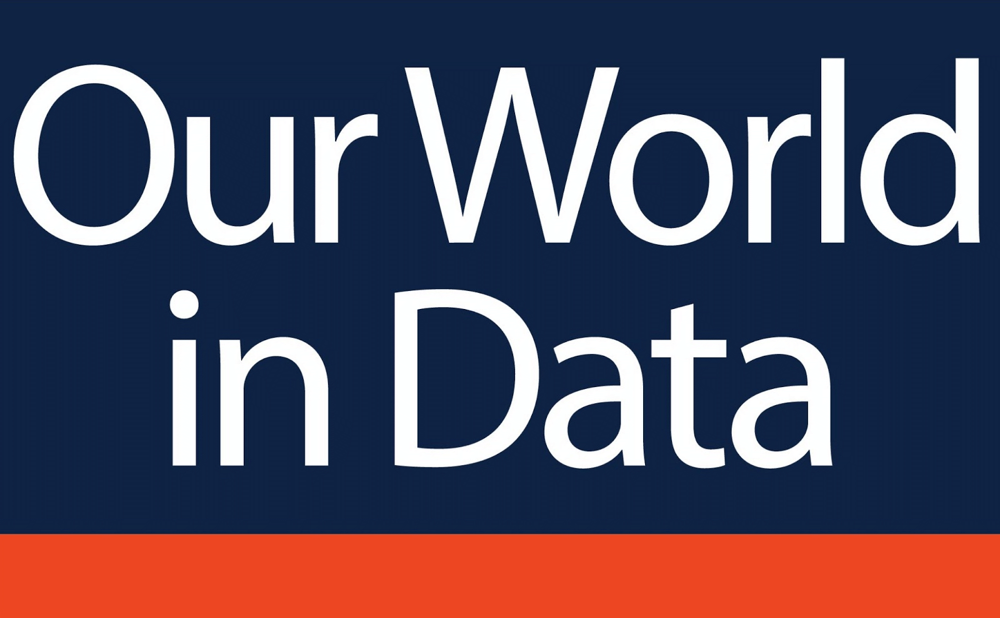
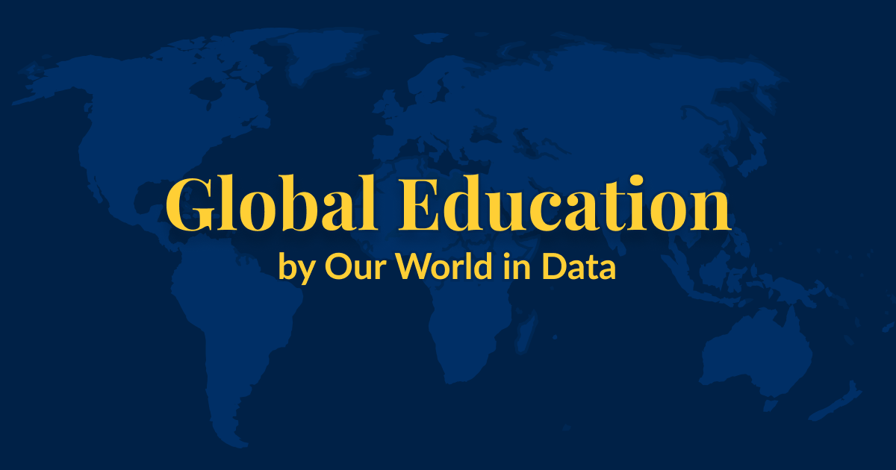
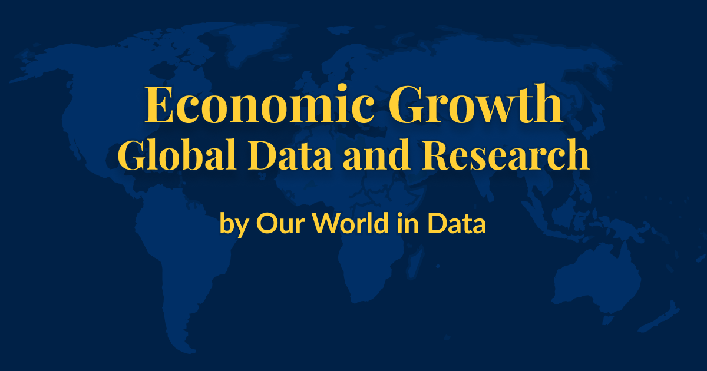
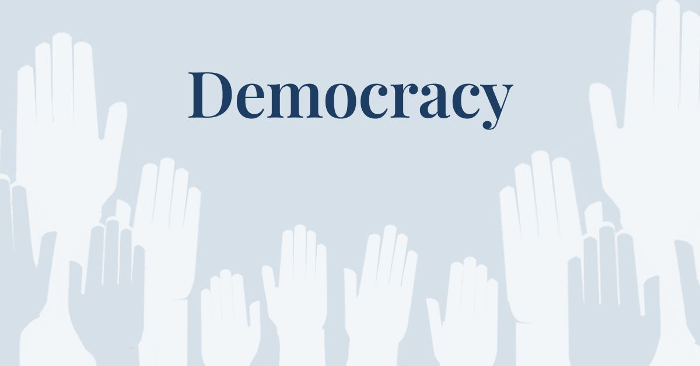

## Researchers have developed several indices that aim to capture human development. How do they work?  

研究人员开发了多种指数，旨在反映人类的发展。它们是如何工作的？

November 01, 2023  

2023 年 11 月 1 日

Measuring human development helps us understand how people’s lives and livelihoods vary across the world, and how they have changed over time.  

衡量人类发展有助于我们了解世界各地人们的生活和生计有何不同，以及随着时间的推移发生了怎样的变化。

There are several prominent measures that try to capture these changes:  

有几种著名的衡量标准试图反映这些变化：

-   The Human Development Index (HDI)  
    
    人类发展指数（HDI）
-   The Inequality-adjusted Human Development Index (IHDI)  
    
    不平等调整后人类发展指数（IHDI）
-   The Gender Development Index (GDI)  
    
    性别发展指数（GDI）
-   The Augmented Human Development Index (AHDI)  
    
    增强人类发展指数（AHDI）

The first three are published by the United Nations Development Programme.  

前三个由联合国开发计划署出版。  

The AHDI meanwhile is developed by the economic historian Leandro Prados de la Escosura.  

同时，AHDI 是由经济史学家 Leandro Prados de la Escosura 编制的。

All these measures seek to broaden the scope of development beyond simply economic growth, and to capture other key metrics that track peoples’ standards of living.  

所有这些衡量标准都试图扩大发展的范围，使其不仅仅局限于经济增长，还包括跟踪人民生活水平的其他关键指标。

But measuring human development comes with many challenges.  

但是，衡量人类发展也面临着许多挑战。  

People do not always agree on what should be included.  

人们并不总能就应包括哪些内容达成一致。  

And even once defined, features of human development are difficult to measure.  

而且，即使定义了人类发展的特征，也很难衡量。

So how do these indices track human development? And what can we learn from them?  

那么，这些指数是如何跟踪人类发展的？我们又能从中学到什么？

We summarize the similarities and differences between the different approaches in this article, and how to decide on which one to use.[<sup data-immersive-translate-effect="1" data-immersive_translate_walked="aaba0110-deb7-4404-8bc1-8dcca1ed0b27">1</sup>](https://ourworldindata.org/human-development-index#note-1)  

我们在本文中总结了不同方法之间的异同，以及如何决定使用哪种方法。 <sup data-immersive-translate-effect="1" data-immersive_translate_walked="aaba0110-deb7-4404-8bc1-8dcca1ed0b27">1</sup>

___

## The Human Development Index (HDI)  

人类发展指数（HDI）[](https://ourworldindata.org/human-development-index#the-human-development-index-hdi)

The Human Development Index is published by the United Nations Development Programme (UNDP).[<sup data-immersive-translate-effect="1" data-immersive_translate_walked="aaba0110-deb7-4404-8bc1-8dcca1ed0b27">2</sup>](https://ourworldindata.org/human-development-index#note-2) It is the most well-known index of human development.  

人类发展指数由联合国开发计划署（UNDP）发布。 <sup data-immersive-translate-effect="1" data-immersive_translate_walked="aaba0110-deb7-4404-8bc1-8dcca1ed0b27">2</sup> 它是最著名的人类发展指数。  

It is based on the idea that human development means that people have long and healthy lives, are knowledgeable, and have a decent standard of living.  

它基于这样一种理念，即人类发展意味着人们拥有健康长寿的生活、丰富的知识和体面的生活水平。

More specifically, these three dimensions are measured with four indicators:  

更具体地说，这三个方面用四个指标来衡量：

-   **A long and healthy life:** measured by [life expectancy at birth](https://ourworldindata.org/grapher/life-expectancy-undp)  
    
    健康长寿：以出生时的预期寿命衡量
-   **Knowledge:** measured by [expected years of schooling](https://ourworldindata.org/grapher/expected-years-of-schooling) (for children of school entering age) and [average years of schooling](https://ourworldindata.org/grapher/average-years-of-schooling) (for adults aged 25 and older)  
    
    知识：按预期受教育年限（入学年龄儿童）和平均受教育年限（25 岁及以上成人）衡量
-   **A decent standard of living:** measured by [Gross National Income (GNI) per capita](https://ourworldindata.org/grapher/gross-national-income-per-capita-undp)  
    
    体面的生活水准：以人均国民总收入（GNI）衡量

The index is then calculated by normalizing and aggregating these three indicators.  

然后通过对这三个指标进行归一化和汇总，计算出指数。  

First, the indicators are brought onto the same scale, ranging from 0 to 1. This is done by setting minimum and maximum values for each indicator[<sup data-immersive-translate-effect="1" data-immersive_translate_walked="aaba0110-deb7-4404-8bc1-8dcca1ed0b27">3</sup>](https://ourworldindata.org/human-development-index#note-3), and a country at or below the minimum value receiving a score of 0, and a country at or above the maximum value receiving a score of 1.[<sup data-immersive-translate-effect="1" data-immersive_translate_walked="aaba0110-deb7-4404-8bc1-8dcca1ed0b27">4</sup>](https://ourworldindata.org/human-development-index#note-4)  

首先，将各项指标纳入同一量表，从 0 到 1 不等。具体做法是为每项指标设定最小值和最大值 <sup data-immersive-translate-effect="1" data-immersive_translate_walked="aaba0110-deb7-4404-8bc1-8dcca1ed0b27">3</sup> ，位于或低于最小值的国家得 0 分，位于或高于最大值的国家得 1 分。 <sup data-immersive-translate-effect="1" data-immersive_translate_walked="aaba0110-deb7-4404-8bc1-8dcca1ed0b27">4</sup>

Second, the indicators are combined.  

其次，将各项指标合并。  

This is done by calculating the arithmetic mean of the knowledge indicators and then calculating the geometric mean across the three dimensions.[<sup data-immersive-translate-effect="1" data-immersive_translate_walked="aaba0110-deb7-4404-8bc1-8dcca1ed0b27">5</sup>](https://ourworldindata.org/human-development-index#note-5)  

具体方法是计算知识指标的算术平均数，然后计算三个维度的几何平均数。 <sup data-immersive-translate-effect="1" data-immersive_translate_walked="aaba0110-deb7-4404-8bc1-8dcca1ed0b27">5</sup>

The resulting HDI scores each country on a spectrum from 0 to 1. It covers almost all countries since 1990.[<sup data-immersive-translate-effect="1" data-immersive_translate_walked="aaba0110-deb7-4404-8bc1-8dcca1ed0b27">6</sup>](https://ourworldindata.org/human-development-index#note-6)  

由此得出的人类发展指数在 0 到 1 的范围内对每个国家进行评分。 <sup data-immersive-translate-effect="1" data-immersive_translate_walked="aaba0110-deb7-4404-8bc1-8dcca1ed0b27">6</sup>

In addition to the index itself, it is also used to [classify countries into groups](https://ourworldindata.org/grapher/human-development-index-groups) depending on how developed they are.  

除指数本身外，它还用于根据各国的发达程度将其分为不同的组别。

___

## The Inequality-Adjusted Human Development Index (IHDI)  

不平等调整后人类发展指数（IHDI）[](https://ourworldindata.org/human-development-index#the-inequality-adjusted-human-development-index-ihdi)

The UNDP also publishes the Inequality-Adjusted Human Development Index (IHDI).[<sup data-immersive-translate-effect="1" data-immersive_translate_walked="aaba0110-deb7-4404-8bc1-8dcca1ed0b27">7</sup>](https://ourworldindata.org/human-development-index#note-7)  

联合国开发计划署还公布了经不平等调整的人类发展指数（IHDI）。 <sup data-immersive-translate-effect="1" data-immersive_translate_walked="aaba0110-deb7-4404-8bc1-8dcca1ed0b27">7</sup>

It uses the same three principles of human development as the HDI: living a long and healthy life, being knowledgeable and having enough income to maintain a decent standard of living.  

它采用与人类发展指数相同的人类发展三原则：健康长寿、知识渊博和有足够的收入来维持体面的生活水平。

However, the IHDI acknowledges that [life expectancy](https://ourworldindata.org/grapher/inequality-in-life-expectancy), [education](https://ourworldindata.org/grapher/inequality-in-education), and [incomes](https://ourworldindata.org/grapher/income-inequality-atkinson-index-undp) differ within countries.  

不过，IHDI 承认各国的预期寿命、教育和收入各不相同。  

It does so by using additional data on inequality within countries in each dimension to discount the HDI’s average values.[<sup data-immersive-translate-effect="1" data-immersive_translate_walked="aaba0110-deb7-4404-8bc1-8dcca1ed0b27">8</sup>](https://ourworldindata.org/human-development-index#note-8)  

其方法是在每个维度上使用关于国家内部不平等的额外数据，以折算人类发展指数的平均值。 <sup data-immersive-translate-effect="1" data-immersive_translate_walked="aaba0110-deb7-4404-8bc1-8dcca1ed0b27">8</sup>

A country’s score on the IHDI therefore is the same as its HDI score if there was no inequality between people.  

因此，如果人与人之间不存在不平等，一个国家在综合人类发展指数上的得分与其在人类发展指数上的得分相同。  

The greater the inequality, the lower the IHDI relative to the HDI.  

相对于人类发展指数，不平等程度越高，IHDI 就越低。

The IHDI also ranges from 0 to 1 and covers almost all countries since 2010.  

国际人类发展指数的范围也从 0 到 1，自 2010 年以来几乎涵盖了所有国家。

___

## The Gender Development Index (GDI)  

性别发展指数（GDI）[](https://ourworldindata.org/human-development-index#the-gender-development-index-gdi)

The UNDP also publishes the Gender Development Index (GDI).[<sup data-immersive-translate-effect="1" data-immersive_translate_walked="aaba0110-deb7-4404-8bc1-8dcca1ed0b27">9</sup>](https://ourworldindata.org/human-development-index#note-9)  

联合国开发计划署还公布了性别发展指数（GDI）。 <sup data-immersive-translate-effect="1" data-immersive_translate_walked="aaba0110-deb7-4404-8bc1-8dcca1ed0b27">9</sup>

It characterizes human development just like the HDI and the IHDI, but it acknowledges that [life expectancy](https://ourworldindata.org/grapher/life-expectancy-males-vs-females), [expected](https://ourworldindata.org/grapher/expected-years-of-schooling-males-vs-females) and [average](https://ourworldindata.org/grapher/average-years-of-schooling-males-vs-females) access to education, and [income](https://ourworldindata.org/grapher/gross-national-income-per-capita-males-vs-females) differ between men and women.  

与人类发展指数和国际人类发展指数一样，该指数也描述了人类发展的特点，但它承认男女之间在预期寿命、预期和平均受教育机会以及收入方面存在差异。

It uses gender-specific data across three dimensions (such as incomes for men and women) to calculate HDIs for men and women separately.[<sup data-immersive-translate-effect="1" data-immersive_translate_walked="aaba0110-deb7-4404-8bc1-8dcca1ed0b27">10</sup>](https://ourworldindata.org/human-development-index#note-10)  

它使用三个维度（如男性和女性的收入）的性别数据，分别计算男性和女性的人类发展指数。 <sup data-immersive-translate-effect="1" data-immersive_translate_walked="aaba0110-deb7-4404-8bc1-8dcca1ed0b27">10</sup>

The GDI is the ratio of the female HDI to the male HDI.  

全球人类发展指数是女性人类发展指数与男性人类发展指数之比。  

Values below 1 indicate higher human development for men than women, while values above 1 indicate the opposite.  

低于 1 表示男性的人类发展水平高于女性，高于 1 则表示相反。  

Values closer to 1 therefore indicate higher gender equality.  

因此，接近 1 的数值表示性别平等程度较高。

It covers almost all countries since 1990.  

该指数涵盖了自 1990 年以来的几乎所有国家。

In addition to the index itself, it is also used to [classify countries into groups](https://ourworldindata.org/grapher/gender-development-index-groups) depending on how gender-equal they are.  

除了指数本身，它还用于根据国家的性别平等程度将其分为不同的组别。

___

## The Augmented Human Development Index (AHDI)  

增强人类发展指数（AHDI）[](https://ourworldindata.org/human-development-index#the-augmented-human-development-index-ahdi)

The Augmented Human Development Index (AHDI) is produced by the economic historian Leandro Prados de la Escosura.[<sup data-immersive-translate-effect="1" data-immersive_translate_walked="aaba0110-deb7-4404-8bc1-8dcca1ed0b27">11</sup>](https://ourworldindata.org/human-development-index#note-11) It gives a more historical perspective on human development by covering countries earlier in time.[<sup data-immersive-translate-effect="1" data-immersive_translate_walked="aaba0110-deb7-4404-8bc1-8dcca1ed0b27">12</sup>](https://ourworldindata.org/human-development-index#note-12)  

增强人类发展指数（AHDI）由经济史学家莱安德罗-普拉多斯-德拉埃斯科苏拉编制。 <sup data-immersive-translate-effect="1" data-immersive_translate_walked="aaba0110-deb7-4404-8bc1-8dcca1ed0b27">11</sup> 它从更早的时间涵盖更多的国家，从而提供了人类发展的历史视角。 <sup data-immersive-translate-effect="1" data-immersive_translate_walked="aaba0110-deb7-4404-8bc1-8dcca1ed0b27">12</sup>

Like the HDI, the AHDI characterizes human development as people having long and healthy lives, being knowledgeable, and having a decent standard of living.  

与人类发展指数一样，人类发展指数将人类发展描述为人们拥有健康长寿的生活、丰富的知识和体面的生活水平。  

But AHDI adds a fourth dimension — civil and political freedom — and is based on slightly different indicators:  

但人类发展指数增加了第四个维度--公民和政治自由，其指标也略有不同：

-   **A long and healthy life:** measured by [life expectancy at birth](https://ourworldindata.org/grapher/life-expectancy-prados-de-la-escosura)  
    
    健康长寿：以出生时的预期寿命衡量
-   **Knowledge:** measured by [average years of primary, secondary, and tertiary schooling](https://ourworldindata.org/grapher/years-of-schooling-prados-de-la-escosura) (for people aged 15 and older)  
    
    知识：按小学、中学和大学平均受教育年限衡量（15 岁及以上人口）
-   **A decent standard of living:** measured by [Gross Domestic Product (GDP) per capita](https://ourworldindata.org/grapher/gdp-per-capita-prados-de-la-escosura)  
    
    体面的生活水准：以人均国内生产总值（GDP）衡量
-   **Civil and political freedom:** measured by the [Varieties of Democracy’s Liberal Democracy Index](https://ourworldindata.org/vdem-electoral-democracy-data)  
    
    公民和政治自由：以 "民主多样性 "的 "自由民主指数 "衡量

The index is again the result of normalizing and aggregating the specific indicators.[<sup data-immersive-translate-effect="1" data-immersive_translate_walked="aaba0110-deb7-4404-8bc1-8dcca1ed0b27">13</sup>](https://ourworldindata.org/human-development-index#note-13)  

该指数也是对具体指标进行归一化和汇总的结果。 <sup data-immersive-translate-effect="1" data-immersive_translate_walked="aaba0110-deb7-4404-8bc1-8dcca1ed0b27">13</sup>

First, the indicators are brought onto the same scale from 0 to 1. But after setting minimum and maximum values for each indicator[<sup data-immersive-translate-effect="1" data-immersive_translate_walked="aaba0110-deb7-4404-8bc1-8dcca1ed0b27">14</sup>](https://ourworldindata.org/human-development-index#note-14), life expectancy and education are normalized logarithmically.[<sup data-immersive-translate-effect="1" data-immersive_translate_walked="aaba0110-deb7-4404-8bc1-8dcca1ed0b27">15</sup>](https://ourworldindata.org/human-development-index#note-15) This is done because Prados de la Escosura considers development at already high levels a bigger achievement, and because he sees these quantitative improvements as associated with higher quality.  

首先，将各项指标置于同一量表中，从 0 到 1。但在为每项指标设定了最小值和最大值之后 <sup data-immersive-translate-effect="1" data-immersive_translate_walked="aaba0110-deb7-4404-8bc1-8dcca1ed0b27">14</sup> ，预期寿命和教育就按对数标准化了。 <sup data-immersive-translate-effect="1" data-immersive_translate_walked="aaba0110-deb7-4404-8bc1-8dcca1ed0b27">15</sup> 之所以这样做，是因为 Prados de la Escosura 认为，已经达到较高水平的发展是一项更大的成就，而且他认为这些数量上的改进与更高的质量相关。

Second, the indicators are combined in the same way as the HDI by calculating the geometric mean across the four dimensions.[<sup data-immersive-translate-effect="1" data-immersive_translate_walked="aaba0110-deb7-4404-8bc1-8dcca1ed0b27">16</sup>](https://ourworldindata.org/human-development-index#note-16)  

其次，通过计算四个维度的几何平均数，以与人类发展指数相同的方式对各项指标进行合并。 <sup data-immersive-translate-effect="1" data-immersive_translate_walked="aaba0110-deb7-4404-8bc1-8dcca1ed0b27">16</sup>

The resulting AHDI scores each country on a spectrum from 0 to 1.  

由此得出的人类发展指数在 0 到 1 的范围内对每个国家进行评分。

It covers most countries since 1870 and almost all since 1950.  

它涵盖了 1870 年以来的大多数国家和 1950 年以来的几乎所有国家。

The following chart shows that for the years where they overlap, the HDI and AHDI are closely associated, with countries that score high on one index also scoring high on the other.  

下图显示，在两者重叠的年份，人类发展指数和非洲人类发展指数密切相关，在一个指数上得分高的国家在另一个指数上得分也高。  

AHDI tends to give lower scores though, and the differences are biggest for countries with low scores on both indices.  

不过，非洲人类发展指数的得分往往较低，在两个指数上得分都低的国家差异最大。

___

## What can we learn from these indices?  

我们能从这些指数中学到什么？[](https://ourworldindata.org/human-development-index#what-can-we-learn-from-these-indices)

Whether the Human Development Index and related measures are useful to better understand human development will depend on the questions we want to answer.  

人类发展指数及相关衡量标准是否有助于更好地了解人类发展，取决于我们想要回答的问题。

If we want a general overview of people’s health, education, and living standards, we can learn much from this data.  

如果我们想了解人们的健康、教育和生活水平的总体情况，我们可以从这些数据中学到很多东西。

The indices are particularly useful for identifying countries with better or worse human development than we would expect based purely on their level of economic development.  

这些指数尤其有助于确定哪些国家的人类发展水平高于或低于我们单纯根据其经济发展水平所预期的水平。

For example, the next chart compares a standard measure of economic development, GDP per capita, to the HDI.  

例如，下图将衡量经济发展的标准--人均国内生产总值与人类发展指数进行了比较。  

Looking for countries far from the diagonal helps us identify those that fare worse than expected based only on their economic development, or those that do better than expected.  

寻找远离对角线的国家可以帮助我们确定哪些国家的经济发展状况比预期的要差，哪些国家的经济发展状况比预期的要好。

As another example, the following chart compares the HDI to the GDI.  

再比如，下图比较了人类发展指数和全球发展指数。  

We again see that some countries do relatively worse when accounting for gender differences (such as Iran and Pakistan).  

我们再次看到，在考虑性别差异的情况下，一些国家的情况相对较差（如伊朗和巴基斯坦）。  

In contrast, others do relatively better due to more gender-equal outcomes (such as Brazil and the Philippines).  

相比之下，另一些国家由于性别平等的结果更多，所以表现相对更好（如巴西和菲律宾）。

Which specific index we should use depends on the questions we have.  

我们应该使用哪种具体指数取决于我们的问题。

If we are interested in a country’s general human development, we can use the HDI.  

如果我们对一个国家的总体人类发展情况感兴趣，我们可以使用人类发展指数。

If we want to account for inequalities within countries, we should use the IHDI; if we are interested in gender differences specifically, the GDI is best.  

如果我们想了解国家内部的不平等情况，我们应该使用 IHDI；如果我们对性别差异特别感兴趣，最好使用 GDI。

And if we are interested in long-term trends and want to consider people’s civil and political freedoms, the AHDI is best.  

如果我们对长期趋势感兴趣，并希望考虑人民的公民自由和政治自由，则最好使用 AHDI。

For these general and specific strengths, we provide the Human Development Index and its related measures on our site.  

针对这些一般和特殊优势，我们在网站上提供了人类发展指数及其相关衡量标准。

The indices, however, will not give us a satisfying answer if we are interested in other aspects of human development, such as environmental sustainability or human security.  

然而，如果我们对人类发展的其他方面，如环境可持续性或人类安全感兴趣，这些指数就不能给我们一个满意的答案。  

They also will not satisfy us if we are interested in indicators with easy-to-understand scores.  

如果我们对易于理解的分数指标感兴趣，指数也不会让我们满意。

In these cases, it is best to look at more specific indicators.  

在这种情况下，最好是研究更具体的指标。

## Interactive Charts on the Human Development Index  

人类发展指数互动图表[](https://ourworldindata.org/human-development-index#all-charts)

## Keep reading on Our World in Data  

继续阅读 我们的数据世界[](https://ourworldindata.org/human-development-index#keep-reading-on-our-world-in-data)

[

### Life expectancy topic page  

预期寿命专题页面

Data and research on life expectancy.  

有关预期寿命的数据和研究。](https://ourworldindata.org/life-expectancy)[

### Global Education  

全球教育

See all our data, visualizations, and writing on global education.  

查看我们有关全球教育的所有数据、可视化资料和文章。](https://ourworldindata.org/global-education)[

### Economic Growth  

经济增长

See all our data, visualizations, and writing on Economic Growth.  

查看我们有关经济增长的所有数据、可视化资料和文章。](https://ourworldindata.org/economic-growth)[

### Democracy  

民主

How has democracy spread across countries? Are we moving towards a more democratic world?  

民主是如何在各国传播的？我们是否正在迈向一个更加民主的世界？  

Explore global data and research on democracy.  

探索有关民主的全球数据和研究。](https://ourworldindata.org/democracy)

## Acknowledgements  

致谢[](https://ourworldindata.org/human-development-index#acknowledgements)

We thank Saloni Dattani, Joe Hasell, Edouard Mathieu, Hannah Ritchie, and Max Roser for their very helpful comments and ideas about how to improve this article.  

我们感谢 Saloni Dattani、Joe Hasell、Edouard Mathieu、Hannah Ritchie 和 Max Roser 就如何改进本文提出的非常有帮助的意见和想法。

### Endnotes  

结束语

1.  The summary and discussion draw on:  
    
    摘要和讨论借鉴了
    
    Prados de la Escosura, Leandro. 2023. [Augmented Human Development Index. Concept, Sources and Procedures](https://frdelpino.es/investigacion/wp-content/uploads/2023/02/human-development-index.pdf).  
    
    Prados de la Escosura, Leandro.2023.增强的人类发展指数。Concept, Sources and Procedures.
    
    United Nations Development Programme. 2023. [Gender Development Index](https://hdr.undp.org/gender-development-index#/indicies/GDI).  
    
    联合国开发计划署。2023.性别发展指数。
    
    United Nations Development Programme. 2023. [Human Development Index (HDI)](https://hdr.undp.org/data-center/human-development-index).  
    
    联合国开发计划署。2023.人类发展指数（HDI）。
    
    United Nations Development Programme. 2023. [Inequality-Adjusted Human Development Index (IHDI)](https://hdr.undp.org/inequality-adjusted-human-development-index).  
    
    联合国开发计划署。2023.经不平等调整的人类发展指数（IHDI）。
    
    United Nations Development Programme. 2023. [Technical notes](https://hdr.undp.org/system/files/documents/technical-notes-calculating-human-development-indices.pdf).  
    
    联合国开发计划署。2023.技术说明。
    
2.  United Nations Development Programme. 2023. [Human Development Index (HDI)](https://hdr.undp.org/data-center/human-development-index).  
    
    联合国开发计划署。2023.人类发展指数（HDI）。
    
3.  The minimum and maximum values are:  
    
    最小值和最大值分别为
    
    -   Life expectancy: 20 years minimum, 85 years maximum  
        
        预期寿命：最低 20 岁，最高 85 岁
    -   Expected years of schooling: 0 years minimum, 18 years maximum (equivalent to a master’s degree in most countries)  
        
        预期受教育年限：最少 0 年，最多 18 年（相当于大多数国家的硕士学位）
    -   Mean years of schooling: 0 years minimum, 15 years maximum  
        
        平均受教育年限：最少 0 年，最多 15 年
    -   Gross National Income per capita: $100 minimum, $75,000 maximum (in 2017 Purchasing-Power-Parity international-$, logarithmized to reflect that incomes become less important as they increase).  
        
        人均国民总收入：最低 100 美元，最高 75,000 美元（按 2017 年购买力平价国际美元计算，对数化以反映收入越高越不重要）。
4.  The precise formula is:  
    
    精确的计算公式是
    
    Normalized indicator = (actual value – minimum value) / (maximum value – minimum value)  
    
    归一化指标 = （实际值 - 最小值）/ （最大值 - 最小值）
    
5.  The formula is:  
    
    计算公式为
    
    HDI = (Health Index \* Education Index \* Income Index)^(⅓)  
    
    人类发展指数 = (健康指数 \* 教育指数 \* 收入指数)^(⅓)
    
6.  Information from other countries is used to estimate a missing indicator’s values for a few country-years.  
    
    使用其他国家的信息来估算缺失指标在几个国家年份的数值。
    
7.  United Nations Development Programme. 2023. [Inequality-Adjusted Human Development Index (IHDI)](https://hdr.undp.org/inequality-adjusted-human-development-index).  
    
    联合国开发计划署。2023.不平等调整后人类发展指数（IHDI）。
    
8.  The formula is:  
    
    计算公式为
    
    Normalized, inequality-adjusted indicator = Normalized indicator \* (1 – geometric mean of the indicator’s distribution / arithmetic mean of its distribution)  
    
    归一化不平等调整指标 = 归一化指标 \* (1 - 指标分布的几何平均数 / 指标分布的算术平均数)
    
9.  United Nations Development Programme. 2023. [Gender Development Index](https://hdr.undp.org/gender-development-index#/indicies/GDI).  
    
    联合国开发计划署。2023.性别发展指数。
    
10.  The UNDP presumes a five-year biological advantage for women, and therefore uses different minimum and maximum values:  
    
    联合国开发计划署假定妇女有五年的生理优势，因此使用了不同的最小值和最大值：
    
    -   Life expectancy for men: 17.5 years minimum, 82.5 years maximum  
        
        男性预期寿命：最低 17.5 岁，最高 82.5 岁
    -   Life expectancy for women: 22.5 minimum, 87.5 maximum  
        
        妇女预期寿命：最低 22.5 岁，最高 87.5 岁
    
    The gender gap in life expectancy, however, [varies around the world and has changed over time](https://ourworldindata.org/why-do-women-live-longer-than-men).  
    
    然而，预期寿命的性别差距在世界各地各不相同，并随着时间的推移而发生变化。
    
11.  Prados de la Escosura, Leandro. 2023. [Augmented Human Development Index. Concept, Sources and Procedures](https://frdelpino.es/investigacion/wp-content/uploads/2023/02/human-development-index.pdf).  
    
    Prados de la Escosura, Leandro.2023.增强的人类发展指数。概念、来源和程序》。
    
12.  It replaces the earlier Historical Index of Human Development (HIHD).  
    
    它取代了早期的人类发展历史指数（HIHD）。
    
13.  It also entails some imputation, as one of the indicators is missing for some country-years.  
    
    由于某些国家年份的一项指标缺失，该指数还需要进行一些估算。  
    
    Prados de la Escosura uses information from neighboring countries or similar indicators to estimate the missing indicator’s values.  
    
    Prados de la Escosura 利用邻国或类似指标的信息来估算缺失指标的数值。
    
14.  The minimum and maximum values are:  
    
    最小值和最大值分别为
    
    -   Life expectancy: 20 years minimum, 85 years maximum  
        
        预期寿命：最低 20 岁，最高 85 岁
    -   School years: 0 years minimum, 15 years maximum  
        
        学年：最少 0 年，最多 15 年
    -   Liberal democracy index: 0 minimum, 1 maximum  
        
        自由民主指数：最低为 0，最高为 1
    -   Gross Domestic Product per capita: $100 minimum, $47,000 maximum ([international-$](https://ourworldindata.org/what-are-ppps) at 1990 prices, logarithmized to reflect that additional income becomes less important as it increases).  
        
        人均国内生产总值：最低 100 美元，最高 47,000 美元（按 1990 年价格计算的国际美元，对数化以反映额外收入越多越不重要）。
15.  The precise formula is:  
    
    精确的计算公式是
    
    Normalized indicator = (log(maximum value – minimum value) – log(maximum value – actual value)) / log(maximum value – minimum value)  
    
    归一化指标 = (log(maximum value - minimum value) - log(maximum value - actual value))/对数（最大值 - 最小值）
    
    GDP per capita (logarithmized) and the liberal democracy index are still transformed linearly, analogously to HDI’s normalization.  
    
    人均国内生产总值（对数化）和自由民主指数仍采用线性变换，类似于人类发展指数的正态化。
    
16.  The precise formula is:  
    
    精确公式如下
    
    AHDI = (Health Index \* Education Index \* Income Index \* Freedom Index)^(¼)  
    
    AHDI = (健康指数 \* 教育指数 \* 收入指数 \* 自由指数)^(¼)
    
    The geometric mean is used such that high scores in one index cannot readily make up for low scores in other dimensions.  
    
    使用几何平均数的目的是使某一指数的高分不能轻易弥补其他方面的低分。
    

### Cite this work  

引用本作品

Our articles and data visualizations rely on work from many different people and organizations.  

我们的文章和数据可视化依赖于许多不同人员和组织的工作。  

When citing this article, please also cite the underlying data sources.  

引用本文时，请同时引用基础数据来源。  

This article can be cited as:  

本文可引用为

```
Bastian Herre and Pablo Arriagada (2023) - “The Human Development Index and related indices: what they are and what we can learn from them” Published online at OurWorldInData.org. Retrieved from: 'https://ourworldindata.org/human-development-index' [Online Resource]
```

BibTeX citation  

BibTeX 引用

```
@article{owid-human-development-index,
    author = {Bastian Herre and Pablo Arriagada},
    title = {The Human Development Index and related indices: what they are and what we can learn from them},
    journal = {Our World in Data},
    year = {2023},
    note = {https://ourworldindata.org/human-development-index}
}
```


### Reuse this work freely  

自由使用本作品

All visualizations, data, and code produced by Our World in Data are completely open access under the [Creative Commons BY license](https://creativecommons.org/licenses/by/4.0/).  

我们的数据世界 "制作的所有可视化、数据和代码均根据知识共享 BY 许可完全开放。  

You have the permission to use, distribute, and reproduce these in any medium, provided the source and authors are credited.  

您有权在任何媒体上使用、分发和复制这些内容，但必须注明出处和作者。

The data produced by third parties and made available by Our World in Data is subject to the license terms from the original third-party authors.  

由第三方制作并由 "我们的数据世界 "提供的数据受第三方原作者许可条款的约束。  

We will always indicate the original source of the data in our documentation, so you should always check the license of any such third-party data before use and redistribution.  

我们始终会在文档中注明数据的原始出处，因此您在使用和重新分发任何此类第三方数据之前，应始终检查其许可证。

All of [our charts can be embedded](https://ourworldindata.org/how-to-use-our-world-in-data#how-to-embed-interactive-charts-in-your-article) in any site.  

我们的所有图表均可嵌入任何网站。
