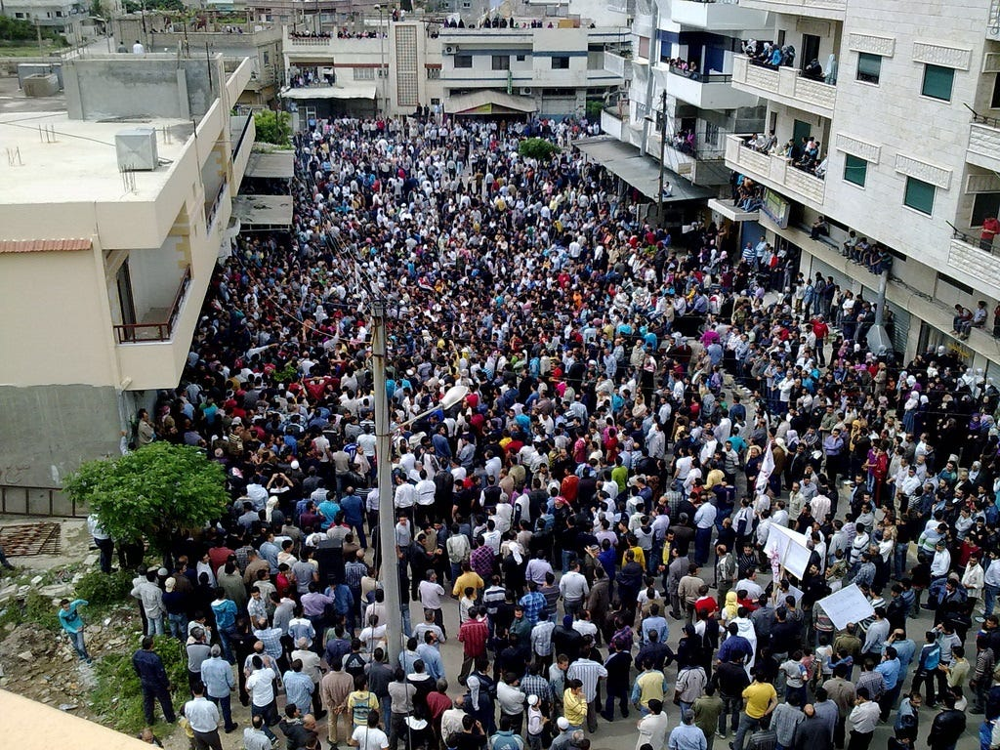
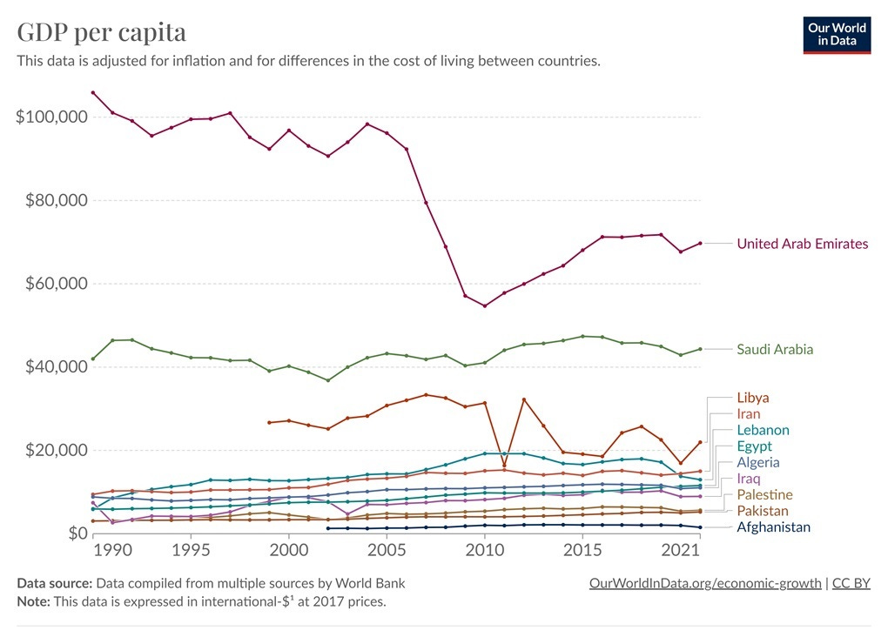
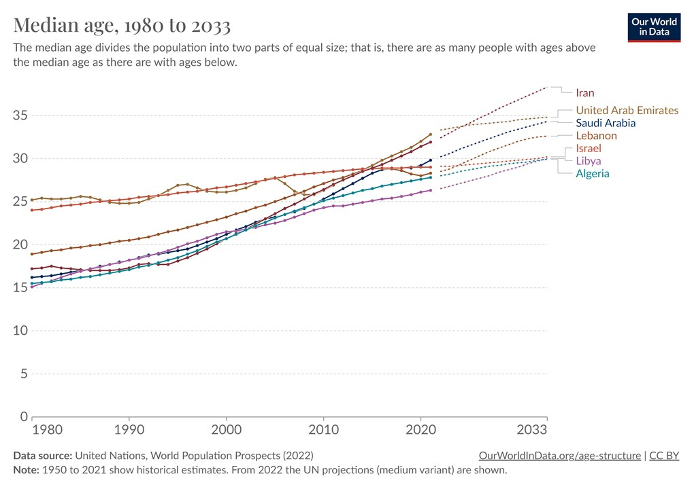
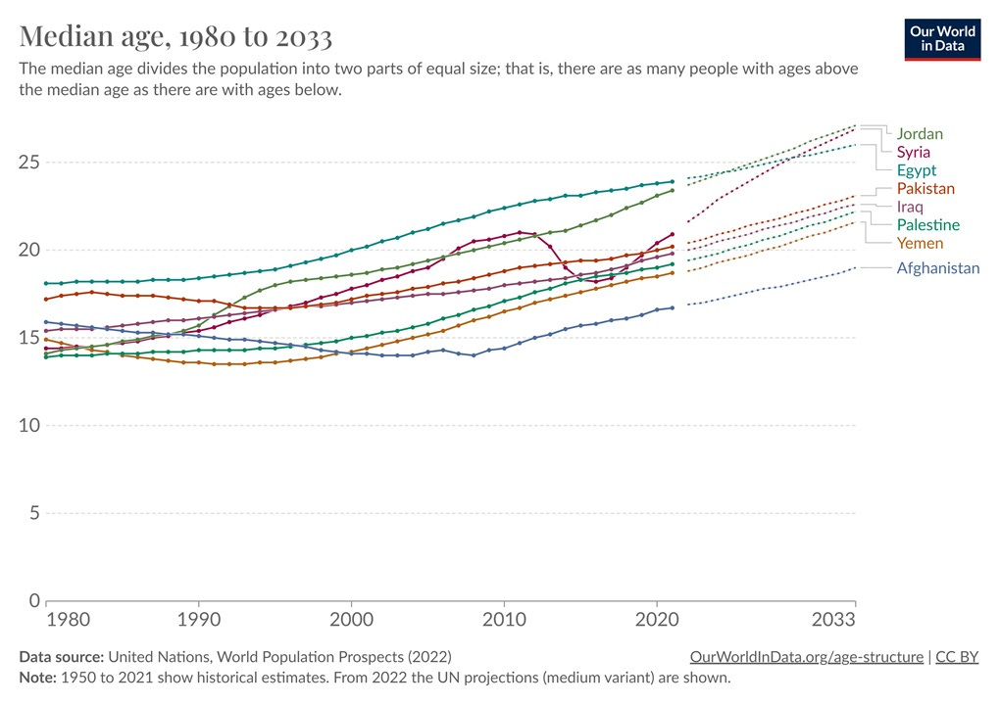
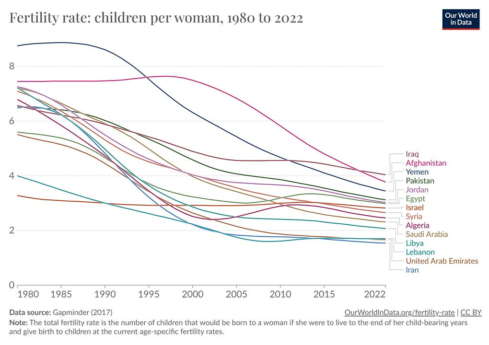

By [Syria-Frames-Of-Freedom](https://commons.wikimedia.org/w/index.php?curid=17138401) (Pro-FSA information) - \[1\], CC BY 2.0  

由 Syria-Frames-Of-Freedom (Pro-FSA information) - \[1\], CC BY 2.0 提供

I noticed something interesting about the Israel-Gaza war that seems to have generally been overlooked: The war hasn’t shown much sign of spreading throughout the Middle East.  

我注意到关于以色列-加沙战争的一些有趣现象，而这些现象似乎普遍被忽视了：这场战争并没有在整个中东地区蔓延的迹象。  

Yemen’s Houthis (one of Iran’s proxy militias) launched a few missiles in the general direction of Israel and bellowed [a declaration of war](https://www.aljazeera.com/features/2023/11/2/analysis-houthis-declare-war-on-israel-but-their-real-target-is-elsewhere), but no one seems very concerned.  

Hezbollah, the Lebanese militia that fought Israel to a standstill in 2006, has也门胡塞武装（伊朗的代理民兵组织之一）向以色列发射了几枚导弹，并大声宣战，但似乎没有人对此十分关注。 [chosen to stay out](https://www.telegraph.co.uk/world-news/2023/11/03/hassan-nasrallah-hezbollah-speech-oct-7-hamas-iran-israel/) of the conflict, as has Iran itself.  

The “Arab street” that everyone feared back in the early 2000s has certainly had protests in support of the Palestinians, but曾在 2006 年与以色列打得不可开交的黎巴嫩民兵真主党选择了置身事外，伊朗本身也是如此。 [they’ve been very peaceful](https://carnegieendowment.org/2023/11/01/pay-attention-to-arab-public-response-to-israel-hamas-war-pub-90893). Saudi Arabia has said that [it still wants to normalize relations](https://www.axios.com/2023/10/31/saudi-megadeal-normalization-israel-biden) with Israel, conditional on a ceasefire.  

本世纪初人人惧怕的 "阿拉伯街头 "当然也有支持巴勒斯坦人的抗议活动，但都非常和平。沙特阿拉伯表示，它仍然希望与以色列实现关系正常化，条件是实现停火。

This is a very good sign, and it’s far from the dire expectations that everyone was throwing around in the first few days of the war.  

这是一个非常好的迹象，与战争爆发最初几天大家的悲观预期相去甚远。  

In 2011, the Arab Spring spread like wildfire, igniting huge, lengthy, bloody wars in Syria and Yemen, as well as various smaller wars throughout the Middle East; the Israel-Gaza war shows no sign of repeating this history.  

2011 年，"阿拉伯之春 "如野火般蔓延，在叙利亚和也门引发了大规模、旷日持久的血腥战争，中东各地也爆发了各种规模较小的战争。

There could be lots of reasons for this, of course.  

当然，这可能有很多原因。  

The region may simply be exhausted after two decades of wars. [U.S. deterrence](https://taskandpurpose.com/news/two-navy-aircraft-carriers-mediterranean/) may be restraining Iran’s hand and the hand of its proxies.  

The Israel-Palestine conflict may simply not be as important to the region as the longer-term cold war between Iran and Saudi Arabia. Etc.  

以巴冲突对该地区的重要性可能还不如伊朗和沙特阿拉伯之间的长期冷战。等等。  

经过二十年的战争，该地区可能已经筋疲力尽。美国的威慑力量可能会牵制伊朗及其代理人的手。

But I think it’s also possible that population aging has something to do with it.  

但我认为，人口老龄化也可能与此有关。  

There’s a pretty well-established literature linking youthful population bulges to elevated risk of conflict.  

有相当成熟的文献将年轻人口膨胀与冲突风险升高联系在一起。  

Of course, that link is just a correlation — it’s obviously hard to find natural experiments that change a country’s age structure, other than war itself.  

当然，这种联系只是一种相关性--除了战争本身，显然很难找到改变一个国家年龄结构的自然实验。  

But it’s a fairly well-established correlation. For example, [Cincotta and Weber (2021)](https://link.springer.com/chapter/10.1007/978-3-030-73065-9_3) find that countries with a median age of 25 or less are much more likely to have revolutions:  

但这是一种相当成熟的相关性。例如，Cincotta 和 Weber（2021 年）发现，年龄中位数在 25 岁或以下的国家更有可能发生革命：

[Urdal (2006)](https://academic.oup.com/isq/article/50/3/607/1800827?login=false) finds:  

Urdal (2006) 发现

> It has frequently been suggested that…the so-called “youth bulges,” make countries more susceptible to political violence…This claim is empirically tested in a time-series cross-national statistical model for internal armed conflict for the period 1950–2000, and for event data for terrorism and rioting for the years 1984–1995. The expectation that youth bulges should increase the risk of political violence receives robust support for all three forms of violence.  
> 
> 人们经常认为......所谓的 "青年人口暴增 "会使国家更容易受到政治暴力的影响......在 1950-2000 年国内武装冲突的时间序列跨国统计模型以及 1984-1995 年恐怖主义和骚乱的事件数据中，对这一说法进行了实证检验。在所有三种暴力形式中，"青年人口膨胀会增加政治暴力的风险 "这一预期都得到了有力的支持。

[Madsen (2021)](https://www.cfr.org/report/family-planning-strategic-focus-us-foreign-policy) writes:  

马德森（2021 年）写道：

> Evidence from the 1990s reveals that countries where people aged fifteen to twenty-nine made up more than 40 percent of the adult population were twice as likely to suffer civil conflict.  
> 
> 20 世纪 90 年代的证据显示，15 至 29 岁人口占成年人口 40% 以上的国家发生国内冲突的可能性是其他国家的两倍。  
> 
> Between 1970 and 2007, 80 percent of all outbreaks of civil conflict occurred in countries in which at least 60 percent of the population was younger than thirty…Only a few of these countries are rated as democracies, and restrictions on political freedoms, corruption, and weak institutional capacity are also common.  
> 
> 1970 年至 2007 年间，80% 的国内冲突爆发发生在至少 60% 的人口年龄在 30 岁以下的国家......这些国家中只有少数被评为民主国家，政治自由受限、腐败和机构能力薄弱的情况也很普遍。  
> 
> Data collected from 1950 to 2000 found that countries where 35 percent or more of their adult populations comprised people aged fifteen to twenty-four were 150 percent more likely to experience an outbreak of civil conflict.  
> 
> 从 1950 年到 2000 年收集的数据发现，15 至 24 岁人口占成年人口 35% 或以上的国家爆发国内冲突的可能性要高出 150%。  
> 
> The correlation is strongest in the case of countries with consistently high fertility rates.  
> 
> 在生育率持续偏高的国家，这种相关性最强。  
> 
> Once the demographic transition is fully under way, outbreaks of conflict are less likely, even though populations remain youthful due to demographic momentum from past high levels of fertility.  
> 
> 一旦人口结构转型全面铺开，爆发冲突的可能性就会降低，尽管由于过去高生育率所带来的人口发展势头，人口依然年轻。

[Ibrahim (2019)](https://erf.org.eg/app/uploads/2019/06/1310.pdf) and others find similar results. As always, there are [critics of the theory](https://www.newsecuritybeat.org/2018/04/age-structure-intra-state-conflict-imagined/), and some authors make distinctions based on different types of conflicts — for example, [Yair and Midownik (2014)](https://www.researchgate.net/profile/Dan-Miodownik/publication/265650970_Youth_bulge_and_civil_war_Why_a_country's_share_of_young_adults_explains_only_non-ethnic_wars/links/5ad50cf9a6fdcc2935809baa/Youth-bulge-and-civil-war-Why-a-countrys-share-of-young-adults-explains-only-non-ethnic-wars.pdf) claim that youth bulges are less relevant for “ethnic wars”, while Cincotta and Weber (2021) caution that their results are harder to test for “separatist” wars.  

But be that as it may, the general consensus in the field seems to be that a very young population is correlated with instability and violence.  

不过，尽管如此，该领域的普遍共识似乎是，非常年轻的人口与不稳定和暴力有关。  

Ibrahim（2019）等人也发现了类似的结果。与往常一样，该理论也有批评者，一些作者根据不同类型的冲突进行了区分--例如，Yair 和 Midownik（2014 年）声称，青年人口暴增与 "种族战争 "的相关性较低，而 Cincotta 和 Weber（2021 年）则提醒说，他们的结果较难检验 "分裂主义 "战争。

There are various theories as to why youth bulges might cause conflict.  

关于青年人口暴增可能引发冲突的原因，有各种理论。  

Resource scarcity is an obvious factor in very poor countries.  

在非常贫穷的国家，资源匮乏是一个明显的因素。  

In other countries, there’s a theory that a youth bulge leads to fewer economic and social opportunities for young people — basically, the young people crowd each other out, and this makes them mad.  

在其他国家，有一种理论认为，青年人口暴增导致年轻人的经济和社会机会减少--基本上，年轻人互相排挤，这让他们变得疯狂。  

This effect is obviously exacerbated when the economy is stagnating.  

当经济停滞不前时，这种影响显然会加剧。  

Also, simply having a lot of young men around without much to lose seems like a risk factor in and of itself.  

此外，仅仅是有很多年轻人在身边却没有什么损失，这本身似乎就是一个风险因素。

The Middle East’s stagnant economies are obviously a factor in the violence that has ripped across the region (though of course there’s clearly two-way causation there).  

中东地区的经济停滞显然是导致暴力横行的一个因素（当然这显然是双向因果关系）。  

Whether rich or poor, the countries in the Greater Middle East — I’ll throw Afghanistan and Pakistan into the mix, since they’ve also been a big locus of conflict — just don’t tend to experience much economic growth at all.  

无论是富国还是穷国，大中东地区的国家--我把阿富汗和巴基斯坦也算上，因为这两个国家也是冲突的重灾区--的经济增长都不太理想。

But the good news here, at least from a conflict-avoidance perspective, is that these countries are getting steadily older.  

但好消息是，至少从避免冲突的角度来看，这些国家的年龄正在稳步增长。  

There are a number of countries in the region where median age has already passed the 25-year mark:  

该地区有许多国家的中位年龄已经超过了 25 岁：

It’s pretty startling to look at this chart and realize how much things have changed.  

看了这张图表，我们会惊奇地发现，事情已经发生了巨大的变化。  

When Iran threw hundreds of thousands of soldiers against Iraq in “[human wave](https://en.wikipedia.org/wiki/Operation_Ramadan)” attacks in the 1980s, the median Iranian was just 17 years old; now, the median Iranian is in their early 30s.  

That may be one reason Iran has moved away from direct belligerence and toward the use of proxy militias like the Houthis, Hezbollah, and Hamas.  

这可能是伊朗放弃直接交战，转而使用胡塞武装、真主党和哈马斯等代理民兵的原因之一。  

Saudi Arabia got involved in the Yemen war, but was reluctant to send ground troops against the Houthis — possibly because the Houthis are formidable, but possibly because the Saudis have relatively few young people to send.  

沙特阿拉伯卷入了也门战争，但却不愿派遣地面部队打击胡塞武装--这可能是因为胡塞武装非常强大，但也可能是因为沙特可派遣的年轻人相对较少。  

上世纪 80 年代，伊朗向伊拉克发动 "人浪 "袭击，投入数十万士兵，当时伊朗人的中位数只有 17 岁；而现在，伊朗人的中位数已经 30 岁出头。

Similarly, the horrible civil wars in [Algeria in the 90s](https://en.wikipedia.org/wiki/Algerian_Civil_War) and [Lebanon in the 80s](https://en.wikipedia.org/wiki/Lebanese_Civil_War) happened when those countries were far younger than they are today.  

Hezbollah resides in a considerably older country than in 2006 when they attacked Israel, which may have something to do with why they’re sitting this one out.  

与 2006 年袭击以色列时相比，真主党所处的国家历史要悠久得多，这可能与他们为什么不参与这次袭击有关。  

Of all the countries on this list, only Libya had a relatively recent war.  

在这份名单上的所有国家中，只有利比亚最近发生过战争。  

同样，阿尔及利亚上世纪 90 年代和黎巴嫩上世纪 80 年代发生可怕内战时，这些国家远比现在年轻。

On the other hand, there are a number of other countries in the region that are still pretty young:  

另一方面，该地区还有其他一些国家还很年轻：

I think it’s no surprise that most of the Middle Eastern countries that have had wars in the last decade are on this list.  

我认为，过去十年中发生过战争的大多数中东国家都在这份名单上，这并不奇怪。  

They also include almost all of the countries where Iran has proxies (except Lebanon).  

这些国家还包括几乎所有伊朗拥有代理人的国家（黎巴嫩除外）。  

And troublingly, Afghanistan, Yemen, Palestine, Iraq, and Pakistan are projected to still be below a median age of 25 a decade from now.  

令人不安的是，阿富汗、也门、巴勒斯坦、伊拉克和巴基斯坦预计十年后的中位年龄仍将低于 25 岁。

But that said, all of these countries are still aging at a steady clip — as are the countries that are already over 25. The fundamental reason is the big collapse in fertility rates in the Greater Middle East (and across the broader Muslim world) over the past few decades.  

尽管如此，所有这些国家的老龄化速度仍在持续加快--已经超过 25 岁的国家也是如此。根本原因在于过去几十年来，大中东地区（以及整个穆斯林世界）的生育率大幅下降。

(This data source doesn’t have Palestine, but [the UN shows it at 3.5 and falling](https://ourworldindata.org/grapher/fertility-rate-with-projections?time=1980..2033&country=AFG~PSE~ISR~YEM~SYR~IRQ~LBY).)  

(该数据源没有巴勒斯坦的数据，但联合国的数据显示巴勒斯坦的生育率为 3.5，而且还在下降）。

Again, it’s pretty startling to consider some of these numbers.  

同样，考虑到其中的一些数字，我们会感到非常震惊。  

When Iran exploded in revolution and fought a titanic war against Iraq in the late 70s and 80s, its fertility was over 6; now it’s down to about 1.5. When the U.S. invaded Afghanistan in 2001, its fertility was over 7; now, it’s below 4. (By the way, look at that stat and ask yourself if the U.S. occupation might have accomplished more than you thought.)  

上世纪 70 年代末和 80 年代，伊朗爆发革命并与伊拉克进行了一场大规模战争，当时的生育率超过了 6，而现在则降到了 1.5 左右。2001 年美国入侵阿富汗时，阿富汗的生育率超过了 7，现在则低于 4（顺便看一下这个数据，问问自己美国的占领是否比你想象的更有成效）。

Falling fertility seems to take the edge off of a youth bulge, even when a country is still pretty young.  

生育率的下降似乎可以消除青年人口激增的影响，即使一个国家仍然非常年轻。  

Urdal (2006) writes:  

乌达尔（2006 年）写道

> Youth bulges in the context of continued high fertility and high dependency make countries increasingly likely to experience armed conflict…while countries that are well underway in their demographic transitions are likely to experience a ‘‘peace dividend.’’  
> 
> 在持续高生育率和高抚养率的背景下，青年人口暴增使各国越来越有可能经历武装冲突......而人口结构转型进展顺利的国家则有可能经历'和平红利'。

Anyway, I don’t want to claim that “demography is destiny” here, and it’s all too easy to look at individual countries and tell just-so stories about how aging and fertility might have affected their conflicts.  

无论如何，我不想在此宣称 "人口决定命运"，而且，审视个别国家并讲述老龄化和生育率如何影响其冲突的故事实在是太容易了。  

And even if an older population and fewer children do make war less likely, there are still a handful of war-torn countries — Afghanistan, Yemen, Iraq, Palestine, and Syria — that are still young and still have fairly robust fertility.  

即使人口老龄化和儿童减少确实降低了战争的可能性，但仍有一些饱受战争蹂躏的国家--阿富汗、也门、伊拉克、巴勒斯坦和叙利亚--仍然年轻，生育率仍然相当高。

But it’s hard not to look at these graphs and feel that something big is changing.  

但是，看着这些图表，我们很难不感觉到一些重大的变化。  

The old Middle East, with massive crowds of angry young people thronging the streets, ready to explode into nationalist or sectarian or revolutionary violence, is steadily disappearing, being replaced by a more sedate, aging society.  

过去的中东，大批愤怒的年轻人涌上街头，随时准备爆发民族主义、宗派主义或革命暴力，而现在正在逐渐消失，取而代之的是一个更加沉稳、老龄化的社会。  

Given the horrific outcomes of the last few decades, it’s hard not to see that as a good thing.  

鉴于过去几十年的可怕结果，很难不认为这是一件好事。

[Share  

分享](https://www.noahpinion.blog/p/the-middle-east-is-getting-older?utm_source=substack&utm_medium=email&utm_content=share&action=share)
