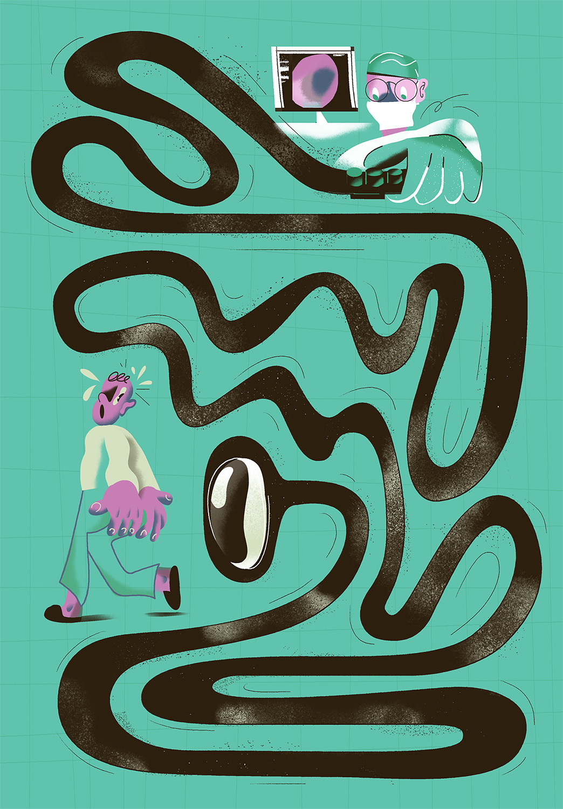
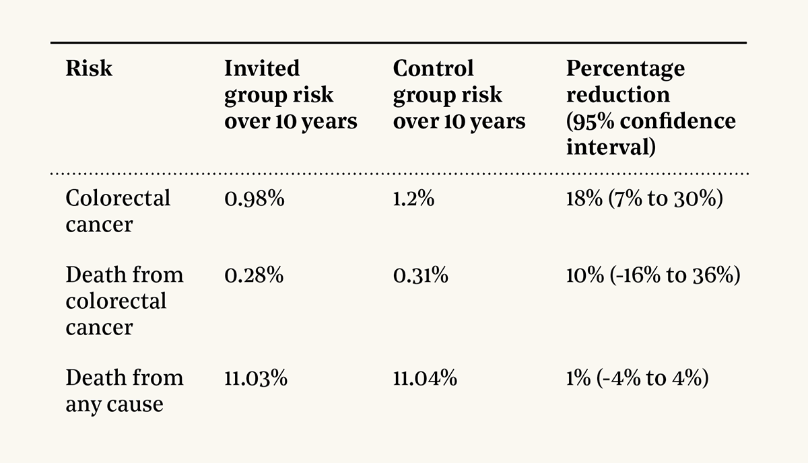
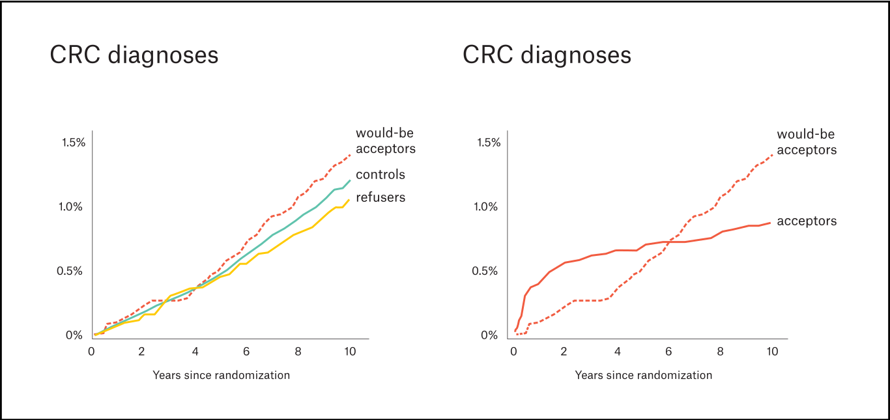
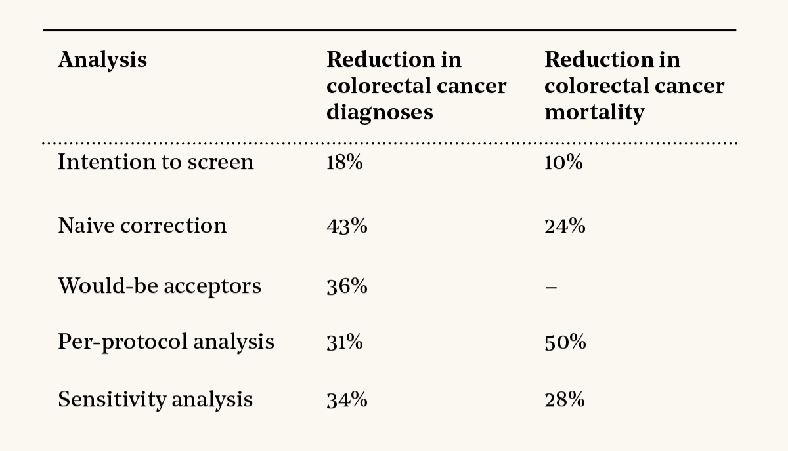
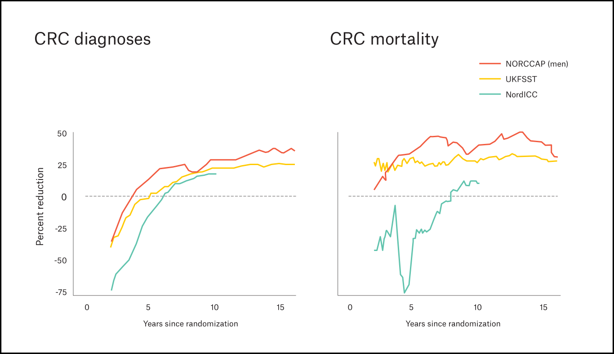
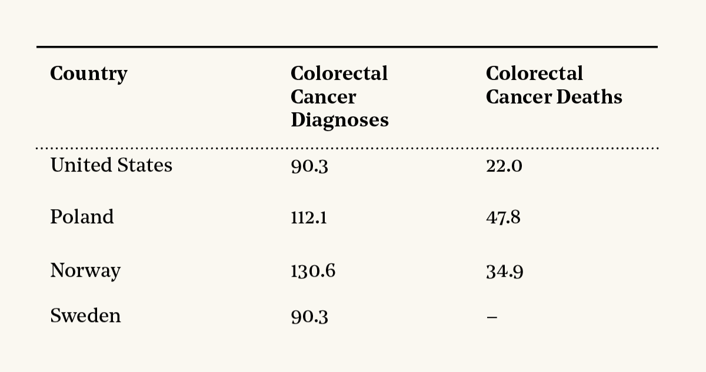

Colorectal cancer is the second-most deadly cancer, killing over 1 million people per year around the world — 1.7% of all deaths.  

结肠直肠癌是第二大致命癌症，全世界每年有 100 多万人死于此病，占总死亡人数的 1.7%。  

In the United States, where colorectal cancer causes 50,000 deaths per year, the foundation of the fight against it is the colonoscopy.  

在美国，大肠癌每年导致 5 万人死亡，而抗击大肠癌的基础就是结肠镜检查。  

Getting one periodically is recommended for everyone over the age of 45.  

建议 45 岁以上的人定期做结肠镜检查。

Colonoscopies are rarely used for screening elsewhere but have been standard in the U.S. for decades.  

结肠镜检查在其他地方很少用于筛查，但在美国几十年来一直是标准检查。  

There are many reasons to think that they should work.  

我们有很多理由认为结肠镜检查应该有效。  

But they are also expensive, invasive, unpleasant, and rarely — but not _that_ rarely — have serious side effects. Are they worth it?  

但是，结肠镜检查也是昂贵的、侵入性的、不愉快的，而且很少（但也不是很少）会有严重的副作用。这值得吗？

Until recently we didn’t have any randomized controlled trials that directly tested how well colonoscopies work.  

直到最近，我们还没有任何随机对照试验来直接测试结肠镜检查的效果。  

We finally just got one and the results were — how can I describe them? Confusing? Ambiguous?  

我们终于得到了一个结果--我该怎么形容呢？令人困惑？模棱两可？  

Frenzy-inducing?  

狂热？

Let’s try to understand what to make of this trial, and why American gastroenterologists were so quick to criticize it.  

让我们试着了解一下如何看待这项试验，以及为什么美国的肠胃病学家会如此迅速地批评它。

Karol Banach  

卡罗尔-巴纳赫

## Reminders About Tubes  

关于管道的提醒

After you swallow food, your body uses rhythmic waves of contractions to send it on a 4-meter (13-foot) journey through your esophagus, stomach, and small intestine.  

吞下食物后，身体会通过有节奏的收缩波将食物送入食道、胃和小肠，旅程长达 4 米（13 英尺）。  

These extract most of the food’s nutrients and render it into a pulpy acidic fluid called _chyme_.  

它们能提取食物中的大部分营养成分，并将其转化为一种叫做食糜的浆状酸性液体。  

The chyme then travels through your colon, a 1.5-meter (5-foot) tube that reabsorbs water and electrolytes, creating a solid mass that is then moved to your rectum for storage and eventual disposal.  

然后，食糜通过结肠（一条 1.5 米（5 英尺）长的管道），重新吸收水分和电解质，形成固体团块，然后转移到直肠储存并最终排出体外。  

Yay!  

耶

The outermost layer of your inner colon is a single layer of _epithelial_ cells whose job it is to let the good stuff through and keep the bad stuff out.  

结肠内部的最外层是一层上皮细胞，其作用是让好东西通过，把坏东西挡在外面。  

Stem cells deeper inside the colon constantly divide to make new epithelial cells, which climb to the surface and live for four or five days before committing “suicide.”  

结肠深处的干细胞会不断分裂，制造新的上皮细胞，这些细胞会爬到结肠表面，存活四五天后 "自杀"。

Colonoscopies rest on the _adenoma-carcinoma hypothesis._ The idea is that errors can arise in the DNA, resulting in epithelial cells that don’t die on schedule.  

结肠镜检查基于腺瘤-癌变假说。该假说认为，DNA 中可能出现错误，导致上皮细胞不能按计划死亡。  

If they do anything _too_ weird, your T-cells will kill them.  

如果它们做了太奇怪的事，你的 T 细胞就会杀死它们。  

But some mutations fly under the radar,  causing little clumps of cells to grow on the surface of the colon.  

但有些突变不会引起人们的注意，它们会导致结肠表面长出小块细胞。  

These clumps, or “polyps,” are usually _not cancer_ — they grow slowly, and won’t (yet) spread to neighboring tissues.  

这些团块或 "息肉 "通常不是癌症--它们生长缓慢，不会（尚未）扩散到邻近组织。  

But if these persist for many years, they can acquire additional mutations that make them start spreading.  

但如果这些变异持续多年，它们就会获得额外的变异，从而开始扩散。

To prepare for a colonoscopy, you must empty your colon.  

为准备结肠镜检查，您必须清空结肠。  

This is achieved by drinking some chemicals and enduring some spectacular biological functions.  

这是通过饮用一些化学物质和承受一些惊人的生物功能来实现的。  

Then a doctor threads a 1.5-meter (5-foot) flexible tube with a light and camera to look at the entire colon and remove or sample any polyps.  

然后，医生将一根 1.5 米（5 英尺）长的软管穿入，软管上装有照明灯和摄像头，用于观察整个结肠，切除息肉或对息肉进行取样。

The idea is not just to _detect_ cancer but, by removing precancerous polyps, _prevent_ it.

  

这样做的目的不仅仅是为了检测癌症，而是通过切除癌前息肉来预防癌症。

The primary alternative to colonoscopies for colorectal cancer screening are “occult blood tests” that look for _spooky_ hidden blood in the stool.  

除结肠镜检查外，筛查结肠直肠癌的主要替代方法是 "隐血试验"，它可以在粪便中发现诡异的隐血。  

The oldest of these use an extract of the guaiacum tree and have RCTs showing they reduce colorectal cancer mortality by 9%-22% when used for screening.  

其中最古老的是使用愈创木的提取物，有研究表明，用于筛查时可将结直肠癌死亡率降低 9%-22%。  

Newer tests look for antibodies and/or genetic mutations.  

较新的检测方法可以检测抗体和/或基因突变。  

These are more sensitive, though we don’t yet have RCTs estimating how much they help with mortality.  

这些方法更加敏感，不过我们还没有研究性试验来估计它们对降低死亡率有多大帮助。

Another alternative is an older procedure called a sigmoidoscopy, which is basically a “mini” colonoscopy with a 0.6-meter (2-foot) tube.  

另一种替代方法是一种叫做乙状结肠镜的较老的检查方法，它基本上是用一根 0.6 米（2 英尺）长的管子进行的 "迷你 "结肠镜检查。  

Compared to colonoscopy, it is quicker, safer, less painful, and cheaper, but it can only look at the lower (“sigmoid”) colon.  

与结肠镜检查相比，它更快、更安全、痛苦更少、费用更低，但它只能检查结肠下部（"乙状结肠"）。  

Still, randomized trials have shown that screening sigmoidoscopies reduce colorectal cancer deaths by 26%-30%.  

不过，随机试验表明，乙状结肠镜筛查可将结肠直肠癌死亡人数减少 26%-30%。

In principle, colonoscopies _should_ be better than either of these tests.  

原则上，结肠镜检查应优于上述任何一种检查。  

Unlike blood tests, colonoscopies try to remove polyps before they become cancer.  

与血液化验不同，结肠镜检查可在息肉变成癌症之前将其切除。  

And unlike sigmoidoscopy, colonoscopies can examine the whole colon.  

与乙状结肠镜检查不同，结肠镜可以检查整个结肠。

But how much does it actually help to remove precancerous polyps?  

但它对切除癌前息肉究竟有多大帮助呢？  

Gastrointestinal doctors often point to the National Polyp Study, but this is not a true randomized comparison — the study did colonoscopies on all subjects and concluded, based on comparisons to base rates in other “similar” populations, that removing polyps helped.  

胃肠道医生经常提到 "全国息肉研究"，但这并不是真正的随机比较--该研究对所有受试者进行了结肠镜检查，并根据与其他 "类似 "人群的基础比率进行比较后得出结论，切除息肉是有帮助的。  

And how much does it help to screen the whole colon? [Cross et al.](https://doi.org/10.1038/s41416-018-0335-z) compared sigmoidoscopy to colonoscopy in English patients with suspected colorectal cancer and found that sigmoidoscopy was sufficient to detect 80% of cancers.  

对整个结肠进行筛查有多大帮助？Cross 等人比较了英国疑似结直肠癌患者的乙状结肠镜检查和结肠镜检查，发现乙状结肠镜检查足以发现 80% 的癌症。

Because of the cost, the lack of direct evidence for efficacy, and the fact that it’s hard to convince people to do colonoscopies, they are rarely used for cancer screening outside the United States and some parts of German-speaking Europe.  

由于费用昂贵，缺乏直接的疗效证据，而且很难说服人们去做结肠镜检查，因此在美国和欧洲德语区的一些地方，结肠镜很少被用于癌症筛查。  

So it would be _really_ useful to have an RCT that tested how well screening colonoscopies work.  

因此，如果能进行一项 RCT 研究，测试结肠镜筛查的效果如何，那将会非常有用。

## The Trial  

审判

That brings us to the star of our show.  

这就是我们的主角。  

The Nordic-European Initiative on Colorectal Cancer (NordICC) is a huge randomized trial aimed at rigorously measuring how much colonoscopies reduce cancer and death.  1  

北欧-欧洲结直肠癌倡议（NordICC）是一项大型随机试验，旨在严格衡量结肠镜检查能在多大程度上减少癌症和死亡。 1

Here’s what the researchers did: Between 2009 and 2014, they identified 85,179  2  subjects mostly in Poland (64.1%), Norway (31.2%), and Sweden (4.3%), drawn at random from population registries of people between 55 and 64 years old.  3  They invited one-third of them to a one-time screening colonoscopy.  

研究人员是这样做的：2009 年至 2014 年间，他们从 55 岁至 64 岁人群的人口登记中随机抽取了 85,179 名 2  受试者，其中大部分来自波兰（64.1%）、挪威（31.2%）和瑞典（4.3%）。 3  他们邀请其中三分之一的人进行一次性结肠镜筛查。  

Of those contacted, 42% accepted the invitation and underwent a colonoscopy, while 58% refused the invitation.  

在接触过的人中，42% 接受了邀请并进行了结肠镜检查，58% 拒绝了邀请。  

The other two-thirds of people were not contacted and seemingly never knew they were in the trial.  

另外三分之二的人没有被联系到，他们似乎从来不知道自己在试验中。  

The researchers then followed everyone (invited or not, colonoscopy or not) for a median of 10 years and checked government records to see who had been diagnosed with colorectal cancer, died from colorectal cancer, or died from any cause.  

随后，研究人员对每个人（无论是否受邀、是否进行了结肠镜检查）进行了中位数为 10 年的跟踪调查，并查阅了政府记录，以了解哪些人被诊断出患有结直肠癌、死于结直肠癌或死于任何原因。

This was an “intention-to-screen” analysis.  

这是一项 "意向筛选 "分析。  

That means that it compared the control group to the whole invited group, including both the 42% of people who agreed to a colonoscopy and the 58% who refused.  

也就是说，它将对照组与整个受邀组进行了比较，包括同意接受结肠镜检查的 42% 的人和拒绝接受检查的 58%的人。  

(If that seems strange, keep reading.)  

(如果觉得奇怪，请继续阅读）。

These were the main results:  

这些是主要成果：

The 18% reduction in colorectal cancer incidence was statistically significant, while the 10% reduction in colorectal cancer mortality and 1% reduction in overall mortality were not.  

大肠癌发病率降低 18% 在统计学上有显著意义，而大肠癌死亡率降低 10% 和总死亡率降低 1% 在统计学上没有显著意义。

So the reductions — they are small. This was a surprise.  

因此，减幅很小。这是一个惊喜。

The study had a huge sample and simple, reliable statistics.  

这项研究样本庞大，统计数据简单可靠。  

The authors seemed to expect a stronger showing for colonoscopies.  

作者似乎期望结肠镜检查的结果会更好。  

When that didn’t happen, they made no excuses — they just followed their preregistered statistical plan and published the results.  

当这一切没有发生时，他们没有找任何借口，只是按照事先登记的统计计划公布了结果。  

We want research to be reproducible, right? Well, then _this is what we want people to do_.  

我们希望研究是可重复的，对吗？那么，这就是我们希望人们做的事情。

## The Debate  

辩论

This paper was greeted with gastroenterological bedlam.  

这篇论文一经发表，胃肠病学界一片哗然。  

One response was that it shows colonoscopies aren’t cost-effective, since there was only a small effect on deaths from colorectal cancer, not much better than in previous trials of less invasive screening methods.  

一种回应是，这表明结肠镜检查并不划算，因为它对结肠直肠癌的死亡率只有很小的影响，并不比以前的微创筛查方法试验好多少。  

Others took the more extreme stance that the study was further proof that American medicine is rotten, subjecting us to horrible expensive procedures for little benefit.  

另一些人则持更极端的立场，认为这项研究进一步证明了美国医学的腐朽，让我们接受可怕而昂贵的治疗，却收效甚微。

Overwhelmingly, American gastroenterologists did not agree.  

绝大多数美国肠胃病学家并不同意。  

A primary concern expressed on Twitter (now known as X) seemed to be that the study might cause patients to do the worst thing a patient can ever do: Read a paper and ask questions about it.  

推特（现在被称为 X）上表达的一个主要担忧似乎是，这项研究可能会导致患者做出患者最不愿意做的事情：阅读论文并提出相关问题。

For a little slice of the debate, take CNN’s piece, [“New Study Examines the Effectiveness of Colonoscopies.”](https://www.cnn.com/2022/10/09/health/colonoscopy-cancer-death-study/index.html) It describes the study and results, gives a few quotes from the authors and other experts about how the results are surprising, cautions that it isn’t conclusive and further research is needed, and notes that “other studies have estimated larger benefits for colonoscopies, reporting that these procedures could reduce the risk of dying of colorectal cancer by as much as 68%.”  

关于这场争论的一个小片段，请参阅 CNN 的文章 "新研究探讨结肠镜检查的有效性"。这篇文章介绍了这项研究和结果，引用了作者和其他专家的一些话来说明结果如何令人惊讶，告诫说这不是结论性的，还需要进一步的研究，并指出 "其他研究估计结肠镜检查有更大的益处，报告说这些程序可以将死于结肠直肠癌的风险降低多达 68%"。

The American College of Gastroenterology disagreed with CNN so strongly that it released a [rebuttal](https://webfiles.gi.org/links/committees/Public+Relations/American_College_of_Gastroenterology_Letter_to_CNN_NEJM_Bretthauer_Colonoscopy_10102022_FINAL.pdf), claiming:  

美国胃肠病学院强烈反对 CNN 的观点，并发表了一份反驳声明：

1.  

The way the study was set up, colonoscopies couldn’t possibly succeed because only 42% of people agreed to screening, 10 years isn’t long enough to see a benefit, and European doctors are bad at colonoscopies.  

按照研究的设定，结肠镜检查不可能成功，因为只有 42% 的人同意接受筛查，10 年的时间也不足以看到筛查的益处，而且欧洲的医生也不擅长结肠镜检查。

2\. There is _other_ evidence that removing polyps and doing colonoscopies save lives.  

2.还有其他证据表明，切除息肉和进行结肠镜检查可以挽救生命。

3.  

It’s irresponsible to call colonoscopies “invasive” (as CNN did) since that might make people think they are unpleasant and not do them.  

称结肠镜检查为 "侵入性"（如 CNN 所做）是不负责任的，因为这可能会让人们认为结肠镜检查令人不愉快而不去做。

4\. Actually, the study shows colonoscopies are great.  

4.事实上，研究表明结肠镜检查非常好。

Similar points were raised elsewhere, such as in a [letter](https://doi.org/10.1056/nejmc2215192) doctors sent to the _New England Journal of Medicine_. Are these points correct? Why were American gastroenterologists so eager to dismiss this trial?  

其他地方也提出了类似的观点，比如医生们写给《新英格兰医学杂志》的一封信。这些观点正确吗？为什么美国的肠胃病学家如此急于否定这项试验？

## **Did the Trial Actually Show That Colonoscopies Are Great?  

试验表明结肠镜检查真的好吗？**

By far the biggest controversy with the trial comes from the fact that only a minority of people agreed to screening.  

到目前为止，该试验最大的争议来自于只有少数人同意接受筛查。  

Colonoscopies can’t do anything if they don’t happen.  

如果不做结肠镜检查，就什么也做不了。

Many doctors suggested that if you look at the numbers in the right way, then this trial shows colonoscopies are great.  

许多医生建议，如果以正确的方式看待这些数字，那么这项试验就表明结肠镜检查是非常好的。  

For example, [Hanley](https://doi.org/10.1056/NEJMc2215192) argues that while only 42% of people agreed to screening, among the people who did, colon cancer incidence was reduced by 31% and colon cancer mortality was reduced by 50%.  

例如，汉利认为，虽然只有 42% 的人同意接受筛查，但在接受筛查的人群中，结肠癌发病率降低了 31%，结肠癌死亡率降低了 50%。

Many, _many_ other doctors repeated the claim that this trial showed that getting a colonoscopy reduced the risk of dying of colorectal cancer by 50%.  

还有很多很多其他医生重复着这样的说法：这项试验表明，接受结肠镜检查可以将死于结肠直肠癌的风险降低 50%。  

A common meme was to reframe the 10% reduction in colorectal cancer mortality in the main intention-to-screen analysis by rewriting the title in dismissive ways like “Effect of Mailing Letters to People on Risks of Colorectal Cancer and Related Death.”  

一种常见的说法是，通过改写标题，如 "向人们邮寄信件对结直肠癌及相关死亡风险的影响 "等轻蔑的方式，来重构主要意向筛选分析中结直肠癌死亡率降低 10%的结果。

In my opinion, that 50% number is _at best_ unreliable and probably just wrong.  

在我看来，50% 这个数字充其量是不可靠的，很可能就是错误的。  

Looking into why gives a great lesson on why statistics is hard and how that hardness conspires with social dynamics to confuse people.  

探究其中的原因给我们上了一堂很好的课，让我们了解为什么统计是困难的，以及这种困难是如何与社会动态合谋迷惑人们的。

In this study, there were three types of people:  

在这项研究中，有三种人：

**Controls**, who were never contacted  

从未接触过的对照组

**Refusers**, who were invited to get a colonoscopy but declined  

被邀请接受结肠镜检查但拒绝者

**Acceptors**, who were invited to get a colonoscopy and chose to proceed  

被邀请接受结肠镜检查并选择继续的接受者

The main analysis only compares the controls to the _combination_ of the acceptors and refusers.  

主要分析仅将对照组与接受者和拒绝者的组合进行比较。  

One reason to do so is that all screening programs see some proportion of people refuse assessment; what the analysis provides is a direct estimate of what an actual program would do.  

这样做的一个原因是，所有筛查计划都会看到一定比例的人拒绝接受评估；分析提供的是对实际计划所做工作的直接估计。

But if you’re deciding if you should get a colonoscopy personally, then you’d like to know how much it would help.  

但是，如果您正在决定是否要做结肠镜检查，那么您一定想知道它能帮到您多少。  

Naively, you might try to find out by looking at results for the acceptors versus controls, ignoring refusers.  

您可能会天真地试图通过观察接受者与对照组的结果来找出答案，而忽略拒绝者。  

Unfortunately, there’s a deep problem: Acceptors and refusers are different.  

不幸的是，这里面有一个深层次的问题：接受者和拒绝者是不同的。  

They might vary in age, sex, education, ethnicity, family health history, or comfort with their own tubes.  

他们可能在年龄、性别、教育程度、种族、家族健康史或对自己输卵管的舒适度方面存在差异。  

Even if the colonoscopies had never happened, they would have had different outcomes from the controls.  

即使没有进行结肠镜检查，他们的结果也会与对照组不同。  

This is not hypothetical!  

这不是假设！  

At the end of the study period, 1.2% of the controls were diagnosed with colorectal cancer, compared with 1.05% of refusers and 0.89% of acceptors.  4  

在研究期结束时，1.2% 的对照组患者被诊断出患有结直肠癌，而拒绝接受治疗者和接受治疗者分别为 1.05% 和 0.89%。 4

The refusers have less colorectal cancer than controls, even though neither had colonoscopies.  

与对照组相比，拒绝接受结肠镜检查者的结肠直肠癌发病率较低，尽管他们都没有接受过结肠镜检查。  

The likely explanation is that people have some idea of their risk, either because of their family history, their lifestyle, or how their tubes have been feeling recently.  

可能的解释是，人们对自己的风险有一定的了解，这可能是因为他们的家族病史、生活方式，或者他们的输卵管最近感觉如何。  

Those at lower risk are more likely to refuse.  

风险较低的人更有可能拒绝。  

(It’s also possible that refusers just hate going to the doctor and so just had fewer _diagnoses_, but never mind.)  

(也有可能拒绝就医者只是讨厌看医生，所以诊断次数较少，但这并不重要）。

So you can’t directly compare acceptors to controls _or_ to refusers. They are different populations. Sadly, there’s no good way to solve this problem.  

因此，你不能直接将接受者与对照组或拒绝者进行比较。他们是不同的人群。遗憾的是，目前还没有解决这个问题的好办法。  

But there are many bad ones!  

但也有很多坏的！

The main results in the paper are the _intention-to-screen_ analysis that compares the controls to the whole invited group.  

本文的主要结果是将对照组与整个受邀组进行比较的筛选意向分析。  

This understates the benefits of colonoscopies because it ignores the fact that less than half of invited people agreed to have colonoscopies.  

这低估了结肠镜检查的益处，因为它忽略了只有不到一半的受邀者同意进行结肠镜检查这一事实。  

But this analysis is _ultra_robust, because it compares two perfectly randomized groups.  

但这一分析是超随机的，因为它比较的是两个完全随机的群体。  

It found an 18% reduction in colorectal cancer diagnoses and a 10% reduction in colorectal cancer mortality.  

研究发现，大肠癌诊断率降低了 18%，大肠癌死亡率降低了 10%。

An intuitive way to fix that bias would be to do a _naive correction_ and pretend that the 42% of people who agreed to colonoscopies were random.  

解决这一偏差的直观方法是进行天真校正，假装同意进行结肠镜检查的 42% 的人是随机的。  

If that were true, then the benefits if everyone agreed would have been 1/0.42 = 2.38 times as large, meaning that if 100% of people agreed instead of 42%, there would have been a 43% reduction in colorectal cancer diagnoses and a 24% reduction in colorectal cancer mortality.  

如果这是真的，那么如果所有人都同意，那么收益将是1/0.42=2.38倍，也就是说，如果100%的人而不是42%的人都同意，那么结直肠癌的诊断率将降低43%，结直肠癌的死亡率将降低24%。

I call this “naive” because people did _not_ agree at random. But what’s the bias? Remember, people at higher risk were more likely to agree.  

我说这是 "天真"，因为人们并不是随意达成一致的。但偏差是什么呢？请记住，风险较高的人更有可能达成一致。  

That means that the colonoscopies that _were_ done were allocated _more efficiently_ than a random allocation. Thus, the naive correction is likely an _over_estimate. We’d expect somewhat _less_ than a 24% reduction in colorectal cancer mortality if everyone accepted.  

这意味着结肠镜检查的分配比随机分配更有效率。因此，天真的校正很可能是高估了。如果每个人都接受，我们预计结肠直肠癌死亡率的降低幅度会略低于 24%。

One thing you _can_ do is estimate what would have happened to the acceptors if they hadn’t gotten colonoscopies.  

你可以做的一件事就是估计一下，如果接受者没有接受结肠镜检查，会发生什么情况。  

Imagine a world where the trial never happened.  

想象一下，审判从未发生过。  

Outcomes for the control group and the refusers would stay the same — the only people with a different result would be the ones who would have accepted colonoscopies had the study occurred.  

对照组和拒绝接受结肠镜检查者的结果将保持不变--唯一结果不同的人将是那些如果开展了这项研究就会接受结肠镜检查的人。  

On the whole, though, the would-be invited group (that is, the would-be refusers and the would-be acceptors) would be just like the controls, since no one would have received any screening.  

不过，总的来说，将被邀请的群体（即将被拒绝的人和将被接受的人）将与对照组一样，因为没有人接受过任何筛选。  

With this in mind, we can work out what would have happened to the would-be acceptors in that world.  

有鉴于此，我们就可以推算出在那个世界里，可能的接受者会有什么下场。  

You can see this in the dotted line in the graphs below:  

您可以从下图的虚线中看到这一点：

Source: Dynomight, data from NordICC  

资料来源资料来源：Dynomight，数据来自 NordICC

The right graph compares those results to the observed outcomes for acceptors in our branch of the multiverse, where they _did_ have colonoscopies. At the end of the trial, there’s a reduction of 37%.  

右图将这些结果与我们的多元宇宙分支中接受者的观察结果进行了比较，在我们的多元宇宙分支中，接受者确实进行了结肠镜检查。试验结束时，接受者的结肠镜检查率降低了 37%。  

Unfortunately, data aren’t available to do this for mortality, but this confirms the idea that the true effects are probably a bit lower than what the naive correction gives.  

遗憾的是，目前还没有关于死亡率的数据，但这证实了一个观点，即真正的影响可能比天真校正得出的结果要低一些。

So where does this “50% reduction in colorectal cancer mortality” everyone is quoting come from?  

那么，大家所说的 "大肠癌死亡率降低 50%"又是从何而来的呢？  

This is a complex _per-protocol analysis_ that tries to use math to “make” the acceptors be like the controls.  

这是一种复杂的按协议分析，试图用数学方法 "使 "接受者与对照组一样。  

The details are a little fuzzy because the paper does the common academic thing where it says the details are in another paper that itself cites other papers in an infinite regress.  

细节有点模糊，因为这篇论文做了一件常见的学术事情，说细节在另一篇论文中，而这篇论文本身又引用了其他论文，无限倒退。

But, basically, the analysis takes data from all the acceptors and refusers and fits a big equation to predict someone’s odds of getting diagnosed with or dying from colorectal cancer based on their age, sex, country, and group (acceptor or control).

  

但从根本上说，这项分析从所有接受者和拒绝者那里获取数据，并根据他们的年龄、性别、国家和组别（接受者或对照组）拟合出一个大方程，以预测某人被诊断为结肠直肠癌或死于结肠直肠癌的几率。  

Then they see how much those odds change when you flip the group assignment.  

然后，他们会看到当你翻转小组任务时，这些几率会发生多大变化。  

This gives the much quoted decrease of 31% in colorectal cancer diagnoses and 50% in colorectal cancer mortality.  

因此，大肠癌诊断率下降了 31%，大肠癌死亡率下降了 50%。

Because that kind of analysis is known to be unreliable, they also included a _sensitivity analysis_ as a sanity check.  

众所周知，这种分析是不可靠的，因此，他们还进行了敏感性分析，以检查是否合理。  

This gave a 34% decrease in colorectal cancer diagnoses and a 28% reduction in colorectal cancer mortality.  

这样，结肠直肠癌的诊断率降低了 34%，结肠直肠癌的死亡率降低了 28%。

To summarize:  

总而言之：

The last three analyses all give something like a 33% reduction in colorectal cancer diagnoses.  

后三项分析都给出了大肠癌诊断率减少 33% 左右的结果。  

I think we can be reasonably confident that’s right.  

我想我们有理由相信这是正确的。

But should we believe that 50% number from the per-protocol analysis for colorectal cancer mortality?  

但是，我们是否应该相信按方案分析得出的结直肠癌死亡率为 50%的数字呢？

I mean … no?  

我是说......不是吗？

Let’s start with common sense.  

让我们从常识开始。  

Certainly, if everyone invited had colonoscopies, the observed 10% reduction in colorectal cancer mortality would have been higher.  

当然，如果受邀的所有人都进行了结肠镜检查，那么观察到的结肠直肠癌死亡率降低 10%的结果会更高。  

But would it have been _five times_ larger, even though almost half of people already got colonoscopies? Doubtful.  

但是，即使已经有近一半的人接受了结肠镜检查，结肠镜检查的人数还会增加五倍吗？值得怀疑。  

The naive correction gives a reduction of only 24% in colorectal cancer mortality, and we have strong reasons to think this is an _over_estimate.   

根据天真的校正结果，结直肠癌死亡率只降低了 24%，我们有充分的理由认为这是高估了。

The 50% number comes from a fiddly statistical technique that only works under strong assumptions.  

50% 这个数字来自于一种复杂的统计技术，只有在很强的假设条件下才会起作用。  

One of these is that all the ways controls and acceptors vary are included in the dataset.  

其中之一是，数据集中包含了控制和接受者的所有变化方式。  

But the dataset used was _very_ limited — it didn’t have income, education, family history, or how people’s tubes were feeling when they got the invitation. If _any_ of those things influenced people’s choices to accept, then this analysis wouldn’t have been able to correct for the biases between the groups.  

但所使用的数据集非常有限--它不包括收入、教育程度、家族史，也不包括人们收到邀请时的身体状况。如果这些因素影响了人们接受邀请的选择，那么这项分析就无法纠正组间的偏差。  

And there weren’t that many colorectal cancer deaths during the trial (229 total), so the analysis was done on sparse data.  

而且试验期间死于结肠直肠癌的人数并不多（总共 229 人），因此分析是在数据稀少的情况下进行的。

And the sensitivity analysis — the point of this was to check how sensitive the per-protocol analysis is to its rather tenuous assumptions.  

而敏感性分析--其目的是检查按协议分析对其相当脆弱的假设有多敏感。  

It worked! It showed that the “50% reduction in colorectal cancer mortality” calculation is _exquisitely_ sensitive to those assumptions! But then everyone just sort of ignored it.  

它成功了！它表明，"结直肠癌死亡率降低 50%"的计算方法对这些假设非常敏感！但后来大家都忽略了这一点。

So what happened? How did we end up with so many gastroenterologists quoting this 50% number?  

到底发生了什么？我们怎么会有这么多肠胃病专家引用这个 50% 的数字呢？

I wouldn’t blame the study authors. The paper largely just carries out the [preregistered](https://doi.org/10.1055/s-0032-1306895) analysis without much comment.  

我不会责怪研究报告的作者。这篇论文基本上只是进行了预先登记的分析，没有做太多评论。  

But in a letter to the journal, the authors emphasize that the per-protocol analysis is “prone to bias” and “not as trustworthy” and “caution against overinterpretation … because the number of deaths to date was small.”  

但在写给该杂志的信中，作者们强调，按协议分析 "容易产生偏差"，"不那么值得信赖"，"告诫不要过度解读......因为迄今为止的死亡人数很少"。

But further removed reports get from the original study, the more those cautions disappear.  

但是，报告离原始研究越远，这些警告就越消失。  

Other doctors writing about the study didn’t pay much attention to those concerns.  

其他医生在撰写关于这项研究的文章时，并没有过多地关注这些问题。  

By the time you get to the doctors on social media, they’re basically gone.  

当你在社交媒体上找到医生时，他们基本上已经走了。

It’s hard not to think that there’s some motivated reasoning at work here.  

这很难不让人联想到，这其中一定有什么动机在起作用。  

Around 15 million colonoscopies are done in the U.S. each year, at an average cost of something like $3,000 for each. I don’t think doctors are intentionally distorting the truth.  

美国每年大约要做 1500 万次结肠镜检查，每次平均花费 3000 美元左右。我不认为医生在故意歪曲事实。  

But they have been trained that colonoscopies are extremely effective, and most of them are busy and — no offense — have only a superficial understanding of statistics.  

但是，他们接受过结肠镜检查非常有效的培训，而且他们中的大多数人都很忙，无意冒犯，他们对统计数据的了解也很肤浅。  

So when a study comes out with various numbers, it’s human nature to look much harder for flaws in the surprising numbers than the ones that reinforce your worldview.  

因此，当一项研究得出各种数字时，人类的天性是在令人惊讶的数字中寻找缺陷，而不是那些强化你的世界观的数字。

Or, to put it another way: Imagine a world where the intention-to-screen analysis showed strong effects, but the per-protocol analysis showed weak ones.  

或者换一种说法：想象一下，在这样一个世界里，屏幕意向分析显示出很强的效果，但按协议分析却显示出很弱的效果。  

Which one do you think everyone would be quoting?  

你认为大家会引用哪一个？

## Intermission  

中场休息

There are no good colonoscopy jokes. I asked everyone and found none that were funny _or_ tasteful. Here’s the least-terrible one, a joint effort of myself and a large language model.  

没有什么好的结肠镜检查笑话。我问遍了所有人，也没找到一个好笑或有品位的笑话。这里有一个最不难听的笑话，是我和一个大型语言模型共同创作的。

Q. Why do Bayesians love colonoscopy trials?  

Q.为什么贝叶斯学家喜欢结肠镜检查试验？

A. Because they use _posteriors_ to inform _priors_.  

A.因为它们使用后验来为前验提供信息。

I know, I know. Anyway.  

我知道，我知道。不管怎么说

## Was the Trial Too Short?  

审判时间太短了吗？

Many doctors also objected that the trial didn’t give colonoscopies a fair chance.  

许多医生还反对说，试验没有给结肠镜检查一个公平的机会。  

One theory is that 10 years isn’t long enough (we'll know more when the trial ends and 15-year mortality is released).  

一种理论认为，10 年的时间还不够长（当试验结束并公布 15 年的死亡率时，我们会知道更多信息）。  

It takes years for polyps to turn into cancer and even longer for that cancer to kill you.  

息肉变成癌症需要数年时间，而癌症杀死你的时间更长。  

Maybe the colonoscopies removed lots of polyps that _would_ have eventually turned into cancer and/or deaths, but wouldn’t have done so _yet_.  

也许结肠镜手术切除了很多息肉，这些息肉最终会变成癌症和/或死亡，但现在还不会。

The best way to check this theory would be to look at how previous trials evolved after 10 years.  

检验这一理论的最佳方法是看看之前的试验在 10 年后的发展情况。  

We don’t have any such trials for colonoscopies, but we _do_ for sigmoidoscopies. NORCCAP ran in Norway, where 61% of men agreed to screening.  

我们没有针对结肠镜检查的此类试验，但有针对乙状结肠镜检查的试验。NORCCAP 在挪威开展，61% 的男性同意接受筛查。  

UKFSST ran in the U.K., where 71% agreed to screening.  

UKFSST 在英国开展，71% 的人同意接受筛查。  

Here is the reduction in colorectal cancer diagnoses and mortality in the invited group compared to the control group in all three trials over time:  5  

以下是在所有三项试验中，随着时间的推移，受邀组与对照组相比，结直肠癌诊断率和死亡率的降低情况： 5

Source: Dynomight, data from NordICC, UKFSST, and NORCCAP  

资料来源：Dynomight，数据来自 NordICC、UKFSST 和 NORCCAP：资料来源：Dynomight，数据来自 NordICC、UKFSST 和 NORCCAP。

For diagnoses, the “reduction” is negative at first because screening catches a lot of cancer that would otherwise be missed.  

就诊断结果而言，"减少 "起初是负面的，因为筛查发现了很多原本会漏诊的癌症。  

In NordICC, the reduction is smaller than sigmoidoscopy trials probably just because NordICC saw fewer people agree to screening.  

与乙状结肠镜检查试验相比，NordICC 试验的降幅较小，这可能只是因为同意接受筛查的人数较少。  

But, overall, the NordICC curve looks similar to the other trials, suggesting modest gains over time.  

但总体而言，NordICC 曲线与其他试验相似，表明随着时间的推移，收益不大。

For mortality, things just look weird.  

对于死亡率来说，事情看起来很奇怪。  

The other trials seemed to reach their maximum benefit by five to seven years and then sort of bounce around randomly.  

其他试验似乎在 5 到 7 年时达到最大效益，然后随机反弹。  

But NordICC actually had _higher_ colorectal cancer mortality in the invited group until almost the end of the trial.  

但实际上，直到试验快结束时，受邀组的结直肠癌死亡率才有所上升。  

I assume this was just bad luck. It’s hard to say what that green line will do in future years.  

我想这只是运气不好。很难说这条绿线在未来几年会怎样。

## Do European Doctors Suck?  

欧洲医生很差劲吗？

While the equipment is standardized, colonoscopies are effectively artisanal: The doctor decides what looks bad and what should be sampled or removed.  

虽然设备是标准化的，但结肠镜检查实际上是手工操作：医生决定哪些看起来不好，哪些应该取样或切除。  

Another theory for the small effect in the NordICC trial is that since colonoscopies are less common in Europe, the doctors had less experience than American doctors.  

NordICC 试验效果较小的另一个原因是，结肠镜检查在欧洲并不常见，因此医生的经验不如美国医生丰富。

The skill of a doctor doing a colonoscopy is often measured by their adenoma detection rate — how often they find a precancerous polyp.  

医生做结肠镜检查的技术通常是通过腺瘤检出率来衡量的，即他们发现癌前息肉的频率。  

American doctors find them 40% of the time.  

美国医生有 40% 的时间能找到它们。  

In the NordICC trial, doctors found them only 31% of the time.  

在 NordICC 的试验中，医生发现它们的比例只有 31%。  

Many suggested this meant the doctors weren’t great.  

许多人认为，这意味着医生们并不优秀。

[Cappell et al.](https://doi.org/10.1056/NEJMc2215192) counter that perhaps it wasn’t the doctors but that there were more adenomas to find in the American colons because of “higher prevalence of obesity (30% vs. 12%), a higher rate of ever having smoked cigarettes, higher fat and cholesterol consumption, and poorer physical fitness.”  

卡佩尔等人反驳说，也许不是医生的问题，而是美国人结肠中发现的腺瘤更多，因为 "肥胖的发病率更高（30% 对 12%），曾经吸烟的比例更高，脂肪和胆固醇的摄入量更高，身体素质更差"。

[Dominitz and Robertson](https://doi.org/10.1056/NEJMc2215192) reply that lifestyles notwithstanding, the U.S. has substantially _lower_ rates of colorectal cancer. I was surprised by this and looked up the numbers.  

多米尼茨和罗伯逊回答说，尽管生活方式不同，但美国的大肠癌发病率要低得多。我对此感到惊讶，并查阅了相关数据。  

Here are the rates per 100,000 people aged 55-64.  6  

以下是每 10 万名 55-64 岁人口的比率。 6

The obvious interpretation is that Americans have fewer adenomas than Europeans, meaning the doctors in the trial were worse than American doctors at detecting them.  

一个显而易见的解释是，美国人的腺瘤数量比欧洲人少，这意味着试验中的医生在发现腺瘤方面比美国医生差。  

But be cautious: Diagnoses aren’t a great measure of incidence, since they depend on how aggressively you look.  

但要谨慎：诊断结果并不能很好地衡量发病率，因为它们取决于你看病的积极程度。  

And deaths _also_ aren’t great, since they depend on treatments.  

死亡人数也不多，因为这取决于治疗方法。  

It’s also conceivable that Americans do have more adenomas, but _because_ colonoscopies are already common in the U.S., many get removed before they become cancer.  

也可以想象，美国人确实有更多的腺瘤，但由于结肠镜检查在美国已经很普遍，很多腺瘤在变成癌症之前就被切除了。

Also, I’m not sure I trust that the diagnosis rates in this data reflect cancer rates: Do we really believe that Norway has 45% more colorectal cancer than Sweden, despite the fact that these countries have similar diets, life expectancies, and mortality rates — and that Norwegians drink and smoke a bit less?  

另外，我不太相信这些数据中的诊断率能够反映癌症发病率：我们真的相信挪威的结肠直肠癌发病率比瑞典高 45%，尽管这两个国家的饮食习惯、预期寿命和死亡率都差不多，而且挪威人喝酒和抽烟的比例要低一些？  

(The mysteriously high colorectal cancer diagnosis rates in Norway have been [noted](https://pubmed.ncbi.nlm.nih.gov/12705545/) for decades.  7  )  

(挪威的大肠癌诊断率之高已被人们注意了几十年）。 7  )

Another oddity is that there were _zero_ perforations in the NordICC trial across all 12,000 colonoscopies performed whereas previous studies report them at rates between 1 in 100 and 1 in 20,000. (Perforation of the colon is fatal without emergency surgery.) One interpretation of this is that European doctors are awesome.  

另一个奇怪的现象是，在 NordICC 试验中进行的全部 12,000 次结肠镜检查中，穿孔率为零，而之前的研究报告显示，穿孔率介于百分之一到两万分之一之间。(结肠穿孔如果不进行紧急手术是致命的。  

Alternatively, Powell and Prasad give this heart-warming speculation:  

另外，鲍威尔和普拉萨德也给出了这个令人心动的推测：

It has been hypothesized that the absence of perforation in NordICC was due in part by the fact that the vast majority of procedures were unsedated, preventing the operator from using more force—a contributing factor to perforation.  

据推测，北欧重症监护中心之所以没有穿孔，部分原因是绝大多数手术都没有缝合，使操作者无法使用更大的力量--这是造成穿孔的一个因素。

If doing colonoscopies without anesthesia reduces perforations, that’s great.  

如果在不麻醉的情况下进行结肠镜检查能减少穿孔，那就再好不过了。  

But one doctor I talked to suggested that without anesthesia it’s impossible to be as thorough, so this might reduce the benefits of colonoscopies.  

但与我交谈过的一位医生认为，没有麻醉就不可能做得那么彻底，因此这可能会减少结肠镜检查的益处。

Overall, I don’t think we have a clear answer here.  

总的来说，我认为我们还没有一个明确的答案。  

I think there is weak evidence for the idea that the average American colonoscopy is better than those in this trial.  

我认为，美国结肠镜检查的平均水平比这项试验中的结肠镜检查要好的观点证据不足。  

But it’s very uncertain.  

但这很不确定。

## **Why Was There No Impact on Overall Mortality?  

为什么对总体死亡率没有影响？**

Among nondoctors, many people were surprised that _overall_ mortality rates — from any cause — were the same in the control and invited groups.  

在非医生群体中，许多人对对照组和受邀组的总死亡率（任何原因造成的死亡率）相同感到惊讶。  

Isn’t the point of colonoscopies to prevent death? Does this mean colonoscopies are worthless?  

结肠镜检查的目的不就是防止死亡吗？这是否意味着结肠镜检查毫无价值？

No.  

I ran millions of simulated trials assuming “magic colonoscopies” that reduced the odds of dying from colorectal cancer to _zero_. The results ranged from the invited group having 5.6% lower overall mortality to 2.5% _higher_.  8  So we can’t conclude anything from this.  

我进行了数百万次模拟试验，假设 "神奇的结肠镜检查 "能将结肠直肠癌的死亡几率降至零。结果显示，受邀组的总死亡率降低了 5.6%，而受邀组的总死亡率则提高了 2.5%。 8  因此，我们不能从中得出任何结论。  

There just aren’t enough people to detect a tiny signal (change in colorectal cancer mortality) that’s drowned out by tons of noise (mortality from other factors).  

只是没有足够的人去检测被大量噪音（其他因素导致的死亡率）淹没的微小信号（结直肠癌死亡率的变化）。

## Discussion  

讨论

Are colonoscopies better than other screening methods? I don’t know. Maybe!  

结肠镜检查比其他筛查方法更好吗？我不知道。也许吧

But on the margin, surely this trial gives _some_ evidence that colonoscopies might not be as effective as we hoped.  

但从边际上看，这项试验肯定提供了一些证据，表明结肠镜检查可能并不像我们希望的那样有效。  

So why were American gastroenterologists so keen to dismiss it?  

那么，为什么美国的胃肠病学家如此热衷于否定它呢？  

There seemed to be no similar frenzy of doctors in other countries trying to discredit the trial.  

其他国家的医生似乎也没有出现类似的狂热，试图诋毁这项试验。

Or, to back up — why has America settled on colonoscopies when most of the world has not?  

或者，退一步说--为什么世界上大多数国家都没有结肠镜检查，而美国却有了结肠镜检查？  

Regulators in Europe basically give two reasons that they continue to recommend fecal blood tests:  

欧洲的监管机构基本上给出了两个继续推荐粪便血液检测的理由：

1\. It’s hard to get Europeans to do any colorectal cancer screening, and _exceedingly_ hard to get them to agree to colonoscopies.  

1.很难让欧洲人做任何大肠癌筛查，更难让他们同意做结肠镜检查。

2\. Colonoscopies have not yet been proven to be cost-effective.  

2.结肠镜检查的成本效益尚未得到证实。

In America, neither of these apply.  When setting recommendations, the U.S. Preventative Service Task Force explicitly does not consider costs.  

在美国，这两者都不适用。在制定建议时，美国预防服务特别工作组明确表示不考虑成本。  

And since we expect colonoscopies to be effective, it would be too risky _not_ to do them.  

既然我们希望结肠镜检查有效，那么不做结肠镜检查的风险就太大了。  

Americans are probably more open to colonoscopies simply because doctors have told them for decades how important they are.  

美国人更愿意接受结肠镜检查，可能只是因为医生几十年来一直告诉他们结肠镜检查有多么重要。  

(Note: None of these things are obviously bad!)  

(注：这些事情显然都不是坏事！）。

So that’s my theory. Europe wants stronger evidence for cost-effectiveness.  

这就是我的理论。欧洲希望获得更有力的成本效益证据。  

America is more aggressive and more willing to accept high costs.  

美国更加积极进取，也更愿意接受高昂的成本。  

I don’t think this trial changes that.  

我认为这次审判不会改变这一点。  

Colonoscopies are still expensive, and still possibly but not conclusively better.  

结肠镜检查的费用仍然很高，而且仍有可能更好，但并不确定。

One thing is clear: Screening works. If you’re of the appropriate age, please get screened.  

有一点是明确的：筛查是有效的。如果您到了适当的年龄，请接受筛查。  

If your tubes are acting funny, please get screened without delay.  

如果您的输卵管出现异常，请立即接受检查。  

The best method and the level of benefit are debatable, but we know it helps.  

最佳方法和受益程度尚有争议，但我们知道它是有帮助的。  

Use a stool test if you want (multitarget DNA test if you can), or a colonoscopy, or a sigmoidoscopy, or a “virtual” CT colonoscopy, or a crazy edible camera.  

如果需要，可以进行粪便检测（如果可以，进行多目标 DNA 检测），或进行结肠镜检查，或进行乙状结肠镜检查，或进行 "虚拟 "CT 结肠镜检查，或使用疯狂的可食用摄像头。  

Do one of them.  

做其中一个。  

Statistics show colorectal cancer is highly curable when caught early, and now that we have feisty checkpoint inhibitor immunotherapies,it’s probably even better now. Just do it.  

统计数据显示，大肠癌如果早期发现，治愈率很高，现在我们有了强大的检查点抑制剂免疫疗法，情况可能会更好。行动起来吧  

Your tubes will thank you.  

你的管道会感谢你的。

_An earlier version of this article referred to the NordICC trial in the past tense.  

本文早先的一个版本在提到 NordICC 审判时使用了过去时。  

It has been updated to reflect that the trial is still ongoing.  

现已更新，以反映试验仍在进行中。_
