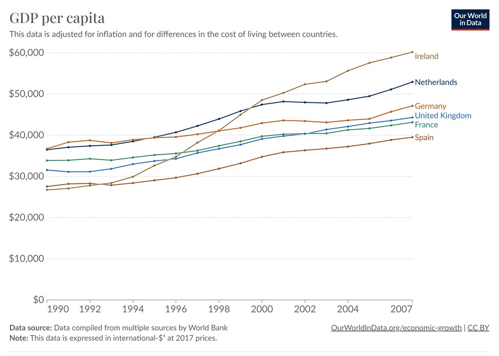
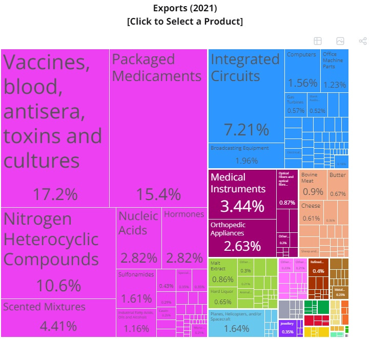
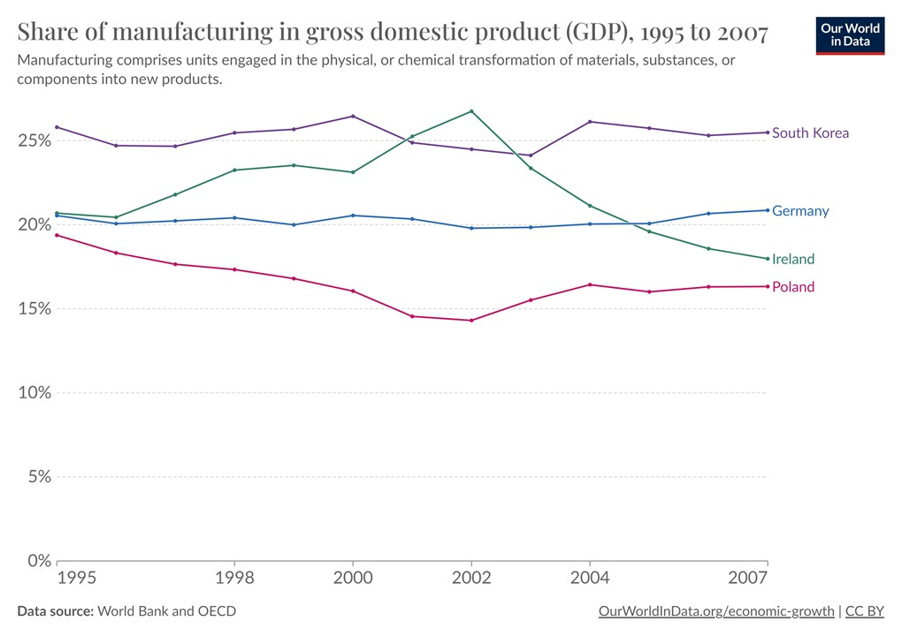
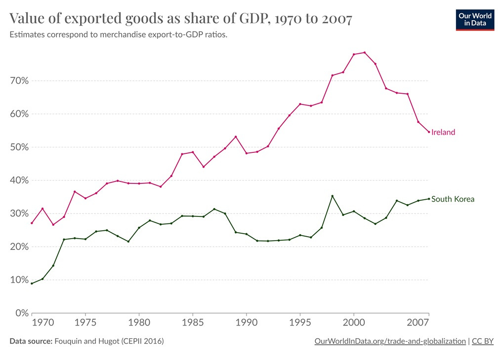
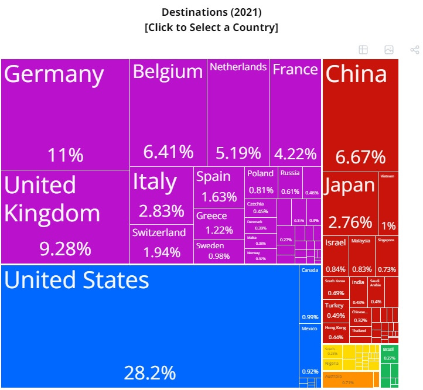
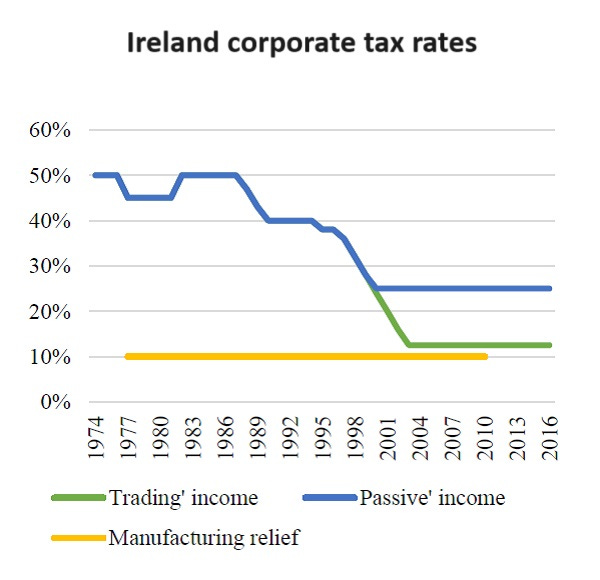
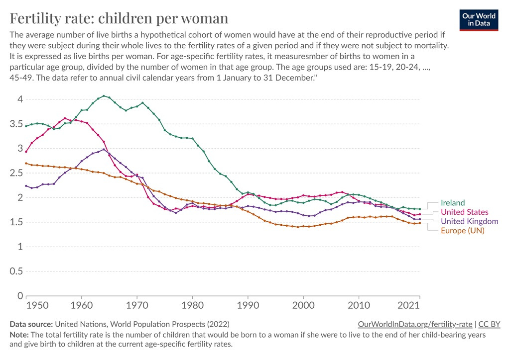

I just finished attending [Kilkenomics](http://kilkenomics.com/), an annual festival in the small Irish city of Kilkenny.  

Kilkenomics is a rather unique event, in which Irish comedians interview foreign economists and econ commentators about various topics.  

Kilkenomics 是一项相当独特的活动，爱尔兰喜剧演员会就各种话题采访外国经济学家和经济评论员。  

My interviews were mostly about war and the changing global order — grim topics that are on a lot of people’s minds these days.  

我的采访主要是关于战争和不断变化的全球秩序--这些严峻的话题如今是很多人的心头之患。  

I tried to keep things as light as I could under the circumstances, mostly by making fun of the British.  

在这种情况下，我尽量让事情变得轻松，主要是取笑英国人。  

All in all, it’s an experience I would highly recommend.  

总之，这是我强烈推荐的一次体验。  

我刚刚参加完爱尔兰小城基尔肯尼（Kilkenny）一年一度的节日 "基尔肯经济"（Kilkenomics）。

But my stay in Kilkenny drove home a fact that I knew on an intellectual level, but had never viscerally experienced: Ireland is an extremely rich country.  

但我在基尔肯尼的逗留让我明白了一个事实，那就是我在知识层面上知道，但却从未直观地体验过：爱尔兰是一个极其富饶的国家。  

Kilkenny’s small downtown is as nice as any I’ve visited in Europe, like a little piece of Oslo or Zurich or Amsterdam — a few blocks of little shops and cafes and restaurants and pubs and department stores, with an old castle and some cathedrals thrown in.  

基尔肯尼的小市区和我在欧洲游览过的任何一个市区一样漂亮，就像奥斯陆、苏黎世或阿姆斯特丹的一小块地方--几个街区内都是小商店、咖啡馆、餐馆、酒吧和百货商店，还有一座古老的城堡和几座大教堂。  

Outside of downtown, the landscape quickly shifts to an American-style car-centric sprawl of single-family homes amid rolling green fields.  

出了市中心，风景很快就变成了以汽车为中心的美式风格，在连绵起伏的绿色田野中，独户住宅鳞次栉比。

This is not how I would have imagined Ireland when I was growing up.  

这与我成长过程中对爱尔兰的想象大相径庭。  

My mental visions of the country were always ones of poverty and strife — the potato famine, the penniless migrants flooding American shores in the 1800s, Jonathan Swift satire, James Joyce novels, the Troubles, and so on.  

在我的脑海中，这个国家总是充满贫穷和纷争--马铃薯饥荒、19 世纪身无分文的移民涌入美国海岸、乔纳森-斯威夫特的讽刺作品、詹姆斯-乔伊斯的小说、动乱等等。  

And as recently as 1991, there was still a bit of truth to the stereotype — Ireland had a lower per capita GDP than most of the other countries in West Europe.  

就在 1991 年，人们对爱尔兰的刻板印象还有点道理--爱尔兰的人均国内生产总值低于西欧大多数其他国家。  

But 16 miraculous years later, the situation had reversed:  

但奇迹般地16年后，情况发生了逆转：

Of course, you may have heard that Ireland’s GDP is massively overstated. And indeed it is — now.  

当然，你可能听说过爱尔兰的国内生产总值被严重夸大了。现在的确如此。  

The graph above ends in 2007 for good reason; if you look at [a more recent graph](https://ourworldindata.org/grapher/gdp-per-capita-worldbank?tab=chart&country=USA~DEU~GBR~FRA~KOR~JPN~CHN~IND~IRL) of Irish GDP, it soars to ridiculous heights — over $100,000 per person.  

The country is rich, but it’s not上图以 2007 年为终点是有道理的；如果你看一下最近的爱尔兰 GDP 图，它飙升到了令人发指的高度--人均超过 10 万美元。 _that_ rich.  

这个国家很富有，但并没有那么富有。

[A recent article](https://www.economist.com/the-economist-explains/2023/10/31/whats-weird-about-irelands-gdp) in The Economist explains what’s going on. Ireland’s GDP is overstated for two main reasons.  

First, and most importantly, Ireland is a famous tax haven — its low corporate income tax rates give multinational companies an incentive to book as much of their profit as possible at their Irish subsidiaries.  

首先，也是最重要的一点，爱尔兰是著名的避税天堂--其低企业所得税率促使跨国公司将尽可能多的利润记入其爱尔兰子公司。  

For European companies, this usually required actually relocating their activities to Ireland, but the U.S. has a strange corporate tax system that经济学人》杂志最近的一篇文章解释了其中的原因。爱尔兰的 GDP 被夸大了，主要有两个原因。 [allows companies](https://www.irishtimes.com/business/economy/explainer-google-and-its-double-irish-tax-scheme-1.4128929) like Google and Apple to [engage in](https://www.cfr.org/blog/apples-exports-arent-missing-they-are-ireland) various [other schemes](https://en.wikipedia.org/wiki/Double_Irish_arrangement) to [book profits in Ireland](https://static1.squarespace.com/static/562636cfe4b043d43a7492bf/t/58dd39ae2e69cfde1f646716/1490893232477/ProfitShifting.pdf) without actually doing anything substantial in the country, inflating Ireland’s GDP.  

A second piece of weirdness was aircraft leasing, whose statistical treatment doesn’t make a lot of sense.  

第二件怪事是飞机租赁，其统计处理不太合理。  

对于欧洲公司来说，这通常需要将其业务活动实际迁移到爱尔兰，但美国有一个奇怪的企业税制，允许谷歌和苹果等公司采用各种其他计划在爱尔兰记账，而不在该国实际开展任何实质性活动，从而抬高了爱尔兰的国内生产总值。

In an attempt to stop exaggerating its GDP, Ireland implemented a special statistical system called GNI\*, or modified gross national income.  

为了不再夸大其国内生产总值，爱尔兰实施了一种特殊的统计制度，称为 GNI\*，即修改后的国民总收入。  

Ireland’s GNI\* is a little over half of its GDP.  

爱尔兰的国民总收入\*略高于其国内生产总值的一半。

But even this dramatic adjustment means Ireland is still quite rich.  

但即使是这样的大幅调整，也意味着爱尔兰仍然相当富裕。  

It has 5 million people, so its GNI\* per capita is about $54,000 — about 16% higher than the UK’s GDP per capita, and above either Germany or France.  

爱尔兰有500万人口，人均国民总收入\*约为54000美元，比英国的人均GDP高出约16%，也高于德国或法国。

And [as The Economist shows](https://www.economist.com/the-economist-explains/2023/10/31/whats-weird-about-irelands-gdp), GNI\* didn’t really start to diverge from GDP until 2000, and even in 2007 the divergence was pretty small.  

The stunning growth of the Irish economy in the 1990s and early 2000s was very real.  

爱尔兰经济在 20 世纪 90 年代和 21 世纪初的惊人增长是实实在在的。  

And despite getting hit正如《经济学人》所指出的，直到2000年，GNI\*才真正开始与GDP背离，即使在2007年，背离也相当小。 [famously hard](https://worksinprogress.co/issue/why-irelands-housing-bubble-burst) by the bursting of the housing bubble in 2008, Ireland retains its status as one of the world’s richest economies.  

The country may no longer be the “Celtic Tiger”, but its gains during that glorious epoch appear secure.  

该国可能不再是 "凯尔特之虎"，但其在那个辉煌时期所取得的成果似乎是稳固的。  

尽管爱尔兰在 2008 年因房地产泡沫破灭而遭受了著名的重创，但它仍然是世界上最富有的经济体之一。

Ireland is also part of a small, elite club of countries that is richer than its 19th-century imperial overlord, along with South Korea, Poland, the Baltics, and a few others.  

与韩国、波兰、波罗的海和其他一些国家一样，爱尔兰也是比其 19 世纪帝国霸主更富裕的少数精英国家俱乐部的一员。  

It’s Britain’s turn to be the shabby, dysfunctional cousins.  

轮到英国成为寒酸、功能失调的表兄弟了。

I’ve written a lot about Poland, and everyone reads about South Korea. But how did Ireland do it?  

我写过很多关于波兰的文章，每个人都读过关于韩国的文章。但爱尔兰是如何做到的？  

And can other countries copy the feat?  

其他国家也能效仿吗？  

Obviously it’s never possible to know exactly why a country got rich, but looking at the history, we can piece together a plausible story.  

显然，我们永远不可能知道一个国家致富的确切原因，但回顾历史，我们可以拼凑出一个似是而非的故事。

I like to start these posts by asking what each company specializes in.  

我喜欢在这些文章的开头询问每家公司的专长是什么。  

And a good way of figuring that out is to look at exports.  

弄清这个问题的一个好办法就是看出口。  

Ireland’s exports are heavily weighted toward the biomedical and pharmaceutical industry, with some high-tech electronics manufacturing as well:  

爱尔兰的出口主要集中在生物医学和制药业，也有一些高科技电子制造业：

Source: [OEC](https://oec.world/en/profile/country/irl?yearSelector1=2021)  

来源：OECOEC

If you go back to the “Celtic Tiger” years, electronics manufacturing was [a little more prominent](https://oec.world/en/profile/country/irl?yearSelector1=2000), but the basic pattern was probably the same.  

In general, Ireland was a pretty manufacturing-intensive economy during its boom years, in the same league as South Korea or Germany.  

总体而言，爱尔兰在经济繁荣时期是一个相当制造业密集型的经济体，与韩国或德国处于同一水平。  

如果追溯到 "凯尔特虎 "时期，电子制造业的地位会更突出一些，但基本模式可能是相同的。

Ireland is a small country, meaning it can’t really make much stuff for the domestic market, because there just _isn’t_ much of a domestic market. So Ireland’s economic success naturally involved a lot of exports.  

In fact, Ireland is traditionally more export-oriented than South Korea:  

事实上，爱尔兰传统上比韩国更注重出口：  

爱尔兰是一个小国，这意味着它不可能为国内市场生产很多东西，因为国内市场并不大。因此，爱尔兰经济的成功自然离不开大量出口。

In other words, the Celtic Tiger looked much like the Asian Tigers did — a country that made a lot of high-tech products and sold them to the rest of the world.  

换句话说，"凯尔特虎 "与 "亚洲虎 "很相似--一个制造大量高科技产品并将其销往世界各地的国家。  

Of course, a country can’t get by on export manufacturing alone — you need to have a robust local economy to circulate and [multiply](https://eml.berkeley.edu/~moretti/multipliers.pdf) the gains from export revenue. But export manufacturing is useful for a number of reasons.  

Manufacturing inherently tends to have rapid productivity growth. And many people think exporting当然，一个国家不可能仅靠出口制造业就能过得很好--你需要有一个强大的本地经济来循环和倍增出口收入的收益。但出口制造业的作用是多方面的。 [raises productivity growth](https://www.imf.org/en/Publications/WP/Issues/2019/03/26/The-Return-of-the-Policy-That-Shall-Not-Be-Named-Principles-of-Industrial-Policy-46710) as well, by forcing local companies to compete in global markets and helping them to absorb foreign technologies.  

制造业本身倾向于快速提高生产率。许多人认为，出口迫使本地公司参与全球市场竞争，并帮助它们吸收外国技术，从而也提高了生产率的增长。

One reason Ireland has been able to accomplish this is its special relationships with two important economies: the U.S. and Europe.  

爱尔兰能够做到这一点的原因之一是它与美国和欧洲这两个重要经济体的特殊关系。

If you want to export a lot, you need somewhere to sell your products.  

如果想大量出口，就需要有地方销售产品。  

Ireland’s export destinations are actually very diversified:  

爱尔兰的出口目的地其实非常多样化：

Source: [OEC](https://oec.world/en/profile/country/irl?yearSelector1=2021)  

来源：OECOEC

Europe obviously looms the largest here, which is unsurprising because of simple geographical proximity.  

欧洲显然是最大的地区，这并不奇怪，因为地理位置相近。  

But the fact that Ireland is part of the EU — and before that, was part of the European Economic Community — certainly helps.  

但是，爱尔兰是欧盟的一部分（在此之前，爱尔兰是欧洲经济共同体的一部分）这一事实肯定是有帮助的。  

Ireland’s embrace of Europe stands as a stark contrast to Britain, which is [still reeling](https://cepr.org/voxeu/columns/impact-brexit-uk-economy-reviewing-evidence) economically from Brexit.  

爱尔兰对欧洲的拥护与英国形成了鲜明对比，后者仍在为脱欧带来的经济损失而苦恼。

But when it comes to investment capital, Ireland has an even bigger ace in the hole — the United States.  

但在投资资本方面，爱尔兰有一张更大的王牌--美国。  

Just as with other recent development stars like [Poland and Malaysia](https://www.noahpinion.blog/p/the-polandmalaysia-model), foreign direct investment is very important to Ireland’s economy. And the U.S. is by far the biggest source of that investment.  

This is from就像波兰和马来西亚等其他新兴国家一样，外国直接投资对爱尔兰的经济非常重要。而美国是迄今为止最大的投资来源国。 [a recent report](https://www.mfat.govt.nz/en/trade/mfat-market-reports/foreign-direct-investment-in-ireland-june-2023/) by New Zealand’s Ministry of Foreign Affairs and Trade:  

这是新西兰外交贸易部最近的一份报告：

> Ireland is the most popular destination for new Foreign Direct Investment (FDI) projects in the EU, when measured on a per capita basis.  
> 
> 按人均计算，爱尔兰是欧盟最受欢迎的新外国直接投资（FDI）项目目的地。  
> 
> The attraction of FDI to Ireland has been a cornerstone of Irish government policy since the 1960’s and FDI now plays a very significant role in supporting the Irish economy…  
> 
> 自 20 世纪 60 年代以来，吸引外国直接投资一直是爱尔兰政府政策的基石，现在外国直接投资在支持爱尔兰经济方面发挥着非常重要的作用......
> 
> Investment has come primarily from the U.S., with the large Irish diaspora overseas helping to facilitate connections.  
> 
> 投资主要来自美国，大量的海外爱尔兰侨民帮助促进了联系。  
> 
> In 2020, U.S. FDI in Ireland stood at USD 390 billion, more than the U.S. total for Brazil, Russia, India, China, and South Africa (the BRICS) combined.  
> 
> 2020年，美国在爱尔兰的外国直接投资达到3900亿美元，超过了美国对巴西、俄罗斯、印度、中国和南非（金砖五国）投资的总和。  
> 
> While investment from all sectors has been welcomed, those offering high value-to-volume products for export (e.g.  
> 
> 虽然所有行业的投资都受到欢迎，但那些提供高附加值出口产品的行业（如信息通信技术和制药业）更受青睐。  
> 
> ICT and Pharma) have been favoured…  
> 
> 信息与通信技术和制药）受到青睐......
> 
> In terms of global distribution, 847 of the multinationals investing in Ireland are from the United States, 354 companies are of European origin – with almost half of those from Germany and France, 136 are UK origin client companies, and 212 come from across the rest of the world\[.\]  
> 
> 从全球分布来看，在爱尔兰投资的跨国公司中有 847 家来自美国，354 家来自欧洲--其中近一半来自德国和法国，136 家来自英国，212 家来自世界其他地区\[......\]。

[One report I read](https://www.civitas.org.uk/content/files/industrialpolicyintherepublicofireland.pdf) referred to Ireland as “an intermediary between Silicon Valley and Europe”.  

我读到的一份报告称爱尔兰是 "硅谷和欧洲之间的中介"。

As the report mentions, the U.S. has a big Irish diaspora — about [36 million strong](https://en.wikipedia.org/wiki/Irish_Americans), over seven times the population of Ireland itself.  

But it’s not just the diaspora that creates a bond between the U.S. and Ireland — it’s the正如报告中提到的，美国有大量爱尔兰侨民--大约有 3600 万人，是爱尔兰人口的七倍多。 _idea_ of the diaspora.  

Because the Irish were the first great wave of foreign workers to come to America after its founding, their story is fundamental to America’s self-identity as a nation of immigrants.  

爱尔兰人是美国建国后涌入美国的第一波外国劳工，他们的故事是美国作为移民国家自我认同的基础。  

Lots of Americans who don’t have Irish ancestry like to imagine they do —但是，在美国和爱尔兰之间建立联系的不仅仅是侨民，还有侨民的理念。 [for example, Bill Clinton](https://en.wikipedia.org/wiki/List_of_Americans_of_Irish_descent#:~:text=At%20least%2022%20presidents%20of,has%20strong%20documented%20Irish%20origins.), whose claimed Irish roots could never be verified. Everybody gets drunk on St. Patrick’s Day.  

很多没有爱尔兰血统的美国人喜欢幻想自己有爱尔兰血统--比如比尔-克林顿，他声称自己的爱尔兰血统永远无法证实。每个人在圣帕特里克节都会喝醉。

That combination of ancestral and sentimental attachment shows the power of a strong diaspora.  

祖先和情感的结合显示了强大的移民社群的力量。  

Over the centuries, Ireland’s tendency to [send its young people abroad](https://en.wikipedia.org/wiki/Irish_diaspora) has traditionally been seen as a weakness; since 1990, Ireland has been an object lesson in how outmigration can boomerang and eventually become a strength.  

几个世纪以来，爱尔兰倾向于将年轻人送往国外，这在传统上被视为一个弱点；自 1990 年以来，爱尔兰一直在向外移民，最终成为一个强项。

Roughly speaking, there are three varieties of development policy. These are:  

粗略地说，发展政策有三种。它们是

-   Liberalization  
    
    自由化
    
-   Capacity building  
    
    能力建设
    
-   Industrial policy  
    
    工业政策
    

Liberalization just means removing the barriers to economic activity — high taxes, regulation, trade barriers, and so on.  

自由化只是指消除经济活动的障碍--高税收、监管、贸易壁垒等。  

Capacity building means investing in things like education, health, and infrastructure.  

能力建设意味着对教育、卫生和基础设施等方面的投资。  

And industrial policy can mean lots of different things, from subsidizing exports to courting foreign investment to promoting specific industries.  

产业政策可以有很多不同的含义，从补贴出口到吸引外资，再到促进特定产业的发展。

A lot of ink gets spilled by people who argue about these approaches, but when you look at the development success stories, they all tend to involve some portion of each.  

人们对这些方法争论不休，但纵观成功的发展案例，它们往往都涉及到每种方法的某些部分。  

And Ireland is no different.  

爱尔兰也不例外。

Ireland’s journey toward liberalization began early.  

爱尔兰的自由化之路起步较早。  

Even back in the 1950s when Ireland mainly exported farm products, its leaders [recognized how crucial](https://www.jstor.org/stable/42912423) foreign market access was. In the 1970s, economic policy influencers like [T.K. Whitaker](https://en.wikipedia.org/wiki/T._K._Whitaker) successfully argued for free trade — which is essential if you’re a small country without much of a domestic market.  

The EEC and EU were, of course, essential for this.  

当然，这离不开欧共体和欧盟。  

In fact, one big growth advantage of small countries over big ones might simply be trade openness; in a small country, everyone realizes that the domestic market isn’t enough.  

事实上，与大国相比，小国的一大增长优势可能就是贸易开放；在小国，每个人都意识到国内市场是不够的。  

即使是在 20 世纪 50 年代，当爱尔兰主要出口农产品时，其领导人就已经意识到外国市场准入的重要性。20 世纪 70 年代，T.K. Whitaker 等经济政策影响者成功地倡导了自由贸易--如果你是一个没有太多国内市场的小国，这一点至关重要。

Ireland also has famously low corporate tax rates, which are part of what give it its reputation as a tax haven (the other part being some weird tax loopholes).  

爱尔兰的企业税率也很低，这也是它享有 "避税天堂 "美誉的部分原因（另一部分原因是存在一些奇怪的税收漏洞）。  

But in fact, this wasn’t always the case. Until the late 90s, Ireland had _high_ tax rates on every sort of corporate income except manufacturing, for which the rate was very low:  

但事实上，情况并非总是如此。直到上世纪 90 年代末，爱尔兰对各种企业收入都实行高税率，只有制造业除外，因为制造业的税率非常低：

By Britishfinance - [Own work](https://commons.wikimedia.org/w/index.php?curid=74620395), CC BY-SA 4.0  

作者：Britishfinance - Own work, CC BY-SA 4.0

This is sort of a combination of liberalization and industrial policy.  

这算是自由化和产业政策的结合。  

Preferential low rates on manufacturing helped bias economic activity toward things like electronics and pharma; without this split rate, Ireland might have become finance-heavy like the UK.  

制造业的优惠低税率有助于经济活动向电子和制药等领域倾斜；如果没有这种分割税率，爱尔兰可能会像英国一样成为金融业重镇。

In fact, one wonders whether cutting tax rates for other kinds of corporate income might have inadvertently pushed Irish investment away from the strengths of the Celtic Tiger period and toward things like housing speculation and tax haven shenanigans.  

事实上，人们不禁要问，降低其他类型企业收入的税率是否会无意中将爱尔兰的投资从凯尔特虎时期的优势推向住房投机和避税天堂等领域。  

But it’s also the case that tax havens [tend to grow faster](https://www.journals.uchicago.edu/doi/abs/10.1086/tpe.19.20061896) than other countries.  

Part of the reason might be that many tax systems only allow companies to take advantage of a country’s low tax rates if they actually move their factories to that country.  

部分原因可能是，许多税收制度只允许公司在实际将工厂迁往该国时享受该国的低税率。  

So Ireland might be absorbing foreign technology by luring companies in with tax arbitrage.  

因此，爱尔兰可能是通过税收套利来吸引公司进入，从而吸收外国技术。  

但是，避税地的增长速度往往也快于其他国家。

Partly as a result of low tax rates and various other business-friendly policies, Ireland regularly ranks near the top of various “competitiveness” rankings; in 2023 it was [#2 on IMD’s global list](https://www.imd.org/centers/wcc/world-competitiveness-center/rankings/world-competitiveness-ranking/2023/), behind only Denmark, with especially high rankings in “business efficiency” and “government efficiency”.  

部分由于低税率和其他各种有利于商业的政策，爱尔兰经常在各种 "竞争力 "排名中名列前茅；2023 年，爱尔兰在 IMD 的全球排行榜上名列第二，仅次于丹麦，在 "商业效率 "和 "政府效率 "方面的排名尤其靠前。

Some thinkers like Ha-Joon Chang have concerns with FDI as a driver of development.  

一些思想家，如 Ha-Joon Chang，对外国直接投资作为发展的驱动力表示担忧。  

They worry that foreign companies won’t let go of their best technologies, and that foreign brands will crowd out domestic ones, ultimately limiting a nation’s ascension to the top of the value chain.  

他们担心外国公司不会放弃自己最好的技术，担心外国品牌会排挤国内品牌，最终限制一个国家攀登价值链的顶端。  

Irish policymakers have shared this concern, [making various attempts](https://www.civitas.org.uk/content/files/industrialpolicyintherepublicofireland.pdf) to promote domestic innovation.  

So far it’s not clear how effective this has been (especially because Ireland’s tax shenanigans make macro data difficult to assess).  

到目前为止，还不清楚这样做的效果如何（尤其是因为爱尔兰的税收诡计使得宏观数据难以评估）。  

爱尔兰的政策制定者也有同样的担忧，他们为促进国内创新做出了各种尝试。

And of course to build a rich economy, one thing you definitely need is a lot of skilled labor.  

当然，要建设富裕的经济，肯定需要大量熟练劳动力。  

There are two ways to get skilled labor — education and immigration — and in general you should use both. Ireland did.  

获得熟练劳动力有两种途径--教育和移民--一般来说，你应该同时使用这两种途径。爱尔兰就是这样做的。  

Its baby boom was bigger and lasted much longer than other rich countries:  

与其他富裕国家相比，爱尔兰的婴儿潮规模更大，持续时间更长：

Ireland has also done a great job of educating its young people, with [one of the highest rates](https://data.oecd.org/eduatt/population-with-tertiary-education.htm) of tertiary education in the OECD.  

爱尔兰在年轻人教育方面也做得很好，是经合组织中高等教育率最高的国家之一。

But Ireland has also imported large numbers of workers.  

但爱尔兰也引进了大量工人。  

In the 90s, a traditional pattern of outmigration reversed, and people started moving to Ireland en masse:  

上世纪 90 年代，传统的向外移民模式发生了逆转，人们开始大规模移居爱尔兰：

These immigrants tend to skew young.  

这些移民往往偏向年轻。  

And they’re disproportionately high-skilled; in 2022, more than half of immigrants to Ireland [had a university degree or similar](https://mcginleylaw.ie/irish-immigration-statistics-2023/#:~:text=Over%2050%25%20of%20immigrants%20had,those%20seeking%20asylum%20in%20Ireland.). Some of this is [natural self-selection](https://personal.lse.ac.uk/minns/minns_jssisi_2005.pdf), but Ireland also has policies in place to promote skilled immigration.  

2022 年，爱尔兰一半以上的移民拥有大学学位或类似学位。这其中有些是自然的自我选择，但爱尔兰也有促进技术移民的政策。

They also come from a mix of countries. Ireland’s Central Statistics Office [found that in 2022](https://www.cso.ie/en/releasesandpublications/ep/p-pme/populationandmigrationestimatesapril2023/keyfindings/) there were 141,600 total immigrants, 29,600 of whom were returning Irish citizens.  

About 26,000 were from the EU, about 42,000 from Ukraine, 4800 from the UK, and about 39,000 from other countries.  

约 26000 人来自欧盟，约 42000 人来自乌克兰，4800 人来自英国，约 39000 人来自其他国家。  

他们也来自不同的国家。爱尔兰中央统计局（Central Statistics Office）发现，2022年，爱尔兰移民总数为14.16万人，其中2.96万人是回归爱尔兰的公民。

At a time when many countries are becoming hostile to immigration or at least questioning its value, Ireland has generally continued to embrace foreign workers.  

在许多国家开始敌视移民或至少质疑移民价值的时候，爱尔兰却普遍继续接纳外国工人。  

There are some signs that East European immigrants [aren’t quite as successful](https://www.tandfonline.com/doi/full/10.1080/14782804.2022.2090321) as their West European and global counterparts, and I did encounter a couple instances of stereotypes being leveled at East Europeans during my stay in Kilkenny.  

In the last year there has been a small有一些迹象表明，东欧移民并不像他们的西欧和全球同行那样成功，我在基尔肯尼逗留期间确实遇到过几次针对东欧人的刻板印象。 [backlash against refugees](https://www.theguardian.com/commentisfree/2023/mar/21/ireland-anti-refugee-protests-far-right-uk-politics).  

去年，出现了针对难民的小规模反弹。

But overall, Irish people are consistently [more positive about immigration](https://odi.org/en/publications/public-narratives-and-attitudes-towards-refugees-and-other-migrants-ireland-country-profile/) than almost [anyone else in Europe](https://heartsandminds.odi.digital/country?country=ie). And for what it’s worth, my brief personal experience bore this out.  

Irish people I talked to seemed very aware of how important foreign workers — especially skilled workers — had been to their country’s economic ascent.  

与我交谈过的爱尔兰人似乎都非常清楚，外国工人--尤其是技术工人--对他们国家的经济崛起有多么重要。  

Some mentioned pub culture and sports as key mechanisms of cultural integration.  

一些人提到酒吧文化和体育是文化融合的关键机制。  

Others opined that Ireland was a “high EQ country”, whose people specialized in managing top engineers from all over the world.  

还有人认为，爱尔兰是一个 "高情商国家"，其人民擅长管理来自世界各地的顶级工程师。  

Nobody I talked to seemed to regard Irish immigration policy as anything other than a smashing success.  

在我交谈过的人中，似乎没有人认为爱尔兰的移民政策取得了巨大成功。  

但总体而言，爱尔兰人对移民的态度始终比欧洲几乎所有其他国家的人都积极。我短暂的个人经历也证明了这一点。

In other words, there are a lot of things Ireland did to try to produce an economic miracle.  

换句话说，为了创造经济奇迹，爱尔兰做了很多事情。  

It liberalized its trade policy, cut taxes, created a favorable climate for business, and drew in a bunch of immigrants.  

它放宽贸易政策，减税，为企业创造良好的环境，并吸引了大量移民。  

But it also encouraged manufacturing, tried to promote domestic innovation, and invested heavily in education.  

但它也鼓励制造业，努力促进国内创新，并在教育领域投入巨资。  

Ireland did it all, and somehow, it worked out.  

爱尔兰做了这一切，不知何故，它成功了。

Ireland’s biggest policy challenge right now, without a doubt, is housing.  

毫无疑问，爱尔兰目前最大的政策挑战是住房问题。  

Rapid immigration, along with replacement-level fertility, has sparked a population boom:  

快速的移民，加上更替水平的生育率，引发了人口激增：

But this boom [hasn’t been matched](https://www.irishtimes.com/ireland/housing-planning/2023/03/23/irelands-housing-crisis-facts-and-figures-all-you-need-to-know/) by a boom in new housing construction.  

Ireland is still extremely wedded to the idea of single-family homes; very little of the population lives in apartments.  

爱尔兰仍然非常固守单户住宅的理念，很少有人住在公寓里。  

The country'’s permitting process is possibly但是，这种繁荣并没有带来新住房建设的繁荣。 [even more onerous](https://www.thefitzwilliam.com/p/a-simple-and-elegant-response-to) than America’s; I met some YIMBYs who had come to Ireland to study the country’s mistakes.  

爱尔兰的审批程序可能比美国还要繁琐；我遇到了一些来爱尔兰研究该国错误的YIMBY。

Housing is regularly listed as [the biggest challenge](https://www.mfat.govt.nz/en/trade/mfat-market-reports/foreign-direct-investment-in-ireland-june-2023/) to continued FDI in Ireland, and overcrowding is probably one reason why anti-immigrant politics have finally made it to Ireland’s shores.  

If the issue doesn’t get solved, it’s not inconceivable that Ireland could follow住房问题经常被列为爱尔兰继续吸引外国直接投资的最大挑战，而过度拥挤可能是反移民政治最终进入爱尔兰海岸的原因之一。 [Britain into genteel decline](https://worksinprogress.co/issue/why-britain-doesnt-build).  

如果这个问题得不到解决，不难想象，爱尔兰可能会像英国一样走向没落。

But for now, Ireland is still riding high on the success of its Celtic Tiger era.  

但现在，爱尔兰仍在凯尔特虎时代的成功基础上高歌猛进。  

A country that was once subjugated and [looked down upon](https://en.wikipedia.org/wiki/Anti-Irish_sentiment) by its neighbors is now a beacon of wealth and high-tech skill.  

一个曾经被征服、被邻国瞧不起的国家，如今已成为财富和高科技技能的灯塔。

And I think this teaches us a crucial lesson about national development.  

我认为，这给我们上了关于国家发展的重要一课。  

If you went back to 1923 and asked people whether Ireland would be richer than the UK in a hundred years, how many of them do you think would have said yes?  

如果你回到 1923 年，问人们一百年后爱尔兰是否会比英国富裕，你觉得有多少人会说是呢？  

How many would have laughed in your face?  

有多少人会嘲笑你？  

And yet here we are, a century later, and that’s the reality.  

然而，一个世纪后的今天，这就是现实。  

Now pull out a map of the world, and pick out some countries that most people think don’t have what it takes to get rich.  

现在拿出一张世界地图，选出一些大多数人认为不具备致富条件的国家。

Where do you think those countries will be in 100 years?

  

你认为 100 年后这些国家会在哪里？

Are you sure?  

你确定吗？

[Share  

分享](https://www.noahpinion.blog/p/how-ireland-got-so-rich?utm_source=substack&utm_medium=email&utm_content=share&action=share)
