Over the last few months, products like [Lensa](https://prisma-ai.com/lensa) and [AvatarAI](https://avatarai.me/) have exploded onto the scene, generating artistically rendered portraits and selfies. They range from hyper-realistic photographs that are hard to differentiate from real to highly stylized paintings and illustrations which take a look and feel of a variety of mediums.

As an artist, these products are super interesting to me. I love how they enable and democratize the ability to remix images into different styles. However, using these products feels more like applying an Instagram filter than actual creation. So I’m left wondering: how do they work? How can you take a few photos and generate something new and unique from them? How can I use these techniques to apply my own unique artistic spin?

In this post, we will explore the easiest way to generate your own custom avatars and selfies, using an open-source image generation model named Stable Diffusion and fine-tuning it with a technique named LoRA (aka. Low-Rank Adaptation).

### Stable Diffusion

[Stable Diffusion](https://huggingface.co/spaces/stabilityai/stable-diffusion) is an open-source image generation AI model, trained with billions of images found on the internet. While there are many advanced knobs, bells, and whistles — you can ignore the complexity and make things easy on yourself by thinking of it as a simple tool that does one thing.

Describe what you want to see, then click the generate button! Easy peasy.  

描述你想看到的内容，然后点击生成按钮！简单易做。

The easiest way to get started with Stable Diffusion is to head over to [Replicate](https://replicate.com/stability-ai/stable-diffusion?ref=shruggingface.com) and click the submit button.  

开始使用Stable Diffusion最简单的方式是前往Replicate并点击提交按钮。  

You’ll notice there are several fields to play with, I suggest sticking to just changing the prompt to get a feel for what you can make.  

你会注意到有几个字段可以玩耍，我建议只改变提示，以感受你可以做什么。

I generated these images using the text `astronaut riding a horse on mars, drawing, sketch, pencil`.  

我使用文本 `astronaut riding a horse on mars, drawing, sketch, pencil` 生成了这些图片。  

You can see all of the other parameters and recreate something similar by visiting this Replicate link [https://replicate.com/p/h6h4e3remjcn5i4by35qyzucbe](https://replicate.com/p/h6h4e3remjcn5i4by35qyzucbe)  

你可以通过访问这个复制链接https://replicate.com/p/h6h4e3remjcn5i4by35qyzucbe来查看所有其他参数，并重新创建类似的东西。

At the bottom, there is a `Tweak It` button that will copy all of the same parameters, giving you the ability to `fork` my generation.  

在底部，有一个 `Tweak It` 按钮，它可以复制所有相同的参数，让你有能力 `fork` 我的生成。

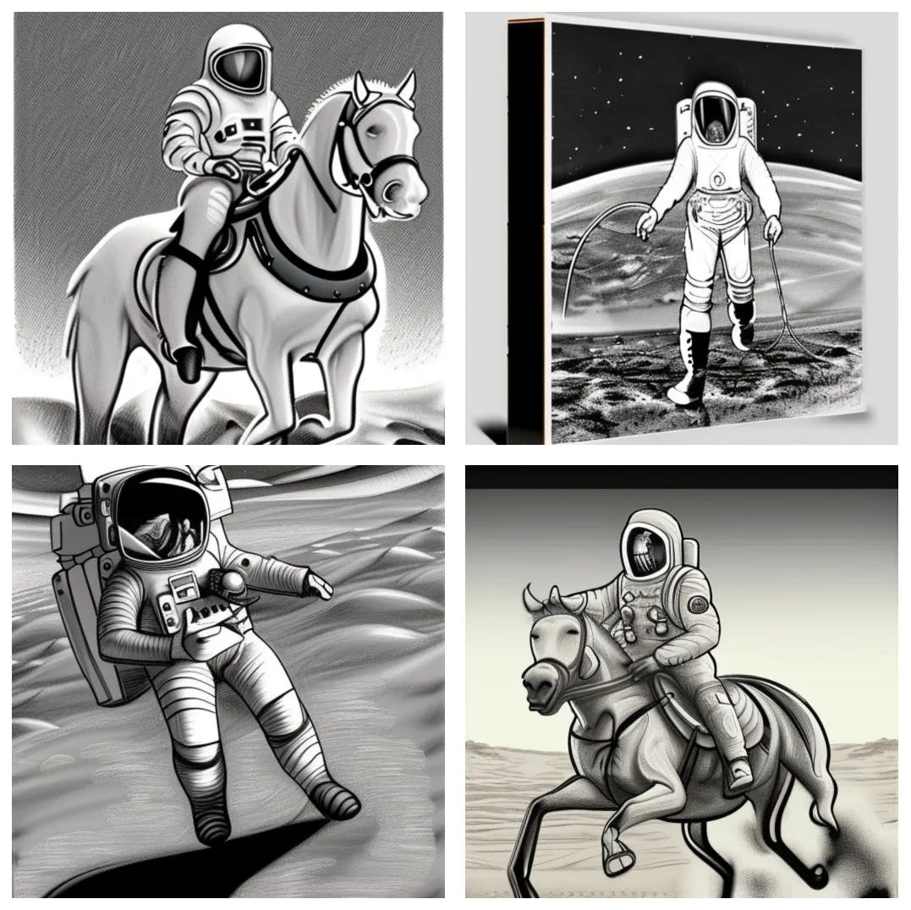

So that’s all cool, but can it do different styles? You betcha!  

那都挺酷的，但是它能做不同的风格吗？你可以肯定的！  

I generated the following images using the prompt `astronaut riding a horse on mars, painting, impressionistic style, oil, highly detailed`. I added words like `painting, impressionistic style, and oil` to create a result that had a different look and feel.  

我使用提示 `astronaut riding a horse on mars, painting, impressionistic style, oil, highly detailed` 生成了以下图片。我添加了像 `painting, impressionistic style, and oil` 这样的词，以创造出一种不同的外观和感觉。  

Also, here’s a link for you to inspect/tweak the parameters on your own: [https://replicate.com/p/dc5qehlh3nc6vmttezm3jwreq4](https://replicate.com/p/dc5qehlh3nc6vmttezm3jwreq4)  

另外，这是一个链接供你自行检查/调整参数：https://replicate.com/p/dc5qehlh3nc6vmttezm3jwreq4

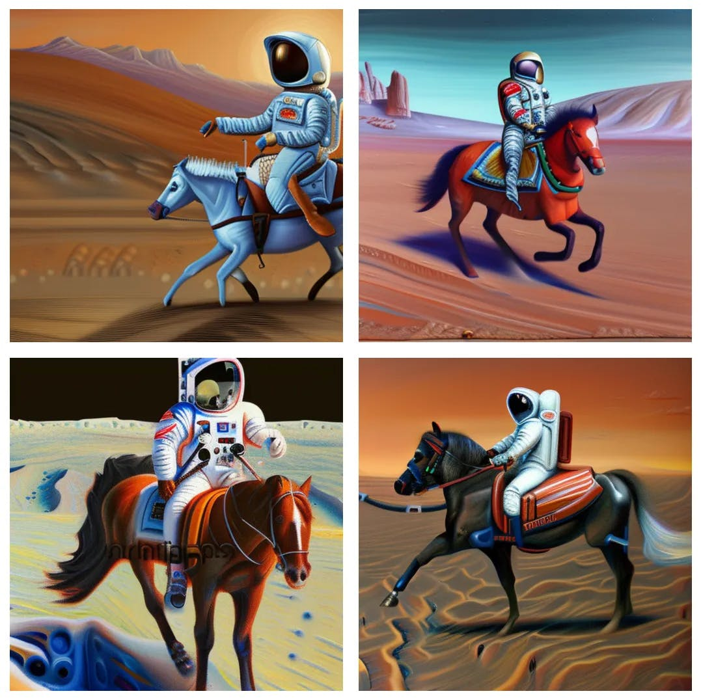

This is all great, but because it is trained on a `small` 2-billion-image subset of imagery on the internet, it doesn’t know how to represent many people, places, or things.  

这很棒，但是因为它是在互联网上的20亿图像子集上进行训练的，所以它不知道如何表示许多人、地点或事物。  

It does a fantastic job with landscapes, patterns, and such — but what happens if I try to generate a `Jake Dahn riding a horse on mars, drawing, sketch, pencil`? It clearly has no idea who I am 🤣 [https://replicate.com/p/ixfnjezokrgq7ly23rdhl427cq](https://replicate.com/p/ixfnjezokrgq7ly23rdhl427cq)  

它在处理风景、图案等方面做得非常出色——但是如果我试图生成一个 `Jake Dahn riding a horse on mars, drawing, sketch, pencil` 会发生什么呢？很明显，它完全不知道我是谁🤣 https://replicate.com/p/ixfnjezokrgq7ly23rdhl427cq

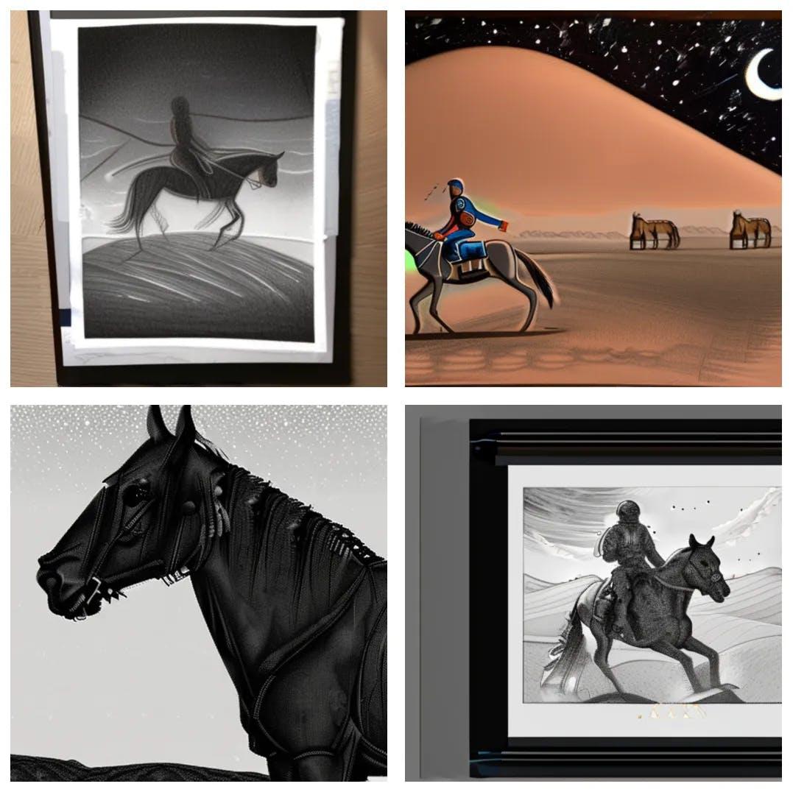

### Fine Tuning Stable Diffusion with LoRA (Low-Resource Adaptation)  

使用LoRA (低资源适应)进行精细调整稳定扩散

Awesome, so as demonstrated above, we can pretty quickly generate some neat imagery, but how do I generate images of myself using Stable Diffusion?  

太棒了，正如上面所示，我们可以很快生成一些整洁的图像，但是我该如何使用稳定扩散来生成我自己的图像呢？

In the AI space, there’s an emerging mental model pattern where you take a large base model (like Stable Diffusion) and `fine tune` on top of it.  

在AI领域，出现了一种新的思维模型模式，你可以在一个大型基础模型（如稳定扩散）的基础上进行 `fine tune` 。  

Basically, taking a massively capable off-the-shelf free and open source AI model and customizing them on your own data.  

基本上，就是采用一个功能强大的现成的免费开源AI模型，并根据你自己的数据进行定制。

There are many techniques for performing this sort of fine-tuning.  

有许多技术可以进行这种微调。  

At the time of writing, the most popular technique is called [DreamBooth](https://dreambooth.github.io/). There’s also [Textual Inversion](https://textual-inversion.github.io/), [LoRA](https://huggingface.co/blog/lora), and more!  

在撰写本文时，最受欢迎的技术被称为DreamBooth。还有文本反转，LoRA等等！  

Each technique seems to have somewhat similar results, but the technical decisions and tradeoffs made behind the scenes can actually yield quite different artifacts.  

每种技术似乎都有些许相似的结果，但是在幕后做出的技术决策和权衡实际上可能产生截然不同的产物。

For example, DreamBooth takes a long time to train, and it outputs a large multi-gigabyte `.ckpt` model checkpoint file.  

例如，DreamBooth需要很长时间来训练，并且它输出一个大型的多吉字节的模型检查点文件。  

~25-35 minutes to train on an Nvidia T4, and ~10-15min to train on a Nvidia A100. So far, in my experience, DreamBooth gives the best results, but it's also the most resource intensive, and the checkpoint files are kind of painful to work with because they are so large.  

在Nvidia T4上训练需要大约25-35分钟，而在Nvidia A100上训练需要大约10-15分钟。到目前为止，根据我的经验，DreamBooth提供了最好的结果，但它也是最消耗资源的，而且检查点文件因为太大而有些难以处理。

LoRA yields similar results as DreamBooth, but it only takes 5-7 minutes to train, and it produces a much more portable 10-15MB `.safetensors` weights file. I've heard they can sometimes balloon up to 200MB, but I haven't seen that happen yet.  

LoRA的结果与DreamBooth相似，但它只需要5-7分钟的训练时间，而且它产生的权重文件更便携，只有10-15MB `.safetensors` 。我听说它们有时会膨胀到200MB，但我还没有看到这种情况发生。  

In addition to the small file size portability, you can also mix and match multiple LoRA concepts, objects, and styles into a single prompt 🤯.  

除了小文件大小的便携性，你还可以将多个LoRA概念、对象和风格混合匹配到一个提示中🤯。  

This makes it much more akin to a "brush" in a painting app, where you can mix and match different styles and objects to create a unique image.  

这使它更像是绘画应用中的“画笔”，你可以混合搭配不同的风格和物体来创建一个独特的图像。

That means I can generate a photo of myself in the style of a van Gogh painting, Pixar character, anime character, etc.  

这意味着我可以生成一张以梵高画风、皮克斯角色、动漫角色等风格的自己的照片。

So without further ado, let’s train some LoRA weights based on photos of me!  

那么，不再废话，让我们根据我的照片来训练一些LoRA权重吧！

### 1\. Select Images for your Image Training Set  

为你的图像训练集选择图片

Now, before we proceed, I think it’s important to note that at the time of writing this post, training LoRA weights feels more like an art than a science.  

现在，在我们继续之前，我认为有必要指出，在写这篇文章的时候，训练LoRA权重更像是一种艺术而不是科学。  

Everything I am sharing is open for interpretation, I’m not showing you THE way, I’m showing you A way.  

我分享的一切都是开放给你自由解读的，我并不是在向你展示唯一的道路，我只是在向你展示一种可能的道路。  

You are the hacker/artist, you do you.  

你是黑客/艺术家，你做你自己。  

If you have any ideas for improvements I should make, or suggestions of things to try in the future, I would love to hear from you!  

如果你有任何我应该改进的建议，或者对未来尝试的事情有任何建议，我很愿意听取你的意见！

I have read a bunch of advice from strangers on the internet claiming many things you MUST do.  

我已经阅读了一堆来自互联网上陌生人的建议，他们声称有很多事情你必须做。  

Things like “you must use images that have varied lighting and environmental conditions.” Advice like “you must limit recurring patterns, or they will appear in every image generation.” The Replicate blog post about LoRA also says that it’s `better at style, worse at faces`, but it honestly works pretty well for my face.  

像“你必须使用具有不同光照和环境条件的图像。”这样的建议，“你必须限制重复的模式，否则它们将出现在每一次的图像生成中。” Replicate博客上关于LoRA的文章也说它是 `better at style, worse at faces` ，但对我来说，它实际上工作得相当好。

So far, in my experience, most of these things don’t seem to matter 🤷♂️  

到目前为止，在我的经验中，这些事情大多数似乎并不重要🤷♂️

Today we will keep it simple by using eight square-cropped transparent PNG photos I took of myself.  

今天我们将通过使用我拍摄的八张方形裁剪的透明PNG照片来保持简单。  

I used Photoshop to quickly crop and cut out the background scenery from my photos.  

我使用Photoshop快速裁剪并剪掉了照片中的背景风景。  

However, to get started quickly, I recommend using the free browser-based tool [birme.net](http://birme.net/) to perform cropping.  

然而，为了快速开始，我推荐使用免费的基于浏览器的工具birme.net来进行裁剪。  

Transparency doesn’t seem to matter all that much, but I haven’t done a rigorous side-by-side experiment yet.  

透明度似乎并不那么重要，但我还没有进行严谨的对比实验。

I took the following photos with a camera on a tripod in a well-lit room.  

我在一个光线充足的房间里，用架在三脚架上的相机拍摄了以下照片。  

My goal was to capture my face while looking up/down/left/right, both smiling and not smiling.  

我的目标是在我向上/下/左/右看时捕捉到我的脸，无论我是在微笑还是没有微笑。  

I’ve read many recommendations about using different lighting, scenes, and environments for these training photos — but these simple portraits seem to work reasonably well.  

我已经阅读了许多关于在这些训练照片中使用不同的照明、场景和环境的建议——但这些简单的肖像似乎工作得相当好。

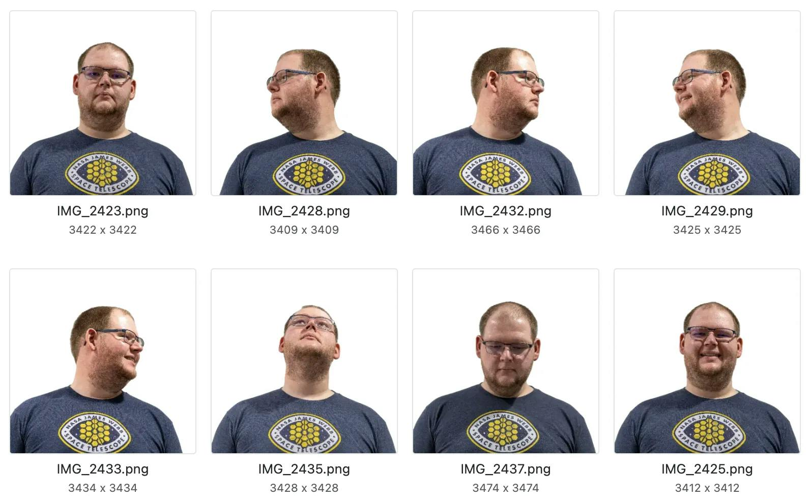

### 2\. Prepare Instance Data .ZIP File  

2\. 准备实例数据 .ZIP 文件

Now that you’ve selected the photos you’d like to train with, we’ll need to prepare them to be uploaded by compressing them into a `.zip` file.  

现在您已经选择了要进行训练的照片，我们需要将它们压缩成 `.zip` 文件以便上传。

On MacOS, you can do this by selecting the image files in `Finder → right click → "Compress"`  

在MacOS上，你可以通过在 `Finder → right click → "Compress"` 中选择图像文件来实现这一操作

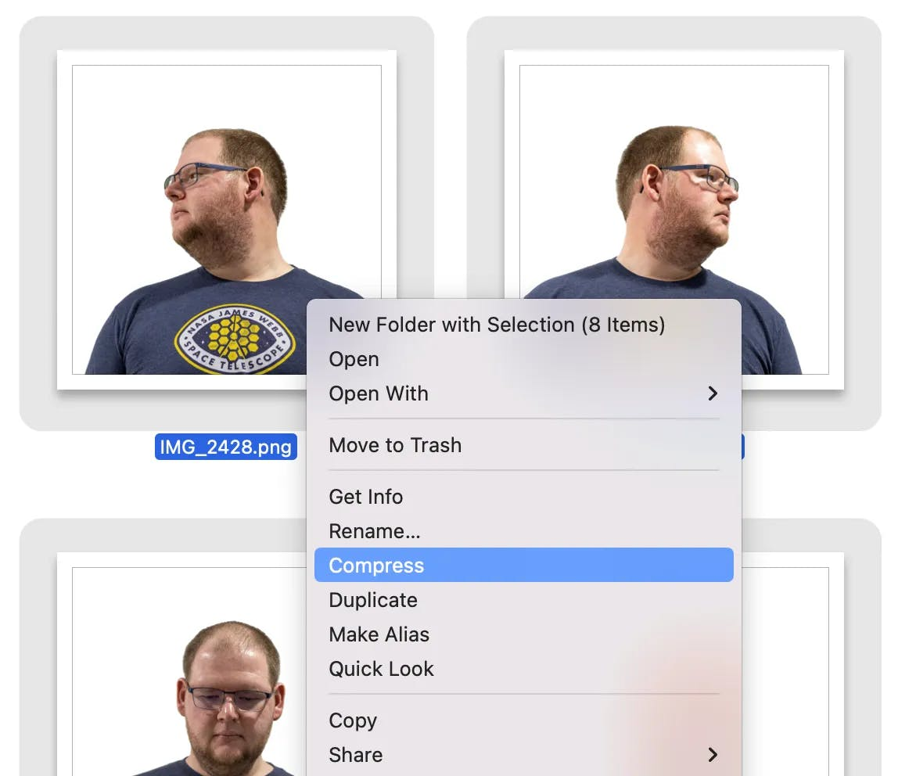

### 3\. Upload and Train  

3\. 上传并训练

To continue following along, you’ll want to first head over to Replicate and [create an account](https://replicate.com/signin?next=/cloneofsimo/lora-training?ref=shruggingface.com). Replicate is by far the easiest way to train LoRA weights for Stable Diffusion.  

要继续跟随，你首先需要前往Replicate并创建一个账户。Replicate无疑是训练Stable Diffusion的LoRA权重的最简单方法。  

Their web UI allows you to drag and drop your `.zip` file and kick things off in a single form.  

他们的网页用户界面允许你拖放你的 `.zip` 文件，并在一个表单中启动所有事情。

Head over to [https://replicate.com/cloneofsimo/lora-training](https://replicate.com/cloneofsimo/lora-training?ref=shruggingface.com)  

前往https://replicate.com/cloneofsimo/lora-training

Then drag and drop your `.zip` file to the `instance_data` drag+drop form field.  

然后将你的 `.zip` 文件拖放到 `instance_data` 拖放表单字段中。

In the screenshot below, you can see that I’ve chosen a file named `jake-transparent-3428.zip` for my `instance_data` field.  

在下面的截图中，你可以看到我为我的 `instance_data` 字段选择了一个名为 `jake-transparent-3428.zip` 的文件。  

In general, it’s always helpful to name your Replicate uploads with descriptive file names, as it will help you make sense of what you’re looking at when reviewing results.  

总的来说，为你的Replicate上传文件使用描述性的文件名总是有帮助的，因为这将帮助你在查看结果时理解你正在看的内容。

At the time of writing, the `task` field allows you to train for `face`, `object`, and `style`.  

在撰写时， `task` 领域允许你为 `face` ， `object` 和 `style` 进行训练。  

I’m a little vague on what the underlying difference is between these task templates, but I believe these to be true:  

我对这些任务模板之间的基本区别有些模糊，但我相信这些是正确的：

-   `face` - Using the `face` option requires all input images to have a human face and only one per image.  
    
    `face` - 使用 `face` 选项要求所有输入图像都必须有一个人脸，并且每张图像只能有一个。  
    
    This won’t work well for pets/animals.  
    
    这对宠物/动物来说效果不佳。
-   `object` — Using the `object` option should work best for objects, animals, pets, etc.  
    
    `object` — 使用 `object` 选项对于物体、动物、宠物等应该效果最好。
-   `style` — Using the `style` option works best in transferring the visual style onto other imagery.  
    
    `style` - 使用 `style` 选项在将视觉风格转移到其他图像上效果最好。

Ignore the seed field, and leave the resolution at `512`.  

忽略种子字段，将分辨率保持在 `512` 。

Go ahead and click submit!  

继续并点击提交！

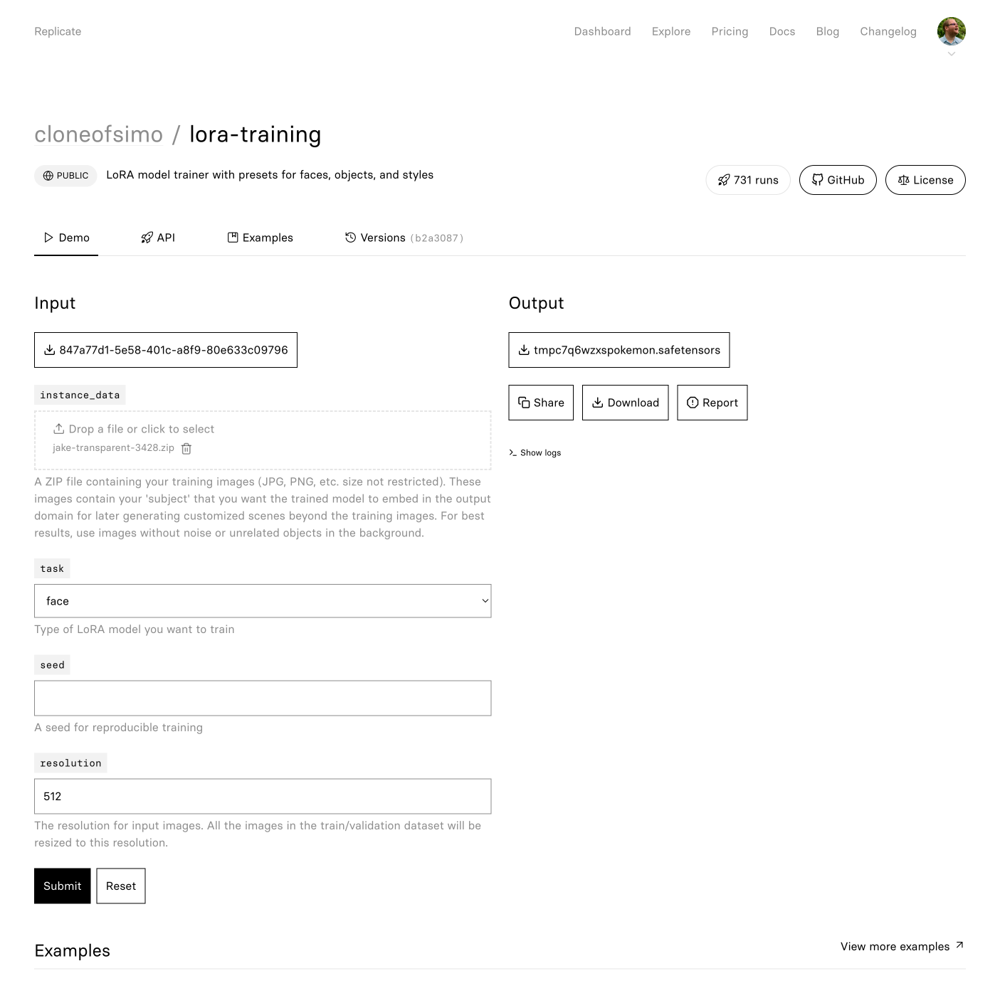

The training run will take ~7 minutes to complete. Grab some coffee ☕ or tea 🍵.  

训练运行将需要大约7分钟才能完成。去拿些咖啡☕或茶🍵吧。  

You’ll start to see output scrolling by that looks like this:  

你会开始看到像这样滚动的输出：

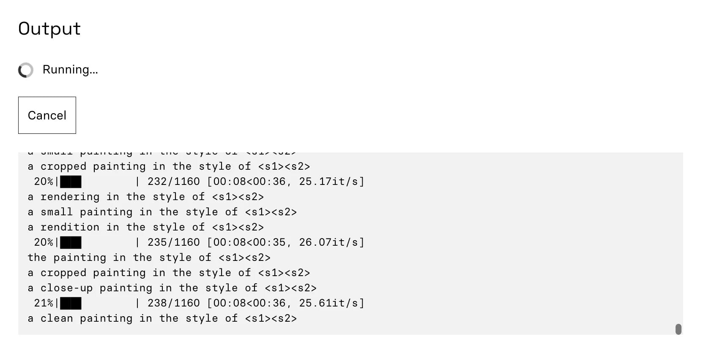

### 4\. Downloading Your Weights  

4\. 下载您的权重

🎉 Awesome, your weights are done training! You should see something like:  

🎉 太棒了，你的权重已经完成训练！你应该会看到类似的情况：

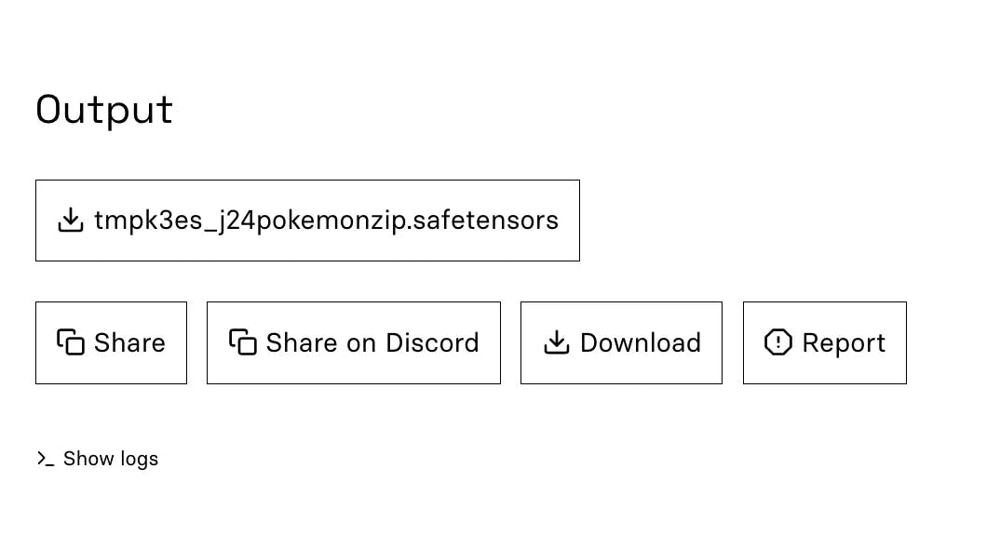

The output is a single `.safetensors` LoRA weights file. Click the download button to save the weights somewhere that future-you can find.  

输出是一个单一的 `.safetensors` LoRA权重文件。点击下载按钮将权重保存在未来你可以找到的地方。  

You will also want to save the weights URL by right-clicking the `.safetensors` button and then clicking `Copy Link` — make sure to save this URL somewhere readily accessible.  

你也会想要通过右键点击 `.safetensors` 按钮，然后点击 `Copy Link` 来保存权重URL —— 确保将此URL保存在容易访问的地方。  

You’ll be using the URL in the next step.  

你将在下一步中使用这个URL。

I’ve started saving all of my weights into a Notion DB, where I also track the training dataset, URL to weights, and the weights file itself.  

我已经开始将我所有的权重保存到Notion数据库中，我在那里也跟踪训练数据集，权重的URL，以及权重文件本身。

If you’re anything like me, it’s probably easy to imagine amassing a fairly large/diverse set of LoRA concepts, objects, and styles.  

如果你和我有些相似，那么你可能很容易想象积累一套相当大且多样化的LoRA概念、对象和风格。  

So saving it somewhere searchable will make life easier in the future.  

所以将其保存在某个可以搜索的地方将会使未来的生活更加轻松。  

I also suggest saving the training data zip file in the same place, so you can reproduce similar weights in the future by using next-generation fine-tuning techniques.  

我还建议将训练数据的压缩文件保存在同一位置，这样你可以通过使用下一代微调技术在未来复现类似的权重。

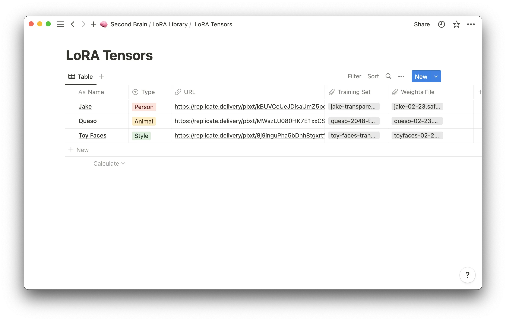

### 5\. Generating Images With Custom Stable Diffusion LoRA weights  

5\. 生成具有自定义稳定扩散LoRA权重的图像

🥳 Awesome, now that you’ve got your `safetensors` weights file, you can use it to generate images that use your face as a reference!  

🥳太棒了，现在你已经得到了你的 `safetensors` 权重文件，你可以用它来生成使用你的脸作为参考的图片！

On Replicate, if you search public models for “LoRA” you’ll find a handful of “flavored” Stable Diffusion models that will play nicely with your LoRA weights. [https://replicate.com/explore?query=lora](https://replicate.com/explore?query=lora)  

在Replicate上，如果你搜索公共模型中的“LoRA”，你会找到一些“有特色”的稳定扩散模型，这些模型将很好地配合你的LoRA权重。https://replicate.com/explore?query=lora

These models are all Stable Diffusion or Stable Diffusion pre-trained DreamBooth checkpoints that have been set up on Replicate in a way that lets you add your LoRA weights on top.  

这些模型都是稳定扩散或预训练的稳定扩散DreamBooth检查点，它们已经在Replicate上设置，让你可以在顶部添加你的LoRA权重。

Each of these models has the following two required parameters:  

这些模型每一个都有以下两个必需的参数：

-   `prompt`: A prompt that contains the string `<1>` in place of the trained concept, e.g. `an astronaut riding a horse in the style of <1>`. Use `<2>`, `<3>` if you pass multiple URLs to the `lora_urls` input.  
    
    `prompt` : 一个包含字符串 `<1>` 的提示，用于替代训练的概念，例如 `an astronaut riding a horse in the style of <1>` 。如果你向 `lora_urls` 输入传递多个URL，使用 `<2>` ， `<3>` 。
-   `lora_urls`: The URL or URLs of your trained LoRA concept(s) you copied in the previous step.  
    
    `lora_urls` : 你在上一步复制的已训练LoRA概念的URL或URLs。  
    
    You can pass a single URL or a list of URLs separated by a pipe character `|`. Passing multiple URLs allows you to combine multiple concepts into a single image.  
    
    你可以传递一个单独的URL，或者用管道符号 `|` 分隔的URL列表。传递多个URL可以让你将多个概念合并到一张图片中。

#### Stable Diffusion  

稳定扩散

These prompts were generated with the barebones Stable Diffusion model.  

这些提示是用最基本的稳定扩散模型生成的。  

I had to play with the LoRA scale parameter to get the best results. I found that a scale of `0.5` or `0.4` worked best for my face.  

我不得不调整LoRA的比例参数以获得最佳结果。我发现 `0.5` 或 `0.4` 的比例最适合我的脸。

[https://replicate.com/cloneofsimo/lora](https://replicate.com/cloneofsimo/lora?ref=shruggingface.com)

```
PROMPT: portrait of <1> in a suit, detailed painting, hd, hq, high resolution, high detail, 4 k, 8 k
```

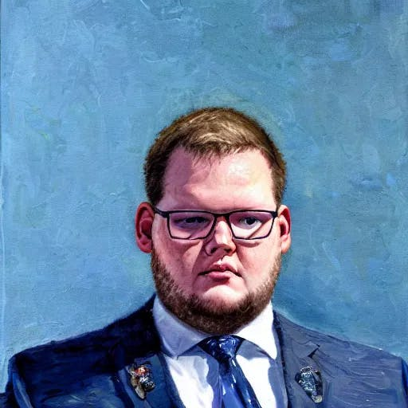

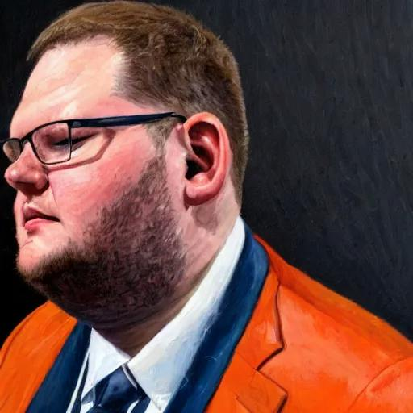

```
PROMPT: portrait of <1>, detailed painting, hd, hq, high resolution, high detail, 4 k, 8 k
```

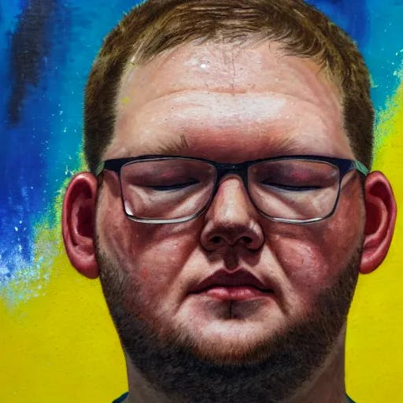

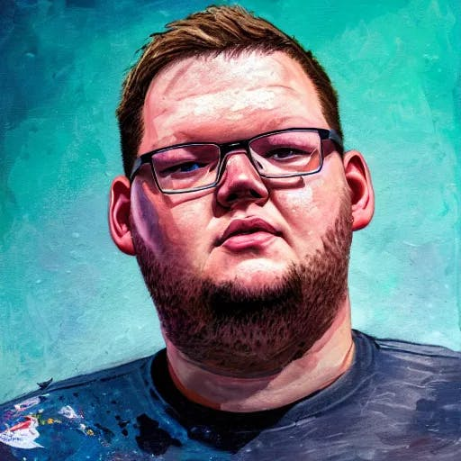

```
PROMPT: portrait of <1> in a leopard print housecoat, detailed painting, hd, hq, high resolution, high detail, 4 k, 8 k
```

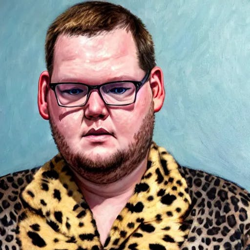

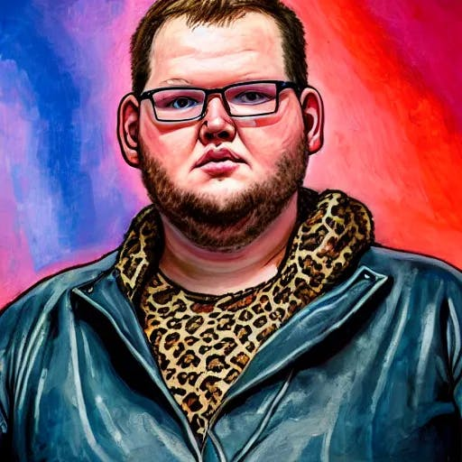

#### Realistic Vision 1.3  

真实视觉 1.3

This is the Realistic Vision 1.3 model, which is Stable Diffusion + extra DreamBooth training on top.  

这是Realistic Vision 1.3模型，它是稳定扩散+额外的DreamBooth训练。  

This model yielded the overall best results, and responded well to many prompts.  

这个模型产生了总体上最好的结果，并且对许多提示反应良好。  

I think it's likely because it was trained on lots of photos of people, so it's better at generating faces than the other models.  

我认为这可能是因为它接受了大量人物照片的训练，所以在生成面部图像方面比其他模型更优秀。

[https://replicate.com/cloneofsimo/realistic\_vision\_v1.3](https://replicate.com/cloneofsimo/realistic_vision_v1.3?ref=shruggingface.com)

[https://civitai.com/models/4201/realistic-vision-v13](https://civitai.com/models/4201/realistic-vision-v13?ref=shruggingface.com)

```
PROMPT: concept art of <1>, abstract impressionistic style, detailed face, detailed eyes, realistic eyes, realistic face, colorful background, graffiti background, highres, RAW photo 8k uhd, dslr
```

#### Inkpunk Diffusion  

墨水朋克扩散

This was my favorite model to play with because it did such a great job of capturing realistic details but portraying them in a specific illustration style.  

这是我最喜欢的模型，因为它非常出色地捕捉到了真实的细节，但又以特定的插图风格呈现出来。  

It's a Stable Diffusion + Dreambooth model, vaguely inspired by Gorillaz, FLCL, and Yoji Shinkawa.  

这是一个稳定扩散+梦想展位模型，大致受到了Gorillaz，FLCL和新川洋二的启发。

[https://replicate.com/cloneofsimo/inkpunk\_lora](https://replicate.com/cloneofsimo/inkpunk_lora?ref=shruggingface.com)

[https://huggingface.co/Envvi/Inkpunk-Diffusion](https://huggingface.co/Envvi/Inkpunk-Diffusion?ref=shruggingface.com)

```
PROMPT: a photo of <1>, nvinkpunk
```

#### GTA5 Diffusion  

GTA5扩散

This model was trained on the loading screens, gta storymode, and gta online DLCs artworks.  

这个模型是在加载屏幕、GTA故事模式和GTA在线DLCs艺术作品上进行训练的。  

Which includes characters, background, chop, and some objects.  

其中包括角色，背景，剪辑和一些物体。

[https://replicate.com/cloneofsimo/gta5\_lora](https://replicate.com/cloneofsimo/gta5_lora?ref=shruggingface.com)

[https://huggingface.co/ItsJayQz/GTA5\_Artwork\_Diffusion](https://huggingface.co/ItsJayQz/GTA5_Artwork_Diffusion?ref=shruggingface.com)

```
PROMPT: a photo of <1> gtav style
```

#### Vintedois Diffusion

[https://replicate.com/cloneofsimo/vintedois\_lora](https://replicate.com/cloneofsimo/vintedois_lora?ref=shruggingface.com)

[https://huggingface.co/22h/vintedois-diffusion-v0-1](https://huggingface.co/22h/vintedois-diffusion-v0-1?ref=shruggingface.com)

```
close up portrait of <1> in a Sci Fi suit - 4k uhd, hyper detailed, photorealistic, steampunk, lovecraft colors, dan mumford colors, psychedelic black light, epic composition
```

### Using Multiple LoRA Concepts  

使用多个LoRA概念

Last but certainly not least, I wanted to try out style transfer and use multiple LoRA concepts simultaneously.  

最后但绝对不是最不重要的，我想尝试风格转换并同时使用多个LoRA概念。

I kicked off another round of LoRA training, but this time I used the type `style` and trained it with 70 transparent PNGs of the excellent [Toy Faces](https://amrit.art/toy-faces) Library.  

我启动了另一轮LoRA训练，但这次我使用了类型 `style` ，并用优秀的Toy Faces图书馆的70张透明PNG进行了训练。  

I purchased this stock library back in 2020 and used it for avatars in an unreleased project, so it was cool to rediscover them for something completely different.  

我在2020年购买了这个股票库，用于一个未发布的项目中的头像，所以重新发现它们用于完全不同的事情是很酷的。

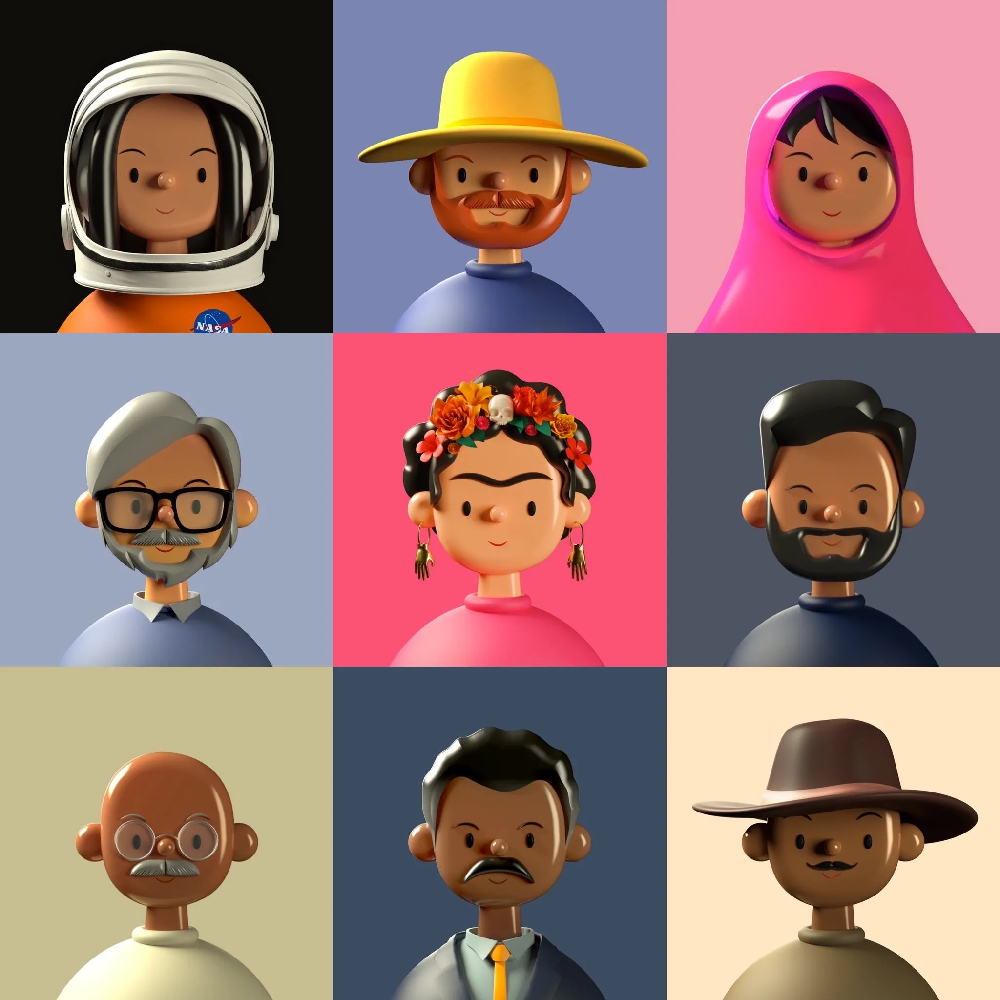

Mixing the LoRA concept of my face with the style of toy faces yielded an interesting mix of imagery that looks sort of like me, sort of like toy faces, but not really like either 🤷♂️  

将我的脸部的LoRA概念与玩具脸部的风格混合，产生了一种看起来有点像我，有点像玩具脸部，但实际上并不真正像任何一种的有趣图像🤷♂️

To generate these, I used the [Realistic Vision 1.3](https://replicate.com/cloneofsimo/realistic_vision_v1.3?ref=shruggingface.com) model, which I felt had the best/most accurate results overall. The prompt was  

为了生成这些，我使用了Realistic Vision 1.3模型，我觉得它总体上有最好/最准确的结果。提示是

```
PROMPT: photo of <1>, in the style of <2>, detailed faces, highres, RAW photo 8k uhd, dslr
```

and the `lora_urls` parameter included two urls, separated by the `|` character. I also set the `lora_scales` to be `0.5|0.6`, which I believe keeps things fairly balanced but skews slightly toward the style than the photo.  

并且 `lora_urls` 参数包含了两个URL，由 `|` 字符分隔。我还将 `lora_scales` 设置为 `0.5|0.6` ，我相信这样可以保持事物的平衡，但是稍微偏向于风格而非照片。  

If you crank up the `lora_scales` to 1, the outputs start to look very similar to the input images from the training image set.  

如果你将 `lora_scales` 调整到1，输出开始看起来与训练图像集中的输入图像非常相似。

### Conclusion  

结论

Since August, I’ve spent a few hundred hours playing around with Stable Diffusion and getting a feel for what it does and how it works.  

自八月以来，我已经花了几百个小时来玩弄稳定扩散，以了解它的功能和工作方式。  

For me, as a not-so-talented digital artist and painter, it’s been extremely helpful for getting images out of my mind and into the world.  

对我来说，作为一个不太有才华的数字艺术家和画家，它对于将我脑海中的图像转化为现实非常有帮助。  

While vanilla Stable Diffusion is impressive on its own, I am most excited about the long-term potential for artists and designers to wield it as a tool that helps them create the best work of their lives.  

虽然香草稳定扩散本身就很令人印象深刻，但我最期待的是艺术家和设计师将其作为一种工具，帮助他们创作出他们一生中最好的作品的长期潜力。

I think fine-tuning techniques like LoRA, DreamBooth, and Textual Inversion are all significant steps toward making that dream a reality.  

我认为像LoRA、DreamBooth和Textual Inversion这样的微调技术都是实现这个梦想的重要步骤。  

Today, fine-tuning gives you some creative control over the imagery you produce, but it is ****very**** exploratory.  

今天，微调为你提供了一些对你产生的图像的创造性控制，但它非常具有探索性。  

When working with fine-tuning in Stable Diffusion, you really never know what you’re going to get.  

在使用稳定扩散进行微调时，你真的永远不知道会得到什么。

The process is very incremental and full of trial and error.  

这个过程非常渐进，充满了尝试和错误。  

Sometimes you’ll generate 100 images before you start getting the results you’re looking for.  

有时候，你需要生成100张图片才能开始得到你想要的结果。  

Sometimes you’ll generate 100 images and give up because things aren’t going in the right direction.  

有时候，你会生成100张图片，然后因为事情没有朝着正确的方向发展而放弃。

As it stands today, I feel like Stable Diffusion pushes artists to think more like a creative director than an artist.  

就现在来看，我觉得稳定扩散更像是在推动艺术家去更像一个创意总监而不是艺术家去思考。  

It’s all about communicating a “vision” of what you see in your mind's eye and incrementally working toward making it a reality.  

这都是关于传达你在心灵眼中看到的“愿景”，并逐步努力使其成为现实。  

Looking at an image, critiquing what’s good and what’s bad, changing the prompt word by word.  

看着一幅图像，批评什么是好的，什么是坏的，逐字改变提示。

In the future, I’m hoping that image generation models become more integrated into tools like Photoshop and Procreate, enhancing the skills of artists and reducing the effort it takes to go from image in mind to image in the world.  

在未来，我希望图像生成模型能更多地融入到像Photoshop和Procreate这样的工具中，提升艺术家的技能，减少从心中的图像到现实世界的图像所需的努力。

Until then, I will continue happily hacking on Stable Diffusion with fine-tuned models for fun.  

在那之前，我将继续愉快地研究稳定扩散，并为了乐趣对模型进行微调。
