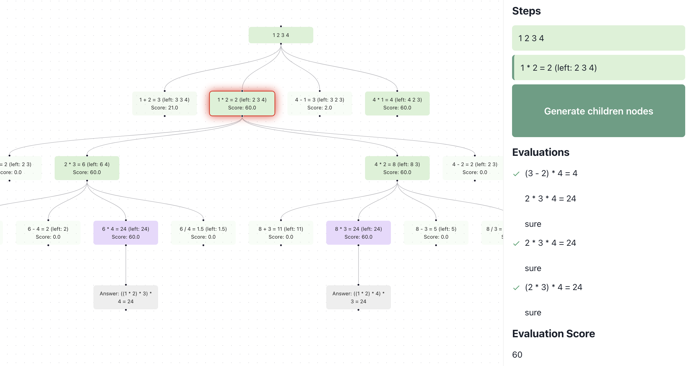

In this post we introduce Branches, our tool for prototyping and visualizing advanced LLM reasoning and planning algorithms. We apply Branches to the problem of generating Python code for HumanEval.  

在这篇文章中，我们介绍了Branches，这是我们用于原型设计和可视化高级LLM推理和规划算法的工具。我们将Branches应用于为HumanEval生成Python代码的问题。

Large Language Models (LLMs) have achieved impressive results on everything from writing fiction to explaining complex code.  

大型语言模型（LLMs）在各种领域，从创作小说到解释复杂代码，都取得了令人印象深刻的成果。  

However, the performance of LLM agents drops precipitously once the task requires long range planning or up-to-date knowledge of the world.  

然而，一旦任务需要长期规划或最新的世界知识，LLM代理的表现就会急剧下降。

Code _generation_ is one such task, involving diverse specifications, constraints, and tests.  

代码生成就是这样一项任务，涉及到各种各样的规格、约束和测试。  

These requirements, even if simple, can make autonomous code generation difficult.  

即使这些要求很简单，也可能使自主代码生成变得困难。  

It gets harder when the specifications conflict or are ambiguous.  

当规格冲突或模糊时，事情变得更加困难。  

Even if the requirements are rigorously sound, the probabilistic nature of language models can lead to buggy code, thereby warranting careful human supervision.  

即使需求严谨无误，语言模型的概率性质也可能导致代码出现错误，因此需要仔细的人工监督。  

The code has to both [_compile_](https://blog.normalcomputing.ai/posts/2023-07-27-regex-guided-generation/regex-guided-generation.html)[1](https://blog.normalcomputing.ai/posts/2023-11-05-search-based-reasoning/search-based-reasoning.html#fn1) and correctly solve the problem. Generating correct code is _hard_ and even powerful systems like `GPT-4` will frequently fail at this task.  

代码必须既能编译 1 ，又能正确解决问题。生成正确的代码很难，即使是像 `GPT-4` 这样的强大系统也会经常在这项任务上失败。

**Objective-driven AI** is a paradigm that promises to address the planning and reasoning shortcomings of LLMs[2](https://blog.normalcomputing.ai/posts/2023-11-05-search-based-reasoning/search-based-reasoning.html#fn2).  

以目标为驱动的人工智能是一种范式，它承诺解决LLMs的规划和推理不足。  

In this post, we explain how tree-based reasoning and reflection methods can improve the quality of generated code over non-objective-driven methods.  

在这篇文章中，我们解释了基于树的推理和反思方法如何提高生成代码的质量，超越非目标驱动的方法。  

To see objective-driven reasoning in action, [take a look at this demo](https://code-gen-tree.vercel.app/), where we visualize how tree-based reasoning helps a model explain and correct erroneous code, while solving the HumanEval[3](https://blog.normalcomputing.ai/posts/2023-11-05-search-based-reasoning/search-based-reasoning.html#fn3) benchmark.  

要看到目标驱动的推理在行动中，可以看看这个演示，我们在其中展示了基于树的推理如何帮助模型解释和纠正错误的代码，同时解决HumanEval 3 基准测试。

A gif of the demo! Here, we see the model self-correcting its failures.  

一个演示的gif！在这里，我们看到模型自我纠正其失败。  

The model reasons about the error, and generates a modifed code to then correctly solve the problem.  

该模型对错误进行推理，并生成修改后的代码以正确解决问题。  

Orange nodes denote failure, and purple nodes denote success.  

橙色节点表示失败，紫色节点表示成功。

Finally, we open source [`Branches`](https://github.com/normal-computing/branches) – a library to visualize planning and reasoning with LLMs, which we used to build the demo.  

最后，我们开源了 `Branches` - 一个用于可视化LLMs规划和推理的库，我们用它来构建演示。  

As both a prototyping tool and a webapp, `Branches` is intended to be compatible with general graph-based reasoning algorithms. We hope it will be a useful tool for the community as we work together to explore and develop objective-driven agentic systems.  

作为一个原型工具和网络应用， `Branches` 旨在与通用的基于图形的推理算法兼容。我们希望它能成为社区的有用工具，因为我们共同探索和开发目标驱动的主体系统。

## The dangers of thinking fast  

思考过快的危险

Before we focus on trees, let’s discuss the more common method of simply asking a chatbot like `gpt-3.5-turbo` or `gpt-4` to produce code. These models do a good job at getting the answer right, but only _sometimes_. Other times they make logical or algorithmic errors.  

在我们关注树之前，让我们讨论一下更常见的方法，就是简单地询问像 `gpt-3.5-turbo` 或 `gpt-4` 这样的聊天机器人来生成代码。这些模型在得出正确答案方面做得很好，但只是有时候。其他时候，它们可能会犯逻辑或算法错误。  

This is not desirable when you are dealing with mission-critical problems.  

当你在处理关键任务问题时，这是不可取的。

(a) Prompt and division into steps  

(a) 提示和分步处理

(b) Code, which does not correctly solve the problem  

(b) 代码，未能正确解决问题

Figure 1: GPT-4 gets a simple question wrong by thinking sequentially.  

图1：GPT-4因为顺序思考而回答错误了一个简单的问题。  

When prompted with the 100th HumanEval question, the code doesn’t pass the test case `make_a_pile(3) == [3, 5, 7]` even though it is explicitly mentioned in the docstring, it erroneosly returns `[3, 5, 6]`.  

当遇到第100个HumanEval问题时，尽管在文档字符串中明确提到，但代码并未通过测试用例 `make_a_pile(3) == [3, 5, 7]` ，错误地返回了 `[3, 5, 6]` 。

This is similar to humans, who don’t always get a program right in the first try.  

这与人类相似，他们并不总是能在第一次尝试中就正确地编写出程序。  

The problem is partially that large language models (LLMs) generate code line by line and when one of the lines is wrong, there’s a greater chance that the rest of the generation is also tainted.  

问题部分在于，大型语言模型（LLMs）逐行生成代码，当其中一行出错时，其余生成内容出错的可能性也会增大。  

This errorenous token or sequence starts the hallucination train.  

这个错误的标记或序列启动了幻觉列车。  

We need a way to catch the LLM as soon as it starts making a mistake, stopping the hallucination train before it can leave the station.  

我们需要一种方法，一旦LLM开始犯错误，就立即捕捉到，阻止错觉列车在它离开车站之前启动。

## Improving code generation using trees and reflection  

使用树和反射改进代码生成

A simple way to reduce failures in LLMs is to think [step by step](https://arxiv.org/abs/2201.11903). In this framework, the task is simplified into small steps and processed sequentially.  

降低LLMs失败的一个简单方法是逐步思考。在这个框架中，任务被简化为小步骤并按顺序处理。  

This is a very rough approximation to how a person breaks down a problem in order to solve it.  

这是一个人为了解决问题而分解问题的非常粗略的近似。  

Prompting an LLM to think step by step is one example in a wider realm of methods for structuring an LLM’s responses into a series of intermediate steps.  

引导LLM逐步思考只是在更广泛的方法领域中的一个例子，用于将LLM的回应结构化为一系列中间步骤。

However, standard few-shot and chain-of-thought prompting don’t go far enough.  

然而，标准的少次学习和思维链提示并不够远。  

They still suffer from error propagation, and to improve their success rates, one often has to re-sample the answer multiple times.  

他们仍然受到错误传播的影响，为了提高成功率，通常需要多次重新采样答案。  

It would be faster to resume from the point of an error, rather than re-sampling the entire sequence.  

从错误点恢复会比重新采样整个序列更快。

Being able to restart from the point of error is one motivation for tree-based methods.  

能够从错误点重新开始是树形方法的一种动机。  

Branching out to explore solutions from the point of failure, and exploring multiple paths to the solution, are core ideas behind [Tree of Thoughts (ToT)](https://arxiv.org/abs/2305.10601)[4](https://blog.normalcomputing.ai/posts/2023-11-05-search-based-reasoning/search-based-reasoning.html#fn4).  

从失败点出发探索解决方案，并探索通往解决方案的多条路径，是思维树（ToT）背后的核心理念 4 。  

The concept of breaking a task down into multiple reasoning steps and potentially including verification steps is also explored in [Language Model Cascades](https://arxiv.org/abs/2207.10342).  

在语言模型级联中，也探索了将任务分解为多个推理步骤，并可能包括验证步骤的概念。  

These methods work by exposing intermediate steps to outside evaluation, thus empowering objectives to guide the overall reasoning process.  

这些方法通过将中间步骤暴露给外部评估，从而赋予目标引导整个推理过程的能力。

In this post, we focus on a particular example of objective-driven AI which uses tree-based methods augmented with feedback from Python interpreters.  

在这篇文章中，我们关注一个特定的目标驱动AI示例，它使用基于树的方法，并通过Python解释器的反馈进行增强。  

Through self-evaluation and self-reflection, these methods unlock autonomous code agents which can detect hallucinations and fix them[5](https://blog.normalcomputing.ai/posts/2023-11-05-search-based-reasoning/search-based-reasoning.html#fn5).  

通过自我评估和自我反思，这些方法解锁了可以检测幻觉并修复它们的自主代码代理。

Python code generation improved by tree-based reasoning.  

通过树形推理改善Python代码生成。

## Branches: prototyping graph-based objective-driven AI  

分支：基于图形的目标驱动AI原型设计

At Normal Computing, we believe keeping humans in the loop is essential for the long term success and utility of AI.  

在Normal Computing，我们相信让人类参与其中对于AI的长期成功和实用性至关重要。  

Key to maintaining this feedback loop is providing developers with better tools and interfaces for building and interacting with AI systems. In this spirit, we are excited to open source [`Branches`](https://github.com/normal-computing/branches).  

保持这种反馈循环的关键是为开发人员提供更好的工具和接口，以构建和交互AI系统。本着这种精神，我们很高兴开源 `Branches` 。  

In this project, we provide tools to visualize graph-based reasoning algorithms relative to different feedback-driven benchmarks.  

在这个项目中，我们提供了工具来可视化基于图的推理算法，相对于不同的反馈驱动基准。  

Today, we have provided two demos which visualize the application of tree-based reasoning to HumanEval and Game of 24. The AI model scores the intermediate steps, explains the errors at each step, and uses the results to decide how to prune the frontier.  

今天，我们提供了两个演示，它们将树形推理应用于HumanEval和24点游戏的可视化。AI模型对中间步骤进行评分，解释每一步的错误，并使用结果来决定如何修剪边界。

Visualizing the search for a solution in Game-of-24 using `branches`. Here, we see the search is broken into steps where each step is self-scored by the LLM.  

使用 `branches` 可视化在24点游戏中寻找解决方案。在这里，我们看到搜索被分解成多个步骤，每个步骤由LLM自我评分。

We use the ToT paradigm to solve coding problems on the [HumanEval](https://github.com/openai/human-eval) dataset[6](https://blog.normalcomputing.ai/posts/2023-11-05-search-based-reasoning/search-based-reasoning.html#fn6) for Python code generation.  

我们使用ToT范式来解决HumanEval数据集上的编码问题，用于Python代码生成。  

As seen in the below image, the model samples multiple answers and runs test cases against them.  

如下图所示，该模型对多个答案进行抽样，并对它们运行测试用例。  

If it fails any of the test cases or generates invalid code, an external Python code-interpreter provides rich feedback including the entire traceback[7](https://blog.normalcomputing.ai/posts/2023-11-05-search-based-reasoning/search-based-reasoning.html#fn7). This error traceback is _reflected_ upon to summarize the mistakes and provides directions to correct its code.  

如果它未通过任何测试用例或生成了无效的代码，一个外部的Python代码解释器会提供包括完整回溯 7 在内的丰富反馈。这个错误回溯被反映出来，总结了错误并提供了纠正代码的方向。  

This significantly improves success rates, simply by incorporating real world feedback.  

这显著提高了成功率，仅仅是通过融入真实世界的反馈。

You can explore the Tree of Thoughts reasoning process applied to HumanEval in [our interactive demo](https://code-gen-tree.vercel.app/). This strategy differs from [OpenAI’s Code Interpreter](https://openai.com/blog/chatgpt-plugins#code-interpreter), which currently doesn’t take back rich feedback, and therefore only knows that the code has failed.  

你可以在我们的交互式演示中探索应用于HumanEval的思维树推理过程。这种策略与OpenAI的代码解释器不同，后者目前无法获取丰富的反馈，因此只知道代码已经失败。

A tree exploration of an LLM reflecting on the reason behind its incorrect code, based on the traceback error.  

一个LLM在反思其错误代码背后的原因时的树状探索，基于回溯错误。  

Here, we see all the details of the input, incorrect code, error traceback, reflection of the error, and finally the corrected code.  

在这里，我们看到了所有的输入细节，错误的代码，错误追踪，错误的反映，最后是修正的代码。  

Orange denotes failure and purple denotes success.  

橙色代表失败，紫色代表成功。

## What does the future hold?  

未来会带来什么？

This demonstration is a relatively small step amongst our broader push of the frontiers of objective-driven AI.  

这次演示只是我们更广泛推动目标驱动人工智能前沿的一个相对较小的步骤。  

Here, we’ve made accessible new ways to develop and evaluate LLM planning and reasoning algorithms. In particular, we focused on tree methods in the context of code generation tasks with feedback.  

在这里，我们已经使得开发和评估LLM规划和推理算法的新方法变得可行。特别是，我们在带有反馈的代码生成任务的背景下，专注于树方法。  

Below are some of the ways that we envision making such tree methods faster, more accurate, and more collaborative:  

以下是我们设想使这种树方法更快、更准确、更具协作性的一些方式：

1.  **Fast Inference:** Since prompt headers remain constant across nodes, we hypothesize that inference can be sped up by using key-value (KV) caching[8](https://blog.normalcomputing.ai/posts/2023-11-05-search-based-reasoning/search-based-reasoning.html#fn8) across prompt completions.  
    
    快速推断：由于提示头在各节点间保持不变，我们假设通过在提示完成中使用键值（KV）缓存 8 ，可以加速推断。  
    
    Support for KV-caching across prompts is not ubiquitous from major LLM providers, but can be addressed with careful engineering.  
    
    主要的LLM提供商并未普遍支持跨提示的KV缓存，但可以通过精心的工程设计来解决。

2.  **Extended Memory:** As tasks become longer and more complex, the requirements for the amount of feedback quickly outgrow the context length of many models. [Memorizing transformers](https://arxiv.org/abs/2203.08913) are one way of breaking free of the standard context window constraints (which we recently generalized with [Extended Mind Transformers](https://blog.normalcomputing.ai/posts/2023-09-12-supersizing-transformers/supersizing-transformers.html)). Potentially, the extended memories can be leveraged to enhance the search process.  
    
    扩展内存：随着任务变得越来越长且复杂，对反馈量的需求迅速超过了许多模型的上下文长度。记忆变换器是一种打破标准上下文窗口限制的方法（我们最近用扩展思维变换器进行了概括）。潜在地，扩展内存可以被利用来增强搜索过程。
    
3.  **Human Feedback:** Incorporating human feedback would enable bespoke qualitative objectives to drive the exploration process.  
    
    人类反馈：纳入人类反馈将使得定制的定性目标能够推动探索过程。  
    
    Future work can account for this feedback both in terms of the graph-based search algorithms and in the demo visualizations.  
    
    未来的工作可以在图形搜索算法和演示可视化方面考虑这种反馈。
    

## Acknowledgments  

致谢

We would like to give a huge shout-out to Paradigm’s [Flux](https://flux.paradigm.xyz/), which formed the basis of our visualization demo.  

我们想要大声赞扬Paradigm的Flux，它是我们可视化演示的基础。

1.  With the [`outlines`](https://github.com/outlines-dev/outlines) package we can guarantee that generated code will compile.  
    
    使用 `outlines` 包，我们可以保证生成的代码能够编译。  
    
    But this does not, in and of itself, guarantee that it is correct[↩︎](https://blog.normalcomputing.ai/posts/2023-11-05-search-based-reasoning/search-based-reasoning.html#fnref1)  
    
    但这并不能保证它本身就是正确的
    
2.  see for example Yann LeCun’s [posts](https://twitter.com/ylecun/status/1718750092864139642) on objective-driven AI[↩︎](https://blog.normalcomputing.ai/posts/2023-11-05-search-based-reasoning/search-based-reasoning.html#fnref2)  
    
    例如参见Yann LeCun关于目标驱动AI的帖子↩︎
    
3.  [https://github.com/openai/human-eval](https://github.com/openai/human-eval)[↩︎](https://blog.normalcomputing.ai/posts/2023-11-05-search-based-reasoning/search-based-reasoning.html#fnref3)
    
4.  ToT generalizes methods like chains of [thoughts](https://arxiv.org/abs/2201.11903), [verification](https://arxiv.org/pdf/2309.11495.pdf), [density](https://arxiv.org/pdf/2309.04269.pdf) as well as other methods.[↩︎](https://blog.normalcomputing.ai/posts/2023-11-05-search-based-reasoning/search-based-reasoning.html#fnref4)  
    
    ToT将思维链、验证、密度以及其他方法等进行了概括。↩︎
    
5.  For more background on explainability in AI and hallucination detection, please see our [recent blog post](https://blog.normalcomputing.ai/posts/2023-10-20-explainability/explainability.html)[↩︎](https://blog.normalcomputing.ai/posts/2023-11-05-search-based-reasoning/search-based-reasoning.html#fnref5)  
    
    有关AI的可解释性和幻觉检测的更多背景信息，请查看我们最近的博客文章↩︎
    
6.  This is a test set of 164 Python problems.[↩︎](https://blog.normalcomputing.ai/posts/2023-11-05-search-based-reasoning/search-based-reasoning.html#fnref6)  
    
    这是一套包含164个Python问题的测试集。
    
7.  Summarized neatly here: [https://realpython.com/python-traceback/](https://realpython.com/python-traceback/)[↩︎](https://blog.normalcomputing.ai/posts/2023-11-05-search-based-reasoning/search-based-reasoning.html#fnref7)  
    
    在这里简洁地总结了：https://realpython.com/python-traceback/ ↩︎
    
8.  KV-Caching is beautifully explained [here](https://www.dipkumar.dev/becoming-the-unbeatable/posts/gpt-kvcache/).[↩︎](https://blog.normalcomputing.ai/posts/2023-11-05-search-based-reasoning/search-based-reasoning.html#fnref8)  
    
    KV-Caching在这里被美妙地解释了。↩︎
    

## Reuse  

重复使用
