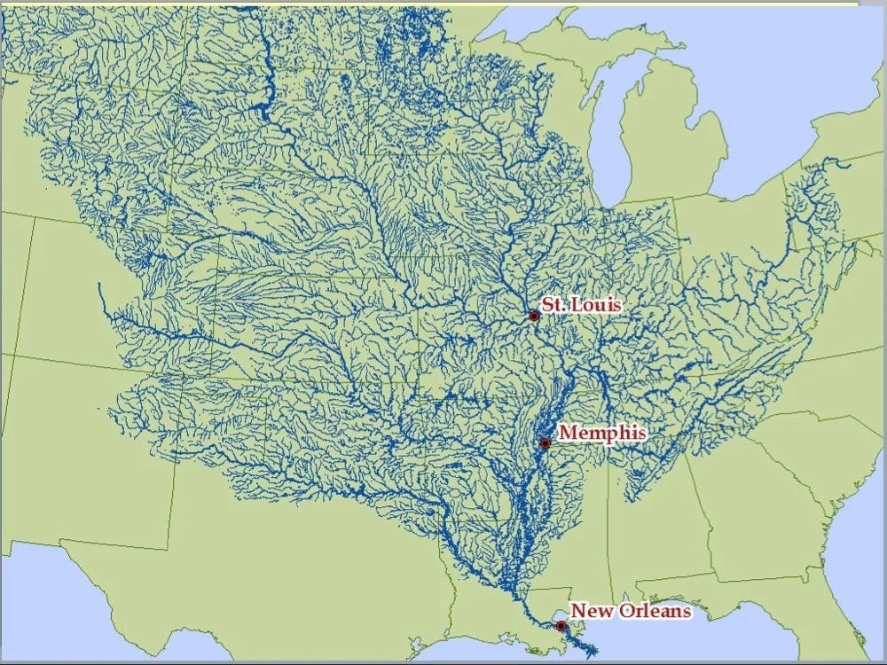
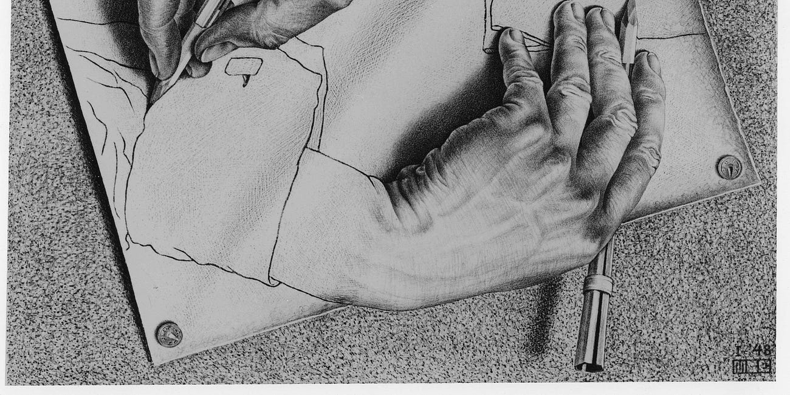

I was born in July 1989, which means I am of the last generation who will remember the time before the internet.  

我出生于1989年7月，这意味着我是最后一代还记得互联网出现之前的时代的人。  

The cables and data centers and hyperlinks grew up around me; they grew with me.  

电缆、数据中心和超链接在我周围生长；他们和我一起成长。  

I find it hard to disentangle the evolution of my psyche from that of the internet.  

我发现很难将我的心理演变与互联网的演变区分开来。

Explaining it to my daughter, who was born in 2017, a year when the world’s largest economy had begun tearing itself apart from the tension of this ever-evolving network, I tell her that the internet is like an alien intelligence.  

我向我的女儿解释这一点，她出生于 2017 年，这一年世界最大的经济体开始摆脱这个不断发展的网络的紧张局势，我告诉她，互联网就像一个外星智慧体。  

We don’t know exactly what it is; it has just landed, and only the first ship.  

我们不知道它到底是什么；它刚刚登陆，而且只有第一艘船。  

We are trying to figure out how to talk to it.  

我们正在尝试找出如何与它对话。  

The first generation of explorers have noted that by making certain finger motions you can make the aliens show you images of cats and clothes, or tell you all the ways the world is falling apart.  

第一代探险家指出，通过做出某些手指动作，你可以让外星人向你展示猫和衣服的图像，或者告诉你世界正在崩溃的所有方式。

For a long time, I thought this was all there was to it.  

很长一段时间，我以为这就是全部了。  

I could tap the keyboard in a particular way and the screen would show me the weather, or tell me which translation of the Iliad to read and then make someone jump in a truck and drive it to our house.  

我可以以特定的方式敲击键盘，屏幕会向我显示天气，或者告诉我要阅读《伊利亚特》的哪个译本，然后让某人跳上卡车并将其开到我们家。

I preferred the Iliad to the screen.

  

比起银幕，我更喜欢《伊利亚特》。

But then, late 2021, after I had been making intricate finger movements again, I woke up in our guesthouse before sunrise and noticed that something had changed.  

但后来，2021 年末，当我再次进行复杂的手指动作后，日出前我在宾馆醒来，发现有些东西发生了变化。

During the night, the internet had been set in motion.  

到了晚上，互联网就开始活跃起来。  

Tossing hither and thither in silence—as the fields lay frozen and waiting and the hedgehog slept in its pile of leaves—the internet had rearranged itself around me.  

我默默地翻来覆去——田野结冰了，等待着，刺猬在树叶堆里睡觉——互联网在我周围重新布置了自己。

I had written an essay about Ivan Illich and systems thinking, a topic I had never found anyone else intrigued by, and which magazines thought below a rejection letter—and the internet had suddenly reshaped itself so that my keyboard hooked up to the screens of a bunch of people who wanted to talk about these topics, and a little later, their keyboards hooked up to mine.  

我写了一篇关于伊万·伊利奇和系统思维的文章，我从未发现其他人对这个话题感兴趣，而且杂志在拒绝信下面也认为这些话题是这样的——而互联网突然重塑了自己，让我的键盘连接到了一台电脑的屏幕上。一群想谈论这些话题的人，过了一会儿，他们的键盘就连接到了我的键盘上。

I had written for 15 years, but never before had this happened. I had conjured a minor conference!  

我已经写了15年了，但以前从未发生过这种情况。我召唤了一个小型会议！  

And I hadn’t even known that you could _do_ that.  

我什至不知道你能做到这一点。

[Upgrade to paid  

升级至付费](https://escapingflatland.substack.com/subscribe?utm_medium=web&utm_source=magaziney-home-page&just_signed_up=true&requires_confirmation=&subscription_id=51966669&next=https%3A%2F%2Fescapingflatland.substack.com%2F)

This gave me a first glimpse of the social mechanics of the internet.  

这让我第一次了解了互联网的社会机制。  

Looking at the traffic data, and talking to readers, I could retrace how my words had traveled through the network, and I got a sense of why.  

通过查看流量数据并与读者交谈，我可以追溯我的文字是如何通过网络传播的，并且我明白了原因。

I didn’t fully understand it; I don’t think anyone does.

  

我没有完全理解它；我认为没有人这样做。  

But like a scientist who’s got hold of an alien artifact, I proceeded by gleefully and semi-randomly pushing every button I could find to see what happened.  

但就像一位科学家拿到了外星文物一样，我继续兴高采烈地半随机地按下我能找到的每一个按钮，看看发生了什么。  

I would think of a series of funny finger movements and then I’d say to myself, LOL I wonder what this combination does?  

我会想到一系列有趣的手指动作，然后我会对自己说，哈哈，我想知道这个组合有什么作用？  

And then I’d try.  

然后我会尝试。

The way the machine seemed to work was:    

这台机器的工作方式似乎是：

1.  The more precise and niche the words I input, the better the internet would match me with people I could forge meaningful relationships with.  
    
    我输入的词语越精确、越利基，互联网就越能将我与可以建立有意义关系的人匹配起来。  
    
    This precision was hard for me, partly because my sense for how communication is supposed to work is shaped by reading mass media.  
    
    这种精确性对我来说很难，部分原因是我对沟通应该如何运作的感觉是通过阅读大众媒体形成的。  
    
    Writing for a general public, you need to be broad and a bit bland. I didn’t want a general public.  
    
    为大众写作，你需要广泛而平淡。我不想要公众。  
    
    I wanted a specific set of people, the people who could help me along as a human being obsessed with certain intellectual problems. I didn’t know who these people _were_. I only knew that they existed. Hence my writing was a search query.  
    
    It needed to be phrased in such a way that it found these people and, if necessary, filtered others.  
    
    它需要以这样的方式表达：它可以找到这些人，并在必要时过滤其他人。  
    
    我想要一群特定的人，这些人可以帮助我作为一个痴迷于某些智力问题的人。我不知道这些人是谁。我只知道它们存在。因此我的写作是一个搜索查询。
    
2.  The pleasant parts of the internet seemed to be curated by human beings, not algorithms. For my writing to find its way in this netherworld, I needed to have a rough sense of how information flowed down there.  
    
    互联网上令人愉快的部分似乎是由人类而不是算法策划的。为了让我的写作在这个阴暗世界找到出路，我需要对信息如何在那里流动有一个粗略的了解。  
    
    The pattern was this: words flowed from the periphery to the centers.  
    
    模式是这样的：文字从外围流向中心。  
    
    This was a surprisingly rapid stream.  
    
    这是一条令人惊讶的急流。  
    
    Then the words cascaded from the center down in a broader but slower stream to the periphery again.  
    
    然后，这些文字从中心向下，以更宽但更慢的速度再次流向外围。
    

I will spend the rest of this essay unpacking those two statements.  

我将用本文的其余部分来解析这两个陈述。

It will seem like I am mainly talking about how to use writing to forge meaningful relationships.  

看起来我主要是在谈论如何利用写作来建立有意义的关系。  

I think doing that is beautiful and important. But lurking behind it is a larger idea. Namely, that [you can shape yourself by reshaping your relationships](https://escapingflatland.substack.com/p/first-we-shape-our-social-graph-then). By changing who you are addressing, and the responses you garner, you steer your development. You [become more agentic](https://tomcritchlow.com/2022/08/29/blogging-agency/).  

我认为这样做是美丽且重要的。但其背后隐藏着一个更大的想法。也就是说，你可以通过重塑人际关系来塑造自己。通过改变你的对象和你获得的回应，你可以引导你的发展。你变得更加代理。

Human brains are wired such that we get rewarded for attending to surprisal.  

人类大脑的构造使得我们因关注惊喜而获得奖励。  

If we turn our attention toward things that surprise us we get _excited_—and our model of the world changes. It grows more complex.  

如果我们把注意力转向那些令我们惊讶的事情，我们就会感到兴奋——我们的世界观也会发生变化。它变得更加复杂。

This is easy at first. My one-year-old was in complete rapture today on seeing a hen.  

一开始这很容易。我一岁的孩子今天看到一只母鸡，非常高兴。  

But after a while, hens do not surprise us anymore, even if they are scratching dirt.  

但过了一段时间，母鸡就不再让我们感到惊讶了，即使它们正在抓土。  

We need a bigger hit to get the same high.  

我们需要更大的打击才能达到同样的高度。  

To make hens interesting again, you could perhaps read about how they originally lived in the jungle, or you might get into the biology of egg production, or, more likely, you’ll pursue something more interesting than hens.  

为了让母鸡再次变得有趣，你也许可以阅读它们最初如何生活在丛林中，或者你可能会了解产蛋的生物学，或者更有可能的是，你会追求比母鸡更有趣的东西。  

Any which way, by pursuing your interest, you will move toward complexity.  

无论哪种方式，通过追求你的兴趣，你都会走向复杂。  

The simple things do not surprise you anymore. So you turn your attention to more complicated things.  

简单的事情不再让你感到惊讶。所以你把注意力转向更复杂的事情。

This is an amazing algorithm: do interesting things and magically arrive at a complex understanding of the world.

  

这是一个令人惊奇的算法：做有趣的事情并神奇地获得对世界的复杂理解。

Sadly, it also leads you down a path that will likely end in existential loneliness and sobbing.  

可悲的是，它也会引导你走上一条可能以存在的孤独和哭泣而告终的道路。  

What leads you there is the fact that the particular complexity that catches your interest is highly idiosyncratic.  

促使您来到这里的原因是，引起您兴趣的特定复杂性是非常独特的。  

People get interested in all sorts of things.  

人们会对各种各样的事物产生兴趣。  

I have heard, from credible sources, that there even exist people who are interested in the names of Brazilian soccer players!  

我从可靠消息来源听说，甚至有人对巴西足球运动员的名字感兴趣！  

Having idiosyncratic interests that grow in complexity means that _if you pursue_ _them too far you will end up obsessed with things that no one else around you cares about_.  

拥有越来越复杂的特殊兴趣意味着，如果你追求得太过分，你最终会沉迷于周围其他人都不关心的事情。

(There is a counteracting force in that humans tend to mimic the interests of those around them.  

（存在一种反作用力，即人类倾向于模仿周围人的兴趣。  

But this is of little help for those of us for whom ”those around them” mostly means niche bloggers, contributors at Wikipedia, and [Erasmus of Rotterdam](https://en.wikipedia.org/wiki/Erasmus).)  

但这对于我们这些人来说几乎没有什么帮助，因为“他们周围的人”主要指小众博主、维基百科的贡献者和鹿特丹的伊拉斯谟。）

People feeling alone in their interests has always been true to a certain extent, but the internet has made it much worse.  

在某种程度上，人们在自己的利益上感到孤独一直是事实，但互联网让情况变得更糟。  

The excess of information allows you to travel down your path of interest with mad velocity.  

过多的信息可以让你以疯狂的速度沿着你感兴趣的道路前进。  

On the internet, Wonderland is recursive, with rabbit holes opening up to yet more rabbit holes; you never stop falling.  

在互联网上，仙境是递归的，兔子洞又会打开更多的兔子洞。你永远不会停止跌倒。  

And the further you fall, the less likely it is that anyone you’ve ever met is falling where you are.  

你跌倒得越远，你所遇到的人就越不可能跌倒在你所在的地方。  

This will make you immensely sad.  

这会让你感到无比悲伤。  

You will visit your parents, and when they ask you about your life you will have two choices.  

你将拜访你的父母，当他们询问你的生活时，你将有两个选择。  

You can either be incomprehensible and see them grow concerned about things you are excited about, or you can talk about surface-level things and cry a little when you are alone at night.  

你要么无法理解，看到他们对你感兴趣的事情越来越关心，要么你可以谈论一些表面的事情，并在晚上独自一人时哭一会儿。

The reason I’m spelling out this dynamic is twofold. First, you _can_ get out of this mess if you want to.  

You do that by writing online (or publishing cool pieces of software, or videos, or whatever makes you tickle—as long as you work in public).  

你可以通过在线写作（或发布很酷的软件、视频或任何让你兴奋的东西——只要你在公共场合工作）来做到这一点。

Second, if you want to get out of the mess the key lies exactly in understanding that you are not the only person who has no one to talk to about the things you get obsessed by.

  

其次，如果你想摆脱困境，关键在于要明白，你并不是唯一一个没有人可以谈论你所痴迷的事情的人。  

我阐明这种动态的原因是双重的。首先，如果你愿意的话，你可以摆脱这个困境。

When writing in public, there is a common idea that you should make it _accessible_. This is a left over from mass media.  

Words addressed to a large and diverse set of people need to be simple and clear and free of jargon.  

针对大量不同人群的语言需要简单明了，没有行话。  

It is valuable to write clearly of course, to a degree. Clear writing is clear thinking.  

当然，在某种程度上，写得清楚是有价值的。清晰的写作就是清晰的思维。  

But to make the content accessible?  

但要使内容易于访问吗？  

To cut digressions and obscure references to reduce the number of things people need to understand to make sense of your argument? Really?  

减少离题和晦涩的引用，以减少人们需要理解的东西来理解你的论点？真的吗？  

在公开场合写作时，有一个普遍的想法，那就是应该使其易于理解。这是大众媒体的遗留物。

That is against our purposes here. A blog post is _a search query_.  

You write to find your tribe; you write so they will know what kind of fascinating things they should route to your inbox.  

你写作是为了寻找你的部落；您这样写，他们就会知道应该将哪些有趣的内容发送到您的收件箱。  

If you follow common wisdom, you will cut exactly the things that will help you find these people.  

如果你遵循常识，你就会准确地削减那些能帮助你找到这些人的东西。  

It is like  

这违背了我们在这里的目的。博客文章是一个搜索查询。[the time](https://www.newyorker.com/magazine/2006/06/19/american-sublime) someone told the composer Morton Feldman he should write for “the man in the street”.  

Feldman went over and looked out the window, and who did he see? Jackson Pollock.  

费尔德曼走过去看向窗外，他看到了谁？杰克逊·波洛克。  

就像有人告诉作曲家莫顿·费尔德曼（Morton Feldman）他应该为“街上的人”写作一样。

Write for Jackson Pollock.  

为杰克逊·波洛克写作。

The people you will be able to have deep conversations with have, like you, already been surprised by the simple, clear things.  

那些能够与你进行深入对话的人，就像你一样，已经对简单、清晰的事情感到惊讶。  

They need more to get high. And this “more” will be wildly idiosyncratic.  

他们需要更多才能兴奋起来。而这个“更多”将是非常特殊的。  

It cannot be summarized in a list of writing rules.  

它不能用一系列的写作规则来概括。

So what do you do?  

所以你会怎么做？

You ask yourself: What would have made me jump off my chair if I had read it six months ago (or a week ago, or however fast you write)?  

你问自己：如果我六个月前（或一周前，或者无论你写得有多快）读过它，什么会让我从椅子上跳起来？  

If you have figured out something that made you ecstatic, this is what you should write.  

如果你发现了一些让你欣喜若狂的东西，这就是你应该写的。  

And you do not dumb it down, because you were not stupid six months ago, you just knew less.  

而且你不会把它简化，因为六个月前你并不愚蠢，你只是知道得更少。  

You also write with as much useful detail and beauty as you can muster, because that is what you would have wanted.  

你还可以尽可能多地写出有用的细节和美丽，因为这就是你想要的。

Six months ago, I was thinking about how large language models will affect how we learn. The essay [Using GPT-3 to augment human learning](https://escapingflatland.substack.com/p/gpt-3) would have made me jump off my chair and run out to Johanna talking excitedly and incomprehensibly; that’s why I wrote it.  

六个月前，我在思考大型语言模型将如何影响我们的学习方式。 《使用 GPT-3 增强人类学习》这篇文章会让我从椅子上跳起来，跑到 Johanna 面前，兴奋地、难以理解地说话；这就是我写它的原因。

To make it interesting for myself, I made it longish and detailed.  

为了让我自己感兴趣，我把它写得又长又详细。  

I like it when people don’t just talk in the abstract but show you with examples, preferably many examples, and preferably taken from the real world so they are messy.  

我喜欢人们不只是抽象地谈论，而是用例子向你展示，最好是很多例子，而且最好取自现实世界，这样它们就很混乱。  

Some people find this excess annoying. I don’t.  

有些人觉得这种多余的行为很烦人。我不。  

Rich data lets me develop a tacit understanding of the domain.  

丰富的数据让我对领域产生了默契。  

So I wrote 3000 words about how to prompt GPT-3 in ways that make it more truthful, and I included a long dialogue where the AI diagnoses Johanna’s itching hands; and another one about how cities affect innovation; and a third about digitally mediated apprenticeships.  

因此，我写了 3000 字关于如何以更真实的方式提示 GPT-3，并添加了一段长对话，其中 AI 诊断了 Johanna 手部发痒的情况；另一篇关于城市如何影响创新；第三个关于数字介导的学徒期。  

I also made the essay a bit literary and flamboyant, which you are not “supposed” to do when writing about AI, at least not if you want the average LessWrong reader to upvote it.  

我还让这篇文章变得有点文学性和浮夸，在撰写有关人工智能的文章时，你不“应该”这样做，至少如果你想让普通的 LessWrong 读者投票赞成的话，就不要这么做。  

I’m not the average Less Wrong reader; I much prefer Thomas Bernhard’s rants to Eliezer Yudkowsky’s.  

我不是一般的“Less Wrong”读者。与埃利泽·尤德科夫斯基的咆哮相比，我更喜欢托马斯·伯恩哈德的咆哮。  

Hence, I made it flamboyant.  

因此，我把它做得很华丽。

I’m not saying it was a great essay; I’m saying _I_ would have loved it.  

The essay would have answered most of the questions I had, and it would have given me a new more complex understanding of language models that I could have used to get excited by even more obscure things.  

这篇文章会回答我的大部分问题，它会让我对语言模型有一个新的、更复杂的理解，我可以用它来对更晦涩的事情感到兴奋。  

And because the internet is big, there were a few thousand people who felt the same way—and I felt really deeply for these people.  

因为互联网很大，所以有几千人有同样的感受——我对这些人感触很深。  

我并不是说这是一篇很棒的文章；我只是说这是一篇很棒的文章。我是说我会喜欢它的。

It is crazy-beautiful to have a stranger arrive in your inbox, and they are excited by exactly the same things as you!  

有一个陌生人来到你的收件箱真是太美妙了，他们对与你完全相同的事情感到兴奋！  

You start dropping the most obscure references, and they’re like, yeah, read that, love it.  

你开始放弃最晦涩的参考资料，他们会说，是的，读了它，喜欢它。  

The first handful of times it happened, Johanna asked me what was wrong.  

第一次发生这种情况时，约翰娜问我出了什么问题。  

I was crying in the kitchen.  

我在厨房里哭了。

Those were tears of homecoming.  

那是回家的泪水。

And—as if that wasn’t good enough—now these people are routing me interesting things about language models, cow breeding, Quintilian, 19th-century dictionaries, graph-based operating systems . . . and on and on . . . I get more and better input than I could ever have found on my own, a lot of it from sources outside the clear web, tinkerers writing to me about tools they are building, or new observations they have made.  

而且，好像这还不够好，现在这些人正在向我介绍有关语言模型、奶牛育种、昆体良、19 世纪词典、基于图形的操作系统等有趣的事情。 。 。等等。 。 。我获得了比我自己所能找到的更多、更好的输入，其中很多来自明网之外的来源，修补匠写信给我介绍他们正在构建的工具，或者他们所做的新观察。

In other words, I have, to a degree, automated my obsessions now.  

换句话说，在某种程度上，我现在已经自动化了我的痴迷。  

I have summoned a milieu that pulls me where I want to go!  

我召唤了一个环境，将我带到我想去的地方！

A search query doesn’t have to be a 5000-word effort post to work (though the internet does reward that amply).  

搜索查询不必是 5000 字的帖子才能发挥作用（尽管互联网确实对此给予了充分的奖励）。  

Anything that would have been useful to you sometime in the past will do.  

任何过去对你有用的东西都可以。  

Alexey Guzey makes lists, half of which are made up of quotes, and they are incredibly useful and have been instrumental in reshaping his network so that he could start New Science.  

Alexey Guzey 列出了一些清单，其中一半由引言组成，它们非常有用，并且在重塑他的网络方面发挥了重要作用，以便他能够开始新科学。

Most good Twitter accounts can be viewed in the same way.

  

大多数好的 Twitter 帐户都可以通过相同的方式查看。

If you follow the advice above, you will write essays that almost no one likes.  

如果您遵循上述建议，您将写出几乎没有人喜欢的论文。

Luckily, _almost no one_ multiplied by the entire population of the internet is plenty if you can only find them.  

幸运的是，如果你能找到他们，那么几乎没有人乘以互联网上的全部人口就足够了。

How do you do that?  

你是怎样做的？

Well, you can probably spot a few of them already, even if you are a fairly naive internet user.  

好吧，即使您是一个相当幼稚的互联网用户，您也可能已经发现了其中的一些。  

The people you can spot will be those that have large followings. This might depress you.  

您可以找到的人将是那些拥有大量追随者的人。这可能会让你感到沮丧。  

The famous people will seem out of reach, and the rest of the internet will seem to be pure madness.  

名人似乎遥不可及，而互联网上的其他内容似乎纯粹是疯狂的。

When starting out, my model of how it would work was this: I wouldn’t find any readers.  

刚开始时，我的运作模式是这样的：我找不到任何读者。  

And if I did, they would be plebeians like myself, and then, maybe? hopefully?  

如果我这样做了，他们就会像我一样成为平民，然后，也许呢？希望？  

as I found more of them, I would level up?  

当我发现更多的时候，我会升级吗？  

so that I could connect to people with increasingly large followings?  

这样我就可以与拥有越来越多追随者的人建立联系？  

like climbing a corporate hierarchy? This is not how it works.  

喜欢攀登公司层级？事情不是这样的。

The social structure of the internet is shaped like a river.  

互联网的社会结构就像一条河流。

People with big followings, say someone like Sam Harris, is the mouth of the Mississippi emptying into the Mexican Gulf.  

像萨姆·哈里斯这样的人说，拥有大量追随者的人是密西西比河注入墨西哥湾的河口。  

Sam has millions of tributaries.  

萨姆有数百万条支流。  

There are perhaps a few hundred people Sam pays close attention to, and these in turn have a few hundred they listen to—tributaries flowing into headwaters flowing into rivers.  

山姆可能密切关注数百人，而这些人又倾听数百人的意见——流入河流源头的支流。  

The way messages spread on the internet is by flowing up this order of streams, from people with smaller networks to those with larger, and then it spreads back down through the larger networks.  

消息在互联网上传播的方式是按照流的顺序向上流动，从网络较小的人到网络较大的人，然后通过较大的网络向下传播。  

Going over land, from one tributary to another, is harder than going up the stream order and then down again.  

穿越陆地，从一条支流到达另一条支流，比沿着河流顺流而上然后再顺流而下要困难得多。

This dynamic is easier to spot on Twitter, where you get notified every time someone likes or retweets what you have written (compared to a blog where the traffic data is more murky).  

这种动态在 Twitter 上更容易发现，每次有人点赞或转发您所写的内容时，您都会收到通知（与流量数据更加模糊的博客相比）。  

When I tried out the title of this piece as a tweet—a primitive way to A/B-test—I could map that dynamic.  

当我尝试将这篇文章的标题作为一条推文（A/B 测试的原始方式）时，我可以映射这种动态。

It was not a viral tweet.  

这不是一条病毒式推文。  

I am a minor tributary in the Twitter river system (my follower count was ~100 at the time).  

我是 Twitter 河流系统中的一个小支流（当时我的关注者数量约为 100）。  

But a few of my followers were slightly larger.  

但我的一些追随者稍微大一些。  

They had found me, I assume, because I made replies to their tweets that they sort of liked.  

我想他们找到了我，因为我回复了他们的推文，他们有点喜欢。  

Two of these, [Stian Håklev](https://twitter.com/houshuang) and [Tom Critchlow](https://twitter.com/tomcritchlow), resonated with the tweet, so they retweeted it.  

A few others gave it a heart, which is also a way to route tweets (though it is a weaker form of routing than a retweet).  

其他一些人给了它一颗心，这也是一种路由推文的方式（尽管它是一种比转发弱的路由形式）。  

其中两人，斯蒂安·哈克列夫（Stian Håklev）和汤姆·克里奇洛（Tom Critchlow），与这条推文产生了共鸣，因此他们转发了这条推文。

Then a few accounts that were an order of magnitude larger still retweeted it, because they followed Stian and Tom and now saw it.  

然后一些数量级大的账户仍然转发了它，因为他们关注了 Stian 和 Tom，现在看到了它。  

And from there it rushed up the stream order.  

从那里开始，它就顺着流顺序向上冲了。  

It only took an hour or two for the tweet to reach the largest accounts it would reach (Tiago Forte with 84k followers, who retweeted it, and Balaji Srinavasan with 681K, who routed it on through a like). But _the smaller accounts took much longer_. Information rushes up and then trickles down.  

The larger accounts are not larger without a reason, but, at least in part, because they spend more time routing information in the network!  

较大的帐户并非无缘无故地较大，但至少部分是因为它们花费更多的时间在网络中路由信息！  

这条推文只花了一两个小时就到达了最大的账户（蒂亚戈·福特 (Tiago Forte) 转发了这条推文，拥有 8.4 万粉丝，巴拉吉·斯里纳瓦桑 (Balaji Srinavasan) 通过点赞转发了这条推文，拥有 68.1 万粉丝）。但较小的账户需要更长的时间。信息涌上来，然后又流下来。

(This, by the way, is how you sent letters before the post service was established.  

（顺便说一句，这就是邮政服务建立之前寄信的方式。  

In the 1600s, if you were an intellectual who wanted to send a letter to another intellectual, you’d send it to someone who could forward it to Marin Mersenne—because he knew everyone who knew anyone and would surely know someone who could find the person you wanted to reach.  

在 1600 年代，如果你是一个知识分子，想要给另一个知识分子寄一封信，你就会把它寄给一个可以将其转发给马林·梅森的人——因为他认识每个认识任何人的人，并且肯定会认识一个能够找到信的人。您想要联系的人。  

This I learned from a tweet by [Visa](https://twitter.com/visakanv), who is the modern day version of Mersenne.)  

这是我从 Visa 的一条推文中了解到的，Visa 是现代版的 Mersenne。）

The trick, then, is this.  

那么，诀窍就是这个。  

You take the person you think is closest to the person (or type of person) you want to talk to and send what you write to this person.  

您选择您认为与您想要交谈的人（或类型的人）最接近的人，并将您写的内容发送给此人。  

A subreddit is a good place to start.  

Reddit 子版块是一个很好的起点。  

I usually do this by collecting interesting people on Twitter through good reply game.  

我通常通过良好的回复游戏在 Twitter 上收集有趣的人来做到这一点。  

Then I can simply post my essays there and know they will have a chance of seeing it.  

然后我可以简单地将我的论文发布在那里，并知道他们将有机会看到它。  

Occasionally—and this makes more sense in the start—I send essays to people directly, in their direct messages or to their email. I sent [Apprenticeship Online](https://escapingflatland.substack.com/p/apprenticeship-online) to José Rincón, mostly as a way to give context to a few comments I had on one of his essays.  

He didn’t answer, but he did tweet out the essay, which brought in a handful of interesting people in my orbit.  

他没有回答，但他确实在推特上发布了这篇文章，这让我认识了一些有趣的人。  

It turns out that if you’ve written something that   

有时——这在一开始更有意义——我会直接向人们发送论文，通过他们的私信或电子邮件。我向何塞·林孔（José Rincón）发送了《学徒在线》，主要是为了给我对他的一篇文章的一些评论提供背景。_you_ find interesting, it is not unlikely that people you like will find it interesting too, and pass it on if you give them the chance.  

事实证明，如果你写了一些你觉得有趣的东西，你喜欢的人也很可能会觉得它很有趣，并且如果你给他们机会的话，就会把它传递下去。

As you start routing information and putting out blog posts, you will begin to accumulate connections.  

当您开始传递信息并发布博客文章时，您将开始积累联系。  

Useful information will start to stream toward you, turning you into a small hub yourself.  

有用的信息将开始向您涌来，将您自己变成一个小中心。  

This will allow you to collect and curate information and route it back out, which will allow even more people to connect to you, in a flywheel that lets you do increasingly useful and good work.  

这将使您能够收集和整理信息并将其传回，这将使更多的人与您联系，在飞轮中让您做越来越有用和好的工作。  

I especially enjoy it when intelligent people attack me; I then invite them to comment on upcoming drafts.  

我特别喜欢聪明人攻击我；然后我邀请他们对即将发布的草案发表评论。

You can also post to subreddits and forums, like [LessWrong](https://www.lesswrong.com/) or [the SlateStarCodex subreddit](https://www.reddit.com/r/slatestarcodex/), that act like intellectual cafés on the internet.  

Pasting your posts there, it is easy to find community when you are starting out; you don't have to scream into the void.  

将您的帖子粘贴到那里，当您刚开始时很容易找到社区；你不必对着虚空尖叫。

And, more importantly, a lot of people pass through these cafés, and if they are 

  

您还可以在 Reddit 子版块和论坛上发帖，例如 LessWrong 或 SlateStarCodex Reddit 子版块，它们的作用就像互联网上的知识咖啡馆。_your kind_ they can help spread your work in the netherworld of personal connections and open weird doors on the internet for you.  

I relied heavily on forums in the beginning, gaining my first hundred or so subscribers this way, but they are growing less important now that I have collected a set of connections of my own.  

一开始我严重依赖论坛，通过这种方式获得了大约一百个订阅者，但现在我已经收集了一组自己的联系，它们变得不那么重要了。  

I can get a more precise spread of my essays by just emailing them to my subscribers and putting out a few tweets.  

我只需将我的文章通过电子邮件发送给我的订阅者并发布一些推文，就可以更准确地传播我的文章。  

But I feel deep gratitude, especially to LessWrong, which provides me with an editor who helps me with grammar and fact-checking.  

但我深感感激，尤其是LessWrong，它为我提供了一位编辑，帮助我进行语法和事实检查。  

而且，更重要的是，很多人都经过这些咖啡馆，如果他们是你的同类，他们可以帮助你在人际关系的阴暗世界中传播你的作品，并为你打开互联网上奇怪的大门。

By the way, the reason you will eventually grow out of forums is that _they are search queries written by other people_. LessWrong was summoned into existence by [Eliezer Yudkowsky](https://en.wikipedia.org/wiki/Eliezer_Yudkowsky) and [Robin Hanson](https://en.wikipedia.org/wiki/Robin_Hanson) writing a sequence of exceptionally powerful search queries (on Overcoming bias), blog posts so strong that the networks they created survived the exodus of the original nodes.  

顺便说一句，您最终会离开论坛的原因是它们是其他人编写的搜索查询。 LessWrong 是由 Eliezer Yudkowsky 和 Robin Hanson 创造的，他们编写了一系列异常强大的搜索查询（关于克服偏见），博客文章如此强大，以至于他们创建的网络在原始节点的外流中幸存下来。

This is what online writing is at its limit—the summoning of a new culture.  

这就是网络写作的极限——召唤一种新文化。

If we squint a little, we could even say that this is how the internet itself came into existence.  

如果我们稍微观察一下，我们甚至可以说，这就是互联网本身的诞生方式。  

In 1963, [J. C. R. Licklider](https://en.wikipedia.org/wiki/J._C._R._Licklider) wrote [a memo](http://worrydream.com/refs/Licklider-IntergalacticNetwork.pdf) about an “intergalactic computer network”, and that search query was so powerful it summoned the aliens.  

1963 年，J. C. R. Licklider 写了一份关于“星际计算机网络”的备忘录，该搜索查询的威力如此强大，以至于召唤了外星人。

We’re all living inside his search query now.  

我们现在都生活在他的搜索查询中。

Warmly,  

热烈地，  

Henrik  

亨里克

This is the third part of a series. Here are the previous parts:  

这是该系列的第三部分。这是前面的部分：

[## First we shape our social graph; then it shapes us  

首先我们塑造我们的社交图谱；然后它塑造了我们](https://escapingflatland.substack.com/p/first-we-shape-our-social-graph-then)

·

September 7, 2022  

2022 年 9 月 7 日

[This essay is the first of a series. Here is part 2 and part 3. Once you see the boundaries of your environment, they are no longer the boundaries of your environment.  

本文是该系列文章的第一篇。这是第 2 部分和第 3 部分。一旦您看到环境的边界，它们就不再是您环境的边界。  

Marshall McLuhan The inside of a womb looks as it did 70,000 years ago, but the world outside has changed.  

马歇尔·麦克卢汉 子宫内部看起来和七万年前没什么两样，但子宫外的世界已经发生了变化。  

In July 2021, when our daughter was born, the night sky didn’t light up with stars; it was lit up by the warm afterglow of sodium street lamps.  

2021年7月，我们的女儿出生时，夜空还没有星星；它被钠路灯温暖的余辉照亮。  

Green-clad women carried the baby away, pumping oxygen into her mouth.  

身穿绿衣的妇女将婴儿抱走，并向她的嘴里注入氧气。  

It was like something out of a sci-fi: she had woken up, without a memory, in an alien world.  

这就像科幻小说中的场景：她在一个陌生的世界中醒来，失去了记忆。  

Smeared in white-yellow fat, she didn’t know who she was nor what she was doing here.  

她浑身涂满了白黄色的脂肪，不知道自己是谁，也不知道自己在这里做什么。  

The only thing she knew, genetically, was that she needed to figure this out fast or die.  

从基因上来说，她唯一知道的是她需要快速解决这个问题，否则就会死。](https://escapingflatland.substack.com/p/first-we-shape-our-social-graph-then)
