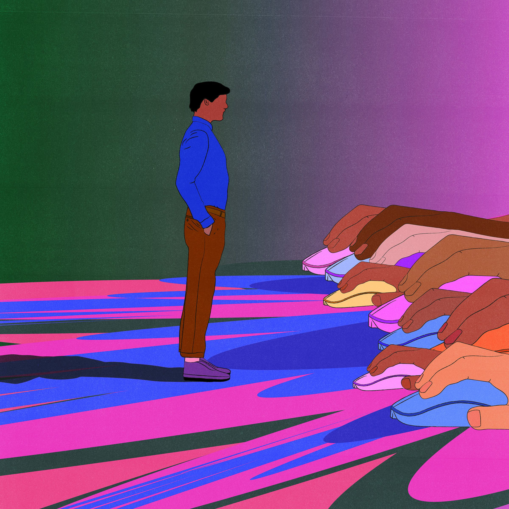

The alligator got my attention. Which, of course, was the point.  

鳄鱼引起了我的注意。当然，这才是重点。  

When you hear that a 10-foot alligator is going to be released at a rooftop bar in South Florida, at a party for the people being accused of ruining the internet, you can’t quite stop yourself from being curious.  

当您听说南佛罗里达州的一家屋顶酒吧将在一场为被指控破坏互联网的人们举行的聚会上释放一条 10 英尺长的鳄鱼时，您会忍不住感到好奇。  

If it was a link — “WATCH: 10-foot Gator Prepares to Maul Digital Marketers” — I would have clicked.  

如果它是一个链接——“观看：10 英尺高的鳄鱼准备攻击数字营销人员”——我会点击。  

But it was an IRL opportunity to meet the professionals who specialize in this kind of gimmick, the people turning online life into what one tech writer recently called a “[search-optimized hellhole](https://wheresyoured.at/p/the-internet-is-already-broken).” So I booked a plane ticket to the Sunshine State.   

但这是一个现实生活中的机会，可以见到专门从事这种花招的专业人士，这些人将在线生活变成了一位科技作家最近所说的“搜索优化的地狱”。于是我订了一张去阳光之州的机票。

I wanted to understand: what kind of human spends their days exploiting our dumbest impulses for traffic and profit?  

我想了解：什么样的人会利用我们最愚蠢的冲动来获取流量和利润？  

Who the hell are these people making money off of everyone else’s misery?   

这些人到底是谁从别人的痛苦中赚钱？

After all, a lot of folks are unhappy, in 2023, with their ability to find information on the internet, which, for almost everyone, means the quality of Google Search results.  

毕竟，到了 2023 年，很多人都对自己在互联网上查找信息的能力感到不满意，这对几乎每个人来说都意味着 Google 搜索结果的质量。  

The links that pop up when they go looking for answers online, they say, are “[absolutely unusable](https://www.theatlantic.com/podcasts/archive/2023/03/ai-future-google-bing-chatbots-tools/673256/)”; “[garbage](https://www.theverge.com/2023/5/12/23721323/ask-jeeves-remember-when-google-search-worked-ai)”; and “[a nightmare](https://www.theverge.com/23753963/google-seo-shopify-small-business-ai?src=longreads)” because “[a lot of the content doesn’t feel authentic](https://www.newyorker.com/culture/infinite-scroll/what-google-search-isnt-showing-you).” Some blame Google itself, asserting that an all-powerful, all-seeing, trillion-dollar corporation with a 90 percent market share for online search is corrupting our access to the truth.  

他们说，当他们在网上寻找答案时弹出的链接“绝对无法使用”； “ 垃圾”;和“一场噩梦”，因为“很多内容感觉不真实”。一些人指责谷歌本身，声称这家拥有 90% 在线搜索市场份额的全能、全知、价值数万亿美元的公司正在破坏我们获取真相的途径。  

But others blame the people I wanted to see in Florida, the ones who engage in the mysterious art of search engine optimization, or SEO.   

但其他人则指责我想在佛罗里达见到的人，那些从事搜索引擎优化（SEO）神秘艺术的人。

Doing SEO is less straightforward than buying the advertising space labeled “Sponsored” above organic search results; it’s more like the Wizard of Oz projecting his voice to magnify his authority.  

进行搜索引擎优化并不比购买有机搜索结果上方标有“赞助”的广告空间那么简单；这更像是绿野仙踪，通过发出声音来放大他的权威。  

The goal is to tell the algorithm whatever it needs to hear for a site to appear as high up as possible in search results, leveraging Google’s supposed objectivity to lure people in and then, usually, show them some kind of advertising.  

目标是告诉算法它需要听到的任何信息，以便网站在搜索结果中尽可能高地出现，利用谷歌所谓的客观性来吸引人们进入，然后通常向他们展示某种广告。  

Voilà: a business model!  

瞧：商业模式！  

Over time, SEO techniques have spread and become insidious, such that googling anything can now feel like looking up “sneaker” in the dictionary and finding a definition that sounds both incorrect and suspiciously as though it were written by someone promoting Nike (“footwear that allows you to just do it!”).  

随着时间的推移，SEO 技术已经传播并变得阴险，以至于现在用谷歌搜索任何东西都感觉就像在字典中查找“运动鞋”并找到一个听起来既不正确又可疑的定义，就好像它是由宣传耐克的人写的一样（“鞋类是让你就可以做到！”）。  

Perhaps this is why nearly everyone hates SEO and the people who do it for a living: the practice seems to have successfully destroyed the illusion that the internet was ever about anything other than selling stuff.   

也许这就是为什么几乎每个人都讨厌搜索引擎优化和以搜索引擎优化为生的人：这种做法似乎成功地摧毁了“互联网除了销售东西之外还有其他任何事情”的幻想。

So who ends up with a career in SEO?  

那么谁最终会从事 SEO 职业呢？  

The stereotype is that of a hustler: a content goblin willing to eschew rules, morals, and good taste in exchange for eyeballs and mountains of cash.  

人们对骗子的刻板印象是：一个满足的妖精，愿意避开规则、道德和良好品味，以换取眼球和大量现金。  

A nihilist in it for the thrills, a prankster gleeful about getting away with something.  

一个虚无主义者在其中寻求刺激，一个恶作剧者因逃脱惩罚而高兴。

“This is modern-day pirate shit, as close as you can get,” explained Cade Lee, who prepared me over the phone for what to expect in Florida based on over a decade working in SEO.  

“这是现代的海盗狗屎，你能得到的最接近的，”凯德·李解释说，他根据十多年来在 SEO 领域的工作经验，通过电话让我了解了佛罗里达州的预期。  

What Lee said he’s noticed most at SEO conferences and SEO networking events is a certain arrogance.  

Lee 说他在 SEO 会议和 SEO 网络活动中最注意到的是某种傲慢。  

“There’s definitely an ego among all of them,” he told me.  

“他们所有人中肯定都有自我，”他告诉我。  

“You succeed, and now you’re a genius. Now you’ve outdone Google.”  

“你成功了，现在你是个天才。现在你已经超越了谷歌。”

This year, _The Verge_ is exploring how Google Search has reshaped the web into a place for robots — and how the emergence of AI threatens Google itself.  

今年，The Verge 正在探索 Google 搜索如何将网络重塑为机器人的栖息地，以及人工智能的出现如何威胁 Google 本身。

The more I thought about search engine optimization and how a bunch of megalomaniacal jerks were degrading our collective sense of reality because they wanted to buy Lamborghinis and prove they could vanquish the almighty algorithm — which, technically, constitutes many algorithms, but we think of as a single force — the more I looked forward to going to Florida for this alligator party.  

我对搜索引擎优化的思考越多，以及一群自大狂的混蛋是如何降低我们集体的现实感的，因为他们想购买兰博基尼并证明他们可以战胜全能的算法——从技术上讲，它构成了许多算法，但我们认为单一的力量——我越期待去佛罗里达参加这个鳄鱼派对。  

Maybe, I thought, I would get to see someone who made millions clogging the internet with bullshit get the ultimate comeuppance.  

我想，也许我会看到那些靠胡言乱语堵塞互联网而赚了数百万美元的人得到最终的报应。  

Maybe an SEO professional would get attacked by a gigantic, prehistoric-looking reptile right there in front of me.  

也许一个 SEO 专业人士会被我面前的一个巨大的、看起来像史前的爬行动物攻击。  

Maybe I could even repackage such a tragedy into a sensationalized anecdote for a viral article about the people who do SEO for a living, strongly implying that nature was here to punish the bad guy while somehow also assuming the ethical high ground and pretending I hadn’t been hoping this exact thing would happen from the start.   

也许我什至可以将这样的悲剧重新包装成一篇耸人听闻的轶事，写在一篇关于那些以搜索引擎优化为生的人的病毒文章中，强烈暗示大自然是来惩罚坏人的，同时以某种方式占据道德制高点并假装我没有这样做。我从一开始就希望这件事会发生。

Because I, too, use Google.  

因为我也使用谷歌。  

I, too, want reliable and relevant things to come up when I look through this vast compendium of human knowledge.  

我也希望在浏览这部庞大的人类知识纲要时能找到可靠且相关的东西。  

And I, too, enjoy the sweet taste of revenge.   

而我，也享受着复仇的甜蜜滋味。

The first thing that went wrong at the alligator party was the alligator was only five and a half feet long, not 10 feet, as advertised.  

鳄鱼派对上出现的第一件事就是鳄鱼只有五英尺半长，而不是广告上说的十英尺长。  

Classic clickbait!   

经典点击诱饵！

The second thing that went wrong at the alligator party was that I found almost everyone I met to be sympathetic, or at least nice enough not to want to see them get maimed by a five-and-a-half-foot alligator.  

鳄鱼派对上出现的第二个问题是，我发现几乎我遇到的每个人都充满同情心，或者至少都足够好，不想看到他们被五英尺半的鳄鱼咬伤。  

My harshest assessment of the 200 digital marketers taking shots and swaying to a dancehall reggae band was that they dressed like they lived in Florida, which almost all of them did.   

我对这 200 名数字营销人员最严厉的评价是，他们的穿着就像住在佛罗里达州一样，几乎所有人都这么做。

Take Missy Ward, a blonde in an orange bandage dress so tight she told me she couldn’t take full steps.  

以米西·沃德 (Missy Ward) 为例，她是一位金发女郎，穿着橙色绷带连衣裙，太紧了，她告诉我她无法迈出完整的步伐。  

She laughed as she explained that she’d ordered the dress on Amazon and hadn’t tried it on until the day of the alligator party.  

她笑着解释说，她在亚马逊上订购了这件衣服，直到鳄鱼派对那天才试穿。  

Ward had a feisty, wry energy that made me want to root for her.  

沃德有一种活泼、讽刺的能量，这让我想支持她。  

When she started doing SEO in 1998, she said, it was “five girls and all dudes.” She eventually sold her company for $40 million.  

她说，当她 1998 年开始做 SEO 时，“五个女孩和所有男人”。她最终以 4000 万美元的价格卖掉了自己的公司。  

Somehow, in the moment, I was psyched to hear this.  

不知怎的，在那一刻，我听到这个消息很兴奋。  

She was being so patient, explaining the history of SEO and suggesting other people for me to reach out to.  

她非常耐心，解释了 SEO 的历史，并建议我可以联系其他人。  

I should really go talk with that guy across the room, who had a long-running podcast about SEO, she said, the one in the sky blue polo.    

我真的应该去和房间对面的那个人谈谈，他有一个关于 SEO 的长期播客，她说，就是那个穿着天蓝色 Polo 衫的人。

His name was Daron Babin, and I quickly learned he was just the kind of “modern-day pirate shit” guy I’d been warned about: thrilled at the opportunity to recount the brilliant trickery that had allowed him to line his pockets.  

他的名字叫达伦·巴宾（Daron Babin），我很快就知道他就是那种我曾被警告过的“现代海盗狗屎”家伙：很高兴有机会讲述让他中饱私囊的绝妙诡计。  

His SEO career got going in 1994, before Google even existed.  

他的 SEO 职业生涯始于 1994 年，当时 Google 还没有出现。  

“The air of manipulation was insane,” Babin told me.  

“操纵的气氛太疯狂了，”巴宾告诉我。  

“We had this weird community of geeks and nerds, and we all talked to each other about how we were beating the algorithms up,” he said.  

“我们有一个由极客和书呆子组成的奇怪社区，我们都互相谈论我们如何击败算法，”他说。  

“People were trying to outrank other people just for bragging rights.”   

“人们试图超越其他人只是为了吹牛。”

We were chatting on a patio overlooking the Atlantic Ocean, between the buffet and the band, when the host of the alligator party, Darren Blatt, came up to say how glad he was that I’d found Daron Babin.  

我们正在俯瞰大西洋的露台上，在自助餐和乐队之间聊天，这时鳄鱼派对的主持人达伦·布拉特走过来，说他很高兴我找到了达伦·巴宾。

“It was like I won the lottery, and I didn’t know how long it would last.”  

“就像我中了彩票一样，我不知道它会持续多久。”

Darren and Daron (pronounced the same way) have been friends for decades, since the era when Darren “D-Money” Blatt would throw rap star-studded internet marketing shindigs during the Adult Video News Awards in Vegas, back when sex sites were among the most advanced in technology, and Daron Babin was using SEO to promote offshore casinos and Viagra (“We were outranking Pfizer!”).  

达伦和达伦（发音相同）几十年来一直是朋友，从达伦·“D-Money”·布拉特在维加斯成人视频新闻奖期间举办说唱明星云集的互联网营销盛会开始，那时性爱网站是最受欢迎的网站之一技术先进，Daron Babin 正在使用 SEO 来推广离岸赌场和伟哥（“我们的排名超过了辉瑞！”）。  

Together, Darren and Daron managed to milk all three of the early online cash cows: porn, pills, and gambling.   

达伦和达伦一起成功地榨取了所有三个早期的在线摇钱树：色情、毒品和赌博。

As the internet became more regulated and mainstream, around the turn of the century, Darren noticed Daron’s SEO skills were increasingly in demand.  

随着互联网变得更加规范和主流，在世纪之交，达伦注意到达伦的 SEO 技能的需求越来越大。  

“I told him that he was missing the boat, that he needed to be a consultant and charge a few grand,” Darren said.   

“我告诉他，他错过了机会，他需要成为一名顾问并收取一些费用，”达伦说。

Daron took the advice, asking for $2,000 a day, and watched his career explode.  

达伦接受了建议，要求每天 2,000 美元，并眼睁睁地看着他的职业生涯爆炸式增长。  

“I would wake up in a city and not know what time zone I was in,” he recalled.  

“我会在一个城市醒来，却不知道自己身处哪个时区，”他回忆道。  

To slow the pace, he upped it to $5,000 a day, but “it seemed the more I raised my rates, the more gigs I was getting.”   

为了放慢节奏，他把工资提高到每天 5,000 美元，但“似乎我提高的工资越高，我得到的演出就越多。”

Nowadays, he mostly invests in cannabis and psychedelics.  

如今，他主要投资大麻和迷幻药。  

SEO just got to be too complicated for not enough money, he told me.  

他告诉我，SEO 太复杂了，资金不够。  

Ward had told me the same thing, that she had stopped focusing on SEO years ago.   

沃德也告诉过我同样的事情，她几年前就不再关注搜索引擎优化了。

I was considering how it was possible that so many people have been complaining recently about SEO ruining the internet if these people were telling me the SEO business is in decline when I met Jairo Bastilla.  

我在想，当我遇到 Jairo Bastilla 时，如果这些人告诉我 SEO 业务正在衰退，最近怎么可能有这么多人抱怨 SEO 破坏了互联网。  

He was the kind of tall, charming man who described himself multiple times as “a nerd,” and he pointed out that even though working directly with search engine rankings is “no longer monetizing at the highest payout,” the same “core knowledge of SEO” remains relevant for everything from native advertising to social media.   

他是那种高大、迷人的男人，多次形容自己是“书呆子”，他指出，尽管直接与搜索引擎排名合作“不再以最高的报酬赚钱”，但同样的“搜索引擎的核心知识” SEO”仍然与从原生广告到社交媒体的一切相关。

Translation? SEO is now baked into everything.  

翻译？ SEO 现在已融入一切。  

Bastilla, for example, specializes in email campaigns, which he called “deliverability.”   

例如，巴斯蒂拉（Bastilla）专门从事电子邮件营销活动，他称之为“送达率”。

As a person who militantly unsubscribes to any and all marketing emails, I suddenly felt claustrophobic, surrounded by people who annoy the rest of us for a living.  

作为一个激进地取消订阅所有营销电子邮件的人，我突然感到幽闭恐惧症，周围都是那些以惹恼我们其他人为生的人。  

Why does it always seem to surprise me, even after all these years, that the way we behave on the internet is often quite different from how we act in real life?   

为什么这么多年过去了，我们在互联网上的行为方式往往与现实生活中的行为方式大不相同，这似乎总是让我感到惊讶？

I wandered off to wait in line for a drink, where I noticed several people nonchalantly making space in a corner, as if to move out of the way for a bartender carrying empty glasses.  

我走开去排队喝一杯，发现有几个人若无其事地在角落里腾出空间，好像是在给拿着空杯子的调酒师让路。  

There, squirming along the ground, was the alligator himself, wagging his tail, snout held shut by a thin strip of electrical tape.  

鳄鱼本人在地上蠕动，摇着尾巴，鼻子被一条薄薄的电工胶带封住。  

His handler was nowhere in sight.  

他的经纪人不见踪影。  

It was an unsettling vision, a predator pretending to be just another party guest.  

这是一个令人不安的景象，一个掠夺者假装成另一个派对客人。

“They should untape the mouth!” someone shouted. “I’m not even scared.”  

“他们应该解开嘴巴！”有人喊道。 “我什至都不害怕。”

As sunset turned to dusk, I found Daron Babin again, and he started telling me about one of his signature moves, back in the ’90s, involving fake domain names: “I could make it look like it was somebody else, but it actually redirected to me!” What he and his competitors did was legal but well beyond what the dominant search engine allowed.  

日落时分，黄昏时分，我再次找到了达龙·巴宾 (Daron Babin)，他开始向我讲述他在 90 年代的一项标志性举措，涉及假域名：“我可以让它看起来像是别人的，但实际上重定向到我这里了！”他和他的竞争对手所做的事情是合法的，但远远超出了占主导地位的搜索引擎所允许的范围。  

He never faced any consequences, but in the end, internet users at large felt the effects: “It muddied up Yahoo, ultimately,” he said, “but while it worked, we banked.”  

他从未面临任何后果，但最终，广大互联网用户感受到了影响：“它最终让雅虎陷入了困境，”他说，“但当它起作用时，我们就赚了钱。”

The situation sounded familiar. But I liked Babin.  

这种情况听起来很熟悉。但我喜欢巴宾。  

He was funny and smart, a keen observer of the SEO world.  

他风趣又聪明，是 SEO 世界的敏锐观察者。  

“We’re entering a very weird time, technologically, with AI, from an optimization standpoint,” he told me.  

“从优化的角度来看，我们正在进入一个非常奇怪的时代，从技术上讲，人工智能，”他告诉我。  

Anyone who thought the internet was already saturated with SEO-oriented content should buckle up.   

任何认为互联网已经充斥着 SEO 导向内容的人都应该系好安全带。

“All the assholes that are out there paying shitty link-building companies to build shitty articles,” he said, “now they can go and use the free version of GPT.” Soon, he said, Google results would be even worse, dominated entirely by AI-generated crap designed to please the algorithms, produced and published at volumes far beyond anything humans could create, far beyond anything we’d ever seen before.  

他说：“所有那些付钱给糟糕的链接建设公司来构建糟糕的文章的混蛋，现在他们可以去使用免费版本的 GPT 了。”他说，很快，谷歌的结果将变得更糟，完全由人工智能生成的垃圾所主导，这些垃圾旨在取悦算法，产生和发布的数量远远超出了人类可以创造的任何东西，远远超出了我们以前见过的任何东西。

“They’re not gonna be able to stop the onslaught of it,” he said.  

“他们无法阻止它的猛烈攻击，”他说。  

Then he laughed and laughed, thinking about how puny and irrelevant Google seemed in comparison to the next generation of automated SEO.  

然后他笑了又笑，想着与下一代自动化搜索引擎优化相比，谷歌显得多么微不足道和无关紧要。  

“You can’t stop it!”   

“你阻止不了！”

Once I was safe at home, my alligator attack bluster having deflated into an irrepressible affection for clever scoundrels, mixed with fear about the future promised by said scoundrels, I decided to seek a broader range of the people who do SEO for a living.  

当我安全回到家后，我的鳄鱼攻击咆哮已经消退为对聪明的恶棍无法抑制的喜爱，再加上对这些恶棍所承诺的未来的恐惧，我决定寻找更广泛的以SEO为生的人。  

Perhaps the ones who live in Florida were simply too, well, _Florida_, and the ones who live elsewhere might be more principled?  

也许住在佛罗里达州的人就是佛罗里达州，而住在其他地方的人可能更有原则？  

An old contact heard I was writing about SEO and suggested I find a man he called Legendary Lars: “He was an absolute god in that space.”   

一位老联系人听说我正在写有关 SEO 的文章，并建议我找一个他称之为传奇拉尔斯的人：“他是那个领域的绝对神。”

I tracked down Lars Mapstead in Northern California, where he was preparing to run for president in 2024 as a Libertarian.  

我在北加州找到了拉尔斯·马普斯特德 (Lars Mapstead)，他正准备以自由主义者的身份竞选 2024 年总统。  

Mapstead spent the first two years of his life in a Volkswagen van traveling the Pacific coast before his hippie parents settled on a Big Sur property with goats, chickens, and no electricity.  

马普斯特德（Mapstead）在他的嬉皮父母定居于大苏尔（Big Sur）的一处房产之前，在一辆大众面包车中度过了他生命的头两年，在太平洋沿岸行驶，那里有山羊、鸡，而且没有电。  

He became a tinkerer and an autodidact, the guy who reads the instruction manual and fixes everything himself.  

他成为了一个修补匠和自学者，一个阅读说明书并自己修复所有东西的人。  

When he first heard about the World Wide Web, it was 1993, and he was working for a company selling computer motherboards.   

当他第一次听说万维网时，是 1993 年，当时他正在一家销售电脑主板的公司工作。

“It’s like the freedom of information!” he remembered thinking.  

“这就像信息自由！”他记得他在想。  

“It’s all just about collaborating and bettering mankind!”    

“这一切都是为了合作并改善人类！”

He learned how to build a website and then how to submit a site to be listed in early search directories like AltaVista, WebCrawler, Infoseek, and Lycos.  

他学习了如何构建网站，然后如何提交网站以列入早期搜索目录（如 AltaVista、WebCrawler、Infoseek 和 Lycos）中。  

He learned how to create chat rooms, attracting people spread across the globe, all alone in their homes but together online.  

他学会了如何创建聊天室，吸引世界各地的人们，他们独自在家，但在网上聚集在一起。  

It was beautiful. It was exciting.  

它过去挺美。这很令人兴奋。  

Mapstead saw himself as an explorer in a small but finite kingdom. “I had surfed the entire internet.  

马普斯特德将自己视为一个小而有限的王国的探险家。 “我已经浏览了整个互联网。  

There wasn’t a page I hadn’t seen.”  

没有一页我没看过。”

And then, one day, a company in New York offered to pay him $2,000 a month to put banner ads on one of his websites, and everything changed.  

然后，有一天，纽约的一家公司提出每月支付 2,000 美元，让他在他的一个网站上投放横幅广告，一切都改变了。  

More clicks meant more ad dollars. Higher search engine rankings meant more clicks.  

更多的点击次数意味着更多的广告收入。更高的搜索引擎排名意味着更多的点击次数。  

So whatever it took to get a higher ranking, he learned how to do.  

因此，无论怎样才能获得更高的排名，他都学会了如何去做。  

He bought photographs of women in bikinis and made a 60-page slideshow with banner ads on each page.  

他购买了穿比基尼的女性照片，并制作了 60 页的幻灯片，每页都带有横幅广告。  

He realized that most search engines were just listing websites in order of how many times a search term appeared on the site and in its tags, so he focused on stuffing his sites with keywords, resubmitting his URL to the search engines, and waiting for the results to change.   

他意识到大多数搜索引擎只是按照搜索词在网站及其标签中出现的次数的顺序列出网站，因此他专注于用关键字填充他的网站，将他的 URL 重新提交给搜索引擎，然后等待结果要改变。

Mapstead started pulling in $25,000–$30,000 a month, working 12- to 14-hour days.  

Mapstead 开始每月工作 12 至 14 小时，每月收入 25,000 至 30,000 美元。  

“It was how long could I stay awake and how little life could I have because this was more money than I could have ever imagined in my lifetime,” he told me.  

“问题是我能保持清醒多久，我的生命能有多少，因为这是我一生中无法想象的更多钱，”他告诉我。  

“It was like I won the lottery, and I didn’t know how long it would last.”   

“就像我中了彩票一样，我不知道它会持续多久。”

Around this time, in 1997, an Italian professor published a [journal article](https://www.w3.org/People/Massimo/papers/WWW6/) about what he called Search Engines Persuasion.  

大约在 1997 年的这个时候，一位意大利教授发表了一篇关于他所谓的“搜索引擎说服”的期刊文章。  

“Finding the right information on the World Wide Web is becoming a fundamental problem,” he wrote.  

“在万维网上找到正确的信息正在成为一个基本问题，”他写道。  

“A vast number of new companies was born just to make customer Web pages as visible as possible,” which “has led to a bad performance degradation of search engines.”   

“大量新公司的诞生只是为了让客户网页尽可能可见”，这“导致了搜索引擎性能的严重下降”。

Enter Google.  

输入谷歌。  

The company revolutionized search by evaluating websites based on links from other websites, seeing each link as a vote of relevance and trustworthiness.  

该公司根据其他网站的链接评估网站，将每个链接视为相关性和可信度的投票，从而彻底改变了搜索。  

The founders pledged to be a neutral navigation system with no ads: just a clean white screen with a search box that would bring people off of the Google landing page and out to a helpful website as seamlessly as possible.  

创始人承诺成为一个没有广告的中立导航系统：只有一个带有搜索框的干净的白色屏幕，可以让人们离开谷歌登陆页面，并尽可能无缝地进入一个有用的网站。  

Users quickly decided this link-based sorting methodology was superior to the existing search engines, and by the end of 1999, Google was handling the majority of online queries.  

用户很快就认为这种基于链接的排序方法优于现有的搜索引擎，到 1999 年底，Google 已经处理了大部分在线查询。

“I was basically just spamming Facebook with cars and articles about cars and sending traffic to banner ads, and that turned into $120,000 a month.”  

“我基本上只是在 Facebook 上发送汽车和有关汽车的文章，并将流量发送到横幅广告，结果每个月就赚到了 12 万美元。”

Mapstead, like many of the early practitioners of SEO, figured out how to adapt.  

Mapstead 和许多 SEO 的早期实践者一样，找到了适应的方法。  

Almost as soon as Google took over, a secondary market emerged for links.  

几乎在谷歌接管之后，链接的二级市场就出现了。  

For a few hundred bucks, a firm in India or the Philippines could provide thousands of links from blog networks built entirely for that purpose.  

只需几百美元，印度或菲律宾的一家公司就可以从完全为此目的而建立的博客网络中提供数千个链接。  

It was easy: buy links that led to your site and watch your ranking in Google’s results rise.  

这很简单：购买指向您网站的链接，然后观察您在 Google 结果中的排名上升。

I came to understand that, since the dawn of the internet, there have been people attempting to manipulate search and then people decrying those manipulations as the end of search’s ability to be useful.  

我开始明白，自从互联网诞生以来，就有人试图操纵搜索，然后人们谴责这些操纵，认为搜索的有用性已经结束。  

It works in cycles.  

它循环工作。  

People doing SEO find loopholes in the algorithm; critics complain about search results; search engines innovate and close the loopholes.  

做SEO的人发现算法中的漏洞；批评者抱怨搜索结果；搜索引擎不断创新并堵住漏洞。  

Rinse, repeat.  

冲洗，重复。

Before our current moment of widespread disillusionment with online information, the rise of SEO had reached a breaking point multiple times.  

在我们当前对在线信息普遍失望之前，搜索引擎优化的兴起已经多次达到了临界点。  

In 2003, as Google approached the deadline to disclose pertinent business information leading up to its IPO, the company quietly released an update cracking down.  

2003年，当谷歌临近披露IPO相关商业信息的最后期限时，该公司悄悄发布了最新的打击措施。  

By 2011, SEO was once again oppressively pervasive. _TechCrunch_ published a story called “Why We Desperately Need a New (and Better) Google,” which argued that “Google has become a jungle: a tropical paradise for spammers and marketers.” In the next year, Google made two major changes to the algorithm, which came to be called Panda and Penguin.  

到 2011 年，SEO 再次盛行。 TechCrunch 发表了一篇题为“为什么我们迫切需要一个新的（更好的）谷歌”的报道，其中认为“谷歌已经成为一个丛林：垃圾邮件发送者和营销人员的热带天堂。”第二年，谷歌对算法进行了两次重大改变，被称为“熊猫”和“企鹅”。

While the public might have experienced each of these updates as a relief, Mapstead and his SEO compatriots saw them as devastating.  

虽然公众可能已经将这些更新视为一种解脱，但 Mapstead 和他的 SEO 同胞却认为它们是毁灭性的。  

“They change the rules instantly overnight, and then you’re out of business,” he told me.  

“他们一夜之间就改变了规则，然后你就破产了，”他告诉我。  

“Here you’re trying to rely on this business model to feed yourself and your family, and they’re pulling the rug from underneath you, and you’ve gotta scramble to pay rent.”    

“在这里，你试图依靠这种商业模式来养活自己和家人，但他们却在剥夺你的利益，你必须争先恐后地支付租金。”

But don’t worry about Mapstead.  

但不用担心 Mapstead。  

This is a guy seemingly blessed with a never-ending mental stream of schemes.  

这是一个似乎拥有永无休止的计划的精神流的人。  

He helped start a handful of companies, including the once-ubiquitous hookup site AdultFriendFinder, which sold in 2007 for $500 million.  

他帮助创办了几家公司，其中包括曾经风靡一时的交友网站 AdultFriendFinder，该网站于 2007 年以 5 亿美元的价格出售。  

He tried to retire after that but got bored and started a couple of Facebook pages devoted to his passion for hot rods and custom cars.  

此后他试图退休，但感到无聊，并在 Facebook 上开设了几个页面，专门表达他对改装车和定制汽车的热情。  

This was during the peak years for social media, and just as Bastilla had described back at the alligator party, Mapstead’s “core knowledge of SEO” came in handy.  

当时正值社交媒体的鼎盛时期，正如巴斯蒂拉在鳄鱼派对上所描述的那样，Mapstead 的“SEO 核心知识”派上了用场。  

Before long, his pages had 25 million followers.  

不久之后，他的页面就有了 2500 万粉丝。  

“I was basically just spamming Facebook with cars and articles about cars and sending traffic to banner ads, and that turned into $120,000 a month,” he told me.  

“我基本上只是在 Facebook 上发送汽车和有关汽车的文章，并将流量发送到横幅广告，结果每个月就赚到了 12 万美元，”他告诉我。  

“And that was supposed to be my hobby!”  

“那应该是我的爱好！”

As I spoke with more SEO professionals around the country, I began to think that the reason I found them endearing and not evil was that while many had made quite a bit of money, almost none had amassed significant power.  

当我与全国各地更多的 SEO 专业人士交谈时，我开始认为，我发现他们可爱而不是邪恶的原因是，虽然许多人赚了很多钱，但几乎没有人积累了重要的权力。  

Unlike the Elon Musks and Jeff Bezoses of the world, who went from geeky teenagers to masters of the universe, the dorks who grew up to do SEO have stayed the butt of the joke, beholden to the fluctuations of the algorithm, frantically pulling levers behind the scenes but ultimately somewhat hapless.   

与世界上的埃隆·马斯克和杰夫·贝索斯从极客青少年成长为宇宙大师不同，那些长大后做SEO的傻瓜们一直是笑柄，受制于算法的波动，疯狂地拉动杠杆。但最终还是有些倒霉。

I mean, have I even mentioned that they call themselves “SEOs”? Really.  

我的意思是，我有没有提到过他们称自己为“SEO”？真的。  

They say things like, “As the SEO, my job is to get more traffic.” This title feels thirsty to be seen as similar to a CEO, to be taken seriously.  

他们会说，“作为 SEO，我的工作是获得更多流量。”这个头衔让人感觉渴望被视为类似于首席执行官，渴望被认真对待。  

And compared to the rest of the tech world, SEO has always lacked a certain glamor or a certain messiah complex.  

与科技界的其他领域相比，SEO 始终缺乏某种魅力或某种救世主情结。  

Case in point: while many of the tech CEOs claiming to save the world these days live in Miami, the alligator party was an hour up the coast in Fort Lauderdale.  

举个例子：虽然现在许多声称要拯救世界的科技首席执行官都住在迈阿密，但鳄鱼派对却在距劳德代尔堡海岸一小时车程的地方。

“The SEO people are just trying to make money,” said Peter Kent, the author of several dozen explanatory tech books, including _SEO for Dummies_ and _Bitcoin for Dummies_.  

“SEO 人员只是想赚钱，”彼得·肯特 (Peter Kent) 说，他是数十本解释性技术书籍的作者，其中包括《SEO for Dummies》和《Bitcoin for Dummies》。  

“The cryptocurrency people are trying to make money, but they’re also trying to overthrow, you know, the existing system.”   

“加密货币人们试图赚钱，但他们也试图推翻现有的体系。”

Kent has done his fair share of SEO jobs but also has something of an outsider’s perspective.  

Kent 完成了他应得的 SEO 工作，但也有一些局外人的视角。  

For years, he’s been telling people that part of the SEO industry’s reputation problem is that 80 percent of SEOs are scammers.   

多年来，他一直告诉人们，SEO 行业声誉问题的部分原因是 80% 的 SEO 都是骗子。

“A lot of companies and individuals out there selling their services as SEO gurus don’t know what they’re doing or don’t really give a damn,” he explained.  

“许多以 SEO 专家身份出售服务的公司和个人并不知道自己在做什么，或者根本不在乎，”他解释道。  

As a consultant, he’s often had businesses ask him to vet the work of other SEOs.  

作为一名顾问，他经常有企业要求他审查其他 SEO 的工作。  

“I would take a look at their site and determine the firm had done next to nothing and had been charging thousands a month for years on end.”  

“我会查看他们的网站，并确定该公司几乎什么也没做，而且多年来一直每月收取数千美元的费用。”

When I ran this 80 percent scam figure by other SEOs, most agreed it sounded accurate, though people were divided about what to ascribe to greed and what was just stupidity.    

当我通过其他 SEO 计算这个 80% 的骗局数字时，大多数人都认为这听起来很准确，尽管人们对于哪些归因于贪婪、哪些只是愚蠢存在分歧。

“It isn’t because they have a scammer’s heart,” said Bruce Clay.  

“这并不是因为他们有一颗骗子的心，”布鲁斯·克莱说。  

“It’s because they don’t have the real expertise.” Clay is an avuncular man with a mustache who is often credited with coining the phrase “search engine optimization” and is therefore called “the father of SEO.” He told me his agency never hires an SEO with less than a decade of experience.  

“这是因为他们没有真正的专业知识。”克莱是一位留着小胡子、慈祥的男人，人们常常认为他创造了“搜索引擎优化”一词，因此被称为“搜索引擎优化之父”。他告诉我，他的机构从不雇用经验不足十年的 SEO。

“I don’t know if you can trust anything you read online.”  

“我不知道你是否可以相信你在网上读到的任何内容。”

Though Google publishes guidelines explaining how to do better in search (“Make your site interesting and useful”), the exact formula for how and why one website gets placed over another is top secret, meaning that SEO involves a lot of reverse engineering and guesswork.  

尽管谷歌发布了指导方针，解释如何在搜索中做得更好（“让你的网站变得有趣和有用”），但一个网站如何以及为什么被放置在另一个网站上的确切公式是绝密的，这意味着搜索引擎优化涉及大量的逆向工程和猜测。  

With no clear chain of cause and effect around why a site’s ranking has changed, a less talented practitioner can take on the mien of a premodern farmer, struggling to figure out how to make it rain.  

由于没有明确的因果链来解释网站排名变化的原因，一个不太有才华的从业者可能会表现出前现代农民的样子，努力弄清楚如何下雨。  

Should he do that dance he did last year the night before it poured?  

他应该跳去年倾盆大雨前一天晚上跳的那支舞吗？  

Or maybe sacrifice his firstborn?  

或者也许牺牲他的长子？

The algorithm is just too opaque, too complicated, and too dynamic, making it easy for scammy SEOs to pretend they know what they’re doing and difficult for outsiders to sort the good SEOs from the bad.  

该算法太不透明、太复杂、太动态，使得诈骗 SEO 很容易假装他们知道自己在做什么，而外人很难区分好 SEO 和坏 SEO。  

To make things even more confusing for, say, a small business looking to hire someone to improve their Google ranking, even a talented SEO might need a year of work to make a difference, perhaps implying a good SEO was a scammer when in fact, the client was just being impatient or refusing to implement essential advice.  

让事情变得更加混乱的是，比如说，一家小企业想要雇用某人来提高他们的谷歌排名，即使是一个有才华的 SEO 也可能需要一年的工作才能有所作为，这可能意味着一个好的 SEO 是一个骗子，而事实上，客户只是不耐烦或拒绝实施重要的建议。

“There’s a great deal of effort that’s required to do things to move the needle, and a lot of companies aren’t willing to put out the money for that, even though it may be worthwhile in the long run,” said John Heard, a longtime SEO based in Kansas. 

  

约翰·赫德 (John Heard) 表示：“要取得进展需要付出巨大的努力，许多公司不愿意为此投入资金，尽管从长远来看这可能是值得的。”一位来自堪萨斯州的长期 SEO 人员。

Of course, some people bristled at the very suggestion that the industry is filled with con artists.  

当然，有些人对这个行业充满骗子的说法感到愤怒。  

“There are a lot of scammers in every single business.  

“每个行业都有很多骗子。  

It’s just easier to call yourself an SEO than a doctor,” said Barry Schwartz.  

称自己为 SEO 比称自己为医生更容易。”Barry Schwartz 说道。  

Schwartz is an unbelievably fast talker and a prolific writer who has spent the past two decades covering SEO for the trade rag _Search Engine Land_. Both over the phone with me and in his [work](https://searchengineland.com/misquoted-and-misunderstood-why-we-the-search-community-dont-believe-the-wsj-about-google-search-325241), he has defended SEO as a legitimate, dignified pursuit: “The search community is filled with hard-working individuals working to help their clients’ websites succeed in Google Search.  

施瓦茨是一位令人难以置信的语速很快的人，也是一位多产的作家，在过去的二十年里，他一直在为行业新闻搜索引擎领域报道 SEO。无论是在与我的电话中还是在他的工作中，他都捍卫 SEO 是一种合法、有尊严的追求：“搜索社区充满了勤奋的个人，他们致力于帮助客户的网站在 Google 搜索中取得成功。  

That success is not done through dark, corrupt or shady tactics but rather hard, smart and thorough work.”  

这种成功不是通过黑暗、腐败或阴暗的策略实现的，而是通过艰苦、聪明和彻底的工作实现的。”

Several people that I spoke to made a similar point: the best SEOs are the ones that follow Google’s rules, which essentially ask you to make amazing websites without even thinking about Google.  

与我交谈过的几个人也提出了类似的观点：最好的 SEO 是遵循 Google 规则的搜索引擎优化，这些规则本质上要求你在不考虑 Google 的情况下创建令人惊叹的网站。  

You are not supposed to make _any_ attempt to artificially boost a website’s ranking; you are supposed to be designing websites for human readers, not for the algorithm.  

您不应该尝试人为地提高网站的排名；你应该为人类读者设计网站，而不是为算法设计。  

And many SEOs do exactly this kind of work: rewriting copy, making a site load more quickly, etc.  

许多 SEO 正是做这种工作：重写副本、使网站加载速度更快等。  

But the existence of good SEOs does not negate the presence of scammers and idiots and people who get ahead by violating Google’s terms of service, just as the mild-mannered teacher’s pet in a classroom does not negate the obnoxious shouting of the kids that refuse to behave.  

但是，好的 SEO 的存在并不能消除骗子、白痴以及通过违反 Google 服务条款而获得成功的人的存在，就像教室里温和的老师的宠物并不能消除拒绝的孩子们令人讨厌的叫喊一样。表现。  

A few loud kids can easily drown everyone else out.   

一些吵闹的孩子很容易淹没其他人。

Even Schwartz acknowledged the effect that the rule-breaking SEOs have had on the internet experience.  

甚至施瓦茨也承认，违反规则的 SEO 对互联网体验产生了影响。  

We get to talking about the types of small businesses that are particularly lucrative customers for SEOs, including lawyers, accountants, and contractors, because these are the professions eager for attention from all the people going online to find local recommendations.  

我们开始讨论对 SEO 来说特别有利可图的客户类型的小型企业，包括律师、会计师和承包商，因为这些职业渴望受到所有上网寻找本地推荐的人的关注。  

If Schwartz himself had to hire a reliable attorney, I asked, what would be the best way to do so?  

我问，如果施瓦茨本人必须聘请一位可靠的律师，最好的方法是什么？

“I don’t know if you can trust anything you read online,” he told me. “Maybe you ask a friend.”   

“我不知道你是否可以相信你在网上读到的任何内容，”他告诉我。 “也许你可以问问朋友。”

After hearing so much about what it was like to be an SEO, I decided it was time to better understand what’s been going on from the perspective of the search engine.  

在听了这么多关于 SEO 的感受后，我决定是时候从搜索引擎的角度更好地了解正在发生的事情了。  

Google was slow to allow someone to talk with me, possibly because of the giant PR clusterfuck that has been the company’s past year (accused by the federal government of being a monopoly; increasingly despised by the public; losing ground to Reddit, TikTok, and large language models), so I decided to start by meeting up with a chipper, charismatic man named Duane Forrester.  

谷歌迟迟不让别人与我交谈，可能是因为该公司过去一年的公关混乱（被联邦政府指责为垄断；越来越受到公众的鄙视；输给了 Reddit、TikTok 和大型语言模型），所以我决定首先会见一位精力充沛、富有魅力的人，名叫杜安·福雷斯特 (Duane Forrester)。

Forrester was at Microsoft from 2007 until 2015, where he helped launch and manage Bing, the perpetual underdog to Google’s domination of online search.  

Forrester 从 2007 年到 2015 年在微软工作，帮助推出和管理 Bing，而 Bing 在谷歌在线搜索领域的统治地位中始终处于劣势。  

Before and after his time at Microsoft, Forrester worked as an SEO, so he sees the industry from both sides, like an aerospace engineer who spent a few years at the Department of Defense, left for the private sector, and now is much better at winning military contracts.  

Forrester 在微软工作前后担任过 SEO 职务，因此他从两个方面看待这个行业，就像一位航空航天工程师在国防部工作了几年，后来转到私营部门，现在在这方面做得更好了。赢得军事合同。  

Forrester has a holistic understanding of the delicate push and pull between the SEOs desperate for clues on how to do their jobs better and the search engine trying to keep its secret-sauce algorithm proprietary.  

Forrester 对迫切需要如何更好地完成工作的 SEO 和试图保持其秘密算法专有性的搜索引擎之间微妙的推拉关系有着全面的了解。  

He also knows a huge range of people in the industry.  

他还认识该行业的众多人士。  

Like Schwartz, he wanted to emphasize how hard everyone works.  

和施瓦茨一样，他想强调每个人都有多么努力工作。  

“I’ve lost track of how many people I know who built companies and sold them and have just, like, made wealth,” he told me.  

他告诉我：“我已经记不清有多少我认识的人创建了公司，然后卖掉了它们，然后就赚到了财富。”  

“That is not a 40-hour commitment in the week.  

“这不是每周 40 小时的承诺。  

That is a 400-hour commitment.” (For the record, there are 168 hours in a week.)  

这是 400 小时的承诺。” （根据记录，一周有 168 个小时。）

These days, Forrester lives in Los Angeles, and he asked me to meet him at one of his favorite restaurants, which felt like a British pub operated by Disney World, tucked away in a desert strip mall.  

这些天，福雷斯特住在洛杉矶，他邀请我去他最喜欢的一家餐厅见他，那家餐厅感觉就像是迪士尼世界经营的一家英国酒吧，藏在沙漠地带的购物中心里。  

Inside, every inch was covered in Anglophile paraphernalia, including Union Jack flags, a mural of Big Ben, and a red phone booth.  

里面的每一寸地方都铺满了亲英用具，包括英国国旗、大本钟壁画和红色电话亭。  

Over a full English breakfast, he told me about growing up in rural Canada, where his parents owned a motel.  

在享用全套英式早餐时，他向我讲述了他在加拿大农村长大的经历，他的父母在那里拥有一家汽车旅馆。  

As a kid, he used to mess around with the pay phone outside, eventually figuring out how to finagle free long-distance phone calls.  

小时候，他经常在外面摆弄公用电话，最终找到了如何拨打免费长途电话的方法。  

“And then it became, ‘What else can I know how to do?’”  

“然后就变成了，‘我还能知道该怎么做吗？’”

By the ’90s, Forrester was trading tips with other SEOs in online forums. He still remembers the thrill of the very first SEO conference he went to, where he was asked to speak.  

到了 90 年代，Forrester 开始在在线论坛上与其他 SEO 人员交换技巧。他仍然记得他参加的第一次 SEO 会议时的兴奋，当时他被邀请发言。  

“The people who got up onstage to talk were seen as somehow more knowledgeable, but I don’t know that we felt that way,” he said.  

“上台演讲的人被认为在某种程度上更有知识，但我不知道我们是否有这种感觉，”他说。  

“You all kind of knew you were making shit up.”   

“你们都知道自己在胡编乱造。”

After years of being friends online, the SEOs were eager to let loose in person, giving off what Forrester described as “that vibe of a lot of young people with access to a lot of money.  

在成为多年的网上朋友之后，SEO 们渴望亲自释放自己，散发出 Forrester 所描述的“很多年轻人拥有很多钱的氛围。  

And it was like, no expenses spared in New York City.”   

就好像在纽约市不遗余力一样。”

“What’s the worst thing you’ve ever done?”  

“你做过的最糟糕的事情是什么？”

For Forrester, it was the start of a long career of keynote presentations and consummate schmoozing — Clay, the father of SEO, described him to me as “a cruise director” on the SS SEO.  

对于 Forrester 来说，这是他漫长的主题演讲和完美闲聊职业生涯的开始——SEO 之父 Clay 向我形容他是 SS SEO 上的“游轮总监”。  

The conference circuit has treated Forrester well.  

巡回会议对 Forrester 的待遇很好。  

He’s attended events in Napa, Hawaii, and Barbados, among many others, as well as “an infinite number of private dinners and these types of things in every city you can think of, at the most lavish restaurants,” he said.  

他参加过纳帕、夏威夷和巴巴多斯等地的活动，并“在你能想到的每个城市、最豪华的餐厅参加过无数次私人晚宴和此类活动”，他说。  

“I’ve lost track of how many Michelin-starred meals I’ve had, ’cause it’s now in the dozens, from my time in this industry.  

“我已经记不清自己吃过多少米其林星级餐了，因为从我从事这个行业以来，现在已经有几十顿了。  

And I’m not going to say no to the dinner that everyone’s going to, that one company is sponsoring because it’s a thank you to everybody who contributed to, whatever it was, you know?  

我不会拒绝每个人都会参加的、一家公司赞助的晚宴，因为这是对所有做出贡献的人的感谢，无论是什么，你知道吗？  

And you go and everybody has a good time. You talk about the industry, and that’s it.  

你走了，每个人都玩得很开心。你谈论这个行业，仅此而已。  

And it becomes the stuff of legends.”  

它成为了传奇。”

Over the years, he’s seen it all.  

这些年，他已经看到了这一切。  

He remembered “walking into hotel rooms and it’s two o’clock in the morning, there’s drugs and alcohol and everything everywhere, and there’s a party going on.” Forrester marveled at the audacity of his fellow SEOs.  

他记得“走进酒店房间，当时是凌晨两点，到处都是毒品和酒精，还有一场派对正在举行。” Forrester 对他的 SEO 同事们的大胆感到惊叹。  

“Somebody showed up and brought her Aston Martin to a conference and parked it at the front door.  

“有人出现，带着她的阿斯顿·马丁去参加一个会议，并将车停在前门。  

Immediately got a parking ticket.” He suggested she might want to relocate the car before it got towed, but the woman told him she would just move it to the next parking spot and get another ticket.  

立刻就收到了停车罚单。”他建议她可能想在汽车被拖走之前重新安置汽车，但那位女士告诉他，她只需将车移到下一个停车位并再拿一张罚单。  

“She goes, ‘It’s cheaper for me to leave the car parked out front and use it as a way to start conversations with potential clients than it is for me to rent a suite at the hotel and get people to go to the suite to have the same conversation.’” Then, she offered to take Forrester for a joyride around Seattle.  

“她说，‘对我来说，把车停在前面并用它作为与潜在客户开始对话的方式，比我在酒店租一套套房并让人们去套房更便宜。同样的对话。”然后，她提出带福雷斯特去西雅图兜风。  

Obviously, he said yes.  

显然，他说是。

Once he represented Bing, Forrester more or less stopped drinking at conferences, as had long been the case for his counterpart at Google, an engineer named Matt Cutts, who helped build and then ran the company’s web spam team before stepping back in 2014 and leaving in 2016.   

一旦代表 Bing，福雷斯特就或多或少地不再在会议上喝酒了，就像他在谷歌的同事、一位名叫马特·卡茨 (Matt Cutts) 的工程师长期以来的情况一样，他帮助建立并管理了该公司的网络垃圾邮件团队，然后于 2014 年辞职并离开。 2016年。

Cutts was a celebrity among SEOs, constantly mobbed with questions and complaints.  

卡茨是 SEO 中的名人，经常受到问题和投诉的困扰。  

When we spoke on the phone, he told me that before he left, he determined that he had sent about 50,000 emails to people outside of Google during his decade and a half at the company.   

当我们通电话时，他告诉我，在他离开之前，他确定自己在公司工作十五年期间，已经向 Google 以外的人员发送了大约 50,000 封电子邮件。

Several SEOs described trying to get Cutts to drink at conferences so he would “spill secrets,” as one put it, but what generally ended up happening was that all the SEOs would get drunk instead.  

一些 SEO 描述了试图让卡茨在会议上喝酒，这样他就能“泄露秘密”，正如一位人士所说，但最终发生的情况通常是所有 SEO 都喝醉了。  

Meanwhile, Cutts would stay sober, jotting down the latest SEO methods on a small notepad, sitting quietly in the corner at the bar.   

与此同时，卡茨会保持清醒，安静地坐在酒吧的角落里，在小记事本上记下最新的 SEO 方法。

“My favorite question to ask an SEO,” Cutts told me, was, “What’s the worst thing you’ve ever done?” which prompted responses that felt like “a cross between showing off and a confessional.” So many SEOs were tempted to reveal the vulnerabilities they’d discovered in Google’s algorithms, even when they were talking to the one person they really shouldn’t have been talking to, the guy who was planning to go back to his office and make those vulnerabilities disappear.   

“我最喜欢问 SEO 的问题是，”卡茨告诉我，“你做过的最糟糕的事情是什么？”这引发了“介于炫耀和忏悔之间的反应”。许多搜索引擎优化人员都试图揭露他们在谷歌算法中发现的漏洞，即使他们正在与一个他们真正不应该交谈的人交谈，这个人正计划回到他的办公室并制作那些漏洞消失。

As a former SEO himself, Forrester understood that the quality of Bing’s search results would be impacted by the work of SEOs, so it made sense to communicate with SEOs as much as possible.  

作为一名前 SEO 人员，Forrester 明白 Bing 搜索结果的质量会受到 SEO 工作的影响，因此尽可能与 SEO 沟通是有意义的。  

Cutts similarly tried to serve as a conduit between SEOs and Google, but Forrester felt that Google projected an attitude he described as: “We know what we’re doing, we will stop your attempts to game this, and you know what?  

卡茨同样试图充当 SEO 和谷歌之间的桥梁，但 Forrester 认为谷歌表现出一种他所描述的态度：“我们知道我们在做什么，我们将阻止你玩弄这个游戏的企图，你知道吗？  

We’ll just kind of ignore you, and when you give us feedback, eh, we don’t really care.”   

我们会忽略你，当你给我们反馈时，呃，我们并不真正关心。”

Cutts, as an individual, seemed to be doing his best within an expanding corporate behemoth to remain approachable.  

卡茨作为个人，似乎在一个不断扩张的企业巨头中竭尽全力保持平易近人。  

“One thing I learned early on was that even when someone was shouting at you, there’s a kernel of something you needed to hear in the other person and listen to and respect and integrate and incorporate,” he told me.  

“我很早就了解到的一件事是，即使有人对你大喊大叫，你也需要从对方身上听到一些核心的东西，倾听、尊重、整合和融入，”他告诉我。  

Most SEOs told me they appreciated his efforts.  

大多数搜索引擎优化人员告诉我，他们赞赏他的努力。  

When Google released the 2011 Panda update that devastated a generation of SEO businesses, Cutts openly recognized the impossible task of achieving the kind of epistemological neutrality that Google’s founders had initially promised, telling _Wired_ at the time, “\[T\]he only way to be neutral is either to randomize the links or to do it alphabetically.”   

当谷歌发布 2011 年熊猫更新摧毁了一代 SEO 业务时，卡茨公开承认实现谷歌创始人最初承诺的认识论中立性是一项不可能的任务，他当时告诉《连线》杂志，“这是唯一的方法中立是要么随机化链接，要么按字母顺序排列。”

Still, some blamed him personally for “[killing](https://www.seroundtable.com/jason-calacanis-revenge-google-matt-cutts-18794.html)” companies that had relied on the previous iteration of the algorithm.  

尽管如此，一些人仍指责他个人“扼杀”了依赖该算法之前迭代的公司。  

During his time at Google, Cutts regularly received death threats and hate mail.  

在谷歌任职期间，卡茨经常收到死亡威胁和仇恨邮件。  

When SEOs would send, say, a fruit plate or a brownie cake addressed to him at Google’s offices, he told me, “We’d take it down to the kitchen with a note warning: possibly poisoned.”  

当搜索引擎优化人员在谷歌办公室向他寄送果盘或布朗尼蛋糕时，他告诉我，“我们会把它带到厨房，并附上警告：可能有毒。”

After Cutts left, Google replaced him with a handful of people, none of whom could quite fill his shoes: “Those personalities sometimes were standoffish,” Forrester told me.  

卡茨离开后，谷歌用少数人取代了他，但没有一个人能完全填补他的空缺：“这些人有时很冷漠，”福雷斯特告诉我。  

“Some of them were superior. Some of them were a bit too wallflower.”   

“他们中的一些人更优秀。他们中的一些人有点太壁花了。”

One of the people Google brought in was Danny Sullivan, a former journalist who started _Search Engine Land_, the industry publication where Schwartz works, back in the 2000s.  

丹尼·沙利文 (Danny Sullivan) 是谷歌引进的人之一，他曾是一名记者，早在 2000 年代就创办了施瓦茨工作的行业出版物《Search Engine Land》。  

In 2009, Sullivan was described as “the closest approximation to an umpire in the search world,” so when he published “[A deep look at Google’s biggest-ever search quality crisis](https://searchengineland.com/google-search-quality-crisis-272174)” in 2017 and then took a job as Google’s public liaison for Search only a few months later, it felt to some SEOs as though a congressperson working on gun safety legislation had quit to become an NRA lobbyist.   

2009年，沙利文被形容为“最接近搜索界裁判的人”，因此当他在2017年发表《深入剖析谷歌有史以来最大的搜索质量危机》后，便出任谷歌搜索公共联络员。仅仅几个月后，一些 SEO 就感觉好像一名致力于枪支安全立法的国会议员已经辞职，转而成为全国步枪协会的游说者。

“There is a thread across the industry of people who believe that Google just made Danny an offer he couldn’t say no to, and it was designed essentially to take his voice out of the conversation,” Forrester told me.  

福雷斯特告诉我：“整个行业有一种观点认为，谷歌刚刚向丹尼提出了一个他无法拒绝的提议，其目的本质上是为了让他的声音远离谈话。”  

“I don’t believe that’s the case,” he went on, but compared to Cutts, “I think that Danny specifically stays out of a lot of public conversations because he is in those private conversations with businesses.”  

“我不认为是这样，”他继续说道，但与卡茨相比，“我认为丹尼特别远离很多公开对话，因为他参与的是与企业的私人对话。”

Was all that really Google’s fault? Or the SEOs?  

这一切真的都是谷歌的错吗？还是搜索引擎优化？  

Or was this about something deeper and more human: the will to exploit something so much we destroy it.  

或者这是关于更深刻、更人性化的东西：过度利用某样东西以至于摧毁它的意愿。

When I finally manage to jump through the flaming rings necessary to be allowed to speak on the phone with Sullivan, albeit with a communications chaperone also on the line, I find him angry and defensive.  

当我终于设法跳过必要的火环，允许与沙利文通电话时，尽管还有一名通讯陪同人员也在通话中，我发现他很生气，而且很防御。  

He’s annoyed that anyone would think his era at Google has been less transparent than Cutts’ was: “We have reams of help documents!” he told me.  

他很恼火，因为有人会认为他在谷歌的时代不如卡茨的时代透明：“我们有大量的帮助文档！”他告诉我。  

“We have more people assigned to work with SEOs than we did when Matt worked here!”   

“与 Matt 在这里工作时相比，我们分配到 SEO 工作的人员更多了！”

Sullivan is mad that the public and the media don’t really understand what he considers to be basic precepts about how search works, leading him to adopt a rather [scolding tone](https://twitter.com/searchliaison/status/1681409472999350273) online.  

沙利文很生气，因为公众和媒体并不真正理解他认为的搜索工作原理的基本规则，导致他在网上采取了相当责骂的语气。  

He’s frustrated that people want to know every last detail about Google’s algorithm because even “if we listed all one thousand of the ranking signals” and how much each was worth, he said, that wouldn’t actually help SEOs do their jobs better, anyway.   

他对人们想要了解谷歌算法的每一个细节感到沮丧，因为即使“我们列出了所有一千个排名信号”以及每个排名信号的价值，他说，这实际上并不能帮助 SEO 更好地完成工作。

And most of all, Sullivan is pissed that people think Google results have gone downhill.  

最重要的是，沙利文对人们认为谷歌业绩下滑感到愤怒。  

Because they haven’t, he insisted. If anything, search results have gotten a lot better over time.  

因为他们没有，他坚持说。如果说有什么不同的话，那就是随着时间的推移，搜索结果已经变得更好了。  

Anyone who thought search quality was worse needed to take a hard look in the mirror.  

任何认为搜索质量较差的人都需要认真审视一下镜子。

“We have an entire generation that grew up expecting the search box to do the work for them,” he said.  

“我们整整一代人在成长过程中都期待着搜索框为他们做这些工作，”他说。  

“We might do a better job of matching for a bulk of people, but for people who are super sensitive, when they have that fail moment, now it becomes, ‘All my searches aren’t good.’”  

“我们可能会更好地为大多数人匹配，但对于超级敏感的人来说，当他们遇到失败的时刻时，现在就会变成，‘我所有的搜索都不好。’”

The problem was not Google. The problem was not SEOs. The problem was _kids these days_.   

问题不在于谷歌。问题不在于 SEO。现在的问题是孩子们。

Of course Sullivan would say this, though. He works for Google.  

沙利文当然会这么说。他在谷歌工作。  

I felt like I began to understand why many SEOs had told me that Cutts’ departure had marked a major turning point in the history of the internet, emblematic of Google’s transition from idealistic startup to one of the most valuable and powerful companies to ever exist.  

我觉得我开始理解为什么许多 SEO 告诉我卡茨的离开标志着互联网历史上的一个重大转折点，象征着谷歌从理想主义初创公司转变为有史以来最有价值、最强大的公司之一。  

Over the phone, Cutts came off as humble and thoughtful, acknowledging the nuances and challenges of the search engine business, while Sullivan sounded like an impatient corporate stooge, trying to gaslight me into believing the sky was red.   

在电话中，卡茨表现得谦虚而深思熟虑，承认搜索引擎业务的细微差别和挑战，而沙利文听起来像一个不耐烦的公司走狗，试图让我相信天空是红色的。

But here’s the part where I started to feel the way I’ve felt so often in recent years, like I was losing my grip on reality: Sullivan was not the only person who tried to tell me that search results have improved significantly.  

但从这里开始，我开始感受到近年来经常有的感觉，就像我失去了对现实的控制：沙利文并不是唯一一个试图告诉我搜索结果已经显着改善的人。  

Out of the dozen-plus SEOs that I spoke with at length, nearly every single one insisted that search results are way better than they used to be.  

在我详细交谈过的十几位 SEO 中，几乎每个人都坚持认为搜索结果比以前好得多。  

And except for Sullivan, these were not people with an incentive to praise Google.  

除了沙利文之外，这些人都没有动力去赞扬谷歌。  

If anything, these were folks who lamented how much harder it had become for them to take advantage of Google.  

如果说有什么不同的话，那就是这些人哀叹他们越来越难以利用谷歌。  

Today, they told me, search results are just objectively more accurate. More useful.  

今天，他们告诉我，搜索结果客观上更加准确。更有用。  

More difficult to manipulate.   

更难操纵。

This was not what I had been noticing, and this was certainly not what I had been hearing from friends and journalists and friends who are journalists.  

这不是我注意到的，这当然也不是我从朋友、记者和记者朋友那里听到的。  

Were all of us wrong? Or engulfed in some kind of Baader–Meinhof frequency bias delusion?  

难道我们都错了？或者陷入某种 Baader-Meinhof 频率偏差错觉中？  

Had I been researching a nonexistent problem?  

我是否一直在研究一个不存在的问题？  

Were Google results actually amazing? Truly, I had lost the plot.  

谷歌的结果真的很惊人吗？确实，我已经失去了情节。  

Was the premise of this piece completely off? Was I the asshole who deserved to be attacked by an alligator?   

这件作品的前提完全不成立吗？我是那个该被鳄鱼袭击的混蛋吗？

I began to worry all the people who were mad about search results were upset about something that had nothing to do with metrics and everything to do with feelings and ~vibes~ and a universal, non-Google-specific resentment and rage about how the internet has made our lives so much worse in so many ways, dividing us and deceiving us and provoking us and making us sadder and lonelier.  

我开始担心所有对搜索结果感到愤怒的人都对一些与指标无关、与感受和〜氛围有关的东西感到不安，以及对互联网如何运作的普遍的、非谷歌特有的怨恨和愤怒。在很多方面让我们的生活变得更加糟糕，分裂我们，欺骗我们，激怒我们，让我们更加悲伤和孤独。  

Decades of American optimism about the wonderful potential of technology, from the Moon landing to personal computers to the iPhone, had finally, in the last few years, broken down into comprehensive chagrin at the petty, pathetic, and violent world enabled by our devices.  

从登月到个人电脑再到iPhone，美国人几十年来对技术的巨大潜力抱有乐观态度，但在过去的几年里，终于变成了对我们的设备所带来的琐碎、可悲和暴力的世界的全面懊恼。  

Was all that really Google’s fault? Or the SEOs?  

这一切真的都是谷歌的错吗？还是搜索引擎优化？  

Or was this about something deeper and more human: the will to exploit something so much we destroy it.  

或者这是关于更深刻、更人性化的东西：过度利用某样东西以至于摧毁它的意愿。  

To muddy it up, as Babin had put it, but while it worked, to make as much fucking money as possible.   

正如巴宾所说，把事情搞砸，但在有效的同时，尽可能多地赚他妈的钱。

The person who helped me snap out of my confusion spiral was an SEO named Lily Ray.  

帮助我摆脱困惑的人是一位名叫 Lily Ray 的 SEO。  

Ray is a 30-something jet-setter with black-line tattoos and an asymmetrical, dyed blonde pixie cut.  

雷 (Ray) 是一位 30 多岁的富豪，有着黑线纹身和不对称的染金发精灵发型。  

I managed to catch her for lunch in Brooklyn between speaking gigs in Chicago and Berlin on a day when she was also simultaneously managing a 35-person team at her digital marketing agency, posting multiple times an hour on social media, dog-sitting for a Pomeranian whose “daddies” were at Burning Man, caring for her own mini Australian shepherd, and organizing the house party she was hosting that weekend — a party she expected to be late for because she first had to drop by a rooftop to perform a DJ set at a different party.   

我设法在芝加哥和柏林的演讲间隙在布鲁克林与她共进午餐，那天她还同时管理着她的数字营销机构的一个 35 人团队，每小时在社交媒体上发帖多次，为一个人看管狗。博美犬的“爸爸”在火人节，照顾她自己的迷你澳大利亚牧羊犬，并组织她那个周末举办的家庭聚会——她预计会迟到，因为她首先要到屋顶表演 DJ设置在不同的聚会上。

Ray reassured me that I was not crazy. Google results today _do_ feel different from how they felt just five or six years ago for two major reasons.  

雷向我保证我没有疯。今天的谷歌结果确实与五六年前的感觉不同，有两个主要原因。  

The first was Google’s response to the disinformation panic around the 2016 election, which involved questioning the notion that the most reliable information could be chosen by a form of popularity, meaning how many links a site received from other sites.  

第一个是谷歌对 2016 年大选期间虚假信息恐慌的回应，其中涉及质疑可以通过某种形式的受欢迎程度（即一个网站从其他网站收到多少链接）来选择最可靠信息的观念。  

As a result, the algorithm seemed to change its approach to links, especially when it came to news and sites offering legal, financial, or health advice, and instead paid more attention to what Google came to call E-E-A-T: experience, expertise, authoritativeness, and trustworthiness.  

结果，该算法似乎改变了其链接方式，尤其是当涉及到提供法律、财务或健康建议的新闻和网站时，而是更加关注谷歌所谓的 E-E-A-T：经验、专业知识、权威性、和可信度。

“E-E-A-T has had a pretty big impact on what types of results you see,” Ray told me. She’s done [extensive](https://lilyray.nyc/e-a-t-expertise-authoritativeness-trustworthiness/) (and fascinating) [research](https://www.amsive.com/insights/seo/google-august-2023-core-update-winners-losers-analysis/) around how certain sites have fared under these new guidelines: Urban Dictionary, down!  

“E-E-A-T 对你看到的结果类型产生了相当大的影响，”雷告诉我。她对某些网站在这些新准则下的表现进行了广泛（且引人入胜）的研究：城市词典，下线！  

Mayo Clinic, up! Some people consider EEAT part of what’s making results better than ever.  

梅奥诊所，起来！有些人认为 EEAT 是让结果比以往更好的一部分。  

Others see it as a form of censorship, disproportionately [affecting](https://rubymediagroup.com/google-political-bias-quality-raters-guidelines/) right-wing perspectives. Not every search query takes EEAT into account; Google has [described](https://kstatic.googleusercontent.com/files/388aa7d18189665e5f5579aef18e181c2d4283fb7b0d4691689dfd1bf92f7ac2ea6816e09c02eb98d5501b8e5705ead65af653cdf94071c47361821e362da55b) heightened concern over sites that could impact safety, happiness, and the ability to be an informed citizen.  

其他人则将其视为一种审查形式，对右翼观点产生了不成比例的影响。并非每个搜索查询都会考虑 EEAT；谷歌表示，人们对可能影响安全、幸福和成为知情公民能力的网站表示高度关注。  

But the point that really hit me was that for certain kinds of information, Google had undone one of the fundamental elements of what had made its results so appealing from the start.  

但真正让我震惊的一点是，对于某些类型的信息，谷歌已经取消了从一开始就使其结果如此吸引人的基本要素之一。  

Now, instead of wild-west crowdsourcing, search was often reinforcing institutional authority.  

现在，搜索不再是狂野西部的众包，而是常常加强机构权威。

You can’t just be the most powerful observer in the world for two decades and not deeply warp what you are looking at  

你不可能只是成为二十年来世界上最强大的观察者而不深深扭曲你所看到的东西

This felt complicated at best.  

这充其量感觉很复杂。  

When it comes to health and wellness, for example, quackery is often in the eye of the beholder.  

例如，当谈到健康和保健时，庸医往往是情人眼里出西施。  

Everyone knows someone who has struggled with the limits of Western medicine.  

每个人都知道有人曾与西医的局限性作斗争。  

So much of the original draw of the internet was the opportunity for outlier voices to be heard alongside established experts and elites.  

互联网最初的吸引力很大程度上在于有机会让异常的声音与知名专家和精英一起被听到。  

Looking back on all that had changed around what first attracted people to Google, from the introduction of ads to the efforts to keep users within the universe of Google products, this seemed to be the last straw.  

回顾谷歌最初吸引人们的因素所发生的一切变化，从广告的引入到努力将用户留在谷歌产品的范围内，这似乎是最后一根稻草。

The second major reason why Google results feel different lately was, of course, SEO — specifically, the obnoxious-kid-refusing-to-behave-in-class kind of SEO.   

谷歌结果最近感觉不同的第二个主要原因当然是搜索引擎优化——具体来说，是令人讨厌的孩子拒绝在课堂上表现的搜索引擎优化。

“SEO that goes against Google’s guidelines, it’s not new,” Ray explained.  

“违反谷歌指导方针的搜索引擎优化，这并不新鲜，”雷解释道。  

A decade ago, it used to be called “black hat” SEO, in comparison to the search engine-approved “white hat” tactics.  

十年前，与搜索引擎认可的“白帽”策略相比，它曾被称为“黑帽”SEO。  

And Google has, as Sullivan and many SEOs told me, gotten better over time at catching SEOs playing tricks on the algorithm.  

正如沙利文和许多 SEO 告诉我的那样，随着时间的推移，谷歌在捕捉 SEO 在算法上的花招方面做得越来越好。  

Although many of us may have rosy memories of how magical and cool Google seemed in the early days, most SEOs consider the years between 2003 and 2011 to be the boom times, when you could still get a fake corporate website listed above the real corporate website, and you could mess with the search results for a major political figure such that something [sexual](https://en.wikipedia.org/wiki/Campaign_for_the_neologism_%22santorum%22) or [racist](https://www.cnn.com/2009/TECH/11/25/google.michelle.obama.controversy-2/) would come up first.   

尽管我们中的许多人可能对早期的 Google 看起来多么神奇和酷有美好的回忆，但大多数 SEO 认为 2003 年至 2011 年间是繁荣时期，当时您仍然可以在真实的公司网站上方列出一个虚假的公司网站，你可能会弄乱主要政治人物的搜索结果，这样性或种族主义的内容就会首先出现。

Google is harder to game now — it’s true.  

谷歌现在更难玩了——这是事实。  

But the sheer volume of SEO bait being produced is so massive and so complex that Google is overwhelmed.  

但所产生的 SEO 诱饵数量如此巨大且如此复杂，以至于谷歌不知所措。  

“It’s exponentially worse,” Ray said.  

“情况更加糟糕，”雷说。  

“People can mass auto-generate content with AI and other tools,” she went on, and “in many cases, Google’s algorithms take a minute to catch onto it.”   

“人们可以使用人工智能和其他工具批量自动生成内容，”她继续说道，“在许多情况下，谷歌的算法需要一分钟才能捕捉到它。”

The future that Babin had cackled about at the alligator party was already here.  

巴宾在鳄鱼聚会上咯咯地谈论的未来已经到来了。  

We humans and our pedestrian questions were getting caught up in a war of robots fighting robots, of Google’s algorithms trying to find and stop the AI-enabled sites programmed by SEOs from infecting our internet experience.  

我们人类和我们的普通问题正陷入一场机器人与机器人的战争，谷歌的算法试图找到并阻止由 SEO 编程的人工智能网站感染我们的互联网体验。

Eventually, a site filled with computer-generated nonsense designed to maximize SEO will get removed from search results, Ray explained, but while it’s up, the creator might make as much as $50,000 or $100,000 a month.  

雷解释说，最终，一个充满计算机生成的废话、旨在最大限度地提高 SEO 的网站将从搜索结果中删除，但当它建立起来时，创建者每月可能会赚取高达 50,000 美元或 100,000 美元。  

A lot of the people who did this, she said, live cheaply overseas in places like Bali and Chiang Mai.  

她说，很多这样做的人都生活在巴厘岛和清迈等海外廉价地方。  

”They make a bunch of money, that site dies, and they go do it again,” she said.  

“他们赚了一大笔钱，那个网站死了，然后他们又开始做，”她说。  

“It’s like a churn and burn strategy.  

“这就像一种流失和燃烧的策略。  

So if people are seeing those results, it can be very frustrating for users ‘cause it’s like, ‘This is terrible.’”   

因此，如果人们看到这些结果，用户可能会非常沮丧，因为他们会说，‘这太糟糕了。’”

And yet, as much as she despises what this kind of SEO has done to the internet, Ray told me she hesitated to condemn the actual people doing it.  

然而，尽管她鄙视这种搜索引擎优化对互联网造成的影响，雷告诉我，她犹豫是否要谴责真正这样做的人。  

“I used to do those types of tactics, so I couldn’t hate on anybody personally,” she said.  

“我曾经做过这些类型的策略，所以我个人不会讨厌任何人，”她说。  

“If people have a problem with Google’s results, they have to ask themselves, is it the fault of the SEOs?” she asked.  

“如果人们对谷歌的结果有疑问，他们必须问自己，这是搜索引擎优化的错吗？”她问。  

“Or is this Google behaving differently than it used to?”   

“或者说谷歌的行为与以前不同了？”

Sullivan had tried to convince me that Google was not behaving differently and, in fact, had not changed its search criteria in any major way for the past 20 years.  

沙利文试图让我相信，谷歌的行为并没有什么不同，事实上，在过去的 20 年里，谷歌的搜索标准没有发生任何重大改变。  

Google wanted you to make good websites, and that was that.  

谷歌希望你制作优秀的网站，仅此而已。  

Everyone who tried to rank higher by messing with the algorithm would be blocked.  

每个试图通过扰乱算法来获得更高排名的人都会被阻止。  

Sullivan even insisted that what these rule-breakers did should not be called SEO: he deemed it all “spam.” What is spam?  

沙利文甚至坚持认为这些违反规则的人所做的事情不应该被称为搜索引擎优化：他认为这都是“垃圾邮件”。什么是垃圾邮件？  

“Spam is stuff that search engines don’t like.”   

“垃圾邮件是搜索引擎不喜欢的东西。”

But the line between strategies that violate Google’s terms of service and strategies that don’t has always been [blurry](https://www.wsj.com/articles/google-violated-its-standards-in-ad-deals-research-finds-3e24e041) and inconsistently [enforced](https://www.searchenginejournal.com/google-algorithm-history/florida-update/).  

但违反谷歌服务条款的策略和不违反谷歌服务条款的策略之间的界限一直很模糊，而且执行不一致。  

“I’ve never seen this much tension in the industry in terms of, like, what Google says to do and what people are doing and getting away with,” Ray told me.  

雷告诉我：“我从来没有见过这个行业如此紧张，比如谷歌说要做什么，人们在做什么以及逃避惩罚。”  

“If you’re gonna tell us that this stuff doesn’t work, make it stop working!”  

“如果你要告诉我们这东西不起作用，那就让它停止工作！”

Ray seemed like the most reasonable person I had spoken to so far.  

雷似乎是迄今为止我所交谈过的最通情达理的人。  

Sure, she called herself a “thought leader,” and yes, sure, she had changed her last name to improve her personal branding by more closely associating herself with her grandmother’s uncle, the artist Man Ray.  

当然，她称自己为“思想领袖”，是的，当然，她改变了自己的姓氏，以便通过与祖母的叔叔、艺术家曼·雷（Man Ray）更紧密地联系来提高自己的个人品牌。  

Maybe some people would say that’s the kind of absurd behavior that merits being attacked by an alligator, but I was beginning to come down on the side of the SEOs, who seemed to have a lot less agency than I’d first imagined.   

也许有些人会说这种荒谬的行为值得被鳄鱼攻击，但我开始站在 SEO 一边，他们的代理权似乎比我最初想象的要少得多。

Google had started with a noble cause: trying to make the internet easier to navigate at scale.  

谷歌始于一个崇高的事业：试图让互联网更容易大规模导航。  

The company did accomplish that goal, but in doing so, it inadvertently and profoundly changed how the internet looked.  

该公司确实实现了这一目标，但在这样做的过程中，它无意中深刻地改变了互联网的面貌。  

The problem lay in Google trying to be an objective and neutral arbiter of an information landscape that was meant to pretend it did not exist.  

问题在于谷歌试图成为信息格局的客观和中立的仲裁者，而这本来是假装它不存在。  

You cannot design a free, automated system to help people find information without some people trying to game that system.  

你无法设计一个免费的自动化系统来帮助人们查找信息，而不会有一些人试图操纵该系统。  

You can’t just be the most powerful observer in the world for two decades and not deeply warp what you are looking at.   

你不可能只是成为二十年来世界上最强大的观察者而不深深扭曲你所看到的东西。

For the past 25 years, the internet as we know it has been almost entirely defined and controlled by Google.  

在过去 25 年里，我们所知的互联网几乎完全由谷歌定义和控制。  

What the SEOs do matters for all of us on a daily basis, distorting how we perceive the world in ways we can hardly begin to imagine or understand.  

SEO 所做的事情对我们所有人来说都很重要，它以我们几乎无法想象或理解的方式扭曲了我们感知世界的方式。  

Yet any money that any SEO has made is a fraction of a crumb compared to Google’s 10-layer cake.  

然而，与 Google 的 10 层蛋糕相比，任何 SEO 赚到的钱都只是微不足道的。  

The company brings in hundreds of billions of dollars a year, profits that skew Google’s [choices](https://www.theverge.com/tldr/2020/1/23/21078343/google-ad-desktop-design-change-favicon-icon-ftc-guidelines) and [priorities](https://www.theverge.com/23711172/google-amp-accelerated-mobile-pages-search-publishers-lawsuit). As Google’s founders [wrote](http://infolab.stanford.edu/~backrub/google.html) back in 1997: “we expect that advertising funded search engines will be inherently biased towards the advertisers and away from the needs of the consumers.”  

该公司每年带来数千亿美元的收入，这些利润扭曲了谷歌的选择和优先事项。正如谷歌创始人在 1997 年写的那样：“我们预计广告资助的搜索引擎本质上会偏向广告商，而远离消费者的需求。”

At the end of the day, it’s Google’s world, and the SEOs are only living in it  

归根结底，这是 Google 的世界，而 SEO 只生活在其中

There’s a reason why most countries around the world have libraries that are public institutions: information that is controlled by a private business will always be subject to that business’s bottom line.  

世界上大多数国家的图书馆都是公共机构，这是有原因的：由私营企业控制的信息将始终受到该企业的底线的约束。  

In the beginning, the internet was seen as an improvement on the spirit of the public library.  

一开始，互联网被视为公共图书馆精神的进步。  

Here was an opportunity to transcend the gatekeepers controlling who could publish a book, allowing mankind to fully connect and share knowledge.  

这是一个超越控制谁可以出版一本书的守门人的机会，让人类能够充分联系和分享知识。  

Instead, we have ended up in a situation arguably worse than before, where nearly all online information runs through a single company, which assumes a veneer of civic utility, of impassive authority, when it is very much not a neutral entity.   

相反，我们最终陷入了比以前更糟糕的境地，几乎所有在线信息都通过一家公司运行，这家公司披着公民效用和冷漠权威的外衣，而实际上它并不是一个中立的实体。

“There were so many true believers at Google in the early days,” Cutts told me.  

“早期谷歌有很多真正的信徒，”卡茨告诉我。  

“As companies get big, it gets harder to get things done.  

“随着公司规模的扩大，把事情做好就变得越来越困难。  

Inevitably, people start to think about profit or quarterly numbers.” He claimed that, at least while he was there, search quality always came before financial goals, but he believes that the public underestimates how Google is shaping what they see, saying, “I deeply, deeply, deeply believe search engines are newspaper-like entities, making editorial decisions.” He speculated that the company didn’t want the public to think too hard about how search works because that awareness “encourages regulators and makes people realize, ‘Oh, there’s a lot of money here.’”  

人们不可避免地开始考虑利润或季度数字。”他声称，至少在他任职期间，搜索质量始终优先于财务目标，但他认为公众低估了谷歌如何塑造他们所看到的内容，他说：“我深深地、深深地、深深地相信搜索引擎就像报纸一样实体，做出编辑决定。”他推测该公司不希望公众过多思考搜索的运作方式，因为这种意识“鼓励监管机构并让人们意识到，‘哦，这里有很多钱。’”

There has always been advertising and polemics from cranks, scammers, and liars.  

怪人、骗子和骗子的广告和争论一直存在。  

But now we see this stuff surfacing alongside truth, and we can’t tell the difference.  

但现在我们看到这些东西与事实并存，我们无法区分其中的区别。  

We move through our lives with a greater sense of distrust and fear and insecurity.  

我们的生活充满了不信任、恐惧和不安全感。  

At the end of the day, it’s Google’s world, and the SEOs are only living in it.   

归根结底，这是 Google 的世界，而 SEO 只生活在其中。

And as much as I might hate the way the SEOs who don’t follow Google’s rules have altered my online experience, the reality is that most people running a company will break whatever rules they are able to get away with breaking.  

尽管我可能很讨厌不遵守谷歌规则的搜索引擎优化人员改变了我的在线体验，但现实是，大多数经营公司的人都会违反他们能够逃脱惩罚的任何规则。  

While Ray herself said she has left behind the guideline-violating tactics of her past, choosing instead to do as Google asks and make high-quality websites that will “make the internet a better place,” as she put it, that kind of moral standard can be a lot to ask of someone running a business.   

虽然雷本人表示，她已经抛弃了过去违反准则的策略，而是选择按照谷歌的要求去做，制作高质量的网站，正如她所说，这将“让互联网变得更美好”，这种道德对于经营企业的人来说，标准可能有很多要求。

“They want this wholesome thing, and I can understand that.  

“他们想要这种有益健康的东西，我可以理解。  

That’d be neat,” said an SEO named Cade Lee.  

那就太好了，”一位名叫 Cade Lee 的 SEO 说道。  

“But that’s maybe in a world where we don’t have money and greed and things, you know?”   

“但这也许是在一个我们没有金钱、贪婪之类的世界里，你知道吗？”

Lee was the person I spoke with on the phone before going to the alligator party, the guy who warned me that SEO was “modern-day pirate shit.” He is among the SEOs who have spoken publicly, on panels, about violating Google’s guidelines.  

在参加鳄鱼派对之前，李是我通过电话交谈的人，他警告我 SEO 是“现代的盗版狗屎”。他是在小组中公开谈论违反谷歌指导方针的 SEO 人员之一。  

He’s also an ex-con who used to trade penny stocks and served time for securities fraud.  

他也是一名有前科的人，曾交易细价股票，并因证券欺诈而入狱。  

His entire body is covered in tattoos, from his scalp to his legs to his fingers.  

他的全身都布满了纹身，从头皮到腿再到手指。  

When we met up for beers in Denver at a bar outside an escape room, he told me that his probation officer in the economic crime offenders unit has never tried to stop him from violating Google’s terms of service.   

当我们在丹佛密室逃脱外面的酒吧见面喝啤酒时，他告诉我，他的经济犯罪罪犯部门的缓刑官从未试图阻止他违反谷歌的服务条款。

“I was transparent about it, and they approved it,” he said.  

“我对此很透明，他们也批准了，”他说。  

They even approved “some pretty questionable things, like in regards to adult sites,” he told me, specifically involving what he’d thought were ads for consensual sex workers.  

他告诉我，他们甚至批准了“一些相当有问题的事情，比如成人网站”，特别是涉及他认为是针对自愿性工作者的广告。  

Later, an activist reached out and showed him how certain websites he had built were supporting human trafficking.  

后来，一名活动人士向他展示了他建立的某些网站如何支持人口贩运。  

Horrified, he shut the whole thing down, even then helping the activist with _her_ website.  

吓坏了，他关闭了整个网站，甚至还在帮助这位活动人士建立她的网站。

These days, Lee runs a construction company.  

如今，李经营着一家建筑公司。  

His probation officer hates when he phrases it like this, but he thinks any way you make money is essentially a con or a scam of some kind.  

他的缓刑官讨厌他这样说，但他认为任何赚钱的方式本质上都是骗局或某种骗局。  

“The good con is like, you actually delivered, and you came through and made a profit.” For example: “We’re gonna take that old lady’s money to build her a brand new patio.  

“好的骗局就像，你确实交付了，并且你成功了并获利了。”例如：“我们要用那位老太太的钱为她建造一个全新的露台。  

There’s that scam, and then there’s, ‘Hey, let’s take her deposit and run.’” Lee is the kind of guy who has spent a lot of time thinking about his place in the world: what matters, what doesn’t, and how his actions affect other people.  

骗局发生了，然后就是，‘嘿，我们拿了她的押金就跑吧。’”李是那种花了很多时间思考自己在世界上的位置的人：什么重要，什么不重要，以及他的行为如何影响其他人。  

He was in the Marines, he sold mortgages in the lead-up to the 2008 crash, he went to prison, he’s done SEO.  

他曾在海军陆战队服役，在 2008 年事故发生前出售了抵押贷款，入狱，还做过 SEO。  

He understands that he needs to make money to survive, but he’d like to do so in a way that is minimally harmful.  

他明白自己需要赚钱才能生存，但他希望以一种危害最小的方式做到这一点。  

So he prefers the good kind of con.   

所以他更喜欢好的骗局。

“That’s what happened with SEO for me — it was becoming bullshit,” he says.  

“这就是我在 SEO 中遇到的情况——它变成了废话，”他说。  

“I was not feeling good about customer meetings and about what I was saying, and I was like, ‘I shouldn’t be doing this.’”  

“我对客户会议和我所说的话感觉不太好，我想，‘我不应该这样做。’”

_**Correction:** An earlier version of the piece misstated when Search Engine Land was founded.  

更正：该文章的早期版本错误地描述了 Search Engine Land 的成立时间。  

It was in the 2000s, not the ‘90s. We regret the error.  

那是2000年代，而不是90年代。我们对这个错误感到遗憾。_
