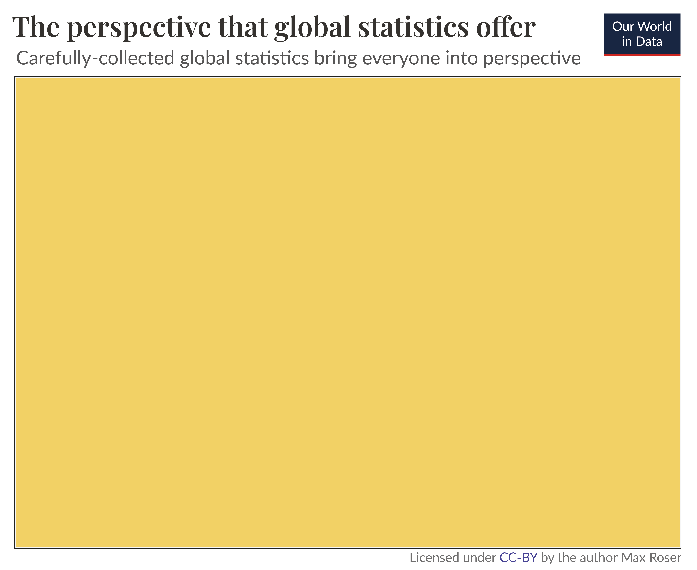

It’s tempting to believe that we can simply rely on personal experience to develop our understanding of the world.  

我们很容易相信，我们可以简单地依靠个人经验来加深对世界的理解。  

But that’s a mistake. The world is large, and we can experience only very little of it personally.  

但这是个错误。世界很大，而我们能亲身经历的却很少。  

To see what the world is like, we need to rely on other means: carefully-collected global statistics.  

要了解世界的现状，我们需要依靠其他手段：精心收集的全球统计数据。

Of course, our personal interactions are part of what informs our worldview.  

当然，我们的个人交往也是影响我们世界观的一部分。  

We piece together a picture of the lives of others around us from our interactions with them.  

我们从与周围人的互动中拼凑出他们的生活图景。  

Every time we meet people and hear about their lives, we add one more perspective to our worldview.  

每当我们遇到别人，听到他们的生活，我们的世界观就多了一个角度。  

This is a great way to see the world and expand our understanding, I don’t want to suggest otherwise.  

这是看世界和扩展我们理解力的好方法，我不想提出其他建议。

But I want to remind ourselves how little we can learn about our society through personal interactions alone, and how valuable statistics are in helping us build the rest of the picture.

  

但是，我想提醒我们自己，仅仅通过人际交往，我们能了解到的社会信息是多么有限，而统计数据在帮助我们构建其他信息方面又是多么宝贵。

## The horizon of our personal experience  

我们个人经历的视野[](https://ourworldindata.org/limits-personal-experience#the-horizon-of-our-personal-experience)

How many people do you know personally?  

你本人认识多少人？

Let’s take a broad definition of what it means to know someone and say that we include everyone you know by name.  

让我们对 "认识一个人 "下一个宽泛的定义，说我们包括所有你叫得出名字的人。  

A study in the US asked how many people Americans know by name and found that the average person knows 611.[<sup data-immersive-translate-effect="1" data-immersive_translate_walked="09f73b0c-0f92-44d2-be70-dd83aed55300">1</sup>](https://ourworldindata.org/limits-personal-experience#note-1)  

美国的一项研究询问美国人知道多少人的名字，结果发现平均每人知道 611 个。 <sup data-immersive-translate-effect="1" data-immersive_translate_walked="09f73b0c-0f92-44d2-be70-dd83aed55300">1</sup>

Let’s assume you are more social than the average American, and you know 800 people.  

假设你比普通美国人更善于社交，你认识 800 个人。  

In a world of 8 billion, this means that you know 0.00001% of the population.  

在一个拥有 80 亿人口的世界里，这意味着你只了解 0.00001% 的人口。  

A 100,000th of a percent.[<sup data-immersive-translate-effect="1" data-immersive_translate_walked="09f73b0c-0f92-44d2-be70-dd83aed55300">2</sup>](https://ourworldindata.org/limits-personal-experience#note-2)  

十万分之一 <sup data-immersive-translate-effect="1" data-immersive_translate_walked="09f73b0c-0f92-44d2-be70-dd83aed55300">2</sup>

It’s hard to visualize how small a fraction this is.  

很难想象这是多么小的一部分。  

If this illustration was drawn to scale, then the blue rectangle – which represents the world population – would be as large as a sheet of printer paper, while the yellow square – which represents the number that a person knows – would have the diameter of a human hair.[<sup data-immersive-translate-effect="1" data-immersive_translate_walked="09f73b0c-0f92-44d2-be70-dd83aed55300">3</sup>](https://ourworldindata.org/limits-personal-experience#note-3)  

如果按比例绘制这幅插图，那么代表世界人口的蓝色矩形将有一张打印纸那么大，而代表一个人知道的数字的黄色正方形的直径将只有人的头发丝那么粗。 <sup data-immersive-translate-effect="1" data-immersive_translate_walked="09f73b0c-0f92-44d2-be70-dd83aed55300">3</sup>

This is why I’m very skeptical when people say things about “the world these days” based on what they hear from people they know.  

这就是为什么当人们根据他们从熟人那里听到的消息来谈论 "如今的世界 "时，我会非常怀疑。

We cannot see much of the world through our direct experience.  

我们无法通过直接经验看到这个世界的许多东西。  

The horizon of our personal experience is very narrow.  

我们个人经历的视野非常狭窄。  

For every person you know, there are ten million people you do not know.  

你每认识一个人，就有一千万个你不认识的人。

And chances are that the people you know are quite similar to you, far from representative of the world — or your country — as a whole.  

而你所认识的人很可能与你很相似，远不能代表整个世界或你的国家。


## How wide can the horizon of our personal experience be?  

我们个人经历的视野可以有多宽？[](https://ourworldindata.org/limits-personal-experience#how-wide-can-the-horizon-of-our-personal-experience-be)

Perhaps you think restricting the people you learn from to the number of people you know by name is too narrow.  

也许你认为，把你学习的对象限制在你能叫出名字的人的数量上未免太狭窄了。  

After all, you also learn from strangers you meet, even if you don’t get to know their names.  

毕竟，你也会从你遇到的陌生人身上学到东西，即使你不知道他们的名字。

Let’s assume you are exceptionally good at this, and you have a conversation with three new people every single day of your life.  

假设你在这方面非常出色，每天都能与三个新朋友交谈。

If you can keep this up for 73 years, you will get to know 80,000 people.[<sup data-immersive-translate-effect="1" data-immersive_translate_walked="09f73b0c-0f92-44d2-be70-dd83aed55300">4</sup>](https://ourworldindata.org/limits-personal-experience#note-4) That’s more than a hundred times the number of people you’d know by name.  

如果你能坚持 73 年，你将认识 8 万人。 <sup data-immersive-translate-effect="1" data-immersive_translate_walked="09f73b0c-0f92-44d2-be70-dd83aed55300">4</sup> 这比你能叫出名字的人多一百倍。

This is still a tiny fraction of the world.  

这仍然只是世界上很小的一部分。  

After a lifetime of speaking with people, you will have spoken to 0.001% of the world’s population.  

在与人交谈的一生中，你将与世界上 0.001% 的人交谈过。  

For every person you’ve had a conversation with, there are still 100,000 people you’ve never spoken to.  

与你交谈过的每一个人，都有十万个你从未交谈过的人。

Drawn to scale, the orange square, which represents the number of people you could ever speak to, would be less than a millimeter (0.8mm) wide.[<sup data-immersive-translate-effect="1" data-immersive_translate_walked="09f73b0c-0f92-44d2-be70-dd83aed55300">5</sup>](https://ourworldindata.org/limits-personal-experience#note-5)  

按比例绘制的橙色正方形代表你能与之交谈的人数，宽度不到一毫米（0.8 毫米）。 <sup data-immersive-translate-effect="1" data-immersive_translate_walked="09f73b0c-0f92-44d2-be70-dd83aed55300">5</sup>

I am focusing on personal interaction as the most direct and in-depth way to learn about others, but they are not our only experience by which we learn about others.  

我把重点放在人际交往上，这是了解他人最直接、最深入的方式，但人际交往并不是我们了解他人的唯一经验。  

We also learn by seeing other peoples’ clothes, by seeing their houses, or by hearing others talk about their personal experiences.  

我们还可以通过看别人的衣服、看别人的房子或听别人讲述自己的亲身经历来学习。  

But while these experiences also help, they still don’t get us very far.  

不过，这些经验虽然也有帮助，但仍然不能让我们走得太远。  

The world is large, and even if you are exceptionally attentive and exceptionally good at making connections and speaking to people, it is simply impossible to see much of the world directly.  

世界之大，即使你特别细心，特别善于打通关系和与人交谈，也根本不可能直接看到世界上的很多东西。


## The fragmented perspective of the news media: some spotlights on particular people, but much of the world is left in darkness  

新闻媒体支离破碎的视角：一些焦点集中在特定人物身上，但世界的大部分却被蒙在鼓里[](https://ourworldindata.org/limits-personal-experience#the-fragmented-perspective-of-the-news-media-some-spotlights-on-particular-people-but-much-of-the-world-is-left-in-darkness)

The limits of our personal experience don’t reach far beyond ourselves.  

我们个人经验的局限并没有远远超出我们自己。  

How can we know about the world if we want to see beyond this tight horizon?  

如果我们想看到这个狭小的地平线之外的世界，我们又如何了解这个世界呢？

In one way or another, we have to rely on the media.  

在某种程度上，我们必须依靠媒体。  

Whether it is television or radio, the newspaper or photography, books, podcasts, documentaries, research papers, statistical tables, or social media.  

无论是电视或广播、报纸或摄影、书籍、播客、纪录片、研究论文、统计表还是社交媒体。

This fact is so obvious that it is easy to miss how important it is: everything you hear about anyone who is more than a few dozen meters away, you know through some form of media.  

这个事实是如此明显，以至于人们很容易忽略它的重要性：你所听到的任何关于几十米之外的人的消息，都是通过某种形式的媒体知道的。

That’s why the media we choose to rely on is _so_ important for our understanding of the world.  

这就是为什么我们选择依赖的媒体对我们了解世界如此重要。

The news is the media that shapes our picture of the world more than any other.  

新闻是最能塑造我们世界观的媒体。  

Today, it’s often intertwined with social media.  

如今，它往往与社交媒体交织在一起。  

It is valuable as it lets us see beyond our own tight horizon, but the view the news offers is a spotted and fragmented one.  

新闻的价值在于它能让我们看到自己狭小的视野之外，但新闻所提供的视野是斑驳的、支离破碎的。

The news reports on the unusual things that happen on a _particular_ day, but the things that happen _every_ day never get mentioned.  

新闻会报道某一天发生的不寻常的事情，但每天发生的事情却从未被提及。  

This gives us a biased and incomplete picture of the world; we are inundated with detailed news [on terrorism](https://ourworldindata.org/terrorism#media-coverage-of-terrorism) but hardly ever hear of [everyday tragedies](https://ourworldindata.org/child-mortality-big-problem-in-brief) like the fact that 16,000 children die every single day.  

这让我们对世界的了解有失偏颇和全面；我们充斥着关于恐怖主义的详细新闻，却很少听到日常悲剧，比如每天有 16,000 名儿童死亡的事实。

The illustration on the side visualizes this fragmented view.  

侧面的插图形象地展示了这种支离破碎的观点。  

The news focuses on exceptionally powerful people or on those who experienced unusual tragedies.  

新闻的重点是那些特别有权势的人或那些经历了不寻常悲剧的人。  

But while it puts the spotlight on those few people, it leaves most of the world in darkness.  

但是，在让少数人成为焦点的同时，却让世界上的大多数人陷入了黑暗之中。

The problem is not so much what the news media covers but what it does not cover.  

问题不在于新闻媒体报道了什么，而在于它没有报道什么。  

Those left in darkness are often poor and powerless and geographically far from us.  

那些被遗弃在黑暗中的人往往贫穷无力，地理位置也远离我们。  

What we see in the news is not nearly enough to understand the world we are living in.  

我们从新闻中看到的东西远远不足以了解我们所生活的世界。


## What is missing: everyone else — for this, we need global data  

缺什么：其他人--为此，我们需要全球数据[](https://ourworldindata.org/limits-personal-experience#what-is-missing-everyone-else-for-this-we-need-global-data)

Of course, it is challenging to hear about everyone.  

当然，要了解每个人的情况是很有挑战性的。  

But that’s the challenge we have to take on if we don’t want to be left with a scattered and biased perspective of the world.  

但是，如果我们不想让自己对世界的看法变得零散而有失偏颇，这就是我们必须接受的挑战。

If we want to see what on earth is going on, we have to tell _all_ the stories. This is possible. Telling many stories at once is statistics.  

如果我们想了解到底发生了什么，就必须讲述所有的故事。这是可能的。同时讲述许多故事就是统计。

Statistical methods make it possible to draw reliable conclusions about a population as a whole.  

通过统计方法，可以对整个人口得出可靠的结论。  

Statistics is an extraordinary cultural achievement that allows us to broaden our view, from the individual stories of those in the spotlight to a perspective that includes everyone.  

统计数字是一项非凡的文化成就，它让我们拓宽了视野，从聚光灯下的个人故事到包括每个人的视角。

Global economic data can tell us about [the incomes of](https://ourworldindata.org/global-economic-inequality-introduction) _[everyone](https://ourworldindata.org/global-economic-inequality-introduction)_ on this planet. [Global health data](https://ourworldindata.org/explorers/global-health) aim to tell us about everyone’s cause of death.  

全球经济数据可以告诉我们地球上每个人的收入情况。全球健康数据旨在告诉我们每个人的死因。  

And similarly, we can learn about everyone who lacks access to [basic electricity](https://ourworldindata.org/grapher/people-without-electricity-country?tab=chart), everyone who lacks access to [clean drinking water](https://ourworldindata.org/water-access), and everyone who lacks access to [basic sanitation](https://ourworldindata.org/sanitation).  

同样，我们也可以了解每一个无法获得基本电力的人，每一个无法获得清洁饮用水的人，以及每一个无法获得基本卫生设施的人。

Global statistics don’t only allow us to see what the “world these days” looks like, but also how it has changed.  

全球统计数据不仅让我们看到了 "当今世界 "的面貌，还让我们看到了它的变化。  

Statistics that document how the world has changed are often very surprising to those who mostly rely on the news to understand the world.  

对于那些主要依靠新闻来了解世界的人来说，记录世界变化的统计数据往往会让他们感到非常惊讶。  

While the news focuses overwhelmingly on all the things that are going wrong, historical statistics allow us to also see what has gone right — the [immense](https://ourworldindata.org/child-mortality-in-the-past) [progress](https://ourworldindata.org/a-history-of-global-living-conditions-in-5-charts) the world has achieved.  

虽然新闻的焦点绝大多数都集中在所有正在发生的问题上，但历史统计数据也让我们看到了正确的一面--世界已经取得的巨大进步。

Statistics can illuminate the world in a way that our personal experiences and the news media can’t.  

统计数字能以我们的个人经历和新闻媒体无法做到的方式来揭示世界。  

This is why we, at Our World in Data, rely on global statistics to understand how the world is changing.  

这就是我们 "数据中的世界 "依靠全球统计数据来了解世界变化的原因。

The visual illustrates what carefully-collected global statistics make possible: they illuminate the entire world around us, and allow us to see what is happening to everyone.  

这幅图片说明了精心收集的全球统计数据的作用：它们照亮了我们周围的整个世界，让我们看到每个人身上发生的事情。



## No data is perfect  

没有完美的数据[](https://ourworldindata.org/limits-personal-experience#no-data-is-perfect)

The collection and production of good statistics is a major challenge.  

收集和编制良好的统计数据是一项重大挑战。  

Data might be unrepresentative in some ways, it might be mismeasured, and some data might be missing entirely.  

数据在某些方面可能不具代表性，可能测量有误，有些数据可能完全缺失。  

Everyone who relies on statistics to form their worldview needs to be aware of these shortcomings.  

每一个依靠统计数据形成自己世界观的人都需要意识到这些缺陷。

Our goal here at Our World in Data is to present the best available data and at the same time highlight their shortcomings.  

我们在 "我们的数据世界 "的目标是提供最好的可用数据，同时突出它们的不足之处。  

The most important work is done by the statisticians who collect and publish the global databases in the first place.  

最重要的工作首先由收集和发布全球数据库的统计人员完成。  

Our role is to make their work accessible and understandable.  

我们的职责是使他们的工作易于理解和使用。  

To achieve this goal we speak with experts, read the scientific literature, and analyze the available data so that we can highlight the best available statistics and highlight the shortcomings that even the best data is associated with.  

为了实现这一目标，我们与专家交谈，阅读科学文献，分析现有数据，从而突出现有的最佳统计数据，并强调即使是最佳数据也存在的不足之处。

## A statistical understanding of the world needs to become much more central to our culture  

对世界的统计理解应成为我们文化的核心内容[](https://ourworldindata.org/limits-personal-experience#a-statistical-understanding-of-the-world-needs-to-become-much-more-central-to-our-culture)

I don’t want to suggest that it is a bad idea to rely on personal experience or the news to learn about the world.  

我并不想说依靠个人经验或新闻来了解世界是个坏主意。  

Each way of learning about the world has its value.  

每一种了解世界的方式都有其价值。  

It’s about how we bring them together: the in-depth understanding that only personal interaction can give us, the focus on the powerful and unusual that the news offers, and the statistical view that gives us the opportunity to see everyone.  

关键在于我们如何将它们结合在一起：只有个人互动才能给我们带来的深入了解，新闻提供的对强大和不寻常的关注，以及让我们有机会看到每个人的统计视角。

We have many ways of learning about the world and we should make use of all of them.  

我们有许多了解世界的途径，我们应该利用所有这些途径。  

A statistical view without personal experience lacks depth, and personal experience without statistical knowledge lacks perspective.  

没有亲身经历的统计观点缺乏深度，没有统计知识的亲身经历缺乏视角。

The problem is that most of our focus goes toward personal experience and the news.  

问题是，我们的注意力大多集中在个人经历和新闻上。  

They are held in high regard, while statistics are left to a small corner of our culture.  

他们受到高度尊重，而统计数字却只能在我们文化中的一个小角落里存在。  

This is not where they belong.  

他们不属于这里。  

A society that has the aspiration to care for everyone needs to bring a statistical understanding of the world into the center of its culture.  

一个渴望关爱每一个人的社会，需要将对世界的统计理解纳入其文化的中心。

For this, we need to remember what statistical figures really mean.  

为此，我们需要牢记统计数字的真正含义。  

Spreadsheets are not just numbers, they tell us about the reality of the people around us and allow us to see what is happening to everyone, all at once.  

电子表格不仅仅是数字，它还能告诉我们周围人们的真实情况，让我们能够一次性了解每个人的情况。

___

___

**How this relates to our mission:** _I’ve focused on our global understanding, but the same is true at smaller scales.  

To see what our own country, our own city, is like, we need statistics.  

要了解我们自己的国家、我们自己的城市是什么样的，我们需要统计数据。  

These statistics exist, but they are often neither accessible nor understandable.  

这些统计数据是存在的，但它们往往既无法获取，也无法理解。  

They are buried in spreadsheets, hidden behind paywalls, and presented in academic jargon.  

它们被埋藏在电子表格中，隐藏在付费墙后，用学术术语来表述。_  

这与我们的使命有何关系：我着重介绍了我们对全球的理解，但在较小范围内也是如此。

_Our mission at Our World in Data is to change this and make the statistics that are needed to understand our society accessible and understandable for everyone.  

我们 "数据中的世界 "的使命是改变这种状况，让每个人都能获取和理解了解我们社会所需的统计数据。  

→ Read more about_ _[our mission](https://ourworldindata.org/problems-and-progress)__._  

→ 进一步了解我们的使命。

___

**Acknowledgements:** I would like to thank Hannah Ritchie, Natasha Ahuja, Ike Saunders, Edouard Mathieu, Esteban Ortiz-Ospina, and Bastian Herre for their helpful comments to drafts of this essay and the visualizations.  

致谢：感谢汉娜-里奇（Hannah Ritchie）、娜塔莎-阿胡贾（Natasha Ahuja）、艾克-桑德斯（Ike Saunders）、爱德华-马蒂厄（Edouard Mathieu）、埃斯特万-奥尔蒂斯-奥斯皮纳（Esteban Ortiz-Ospina）和巴斯蒂安-赫雷（Bastian Herre）对本文草稿和可视化效果提出的有益意见。

### Endnotes  

结束语

1.  McCormick, T. H., Salganik, M. J., & Zheng, T. (2010).  
    
    McCormick, T. H., Salganik, M. J., & Zheng, T. (2010).  
    
    How many people do you know?: Efficiently estimating personal network size.  
    
    你认识多少人？有效估算个人网络规模  
    
    Journal of the American Statistical Association, 105(489), 59–70. http://doi.org/10.1198/jasa.2009.ap08518. Online here [https://www.ncbi.nlm.nih.gov/pmc/articles/PMC3666355/](https://www.ncbi.nlm.nih.gov/pmc/articles/PMC3666355/) and free at the website of Princeton Uni here. [](https://www.princeton.edu/~mjs3/mccormick_salganik_zheng10.pdf)[https://www.princeton.edu/~mjs3/mccormick\_salganik\_zheng10.pdf](https://www.princeton.edu/~mjs3/mccormick_salganik_zheng10.pdf)  
    
    美国统计协会期刊》，105（489），59-70。http://doi.org/10.1198/jasa.2009.ap08518。在线 https://www.ncbi.nlm.nih.gov/pmc/articles/PMC3666355/，普林斯顿大学网站免费 https://www.princeton.edu/~mjs3/mccormick\_salganik\_zheng10.pdf
    
    The researchers arrive at their estimate by asking a representative sample of the American population how many people they know with a specific first name.  
    
    研究人员通过对美国人口中具有代表性的样本进行抽样调查，得出了他们所知道的有特定名字的人的数量。  
    
    By comparing the answers of respondents with the frequency with which those names occur in the population, they arrive at their estimate of how many people the respondent knows.  
    
    通过比较受访者的回答和这些名字在人群中出现的频率，他们就能估算出受访者认识多少人。
    
    The number of people that Americans know is log-normally distributed with a mean network size of 611 and a median network size of 472.  
    
    美国人认识的人数呈对数正态分布，平均网络规模为 611 人，中位数为 472 人。
    
2.  800 / 8,000,000,000 \*100 = 0.00001%
    
3.  The diameter of human hair varies, ranging from 17 μm to 181 μm, [](https://en.wikipedia.org/wiki/Hair%27s_breadth)[according to Wikipedia](https://en.wikipedia.org/wiki/Hair%27s_breadth). One nominal value often chosen is 75 μm.  
    
    根据维基百科，人类头发的直径各不相同，从 17 μm 到 181 μm 不等。通常选择的一个标称值是 75 微米。
    
    In my calculation, I’m assuming that the diameter of the hair falls roughly in the middle of that range and has a diameter of 79 µm, and takes up a squared area of the size of 6237 μm².  
    
    在我的计算中，我假设头发的直径大致在这个范围的中间，直径为 79 µm，所占面积的平方为 6237 μm²。
    
    If the hair was thinner or thicker, or if the hair was more tightly or more loosely packed, then the area which represents 800 people would accordingly be smaller or larger.  
    
    如果头发更稀疏或更浓密，或者头发更紧密或更松散，那么代表 800 人的区域就会相应地变小或变大。
    
    Standard printer paper varies between world regions (A4 is common in some parts, while in other parts, the letter format is more common).  
    
    世界不同地区的标准打印机纸张各不相同（有些地区常用 A4 纸，而其他地区则更常用 Letter 纸）。  
    
    In the text, I am therefore referring to a sheet of printer paper.  
    
    因此，在文中我指的是一张打印纸。
    
    In my calculation I am using A4 as the reference format for a sheet of printer paper, but the claim is similarly true for all A4-like-formats (like the ‘letter’ in the US).  
    
    在计算中，我使用 A4 作为一张打印纸的参考格式，但这一说法同样适用于所有类似 A4 的格式（如美国的 "letter"）。  
    
    That’s because the ‘width of hair’ has quite a large plausible range, as we’ve just seen.  
    
    这是因为 "头发宽度 "的可信范围很大，我们刚才已经看到了。  
    
    So for a slightly thicker hair, you end up with a slightly larger page.  
    
    因此，如果头发稍粗，页面就会稍大。  
    
    (The main point is that the ratio between a page of printer paper and the diameter of a hair is roughly 10,000,000.)  
    
    (重点是一页打印纸和一根头发直径的比值大约是 10,000,000 ）。
    
    Here is my calculation:  
    
    以下是我的计算结果：
    
    The ratio between 800 people and 8 billion people is 10,000,000.  
    
    800 人与 80 亿人的比例是 10,000,000。
    
    An A4 page is 210mm x 297mm = 62,370 mm². This represents 8 billion people.  
    
    一张 A4 纸的面积为 210 毫米 x 297 毫米 = 62,370 平方毫米。这相当于 80 亿人。  
    
    A ten-millionth of this area therefore represents 800 people: 62,370 mm² /10,000,000 = 0.006237 mm² → converted to μm² (one-millionth of a square millimeter) is 6237 μm².  
    
    因此，这个面积的千万分之一代表 800 人：62,370 平方毫米/10,000,000=0.006237 平方毫米→换算成 μm²（百万分之一平方毫米）就是 6237 μm²。
    
    The square root of 6237 μm² is 78.97 μm, i.e. the width of a hair.  
    
    6237 μm² 的平方根是 78.97 μm，即一根头发的宽度。
    
    Check the calculation: 79 μm = 0.079mm is the diameter of one hair.  
    
    检查计算结果：79 μm = 0.079mm 是一根头发的直径。
    
    (210mm/0.079mm) x (297mm/0.079mm) = 9,993,591 = 10 million hairs fit into one A4 page.  
    
    (210mm/0.079mm) x (297mm/0.079mm) = 9,993,591 = 1,000 万根头发适合一张 A4 纸。
    
    Or directly: ((210mm/0.079mm) x (297mm/0.079mm)) x 800 = 7,994,872,617 → the number of people in the world  
    
    或者直接计算：（（210 毫米/0.079 毫米）×（297 毫米/0.079 毫米））×800=7,994,872,617 → 世界人口数量
    
    So if the rectangle was as large as an A4 page, then the square which represents the number of people you know would have the width of one hair.  
    
    因此，如果矩形有一张 A4 纸那么大，那么代表你认识的人数的正方形就有一根头发丝那么宽。
    
    ——  
    
    \--
    
    Or another comparison: Claiming that you know about the world through personal contacts is like claiming that you know a movie after you’ve seen 6 millionths of one second of it.  
    
    或者再做一个比较：声称自己通过人际交往了解世界，就好比你看过一部电影的六百万分之一秒后，就声称自己了解这部电影。
    
    A movie of 2 hours is (2\*60\*60\*1,000,000=) 7,200,000,000 microseconds long. [http://www.randalolson.com/2014/01/25/movies-arent-actually-much-longer-than-they-used-to-be/](http://www.randalolson.com/2014/01/25/movies-arent-actually-much-longer-than-they-used-to-be/)  
    
    一部 2 小时的电影长度为 (2\*60\*60\*1,000,000=) 7,200,000,000 微秒。http://www.randalolson.com/2014/01/25/movies-arent-actually-much-longer-than-they-used-to-be/
    
    0.00001% of 7,200,000 microseconds are \[(800/8,000,000,000)\*7,200,000,000=720 microseconds, which is 0.00072 seconds – i.e.  
    
    7,200,000 微秒的 0.00001% 是 \[（800/8,000,000,000）\*7,200,000,000=720 微秒，即 0.00072 秒--即  
    
    less than a thousandth of a second.  
    
    不到千分之一秒。
    
    According to Wikipedia, film frames these days are usually 1/24, 1/25 or 1/30 of a second long.  
    
    根据维基百科，现在的胶片画幅长度通常为 1/24 秒、1/25 秒或 1/30 秒。  
    
    The fastest frames (1/30) are therefore 45 times longer than 0.00072 seconds.  
    
    因此，最快帧（1/30）的时间是 0.00072 秒的 45 倍。
    
    Only if you know 36,000 people (45-times more than 800) does the number of people you personally know represent a single frame of that movie.  
    
    只有当你认识 36000 人（比 800 人多 45 倍）时，你所认识的人才能代表这部电影的一个画面。
    
    Even knowing 131-times as many as the average person – 80,000 people – means that you only know 0.001% of the world population.  
    
    即使了解的人数是普通人的 131 倍（8 万人），也意味着你只了解世界人口的 0.001%。  
    
    That’s (80,000 / 8,000,000,000 \*100) and not even a tenth of a second (less than 3 frames) of that 2 hour movie.  
    
    也就是（80,000 / 8,000,000,000 \*100），还不到 2 小时电影的十分之一秒（不到 3 帧）。
    
4.  365.25\*3\*73 = 79,989.75 = ca. 80,000  
    
    365.25\*3\*73 = 79,989.75 = 约 80,000
    
5.  And in reality, the fraction you would speak to is even smaller as the number of people alive during those 73 years would be higher than 8 billion people.  
    
    而实际上，你所说的部分甚至更小，因为在这 73 年中活着的人数将超过 80 亿。
    
    The calculation is 80,000 / 8,000,000,000 \* 100 = 0.001%.  
    
    计算结果是 80,000 / 8,000,000,000 \* 100 = 0.001%。
    
    If 800 people are represented by a squared area with a base length of 79 micrometers, then the square that represents 80,000 people would be 100 times larger.  
    
    如果用一个基长为 79 微米的正方形面积来表示 800 人，那么表示 80000 人的正方形面积就要大 100 倍。  
    
    This means it would be 10 times wider and 10 times higher: 790 micrometers by 790 micrometers.  
    
    这意味着它将宽 10 倍，高 10 倍：790 微米乘 790 微米。
    
    790 micrometers are 0.79 millimeters.  
    
    790 微米等于 0.79 毫米。
    
    Check of the calculation: (210mm/0.79mm)\*(297mm/0.79mm)\*80,000=7,994,872,617  
    
    计算校验：（210 毫米/0.79 毫米）\*（297 毫米/0.79 毫米）\*80,000=7,994,872,617 美元
    
    Of a 2-hour movie it would not even be a tenth of a second (less than 3 frames).  
    
    在一部 2 小时的电影中，它甚至连十分之一秒（不到 3 帧）都不到。
    

### Cite this work  

引用本作品

Our articles and data visualizations rely on work from many different people and organizations.  

我们的文章和数据可视化依赖于许多不同人员和组织的工作。  

When citing this article, please also cite the underlying data sources.  

引用本文时，请同时引用基础数据来源。  

This article can be cited as:  

本文可引用为

```
Max Roser (2023) - “The limits of our personal experience and the value of statistics” Published online at OurWorldInData.org. Retrieved from: 'https://ourworldindata.org/limits-personal-experience' [Online Resource]
```

BibTeX citation  

BibTeX 引用

```
@article{owid-limits-personal-experience,
    author = {Max Roser},
    title = {The limits of our personal experience and the value of statistics},
    journal = {Our World in Data},
    year = {2023},
    note = {https://ourworldindata.org/limits-personal-experience}
}
```


### Reuse this work freely  

自由使用本作品

All visualizations, data, and code produced by Our World in Data are completely open access under the [Creative Commons BY license](https://creativecommons.org/licenses/by/4.0/).  

我们的数据世界 "制作的所有可视化、数据和代码均根据知识共享 BY 许可完全开放。  

You have the permission to use, distribute, and reproduce these in any medium, provided the source and authors are credited.  

您有权在任何媒体上使用、分发和复制这些内容，但必须注明出处和作者。

The data produced by third parties and made available by Our World in Data is subject to the license terms from the original third-party authors.  

由第三方制作并由 "我们的数据世界 "提供的数据受第三方原作者许可条款的约束。  

We will always indicate the original source of the data in our documentation, so you should always check the license of any such third-party data before use and redistribution.  

我们始终会在文档中注明数据的原始出处，因此您在使用和重新分发任何此类第三方数据之前，应始终检查其许可证。

All of [our charts can be embedded](https://ourworldindata.org/how-to-use-our-world-in-data#how-to-embed-interactive-charts-in-your-article) in any site.  

我们的所有图表均可嵌入任何网站。
