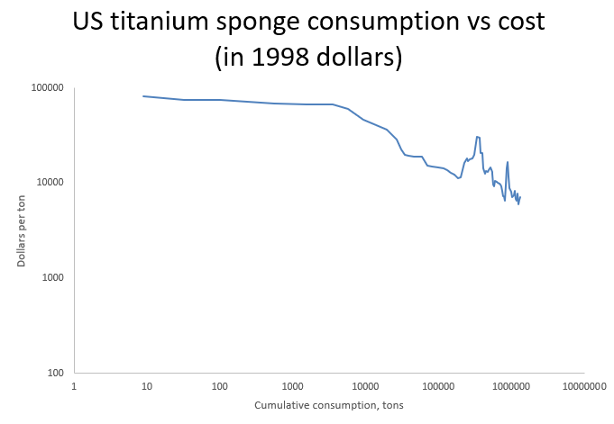

The earth contains a lot of titanium - it’s the [ninth most abundant element](https://en.wikipedia.org/wiki/Abundance_of_elements_in_Earth%27s_crust) in the earth’s crust.  

By mass, there’s more titanium in the earth’s crust than carbon by a factor of nearly 30, and more titanium than copper by a factor of nearly 100.  

按质量计算，地壳中的钛比碳多出近 30 倍，比铜多出近 100 倍。  

地球含有大量的钛--它是地壳中含量排名第九的元素。

But despite its abundance, it's only recently that civilization has been able to use titanium as a metal (titanium dioxide has been in use somewhat longer as a paint pigment).  

不过，尽管钛资源丰富，人类也只是在最近才把钛作为一种金属来使用（二氧化钛作为油漆颜料的使用时间更长一些）。  

Because titanium so readily bonds with oxygen and other elements, it doesn’t occur at all in metallic form in nature. [One engineer](https://archive.org/details/DTIC_AD0801280/page/n71/mode/1up?q=%22difficult+to+machine%22) described titanium as a “streetwalker," because it will pick up anything and everything.  

While copper has been used by civilization since 7000 BC, and iron since around 3000 BC, titanium wasn’t discovered until the late 1700s, and wasn’t produced in metallic form until the late 19th century.  

公元前 7000 年人类就开始使用铜，公元前 3000 年左右人类就开始使用铁，而钛直到 17 世纪末才被发现，直到 19 世纪末才以金属形式被生产出来。  

As late as 1945, there was no commercial production of titanium, and the metal only existed in tiny amounts in labs.  

直到 1945 年，钛还没有商业化生产，这种金属只在实验室中存在极少量。  

But less than 10 years later, thousands of tons of it were being made a year.  

但不到 10 年后，每年就能生产数千吨。  

And 10 years after that, it formed the literal backbone of the most advanced aerospace technology on the planet.  

10 年后，它成为地球上最先进的航空航天技术的真正支柱。  

由于钛很容易与氧和其他元素结合，因此在自然界中根本不存在金属形式的钛。一位工程师将钛形容为 "街头流浪者"，因为它可以拾起任何东西。

As a report to the [National Research Council notes](https://nap.nationalacademies.org/read/1712/chapter/4#14), “the birth of a tonnage structural metal industry is an unusual event.  

Only three such births have occurred in the past 100 years \[now closer to 150\] – aluminum, magnesium, and titanium – and no new one is in prospect.” How did titanium go from totally unused to a critical aerospace technology?  

在过去的 100 年里（现在接近 150 年），只有铝、镁和钛这三种材料诞生过，而且没有新的材料有望诞生。钛是如何从完全未被使用到成为关键的航空航天技术的？  

What does it tell us about technological development? Let’s take a look.  

它对我们的技术发展有何启示？让我们一起来看看。  

正如一份提交给国家研究委员会的报告所指出的，"吨位结构金属行业的诞生是一个不寻常的事件。

Titanium was first discovered in 1790 by William Gregor, an English clergyman and chemist who realized he couldn’t identify a metal contained in a white oxide mixed in with the black sands of Cornwall.  

1790 年，英国牧师兼化学家威廉-格雷戈尔（William Gregor）首次发现了钛，他发现自己无法识别混杂在康沃尔黑沙中的白色氧化物所含的金属。  

In 1795, Martin Klaproth, a Prussian chemist, was able to extract titanium from the mineral rutile.  

1795 年，普鲁士化学家 Martin Klaproth 从矿物金红石中提取出了钛。  

Because of the strong bond it formed with oxygen, Klaproth named the metal “titanium” after the Greek Titans.  

由于这种金属与氧气形成了牢固的结合，克拉普罗特以希腊泰坦的名字将其命名为 "钛"。

Because titanium bonds so readily with other elements and contaminates so easily, it's extremely difficult to obtain in a pure state, and for the next hundred years titanium was mostly regarded as a laboratory curiosity.  

由于钛很容易与其他元素结合，也很容易受到污染，因此很难获得纯净的钛。  

In the 1880s, two Swedish scientists successfully produced 94% pure titanium metal, and in 1910 Matthew Hunter, a scientist at General Electric, developed a variant of their process to produce metallic titanium while searching for a material for improved lightbulb filaments.  

19 世纪 80 年代，两位瑞典科学家成功地生产出了纯度为 94% 的金属钛。1910 年，通用电气公司的科学家马修-亨特在寻找改良灯泡灯丝的材料时，开发出了他们生产金属钛工艺的变体。

But a commercially viable process for producing titanium wasn’t developed until the 1930s.  

但直到 20 世纪 30 年代，才开发出商业上可行的钛生产工艺。  

In 1930 William Kroll, a scientist from Luxembourg, began experimenting with titanium in his home lab, and developed a process to produce titanium by reacting titanium chloride (TiCl4) with magnesium under a vacuum.  

1930 年，来自卢森堡的科学家威廉-克罗尔（William Kroll）开始在家中的实验室进行钛实验，并开发出一种在真空条件下通过氯化钛（TiCl4）与镁反应生产钛的工艺。  

By 1938, he had successfully produced 50 pounds of titanium metal, and successfully formed it into wires, rods, sheets, and plating.  

到 1938 年，他已成功生产出 50 磅钛金属，并成功将其制成金属丝、金属棒、金属板和镀层。  

Kroll came to the US in 1938 to attempt to sell his process, but was unsuccessful.  

1938 年，克罗尔来到美国，试图出售他的工艺，但没有成功。

Kroll’s samples of titanium metal in 1938, via Kroll 1955  

克罗尔 1938 年的金属钛样品，来自 1955 年的克罗尔作品

That same year, the US Bureau of Mines began to investigate titanium, in response to promising studies of its properties performed by the Philips Corporation (which had developed its own process for producing titanium).  

同年，美国矿业局开始对钛进行调查，以回应飞利浦公司（该公司已开发出自己的钛生产工艺）对钛特性进行的前景看好的研究。  

The Bureau of Mines concluded the Kroll process had the most potential as a commercial process and began to develop it.  

矿业局认为克罗尔工艺作为商业工艺的潜力最大，并开始对其进行开发。  

Its work was delayed by the war, but as early as 1944 the Bureau of Mines was making 15-pound batches of titanium in a plant that could make 100 pounds of titanium a week.  

由于战争的原因，矿务局的工作被推迟了，但早在 1944 年，矿务局就开始在一家每周可生产 100 磅钛的工厂里批量生产 15 磅钛。

After the war, the Bureau’s work on titanium accelerated.  

战后，该局加快了钛的研究工作。  

By 1947 it had successfully scaled up Kroll’s process, and had produced two tons of titanium “sponge,” a porous, spongy metal created by the process, which is melted down to produce bars, sheets, wires, etc.  

到 1947 年，该公司成功地扩大了克罗尔的工艺规模，并生产出两吨 "海绵钛"。"海绵钛 "是一种多孔的海绵状金属，通过这种工艺生产出来的钛被熔化后可用于生产钛条、钛片、钛丝等。  

A 1948 report on titanium’s properties commissioned by the Bureau concluded that titanium and its alloys had great potential engineering applications.  

1948 年，该局委托编写的一份关于钛特性的报告认为，钛及其合金具有巨大的工程应用潜力。  

Titanium was nearly as strong as stainless steel, but weighed 40% less.  

钛的强度几乎与不锈钢相当，但重量却减轻了 40%。  

It was also incredibly corrosion-resistant, and maintained much more strength at elevated temperatures compared to aluminum.  

此外，它还具有惊人的耐腐蚀性，在高温下也能保持比铝更高的强度。  

This made it potentially very useful for aerospace applications, where weight was at a premium and materials were often exposed to high temperatures.  

这使得它在航空航天应用中大显身手，因为在这些应用中，重量非常重要，而且材料经常暴露在高温下。

The military had followed the progress of the Bureau’s development work, and interest in the metal was high after samples began to be investigated by Army, Navy, and Air Force labs.  

军方一直在关注该局的研发工作进展，在陆海空三军实验室开始对金属样品进行研究后，军方对这种金属产生了浓厚的兴趣。  

Titanium began to be called a “wonder metal”:  

钛开始被称为 "神奇金属"：

> _The metal gained numerous advocates within the military and industry.  
> 
> 这种金属在军事和工业领域赢得了众多拥护者。  
> 
> Early promoters visualized the use of titanium in naval vessels, armor plate, tanks, trucks, landing craft, aircraft structures, and airborne equipment.  
> 
> 早期的推动者设想将钛用于海军舰艇、装甲板、坦克、卡车、登陆艇、飞机结构和机载设备。  
> 
> It was thought that it could possibly replace both aluminum and steel in the design of many defense applications.  
> 
> 人们认为，在许多国防应用的设计中，它有可能取代铝和钢。  
> 
> \- Simcoe 2018_

In 1948, titanium first began to be produced commercially, at a small DuPont plant that could produce 100 pounds of titanium a day.  

1948 年，杜邦公司的一家小型工厂首次开始商业化生产钛，该工厂每天可生产 100 磅钛。  

The first batches of titanium went to experimental use on military jets, such as the F-84 and the F-86. To try to kickstart the industry, the Air Force encouraged manufacturers to substitute steel with titanium, and the Army Ordnance Corporation placed an order for $1 million worth of titanium metal.  

第一批钛金属被试验性地用于军用喷气式飞机，如 F-84 和 F-86。为了启动这一行业，空军鼓励制造商用钛代替钢，陆军军械公司订购了价值 100 万美元的钛金属。

F-84, via wikipedia

In the press, titanium began to be called “the wonder metal," “the miracle metal," and the “Cinderella metal” (because it had been overlooked for so long).  

在媒体上，钛开始被称为 "神奇金属"、"奇迹金属 "和 "灰姑娘金属"（因为它被忽视了太久）。  

An executive for a company producing titanium noted that “Sensational magazine articles predicted that titanium would become the miracle metal-for spacecraft, ‘atomic furnaces,’ airplanes of all kinds, submarines, railroad tracks, truck bodies, portable bridges” (Rowley 1972).  

一家生产钛的公司的高管指出，"耸人听闻的杂志文章预言，钛将成为神奇的金属--用于航天器、'原子炉'、各种飞机、潜水艇、铁轨、卡车车身、便携式桥梁"（Rowley，1972 年）。  

Between 1950 and 1952, more than two dozen companies announced plans to produce titanium.  

1950 年至 1952 年间，有二十多家公司宣布了生产钛的计划。

But the nascent titanium industry struggled.  

但新生的钛工业却举步维艰。  

In 1951, the materials advisory board projected the need for 30,000 tons of titanium products, but actual shipments were just 75 tons, barely enough for research applications.  

1951 年，材料咨询委员会预计需要 3 万吨钛产品，但实际发货量仅为 75 吨，勉强满足研究应用的需要。  

Producers had assumed that the same equipment for melting, rolling, and shaping stainless steel could be used for titanium, but this turned out to be very difficult: titanium didn’t behave like steel, or like any other metal.  

生产商认为，用于熔化、轧制和成型不锈钢的设备也可以用于钛，但事实证明这非常困难：钛的性能不像钢，也不像任何其他金属。  

Titanium was found “not to forge like any other material,” (DTIC 1952) and stamping it in presses damaged the stamping dies.  

钛被发现 "不能像其他材料一样锻造"（DTIC，1952 年），在压力机中冲压钛会损坏冲压模具。  

A company that studied grinding titanium noted that “titanium grinds unlike steel.  

一家对钛进行研磨研究的公司指出，"钛的研磨效果与钢不同。  

Anything you have learned concerning the effective grinding of steel does not apply in the case of titanium”.  

你们所学到的有关有效研磨钢的知识并不适用于钛"。  

The first attempts to use titanium on commercial aircraft resulted in a sheet of metal so brittle it could be torn in half like a sheet of paper.  

首次尝试在商用飞机上使用钛金属的结果是，金属板非常脆，可以像纸一样被撕成两半。  

Mills found that they often “produced more scrap than useful metal" (Simcoe 2018).  

磨坊发现，它们 "生产的废料往往多于有用的金属"（Simcoe，2018 年）。

To support the budding industry, the US government stepped in.  

为了支持这一新兴产业，美国政府介入其中。  

It funded the construction of several titanium sponge plants, and agreed to purchase any surplus titanium sponge production for the national stockpile.  

它资助建造了几家海绵钛工厂，并同意购买任何剩余的海绵钛产品作为国家储备。  

It offered rapid amortization of titanium production equipment for tax purposes, and demonstrated production techniques at the Bureau of Mines’ pilot plant.  

它为钛生产设备的快速摊销提供了税收优惠，并在矿业局的试验工厂展示了生产技术。  

The Army funded projects to develop better alloys, including one of 6% aluminum and 4% vanadium (Ti-6Al-4V) that remains the most popular alloy of titanium today, and is credited with saving the titanium industry.  

陆军资助了一些项目，以开发更好的合金，其中包括一种含 6% 铝和 4% 钒的合金（Ti-6Al-4V），这种合金至今仍是最流行的钛合金，并被认为拯救了钛工业。  

When it was found that rolling titanium into sheets consistently was difficult, in 1956 the Department of Defense initiated a program to develop sheet rolling of titanium, “one of the most comprehensive technical programs ever undertaken in metallurgy” (Simcoe 2018).  

当发现很难将钛持续轧制成薄片时，国防部于 1956 年启动了一项开发钛薄片轧制的计划，这是 "有史以来冶金领域最全面的技术计划之一"（Simcoe，2018 年）。  

Production problems were overcome, and titanium was increasingly used for aerospace applications.  

生产问题得以解决，钛也越来越多地用于航空航天领域。  

By 1958, Pratt and Whitney had produced 5000 jet engines with titanium components, and the US industry was producing thousands of tons of titanium products a year.  

到 1958 年，普拉特和惠特尼公司已经生产了 5000 台使用钛部件的喷气发动机，美国工业每年生产数千吨钛产品。

A-12, via Wikipedia

In the late 1950s, Lockheed won a contract to develop a high-speed, high altitude reconnaissance plane for the CIA.  

20 世纪 50 年代末，洛克希德公司赢得了为美国中央情报局研制高速高空侦察机的合同。  

Because it was the 12th iteration of a design codenamed “Archangel," it became known as the A-12. To meet the unprecedented performance requirements (a cruising speed of Mach 3 and a cruising altitude of nearly 90,000 feet), Lockheed needed a metal that would retain its strength at the hundreds of degrees the exterior of the plane would reach.  

由于它是代号为 "大天使 "的设计的第 12 次迭代，因此被称为 A-12。为了满足前所未有的性能要求（3 马赫的巡航速度和近 9 万英尺的巡航高度），洛克希德需要一种在飞机外部温度高达数百度时仍能保持强度的金属。  

This ruled out aluminum, leaving either stainless steel or titanium.  

这就排除了铝的可能性，只剩下不锈钢或钛。  

Ultimately, titanium alloy was selected for the A-12, as it would cut the gross weight of the plane nearly in half.  

最终，A-12 选择了钛合金，因为它能将飞机总重量减少近一半。

Titanium had never been used to such an extent on an aircraft, or anywhere else.  

钛从未在飞机或其他任何地方被如此广泛地使用过。  

Lockheed had worked with titanium on a small scale since 1949 but prior to the A-12 titanium had mostly been used for small components on jet engines.  

洛克希德公司自 1949 年起就开始小规模使用钛，但在 A-12 之前，钛主要用于喷气发动机上的小型部件。  

For several years, for instance, 50% of all titanium was used in the [J-57 jet engine](https://en.wikipedia.org/wiki/Pratt_%26_Whitney_J57).  

But on the A-12, titanium would be used for nearly every part of the airplane – 93% of the gross weight of the A-12’s structure was titanium.  

但在 A-12 型飞机上，钛几乎用于飞机的每一个部件--A-12 型飞机结构总重的 93% 都是钛。  

例如，几年来，J-57 喷气式发动机使用了 50%的钛。

Building a plane out of titanium proved difficult.  

事实证明，用钛制造飞机是很困难的。  

Initially Lockheed “had no idea how to extrude it, push it through into various shapes, or weld or rivet or drill it” (Rich 1994), and every production problem solved seemed to reveal two or three more.  

最初，洛克希德公司 "根本不知道如何将其挤出、推成各种形状、焊接、铆接或钻孔"（里奇，1994 年），而每解决一个生产问题，似乎就会暴露出两三个新问题。  

Titanium was found to be “totally incompatible” with chemicals like chlorine, fluorine, and cadmium.  

研究发现，钛与氯、氟和镉等化学物质 "完全不相容"。  

In one case, an engineer who marked a sheet of titanium using a pen with chlorine-based ink was shocked to see the ink etch away the metal like acid.  

在一个案例中，一位工程师用含氯墨水的笔在一块钛金属板上做标记，他震惊地发现墨水像酸一样腐蚀掉了金属。  

Titanium bolts that were heated had their heads pop off, a problem that was eventually traced to cadmium-coated wrenches used to tighten them.  

加热后的钛螺栓会出现螺栓头脱落的现象，而这一问题最终被追溯到拧紧螺栓时使用的涂镉扳手。  

Titanium welds made in the summer unexpectedly failed, due to (it was eventually realized) chlorine that the local utility added to the water during the summer to prevent algae growth.  

夏季焊接的钛焊缝意外失效，原因是（最终发现）当地公用事业公司在夏季为防止藻类生长而向水中添加了氯。

When Lockheed tried to fabricate a portion of the forward fuselage, which had to be made from a novel “beta” titanium alloy, it found that the titanium was so brittle after heat treating that it would shatter if dropped on the floor.  

当洛克希德公司尝试用一种新型的 "β "钛合金制造前机身的一部分时，发现这种钛合金在热处理后非常脆，如果掉在地上就会碎裂。  

This was eventually resolved by replacing an acid-pickling process with one identical to that of Lockheed’s supplier, but not before scrapping thousands of titanium components.  

最终，通过更换与洛克希德供应商相同的酸洗工艺解决了这一问题，但在此之前，数以千计的钛部件已经报废。  

Of the first 6000 pieces fabricated from the beta titanium alloy, 95% were lost.  

在用β钛合金制造的首批 6000 件产品中，有 95% 丢失。

But over time, Lockheed overcame its production problems. In machining, for instance, drill bits initially needed to be replaced every ten holes, ten times as often as when drilling aluminum.  

但随着时间的推移，洛克希德公司克服了生产上的问题。例如，在加工过程中，钻头最初每钻十个孔就需要更换一次，是铝钻孔次数的十倍。  

In other machining operations, the rate of metal removal was just 5% of the rate when machining aluminum.  

在其他加工操作中，金属去除率仅为加工铝时的 5%。  

To improve its machining, Lockheed developed new drill bits, cutting fluids, and cutting machinery, and learned the proper “feeds and speeds” for machining titanium (it was found, for instance, that small changes in cutting speed had a large effect on tool life).  

为了改进加工，洛克希德公司开发了新的钻头、切削液和切削机械，并掌握了加工钛的适当 "进给量和速度"（例如，发现切削速度的微小变化对刀具寿命有很大影响）。  

Over the course of the program, the rate of metal removal in machining was increased to “3 to 10 times the industry average” (Johnson 1970), and drill life was increased by more than a factor of 10.  

在该项目实施过程中，加工中的金属去除率提高到 "行业平均水平的 3 到 10 倍"（约翰逊，1970 年），钻头寿命延长了 10 倍以上。

The A-12 “practically spawned its own industrial base” (CIA 2012), and over the course of the program thousands of machinists, mechanics, fabricators, and other personnel were trained in how to work with titanium efficiently.  

A-12 "实际上催生了自己的工业基地"（中情局，2012 年），在项目实施过程中，数以千计的机械师、机械师、制造师和其他人员接受了如何高效使用钛的培训。  

As Lockheed gained production experience with titanium, it issued reports to the Air Force and to its vendors on production methods, and “set up training classes for machinists, a complete research facility for developing tools and procedures, and issued research contracts to competent outside vendors to develop improved equipment" (Johnson 1970).  

随着洛克希德公司获得了钛金属的生产经验，它向空军和供应商发布了有关生产方法的报告，并 "开设了机械师培训班，建立了开发工具和程序的完整研究设施，并向有能力的外部供应商签发了研究合同，以开发改进设备"（约翰逊，1970 年）。

The A-12 first flew in 1962. 14 years later, its successor, the better-known SR-71, set an airspeed record of nearly 2200 miles per hour, which remains unbroken today.  

A-12 于 1962 年首飞。14 年后，它的后继机型--更著名的 SR-71 创造了时速近 2200 英里的空速记录，至今仍未被打破。

While titanium manufacturing for aerospace was ramping up, a very different use of the metal was being discovered.  

就在航空航天领域的钛制造不断加速的同时，人们发现了这种金属的另一种用途。  

In 1952, Swedish medical researcher Per-Ingvar Brånemark was studying blood flow in healing bones.  

1952 年，瑞典医学研究员 Per-Ingvar Brånemark 正在研究愈合骨骼中的血流。  

In one experiment studying the bone marrow of rabbits, Brånemark’s team implanted a tiny camera into rabbits legs, to watch the wound heal from the inside.  

在一项研究兔子骨髓的实验中，Brånemark 的团队将一台微型摄像机植入兔子腿部，从内部观察伤口愈合情况。  

When they later went to remove the camera, they found that the titanium camera casing had bonded with the bone.  

后来，他们在取出相机时发现，相机的钛金属外壳已经与骨头粘合在一起。

At the time, it was thought that the body would eventually reject any foreign object implanted in it.  

当时，人们认为人体最终会排斥植入体内的任何异物。  

Dr.  

Brånemark’s discovery that bone would bond directly with titanium (which he dubbed “osseointegration”) was radical, and had huge potential implications for medical implants.  

Brånemark 发现骨头可以直接与钛结合（他称之为 "骨结合"），这一发现非常激进，对医疗植入物具有巨大的潜在影响。  

Brånemark quickly pivoted his research to study osseointegration, eventually receiving a grant from the US National Institutes of Health.  

Brånemark 很快将他的研究转向了骨整合研究，并最终获得了美国国立卫生研究院的资助。  

Research on his own students (where he implanted a small piece of titanium in their arms) showed that titanium could be safely implanted in the body with no ill-effects.  

他对自己的学生进行的研究（在他们的手臂上植入一小块钛）表明，钛可以安全地植入人体，不会产生任何不良影响。

Interestingly, during the course of this research, it was noticed that bone could conduct sound – a deaf patient was able to “hear” the ultrasonic vibrations used to check that the titanium had been implanted correctly.  

有趣的是，在这项研究过程中，人们注意到骨骼能够传导声音--一位耳聋的病人能够 "听到 "用来检查钛金属是否正确植入的超声波振动。  

One of Brånemark’s students followed up on this discovery, and developed the first bone conduction implants to restore hearing in deaf people.  

布拉纳马克的一名学生对这一发现进行了跟踪研究，并开发出了首个骨传导植入体，用于恢复聋人的听力。

Brånemark’s team went on to develop titanium dental implants (which were often made from [surplus aircraft-grade titanium](https://books.google.com/books?id=EhnsCAAAQBAJ&pg=PA27&dq=Titanium+world+war+2&hl=en&newbks=1&newbks_redir=0&source=gb_mobile_search&ovdme=1&sa=X&ved=2ahUKEwi4uIr5zen_AhWukWoFHQT1Av0Q6AF6BAgDEAM#v=onepage&q=Titanium%20world%20war%202&f=false)) that lasted much longer than implants of other metals.  

Today, the Brånemark system of dental implants is still sold, and titanium is the most popular material for dental implants, as well as being used for other medical implants such as随后，Brånemark 的团队又开发出了钛金属牙科植入物（通常由多余的飞机级钛金属制成），其使用寿命比其他金属植入物要长得多。 [artificial hips](https://www.addmoretolives.com/titanium-vs-ceramic-which-type-of-hip-replacement-implant-is-better-for-you/).  

如今，Brånemark 牙科植入物系统仍在销售，钛是最受欢迎的牙科植入物材料，也可用于其他医疗植入物，如人工髋关节。

You can get a sense of the development of the titanium industry by reading reports on industrial symposiums held in the 1940s, 50s, and 60s.  

通过阅读 20 世纪 40、50 和 60 年代举行的工业研讨会的报告，您可以了解钛工业的发展情况。

The [first symposium on titanium](https://archive.org/details/DTIC_ADA382831/page/n3/mode/2up?q=subsidy) was held in 1948, and was organized by the Navy to provide “a comprehensive review of the titanium research effort”.  

Several military organizations discussed their research programs, but most of the presentations were on topics such as physical properties of titanium and its various alloys, the crystal structure that resulted from different methods of fabrication, and methods of melting titanium sponge.  

一些军事组织讨论了他们的研究计划，但大多数发言的主题是钛及其各种合金的物理性质、不同制造方法产生的晶体结构以及海绵钛的熔化方法。  

The pages are full of pictures of laboratory setups, graphs of data on stress-strain relationships, phase diagrams, and magnified pictures of titanium microstructure.  

书中有大量的实验室设置图片、应力-应变关系的数据图表、相图以及钛微观结构的放大图片。  

Nearly all the presentations are from either research labs or from companies trying to produce raw titanium “sponge” from ore.  

几乎所有发言都来自研究实验室或试图从矿石中生产 "海绵 "钛原料的公司。  

第一届钛研讨会于 1948 年举行，由海军组织，旨在 "全面回顾钛的研究工作"。

In 1952, [another titanium symposium](https://archive.org/details/DTIC_AD0635553/page/n30/mode/1up?q=subsidy) was held, this one sponsored by the Army’s Watertown Arsenal.  

By then, titanium was being manufactured in large quantities, and while the prior symposium had been focused on laboratory studies of titanium’s physical and chemical properties, the 1952 symposium was a “practical discussion of the properties, processing, machinability, and similar characteristics of titanium".  

当时，钛已开始大量生产，而之前的研讨会主要集中于钛的物理和化学特性的实验室研究，1952 年的研讨会则是 "关于钛的特性、加工、可加工性和类似特征的实际讨论"。  

While physical characteristics of titanium still took center stage, there was a practical slant to the discussions – how wide a sheet of titanium can be produced, how large an ingot of it can be made, how can it be forged, or pressed, or welded, and so on.  

虽然钛的物理特性仍然是讨论的中心，但讨论也有实用性的倾向--可以生产多宽的钛板，可以制造多大的钛锭，如何锻造、冲压或焊接等等。  

Presentations were by titanium fabricators, but also by metalworking companies that had been experimenting with the metal.   

发言的有钛金属制造商，也有一直在尝试使用这种金属的金属加工公司。  

1952 年，陆军沃特敦兵工厂主办了另一场钛研讨会。

Though by 1952 many of these companies had been working with titanium for years, there’s an air of uncertainty in many of the presentations, a distinct sense of “this is what we’ve learned so far, but there’s still much we don’t know.” A company that studied the effects of different working fluids when grinding titanium admitted that not enough was known about the chemistry at work to understand why different fluids had different effects.  

尽管到 1952 年，其中许多公司已经从事钛的研究工作多年，但许多人在发言中都流露出一种不确定的情绪，明显感觉到 "这是我们目前已经了解到的，但还有许多我们不知道的东西"。一家研究不同工作液对研磨钛的影响的公司承认，对工作中的化学作用了解不够，无法理解为什么不同的工作液会产生不同的影响。  

A company that studied surface treatments and polishing methods noted that “materials and methods for polishing titanium have not been definitively established," and that while “the most commonly used abrasives are not completely satisfactory," manufacturers were working on the problem, and “more efficient methods will no doubt be developed”.  

一家研究表面处理和抛光方法的公司指出，"抛光钛的材料和方法尚未最终确定"，虽然 "最常用的磨料并不完全令人满意"，但制造商正在努力解决这一问题，"毫无疑问，更有效的方法将会被开发出来"。  

A company that studied cold-forming of titanium sheets described its own methods as “crude and undeveloped”.  

一家研究钛板冷成形的公司称自己的方法 "粗糙、不成熟"。

In 1966, [another titanium symposium was held](https://archive.org/details/DTIC_AD0801280/page/n71/mode/1up?q=%22difficult+to+machine%22), this one sponsored by the Northrup Corporation.  

By this time, titanium had been used successfully for many years, and the purpose of this symposium was to “provide technical personnel of diversified disciplines with a working knowledge of titanium technology.” This time, the lion’s share of the presentations are by aerospace companies experienced in working with the metal, and the uncertain air that existed in the 1952 symposium is gone.  

此时，钛已成功应用多年，而此次研讨会的目的是 "为不同学科的技术人员提供钛技术方面的工作知识"。这一次，大部分演讲者都是在使用钛金属方面经验丰富的航空航天公司，1952 年研讨会上那种不确定的气氛一去不复返了。  

A presenter on titanium’s corrosion resistance noted that “the corrosion resistance of titanium, unlike that of most metals, can be defined within rather simple limits." A presentation on forging noted that “titanium alloys are quite forgeable…The evidence which substantiates this statement is the large number of jet engine and missile components plus the growing lists of structural parts that have been produced in the last 10 years.” And a presentation on machining noted that “Fifteen years ago, titanium was considered to be very difficult to machine.  

一位介绍钛的耐腐蚀性的演讲者指出，"钛的耐腐蚀性与大多数金属不同，可以在相当简单的范围内确定"。关于锻造的发言指出："钛合金非常容易锻造......过去 10 年中生产的大量喷气发动机和导弹部件以及越来越多的结构部件就是证明"。"一份关于机械加工的报告指出："15 年前，钛被认为很难加工。  

Subsequent research and experience, however, have progressively improved this situation," the result of “gradual refinements in tool materials, machine tools, tool geometries, and cutting fluids”.  

然而，随后的研究和经验逐步改善了这种状况"，这是 "刀具材料、机床、刀具几何形状和切削液逐步完善的结果"。  

1966 年，由诺斯鲁普公司（Northrup Corporation）赞助的另一次钛研讨会召开。

Thus, by the mid-1960s, titanium had become a mature engineering material.  

因此，到 20 世纪 60 年代中期，钛已成为一种成熟的工程材料。  

While there was still much to learn about titanium, the practical aspects of working with it and using it to solve engineering problems were well-understood, and it increasingly found use in aerospace and other industry applications.  

尽管对钛还有很多需要了解的地方，但人们对使用钛和用钛来解决工程问题的实际操作方面已经有了很好的认识，钛在航空航天和其他工业领域的应用也越来越多。  

Following the A-12, for instance, military aircraft began to make extensive use of titanium in their structural frames.  

例如，继 A-12 型飞机之后，军用飞机开始在其结构框架中大量使用钛。  

From military aircraft, titanium made its way into commercial aircraft.  

钛从军用飞机进入商用飞机。  

By 1971, 46% of titanium was going towards commercial aircraft, compared to 37% to government aerospace projects.  

到 1971 年，46% 的钛用于商用飞机，37% 用于政府航空航天项目。

What can we learn from the story of titanium?  

我们能从钛的故事中学到什么？

For one, titanium is a government research success story.  

首先，钛是政府研究的成功典范。  

Titanium metal was essentially willed into existence by the US government, which searched for a promising production process, successfully scaled it up when it found one, and performed much of the initial research on titanium’s material properties, potential alloys, and manufacturing methods.  

美国政府一直在寻找一种有前途的生产工艺，并在找到这种工艺后成功地扩大了生产规模，还对钛的材料特性、潜在合金和制造方法进行了大量的初步研究。  

Nearly all early demand for titanium was for government aerospace projects, and when the nascent industry struggled, the government stepped in to subsidize production.  

早期对钛的需求几乎全部来自政府的航空航天项目，当这个新兴行业陷入困境时，政府出面补贴生产。  

As a result, titanium achieved a level of production in 10 years that took aluminum and magnesium nearly 30.  

因此，钛在 10 年内就达到了铝和镁需要近 30 年才能达到的生产水平。

The government’s support of the early industry was successful: shortly after the program was initiated in 1951, the cost of titanium began to decline more steeply.  

政府对早期工业的支持是成功的：1951 年该计划启动后不久，钛的成本开始急剧下降。  

Since then, titanium costs have fallen at an impressive 23% learning rate (ie: costs fall 23% every time cumulative production doubles), similar to the learning rate in solar PV production.  

从那时起，钛的成本以惊人的 23% 的学习率下降（即：累计产量每翻一番，成本就下降 23%），与太阳能光伏生产的学习率类似。  

When government subsidies were removed in the late 1950s, the industry struggled, but cost declines continued.  

20 世纪 50 年代末，政府取消了补贴，该行业陷入困境，但成本继续下降。  

And from the initial government projects in military aerospace, titanium has spread into commercial aircraft, medical implants, industrial equipment, and other uses.  

从最初的军用航空航天政府项目开始，钛已扩展到商用飞机、医疗植入物、工业设备和其他用途。  

Titanium is thus a successful case of the government jumpstarting an industry.  

因此，钛是政府启动一个产业的成功案例。

Via USGS data  

通过美国地质调查局数据

But titanium is also a story about the limits of this sort of jumpstarting.  

但是，钛也是一个关于这种启动极限的故事。  

Despite its impressive learning rate, titanium remains an expensive, niche material.  

尽管钛的学习速度令人印象深刻，但它仍然是一种昂贵的小众材料。  

A 2006 report noted that titanium is five times as expensive as aluminum to refine and ten times as expensive as aluminum to turn into finished products.  

2006 年的一份报告指出，钛的提炼成本是铝的五倍，转化为成品的成本是铝的十倍。  

Despite initial expectations, titanium hasn’t widely displaced either aluminum or stainless steel, and is only used where its unique properties make its high cost worth it.  

尽管最初人们对钛抱有期望，但钛并没有广泛取代铝或不锈钢，只有在其独特的性能使其高昂的成本物有所值时才会使用。  

The aerospace industry remains the largest user of titanium.  

航空航天业仍然是钛的最大用户。

It's interesting to compare progress in titanium production with progress in solar photovoltaics.  

将钛生产的进步与太阳能光伏技术的进步进行比较是非常有趣的。  

In both cases, the basic phenomenon (metallic titanium and producing electricity from sunlight) had been explored in the late 1800s, but it wasn’t until mid-20th century technology breakthroughs (the Kroll process and the silicon PV cell) that they became practical.  

在这两种情况中，基本现象（金属钛和利用太阳光发电）早在 19 世纪末就已被探索，但直到 20 世纪中期的技术突破（克罗尔工艺和硅光伏电池），它们才成为实用技术。  

In both cases, the US government funded much of the initial development, and acted as the first customer (government satellites and government aerospace projects).  

在这两种情况下，美国政府资助了大部分初期开发工作，并充当了第一客户（政府卫星和政府航空航天项目）。  

Both have similar learning curve slopes, and both technologies gradually expanded outside of their initial markets as knowledge was gained and the costs of the technology fell.  

这两种技术都有相似的学习曲线斜率，而且随着知识的积累和技术成本的下降，这两种技术都逐渐扩展到了最初的市场之外。  

And in both cases, there were sky-high expectations for the “potentially world-changing technology” that neither initially lived up to.  

在这两种情况下，人们都对 "可能改变世界的技术 "抱有极高的期望，但这两种技术最初都没有达到人们的期望。

But whereas titanium remains a relatively niche, expensive technology, solar PV is increasingly widely deployed, and seems poised to become the primary method of electric power production.  

但是，钛仍然是一种相对小众、昂贵的技术，而太阳能光伏发电的应用越来越广泛，似乎有望成为主要的电力生产方式。  

In learning curve terms, while both titanium and solar PV have similar learning rates, the solar PV curve has stretched much farther.  

就学习曲线而言，虽然钛和太阳能光伏发电的学习曲线相似，但太阳能光伏发电的学习曲线延伸得更远。  

Between 1975 and today, cumulative titanium production has increased by perhaps a factor of 5-10 (cumulative US consumption of titanium sponge was about 250,000 tons in 1975, and about 1.3 million tons in 2019).  

1975 年至今，钛的累计产量增加了 5-10 倍（1975 年美国海绵钛的累计消费量约为 25 万吨，2019 年约为 130 万吨）。  

Cumulative solar PV production, on the other hand, has increased by a factor of more than 300,000. Though they have the same learning rate, solar PV has had many more doublings in production volume, and its costs have thus fallen much further.  

而太阳能光伏发电的累计产量则增加了 30 多万倍。虽然两者的学习率相同，但太阳能光伏发电的产量翻了一番还多，其成本也因此下降得更多。

I can see at least two potential factors here.  

我认为这里至少有两个潜在因素。  

One is that solar PV production has seen a much greater level of government support than titanium production has.  

一个原因是，太阳能光伏发电生产得到的政府支持远远多于钛生产。  

In addition to early government support in the 1950s, solar PV also saw US and Japanese government investment in the 1970s, and German government support in the 1990s (via a generous feed-in tariff).  

除了 20 世纪 50 年代早期的政府支持外，美国和日本政府在 20 世纪 70 年代也对太阳能光伏发电进行了投资，德国政府则在 20 世纪 90 年代提供了支持（通过慷慨的上网电价）。  

Today, governments around the world support solar PV via feed in tariffs, tax credits, and renewable portfolio standards.  

如今，世界各国政府通过上网电价、税收抵免和可再生能源组合标准来支持太阳能光伏发电。

Continued government subsidies have incentivized increased production, which has resulted in the costs of solar PV continuing to fall.

  

政府的持续补贴激励了生产的增加，从而使太阳能光伏发电的成本持续下降。  

Without that government support, the level of production of solar PV would have been much lower, and its march down the learning curve would have happened much more slowly.  

如果没有政府的支持，太阳能光伏发电的生产水平会低得多，其学习曲线也会缓慢得多。

Titanium, on the other hand, has seen much less government support.  

另一方面，钛得到的政府支持要少得多。  

After subsidies were withdrawn in the late 1950s, the titanium industry has been dependent on large government or commercial aerospace projects.  

20 世纪 50 年代末取消补贴后，钛工业一直依赖于大型政府或商业航空航天项目。  

If those fail to materialize (such as when Cold War strategy pivoted from bombers to missiles, or when supersonic commercial aircraft development was canceled), the industry has struggled.  

如果这些目标未能实现（如冷战战略从轰炸机转向导弹，或超音速商用飞机的开发被取消），该行业就会陷入困境。  

If government support of the industry had continued, perhaps it would be farther along on its learning curve.  

如果政府继续支持该行业，也许它在学习曲线上会走得更远。

The other potential factor is technical: while there are many potential process improvements to solar PV manufacturing, there may be substantially fewer potential improvements in titanium production.  

另一个潜在因素是技术因素：虽然太阳能光伏制造工艺有许多潜在的改进，但钛生产的潜在改进可能要少得多。  

In the 1950s, it was hoped/assumed that a better process for producing titanium sponge would come along to replace the Kroll process, which is a laborious and energy-intensive batch process that must be done in an inert atmosphere.  

20 世纪 50 年代，人们希望/假定会有一种更好的海绵钛生产工艺来取代克罗尔工艺，因为克罗尔工艺是一种费力、耗能的批量工艺，而且必须在惰性气氛中进行。  

But such a process has never materialized, and the Kroll process remains the primary method of refining titanium ore.  

但这种工艺从未实现，克罗尔工艺仍然是提炼钛矿石的主要方法。  

Likewise, turning titanium sponge into metal is an energy and capital-intensive process, often requiring multiple rounds of melting the metal to achieve sufficient purity.  

同样，将海绵钛转化为金属是一个能源和资本密集型过程，通常需要多轮熔炼才能达到足够的纯度。  

This process has also changed little since the 1950s.  

自 20 世纪 50 年代以来，这一过程也没有什么变化。

Beyond the lack of process improvements, titanium is just fundamentally difficult and expensive to deal with.  

除了缺乏工艺改进之外，钛从根本上说就是难以处理且成本高昂。  

Turning titanium ingots into bars and sheets is a challenge due to titanium’s reactivity: it readily absorbs impurities, requiring “frequent surface removal and trimming to eliminate surface defects” which are “costly and involve significant yield loss.” Machining titanium is likewise fundamentally expensive. [As one report notes](https://www.rand.org/pubs/monographs/MG789.html):  

将钛锭加工成钛棒和钛板是一项挑战，这是因为钛的反应性：它很容易吸收杂质，需要 "经常进行表面去除和修整，以消除表面缺陷"，而这 "成本高昂，而且会造成严重的产量损失"。加工钛也同样非常昂贵。一份报告指出

> _The hardness that makes titanium so desirable also makes it more difficult to machine than traditional aluminum.  
> 
> 钛的硬度使其如此受欢迎，同时也使其比传统的铝更难加工。  
> 
> This presents a challenge akin to that of machining high-strength steel.  
> 
> 这给加工高强度钢带来了类似的挑战。  
> 
> However, the process is complicated by titanium’s high reactivity and low thermal conductivity.  
> 
> 然而，钛的高反应性和低导热性使这一过程变得复杂。  
> 
> It is highly reactive and tends to wear tools very quickly, especially at higher temperatures.  
> 
> 它的反应性很强，往往会很快磨损工具，尤其是在较高温度下。  
> 
> The low thermal conductivity means that high temperatures can be generated easily in the course of machining.  
> 
> 低导热性意味着在加工过程中很容易产生高温。  
> 
> Consequently, titanium must be machined at lower tool speeds, slowing production.  
> 
> 因此，钛必须以较低的刀具速度进行加工，从而减慢了生产速度。_

If there are simply fewer potential process improvements in titanium production compared to solar PV, due to the lack of better refining processes and the various physical constraints dictated by its chemistry, there’s less room for costs to fall.  

如果与太阳能光伏发电相比，钛生产的潜在工艺改进更少，因为缺乏更好的提炼工艺，而且其化学性质决定了各种物理限制，那么成本下降的空间就更小了。  

With less room for costs to fall, titanium remains an expensive, niche material, which in turn keeps production volumes low.  

由于成本下降的空间较小，钛仍然是一种昂贵的小众材料，这反过来又使产量保持在较低水平。

Titanium is also a story about the importance of serendipity in scientific discovery and technology advancement.  

钛》也是一个关于偶然性在科学发现和技术进步中的重要性的故事。  

Titanium’s biocompatibility, and its usefulness for medical implants, was discovered purely by chance.  

钛的生物相容性及其在医疗植入物中的用途纯属偶然。  

Studying biocompatibility led to another chance discovery, that of bone conduction of sound.  

对生物兼容性的研究还带来了另一个偶然的发现，即骨传导声音。  

Both of these discoveries led to the development of important medical technology, implants and hearing aids.  

这两项发现促进了重要医疗技术、植入物和助听器的发展。

Finally, titanium is also a story about the critical role that manufacturing plays in technology development.  

最后，钛也是一个关于制造业在技术发展中发挥关键作用的故事。  

The knowledge required to turn titanium into a practical technology came from the research lab, but it also came from the factory floor.  

将钛转化为实用技术所需的知识来自研究实验室，但也来自工厂车间。  

Using titanium meant understanding its chemical properties, but it also meant figuring out how to forge it, weld it, press it, turn it into fasteners, design parts effectively with it, designing tools to machine it, and a million other shop floor discoveries that came from actually building things with the metal.  

使用钛意味着了解它的化学特性，但也意味着要弄清楚如何锻造它、焊接它、冲压它、把它变成紧固件、用它有效地设计零件、设计加工它的工具，以及用这种金属实际制造出的无数其他车间发现。  

As one producer noted, “you cannot ship a customer a carload full of tensile properties, nor a box full of Charpy tests.  

正如一位生产商所指出的，"你不能把一车的拉伸性能数据或一箱的夏比试验数据运送给客户。  

You have to make something out of the material in order to use these marvelous characteristics.” (DTIC 1952).  

你必须从材料中制造出一些东西，才能利用这些奇妙的特性"。(DTIC 1952）。  

It's only after the enormous effort to build the all-titanium A-12, and the training of thousands of machinists, fabricators, engineers, and other workers to work with titanium, that we begin to see titanium being used in large amounts in military and commercial aircraft.  

在付出巨大努力制造出全钛 A-12 型飞机，并培训了数千名机械师、制造师、工程师和其他工人使用钛后，我们才开始看到钛被大量用于军用和商用飞机。  

This sort of practical knowledge – the learning that comes from actual production – is critical for technological progress.  

这种实践知识--来自实际生产的学习--对于技术进步至关重要。  

Technology consists of materials and machines and ideas, but they’re all stitched together by a collection of people that know how to do things.  

技术由材料、机器和想法组成，但它们都是由一群知道如何做事的人缝合在一起的。  

It’s by way of those people doing those things, and understanding them better and better, that new and better technology becomes possible.  

正是由于这些人在做这些事情，并对其有了越来越深入的了解，新的和更好的技术才成为可能。

-   Report of Symposium on Titanium, 1948  
    
    钛专题讨论会报告，1948 年
    
-   Proceedings of the titanium symposium at Watertown Arsenal, 1952  
    
    1952 年沃特敦兵工厂钛研讨会论文集
    
-   Titanium 1966: Lectures given at Norair symposium  
    
    钛 1966：在 Norair 研讨会上发表演讲
    
-   Johnson 1970 - Some Development Aspects of the YF-12A Interceptor  
    
    约翰逊 1970 - YF-12A 截击机的一些发展方面
    
-   Johnson 1981 - Development of the Lockheed SR-71 Blackbird  
    
    约翰逊 1981 年--洛克希德 SR-71 黑鸟研制成功
    
-   Rich 1994 - Skunk Works: A personal memoir of my years at Lockheed  
    
    Rich 1994 - Skunk Works：我在洛克希德公司的个人回忆录
    
-   Donachie 1988 - Titanium: A technical guide  
    
    多纳奇 1988 - 钛：技术指南
    
-   Titanium: Past, Present, and Future (1983)  
    
    钛：过去、现在和未来》（1983 年）
    
-   Tylecote 1976 - History of metallurgy  
    
    泰尔科特 1976 - 冶金史
    
-   Simcoe 2018 - The history of metals in America  
    
    西姆科 2018 - 金属在美国的历史
    
-   Robarge 2012 - Archangel: CIA’s supersonic A-12 reconnaissance aircraft  
    
    Robarge 2012 - 大天使号：中情局的超音速 A-12 侦察机
    
-   Seong 2009 - Titanium: industrial base, price trends, and technology initiatives  
    
    Seong 2009 - 钛：工业基础、价格趋势和技术举措
    
-   Abkowitz - The emergence of the titanium industry  
    
    Abkowitz - 钛工业的兴起
    
-   Kroll 1955 - How commercial titanium and zirconium were born  
    
    克罗尔 1955 - 商业钛和锆是如何诞生的
    
-   Titanium in aerospace applications (1961)  
    
    钛在航空航天中的应用（1961 年）
