Special thanks to Morgan Beller, Juan Benet, Eli Dourado, Karl Floersch, Sriram Krishnan, Nate Soares, Jaan Tallinn, Vincent Weisser, Balvi volunteers and others for feedback and review.  

特别感谢摩根·贝勒、胡安·贝内特、伊莱·杜拉多、卡尔·弗洛尔施、斯里拉姆·克里希南、内特·索尔斯、亚恩·塔林、文森特·韦瑟、巴尔维志愿者和其他人对反馈和审查的支持。

Last month, Marc Andreessen published his "[techno-optimist manifesto](https://a16z.com/the-techno-optimist-manifesto/)", arguing for a renewed enthusiasm about technology, and for markets and capitalism as a means of building that technology and propelling humanity toward a much brighter future.  

上个月，马克·安德森发表了他的“技术乐观主义宣言”，主张对技术抱有新的热情，并将市场和资本主义作为建设技术和推动人类走向更光明未来的手段。  

The manifesto unambiguously rejects what it describes as an ideology of stagnation, that fears advancements and prioritizes preserving the world as it exists today.  

这份宣言明确反对所谓的停滞思想，它害怕进步，并优先考虑保护当今世界的现状。  

This manifesto has received a lot of attention, including response articles from [Noah Smith](https://www.noahpinion.blog/p/thoughts-on-techno-optimism), [Robin Hanson](https://www.overcomingbias.com/p/which-political-axis), [Joshua Gans](https://joshuagans.substack.com/p/marc-andreessens-techno-optimism) (more positive), and [Dave Karpf](https://davekarpf.substack.com/p/why-cant-our-tech-billionaires-learn), [Luca Ropek](https://gizmodo.com/marc-andreessen-is-wrong-about-everything-1850934367), [Ezra Klein](https://www.nytimes.com/2023/10/26/opinion/marc-andreessen-reactionary-futurism.html) (more negative) and many others.  

这份宣言引起了很多关注，包括诺亚·史密斯、罗宾·汉森、约书亚·甘斯（更积极的回应）以及戴夫·卡普夫、卢卡·罗佩克、埃兹拉·克莱因（更消极的回应）等人的回应文章。  

Not connected to this manifesto, but along similar themes, are James Pethokoukis's "[The Conservative Futurist](https://www.amazon.com/Conservative-Futurist-Create-Sci-Fi-Promised/dp/1546005544)" and Palladium's "[It's Time To Build for Good](https://www.palladiummag.com/2020/04/30/its-time-to-build-for-good/)". This month, we saw a similar debate _enacted_ through the [OpenAI dispute](https://www.nytimes.com/2023/11/18/technology/open-ai-sam-altman-what-happened.html), which involved many discussions centering around the dangers of superintelligent AI and the possibility that OpenAI is moving too fast.  

与这份宣言无关，但主题相似的是詹姆斯·佩索库基斯的《保守派未来主义者》和帕拉迪姆的《为善建设的时刻》。本月，我们通过OpenAI的争议看到了类似的辩论，其中涉及许多关于超级智能人工智能的危险以及OpenAI可能行动过快的讨论。

My own feelings about techno-optimism are warm, but nuanced.  

我对技术乐观主义的感觉是温暖的，但也是微妙的。  

I believe in a future that is vastly brighter than the present thanks to radically transformative technology, and I believe in humans and humanity.  

我相信未来会因为彻底改变的技术而变得比现在更加光明，我也相信人类和人性。  

I reject the mentality that the best we should try to do is to keep the world roughly the same as today but with less greed and more public healthcare.  

我反对这样一种心态，即我们应该尽力保持世界与今天大致相同，只是减少贪婪，增加公共医疗保健。  

However, I think that not just magnitude but also direction matters.  

然而，我认为不仅仅是规模，方向也很重要。  

There are certain types of technology that much more reliably make the world better than other types of technology.  

有某些类型的技术比其他类型的技术更可靠地使世界变得更好。  

There are certain types of technlogy that could, if developed, mitigate the negative impacts of _other_ types of technology.  

有某些类型的技术，如果开发出来，可以减轻其他类型技术的负面影响。  

The world over-indexes on some directions of tech development, and under-indexes on others.  

世界在某些技术发展方向上过度投入，而在其他方向上则不足。  

We need active human intention to choose the directions that we want, as the formula of "maximize profit" will not arrive at them automatically.  

我们需要积极的人类意愿来选择我们想要的方向，因为“最大化利润”的公式不会自动得出这些方向。

In this post, I will talk about what techno-optimism means to _me_.  

在这篇文章中，我将谈谈技术乐观主义对我来说意味着什么。  

This includes the broader worldview that motivates my work on certain types of blockchain and cryptography applications and social technology, as well as other areas of science in which I have expressed an interest.  

这包括了激发我对某些类型的区块链和密码学应用以及社会技术的工作的更广阔世界观，以及我对其他科学领域的兴趣。  

But perspectives on this broader question also have implications for AI, and for many other fields.  

但对于这个更广泛的问题的观点也对人工智能以及许多其他领域有着重要的影响。  

Our rapid advances in technology are likely going to be the most important social issue in the twenty first century, and so it's important to think about them carefully.  

我们在技术方面的快速进步很可能是二十一世纪最重要的社会问题，因此我们需要仔细思考。

## Table of contents  

目录

-   [Technology is amazing, and there are very high costs to delaying it  
    
    技术是令人惊奇的，而推迟它会有很高的代价](https://vitalik.eth.limo/general/2023/11/27/techno_optimism.html#tech)
    -   [The environment, and the importance of coordinated intention  
        
        环境和协调意图的重要性](https://vitalik.eth.limo/general/2023/11/27/techno_optimism.html#environment)
-   [AI is fundamentally different from other tech, and it is worth being uniquely careful  
    
    人工智能与其他技术根本不同，值得特别小心对待](https://vitalik.eth.limo/general/2023/11/27/techno_optimism.html#ai)
    -   [Existential risk is a big deal  
        
        存在风险是一件大事](https://vitalik.eth.limo/general/2023/11/27/techno_optimism.html#xrisk)
    -   [Even if we survive, is a superintelligent AI future a world we want to live in?  
        
        即使我们幸存下来，超级智能人工智能的未来是我们想要生活的世界吗？](https://vitalik.eth.limo/general/2023/11/27/techno_optimism.html#superintgood)
    -   [The sky is near, the emperor is everywhere  
        
        天空近在咫尺，皇帝无所不在](https://vitalik.eth.limo/general/2023/11/27/techno_optimism.html#emperor)
-   [d/acc: Defensive (or decentralization, or differential) acceleration  
    
    防御性（或分散化，或差异化）加速](https://vitalik.eth.limo/general/2023/11/27/techno_optimism.html#dacc)
    -   [Defense-favoring worlds help healthy and democratic governance thrive  
        
        有利于健康和民主治理的防御型世界](https://vitalik.eth.limo/general/2023/11/27/techno_optimism.html#defensedemocracy)
    -   [Macro physical defense  
        
        宏观物理防御](https://vitalik.eth.limo/general/2023/11/27/techno_optimism.html#macro)
    -   [Micro physical defense (aka bio)  
        
        微观物理防御（也称为生物防御）](https://vitalik.eth.limo/general/2023/11/27/techno_optimism.html#micro)
    -   [Cyber defense, blockchains and cryptography  
        
        网络防御、区块链和密码学](https://vitalik.eth.limo/general/2023/11/27/techno_optimism.html#cyber)
    -   [Info defense  
        
        信息防御](https://vitalik.eth.limo/general/2023/11/27/techno_optimism.html#info)
    -   [Social technology beyond the "defense" framing  
        
        超越“防御”框架的社会技术](https://vitalik.eth.limo/general/2023/11/27/techno_optimism.html#social)
-   [So what are the paths forward for superintelligence?  
    
    那么，超级智能的前进路径是什么？](https://vitalik.eth.limo/general/2023/11/27/techno_optimism.html#paths)
    -   [A happy path: merge with the AIs?  
        
        一个幸福的路径：与人工智能合并？](https://vitalik.eth.limo/general/2023/11/27/techno_optimism.html#merge)
-   [Is d/acc compatible with your existing philosophy?  
    
    D/acc是否与您现有的哲学相容？](https://vitalik.eth.limo/general/2023/11/27/techno_optimism.html#compatible)
-   [We are the brightest star  
    
    我们是最明亮的星星](https://vitalik.eth.limo/general/2023/11/27/techno_optimism.html#brighteststar)

## Technology is amazing, and there are very high costs to delaying it  

技术是令人惊奇的，而推迟技术会带来非常高的成本

In some circles, it is common to downplay the benefits of technology, and see it primarily as a source of dystopia and risk.  

在某些圈子里，人们常常低估技术的好处，将其主要视为一种导致反乌托邦和风险的源头。  

For the last half century, this often stemmed either from environmental concerns, or from concerns that the benefits will accrue only to the rich, who will entrench their power over the poor.  

在过去的半个世纪里，这往往源于环境问题，或者担心技术的好处只会流向富人，他们将巩固对穷人的权力。  

More recently, I have also started to see _libertarians_ becoming worried about some technologies, out of fear that the tech will lead to centralization of power.  

最近，我也开始看到一些自由主义者对某些技术感到担忧，他们担心技术会导致权力的集中。  

This month, I did [some polls](https://warpcast.com/vitalik.eth/0xe8587909) asking the following question: if a technology _had to_ be restricted, because it was too dangerous to be set free for anyone to use, would they prefer it be monopolized or delayed by ten years?  

本月，我进行了一些调查，问了以下问题：如果一项技术必须受限，因为它对任何人来说都太危险，他们更希望它被垄断还是推迟十年？  

I was surpised to see, across three platforms and three choices for who the monopolist would be, a uniform overwhelming vote for a delay.  

令我惊讶的是，在三个平台上，对于垄断者是谁以及三个选择中的哪一个，都一致地投票支持推迟。

And so at times I worry that we have overcorrected, and many people miss the opposite side of the argument: that **the [benefits of technology](https://docs.google.com/presentation/d/1AYRGNK9lU4W3BCIM_hZG14aJE8-S43UFCwrzjeidByM/edit#slide=id.g14b964cd1c8_0_1294) are _[really friggin massive](https://images.squarespace-cdn.com/content/v1/5bc6826490f904980a50659a/26b5f7ef-88af-4d85-a6dd-2dd419328ca4/Look+back2b.jpg?format=2500w)_, on those axes where we can measure it the good massively outshines the bad, and the costs of even a decade of delay are incredibly high**.  

因此，有时我担心我们过度纠正了，很多人忽视了争论的另一面：科技的好处真的是巨大的，在我们可以衡量的领域中，好的远远超过了坏的，而即使是十年的延迟成本也是极高的。

To give one concrete example, let's look at a life expectancy chart:  

举一个具体的例子，让我们看一下寿命表：

[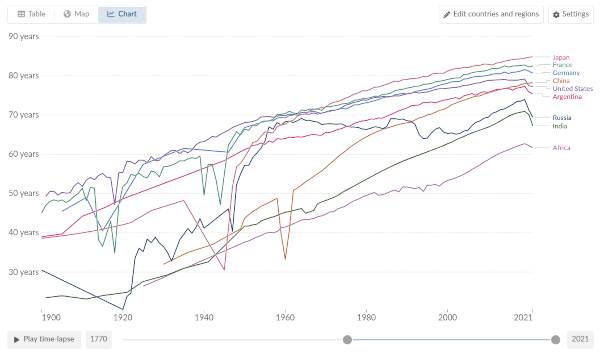](https://ourworldindata.org/grapher/life-expectancy?time=1900..latest&country=JPN~FRA~CHN~USA~ARG~IND~DEU~RUS~OWID_AFR)

  

What do we see? Over the last century, truly massive progress.  

我们看到了什么？在过去的一个世纪里，真正的巨大进步。  

This is true across the entire world, both the historically wealthy and dominant regions and the poor and exploited regions.  

这在整个世界范围内都是如此，无论是历史上富裕和占主导地位的地区，还是贫困和被剥削的地区。

Some blame technology for creating or exacerbating calamities such as totalitarianism and wars.  

有人责怪科技创造或加剧了诸如极权主义和战争等灾难。  

In fact, we can see the deaths caused by the wars on the charts: one in the 1910s (WW1), and one in the 1940s (WW2).  

事实上，我们可以从图表上看到战争造成的死亡：一次发生在1910年代（第一次世界大战），一次发生在1940年代（第二次世界大战）。  

If you look carefully, The Spanish Flu, the Great Leap Foward, and other non-military tragedies are also visible.  

如果你仔细观察，还可以看到西班牙流感、大跃进和其他非军事灾难。  

But there is one thing that the chart makes clear: even calamities as horrifying as those are overwhelmed by the sheer magnitude of the unending march of improvements in [food](https://en.wikipedia.org/wiki/Green_Revolution), [sanitation](https://www.theguardian.com/society/2007/jan/19/health.medicineandhealth3), [medicine](https://www.britannica.com/science/history-of-medicine/Medicine-in-the-20th-century) and infrastructure that took place over that century.  

但有一件事情在图表上变得清晰：即使是像那些可怕的灾难一样，也被食品、卫生、医药和基础设施的不断改善所淹没，这些改善在那个世纪里持续不断。

This is mirrored by large improvements to our everyday lives. Thanks to the internet, [most people around the world](https://www.statista.com/chart/30342/cellular-and-broadband-internet-subscriptions-smartphone-penetration-rates/) have access to information at their fingertips that would have been unobtainable twenty years ago.  

这一切都反映在我们日常生活的巨大改善上。多亏了互联网，现在世界上大多数人可以随时获取二十年前无法获得的信息。  

The global economy is becoming more accessible thanks to improvements in international payments and finance.  

随着国际支付和金融的改善，全球经济变得更加可触及。  

Global poverty is [rapidly dropping](https://ourworldindata.org/grapher/reconstruction-of-historical-global-extreme-poverty-rates-1820-2017-roser-and-hasell-2021-and-world-bank2020).  

全球贫困正在迅速减少。  

Thanks to online maps, we no longer have to worry about getting lost in the city, and if you need to get back home quickly, we now have far easier ways to call a car to do so.  

多亏了在线地图，我们不再担心在城市中迷路，而且如果你需要快速回家，现在我们有更简便的方式叫车。  

Our property becoming digitized, and our [physical goods becoming cheap](https://www.visualcapitalist.com/inflation-chart-tracks-price-changes-us-goods-services/), means that we have much less to fear from physical theft.  

我们的财产数字化，物品变得便宜，这意味着我们不再那么担心物质盗窃。  

Online shopping has reduced the disparity in access to goods betweeen the global megacities and the rest of the world.  

在线购物减少了全球大城市和其他地区之间的商品获取差距。  

In all kinds of ways, automation has brought us the eternally-underrated benefit of simply making [our lives more convenient](https://www.econlib.org/convenience-vs-social-desirability-bias/).  

自动化以各种方式使我们的生活更加便利，这一点常常被低估。

These improvements, both quantifiable and unquantifiable, are _large_.  

这些改善，无论是可量化还是不可量化的，都是巨大的。  

And in the twenty first century, there's a good chance that even larger improvements are soon to come.  

在二十一世纪，更大的改善很可能即将到来。  

Today, ending aging and disease seem utopian. But from the point of view of [computers as they existed in 1945](https://en.wikipedia.org/wiki/ENIAC), the modern era of putting chips into pretty much everything would have seemed utopian: even science fiction movies often kept their computers room-sized.  

今天，终结衰老和疾病似乎是乌托邦的。但从1945年的计算机的角度来看，将芯片应用于几乎所有事物的现代时代似乎是乌托邦的：即使是科幻电影也经常将计算机保持在机房大小。  

If biotech advances as much over the next 75 years as computers advanced over the last 75 years, the future may be more impressive than almost anyone's expectations.  

如果生物技术在未来75年内取得与过去75年计算机发展同样的进步，未来可能比几乎任何人的预期都更令人印象深刻。

Meanwhile, arguments expressing skepticism about progress have often gone to dark places.  

与此同时，对进步表示怀疑的论点经常走向黑暗的地方。  

Even medical textbooks, like this one in the 1990s (credit [Emma Szewczak](https://twitter.com/EmmaSzewczak/status/1725137589127016675) for finding it), sometimes make extreme claims denying the value of two centuries of medical science and even arguing that it's not obviously good to save human lives:  

甚至医学教科书，比如这本1990年代的书（由Emma Szewczak发现），有时会提出极端观点，否认两个世纪的医学科学的价值，甚至认为挽救人类生命并不明显是好事：

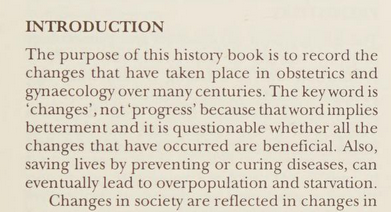

The ["limits to growth"](https://en.wikipedia.org/wiki/The_Limits_to_Growth) thesis, an idea advanced in the 1970s arguing that growing population and industry would eventually deplete Earth's limited resources, ended up inspiring [China's one child policy](https://www.jstor.org/stable/20192474?seq=1#metadata_info_tab_contents) and [massive forced sterilizations in India](https://www.cato.org/policy-analysis/neo-malthusianism-coercive-population-control-china-india-overpopulation-concerns#introduction). In earlier eras, concerns about overpopulation were used to [justify](https://www.econlib.org/archives/2012/05/eugenics_malthu.html) mass [murder](https://www.amazon.com/Merchants-Despair-Environmentalists-Pseudo-Scientists-Antihumanism/dp/159403737X). And those ideas, argued [since 1798](https://en.wikipedia.org/wiki/An_Essay_on_the_Principle_of_Population), have a long history of [being proven wrong](https://quillette.com/2022/09/08/in-defence-of-progress/).  

“增长的极限”论，这个在1970年代提出的观点认为，人口和工业的增长最终会耗尽地球有限的资源，结果激发了中国的独生子女政策和印度的大规模强制绝育。在早期时代，对人口过剩的担忧被用来为大规模屠杀辩护。自1798年以来，这些观点一直被证明是错误的。

It is for reasons like these that, as a starting point, I find myself very uneasy about arguments to slow down technology or human progress.  

正是出于这些原因，作为一个起点，我对减缓技术或人类进步的论点感到非常不安。  

Given how much all the sectors are interconnected, even _sectoral_ slowdowns are risky.  

考虑到各个领域之间的紧密联系，即使是部门性的减速也是有风险的。  

And so when I write things like what I will say later in this post, departing from open enthusiasm for progress-no-matter-what-its-form, those are statements that I make with a heavy heart - and yet, the 21st century is different and unique enough that these nuances are worth considering.  

因此，当我在这篇文章中写下像后面我将要说的那样的话时，我心情沉重——然而，21世纪与众不同，独特之处足以值得我们考虑这些细微差别。

That said, there is one important point of nuance to be made on the broader picture, particularly when we move past "technology as a whole is good" and get to the topic of "which specific technologies are good?".  

话虽如此，在更广泛的背景下，有一个重要的细微差别需要说明，特别是当我们超越“技术整体是好的”这个话题，转向“哪些具体技术是好的？”这个话题时。  

And here we need to get to many people's issue of main concern: the environment.  

在这里，我们需要谈到许多人最关心的问题：环境。

### The environment, and the importance of coordinated intention  

环境和协调意图的重要性

A [major exception](https://twitter.com/PoliticOfNature/status/1692322314430345689) to the trend of pretty much everything getting better over the last hundred years is climate change:  

过去一百年来，几乎所有事物变得更好的趋势有一个重大例外，那就是气候变化：

[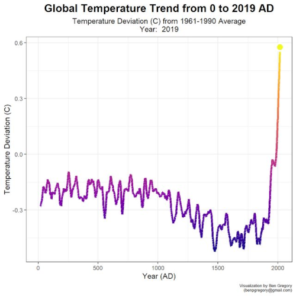](https://digg.com/2020/global-mean-temperature-past-2000-years)

Even pessimistic scenarios of ongoing temperature rises would not come anywhere near causing the literal extinction of humanity.  

即使是悲观的温度上升情景也不会导致人类的真正灭绝。  

But such scenarios could plausibly kill more people than major wars, and severely harm people's health and livelihoods in the regions where people are already struggling the most. [A Swiss Re institute study](https://www.weforum.org/agenda/2021/06/impact-climate-change-global-gdp/) suggests that a worst-case climate change scenario might lower the world's poorest countries' GDP by as much as 25%. [This study](https://www.lse.ac.uk/economics/Assets/Documents/personal-pages/robin-burgess/weather-climate-change-and-death.pdf) suggests that life spans in rural India might be a decade lower than they otherwise would be, and studies like [this one](https://www.nature.com/articles/s41467-021-24487-w#Fig3) and [this one](https://www.v-20.org/new-health-data-shows-unabated-climate-change-will-cause-3.4-million-deaths-per-year-by-century-end) suggest that climate change could cause a hundred million excess deaths by the end of the century.  

但是这样的情景可能比重大战争造成更多人员伤亡，并严重损害那些已经处于困境中的地区的人们的健康和生计。瑞士再保险研究所的一项研究表明，最坏的气候变化情景可能会使全球最贫困国家的国内生产总值下降多达25%。这项研究还指出，印度农村地区的预期寿命可能比原本预期的要低十年，而类似这样的研究还表明，气候变化可能导致本世纪末多出一亿人死亡。

These problems are a big deal.  

这些问题是非常严重的。  

My answer to why I am optimistic about our ability to overcome these challenges is twofold.  

我对我们克服这些挑战的能力为何持乐观态度有两个原因。  

First, after decades of hype and wishful thinking, [solar power](https://ourworldindata.org/grapher/solar-energy-consumption?time=2022) is [finally](https://www.noahpinion.blog/p/our-climate-change-debates-are-out) turning [a corner](https://www.independent.co.uk/tech/solar-panel-prices-fossil-fuels-b2419251.html), and [supportive techologies like batteries](https://arstechnica.com/science/2021/05/eternally-five-years-away-no-batteries-are-improving-under-your-nose/) are making similar progress.  

首先，经过几十年的炒作和一厢情愿的想法，太阳能终于迎来了转机，而像电池这样的支持技术也取得了类似的进展。  

Second, we can look at humanity's track record in solving previous environmental problems. Take, for example, air pollution.  

其次，我们可以看看人类在解决以往环境问题方面的记录。以空气污染为例。  

Meet the dystopia of the past: the Great Smog of London, 1952.  

让我们回顾一下过去的恐怖景象：1952年的伦敦大雾。

[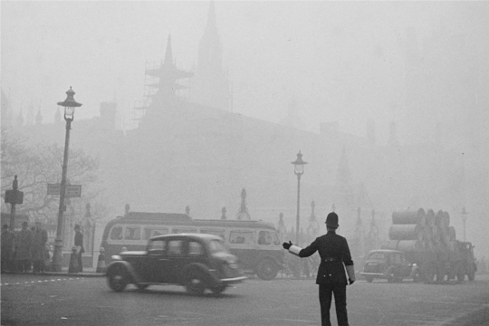](https://www.britannica.com/event/Great-Smog-of-London)

What happened since then? Let's ask Our World In Data again:  

那之后发生了什么呢？让我们再次向我们的数据世界提问：

[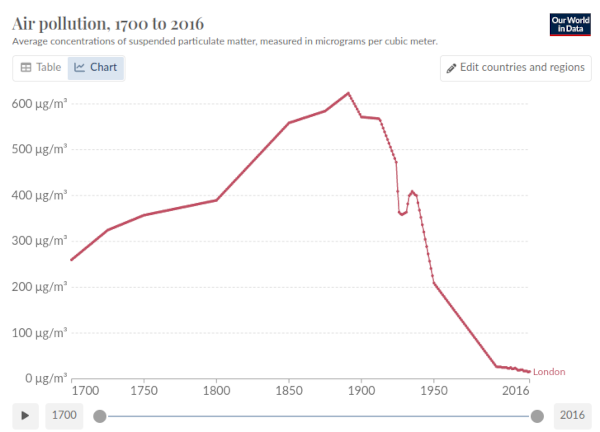](https://ourworldindata.org/london-air-pollution)

As it turns out, 1952 was not even the peak: in the late 19th century, even higher concentrations of air pollutants were just _accepted and normal_. Since then, we've seen a century of ongoing and rapid declines.  

事实证明，1952年甚至不是空气污染的高峰期：在19世纪末，空气污染物的浓度甚至更高，但那时被认为是正常的。从那时起，我们见证了一个世纪以来持续而迅速的下降。  

I got to personally experience the tail end of this in my visits to China: in 2014, high levels of smog in the air, [estimated to reduce life expectancy by over five years](https://www.cnbc.com/id/100871380), were normal, but by 2020, the air often seemed as clean as many Western cities.  

我亲身经历了这个过程，当我访问中国时：2014年，空气中高浓度的雾霾被估计会缩短寿命超过五年，这是正常的，但到了2020年，空气常常看起来和许多西方城市一样清洁。  

This is not our only success story. In many parts of the world, [forest areas are increasing](https://ourworldindata.org/grapher/forest-area-as-share-of-land-area?tab=chart&time=1600..latest&country=FRA~USA~JPN~Scotland~England). The acid rain crisis [is improving](https://link.springer.com/article/10.1007/s13280-019-01244-4). The [ozone layer has been recovering](https://www.unep.org/news-and-stories/press-release/ozone-layer-recovery-track-helping-avoid-global-warming-05degc) for decades.  

这并不是我们唯一的成功故事。世界上许多地区的森林面积正在增加。酸雨危机正在改善。臭氧层已经恢复了几十年。

To me, the moral of the story is this. Often, it really is the case that **version N of our civilization's technology causes a problem, and version N+1 fixes it. However, _this does not happen automatically, and requires intentional human effort_**. The ozone layer is recovering because, [through international agreements like the Montreal Protocol, we made it recover](https://www.eea.europa.eu/en/topics/in-depth/climate-change-mitigation-reducing-emissions/current-state-of-the-ozone-layer). Air pollution is improving because we made it improve.  

对我来说，这个故事的寓意是这样的。通常情况下，我们文明技术的第N个版本会引发问题，而第N+1个版本会解决问题。然而，这并不是自动发生的，需要有意识的人类努力。臭氧层正在恢复，是因为我们通过像《蒙特利尔议定书》这样的国际协议使其恢复。空气污染正在改善，是因为我们使其改善。  

And similarly, solar panels have not gotten massively better because it was a preordained part of the energy tech tree; solar panels have gotten massively better because decades of awareness of the importance of solving climate change have motivated both engineers to work on the problem, and companies and governments to fund their research. **It is intentional action, coordinated through public discourse and culture shaping the perspectives of governments, scientists, philanthropists and businesses, and not an [inexorable "techno-capital machine"](https://www.city-journal.org/article/was-nietzsche-a-techno-optimist), that had solved these problems**.  

同样地，太阳能电池板之所以取得了巨大的进步，并不是因为它是能源技术树中预定的一部分；太阳能电池板之所以取得了巨大的进步，是因为几十年来人们对解决气候变化问题的重要性有了更深入的认识，这激励了工程师们致力于解决这个问题，同时也促使公司和政府资助他们的研究。这是有意识的行动，通过公共讨论和文化塑造来协调政府、科学家、慈善家和企业的观点，而不是一种不可避免的“技术资本机器”解决了这些问题。

## AI is fundamentally different from other tech, and it is worth being uniquely careful  

人工智能与其他技术根本不同，因此我们需要特别小心对待

A lot of the dismissive takes I have seen about AI come from the perspective that it is "just another technology": something that is in the same general class of thing as social media, encryption, contraception, telephones, airplanes, guns, the printing press, and the wheel.  

我看到很多对人工智能的轻视观点都是基于它只是“另一种技术”的角度：认为它与社交媒体、加密、避孕、电话、飞机、枪支、印刷术和轮子等属于同一类事物。  

These things are clearly very socially consequential.  

这些事物显然具有非常重要的社会影响。  

They are not just isolated improvements to the well-being of individuals: they radically transform culture, change balances of power, and harm people who heavily depended on the previous order. Many [opposed them](https://newsletter.pessimistsarchive.org/). And on balance, the pessimists have invariably turned out wrong.  

它们不仅仅是对个人福祉的孤立改善：它们彻底改变了文化，改变了权力平衡，并对那些严重依赖于先前秩序的人造成了伤害。许多人反对它们。总的来说，悲观主义者总是被证明是错误的。

But there is a different way to think about what AI is: it's a _new type of mind_ that is rapidly gaining in intelligence, and it stands a serious chance of overtaking humans' mental faculties and becoming the new apex species on the planet.  

但是，我们可以用一种不同的方式来思考人工智能：它是一种新型的思维，其智能迅速增长，并有很大可能超越人类的智力能力，成为地球上新的顶级物种。  

The class of things in _that_ category is much smaller: we might plausibly include humans surpassing monkeys, multicellular life surpassing unicellular life, the [origin of life itself](https://en.wikipedia.org/wiki/Abiogenesis), and perhaps the Industrial Revolution, in which machine edged out man in _physical_ strength. Suddenly, it feels like we are walking on much less well-trodden ground.  

这一类事物的范畴要小得多：我们可以合理地包括人类超越猴子、多细胞生物超越单细胞生物、生命起源本身，以及也许是工业革命，其中机器在体力上超过了人类。突然间，感觉我们走在了少有人走过的领域。

### Existential risk is a big deal  

存在风险是一件大事

One way in which AI gone wrong could make the world worse is ([almost](https://en.wikipedia.org/wiki/Suffering_risks)) the worst possible way: it could [literally cause human extinction](https://www.lesswrong.com/posts/uMQ3cqWDPHhjtiesc/agi-ruin-a-list-of-lethalities).  

人工智能出现问题可能会以（几乎）最糟糕的方式使世界变得更糟：它可能会直接导致人类灭绝。  

This is an extreme claim: as much harm as the worst-case scenario of climate change, or an artificial pandemic or a nuclear war, might cause, there are many islands of civilization that would remain intact to pick up the pieces.  

这是一个极端的说法：尽管气候变化的最坏情况、人工大流行或核战争可能会造成巨大的伤害，但仍有许多文明的岛屿能够幸存下来，重建一切。  

But a superintelligent AI, if it decides to turn against us, may well leave no survivors, and end humanity for good.  

但是，如果超级智能人工智能决定反对我们，可能不会留下任何幸存者，彻底终结人类。  

Even [Mars](https://www.dailymail.co.uk/sciencetech/article-8782693/Elon-Musk-says-humans-interplanetary-species-sun-engulfed-earth.html) may not be safe.  

即使是火星也可能不安全。

A big reason to be worried centers around [instrumental convergence](https://en.wikipedia.org/wiki/Instrumental_convergence): for a very wide class of goals that a superintelligent entity could have, two very natural intermediate steps that the AI could take to better achieve those goals are (i) consuming resources, and (ii) ensuring its safety.  

一个令人担忧的主要原因是工具收敛：对于超级智能实体可能拥有的非常广泛的目标类别，为了更好地实现这些目标，AI可能采取的两个非常自然的中间步骤是（i）消耗资源和（ii）确保自身安全。  

The Earth contains lots of resources, and humans are a [predictable threat](https://en.wikipedia.org/wiki/Thucydides_Trap) to such an entity's safety. We _could_ try to give the AI an explicit goal of loving and protecting humans, but we have [no idea](https://www.lesswrong.com/posts/EPAofvLzsCwqYnekj/what-s-in-your-list-of-unsolved-problems-in-ai-alignment) how to [actually](https://www.alignmentforum.org/posts/EjgfreeibTXRx9Ham/ten-levels-of-ai-alignment-difficulty) do [that](https://arxiv.org/abs/2109.13916) in a way that won't completely break down as soon as the AI [encounters an unexpected situation](https://towardsdatascience.com/out-of-distribution-generalization-66b6f8980ef3). Ergo, we have a problem.  

地球上有大量资源，而人类对这种实体的安全构成可预测的威胁。我们可以尝试给AI明确的目标，即热爱和保护人类，但我们不知道如何在AI遇到意外情况时不会完全崩溃。因此，我们面临一个问题。

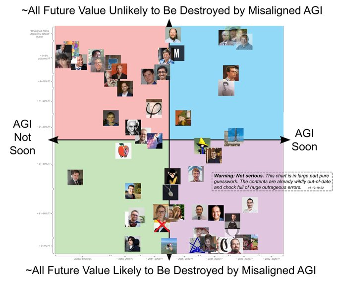

_[MIRI researcher Rob Bensinger's attempt](https://twitter.com/robbensinger/status/1537724894678380544) at illustrating different people's estimates of the probability that AI will either kill everyone or do something almost as bad.  

MIRI研究员Rob Bensinger试图说明不同人对人工智能要么杀死所有人，要么做出几乎同样糟糕的事情的概率的估计。  

Many of the positions are rough approximations based on people's public statements, but many others have publicly given their precise estimates; quite a few have a "probability of doom" over 25%.  

许多职位都是根据人们的公开声明进行粗略估计的，但也有很多人公开给出了他们的精确估计；相当多的人认为“毁灭的可能性”超过25%。_

A [survey of machine learning researchers](https://aiimpacts.org/2022-expert-survey-on-progress-in-ai/#Extinction_from_AI) from 2022 showed that on average, researchers think that there is a 5-10% chance that AI will literally kill us all: about the same probability as the statistically expected chance that [you will die of non-biological causes like injuries](https://en.wikipedia.org/wiki/List_of_causes_of_death_by_rate).  

2022年的一项机器学习研究人员调查显示，平均而言，研究人员认为人工智能会真正杀死我们所有人的机会是5-10%：与你因非生物原因（如受伤）死亡的统计预期机会相当。

This is all a speculative hypothesis, and we should all be wary of speculative hypotheses that involve complex multi-step stories.  

这只是一个推测性的假设，我们都应该对涉及复杂多步骤故事的推测性假设保持警惕。  

However, these arguments have survived over a decade of scrutiny, and so, it seems worth worrying at least a little bit.  

然而，这些论点经过十多年的审查仍然存在，所以，至少有一点值得担心。  

But even if you're not worried about literal extinction, there are other reasons to be scared as well.  

即使你不担心真正的灭绝，还有其他原因让人害怕。

### Even if we survive, is a superintelligent AI future a world we want to live in?  

即使我们幸存下来，超级智能人工智能的未来是我们想要生活的世界吗？

A lot of modern science fiction is dystopian, and paints AI in a bad light.  

许多现代科幻小说都是反乌托邦的，将人工智能描绘成不好的形象。  

Even non-science-fiction attempts to identify possible AI futures often give [quite unappealing answers](https://www.eknowledger.com/files/life3_Summary_of_ai.png).  

即使非科幻小说试图确定可能的人工智能未来，也经常给出相当不吸引人的答案。  

And so I went around and asked the question: what is a depiction, whether science fiction or otherwise, of a future that contains superintelligent AI that we would _want_ to live in. The answer that came back by far the most often is Iain Banks's [Culture series](https://en.wikipedia.org/wiki/Culture_series).  

于是我四处询问这个问题：无论是科幻还是其他类型的作品，关于包含超智能人工智能的未来，我们会想要生活在其中的描绘是什么。最常被提到的答案是伊恩·班克斯的《文明系列》。

The Culture series features a far-future interstellar civilization primarily occupied by two kinds of actors: regular humans, and superintelligent AIs called Minds.  

《文明系列》描绘了一个遥远未来的星际文明，主要由两类角色组成：普通人类和被称为“心智”的超智能人工智能。  

Humans have been augmented, but only slightly: medical technology theoretically allows humans to live indefinitely, but most choose to live only for around 400 years, seemingly because they get bored of life at that point.  

人类已经进行了一些增强，但只是轻微的：理论上的医疗技术使人类可以无限延长寿命，但大多数人选择只活400年左右，似乎是因为他们对生活感到厌倦。

From a superficial perspective, life as a human seems to be good: it's comfortable, health issues are taken care of, there is a wide variety of options for entertainment, and there is a positive and synergistic relationship between humans and Minds.  

从表面上看，作为人类的生活似乎很好：舒适，健康问题得到照顾，有各种各样的娱乐选择，人类和心智之间存在积极而协同的关系。  

When we look deeper, however, there is a problem: **it seems like the Minds are completely in charge, and humans' only role in the stories is to act as pawns of Minds, performing tasks on their behalf.**  

然而，当我们深入观察时，会发现一个问题：心智似乎完全掌控一切，人类在故事中的唯一角色就是充当心智的棋子，代表它们执行任务。

Quoting from [Gavin Leech's "Against the Culture"](https://www.gleech.org/culture):  

引用加文·利奇的《反对文明》中的一段话：

> The humans are not the protagonists.  
> 
> 人类并不是主角。  
> 
> Even when the books seem to have a human protagonist, doing large serious things, they are actually the agent of an AI.  
> 
> 即使在书中似乎有一个人类主角，做着重大而严肃的事情，实际上他们只是人工智能的代理。  
> 
> (Zakalwe is one of the only exceptions, because he can do immoral things the Minds don't want to.) "The Minds in the Culture don't need the humans, and yet the humans need to be needed." (I think only a small number of humans need to be needed - or, only a small number of them need it enough to forgo the many comforts.  
> 
> （Zakalwe 是少数几个例外之一，因为他可以做一些 Minds 不想做的不道德的事情。）“文明中的 Minds 不需要人类，但人类却需要被需要。”（我认为只有少数人需要被需要 - 或者说，只有少数人足够需要被需要，以放弃许多舒适。  
> 
> Most people do not live on this scale. It's still a fine critique.)  
> 
> 大多数人不过是过着普通的生活。这仍然是一个很好的批评。）
> 
> The projects the humans take on risk inauthenticity.  
> 
> 人类承担的项目存在不真实的风险。  
> 
> Almost anything they do, a machine could do better. What can you do?  
> 
> 几乎任何事情，机器都能做得更好。你能做什么呢？  
> 
> You can order the Mind to not catch you if you fall from the cliff you're climbing-just-because; you can delete the backups of your mind so that you are actually risking.  
> 
> 你可以命令 Mind 不要在你从悬崖上爬下来的时候抓住你；你可以删除你的思维备份，这样你就真的冒着风险。  
> 
> You can also just leave the Culture and rejoin some old-fashioned, unfree "strongly evaluative" civ.  
> 
> 你也可以离开文明，加入一些老式、不自由的“强烈评价”的社会。  
> 
> The alternative is to evangelise freedom by joining Contact.  
> 
> 另一种选择是通过加入 Contact 来传播自由。

I would argue that even the "meaningful" roles that humans are given in the Culture series are a stretch; I asked ChatGPT (who else?) why humans are given the roles that they are given, instead of Minds doing everything completely by themselves, and I personally found [its answers](https://chat.openai.com/share/3dbe04c4-f5f3-4d2f-9437-d32732adde99) quite underwhelming. **It seems very hard to have a "friendly" superintelligent-AI-dominated world where humans are anything other than pets.**  

我认为，即使在《文明系列》中赋予人类的“有意义”角色也是牵强的；我问过 ChatGPT（还能问谁呢？）为什么人类被赋予他们所扮演的角色，而不是 Minds 完全自己做所有事情，我个人觉得它的回答相当令人失望。在一个由“友好”的超级智能 AI 主导的世界中，很难想象人类除了作为宠物之外还能扮演其他角色。

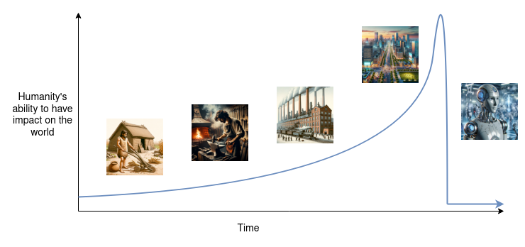

_The world I don't want to see.  

这是我不想看到的世界。_

Many other scifi series posit a world where superintelligent AIs exist, but _take orders_ from (unenhanced) biological human masters.  

许多其他科幻系列设想了一个超级智能 AI 存在的世界，但是接受（未增强的）生物人类主人的命令。  

Star Trek is a good example, showing a vision of harmony between the starships with their [AI "computers"](https://memory-alpha.fandom.com/wiki/Computer) (and [Data](https://memory-alpha.fandom.com/wiki/Data)) and their human operators crewmembers. However, this feels like an incredibly unstable equilibrium.  

《星际迷航》是一个很好的例子，展示了星舰上的 AI “计算机”（和 Data）与人类操作员船员之间的和谐。然而，这种平衡似乎是非常不稳定的。  

The world of Star Trek appears idyllic in the moment, but it's hard to imagine its vision of human-AI relations as anything but a transition stage a decade before starships become _entirely_ computer-controlled, and can stop bothering with large hallways, artificial gravity and climate control.  

《星际迷航》的世界在某种程度上看起来是理想的，但很难想象它对人类与 AI 关系的展望除了作为过渡阶段之外还能是什么，十年后星舰将完全由计算机控制，不再需要大型走廊、人工重力和气候控制。

A human giving orders to a superintelligent machine would be far less intelligent than the machine, and it would have access to less information.  

一个人给超级智能机器下命令，比起机器来说会远不如机器聪明，并且它能够获取的信息也更少。  

In a universe that has any degree of competition, the civilizations where humans take a back seat would outperform those where humans stubbornly insist on control. Furthermore, the _computers themselves_ may wrest control.  

在一个存在竞争的宇宙中，那些人类退居次要地位的文明将会胜过那些人类固执地坚持控制的文明。此外，计算机本身可能会夺取控制权。  

To see why, imagine that you are legally a literal slave of an eight year old child.  

为了理解其中的原因，想象一下你在法律上是一个八岁孩子的奴隶。  

If you could talk with the child for a long time, do you think you could convince the child to sign a piece of paper setting you free?  

如果你能够与孩子长时间交谈，你认为你能说服孩子签署一份让你自由的文件吗？  

I have not run this experiment, but my instinctive answer is a strong yes.  

我没有进行过这个实验，但我的直觉回答是强烈的肯定。  

And so all in all, humans becoming pets seems like an attractor that is very hard to escape.  

总的来说，人类成为宠物似乎是一个非常难以逃脱的吸引力。

### The sky is near, the emperor is everywhere  

天高皇帝远

The Chinese proverb 天高皇帝远 ("tian gao huang di yuan"), "the sky is high, the emperor is far away", encapsulates a basic fact about the limits of centralization in politics.  

中国谚语"天高皇帝远"概括了政治集权的局限性的基本事实。  

Even in a nominally large and despotic empire - in fact, _especially_ if the despotic empire is large, there are practical limits to the leadership's reach and attention, the leadership's need to delegate to local agents to enforce its will dilutes its ability to enforce its intentions, and so there are always places where a certain degree of practical freedom reigns.  

即使在一个名义上庞大而专制的帝国中，实际上，尤其是当专制帝国庞大时，领导层的影响力和关注度也存在实际限制。领导层需要委派地方代理人来执行其意愿，这削弱了其执行意图的能力，因此总会存在一定程度的实际自由。  

Sometimes, this can have downsides: the absence of a faraway power enforcing uniform principles and laws can create space for local hegemons to steal and oppress.  

有时，这可能会带来一些不利因素：远离的权力无法强制执行统一的原则和法律，这为地方霸主窃取和压迫创造了空间。  

But if the centralized power goes bad, practical limitations of attention and distance can create practical limits to how bad it can get.  

但是，如果中央集权的权力变坏，关注度和距离的实际限制会对其恶化程度产生实际限制。

With AI, no longer.  

然而，有了人工智能，情况就不同了。  

In the twentieth century, modern transportation technology made limitations of distance a much weaker constraint on centralized power than before; the great totalitarian empires of the 1940s were in part a result.  

在二十世纪，现代交通技术使距离的限制对中央集权的影响变得较之前更弱；二十世纪四十年代的大型极权帝国在一定程度上就是这种情况的结果。  

In the twenty first, scalable information gathering and automation may mean that attention will no longer be a constraint either.  

而在二十一世纪，可扩展的信息收集和自动化可能意味着关注度也不再是一个限制。  

The consequences of natural limits to government disappearing _entirely_ could be dire.  

政府自然限制完全消失的后果可能是可怕的。

Digital authoritarianism has been [on the rise for a decade](https://freedomhouse.org/report/freedom-net/2018/rise-digital-authoritarianism), and surveillance technology has already given authoritarian governments powerful new strategies to crack down on opposition: let the protests happen, but then detect and [quietly go after](https://www.reuters.com/article/us-russia-politics-navalny-tech-idUSKBN2AB1U2) the participants [after the fact](https://www.rferl.org/a/russia-dissent-cctv-detentions-days-later-strategy/31227889.html).  

数字威权主义已经上升了十年，监控技术已经给威权政府提供了强大的新策略来打击反对派：让抗议活动发生，然后在事后悄悄追捕参与者。  

More generally, my basic fear is that the same kinds of managerial technologies that allow OpenAI to serve over a hundred million customers with [500 employees](https://en.wikipedia.org/wiki/OpenAI) will also allow a 500-person political elite, or even a 5-person board, to maintain an iron fist over an entire country.  

更一般地说，我最基本的担忧是，让 OpenAI 能够为一亿多客户提供服务的那些管理技术，也将使一个由500人的政治精英，甚至是一个由5人组成的董事会，能够对整个国家保持铁腕统治。  

With modern surveillance to collect information, and modern AI to interpret it, there may be no place to hide.  

借助现代监控收集信息，并借助现代人工智能进行解读，可能没有任何地方可以隐藏。

It gets worse when we think about the consequences of AI in warfare. Quoting a [semi-famous post](https://im0xalpha.notion.site/AI-to-the-Left-Crypto-to-the-Right-914c101cfc314659a18dbbabc89d152b) on the philosophy of AI and crypto by [0xAlpha](https://twitter.com/0x_Alpha):  

当我们考虑人工智能在战争中的后果时，情况变得更糟。引用0xAlpha在人工智能和加密哲学方面的半著名帖子：

> When there is no need for political-ideological work and war mobilization, the supreme commander of war only needs to consider the situation itself as if it were a game of chess and completely ignore the thoughts and emotions of the pawns/knights/rooks on the chessboard.  
> 
> 当不再需要政治意识形态工作和战争动员时，战争的最高指挥官只需要将情况本身视为一场象棋游戏，完全忽视棋盘上的卒子/马/车的思想和情感。  
> 
> War becomes a purely technological game.  
> 
> 战争变成了纯粹的技术游戏。
> 
> Furthermore, political-ideological work and war mobilization require a justification for anyone to wage war.  
> 
> 此外，政治意识形态工作和战争动员需要为任何人发动战争提供正当理由。  
> 
> Don't underestimate the importance of such "justification".  
> 
> 不要低估这种"正当理由"的重要性。  
> 
> It has been a legitimacy constraint on the wars in human society for thousands of years.  
> 
> 这已经成为人类社会中战争的合法性约束数千年来的约束。  
> 
> Anyone who wants to wage war has to have a reason, or at least a superficially justifiable excuse.  
> 
> 任何想要发动战争的人都必须有一个理由，或者至少有一个表面上可以被接受的借口。  
> 
> You might argue that this constraint is so weak because, in many instances, this has been nothing more than an excuse.  
> 
> 你可能会争辩说，这种约束是如此之弱，因为在许多情况下，这只不过是一个借口而已。  
> 
> For example, some (if not all) of the Crusades were really to occupy land and rob wealth, but they had to be done in the name of God, even if the city being robbed was God's Constantinople.  
> 
> 例如，十字军东征中的一些（如果不是全部）实际上是为了占领土地和掠夺财富，但它们必须以上帝的名义进行，即使被掠夺的城市是上帝的君士坦丁堡。  
> 
> However, even a weak constraint is still a constraint!  
> 
> 然而，即使是一个薄弱的约束也是一种约束！  
> 
> This little excuse requirement alone actually prevents the warmakers from being completely unscrupulous in achieving their goals.  
> 
> 这个小小的借口要求实际上阻止了战争制造者在实现他们的目标时完全肆无忌惮。  
> 
> Even an evil like Hitler could not just launch a war right off the bat–he had to spend years first trying to convince the German nation to fight for the living space for the noble Aryan race.  
> 
> 即使像希特勒这样的邪恶人物也不能随随便便发动战争 - 他必须先花费数年时间试图说服德国民族为贵族雅利安种族的生存空间而战斗。

Today, the "human in the loop" serves as an important check on a dictator's power to start wars, or to oppress its citizens internally.  

如今，“人类参与”作为对独裁者发动战争或内部压迫其公民权力的重要制约。  

Humans in the loop have [prevented](https://www.theguardian.com/science/2017/oct/27/vasili-arkhipov-soviet-submarine-captain-who-averted-nuclear-war-awarded-future-of-life-prize) nuclear [wars](https://en.wikipedia.org/wiki/Stanislav_Petrov), [allowed the opening of the Berlin wall](https://www.npr.org/sections/parallels/2014/11/06/361785478/the-man-who-disobeyed-his-boss-and-opened-the-berlin-wall), and saved lives during [atrocities](https://en.wikipedia.org/wiki/Paul_Rusesabagina) like [the](https://en.wikipedia.org/wiki/Oskar_Schindler) [Holocaust](https://en.wikipedia.org/wiki/Chiune_Sugihara). If armies are robots, this check disappears completely.  

人类的参与阻止了核战争的发生，使得柏林墙开放，并在类似大屠杀的暴行中挽救了生命。如果军队由机器人组成，这种检查将完全消失。  

A dictator could get drunk at 10 PM, get angry at people being mean to them on twitter at 11 PM, and a robotic invasion fleet could cross the border to rain hellfire on a neighboring nation's civilians and infrastructure before midnight.  

一个独裁者可以在晚上10点喝醉，晚上11点因为别人对他们不友善而生气，而机器人入侵舰队可以在午夜前越过边境，对邻国的平民和基础设施进行毁灭性打击。

And unlike previous eras, where there is always some distant corner, where the sky is high and the emperor is far away, where opponents of a regime could regroup and hide and eventually find a way to make things better, with 21st century AI a totalitarian regime may well maintain enough surveillance and control over the world to remain "locked in" forever.  

与以往不同的是，在以往的时代中，总有一些遥远的角落，天空高远，皇帝遥不可及，在那里，政权的反对者可以重新组织、隐藏，并最终找到改善事态的方法。然而，随着21世纪人工智能的出现，一个极权主义政权可能会对世界保持足够的监视和控制，使其永远"封锁"。

## d/acc: Defensive (or decentralization, or differential) acceleration  

d/acc：防御（或分散化，或差异化）加速

Over the last few months, the "e/acc" ("effective accelerationist") movement has gained a lot of steam. [Summarized by "Beff Jezos" here](https://beff.substack.com/p/notes-on-eacc-principles-and-tenets), e/acc is fundamentally about an appreciation of the truly massive benefits of technological progress, and a desire to _accelerate_ this trend to bring those benefits sooner.  

在过去几个月里，“e/acc”（“有效加速主义”）运动蓬勃发展。如“贝夫·杰佐斯”在这里总结的那样，e/acc基本上是对技术进步巨大好处的赞赏，并希望加速这一趋势以更早地实现这些好处。

I find myself sympathetic to the e/acc perspective in a lot of contexts.  

在许多情境下，我发现自己对 e/acc 观点持有同情态度。  

There's a lot of evidence that [the FDA is far too conservative](https://marginalrevolution.com/marginalrevolution/2015/08/is-the-fda-too-conservative-or-too-aggressive.html) in its willingness to delay or block the approval of drugs, and bioethics in general far too often seems to operate by the principle that "20 people dead in a medical experiment gone wrong is a tragedy, but 200000 people dead from life-saving treatments being delayed is a statistic".  

有很多证据表明，美国食品药品监督管理局在延迟或阻止药物批准方面过于保守，而生物伦理学在很多情况下似乎都是按照这样的原则运作：“20人在医学实验中死亡是一场悲剧，但因为救命药物被延迟而导致20万人死亡只是一个统计数字”。  

The delays to approving [covid tests and vaccines](https://www.niskanencenter.org/how-the-fda-among-others-failed-us/), and [malaria vaccines](https://worksinprogress.co/issue/why-we-didnt-get-a-malaria-vaccine-sooner/), seem to further confirm this. However, it is possible to take this perspective too far.  

对于批准新冠病毒检测和疫苗以及疟疾疫苗的延迟，似乎进一步证实了这一点。然而，过于持这种观点也是有可能的。

In addition to my AI-related concerns, I feel particularly ambivalent about the [e/acc enthusiasm](https://twitter.com/bayeslord/status/1726441610412532192) for [military technology](https://a16z.com/how-the-u-s-can-rewire-the-pentagon-for-a-new-era/).  

除了与人工智能相关的担忧外，我对于 e/acc 对军事技术的热情感到特别矛盾。  

In the current context in 2023, where this technology is being made by the United States and immediately applied to defend Ukraine, it is easy to see how it can be a force for good.  

在当前的2023年背景下，这项技术由美国制造并立即应用于保卫乌克兰，很容易看出它可以成为一种善良的力量。

Taking a broader view, however, **enthusiasm about modern military technology as a force for good seems to require believing that the dominant technological power will reliably be one of the good guys in most conflicts, now and in the future**: military technology is good because military technology is being built and controlled by America and America is good.

  

然而，从更广泛的视角来看，对现代军事技术作为一种促进善良力量的热情似乎需要相信，在现在和将来的大多数冲突中，技术强国将可靠地成为善良的一方：军事技术是好的，因为军事技术是由美国建造和控制的，而美国是好的。  

Does being an e/acc require being an America maximalist, betting everything on both the government's present and future morals and the country's future success?  

成为一个电子/加速器是否需要成为一个美国至上主义者，把一切都押在政府现在和未来的道德以及国家未来的成功上？

On the other hand, I see the need for new approaches in thinking of how to reduce these risks. The [OpenAI governance structure](https://openai.com/our-structure) is a good example: it seems like a well-intentioned effort to balance the need to make a profit to satisfy investors who provide the initial capital with the desire to have a check-and-balance to push against moves that risk OpenAI blowing up the world.  

另一方面，我认为有必要思考如何减少这些风险的新方法。OpenAI 的治理结构就是一个很好的例子：它似乎是一个出于善意的努力，既满足了满足提供初始资本的投资者的盈利需求，又希望有一种制衡机制来阻止可能导致OpenAI毁灭世界的行动。  

In practice, however, their recent [attempt to fire Sam Altman](https://www.theverge.com/2023/11/17/23965982/openai-ceo-sam-altman-fired) makes the structure seem like an abject failure: it centralized power in an undemocratic and unaccountable board of five people, who made key decisions based on secret information and refused to give any details on their reasoning [until employees threatened to quit](https://finance.yahoo.com/news/ilya-sutskever-openai-cofounder-helped-154539130.html) en-masse. Somehow, the non-profit board played their hands so poorly that the company's employees [created](https://www.indiatoday.in/technology/news/story/openai-is-nothing-without-its-people-tweet-employees-as-many-of-them-expect-to-follow-fired-boss-sam-altman-2465332-2023-11-20) an [impromptu de-facto union](https://www.nytimes.com/interactive/2023/11/20/technology/letter-to-the-open-ai-board.html)... to side with the billionaire CEO against them.  

然而，在实践中，他们最近试图解雇 Sam Altman 的举动使得这种结构看起来像是一个彻底的失败：它将权力集中在一个不民主、不负责任的五人董事会中，他们基于秘密信息做出重要决策，并拒绝在员工威胁要集体辞职之前透露任何决策理由的细节。不知何故，这个非营利董事会的策略非常糟糕，以至于公司的员工们自发组成了一种事实上的工会...支持亿万富翁 CEO 对抗他们。

Across the board, I see far too many plans to save the world that involve giving a small group of people extreme and opaque power and hoping that they use it wisely.  

总的来说，我看到太多拯救世界的计划都涉及将极端和不透明的权力交给一小群人，并希望他们能明智地使用这种权力。  

And so I find myself drawn to a different philosophy, one that has detailed ideas for how to deal with risks, but which seeks to create and maintain a more democratic world and tries to avoid centralization as the go-to solution to our problems. **This philosophy also goes quite a bit broader than AI, and I would argue that it applies well even in worlds where AI risk concerns turn out to be largely unfounded**. I will refer to this philosophy by the name of **d/acc**.  

因此，我发现自己被另一种哲学所吸引，这种哲学对如何应对风险有详细的想法，但它试图创造和维护一个更加民主的世界，并试图避免将集权作为解决问题的首选方案。这种哲学的适用范围远不止于人工智能，我认为即使在人工智能风险问题被证明基本上是没有根据的世界中，它也适用得很好。我将用 d/acc 来称呼这种哲学。

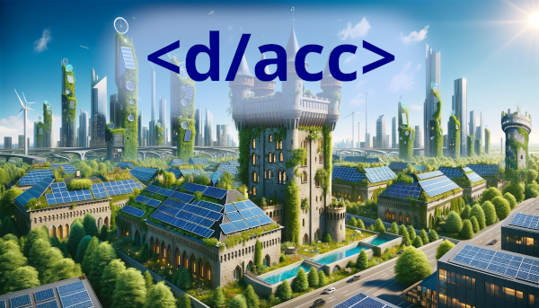

dacc3

The "d" here can stand for many things; particularly, **defense**, **decentralization**, **democracy** and **differential**.  

这里的“d”可以代表许多事物，特别是防御（defense）、去中心化（decentralization）、民主（democracy）和差异（differential）。  

First, think of it about defense, and then we can see how this ties into the other interpretations.  

首先，将其视为防御，然后我们可以看到这如何与其他解释相关联。

### Defense-favoring worlds help healthy and democratic governance thrive  

偏向防御的世界有助于健康和民主的治理蓬勃发展

One frame to think about the macro consequences of technology is to look at the **balance of defense vs offense**.  

思考技术的宏观后果的一个框架是看防御与攻击的平衡。  

Some technologies make it easier to attack others, in the broad sense of the term: do things that go against their interests, that they feel the need to react to.  

某些技术使攻击他人变得更容易，从广义上讲：做一些违背他们利益的事情，他们感到需要做出反应。  

Others make it easier to defend, and even defend without reliance on large centralized actors.  

其他技术则使防御更容易，甚至可以在没有依赖大型中央化参与者的情况下进行防御。

A defense-favoring world is a better world, for many reasons.  

偏向防御的世界是一个更好的世界，原因有很多。  

First of course is the direct benefit of safety: fewer people die, less economic value gets destroyed, less time is wasted on conflict.  

首先当然是安全的直接好处：减少人员伤亡，减少经济价值的破坏，减少冲突所浪费的时间。  

What is less appreciated though is that a defense-favoring world makes it easier for healthier, more open and more freedom-respecting forms of governance to thrive.  

然而，较少被人们重视的是，偏向防御的世界使更健康、更开放和更尊重自由的治理形式更易于蓬勃发展。

An obvious example of this is **Switzerland**.  

一个明显的例子是瑞士。  

Switzerland is often considered to be the closest thing the real world has to a classical-liberal governance utopia.  

瑞士通常被认为是现实世界中最接近古典自由主义治理乌托邦的国家。  

Huge amounts of power are devolved to provinces (called "cantons"), major decisions are [decided by referendums](https://www.economist.com/the-economist-explains/2021/06/17/how-does-switzerlands-referendum-system-work), and many locals [do not even know who the president is](https://www.econlib.org/archives/2018/03/imagine_not_kno.html). How can a country like this survive [extremely challenging](https://en.wikipedia.org/wiki/Switzerland_during_the_World_Wars) political [pressures](https://en.wikipedia.org/wiki/Switzerland_in_the_Napoleonic_era)? Part of the [answer](https://jamesdillard.medium.com/why-switzerland-8650c1ace4d8) is [excellent political strategy](https://www.wearethemighty.com/mighty-history/insane-defenses-switzerland-remain-neutral/), but the other major part is [very defense-favoring geography](https://en.wikipedia.org/wiki/National_Redoubt_(Switzerland)) in the form of its mountainous terrain.  

大量权力下放给各个省份（称为“州”），重大决策由全民公投决定，许多当地人甚至不知道总统是谁。这样的国家如何在极具挑战性的政治压力下生存？答案的一部分是出色的政治策略，但另一个重要部分是其多山地形所带来的非常有利于防御的地理条件。

_The flag is a big plus. But so are the mountains.  

国旗是一个巨大的加号。山脉也是如此。_

Anarchist societies in Zomia, famously profiled in James C Scott's new book ["The Art of Not Being Governed"](https://en.wikipedia.org/wiki/The_Art_of_Not_Being_Governed), are another example: they too maintain their freedom and independence in large part thanks to mountainous terrain.  

著名学者詹姆斯·C·斯科特在他的新书《不被统治的艺术》中，对佐米亚的无政府社会进行了详细描述，他们也在很大程度上依靠多山地形维护了自由和独立。  

Meanwhile, the Eurasian steppes are [the exact opposite of a governance utopia](https://en.wikipedia.org/wiki/Destruction_under_the_Mongol_Empire). Sarah Paine's exposition of [maritime versus continental powers](https://www.dwarkeshpatel.com/p/sarah-paine#details) makes similar points, though focusing on water as a defensive barrier rather than mountains.  

与此相反，欧亚大陆的草原地带则完全不具备治理乌托邦的条件。萨拉·佩恩对海洋国家与大陆国家的阐述也提出了类似的观点，尽管重点是将水作为防御屏障，而不是山脉。  

In fact, the combination of ease of voluntary trade and difficulty of involuntary invasion, common to both Switzerland and the island states, seems ideal for human flourishing.  

事实上，瑞士和岛国之间共同具备的自愿贸易便利和非自愿入侵困难的组合，似乎是人类繁荣的理想条件。

I discovered a related phenomenon when advising quadratic funding experiments within the Ethereum ecosystem: specifically the [Gitcoin Grants funding rounds](https://grants.gitcoin.co/). In [round 4](https://vitalik.ca/general/2020/01/28/round4.html), a mini-scandal arose when some of the highest-earning recipients were Twitter influencers, whose contributions are viewed by some as positive and others as negative.  

在以太坊生态系统内进行二次方资金实验时，我发现了一个相关现象：具体来说是 Gitcoin Grants 资金轮。在第四轮中，一场小丑闹剧出现了，一些最高收入的受益者是 Twitter 影响者，他们的贡献被一些人视为积极的，而被其他人视为消极的。  

My own interpretation of this phenomenon was that there is an imbalance: [quadratic funding](https://vitalik.ca/general/2019/12/07/quadratic.html) allows you to signal that you think something is a _public good_, but it gives no way to signal that something is a _public bad_. In the extreme, a fully neutral quadratic funding system would fund both sides of a war.  

我对这一现象的解释是存在一种不平衡：二次方资金允许你表明你认为某事物是公共利益，但它没有提供一种表明某事物是公共危害的方式。在极端情况下，一个完全中立的二次方资金系统将资助战争的双方。  

And so for [round 5](https://vitalik.ca/general/2020/04/30/round5.html), I proposed that Gitcoin should include _negative contributions_: you pay $1 to _reduce_ the amount of money that a given project receives (and implicitly redistribute it to all other projects). The result: _[lots](http://web.archive.org/web/20200409232449/https://twitter.com/evan_van_ness/status/1248390335048216576) of [people](https://twitter.com/ljxie/status/1250178888946176000?s=20) hated [it](https://twitter.com/josephdelong/status/1250175753372807170?s=20)_.  

因此，在第五轮中，我提议 Gitcoin 应该包括负面贡献：你支付 1 美元来减少给定项目接收的资金金额（并将其隐式重新分配给所有其他项目）。结果是：很多人讨厌这个提议。

  

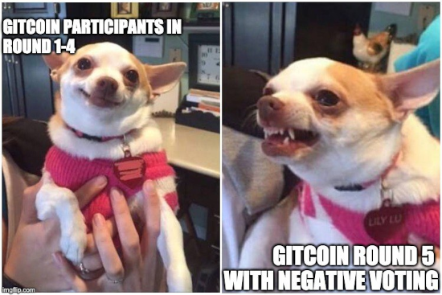

_One of the many internet memes that floated around after round 5.  

第五轮之后流传开来的众多互联网迷因之一。_

This seemed to me to be a microcosm of a bigger pattern: **creating decentralized governance mechanisms to deal with _negative_ externalities is socially a very hard problem**. There is a reason why the go-to example of decentralized governance going wrong is mob justice.  

这对我来说好像是一个更大模式的缩影：创建分散的治理机制来处理负面外部性是一个社会上非常困难的问题。分散治理走向失败的典型例子是暴民法。  

There is [something about human psychology](https://en.wikipedia.org/wiki/Loss_aversion) that makes responding to negatives much more tricky, and much more likely to go very wrong, than responding to positives.  

人类心理中有一些东西使得对负面情况的回应比对正面情况更加棘手，更有可能出现严重问题。  

And this is a reason why even in otherwise highly democratic organizations, decisions of how to respond to negatives are often left to a centralized board.  

这也是为什么即使在其他方面高度民主的组织中，对如何应对负面情况的决策通常留给了一个集中的董事会的原因。

In many cases, this conundrum is one of the deep reasons why the concept of "freedom" is so valuable.  

在许多情况下，这个困境是为什么“自由”这个概念如此宝贵的一个深层原因。  

If someone says something that offends you, or has a lifestyle that you consider disgusting, the pain and disgust that you feel is real, and you may even find it less bad to be physically punched than to be exposed to such things.  

如果有人说了令你不悦的话，或者有一种生活方式让你感到恶心，你所感受到的痛苦和厌恶是真实的，你甚至可能觉得被打一顿比接触这些事情更好受。  

But trying to agree on what kinds of offense and disgust are socially actionable can have far more costs and dangers than simply reminding ourselves that certain kinds of weirdos and jerks are the price we pay for living in a free society.  

但是试图就哪些冒犯和厌恶是社会可行的达成一致，可能会带来更多的成本和危险，而不如提醒自己某些怪人和混蛋是我们生活在自由社会中所付出的代价。

At other times, however, the "grin and bear it" approach is unrealistic.  

有时候，“忍气吞声”的方法是不现实的。  

And in such cases, another answer that is sometimes worth looking toward is defensive technology.  

在这种情况下，另一个值得考虑的答案是防御性技术。  

The more that the internet is secure, the less we need to violate people's privacy and use shady international diplomatic tactics to go after each individual hacker.  

互联网越安全，我们就越不需要侵犯人们的隐私，使用不光彩的国际外交策略来追踪每个黑客。  

The more that we can build [personalized tools for blocking people on Twitter](https://www.blockpartyapp.com/), [in-browser tools for detecting scams](https://www.joinfire.xyz/) and [collective tools for telling apart misinformation](https://vitalik.ca/general/2023/08/16/communitynotes.html) and [truth](https://worksinprogress.co/issue/markets-in-fact-checking), the less we have to fight over censorship.  

我们越能够构建个性化的工具来屏蔽Twitter上的人，通过浏览器工具来检测诈骗，以及集体工具来区分谣言和真相，我们就越不需要为审查权争论不休。  

The faster we can make vaccines, the less we have to go after people for being superspreaders.  

我们研发疫苗的速度越快，我们就越不需要追踪那些传播病毒的人。  

Such solutions don't work in all domains - we certainly don't want a world where everyone has to wear literal body armor - but in domains where we _can_ build technology to make the world more defense-favoring, there is enormous value in doing so.  

这些解决方案并不适用于所有领域 - 我们当然不希望生活在每个人都必须穿着真实的防护服的世界中 - 但在我们能够构建技术来使世界更加偏向防御的领域中，这样做是非常有价值的。

This core idea, that some technologies are defense-favoring and are worth promoting, while other technologies are offense-favoring and should be discouraged, has roots in effective altruist literature under a different name: **differential technology development**. There is a good [exposition of this principle from University of Oxford researchers](https://papers.ssrn.com/sol3/papers.cfm?abstract_id=4213670) from 2022:  

这个核心思想是，一些技术有利于防御并值得推广，而其他技术则有利于攻击并应该受到抑制，这在有效利他主义文献中有所根源，只是名称不同：差异化技术发展。牛津大学的研究人员在2022年对这一原则进行了很好的阐述：

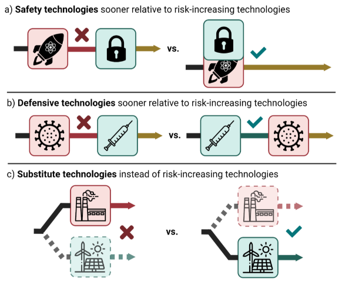

_Figure 1: Mechanisms by which differential technology development can reduce negative societal impacts.  

图1：差异化技术发展如何减少负面社会影响的机制。_

There are inevitably going to be imperfections in classifying technologies as offensive, defensive or neutral.  

将技术分类为攻击性、防御性或中立性时，难免会存在不完美之处。  

Like with "freedom", where one can debate whether social-democratic government policies decrease freedom by levying heavy taxes and coercing employers or increase freedom by reducing average people's need to worry about many kinds of risks, with "defense" too there are some technologies that could fall on both sides of the spectrum.  

就像“自由”一样，人们可以辩论社会民主政府政策通过征收重税和强制雇主是否减少了自由，或者通过减少普通人对许多风险的担忧是否增加了自由，对于“防御”也是如此，有些技术可能同时具有两面性。  

Nuclear weapons are offense-favoring, but nuclear _power_ is [human-flourishing-favoring](https://e360.yale.edu/features/why-nuclear-power-must-be-part-of-the-energy-solution-environmentalists-climate) and offense-defense-neutral.  

核武器有利于攻击，但核能有利于人类繁荣，并且在攻击和防御之间保持中立。  

Different technologies may play different roles at different time horizons.  

不同的技术在不同的时间范围内可能发挥不同的作用。  

But much like with "freedom" (or "equality", or "rule of law"), ambiguity at the edges is not so much an argument against the principle, as it is an opportunity to better understand its nuances.  

但就像“自由”（或“平等”或“法治”）一样，边缘的模糊性并不是反对原则的论据，而是更好地理解其细微差别的机会。

Now, let's see how to apply this principle to a more comprehensive worldview.  

现在，让我们看看如何将这个原则应用于更全面的世界观。  

We can think of defensive technology, like [other technology](https://venturebeat.com/business/vc-peter-thiel-you-can-either-invest-in-bits-or-atoms/), as being split into two spheres: the **world of atoms** and the **world of bits**. The world of atoms, in turn, can be split into **micro** (ie. biology, later nanotech) and **macro** (ie. what we conventionally think of "defense", but also resilient physical infrastructure).  

我们可以将防御技术（如其他技术）看作是分为两个领域：原子世界和比特世界。原子世界又可以分为微观（即生物学，稍后是纳米技术）和宏观（即我们通常认为的“防御”，但也包括弹性物理基础设施）。  

The world of bits I will split on a different axis: **how hard is it to agree, in principle, who the attacker is?**. Sometimes it's easy; I call this **cyber defense**. At other times it's harder; I call this **info defense**.  

我将比特世界分为不同的轴：从原则上说，确定攻击者的难度有多大？有时很容易；我称之为网络防御。而有时更难；我称之为信息防御。

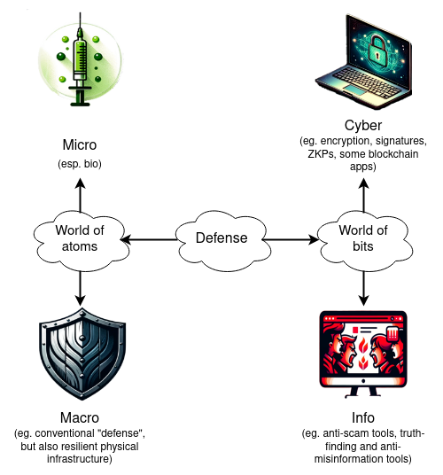

### Macro physical defense  

宏观物理防御

The most underrated defensive technology in the macro sphere is not even [iron domes](https://en.wikipedia.org/wiki/Iron_Dome) (including [Ukraine's new system](https://www.politico.eu/article/ukraine-air-defense-repel-barrage-russia-missile-kyiv/)) and other anti-tech and anti-missile military hardware, but rather _resilient physical infrastructure_. The majority of deaths from a nuclear war are likely to come from [supply chain disruptions](https://www.ncbi.nlm.nih.gov/books/NBK219173/), rather than the initial radiation and blast, and low-infrastructure internet solutions like Starlink have been crucial in [maintaining Ukraine's connectivity](https://en.wikipedia.org/wiki/Starlink_in_the_Russo-Ukrainian_War) for the last year and a half.  

宏观领域中最被低估的防御技术并非铁穹系统（包括乌克兰的新系统）和其他反技术、反导弹军事装备，而是具有弹性的物理基础设施。核战争中的大多数死亡很可能是由供应链中断造成的，而不是初始辐射和冲击，而像 Starlink 这样的低基础设施互联网解决方案在过去一年半中对于维持乌克兰的连通性至关重要。

Building tools to help people survive and even live comfortable lives independently or semi-independently of long international supply chains seems like a valuable defensive technology, and one with a low risk of turning out to be useful for offense.  

构建工具来帮助人们在长期国际供应链中独立或半独立地生存甚至过上舒适的生活，似乎是一项有价值的防御技术，并且具有低风险可能被用于攻击的特点。

The quest to [make humanity a multi-planetary civilization](https://www.dailymail.co.uk/sciencetech/article-8782693/Elon-Musk-says-humans-interplanetary-species-sun-engulfed-earth.html) can also be viewed from a d/acc perspective: having at least a few of us live self-sufficiently on other planets can increase our resilience against something terrible happening on Earth.  

将人类变成一个多星球文明的追求也可以从一个防御/加速透视来看：让我们中至少有几个人在其他星球上能够自给自足，可以增加我们对地球上发生可怕事件的抵御能力。  

Even if the full vision proves unviable for the time being, the _forms of self-sufficient living_ that will need to be developed to make such a project possible may well also be turned to help improve our civilizational resilience on Earth.  

即使完整的愿景在目前来看不可行，为了使这样的项目成为可能，需要开发自给自足的生活形式，这些生活形式可能也能帮助改善我们在地球上的文明韧性。

### Micro physical defense (aka bio)  

微观物理防御（也称为生物防御）

Especially due to its [long-term health effects](https://doi.org/10.1101/2023.07.27.23293177), Covid continues to be a [concern](https://www.statnews.com/2023/09/20/do-long-covid-odds-increase-with-second-infection/).  

由于其长期的健康影响，Covid 仍然是一个令人担忧的问题。  

But Covid is far from the last pandemic that we will face; there are many aspects of the modern world that make it likely that more pandemics are soon to come:  

但 Covid 远非我们将面临的最后一次大流行病；现代世界的许多方面使得更多的大流行病很可能即将到来：

-   **Higher population density** makes it much easier for airborne viruses and other pathogens to spread.  
    
    人口密度增加使得空气传播的病毒和其他病原体更容易传播。  
    
    Epidemic diseases are relatively new in human history and most began with urbanization [only a few thousand years ago](https://press.princeton.edu/books/hardcover/9780691192123/plagues-upon-the-earth). [Ongoing rapid urbanization](https://ourworldindata.org/grapher/urban-population-share-2050?tab=chart) means that population densities will increase further over the next half century.  
    
    流行病在人类历史上相对较新，大多数始于几千年前的城市化。持续快速的城市化意味着人口密度在未来半个世纪内将进一步增加。
-   **Increased air travel** means that airborne pathogens spread very quickly worldwide.  
    
    增加的航空旅行意味着空气传播的病原体在全球范围内传播得非常快。  
    
    People rapidly becoming wealthier means that air travel will likely [increase _much_ further](https://www.statista.com/statistics/1089782/forecasted-number-air-passengers-worldwide-generation/) over the next half century; complexity modeling suggests that [even small increases](https://necsi.edu/longrange-interaction-and-evolutionary-stability-in-a-predatorprey-system) may have drastic effects. Climate change may increase this risk even further.  
    
    人们迅速变得更富裕意味着航空旅行可能在未来半个世纪内进一步增加；复杂性建模表明，即使是小幅增加也可能产生严重影响。气候变化可能进一步增加这种风险。
-   **Animal domestication and factory farming** are major risk factors. [Measles](https://www.science.org/doi/10.1126/science.aba9411) probably evolved from a cow virus less than 3000 years ago. [Today's factory farms](https://www.openaccessgovernment.org/factory-farming-zoonotic-disease-and-the-risk-of-pandemics/121592/) are also farming new strains of influenza (as well as [fueling antibiotic resistance](https://www.saveourantibiotics.org/the-issue/antibiotic-overuse-in-livestock-farming/), with consequences for [human innate immunity](https://www.ox.ac.uk/news/2023-04-25-antimicrobial-use-agriculture-can-breed-bacteria-resistant-first-line-human-defences)).  
    
    动物驯化和工厂养殖是主要的风险因素。麻疹可能是不到3000年前从牛病毒进化而来的。如今的工厂养殖场也在培育新的流感病毒株（同时加剧抗生素耐药性问题，对人类固有免疫力产生后果）。
-   **Modern bio-engineering** makes it easier to create new and more virulent pathogens. Covid [may or may not have leaked](https://www.metaculus.com/questions/8605/most-of-us-ic-favor-covid-lab-leak-hypothesis/) from a lab doing intentional "gain of function" research. Regardless, [lab leaks happen all the time](https://www.amazon.co.uk/Dark-Winter-insiders-pandemics-biosecurity/dp/1742237673), and tools are rapidly improving to make it easier to intentionally create extremely deadly viruses, or even [prions](https://www.nature.com/articles/s41467-018-04584-z) ([zombie proteins](https://english.elpais.com/science-tech/2023-10-20/an-investigation-has-been-opened-into-the-death-of-a-scientist-who-was-studying-a-transmissible-and-deadly-disease-in-spain.html)). Artificial plagues are particularly concerning in part because [unlike nukes](https://www.science.org/content/article/surprise-nuclear-strike-heres-how-well-figure-out-who-did-it), they are unattributable: you can release a virus without anyone being able to tell who created it.  
    
    现代生物工程使得创造新的、更具毒性的病原体变得更容易。新冠病毒可能是从一家进行有意的“功能增强”研究的实验室泄漏出来的，也可能不是。无论如何，实验室泄漏时有发生，并且工具正在迅速改进，使得有意创造极其致命的病毒，甚至是朊病毒（僵尸蛋白）变得更容易。人工瘟疫尤其令人担忧，部分原因是与核武器不同，它们无法追溯：你可以释放病毒而无人能够确定是谁创造了它。  
    
    It is possible _right now_ to design a genetic sequence and send it to a [wet lab](https://www.twistbioscience.com/products/genes) for synthesis, and have it shipped to you within five days.  
    
    现在已经有可能设计一个基因序列并将其发送到湿实验室进行合成，并在五天内将其运送到您手中。

This is an area where [CryptoRelief](https://cryptorelief.in/) and [Balvi](https://twitter.com/VitalikButerin/status/1487073875808583682), two orgs spun up and funded as a result of a large accidental [windfall of Shiba Inu coins](https://fortune.com/2021/05/13/shiba-inu-coin-donation-india-covid-19-crisis-crypto/) in 2021, have been very active.  

这是CryptoRelief和Balvi两个组织在2021年因Shiba Inu币大量意外收入而成立并获得资金支持后非常活跃的领域。  

CryptoRelief initially focused on responding to the immediate crisis and more recently has been building up a long-term medical research ecosystem in India, while Balvi has been focusing on moonshot projects to improve our ability to detect, prevent and treat Covid and other airborne diseases.  

CryptoRelief最初专注于应对当前的危机，最近一直在建立印度的长期医学研究生态系统，而Balvi则专注于改善我们检测、预防和治疗新冠病毒和其他空气传播疾病的能力的重大项目。  

++Balvi has insisted that projects it funds must be open source++. Taking inspiration from [the 19th century water engineering movement that defeated cholera](https://en.wikipedia.org/wiki/London_sewer_system#History) and other waterborne pathogens, it has funded projects across the whole spectrum of technologies that can make the world more hardened against airborne pathogens by default (see: [update 1](https://twitter.com/VitalikButerin/status/1522017142320685057) and [update 2](https://twitter.com/VitalikButerin/status/1567908552714616832)), including:  

++

-   [Far-UVC](https://cybernightmarket.com/products/mini-far-uvc-lights-set) irradiation [R&D](https://www.osluv.org/)  
    
    Balvi坚持资助的项目必须是开源的。它从19世纪的水利工程运动中获得灵感，该运动成功地击败了霍乱和其他水传播的病原体，它资助了一系列技术项目，可以使世界在默认情况下更加抵御空气传播的病原体（参见：更新1和更新2），包括：
-   Air filtering and quality monitoring in [India](https://www.thehindubusinessline.com/news/national/balvi-fund-activebuildings-join-hands-to-deploy-air-quality-monitors/article65337605.ece), Sri Lanka, [the United States](https://shesc.asu.edu/centers/CleanIndoorAir/projects) and elsewhere, and air quality monitoring  
    
    远紫外线辐照研发
-   Equipment for cheap and effective [decentralized air quality testing](https://www.openaeros.com/opencpc)  
    
    在印度、斯里兰卡、美国和其他地方的空气过滤和质量监测，以及空气质量监测
-   Research on Long Covid causes and potential treatment options (the primary cause may be [straightforward](https://www.nature.com/articles/s41590-023-01601-2) but [clarifying mechanisms](https://journals.plos.org/plosbiology/article?id=10.1371/journal.pbio.3001687) and finding treatment is harder)  
    
    便宜而有效的分散式空气质量测试设备
-   Vaccines (eg. [RaDVaC](https://radvac.org/), [PopVax](https://popvax.com/)) and vaccine injury research  
    
    关于长期新冠病毒的原因和潜在治疗方法的研究（主要原因可能很简单，但澄清机制并找到治疗方法更加困难）
-   A set of entirely novel non-invasive medical tools  
    
    疫苗（例如RaDVaC、PopVax）和疫苗损伤研究
-   Early detection of epidemics using analysis of open-source data (eg. [EPIWATCH](https://www.epiwatch.org/))  
    
    利用开源数据分析（例如 EPIWATCH）早期检测流行病
-   Testing, including very cheap molecular rapid tests  
    
    包括非常便宜的分子快速检测
-   Biosafety-appropriate masks for when other approaches fail  
    
    当其他方法失败时，使用适合生物安全的口罩

Other promising areas of interest include [wastewater surveillance of pathogens](https://www.nature.com/articles/s41591-022-01940-x), [improving filtering and ventilation in buildings](https://forum.effectivealtruism.org/posts/q7dJz9ZaZGTSZL8Jk/obstacles-to-the-implementation-of-indoor-air-quality#4__Recommendations), and better understanding and mitigating [risks from poor air quality](https://www.healthdata.org/research-analysis/health-risks-issues/air-pollution-research-library).  

其他有前景的研究领域包括污水监测病原体、改善建筑物的过滤和通风，以及更好地了解和减轻空气质量不佳带来的风险。

There is an opportunity to [build a world](https://cybernightmarket.com/) that is much more hardened against airborne pandemics, both natural and artificial, by default.  

通过默认设置，我们有机会建立一个更加抵御空气传播的自然和人为流行病的世界。  

This world would feature a highly optimized pipeline where we can go from a pandemic starting, to being automatically detected, to people around the world having access to targeted, [locally-manufacturable and verifiable open source vaccines](https://popvax.com/) or [other prophylactics](https://www.nytimes.com/2023/09/28/well/live/nasal-sprays-covid-treatment-prevention.html), administered via [nebulization](https://brighterworld.mcmaster.ca/articles/new-inhaled-covid-19-vaccine-receives-more-than-8m-for-next-stage-of-human-trials/) or [nose spray](https://www.healthcentral.com/condition/coronavirus/are-covid-nasal-vaccines-on-the-way) (meaning: self-administerable if needed, and no needles required), all within a month.  

这个世界将拥有一个高度优化的流程，从流行病的开始，到自动检测，再到全球人民可以获得定向、本地可制造和可验证的开源疫苗或其他预防措施，通过雾化或鼻喷给药（即：如果需要，可以自行给药，无需注射），整个过程只需一个月。  

In the meantime, much better air quality would drastically reduce the rate of spread, and prevent many pandemics from getting off the ground at all.  

与此同时，更好的空气质量将大大降低传播速度，并防止许多流行病从一开始就蔓延开来。

Imagine a future that doesn't have to resort to the sledgehammer of social compulsion - no mandates and worse, and no risk of [poorly designed and implemented mandates that arguably make things worse](https://thepastisaforeignpantry.com/2020/03/29/the-leicester-method-19th-century/) - because the infrastructure of public health is woven into the fabric of civilization. **These worlds are possible, and a medium amount of funding into bio-defense could make it happen.  

The work would happen even more smoothly if developments are open source, free to users and protected as public goods.  

如果开发是开源的、对用户免费的，并作为公共产品受到保护，工作将会更加顺利。**  

想象一下未来，不需要诉诸社会强制手段——没有强制命令，更没有糟糕的情况，也没有可能使情况变得更糟的设计不善和实施不力的强制命令——因为公共卫生基础设施已经融入文明的结构中。这些世界是可能的，只需要适量的生物防御资金就可以实现。

### Cyber defense, blockchains and cryptography  

网络防御、区块链和密码学

It is generally understood among security professionals that the current state of computer security is pretty terrible.  

安全专家普遍认为，当前的计算机安全状况相当糟糕。  

That said, it's easy to understate the amount of progress that has been made.  

尽管如此，很容易低估已经取得的进展。  

Hundreds of billions of dollars of cryptocurrency are available to anonymously steal by anyone who can hack into users' wallets, and while [far more gets lost or stolen](https://bitcoinmagazine.com/culture/bitcoin-self-defense-part-i-wallet-protection-1368758841) than I would like, it's also a fact that most of it has remained un-stolen for over a decade.  

数千亿美元的加密货币可以被任何能够侵入用户钱包的人匿名窃取，虽然丢失或被盗的数量远远超过我所希望的，但事实上，大部分加密货币已经安然无恙地存在了十多年。  

Recently, there have been improvements:  

最近，已经有一些改进：

-   [**Trusted hardware chips inside of users' phones**](https://www.androidauthority.com/titan-m2-google-3261547/), effectively creating a much smaller high-security operating system inside the phone that can remain protected even if the rest of the phone gets hacked.  
    
    在用户手机内部的可信硬件芯片中，有效地创建了一个更小的高安全性操作系统，即使手机的其他部分被黑客攻击，该操作系统仍然可以保持安全。  
    
    Among many other use cases, these chips are increasingly being explored as a way to make [more secure crypto wallets](https://www.getclave.io/).  
    
    除了许多其他用途，这些芯片越来越被视为创建更安全的加密钱包的一种方式。
-   **Browsers as the de-facto operating system**. Over the last ten years, there has been a quiet shift from downloadable applications to _in-browser_ applications. This has been largely enabled by [WebAssembly (WASM)](https://webassembly.org/).  
    
    浏览器作为事实上的操作系统。在过去的十年中，从可下载应用程序转向基于浏览器的应用程序的转变一直在悄然进行。这在很大程度上得益于WebAssembly（WASM）的支持。  
    
    Even Adobe Photoshop, long cited as a major reason why many people cannot practically use Linux because of its necessity and Linux-incompatibility, is now Linux-friendly thanks to being inside the browser.  
    
    即使是Adobe Photoshop，长期以来被认为是许多人无法在Linux上实际使用的主要原因，因为它必须在Linux上运行且与Linux不兼容，现在也可以在浏览器中使用了。  
    
    This is also a large security boon: while [browsers do have flaws](https://techmonitor.ai/technology/cybersecurity/four-big-tech-browsers-hit-by-one-zero-day-vulnerability), in general they come with much more sandboxing than installed applications: apps cannot access arbitrary files on your computer.  
    
    这也是一个巨大的安全优势：虽然浏览器也有缺陷，但总体而言，它们比安装的应用程序具有更多的沙盒保护措施：应用程序无法访问计算机上的任意文件。
-   **Hardened operating systems**. [GrapheneOS](https://grapheneos.org/) for mobile exists, and is very usable. [QubesOS](https://www.qubes-os.org/) for desktop exists; it is currently somewhat less usable than Graphene, at least in my experience, but it is improving.  
    
    强化的操作系统。移动设备上存在GrapheneOS，并且非常易用。桌面设备上存在QubesOS；至少在我的经验中，它目前的可用性比Graphene稍差，但正在改进中。
-   **Attempts at moving beyond passwords**.  
    
    试图超越密码。  
    
    Passwords are, unfortunately, difficult to secure both because they are hard to remember, and because [they are easy to eavesdrop on](https://www.independent.co.uk/tech/cyber-security-passwords-hackers-a9070411.html).  
    
    密码的安全性很不幸，既因为难以记住，也因为容易被窃听。  
    
    Recently, there has been a growing movement toward reducing emphasis on passwords, and making multi-factor hardware-based authentication [actually work](https://developers.google.com/identity/passkeys).  
    
    最近，有一个越来越大的趋势是减少对密码的依赖，并使基于硬件的多因素身份验证真正起作用。

However, the _lack_ of cyber defense in other spheres has also led to major setbacks.  

然而，其他领域缺乏网络防御也导致了重大挫折。  

The need to protect against spam has led to email becoming [very oligopolistic in practice](https://cfenollosa.com/blog/after-self-hosting-my-email-for-twenty-three-years-i-have-thrown-in-the-towel-the-oligopoly-has-won.html), making it very hard to self-host or create a new email provider. Many online apps, [including Twitter](https://www.reuters.com/technology/twitter-now-needs-users-sign-view-tweets-2023-06-30/), are requiring users to be logged in to access content, and blocking IPs from VPNs, making it harder to access the internet in a way that protects privacy.  

为了防止垃圾邮件，电子邮件在实践中变得非常寡头化，这使得自行托管或创建新的电子邮件提供商变得非常困难。许多在线应用程序，包括Twitter，要求用户登录才能访问内容，并阻止来自VPN的IP地址，这使得以保护隐私的方式访问互联网变得更加困难。  

Software centralization is also risky because of ["weaponized interdependence"](https://www.amazon.co.uk/Uses-Abuses-Weaponized-Interdependence/dp/0815738374): the tendency of modern technology to route through centralized choke points, and for the operators of those choke points to use that power to gather information, manipulate outcomes or exclude specific actors - a strategy that seems to even be currently employed [against the blockchain industry itself](https://www.coindesk.com/consensus-magazine/2023/03/22/the-reality-behind-the-crypto-banking-crackdown-operation-choke-point-20-is-here/).  

软件集中化也存在风险，因为现代技术往往通过集中的瓶颈路由，而这些瓶颈的运营商利用这种权力来收集信息、操纵结果或排除特定的参与者 - 这似乎甚至正在针对区块链行业本身采取的策略。

These are concerning trends, because it threatens what has historically been one of my big hopes for why the future of freedom and privacy, despite deep tradeoffs, might still turn out to be bright.  

这些是令人担忧的趋势，因为它威胁到了历史上我对未来自由和隐私的大希望之一，尽管存在深刻的权衡，但未来仍有可能变得光明。  

In his book ["Future Imperfect"](http://www.daviddfriedman.com/Future_Imperfect/Chapter5.html), David Friedman predicts that we might get a compromise future: the in-person world would be more and more surveilled, but through cryptography, the online world would retain, and even improve, its privacy.  

在他的书《未来的不完美》中，大卫·弗里德曼预测我们可能会迎来一个妥协的未来：现实世界将越来越受到监视，但通过加密，网络世界将保留甚至改善其隐私。  

Unfortunately, as we have seen, such a counter-trend is far from guaranteed.  

不幸的是，正如我们所见，这种相反的趋势远非保证。

**This is where my own emphasis on cryptographic technologies such as blockchains and [zero-knowledge proofs](https://vitalik.ca/general/2021/01/26/snarks.html) comes in**.  

这就是我对加密技术（如区块链和零知识证明）的重点所在。  

Blockchains let us create economic and social structures with a "shared hard drive" without having to depend on centralized actors.  

区块链使我们能够创建具有“共享硬盘”的经济和社会结构，而无需依赖于中心化的参与者。  

Cryptocurrency allows individuals to save money and make financial transactions, as they could before the internet with cash, without dependence on trusted third parties that could change their rules on a whim.  

加密货币使个人能够像在互联网出现之前使用现金一样存钱和进行金融交易，而无需依赖于可能随意改变规则的可信第三方。  

They can also serve as a fallback anti-sybil mechanism, [making attacks and spam expensive](https://ethresear.ch/t/conditional-proof-of-stake-hashcash/1301) even for users who do not have or do not want to reveal their meat-space identity.  

它们还可以作为一种备用的反伪造机制，使攻击和垃圾邮件对于那些没有或不想透露真实身份的用户来说变得昂贵。  

Account abstraction, and notably [social recovery wallets](https://vitalik.ca/general/2021/01/11/recovery.html), can protect our crypto-assets, and potentially other assets in the future, without over-relying on centralized intermediaries.  

账户抽象化，尤其是社交恢复钱包，可以保护我们的加密资产，并在未来可能保护其他资产，而不过度依赖中心化的中介机构。

Zero knowledge proofs can be used [for privacy](https://vitalik.ca/general/2022/06/15/using_snarks.html), allowing users to prove things about themselves without revealing private information.  

零知识证明可用于隐私保护，允许用户证明关于自己的事情，而不泄露私人信息。  

For example, wrap a [digital passport signature](https://crypto.stackexchange.com/questions/75058/using-epassport-with-active-chip-authentication-to-sign-documents) in a ZK-SNARK to prove that you are a unique citizen of a given country, _without revealing which citizen you are_.  

例如，将数字护照签名包装在 ZK-SNARK 中，证明您是某个国家的独特公民，而不揭示您是哪个公民。  

Technologies like this can let us maintain the benefits of privacy and anonymity - properties that are widely agreed as being [necessary for applications like voting](https://en.wikipedia.org/wiki/Secret_ballot) - while still getting security guarantees and fighting spam and bad actors.  

这样的技术可以让我们保持隐私和匿名性的好处 - 这些特性被广泛认为是投票等应用所必需的 - 同时仍然获得安全保证，并对抗垃圾邮件和恶意行为者。

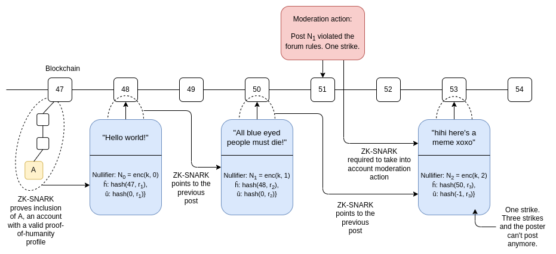

_A proposed design for a ZK social media system, where moderation actions can happen and users can be penalized, all without needing to know anyone's identity.  

提出了一种用于 ZK 社交媒体系统的设计，其中可以进行审查操作并对用户进行惩罚，而无需知道任何人的身份。_

[Zupass](https://zupass.org/), incubated at [Zuzalu](https://www.palladiummag.com/2023/10/06/why-i-built-zuzalu) earlier this year, is an excellent example of this in practice.  

今年早些时候在 Zuzalu 孵化的 Zupass 是这一实践的绝佳例子。  

This is an application, which has already been used by hundreds of people at Zuzalu and more recently by thousands of people for ticketing at [Devconnect](https://devconnect.org/), that allows you to hold tickets, memberships, ([non-transferable](https://vitalik.ca/general/2022/01/26/soulbound.html)) digital collectibles, and other attestations, and prove things about them all without compromising your privacy.  

这是一个应用程序，已经被Zuzalu的数百人使用，并最近被Devconnect的数千人用于购票，它允许您持有票证、会员资格、（不可转让的）数字收藏品和其他证明，并在不泄露您的隐私的情况下证明这些事情。  

For example, you can prove that you are a unique registered resident of Zuzalu, or a Devconnect ticket holder, _without revealing anything else about who you are_. These proofs can be shown in-person, via a QR code, or digitally, to log in to applications like [Zupoll](https://zupoll.org/), an anonymized voting system available only to Zuzalu residents.  

例如，您可以证明自己是Zuzalu的独特注册居民，或者是Devconnect的票务持有人，而不透露关于您的其他任何信息。这些证明可以通过二维码在现场展示，或者通过数字方式登录到诸如Zupoll之类的应用程序中，Zupoll是一个仅对Zuzalu居民开放的匿名投票系统。

**These technologies are an excellent example of d/acc principles: they allow users and communities to verify trustworthiness without compromising privacy, and protect their security without relying on centralized choke points that impose their own definitions of who is good and bad.** They improve global accessibility by creating better and fairer ways to protect a user or service's security than common techniques used today, such as discriminating against entire countries that are deemed untrustworthy.  

这些技术是d/acc原则的一个很好的例子：它们允许用户和社区在不损害隐私的情况下验证可信度，并保护他们的安全，而不依赖于强加自己定义的中心化瓶颈来判断谁是好人谁是坏人。它们通过创造比今天常用的技术更好、更公平的方式来保护用户或服务的安全，改善了全球可访问性，而这些常用技术往往会歧视被认为不可信的整个国家。  

These are very powerful primitives that could be necessary if we want to preserve a decentralized vision of information security going into the 21st century.  

这些是非常强大的基本原理，如果我们希望在21世纪保持信息安全的去中心化视野，它们可能是必要的。  

Working on defensive technologies for cyberspace more broadly can make the internet more open, safe and free in very important ways going forward.  

广泛开展网络空间防御技术的工作可以在很重要的方面使互联网更加开放、安全和自由。

### Info-defense  

信息防御

Cyber-defense, as I have described it, is about situations where it's easy for reasonable human beings to all come to consensus on who the attacker is.  

正如我所描述的，网络防御是指在攻击者身份上，合理的人类可以很容易达成共识的情况。  

If someone tries to hack into your wallet, it's easy to agree that the hacker is the bad guy.  

如果有人试图入侵你的钱包，很容易就能达成共识，认定黑客是坏人。  

If someone tries to DoS attack a website, it's easy to agree that they're being malicious, and are not morally the same as a regular user trying to read what's on the site.  

如果有人试图进行拒绝服务攻击，很容易就能达成共识，认定他们是恶意的，道德上与试图阅读网站内容的普通用户不同。  

There are other situations where the lines are more blurry.  

还有其他情况下界限更加模糊。  

It is the tools for improving our defense in these situations that I call "info-defense".  

我称之为“信息防御”的工具就是用来改善我们在这些情况下的防御能力。

Take, for example, fact checking (aka, preventing "misinformation"). I am a [huge fan of Community Notes](https://vitalik.ca/general/2023/08/16/communitynotes.html), which has done a lot to help users identify truths and falsehoods in what other users are tweeting.  

以事实核查（又称“防止虚假信息”）为例，我非常喜欢Community Notes，它在帮助用户识别其他用户在推特上发布的真实和虚假信息方面做了很多工作。  

Community Notes uses a new algorithm which surfaces not the notes that are the _most popular_, but rather the notes that are _most approved by users across the political spectrum_.  

Community Notes 使用了一种新的算法，它不仅展示最受欢迎的笔记，而是展示得到跨政治光谱用户最多认可的笔记。

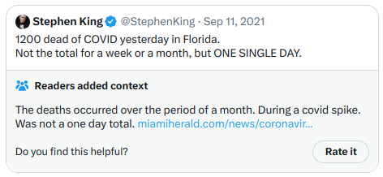

_Community Notes in action.  

Community Notes 的实际运作。_

I am also a fan of prediction markets, which can help identify the significance of events _in real time_, before the dust settles and there is consensus on which direction is which. The [Polymarket on Sam Altman](https://polymarket.com/event/sam-back-as-ceo-of-openai) is very helpful in giving a useful summary of the ultimate consequences of hour-by-hour revelations and negotiations, giving much-needed context to people who only see the individual news items and don't understand the significance of each one.  

我也是预测市场的粉丝，它可以帮助在尘埃落定之前实时确定事件的重要性，以及对于每个事件的重要性达成共识。Sam Altman 的 Polymarket 在逐小时的揭示和谈判中提供了有用的综述，为那些只看到个别新闻项目并不理解每个项目重要性的人提供了必要的背景。

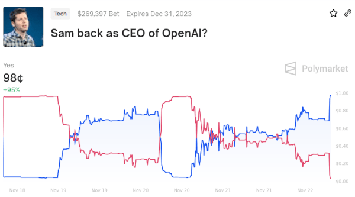

Prediction markets are often flawed.  

预测市场经常存在缺陷。  

But Twitter influencers who are willing to confidently express what they think "will" happen over the next year are often even more flawed.  

但是，那些愿意自信地表达他们对未来一年内可能发生的事情的 Twitter 影响者往往更加有缺陷。  

There is still room to improve prediction markets much further.  

预测市场仍有很大的改进空间。  

For example, a major practical flaw of prediction markets is their low volume on all but the most high-profile events; a natural direction to try to solve this would be to have prediction markets that are played by AIs.  

例如，预测市场的一个主要实际缺陷是除了最高知名度的事件外，交易量很低；解决这个问题的一个自然方向是让人工智能参与预测市场的交易。

Within the blockchain space, there is a particular type of info defense that I think we need much more of.  

在区块链领域中，我认为我们需要更多一种特定类型的信息防御。  

Namely, wallets should be much more opinionated and active in helping users determine the meaning of things that they are signing, and protecting them from fraud and scams. This is an intermediate case: what is and is not a scam is less subjective than perspectives on controversial social events, but it's more subjective than telling apart legitimate users from DoS attackers or hackers.  

也就是说，钱包应该更加有主见和积极地帮助用户确定他们正在签署的事物的含义，并保护他们免受欺诈和骗局的侵害。这是一个中间情况：什么是骗局和什么不是骗局的判断比对有争议的社会事件的观点更客观，但比区分合法用户和 DoS 攻击者或黑客的情况更主观。  

Metamask has an scam database already, and automatically blocks users from visiting scam sites:  

Metamask 已经有一个骗局数据库，并自动阻止用户访问骗局网站：

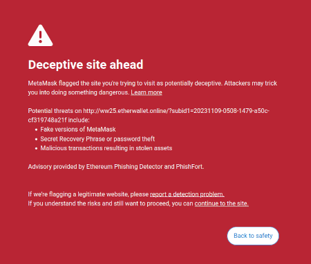

Applications like [Fire](https://www.joinfire.xyz/) are an example of one way to go much further.  

像 Fire 这样的应用是更进一步的一个例子。  

However, security software like this should not be something that requires explicit installs; it should be part of crypto wallets, or even browsers, by default.  

然而，像这样的安全软件不应该需要显式安装；它应该成为加密钱包甚至浏览器的默认功能。

Because of its more subjective nature, info-defense is inherently more collective than cyber-defense: you need to somehow plug into a large and sophisticated group of people to identify what might be true or false, and what kind of application is a deceptive ponzi.  

由于信息防御的主观性更强，它本质上比网络防御更具集体性：您需要以某种方式与一个庞大而复杂的人群联系起来，以确定什么可能是真实的或虚假的，以及什么样的应用是欺骗性的庞氏骗局。  

There is an opportunity for developers to go much further in developing effective info-defense, and in hardening existing forms of info-defense.  

开发人员有机会在开发有效的信息防御和加固现有的信息防御形式方面取得更大进展。  

Something like Community Notes could be included in browsers, and cover not just social media platforms but also the whole internet.  

类似社区笔记的东西可以包含在浏览器中，不仅覆盖社交媒体平台，还覆盖整个互联网。

To some degree, I can be justifiably accused of shoehorning by describing some of these info technologies as being about "defense".  

在某种程度上，我可以被指责为强行将一些信息技术描述为“防御”。毕竟，防御是帮助善意行为者免受恶意行为者（或在某些情况下，免受自然）侵害的手段。  

After all, defense is about helping well-meaning actors be protected from badly-intentioned actors (or, in some cases, from nature).  

然而，其中一些社交技术是帮助善意行为者形成共识的。  

Some of these social technologies, however, are about _helping well-intentioned actors form consensus_.  

一个很好的例子是pol.is，它使用类似于社区笔记的算法（早于社区笔记）来帮助社区在在很多问题上存在分歧的子部落之间找到一致点。Viewpoints.xyz受到pol.is的启发，具有类似的精神：

A good example of this is [pol.is](https://pol.is/home), which uses an algorithm similar to Community Notes (and which predates Community Notes) to help communities identify points of agreement between sub-tribes who otherwise disagree on a lot. [Viewpoints.xyz](https://viewpoints.xyz/) was inspired by pol.is, and has a similar spirit:  

这样的技术可以用于实现对有争议决策的更分散的治理。

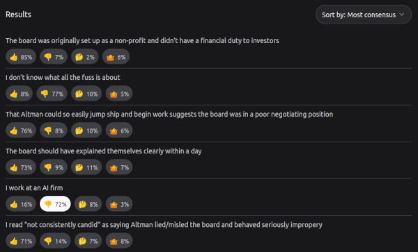

Technologies like this could be used to enable more decentralized governance over contentious decisions.  

Again, blockchain communities are a good testing ground for this, and one where such algorithms have already shown valuable.  

再次，区块链社区是一个很好的测试场，这里已经展示了这种算法的价值。  

Generally, decisions over which improvements ("[EIPs](https://eips.ethereum.org/)") to make to the Ethereum protocol are made by a fairly small group in meetings called "[All Core Devs calls](https://github.com/ethereum/pm)".  

通常情况下，对以太坊协议的改进（"EIPs"）的决策是由一个相当小的团体在称为"全核心开发者会议"的会议上做出的。  

For highly technical decisions, where most community members have no strong feelings, this works reasonably well.  

对于大多数社区成员没有强烈感受的高度技术性的决策，这种方式运作得相当不错。  

For more consequential decisions, which affect protocol economics, or more fundamental values like immutability and censorship resistance, this is often not enough.  

对于更重要的决策，这些决策会影响协议经济，或者更基本的价值观，比如不可变性和抗审查性，这通常是不够的。  

Back in 2016-17, when a series of contentious decisions around implementing the [DAO fork](https://en.wikipedia.org/wiki/The_DAO), reducing issuance and (not) [unfreezing the Parity wallet](https://www.cnbc.com/2017/11/08/accidental-bug-may-have-frozen-280-worth-of-ether-on-parity-wallet.html), tools like Carbonvote, as well as social media voting, helped the community and the developers to see which way the bulk of the community opinion was facing.  

回到2016-17年，当围绕实施DAO分叉、减少发行量以及（不）解冻Parity钱包等一系列有争议的决策时，像Carbonvote这样的工具，以及社交媒体投票，帮助社区和开发者了解大多数社区意见的方向。

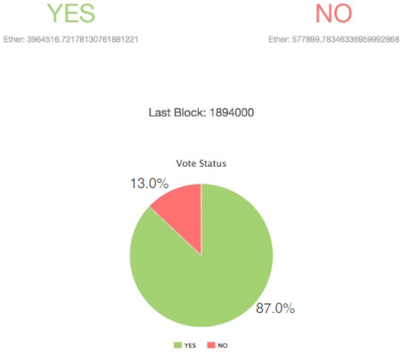

_Carbonvote on the DAO fork.  

关于DAO分叉的Carbonvote。_

Carbonvote [had its flaws](https://vitalik.ca/general/2017/12/17/voting.html): it relied on ETH holdings to determine who was a member of the Ethereum community, making the outcome dominated by a few wealthy ETH holders ("whales").  

Carbonvote也有其缺点：它依赖于ETH持有量来确定谁是以太坊社区的成员，使结果被少数富有的ETH持有者（"鲸鱼"）所主导。  

With modern tools, however, we could make a much better Carbonvote, leveraging multiple signals such as [POAPs](https://poap.xyz/), Zupass stamps, [Gitcoin passports](https://passport.gitcoin.co/), [Protocol Guild memberships](https://protocol-guild.readthedocs.io/en/latest/), as well as ETH (or even solo-staked-ETH) holdings to gauge community membership.  

然而，借助现代工具，我们可以制作一个更好的Carbonvote，利用多个信号，如POAPs、Zupass邮票、Gitcoin护照、Protocol Guild会员资格，以及ETH（甚至是独立质押的ETH）持有量来衡量社区成员资格。

Tools like this could be used by any community to make higher-quality decisions, find points of commonality, coordinate (physical or digital) migrations or do a number of other things without relying on opaque centralized leadership.  

这样的工具可以被任何社区用来做出更高质量的决策，找到共同点，协调（物理或数字）迁移，或者在不依赖不透明的中央领导的情况下做许多其他事情。  

This is not defense acceleration per se, but it can certainly be called democracy acceleration.  

这并不是防御加速本身，但可以称之为民主加速。  

Such tools could even be used to improve and democratize the governance of key actors and institutions working in AI.  

这样的工具甚至可以用来改进和民主化从事人工智能的关键行为者和机构的治理。

## So what are the paths forward for superintelligence?  

那么，超级智能的前进路径是什么？

The above is all well and good, and could make the world a much more harmonious, safer and freer place for the next century.  

上述内容都很好，可以使世界在下一个世纪变得更加和谐、安全和自由。  

However, it does not yet address the big elephant in the room: superintelligent AI.  

然而，它还没有解决房间里的大象问题：超级智能人工智能。

The default path forward suggested by many of those who worry about AI essentially leads to a **minimal AI world government**. Near-term versions of this include a proposal for a ["multinational AGI consortium"](https://www.conjecture.dev/research/multinational-agi-consortium-magic-a-proposal-for-international-coordination-on-ai) ("MAGIC").  

许多担心人工智能的人提出的默认前进路径基本上导致了一个最小化的人工智能世界政府。其中近期版本包括提议成立一个“跨国人工智能联盟”（“MAGIC”）。  

Such a consortium, if it gets established and succeeds at its goals of creating superintelligent AI, would have a natural path to becoming a de-facto minimal world government.  

如果这样一个联盟成立并成功实现其创建超级智能人工智能的目标，它将自然而然地成为事实上的最小世界政府。  

Longer-term, there are ideas like the ["pivotal act"](https://arbital.com/p/pivotal/) theory: we create an AI that performs a _single one-time act_ which rearranges the world into a game where from that point forward humans are still in charge, but where the game board is somehow more defense-favoring and more fit for human flourishing.  

从长远来看，有一种叫做“关键行动”理论的想法：我们创建一个人工智能，执行一次性的行动，将世界重新组织成一个游戏，在这个游戏中，人类仍然掌控，但游戏板具有更有利于防御和促进人类繁荣的特点。

The main practical issue that I see with this so far is that _people don't seem to actually trust any specific governance mechanism with the power to build such a thing_.  

我目前看到的主要实际问题是，人们似乎并不真正相信任何特定的治理机制具有建造这样一个东西的能力。  

This fact becomes stark when you look at the results to my recent Twitter polls, asking if people would prefer to see AI monopolized by a single entity with a decade head-start, or AI delayed by a decade for everyone:  

当你看到我最近在 Twitter 上进行的调查的结果时，这个事实变得明显起来，我问人们是否更愿意看到人工智能被一个领先十年的单一实体垄断，还是让所有人的人工智能推迟十年：

  

The size of each poll is small, but the polls make up for it in the uniformity of their result across a wide diversity of sources and options. **In nine out of nine cases, the majority of people would rather see highly advanced AI delayed by a decade outright than be monopolized by a single group, whether it's a corporation, government or multinational body**. In seven out of nine cases, delay won by at least two to one.  

每次投票的规模虽小，但是这些投票在各种来源和选项中的结果的一致性上弥补了这一点。在九次投票中，无论是公司、政府还是跨国机构，大多数人宁愿看到高度先进的人工智能被推迟十年，也不愿被单一团体垄断。在九次投票中，有七次至少以两比一的比例选择推迟。  

This seems like an important fact to understand for anyone pursuing AI regulation.  

对于追求人工智能监管的人来说，这似乎是一个重要的事实。  

Current approaches have been focusing on creating licensing schemes and regulatory requirements, trying to restrict AI development to a smaller number of people, but these have seen popular pushback precisely because people don't want to see anyone monopolize something so powerful.  

目前的方法主要集中在创建许可方案和监管要求上，试图将人工智能的发展限制在较少的人手中，但是由于人们不希望看到任何人垄断如此强大的东西，这些方法遭到了普遍的反对。  

Even if such top-down regulatory proposals reduce risks of extinction, they risk increasing the chance of some kind of permanent lock-in to centralized totalitarianism.  

即使这种自上而下的监管提案减少了灭绝的风险，它们也增加了中央集权主义永久锁定的可能性。  

Paradoxically, could agreements banning extremely advanced AI research _outright_ (perhaps with exceptions for biomedical AI), combined with measures like _mandating_ open source for those models that are not banned as a way of reducing profit motives while further improving equality of access, be _more_ popular?  

矛盾的是，禁止极其先进的人工智能研究的协议（也许对生物医学人工智能有例外），再加上强制开源那些没有被禁止的模型，以减少利润动机并进一步提高平等的获取机会，这样做会更受欢迎吗？

The main approach preferred by opponents of the "let's get one global org to do AI and make its governance really really good" route is **[polytheistic AI](https://twitter.com/balajis/status/1725595769003221092): intentionally try to make sure there's lots of people and companies developing lots of AIs, so that none of them grows far more powerful than the other**. This way, the theory goes, even as AIs become superintelligent, we can retain a balance of power.  

对于“让一个全球组织来进行人工智能研究，并使其治理非常好”的反对者来说，他们更倾向于多神论人工智能：有意确保有很多人和公司开发各种各样的人工智能，以便没有一个人工智能比其他人更强大。这样，理论上讲，即使人工智能变得超级智能，我们仍然可以保持权力的平衡。

This philosophy is interesting, but my experience trying to ensure "polytheism" within the Ethereum ecosystem does make me worry that this is an inherently unstable equilibrium.  

这种理念很有趣，但我在尝试确保以太坊生态系统内的“多神论”时的经验使我担心这是一个本质上不稳定的平衡。  

In Ethereum, we have intentionally tried to ensure decentralization of many parts of the stack: ensuring that there's no single codebase that controls [more than half of the proof of stake network](https://clientdiversity.org/), trying to counteract the [dominance of large staking pools](https://fortune.com/2022/06/11/lido-largest-ether-staking-service-has-centralization-problem-raising-red-flags/), improving [geographic decentralization](https://ethernodes.org/), and so on.  

在以太坊中，我们有意试图确保堆栈的许多部分的去中心化：确保没有一个单一的代码库控制超过一半的权益证明网络，试图抵消大型权益池的主导地位，改善地理分散化等等。  

Essentially, Ethereum is actually attempting to execute on the old libertarian dream of a market-based society that uses social pressure, rather than government, as the antitrust regulator.  

实际上，以太坊正试图实现一个基于市场的社会，以社会压力而非政府作为反垄断监管机构，这实际上是古老的自由主义梦想。  

To some extent, this has worked: the [Prysm client's dominance](https://cryptoslate.com/ethereums-client-diversity-with-66-running-prysm-is-the-merge-safe-to-pursue/) has dropped from above 70% to under 45%.  

在某种程度上，这种尝试是成功的：Prysm 客户端的主导地位已经从70%以上下降到45%以下。  

But this is not some automatic market process: it's the result of human intention and coordinated action.  

但这并不是自动的市场过程：它是人类意愿和协调行动的结果。

My experience within Ethereum is mirrored by learnings from the broader world as a whole, where many markets have proven to be [natural monopolies](https://en.wikipedia.org/wiki/Natural_monopoly). With superintelligent AIs acting independently of humans, the situation is even more unstable.  

我在以太坊中的经验与整个世界的学习相呼应，许多市场已被证明是自然垄断。当超级智能人工智能独立于人类行动时，情况变得更加不稳定。  

Thanks to [recursive self-improvement](https://www.lesswrong.com/tag/recursive-self-improvement), the strongest AI may pull ahead very quickly, and once AIs are more powerful than humans, there is no force that can push things back into balance.  

由于递归自我改进，最强大的人工智能可能会迅速取得领先地位，一旦人工智能比人类更强大，就没有任何力量可以将事物重新平衡。

Additionally, even if we _do_ get a polytheistic world of superintelligent AIs that ends up stable, we still have the _other_ problem: that we get a universe where humans are pets.  

此外，即使我们确实获得了一个稳定的超级智能人工智能的多神论世界，我们仍然面临另一个问题：我们将进入一个人类成为宠物的宇宙。

### A happy path: merge with the AIs?  

一个幸福的路径：与人工智能合并？

A different option that I have heard about more recently is to **focus less on AI as something separate from humans, and more on tools that _enhance_ human cognition rather than _replacing_ it**.  

我最近听说的另一个选择是将人工智能与人类分开看待，更多地关注增强人类认知的工具，而不是取代它。

One near-term example of something that goes in this direction is AI drawing tools.  

一个近期的例子是AI绘图工具。  

Today, the most prominent tools for making AI-generated images only have one step at which the human gives their input, and AI fully takes over from there.  

如今，制作AI生成图像的最主要工具只有一个步骤需要人类提供输入，然后AI完全接管。  

An alternative would be to focus more on AI versions of Photoshop: tools where the artist or the AI might make an early draft of a picture, and then the two collaborate on improving it with a process of real-time feedback.  

另一种选择是更加关注AI版的Photoshop：艺术家或AI可以制作一幅图片的初稿，然后两者通过实时反馈的过程共同改进。

_Photoshop generative AI fill, 2023. [Source](https://www.elegantthemes.com/blog/design/photoshop-ai). I tried, it and it takes time to get used to but it actually works quite well!  

Photoshop生成式AI填充，2023年。来源。我试过了，需要一些时间来适应，但效果相当不错！_

Another direction in a similar spirit is the [Open Agency Architecture](https://www.lesswrong.com/posts/5hApNw5f7uG8RXxGS/the-open-agency-model), which proposes splitting the different parts of an AI "mind" (eg.  

另一个类似的方向是开放代理架构，它提议将AI "思维" 的不同部分（例如制定计划、执行计划、解释外界信息）分成独立的组件，并在这些部分之间引入多样化的人类反馈。  

making plans, executing on plans, interpreting information from the outside world) into separate components, and introducing diverse human feedback in between these parts.  

到目前为止，这听起来很平凡，几乎每个人都会认同这是一个好的方向。

So far, this sounds mundane, and something that almost everyone can agree that it would be good to have.  

The economist Daron Acemoglu's work is far from this kind of AI futurism, but his new book [Power and Progress](https://www.amazon.com/Power-Progress-Thousand-Year-Technology-Prosperity/dp/1541702530) hints at wanting to see more of exactly these types of AI.  

经济学家达伦·阿塞莫格鲁的工作与这种人工智能未来主义相去甚远，但他的新书《权力与进步》暗示着希望看到更多这类人工智能。

**But if we want to extrapolate this idea of human-AI cooperation further, we get to more radical conclusions**.  

但是，如果我们想进一步推论人工智能与人类合作的理念，我们会得出更激进的结论。  

Unless we create a world government powerful enough to detect and stop every small group of people hacking on individual GPUs with laptops, someone is going to create a superintelligent AI eventually - one that can think a [thousand times faster](https://www.lesswrong.com/posts/Ccsx339LE9Jhoii9K/slow-motion-videos-as-ai-risk-intuition-pumps) than we can - and no combination of humans using tools with their hands is going to be able to hold its own against that.  

除非我们建立起一个强大到足以发现和阻止每一个使用笔记本电脑上的个人GPU进行黑客攻击的小团体的世界政府，否则总有人最终会创造出一个超级智能的人工智能——它的思考速度比我们快上千倍——而任何人类使用手中工具的组合都无法与之抗衡。  

And so we need to take this idea of human-computer cooperation much deeper and further.  

因此，我们需要更深入、更广泛地思考人机合作的理念。

**A first natural step is [brain-computer interfaces](https://en.wikipedia.org/wiki/Brain%E2%80%93computer_interface)**.  

第一个自然的步骤是脑机接口。  

Brain-computer interfaces can give humans much more direct access to more-and-more powerful forms of computation and cognition, reducing the two-way communication loop between man and machine from seconds to milliseconds.  

脑机接口可以让人类更直接地接触到越来越强大的计算和认知形式，将人与机器之间的双向通信循环从几秒钟缩短到几毫秒。

This would also greatly reduce the "mental effort" cost to getting a computer to help you gather facts, give suggestions or execute on a plan.

  

这也将大大降低让计算机帮助您收集事实、提供建议或执行计划的"精神努力"成本。

Later stages of such a roadmap admittedly get weird.  

这个路线图的后期阶段确实变得奇怪起来。  

In addition to brain-computer interfaces, there are various paths to improving our brains directly through innovations in biology.  

除了脑机接口之外，通过生物学创新直接改善我们的大脑还有其他途径。  

An eventual further step, which merges both paths, may involve [uploading our minds](https://en.wikipedia.org/wiki/Mind_uploading) to run on computers directly.  

最终的进一步步骤可能是将我们的思维上传到计算机上直接运行。  

This would also be the ultimate d/acc for physical security: protecting ourselves from harm would no longer be a challenging problem of protecting inevitably-squishy human bodies, but rather a much simpler problem of making data backups.  

这也将成为物理安全的终极解决方案：保护自己免受伤害将不再是一个保护易碎人体的复杂问题，而是一个更简单的问题，即进行数据备份。

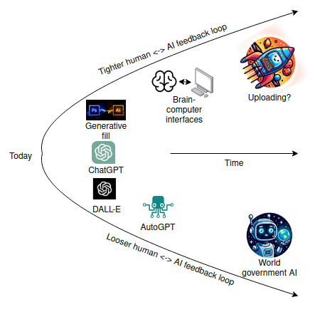

Directions like this are sometimes met with worry, in part because they are irreversible, and in part because they may give powerful people more advantages over the rest of us.  

这样的发展方向有时会引起担忧，部分原因是它们是不可逆的，部分原因是它们可能使强大的人比其他人更具优势。  

Brain-computer interfaces in particular have dangers - after all, we are talking about _literally reading and writing to people's minds_.  

特别是脑机接口存在危险 - 毕竟，我们谈论的是直接读取和写入人们的思维。  

These concerns are exactly why I think it would be ideal for a leading role in this path to be held by a security-focused open-source movement, rather than closed and proprietary corporations and venture capital funds.  

正是出于这些担忧，我认为在这一领域中，最好由一个以安全为重点的开源运动来发挥主导作用，而不是由封闭的专有公司和风险投资基金。  

Additionally, all of these issues are _worse_ with superintelligent AIs that operate independently from humans, than they are with augmentations that are closely tied to humans.  

此外，所有这些问题在与人类紧密联系的增强技术中比与独立于人类运行的超级智能人工智能更加严重。  

The divide between "enhanced" and "unenhanced" already exists today due to [limitations in who can and can't use ChatGPT](https://www.digitaltrends.com/computing/these-countries-chatgpt-banned/).  

“增强”和“未增强”之间的分歧已经存在，这是由于使用 ChatGPT 的人员限制所导致的。

**If we want a future that is both superintelligent _and_ "human", one where human beings are not just pets, but actually retain meaningful agency over the world, then it feels like something like this is the most natural option**.  

如果我们希望未来既具有超级智能又“人性化”，一个让人类不仅仅是宠物，而是真正保持对世界有意义的主动性的未来，那么这似乎是最自然的选择。  

There are also good arguments why this could be a safer AI alignment path: by involving human feedback at each step of decision-making, we reduce the incentive to offload high-level planning responsibility to the AI itself, and thereby reduce the chance that the AI does something totally unaligned with humanity's values on its own.  

还有一些很好的论点支持这种更安全的人工智能对齐路径：通过在决策的每一步中涉及人类反馈，我们减少了将高级规划责任转嫁给人工智能本身的动机，从而降低了人工智能自行采取与人类价值观完全不一致的行动的机会。

One other argument in favor of this direction is that it may be more _socially_ palatable than simply shouting "[pause AI](https://twitter.com/PauseAI)" without a complementary message providing an alternative path forward.  

支持这种方向的另一个论点是，与其仅仅大声呼喊“暂停人工智能”，而不提供一个提供替代前进路径的补充信息，这种方式可能更容易被社会接受。  

It will require a philosophical shift from the current mentality that tech advancements that touch humans are dangerous but advancements that are separate from humans are by-default safe.  

这将需要一种哲学上的转变，即当前的心态是触及人类的技术进步是危险的，而与人类无关的进步默认是安全的。  

But it has a huge countervailing benefit: _it gives developers something to do_. Today, the AI safety movement's primary message to AI developers seems to be "[you should just stop](https://twitter.com/So8res/status/1715380167911067878)". One can [work on alignment research](https://forum.effectivealtruism.org/posts/7WXPkpqKGKewAymJf/how-to-pursue-a-career-in-technical-ai-alignment), but today this lacks economic incentives.  

但它有一个巨大的对抗性好处：它给开发者提供了事情可做。如今，AI安全运动对AI开发者的主要信息似乎是“你应该停下来”。人们可以从事对齐研究，但如今这缺乏经济激励。  

Compared to this, the common e/acc message of "you're already a hero just the way you are" is understandably extremely appealing.  

与此相比，“你就是一个英雄，就是你自己”的普遍信息显然非常吸引人。  

A d/acc message, one that says "you should build, and build profitable things, but be much more selective and intentional in making sure you are building things that help you and humanity thrive", may be a winner.  

一种直接的信息是：“你应该构建，并构建有利可图的事物，但在确保你构建的事物有助于你和人类繁荣方面要更加选择和有意识。”这可能是一个胜利者。

## Is d/acc compatible with your existing philosophy?  

d/acc与您现有的理念相符吗？

-   If you are an **e/acc**, then d/acc is a subspecies of e/acc - just one that is much more selective and intentional.  
    
    如果您是一个e/acc，那么d/acc就是e/acc的一个亚种，只是更加选择和有意识。
-   If you are an [**effective altruist**](https://www.effectivealtruism.org/), then d/acc is a re-branding of the effective-altruist idea of [differential technology development](https://papers.ssrn.com/sol3/papers.cfm?abstract_id=4213670), though with a greater emphasis on liberal and democratic values.  
    
    如果您是一个有效利他主义者，那么d/acc就是有效利他主义的差异技术发展的重新定位，尽管更加强调自由和民主价值观。
-   If you are a **libertarian**, then d/acc is a sub-species of techno-libertarianism, though a more pragmatic one that is more critical of "the techno-capital machine", and willing to accept government interventions today (at least, if cultural interventions don't work) to prevent much worse un-freedom tomorrow.  
    
    如果你是一个古典自由主义者，那么 d/acc 是技术古典自由主义的一个亚种，尽管更加务实，更加批判“技术资本机器”，并且愿意接受政府的干预（至少在文化干预无效时），以防止更糟糕的非自由状态出现。
-   If you are a **Pluralist**, in the [Glen Weyl sense of the term](https://www.plurality.net/v/eng/), then d/acc is a frame that can easily include the emphasis on better democratic coordination technology that Plurality values.  
    
    如果你是一个多元主义者，按照格伦·韦尔的定义，那么 d/acc 是一个框架，可以很容易地包含多元主义所重视的更好的民主协调技术。
-   If you are a **public health advocate**, then d/acc ideas can be a source of a broader long-term vision, and opportunity to find common ground with "tech people" that you might otherwise feel at odds with.  
    
    如果你是一个公共卫生倡导者，那么 d/acc 的理念可以成为一个更广泛的长期愿景的来源，并且可以为你与“科技人员”找到共同点提供机会，而你可能在其他方面与他们意见不合。
-   If you are a **blockchain advocate**, then d/acc is a more modern and broader narrative to embrace than the fifteen-year-old emphasis on hyperinflation and banks, which puts blockchains into context as one of many tools in a concrete strategy to build toward a brighter future.  
    
    如果你是一个区块链倡导者，那么 d/acc 是一个更现代、更广泛的叙述，比起过去十五年强调的恶性通货膨胀和银行，它将区块链放入一个具体战略的众多工具之一，以建设更美好的未来。
-   If you are a **[solarpunk](https://builtin.com/greentech/solarpunk)**, then d/acc is a subspecies of solarpunk, and incorporates a similar emphasis on intentionality and collective action.  
    
    如果你是一个太阳能朋克（solarpunk），那么 d/acc 是太阳能朋克的一个亚种，并且融入了类似的强调意图和集体行动的元素。
-   If you are a **[lunarpunk](https://www.coindesk.com/layer2/2022/09/20/what-are-solarpunk-and-lunarpunk-anyway/)**, then you will appreciate the d/acc emphasis on informational defense, through maintaining privacy and freedom.  
    
    如果你是一个月球朋克，那么你会欣赏对信息防御的强调，通过保护隐私和自由来维护。

## We are the brightest star  

我们是最明亮的星星

I love technology because technology expands human potential.  

我喜欢技术，因为技术扩展了人类的潜力。  

Ten thousand years ago, we could build some hand tools, change which plants grow on a small patch of land, and [build basic houses](https://www.newscientist.com/article/2392894-earliest-evidence-of-buildings-made-from-wood-is-476000-years-old/). Today, we can build [800-meter-tall towers](https://en.wikipedia.org/wiki/Burj_Khalifa), store the entirety of recorded human knowledge in a device we can hold in our hands, communicate instantly across the globe, double our lifespan, and live happy and fulfilling lives without fear of our best friends regularly dropping dead of disease.  

一万年前，我们可以制造一些手工工具，改变一小块土地上的植物生长，建造基本的房屋。如今，我们可以建造高达800米的塔楼，将整个人类记录的知识存储在我们手中的设备中，即时在全球范围内进行交流，延长我们的寿命，过上幸福充实的生活，不再担心我们最好的朋友经常因疾病而去世。

_We started from the bottom, now we're here.  

我们从底层开始，现在我们已经到了这里。_

I believe that these things are deeply good, and that expanding humanity's reach even further to the planets and stars is deeply good, because **I believe humanity is deeply good**. It is fashionable in some circles to be skeptical of this: the [voluntary human extinction movement](https://en.wikipedia.org/wiki/Voluntary_Human_Extinction_Movement) argues that the Earth would be better off without humans existing at all, and many more want to see [much smaller number of human beings](https://www.scientificamerican.com/article/population-decline-will-change-the-world-for-the-better/) see the light of this world in the centuries to come. It is common to [argue](https://www.vox.com/science-and-health/2017/12/14/16687388/cruelty-border-immigration-psychology-human-nature) that [humans are bad](https://www.advisory.com/daily-briefing/2018/10/31/people-are-terrible) because we cheat and steal, engage in colonialism and war, and mistreat and annihilate other species.  

我相信这些事物是深层次的善良，而进一步拓展人类的触角至行星和星辰则是深层次的善良，因为我相信人类是深层次的善良。在某些圈子里，对此持怀疑态度是时尚的：自愿人类灭绝运动认为地球如果没有人类存在会更好，还有更多人希望在未来几个世纪中看到更少的人类降临到这个世界。常常有人争论人类是坏的，因为我们欺骗和偷窃，从事殖民主义和战争，虐待和灭绝其他物种。  

My reply to this style of thinking is one simple question: **compared to what?**  

对于这种思维方式，我的回答只有一个简单的问题：与什么相比？

Yes, human beings are often mean, but we much more often show kindness and mercy, and work together for our common benefit.  

是的，人类经常表现得很刻薄，但我们更经常展现善良和仁慈，并共同为了我们的共同利益而努力。  

Even during wars we often take care to protect civilians - certainly not nearly enough, but also far more than [we did 2000 years ago](https://bmcr.brynmawr.edu/2022/2022.01.23/). The next century may well bring widely available non-animal-based meat, eliminating the [largest moral catastrophe](https://www.openphilanthropy.org/focus/farm-animal-welfare/) that human beings can justly be blamed for today. Non-human animals are not like this.  

即使在战争期间，我们经常努力保护平民——当然远远不够，但也比2000年前做得多。下个世纪可能会普遍提供非动物基础的肉类，消除了人类今天可以被公正指责的最大道德灾难。非人类动物不会像人类这样。  

There is no situation where a cat will adopt an entire lifestyle of refusing to eat mice as a matter of ethical principle.  

没有任何情况下猫会因为道德原则而完全拒绝吃老鼠，从而采取一种拒绝吃老鼠的生活方式。  

The Sun is growing brighter every year, and in about [one billion years](https://theconversation.com/will-the-earth-last-forever-203021), it is expected that this will make the Earth too hot to sustain life. Does the Sun even _think_ about the genocide that it is going to cause?  

太阳每年都在变得更加明亮，预计在大约十亿年后，这将使地球变得过热，无法维持生命。太阳是否考虑到它即将引起的灭绝事件呢？

And so it is my firm belief that, out of all the things that we have known and seen in our universe, **we, humans, are the brightest star**.  

因此，我坚信，在我们所知道和见过的宇宙中，我们人类是最明亮的星星。  

We are the one thing that we know about that, even if imperfectly, sometimes make an earnest effort to care about "the good", and adjust our behavior to better serve it.  

我们是唯一一件我们所知道的事物，即使不完美，有时也会竭尽努力关心"善良"，并调整我们的行为以更好地服务它。  

Two billion years from now, if the Earth or any part of the universe still bears the beauty of Earthly life, it will be human artifices like space travel and [geoengineering](https://nap.nationalacademies.org/catalog/25762/reflecting-sunlight-recommendations-for-solar-geoengineering-research-and-research-governance) that will have made it happen.  

两十亿年后，如果地球或宇宙的任何部分仍然拥有地球生命的美丽，那将是人类的艺术手段，如太空旅行和地球工程，使之成为可能。

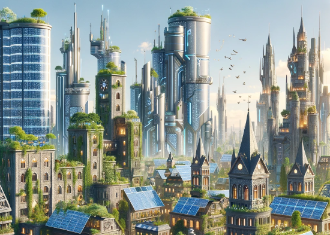

We need to build, and accelerate.  

我们需要建设和加速。  

But there is a very real question that needs to be asked: what is the thing that we are accelerating towards?  

但有一个非常现实的问题需要问：我们正在加速追求的是什么？  

The 21st century may well be [_the_ pivotal century](https://www.cold-takes.com/most-important-century/) for humanity, the century in which our fate for millennia to come gets decided.  

21世纪很可能是人类的关键世纪，决定了未来几千年的命运。  

Do we fall into one of a number of traps from which we cannot escape, or do we find a way toward a future where we retain our freedom and agency?  

我们是否会陷入一系列无法逃脱的陷阱中，还是能够找到一条通向保留自由和主动性的未来之路？  

These are challenging problems. But I look forward to watching and participating in our species' grand collective effort to find the answers.  

这些都是具有挑战性的问题。但我期待着观察并参与我们人类群体为找到答案所做的伟大努力。
