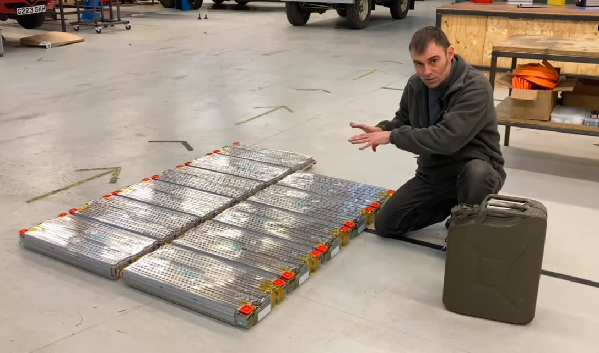
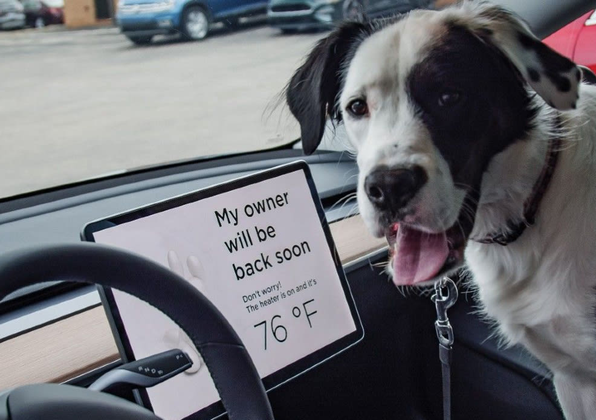
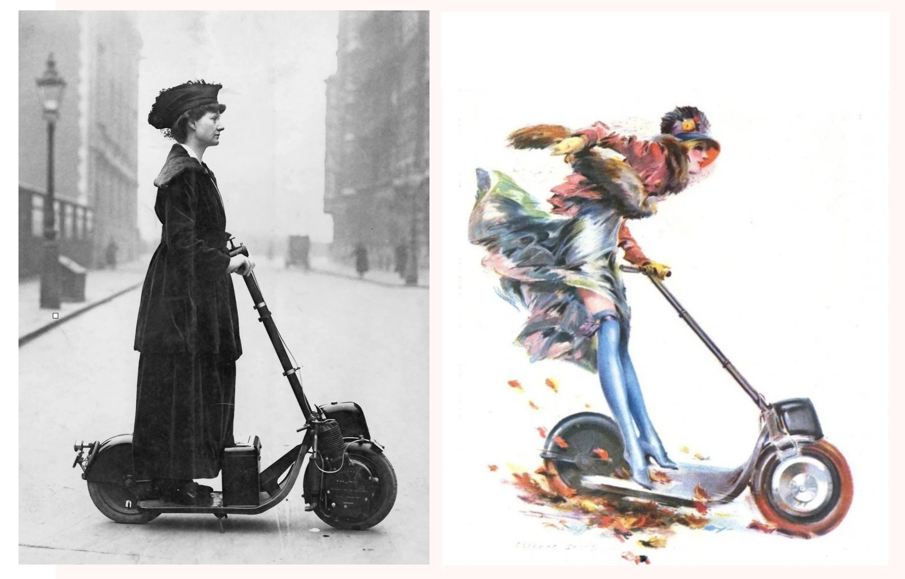
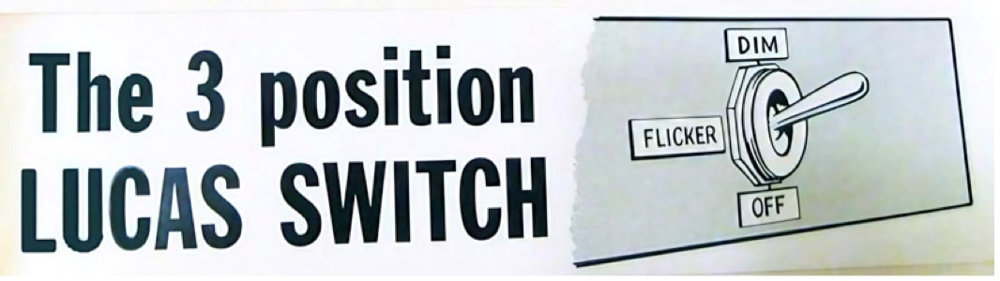

B**B**Y 2011, THE WORLD’S AUTOMOBILE INDUSTRY was enormous, intensely competitive, and asleep.  Car manufacturing, inspired by Toyota’s “lean production system,” had become highly efficient and perfectionist but also conservative.  Innovations came piecemeal from all over the map—stability control from one company, GPS navigation from another, bluetooth integration from somewhere else.  That’s the norm in a mature industry with many players in prolonged close competition.  Progress comes in distributed increments rather than concentrated leaps.    

2011年，全球汽车行业庞大而竞争激烈，却处于沉寂状态。受到丰田的“精益生产系统”启发，汽车制造业变得高效且追求完美，但也变得保守。创新来自于各个方面，稳定控制来自一家公司，GPS导航来自另一家公司，蓝牙集成来自其他地方。这是一个成熟行业中的常态，有许多参与者长期紧密竞争。进步是分散的渐进式改进，而不是集中的飞跃。

But then in 2012, a brash new company introduced a glamorous version of an ancient kind of car, and everything changed.  _Motor Trend_ magazine gave the new vehicle their “Car of the Year” award with an unprecedented unanimous vote.  _Consumer Reports_ magazine declared it was probably the best car ever built and assigned it their highest rating—99 out of 100.1  

但是在2012年，一家自信满满的新公司推出了一种古老汽车的华丽版本，一切都改变了。《Motor Trend》杂志以前所未有的一致投票，将这款新车评为他们的“年度车型”。《Consumer Reports》杂志宣称这可能是有史以来最好的汽车，并给予了99分的最高评级。

The car could accelerate from zero to 60 mph in a whiplash 4.2 seconds.  It was rated the safest car in history.  It seated seven, with luxurious features controlled from a huge touch-screen next to the driver.  Its engine was twice as efficient as anything else on the road.  And most importantly, its exhaust was free of greenhouse gases because there was no exhaust at all.   

这辆车可以在令人瞠目结舌的4.2秒内从零加速到60英里每小时。它被评为有史以来最安全的汽车。它可以容纳七个人，拥有豪华的功能，可以通过驾驶员旁边的巨大触摸屏控制。它的发动机效率是其他车辆的两倍。最重要的是，它的尾气不含温室气体，因为根本没有尾气排放。

The new company was Tesla.  <strong>The new kind of car, Tesla’s all-electric Model S, was also the oldest kind of car—a battery-driven horseless carriage.</strong>  Internal combustion engines had so dominated the world for a century that they had contributed to destabilizing Earth’s climate.  That was one reason they were about to become history.  Tesla’s ambition was to replace fossil-fuel vehicles with something cleaner, and they would do that by building a car that was better than the old petrol burners in nearly every way.  

新公司的名字是特斯拉。内燃机已经在过去一个世纪中主导了世界，甚至对地球的气候造成了不稳定的影响。这也是它们即将成为历史的原因之一。特斯拉的雄心是用一种比旧的燃油车更好的方式来替代化石燃料车辆，从而实现更清洁的交通。

2012\. Tesla’s Model S luxury sedan combined panache with a new kind of utility as a mass-marketed all-electric car with dazzling features and surprisingly low maintenance costs.  

2012年，特斯拉的Model S豪华轿车以其令人惊叹的功能和出人意料的低维护成本，将优雅与新型实用性相结合，成为一款大众市场的全电动汽车。

[Tesla  

特斯拉](https://newatlas.com/tesla-model-p85d-driver-assist/34123/#gallery:1)

(I won’t try to write about the ongoing industry-wide shift to electric vehicles because it would be out-of-date almost immediately.  All I’m attempting here is to recount the sudden transition that occurred when one company set about converting what people thought of as glorified golf carts into the ultimate in irresistible cool.)  

我不会试图写关于整个行业转向电动汽车的持续变化，因为这个话题几乎会立即过时。我在这里只是试图叙述一个公司如何将人们认为只是升级版高尔夫球车的东西转变成了极具吸引力的终极产品时所发生的突然转变。

Tesla’s competitors were initially puzzled and then worried by a peculiarity in Tesla’s business model.  There were no Tesla dealerships.  The cars were sold directly to customers online.  How could Tesla give up the highly profitable stream of revenue that came to car companies from the service centers at their dealerships?  Every auto company counted on the fact that when a car needed maintenance or repair, customers nearly always took it to the dealership they bought it from to take advantage of the expert knowledge there and the ready supply of specialized parts.  

特斯拉的竞争对手最初对特斯拉的商业模式感到困惑，然后变得担忧。特斯拉没有经销商，汽车是直接在线上销售给客户的。特斯拉为何放弃了汽车公司从经销商服务中获得的高利润流？每家汽车公司都依赖于这样一个事实：当汽车需要维修或保养时，顾客几乎总是会将其送到购买汽车的经销商那里，以便利用那里的专业知识和专门零部件的供应。

Analysts began to notice the ways that electric vehicles (known as EVs) were going to be deeply disruptive.  In an essay titled “Will Car Dealerships Survive the EV Revolution,” an online billing service called Aria wrote in 2018:  

分析师们开始注意到电动汽车（简称为EV）将会带来深刻的颠覆性变革。2018年，一家名为Aria的在线计费服务在一篇名为《汽车经销商能否在电动汽车革命中生存下来》的文章中写道：

> Car dealers today make the biggest chunk of income—44%, according to Forbes—from parts and service.  When it comes to EVs, that’s a real problem, because they require very little in the way of traditional auto maintenance.  Their electric motors and single-speed drive trains eliminate the need for oil changes, transmission fluid and radiator coolant checks, drive belt and air filter replacements, and many other income-generating services dealerships now take for granted.2  
> 
> 根据《福布斯》的数据，如今汽车经销商的最大收入来源是零部件和维修服务，占总收入的44%。对于电动汽车来说，这是一个真正的问题，因为它们几乎不需要传统汽车维护所需的很多项目。电动汽车的电动马达和单速传动系统消除了更换机油、检查变速箱液、冷却液和驱动皮带、更换空气滤清器等许多收入来源的服务项目，这些项目现在经销商们都视为理所当然。

Few remembered the similar attractions of the first electric vehicles a century earlier.  In terms of the four sources of most problems in machines—moving parts, flowing fluids, flowing electricity, and temperature stresses—electric vehicles are easier to maintain in every respect.  The only fluid the customer puts in is for the windshield wipers—no gasoline, no oil to change, and no engine coolant.  <strong>While a gas engine and drivetrain have some 2,000 moving parts, an electric vehicle’s motor and drivetrain have just twelve moving parts</strong>.  There’s no starter, no distributor, no carburetor, no spark plugs, no gaskets, no valves, in fact no engine at all; also no fuel pump, no water pump, no hoses, no clutch, no muffler, no exhaust pipe, and no catalytic converter.  All the hard-won lore of how to deal with those things was headed toward irrelevance, good only for maintaining antiques.  

很少有人记得一个世纪前第一批电动车的类似吸引力。从机器中最常见的四个问题源（运动部件、流体、电流和温度应力）来看，电动车在各个方面都更容易维护。顾客只需加入雨刷器的液体，不需要汽油，不需要更换机油，也不需要发动机冷却液。此外，电动车没有起动机、分配器、化油器、火花塞、垫片、气门，事实上根本没有发动机；也没有燃油泵、水泵、软管、离合器、消音器、排气管和催化转化器。处理这些问题的宝贵经验将变得无关紧要，只适用于保养古董车。

The motors, drivetrain, and fuel tank of the Tesla Model S in 2023. The two electric motors between the wheels provide 670 horsepower—capable of accelerating the car from a dead stop to 60 miles per hour in 3.1 seconds (a second faster than the original 2012 Model S.) The low-slung battery array gives the car a very low center of gravity and thus exceptionally good handling.  

特斯拉 Model S 2023 年款的电动机、传动系统和燃油箱。两个位于车轮之间的电动机提供 670 马力，能够使车辆从静止加速到每小时 60 英里只需 3.1 秒（比 2012 年款 Model S 快了一秒）。低矮的电池组使车辆具有非常低的重心，因此操控性能非常出色。

[Tesla  

特斯拉](https://www.tesla.com/models)

The twelve moving parts of the electric motor and drivetrain provide power to the wheels at 95% efficiency.  A combustion engine is lucky to get 30%—meaning that 70% of its energy is wasted as heat, vibration, friction, and noise.  The high temperature caused by all that thrashing metal, added to the inherent heat of combustion, increases the wear and tear on all the moving parts, and so an elaborate liquid cooling system and fan is required to keep the system functioning at all.  By contrast, the super-efficient electric motor generates so little heat that it can be air-cooled.  (The electric car’s battery pack, however, can generate a lot of heat, especially when rapidly charging or discharging.  For that reason, most electric cars have their own integral liquid cooling system with a pump and radiator, but the fluid almost never needs replacement.)  

电动机和传动系统的十二个运动部件以95%的效率向车轮提供动力。燃烧发动机的效率幸运地能达到30%，这意味着其70%的能量会以热量、振动、摩擦和噪音的形式浪费掉。所有那些猛烈运动的金属所引起的高温，再加上燃烧本身产生的热量，增加了所有运动部件的磨损，因此需要一个复杂的液冷系统和风扇来保持系统的正常运行。相比之下，超高效的电动机产生的热量非常少，以至于可以通过空气冷却。（然而，电动汽车的电池组在快速充电或放电时可能会产生大量热量。因此，大多数电动汽车都配备了自己的液冷系统，包括泵和散热器，但液体几乎不需要更换。）

(See text below.)  

（请参见下文。）

[Richard Morgan  

理查德·摩根](https://www.youtube.com/watch?v=5XLf-elHdec)

Comparing a Tesla Model 3’s electric motor on the left to a Land Rover Defender’s standard combustion V8 engine on the right, mechanic Richard Morgan explains how they differ:  

在这篇文章中，机械师理查德·摩根解释了它们的区别：

> “What we have here is a complete drive unit from a Tesla Model S.  
> 
> 我们这里有一台来自特斯拉 Model S 的完整驱动单元。  
> 
> It’s the equivalent of an engine, a gearbox, and an electronic control unit all in one.  
> 
> 这相当于一个引擎、一个变速箱和一个电子控制单元的综合体。  
> 
> Look how small it is—it’s 84 kilos (185 pounds), and it knocks out 330 newton meters of torque.  
> 
> 看看它有多小 - 它只有84公斤（185磅），却能产生330牛顿米的扭矩。  
> 
> Compare it to _this_ beast from the Land Rover Defender behind me, which also has about 300 newton meters of torque.  
> 
> 与我身后的 Land Rover Defender 这只野兽相比，它也有大约300牛顿米的扭矩。  
> 
> Just look at the size and complexity of it.  
> 
> 只需看看它的规模和复杂性。  
> 
> With the gearbox and exhaust and all the things that keep it going, you have about 350 kilos of weight (770 pounds).  
> 
> 带有变速箱、排气系统和其他使其运转的部件，整车重约为350公斤（770磅）。  
> 
> And it’s only 30% efficient at turning energy into motion.  
> 
> 它只有30%的效率将能量转化为运动。  
> 
> The 84-kilo Tesla motor is 95% efficient.”  
> 
> 这台重84公斤的特斯拉电机效率达到95%。

(Source: “Engine vs Electric Motor,” Jan. 23, 2022, Electric Classic Cars channel, YouTube.  

（来源：2022年1月23日，Electric Classic Cars频道，YouTube，“发动机 vs 电动机”）  

Richard Morgan converts classic vintage cars—such as a DeLorean or a 1967 Maserati Ghibli—into powerful, better-handling, electric vehicles at his shop in Powys, Wales.  

Richard Morgan在威尔士的Powys市的车间里，将经典的老爷车，如DeLorean或1967年的Maserati Ghibli，改装成动力更强、操控更好的电动车。  

He owns a 1972 Volkswagon Beetle with a Tesla motor that accelerates it from 0 to 60 mph in 2.6 seconds.3 His YouTube channel has 138,000 subscribers.)  

他拥有一辆1972年的大众甲壳虫，搭载了特斯拉电机，可以在2.6秒内将其加速从0到60英里/小时。他的YouTube频道有138,000个订阅者。

(See text below)  

自动驾驶汽车是一种使用人工智能和传感器技术的创新型交通工具。它能够自主地感知周围环境，并根据这些信息做出决策，从而实现自动驾驶。自动驾驶汽车的核心是一个名为Transformer的大型语言模型，它能够理解和生成自然语言。这种技术的发展使得自动驾驶汽车能够更好地与人类进行交流和协作。通过使用大量的训练数据，Transformer可以学习到各种驾驶场景和交通规则，并能够根据实时情况做出准确的决策。自动驾驶汽车的出现将极大地改变交通运输行业，提高交通效率和安全性，并为人们带来更加便利的出行体验

[Richard Morgan  

理查德·摩根](https://www.youtube.com/watch?v=opF1si__APs&t=602s)

Richard Morgan:  

理查德·摩根：

> “Now compare the energy density of petrol versus batteries.  This jerrycan of 20 liters of petrol has about 180 kilowatt-hours of energy, and it only weighs 14.8 kilos.  That makes 12.2 kilowatt-hours per kilogram.  That is very energy-dense.  The old lead-acid batteries weigh 16 kilos and have 0.84 kilos of energy, which gives them an energy density of 0.05 kilowatt-hours per kilogram.  Compare that to the 12.2 of petrol, and you can see why petrol won over batteries for so long.  But today we have lithium-based batteries that have 0.22 kilowatt-hours per kilogram, so you can see why they’re a lot better than the lead-acid batteries of yesteryear.  It’s still nowhere near the 12.2 kilowatt-hours per kilogram of petrol, but compare them in use.  
> 
> 这个装有20升汽油的汽油桶含有约180千瓦时的能量，重量只有14.8公斤。这意味着每公斤有12.2千瓦时的能量密度，非常高。旧的铅酸电池重16公斤，只有0.84公斤的能量，能量密度为0.05千瓦时每公斤。与汽油的12.2相比，可以看出为什么汽油长期以来胜过电池。但是现在我们有了基于锂的电池，每公斤能量为0.22千瓦时，所以可以看出它们比昔日的铅酸电池要好得多。虽然仍然远远不及汽油的每公斤12.2千瓦时，但在使用中进行比较。

> “What I’ve laid down here is your typical battery size for an electric car—it’s a 58-kilowatt-hour battery pack.  My wife’s Tesla Model 3 is about the same.  Now, 95% of that is turned into motion, so you get about 55 kilowatt-hours.  There are 180 kilowatt-hours of energy in the jerrycan of petrol, but don’t forget that only 30% of that is turned into motion by the petrol engine, so it has 54 kilowatt-hours, and this is a fair comparison.  If it was my wife’s Tesla against an equivalent BMW Series 3, they should, in theory, go the same distance down the road.  
> 
> 我在这里列出的是电动汽车的典型电池容量，是一个58千瓦时的电池组。我妻子的特斯拉 Model 3 大约也是这个容量。现在，其中95%的能量转化为动力，所以你可以得到大约55千瓦时的能量。汽油桶中有180千瓦时的能量，但不要忘记只有其中30%被汽油发动机转化为动力，所以它只有54千瓦时的能量，这是一个公平的比较。如果是我妻子的特斯拉对抗一辆相当的宝马 3 系列车，理论上它们应该可以在同样的路程上行驶。

> “The batteries weigh 280 kilos (617 pounds), and the petrol weighs 14.8 kilos (32 pounds).  That’s the rub with batteries versus petrol.  People say that electric vehicles are heavier but only _a little bit_ heavier.  My wife’s Tesla is 40 kilos heavier than a BMW Series 3.  And consider the weight distribution.  It’s great to have weight down really low in a car.  My wife’s Tesla handles fantastic.  
> 
> 电池重280公斤（617磅），汽油重14.8公斤（32磅）。这就是电池与汽油的区别。人们说电动汽车更重，但只是稍微重一点。我妻子的特斯拉比宝马3系重40公斤。还要考虑重量分布。车子底部的重量很低是很好的。我妻子的特斯拉操控非常棒。

> “People who think that electric cars might be impractical always ask, ‘How long does it take to charge up?’  That isn’t the most pertinent of questions to ask, and here’s why.  In petrol world, we’re all used to filling up en route.  But electric car ownership is completely different.  You’re setting off usually with a full tank of electrons from home because that’s where 95% of charging is done—from home.  A few percent of charging is done at your destination.  Very little charging is actually done en route.  When people ask me, ‘How long does it take to charge up?’, I say, “Two seconds.”  As soon as I get out of my car, I plug it in, and I go in the house and get on with the rest of my life.  A car is just sitting there, parked up, 99% of the time.  You may as well get it to do some work while it’s sitting there.”  (Source: “Petrol vs.  
> 
> 那些认为电动汽车可能不实用的人常常问：“充电需要多长时间？”这并不是最重要的问题，以下是原因。在石油世界中，我们习惯了途中加油。但是电动汽车的拥有方式完全不同。通常情况下，你从家里出发时电池已经充满了，因为95%的充电都是在家里完成的。只有少部分充电是在目的地进行的。实际上，很少有充电是在途中进行的。当人们问我：“充电需要多长时间？”我会说：“两秒钟。”我一下车就把车插上充电器，然后回家继续我的生活。汽车只是停在那里，99%的时间都是闲置的。你可以趁着它闲置的时候让它做点事情。"（来源：“Petrol vs. Electric Cars: Which is Better?”）  
> 
> Batteries,” Jan. 31, 2022, and “Electric Car Charging,” Feb.  
> 
> 《电池》，2022年1月31日，《电动汽车充电》，2月  
> 
> 12, 2022, Electric Classic Cars channel, YouTube.)   
> 
> 2022年12月，Electric Classic Cars频道，YouTube。

One lauded feature of Tesla cars is the way the brake calipers are saved from wearing down because the “regenerative braking” that feeds power back into the batteries does most of the slowing.  (But roads that are salted for winter driving override that feature.  Teslas in those areas are required to have their brake calipers lubricated every year or 12,500 miles.)  Windshield wipers are usually replaced at the same rate and cost as non-electric vehicles.  Tires, however, may need to be swapped out more often because of the extra wear from battery weight and the high-torque acceleration.  The amount of fuel cost reduction depends on local prices of electricity and gas; generally, the cost of fuel from a plug is about half the cost of fuel from a pump.16  

特斯拉汽车备受赞誉的一个特点是刹车卡钳的使用寿命得到了延长，因为“再生制动”将能量反馈回电池，大部分减速由此完成。（但是在冬季需要撒盐的道路上，这个特点会被覆盖。这些地区的特斯拉车辆每年或每12,500英里需要对刹车卡钳进行润滑。）雨刷通常需要和非电动车辆一样定期更换和维护。然而，由于电池重量和高扭矩加速带来的额外磨损，轮胎可能需要更频繁地更换。燃料成本的降低取决于当地的电力和汽油价格；一般来说，插电充电的燃料成本约为加油站加油的一半。

Analysis by _Consumer Reports_ in 2022 declared that “EV owners could save between $1,800 and $2,600 in operating and maintenance costs for every 15,000 miles they drive…, compared to drivers of gas-powered vehicles.”4  

2022年《消费者报告》的分析指出：“与驾驶汽油车的司机相比，电动汽车车主在每行驶15,000英里时，可以节省约1,800至2,600美元的运营和维护成本。” 4

The most startling thing for early Tesla owners—I was one of them—was the way new features and improvements for the car would show up overnight via its connection with the Internet.  Some were software fixes.  One day, my automatic windows wouldn’t close properly.  News of that problem must have been noticed and fixed by Tesla-in-the-sky because the windows worked fine the next day.  Software upgrades for owners were frequent and often dramatic.  Unexpectedly one morning, your car would have more power, or faster charging, or greater range, or better traction on hills, or a feature that would vibrate the steering wheel when you cross a lane divider on the highway.  <strong>There were luxuries like “Dog Mode”</strong>—which keeps the parked Tesla at a comfortable temperature for your pet and displays a message on the video console readable by passersby: “My owner will be back soon.  Don’t worry,” along with a readout of the temperature in the car.    

早期特斯拉车主最令人惊讶的事情之一——我就是其中之一——是通过与互联网的连接，新功能和改进会在一夜之间出现在车上。其中一些是软件修复。有一天，我的自动车窗无法正确关闭。特斯拉在天上的那个地方一定注意到了这个问题，并进行了修复，因为第二天车窗就正常工作了。车主的软件升级频繁而且常常引人注目。某天早上，你的车可能会拥有更多动力，或者更快的充电速度，或者更长的续航里程，或者在上坡时更好的牵引力，或者一种功能，当你在高速公路上越过车道分隔线时，方向盘会震动。还有一项功能叫做“宠物模式”，它可以让停在那里的特斯拉保持舒适的温度，供宠物使用，并在视频控制台上显示一条可供过路人阅读的消息：“我的主人马上回来，不要担心”，以及车内的温度显示。

Conveniently, the new features come with matching updates in the digital onboard manual.  There are no printed Tesla manuals.  On Tesla’s website for my car, the “Do It Yourself” maintenance instructions include a sound catalog of the various signaling sounds the car makes (such as the chime that tells you Autosteer is enabled) as well as all the car’s mysterious normal operating sounds (such as the clunks and thumps that occur during supercharging due to temperature changes in the battery system).  

方便的是，新功能还配有数字化的车载手册更新。特斯拉没有印刷版的手册。在特斯拉网站上，我的车型的“自助维护”说明包括了车辆发出的各种信号声音的声音目录（例如提示您自动驾驶已启用的提示音），以及车辆正常运行时的神秘声音（例如由于电池系统温度变化而在超级充电过程中发生的咔嗒声和重击声）。

“Dog Mode” is one of Tesla’s many features that arrive magically as software upgrades via the Internet.  The car improves while you own it, at no extra cost.  

“狗模式”是特斯拉的众多功能之一，通过互联网以软件升级的方式神奇地到达。这辆车在您拥有的期间会不断改进，而且不需要额外费用。

[Source  

自动驾驶汽车是一种使用人工智能和传感器技术来感知和理解周围环境，并自主决策和控制车辆行驶的车辆。它们使用各种传感器，如雷达、激光雷达、摄像头和超声波传感器，来获取周围环境的信息。然后，通过使用深度学习和机器学习算法，自动驾驶汽车能够分析和解释这些数据，以识别道路、车辆、行人和其他障碍物。基于这些信息，它们可以做出决策，如加速、刹车、转向和变道，以确保安全驾驶。自动驾驶汽车的目标是提高道路安全性、减少交通拥堵，并提供更高的出行效率和便利性](https://blog.vinsmart.com/tag/tesla-features/)

**Digression 5 - ELON MUSK  

离题 5 - 埃隆·马斯克**

<strong>W</strong>alter Isaacson’s 2023 biography of Elon Musk is worth reading.  Much of its quality comes from Isaacson shadowing Musk in person for all of his pivotal events during 2021 and 2022.  By the end of that period, Musk was CEO of six companies—Tesla, SpaceX/Starlink, The Boring Company, Neuralink, X.AI, and “X” (formerly Twitter).  

艾萨克森（Walter Isaacson）于2023年出版的《埃隆·马斯克传》是一本值得一读的传记。其中很大一部分的质量来自于艾萨克森在2021年和2022年期间亲自跟随马斯克参与他的关键事件。在那段时间结束时，马斯克已经成为了六家公司的首席执行官，包括特斯拉、SpaceX/Starlink、The Boring Company、Neuralink、X.AI和“X”（前身为Twitter）。

Musk’s innovations at the leading edges of software design and artificial intelligence are rivaled by other companies, but when it comes to designing and manufacturing hardware, he has unique mastery.  His cars, batteries, solar gear, rockets, and satellites have all proven to be game-changers in part because they combine ingenious design and surprisingly low cost.  

马斯克在软件设计和人工智能领域的创新虽然与其他公司相媲美，但在硬件设计和制造方面，他拥有独特的技术掌握。他的汽车、电池、太阳能设备、火箭和卫星都被证明是改变游戏规则的因素之一，部分原因在于它们结合了巧妙的设计和令人惊讶的低成本。

His hardware companies range from successful to insanely successful financially because of his foundational altering of manufacturing practice.  He requires that his design engineers do their work next to the people fabricating the car, battery array, rocket, or other device.  In a ferocious cycle of iterations, they design and redesign the device and its manufacture simultaneously.  

他的硬件公司在财务上从成功到疯狂成功都有所涵盖，这要归功于他对制造业务的根本性改变。他要求设计工程师在制造汽车、电池组、火箭或其他设备的人员旁边进行工作。在一个激烈的迭代循环中，他们同时设计和重新设计设备及其制造过程。

The ferocity of the iteration cycle comes from what Musk calls “The Algorithm.”  Isaacson quotes his five commandments to the design teams:  

迭代周期的激烈程度源于马斯克所称的“算法”。艾萨克森引用了他对设计团队的五个命令：

> 1.  Question every requirement.  Each should come with the name of the person who required it….  
> 
> 1\. 对每个需求进行质疑。每个需求都应附带提出者的姓名...

> 2\. Delete any part or process you can. You may have to add them back later.  
> 
> 2\. 删除您能够删除的任何部分或过程。您可能需要稍后再添加它们。  
> 
> In fact, if you do not end up adding back at least 10% of them, then you didn't delete enough.  
> 
> 实际上，如果你最终没有添加回至少10%的内容，那么你删除的还不够。

> 3\. Simplify and optimize. This should come after step two.  
> 
> 3\. 简化和优化。这一步应该在第二步之后进行。  
> 
> A common mistake is to simplify and optimize a part or a process that should not exist.  
> 
> 一个常见的错误是简化和优化一个本不应该存在的部分或过程。

> 4\. Accelerate cycle time. Every process can be speeded up.  
> 
> 4\. 加快循环时间。每个过程都可以加速。  
> 
> But only do this after you have followed the first three steps.  
> 
> 但是只有在你完成了前三个步骤之后才这样做。  
> 
> In the Tesla factory, I mistakenly spent a lot of time accelerating processes that I later realized should have been deleted.  
> 
> 在特斯拉工厂里，我错误地花了很多时间加速一些后来意识到应该删除的流程。

> 5\. Automate. That comes last.  
> 
> 5\. 自动化。这是最后一步。  
> 
> The big mistake in Nevada and at Fremont was that I began by trying to automate every step.  
> 
> 在内华达州和弗里蒙特的一个大错误是，我一开始就试图自动化每一个步骤。  
> 
> We should have waited until all the requirements had been questioned, parts and processes deleted, and the bugs were shaken out.5  
> 
> 我们应该等到所有的要求都被质疑、部分和流程被删除，并且错误被排除之后再行动。

By 2023, Tesla had the world’s best-selling car of any kind in its Model Y, priced at $40,000.  It outsold even the $22,000 Toyota Corolla.  Meanwhile, SpaceX’s reusable rockets  were so efficiently manufactured that by 2022, according to Isaacson, the company was launching “twice as much mass into orbit as all the other companies and countries combined.”   SpaceX rockets, such as the “absurdly low-cost”6 Falcon Heavy, had lowered the cost of getting payload to orbit to one-tenth of what it had been just ten years before.7  

到2023年，特斯拉的Model Y以4万美元的价格成为全球销量最好的汽车，超过了售价为2.2万美元的丰田卡罗拉。与此同时，SpaceX的可重复使用火箭制造效率非常高，根据艾萨克森的说法，到2022年，该公司将“将质量送入轨道的数量是其他所有公司和国家的总和的两倍”。SpaceX的火箭，如“荒谬低成本”的猎鹰重型，将有效载荷送入轨道的成本降低到了十年前的十分之一。

Isaacson’s Musk biography was published at the same time as a surprisingly parallel biography by Michael Lewis of Sam Bankman-Fried, titled _Going Infinite_.  Both are skilled accounts, based partly on direct observation, of brilliant midlife billionaires totally dedicated to saving the world.  Bankman-Fried, inspired by the “earn to give” strategy that was part of the “effective altruism” movement, accumulated $26 billion in three years by building a cryptocurrency exchange named FTX.  He never got around to the “giving” part of the scheme—except for donations to political campaigns against Donald Trump—before FTX collapsed in November 2022 and he was arrested and charged with fraud.  

Isaacson的马斯克传记与迈克尔·刘易斯的《无限前行》同时出版，两者有惊人的相似之处。这两本书都是基于直接观察的技巧性叙述，讲述了两位杰出的中年亿万富翁完全致力于拯救世界。受“有效利他主义”运动中“赚钱以施舍”的策略启发，Bankman-Fried通过建立一个名为FTX的加密货币交易所，在三年内积累了260亿美元。然而，在FTX于2022年11月崩溃并被捕并被指控欺诈之前，他从未实施过“施舍”计划，除了向反对唐纳德·特朗普的政治竞选捐款。

Through Tesla and SpaceX, Musk initiated and directly led a new, accelerated regime in climate-friendly electric vehicles _and_ a new, accelerated regime in providing access to Earth orbit.  With the success of those projects, Musk may have done more practical world-saving than any other business leader of his time.  Bankman-Fried couldn’t even save himself from prison.    

通过特斯拉和SpaceX，马斯克发起并直接领导了一个新的、加速的气候友好型电动车领域，以及一个新的、加速的地球轨道进入领域。凭借这些项目的成功，马斯克可能比他那个时代的任何其他商业领袖都做了更多实际的拯救世界的事情。而班克曼-弗里德甚至无法拯救自己免于监狱之灾。

In Isaacson’s book, there’s a choice encounter between Musk and another noted world-saver, Bill Gates, founding CEO of Microsoft and prodigious philanthropist.  In early 2022, they met in Austin, Texas, to discuss philanthropy, particularly in relation to climate change.  Musk declared that Gates would do the most good for climate by investing in Tesla.  He then berated Gates for having made a huge investment in _shorting_ Tesla stock—betting that its price would go down—and thereby devaluing the stock in the market.  Gates apologized.  In reply (Gates later told Isaacson), “Elon was super mean to me.”  

在艾萨克森的书中，有一个有趣的对话，发生在马斯克和另一位著名的世界拯救者、微软创始CEO和慈善家比尔·盖茨之间。2022年初，他们在德克萨斯州奥斯汀市会面，讨论慈善事业，尤其是与气候变化有关的问题。马斯克表示，盖茨通过投资特斯拉将对气候变化做出最大贡献。然后，他指责盖茨在特斯拉股票上做了大量空头投资，即押注其股价会下跌，从而贬值了市场上的股票。盖茨向他道歉。盖茨后来告诉艾萨克森说：“埃隆对我非常刻薄。”

When Isaacson asked Bill Gates why he had shorted Tesla stock,  

当艾萨克森问比尔·盖茨为什么做空特斯拉股票时，

> he explained that he had calculated that the supply of electric cars would get ahead of demand, causing prices to fall.  I nodded but still had the same question: Why had he shorted the stock?  
> 
> 他解释说，他计算出电动汽车的供应量将超过需求，导致价格下跌。我点了点头，但仍然有同样的问题：他为什么做空了这只股票呢？  
> 
> Gates looked at me as if I had not understood what he had just explained and then replied as if the answer was obvious: he thought that by shorting Tesla he could make money.8  
> 
> 盖茨看着我，好像我没有理解他刚刚解释的内容，然后回答说，好像答案是显而易见的：他认为通过做空特斯拉可以赚钱。

As it turned out, Gates lost $1.5 billion in the deal.  Tesla stock kept going up.  

事实证明，盖茨在这笔交易中损失了15亿美元。特斯拉的股票继续上涨。

“Earn to give” as a strategy for doing good has a way of scrambling the giver’s incentives.  

“赚钱捐赠”作为一种做善事的策略，有一种扰乱捐赠者动机的方式。

**(End of ELON MUSK digression)  

（ELON MUSK 跑题结束）**

<strong>D</strong>igitizing automobiles began in the 1980s with “On-board Diagnostics” for professional mechanics.  Then came, in the 1990s, General Motors’ “OnStar” system that would report the diagnostic information to the owner by email.  It also would detect collisions and automatically call the local 911 service, and a car that was reported stolen could be crippled and located by the system.  Cars were becoming online computers with wheels—driven, diagnosed, upgraded, and often repaired by software.  A typical new car is suffused with more than a thousand computer chips.  

汽车数字化始于上世纪80年代的专业机械师使用的“车载诊断”系统。然后在上世纪90年代，通用汽车推出了“OnStar”系统，该系统可以通过电子邮件向车主报告诊断信息。它还可以检测碰撞并自动呼叫当地的911服务，而被报失的车辆可以通过该系统被追踪和定位。汽车正在成为带有轮子的在线计算机，通过软件进行驾驶、诊断、升级和维修。一辆典型的新车中充斥着一千多个计算机芯片。

Electric cars did have to sacrifice a few things.  

电动汽车确实需要做出一些牺牲。  

They have so much weight in their batteries that the rest of the vehicle has to be made as light as possible to retain reasonable range and mileage, and that leads to some maintenance issues.  Spare tires add a lot of weight and are seldom used, so they are left out.  The owner never changes a tire anymore.  When you get a flat, you call Tesla’s road service, they come and replace the flat with a temporary spare, and you take the tire to a Tesla service center for repair or replacement.  It’s a nuisance.  (Tesla did eventually have to create dealership service centers.)  

电动汽车的电池非常重，因此车辆的其他部分必须尽可能轻，以保持合理的续航里程，这导致了一些维护问题。备胎非常重，而且很少使用，所以它们被省略了。车主再也不会自己换轮胎了。当你的轮胎爆胎时，你会打电话给特斯拉的道路救援服务，他们会来替换爆胎，并将轮胎送到特斯拉服务中心进行修理或更换。这真是个麻烦事。（特斯拉最终还是不得不建立经销商服务中心。）

More serious is the matter of damage to the car’s body.  To save weight, the frame and skin of a Tesla are made of aluminum.  It is much lighter than steel, but unlike steel, “aluminum has no memory,” as they say.  Rather than bouncing back from light impact, it crumples and stays crumpled.  Replacing body parts on a Tesla typically costs tens of thousands of dollars, and it can take weeks.  

更严重的问题是对汽车车身的损坏。为了减轻重量，特斯拉的车架和外壳采用铝制材料。相比钢铁，铝材更轻，但与钢铁不同，正如人们所说的，“铝没有记忆”。在轻微碰撞后，它不会弹回，而是会变形并保持变形状态。更换特斯拉车身零件通常需要花费数万美元，并且可能需要数周的时间。

After some wrangling with right-to-repair advocates and laws, Tesla decided to provide a free subscription service for all of its hardware information and access to its extensive diagnostic software for $3,000 a year.  In 2014, Musk declared that all of Tesla’s patents would be open-source.  He wrote:   

在与维修权倡导者和法律的争论后，特斯拉决定提供免费的订阅服务，包括其所有硬件信息和广泛的诊断软件访问权限，年费为3000美元。2014年，马斯克宣布特斯拉的所有专利将开源。他写道：

> Tesla Motors was created to accelerate the advent of sustainable transport….  
> 
> 特斯拉汽车公司的成立旨在加速可持续交通的到来...  
> 
> We believe that Tesla, other companies making electric cars, and the world would all benefit from a common, rapidly-evolving technology platform….  
> 
> 我们相信，特斯拉、其他制造电动汽车的公司以及整个世界都将从一个共同的、快速发展的技术平台中受益...  
> 
> Tesla will not initiate patent lawsuits against anyone who, in good faith, wants to use our technology9.  
> 
> 特斯拉不会对任何以善意使用我们的技术的人发起专利诉讼。

Since they were starting from scratch as an all-electric automobile manufacturer, Tesla had the advantage of clarity of purpose.  The company was making only one kind of car, and it was so radically different from combustion cars that Tesla was free to rethink everything from the ground up.  

由于特斯拉作为一家全电动汽车制造商从零开始，他们具有明确的目标优势。该公司只生产一种类型的汽车，而且这种汽车与传统燃油汽车截然不同，因此特斯拉可以从头开始重新思考一切。  

  With fewer parts, the car was simpler to manufacture.  Its hardware and software could be tightly integrated, making it easy to continuously upgrade the software for the owner.    

由于零部件较少，这款汽车的制造更加简单。其硬件和软件可以紧密集成，使得车主可以轻松地持续升级软件。

There was also the advantage of conferring an approved public benefit.  US federal and state governments, eager to reduce fossil-fuel use, stepped in with substantial loans and tax credits.  In 2010, as part of a Department of Energy stimulus package, Tesla got a vital $465 million loan.  As soon as the company showed a profit in 2013, the loan and interest were paid off early.  The company’s stunning success, combined with government pressure on all auto companies to replace dirty fuels with clean electricity, forced the entire industry into a new era.  Just a decade after Tesla’s introduction, every major auto company in the world was either offering an all-electric model or publicizing plans to do so.  

此外，还有一个优势，即提供了公认的公共利益。美国联邦和州政府渴望减少化石燃料的使用，因此提供了大量贷款和税收抵免。2010年，作为能源部刺激计划的一部分，特斯拉获得了关键的4.65亿美元贷款。2013年公司首次盈利后，贷款和利息提前偿还。特斯拉公司的惊人成功，再加上政府对所有汽车公司施加的压力，要求它们用清洁电力取代污染燃料，迫使整个行业进入了一个新时代。在特斯拉问世仅仅十年后，全球每个主要汽车公司要么提供全电动车型，要么公开计划这样做。

In 2021, Tesla introduced megacasting as a way to fabricate the whole underbody of the Model Y in just two pieces.  Walter Isaacson describes the process: “The machines inject bursts of molten aluminum into a cold casting mold, which can spit out in just eighty seconds an entire chassis that used to contain more than a hundred parts that had to be welded, riveted, or bonded together.  

2021年，特斯拉引入了巨型铸造技术，以仅使用两个零件来制造Model Y的整个底盘。沃尔特·艾萨克森描述了这个过程：“机器将熔化的铝注入冷铸造模具中，仅需80秒钟，就可以生产出一个完整的底盘，而以前需要焊接、铆接或粘接超过一百个零件。”  

The old process produced gaps, rattles, and leaks.  

旧的工艺会产生间隙、嘎嘎声和泄漏。  

‘So it went from a horrible nightmare to something that is crazy cheap and easy and fast,”’ Musk says.”  

“所以，从一个可怕的噩梦变成了一件非常便宜、简单和快速的事情，”马斯克说道。”

[Tesla  

特斯拉](https://www.autoevolution.com/news/tesla-files-to-patent-new-die-casting-alloy-for-use-in-its-single-piece-megacastings-210491.html)

The industry at large was increasingly following Tesla-created practices.  In 2023, Tesla’s charging port standard was adopted by its leading competitors, Ford and General Motors, and their cars were welcomed at Tesla’s thousands of supercharging stations.  <strong>After Musk challenged his engineers to develop a way to “single-piece megacast” most of the underbody of their cars, in 2021 Tesla began applying the technique in all their factories</strong>**.**  Megacasting had so many advantages that six automakers in China and Volvo in Europe immediately copied the practice.  

整个行业越来越多地采用特斯拉创造的做法。2023年，特斯拉的充电接口标准被其主要竞争对手福特和通用汽车采纳，并且他们的汽车可以在特斯拉的数千个超级充电站充电。此外，Megacasting技术具有诸多优势，以至于中国的六家汽车制造商和欧洲的沃尔沃立即效仿了这一做法。

Along the way, just as it did for Henry Ford, manufacturing a desirable new kind of car made Elon Musk the richest man in the world.  

一路上，就像亨利·福特一样，制造一种令人向往的新型汽车使埃隆·马斯克成为了世界上最富有的人。

The world is still waiting, however, for an all-electric equivalent of the Model T or Volkswagen bug—something super cheap, brilliantly simple and durable, that invites embellishment and repair by the owner.  

然而，全世界仍在等待一款全电动的 Model T 或者大众甲壳虫的替代品——一款超级便宜、极其简单耐用的车型，能够鼓励车主进行装饰和维修。

\_\_\_\_\_\_\_\_\_\_\_\_\_\_\_\_\_\_\_\_\_\_\_\_\_\_

  

<strong>A</strong>s all sorts of consumer products began switching to battery power—even chainsaws and leaf-blowers—the most rapid transitions came with every form of two-wheeled vehicle--bicycles, motorcycles, motor scooters, and stand-up scooters (also known as kick-scooters).  Back when bicycles preceded automobiles on the world’s roads, <strong>one early proposal, in 1897, was for an electric bike.</strong>  It failed back then, but in the 2000s, with far more efficient batteries, e-bikes, and other two-wheelers took off, especially in the densely inhabited cities of Asia.  

各种消费品开始转向电池供电，甚至包括电锯和吹叶机，但最快速的转变出现在各种两轮车上——自行车、摩托车、电动踏板车（也称为踏板车）。早在自行车在世界道路上超越汽车之前，电动自行车就曾尝试过。当时失败了，但在2000年代，随着更高效的电池、电动自行车和其他两轮车的出现，它们开始大量普及，尤其是在亚洲人口密集的城市中。

H.W.Libbey’s 1897 patent for an electric bicycle declared that “The batteries are supplied with the exciting fluid, such as diluted sulfuric acid, from a tank, reservoir, or hollow seat E, of saddle form, said fluid being conducted to the tube F, supplying the batteries by a flexible tube f.  

H.W.Libbey在1897年的一项电动自行车专利中声明：“电池通过一个储液罐、储液池或空心座椅E供应充电液，如稀硫酸，该液体通过一个柔性管道f导入管道F，供应电池使用。”  

A small nozzle e is fitted at the rear of the seat, through which the tank or reservoir is filled with the exciting fluid.”  The battery had two independent sides, and “Thus only one half of said battery may be used on level roads and both halves employed when climbing a hill, and by employing the rear double-treaded wheel for the driving-wheel a double amount of traction is obtained.”  

座位后部安装了一个小喷嘴 e，通过该喷嘴可以向油箱或储液器注入充满活力的液体。” 电池有两个独立的侧面，“因此只有一半的电池可以在平坦的道路上使用，而在爬坡时可以同时使用两半，并且通过使用后部的双履带轮作为驱动轮，可以获得双倍的牵引力。”

[“Electric Motorcycles and scooters.” Wikipedia  

电动摩托车和电动踏板车。维基百科](https://en.wikipedia.org/wiki/Electric_motorcycles_and_scooters#/media/File:Patent_Electric_Bicycle.png)

1916\. The Autoped—in London (left) and New York (right)—was a motorized stand-up scooter.  

1916年，Autoped（左图为伦敦，右图为纽约）是一种电动站立滑板车。  

There was an electric version, but most had a tiny 1.5-horsepower gas engine.  

有一种电动版本，但大多数都配备了一个只有1.5马力的小型汽油发动机。  

Lady Priscilla Norman, an activist and suffragette, used her Autoped to get to her office in downtown London.  

普莉西拉·诺曼女士是一位活动家和妇女选举权斗士，她使用她的Autoped（一种电动踏板车）来上班，前往伦敦市中心的办公室。  

New York’s _Puck_ magazine ran an ad titled “Look out for the Autoped girl!” with this illustration by Everett Shinn.  

纽约的《Puck》杂志刊登了一则名为《小心Autoped女孩！》的广告，附有Everett Shinn的插图。  

Autopeds were manufactured from 1915 to 1922  

自1915年至1922年，生产了自行车式摩托车

[Wikipedia and The Smithsonian  

维基百科和史密森尼学会](https://www.smithsonianmag.com/history/motorized-scooter-boom-hit-century-dockless-scooters-180971989/)

China led the way with electric two-wheelers, thanks to a convergence of government fiat and entrepreneurial zest.  By 2010 the country had 100 million e-bikes in use—four times the number of automobiles—and the government built an extensive infrastructure of charging facilities.  The general manager of a leading manufacturer told _Time_ magazine, “Motorcycles are too dangerous, cars are too expensive, public transportation is too crowded, and pedal bikes leave you too tired.  So people buy e-bikes."10  Chinese cities have abundant bike lanes, and the bikes can be charged overnight with an ordinary household plug.  By 2020, there were well over 200 million e-bikes in China and 51,600 e-bike manufacturers, many of them exporting to the growing world market.  India and Vietnam became massive early adopters, followed by the rest of Asia and much of Africa.    

中国在电动两轮车方面走在了前面，这要归功于政府的支持和创业热情的结合。到2010年，中国已经有1亿辆电动自行车在使用，是汽车数量的四倍，政府还建立了广泛的充电设施基础设施。一家领先制造商的总经理告诉《时代》杂志：“摩托车太危险，汽车太贵，公共交通太拥挤，脚踏车又太累。所以人们购买电动自行车。”中国的城市拥有丰富的自行车道，电动自行车可以通过普通家用插座进行夜间充电。到2020年，中国已经有超过2亿辆电动自行车和51600家电动自行车制造商，其中许多公司出口到不断增长的世界市场。印度和越南成为了大规模的早期采用者，随后是亚洲其他地区和非洲大部分地区。

Taiwan has 23 million people and 14 million motor scooters.  

台湾有2,300万人口和1,400万辆摩托车。

[From “multiverse” by Hiroshi Kondo, 2019  

《多元宇宙》（Hiroshi Kondo，2019）](https://vimeo.com/334092219)

In Taiwan, 2,500 Gogoro battery-swapping stations serve 90 percent of the 1.5 million electric scooters in the country.  

在台湾，有2,500个Gogoro电池交换站为该国150万辆电动摩托车中的90%提供服务。

[Source  

自动驾驶汽车是一种使用人工智能和传感器技术来感知和理解周围环境，并自主决策和控制车辆行驶的车辆。它们使用各种传感器，如雷达、激光雷达、摄像头和超声波传感器，来获取周围环境的信息。然后，通过使用深度学习和机器学习算法，自动驾驶汽车能够分析和解释这些数据，以识别道路、车辆、行人和其他障碍物。基于这些信息，它们可以做出决策，如加速、刹车、转向和变道，以确保安全驾驶。自动驾驶汽车的目标是提高道路安全性、减少交通拥堵，并提供更高的出行效率和便利性](https://techstory.in/gogoro-ipo-all-you-need-to-know-about-e-scooter-firm/)

A problem for electric vehicles from the very beginning was the time it takes to recharge your batteries while traveling.  One solution was battery-swapping stations, but they never worked for electric cars and still don’t.  With two-wheeled electric vehicles, however, it may be a different story.  **Taiwan pioneered battery-swapping networks for scooters and motorcycles with the company Gogoro**, which quickly developed partnerships and networks in China, India, Indonesia, Singapore, and the Philippines—and also Israel, France, and Germany.  A monthly subscription gets the customer access to unlimited fresh batteries.  

电动汽车从一开始就面临的一个问题是充电时间过长。一种解决方案是电池更换站，但对于电动汽车来说从未奏效，现在仍然如此。然而，对于两轮电动车来说，情况可能不同。台湾在电动踏板车和摩托车领域率先推出了电池更换网络，与Gogoro公司合作，在中国、印度、印度尼西亚、新加坡和菲律宾以及以色列、法国和德国建立了网络。用户通过每月订阅可以无限次更换新鲜电池。

Electric two-wheelers took off in the developing world much as cell phones did and for the same reasons—low-cost personal empowerment that can be home-brewed.  

电动两轮车在发展中国家的普及程度与手机的普及程度相似，原因也相同——低成本的个人赋能，可以自行制造。

[Source  

自动驾驶汽车是一种使用人工智能和传感器技术来感知和理解周围环境，并自主决策和控制车辆行驶的车辆。它们使用各种传感器，如雷达、激光雷达、摄像头和超声波传感器，来获取周围环境的信息。然后，通过使用深度学习和机器学习算法，自动驾驶汽车能够分析和解释这些数据，以识别道路、车辆、行人和其他障碍物。基于这些信息，它们可以做出决策，如加速、刹车、转向和变道，以确保安全驾驶。自动驾驶汽车的目标是提高道路安全性、减少交通拥堵，并提供更高的出行效率和便利性](https://kickstart.bikeexif.com/wp-content/uploads/2019/07/harley-davidson-electric-livewire-review-14.jpg)

Meanwhile in America, <strong>here comes the Harley-Davidson "LiveWire ONE” electric motorcycle</strong>.  There’s no violent kickstart; you just turn it on.  

与此同时，在美国， <strong>here comes the Harley-Davidson "LiveWire ONE” electric motorcycle</strong> . 没有暴力的启动；你只需要打开它。  

The engine roar is gone, and so is the intricate dance of throttle-and-gearshift.  In complete silence, a simple twist of the wrist takes the 500-pound bike and you from zero to 60 miles per hour in 3.1 seconds.  Reviewers use words like “addictive sheer exhilaration” to describe the ride.  The range on a charge is about 140 miles in town.  The price is $20,000 (with tax rebates).  

发动机的轰鸣声消失了，油门和换挡的复杂舞蹈也不再存在。在完全的寂静中，只需轻轻一扭手腕，这辆重达500磅的摩托车就能让你从零加速到每小时60英里，仅需3.1秒。评论家们用“令人上瘾的纯粹兴奋”来形容这次骑行。一次充电的续航里程大约为140英里。售价为2万美元（含税后返还）。

If electrics replace combustion-powered motorcycles, does that mean that the motorcycle maintenance books that began this chapter are about to be obsolete?  

如果电动摩托车取代了燃油摩托车，那么这意味着本章开始时提到的摩托车维修手册将会过时吗？  

  In some ways, yes.  The practice of prying off “shit-colored chunks of bike cheese” to track down an oil leak will be a yarn from yesteryear.  But the wisdom in the books—“gumption traps” and such—will hold their value.  And motorcycle worship—“Live to ride!”—is likely to continue.  You still wrap your delicate body around heavy, unstable, lightning-fast propulsion.  

在某种程度上是的。拆下“颜色像屎一样的自行车奶酪块”来追踪油漏的做法将成为过去的故事。但书中的智慧，比如“勇气陷阱”之类的，将保持其价值。而对摩托车的崇拜——“为了骑行而活！”——很可能会继续存在。你仍然会将自己纤弱的身体缠绕在沉重、不稳定、闪电般快速的推动力上。

At every speed on every kind of electric two-wheeled vehicle, the sweetest thing about the ride is the quiet–both for the rider and for everybody nearby.  It’s another reason for cities to find ways to encourage two-wheeled traffic.  

在任何速度和任何类型的电动两轮车上，骑行最美妙的事情就是安静——对骑手和附近的每个人来说都是如此。这是城市寻找方式鼓励两轮交通的另一个原因。

Cities with good mass transit and bike lanes have a distinct advantage because the electric mini-vehicles foster new ease with what city planners call “micromobility.”  Folding stand-up scooters and some e-bikes can be carried on mass transit or picked up at public scooter-share and bike-share spots near the transit stations.  The properties of electric two-wheelers enhance the ambiance of urban life.  Everyone on the street can see and hear each other.  You can stroll on foot, zip on wheels, or sit and watch the show.  

拥有良好的大众交通和自行车道的城市具有明显的优势，因为电动迷你交通工具促进了城市规划者所称的“微移动性”。折叠式站立式滑板车和一些电动自行车可以携带上大众交通工具，或者在靠近交通站点的公共滑板车共享和自行车共享点上取用。电动两轮车的特性增强了城市生活的氛围。街上的每个人都可以看到和听到彼此。你可以步行漫游，骑车飞驰，或者坐下来观看表演。

The town feels more congenial.  

这个城镇感觉更加友好。

\_\_\_\_\_\_\_\_\_\_\_\_\_\_\_\_\_\_\_

**Postscript 1 - Unreliability Incorporated  

附言 1 - 不可靠性公司**

<strong>I</strong>n the 1950s, Britain was the world’s second-largest manufacturer of cars after the US, boasting renowned marques such as Rolls Royce, Mini, Jaguar, Land Rover, MG, and Bentley.  All that went away in the next forty years because the British automotive industry lost its version of The Maintenance Race to Japan, Germany, and the US.    

在20世纪50年代，英国是继美国之后全球第二大汽车制造国，拥有著名的品牌如劳斯莱斯、迷你、捷豹、路虎、MG和宾利。然而，在接下来的四十年里，由于英国汽车工业在维持竞争中输给了日本、德国和美国，所有这些都逐渐消失了。

Cars made in England acquired a fatal reputation for unreliability.  Rainwater leaked in and oil leaked out.  They were noisy, they rusted, they wouldn’t start in cold weather, the heaters were feeble, the bearings wore out, and the paint wore off.  The electrical wiring was so flukey that the provider, Lucas Industries, was universally known as “the prince of darkness” and inspired a genre of jokes and stories such as:  

英国制造的汽车因其不可靠而声名狼藉。雨水渗入，油液泄漏。它们噪音大，容易生锈，寒冷天气难以启动，暖风器效果不佳，轴承磨损，漆面脱落。电线安装不稳定，供应商卢卡斯工业公司因此被普遍称为“黑暗王子”，并引发了一系列笑话和故事，例如：

> “Lucas is the patent holder for the short circuit.”  “Lucas is an acronym for Loose Unsoldered Connections and Splices.”  “Lucas - inventor of the self-dimming headlamp.”  “The Lucas motto: ‘Get home before dark.’”  “I’ve had a Lucas pacemaker for years and have never had any trou….”11  
> 
> "Lucas 是短路的专利持有人。" "Lucas 是 Loose Unsoldered Connections and Splices 的首字母缩写。" "Lucas 是自动调光车灯的发明者。" "Lucas 的座右铭是：'在天黑之前回家。'" "我已经使用 Lucas 的心脏起搏器多年了，从未遇到任何问题..."

And there’s this report:  

还有这份报告：

> “I have firsthand experience with Mr. Lucas’ legendary vintage British electrical products, due to a disastrous but fairly typical experience with a 1970 Triumph GT6+ I bought after high school and owned from 1976–78.  The car was a rolling Lucas joke (that is, when it was capable of rolling).  I was particularly fond of the wipers that quit working in the rain and the headlights that magically shut off at night.  It was so bad that it cured me of British cars for 37 years.”12  
> 
> 我对卢卡斯先生的传奇复古英国电器产品有亲身经历，这是因为我在高中毕业后购买了一辆1970年的Triumph GT6+，并在1976年至1978年期间拥有过。这辆车简直就是卢卡斯的一个笑话（也就是说，当它能够行驶时）。我特别喜欢在雨天无法工作的雨刷和在夜晚神奇地关闭的大灯。它太糟糕了，以至于让我对英国车失去了37年的兴趣。

Among the many theories of what went wrong (the damn unions, the damn government, the oblivious engineers) is one from Brian Eno, the British musician and composer, that focuses on management.  

在众多关于出了什么问题的理论中（该死的工会、该死的政府、无视的工程师），英国音乐家和作曲家布莱恩·伊诺提出了一种关注管理层的理论。  

  He wrote me that his wife bought a used Aston Martin that, once she tired of having it repaired, wound up as a “beautiful ornament to have in the drive, but not a practical proposition for transport.”  He added:  

他写信告诉我，他的妻子买了一辆二手的阿斯顿·马丁，但是当她厌倦了修理它之后，它变成了“一个在车道上摆放的漂亮装饰品，但不适合作为交通工具的实际选择。”他补充说：

> My feeling is that one reason for this was that there was a complete absence of communication between management and workers.  Totally different from Germany, where there are always workers’ representatives on the board, and Japan, where there are streamlined ways for workers’ observations and comments to reach management.  
> 
> 我觉得其中一个原因是管理层和工人之间完全没有沟通。这与德国完全不同，德国的董事会上总是有工人代表，而日本则有简化的方式让工人的观察和意见传达给管理层。  
> 
> People who own car companies in England come straight out of the public (i.e.  
> 
> 英国拥有汽车公司的人直接来自公众（即  
> 
> private) school system and have never had, or sought, any contact with the people who work for them.  
> 
> 私立学校系统，并且从未与他们的工作人员有过任何接触，也没有主动寻求过。

Whatever the cause, manufacturers who make products deemed unmaintainable are ripe for takeover.  Rolls Royce and Mini were bought by BMW in Germany, MG by SAIC in China, Jaguar and Land Rover by Tata in India, and Bentley by Volkswagen in Germany.  All of them recovered under their new ownership.  

无论原因是什么，制造商生产的产品如果被认为难以维修，就很容易被收购。劳斯莱斯和迷你被德国的宝马收购，MG被中国的上汽集团收购，捷豹和路虎被印度的塔塔集团收购，宾利被德国的大众集团收购。它们在新的所有权下都得到了恢复。

<strong>W</strong>hat Rolls-Royce did with its reputation for opulence is interesting.  It now specializes in crafting individually storied cars—each one extravagantly bespoke to whatever the buyer fancies amid a near-infinity of expensive options, added on to the base price of $460,000 for the sedan, $650,000 for the Phantom Platino.  Every Rolls has 330 pounds of acoustic insulation and double-layer windows to shut out exterior noise.  It flaunts the “Spirit of Ecstasy” hood ornament (which disappears into the hood when you park) and **“self-righting” wheel centers to make sure the RR logo on all four wheels stays upright and readable.**  Every Rolls has a hidden umbrella.  

  

劳斯莱斯对于其奢华声誉的处理方式非常有趣。现在，它专注于打造独特的汽车，每辆车都是根据买家的喜好进行奢华定制，可选择的昂贵选项几乎无限，基础价格为46万美元的轿车，65万美元的幻影白金版。每辆劳斯莱斯都有330磅的隔音材料和双层玻璃窗，以隔绝外部噪音。它炫耀着“Ecstasy之灵”引擎盖装饰物（停车时会隐藏在引擎盖内）和“自动复位”轮毂中心，确保四个轮子上的劳斯莱斯标志保持正立可读。每辆劳斯莱斯都有一个隐藏的雨伞。

The self-leveling center-wheel cap is among the expensive functionless frills on a Rolls Royce.  It doesn’t move when the wheel turns because the logo disk floats on bearings and is bottom-weighted.  A transparent shield prevents anyone from turning it by hand when the car is parked.  

自动调平的中心轮盖是劳斯莱斯上昂贵的无功能装饰之一。它不会随着车轮转动而移动，因为标志盘靠着底部的重物浮在轴承上。当汽车停放时，透明的防护罩防止任何人用手转动它。

[Rolls Royce  

劳斯莱斯](https://www.youtube.com/watch?v=2MO_gkhOsus.)

Options are the main attraction.  No other Rolls will look like yours.  The palette you choose from 44,000 available colors is registered uniquely to you and named by you.  The dashboard art can be whatever you desire; one owner wanted a gold-plated, 3D-printed, stainless steel replica of his DNA profile.  And so on through a wealth of luxurious options in leathers, upholstery, wood trim, detailing, entertainment devices, food and drink service, and communications gear.  Each car takes three to six months to build and embellish to your specifications.  In the old days, the whole vehicle was hand-crafted by mechanics.  These days, fifty specialists hand-craft the amenities.  

选项是主要的吸引点。没有其他劳斯莱斯会像你的那样。你可以从44,000种可用颜色中选择，这个调色板是独一无二的，由你注册并由你命名。仪表板的艺术可以是你想要的任何东西；有一个车主想要一个镀金的、3D打印的、不锈钢制作的他的DNA剖面的复制品。此外，还有丰富的豪华选项可供选择，包括皮革、内饰、木饰条、细节装饰、娱乐设备、餐饮服务和通信设备。每辆车需要三到六个月的时间来按照你的要求进行建造和装饰。在过去，整个车辆都是由技工手工制作的。如今，有五十名专家手工制作这些设施。

In 2022, 6,021 such vehicles were sold.  Thanks to German ownership, maintenance of the whole machine and all that fussiness is also bespoke.  To quote the authoritative Kelley Blue Book:  

2022年，共售出了6,021辆这样的车辆。得益于德国的所有权，整机的维护和所有繁琐的事务也是定制的。引用权威的Kelley Blue Book的话来说：

> All modern Rolls-Royce vehicles incorporate parent company BMW’s Condition Based Servicing System which uses sensors and algorithms to determine when the car’s oil lifespan has been reached.  It also tracks other vehicle parameters, such as brake pads, fluids, and more, to keep you ahead of the curve as far as Rolls-Royce vehicle maintenance is concerned.  Using Rolls-Royce TeleService, data will be transmitted to Rolls-Royce and your local dealership will call to arrange an appointment.13  
> 
> 所有现代劳斯莱斯汽车都采用母公司宝马的基于条件的维修系统，该系统利用传感器和算法来确定汽车的机油寿命是否已到期。它还跟踪其他车辆参数，如刹车片、液体等，以便及时进行劳斯莱斯车辆的维护。通过劳斯莱斯远程服务，数据将被传输到劳斯莱斯，并且您的当地经销商将致电安排预约。

The downside is that Rolls-Royce charges heart-attack prices to fix your car once the four-year warranty runs out.  You might be better off leasing instead of purchasing, or you could follow the advice of some experienced owners and take your Rolls that needs work to a BMW dealer first.  Many of the parts are now BMW-standard and can be replaced at BMW or do-it-yourself rates.  

缺点是，劳斯莱斯在四年保修期过后修理您的汽车时收费极高。您可能会更好地选择租赁而不是购买，或者您可以听取一些有经验的车主的建议，首先将需要维修的劳斯莱斯送到宝马经销商那里。许多零部件现在都是宝马标准，可以以宝马或自行维修的价格更换。

Charles Rolls reportedly said, way back in 1900, “The electric car is perfectly noiseless and clean.  There is no smell or vibration.  They should become very useful when fixed charging stations can be arranged.”14  

据报道，查尔斯·罗尔斯在1900年曾说过：“电动汽车完全没有噪音和污染。没有异味或振动。当固定的充电站能够安排好时，它们将变得非常有用。”

Apparently that has now happened.  One hundred and twenty-three years later, the _all-electric_ “Rolls-Royce Spectre” can be yours for $420,000.  It is said to “drive sublimely.”  For over half of the buyers, it is their second or third Rolls-Royce.  

显然，这已经发生了。123年后，全电动的“劳斯莱斯幽灵”可以以42万美元的价格成为你的。据说它“驾驶起来非常出色”。对于超过一半的买家来说，这是他们的第二辆或第三辆劳斯莱斯。

\_\_\_\_\_\_\_\_\_\_\_\_\_\_\_\_\_\_\_

**Postscript 2 - First Vehicle  

附言 2 - 第一辆车**     

<strong>F</strong>or 6,000 years before 1900, humanity’s primary land vehicle was the horse.  It ran on one horsepower—multiples of which became the measure of power in all the motorized vehicles that replaced horses after 1900.  City dwellers rejoiced to have their streets free of dung and no longer hazardous from runaway half-ton animals, but something was lost.  

在1900年之前的6000年里，人类的主要陆地交通工具是马。它以一匹马力运行，而在1900年之后取代马匹的所有机动车辆中，马力的倍数成为了功率的衡量标准。城市居民为街道上不再有马粪和不再有半吨重的动物乱跑而感到高兴，但也失去了一些东西。

Maintaining a horse is different from maintaining a car or a bicycle.  A horse is no small project, what with tending to its stall, its paddock, the hay and grain, the water, the tack, the training, the grooming, the farrier, the vet.  All of that is a form of caring, a relationship with another sentience.  A philosopher once wrote:  

养马与养车或养自行车是不同的。养马可不是小事，需要照顾马厩、马圈、干草和谷物、水源、马具、训练、梳洗、马蹄匠和兽医。这一切都是一种关怀，与另一个有感知能力的生物建立起的关系。一位哲学家曾经写道：

> You cannot remain unmoved by the gentleness and conformation of a well-bred and well-trained horse -- more than a thousand pounds of big-boned, well-muscled animal, slick of coat and sweet of smell, obedient and mannerly, and yet forever a menace with its innocent power and ineradicable inclination to seek refuge in flight, and always a burden with its need to be fed, wormed, and shod, with its liability to cuts and infections, to laming and heaves.  But when it greets you with a nicker, nuzzles your chest, and regards you with a large and liquid eye, the question of where you want to be and what you want to do has been answered.15  
> 
> 你无法对一匹优雅、训练有素的马的温顺和外貌保持不动声色——它是一匹千磅重的大骨骼、肌肉发达的动物，毛发光滑、气味芬芳，服从且有礼貌，但它那天真的力量和根深蒂固的逃避倾向却始终是个威胁，而且它需要被喂养、驱虫和上蹄铁，容易受伤感染，容易瘸腿和患上呼吸困难。但当它用嘶鸣声向你打招呼，用鼻子蹭你的胸口，并用大而湿润的眼睛凝视着你时，你对于自己想去哪里、想做什么已经有了答案。

I wonder if that might come again someday—a vehicle that cares back.    

我想知道是否有一天会再次出现这样一种车辆——它能回应关心。

\_\_\_\_\_\_\_\_\_\_\_\_\_\_\_\_\_\_\_\_\_\_\_\_\_\_\_\_\_\_

**(End of Chapter 2)  

（第二章结束）**

**B**Y 2011, THE WORLD’S AUTOMOBILE INDUSTRY was enormous, intensely competitive, and asleep.  Car manufacturing, inspired by Toyota’s “lean production system,” had become highly efficient and perfectionist but also conservative.  Innovations came piecemeal from all over the map—stability control from one company, GPS navigation from another, bluetooth integration from somewhere else.  That’s the norm in a mature industry with many players in prolonged close competition.  Progress comes in distributed increments rather than concentrated leaps.  

But then in 2012, a brash new company introduced a glamorous version of an ancient kind of car, and everything changed.  _Motor Trend_ magazine gave the new vehicle their “Car of the Year” award with an unprecedented unanimous vote.  _Consumer Reports_ magazine declared it was probably the best car ever built and assigned it their highest rating—99 out of 100.1

The car could accelerate from zero to 60 mph in a whiplash 4.2 seconds.  It was rated the safest car in history.  It seated seven, with luxurious features controlled from a huge touch-screen next to the driver.  Its engine was twice as efficient as anything else on the road.  And most importantly, its exhaust was free of greenhouse gases because there was no exhaust at all. 

The new company was Tesla.  <strong>The new kind of car, Tesla’s all-electric Model S, was also the oldest kind of car—a battery-driven horseless carriage.</strong>  Internal combustion engines had so dominated the world for a century that they had contributed to destabilizing Earth’s climate.  That was one reason they were about to become history.  Tesla’s ambition was to replace fossil-fuel vehicles with something cleaner, and they would do that by building a car that was better than the old petrol burners in nearly every way.

2012\. Tesla’s Model S luxury sedan combined panache with a new kind of utility as a mass-marketed all-electric car with dazzling features and surprisingly low maintenance costs.  

2012年，特斯拉的Model S豪华轿车以其独特的风格和新型的实用性成为一款大众市场的全电动汽车，拥有令人惊叹的功能和出乎意料的低维护成本。

[Tesla  

特斯拉](https://newatlas.com/tesla-model-p85d-driver-assist/34123/#gallery:1)

(I won’t try to write about the ongoing industry-wide shift to electric vehicles because it would be out-of-date almost immediately.  All I’m attempting here is to recount the sudden transition that occurred when one company set about converting what people thought of as glorified golf carts into the ultimate in irresistible cool.)

Tesla’s competitors were initially puzzled and then worried by a peculiarity in Tesla’s business model.  There were no Tesla dealerships.  The cars were sold directly to customers online.  How could Tesla give up the highly profitable stream of revenue that came to car companies from the service centers at their dealerships?  Every auto company counted on the fact that when a car needed maintenance or repair, customers nearly always took it to the dealership they bought it from to take advantage of the expert knowledge there and the ready supply of specialized parts.

Analysts began to notice the ways that electric vehicles (known as EVs) were going to be deeply disruptive.  In an essay titled “Will Car Dealerships Survive the EV Revolution,” an online billing service called Aria wrote in 2018:

> Car dealers today make the biggest chunk of income—44%, according to Forbes—from parts and service.  When it comes to EVs, that’s a real problem, because they require very little in the way of traditional auto maintenance.  Their electric motors and single-speed drive trains eliminate the need for oil changes, transmission fluid and radiator coolant checks, drive belt and air filter replacements, and many other income-generating services dealerships now take for granted.2

Few remembered the similar attractions of the first electric vehicles a century earlier.  In terms of the four sources of most problems in machines—moving parts, flowing fluids, flowing electricity, and temperature stresses—electric vehicles are easier to maintain in every respect.  The only fluid the customer puts in is for the windshield wipers—no gasoline, no oil to change, and no engine coolant.  <strong>While a gas engine and drivetrain have some 2,000 moving parts, an electric vehicle’s motor and drivetrain have just twelve moving parts</strong>.  There’s no starter, no distributor, no carburetor, no spark plugs, no gaskets, no valves, in fact no engine at all; also no fuel pump, no water pump, no hoses, no clutch, no muffler, no exhaust pipe, and no catalytic converter.  All the hard-won lore of how to deal with those things was headed toward irrelevance, good only for maintaining antiques.

The motors, drivetrain, and fuel tank of the Tesla Model S in 2023. The two electric motors between the wheels provide 670 horsepower—capable of accelerating the car from a dead stop to 60 miles per hour in 3.1 seconds (a second faster than the original 2012 Model S.) The low-slung battery array gives the car a very low center of gravity and thus exceptionally good handling.  

2023年特斯拉Model S的电动机、传动系统和燃油箱。两个位于车轮之间的电动机提供670马力，能够使车辆从静止加速到每小时60英里只需3.1秒（比2012年原始款Model S快了一秒）。低矮的电池组使车辆重心极低，因此操控性能非常出色。

[Tesla  

特斯拉](https://www.tesla.com/models)

The twelve moving parts of the electric motor and drivetrain provide power to the wheels at 95% efficiency.  A combustion engine is lucky to get 30%—meaning that 70% of its energy is wasted as heat, vibration, friction, and noise.  The high temperature caused by all that thrashing metal, added to the inherent heat of combustion, increases the wear and tear on all the moving parts, and so an elaborate liquid cooling system and fan is required to keep the system functioning at all.  By contrast, the super-efficient electric motor generates so little heat that it can be air-cooled.  (The electric car’s battery pack, however, can generate a lot of heat, especially when rapidly charging or discharging.  For that reason, most electric cars have their own integral liquid cooling system with a pump and radiator, but the fluid almost never needs replacement.)

(See text below.)  

（请参见下文。）

[Richard Morgan  

理查德·摩根](https://www.youtube.com/watch?v=5XLf-elHdec)

Comparing a Tesla Model 3’s electric motor on the left to a Land Rover Defender’s standard combustion V8 engine on the right, mechanic Richard Morgan explains how they differ:

> “What we have here is a complete drive unit from a Tesla Model S. _this_ beast from the Land Rover Defender behind me, which also has about 300 newton meters of torque.

(Source: “Engine vs Electric Motor,” Jan. 23, 2022, Electric Classic Cars channel, YouTube. 3 His YouTube channel has 138,000 subscribers.)

(See text below)  

自动驾驶汽车是一种使用人工智能和传感器技术的创新型交通工具。它能够自主地感知周围环境，并根据这些信息做出决策，从而实现自动驾驶。自动驾驶汽车的核心是一个名为Transformer的大型语言模型，它能够理解和生成自然语言。这种技术的发展使得自动驾驶汽车能够更好地与人类进行交流和协作。通过使用大量的训练数据，Transformer可以学习到各种驾驶场景和交通规则，并能够根据实时情况做出准确的决策。自动驾驶汽车的出现将极大地改变交通运输行业，提高交通效率和安全性，并为人们带来更加便利的出行体验

[Richard Morgan  

理查德·摩根](https://www.youtube.com/watch?v=opF1si__APs&t=602s)

Richard Morgan:

> “Now compare the energy density of petrol versus batteries.  This jerrycan of 20 liters of petrol has about 180 kilowatt-hours of energy, and it only weighs 14.8 kilos.  That makes 12.2 kilowatt-hours per kilogram.  That is very energy-dense.  The old lead-acid batteries weigh 16 kilos and have 0.84 kilos of energy, which gives them an energy density of 0.05 kilowatt-hours per kilogram.  Compare that to the 12.2 of petrol, and you can see why petrol won over batteries for so long.  But today we have lithium-based batteries that have 0.22 kilowatt-hours per kilogram, so you can see why they’re a lot better than the lead-acid batteries of yesteryear.  It’s still nowhere near the 12.2 kilowatt-hours per kilogram of petrol, but compare them in use.

> “What I’ve laid down here is your typical battery size for an electric car—it’s a 58-kilowatt-hour battery pack.  My wife’s Tesla Model 3 is about the same.  Now, 95% of that is turned into motion, so you get about 55 kilowatt-hours.  There are 180 kilowatt-hours of energy in the jerrycan of petrol, but don’t forget that only 30% of that is turned into motion by the petrol engine, so it has 54 kilowatt-hours, and this is a fair comparison.  If it was my wife’s Tesla against an equivalent BMW Series 3, they should, in theory, go the same distance down the road.

> “The batteries weigh 280 kilos (617 pounds), and the petrol weighs 14.8 kilos (32 pounds).  That’s the rub with batteries versus petrol.  People say that electric vehicles are heavier but only _a little bit_ heavier.  My wife’s Tesla is 40 kilos heavier than a BMW Series 3.  And consider the weight distribution.  It’s great to have weight down really low in a car.  My wife’s Tesla handles fantastic.

> “People who think that electric cars might be impractical always ask, ‘How long does it take to charge up?’  That isn’t the most pertinent of questions to ask, and here’s why.  In petrol world, we’re all used to filling up en route.  But electric car ownership is completely different.  You’re setting off usually with a full tank of electrons from home because that’s where 95% of charging is done—from home.  A few percent of charging is done at your destination.  Very little charging is actually done en route.  When people ask me, ‘How long does it take to charge up?’, I say, “Two seconds.”  As soon as I get out of my car, I plug it in, and I go in the house and get on with the rest of my life.  A car is just sitting there, parked up, 99% of the time.  You may as well get it to do some work while it’s sitting there.”  (Source: “Petrol vs.

One lauded feature of Tesla cars is the way the brake calipers are saved from wearing down because the “regenerative braking” that feeds power back into the batteries does most of the slowing.  (But roads that are salted for winter driving override that feature.  Teslas in those areas are required to have their brake calipers lubricated every year or 12,500 miles.)  Windshield wipers are usually replaced at the same rate and cost as non-electric vehicles.  Tires, however, may need to be swapped out more often because of the extra wear from battery weight and the high-torque acceleration.  The amount of fuel cost reduction depends on local prices of electricity and gas; generally, the cost of fuel from a plug is about half the cost of fuel from a pump.16

Analysis by _Consumer Reports_ in 2022 declared that “EV owners could save between $1,800 and $2,600 in operating and maintenance costs for every 15,000 miles they drive…, compared to drivers of gas-powered vehicles.”4

The most startling thing for early Tesla owners—I was one of them—was the way new features and improvements for the car would show up overnight via its connection with the Internet.  Some were software fixes.  One day, my automatic windows wouldn’t close properly.  News of that problem must have been noticed and fixed by Tesla-in-the-sky because the windows worked fine the next day.  Software upgrades for owners were frequent and often dramatic.  Unexpectedly one morning, your car would have more power, or faster charging, or greater range, or better traction on hills, or a feature that would vibrate the steering wheel when you cross a lane divider on the highway.  <strong>There were luxuries like “Dog Mode”</strong>—which keeps the parked Tesla at a comfortable temperature for your pet and displays a message on the video console readable by passersby: “My owner will be back soon.  Don’t worry,” along with a readout of the temperature in the car.  

Conveniently, the new features come with matching updates in the digital onboard manual.  There are no printed Tesla manuals.  On Tesla’s website for my car, the “Do It Yourself” maintenance instructions include a sound catalog of the various signaling sounds the car makes (such as the chime that tells you Autosteer is enabled) as well as all the car’s mysterious normal operating sounds (such as the clunks and thumps that occur during supercharging due to temperature changes in the battery system).

“Dog Mode” is one of Tesla’s many features that arrive magically as software upgrades via the Internet.  The car improves while you own it, at no extra cost.  

“狗模式”是特斯拉的众多功能之一，通过互联网以软件升级的方式神奇地到达。这辆车在您拥有的期间会不断改进，而且不需要额外费用。

[Source  

对不起，您没有提供需要翻译的源文本](https://blog.vinsmart.com/tag/tesla-features/)

**Digression 5 - ELON MUSK**

<strong>W</strong>alter Isaacson’s 2023 biography of Elon Musk is worth reading.  Much of its quality comes from Isaacson shadowing Musk in person for all of his pivotal events during 2021 and 2022.  By the end of that period, Musk was CEO of six companies—Tesla, SpaceX/Starlink, The Boring Company, Neuralink, X.AI, and “X” (formerly Twitter).

Musk’s innovations at the leading edges of software design and artificial intelligence are rivaled by other companies, but when it comes to designing and manufacturing hardware, he has unique mastery.  His cars, batteries, solar gear, rockets, and satellites have all proven to be game-changers in part because they combine ingenious design and surprisingly low cost.

His hardware companies range from successful to insanely successful financially because of his foundational altering of manufacturing practice.  He requires that his design engineers do their work next to the people fabricating the car, battery array, rocket, or other device.  In a ferocious cycle of iterations, they design and redesign the device and its manufacture simultaneously.

The ferocity of the iteration cycle comes from what Musk calls “The Algorithm.”  Isaacson quotes his five commandments to the design teams:

> 1.  Question every requirement.  Each should come with the name of the person who required it….

> 2\. Delete any part or process you can. You may have to add them back later.

> 3\. Simplify and optimize. This should come after step two.

> 4\. Accelerate cycle time. Every process can be speeded up.

> 5\. Automate. That comes last. 5

By 2023, Tesla had the world’s best-selling car of any kind in its Model Y, priced at $40,000.  It outsold even the $22,000 Toyota Corolla.  Meanwhile, SpaceX’s reusable rockets  were so efficiently manufactured that by 2022, according to Isaacson, the company was launching “twice as much mass into orbit as all the other companies and countries combined.”   SpaceX rockets, such as the “absurdly low-cost”6 Falcon Heavy, had lowered the cost of getting payload to orbit to one-tenth of what it had been just ten years before.7

Isaacson’s Musk biography was published at the same time as a surprisingly parallel biography by Michael Lewis of Sam Bankman-Fried, titled _Going Infinite_.  Both are skilled accounts, based partly on direct observation, of brilliant midlife billionaires totally dedicated to saving the world.  Bankman-Fried, inspired by the “earn to give” strategy that was part of the “effective altruism” movement, accumulated $26 billion in three years by building a cryptocurrency exchange named FTX.  He never got around to the “giving” part of the scheme—except for donations to political campaigns against Donald Trump—before FTX collapsed in November 2022 and he was arrested and charged with fraud.

Through Tesla and SpaceX, Musk initiated and directly led a new, accelerated regime in climate-friendly electric vehicles _and_ a new, accelerated regime in providing access to Earth orbit.  With the success of those projects, Musk may have done more practical world-saving than any other business leader of his time.  Bankman-Fried couldn’t even save himself from prison.  

In Isaacson’s book, there’s a choice encounter between Musk and another noted world-saver, Bill Gates, founding CEO of Microsoft and prodigious philanthropist.  In early 2022, they met in Austin, Texas, to discuss philanthropy, particularly in relation to climate change.  Musk declared that Gates would do the most good for climate by investing in Tesla.  He then berated Gates for having made a huge investment in _shorting_ Tesla stock—betting that its price would go down—and thereby devaluing the stock in the market.  Gates apologized.  In reply (Gates later told Isaacson), “Elon was super mean to me.”

When Isaacson asked Bill Gates why he had shorted Tesla stock,

> he explained that he had calculated that the supply of electric cars would get ahead of demand, causing prices to fall.  I nodded but still had the same question: Why had he shorted the stock? 8

As it turned out, Gates lost $1.5 billion in the deal.  Tesla stock kept going up.

“Earn to give” as a strategy for doing good has a way of scrambling the giver’s incentives.

**(End of ELON MUSK digression)**

<strong>D</strong>igitizing automobiles began in the 1980s with “On-board Diagnostics” for professional mechanics.  Then came, in the 1990s, General Motors’ “OnStar” system that would report the diagnostic information to the owner by email.  It also would detect collisions and automatically call the local 911 service, and a car that was reported stolen could be crippled and located by the system.  Cars were becoming online computers with wheels—driven, diagnosed, upgraded, and often repaired by software.  A typical new car is suffused with more than a thousand computer chips.

Electric cars did have to sacrifice a few things.

More serious is the matter of damage to the car’s body.  To save weight, the frame and skin of a Tesla are made of aluminum.  It is much lighter than steel, but unlike steel, “aluminum has no memory,” as they say.  Rather than bouncing back from light impact, it crumples and stays crumpled.  Replacing body parts on a Tesla typically costs tens of thousands of dollars, and it can take weeks.

After some wrangling with right-to-repair advocates and laws, Tesla decided to provide a free subscription service for all of its hardware information and access to its extensive diagnostic software for $3,000 a year.  In 2014, Musk declared that all of Tesla’s patents would be open-source.  He wrote: 

> Tesla Motors was created to accelerate the advent of sustainable transport…. 9.

Since they were starting from scratch as an all-electric automobile manufacturer, Tesla had the advantage of clarity of purpose.  The company was making only one kind of car, and it was so radically different from combustion cars that Tesla was free to rethink everything from the ground up.

There was also the advantage of conferring an approved public benefit.  US federal and state governments, eager to reduce fossil-fuel use, stepped in with substantial loans and tax credits.  In 2010, as part of a Department of Energy stimulus package, Tesla got a vital $465 million loan.  As soon as the company showed a profit in 2013, the loan and interest were paid off early.  The company’s stunning success, combined with government pressure on all auto companies to replace dirty fuels with clean electricity, forced the entire industry into a new era.  Just a decade after Tesla’s introduction, every major auto company in the world was either offering an all-electric model or publicizing plans to do so.

In 2021, Tesla introduced megacasting as a way to fabricate the whole underbody of the Model Y in just two pieces.  Walter Isaacson describes the process: “The machines inject bursts of molten aluminum into a cold casting mold, which can spit out in just eighty seconds an entire chassis that used to contain more than a hundred parts that had to be welded, riveted, or bonded together.  

2021年，特斯拉引入了巨型铸造技术，以仅两个零件的方式制造Model Y的整个底盘。沃尔特·艾萨克森描述了这个过程：“机器将熔化的铝注入冷铸造模具中，仅需80秒，就可以生产出一个完整的底盘，而以前需要焊接、铆接或粘接超过一百个零件。”  

The old process produced gaps, rattles, and leaks.  

旧的工艺会产生间隙、嘎嘎声和泄漏。  

‘So it went from a horrible nightmare to something that is crazy cheap and easy and fast,”’ Musk says.”  

“所以，从一个可怕的噩梦变成了一件非常便宜、简单和快速的事情，”马斯克说道。”

[Tesla  

特斯拉](https://www.autoevolution.com/news/tesla-files-to-patent-new-die-casting-alloy-for-use-in-its-single-piece-megacastings-210491.html)

The industry at large was increasingly following Tesla-created practices.  In 2023, Tesla’s charging port standard was adopted by its leading competitors, Ford and General Motors, and their cars were welcomed at Tesla’s thousands of supercharging stations.  <strong>After Musk challenged his engineers to develop a way to “single-piece megacast” most of the underbody of their cars, in 2021 Tesla began applying the technique in all their factories</strong>**.**  Megacasting had so many advantages that six automakers in China and Volvo in Europe immediately copied the practice.

Along the way, just as it did for Henry Ford, manufacturing a desirable new kind of car made Elon Musk the richest man in the world.

The world is still waiting, however, for an all-electric equivalent of the Model T or Volkswagen bug—something super cheap, brilliantly simple and durable, that invites embellishment and repair by the owner.

\_\_\_\_\_\_\_\_\_\_\_\_\_\_\_\_\_\_\_\_\_\_\_\_\_\_

  

<strong>A</strong>s all sorts of consumer products began switching to battery power—even chainsaws and leaf-blowers—the most rapid transitions came with every form of two-wheeled vehicle--bicycles, motorcycles, motor scooters, and stand-up scooters (also known as kick-scooters).  Back when bicycles preceded automobiles on the world’s roads, <strong>one early proposal, in 1897, was for an electric bike.</strong>  It failed back then, but in the 2000s, with far more efficient batteries, e-bikes, and other two-wheelers took off, especially in the densely inhabited cities of Asia.

H.W.Libbey’s 1897 patent for an electric bicycle declared that “The batteries are supplied with the exciting fluid, such as diluted sulfuric acid, from a tank, reservoir, or hollow seat E, of saddle form, said fluid being conducted to the tube F, supplying the batteries by a flexible tube f.  

H.W.Libbey在1897年的一项电动自行车专利中声明：“电池通过一个储液罐、储液池或空心座椅E供应充电液，如稀硫酸，该液体通过一个柔性管道f导入管道F，供应电池使用。”  

A small nozzle e is fitted at the rear of the seat, through which the tank or reservoir is filled with the exciting fluid.”  The battery had two independent sides, and “Thus only one half of said battery may be used on level roads and both halves employed when climbing a hill, and by employing the rear double-treaded wheel for the driving-wheel a double amount of traction is obtained.”  

座位后部安装了一个小喷嘴 e，通过该喷嘴可以向油箱或储液器注入充满活力的液体。” 电池有两个独立的侧面，“因此只有一半的电池可以在平坦的道路上使用，而在爬坡时可以同时使用两半，并且通过使用后部的双履带轮作为驱动轮，可以获得双倍的牵引力。”

[“Electric Motorcycles and scooters.” Wikipedia  

电动摩托车和电动踏板车。维基百科。](https://en.wikipedia.org/wiki/Electric_motorcycles_and_scooters#/media/File:Patent_Electric_Bicycle.png)

1916\. The Autoped—in London (left) and New York (right)—was a motorized stand-up scooter.  

1916年，Autoped（左图为伦敦，右图为纽约）是一种电动站立滑板车。  

There was an electric version, but most had a tiny 1.5-horsepower gas engine.  

有一种电动版本，但大多数都配备了一个只有1.5马力的小型汽油发动机。  

Lady Priscilla Norman, an activist and suffragette, used her Autoped to get to her office in downtown London.  

普莉西拉·诺曼女士是一位活动家和妇女选举权斗士，她使用她的Autoped（一种电动踏板车）来上班，前往伦敦市中心的办公室。  

New York’s _Puck_ magazine ran an ad titled “Look out for the Autoped girl!” with this illustration by Everett Shinn.  

纽约的《Puck》杂志刊登了一则名为《小心Autoped女孩！》的广告，附有Everett Shinn的插图。  

Autopeds were manufactured from 1915 to 1922  

自1915年至1922年，生产了自行车式摩托车

[Wikipedia and The Smithsonian  

维基百科和史密森尼学会](https://www.smithsonianmag.com/history/motorized-scooter-boom-hit-century-dockless-scooters-180971989/)

China led the way with electric two-wheelers, thanks to a convergence of government fiat and entrepreneurial zest.  By 2010 the country had 100 million e-bikes in use—four times the number of automobiles—and the government built an extensive infrastructure of charging facilities.  The general manager of a leading manufacturer told _Time_ magazine, “Motorcycles are too dangerous, cars are too expensive, public transportation is too crowded, and pedal bikes leave you too tired.  So people buy e-bikes."10  Chinese cities have abundant bike lanes, and the bikes can be charged overnight with an ordinary household plug.  By 2020, there were well over 200 million e-bikes in China and 51,600 e-bike manufacturers, many of them exporting to the growing world market.  India and Vietnam became massive early adopters, followed by the rest of Asia and much of Africa.  

Taiwan has 23 million people and 14 million motor scooters.  

台湾有2,300万人口和1,400万辆摩托车。

[From “multiverse” by Hiroshi Kondo, 2019  

从 2019 年的《多元宇宙》（Hiroshi Kondo）开始](https://vimeo.com/334092219)

In Taiwan, 2,500 Gogoro battery-swapping stations serve 90 percent of the 1.5 million electric scooters in the country.  

在台湾，有2,500个Gogoro电池交换站为该国150万辆电动摩托车中的90%提供服务。

[Source  

对不起，您没有提供需要翻译的源文本](https://techstory.in/gogoro-ipo-all-you-need-to-know-about-e-scooter-firm/)

A problem for electric vehicles from the very beginning was the time it takes to recharge your batteries while traveling.  One solution was battery-swapping stations, but they never worked for electric cars and still don’t.  With two-wheeled electric vehicles, however, it may be a different story.  **Taiwan pioneered battery-swapping networks for scooters and motorcycles with the company Gogoro**, which quickly developed partnerships and networks in China, India, Indonesia, Singapore, and the Philippines—and also Israel, France, and Germany.  A monthly subscription gets the customer access to unlimited fresh batteries.

Electric two-wheelers took off in the developing world much as cell phones did and for the same reasons—low-cost personal empowerment that can be home-brewed.

[Source  

对不起，您没有提供需要翻译的源文本](https://kickstart.bikeexif.com/wp-content/uploads/2019/07/harley-davidson-electric-livewire-review-14.jpg)

Meanwhile in America, <strong>here comes the Harley-Davidson "LiveWire ONE” electric motorcycle</strong>.  There’s no violent kickstart; you just turn it on.

If electrics replace combustion-powered motorcycles, does that mean that the motorcycle maintenance books that began this chapter are about to be obsolete?

At every speed on every kind of electric two-wheeled vehicle, the sweetest thing about the ride is the quiet–both for the rider and for everybody nearby.  It’s another reason for cities to find ways to encourage two-wheeled traffic.

Cities with good mass transit and bike lanes have a distinct advantage because the electric mini-vehicles foster new ease with what city planners call “micromobility.”  Folding stand-up scooters and some e-bikes can be carried on mass transit or picked up at public scooter-share and bike-share spots near the transit stations.  The properties of electric two-wheelers enhance the ambiance of urban life.  Everyone on the street can see and hear each other.  You can stroll on foot, zip on wheels, or sit and watch the show.

The town feels more congenial.

\_\_\_\_\_\_\_\_\_\_\_\_\_\_\_\_\_\_\_

**Postscript 1 - Unreliability Incorporated**

<strong>I</strong>n the 1950s, Britain was the world’s second-largest manufacturer of cars after the US, boasting renowned marques such as Rolls Royce, Mini, Jaguar, Land Rover, MG, and Bentley.  All that went away in the next forty years because the British automotive industry lost its version of The Maintenance Race to Japan, Germany, and the US.  

Cars made in England acquired a fatal reputation for unreliability.  Rainwater leaked in and oil leaked out.  They were noisy, they rusted, they wouldn’t start in cold weather, the heaters were feeble, the bearings wore out, and the paint wore off.  The electrical wiring was so flukey that the provider, Lucas Industries, was universally known as “the prince of darkness” and inspired a genre of jokes and stories such as:

> “Lucas is the patent holder for the short circuit.”  “Lucas is an acronym for Loose Unsoldered Connections and Splices.”  “Lucas - inventor of the self-dimming headlamp.”  “The Lucas motto: ‘Get home before dark.’”  “I’ve had a Lucas pacemaker for years and have never had any trou….”11

And there’s this report:

> “I have firsthand experience with Mr. Lucas’ legendary vintage British electrical products, due to a disastrous but fairly typical experience with a 1970 Triumph GT6+ I bought after high school and owned from 1976–78.  The car was a rolling Lucas joke (that is, when it was capable of rolling).  I was particularly fond of the wipers that quit working in the rain and the headlights that magically shut off at night.  It was so bad that it cured me of British cars for 37 years.”12

Among the many theories of what went wrong (the damn unions, the damn government, the oblivious engineers) is one from Brian Eno, the British musician and composer, that focuses on management.

> My feeling is that one reason for this was that there was a complete absence of communication between management and workers.  Totally different from Germany, where there are always workers’ representatives on the board, and Japan, where there are streamlined ways for workers’ observations and comments to reach management.

Whatever the cause, manufacturers who make products deemed unmaintainable are ripe for takeover.  Rolls Royce and Mini were bought by BMW in Germany, MG by SAIC in China, Jaguar and Land Rover by Tata in India, and Bentley by Volkswagen in Germany.  All of them recovered under their new ownership.

<strong>W</strong>hat Rolls-Royce did with its reputation for opulence is interesting.  It now specializes in crafting individually storied cars—each one extravagantly bespoke to whatever the buyer fancies amid a near-infinity of expensive options, added on to the base price of $460,000 for the sedan, $650,000 for the Phantom Platino.  Every Rolls has 330 pounds of acoustic insulation and double-layer windows to shut out exterior noise.  It flaunts the “Spirit of Ecstasy” hood ornament (which disappears into the hood when you park) and **“self-righting” wheel centers to make sure the RR logo on all four wheels stays upright and readable.**  Every Rolls has a hidden umbrella.  

The self-leveling center-wheel cap is among the expensive functionless frills on a Rolls Royce.  It doesn’t move when the wheel turns because the logo disk floats on bearings and is bottom-weighted.  A transparent shield prevents anyone from turning it by hand when the car is parked.  

自动调平的中心轮盖是劳斯莱斯上昂贵的无功能装饰之一。它不会随着车轮转动而移动，因为标志盘靠着底部的重物浮在轴承上。当汽车停放时，透明的防护罩防止任何人用手转动它。

[Rolls Royce  

劳斯莱斯](https://www.youtube.com/watch?v=2MO_gkhOsus.)

Options are the main attraction.  No other Rolls will look like yours.  The palette you choose from 44,000 available colors is registered uniquely to you and named by you.  The dashboard art can be whatever you desire; one owner wanted a gold-plated, 3D-printed, stainless steel replica of his DNA profile.  And so on through a wealth of luxurious options in leathers, upholstery, wood trim, detailing, entertainment devices, food and drink service, and communications gear.  Each car takes three to six months to build and embellish to your specifications.  In the old days, the whole vehicle was hand-crafted by mechanics.  These days, fifty specialists hand-craft the amenities.

In 2022, 6,021 such vehicles were sold.  Thanks to German ownership, maintenance of the whole machine and all that fussiness is also bespoke.  To quote the authoritative Kelley Blue Book:

> All modern Rolls-Royce vehicles incorporate parent company BMW’s Condition Based Servicing System which uses sensors and algorithms to determine when the car’s oil lifespan has been reached.  It also tracks other vehicle parameters, such as brake pads, fluids, and more, to keep you ahead of the curve as far as Rolls-Royce vehicle maintenance is concerned.  Using Rolls-Royce TeleService, data will be transmitted to Rolls-Royce and your local dealership will call to arrange an appointment.13

The downside is that Rolls-Royce charges heart-attack prices to fix your car once the four-year warranty runs out.  You might be better off leasing instead of purchasing, or you could follow the advice of some experienced owners and take your Rolls that needs work to a BMW dealer first.  Many of the parts are now BMW-standard and can be replaced at BMW or do-it-yourself rates.

Charles Rolls reportedly said, way back in 1900, “The electric car is perfectly noiseless and clean.  There is no smell or vibration.  They should become very useful when fixed charging stations can be arranged.”14

Apparently that has now happened.  One hundred and twenty-three years later, the _all-electric_ “Rolls-Royce Spectre” can be yours for $420,000.  It is said to “drive sublimely.”  For over half of the buyers, it is their second or third Rolls-Royce.

\_\_\_\_\_\_\_\_\_\_\_\_\_\_\_\_\_\_\_

**Postscript 2 - First Vehicle**     

<strong>F</strong>or 6,000 years before 1900, humanity’s primary land vehicle was the horse.  It ran on one horsepower—multiples of which became the measure of power in all the motorized vehicles that replaced horses after 1900.  City dwellers rejoiced to have their streets free of dung and no longer hazardous from runaway half-ton animals, but something was lost.

Maintaining a horse is different from maintaining a car or a bicycle.  A horse is no small project, what with tending to its stall, its paddock, the hay and grain, the water, the tack, the training, the grooming, the farrier, the vet.  All of that is a form of caring, a relationship with another sentience.  A philosopher once wrote:

> You cannot remain unmoved by the gentleness and conformation of a well-bred and well-trained horse -- more than a thousand pounds of big-boned, well-muscled animal, slick of coat and sweet of smell, obedient and mannerly, and yet forever a menace with its innocent power and ineradicable inclination to seek refuge in flight, and always a burden with its need to be fed, wormed, and shod, with its liability to cuts and infections, to laming and heaves.  But when it greets you with a nicker, nuzzles your chest, and regards you with a large and liquid eye, the question of where you want to be and what you want to do has been answered.15

I wonder if that might come again someday—a vehicle that cares back.  

\_\_\_\_\_\_\_\_\_\_\_\_\_\_\_\_\_\_\_\_\_\_\_\_\_\_\_\_\_\_

**(End of Chapter 2)**
