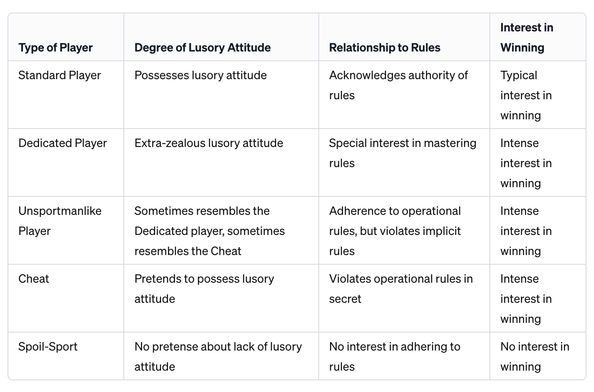

Seven thoughts on ritual:  

关于仪式的七个思考：

1.  Rituals are the feedback loops we construct to construct ourselves.  
    
    仪式是我们构建自己的反馈循环。
    
2.  Rituals shape the medium of time.  
    
    仪式塑造时间的媒介。
    
3.  Rituals orient us.  
    
    仪式使我们定位。
    
4.  Rituals are protocols.  
    
    仪式是一种协议。
    
5.  Ritual is a form of play.  
    
    仪式是一种游戏形式。
    
6.  Rituals take place in a world set apart.  
    
    仪式发生在一个独立的世界中。
    
7.  Rituals make meaning.  
    
    仪式赋予意义。
    

Lets take a closer look at these seven impressions, and explore what it means to build ritual technology.  

让我们仔细研究这七个印象，并探索构建仪式技术的含义。  

We’ll take a broad view of ritual that encompasses everything from sacred rites to making a morning cup of coffee.  

我们将广泛地理解仪式，包括从神圣仪式到早晨喝咖啡的一切。

**1\. Rituals are feedback loops we construct to construct ourselves.** Our impulses are fast and transient, but rituals are slow and recurrent.  

We change, our context changes, our rituals remain the same. Rituals are long-term memory in our  

1\. 仪式是我们构建来构建自己的反馈循环。我们的冲动是快速而短暂的，但仪式是缓慢而经常发生的。[self-system](https://subconscious.substack.com/p/the-knowledge-ecology). They act as a kind of scaffold around which we can grow.  

We participate in rituals to bend the long arc of the self.  

我们参与仪式是为了改变自我漫长的弧线。  

我们改变，我们的环境改变，我们的仪式保持不变。仪式是我们自我系统中的长期记忆。它们充当我们可以成长的支架。

**2\. Rituals shape the medium of time**. They structure time and give it narrative.  

2\. 仪式塑造时间的媒介。它们给时间结构和叙事。

> \[Ritual\] may be characterized as the art of significant forms in time, as architecture of time.  
> 
> \[仪式\] 可以被看作是时间中重要形式的艺术，是时间的建筑。  
> 
> _(Abraham Joshua Heschel, 1951. The Sabbath.)  
> 
> （亚伯拉罕·约书亚·赫舍尔，1951年，《安息日》）_

> Rituals are to time what places are to space.  
> 
> 仪式对于时间就像地点对于空间一样重要。  
> 
> They ground us and connect us to the world around us through the medium of time.  
> 
> 它们使我们扎根，并通过时间的媒介将我们与周围的世界联系在一起。  
> 
> _(Byung-Chul Han, [The Disappearance of Rituals](https://www.amazon.com/Disappearance-Rituals-Topology-Present/dp/1509542760).)  
> 
> （韩秉宇，《仪式的消失》）_

Ancient cultures structure lives and years around ritual: spring equinox, summer solstice, harvest time, winter feasts, birth, death, coming-of-age, rites of passage.  

古代文化将生活和年份围绕着仪式来组织：春分、夏至、丰收季节、冬季盛宴、出生、死亡、成年礼、过渡仪式。  

Traditional rituals like these choreograph our life-story around a kind of symbolic or sacred higher time, connecting our lived experience to myths and ideas and seasons.  

这些传统仪式将我们的生活故事编排在一种象征性或神圣的更高时间之中，将我们的生活经历与神话、思想和季节联系在一起。

> \[These\] higher times gather and reorder secular time.  
> 
> 这些“更高的时间”聚集并重新安排世俗时间。  
> 
> They introduce “warps” and seeming inconsistencies in profane time-ordering.  
> 
> 它们在世俗时间的排序中引入了“扭曲”和看似不一致的因素。  
> 
> Events which were far apart could nevertheless be closely linked.  
> 
> 即使相隔很远的事件也可以紧密联系在一起。_  
> 
> (Charles Taylor on ritual time-consciousness in [A Secular Age](https://www.hup.harvard.edu/books/9780674986916))  
> 
> （查尔斯·泰勒在《世俗时代》中谈到仪式时间意识）_

Even small and everyday rituals like making a cup of coffee, morning meditation, or daily journaling create narrative structures within our lives.  

即使是小小的日常仪式，比如泡一杯咖啡、早晨冥想或每天写日记，也在我们的生活中创造了叙事结构。  

We perform these rituals like placing stones into the stream of time, marking moments with meaning.  

我们进行这些仪式，就像将石头放入时间的流中，用意义标记时刻。

**3\. Rituals orient us.** We could say the ritual is [in our OODA loop](https://subconscious.substack.com/p/tools-for-thought-in-your-ooda-loop), the feedback loop we make sense with.  

We let the ritual in, so that it can drive orientation to some degree.  

我们让仪式进入，以便在某种程度上驱动方向。  

It becomes part of our sense-making system.  

它成为我们感知系统的一部分。  

3\. 仪式使我们保持方向。我们可以说仪式在我们的OODA循环中，这是我们用来理解的反馈循环。

> For Boyd, the most important factor for survival is your sense-making system.  
> 
> 对于博伊德来说，生存的最重要因素是你的感知系统。  
> 
> This is the thing that keeps you oriented.  
> 
> 这是让你保持方向的东西。  
> 
> There’s a reason that “orient” is the biggest circle on the OODA diagram.  
> 
> “方向”是OODA图表上最大的圆圈，这是有原因的。  
> 
> We survive by making sense.  
> 
> 我们通过理解来生存。
> 
> When orientation breaks down—when you are _disoriented_—you lose your agency. Your model is wrong.  
> 
> You pay attention to the wrong things, your actions stop making sense, you flail.  
> 
> 你关注错误的事物，你的行动变得毫无意义，你手忙脚乱。  
> 
> 当方向感丧失时，当你迷失方向时，你失去了主动性。你的模型是错误的。
> 
> _(Subconscious, 2023, “[Tools for thought in your OODA loop](https://subconscious.substack.com/p/tools-for-thought-in-your-ooda-loop)”)  
> 
> （潜意识，2023年，“在你的OODA循环中思考的工具”）_

When we don’t know what else to do, we can trust the process.  

当我们不知道该做什么时，我们可以相信这个过程。  

Rituals get us out of deadlock by providing scripts to play out when we’ve lost the plot.  

仪式可以通过提供剧本来帮助我们走出僵局，当我们迷失方向时，可以按照剧本行事。  

Maybe it’s the right script, maybe not. Either way, rituals keep us moving.  

也许这是正确的剧本，也可能不是。无论如何，仪式让我们保持前进。

Another insight from OODA loops: the timescale at which you can make sense is the timescale in which you have agency.  

OODA循环中的另一个洞察力是：你能够理解的时间尺度就是你能够行动的时间尺度。  

Rituals operate at timescales beyond our present moment—days, years, lifetimes.  

仪式的运作时间尺度超出了我们当前的时刻——天、年、一生。  

Many traditional rituals encode multigenerational wisdom and collective memory.  

许多传统仪式编码了多代人的智慧和集体记忆。  

A ritual may let us operate on longer timescales too, participating in agency across generations.  

仪式可以让我们在更长的时间尺度上运作，参与代际间的行动。

**4\. Rituals are protocols.** When performing a ritual, we make the part of ourselves that participates in the ritual like the ritual.  

We give up a bit of  

4\. 仪式是一种协议。当进行仪式时，我们让参与仪式的自己变得像仪式一样。[requisite variety](https://subconscious.substack.com/p/aggregators-arent-open-ended#%C2%A7the-infinite-variety-of-universal-machines), shape our range of motion, act in structured ways, to gain what the ritual has to offer.  

我们放弃了一部分必要的多样性，塑造了我们的行动范围，以结构化的方式行事，以获得仪式所提供的东西。

When many of us participate in a ritual, we each become the like the ritual.  

当我们中的许多人参与一种仪式时，我们每个人都变得像这个仪式一样。  

The ritual is an interface, a common set of procedures.  

仪式是一个接口，一个共同的程序集。  

It can act as a stable point of coordination, a “[source-of-truth](https://en.wikipedia.org/wiki/Single_source_of_truth)”, in software terms, or a lego dot that helps us click together.  

它可以作为协调的稳定点，一个“真相来源”，在软件术语中，或者是帮助我们连接在一起的乐高点。

In this way, rituals can be a kit for constructing community.  

通过这种方式，仪式可以成为构建社区的工具包。  

Perform the ritual together, and a particular kind of community will emerge around it.  

一起进行仪式，将会形成一种特定类型的社区。

Rituals channel our collective energy in a particular shared direction.  

仪式将我们集体的能量引导到特定的共享方向。  

There are returns to scale on coordination, so, ritual is adaptive.  

协调具有规模回报，因此仪式是适应性的。

**5\. Ritual is a form of play.  

5\. 仪式是一种游戏形式。**

> Ritual grew up in sacred play.  
> 
> 仪式在神圣的游戏中成长起来。  
> 
> _(Johann Huizinga, “[Homo Ludens](https://en.wikipedia.org/wiki/Homo_Ludens)”)  
> 
> （约翰·胡伊兹英加，《游戏人类》）_

Like all play, rituals require a suspension of disbelief. We have to be willing to play.  

像所有的游戏一样，仪式需要暂时放下怀疑的态度。我们必须愿意去参与。  

In games studies, this stance is called the [lusory attitude](https://en.wikipedia.org/wiki/Lusory_attitude).  

Adopting the lusory attitude means accepting a game’s arbitrary rules in exchange for participating in the experience of play.  

采取游戏态度意味着接受游戏的任意规则，以换取参与游戏体验的机会。  

在游戏研究中，这种态度被称为游戏态度。

> It is an invariable principle of all play… that whoever plays, plays freely.  
> 
> 这是所有游戏的不变原则...无论谁参与游戏，都是自由的。  
> 
> Whoever must play, cannot play.  
> 
> 谁必须参与游戏，却无法参与。  
> 
> _(James Carse, “Finite and Infinite Games”)  
> 
> （詹姆斯·卡斯，《有限与无限的游戏》）_

The lusory attitude is not required. You never have to play.  

并不是每个人都需要采取游戏态度。你永远不必参与游戏。  

When you don’t take on a lusory attitude, the ritual means nothing to you, or means something different.  

当你不采取游戏态度时，仪式对你来说毫无意义，或者意义完全不同。

Relationships to lusory attitude (_Salen, Zimmerman, 2004, “Rules of Play”)_  

与游戏态度的关系（Salen, Zimmerman, 2004，《游戏规则》）

This is why many rituals begin with buy-in. The [I-Ching](https://en.wikipedia.org/wiki/I_Ching) begins with your question, the yoga instructor asks you to set an intention, an RPG will often start with character creation.  

这就是为什么许多仪式都以参与开始。《易经》从你的问题开始，瑜伽教练要求你设定一个意图，角色扮演游戏通常从角色创建开始。

**6\. Rituals take place in a world set apart.** You have to “step into” the world of the ritual.  

6\. 仪式在一个与众不同的世界中进行。你必须“踏入”仪式的世界。

> All play moves and has its being within a playground marked off beforehand either materially or ideally, deliberately or as a matter of course.  
> 
> 所有的游戏都在一个事先划定的游乐场内进行，无论是物质上还是理念上，无论是故意的还是理所当然的。  
> 
> Just as there is no formal difference between play and ritual, so the “consecrated spot” cannot be formally distinguished from the playground.  
> 
> 正如游戏和仪式之间没有形式上的区别一样，所谓的“神圣之地”也无法在形式上与游乐场区分开来。  
> 
> The arena, the card table, the magic circle, the temple, the stage, the screen, the tennis courts, the court of justice, etc, are all in form and function playgrounds, i.e.  
> 
> 竞技场、纸牌桌、魔法圈、寺庙、舞台、屏幕、网球场、法庭等等，无论是形式还是功能上都是游乐场，也就是禁区，被隔离、围起来、神圣化，在其中遵循特殊的规则。  
> 
> forbidden spots, isolated, hedged round, hallowed, within which special rules obtain.  
> 
> 所有这些都是普通世界中的临时世界，专门用于执行独立的行为。  
> 
> All are temporary worlds within the ordinary world, dedicated to the performance of an act apart.  
> 
> （约翰·胡伊兹因加，1938年，《 Homo Ludens》）_  
> 
> (Johan Huizinga, 1938, “[Homo Ludens](https://en.wikipedia.org/wiki/Homo_Ludens)”)  
> 
> 参与仪式活动时，你置身于一个神奇的领域，一个能够与你自己的深层联系起来的领域_

> By participating in a ritual occasion you are in a magical field, a field that is putting you in touch with your own great depth.  
> 
> （约瑟夫·坎贝尔，《上帝的神话与面具》）  
> 
> _(Joseph Campbell, “The Myths and Masks of God”)  
> 
> 在游戏研究中，这些世界中的世界被称为魔法圈。魔法圈是游戏发生的空间_

In games studies, these worlds-within-a-world are called [magic circles](https://subconscious.substack.com/p/magic-circles). A magic circle is the space where the game takes place.

> Within the magic circle, special meanings accrue and cluster around objects and behaviors.  
> 
> 在魔法圈内，特殊的意义会积累并围绕着物体和行为聚集。  
> 
> In effect, a new reality is created, defined by the rules of the game and inhabited by its players.  
> 
> 实际上，一种新的现实被创造出来，由游戏规则定义，并由其玩家居住。  
> 
> (_Salen, Zimmerman, 2004, “[Rules of Play](https://mitpress.mit.edu/9780262240451/rules-of-play/)”)_  
> 
> （Salen，Zimmerman，2004，“游戏规则”）

So, rituals have boundaries in time and space.  

因此，仪式在时间和空间上有界限。  

You have to cross over the threshold into the magic circle to participate. This means there has to _be_ a threshold to cross over.  

你必须跨越门槛进入魔法圈参与其中。这意味着必须有一个门槛要跨越。

Rituals need opening rites, and closing ceremonies.  

仪式需要开场仪式和闭幕典礼。  

These boundaries mark our passage from the ordinary world into ritual time.  

这些界限标志着我们从普通世界进入仪式时间的过渡。

**7\. Rituals make meaning.  

7\. 仪式赋予意义。**

> In play there is something “at play” which transcends the immediate needs of life and imparts meaning to the action.  
> 
> 在游戏中，有一种“在游戏中”的东西超越了生活的直接需求，并赋予行动以意义。  
> 
> All play means something.  
> 
> 所有的游戏都有意义。  
> 
> _(Johann Huizinga, “[Homo Ludens](https://en.wikipedia.org/wiki/Homo_Ludens)”)  
> 
> （约翰·胡伊兹英加，《 Homo Ludens》）_

In the ordinary world, things just are what they are. Sticks are just sticks, stones are just stones.  

在普通世界中，事物就是它们自己。棍子只是棍子，石头只是石头。  

In ritual world, things stand for things.  

在仪式世界中，事物代表着其他事物。  

Stones, arranged a certain way might become the boundary marker for a soccer game, or maybe a monument.  

石头，以一定的方式排列，可能成为足球比赛的边界标志，或者是一个纪念碑。  

In ritual, things _mean something_. We give them meaning.  

在仪式中，事物有意义。我们赋予它们意义。

Rituals are how we make meaning, personally and together.  

仪式是我们个人和共同赋予生活意义的方式。

Here’s my provocation…  

这是我的挑战..

**We need ritual technology.** Technology designed for ritual use.  

我们需要仪式技术。专为仪式使用而设计的技术。

Why? Most of the software we use daily is designed to engagement-max.  

为什么？我们日常使用的大多数软件都是为了最大限度地提高用户参与度而设计的。  

Social media feeds, loot boxes, [compulsion loops](https://en.wikipedia.org/wiki/Compulsion_loop), gang gang yes yes yes ice cream so good.  

You’re caught in a feedback loop with the algorithm, and you are the squishiest part of that loop.  

你被算法困在一个反馈循环中，而你是这个循环中最脆弱的一环。  

社交媒体动态、战利品箱、强迫循环，团团转，是的，是的，冰淇淋太好吃了。

Ritual technology operates on a different timescale.  

仪式技术运行在不同的时间尺度上。  

Underneath the fast twitch of compulsion loops is the slow thrum of ritual. Elder feedback systems. An antidote to algorithmic engagement addiction?  

在强迫循环的快速跳动下，是仪式的缓慢颤动。更古老的反馈系统。是算法参与成瘾的解药吗？

We can tap into these low, slow loops if we want to.  

如果我们愿意，我们可以利用这些低速、缓慢的循环。  

They will guide us slowly and surely in a direction.  

它们将缓慢而确定地引导我们朝着一个方向前进。

What direction? That depends upon the ritual. Every ritual is going somewhere.  

那个方向是什么？这取决于仪式。每个仪式都有一个目的地。  

By choosing rituals to practice, you can decide where you’ll go over the long term.  

通过选择要实践的仪式，你可以决定自己在长期内将去往何处。  

You’re hitching a ride on something that swims slowly and with purpose through the currents of time.  

你正在搭乘一种缓慢而有目的地在时间洪流中游动的东西。

Want to go somewhere new? We can even design new rituals, our own rituals.  

想去一个新地方吗？我们甚至可以设计新的仪式，我们自己的仪式。  

The thoughts above on ritual amount to my initial notes for a ritual technology pattern language.  

上述关于仪式的思考是我对仪式技术模式语言的初步笔记。

The phrase “ritual technology” arose in my mind the other day and wouldn’t let me go.  

“仪式技术”这个词组在我脑海中冒出来，让我无法忘怀。  

I realized that this is what [Subconscious](https://subconscious.substack.com/p/subconscious-beta) is and should be.  

我意识到这就是潜意识的本质和应有之义。

We choose to build a second brain because it lets us garden our thinking over days, months, and years.  

我们选择构建第二个大脑，因为它让我们能够在日子、月份和年份中培育我们的思维。  

Where social media is compulsive, tools for thought are reflective.  

社交媒体是强迫性的，而思考工具则是反思性的。  

Where social media is here and now, tools for thought dwell in [the long now](https://longnow.org/essays/big-here-long-now/). Tools for thought slowly build compounding momentum through low, slow [feedback loops](https://subconscious.substack.com/p/effort-is-evidence-of-broken-feedback) that point us in the [directions we want to develop](https://subconscious.substack.com/p/notes-are-conversations-across-time).  

社交媒体是此时此刻，而思考工具则在长期中存在。思考工具通过低速、缓慢的反馈循环逐渐积累动力，指引我们朝着我们想要发展的方向前进。

Tools for thought are ritual technology.  

思考工具就是仪式技术。

### Subscribe to Subconscious  

订阅潜意识

The web began as a tool for thought  

互联网最初是一种思考工具
