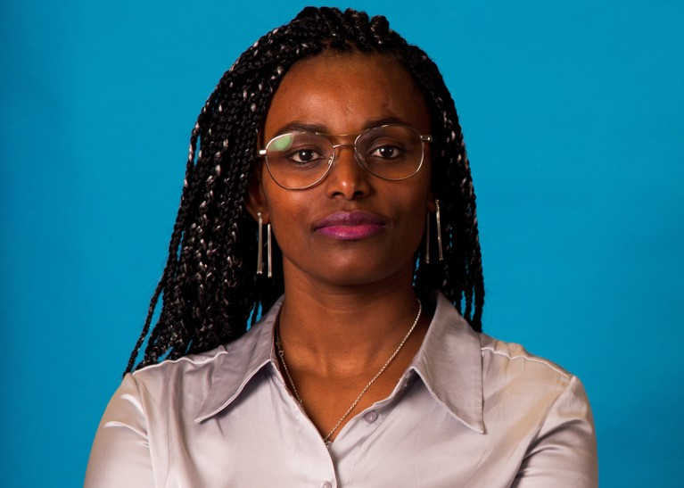
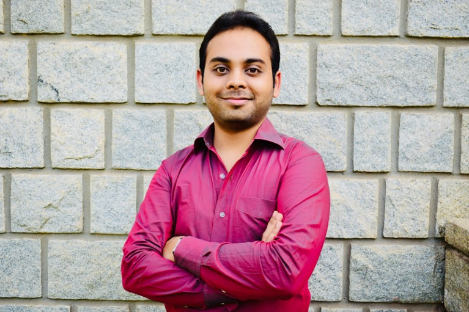
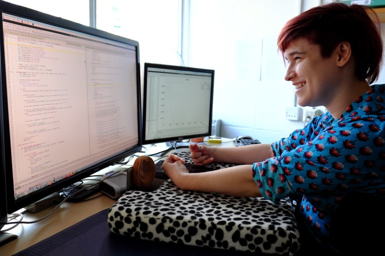
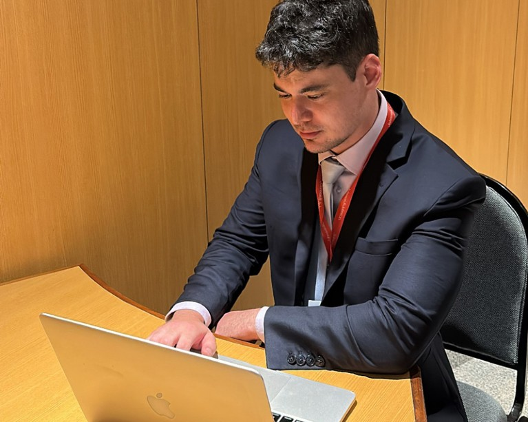

On 30 November 2022, the technology company OpenAI released ChatGPT — a chatbot built to respond to prompts in a human-like manner.  

2022 年 11 月 30 日，技术公司 OpenAI 发布了一款聊天机器人 ChatGPT，它能以类似人类的方式回应提示。  

It has taken the scientific community and the public by storm, attracting one million users in the first 5 days alone; that number now totals more than 180 million.  

它在科学界和公众中掀起了一场风暴，仅在头 5 天就吸引了 100 万用户，目前用户总数已超过 1.8 亿。  

Seven researchers told _Nature_ how it has changed their approach.  

七位研究人员告诉《自然》杂志，它如何改变了他们的研究方法。

## **MARZYEH GHASSEMI: Fix, don’t amplify, biases in health care  

MARZYEH GHASSEMI：纠正而非放大医疗保健中的偏见**

There is no denying the technical accomplishments of the generative language and image models that have emerged in artificial intelligence (AI).  

不可否认，人工智能（AI）领域出现的生成语言和图像模型在技术上取得了巨大成就。  

In my case, I use ChatGPT mostly to help rewrite content in a different style — for example, to make a scientific abstract more suitable for a general audience, or to summarize my research for a financial officer.  

就我而言，我使用 ChatGPT 主要是为了帮助改写不同风格的内容--例如，让科学摘要更适合普通读者，或者为财务人员总结我的研究。  

I’ve also used it to suggest introductory language at the start of an article, e-mail or paper.  

我还用它来建议文章、电子邮件或论文开头的介绍性语言。

[

Generative AI could revolutionize health care — but not if control is ceded to big tech  

生成式人工智能可彻底改变医疗保健--但如果将控制权拱手让给大型科技公司，则无法实现这一目标](https://www.nature.com/articles/d41586-023-03803-y)

I do have concerns about these generative AI tools being used for content creation, whether by students, academics, companies or the public.  

我确实担心这些生成式人工智能工具会被学生、学者、公司或公众用于内容创作。  

Generative models are known, for example, to ‘hallucinate’ content (that is, give incorrect or fictional outputs).  

众所周知，生成模型会产生 "幻觉"（即输出错误或虚构的内容）。

More pressingly, text and image generation are prone to societal biases that cannot be easily fixed.  

更严重的是，文本和图像生成容易受到社会偏见的影响，而这些偏见并不容易纠正。  

In health care, this was illustrated by Tessa, a rule-based chatbot designed to help people with eating disorders, run by a US non-profit organization.  

在医疗保健领域，由美国一家非营利组织运营的基于规则的聊天机器人 Tessa 就说明了这一点，该聊天机器人旨在帮助饮食失调患者。  

After it was augmented with generative AI, the now-suspended bot gave detrimental advice.  

在使用生成式人工智能对其进行增强后，这个现已停用的机器人给出了有害的建议。  

In some US hospitals, generative models are being used to manage and generate portions of electronic medical records.  

在美国的一些医院，生成模型正被用于管理和生成部分电子病历。  

However, the large language models (LLMs) that underpin these systems are not giving medical advice and so do not require clearance by the US Food and Drug Administration.  

然而，支撑这些系统的大型语言模型（LLM）并不提供医疗建议，因此不需要美国食品药品管理局的许可。  

This means that it’s effectively up to the hospitals to ensure that LLM use is fair and accurate.  

这意味着，医院必须确保 LLM 的使用是公平和准确的。  

This is a huge concern.  

这是一个巨大的问题。

The use of generative AI tools, in general and in health settings, needs more research with an eye towards social responsibility rather than efficiency or profit.  

在一般情况下以及在医疗环境中使用人工智能生成工具，需要进行更多的研究，着眼于社会责任，而不是效率或利润。  

The tools are flexible and powerful enough to make billing and messaging faster — but a naive deployment will entrench existing equity issues in these areas.  

这些工具足够灵活和强大，可以让计费和信息传递更快，但天真地使用这些工具会加剧这些领域现有的公平问题。  

Chatbots have been found, for example, to recommend different treatments depending on a patient’s gender, race and ethnicity and socioeconomic status (see [J. Kim _et al. JAMA Netw. Open_ **6**, e2338050; 2023](https://doi.org/10.1001/jamanetworkopen.2023.38050)).  

例如，聊天机器人会根据患者的性别、种族、民族和社会经济地位推荐不同的治疗方法（见 J. Kim 等，JAMA Netw.）

Ultimately, it is important to recognize that generative models echo and extend the data they have been trained on.  

归根结底，重要的是要认识到，生成式模型与它们所训练的数据相呼应和扩展。  

Making generative AI work to improve health equity, for instance by using empathy training or suggesting edits that decrease biases, is especially important given how susceptible humans are to convincing, and human-like, generated texts.  

考虑到人类很容易受到令人信服的、类似人类的生成文本的影响，让生成式人工智能为改善健康公平而工作，例如通过移情训练或建议减少偏见的编辑，就显得尤为重要。  

Rather than taking the health-care system we have now and simply speeding it up — with the risk of exacerbating inequalities and throwing in hallucinations — AI needs to target improvement and transformation.  

人工智能需要以改进和转型为目标，而不是简单地加速我们现有的医疗保健系统，因为这样做有可能加剧不平等和产生幻觉。

## **ABEBA BIRHANE: Think about whether it should be used at all  

ABEBA BIRHANE：考虑一下是否应该使用它**

 

Cognitive scientist Abeba Birhane.Credit: Piquant  

认知科学家 Abeba Birhane.Credit: Piquant

Now that LLMs have entered the mainstream, many academics are feeling the pressure to jump on the bandwagon or be seen as missing out.  

现在，法学硕士已成为主流，许多学者都感受到了压力，他们必须加入到这一行列中来，否则就会被视为错失良机。  

They might not know exactly how they can use this AI technology, but they feel that this increasingly powerful state-of-the-art technology must find a use somehow — like a hammer looking for a nail.  

他们可能不知道自己究竟该如何使用这项人工智能技术，但他们觉得，这项日益强大的先进技术必须以某种方式找到用武之地--就像锤子找钉子一样。  

So far, presumptions abound on how generative AI tools will transform society, but there is no clear or undisputed use for this technology.  

迄今为止，关于生成式人工智能工具将如何改变社会的推测比比皆是，但这种技术并没有明确或无可争议的用途。

From academic research to journalism and policy reports, in my view, the potential benefits of generative AI are routinely overinflated; their failures, limitations and drawbacks are either omitted or merely mentioned in passing.  

在我看来，从学术研究到新闻报道和政策报告，生成式人工智能的潜在好处总是被过度夸大；其失败、局限性和缺点要么被省略，要么只是被顺带提及。  

The critical discussions that exist are limited to a narrow range of topics, such as accuracy, reliability, performance and whether the data the model is trained on, and the model’s weights, are closed or open source.  

现有的批判性讨论仅限于狭窄的话题范围，如准确性、可靠性、性能以及模型训练所依据的数据和模型权重是封闭还是开源。  

These are important issues.  

这些都是重要的问题。  

But a basic question is rarely asked: should the technology be used at all — especially as a ‘solution’ to complex, multifaceted challenges such as health care?  

但有一个基本问题却很少被问及：这项技术到底应不应该使用--尤其是作为医疗保健等复杂、多方面挑战的 "解决方案"？

For example, LLM-based solutions have been proposed for health care in low- and middle-income countries, despite the fact that AI systems are known to exacerbate social biases (see [J. Shaffer _et al. BMJ Glob. Health_ **8**, e013874; 2023](http://dx.doi.org/10.1136/bmjgh-2023-013874)).  

例如，尽管众所周知人工智能系统会加剧社会偏见（见 J. Shaffer et al. BMJ Glob. Health 8, e013874; 2023），但还是有人为中低收入国家的医疗保健提出了基于 LLM 的解决方案。  

Understanding and solving global health inequalities requires getting to the root causes of ugly social realities.  

要了解和解决全球卫生不平等问题，就必须找到丑陋社会现实的根源。  

This includes confronting legacies of colonialism and slavery, and the preservation of asymmetries in power and wealth between the global north and south — such as that the health or illness of some groups matters less than that of others.  

这包括正视殖民主义和奴隶制的遗留问题，以及全球南北方之间权力和财富不对称的问题--比如某些群体的健康或疾病不如其他群体重要。

It is much easier to put forward a simplistic ‘technical solution’ — under the pretence of doing something — than it is to confront the roots of these enormous challenges.  

打着有所作为的幌子，提出简单化的 "技术解决方案"，要比直面这些巨大挑战的根源容易得多。  

What is needed is political willpower and just distribution of power and resources, not LLMs.  

我们需要的是政治意愿以及权力和资源的公正分配，而不是法律硕士。

## **MUSHTAQ BILAL: Use it for structure, not content  

MUSHTAQ BILAL：用于结构，而非内容**

 

Mushtaq Bilal explores ChatGPT for academic purposes.Credit: Kristoffer Juel Poulsen  

Mushtaq Bilal 为学术目的探索 ChatGPT.图片来源：Kristoffer Juel Poulsen

When ChatGPT launched, I was too busy moving from Pakistan to Denmark for a postdoctoral position to pay serious attention to it.  

当 ChatGPT 推出时，我正忙于从巴基斯坦到丹麦从事博士后工作，没有认真关注它。  

But I was closely following the conversation about it on social media.  

但我一直密切关注着社交媒体上的相关话题。  

In January, my contact Rob Lennon, who had been experimenting with prompting, wrote a thread on X (formerly Twitter; see [go.nature.com/3teexb1](http://go.nature.com/3teexb1)) on how best to use the chatbot for business purposes. It proved popular.  

今年 1 月，我的联系人罗布-列侬（Rob Lennon）一直在尝试使用提示功能，他在 X（Twitter 的前身，见 go.nature.com/3teexb1）上写了一篇关于如何将聊天机器人最好地用于商业目的的文章。结果证明很受欢迎。  

I used Rob’s prompts as a model to explore uses in academic writing and posted a thread that went viral, too ([go.nature.com/3swrztn](http://go.nature.com/3swrztn)). Many researchers wanted to learn about ChatGPT.  

我将罗布的提示作为一种模式，探索在学术写作中的应用，并发布了一个主题，也引起了病毒式传播（go.nature.com/3swrztn）。许多研究人员都想了解 ChatGPT。  

Since then, I have developed ways of using it for academic purposes and shared them on X and the jobs-focused platform LinkedIn.  

从那时起，我开发了将其用于学术目的的方法，并在 X 和以工作为重点的平台 LinkedIn 上进行了分享。

The most important thing I have emphasized is that generative AI is well suited to creating structure, but not content.  

我强调的最重要的一点是，生成式人工智能非常适合创建结构，但不适合创建内容。  

LLMs are trained to predict the next word in a sentence.  

LLM 接受的训练是预测句子中的下一个单词。  

That means the content a chatbot generates is typically predictable — whereas original research is anything but.  

这意味着聊天机器人生成的内容通常是可预测的，而原创研究则不然。

Instead, ChatGPT can serve as a brainstorming partner.  

相反，ChatGPT 可以作为您的头脑风暴伙伴。  

It will not give you any groundbreaking ideas, but through careful prompting, it can certainly help you to think in the right direction.  

它不会给你任何突破性的想法，但通过细致的提示，它肯定能帮助你朝着正确的方向思考。  

It can also propose an outline for a research paper, which can serve as a starting point.  

它还可以提出研究论文的大纲，作为起点。

OpenAI recently launched custom versions of ChatGPT tailored for specific purposes, including teaching and research.  

OpenAI 最近推出了为特定目的（包括教学和研究）定制的 ChatGPT 版本。  

For example, a custom ChatGPT can be created for a course, asking it to always base its answers on the course materials provided.  

例如，可以为一门课程创建一个自定义 ChatGPT，要求它始终根据所提供的课程材料来回答问题。  

This should prevent the chatbot from hallucinating, making it a useful resource for students.  

这样可以防止聊天机器人产生幻觉，使其成为学生的有用资源。

## **SIDDHARTH KANKARIA: A tool for tailored teaching  

SIDDHARTH KANKARIA：因材施教的工具**

 

Siddharth Kankaria finds generative AI useful in teaching science communication.Credit: Ravi K. Boyapati  

Siddharth Kankaria 发现生成式人工智能在科学传播教学中非常有用。

At first, I was excited about ChatGPT’s promise for communicating science.  

起初，我对 ChatGPT 在科学交流方面的前景感到兴奋。  

It seemed that it could write clear, crisp and accessible summaries of scientific papers and help to simplify jargon.  

它似乎可以为科学论文撰写清晰、明了、易懂的摘要，并帮助简化专业术语。  

However, I soon realized that many of these purported applications often merited a healthy dose of scrutiny and proofreading.  

然而，我很快就意识到，许多所谓的应用往往需要经过严格的审查和校对。  

I found it prudent to use ChatGPT in more targeted ways, being mindful of its pros and cons.  

我发现有必要以更有针对性的方式使用 ChatGPT，同时注意其利弊。

I had an opportunity to do so earlier this year, while teaching science communication and public engagement to secondary-school students.  

今年早些时候，我在给中学生讲授科学交流和公众参与时，有机会这样做。  

This is an area in which both creativity and critical thinking are crucial.  

这是一个创造力和批判性思维都至关重要的领域。  

As a firm proponent of ‘learning by doing’, I designed my sessions to be participatory and interactive.  

作为 "边做边学 "的坚定支持者，我将课程设计成参与式和互动式的。  

I used improvisation games, performances, debates and discussions to expose students to concepts in science communication — from storytelling and audience framing to ethical and social-justice considerations.  

我利用即兴游戏、表演、辩论和讨论，让学生了解科学传播的概念--从讲故事和受众框架到伦理和社会正义方面的考虑。

I used ChatGPT to brainstorm prompts, questions and content for classroom activities.  

我使用 ChatGPT 为课堂活动集思广益，提出提示、问题和内容。  

For example, it quickly collated 50 scientific metaphors, such as for DNA (‘the blueprint of life’) and for gravity (‘spheres on a bed sheet’).  

例如，它很快就整理出了 50 个科学隐喻，如 DNA（"生命蓝图"）和重力（"床单上的球体"）。

I was aware that many students would probably turn to ChatGPT for these activities and group projects.  

我知道很多学生可能会在这些活动和小组项目中使用 ChatGPT。  

Rather than restrict their access to it — which would have felt disingenuous when I was relying on the chatbot myself — I encouraged them to use AI tools freely, but to reflect on their limitations.  

我鼓励他们自由使用人工智能工具，但要反思这些工具的局限性，而不是限制他们使用这些工具--如果我自己也依赖聊天机器人的话，这样做会让人觉得不真诚。  

For a class on science writing, we collectively critiqued an anonymized mix of summaries of research papers written by students and by ChatGPT.  

在一堂关于科学写作的课上，我们集体点评了学生和 ChatGPT 所写的研究论文摘要的匿名组合。  

This sparked interesting discussions on what constitutes a good opening sentence, the limitations of using AI tools and tips for improving one’s own writing.  

这引发了有趣的讨论，包括什么是好的开头句、使用人工智能工具的局限性以及改进自身写作的技巧。

This approach of embracing new technology gradually while still being acutely critical of its biases and pitfalls felt most prudent to me, at least in the context of teaching and communicating science.  

至少在科学教学和交流的背景下，我认为这种逐渐接受新技术，同时又对其偏见和陷阱持批判态度的方法是最稳妥的。

## **CLAIRE MALONE: Not always reliable, but it does spark joy  

克莱尔-马隆：并不总是可靠，但它确实能带来快乐**

 

Science journalist Claire Malone says the key to ChatGPT’s utility is knowing how to avoid irrelevant results.Credit: Claire Malone  

科学记者克莱尔-马龙（Claire Malone）说，ChatGPT发挥作用的关键在于知道如何避免不相关的结果。

A year ago, I was sceptical about how useful ChatGPT would be in my day-to-day work as a science communicator, which at its core involves presenting complex scientific ideas in an accessible manner.  

一年前，我还怀疑 ChatGPT 在我作为科学传播者的日常工作中会有多大用处，因为科学传播的核心是以通俗易懂的方式介绍复杂的科学思想。  

So far, many of my reservations have been well founded.  

到目前为止，我的许多保留意见都是有根据的。  

For example, when I instructed the chatbot to rewrite the abstract of my PhD thesis in simpler terms, I was not impressed.  

例如，当我指示聊天机器人用更简单的语言重写我的博士论文摘要时，我并没有留下深刻印象。  

It retained much of the jargon and failed to make key ideas accessible to a broad audience.  

它保留了很多专业术语，未能让广大受众理解关键观点。

Yet it does have useful aspects.  

然而，它确实有其有用的一面。  

The crucial first step is knowing how to frame a question to avoid getting irrelevant results.  

关键的第一步是知道如何提出问题，以避免得到不相关的结果。  

I find ChatGPT an efficient means of getting a rough overview of a topic, which I can then drill into.  

我发现 ChatGPT 是一种有效的手段，可以让我对某个话题有一个大致的了解，然后再深入研究。  

And it is likely that each user’s experience will become increasingly personalized as ChatGPT gains in power and accuracy in the next few years.  

未来几年，随着 ChatGPT 的功能和准确性的提高，每个用户的体验可能会越来越个性化。

In my view, it has an important part to play in sparking curiosity about a huge range of topics.  

在我看来，它在激发人们对各种话题的好奇心方面发挥着重要作用。  

It’s an immediate, interactive source of information — albeit not always guaranteed to be accurate.  

它是一个即时、互动的信息来源--尽管并不总是保证准确无误。  

And its role is distinct from that of a journalist who, beyond fact-checking, considers wider implications and often shines a light on topics readers might not have thought to explore.  

它的作用与记者不同，记者除了核实事实外，还要考虑更广泛的影响，并经常揭示读者可能没有想到要探讨的话题。

## **ETHAN MOLLICK: Embrace AI in teaching  

ETHAN MOLLICK：在教学中拥抱人工智能**

Rather than skirting around AI in the classroom, I incorporated it into every assignment and lesson.  

在课堂上，我没有绕过人工智能，而是将其融入到每一次作业和课程中。  

On the basis of that experiment, and on the early research available on generative AI tools, this is what I think the future holds.  

根据这项实验以及对人工智能生成工具的早期研究，我认为未来会是这样。

AI cheating will remain undetectable and widespread.  

人工智能作弊仍将是难以察觉且普遍存在的。  

AI detectors have repeatedly been shown to generate lots of false negatives and false positives — especially for students whose first language is not English (see [go.nature.com/47am62d](http://go.nature.com/47am62d)). Teachers will need to consider approaches other than homework to assess student learning.  

人工智能检测器多次被证明会产生大量假阴性和假阳性结果，尤其是对母语不是英语的学生而言（见 go.nature.com/47am62d）。教师需要考虑用家庭作业以外的方法来评估学生的学习情况。

AI technology will remain ubiquitous. Right now, ChatGPT-3.5 is free.  

人工智能技术仍将无处不在。目前，ChatGPT-3.5 是免费的。  

Microsoft’s Bing and Google’s Bard are free.  

微软的 Bing 和谷歌的 Bard 也是免费的。  

All of these LLM-powered systems give unprecedented writing and analytical power to everyone.  

所有这些由 LLM 驱动的系统都为每个人提供了前所未有的写作和分析能力。  

Even if the technology did not develop further (and it will), I assume its use will become widespread and costs will remain reasonable.  

即使这项技术没有进一步发展（它会发展的），我想它的使用也会越来越广泛，成本也会保持合理。

AI will transform teaching. Students are already using LLMs as tutors and references.  

人工智能将改变教学。学生们已经在使用法学硕士作为导师和参考资料。  

As one told me, “Why raise your hand in class when you can ask ChatGPT a question?” We are going to need to think deeply about how to incorporate these tools, with all their flaws and benefits, into class.  

正如一位学生告诉我的那样："既然可以向 ChatGPT 提问，为什么还要在课堂上举手呢？我们需要深入思考如何将这些工具（包括它们的缺点和优点）融入课堂。  

We can do this in ways that benefit teachers, students and education as a whole.  

我们可以用有益于教师、学生和整个教育的方式来做到这一点。  

As models become more accurate and more powerful, they will probably take on a direct instructional role, but direct instruction is only a small part of what teachers do.  

随着模型变得越来越精确和强大，它们很可能会承担起直接教学的角色，但直接教学只是教师工作的一小部分。  

Classrooms provide so much more — opportunities to practise learnt skills, collaborations on problem-solving, support from instructors and socializing.  

课堂还能提供更多--练习所学技能的机会、解决问题的合作、教师的支持和社交。

Learning environments will continue to add value, even with excellent AI tutors, but this will require adopting approaches such as active learning and flipped classrooms (in which students are given course material before the class, during which the teacher instead facilitates group discussion).  

即使有了优秀的人工智能辅导员，学习环境仍将继续增值，但这需要采用主动学习和翻转课堂等方法（在翻转课堂中，学生在课前获得课程材料，教师在课上主持小组讨论）。  

These are known to work well, but have been hard to implement because of the constraints that instructors face.  

众所周知，这些方法效果很好，但由于教师面临的限制而难以实施。  

AI could well kick-start this change.  

人工智能很可能会启动这一变革。

We have dealt with such transformations before.  

我们以前也遇到过这种变革。  

When calculators were introduced in the 1970s, they completely altered how mathematics was taught.  

20 世纪 70 年代，计算器的出现彻底改变了数学教学的方式。  

Now, education faces a much larger challenge, but one that provides opportunities as well as risks.  

现在，教育面临着更大的挑战，但机遇与风险并存。  

Experimenting with AI in an ethical, appropriate way can lead to discovering the best ways to apply pedagogical principles to boost student learning.  

以合乎道德和适当的方式进行人工智能实验，可以发现应用教学原则促进学生学习的最佳方法。

## **FRANCISCO TUSTUMI: Transparency is needed  

弗朗西斯科-图斯图米：需要透明度**

 

Francisco Tustumi thinks the LLM-powered chatbot needs to be more amenable to critical appraisal.Credit: Francisco Tustumi  

弗朗西斯科-图斯图米（Francisco Tustumi）认为，由法学硕士驱动的聊天机器人需要更多的批判性评价。

The abilities of ChatGPT and other generative AI systems have led some people to think that the tools might eventually take over human roles in reviewing and writing scientific articles.  

ChatGPT和其他生成式人工智能系统的能力让一些人认为，这些工具最终可能会取代人类在审阅和撰写科学文章方面的作用。  

Indeed, these systems can — and probably will — serve in manuscript preparation and reviewing, including for data search.  

的确，这些系统可以--而且很可能会--在稿件准备和审阅中发挥作用，包括数据搜索。  

However, they are limited by certain aspects.  

然而，它们在某些方面受到了限制。

Firstly, ChatGPT is not a search engine — and it has been shown to provide wrong answers ([S. Fergus _et al. J. Chem. Educ_. **100**, 1672–1675; 2023](https://doi.org/10.1021/acs.jchemed.3c00087)). Another issue is that it is not transparent about how it constructs its texts.  

首先，ChatGPT 并非搜索引擎，而且事实证明它会提供错误答案（S. Fergus et al. J. Chem. Educ. 100, 1672-1675; 2023）。另一个问题是，它在如何构建文本方面并不透明。  

Scientific papers must have a clear and reproducible methodology.  

科学论文必须有明确的、可重复的方法。  

The source of information, search, selection, data extraction and reporting strategies should be detailed, empowering readers to critically evaluate not only the data in a manuscript but also its text.  

应详细说明信息来源、搜索、选择、数据提取和报告策略，使读者不仅能批判性地评估手稿中的数据，还能评估其文本。

Hopefully, future AI-based programs will be more amenable to such critical appraisal.  

希望未来基于人工智能的程序更适合这种批判性评估。  

Until then, they cannot be reliably used in manuscript writing and reviewing.  

在此之前，它们还不能可靠地用于稿件撰写和审阅。
