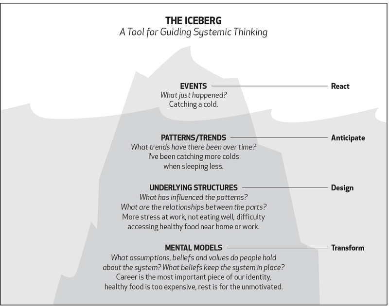

Fast, sudden change can make it hard to understand what’s happening in a complex situation.  

快速而突然的变化可能会使人难以理解复杂情况中正在发生的事情。  

Your attention focuses on a few salient facts — if you can pick them out from the noise.  

你的注意力集中在一些显著的事实上，如果你能从噪音中挑选出来的话。  

But even those facts aren’t very useful unless you dive deeper.  

但是，即使这些事实也没有什么用，除非你深入挖掘。  

Fortunately, systems thinking provides a tool for doing just that.  

幸运的是，系统思维提供了一个工具来做到这一点。  

I’ll introduce it by unpacking the recent turmoil at [OpenAI](https://openai.com/).  

我将通过解读OpenAI最近的动荡来介绍它。

OpenAI is arguably the most important company in tech today.  

OpenAI可以说是当今科技界最重要的公司。  

Their ChatGPT is the fastest-growing product in history: just two months after launch, it already had 100 million active users.  

他们的ChatGPT是历史上增长最快的产品：仅在推出两个月后，就已经拥有1亿活跃用户。  

It’s no accident: ChatGPT brought LLMs — the most transformative new technology in decades — to the masses.  

这并非偶然：ChatGPT将LLM（几十年来最具变革性的新技术）带给了大众。  

From the outside, it seems as though the company has executed flawlessly.  

从外部来看，这家公司似乎执行得非常完美。  

As recently as November 6, it announced an exciting slate of improvements.  

就在11月6日，他们宣布了一系列令人兴奋的改进。  

And yet, less than two weeks later, OpenAI almost imploded.  

然而，不到两周后，OpenAI几乎崩溃了。

If you follow tech, you’ve likely seen the story. (If not, [here’s an excellent primer](https://newsletter.pragmaticengineer.com/p/what-is-openai).) TL; DR: on November 17, OpenAI’s board fired the company’s popular CEO, Sam Altman — an unexpected move that led to unrest among staff (95% threatened to resign) and OpenAI’s primary partner, Microsoft.  

如果你关注科技，你可能已经看到了这个故事。（如果没有，这是一个很好的入门指南。）简而言之：在11月17日，OpenAI的董事会解雇了该公司受欢迎的CEO Sam Altman，这是一个意外的举动，引发了员工的不安（95%的员工威胁要辞职）以及OpenAI的主要合作伙伴微软的不满。  

After a few days, Altman returned as CEO under a new board.  

几天后，Altman以新的董事会成为了CEO。  

The power struggle played out in public, with a few actors — and thousands of bystanders — posting on X.  

这场权力斗争在公众面前进行，有一些参与者以及成千上万的旁观者在X上发布了帖子。

As someone interested in AI (and an OpenAI customer,) I followed the evolving situation with trepidation.  

作为一个对人工智能感兴趣的人（也是OpenAI的客户），我对这个不断发展的情况感到担忧。  

Something became apparent early on: chatter included a _lot_ of noise. (Lao Tzu: “Those who know do not speak.  

很早就有一件事变得明显：讨论中包含了很多噪音。（老子说：“知者不言，言者不知。”）更重要的是，人们根据一些事实就下结论。  

Those who speak do not know.”) More to the point, people jumped to conclusions based on a few facts.  

社交媒体无论事实的真实性如何，都会放大独家新闻。  

Social media amplifies scoops regardless of their veracity.  

要理解正在发生的事情，你必须深入了解。这需要两件事：

To understand what’s going on, you must dive deeper. This requires two things:  

等待相关事实的出现，以及

1.  Waiting for relevant facts to emerge, and  
    
    从这些事实中得出意义的框架
2.  A framework for deriving meaning from those facts.

In the rest of this post, I’ll introduce you to such a framework — the [Iceberg Model](https://jarango.com/2021/05/07/the-key-to-understanding-why-things-happen/) — and explain the OpenAI situation through that lens.  

在本文的其余部分，我将向您介绍这样一个框架——冰山模型，并通过这个框架解释OpenAI的情况。

### The Iceberg Model  

冰山模型

Many systems, including companies, manifest complex behaviors.  

许多系统，包括公司，都表现出复杂的行为。  

The Iceberg Model explains the different levels at which you can understand such a system:  

冰山模型解释了您可以理解这样一个系统的不同层次：

1.  Events  
    
    事件
2.  Patterns  
    
    模式
3.  Structures  
    
    结构
4.  Mental models  
    
    心智模型

Image via [ecochallenge.org](https://ecochallenge.org/iceberg-model/)  

图片来自ecochallenge.org

The framework uses the iceberg metaphor because we only tend to see what happened — the first level.  

该框架使用冰山的隐喻，因为我们只倾向于看到发生的事情——第一层。  

Levels 2-4 operate “beneath the surface,” influencing the stuff that’s more easily visible.  

第2-4层在“表面之下”运作，影响着更容易看到的东西。  

As a result, we focus on things that are more immediately apparent without giving as much attention to their underlying causes.  

因此，我们更关注那些更直接明显的事物，而没有给予足够的关注它们的根本原因。  

Alas, that’s where changes have most impact. Let’s look at all four levels more closely.  

唉，这正是变革产生最大影响的地方。让我们更仔细地看看这四个层面。

#### Events  

事件

_Events_ refers to the immediate occurrences that are most obviously visible.  

事件指的是最明显可见的即时发生的事件。  

These are the latest facts you can ascertain about the system or situation, the sort of thing you read about on X or in the news.  

这些是您可以确定系统或情况的最新事实，就是您在 X 上或新闻中读到的那种事情。  

(Of course, you must carefully distinguish _opinions_ from _facts_.)  

（当然，您必须仔细区分观点和事实。）

The OpenAI story features a quick sequence of events: the (apparently) successful product announcements, the blog post announcing the leadership change, a series of X posts from the CEO, former board chair, employees, partners, etc.  

OpenAI 的故事包括一系列快速发生的事件：（显然）成功的产品发布，宣布领导层变动的博客文章，首席执行官、前董事会主席、员工、合作伙伴等的一系列 X 文章。

These events are important data points on their own. But they don’t tell the whole story.  

这些事件本身是重要的数据点。但它们并不能完全讲述整个故事。  

For that, you must take in a broader time frame. That’s where patterns come in.  

为了了解整个故事，您必须考虑更广泛的时间范围。这就是模式的作用所在。

#### Patterns  

模式

_Patterns_ refers to trends or patterns of events that unfold over time.  

模式指的是随时间展开的事件趋势或模式。  

By looking at more relevant data points going as far back as possible, you start perceiving things that come up over and over again.  

通过查看尽可能多的相关数据点，尽可能追溯到更早的时间，您开始察觉到一再出现的事物。

In OpenAI’s case, the November 6 product announcements were the latest in a series of commercial offerings, starting with the GPT-3 API in 2020, followed by DALL-E in 2021 and ChatGPT in 2022. These product launches are significant because OpenAI was founded in 2015 as a non-profit research company aimed at advancing the state of AI without needing to generate financial returns.  

在 OpenAI 的案例中，2022 年 11 月 6 日的产品发布是一系列商业产品中的最新动态，该系列始于 2020 年的 GPT-3 API，接着是 2021 年的 DALL-E，以及 2022 年的 ChatGPT。这些产品发布具有重要意义，因为 OpenAI 成立于 2015 年，是一家旨在推进人工智能发展而无需产生财务回报的非营利研究公司。  

And yet, its offerings since 2020 increasingly look like commercial tech products.  

然而，自 2020 年以来，它的产品越来越像商业技术产品。

The company’s founders and principals have also shared thoughts via interviews, lectures, and posts going back many years.  

该公司的创始人和主要人员还通过采访、讲座和文章分享了多年的思考。  

Reviewing these posts reveals evolving positions about the company’s aspirations and strategy.  

回顾这些文章揭示了关于公司愿景和战略的不断演变的立场。

Which is to say, the events of the last couple of weeks aren’t isolated incidents.  

也就是说，过去几周的事件并不是孤立事件。  

Seen in a broader context, they reveal trends resulting from specific organizational structures that have set OpenAI on its current trajectory.  

从更广泛的背景来看，它们揭示了由特定组织结构导致的趋势，这些结构使得 OpenAI 走上了当前的发展轨迹。

#### Structures  

结构

In this case, by _structures_ we mean OpenAI’s organizational groupings, hierarchies, rules, procedures, etc.  

在这种情况下，结构指的是 OpenAI 的组织群体、层级、规则、程序等。  

At a minimum, the company has a (seemingly) typical corporate structure: a board, management that reports to the board, and staff that reports to management.  

公司至少具有（表面上）典型的企业结构：董事会、向董事会汇报的管理层以及向管理层汇报的员工。

But digging deeper, you learn OpenAI’s structure is somewhat rare.  

但是深入了解后，你会发现OpenAI的结构有些罕见。  

Remember, its founders want the company to be a non-profit, constraining its ability to raise capital.  

请记住，公司的创始人希望公司成为一个非营利组织，这限制了它筹集资金的能力。  

But developing AI requires lots of computing and human resources, which takes massive capital infusions.  

但是开发人工智能需要大量的计算和人力资源，这需要大量的资金注入。

To address this dilemma, in 2019 the company created a “capped-profit” company controlled by the non-profit.  

为了解决这个困境，该公司在2019年创建了一个由非营利组织控制的“有限利润”公司。  

Ideally, this structure allows OpenAI to raise capital and establish commercial partnerships to build the necessary infrastructure and recruit employees while preserving its non-commercial ethos. (See [this Bloomberg article](https://www.bloomberg.com/opinion/articles/2023-11-20/who-controls-openai) for details.)  

理想情况下，这种结构允许OpenAI筹集资金并建立商业伙伴关系，以建立必要的基础设施和招募员工，同时保持其非商业化的理念。（详见彭博社的这篇文章。）

It sounds like a case of wanting to eat the cake and have it too.  

这听起来像是想要两全其美的情况。  

Much of the disruption we saw in the last two weeks stems from this unusual structural choice.  

我们在过去两周看到的许多混乱都源于这种不寻常的结构选择。  

But that structure didn’t emerge arbitrarily.  

但这种结构并非随意产生。

#### Mental Models  

心智模型

This brings us to the deepest layer of the iceberg: _mental models_.  

这将我们带到冰山最深处的层次：心智模型。  

Mental models are the beliefs, values, and assumptions that influence the structures, patterns, and events we perceive.  

心智模型是影响我们感知的结构、模式和事件的信念、价值观和假设。  

As we go down the layers, things become more abstract — and this is the most abstract layer.  

随着我们深入层次，事物变得更加抽象，而这是最抽象的层次。  

Which is to say, analyzing mental models requires reading between the lines.  

也就是说，分析心智模型需要读懂字里行间。

OpenAI’s situation seems shaped by two mental models.  

OpenAI 的情况似乎受到两种心智模型的影响。  

One posits that only a for-profit company can acquire the infrastructure and talent needed to achieve its goal of developing AI.  

一种认为只有营利性公司才能获得发展人工智能所需的基础设施和人才，以实现其目标。  

The other posits that developing AI _beneficially_ requires non-commercial approaches.  

另一种认为发展人工智能有益地需要非商业的方法。

To wit, this is how the company (still) [introduces itself](https://openai.com/blog/introducing-openai):  

换句话说，这就是该公司（仍然）介绍自己的方式：

> OpenAI is a non-profit artificial intelligence research company.  
> 
> OpenAI 是一家非营利性人工智能研究公司。  
> 
> Our goal is to advance digital intelligence in the way that is most likely to benefit humanity as a whole, unconstrained by a need to generate financial return.  
> 
> 我们的目标是以最有可能造福整个人类的方式推进数字智能，不受产生经济回报的需求限制。  
> 
> Since our research is free from financial obligations, we can better focus on a positive human impact.  
> 
> 由于我们的研究不受财务义务的限制，我们可以更好地专注于对人类产生积极影响。

Underlying these two models are divergent beliefs about ideal economic and social arrangements.  

这两种模式背后存在着对理想经济和社会安排的不同信念。  

Someone who distrusts capitalism for ideological reasons might push for the non-commercial structure, while a more pragmatic manager might be open to the for-profit approach.  

出于意识形态原因不信任资本主义的人可能会推动非商业结构，而更加务实的管理者可能会接受盈利的方式。

There are also questions about what “benefit humanity” means.  

对于“造福人类”是什么意思也存在着疑问。  

For some, it might mean raising living standards by making products better and cheaper, requiring competition and quick iteration.  

对于一些人来说，这可能意味着通过改进产品、降低价格提高生活水平，需要竞争和快速迭代。  

For others, it might mean developing products aligned with broader social interests, necessitating a slower pace.  

对于其他人来说，这可能意味着开发符合更广泛社会利益的产品，需要更慢的步调。

These two models are at odds, and they’re likely not the only ones pulling the organization in different directions.  

这两种模式存在冲突，而且很可能不是唯一拉扯组织朝不同方向发展的因素。  

It’s tough to resolve these tensions within one structure.  

在一个结构内解决这些紧张关系是困难的。  

Once you understand these ideological rifts, and the weird structure they’ve produced, the events of the last couple of weeks make more sense.  

一旦你理解了这些意识形态上的分歧，以及它们所产生的奇怪结构，过去几周的事件就变得更加合理了。

### What This Means for You  

这对你意味着什么

Since you likely do not influence OpenAI, this discussion is academic.  

由于您可能无法影响 OpenAI，这个讨论是学术性的。  

But this framework applies to any complex system, including your own organization, a project you’re working on, or even your day-to-day life.  

但是这个框架适用于任何复杂系统，包括您自己的组织、您正在进行的项目，甚至是您的日常生活。

Knowing that the events that catch your attention – those you witness or hear about in the news — result from underlying issues and structural constraints helps you understand them more deeply.  

了解引起您注意的事件——您目睹或从新闻中听到的事件——是由潜在问题和结构性限制导致的，这有助于您更深入地理解它们。  

And suppose they’re things you can do something about.  

假设这些事情是您可以采取行动的事情。  

In that case, you’ll be more likely to focus on root causes rather than symptoms, leading to greater leverage.  

在这种情况下，您更有可能关注根本原因而不是症状，从而产生更大的影响力。

Examining your behaviors through this framework can help you get down to root beliefs and values.  

通过这个框架来审视您的行为可以帮助您深入了解根本信念和价值观。  

If you’re not getting the desired results, consider what structures enabled those results — and, more importantly, what mental models formed those structures.  

如果您没有获得期望的结果，请考虑是什么结构使得这些结果成为可能，更重要的是，是什么心智模型形成了这些结构。  

Ultimately, design is about change.  

最终，设计就是关于变革。  

And as George Bernard Shaw said, “Progress is impossible without change; and those who cannot change their minds cannot change anything.”  

正如乔治·伯纳德·肖所说：“没有变革，进步是不可能的；那些不能改变他们思想的人也不能改变任何事情。”

_A version of this post first appeared in my newsletter. [Subscribe](https://jarango.com/newsletter) to receive posts like this in your inbox every other Sunday.  

本文的一个版本首次出现在我的通讯中。订阅以在每两个星期日收到此类文章。_
