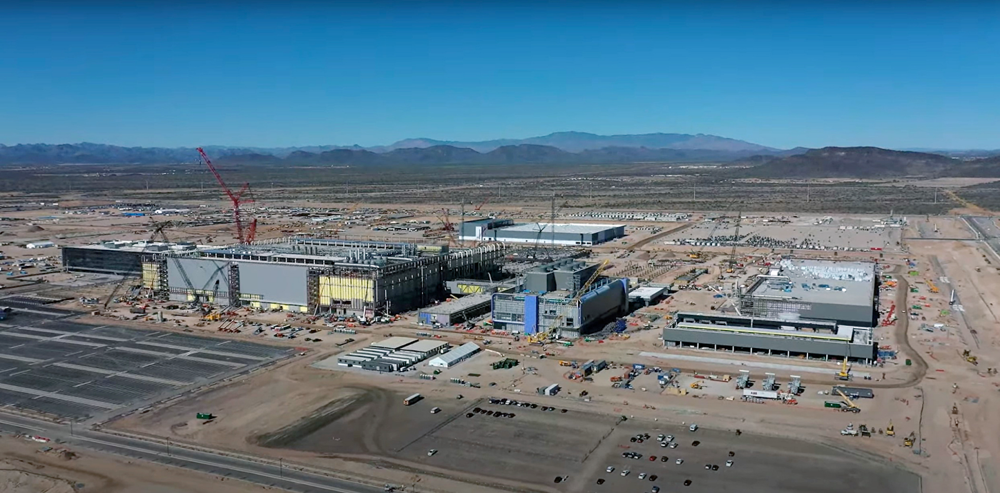

When TSMC’s Arizona fab held its “tool-in” ceremony to much fanfare last December, its founder, Morris Chang, sagely framed the event as simply the “[end of the beginning](https://interconnect.substack.com/p/globalization-is-dead-and-no-one?ref=interconnected.blog).”  

去年 12 月，台积电亚利桑那晶圆厂大张旗鼓地举行了 "入模 "仪式，其创始人莫里斯-张（Morris Chang）睿智地将这一事件定义为 "开始的结束"。

This “end” not only marks the end of the beginning of TSMC’s $40 billion investment in Arizona, but also the “end” of the beginning of **deglobalization**.  

这个 "结束 "不仅标志着台积电在亚利桑那州 400 亿美元投资的开始，也标志着去全球化开始的 "结束"。  

While the direction of deglobalization (or decoupling, or onshoring, or friendshoring, or whatever new cute term the zeitgeist comes up with) has been underway for a few years now, TSMC’s US investment is a major watershed moment of this irreversible trend.  

虽然去全球化（或脱钩、或在岸外包、或朋友外包，或任何时代新潮的可爱术语）的趋势已经持续了几年，但台积电在美国的投资是这一不可逆转趋势的一个重要分水岭。  

As Chang remarked during the “tool-in” ceremony:  

正如 Chang 在 "工具进场 "仪式上所说的那样：

> “_Globalization is almost dead. Free trade is almost dead.  
> 
> "全球化几近死亡。自由贸易几近死亡。  
> 
> And a lot of people still wish they would come back, but I really don’t think they will be back for a while.”  
> 
> 很多人仍然希望他们能回来，但我真的认为他们暂时不会回来了。_

Intuitively, we all know that when deglobalization unfolds, cost goes up.  

直观地说，我们都知道，当去全球化展开时，成本就会上升。  

This extra cost is relatively easy to grapple with for consumer goods – t-shirts, socks, a pair of Nikes.  

对于消费品--T恤衫、袜子、一双耐克鞋--来说，这种额外成本相对容易处理。  

It is much harder to wrap our heads around something as complex and quality-sensitive as manufacturing GPUs to compute your next silly question to ChatGPT.  

像制造 GPU 来计算你在 ChatGPT 上提出的下一个无聊问题这样复杂且对质量敏感的事情，我们就更难理解了。

Luckily, TSMC’s [most recent Q4 2022 earnings call](https://investor.tsmc.com/english/encrypt/files/encrypt_file/reports/2023-01/84f1ef6f66c6c90b05d2e581066a01a8f1c4f410/TSMC%204Q22%20Transcript.pdf?ref=interconnected.blog) revealed some clues as to just how much more does its Arizona fabs cost, what is contributing to the higher cost, and who will bear that cost.  

幸运的是，台积电在最近的 2022 年第四季度财报电话会议上透露了一些线索，说明亚利桑那州晶圆厂的成本到底增加了多少，是什么导致了成本的增加，以及谁将承担这些成本。  

I’ve pulled out the key passages from the call transcript in this tweet thread:  

我把通话记录中的关键段落摘录到了这条推特主题中：

But they are worth a deeper dive.  

但它们值得深入研究。

## How Much and From What?  

多少钱？

When asked about the cost gap between its Arizona fabs and Taiwan fabs, here was what Wendell Huang, TSMC’s CFO, had to say:  

当被问及亚利桑那晶圆厂与台湾晶圆厂之间的成本差距时，台积电首席财务官黄文德是这样回答的：

> _“We're not able to share with you a specific cost gap number between Taiwan and U.S., but we can share with you that the major reason for the cost gap is the construction cost of building and facilities, which can be 4 to 5x greater for U.S. fab versus a fab in Taiwan.”  
> 
> "我们无法与你们分享台湾和美国之间的具体成本差距数字，但我们可以告诉你们，造成成本差距的主要原因是建筑和设施的建设成本，美国晶圆厂的建设成本可能是台湾晶圆厂的4至5倍"。_

The “5x” approximation was repeated by Huang later in the Q&A of the earnings call, where he also mentioned this cost being lasting “a few years”, because it has to do mostly with constructing the facilities.  

在随后的财报电话会议问答中，黄仁勋又重复了 "5 倍 "的近似值，他还提到这一成本将持续 "几年"，因为它主要与设施建设有关。  

And what is contributing to this rather astronomical cost increase?  

是什么导致了这一相当天文数字的成本上升？

Here is Wendell Huang again:  

又是黄文德：

> _“The high cost of construction includes labor cost, cost of permits, cost of occupational safety and health regulations, inflationary costs in recent years and people and learning curve costs.”  
> 
> "高昂的建筑成本包括劳动力成本、许可证成本、职业安全和健康法规成本、近年来的通胀成本以及人员和学习曲线成本"。_

There is a lot to unpack in this sentence.  

这句话有很多值得解读的地方。  

For anyone who has a baseline understanding of Federalism in the US (or has tried to build their own house at some point), you know all too well the myriad of state-level, city-level, county-level, or town-level permits and bureaucratic processes you must navigate when building something new.  

对于任何一个对美国联邦制度有基本了解的人（或者曾经尝试过建造自己的房子）来说，都非常清楚在建造新建筑时必须要经过的无数州级、市级、县级或镇级许可和官僚程序。  

This “division of regulatory labor” can cause delays, red tape, and a ton of wasted time just bouncing around different levels of government offices, trying to figure out who to file the right paperwork with.  

这种 "监管分工 "可能会造成延误、繁文缛节以及大量的时间浪费，因为我们需要在不同级别的政府办公室之间来回奔波，试图找出向谁提交正确的文件。

TSMC has acquired a huge swathe of land for its ambition in America.  

台积电为其在美国的雄心壮志购置了大片土地。  

It will be building not just the fabs themselves to make chips, but other facilities for its supply ecosystem partners, new roads and transportation infrastructure, housing for expat employees from Taiwan, and many other structures that are new to Arizona.  

亚利桑那州不仅要建造用于生产芯片的晶圆厂，还要为其供应生态系统的合作伙伴建造其他设施、新建道路和交通基础设施、为来自台湾的外籍员工建造住房，以及许多其他亚利桑那州的新建筑。  

It is not hard to imagine the mind boggling number of permits to obtain, regulatory hurdles to jump through, and government officials from the State of Arizona, the City of Phoenix, the County of Maricopa (yes the same Maricopa County where [Joe Arpaio](https://en.wikipedia.org/wiki/Joe_Arpaio?ref=interconnected.blog) made his name) to deal with.  

不难想象，要获得的许可证、要跨越的监管障碍，以及要与亚利桑那州、菲尼克斯市、马里科帕县（没错，就是乔-阿帕约成名的那个马里科帕县）的政府官员打交道，其数量之多令人匪夷所思。  

Navigating local bureaucracies is likely what Huang was alluding to in his answer – a hidden but massive cost that few people talk about.  

黄在回答中提到的 "地方官僚机构 "很可能就是指这种隐性但巨大的成本，但很少有人提及。

TSMC’s North Phoenix Construction  

台积公司北凤凰城建设项目

The “people and learning curve costs” is another important dimension of the “5x” cost gap between Arizona and Taiwan.  

人员和学习曲线成本 "是亚利桑那州与台湾之间 "5 倍 "成本差距的另一个重要方面。  

TSMC [is running into difficulties](https://www.wsj.com/articles/tsmcs-arizona-chip-plant-awaiting-biden-visit-faces-birthing-pains-11670236129?mod=Searchresults_pos2&page=1&ref=interconnected.blog) hiring qualified people and finding new engineering graduates, so much so that it is hiring less qualified people and sending them to Taiwan for training that lasts as long as a-year-and-half, in order to bend the learning curve.  

台积电在招聘合格人才和寻找新的工程专业毕业生方面遇到了困难，以至于该公司正在招聘资质较低的人员，并将他们送到台湾接受长达一年半的培训，以缩短学习曲线。  

This extra training cost is coupled with the already-higher labor cost in the US in terms of wages, benefits, and regulatory compliance (e.g.  

这一额外的培训成本加上美国在工资、福利和监管合规方面本已较高的劳动力成本（例如，美国的劳动力成本比其他国家要高得多。  

“occupational safety and health regulations” aka [OSHA](https://www.osha.gov/stateplans/az?ref=interconnected.blog)).  

"职业安全与健康条例"，又名 OSHA）。

To be clear, there is nothing wrong with imposing higher costs for the employer to ensure safer and healthier working conditions for its employees.  

说白了，雇主为确保雇员工作条件更安全、更健康而增加成本并无不妥。  

Nor is higher wage or more benefit unjustified, if the employees’ skills and the market’s demand for them warrant it.  

如果雇员的技能和市场对他们的需求证明有必要，那么更高的工资或更多的福利也不是没有道理的。  

The sad, and more than a bit ironic, reality is that TSMC has to pay _more_ money for _less_ qualified workers and _still_ can’t find enough of them in America.  

可悲而又略带讽刺意味的现实是，台积电不得不花更多的钱雇佣资质较低的工人，却仍然无法在美国找到足够的工人。

## TSMC’s Pricing Power  

台积电的定价能力

So who will bear this 5x additional cost? On this question, the earnings call also gave some clues.  

那么，谁来承担这 5 倍的额外成本呢？关于这个问题，财报电话会议也给出了一些线索。  

Here are a couple of noteworthy passages.  

下面是几个值得注意的段落。

**From Wendell Huang:  

来自 Wendell Huang：**

> _“We're not able to comment on pricing details, but our pricing is always strategic and consistent to reflect our value.  
> 
> "我们无法对定价细节发表评论，但我们的定价始终具有战略性和一致性，以体现我们的价值。  
> 
> Now value to our customers as C.C.  
> 
> 现在，C.C. 已成为我们客户的价值象征。  
> 
> said in his statement includes technology leadership, manufacturing efficiency and quality, cost, trust and recently also includes more geographic manufacturing flexibilities.  
> 
> 他在发言中说，这包括技术领先、制造效率和质量、成本、信任，最近还包括更多的地域制造灵活性。  
> 
> Therefore, our overall pricing will remain strategic to reflect our value, which includes the value of geographic flexibilities.”  
> 
> 因此，我们的总体定价将保持战略性，以反映我们的价值，其中包括地域灵活性的价值。_

**From C.C. Wei:  

来自 C.C. Wei：**

> _“In our view, the semiconductor becomes more essential and more pervasive in people's life.  
> 
> "我们认为，半导体在人们的生活中变得越来越重要，越来越无处不在。  
> 
> And the semiconductor industry value in the supply chain is increasing.  
> 
> 而供应链中的半导体产业价值也在不断增加。  
> 
> And if we look at our customers' performance, they are rising structural gross margin over the past 5 to 6 years, it continued to improve.  
> 
> 如果我们看看客户的表现，他们的结构性毛利率在过去 5 到 6 年里不断上升，持续改善。  
> 
> That reflects what I just said, the semiconductor value has been recognized and also very important in our daily life.  
> 
> 这反映了我刚才所说的，半导体的价值已经得到认可，而且在我们的日常生活中也非常重要。  
> 
> And so we set up our pricing strategy to reflect all the values we share to customer and customer also earn their value from the end market.”  
> 
> 因此，我们制定了定价策略，以反映我们与客户共享的所有价值，而客户也从终端市场获得了他们的价值。_

Basically, both C.C. Wei (the CEO) and Wendell Huang (the CFO) telegraphed TSMC’s plan to **increase its price**, due to its costly investments in the US (as well as in Japan to some extent), and skillfully framed it as an additional value-add called “**geographic flexibilities.**” And TSMC believes its big customers can bear this higher price because: 1. They demanded this “geographic flexibility” in their semiconductor supply chain, and 2. Heck, their gross margins aren’t so bad in the last 5 to 6 years either!  

基本上，魏幸存（首席执行官）和黄文德（首席财务官）都向外界透露了台积电的涨价计划，原因是其在美国（以及在一定程度上在日本）的投资成本高昂，并巧妙地将其归结为 "地域灵活性 "这一附加值。而台积电认为，它的大客户可以承受这个更高的价格，因为1.他们要求半导体供应链具有这种 "地域灵活性"；2.在过去的五六年里，他们的毛利率也不差！  

And who are some of these big customers?  

这些大客户都有谁？  

Apple, Nvidia, and AMD, each of whom sent its CEO to speak at the “tool-in” ceremony.  

苹果公司、英伟达公司和 AMD 公司分别派其首席执行官在 "入模 "仪式上发言。

Not only is a price increase certain, the **magnitude** of this price hike is planned to be big enough to maintain TSMC’s long-held gross margin target of **53%** or more.  

价格上涨不仅是肯定的，而且计划涨价的幅度要足够大，以维持台积电长期坚持的 53% 或更高的毛利率目标。  

TSMC reassured listeners on the earnings call that it can achieve this target, if only to quell shareholder concerns that its expensive undertaking in the US will eat away at its profitability.  

台积电在财报电话会议上向听众保证，它可以实现这一目标，即使只是为了消除股东对其在美国的昂贵业务将削弱其盈利能力的担忧。

And if TSMC can pull off this price hike and maintain its profitability, it will be one of the best technology companies with the highest pricing power in modern history.  

如果台积电能成功提价并保持盈利能力，它将成为现代史上定价能力最强的科技公司之一。  

Berkshire Hathaway probably saw that potential, which is why it [**bought 60,060,880 shares**](https://www.reuters.com/markets/deals/buffetts-berkshire-discloses-big-taiwan-semi-stake-2022-11-14/?ref=interconnected.blog) of TSMC in Q3 of 2022.  

伯克希尔-哈撒韦公司（Berkshire Hathaway）可能看到了这一潜力，因此在 2022 年第三季度买入了 60,060,880 股台积电股票。

## Who Pays for the Cost of Deglobalization?  

谁来支付去全球化的代价？

The most common, and kind of handwavy way, to answer this question is: it is always the everyday consumer!  

回答这个问题最常见也是最粗略的方法是：总是日常消费者！  

A more interesting, multi-dimensional way to think about this question is: is bearing this cost worth it?  

思考这个问题的更有趣、更多维的方式是：承担这种代价值得吗？

While I don’t know exactly what I would get out of deglobalization, if anything, I don’t believe it is categorically all bad.  

虽然我不知道去全球化到底会给我带来什么，但如果有的话，我不认为它完全是坏事。  

There is more to deglobalization than just impact on an individual's pocketbook or a drag on mass consumerism.  

非全球化不仅仅是对个人腰包的影响或对大众消费主义的拖累。  

There is something to be said about whether it’s perhaps worth it to collectively pay for some supply chain redundancy or homegrown manufacturing capabilities, in order to reduce strategic vulnerabilities and mitigate future disasters that would cost even more.  

为了减少战略漏洞，减轻未来可能造成更大损失的灾难，是否值得共同出资建立一些供应链冗余或本土制造能力，这一点值得商榷。

Less concrete than a more expensive XBox, but arguably more valuable.

  

与更昂贵的 XBox 相比，它不那么具体，但可以说更有价值。

As an everyday consumer and dutiful American taxpayer, I am already indirectly paying for TSMC’s US fabs via the CHIPS Act’s [$39 billion manufacturing incentives](https://www.whitehouse.gov/briefing-room/statements-releases/2022/08/09/fact-sheet-chips-and-science-act-will-lower-costs-create-jobs-strengthen-supply-chains-and-counter-china/?ref=interconnected.blog).  

作为一名普通消费者和尽职尽责的美国纳税人，我已经通过《CHIPS 法案》中 390 亿美元的生产激励措施间接为台积电的美国工厂买单。  

If we can build some decent training programs from the $13.2 billion allocated to workforce development, so TSMC does not have to send every new hire to be trained in Taiwan, I will be paying for that too.  

如果我们能从 132 亿美元的劳动力发展拨款中建立一些像样的培训项目，这样台积电就不必把每个新员工都送到台湾培训，我也会为此买单。  

Meanwhile, my iPhone may also get a bit pricier. And I’m very ok with it all.  

同时，我的 iPhone 也可能会变得更贵一些。我对这一切都很满意。  

In fact, I would have liked the entire CHIPS Act to be much bigger than what ended up getting passed by Congress.  

事实上，我希望整个《CHIPS 法案》能比国会最终通过的要大得多。  

In my view, at least directionally, this is tax money well spent.  

在我看来，至少从方向上讲，这笔税款花得很值。

What I don’t like to pay for are the salaries of people in Congress, who took three years to pass something so mind-numbingly obvious as the CHIPS Act.  

我不喜欢支付的是国会人员的薪水，他们花了三年时间才通过了《CHIPS 法案》这样令人头疼的法案。  

If you happen to be paying Arizona state tax, you may not like paying for the local bureaucracies that are slowing TSMC’s construction down, causing the cost to “5x”!  

如果您碰巧要缴纳亚利桑那州税，您可能不喜欢为当地的官僚机构买单，因为这些机构拖慢了台积电的建设速度，导致成本增加了 "5 倍"！  

With Arizona ranking #34 (aka below average) in CNBC’s 2022 [America’s Top States for Business Ranking](https://www.cnbc.com/2022/07/13/americas-top-states-for-business-2022-the-full-rankings.html?ref=interconnected.blog), the state has some work to do to help make this once-in-a-generation TSMC investment a success.  

亚利桑那州在 CNBC 的 2022 年 "美国最佳商业州 "排名中名列第 34 位（又称低于平均水平），该州还需要做一些工作来帮助台积电成功完成这项千载难逢的投资。

When globalization was in its heyday, we all knew what we wanted out of it: cheaper and better quality stuff.  

在全球化鼎盛时期，我们都知道自己想要什么：更便宜、更优质的产品。  

Now that deglobalization is here to stay (and we are all paying for it in some way), we might as well think harder about what we want out of it too.  

既然去全球化已经到来（而且我们都在以某种方式为此付出代价），我们不妨也更认真地思考一下我们想从中得到什么。
