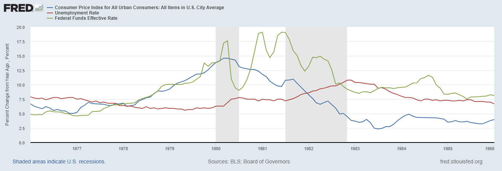
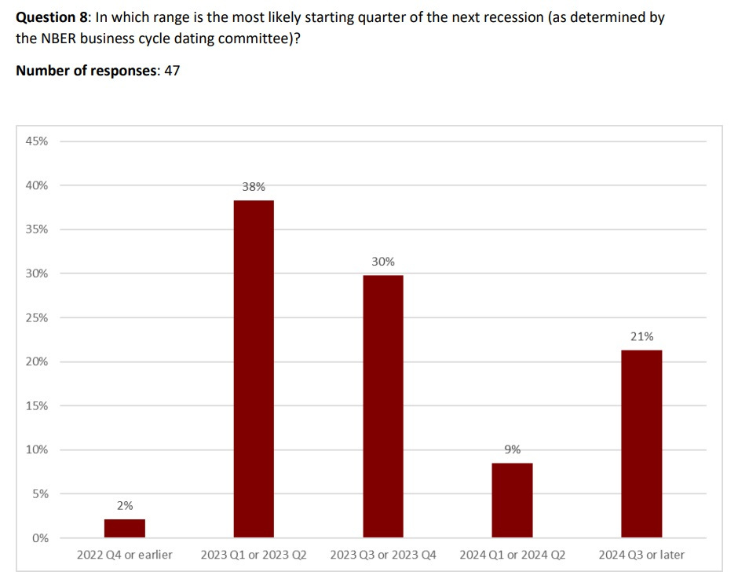
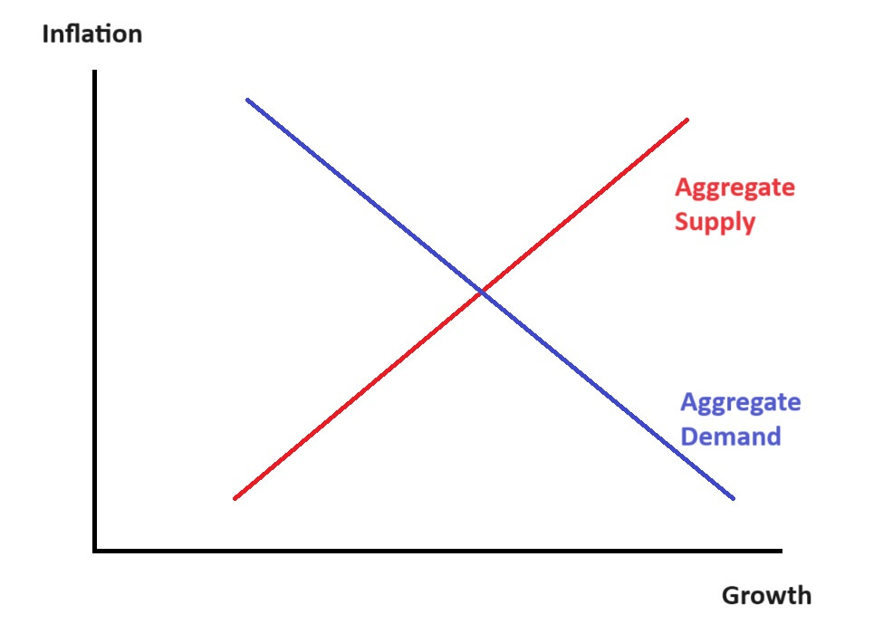
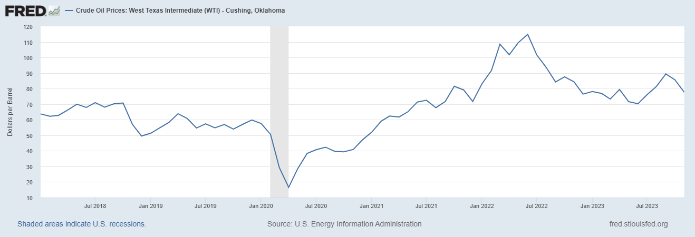
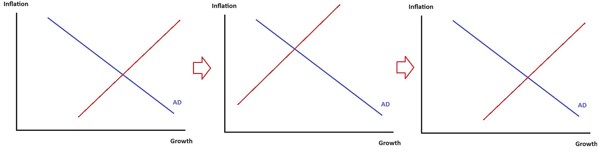
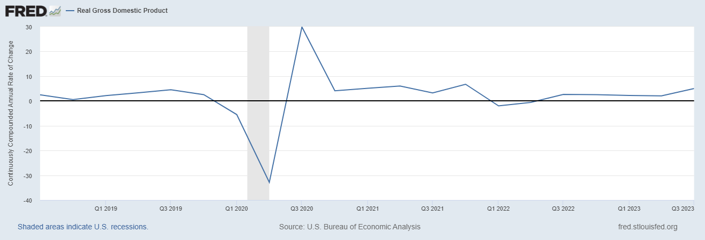
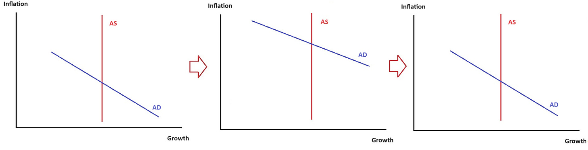
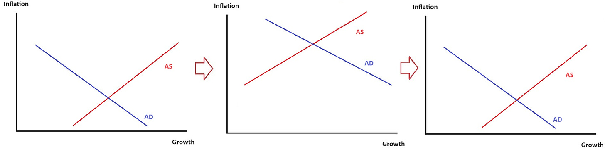
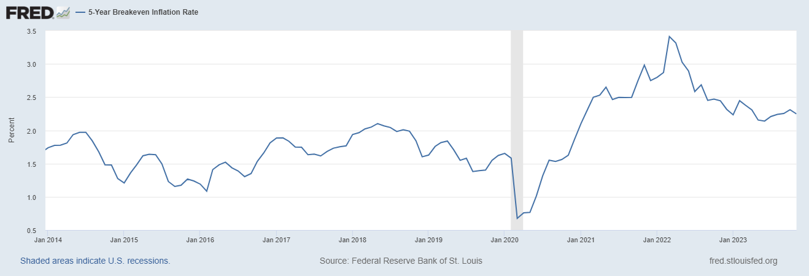

I was going to write about the [acquisition of U.S. Steel](https://www.reuters.com/markets/deals/japans-nippon-steel-plans-acquire-us-steel-7-bln-nikkei-2023-12-18/) today, but I ended up reading a whole lot about the history of the steel industry, so that’ll have to wait until tomorrow.  

我本来打算今天写美国钢铁公司的收购案，但我读了一大堆关于钢铁工业历史的书，所以只能等到明天了。  

In the meantime, here’s a quick post about macroeconomics.  

同时，这里有一篇关于宏观经济的简短文章。

At this point, most commentators agree that the U.S. is likely to achieve the elusive and much-sought-after “[soft landing](https://www.bloomberg.com/news/articles/2023-12-15/can-the-fed-achieve-a-soft-landing-and-avoid-a-recession)” — bringing inflation down without hurting employment or wages. In fact, this is actually a much _better_ outcome than what I personally would have called a “soft landing” — this is closer to what I’d have called “[immaculate disinflation](https://www.newyorker.com/news/our-columnists/economists-struggle-to-come-to-terms-with-immaculate-disinflation)”.  

在这一点上，大多数评论家都认为，美国有可能实现难以捉摸且备受追捧的 "软着陆"--在不损害就业或工资的情况下降低通胀。事实上，这比我个人所说的 "软着陆 "要好得多，更接近于我所说的 "无懈可击的通货紧缩"。

Economists generally think that there’s supposed to be a short-term tradeoff between inflation and unemployment.  

经济学家普遍认为，通胀和失业之间应该有一个短期的权衡。  

Basically, the way you’re supposed to bring inflation down is to throw a lot of people out of work, after which they stop buying as much stuff, which brings down demand, which lowers prices.  

基本上，降低通胀的方法就是让很多人失业，然后他们不再购买那么多东西，这就会降低需求，从而降低价格。  

That’s the “Old Keynesian” way of thinking, and depending on which models and which parameters you use, it’s how a lot of New Keynesian models work too.  

这就是 "旧凯恩斯主义 "的思维方式，根据你使用的模型和参数，很多新凯恩斯主义模型也是这样运作的。

This isn’t just theory, though — this is how it actually worked in the past.  

但这不仅仅是理论，这也是过去的实际运作方式。  

Here’s a picture of the years when Paul Volcker ended the inflation of the 1970s.  

下面是保罗-沃尔克（Paul Volcker）在 20 世纪 70 年代结束通货膨胀时的照片。  

You can see that Volcker hiked interest rates (green), which brought down inflation (blue), but also caused a big rise in unemployment (red):  

你可以看到，沃尔克提高了利率（绿色），从而降低了通货膨胀（蓝色），但同时也造成了失业率的大幅上升（红色）：

This was a “hard landing”.  

这是一次 "硬着陆"。  

And most economists thought that something similar would happen this time around.  

大多数经济学家认为，这次也会发生类似的情况。  

A survey of 47 economists in mid-2022 found that three-quarters believed a recession was coming before the start of 2024:  

2022 年年中对 47 位经济学家进行的一项调查发现，四分之三的人认为经济衰退将在 2024 年开始之前到来：

Source: [FT-IGM](https://www.kentclarkcenter.org/wp-content/uploads/2022/06/RESULTS-2022-06-06-Survey-05.pdf)  

来源：FT-IGM资料来源：FT-IGM

So why were the economists wrong, and how did we manage to pull off this feat?  

那么，为什么经济学家错了，我们又是如何完成这一壮举的呢？  

There are three basic theories.  

有三种基本理论。

This theory, endorsed by [Paul Krugman](https://twitter.com/paulkrugman/status/1717553303033196637) and some other basically Keynesian economists, is that the inflation of 2021-22 was caused mainly by temporary supply shocks, which faded over time.  

保罗-克鲁格曼（Paul Krugman）和其他一些基本上属于凯恩斯主义的经济学家所认可的这一理论认为，2021-22 年的通货膨胀主要是由暂时性的供给冲击造成的，这种冲击会随着时间的推移而逐渐消失。

Let’s remember our basic macroeconomic theory of aggregate supply and aggregate demand:  

让我们记住总供给和总需求的基本宏观经济理论：

Also, remember that [higher growth means lower unemployment](https://en.wikipedia.org/wiki/Okun%27s_law).  

另外，请记住，较高的经济增长意味着较低的失业率。

Anyway, after the pandemic we had a bunch of snarled supply chains, and then in early 2022 we got a rapid rise in oil prices from Putin’s invasion of Ukraine.  

总之，在大流行病之后，我们的供应链出现了一系列阻滞，然后在 2022 年初，普京入侵乌克兰导致油价迅速上涨。  

Then supply chain pressures started to ease in 2022 and were back to normal by the start of 2023:  

然后，供应链压力在 2022 年开始缓解，到 2023 年初恢复正常：

And oil prices fell in late 2022:  

2022 年底，油价下跌：

So basically, here’s what that sequence of events would look like in the simple AD-AS theory:  

基本上，在简单的 AD-AS 理论中，这一系列事件会是这样的：

Basically, supply bounces back and forth and ends up where it was before.  

基本上，供应量反反复复，最后回到原来的水平。  

Inflation is temporarily higher and growth is temporarily lower, and then everything goes back to how it was.  

通胀暂时走高，增长暂时走低，然后一切又回到原点。

The problem with this theory is…growth didn’t really slow much.  

这一理论的问题在于......经济增长并没有真正放缓。  

It wobbled for a couple of quarters in early 2022, but not enough for a recession to be called:  

在 2022 年初的几个季度里，经济增长出现了摇摆，但还不足以被称为衰退：

But supply chains were very stressed out in 2021, and oil prices had already begun rising.  

但 2021 年的供应链压力很大，油价已经开始上涨。  

Why was growth so strong in 2021? Even if you assume that aggregate demand is very inelastic (i.e.  

2021 年的增长为何如此强劲？即使假设总需求非常缺乏弹性（即  

that the blue line on the diagram I drew goes straight up and down), it’s hard to explain why 2021 was such a boom year, if the only thing happening was a negative supply shock.  

我画的图中的蓝线直上直下），也很难解释为什么 2021 年是如此繁荣的一年，如果唯一发生的事情是负供应冲击的话。

The other problem with the Long Transitory theory is that it means the Fed’s power to affect either inflation _or_ the real economy is very limited.  

长期过渡理论的另一个问题是，它意味着美联储影响通胀或实体经济的力量非常有限。  

If raising interest rates from 0% to 5% and massively increasing the federal budget deficit basically does nothing to aggregate demand, it calls into question the whole power of Keynesian stabilization policy.  

如果把利率从 0% 提高到 5%，并大规模增加联邦预算赤字，基本上对总需求没有任何影响，那么凯恩斯主义稳定政策的全部力量就会受到质疑。  

Long Transitory is basically a theory of Fed irrelevance.  

长期过渡期》基本上是一种美联储无关性理论。

The theory of [Real Business Cycles](https://en.wikipedia.org/wiki/Real_business-cycle_theory) (RBC) is actually a lot more complex than the way I’m going to describe it right here, but I think this gets the most simple version across.  

实际商业周期（RBC）理论实际上要比我在这里描述的复杂得多，但我认为这是最简单的版本。

Basically, in the context of this simple model, you can think of RBC as saying that aggregate supply moves around on its own — that no matter what happens to aggregate demand, the economy simply produces as much as it’s going to produce.  

基本上，在这个简单的模型中，你可以把 RBC 看作是总供给自己在移动--无论总需求发生什么变化，经济生产多少就是多少。  

In that case, the only thing that aggregate demand can do is to affect prices. In在这种情况下，总需求唯一能做的就是影响价格。在 [the words这就是说](https://www.themoneyillusion.com/updating-prior-beliefs/) of Ed Prescott, the inventor of RBC theory, this means that monetary and fiscal policy are “as effective in bringing prosperity as rain dancing is in bringing rain” — you can print money and lend money and hand out government checks, but all it’ll do is pump up inflation.  

RBC 理论的发明者埃德-普雷斯科特（Ed Prescott）认为，这意味着货币政策和财政政策 "在带来繁荣方面的作用，就像雨舞在带来雨水方面的作用一样"--你可以印钞、放贷、发放政府支票，但这只会加剧通货膨胀。

So the RBC story of 2021-2023 would be something like this: In 2020-21, the Fed lowered interest rates to zero and did a ton of quantitative easing and lent out a bunch of money, and the government also [ran a huge deficit](https://fred.stlouisfed.org/series/FYFSGDA188S#). But in 2022 it largely stopped doing those things.  

因此，2021-2023 年的 RBC 故事应该是这样的：在 2020-21 年，美联储将利率降至零，实施了大量的量化宽松政策，借出了一大笔钱，政府也出现了巨额赤字。但到了 2022 年，政府基本上不再做这些事了。  

This created a transitory increase in inflation that eventually ended.  

这造成了通货膨胀的短暂上升，但最终还是结束了。  

But it basically did nothing to the real economy, because in RBC-world, monetary and fiscal policy但这对实体经济基本上没有任何影响，因为在 RBC 世界中，货币和财政政策 _never从不_ affect the real economy.  

影响实体经济。

In the context of our little AD-AS graph, here’s what that would look like:  

在我们的 AD-AS 小图中，这看起来是这样的：

In this explanation, the Fed made a big mistake — it should have simply sat there and let the free market do its thing, instead of pumping up inflation.  

在这个解释中，美联储犯了一个大错--它本应只是坐在那里，让自由市场做自己的事情，而不是刺激通胀。

The weakness of this theory is that while it fits the basic facts of 2021-23, it doesn’t fit past experience.  

这一理论的弱点在于，它虽然符合 2021-23 年的基本事实，却不符合过去的经验。  

Volcker’s interest rate hikes really did seem to raise unemployment to quite a high level.  

沃尔克的加息似乎确实将失业率提高到了相当高的水平。  

And lots of quantitative research has found that大量定量研究发现 [monetary金钱](https://eml.berkeley.edu/~enakamura/teaching/MonetaryNonNeutralitySlides.pdf) and [fiscal财政](https://www.imf.org/external/pubs/ft/tnm/2014/tnm1404.pdf) policy really do have an impact on the real economy.  

政策确实会对实体经济产生影响。

So if RBC explains 2021-2023, it’s a mystery as to why it worked this time when it hasn’t worked other times.  

因此，如果 RBC 能解释 2021-2023 年的情况，那么为什么这次能成功，而其他时候却不行，这就是一个谜。

The first two theories relied on the idea that only one important thing happened to the U.S. economy in 2021-23. But what if two important things happened?  

前两种理论所依赖的观点是，2021-23 年美国经济只发生了一件大事。但如果发生了两件大事呢？  

What if there was a transitory demand shock如果出现短暂的需求冲击 _and_ a transitory supply shock?  

短暂的供应冲击？

Under this “all of the above” explanation, the story goes like this:  

根据这种 "以上皆是 "的解释，故事是这样的：

1.  In 2020-21, the government printed a lot of money and lent a lot of money and borrowed a lot of money, pumping up aggregate demand.  
    
    2020-21 年，政府大量印钞、大量放贷、大量借贷，刺激了总需求。  
    
    But in early 2022 this ended.  
    
    但在 2022 年初，这种情况结束了。
    
2.  In 2021-22, supply chains got stressed, and oil prices rose. But in late 2022 this ended.  
    
    2021-22 年，供应链压力增大，石油价格上涨。但这种情况在 2022 年底结束。
    
3.  By 2023, both supply and demand were back to normal.  
    
    到 2023 年，供应和需求都恢复了正常。
    

In the context of our little AD-AS model, here’s what that looks like:  

在我们的小 AD-AS 模型中，情况是这样的：

Basically, inflation rises and then falls (leaving prices permanently higher than before), while growth isn’t really affected.  

基本上，通胀先升后降（使价格长期高于之前的水平），而经济增长并没有受到真正的影响。

That…kind of looks like what happened!  

这......看起来就像发生了什么！  

And in fact, the differential timing of the demand and supply shocks can even explain why growth was strong in 2021 and stumbled a bit in early 2022 — the negative supply shocks came a little later than the positive demand shocks, so in early 2022 the economy was hit by oil prices even as government was no longer giving things a boost.  

事实上，需求和供给冲击的不同时间点甚至可以解释为什么 2021 年的经济增长强劲，而 2022 年初的经济增长却有些踉跄--负面的供给冲击比正面的需求冲击来得晚一些，因此在 2022 年初，即使政府不再提振经济，经济也受到了油价的冲击。

So this theory is _very_ good at explaining what happened over the last three years.  

因此，这一理论很好地解释了过去三年发生的事情。  

The problem is that it’s not very parsimonious.  

问题是，这并不十分合理。  

The great scientist John von Neumann is said to have remarked “with four free parameters I can fit an elephant, with five I can wiggle his trunk”.  

据说伟大的科学家约翰-冯-诺依曼曾说过："有四个自由参数，我就能装下一头大象，有五个自由参数，我就能摆动它的躯干"。  

We reward theories for being simple, because complex theories make things too easy.  

我们奖励简单的理论，因为复杂的理论会让事情变得太简单。

But that said, sometimes the real world just _isn’t_ parsimonious.  

但话虽如此，现实世界有时并不吝啬。  

A macroeconomy is a very complex thing, with a lot of moving parts, and everything tends to happen all at once.  

宏观经济是一个非常复杂的东西，其中有很多活动的部分，而且所有事情往往都是同时发生的。  

So maybe 2021-23 just因此，也许 2021-23 年只是 _isn’t不是_ a simple story at all, much as we might prefer it to be one.  

尽管我们可能更希望它是一个简单的故事。

Note that in this explanation, the Fed might have made a mistake in 2020-21. This hybrid theory holds that the Fed boosted growth at the price of causing more inflation, and whether that was a good tradeoff depends on which of those things you care about more.  

请注意，在这种解释中，美联储可能在 2020-21 年犯了一个错误。这种混合理论认为，美联储以导致更多通胀为代价推动了经济增长，而这是否是一个好的权衡，取决于你更关心哪件事。  

But _in 2022  

2022年_, according to this theory, the Fed did根据这一理论，美联储确实 _exactly the right thing正中下怀_ — it reduced aggregate demand just as aggregate supply was righting itself, leading to lower inflation without slower growth.  

\- 它减少了总需求，而此时总供给正在恢复正常，从而降低了通胀率，却没有减缓增长速度。

There’s one more theory I should mention here — the theory of _expectations_.  

这里我还应该提到一个理论--期望理论。

Modern macroeconomic models aren’t usually as simple as the little AD-AS graphs I drew above.  

现代宏观经济模型通常不像我上面画的 AD-AS 小图那么简单。  

One way they’re more complex is that they allow for a big role for它们更复杂的一个原因是，它们让 _expectations  

期望_. In these models, if people believe that Fed policy will be very.在这些模型中，如果人们认为美联储的政策将非常 _dovish宽松_ toward inflation in the future, they raise their prices today, and inflation goes up.  

为了应对未来的通胀，他们今天提高价格，通胀就会上升。  

But if people believe that the Fed will be但如果人们相信美联储将 _hawkish鹰派_ in the future, they’ll expect lower inflation, and they won’t raise prices today, and inflation will go down.  

在未来，他们会预期通胀会降低，今天就不会涨价，通胀就会下降。

According to [this theory](https://www.federalreserve.gov/econres/feds/files/2022079pap.pdf) — which macroeconomist Ricardo Reis [used in September 2022](https://twitter.com/R2Rsquared/status/1569704171057647616) to successfully predict a fall in inflation — the Fed can get something close to immaculate disinflation if it can manage expectations effectively.  

根据这一理论--宏观经济学家里卡多-雷斯（Ricardo Reis）曾在 2022 年 9 月利用这一理论成功预测了通胀率的下降--美联储如果能有效管理预期，就能实现接近完美的通货紧缩。  

And as a bonus, expectational effects另外，预期效应 [happen fast飞快发生](https://www.noahpinion.blog/p/is-the-fed-hiking-too-fast) — they don’t have to filter through a years-long chain of causality, from high rates to high unemployment to lower consumer spending to lower prices.  

\- 他们不必经过长达数年的因果链条过滤，从高利率到高失业率，再到消费支出减少，再到价格下降。

In other words, according to expectations management theory, Fed rate hikes in 2022 convinced the country that the spirit of Paul Volcker still animates the institution, and that high inflation will simply _not_ be allowed to persist, then perhaps the Fed beat inflation without having to raise rates so high that they threw people out of work.  

换句话说，根据预期管理理论，美联储在 2022 年的加息让全国人民相信，保罗-沃尔克的精神仍然激励着美联储，高通胀根本不会被允许持续下去，那么美联储或许就能战胜通胀，而不必将利率提高到让人们失业的程度。  

So in this story, as in the previous one, the Fed did a great job in 2022.  

因此，在这个故事中，与前一个故事一样，美联储在 2022 年做得非常出色。

How plausible is this story?  

这个故事有多可信？  

We can observe the financial market’s inflation expectations directly, by looking at the 5-year breakeven.  

我们可以通过观察 5 年的盈亏平衡点来直接观察金融市场的通胀预期。  

This shows that inflation expectations rose strongly in 2021, then spiked even higher in early 2022 before falling to only a little higher than their pre-pandemic average:  

这表明，通胀预期在 2021 年强劲上升，然后在 2022 年初飙升得更高，之后又回落到仅略高于大流行前的平均水平：

Reis [has argued](https://personal.lse.ac.uk/reisr/papers/22-whypi.pdf) that the true impact of expectations was even bigger than what this graph might suggest, because it contained considerable skewness — there were a lot of people who were paying a lot of money to hedge against _very_ high inflation. (There could be other reasons for that pattern, but it’s suggestive.)  

雷斯认为，预期的真实影响比这张图可能显示的还要大，因为它包含了相当大的偏度--有很多人花了很多钱来对冲非常高的通胀。(这种模式可能有其他原因，但这只是一种暗示）。

But although this pattern might seem roughly consistent with the expectations story, alternative explanations are also possible — for example, maybe expectations just follow actual inflation, and don’t matter much at all.  

不过，尽管这种模式似乎与预期说大致相符，但也有可能存在其他解释--例如，也许预期只是跟随实际通胀，根本不重要。  

As usual in macroeconomics, it’s pretty hard to prove what’s causing what.  

在宏观经济学中，通常很难证明是什么导致了什么。

So anyway, those are the four basic simple theories of how the U.S. achieved a soft landing.  

总之，这就是关于美国如何实现软着陆的四个基本简单理论。  

You can choose for yourself which set of assumptions you find the most plausible here, and decide which theory is your favorite.  

你可以在这里自行选择你认为最合理的假设，并决定哪个理论是你的最爱。  

As for me, I’m just glad it all worked out.  

至于我，我只是很高兴一切都解决了。

[Share  

分享](https://www.noahpinion.blog/p/how-did-the-us-achieve-a-soft-landing?utm_source=substack&utm_medium=email&utm_content=share&action=share)
