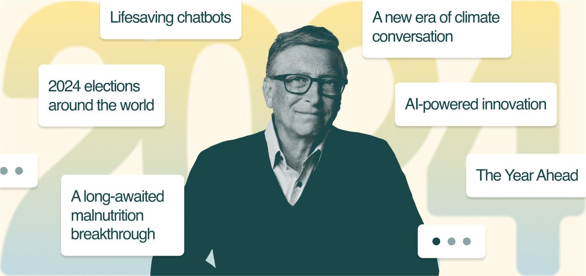
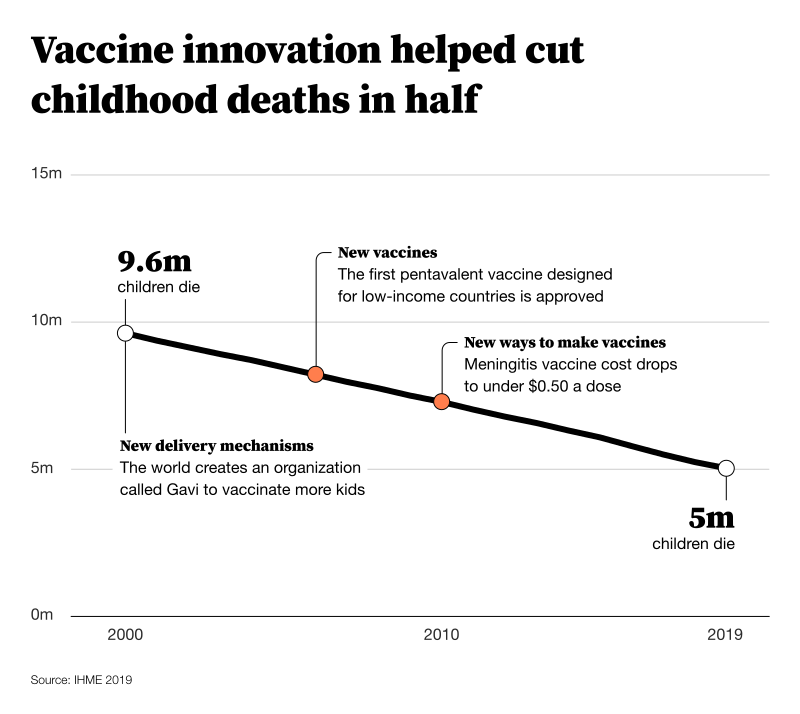
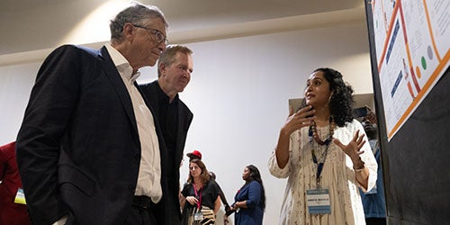
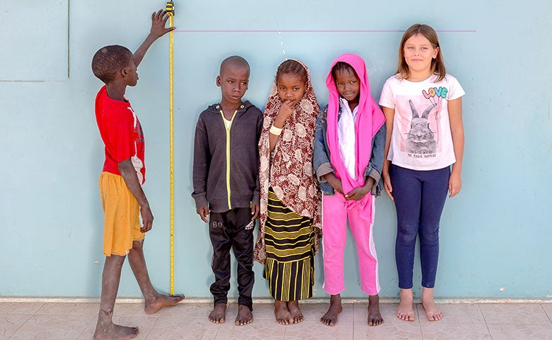
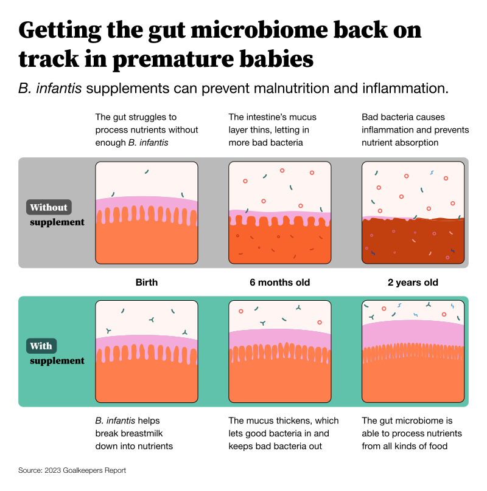
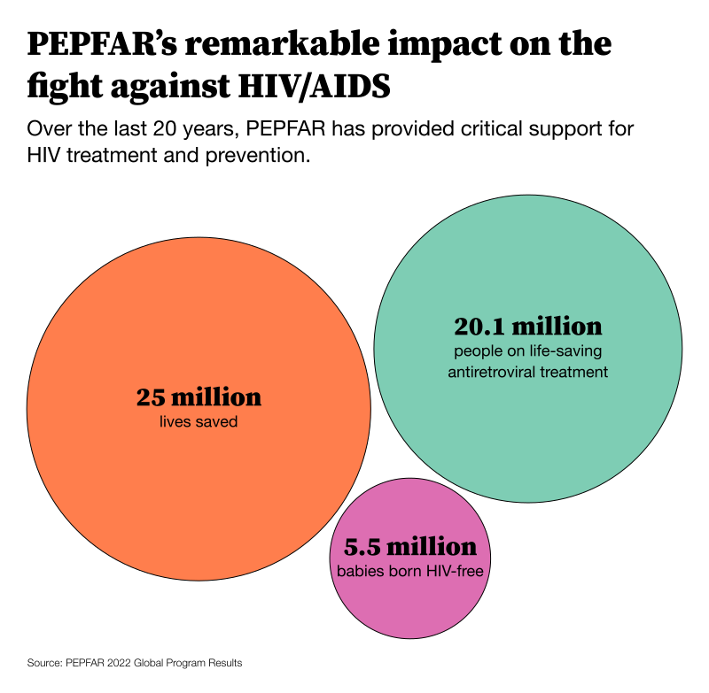
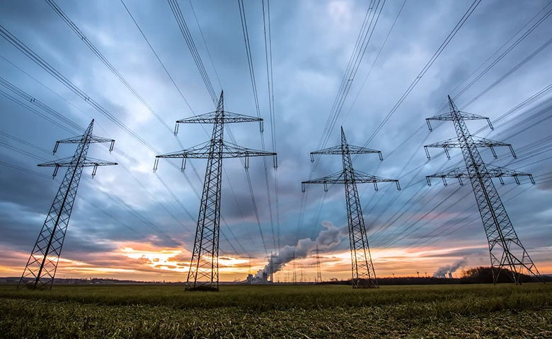
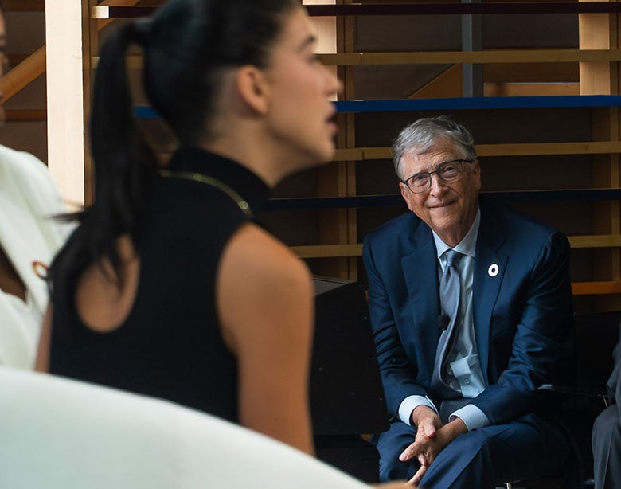

The road ahead reaches a turning point in 2024  

未来之路在 2024 年迎来转折点

This year signaled the start of a new era.  

今年标志着一个新时代的开始。  

Here’s why I believe next year is an opportunity to shape the world’s next chapter for the better.  

因此，我认为明年是塑造世界美好下一篇章的契机。

|

December 19, 20232023 年 12 月 19 日 22 minute read

When you think back on 2023, how will you remember it?  

当你回想起 2023 年时，你会如何回忆？

For me, this will always be the year I became a grandparent.  

对我来说，今年永远是我成为祖父母的一年。  

It will be the year I spent a lot of precious time with loved ones—whether on the pickleball court or over a rousing game of Settlers of Catan.  

在这一年里，我花了很多宝贵的时间与所爱的人在一起--无论是在皮球场上，还是在热闹的《卡坦岛定居者》游戏中。  

And 2023 marked the first time I used artificial intelligence for work and other serious reasons, not just to mess around and create parody song lyrics for my friends.  

2023 年标志着我第一次将人工智能用于工作和其他正经事，而不仅仅是为了给朋友们创作模仿歌词。

This year gave us a glimpse of [how AI will shape the future](https://www.gatesnotes.com/The-Age-of-AI-Has-Begun), and as 2023 comes to a close, I’m thinking more than ever about the world today’s young people will inherit. In [last year’s letter](https://www.gatesnotes.com/The-Year-Ahead-2023), I wrote about how the prospect of becoming a grandparent made me reflect on the world my granddaughter will be born into.  

今年，我们看到了人工智能将如何塑造未来，而随着 2023 年的到来，我比以往任何时候都更加关注今天的年轻人将继承的世界。在去年的信中，我写到了成为祖父母的前景如何让我反思我的孙女即将出生的世界。  

Now I’m thinking more about the world she will inherit and what it will be like decades from now, when her generation is in charge.  

现在，我更多考虑的是她将继承的世界，以及几十年后，当她这一代人掌权时，这个世界会是什么样子。

I can begin to picture it: the tools she will use, the ways she will stay in touch with her loved ones, the problems these innovations will help solve.  

我可以开始想象：她将使用的工具，她与亲人保持联系的方式，这些创新将帮助解决的问题。  

We now have a better sense of what types of jobs AI will be able to do by itself and which ones it will serve as a copilot for.  

现在，我们对人工智能能够独立完成哪些类型的工作，以及它将作为副驾驶员完成哪些工作有了更好的认识。  

And it’s clearer than ever how AI can be used to improve access to education, mental health, and more.  

现在比以往任何时候都更清楚，如何利用人工智能来改善教育、心理健康等方面的机会。  

It motivates me to make sure this technology helps reduce—and doesn’t contribute to—the awful inequities we see around the world.  

这促使我确保这项技术有助于减少--而不是助长--我们在世界各地看到的可怕的不平等现象。  

I've always been a firm believer in the power of innovation to offer every child an equal chance to survive and thrive.  

我一直坚信创新的力量，它能为每个孩子提供平等的生存和发展机会。  

AI is no exception.  

人工智能也不例外。

The early years of a new age are often marked by lots of changes.  

新时代的最初几年往往充满变化。  

If you are old enough to remember, think back to the beginning of the internet.  

如果您还记得，请回想一下互联网诞生之初的情景。  

At first, you probably didn’t know many people who were using it.  

起初，你可能不知道有多少人在使用它。  

But it became more common over time until, one day, you realized most people had email addresses, bought things online, and used search engines to answer their questions.  

但随着时间的推移，这种情况变得越来越普遍，直到有一天，你发现大多数人都有电子邮件地址，在网上买东西，并使用搜索引擎来回答他们的问题。

I loved getting to know my new granddaughter this year.  

我很高兴今年能认识我的新孙女。

We are just at the beginning of this transition right now.  

我们现在刚刚开始这种转变。  

This is an exciting and confusing time, and if you haven’t figured out how to make the best use of AI yet, you are not alone.  

这是一个令人兴奋而又困惑的时代，如果你还没有想好如何更好地利用人工智能，那么你并不孤单。  

I thought I would use AI tools for the foundation’s strategy reviews this year, which require reading hundreds of pages of briefing materials that an AI could accurately summarize for me.  

今年，我想在基金会的战略审查中使用人工智能工具，这需要阅读数百页的简报材料，而人工智能可以准确地为我总结。  

But old habits are hard to break, and I ended up preparing for them the same way I always do.  

但旧习难改，我最终还是按照往常的方式做了准备。

Of course, AI is far from the only defining feature of 2023. Millions continue to experience unbearable grief as a result of Russia’s war on Ukraine and in the aftermath of the war in Ethiopia.  

当然，人工智能远非 2023 年的唯一特征。俄罗斯对乌克兰发动的战争以及埃塞俄比亚战争的余波仍使数百万人承受着难以承受的悲痛。  

My heart is broken for the continued suffering of Israelis and Palestinians, as well as for the people of Sudan.  

我为以色列人和巴勒斯坦人以及苏丹人民继续遭受苦难而心碎。  

At the same time, more people are being forced to endure hardship as a result of more frequent extreme weather events caused by climate change.  

与此同时，由于气候变化导致极端天气事件更加频繁，更多的人被迫忍受苦难。  

And families around the world continue to be hit hard by rising inflation and slow economic growth.  

世界各地的家庭继续受到通货膨胀加剧和经济增长放缓的沉重打击。

There’s no question these are challenging times, but I remain optimistic about the future.  

毫无疑问，这是一个充满挑战的时代，但我对未来依然保持乐观。  

The speed of innovation has never been faster.  

创新的速度前所未有。  

We’re making big strides on tough problems—like Alzheimer’s, obesity, and sickle cell disease—that will improve the lives of millions of people.  

我们在阿尔茨海默氏症、肥胖症和镰状细胞病等棘手问题上取得了长足进步，这将改善数百万人的生活。  

My friend the late Hans Rosling used to say that “things can be bad _and_ getting better.” It’s a good reminder that progress is not only possible but happening every day.  

我的朋友、已故的汉斯-罗斯林（Hans Rosling）曾说过，"事情可能很糟糕，但也可能越来越好"。这句话很好地提醒我们，进步不仅是可能的，而且每天都在发生。

The team at CAPRISA in South Africa is using data to improve treatments for patients infected with both HIV and tuberculosis.  

南非 CAPRISA 的团队正在利用数据改进对同时感染艾滋病毒和结核病患者的治疗。

A Ugandan nurse examines a participant’s test during a clinical trial for an HIV vaccine.  

在一项艾滋病疫苗临床试验中，一名乌干达护士正在检查一名受试者的化验结果。  

(Luke Dray/ Getty)  

(卢克-德雷/盖蒂）

That’s why I remain dedicated to making sure that, even in the face of setbacks, the world continues to do more to help the poorest people.  

这就是为什么我仍然致力于确保，即使面对挫折，世界也会继续做更多的事情来帮助最贫穷的人。  

I do the bulk of this work through the [Gates Foundation](https://www.gatesfoundation.org/), where my colleagues remain dedicated to improving global health, education, gender equality, and more.  

我的大部分工作都是通过盖茨基金会完成的，我的同事们仍然致力于改善全球健康、教育、性别平等等方面的状况。  

While I could write a thousand pages about the incredible work they’re doing with our partners, this letter focuses on just a few of the most exciting breakthroughs.  

虽然我可以写上几千页的篇幅来介绍他们与我们的合作伙伴所做的令人难以置信的工作，但这封信只集中介绍其中最令人兴奋的几项突破。

I also write about why I’m optimistic about the world’s climate progress.  

我还写了我对世界气候进展持乐观态度的原因。  

Most of my climate and energy work is done through [Breakthrough Energy](https://breakthroughenergy.org/), although the Gates Foundation is helping people in low- and middle-income countries adapt to a warming world.  

我的大部分气候和能源工作都是通过 "突破能源 "完成的，不过盖茨基金会也在帮助中低收入国家的人们适应气候变暖的世界。  

I also continue to privately fund research into other areas like Alzheimer’s disease.  

我还继续为阿尔茨海默病等其他领域的研究提供私人资助。  

And I still get to advise Microsoft, which gives me insight into what’s coming down the pipeline and how it can be used to make the world a more equitable place.  

我还在为微软公司提供建议，这让我能够深入了解即将推出的产品，以及如何利用这些产品让世界变得更加公平。

I’m lucky that my work gives me insight into all the ways the world is getting better.  

我很幸运，我的工作让我洞察到世界变得更好的方方面面。  

The challenges we face feel a lot less daunting when you understand what exactly it will take to tackle them.  

当你了解了应对这些挑战的具体方法后，我们所面临的挑战就不那么令人生畏了。  

In this letter, I will share just a few reasons I am optimistic about the year ahead.  

在这封信中，我将与大家分享我对未来一年感到乐观的几个原因。  

I hope they make you as excited about all the progress to come as I am.  

我希望它们能让你们和我一样，对即将取得的所有进展感到兴奋。

## AI is about to supercharge the innovation pipeline.  

人工智能即将为创新管道注入超级动力。

My work has always been rooted in a core idea: Innovation is the key to progress.  

我的工作始终植根于一个核心理念：创新是进步的关键。  

It’s why I started Microsoft, and it’s why Melinda and I started the Gates Foundation more than two decades ago.  

这是我创办微软的原因，也是二十多年前我和梅琳达创办盖茨基金会的原因。

Innovation is the reason our lives have improved so much over the last century.  

创新是我们的生活在上个世纪得到极大改善的原因。  

From electricity and cars to medicine and planes, innovation has made the world better.  

从电力和汽车到医药和飞机，创新让世界变得更加美好。  

Today, we are far more productive because of the IT revolution.  

今天，由于信息技术革命，我们的生产力大大提高。  

The most successful economies are driven by innovative industries that evolve to meet the needs of a changing world.  

最成功的经济体都是由创新型产业推动的，这些产业不断发展，以满足不断变化的世界的需求。

My favorite innovation story, though, starts with one of my favorite statistics: Since 2000, the world has cut in half the number of children who die before the age of five.  

不过，我最喜欢的创新故事要从我最喜欢的一个统计数据说起：自 2000 年以来，全世界五岁前死亡儿童的数量减少了一半。

How did we do it? One key reason was innovation.  

我们是如何做到的？一个重要原因就是创新。  

Scientists came up with new ways to make vaccines that were faster and cheaper but just as safe.  

科学家们想出了更快、更便宜但同样安全的疫苗制造新方法。  

They developed new delivery mechanisms that worked in the world’s most remote places, which made it possible to reach more kids.  

他们开发了在世界上最偏远的地方也能发挥作用的新的交付机制，从而使更多的孩子能够受益。  

And they created new vaccines that protect children from deadly diseases like rotavirus.  

他们还创造了新疫苗，保护儿童免受轮状病毒等致命疾病的侵袭。

In a world with limited resources, you have to find ways to maximize impact.  

在资源有限的世界里，你必须想方设法最大限度地发挥影响力。  

Innovation is the key to getting the most out of every dollar spent.  

创新是让每一分钱发挥最大效益的关键。  

And artificial intelligence is about to accelerate the rate of new discoveries at a pace we’ve never seen before.  

人工智能将以前所未有的速度加快新发现的速度。

One of the biggest impacts so far is on creating new medicines.  

迄今为止，最大的影响之一是创造新药。  

Drug discovery requires combing through massive amounts of data, and AI tools can speed up that process significantly.  

药物发现需要梳理海量数据，而人工智能工具可以大大加快这一过程。  

Some companies are already working on cancer drugs developed this way.  

一些公司已经在研发这种抗癌药物。  

But a key priority of the Gates Foundation in AI is ensuring these tools also address health issues that disproportionately affect the world's poorest, like AIDS, TB, and malaria.  

但是，盖茨基金会在人工智能领域的一个重要优先事项是确保这些工具也能解决艾滋病、结核病和疟疾等严重影响世界最贫困人口的健康问题。

We’re taking a hard look at the wide array of AI innovation in the pipeline right now and working with our partners to use these technologies to improve lives in low- and middle-income countries.  

我们正在认真研究目前正在进行的大量人工智能创新，并与我们的合作伙伴合作，利用这些技术改善中低收入国家的生活。

In the fall, I [traveled to Senegal](https://www.gatesnotes.com/Grand-Challenges-innovations-in-Senegal) to meet with some of the incredible researchers doing this work and to celebrate the 20th anniversary of the foundation’s Grand Challenges initiative.  

秋天，我前往塞内加尔，会见了一些从事这项工作的出色研究人员，并庆祝基金会 "大挑战 "计划 20 周年。  

When we first launched [Grand Challenges](https://gcgh.grandchallenges.org/)—the Gates Foundation’s flagship innovation program—it had a single goal: Identify the biggest problems in health and give grants to local researchers who might solve them.  

当我们首次启动盖茨基金会的旗舰创新项目--"大挑战 "时，它只有一个目标：找出健康领域最大的问题，并向有可能解决这些问题的当地研究人员提供资助。  

We asked innovators from developing countries how they would address health challenges in their communities, and then we gave them the support to make it happen.  

我们询问发展中国家的创新者将如何应对其所在社区的健康挑战，然后我们为他们提供支持，使其得以实现。

Many of the people I met in Senegal were taking on the first-ever [AI Grand Challenge](https://gcgh.grandchallenges.org/challenge/catalyzing-equitable-artificial-intelligence-ai-use).  

我在塞内加尔遇到的许多人都在参加首次人工智能大挑战。  

The foundation didn’t have AI projects in mind when we first set that goal back in 2003, but I’m always inspired by how brilliant scientists are able to take advantage of the latest technology to tackle big problems.  

早在 2003 年，我们首次设定这一目标时，基金会并没有考虑人工智能项目，但杰出的科学家们如何利用最新技术解决重大问题，一直激励着我。

It was great to learn from Amrita Mahale about how the team at ARMMAN is developing an AI chatbot to improve health outcomes for pregnant women.  

很高兴能从 Amrita Mahale 那里了解到阿尔曼团队如何开发人工智能聊天机器人，以改善孕妇的健康状况。

Much of their work is in the earliest stages of development—there’s a good chance we won’t see any of them used widely in 2024 or even 2025. Some might not even pan out at all.  

他们的许多工作都处于最早期的开发阶段--我们很有可能在 2024 年甚至 2025 年都看不到他们中的任何一个被广泛使用。有些甚至根本不会成功。  

The work that will be done over the next year is setting the stage for a massive technology boom later this decade.  

明年的工作将为本十年晚些时候的大规模技术繁荣奠定基础。

Still, it’s impressive to see how much creativity is being brought to the table.  

尽管如此，我们仍能看到如此多的创意，令人印象深刻。  

Here is a small sample of some of the most ambitious questions currently being explored:  

以下是目前正在探索的一些最雄心勃勃的问题的一小部分：

-   **Can AI combat antibiotic resistance?** Antibiotics are magical in their ability to end infection, but if you use them too often, pathogens can learn how to ignore them.  
    
    人工智能能否消除抗生素耐药性？抗生素具有终结感染的神奇功效，但如果使用过于频繁，病原体就会学会如何忽视它们。  
    
    This is called antimicrobial resistance, or AMR, and it is a huge issue around the world—especially in Africa, which has the highest mortality rates from AMR. Nana Kofi Quakyi from the Aurum Institute in Ghana is working on an AI-powered tool that helps health workers prescribe antibiotics without contributing to AMR. The tool will comb through all the available information—including local clinical guidelines and health surveillance data about which pathogens are currently at risk of developing resistance in the area—and make suggestions for the best drug, dosage, and duration.  
    
    这就是所谓的抗菌药耐药性（AMR），它是全世界的一个大问题，尤其是在非洲，因为非洲的抗菌药耐药性死亡率最高。加纳 Aurum 研究所的纳纳-科菲-夸基伊（Nana Kofi Quakyi）正在开发一种人工智能工具，帮助卫生工作者在开具抗生素处方时避免造成 AMR。该工具将梳理所有可用信息，包括当地临床指南和健康监测数据，了解哪些病原体目前在该地区有产生耐药性的风险，并就最佳药物、剂量和疗程提出建议。
-   **Can AI bring personalized tutors to every student?** The AI education tools being piloted today are mind-blowing because they are tailored to each individual learner.  
    
    人工智能能否为每个学生提供个性化辅导？如今正在试行的人工智能教育工具令人耳目一新，因为它们是为每个学习者量身定制的。  
    
    Some of them—like [Khanmigo](https://www.khanacademy.org/khan-labs) and [MATHia](https://www.carnegielearning.com/solutions/math/mathia/)—are already remarkable, and they’ll only get better in the years ahead.  
    
    其中一些项目（如 Khanmigo 和 MATHia）已经非常出色，而且在未来几年里只会更好。  
    
    One of the things that excites me the most about this type of technology is the possibility of localizing it to every student, no matter where they live.  
    
    这类技术最让我兴奋的一点是，无论学生住在哪里，都有可能将其本地化。  
    
    For example, a team in Nairobi is working on [Somanasi](https://kytabu.africa/somanasi/), an AI-based tutor that aligns with the curriculum in Kenya.  
    
    例如，内罗毕的一个团队正在开发 Somanasi，这是一款基于人工智能的辅导软件，与肯尼亚的课程相吻合。  
    
    The name means “learn together” in Swahili, and the tutor has been designed with the cultural context in mind so it feels familiar to the students who use it.  
    
    这个名字在斯瓦希里语中的意思是 "一起学习"，辅导员的设计考虑到了文化背景，因此使用它的学生感觉很熟悉。

Students interact with an AI tutor in a classroom in Nairobi, Kenya.  

在肯尼亚内罗毕的一间教室里，学生与人工智能辅导员互动。

Tonee Ndungu—whose team is developing Somanasi—shows off the latest version of their personalized education tutor.  

托尼-恩东古（Tonee Ndungu）--他的团队正在开发 Somanas--展示他们最新版本的个性化教育辅导软件。

-   **Can AI help treat high-risk pregnancies**? A woman dies in childbirth every two minutes.  
    
    人工智能能否帮助治疗高危妊娠？每两分钟就有一名妇女死于分娩。  
    
    That’s a horrifying statistic, but I’m hopeful that AI can help. Last year, I [wrote about](https://www.gatesnotes.com/The-Year-Ahead-2023#ALChapter6) how AI-powered ultrasounds could help identify pregnancy risks.  
    
    这是一个可怕的统计数据，但我希望人工智能能有所帮助。去年，我曾写过一篇关于人工智能驱动的超声波检查如何帮助识别怀孕风险的文章。  
    
    This year, I was excited to meet some of the researchers at [ARMMAN](https://armman.org/), who hope to use artificial intelligence to improve the odds for new mothers in India.  
    
    今年，我很高兴能见到阿尔曼（ARMMAN）的一些研究人员，他们希望利用人工智能提高印度新妈妈的胜算。  
    
    Their large language model will one day act as a copilot for health workers treating high-risk pregnancies.  
    
    有朝一日，他们的大型语言模型将成为医护人员治疗高危妊娠的副驾驶员。  
    
    It can be used in both English and Telugu, and the coolest part is that it automatically adjusts to the experience level of the person using it—whether you’re a brand-new nurse or a midwife with decades of experience.  
    
    它既可以用英语也可以用泰卢固语，最酷的是它可以根据使用者的经验水平自动调整--无论你是一名新护士还是一名有几十年经验的助产士。
-   **Can AI help people assess their risk for HIV?** For many people, talking to a doctor or nurse about their sexual history can be uncomfortable.  
    
    人工智能可以帮助人们评估感染艾滋病毒的风险吗？对许多人来说，向医生或护士谈论自己的性史可能会让他们感到不舒服。  
    
    But this information is super important for assessing risk for diseases like HIV and prescribing preventive treatments.  
    
    但是，这些信息对于评估艾滋病等疾病的风险和开具预防性治疗处方来说，却是超级重要的。  
    
    A new South African chatbot aims to make HIV risk assessment a lot easier.  
    
    南非的一个新聊天机器人旨在让艾滋病风险评估变得更容易。  
    
    It acts like an unbiased and nonjudgmental counselor who can provide around-the-clock advice.  
    
    它就像一个不带偏见、不做评判的咨询师，可以提供全天候的建议。  
    
    Sophie Pascoe and her team are developing it specifically with marginalized and vulnerable populations in mind—populations that often face stigma and discrimination when seeking preventive care.  
    
    Sophie Pascoe 和她的团队在开发该系统时，特别考虑到了边缘化和弱势群体--他们在寻求预防性保健时往往面临耻辱和歧视。  
    
    Their findings suggest that this innovative approach may help more women understand their own risk and take action to protect themselves.  
    
    他们的研究结果表明，这种创新方法可以帮助更多妇女了解自身的风险，并采取行动保护自己。
-   **Could AI make medical information easier to access for every health worker?** When you’re treating a critical patient, you need quick access to their medical records to know if they’re allergic to a certain drug or have a history of heart problems. In places like Pakistan, where many people don’t have any documented medical history, this is a huge problem. [Maryam Mustafa](https://www.maryamustafa.com/)’s team is working on a voice-enabled mobile app that would make it a lot easier for maternal health workers in Pakistan to create medical records.  
    
    人工智能能否让每位医务工作者更容易获取医疗信息？在治疗危重病人时，你需要快速查阅他们的病历，了解他们是否对某种药物过敏或有心脏病史。在巴基斯坦等地，很多人没有任何病史记录，这是一个巨大的问题。玛丽亚姆-穆斯塔法（Maryam Mustafa）的团队正在开发一款支持语音的移动应用程序，它将为巴基斯坦的孕产妇保健工作者创建医疗记录提供极大的便利。  
    
    It asks a series of prompts about a patient and uses the responses to fill out a standard medical record.  
    
    它对病人进行一系列提示，并根据病人的回答填写标准病历。  
    
    Arming health workers with more data will hopefully improve the country’s pregnancy outcomes, which are among the worst in the world.  
    
    让卫生工作者掌握更多数据将有望改善该国的妊娠结果，因为该国的妊娠结果是世界上最差的。

There is a long road ahead for projects like these.  

这样的项目任重而道远。  

Significant hurdles remain, like how to scale up projects without sacrificing quality and how to provide adequate backend access to ensure they remain functional over time.  

目前仍存在一些重大障碍，例如如何在不牺牲质量的情况下扩大项目规模，以及如何提供足够的后台访问权限以确保项目长期保持功能。  

But I’m optimistic that we will solve them.  

但我乐观地认为，我们会解决这些问题。  

And I’m inspired to see so many researchers already thinking about how we deploy new technologies in low- and middle-income countries.  

看到这么多研究人员已经在思考如何在中低收入国家部署新技术，我很受启发。

We can learn a lot from global health about how to make AI more equitable.  

在如何使人工智能更加公平方面，我们可以从全球健康领域学到很多。  

The main lesson is that the product must be tailored to the people who will use it.  

主要的经验教训是，产品必须为使用它的人量身定制。  

The medical information app I mentioned is a great example: It’s common for people in Pakistan to send voice notes to one another instead of sending a text or email.  

我提到的医疗信息应用程序就是一个很好的例子：在巴基斯坦，人们通常会互相发送语音备注，而不是发送短信或电子邮件。  

So, it makes sense to create an app that relies on voice commands rather than typing out long queries.  

因此，创建一个依靠语音指令而不是输入冗长查询的应用程序是很有意义的。  

And the project is being designed in Urdu, which means there won’t be any translation issues.  

而且该项目是用乌尔都语设计的，这意味着不会有任何翻译问题。

If we make smart investments now, AI can make the world a more equitable place.  

如果我们现在进行明智的投资，人工智能可以让世界变得更加公平。  

It can reduce or even eliminate the lag time between when the rich world gets an innovation and when the poor world does.  

它可以减少甚至消除富裕世界获得创新与贫穷世界获得创新之间的滞后时间。

If I had to make a prediction, in high-income countries like the United States, I would guess that we are 18–24 months away from significant levels of AI use by the general population.  

如果让我做个预测，在美国这样的高收入国家，我猜离普通人大量使用人工智能还有 18-24 个月的时间。  

In African countries, I expect to see a comparable level of use in three years or so.  

在非洲国家，我希望在三年左右的时间里看到类似的使用水平。  

That’s still a gap, but it’s much shorter than the lag times we’ve seen with other innovations.  

这仍然是一个差距，但比我们看到的其他创新的滞后时间要短得多。

The core of the Gates Foundation’s work has always been about reducing this gap through innovation.  

盖茨基金会工作的核心一直是通过创新缩小这一差距。  

I feel like a kid on Christmas morning when I think about how AI can be used to get game-changing technologies out to the people who need them faster than ever before.  

当我想到如何利用人工智能将改变游戏规则的技术以前所未有的速度提供给需要的人时，我感觉自己就像圣诞节早晨的孩子。  

This is something I am going to spend a lot of time thinking about next year.  

这是我明年要花很多时间思考的问题。

## A long-awaited malnutrition breakthrough is almost here.  

期待已久的营养不良突破即将到来。

At the Gates Foundation, we are willing to take big bets.  

在盖茨基金会，我们愿意下大赌注。  

We know every risk might not pay off—but that’s okay. Our goal isn’t just incremental progress.  

我们知道每一次冒险都可能没有回报，但这没关系。我们的目标不仅仅是循序渐进。  

It’s to channel our efforts and resources into major initiatives that, if successful, could save and improve lives.  

这是为了将我们的努力和资源用于重大举措，如果这些举措取得成功，就能拯救和改善生命。

When you’re making a big bet, you often wait a long time to see if it pays off.  

当你下大赌注时，往往要等待很长时间才能看到是否有回报。  

The feeling is incredible when you finally realize it’s going to succeed.  

当你终于意识到它会成功时，那种感觉真是难以置信。  

We are close to that moment with one of the big bets I’ve been most excited about: Using our understanding of the gut microbiome to prevent and treat malnutrition.  

我最期待的一个大赌注即将到来：利用我们对肠道微生物组的了解来预防和治疗营养不良。

I often get asked what I would choose if I could only solve one problem.  

经常有人问我，如果只能解决一个问题，我会选择什么。  

My answer is always malnutrition.  

我的答案总是营养不良。  

It’s the greatest health inequity in the world, affecting about one in every four children.  

这是世界上最大的健康不公平现象，大约每四个儿童中就有一个受到影响。  

If you don’t get enough nutrition during the first two years of life, you don't develop properly—physically or mentally.  

如果在出生后的头两年没有摄入足够的营养，身体和智力都无法正常发育。  

By tackling malnutrition, we can reduce one of the biggest contributors to childhood mortality.  

通过解决营养不良问题，我们可以减少导致儿童死亡的最大因素之一。

All the children in this photo are 9 years old, but the three in the middle are well below the average height for their age due to stunting.  

这张照片上的所有孩子都是 9 岁，但中间的三个孩子由于发育迟缓，身高远远低于同龄人的平均身高。

The causes of malnutrition are a lot more complicated than just not getting enough food.  

营养不良的原因要比食物不足复杂得多。  

Around 15 years ago, researchers began to suspect that the bacteria that live in your gut—your microbiome—might play a role after noticing that oral childhood vaccines like polio weren’t as effective in places with high rates of malnutrition.  

大约 15 年前，研究人员注意到小儿麻痹症等儿童口服疫苗在营养不良率高的地方并不那么有效，因此开始怀疑生活在肠道中的细菌--微生物群--可能在其中发挥了作用。  

It was clear that something prevented them from being absorbed properly.  

很明显，有些东西阻碍了它们被正常吸收。

This suspicion was confirmed in 2013, when biologist Jeff Gordon published a landmark study looking at [the microbiomes of infant twins in Malawi](https://source.wustl.edu/2013/01/gut-microbes-at-root-of-severe-malnutrition-in-kids/). It revealed that your microbiome is not just a byproduct of your health but a determinant of it.  

2013 年，生物学家杰夫-戈登（Jeff Gordon）发表了一项具有里程碑意义的研究报告，对马拉维一对双胞胎婴儿的微生物组进行了研究。研究显示，微生物组不仅是健康的副产品，而且是健康的决定因素。  

This was the first big clue that we might be able to reduce malnutrition by changing the gut microbiome.  

这是第一条重要线索，表明我们或许可以通过改变肠道微生物群来减少营养不良。

In the last 10 years, we have learned more about the gut microbiome than we learned in the 1,000 years before that.  

在过去的 10 年中，我们对肠道微生物组的了解超过了之前 1000 年的了解。  

We’ve discovered that the bacteria living in your gut can be in a dysfunctional state that causes inflammation so you can’t absorb nutrients.  

我们发现，生活在肠道中的细菌可能处于功能失调状态，从而导致炎症，使人无法吸收营养。

And we found that you can make the biggest improvements to the gut microbiome if you intervene early.

  

我们发现，如果及早干预，就能最大程度地改善肠道微生物群。

One of the first gut bacteria to appear in human development is called _B. infantis_. It helps break down the sugars in breastmilk into nutrients the body needs to grow.  

在人类发育过程中最先出现的肠道细菌之一叫做婴儿肠杆菌。它有助于将母乳中的糖分分解成人体生长所需的营养物质。  

Breastmilk, in turn, provides food for _B. infantis_ and your entire gut microbiome. It’s a virtuous cycle. But if a baby doesn’t have enough _B. infantis_ bacteria at the beginning, they may not absorb enough nutrients from breastmilk to support the growth of other necessary gut bacteria.  

反过来，母乳又为婴儿肠杆菌和整个肠道微生物群提供食物。这是一个良性循环。但是，如果婴儿一开始没有足够的婴儿肠杆菌，他们可能无法从母乳中吸收足够的营养来支持其他必要的肠道细菌的生长。

It's almost impossible to overcome this deficit.  

要克服这种不足几乎是不可能的。  

You can have access to all the nutritious food in the world, and it won’t matter.  

你可以获得世界上所有有营养的食物，但这并不重要。  

If your gut’s growth path gets thrown off early, you may never be able to absorb all the nutrients you need.  

如果你的肠道生长路径被提前打断，你可能永远无法吸收你所需的全部营养。

But what if we could give at-risk infants _B. infantis_ as a probiotic supplement? Could we intervene early enough to set them on the right path?  

但是，如果我们能给高危婴儿服用婴儿益生菌作为益生菌补充剂呢？我们能否及早干预，让他们走上正确的道路？

That’s what foundation partners have been looking into for years—and we’re finally close to an answer.  

这正是基金会合作伙伴多年来一直在研究的问题--我们终于找到了答案。  

Phase III trials are underway on a powdered _B. infantis_ supplement that can be added to breastmilk.  

目前正在对一种可添加到母乳中的婴儿肠杆菌粉末补充剂进行第三阶段试验。  

16,000 babies from five countries are involved, and researchers are tracking each one to make sure the probiotic is both safe and effective.  

来自五个国家的 16,000 名婴儿参与了这项研究，研究人员正在对每个婴儿进行跟踪，以确保益生菌安全有效。

The results so far are amazing: Feeding infants this probiotic helps them move their microbiome into that positive state so they can grow up and achieve their full potential.  

目前取得的成果令人惊叹：给婴儿喂食这种益生菌有助于他们的微生物群进入积极状态，这样他们就能长大并充分发挥潜力。  

This could be a tremendously helpful tool for preventing malnutrition.  

这对预防营养不良大有裨益。

While the trials are ongoing, foundation partners are also trying to figure out how to reduce the cost of manufacturing.  

在试验进行的同时，基金会的合作伙伴也在设法降低制造成本。  

It’s essential that we make the cost cheap enough that they can be widely used in low-income countries where malnutrition rates are highest.  

我们必须使其成本足够低廉，以便在营养不良率最高的低收入国家广泛使用。

The next step is (hopefully) broader regulatory approval and scaled-up, high quality, and reliable manufacturing.  

下一步是（希望）获得更广泛的监管批准，并扩大高质量和可靠的生产规模。  

The WHO has already released guidance on how to use these probiotics, which is a big hurdle to clear.  

世卫组织已经发布了如何使用这些益生菌的指南，这是需要扫清的一大障碍。

I’m also optimistic about ongoing research into other form factors, like a liquid version that’s given directly to infants rather than mixed into breastmilk.

  

我对正在进行的其他形式的研究也很乐观，比如直接给婴儿服用的液体版本，而不是混合在母乳中。

I’m also excited about the possibility of improving the gut microbiome before an infant is even born.  

在婴儿出生前就能改善肠道微生物群的可能性也让我感到兴奋。  

New research has found that a baby’s microbiome is connected to their mother’s.  

新研究发现，婴儿的微生物群与母亲的微生物群有关。  

Addressing inflammation in the womb can have additional benefits to the woman, the placenta, and the developing fetus.  

消除子宫内的炎症对妇女、胎盘和发育中的胎儿都有额外的好处。

What if we could give an expectant mother a probiotic supplement that would put her child’s gut on the right path from day one?  

如果我们能给准妈妈提供一种益生菌补充剂，让孩子的肠道从出生第一天起就走上正确的道路，会怎么样呢？  

It’s unclear yet what exactly these live biotherapeutics would look like or how they would be administered, since this is very early-stage research.  

目前还不清楚这些活体生物治疗剂到底是什么样子，也不清楚如何给药，因为这是一项非常早期的研究。  

But studies show a healthy microbiome could help babies gain an additional 5 grams of weight per day in the late stages of pregnancy.  

但研究表明，健康的微生物群可帮助婴儿在孕晚期每天增加 5 克体重。

Over the past decade, the field of child health has moved faster and further than I thought I’d see in my lifetime.  

在过去的十年里，儿童健康领域的发展比我想象的还要快，还要远。  

It’s been amazing to watch the microbiome go from something that was completely invisible to a key strategy for tackling one of the greatest health inequities in the world.  

看着微生物组从一个完全不可见的东西变成解决世界上最大的健康不平等问题之一的关键策略，我感到非常惊讶。  

I can’t wait to see how much more we learn—and how we use that knowledge to save lives—in the year ahead.  

我迫不及待地想看到，在未来的一年里，我们将学到更多的知识，以及如何利用这些知识拯救生命。

## The climate conversation has entered a new era.  

气候对话已进入一个新时代。

What happens when you bring heads of state, student activists, business leaders, and philanthropists together and ask them to work on the climate crisis?  

如果把国家元首、学生活动家、商界领袖和慈善家聚集在一起，要求他们共同应对气候危机，会发生什么？  

A whole lot of progress, it turns out.  

事实证明，我们取得了很大的进步。

Earlier this month, I spent several productive and awe-inspiring days at the COP28 conference in Dubai.  

本月早些时候，我在迪拜参加了 COP28 会议，度过了富有成效且令人敬畏的几天。  

This was my third COP—I also went to the conferences in [Paris](https://www.gatesnotes.com/Investing-in-Energy-Innovation) and [Glasgow](https://www.gatesnotes.com/Reflections-from-COP26).  

这是我第三次参加缔约方会议，我还参加了巴黎和格拉斯哥的会议。

These meetings are a great way to track how the climate fight is evolving over time.  

这些会议是跟踪气候斗争如何随着时间推移而演变的重要途径。  

I’m always blown away by the passion from young climate activists.  

年轻的气候活动家们的热情总是让我大开眼界。  

It’s especially interesting to see how the overall intensity of the climate discussion has gone up over the years as more people see and experience extreme weather events all over the world.  

尤其有趣的是，随着越来越多的人看到和经历世界各地的极端天气事件，这些年来气候问题讨论的总体强度也在上升。

I’m hopeful that this intensity will drive us to invest more in [innovations that will help those who are most affected by climate change](https://www.gatesnotes.com/How-CGIAR-is-feeding-our-future)—especially poor farmers who live near the equator.  

我希望，这种强度将推动我们加大对创新的投资，从而帮助那些受气候变化影响最大的人--尤其是生活在赤道附近的贫困农民。  

They deserve our attention because they’ve done nothing to cause this problem, yet it literally threatens their lives.  

他们值得我们关注，因为他们没有做任何事情来造成这个问题，但这个问题却实实在在地威胁着他们的生命。  

On that front, it was exciting to see a greater focus on adaptation at this year’s COP, including the inclusion of an entire day devoted to health.  

在这方面，令人兴奋的是，今年的缔约方大会更加关注适应问题，包括用一整天的时间专门讨论健康问题。

The palm trees that produced these dates can handle water that’s salty, so they can grow in more places.  

生产这些椰枣的棕榈树可以处理含盐的水，因此它们可以在更多地方生长。

Dr.  

Tarifa Al Zaabi from the International Center for Biosaline Agriculture presented her research on growing crops in saline environments during COP in Dubai.  

来自国际生物盐碱农业中心的 Tarifa Al Zaabi 在迪拜举行的缔约方会议期间介绍了她关于在盐碱环境中种植作物的研究。

I was also struck by how sophisticated and nuanced the conversation around climate has become.  

让我印象深刻的还有，围绕气候问题的对话已经变得如此复杂和细致入微。  

The biggest change I saw in Dubai was how broad the discussion is about mitigation—and especially clean energy.  

我在迪拜看到的最大变化是，关于减缓气候变化--尤其是清洁能源--的讨论是如此广泛。

At previous COPs, a lot of the focus was on scaling up wind and solar.  

在前几届缔约方大会上，很多重点都放在了扩大风能和太阳能的规模上。  

At this COP, there was a lot more discussion about other sectors that contribute significant emissions, like agriculture and manufacturing.  

在本次缔约方大会上，对农业和制造业等造成大量排放的其他部门进行了更多的讨论。  

(I’ve written before about [what I’m doing to reduce and offset my own emissions](https://www.gatesnotes.com/Why-I-am-going-to-COP).) It’s also clear that leaders are thinking seriously about how countries can build a green energy future that pulls from many different sources.  

(我以前曾写过关于我如何减少和抵消自身排放的文章）。很显然，各国领导人也在认真思考，各国如何才能建设一个从多种不同来源获取绿色能源的未来。  

Wind and solar remain a key part of that future, but leaders now recognize that you need to supplement them with something more reliable when the sun isn’t shining or the wind isn’t blowing.  

风能和太阳能仍是未来的重要组成部分，但领导者们现在认识到，在阳光不充足或风力不足时，需要用更可靠的东西来补充。

That _something_ increasingly includes nuclear energy.  

这其中越来越多地包括核能。

Over the last year, I have noticed a major shift toward overall acceptance of nuclear.  

在过去的一年里，我注意到一个重大转变，即人们开始全面接受核能。  

In the past, when I would bring it up, I would often have to explain why nuclear isn’t the boogeyman many people assumed it was.  

过去，当我提出这个问题时，我常常不得不解释为什么核电并不是许多人认为的祸害。  

But lately, I’ve spent a lot more time explaining _how_ we scale the technology up rather than _why_ we need it at all. I was excited to see nearly two dozen countries pledge at COP to [triple their nuclear capacity by 2050](https://www.reuters.com/sustainability/climate-energy/over-110-countries-set-join-cop28-deal-triple-renewable-energy-2023-12-02/).  

但最近，我花了更多时间来解释如何扩大技术规模，而不是为什么我们需要它。我很高兴看到近二十几个国家在缔约方大会上承诺到2050年将核能力提高两倍。

I think one reason for this shift is practical.  

我认为这种转变的原因之一是实用性。  

Nuclear is the only carbon-free energy source that can reliably deliver power day and night, through every season, almost anywhere on earth, that has been proven to work on a large scale.  

核电是唯一的无碳能源，几乎在地球上的任何地方，无论白天黑夜、任何季节，都能可靠地提供电力，而且已被证明能够大规模运行。  

As countries make progress on their climate plans, more people are realizing that we will likely need nuclear power to meet the world’s growing need for energy while eliminating carbon emissions.  

随着各国在气候计划方面取得进展，越来越多的人意识到，我们很可能需要核能来满足世界日益增长的能源需求，同时消除碳排放。

I also attribute some of the shift to the progress being made on next-generation nuclear technology.  

我还把这种转变的部分原因归结于下一代核技术的进展。

For decades, nuclear technology remained stagnant.  

几十年来，核技术一直停滞不前。  

High-profile disasters like Chernobyl and Three Mile Island put a spotlight on the real risks that come with nuclear power.  

切尔诺贝利核电站和三里岛核电站等备受瞩目的灾难让人们看到了核电的真正风险。  

And instead of getting to work on solving those problems, we just stopped trying to advance the field.  

我们不但没有着手解决这些问题，反而停止了推进这一领域的努力。  

Luckily, that is changing.  

幸运的是，这种情况正在发生变化。

I’m optimistic about the approach created by [TerraPower](https://www.terrapower.com/), a company I founded in 2008. Earlier this year, I visited the future home of the first TerraPower plant in Kemmerer, Wyoming.  

我对 TerraPower（一家由我于 2008 年创立的公司）所创造的方法持乐观态度。今年早些时候，我参观了位于怀俄明州 Kemmerer 的第一座 TerraPower 发电厂的未来所在地。  

When this plant opens—potentially in 2030—it will be the most advanced nuclear facility in the world, and it will be much safer and produce far less waste than conventional reactors.  

这座核电站有可能在 2030 年投入使用，届时它将成为世界上最先进的核设施，与传统反应堆相比，它将更加安全，产生的废料也少得多。

The power plant in Kemmerer, Wyoming, will stop burning coal by 2026 and shut down completely by 2036.  

怀俄明州凯梅勒的发电厂将于 2026 年停止燃煤，并于 2036 年完全关闭。

I visited the Naughton plant in Kemmerer earlier this year.  

今年早些时候，我参观了位于凯梅尔的诺顿工厂。  

The plan is for all workers to get jobs in the TerraPower facility if they want one.   

根据计划，所有工人只要愿意，都可以在 TerraPower 工厂找到工作。

A lot of people are still (understandably!) skeptical about the economics of nuclear power, since building new plants is so expensive.  

很多人仍然对核电的经济性持怀疑态度（这是可以理解的！），因为建造新的核电厂非常昂贵。  

My hope is that the Kemmerer plant will remove some of those doubts.  

我希望 Kemmerer 工厂能消除我的一些疑虑。  

Building the facility will bring 1,600 construction jobs to town at its peak.  

在高峰期，该设施的建设将为小镇带来 1,600 个建筑工作岗位。  

And once it’s up and running, it will employ between 200 and 250 people—including workers from the local coal plant that’s scheduled to shut down soon.  

一旦投入运营，它将雇用 200 到 250 名员工，其中包括来自当地煤炭工厂的工人，该工厂计划很快关闭。

In 2024, construction will begin on the sodium test facility in Kemmerer.  

2024 年，位于 Kemmerer 的钠试验设施将开工建设。  

(You can read more about the [super-cool role sodium plays](https://www.gatesnotes.com/Wyoming-TerraPower).) This is an important step as TerraPower continues to make progress toward breaking ground on the nuclear facility.  

(您可以阅读更多关于钠的超冷作用的信息）这是 TerraPower 公司在核设施破土动工过程中迈出的重要一步。

TerraPower uses a fission reactor, which is what most people think of when they picture a nuclear power plant.  

TerraPower 使用裂变反应堆，这也是大多数人对核电站的印象。  

It creates power by splitting atoms apart.  

它通过分裂原子来产生能量。  

But scientists are also working on a completely new type of reactor that pushes atoms together to generate energy.  

不过，科学家们也在研究一种全新的反应堆，这种反应堆能将原子推到一起产生能量。  

This process is called fusion, and it’s the same process that powers the sun.  

这个过程被称为核聚变，它与为太阳提供能量的过程相同。

Almost exactly one year ago, scientists at the Lawrence Livermore National Laboratory achieved the first fusion reaction that generated more energy than it took in.  

几乎整整一年前，劳伦斯-利弗莫尔国家实验室的科学家们首次实现了聚变反应，产生的能量超过了吸收的能量。  

This was a tremendous achievement and a huge step forward.  

这是一项巨大的成就，也是向前迈出的一大步。  

The technology is still in the R&D phase, but there are plenty of reasons for continued optimism.  

这项技术目前仍处于研发阶段，但我们有足够的理由继续保持乐观。

This image shows a fusion experiment from 1986. Scientists at Lawrence Livermore National Laboratory have been pursuing fusion ignition for decades—and they finally achieved it last year.  

图为 1986 年的核聚变实验。几十年来，劳伦斯-利弗莫尔国家实验室的科学家们一直在追求聚变点火--他们终于在去年实现了这一目标。  

(Corbis/Getty)

It’s always exciting to see zero-emission technologies go from idea to reality.  

看到零排放技术从想法变成现实，总是令人兴奋的。  

One of the highlights of my trip to COP was walking around the technology start-up zone.  

我的 COP 之旅的亮点之一是在技术创业区走了一圈。  

Most of the companies there didn’t exist eight years ago when the world declared at the Paris COP that it was committing to climate innovation.  

八年前，当全世界在巴黎缔约方大会上宣布致力于气候创新时，那里的大多数公司还不存在。

In 2024 and beyond, I predict we will see lots of new innovations coming into the marketplace—even in very complicated areas like nuclear.  

我预测，在 2024 年及以后，我们将看到大量新的创新产品进入市场--即使是在像核能这样非常复杂的领域。  

The climate crisis can feel overwhelming, but I find it easier to stay optimistic when you focus on all the progress we’re making.  

气候危机可能会让人感到不知所措，但我发现，当你关注我们正在取得的所有进展时，就更容易保持乐观。  

If the world continues to prioritize funding innovation, I’m hopeful we can make good progress on our climate goals.  

如果全世界继续优先资助创新，我希望我们能在实现气候目标方面取得良好进展。

## 2024 elections will shape the future of global health and the climate.  

2024 年的选举将决定全球健康和气候的未来。

I recently read a statistic that blew my mind: **More people might vote in 2024 than in any other year in history.**  

最近，我读到了一个让我大吃一惊的统计数据：2024 年的投票人数可能超过历史上任何一年。

Citizens from nearly 60 countries will head to the polls next year to elect leaders at all levels of government.  

明年，近 60 个国家的公民将前往投票站选举各级政府领导人。  

Those countries are home to more than 4 billion people—or more than half of the world’s population.  

这些国家有 40 多亿人口，占世界人口的一半以上。  

It’s staggering to think about.  

想想就令人震惊。

National elections—like the ones happening in the United States, India, and South Africa—will grab most of the attention.  

美国、印度和南非正在举行的全国大选将吸引大部分注意力。  

But billions of people around the world will also elect governors, mayors, local councilmembers, and more.  

但全世界数十亿人还将选举州长、市长、地方议员等。  

All levels of government are on the ballot.  

各级政府都将参加投票。  

And while every year’s elections are important, the sheer number of people who will vote in 2024 means that the results will have an outsized impact on the future of our world.  

虽然每年的选举都很重要，但 2024 年的投票人数之多意味着选举结果将对我们世界的未来产生巨大影响。

If I could make one wish for all the people headed to the polls next year—no matter where they live—it would be for them to consider electing leaders who understand the importance of investing in human development around the world.  

如果我能向明年参加投票的所有人--无论他们生活在哪里--许一个愿望，那就是希望他们考虑选举那些理解投资于全球人类发展重要性的领导人。  

History has proven time and time again that, when governments choose to engage with and help people outside their borders, the entire world benefits.  

历史一次又一次地证明，当政府选择与境外人民接触并提供帮助时，整个世界都会受益。

2023 marked the 20th anniversary of perhaps the best example of this type of generosity: PEPFAR.  

2023 年也许是这种慷慨的最佳范例诞生 20 周年：总统艾滋病紧急救援计划（PEPFAR）。  

Two decades ago this year, President George W.  

二十年前的今年，乔治-W.  

Bush launched what is officially known as the United States President's Emergency Plan for AIDS Relief.  

布什启动了正式名称为 "美国总统艾滋病紧急救援计划 "的项目。  

Since then, the program has saved [25 million lives](https://www.state.gov/results-and-impact-pepfar/) by providing [more than $100 billion](https://www.state.gov/pepfar/) in funding for AIDS prevention and treatment.  

从那时起，该计划为艾滋病预防和治疗提供了超过 1000 亿美元的资金，挽救了 2500 万人的生命。  

By alleviating some of the burden AIDS placed on African economies, PEPFAR helped lower the continent’s poverty rate by more than a third since 2003.  

通过减轻艾滋病对非洲经济造成的部分负担，PEPFAR 自 2003 年以来帮助将非洲大陆的贫困率降低了三分之一以上。

This is exactly the kind of program that governments should support.  

这正是政府应该支持的计划。  

But economic crises have cut into international funding for global health priorities, and the climate crisis has added another challenge that deserves global attention and support.  

但是，经济危机削减了用于全球卫生优先事项的国际资金，而气候危机又增加了另一个值得全球关注和支持的挑战。

**I believe the 2024 elections will be a turning point for both health and climate.** The decisions made by elected leaders will determine how much progress we continue to make in each area.  

我相信，2024 年的选举将成为健康和气候领域的转折点。当选领导人做出的决定将决定我们在每个领域继续取得多少进展。

On health, we need to not only make up the ground we lost because of the COVID pandemic but continue to push forward.  

在健康方面，我们不仅要弥补因 COVID 大流行而失去的阵地，还要继续向前推进。

The best way to assess how we’re doing is to look at how many children die before they reach the age of five.  

评估我们做得如何的最好方法就是看看有多少儿童在五岁前死亡。  

Since 1990, childhood deaths have fallen from 12 million a year to 5 million a year.  

自 1990 年以来，儿童死亡人数已从每年 1 200 万降至每年 500 万。  

That’s astounding—and a testament to programs like PEPFAR and organizations like [Gavi](https://www.gatesnotes.com/Gavi-has-helped-prevent-13-million-deaths), which vaccinates children against deadly diseases.  

这是一个令人震惊的数字，也是对像 PEPFAR 这样的项目和像 Gavi 这样为儿童接种致命疾病疫苗的组织的肯定。  

Because of COVID and other setbacks, the United Nations’ goal to cut childhood deaths in half again by 2030 will be missed.  

由于 COVID 和其他挫折，联合国到 2030 年再次将儿童死亡人数减半的目标将无法实现。  

But it can still be achieved the following decade if nations maintain or increase their foreign aid commitments.  

但是，如果各国保持或增加其对外援助承诺，下一个十年仍然可以实现这一目标。

We also are not as ready for the next pandemic as I hoped we would be by now.  

我们也没有像我希望的那样为下一次大流行病做好准备。  

This is something I’ve written about a lot—including in [last year’s letter](https://www.gatesnotes.com/The-Year-Ahead-2023#ALChapter4)!—and the list of things the world needs to do remains unchanged.  

这一点我已经写过很多--包括在去年的信中！--世界需要做的事情仍然没有改变。  

Now is the time for policymakers to prioritize pandemic preparedness before it is too late.  

现在是决策者优先考虑大流行病防备工作的时候了，否则为时已晚。

A woman in Bengaluru, India, gets tested for COVID-19.  

印度班加罗尔的一名妇女接受 COVID-19 检测。

At their University of Pennsylvania lab, Dr. Katalin Karikó and Dr.  

在宾夕法尼亚大学的实验室里，Katalin Karikó博士和Dr.  

Drew Weissman work on the technology that made mRNA vaccines possible.  

德鲁-韦斯曼致力于研究使 mRNA 疫苗成为可能的技术。

On climate, as I wrote in the previous section, I am feeling optimistic about our progress overall.  

在气候方面，正如我在上一节所写，我对我们的总体进展感到乐观。  

But the next five years remain critical.  

但未来五年仍然至关重要。

It was amazing to see so many world leaders talking about their support for climate innovation when I was at COP.  

当我参加缔约方会议时，看到这么多世界领导人谈论他们对气候创新的支持，真是令人惊叹。  

Some of that funding is already being used to develop new breakthroughs, but a lot of it is still scheduled to be dispersed.  

其中一些资金已被用于开发新的突破性技术，但仍有大量资金有待分配。  

In the United States, for example, funding from the Inflation Reduction Act and the Bipartisan Infrastructure Law will continue heading to communities over the next five years.  

例如，在美国，来自《通货膨胀削减法》和《两党基础设施法》的资金将在未来五年继续流向社区。  

Many countries around the world are in similar positions.  

世界上许多国家都处于类似的境地。  

We cannot afford to see these investments delayed or halted.  

我们不能看到这些投资被推迟或停止。

This decade is also a key period for upgrading electric grids and improving power transmission.  

这十年也是电网升级和改善电力传输的关键时期。  

The world has made incredible advancements in generating clean electricity, but we won’t realize the full potential of this hard work without the infrastructure to deliver it.  

世界在清洁发电方面取得了令人难以置信的进步，但如果没有基础设施来提供电力，我们就无法充分发挥这项艰苦工作的潜力。  

This is something that will require support from all levels of government but especially from local leaders.  

这需要各级政府的支持，尤其是地方领导人的支持。

Transmissions lines carry power across North-Rhine Westphalia in Germany. (Schroptschop/Getty)  

输电线路在德国北莱茵威斯特法伦州输送电力。(Schroptschop/Getty)

There’s no question that we are facing some big challenges.  

毫无疑问，我们正面临着一些巨大的挑战。  

If we are going to address them, we need to make sure policymakers keep as many options on the table as possible.  

如果我们要解决这些问题，就必须确保决策者在桌面上保留尽可能多的选择。  

We cannot let extremism and polarization limit our choices.  

我们不能让极端主义和两极分化限制我们的选择。

Consider this: We don’t know yet which combination of climate breakthroughs will get us to zero emissions.  

请考虑这一点：我们还不知道哪种气候突破组合能让我们实现零排放。  

Some of the innovations the world is betting big on today may not work out in the end—and that’s okay, as long as we have other options on the table.  

今天，世界对某些创新下了大赌注，但这些创新最终可能不会成功--没关系，只要我们还有其他选择。  

We need to think ahead when it comes to the big challenges facing us, and we need to think about what will have the biggest impact over time.  

面对我们面临的重大挑战，我们需要未雨绸缪，我们需要考虑哪些因素会随着时间的推移产生最大的影响。

Earlier in this letter, I wrote about why I believe innovation is the key to progress.  

在这封信的前半部分，我写到了为什么我相信创新是进步的关键。  

Accelerating innovation requires both political leadership and private sector leadership.  

加快创新既需要政治领导力，也需要私营部门的领导力。  

As voters around the world decide which candidates they want to elect to fill national, state, and local offices, I think we should consider what kind of leaders can drive the innovations we need—and make sure they reach the people who need them most.  

在全世界的选民决定他们希望选出哪些候选人来填补国家、州和地方的职位时，我认为我们应该考虑什么样的领导人能够推动我们所需要的创新，并确保这些创新能够惠及最需要的人。

## Getting ready for 2024  

为 2024 年做好准备

I have been thinking a lot lately about my friend [Chuck Feeney](https://www.gatesnotes.com/Remembering-Chuck-Feeney), who passed away in October.  

我最近一直在想我的朋友查克-费尼（Chuck Feeney），他在十月份去世了。  

He was a huge proponent of what he called “giving while living.” As another year comes to a close, I find myself reflecting on what it means to truly embody that idea.  

他是所谓 "在生活中奉献 "的积极倡导者。在又一年即将结束之际，我发现自己正在反思真正体现这一理念的意义。

For me, it means constantly asking myself a question: **How can I use my wealth to do the most good for the most people, now and in the future?** Sometimes the answer is clear.  

对我来说，这意味着不断地问自己一个问题：现在和将来，我如何利用我的财富为最多的人做最多的好事？有时候，答案是显而易见的。  

When it’s not, I turn to my brilliant colleagues, family, and friends who, more often than not, can provide the perspective, moral clarity, and data points needed to make the right choice.  

如果不是这样，我就会求助于我出色的同事、家人和朋友，他们往往能提供做出正确选择所需的观点、道德清晰度和数据点。

It’s been a special joy to watch my children grow up to become invaluable sources of wisdom in their own right.  

看着我的孩子们长大成人，成为他们自己的宝贵智慧源泉，我感到特别高兴。  

One of the highlights of my year was sharing the stage with Phoebe, my youngest, at the foundation’s Goalkeepers event.  

在基金会举办的 "守门员 "活动中，我和我最小的女儿菲比同台演出，这是我今年的一大亮点。  

I can always count on all three of my kids to keep me up to date on how young people see the world—and on the latest TikTok trends.  

我的三个孩子总是能让我了解年轻人眼中的世界，以及最新的 TikTok 潮流。

I loved watching my daughter Phoebe moderate a panel on gender equality at the foundation’s Goalkeepers event this year.  

在今年基金会举办的 "守门员 "活动中，我很高兴看到我的女儿菲比主持了一个关于性别平等的小组讨论。

I’m looking forward to spending the holidays with them and recharging a bit.  

我很想和他们一起过节，给自己充充电。  

When I was my kids’ age, I didn’t believe in vacations or weekends.  

我在孩子们这么大的时候，还不相信有假期或周末。  

But as I got older—and especially since I became a father—I realized there is more to life than work.  

但随着年龄的增长，尤其是当我为人父之后，我意识到生活中不仅仅只有工作。

I hope you’re able to take some time this holiday season to have fun and relax before we dive into 2024.

  

我希望你们能在这个假期里抽出一些时间，在我们进入 2024 年之前尽情玩乐和放松。

I wish you and your loved ones a wonderful new year.  

祝愿你和你所爱的人新年快乐。

