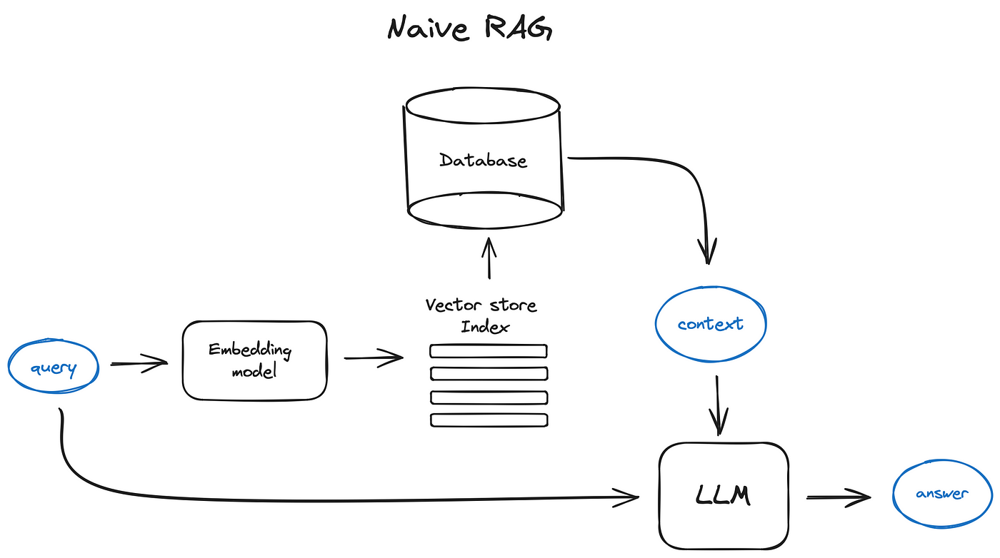
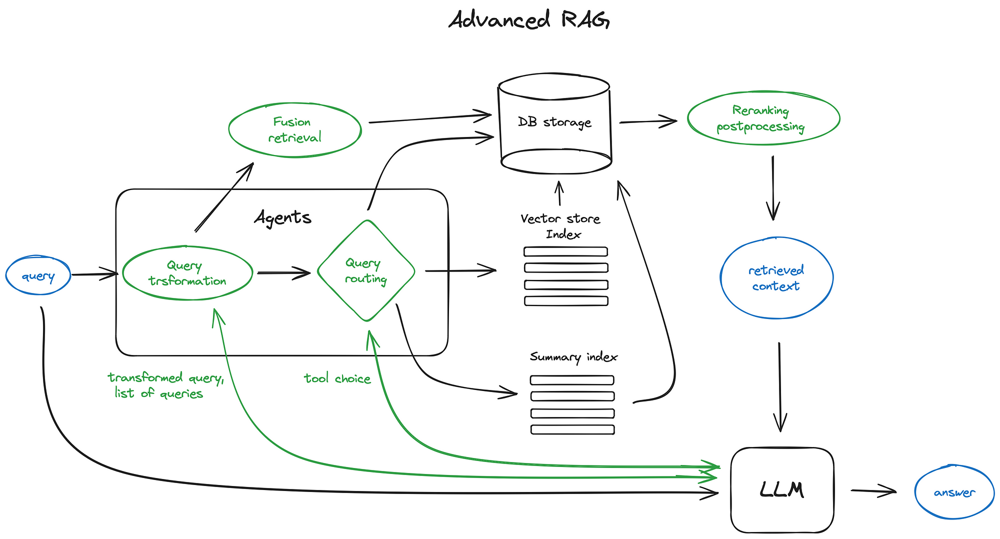
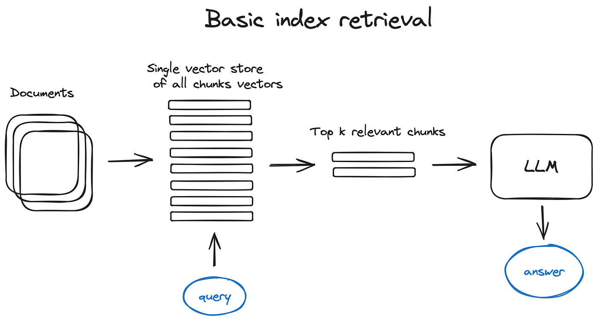
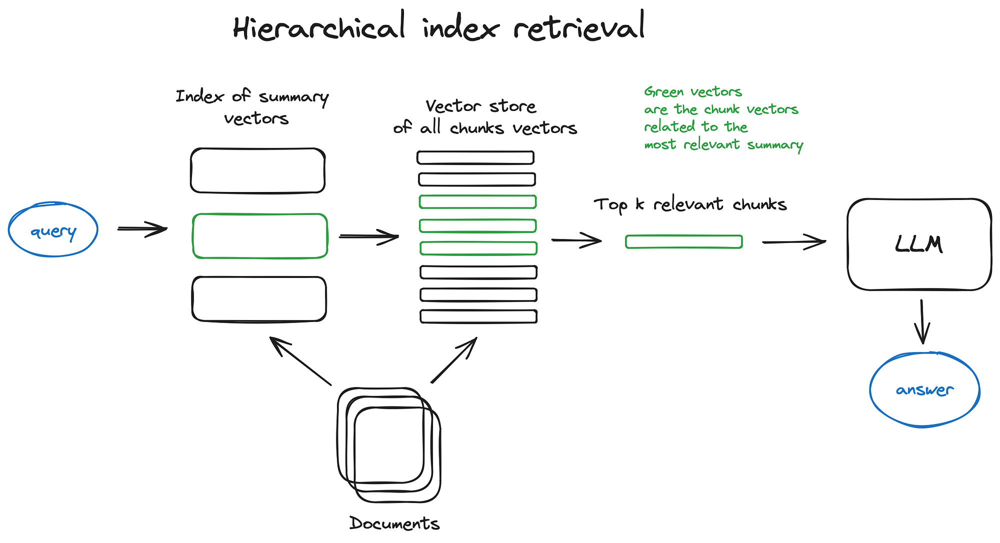
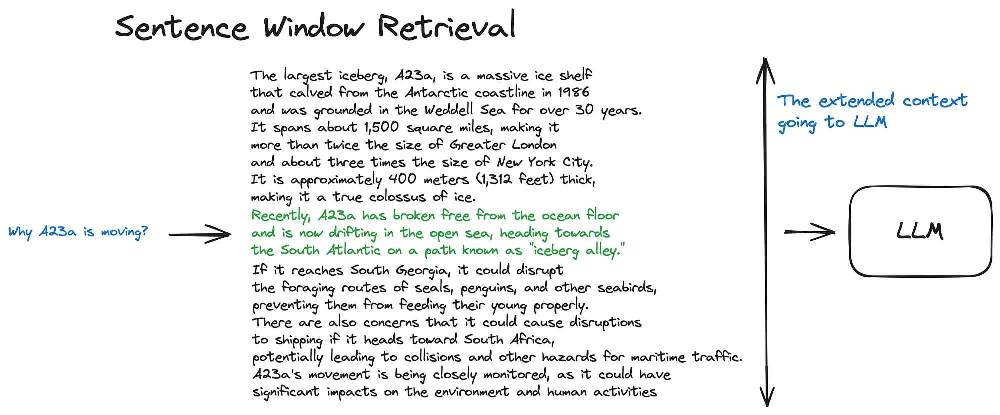
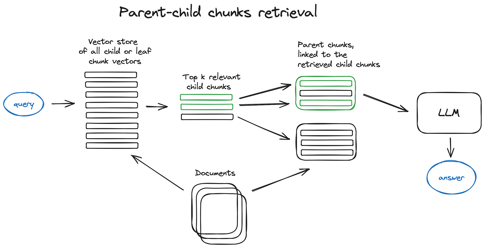
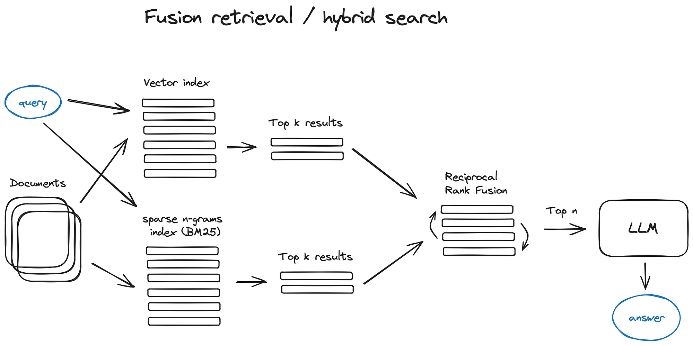
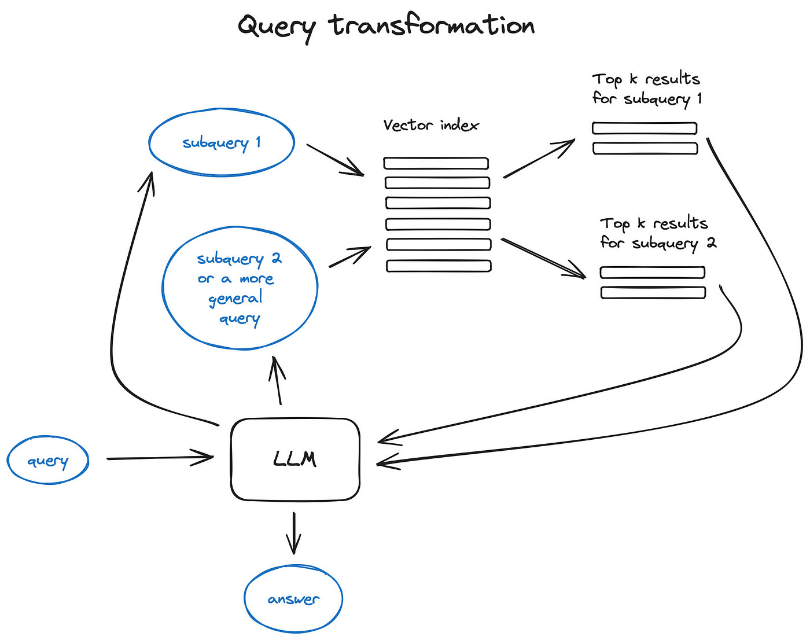
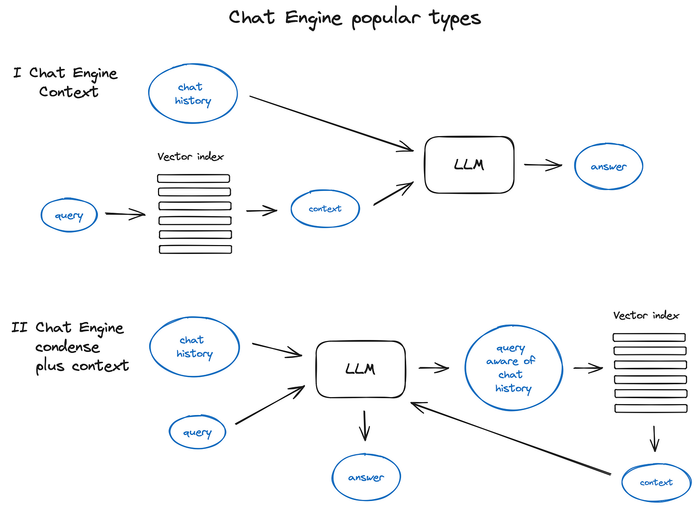
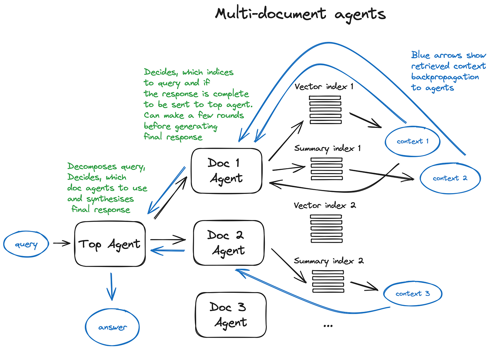

Groningen, Martinitoren, where the article was composed in the peace of the Noorderplatsoen  

格罗宁根，马蒂尼托伦，在 Noorderplatsoen 的和平时期撰写文章的地方

## A comprehensive study of the advanced retrieval augmented generation techniques and algorithms, systemising various approaches.  

The article comes with a collection of links in my knowledge base referencing various implementations and studies mentioned.  

对先进的检索增强生成技术和算法的全面研究，将各种方法系统化。文章还附带了我的知识库中的链接集，其中提到了各种实现方法和研究。

_Since the goal of the post is to make an overview & explanation of avaliable RAG algorithms and techniques, I won’t dive into implementations details in code, just referencing them and leaving it to the vast documentation & tutorials available.  

由于这篇文章的目的是概述和解释可用的 RAG 算法和技术，因此我不会深入探讨代码中的实现细节，只是引用它们，并将其留给大量的可用文档和教程。_

## Intro  

介绍

_If you are familiar with the RAG concept, please skip to the Advanced RAG part.  

如果您熟悉 RAG 概念，请跳至高级 RAG 部分。_

Retrieval Augmented Generation, aka RAG, provides LLMs with the information retrieved from some data source to ground its generated answer on. **Basically RAG is Search + LLM prompting**, where your ask the model to answer the query provided the information found with the search algorithm as a context.  

检索增强生成（Retrieval Augmented Generation），又称 RAG，为 LLM 提供从某些数据源检索到的信息，作为生成答案的基础。从根本上说，RAG 是搜索 + LLM 提示，即要求模型在以搜索算法找到的信息为上下文的情况下回答查询。  

Both the query and the retrieved context are injected into the prompt that is sent to the LLM.  

查询和检索到的上下文都会注入发送给 LLM 的提示中。

RAG is the most popular architecture of the LLM based systems in 2023. There are many products build almost solely on RAG — from Question Answering services combining web search engines with LLMs to hundreds of chat-with-your-data apps.  

RAG 是 2023 年基于 LLM 的系统中最流行的架构。从结合了网络搜索引擎和 LLM 的问题解答服务，到数以百计的 "用数据聊天 "应用程序，许多产品几乎都是完全基于 RAG 构建的。

Even the **vector search** area got pumped by that hype although embedding based search engines were made with [faiss](https://faiss.ai/) back in 2019. Vector database startups like [chroma](https://github.com/chroma-core/chroma), [weavaite.io](https://weaviate.io/) and [pinecone](https://www.pinecone.io/) have been built upon existing open source search indices — mainly faiss and [nmslib](https://github.com/nmslib/nmslib) — and added an extra storage for the input texts plus some other tooling lately.  

尽管基于嵌入式的搜索引擎早在 2019 年就已经用 faiss 制作出来了，但就连矢量搜索领域也被这种炒作所推动。chroma、weavaite.io 和 pinecone 等矢量数据库初创公司都建立在现有的开源搜索索引（主要是 faiss 和 nmslib）基础上，并在最近增加了输入文本的额外存储空间和其他一些工具。

**There are two most prominent open source libraries for LLM-based pipelines & applications** — [LangChain](https://python.langchain.com/docs/get_started/introduction) and [LlamaIndex](https://docs.llamaindex.ai/en/stable/), founded with a month difference in October and November 2022, respectfully, inspired by the ChatGPT launch and having gained massive adoption in 2023.  

在基于 LLM 的管道和应用方面，有两个最著名的开源库--LangChain 和 LlamaIndex，它们分别成立于 2022 年 10 月和 11 月，与 ChatGPT 的发布相差一个月，并在 2023 年获得了广泛采用。

> _The purpose of this article is to systemise the key advanced RAG techniques with references to their implementations — mostly in the LlamaIndex — in order to facilitate other developers’ dive into the technology.  
> 
> 本文的目的是系统地介绍关键的高级 RAG 技术，并参考其实现方法（主要是 LlamaIndex 中的实现方法），以方便其他开发人员深入研究该技术。_
> 
> _The problem is that most of the tutorials cherry-pick one or several techniques and explain in details how to implement them rather than decribing the full variety of the avaliable tools .  
> 
> 问题在于，大多数教程都是挑选一种或几种技术，然后详细解释如何实现这些技术，而不是介绍各种可用的工具。_
> 
> _Another thing is that both LlamaIndex and LangChian are amazing open source projects, developing at such a pace that their documentation is already thicker than a machine learning textbook in 2016.  
> 
> 另外，LlamaIndex 和 LangChian 都是了不起的开源项目，其发展速度之快，其文档已经比 2016 年的机器学习教科书还要厚。_

## Naive RAG  

原始 RAG

The starting point of the RAG pipeline in this article would be a corpus of text documents — we skip everything before that point, leaving it to the amazing open source data loaders connecting to any imaginable source from Youtube to Notion.  

本文中 RAG 管道的起点是文本文档语料库--我们跳过了这之前的所有内容，将其留给连接到从 Youtube 到 Notion 等任何可以想象到的来源的神奇开源数据加载器。

A scheme by author, as well all the schemes further in the text  

按作者分列的计划，以及文中的所有计划

**Vanilla RAG case** in brief looks the following way: you split your texts into chunks, then you embed these chunks into vectors with some Transformer Encoder model, you put all those vectors into an index and finally you create a prompt for an LLM that tells the model to answers user’s query given the context we found on the search step.  

Vanilla RAG 案例简述如下：先将文本分割成块，然后使用某种变换器编码器模型将这些块嵌入向量中，再将所有这些向量放入索引中，最后为 LLM 创建一个提示，告诉该模型根据我们在搜索步骤中发现的上下文回答用户的查询。  

In the runtime we vectorise user’s query with the same Encoder model and then execute search of this query vector against the index, find the top-k results, retrieve the corresponding text chunks from our database and feed them into the LLM prompt as context.  

在运行时，我们使用相同的编码器模型对用户的查询进行矢量化，然后根据索引对该查询矢量执行搜索，找出前 k 个结果，从数据库中检索相应的文本块，并将其作为上下文输入 LLM 提示。

The prompt can look like that:  

提示可以是这样的

an example of a RAG prompt  

RAG 提示示例

[**Prompt engineering**](https://docs.llamaindex.ai/en/latest/examples/prompts/prompts_rag.html) is the cheapest thing you can try to improve your RAG pipeline.  

提示工程是改进 RAG 管道的最廉价尝试。  

Make sure you’ve checked a quite comprehensive OpenAI [prompt engineering guide](https://platform.openai.com/docs/guides/prompt-engineering/strategy-write-clear-instructions).  

请确保您已经查看了相当全面的 OpenAI 提示工程指南。

Obviously despite OpenAI being the market leader as an LLM provider there is a number of alternatives such as [Claude](https://www.anthropic.com/product) from Anthropic, recent trendy smaller but very capable models like [Mixtral](https://mistral.ai/news/mixtral-of-experts/) form Mistral, [Phi-2](https://www.microsoft.com/en-us/research/blog/phi-2-the-surprising-power-of-small-language-models/) from Microsoft and many open source options like [Llama2](https://huggingface.co/blog/llama2), [OpenLLaMA](https://huggingface.co/openlm-research), [Falcon](https://huggingface.co/tiiuae), so you have a choice of the brain for your RAG pipeline.  

显然，尽管 OpenAI 是 LLM 供应商的市场领导者，但也有许多替代方案，例如 Anthropic 的 Claude、最近流行的较小但能力很强的模型 Mixtral form Mistral、微软的 Phi-2，以及许多开源方案，例如 Llama2、OpenLLaMA、Falcon，因此您可以为您的 RAG 管道选择大脑。

## Advanced RAG  

高级 RAG

Now we’ll dive into the overview of the advanced RAG techniques.  

现在，我们将深入了解高级 RAG 技术的概况。  

Here is a scheme depicting core steps and algorithms involved.  

下面是一个描述核心步骤和算法的方案。  

Some logic loops and complex multistep agentic behaviours are omitted to keep the scheme readable.  

为了保持方案的可读性，省略了一些逻辑循环和复杂的多步骤代理行为。

Some key components of an advanced RAG architecture.  

先进的 RAG 架构的一些关键组成部分。  

It’s more a choice of available instruments than a blueprint.  

与其说它是一个蓝图，不如说它是对现有乐器的一种选择。

The green elements on the scheme are the core RAG techniques discussed further, the blue ones are texts.  

方案中的绿色元素是进一步讨论的 RAG 核心技术，蓝色元素是文本。  

Not all the advanced RAG ideas are easily visualised on a single scheme, for example, various context enlarging approaches are omitted — we’ll dive into that on the way.  

并不是所有先进的 RAG 理念都能在单一方案中轻松实现可视化，例如，各种情境放大方法就被省略了--我们将在途中深入探讨。

## 1\. Chunking & vectorisation  

1.分块和矢量化

First of all we want to create an index of vectors, representing our document contents and then in the runtime to search for the least cosine distance between all these vectors and the query vector which corresponds to the closest semantic meaning.  

首先，我们要创建一个代表文档内容的向量索引，然后在运行时搜索所有这些向量与最接近语义的查询向量之间的最小余弦距离。

**1.1 Chunking  

1.1 分块**  

Transformer models have fixed input sequence length and even if the input context window is large, the vector of a sentence or a few better represents their semantic meaning than a vector averaged over a few pages of text (depends on the model too, but true in general), so **chunk your data** — split the initial documents in chunks of some size without loosing their meaning (splitting your text in sentences or in paragraphs, not cutting a single sentence in two parts).  

转换器模型有固定的输入序列长度，即使输入上下文窗口很大，一句话或几个句子的向量也比几页文本的平均向量更能代表其语义（这也取决于模型，但一般来说是正确的），因此要对数据进行分块--在不丢失其意义的情况下，将初始文档分成一定大小的块（将文本分成句子或段落，而不是将一个句子分成两部分）。  

There are various text splitter implementations capable of this task.  

有各种文本分割器可以完成这项任务。

**The size of the chunk is a parameter to think of** — it depends on the embedding model you use and its capacity in tokens, standard transformer Encoder models like BERT-based Sentence Transformers take 512 tokens at most, OpenAI ada-002 is capable of handling longer sequences like 8191 tokens, but **the compromise here is enough context for the LLM to reason upon vs specific enough text embedding in order to efficiently execute search upon**. [Here](https://www.pinecone.io/learn/chunking-strategies/) you can find a research illustrating chunk size selection concerns.  

块的大小是一个需要考虑的参数--它取决于你所使用的嵌入模型及其标记容量，标准的转换器编码器模型（如基于 BERT 的句子转换器）最多需要 512 个标记，OpenAI ada-002 能够处理更长的序列，如 8191 个标记，但这里的折衷是，LLM 要根据足够多的上下文进行推理，而文本嵌入要足够具体，以便高效地执行搜索。您可以在这里找到一份研究报告，说明块大小的选择问题。  

In LlamaIndex this is covered by the [NodeParser class](https://docs.llamaindex.ai/en/stable/api_reference/service_context/node_parser.html) with some advanced options as defining your own text splitter, metadata, nodes / chunks relations, etc.  

在 LlamaIndex 中，NodeParser 类提供了一些高级选项，如定义自己的文本分割器、元数据、节点/块关系等。

**1.2 Vectorisation  

1.2 矢量化**  

The next step is to choose a **model to embed our chunks** — there are quite some options, I go with the **search optimised models** like [bge-large](https://huggingface.co/BAAI/bge-large-en-v1.5) or [E5](https://huggingface.co/intfloat/multilingual-e5-large) embeddings family — just check the [MTEB leaderboard](https://huggingface.co/spaces/mteb/leaderboard) for the latest updates.  

下一步是选择一个模型来嵌入我们的语块--有很多选择，我选择了 bge-large 或 E5 embeddings 系列等搜索优化模型--只需查看 MTEB 排行榜了解最新更新。

For an end2end implementation of the chunking & vectorisation step check an [example](https://docs.llamaindex.ai/en/latest/module_guides/loading/ingestion_pipeline/root.html#) of a full data ingestion pipeline in LlamaIndex.  

关于分块和矢量化步骤的端到端实施，请查看 LlamaIndex 中的完整数据摄取管道示例。

## 2\. Search index  

2.1 Vector store index  

2.搜索索引2.1 向量存储索引

In this scheme and everywhere further in the text I omit the Encoder block and send our query straight to the index for the scheme simplicity.  

在本方案中以及文中其他地方，为了简化方案，我省略了编码器模块，直接将查询发送到索引。  

The query always gets vectorised first of course.  

当然，查询总是先被矢量化。  

Same with the top k cunks — index retrieves top k vectors, not chunks, but I replace them with chunks as fetching them is a trivial step.  

前 k 个数据块的情况也是如此--索引检索的是前 k 个向量，而不是数据块，但我用数据块代替了它们，因为获取它们是一个微不足道的步骤。

**The crucial part of the RAG pipeline is the search index**, storing your vectorised content we got in the previous step.  

RAG 管道的关键部分是搜索索引，它存储了我们在上一步中获得的矢量化内容。  

The most naive implementation uses a flat index — a brute force distance calculation between the query vector and all the chunks’ vectors.  

最简单的方法是使用平面索引--在查询向量和所有数据块向量之间强行计算距离。

**A proper search index, optimised for efficient retrieval** on 10000+ elements scales **is a vector index** like [faiss](https://faiss.ai/), [nmslib](https://github.com/nmslib/nmslib) or [annoy](https://github.com/spotify/annoy), using some Approximate Nearest Neighbours implementation like clustring, trees or [HNSW](https://www.pinecone.io/learn/series/faiss/hnsw/) algorithm.  

为在 10000 多个元素规模上高效检索而优化的适当搜索索引是一种向量索引，如 faiss、nmslib 或 annoy，使用一些近似近邻实现，如 clustring、trees 或 HNSW 算法。

There are also managed solutions like OpenSearch or ElasticSearch and vector databases, taking care of the data ingestion pipeline described in step 1 under the hood, like [Pinecone](https://www.pinecone.io/), [Weaviate](https://weaviate.io/) or [Chroma](https://www.trychroma.com/).  

此外，还有一些托管解决方案，如 OpenSearch 或 ElasticSearch 以及向量数据库，如 Pinecone、Weaviate 或 Chroma，它们在引擎盖下负责步骤 1 中所述的数据摄取管道。

Depending on your index choice, data and search needs **you can also store metadata along with vectors** and then use **metadata filters** to search for information within some dates or sources for example.  

根据您的索引选择、数据和搜索需求，您还可以将元数据与矢量一起存储，然后使用元数据过滤器搜索某些日期或来源内的信息。

LlamaIndex supports lots of [vector store indices](https://docs.llamaindex.ai/en/latest/community/integrations/vector_stores.html) but there are also other simpler index implementations supported like list index, tree index, and keyword table index — we’ll talk about the latter in the Fusion retrieval part.  

LlamaIndex 支持大量向量存储索引，但也支持其他更简单的索引实现，如列表索引、树索引和关键字表索引--我们将在融合检索部分讨论后者。

## 2\. 2 Hierarchical indices  

2.2 分级指数

In case you have many documents to retrieve from, you need to be able to efficiently search inside them, find relevant information and synthesise it in a single answer with references to the sources.  

如果您有许多文件需要检索，您需要能够有效地在这些文件中进行搜索，找到相关信息，并将其归纳为一个单一的答案，同时提供来源参考。  

An efficient way to do that in case of a large database is to对于大型数据库，一种有效的方法是 **create two indices — one composed of summaries and the other one composed of document chunks  

创建两个索引--一个由摘要组成，另一个由文件块组成**, and to search in two steps, first filtering out the relevant docs by summaries and then searching just inside this relevant group.  

并分两步进行搜索，首先通过摘要筛选出相关文档，然后在相关组内进行搜索。

## 2.3 Hypothetical Questions and HyDE  

2.3 假设问题和 HyDE

Another approach is to ask an LLM to **generate a question for each chunk and embed these questions in vectors**, at runtime performing query search against this index of question vectors (replacing chunks vectors with questions vectors in our index) and then after retrieval route to original text chunks and send them as the context for the LLM to get an answer.  

另一种方法是要求 LLM 为每个语块生成一个问题，并将这些问题嵌入向量中，在运行时根据问题向量索引进行查询搜索（在我们的索引中用问题向量替换语块向量），然后在检索后路由到原始文本块，并将其作为上下文发送给 LLM 以获得答案。  

This approach improves search quality due to a **higher semantic similarity between query and hypothetical question** compared to what we’d have for an actual chunk.  

由于查询和假设问题之间的语义相似性比实际大块问题的语义相似性更高，因此这种方法可以提高搜索质量。

There is also the reversed logic apporach called [**HyDE**](http://boston.lti.cs.cmu.edu/luyug/HyDE/HyDE.pdf) — you ask an LLM to generate a hypothetical response given the query and then use its vector along with the query vector to enhance search quality.  

还有一种被称为 HyDE 的反向逻辑方法，即要求 LLM 根据查询生成一个假设的响应，然后将其向量与查询向量一起使用，以提高搜索质量。

## 2.4 Context enrichment  

2.4 丰富情境

**The concept here is to retrieve smaller chunks for better search quality**, **but add up surrounding context for LLM to reason upon**.  

这里的概念是检索较小的片段，以提高搜索质量，但同时增加周围的上下文，以便 LLM 进行推理。  

There are two options — to expand context by sentences around the smaller retrieved chunk or to split documents recursively into a number of larger parent chunks, containing smaller child chunks.  

有两种选择--通过围绕检索到的较小语块的句子扩展上下文，或者将文档递归地拆分成若干较大的父语块，其中包含较小的子语块。

[**2.4.1 Sentence Window Retrieval  

2.4.1 句子窗口检索**](https://docs.llamaindex.ai/en/stable/examples/node_postprocessor/MetadataReplacementDemo.html)  

In this scheme each sentence in a document is embedded separately which provides great accuracy of the query to context cosine distance search.  

在该方案中，文档中的每个句子都是单独嵌入的，这为上下文余弦距离搜索提供了极高的查询精度。  

In order to better reason upon the found context after fetching the most relevant single sentence we extend the context window by _k_ sentences before and after the retrieved sentence and then send this extended context to LLM.  

在获取最相关的单句后，为了更好地推理所找到的上下文，我们将上下文窗口扩展为所获取句子前后的 k 个句子，然后将扩展后的上下文发送给 LLM。

The green part is the sentence embedding found while search in index, and the whole black + green paragraph is fed to the LLM to enlarge its context while reasoning upon the provided query  

绿色部分是在索引中搜索时发现的句子嵌入，整个黑色+绿色段落被输入到 LLM 中，以便在对所提供的查询进行推理时扩大其上下文。

**2.4.2** [**Auto-merging Retriever**](https://docs.llamaindex.ai/en/latest/examples/retrievers/auto_merging_retriever.html) **(aka** [**Parent Document Retriever**](https://python.langchain.com/docs/modules/data_connection/retrievers/parent_document_retriever)**)**  

2.4.2 自动合并检索器（又名父文档检索器）

The idea here is pretty much similar to Sentence Window Retriever — to search for more granular pieces of information and then to extend the context window before feeding said context to an LLM for reasoning.  

它的思路与 "句子窗口检索器"（Sentence Window Retriever）十分相似--搜索更细粒度的信息，然后扩展上下文窗口，再将上下文输入 LLM 进行推理。  

Documents are split into smaller child chunks referring to larger parent chunks.  

文件被分割成更小的子块，引用较大的父块。

Documents are splitted into an hierarchy of chunks and then the smallest leaf chunks are sent to index.  

文件被分割成不同层次的块，然后将最小的叶块送入索引。  

At the retrieval time we retrieve k leaf chunks, and if there is n chunks referring to the same parent chunk, we replace them with this parent chunk and send it to LLM for answer generation.  

检索时，我们检索 k 个叶子块，如果有 n 个块指向同一个父块，我们就用这个父块替换它们，并将其发送给 LLM 生成答案。

Fetch smaller chunks during retrieval first, then if more than _n_ chunks in top _k_ retrieved chunks are linked to the same parent node (larger chunk), we replace the context fed to the LLM by this parent node — works like auto merging a few retrieved chunks into a larger parent chunk, hence the method name.  

首先在检索过程中抓取较小的数据块，然后如果在前 k 个抓取的数据块中有 n 个以上的数据块链接到同一个父节点（较大的数据块），我们就用这个父节点来替换提供给 LLM 的上下文--其工作原理就像自动将几个抓取的数据块合并到一个较大的父数据块中，这也是该方法名称的由来。  

Just to note — search is performed just within the child nodes index.  

需要注意的是，搜索只在子节点索引内进行。  

Check the LlamaIndex tutorial on [Recursive Retriever + Node References](https://docs.llamaindex.ai/en/stable/examples/retrievers/recursive_retriever_nodes.html) for a deeper dive.  

请查看 LlamaIndex 关于递归检索器 + 节点引用的教程，了解更深入的内容。

## 2.5 Fusion retrieval or hybrid search  

2.5 融合检索或混合搜索

A relatively old idea that you could **take the best from both worlds — keyword-based old school search** — sparse retrieval algorithms like [tf-idf](https://en.wikipedia.org/wiki/Tf%E2%80%93idf) or search industry standard [BM25](https://en.wikipedia.org/wiki/Okapi_BM25) — **and modern** semantic or **vector search and combine it in one retrieval result.**  

一个相对古老的想法是，你可以从基于关键词的老式搜索、稀疏检索算法（如 tf-idf 或搜索行业标准 BM25）和现代语义或向量搜索这两个世界中汲取精华，并将其结合到一个检索结果中。  

The only trick here is to properly combine the retrieved results with different similarity scores — this problem is usually solved with the help of the [Reciprocal Rank Fusion](https://plg.uwaterloo.ca/~gvcormac/cormacksigir09-rrf.pdf) algorithm, reranking the retrieved results for the final output.  

这里唯一的诀窍就是将检索到的具有不同相似性得分的结果进行适当组合--这个问题通常借助 "互易等级融合 "算法来解决，即对检索到的结果进行重新排序，以获得最终输出结果。

In LangChain this is implemented in the [Ensemble Retriever](https://python.langchain.com/docs/modules/data_connection/retrievers/ensemble) class, combining a list of retrievers you define, for example a faiss vector index and a BM25 based retriever and using RRF for reranking.  

在 LangChain 中，这是在 Ensemble Retriever 类中实现的，它结合了您定义的检索器列表，例如 faiss 向量索引和基于 BM25 的检索器，并使用 RRF 进行重排。

In LlamaIndex this is [done](https://docs.llamaindex.ai/en/stable/examples/retrievers/reciprocal_rerank_fusion.html) in a pretty similar fashion.  

在 LlamaIndex 中，这种方法也非常相似。

Hybrid or fusion search usually provides better retrieval results as two complementary search algorithms are combined, taking into account both semantic similarity and keyword matching between the query and the stored documents.  

混合或融合搜索通常能提供更好的检索结果，因为两种互补的搜索算法结合在一起，同时考虑到查询和存储文档之间的语义相似性和关键词匹配。

## 3\. Reranking & filtering  

3.重新排名和过滤

So we got our retrieval results with any of the algorithms described above, now it is time to refine them through filtering, re-ranking or some transformation.  

因此，我们通过上述任何一种算法都能得到检索结果，现在是时候通过过滤、重新排序或一些转换来完善这些结果了。  

In LlamaIndex there is a variety of available [**Postprocessors**](https://docs.llamaindex.ai/en/stable/module_guides/querying/node_postprocessors/root.html), **filtering out results based on similarity score, keywords, metadata or reranking them with other models** like an LLM,  

LlamaIndex 有多种可用的后处理器，可根据相似度得分、关键词、元数据过滤出结果，或使用其他模型（如 LLM）对结果重新排序、  

[sentence-transformer cross-encoder](https://www.sbert.net/examples/applications/cross-encoder/README.html), Cohere reranking [endpoint](https://txt.cohere.com/rerank/)  

句子转换器交叉编码器、Cohere 重整终端  

or based on metadata like date recency — basically, all you could imagine.  

或基于元数据（如日期的先后顺序）--基本上，你能想到的都能找到。

This is the final step before feeding our retrieved context to LLM in order to get the resulting answer.  

这是将检索到的上下文输入 LLM 以得到答案之前的最后一步。

Now it is time to get to the more sophisticated RAG techniques like Query transformation and Routing, both involving LLMs and thus representing **agentic behaviour — some complex logic involving LLM reasoning within our RAG pipeline.**  

现在，我们要学习更复杂的 RAG 技术，如查询转换和路由选择，这两种技术都涉及 LLM，从而代表了代理行为--在我们的 RAG 管道中，一些复杂的逻辑涉及 LLM 推理。

## 4\. Query transformations  

4.查询转换

**Query transformations are a family of techniques using an LLM as a reasoning engine to modify user input in order to improve retrieval quality.** There are different options to do that.  

查询转换是一系列使用 LLM 作为推理引擎来修改用户输入以提高检索质量的技术。在这方面有多种不同的选择。

Query transformation principles illustrated  

查询转换原则说明

**If the query is complex, LLM can decompose it into several sub queries.** For examle, if you ask:  

如果查询比较复杂，LLM 可以将其分解为多个子查询。例如，如果您问  

_— “What framework has more stars on Github, Langchain or LlamaIndex?”,  

\- 在 Github 上，Langchain 和 LlamaIndex 哪个框架拥有更多的星星？  

_and it is unlikely that we’ll find a direct comparison in some text in our corpus so it makes sense to decompose this question in two sub-queries presupposing simpler and more concrete information retrieval:  

而在我们的语料库中，我们不太可能在某些文本中找到直接的对比，因此将这个问题分解为两个子问题是有道理的，前提是信息检索要更简单、更具体：  

_— “How many stars does Langchain have on Github?”  

\- "Langchain在Github上有多少颗星？"  

— “How many stars does Llamaindex have on Github?”  

\- "Llamaindex在Github上有多少颗星？"  

_They would be executed in parallel and then the retrieved context would be combined in a single prompt for LLM to synthesize a final answer to the initial query.  

它们将并行执行，然后将检索到的上下文合并到一个提示中，供 LLM 综合初始查询的最终答案。  

Both libraries have this functional implemented — as a [Multi Query Retriever](https://python.langchain.com/docs/modules/data_connection/retrievers/MultiQueryRetriever?ref=blog.langchain.dev) in Langchain and as a [Sub Question Query Engine](https://docs.llamaindex.ai/en/stable/examples/query_engine/sub_question_query_engine.html) in Llamaindex.  

这两个库都实现了这一功能--在 Langchain 中作为多重查询检索器，在 Llamaindex 中作为子问题查询引擎。

1.  [**Step-back prompting**](https://arxiv.org/pdf/2310.06117.pdf?ref=blog.langchain.dev) **uses LLM to generate a more general query**, retrieving for which we obtain a more general or high-level context useful to ground the answer to our original query on.  
    
    后退提示法使用 LLM 生成一个更一般的查询，通过检索，我们可以获得一个更一般或更高层次的上下文，这对我们回答原始查询非常有用。  
    
    Retrieval for the original query is also performed and both contexts are fed to the LLM on the final answer generation step.  
    
    此外，还对原始查询进行检索，并在最后的答案生成步骤中将这两种上下文输入 LLM。  
    
    Here is a LangChain [implementation](https://github.com/langchain-ai/langchain/blob/master/cookbook/stepback-qa.ipynb?ref=blog.langchain.dev).  
    
    下面是 LangChain 的实现。
2.  **Query re-writing uses LLM to reformulate initial query** in order to improve retrieval. Both [LangChain](https://github.com/langchain-ai/langchain/blob/master/cookbook/rewrite.ipynb?ref=blog.langchain.dev) and [LlamaIndex](https://llamahub.ai/l/llama_packs-fusion_retriever-query_rewrite) have implementations, tough a bit different, I find LlamaIndex solution being more powerful here.  
    
    查询重写使用 LLM 来重新表述初始查询，以提高检索效率。LangChain 和 LlamaIndex 都有自己的实现方法，但它们的实现方法略有不同，我认为 LlamaIndex 的解决方案在这方面更强大。

## Reference citations  

参考引文

This one goes without a number as this is more an instrument than a retrieval improvement technique, although a very important one.  

这一项不需要编号，因为与其说它是一种检索改进技术，不如说它是一种工具，尽管它非常重要。  

**If we’ve used multiple sources to generate an answer** either due to the initial query complexity (we had to execute multiple subqueries and then to combine retrieved context in one answer), or because we found relevant context for a single query in various documents, the question rises if we could **accurately back reference our sources**.  

如果由于初始查询的复杂性（我们不得不执行多个子查询，然后将检索到的上下文合并为一个答案），或者由于我们在多个文档中找到了与单个查询相关的上下文，我们就需要使用多个来源来生成答案，那么问题就来了，我们能否准确地回溯我们的来源。

There are a couple of ways to do that:  

有几种方法可以做到这一点：

1.  **Insert this referencing task into our prompt** and ask LLM to mention ids of the used sources.  
    
    在我们的提示中插入这项参考任务，并要求 LLM 提及所用资料来源的 ID。
2.  **Match the parts of generated response to the original text chunks** in our index — llamaindex offers an efficient [fuzzy matching based solution](https://github.com/run-llama/llama-hub/tree/main/llama_hub/llama_packs/fuzzy_citation) for this case. In case you have not heard of fuzzy matching, this is an [incredibly powerful string matching technique](https://towardsdatascience.com/fuzzy-matching-at-scale-84f2bfd0c536).  
    
    将生成的响应部分与我们索引中的原始文本块进行匹配--llamaindex 为此提供了一种基于模糊匹配的高效解决方案。如果你还没听说过模糊匹配，这是一种非常强大的字符串匹配技术。

## 5\. [Chat Engine](https://docs.llamaindex.ai/en/stable/module_guides/deploying/chat_engines/root.html)  

5.聊天引擎

The next big thing about building a nice RAG system that can work more than once for a single query is the **chat logic, taking into account the dialogue context**, same as in the classic chat bots in the pre-LLM era.  

要建立一个能多次处理单个查询的优秀 RAG 系统，下一件大事就是聊天逻辑，要考虑到对话上下文，这与前 LLM 时代的经典聊天机器人相同。  

This is needed to support follow up questions, anaphora, or arbitrary user commands relating to the previous dialogue context.  

这就需要支持后续问题、拟声词或与之前对话语境相关的任意用户命令。  

It is solved by **query compression technique, taking chat context into account** along with the user query.  

该问题可通过查询压缩技术来解决，同时将聊天上下文和用户查询一并考虑在内。

As always, there are several approaches to said context compression —  

与往常一样，有几种方法可以实现所述的上下文压缩，即  

a popular and relatively simple [ContextChatEngine](https://docs.llamaindex.ai/en/stable/examples/chat_engine/chat_engine_context.html), first retrieving context relevant to user’s query and then sending it to LLM along with chat history from the _memory_ buffer for LLM to be aware of the previous context while generating the next answer.  

它首先检索与用户查询相关的上下文，然后将其与内存缓冲区中的聊天记录一起发送给 LLM，以便 LLM 在生成下一个答案时了解之前的上下文。

A bit more sophisticated case is [CondensePlusContextMode](https://docs.llamaindex.ai/en/stable/examples/chat_engine/chat_engine_condense_plus_context.html) — there in each interaction the chat history and last message are condensed into a new query, then this query goes to the index and the retrieved context is passed to the LLM along with the original user message to generate an answer.  

更复杂一点的情况是 CondensePlusContext 模式--在每次交互中，聊天记录和最后一条消息都会浓缩成一个新的查询，然后这个查询会进入索引，检索到的上下文会连同原始用户消息一起传递给 LLM，以生成一个答案。

It’s important to note that there is also support for [OpenAI agents based Chat Engine](https://docs.llamaindex.ai/en/stable/examples/chat_engine/chat_engine_openai.html) in LlamaIndex providing a more flexible chat mode and Langchain also [supports](https://python.langchain.com/docs/modules/agents/agent_types/openai_multi_functions_agent) OpenAI functional API.  

值得注意的是，LlamaIndex 还支持基于 OpenAI 代理的聊天引擎，可提供更灵活的聊天模式，而且 Langchain 还支持 OpenAI 功能 API。

An illustration of different Chat Engine types and principles  

不同聊天引擎类型和原理说明

There are other Chat engine types like [ReAct Agent](https://docs.llamaindex.ai/en/stable/examples/chat_engine/chat_engine_react.html), but let’s skip to Agents themselves in section 7.  

还有其他聊天引擎类型，如 ReAct Agent，但我们还是跳过第 7 节中的代理本身吧。

## 6\. Query Routing  

6.查询路由

**Query routing is the step of LLM-powered decision making upon what to do next given the user query** — the options usually are to summarise, to perform search against some data index or to try a number of different routes and then to synthesise their output in a single answer.  

查询路由是由 LLM 驱动的决策步骤，即根据用户查询决定下一步该做什么--通常可选择汇总、根据某些数据索引执行搜索或尝试多种不同路由，然后将其输出综合为一个答案。

Query routers are also used to select an index, or, broader, data store, where to send user query — either you have multiple sources of data, for example, a classic vector store and a graph database or a relational DB, or you have an hierarchy of indices — for a multi-document storage a pretty classic case would be an index of summaries and another index of document chunks vectors for example.  

查询路由器还用于选择一个索引，或者更广泛地说，数据存储，将用户查询发送到哪里--要么你有多个数据源，例如一个经典的向量存储和一个图形数据库或关系数据库，要么你有一个索引层次结构--对于多文档存储来说，一个非常经典的例子是一个摘要索引和另一个文档块向量索引。

**Defining the query router includes setting up the choices it can make.  

定义查询路由器包括设置它可以做出的选择。**  

The selection of a routing option is performed with an LLM call, returning its result in a predefined format, used to route the query to the given index, or, if we are taking of the agnatic behaviour, to sub-chains or even other agents as shown in the **Multi documents agent scheme** below.  

路由选项的选择是通过 LLM 调用完成的，其结果以预定义格式返回，用于将查询路由到给定的索引，或者，如果我们采用静态行为，则路由到子链甚至其他代理，如下文的多文档代理方案所示。

Both [LlamaIndex](https://docs.llamaindex.ai/en/stable/module_guides/querying/router/root.html) and [LangChain](https://python.langchain.com/docs/expression_language/how_to/routing?ref=blog.langchain.dev) have support for query routers.  

LlamaIndex 和 LangChain 都支持查询路由器。

## 7\. Agents in RAG  

7.RAG 中的代理

Agents (supported both by [Langchain](https://python.langchain.com/docs/modules/agents/) and [LlamaIndex](https://docs.llamaindex.ai/en/latest/use_cases/agents.html#)) have been around almost since the first LLM API has been released — **the idea was to provide an LLM, capable of reasoning, with a set of tools and a task to be completed**.  

代理（Langchain 和 LlamaIndex 都支持）几乎从第一个 LLM API 发布时就已经存在了--当时的想法是为能够进行推理的 LLM 提供一套工具和需要完成的任务。  

The tools might include some deterministic functions like any code function or an external API or even other agents — this LLM chaining idea is where LangChain got its name from.  

这些工具可能包括一些确定性函数，如任何代码函数或外部应用程序接口，甚至其他代理--LangChain 的名称就来源于这种 LLM 链式思想。

Agents are a huge thing itself and it’s impossible to make a deep enough dive into the topic inside a RAG overview, so I’ll just continue with the agent-based multi document retrieval case, making a short stop at the OpenAI Assistants station as it’s a relatively new thing, presented at the [recent OpenAI dev conference as GPTs](https://openai.com/blog/new-models-and-developer-products-announced-at-devday), and working under the hood of the RAG system described below.  

代理本身就是一个庞然大物，要在 RAG 概述中深入探讨这个主题是不可能的，所以我将继续介绍基于代理的多文档检索案例，在 OpenAI 助手站做短暂停留，因为它是一个相对较新的事物，在最近的 OpenAI 开发大会上以 GPT 的形式展示，并在下面描述的 RAG 系统的引擎盖下工作。

[**OpenAI Assistants**](https://platform.openai.com/docs/assistants/overview) basically have implemented a lot of tools needed around an LLM that we previously had in open source — a chat history, a knowledge storage, a document uploading interface and, maybe most important, [**function calling API**](https://platform.openai.com/docs/assistants/tools/function-calling). This latter provides capabilities to **convert natural language into API calls to external tools or database queries.**  

OpenAI 助手基本上已经实现了我们以前在开放源代码中拥有的 LLM 所需的大量工具--聊天记录、知识存储、文档上传界面，以及也许是最重要的功能调用 API。后者提供了将自然语言转换为外部工具或数据库查询的 API 调用的功能。

In LlamaIndex there is an [OpenAIAgent](https://docs.llamaindex.ai/en/stable/examples/agent/openai_agent.html) class marrying this advanced logic with the ChatEngine and QueryEngine classes, providing knowledge-based and context aware chatting along with the ability of multiple OpenAI functions calls in one conversation turn, which really brings the smart agentic behaviour.  

在 LlamaIndex 中，有一个 OpenAIAgent 类将这种高级逻辑与 ChatEngine 和 QueryEngine 类结合在一起，提供了基于知识和上下文感知的聊天功能，以及在一次对话中调用多个 OpenAI 功能的能力，从而真正实现了智能代理行为。

Let’s take a look at the [**Multi-Document Agents**](https://docs.llamaindex.ai/en/stable/examples/agent/multi_document_agents.html) **scheme** — a pretty sophisticated setting, involving initialisation of an **agent** ([OpenAIAgent](https://docs.llamaindex.ai/en/stable/examples/agent/openai_agent.html)) **upon each document**, capable of doc summarisation and the classic QA mechanics, **and a top agent**, responsible for queries routing to doc agents and for the final answer synthesis.  

让我们来看看多文档代理方案--这是一个相当复杂的设置，包括在每个文档上初始化一个代理（OpenAIAgent），该代理能够进行文档汇总和经典的质量保证机制，以及一个顶级代理，该代理负责将查询路由到文档代理，并负责最终答案的合成。

Each document agent has two tools — a vector store index and a summary index, and based on the routed query it decides which one to use.  

每个文档代理都有两个工具--矢量存储索引和摘要索引，并根据路由查询决定使用哪一个。  

And for the top agent, all document agents are tools respectfully.  

对于顶级代理来说，所有文件代理都是值得尊敬的工具。

This scheme illustrates an advanced RAG architecture with a lot of routing decisions made by each involved agent. **The benefit of such approach is the ability to compare different solutions or entities, described in different documents and their summaries** along with the classic single doc summarisation and QA mechanics — this basically covers the most frequent chat-with-collection-of-docs usecases.  

该方案展示了高级 RAG 架构，每个参与代理都会做出大量路由决定。这种方法的优点是可以比较不同文档中描述的不同解决方案或实体及其摘要，以及经典的单一文档摘要和质量保证机制，这基本上涵盖了最常见的 "通过文档集聊天 "用例。

A scheme illustrating multi document agents, involving both query routing and agentic behavior patterns.  

说明多文档代理的方案，涉及查询路由和代理行为模式。

The drawback of such a complex scheme can be guessed from the picture — it’s a bit slow due to multiple back and forth iterations with the LLMs inside our agents.  

从图中可以看出，这种复杂方案的缺点是速度有点慢，因为要与代理内部的 LLM 进行多次来回迭代。  

Just in case, an LLM call is always the longest operation in a RAG pipeline — search is optimised for speed by design.  

以防万一，在 RAG 管道中，LLM 调用总是最长的操作--搜索的设计优化了速度。  

So for a large multi document storage I’d recommed to think of some simplifications to this scheme making it scalable.  

因此，对于大型多文档存储，我建议对该方案进行一些简化，使其具有可扩展性。

## 8\. Response synthesiser  

8.响应合成器

This is the final step of any RAG pipeline — generate an answer based on all the context we carefully retrieved and on the initial user query.  

这是任何 RAG 管道的最后一步--根据我们精心检索的所有上下文和用户的初始查询生成答案。  

The simplest approach would be just to concatenate and feed all the fetched context (above some relevance threshold) along with the query to an LLM at once.  

最简单的方法是将所有获取的上下文（相关性阈值以上）连同查询一次并入 LLM。  

But, as always, there are other more sophisticated options involving multiple LLM calls to refine retrieved context and generate a better answer.  

不过，与以往一样，还有其他更复杂的选项，涉及多次 LLM 调用，以完善检索到的上下文并生成更好的答案。

**The main approaches to response synthesis are:  

响应合成的主要方法有  

**1\. **iteratively refine the answer** by sending retrieved context to LLM chunk by chunk  

1\. 通过将检索到的上下文逐块发送给 LLM，迭代完善答案2\. **summarise the retrieved context** to fit into the prompt  

2\. 根据提示总结检索到的上下文3\. **generate multiple answers** based on different context chunks and then to concatenate or **summarise them**.  

3\. 根据不同的语境块生成多个答案，然后将其串联或汇总。  

For more details please check the [Response synthesizer module docs](https://docs.llamaindex.ai/en/stable/module_guides/querying/response_synthesizers/root.html).  

更多详情，请查阅响应合成器模块文档。

## Encoder and LLM fine-tuning  

编码器和 LLM 微调

This approach involves fine-tuning of some of the two DL models involved in our RAG pipeline — either the Transformer **Encoder, resposible for embeddings quality and thus context retrieval quality** or an **LLM, responsible for the best usage of the provided context to answer user query** — luckily, the latter is a good few shot learner.  

这种方法涉及对我们的 RAG 管道中涉及的两个 DL 模型中的某些模型进行微调--要么是 Transformer Encoder（负责嵌入质量，从而保证上下文检索质量），要么是 LLM（负责以最佳方式使用所提供的上下文来回答用户查询）--幸运的是，后者是一个很好的几枪学习器。

One big advantage nowadays is the availability of high-end LLMs like GPT-4 to generate high quality synthetic datasets.  

如今的一大优势是可以利用 GPT-4 等高端 LLM 生成高质量的合成数据集。  

But you should always be aware that taking an open-source model trained by professional research teams on carefully collected, cleaned and validated large datasets and making a quick tuning using small synthetic dataset might narrow down the model’s capabilities in general.  

但是，您应该始终意识到，将专业研究团队在精心收集、清理和验证的大型数据集上训练出来的开源模型，利用小型合成数据集进行快速调整，可能会在总体上缩小模型的能力。

## Encoder fine-tuning  

编码器微调

I’ve also been a bit skeptical about the Encoder funetuning approach as the latest Transformer Encoders optimised for search are pretty efficient.  

我对编码器趣味调整方法也有些怀疑，因为最新的变形金刚编码器针对搜索进行了优化，效率相当高。  

So I have tested the performance increase provided by finetuning of [bge-large-en-v1.5](https://huggingface.co/BAAI/bge-large-en-v1.5) (top 4 of the [MTEB leaderboard](https://huggingface.co/spaces/mteb/leaderboard) at the time of writing) in the [LlamaIndex notebook](https://docs.llamaindex.ai/en/stable/examples/finetuning/embeddings/finetune_embedding.html) setting, and it demonstrated a 2% retrieval quality increase.  

因此，我在 LlamaIndex 笔记本设置中测试了通过微调 bge-large-en-v1.5（撰写本文时为 MTEB 排行榜前 4 名）带来的性能提升，结果显示检索质量提高了 2%。  

Nothing dramatic but it is nice to be aware of that option, especially if you have a narrow domain dataset you’re building RAG for.  

这没什么大不了的，但有了这个选项就好办了，尤其是当你要为一个狭窄的域数据集构建 RAG 时。

## Ranker fine-tuning  

排名器微调

**The other good old option is to have a cross-encoder for reranking your retrieved results** if you dont trust your base Encoder completely.  

如果您不完全信任您的基础编码器，另一个不错的选择是使用交叉编码器对检索结果进行重新排序。  

It works the following way — you pass the query and each of the top k retrieved text chunks to the cross-encoder, separated by a SEP token, and fine-tune it to output 1 for relevant chunks and 0 for non-relevant.  

它的工作原理如下--将查询和检索到的前 k 个文本块中的每一个传递给交叉编码器，中间用 SEP 标记隔开，然后对其进行微调，相关的文本块输出 1，不相关的文本块输出 0。  

A good example of such tuning process could be found [here](https://docs.llamaindex.ai/en/latest/examples/finetuning/cross_encoder_finetuning/cross_encoder_finetuning.html#), the results say the pairwise score was improved by 4% by cross-encoder finetuning.  

交叉编码器微调的结果表明，配对得分提高了 4%。

## LLM fine-tuning  

LLM 微调

Recently OpenAI started providing LLM finetuning [API](https://platform.openai.com/docs/guides/fine-tuning) and LlamaIndex has a [tutorial](https://docs.llamaindex.ai/en/stable/examples/finetuning/openai_fine_tuning.html) on **finetuning GPT-3.5-turbo in RAG setting** to “distill” some of the GPT-4 knowledge.  

最近，OpenAI 开始提供 LLM 微调 API，LlamaIndex 也提供了在 RAG 设置中微调 GPT-3.5-turbo 的教程，以 "提炼 "一些 GPT-4 知识。  

The idea here is to take a document, generate a number of questions with GPT-3.5-turbo, then use GPT-4 to generate answers to these questions based on the document contents (build a GPT4-powered RAG pipeline) and then to fine-tune GPT-3.5-turbo on that dataset of question-answer pairs. The [ragas](https://docs.ragas.io/en/latest/index.html) framework used for the RAG pipeline evaluation shows a **5% increase in the faithfulness metrics, meaning the fine-tuned GPT 3.5-turbo model made a better use of the provided context** to generate its answer, than the original one.  

这里的想法是获取一份文档，用 GPT-3.5-turbo 生成一些问题，然后使用 GPT-4 根据文档内容生成这些问题的答案（构建一个由 GPT4 驱动的 RAG 管道），然后在该问题-答案对数据集上对 GPT-3.5-turbo 进行微调。用于 RAG 管道评估的 ragas 框架显示，忠实度指标提高了 5%，这意味着经过微调的 GPT 3.5-turbo 模型比原始模型更好地利用了所提供的上下文来生成答案。

A bit more sophisticated approach is demonstrated in the recent [paper](https://arxiv.org/pdf/2310.01352.pdf) **RA-DIT: Retrieval Augmented Dual Instruction Tuning** by Meta AI Research, **suggesting a technique to tune both the LLM and the Retriever**  

Meta AI Research 最近发表的论文 RA-DIT：Retrieval Augmented Dual Instruction Tuning 展示了一种更为复杂的方法，提出了一种同时调整 LLM 和 Retriever 的技术。  

(a Dual Encoder in the original paper) **on triplets of query, context and answer**. For the implementations details please refer to this [guide](https://docs.llamaindex.ai/en/stable/examples/finetuning/knowledge/finetune_retrieval_aug.html#fine-tuning-with-retrieval-augmentation).  

(原论文中的双编码器）对查询、上下文和答案的三元组进行编码。有关实现细节，请参阅本指南。  

This technique was used both to fine-tune OpenAI LLMs through the fine-tuning API and Llama2 open-source model (in the original paper), resulting in ~5% increase in knowledge-intense tasks metrics (compared to Llama2 65B with RAG) and a couple percent increase in common sense reasoning tasks.  

通过微调 API 和 Llama2 开源模型（在原始论文中），这一技术被用于微调 OpenAI LLM，结果知识密集型任务指标提高了 ~5%（与带有 RAG 的 Llama2 65B 相比），常识推理任务指标提高了几个百分点。

_In case you know better approaches to LLM finetuning for RAG, please share your expertise in the comments section, especially if they are applied to the smaller open source LLMs.  

如果您知道更好的 RAG LLM 微调方法，请在评论区分享您的专业知识，尤其是适用于较小的开源 LLM 的方法。_

## Evaluation  

评估

There are **several frameworks for RAG systems performance evaluation** sharing the idea of having a few separate metrics like overall **answer relevance, answer groundedness, faithfulness and retrieved context relevance**.  

有几种 RAG 系统性能评估框架，它们的共同理念是采用一些单独的指标，如整体答案相关性、答案基础性、忠实性和检索上下文相关性。

[Ragas](https://docs.ragas.io/en/latest/index.html), mentioned in the previous section, uses [faithfulness](https://docs.ragas.io/en/latest/concepts/metrics/faithfulness.html) and [answer relevance](https://docs.ragas.io/en/latest/concepts/metrics/answer_relevance.html) as the generated answer quality metrics and classic context [precision](https://docs.ragas.io/en/latest/concepts/metrics/context_precision.html) and [recall](https://docs.ragas.io/en/latest/concepts/metrics/context_recall.html) for the retrieval part of the RAG scheme.  

上一节提到的 Ragas 将忠实度和答案相关性作为生成答案的质量指标，并将经典的上下文精确度和召回率作为 RAG 方案的检索部分。

In a recently released great short course [Building and Evaluating Advanced RAG](https://learn.deeplearning.ai/building-evaluating-advanced-rag/) by Andrew NG, LlamaIndex and the evaluation framework [Truelens](https://github.com/truera/trulens/tree/main), they suggest the **RAG triad** — **retrieved context relevance** to the query, **groundedness** (how much the LLM answer is supported by the provided context) and **answer relevance** to the query.  

在 Andrew NG、LlamaIndex 和评估框架 Truelens 最近发布的《构建和评估高级 RAG》的精彩短期课程中，他们提出了 RAG 三要素--检索上下文与查询的相关性、基础性（LLM 答案在多大程度上得到了所提供上下文的支持）和答案与查询的相关性。

The key and the most controllable metric is the **retrieved context relevance** — basically parts 1–7 of the advanced RAG pipeline described above plus the Encoder and Ranker fine-tuning sections are meant to improve this metric, while part 8 and LLM fine-tuning are focusing on answer relevance and groundedness.  

最关键、最可控的指标是检索到的上下文相关性--基本上，上述高级 RAG 管道的第 1-7 部分以及编码器和排序器微调部分都是为了改进这一指标，而第 8 部分和 LLM 微调则侧重于答案相关性和基础性。

A good example of a pretty simple retriever evaluation pipeline could be found [here](https://github.com/run-llama/finetune-embedding/blob/main/evaluate.ipynb) and it was applied in the Encoder fine-tuning section.  

在这里可以找到一个非常简单的寻回器评估管道的范例，它被应用于编码器微调部分。  

A bit more advanced approach taking into account not only the **hit rate**, but the **Mean Reciprocal Rank**, a common search engine metric, and also generated answer metrics such as faithfulness abd relevance, is demonstrated in the OpenAI [cookbook.](https://github.com/openai/openai-cookbook/blob/main/examples/evaluation/Evaluate_RAG_with_LlamaIndex.ipynb)  

OpenAI 的烹饪手册展示了一种更先进的方法，它不仅考虑了命中率，还考虑了平均互易排名（一种常见的搜索引擎指标），以及生成答案的指标（如忠实度和相关性）。

LangChain has a pretty advanced evaluation framework [LangSmith](https://docs.smith.langchain.com/) where custom evaluators may be implemented plus it monitors the traces running inside your RAG pipeline in order to make your system more transparent.  

LangChain 有一个相当先进的评估框架 LangSmith，可以在其中实现自定义评估器，还能监控 RAG 管道内运行的跟踪，使系统更加透明。

In case you are building with LlamaIndex, there is a [rag\_evaluator llama pack](https://github.com/run-llama/llama-hub/tree/dac193254456df699b4c73dd98cdbab3d1dc89b0/llama_hub/llama_packs/rag_evaluator), providing a quick tool to evaluate your pipeline with a public dataset.  

如果您正在使用 LlamaIndex 构建系统，还有一个 rag\_evaluator llama 包，它提供了一个使用公共数据集评估管道的快速工具。

## Conclusion  

结论

I tried to outline the core algorithmic approaches to RAG and to illustrate some of them in hopes this might spark some novel ideas to try in your RAG pipeline, or bring some system to the vast variety of tecniques that have been invented this year — for me 2023 was the most exciting year in ML so far.  

我试图概述 RAG 的核心算法方法，并举例说明其中的一些方法，希望这能引发一些新的想法，在您的 RAG 管道中进行尝试，或者为今年发明的各种技术带来一些系统性--对我来说，2023 年是迄今为止 ML 领域最激动人心的一年。

**There are many more** **other things to consider** like **web search based RAG** ([RAGs](https://github.com/run-llama/rags) by LlamaIndex, [webLangChain](https://blog.langchain.dev/weblangchain/), etc), taking a deeper dive into **agentic architectures** (and the recent [OpenAI stake](https://blog.langchain.dev/openais-bet-on-a-cognitive-architecture/) in this game) and some ideas on [**LLMs Long-term memory**](https://blog.langchain.dev/adding-long-term-memory-to-opengpts/).  

还有很多其他事情值得考虑，比如基于网络搜索的 RAG（LlamaIndex、webLangChain 等公司的 RAGs），深入研究代理架构（以及最近 OpenAI 在这场游戏中的利益），以及关于 LLM 长期记忆的一些想法。

**The main production challenge for RAG systems besides answer relevance and faithfulness is speed**, especially if you are into the more flexible agent-based schemes, but that’s a thing for another post.  

除了答案的相关性和忠实性，RAG 系统的主要生产挑战是速度，尤其是如果您采用的是更灵活的基于代理的方案，但这是另一篇文章的内容。  

This streaming feature ChatGPT and most other assistants use is not a random cyberpunk style, but merely a way to shorten the perceived answer generation time.  

ChatGPT 和大多数其他助手使用的这种流媒体功能并非随意的赛博朋克风格，而只是一种缩短感知答案生成时间的方法。  

That is why I see a very bright future for the smaller LLMs and recent releases of Mixtral and Phi-2 are leading us in this direction.  

因此，我认为小型 LLM 的前景非常光明，而最近发布的 Mixtral 和 Phi-2 正引领我们朝着这个方向前进。

_Thank you very much for reading this long post!  

非常感谢您阅读这篇长文！_

_The main references are collected in my knowledge base, there is a co-pilot to chat with this set of documents:_ [_https://app.iki.ai/playlist/236_](https://app.iki.ai/playlist/236)_._  

主要参考资料都收集在我的知识库中，还有一个与这组文件聊天的副驾驶员：https://app.iki.ai/playlist/236。

_Find me on_ [_LinkedIn_](https://www.linkedin.com/in/ivan-ilin-/) _or_ [_Twitter_](https://twitter.com/ivanilin9)  

在 LinkedIn 或 Twitter 上找到我
