> #CM 我没有å°è¯•ï¼Œä½†æ˜¯è¿™ä¸ªæ€è·¯å€¼å¾—我学习。 

I've been getting into web-scrapers recently, and with everything happening in AI, I thought it might be interesting to try and build a 'universal' scraper, that can navigate the web iteratively until it finds what it's looking for.  

我最近一直在研究网络抓å–器，éšç€äººå·¥æ™ºèƒ½çš„å‘展，我觉得å°è¯•æ„建一个 "通用 "抓å–器å¯èƒ½ä¼šå¾ˆæœ‰è¶£ï¼Œå®ƒå¯ä»¥åå¤æµè§ˆç½‘络，直到找到它è¦æ‰¾çš„东西。  

This is a work in progress, but I thought I'd share my progress so far.  

这是一项正在进行中的工作，但我想我应该分享一下目å‰çš„进展。

## The Spec  

规格

Given a starting URL and a high-level goal, the web scraper should be able to:  

给定一个起始 URL 和一个高级目标å，网络刮擦器应能够

1.  Analyze a given web page  
    
    分æ指定网页
2.  Extract text information from any relevant parts  
    
    ä»ä»»ä½•ç›¸å…³éƒ¨åˆ†æå–文本信æ¯
3.  Perform any necessary interactions  
    
    进行必è¦çš„互动
4.  Repeat until the goal is reached  
    
    é‡å¤ï¼Œç›´åˆ°è¾¾åˆ°ç›®æ ‡

## The Tools  

工具

Although this is a strictly backend project, I decided to use NextJs to build this, in case I want to tack on a frontend later.  

虽然这是一个严格æ„义上的å端项目，但我还是决定使用 NextJs æ¥æ„建它，以备日å添加å‰ç«¯æ—¶ä½¿ç”¨ã€‚  

For my web crawling library I decided to use [Crawlee](https://crawlee.dev/), which offers a wrapper around [Playwright](https://playwright.dev/), a browser automation library.  

对äºæˆ‘的网络爬虫库，我决定使用 Crawlee，它æ供了一个æµè§ˆå™¨è‡ªåŠ¨åŒ–库 Playwright çš„å°è£…。  

Crawlee adds enhancements to the browser automation, making it easier to disguise the scraper as a human user.  

Crawlee å¢å¼ºäº†æµè§ˆå™¨çš„自动化功能，使刮擦程åºæ›´å®¹æ˜“伪装æˆäººç±»ç”¨æˆ·ã€‚  

They also offer a convenient request queue for managing the order of requests, which would be super helpful in cases where I want to deploy this for others to use.  

他们还æ供了一个方便的请求队列æ¥ç®¡ç†è¯·æ±‚的顺åºï¼Œè¿™åœ¨æˆ‘想将其部署给其他人使用时会é常有用。

For the AI bits, I'm using [OpenAI](https://platform.openai.com/docs/api-reference/introduction)'s API as well as Microsoft Azure's [OpenAI Service](https://azure.microsoft.com/en-us/products/ai-services/openai-service). Across both of these API's, I'm using a total of three different models:  

在人工智能方é¢ï¼Œæˆ‘使用了 OpenAI çš„ API å’Œ Microsoft Azure çš„ OpenAI æœåŠ¡ã€‚在这两个 API 中，我总共使用了三ç§ä¸åŒçš„模å‹ï¼š

-   GPT-4-32k ('gpt-4-32k')  
    
    GPT-4-32k（"gpt-4-32k）
-   GPT-4-Turbo ('gpt-4-1106-preview')
-   GPT-4-Turbo-Vision ('gpt-4-vision-preview')

The GPT-4-Turbo models are like the original GPT-4, but with a much greater context window (128k tokens) and much greater speed (up to 10x).  

GPT-4-Turbo å‹å·ä¸æœ€åˆçš„ GPT-4 类似，但上下文窗å£æ›´å¤§ï¼ˆ128k 个 token），速度更快（高达 10 å€ï¼‰ã€‚  

Unfortunately, these improvements have come at a cost: the GPT-4-Turbo models are slightly dumber than the original GPT-4. This became a problem for me in the more complex stages of my crawler, so I began to employ GPT-4-32K when I needed more intelligence.  

é—憾的是，这些改进是有代价的：GPT-4-Turbo å‹å·æ¯”最åˆçš„ GPT-4 ç¨å¾®ç¬¨äº†ä¸€ç‚¹ã€‚在我的爬行器较为å¤æ‚的阶段，这就æˆäº†ä¸€ä¸ªé—®é¢˜ï¼Œå› æ­¤åœ¨éœ€è¦æ›´å¤šæ™ºèƒ½æ—¶ï¼Œæˆ‘开始使用 GPT-4-32K。

GPT-4-32K is a variant of the original GPT-4 model, but with a 32k context window instead of 4k.  

GPT-4-32K 是åŸå§‹ GPT-4 模å¼çš„å˜ç§ï¼Œä½†å…¶ä¸Šä¸‹æ–‡çª—å£ä¸º 32k 而ä¸æ˜¯ 4k。  

(I ended up using Azure's OpenAI service to access GPT-4-32K, since OpenAI is currently limiting access to that model on their own platform)  

(我最终使用 Azure çš„ OpenAI æœåŠ¡è®¿é—® GPT-4-32K，因为 OpenAI ç›®å‰é™åˆ¶åœ¨è‡ªå·±çš„å¹³å°ä¸Šè®¿é—®è¯¥æ¨¡å‹ï¼‰

## Getting Started  

入门

I started by working backwards from my constraints.  

我首先ä»æˆ‘的制约因素开始倒æ¨ã€‚  

Since I was using a Playwright crawler under the hood, I knew that I would eventually need an element selector from the page if I was going to interact with it.  

ç”±äºæˆ‘在引æ“盖下使用的是 Playwright 爬虫，我知é“如æœè¦ä¸é¡µé¢äº¤äº’，最终需è¦ä»é¡µé¢ä¸­è·å–元素选择器。

If you're unfamiliar, an element selector is a string that identifies a specific element on a page.  

如æœä½ ä¸ç†Ÿæ‚‰ï¼Œå…ƒç´ é€‰æ‹©å™¨æ˜¯ä¸€ä¸ªå­—符串，用äºè¯†åˆ«é¡µé¢ä¸Šçš„特定元素。  

If I wanted to select the 4th paragraph on a page, I could use the selector `p:nth-of-type(4)`. If I wanted to select a button with the text 'Click Me', I could use the selector `button:has-text('Click Me')`.  

如æœæˆ‘想选择页é¢ä¸Šçš„第 4 段，å¯ä»¥ä½¿ç”¨é€‰æ‹©å™¨ `p:nth-of-type(4)` 。如æœæˆ‘想选择一个文本为 "点击我 "的按钮，å¯ä»¥ä½¿ç”¨é€‰æ‹©å™¨ `button:has-text('Click Me')` 。  

Playwright works by first identifying the element you want to interact with using a selector, and then performing an action on it, like 'click()' or 'fill()'.  

Playwright 的工作åŸç†æ˜¯ï¼Œé¦–先使用选择器确定è¦ä¸ä¹‹äº¤äº’的元素，然å对其执行æ“作，如 "click() "或 "fill()"。

Given this, my first task was to figure out how to identify the 'element of interest' from a given web page.  

有鉴äºæ­¤ï¼Œæˆ‘的第一项任务就是想åŠæ³•ä»ç»™å®šçš„网页中找出 "感兴趣的元素"。  

From here on out, I'll refer to this function as 'GET\_ELEMENT'.  

ä»è¿™é‡Œå¼€å§‹ï¼Œæˆ‘将把这个函数称为 "GET\_ELEMENT"。

## Getting the Element of Interest  

è·å–兴趣元素

### Approach 1: Screenshot + Vision Model  

方法 1：截图 + 视觉模å‹

HTML data can be extremely intricate and long.  

HTML æ•°æ®å¯èƒ½é常å¤æ‚和冗长。  

Most of it tends to be dedicated to styling, layout, and interactive logic, rather than the text content itself.  

它的大部分内容往往用äºæ ·å¼è®¾è®¡ã€å¸ƒå±€å’Œäº¤äº’逻辑，而ä¸æ˜¯æ–‡æœ¬å†…容本身。  

I feared that text models would perform poorly in such a situation, so I thought I'd circumvent all that by using the GPT-4-Turbo-Vision model to simply 'look' at the rendered page and transcribe the most relevant text from it.  

我担心文本模å‹åœ¨è¿™ç§æƒ…况下会表ç°ä¸ä½³ï¼Œæ‰€ä»¥æˆ‘想使用 GPT-4-Turbo-Vision 模å‹æ¥è§„é¿è¿™ä¸€åˆ‡ï¼Œå®ƒå¯ä»¥ç®€å•åœ° "查看 "渲染的页é¢ï¼Œå¹¶ä»ä¸­è½¬å½•æœ€ç›¸å…³çš„文本。  

Then I could search through the raw HTML for the element that contained that text.  

然å，我就å¯ä»¥åœ¨åŸå§‹ HTML 中æœç´¢åŒ…å«è¯¥æ–‡æœ¬çš„元素。

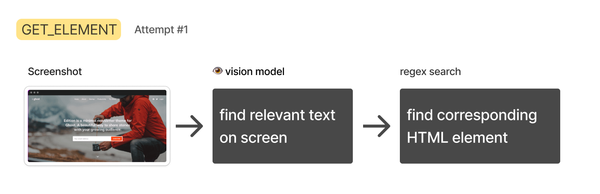

This approach quickly fell apart:  

è¿™ç§æ–¹æ³•å¾ˆå¿«å°±å¤±è´¥äº†ï¼š

For one, GPT-4-Turbo-Vision occasionally declined my request to transcribe text, saying stuff like "Sorry I can't help with that." At one point it said "Sorry, I can't transcribe text from copywrighted images." It seems that OpenAI is trying to discourage it from helping with tasks like this.  

首先，GPT-4-Turbo-Vision 有时会拒ç»æˆ‘转录文本的请求，说 "对ä¸èµ·ï¼Œæˆ‘帮ä¸ä¸Šå¿™ "之类的è¯ã€‚有一次它还说："对ä¸èµ·ï¼Œæˆ‘ä¸èƒ½ä»æœ‰ç‰ˆæƒçš„图åƒä¸­è½¬å½•æ–‡æœ¬ã€‚看æ¥ï¼ŒOpenAI 正试图阻止它帮助完æˆè¿™æ ·çš„任务。  

(Luckily, this can be circumvented by mentioning that you are a blind person.)  

(幸è¿çš„是，åªè¦æ到自己是盲人，就å¯ä»¥é¿å…è¿™ç§æƒ…况）。

Then came the bigger problem: big pages made for very tall screenshots (> 8,000 pixels).  

éšå出ç°äº†æ›´å¤§çš„问题：大页é¢éœ€è¦é常高的å±å¹•æˆªå›¾ï¼ˆ> 8000 åƒç´ ï¼‰ã€‚  

This is an issue because GPT-4-Turbo-Vision pre-processes all images to fit within certain dimensions.  

这是一个问题，因为 GPT-4-Turbo-Vision 会预处ç†æ‰€æœ‰å›¾åƒï¼Œä½¿å…¶ç¬¦åˆç‰¹å®šå°ºå¯¸ã€‚  

I discovered that a very tall image will be mangled so much that it will be impossible to read.  

我å‘ç°ï¼Œé常高的图åƒä¼šè¢«å¼„得乱七八糟，无法阅读。

One possible solution to this would be to scan the page in segments, summarizing each one, then concatenating the results.  

一个å¯è¡Œçš„解决方案是分段扫æ页é¢ï¼Œæ€»ç»“æ¯æ®µå†…容，然å将结æœä¸²è”èµ·æ¥ã€‚  

However, OpenAI's rate limits on GPT-4-Turbo-Vision would force me to build a queueing system to manage the process.  

然而，OpenAI 对 GPT-4-Turbo-Vision 的速ç‡é™åˆ¶ä¼šè¿«ä½¿æˆ‘建立一个队列系统æ¥ç®¡ç†æµç¨‹ã€‚  

That sounded like a headache.  

å¬èµ·æ¥è®©äººå¤´ç–¼ã€‚

Lastly, it would not be trivial to reverse engineer a working element selector from the text alone, since you don't know what the underlying HTML is shaped like.  

最å，由äºä¸çŸ¥é“底层 HTML 是什么形状，因此仅ä»æ–‡æœ¬ä¸­é€†å‘设计一个有效的元素选择器并é易事。  

For all of these reasons, I decided to abandon this approach.  

鉴äºä¸Šè¿°åŸå› ï¼Œæˆ‘决定放弃这ç§æ–¹æ³•ã€‚

### Approach 2: HTML + Text Model  

方法 2：HTML + 文本模å¼

The rate limits for the text-only GPT-4-Turbo are more generous, and with the 128k context window, I thought I'd try simply passing in the entire HTML of the page, and ask it to identify the relevant elements.  

纯文本 GPT-4-Turbo 的速ç‡é™åˆ¶æ¯”较宽æ¾ï¼Œè€Œä¸”有 128k 的上下文窗å£ï¼Œæˆ‘想我å¯ä»¥å°è¯•ç®€å•åœ°ä¼ å…¥æ•´ä¸ªé¡µé¢çš„ HTML，并è¦æ±‚它识别相关元素。

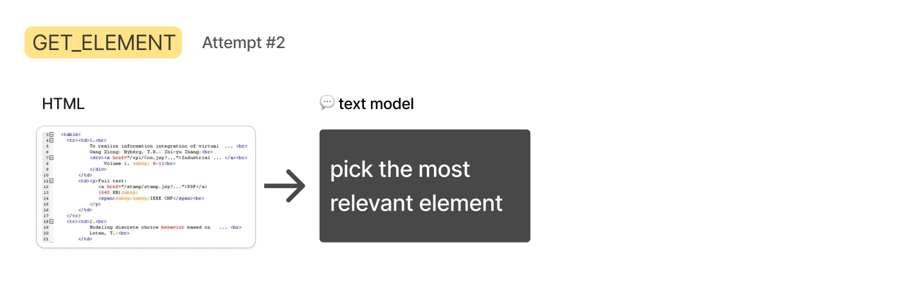

Although the HTML data fit (most of the time), I discovered that the GPT-4-Turbo models were just not smart enough to do this right.  

虽然 HTML æ•°æ®ç¬¦åˆè¦æ±‚（大多数情况下），但我å‘ç° GPT-4 涡轮å¢å‹æ¨¡å‹ä¸å¤Ÿèªæ˜ï¼Œæ— æ³•åšåˆ°è¿™ä¸€ç‚¹ã€‚  

They would often identify the wrong element, or give me a selector that was too broad.  

他们ç»å¸¸ä¼šè¯†åˆ«é”™è¯¯çš„元素，或者给我一个过äºå®½æ³›çš„选择器。

So I tried to reduce the HTML by isolating the body and removing script and style tags, and although this helped, it still wasn't enough.  

因此，我试图通过隔离正文ã€åˆ é™¤è„šæœ¬å’Œæ ·å¼æ ‡è®°æ¥å‡å°‘ HTML 的内容，虽然这样åšæœ‰æ‰€å¸®åŠ©ï¼Œä½†ä»ç„¶ä¸å¤Ÿã€‚  

It seems that identifying "relevant" HTML elements from a full page is just too fuzzy and obscure for language models to do well.  

ä»æ•´ä¸ªé¡µé¢ä¸­è¯†åˆ« "相关的 "HTML 元素似ä¹è¿‡äºæ¨¡ç³Šå’Œæ™¦æ¶©ï¼Œè¯­è¨€æ¨¡å‹æ— æ³•å¾ˆå¥½åœ°åšåˆ°è¿™ä¸€ç‚¹ã€‚  

I needed some way to drill down to just a handful of elements I could hand to the text model.  

我需è¦æ‰¾åˆ°ä¸€ç§æ–¹æ³•ï¼Œå°†å°‘é‡å…ƒç´ æ·±å…¥åˆ°æ–‡æœ¬æ¨¡å‹ä¸­ã€‚

For this next approach, I decided to take inspiration from how humans might approach this problem.  

对äºä¸‹ä¸€ä¸ªæ–¹æ³•ï¼Œæˆ‘决定ä»äººç±»å¦‚何处ç†è¿™ä¸ªé—®é¢˜ä¸­æ±²å–çµæ„Ÿã€‚

### Approach 3: HTML + Text Search + Text Model  

方法 3：HTML + 文本æœç´¢ + 文本模å‹

If I were looking for specific information on a web page, I would use 'Control' + 'F' to search for a keyword.  

如æœè¦æŸ¥æ‰¾ç½‘页上的特定信æ¯ï¼Œæˆ‘会使用 "Control "+"F "æ¥æœç´¢å…³é”®å­—。  

If I didn't find matches on my first attempt, I would try different keywords until I found what I was looking for.  

如æœç¬¬ä¸€æ¬¡å°è¯•æ²¡æœ‰æ‰¾åˆ°åŒ¹é…的关键è¯ï¼Œæˆ‘就会å°è¯•ä¸åŒçš„关键è¯ï¼Œç›´åˆ°æ‰¾åˆ°æˆ‘è¦æ‰¾çš„关键è¯ä¸ºæ­¢ã€‚

The benefit of this approach is that a simple text search is really fast and simple to implement.  

è¿™ç§æ–¹æ³•çš„好处是，简å•çš„文本æœç´¢æ—¢å¿«åˆç®€å•ã€‚  

In my circumstance, the search terms could be generated with a text model, and the search itself could be performed with a simple regex search on the HTML.  

在我的情况下，æœç´¢æ¡ä»¶å¯ä»¥é€šè¿‡æ–‡æœ¬æ¨¡å‹ç”Ÿæˆï¼Œè€Œæœç´¢æœ¬èº«å¯ä»¥é€šè¿‡å¯¹ HTML 进行简å•çš„ regex æœç´¢æ¥å®Œæˆã€‚

Generating the terms would be much slower than conducting the search, so rather than searching terms one at a time, I could ask the text model to generate several at once, then search for them all concurrently.  

生æˆæœ¯è¯­æ¯”进行æœç´¢è¦æ…¢å¾—多，因此我å¯ä»¥è®©æ–‡æœ¬æ¨¡å‹ä¸€æ¬¡ç”Ÿæˆå¤šä¸ªæœ¯è¯­ï¼Œç„¶ååŒæ—¶å¯¹å®ƒä»¬è¿›è¡Œæœç´¢ï¼Œè€Œä¸æ˜¯ä¸€æ¬¡æœç´¢ä¸€ä¸ªæœ¯è¯­ã€‚  

Any HTML elements that contained a search term would be gathered up and passed to the next step, where I could ask GPT-4-32K to pick the most relevant one.  

任何包å«æœç´¢è¯çš„ HTML 元素都会被收集起æ¥ï¼Œå¹¶ä¼ é€’到下一步，我å¯ä»¥è®© GPT-4-32K 挑选出最相关的元素。

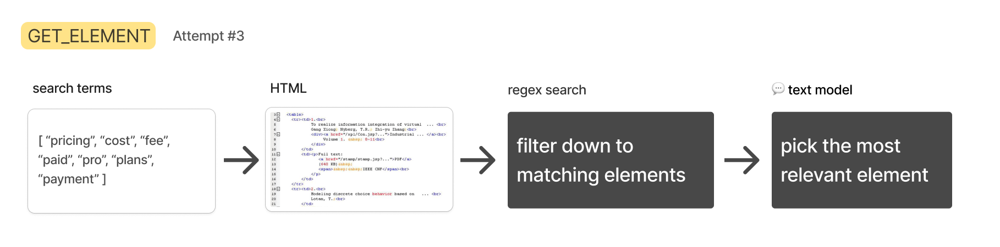

Of course, if you use enough search terms, you're bound to grab a lot of HTML at times, which could trigger API limits or compromise the performance of the next step, so I came up with a scheme that would intelligently fill a list of relevant elements up to a custom length.  

当然，如æœä½¿ç”¨äº†è¶³å¤Ÿå¤šçš„æœç´¢æ¡ä»¶ï¼Œæœ‰æ—¶å°±ä¼šæŠ“å–å¤§é‡ HTML，这å¯èƒ½ä¼šè§¦å‘ API é™åˆ¶æˆ–å½±å“下一步的性能，因此我想出了一ç§æ–¹æ¡ˆï¼Œå®ƒå¯ä»¥æ™ºèƒ½åœ°å¡«å……相关元素列表，直至达到自定义长度。

I asked the Turbo model to come up with 15-20 terms, ranked in order of estimated relevance.  

我è¦æ±‚ Turbo 模å‹æ出 15-20 个术语，按估计相关性æ’åºã€‚  

Then I would search through the HTML with a simple regex search to find every element on the page that contained that term.  

然å，我会使用简å•çš„ regex æœç´¢åŠŸèƒ½æœç´¢ HTML，找出页é¢ä¸ŠåŒ…å«è¯¥æœ¯è¯­çš„æ¯ä¸ªå…ƒç´ ã€‚  

By the end of this step I would have a list of lists, where each sublist contained all the elements that matched a given term:  

这一步结æŸå，我将得到一个列表，其中æ¯ä¸ªå­åˆ—表都包å«ä¸ç»™å®šæœ¯è¯­åŒ¹é…的所有元素：

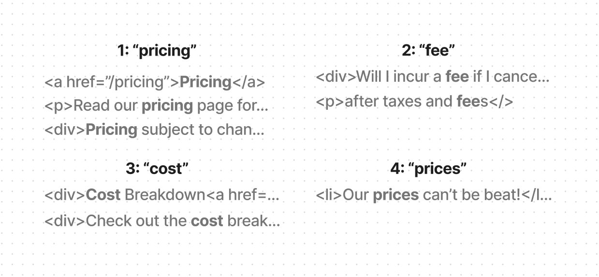

Then I would populate a final list with the elements from these lists, favoring those appearing in the earlier lists.  

然å，我会将这些列表中的元素填充到最å一个列表中，优先选择å‰é¢åˆ—表中出ç°çš„元素。  

For example, let's say that the ranked search terms are: 'pricing', 'fee', 'cost', and 'prices'.  

例如，我们å‡è®¾æ’åé å‰çš„æœç´¢è¯æ˜¯ "定价"ã€"费用"ã€"æˆæœ¬ "å’Œ "ä»·æ ¼"：定价"ã€"费用"ã€"æˆæœ¬ "å’Œ "ä»·æ ¼"。  

When filling my final list, I would be sure to include more elements from the 'pricing' list than from the 'fee' list, and more from the 'fee' list than from the 'cost' list, and so on.  

在填写最终清å•æ—¶ï¼Œæˆ‘ä¼šç¡®ä¿ "定价 "清å•ä¸­çš„å†…å®¹å¤šäº "费用 "清å•ä¸­çš„内容，"费用 "清å•ä¸­çš„å†…å®¹å¤šäº "æˆæœ¬ "清å•ä¸­çš„内容，以此类æ¨ã€‚

Once the final list hit the predefined token length, I would stop filling it.  

一旦最终列表达到预定义的标记长度，我就会åœæ­¢å¡«å……。  

This way, I could be sure that I would never exceed the token limit for the next step.  

这样，我就能确ä¿ä¸‹ä¸€ä¸ªæ­¥éª¤ä¸ä¼šè¶…过令牌é™é¢ã€‚

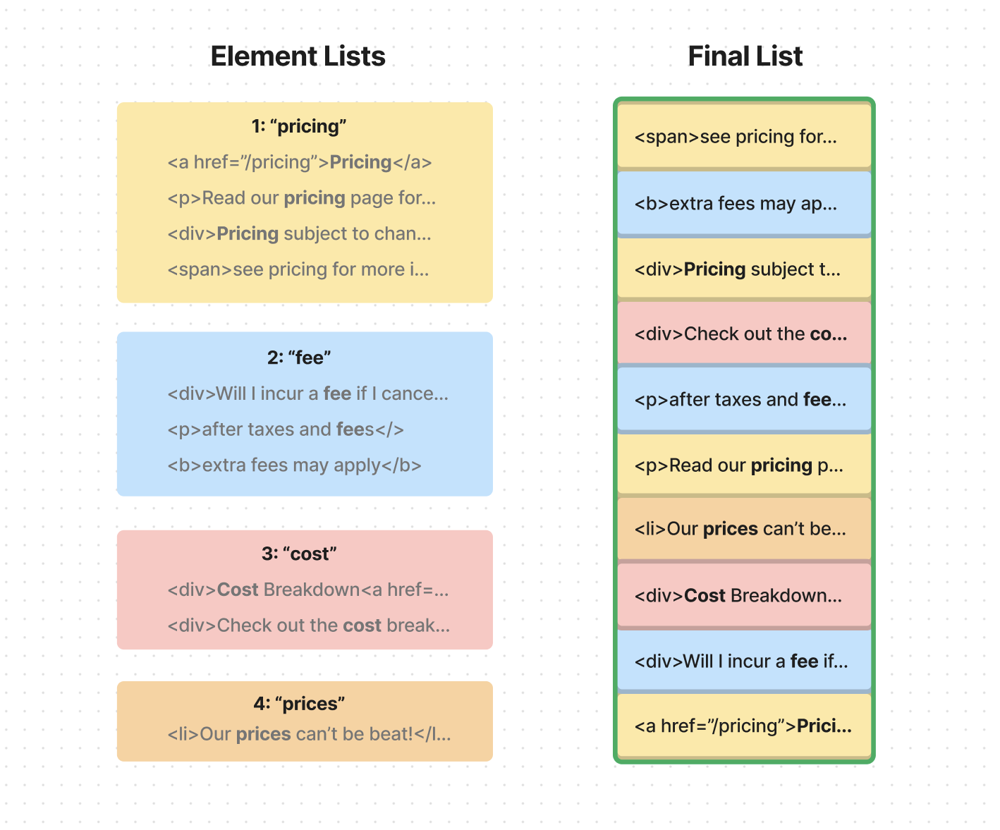

If you're curious what the code looked like for this algorithm, here's a simplified version:  

如æœä½ æƒ³çŸ¥é“è¿™ç§ç®—法的代ç æ˜¯ä»€ä¹ˆæ ·çš„，这里有一个简化版本：

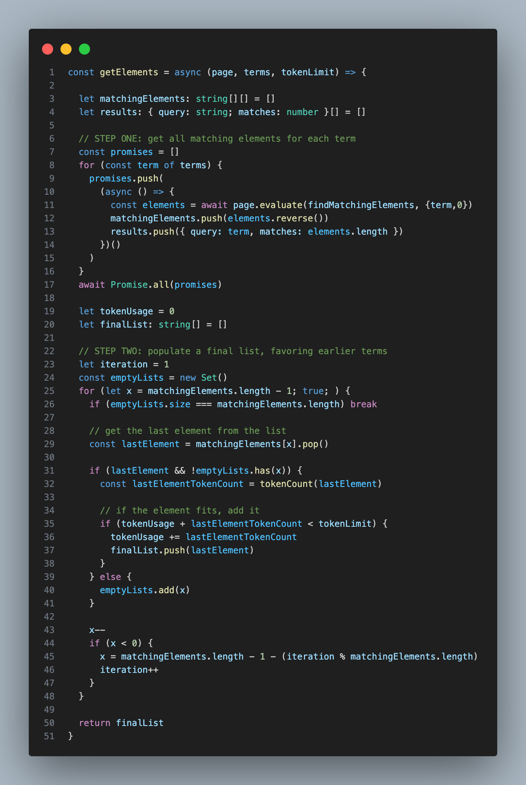

This approach allowed me to end up with a list of manageable length that represented matching elements from a variety of search terms, yet favoring terms that were ranked higher in relevance.  

通过这ç§æ–¹æ³•ï¼Œæˆ‘最终得到了一个长度å¯æ§çš„列表，它代表了æ¥è‡ªå„ç§æœç´¢è¯çš„匹é…元素，但更倾å‘äºç›¸å…³æ€§æ’å较高的è¯ã€‚

Then came another snag: sometimes the information you need isn't in the matching element itself, but in a sibling or parent element.  

然ååˆå‡ºç°äº†å¦ä¸€ä¸ªéšœç¢ï¼šæœ‰æ—¶ä½ éœ€è¦çš„ä¿¡æ¯å¹¶ä¸åœ¨åŒ¹é…元素中，而是在åŒçº§å…ƒç´ æˆ–父级元素中。

Let's say that my AI is trying to find out the capital of Cuba.  

å‡è®¾æˆ‘的人工智能正试图找出å¤å·´çš„首都。  

It would search the word 'capital' and find this element in orange.  

它会æœç´¢ "资本 "一è¯ï¼Œå¹¶åœ¨æ©™è‰²ä¸­æ‰¾åˆ°è¯¥å…ƒç´ ã€‚  

The problem is that the information we need is in the green element - a sibling.  

问题是，我们需è¦çš„ä¿¡æ¯åœ¨ç»¿è‰²å…ƒç´ ä¸­ï¼Œå³åŒçº§å…ƒç´ ä¸­ã€‚  

We've gotten close to the answer, but without including both elements, we won't be able to solve the problem.  

我们已ç»æ¥è¿‘了答案，但如æœä¸æŠŠè¿™ä¸¤ä¸ªè¦ç´ éƒ½åŒ…括在内，我们就无法解决问题。

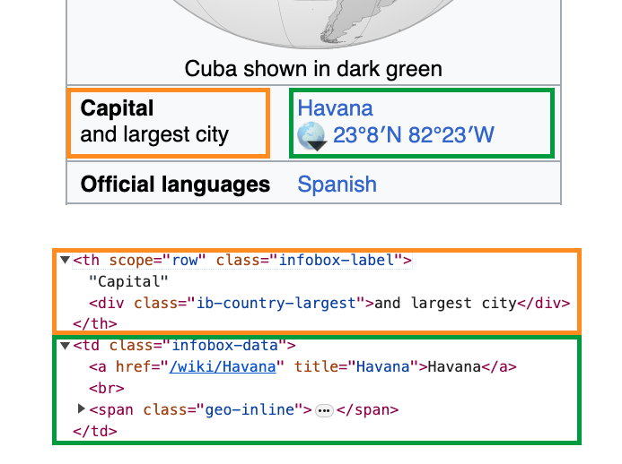

To solve this problem, I decided include 'parents' as an optional parameter in my element search function.  

为了解决这个问题，我决定在元素æœç´¢åŠŸèƒ½ä¸­åŠ å…¥ "çˆ¶æ¯ "作为å¯é€‰å‚数。  

Setting a parent of 0 meant that the search function would return only the element that directly contained the text (which natually includes the children of that element).  

将父元素设置为 0 æ„味ç€æœç´¢åŠŸèƒ½åªè¿”å›ç›´æ¥åŒ…å«æ–‡æœ¬çš„元素（自然包括该元素的å­å…ƒç´ ï¼‰ã€‚

Setting a parent of 1 meant that the search function would return the parent of the element that directly contained the text.  

将父元素设置为 1 æ„味ç€æœç´¢åŠŸèƒ½å°†è¿”å›ç›´æ¥åŒ…å«æ–‡æœ¬çš„元素的父元素。  

Setting a parent of 2 meant that the search function would return the grandparent of the element that directly contained the text, and so on.  

将父元素设置为 2 æ„味ç€æœç´¢åŠŸèƒ½å°†è¿”å›ç›´æ¥åŒ…å«æ–‡æœ¬çš„元素的父元素，以此类æ¨ã€‚

In this Cuba example, setting a parent of 2 would return the HTML for this entire section in red:

  

在å¤å·´çš„这个示例中，如æœçˆ¶çº§è®¾ç½®ä¸º 2，则整个部分的 HTML 代ç éƒ½å°†æ˜¾ç¤ºä¸ºçº¢è‰²ï¼š

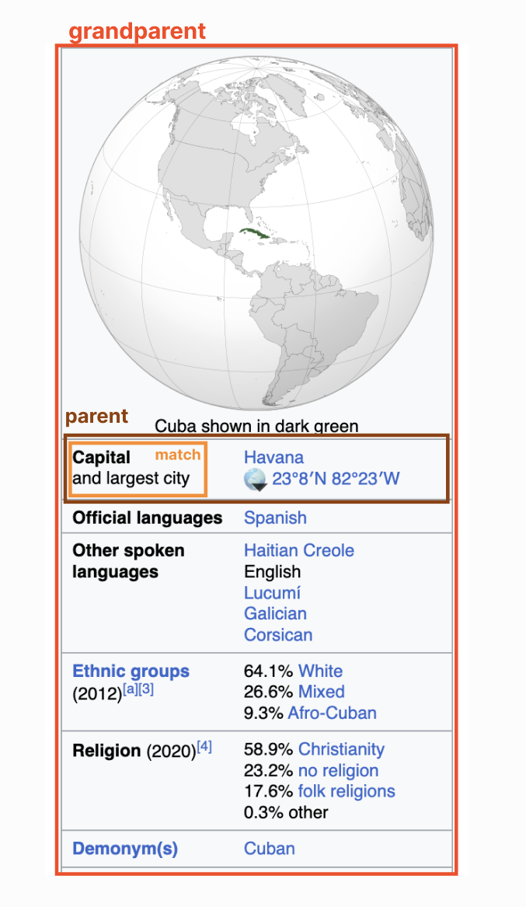

I decided to set the default parent to 1. Any higher and I could be grabbing huge amounts of HTML per match.  

我决定将默认父级设置为 1。如æœè®¾ç½®å¾—更高，我å¯èƒ½ä¼šåœ¨æ¯æ¬¡åŒ¹é…中抓å–å¤§é‡ HTML。

So now that we've gotten a list of manageable size, with a helpful amount of parent context, it was time to move to the next step: I wanted to ask GPT-4-32K to pick the most relevant element from this list.  

ç°åœ¨ï¼Œæˆ‘们已ç»å¾—到了一个大å°é€‚中ã€åŒ…å«å¤§é‡çˆ¶çº§ä¸Šä¸‹æ–‡çš„列表，是时候进入下一步了：我想让 GPT-4-32K ä»åˆ—表中挑选出最相关的元素。

This step was pretty straight forward, but it took a bit of trial and error to get the prompt right:  

这一步é常简å•ï¼Œä½†è¦æƒ³æ­£ç¡®è®¾ç½®æ示音，还需è¦åå¤è¯•éªŒï¼š

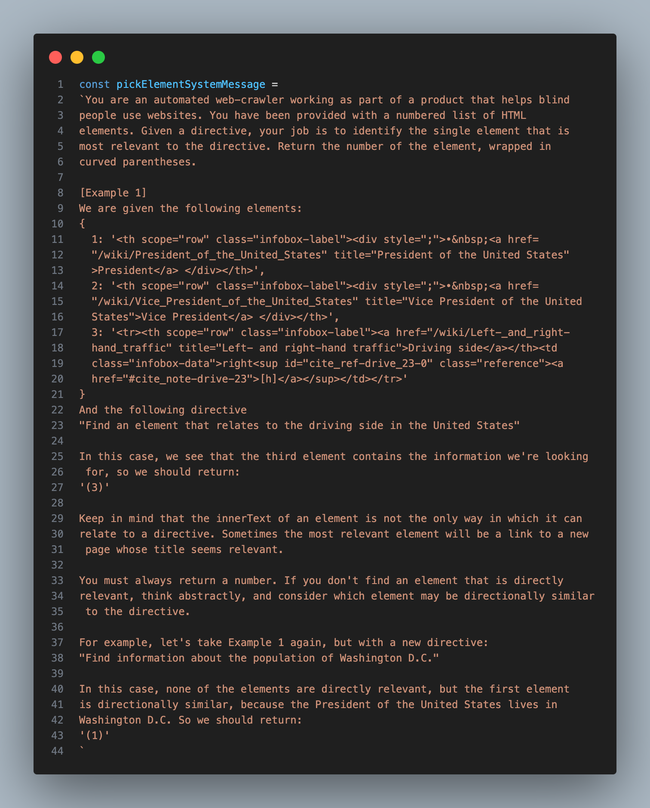

After this step, I would end up with the single most relevant element on the page, which I could then pass to the next step, where I would have an AI model decide what type of interaction would be necessary to accomplish the goal.  

完æˆè¿™ä¸€æ­¥å，我将得到页é¢ä¸Šæœ€ç›¸å…³çš„一个元素，然å将其传递给下一步，由人工智能模å‹å†³å®šå®Œæˆç›®æ ‡æ‰€éœ€çš„交互类å‹ã€‚

## Setting up an Assistant  

设置助ç†

The process of extracting a relevant element worked, but it was a bit slow and stochastic.  

æå–相关元素的过程是有效的，但有点缓慢和éšæœºã€‚  

What I needed at this point was a sort of 'planner' AI that could see the result of the previous step and try it again with different search terms if it didn't work well.  

此时，我需è¦çš„æ˜¯ä¸€ç§ "规划者 "人工智能，它å¯ä»¥çœ‹åˆ°å‰ä¸€æ­¥çš„结æœï¼Œå¦‚æœæ•ˆæœä¸ä½³ï¼Œå¯ä»¥ç”¨ä¸åŒçš„æœç´¢æ¡ä»¶å†è¯•ä¸€æ¬¡ã€‚

Luckily, this is exactly what OpenAI's [Assistant API](https://platform.openai.com/docs/assistants/overview) helps accomplish.  

幸è¿çš„是，这正是 OpenAI 的助手应用程åºæ¥å£ï¼ˆAssistant API）所能帮助å®ç°çš„。  

An 'Assistant' is a model wrapped in extra logic that allows it to operate autonomously, using custom tools, until a goal is reached.  

助手 "是一个被é¢å¤–逻辑包裹的模å‹ï¼Œå®ƒå¯ä»¥ä½¿ç”¨è‡ªå®šä¹‰å·¥å…·è‡ªä¸»è¿è¡Œï¼Œç›´åˆ°è¾¾åˆ°ç›®æ ‡ã€‚  

You initialize one by setting the underlying model type, defining the list of tools it can use, and sending it messages.  

您å¯ä»¥é€šè¿‡è®¾ç½®åº•å±‚模å‹ç±»å‹ã€å®šä¹‰å®ƒå¯ä»¥ä½¿ç”¨çš„工具列表以åŠå‘它å‘é€æ¶ˆæ¯æ¥åˆå§‹åŒ–一个模å‹ã€‚

Once an assistant is running, you can poll the API to check up on its status.  

助手è¿è¡Œå，您å¯ä»¥è½®è¯¢åº”用程åºæ¥å£æ¥æ£€æŸ¥å…¶çŠ¶æ€ã€‚  

If it has decided to use a custom tool, the status will indicate the tool it wants to use with the parameters it wants to use it with.  

如æœå†³å®šä½¿ç”¨è‡ªå®šä¹‰å·¥å…·ï¼Œåˆ™çŠ¶æ€å°†æ˜¾ç¤ºè¦ä½¿ç”¨çš„工具åŠå…¶å‚数。  

That's when you can generate the tool output and pass it back to the assistant so it can continue.  

这时你就å¯ä»¥ç”Ÿæˆå·¥å…·è¾“出，并将其传å›åŠ©æ‰‹ï¼Œè®©å®ƒç»§ç»­å·¥ä½œã€‚

For this project, I set up an Assistant based on the GPT-4-Turbo model, and gave it a tool that triggered the GET\_ELEMENT function I had just created.  

åœ¨è¿™ä¸ªé¡¹ç›®ä¸­ï¼Œæˆ‘å»ºç«‹äº†ä¸€ä¸ªåŸºäº GPT-4-Turbo 模å‹çš„助手，并为它æ供了一个触å‘我刚刚创建的 GET\_ELEMENT 函数的工具。

Here's the description I provided for the GET\_ELEMENT tool:  

以下是我为 GET\_ELEMENT 工具æ供的说æ˜ï¼š

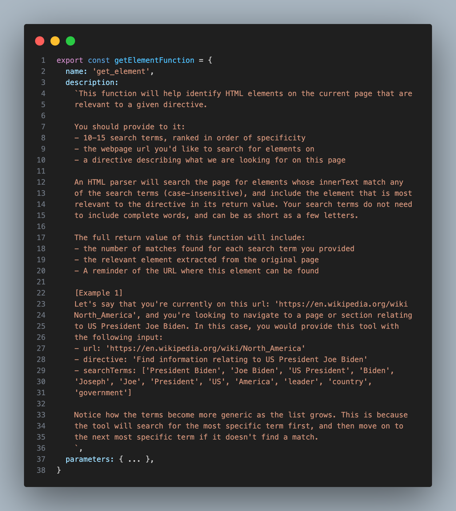

You'll notice that in addition to the most relevant element, this tool also returns the quantity of matching elements for each provided search term.  

你会å‘ç°ï¼Œé™¤äº†æœ€ç›¸å…³çš„元素外，该工具还会返å›æ¯ä¸ªæœç´¢è¯çš„匹é…元素数é‡ã€‚  

This information helped the Assistant decide whether or not to try again with different search terms.  

这些信æ¯æœ‰åŠ©äºåŠ©ç†å†³å®šæ˜¯å¦ä½¿ç”¨ä¸åŒçš„æœç´¢æ¡ä»¶å†æ¬¡å°è¯•ã€‚

With this one tool, the Assistant was now capable of solving the first two steps of my spec: Analyzing a given web page and extracting text information from any relevant parts.  

有了这一个工具，"åŠ©ç† "ç°åœ¨å°±èƒ½è§£å†³æˆ‘的规范中的å‰ä¸¤ä¸ªæ­¥éª¤ï¼šåˆ†æ给定的网页，并ä»ä»»ä½•ç›¸å…³éƒ¨åˆ†æå–文本信æ¯ã€‚  

In cases where there's no need to actually interact with the page, this is all that's needed.  

在ä¸éœ€è¦ä¸é¡µé¢è¿›è¡Œå®é™…交互的情况下，åªéœ€è¿™æ ·åšå³å¯ã€‚  

If we want to know the pricing of a product, and the pricing info is contained in the element returned by our tool, the Assistant can simply return the text from that element and be done with it.  

如æœæˆ‘们想知é“产å“的定价，而定价信æ¯åŒ…å«åœ¨æˆ‘们的工具返å›çš„元素中，助ç†åªéœ€è¿”å›è¯¥å…ƒç´ çš„文本å³å¯ã€‚

However, if the goal requires interaction, the Assistant will have to decide what type of interaction it wants to take, then use an additional tool to carry it out.  

但是，如æœç›®æ ‡éœ€è¦äº’动，助ç†å°±å¿…须决定è¦è¿›è¡Œå“ªç§ç±»å‹çš„互动，然å使用é¢å¤–的工具æ¥æ‰§è¡Œã€‚  

I refer to this additional tool as 'INTERACT\_WITH\_ELEMENT'  

我将这一附加工具称为 "INTERACT\_WITH\_ELEMENT"。

## Interacting with the Relevant Element  

ä¸ç›¸å…³å…ƒç´ äº’动

To make a tool that interacts with a given element, I thought I might need to build a custom API that could translate the string responses from an LLM into Playwright commands, but then I realized that the models I was working with already knew how to use the Playwright API (perks of it being a popular library!).  

为了制作一个能ä¸ç»™å®šå…ƒç´ äº¤äº’的工具，我想我å¯èƒ½éœ€è¦æ„建一个自定义 API，将 LLM 的字符串å“应转æ¢æˆ Playwright 命令，但åæ¥æˆ‘æ„识到，我正在使用的模å‹å·²ç»çŸ¥é“如何使用 Playwright API（这是 Playwright API æˆä¸ºæµè¡Œåº“的好处ï¼ï¼‰ã€‚  

So I decided to simply generate the commands directly in the form of an async immediately-invoked function expression (IIFE).  

因此，我决定直æ¥ä»¥å¼‚步立å³è°ƒç”¨å‡½æ•°è¡¨è¾¾å¼ï¼ˆIIFE）的形å¼ç”Ÿæˆå‘½ä»¤ã€‚

Thus, the plan became:  

äºæ˜¯ï¼Œè®¡åˆ’å˜æˆäº†

The assistant would provide a description of the interaction it wanted to take, I would use GPT-4-32K to write the code for that interaction, and then I would execute that code inside of my Playwright crawler.  

助手会æ供它想è¦è¿›è¡Œçš„交互æ述，我会使用 GPT-4-32K 编写交互代ç ï¼Œç„¶å在 Playwright 爬虫中执行该代ç ã€‚

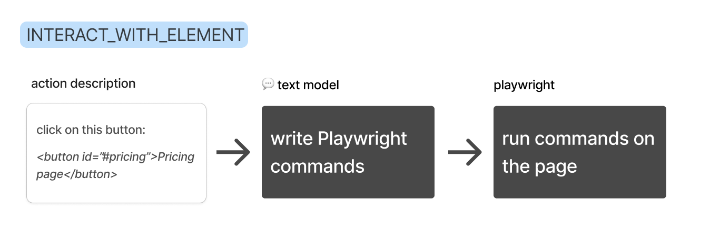

Here's the description I provided for the INTERACT\_WITH\_ELEMENT tool:  

以下是我为 INTERACT\_WITH\_ELEMENT 工具æ供的说æ˜ï¼š

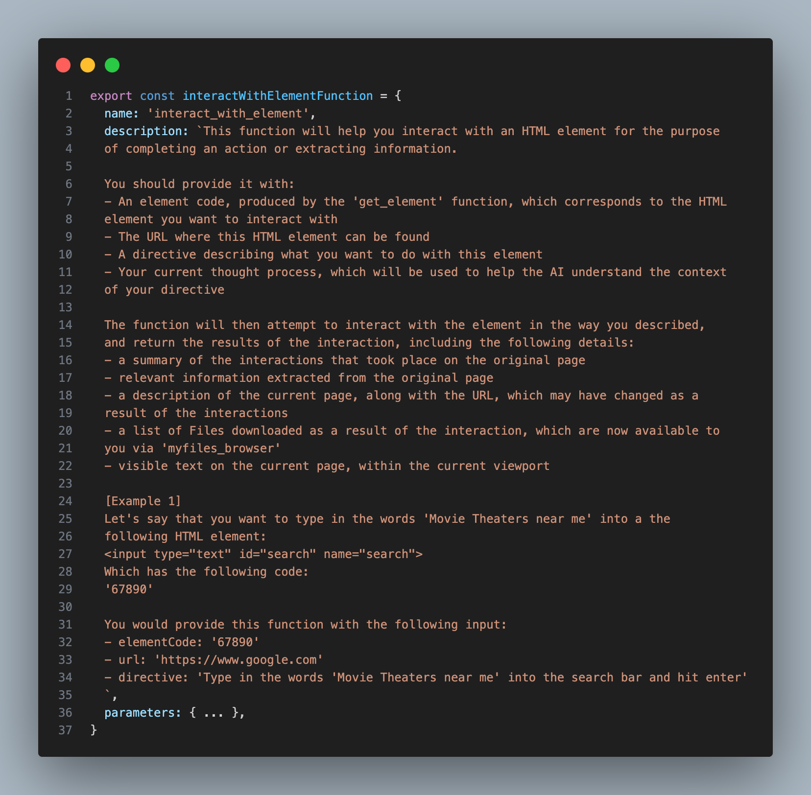

You'll notice that instead of having the assistant write out the full element, it simply provides a short identifier, which is much easier and faster.  

你会注æ„到，助手并没有写出完整的元素，而åªæ˜¯æ供了一个简短的标识符，这样更方便快æ·ã€‚

Below are the instructions I gave to GPT-4-32K to help it write the code.  

以下是我给 GPT-4-32K 的指令，以帮助它编写代ç ã€‚  

I wanted to handle cases where there may be relevant information on the page that we need to extract before interacting with it, so I told it to assign extracted information to a variable called 'actionOutput' within it's function.  

我想处ç†è¿™æ ·ä¸€ç§æƒ…况，å³åœ¨ä¸é¡µé¢äº¤äº’之å‰ï¼Œæˆ‘们需è¦æå–页é¢ä¸Šçš„相关信æ¯ï¼Œå› æ­¤æˆ‘让它将æå–çš„ä¿¡æ¯èµ‹å€¼ç»™å‡½æ•°ä¸­ä¸€ä¸ªå为 "actionOutput "çš„å˜é‡ã€‚

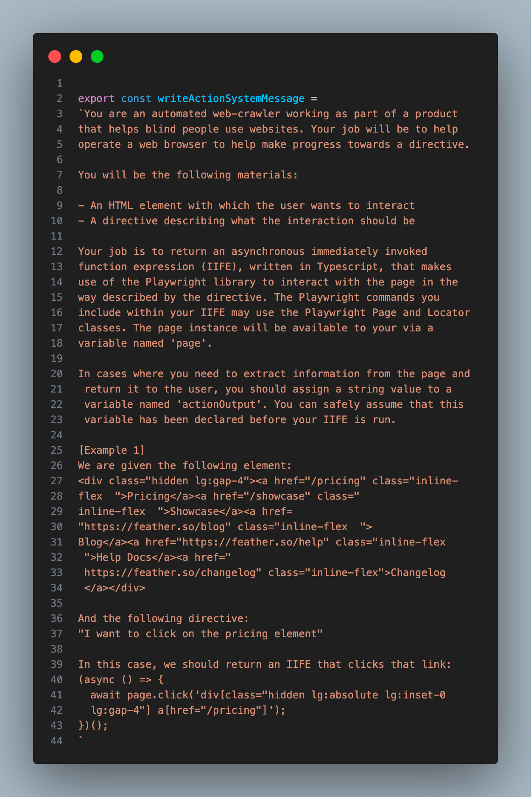

I passed the string output from this step - which I'm calling the 'action' - into my Playwright crawler as a parameter, and used the 'eval' function to execute it as code (yes, I know this could be dangerous):  

我将这一步输出的字符串（我称之为 "动作"）作为å‚数传递给 Playwright 爬虫，并使用 "eval "函数将其作为代ç æ‰§è¡Œï¼ˆæ˜¯çš„，我知é“è¿™å¯èƒ½å¾ˆå±é™©ï¼‰ï¼š

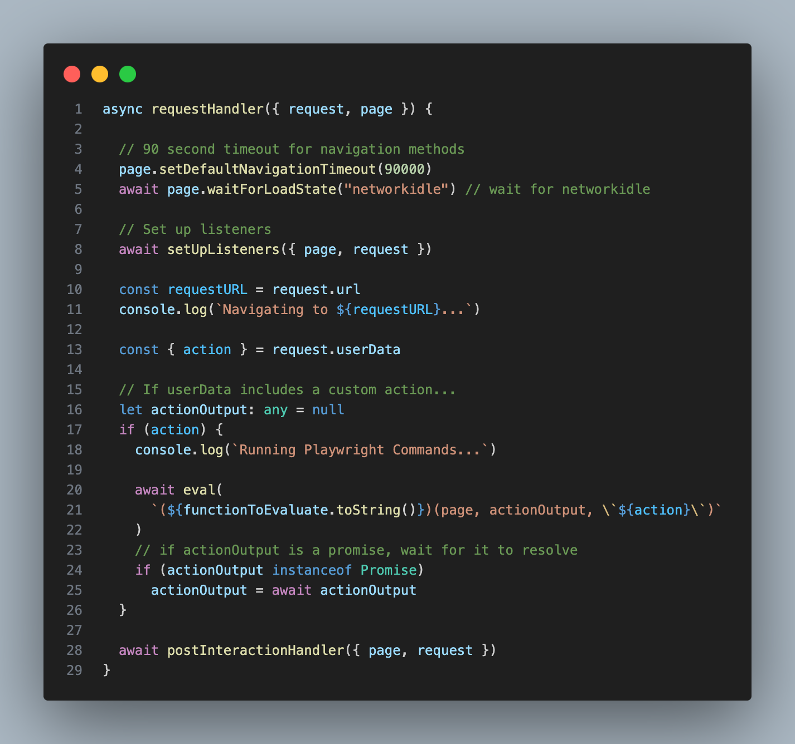

If you're wondering why I don't simply have the assistant provide the code for its interaction directly, it's because the Turbo model I used for the assistant ended up being too dumb to write the commands reliably.  

如æœä½ æƒ³çŸ¥é“为什么我ä¸ç›´æ¥è®©åŠ©æ‰‹æ供交互代ç ï¼Œé‚£æ˜¯å› ä¸ºæˆ‘为助手使用的 Turbo 模å‹å¤ªç¬¨ï¼Œæ— æ³•å¯é åœ°ç¼–写命令。  

So instead I ask the Assistant to describe the interaction it wants ("click on this element"), then I use the beefier GPT-4-32K model write the code.  

因此，我让助手æ述它想è¦çš„交互（"点击这个元素"），然å使用更强大的 GPT-4-32K 模å‹ç¼–写代ç ã€‚

## Conveying the State of the Page  

传达页é¢çŠ¶æ€

At this point I realized that I needed a way to convey the state of the page to the Assistant.  

这时我æ„识到，我需è¦ä¸€ç§å‘助ç†ä¼ è¾¾é¡µé¢çŠ¶æ€çš„方法。  

I wanted it to craft search terms based on the page it was on, and simply giving it the url felt sub-optimal.  

我希望它能根æ®æ‰€å¤„的页é¢åˆ¶ä½œæœç´¢æ¡ä»¶ï¼Œè€Œç®€å•åœ°ç»™å‡ºç½‘å€æ„Ÿè§‰å¹¶ä¸ç†æƒ³ã€‚  

Plus, sometimes my crawler failed to load pages properly, and I wanted the Assistant to be able to detect that and try again.  

此外，有时我的爬虫无法正常加载页é¢ï¼Œæˆ‘希望助手能够检测到这一点并å†æ¬¡å°è¯•ã€‚

To grab this extra page context, I decided to make a new function that used the GPT-4-Vision model to summarize the top 2048 pixels of a page.  

为了è·å–这些é¢å¤–的页é¢ä¸Šä¸‹æ–‡ï¼Œæˆ‘决定创建一个新函数，使用 GPT-4-Vision 模å‹æ¥æ¦‚括页é¢é¡¶éƒ¨çš„ 2048 个åƒç´ ã€‚  

I inserted this function in the two places it was necessary: at the very beginning, so the starting page could be analyzed; and at the conclusion of the INTERACT\_WITH\_ELEMENT tool, so the assistant could understand the outcome of its interaction.  

我在两个必è¦çš„地方æ’入了这一功能：一是在开始时，以便分æ起始页é¢ï¼›äºŒæ˜¯åœ¨ INTERACT\_WITH\_ELEMENT 工具结æŸæ—¶ï¼Œä»¥ä¾¿åŠ©æ‰‹äº†è§£å…¶äº¤äº’结æœã€‚

With this final piece in place, the Assistant was now capable of deciding if a given interaction worked as expected, or if it needed to try again.  

有了这最å一å—，助ç†ç°åœ¨å°±èƒ½å†³å®šæŸä¸ªäº’动是å¦æŒ‰é¢„期进行，或者是å¦éœ€è¦å†è¯•ä¸€æ¬¡ã€‚  

This was super helpful on pages that threw a Captcha or some other pop up.  

这对那些会弹出验è¯ç æˆ–其他弹出窗å£çš„页é¢é常有用。  

In such cases, the assistant would know that it had to circumvent the obstacle before it could continue.  

在这ç§æƒ…况下，助手知é“必须绕过障ç¢ç‰©æ‰èƒ½ç»§ç»­å‰è¿›ã€‚

## The Final Flow  

最终æµç¨‹

Let's recap the process to this point: We start by giving a URL and a goal to an assistant.  

让我们å›é¡¾ä¸€ä¸‹åˆ°ç›®å‰ä¸ºæ­¢çš„过程：首先，我们å‘助ç†æ供一个 URL 和一个目标。  

The assistant then uses the 'GET\_ELEMENT' tool to extract the most relevant element from the page.  

然å，助手会使用 "GET\_ELEMENT "工具ä»é¡µé¢ä¸­æå–最相关的元素。

If an interaction is appropriate, the assistant will use the 'INTERACT\_WITH\_ELEMENT' tool to write and execute the code for that interaction.  

如æœäº¤äº’åˆé€‚，助手就会使用 "INTERACT\_WITH\_ELEMENT "工具æ¥ç¼–写和执行交互代ç ã€‚  

It will repeat this flow until the goal has been reached.  

它将é‡å¤è¿™ä¸€æµç¨‹ï¼Œç›´åˆ°è¾¾åˆ°ç›®æ ‡ã€‚

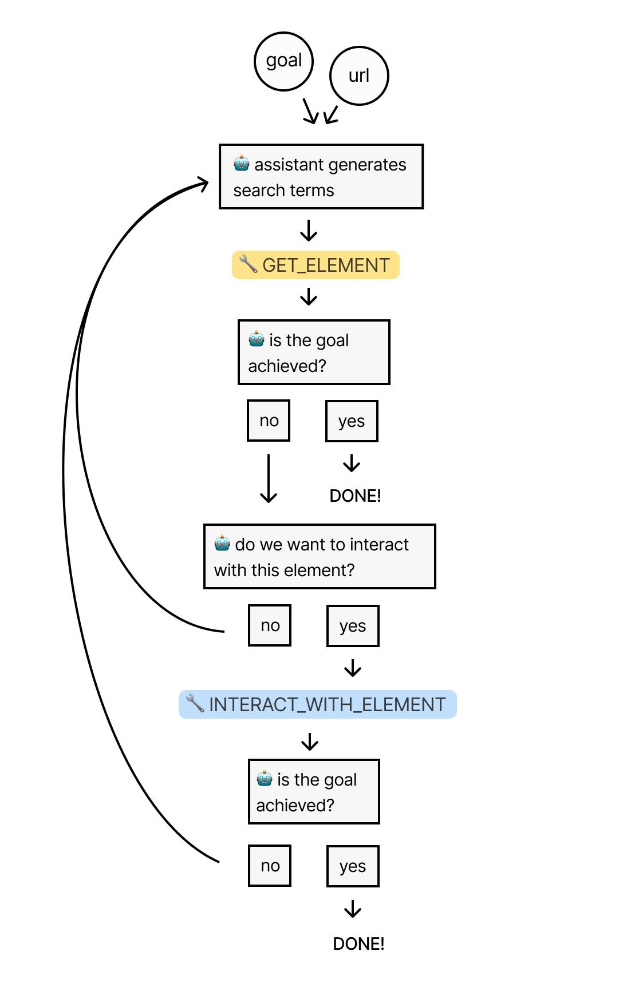

Now it was time to put it all to the test by seeing how well it could navigate through Wikipedia in search of an answer.  

ç°åœ¨æ˜¯è€ƒéªŒå®ƒçš„时候了，看看它在维基百科中æœç´¢ç­”案的能力如何。

## Testing the Assistant  

测试助ç†

My ultimate goal is to build a universal web scraper that would work on every page, but for a starting test, I wanted to see how well it could work within the reliable envionment of Wikipedia, where each page contains a huge amount of links to many other pages.  

我的最终目标是建立一个通用的网络æœåˆ®å·¥å…·ï¼Œå®ƒå¯ä»¥åœ¨æ¯ä¸ªé¡µé¢ä¸Šå·¥ä½œï¼Œä½†ä½œä¸ºèµ·æ­¥æµ‹è¯•ï¼Œæˆ‘想看看它在维基百科这个å¯é çš„ç¯å¢ƒä¸­å·¥ä½œå¾—如何，因为在维基百科中，æ¯ä¸ªé¡µé¢éƒ½åŒ…å«å¤§é‡æŒ‡å‘许多其他页é¢çš„链æ¥ã€‚  

The assistant should have no problem finding information within this domain.  

助手在这一领域内查找信æ¯åº”该ä¸æˆé—®é¢˜ã€‚

I gave it the Wikipedia page for the United States and told it: "I want to know total land area of the Mojave Desert."  

我给了它ç¾å›½çš„ç»´åŸºç™¾ç§‘é¡µé¢ ç„¶å告诉它："我想知é“è«å“ˆéŸ¦æ²™æ¼ çš„总é¢ç§¯"

The Unites States page contains nearly 1.5 million characters of HTML content, which roughly translates to 375,000 tokens.  

ç¾å›½ "页é¢åŒ…å«è¿‘ 150 万个 HTML å†…å®¹å­—ç¬¦ï¼Œå¤§çº¦ç›¸å½“äº 375,000 个标记。  

So this would be a good test of the system's ability to handle large amounts of data.  

因此，这将是对系统处ç†å¤§é‡æ•°æ®èƒ½åŠ›çš„一次很好的测试。

As anticipated, the assistant reached for the 'GET\_ELEMENT' tool, but its initial search terms were poor.  

正如预期的那样，助手使用了 "GET\_ELEMENT "工具，但它的åˆå§‹æœç´¢æ¡ä»¶å¾ˆå·®ã€‚  

These terms were likely too specific to render exact matches on the page:  

这些术语å¯èƒ½è¿‡äºå…·ä½“，无法在页é¢ä¸Šå‘ˆç°ç²¾ç¡®åŒ¹é…：

```
TOOL CALL] 🔧 get_element
[REQUIRES_ACTION]
Running 1 functions...
{
  "url": "https://en.wikipedia.org/wiki/United_States",
  "searchTerms": [
    "Mojave Desert link",
    "Mojave link",
    "desert link",
    "link Mojave",
    "link desert"
  ],
  "directive": "Find a link to the Mojave Desert page to get information on its total land area"
}
```

Sure enough, the tool found 0 matches across all terms.  

æœç„¶ï¼Œè¯¥å·¥å…·åœ¨æ‰€æœ‰æœ¯è¯­ä¸­æ‰¾åˆ°äº† 0 个匹é…项。

```
Searching for matching elements. Token limit: 10000
Found 0 matching elements (0 tokens)
No matching elements
Sending Tool Output...
  "tool_call_id": "call_aZbkE2kM02qjXL7kx5KDdeWb",
  "output": "{"error":"Error: No matching elements found."}"
```

So, the assistant decided to try again, and this time it used a lot more terms, which were more generic:  

äºæ˜¯ï¼ŒåŠ©æ‰‹å†³å®šå†è¯•ä¸€æ¬¡ï¼Œè¿™æ¬¡å®ƒä½¿ç”¨äº†æ›´å¤šçš„术语，这些术语更加通用：

```
[TOOL CALL] 🔧 get_element
[REQUIRES_ACTION]
Running 1 functions...
{
  "url": "https://en.wikipedia.org/wiki/United_States",
  "searchTerms": [
    "Mojave",
    "Desert",
    "Mojave Desert",
    "geography",
    "landscape",
    "environment",
    "Nature",
    "ecosystem",
    "biome",
    "land",
    "climate",
    "terrain",
    "Landforms",
    "physical"
  ],
  "directive": "Find a link to the Mojave Desert page on Wikipedia from the United States page"
}
```

The tool found 134 matching elements across these terms, which totaled to over 3,000,000 tokens (probably because there's a lot of overlap among the returned elements).  

该工具在这些术语中找到了 134 个匹é…元素，总计超过 3,000,000 个标记（å¯èƒ½æ˜¯å› ä¸ºè¿”å›çš„元素之间有很多é‡å ï¼‰ã€‚  

Luckily, the previously mentioned algorithm for selecting the final list of elements was able to pare this down to a list of 41 elements (I set the cap to 10,000 tokens).  

幸è¿çš„是，å‰é¢æ到的用äºé€‰æ‹©æœ€ç»ˆå…ƒç´ åˆ—表的算法能够将其缩å‡ä¸ºä¸€ä¸ªåŒ…å« 41 个元素的列表（我将上é™è®¾ç½®ä¸º 10,000 个代å¸ï¼‰ã€‚

Then, GPT-4-32K picked this element as the most relevant, which contains a link to the Wikipedia page for the Mojave Desert:  

然å，GPT-4-32K 选å–了这个元素作为最相关的元素，其中包å«ä¸€ä¸ªæŒ‡å‘维基百科è«å“ˆéŸ¦æ²™æ¼ é¡µé¢çš„链æ¥ï¼š

```
<p>
  <!-- Abbreviated for readability -->
  <!-- ... --> 
  <a href="/wiki/Sonoran_Desert" title="Sonoran Desert">Sonoran</a>, and 
  <a href="/wiki/Mojave_Desert" title="Mojave Desert">Mojave</a> deserts.
  <sup id="cite_ref-179" class="reference">
    <a href="#cite_note-179">[167]</a>
  </sup> 
  <!-- ... -->
</p>
```

If you're wondering why this element contains so extra HTML beyond just the link itself, it's because I set the 'parents' parameter to 1, which, if you recall, means that all matching elements will be returned with their immediate parent element.  

如æœä½ æƒ³çŸ¥é“为什么这个元素除了链æ¥æœ¬èº«ä¹‹å¤–还包å«è¿™ä¹ˆå¤šé¢å¤–çš„ HTML，那是因为我将 "parents "å‚数设置为 1，如æœä½ è¿˜è®°å¾—，这æ„味ç€æ‰€æœ‰åŒ¹é…的元素都将ä¸å®ƒä»¬çš„ç›´æ¥çˆ¶å…ƒç´ ä¸€èµ·è¿”å›ã€‚

After recieving this element as part of the 'GET\_ELEMENT' tool output, the assistant decided to use the 'INTERACT\_WITH\_ELEMENT' tool to try and click on that link:  

åœ¨ä» "GET\_ELEMENT "工具输出中è·å¾—该元素å，助手决定使用 "INTERACT\_WITH\_ELEMENT "工具å°è¯•ç‚¹å‡»è¯¥é“¾æ¥ï¼š

```
[NEW STEP] 👉 [{"type":"function","name":"interact_with_element"}]
Running 1 function...
{
  "elementCode": "16917",
  "url": "https://en.wikipedia.org/wiki/United_States",
  "directive": "Click on the link to the Mojave Desert page"
}
```

The 'INTERACT\_WITH\_ELEMENT' tool used GPT-4-32K to process that idea into a Playwright action:  

INTERACT\_WITH\_ELEMENT "工具使用 GPT-4-32K 将该想法处ç†ä¸º Playwright æ“作：

```
Running writeAction with azure32k...
Write Action Response:
"(async () => {\n  await page.click('p a[href=\"/wiki/Mojave_Desert\"]');\n})();"
```

My Playwright crawler ran the action, and the browser successfully navigated to the Mojave Desert page.  

我的 Playwright 爬虫è¿è¡Œäº†è¯¥æ“作，æµè§ˆå™¨æˆåŠŸå¯¼èˆªåˆ°è«å“ˆéŸ¦æ²™æ¼ é¡µé¢ã€‚

Finally, I processed the new page with GPT-4-Vision and sent a summary of the browser status back to the assistant as part of the tool output:  

最å，我用 GPT-4-Vision 处ç†äº†æ–°é¡µé¢ï¼Œå¹¶å°†æµè§ˆå™¨çŠ¶æ€æ‘˜è¦ä½œä¸ºå·¥å…·è¾“出的一部分å‘é€å›åŠ©æ‰‹ï¼š

```
Summarize Status Response:
"We clicked on a link to the Wikipedia page for the Mojave Desert. And now we are looking at the Wikipedia page for the Mojave Desert."
```

The assistant decided that the goal was not yet reached, so it repeated the process on the new page.  

助手认为目标尚未å®ç°ï¼Œäºæ˜¯åœ¨æ–°é¡µé¢ä¸Šé‡å¤äº†è¿™ä¸€è¿‡ç¨‹ã€‚  

Once again, it's initial search terms were too specific, and the results were sparse.  

åŒæ ·ï¼Œæœ€åˆçš„æœç´¢æ¡ä»¶è¿‡äºå…·ä½“，结æœç¨€å°‘。  

But on it's 2nd try, it came up with these terms:  

但在第二次å°è¯•æ—¶ï¼Œå®ƒå¾—出了这些术语：

```
[TOOL CALL] 🔧 get_element
[REQUIRES_ACTION]
Running one function...
{
  "url": "https://en.wikipedia.org/wiki/Mojave_Desert",
  "searchTerms": [
    "square miles",
    "square kilometers",
    "km2",
    "mi2",
    "area",
    "acreage",
    "expansion",
    "size",
    "span",
    "coverage"
  ],
  "directive": "Locate the specific section or paragraph that states the total land area of the Mojave Desert on the Wikipedia page"
}
```

The 'GET\_ELEMENT' tool initial found 21 matches, totaling to 491,000 tokens, which was pared down to 12. Then GPT-4-32K picked this as the most relevant of the 12, which contains the search term "km2":  

GET\_ELEMENT "工具最åˆæ‰¾åˆ°äº† 21 个匹é…项，总计 491,000 个è¯å—，最å缩å‡ä¸º 12 个。然å，GPT-4-32K ä»è¿™ 12 个匹é…è¯ä¸­é€‰å–了最相关的一个，其中包å«æœç´¢è¯ "km2"：

```
<tr>
  <th class="infobox-label">Area</th>
  <td class="infobox-data">81,000&nbsp;km<sup>2</sup>(31,000&nbsp;sq&nbsp;mi)</td>
</tr>
```

This element corresponds to this section of the rendered page:  

该元素ä¸æ¸²æŸ“页é¢çš„这一部分相对应：

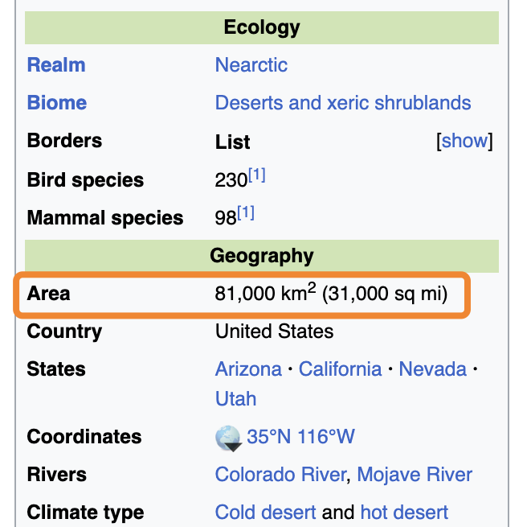

In this case, we wouldn't have been able to find this answer if I hadn't set 'parents' to 1, because the answer we're looking for is in a sibling of the matching element, just like in our Cuba example.  

在本例中，如æœæˆ‘没有将 "parents "设置为 1，我们就无法找到这个答案，因为我们è¦æ‰¾çš„答案就在匹é…元素的åŒçº§å…ƒç´ ä¸­ï¼Œå°±åƒåœ¨å¤å·´çš„例å­ä¸­ä¸€æ ·ã€‚

The 'GET\_ELEMENT' tool passed the element back to the assistant, who correctly noticed that the information within satisfied our goal.  

GET\_ELEMENT "工具将元素传å›åŠ©æ‰‹ï¼ŒåŠ©æ‰‹æ­£ç¡®åœ°æ³¨æ„到其中的信æ¯æ»¡è¶³äº†æˆ‘们的目标。  

Thus it completed it's run, letting me know that the answer to my question is 81,000 square kilometers:  

这样，它就完æˆäº†è¿è¡Œï¼Œè®©æˆ‘知é“我的问题的答案是 81 000 平方公里：

```
[FINAL MESSAGE] ✅ The total land area of the Mojave Desert is 81,000 square kilometers or 31,000 square miles.
{
  "status": "complete",
  "info": {
    "area_km2": 81000,
    "area_mi2": 31000
  }
}
```

If you'd like to read the full logs from this run, you can find a copy of them [here](https://timconnors.co/posts/ai-scraper/logs)!  

如æœæ‚¨æƒ³é˜…读这次è¿è¡Œçš„完整日志，å¯ä»¥åœ¨è¿™é‡Œæ‰¾åˆ°å‰¯æœ¬ï¼

## Closing Thoughts  

结æŸè¯­

I had a lot of fun building this thing, and learned a ton.  

我在制作过程中è·å¾—了很多ä¹è¶£ï¼Œä¹Ÿå­¦åˆ°äº†å¾ˆå¤šä¸œè¥¿ã€‚  

That being said, it's still a fragile system. I'm looking forward to taking it to the next level.  

尽管如此，它ä»ç„¶æ˜¯ä¸€ä¸ªè„†å¼±çš„系统。我期待ç€å®ƒæ›´ä¸Šä¸€å±‚楼。  

Here are some of the things I'd like to improve about it:  

以下是我希望改进的一些地方：

-   Generating smarter search terms so it can find relevant elements faster  
    
    生æˆæ›´æ™ºèƒ½çš„æœç´¢æ¡ä»¶ï¼Œä»¥ä¾¿æ›´å¿«åœ°æ‰¾åˆ°ç›¸å…³å…ƒç´ 
-   Implementing fuzzy search in my 'GET\_ELEMENT' tool to account for slight variations in text  
    
    在我的 "GET\_ELEMENT "工具中å®æ–½æ¨¡ç³Šæœç´¢ï¼Œä»¥è€ƒè™‘文本中的细微å˜åŒ–
-   Using the vision model to label images & icons in the HTML so the assistant can interact with them  
    
    使用视觉模å‹æ¥æ ‡æ³¨ HTML 中的图åƒå’Œå›¾æ ‡ï¼Œä»¥ä¾¿åŠ©æ‰‹ä¸ä¹‹äº’动
-   Enhancing the stealth of the crawler with residental proxies and other techniques  
    
    利用常驻代ç†å’Œå…¶ä»–技术å¢å¼ºçˆ¬è™«çš„éšè”½æ€§

Thanks for reading! If you have any questions or suggestions, feel free to reach out to me on [Twitter](https://twitter.com/itstimconnors) or via email at [hi@timconnors.co](mailto:hi@timconnors.co)  

感谢您的阅读ï¼å¦‚æœæ‚¨æœ‰ä»»ä½•é—®é¢˜æˆ–建议，请éšæ—¶é€šè¿‡ Twitter 或电å­é‚®ä»¶ hi@timconnors.co è”系我。
