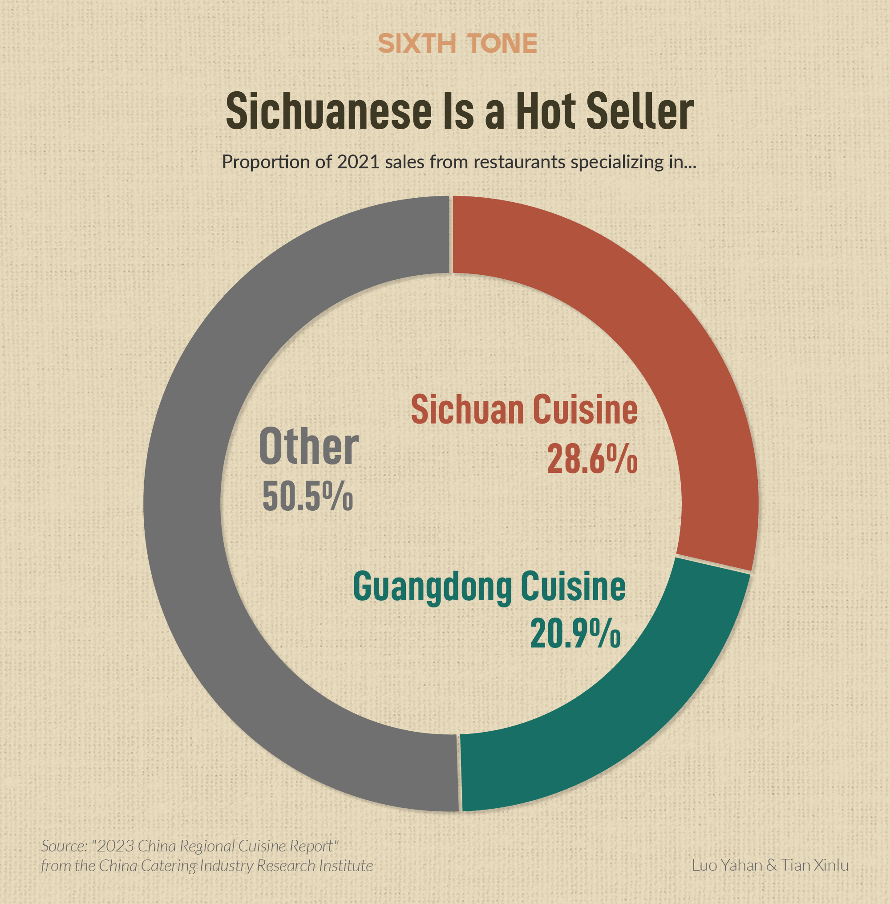
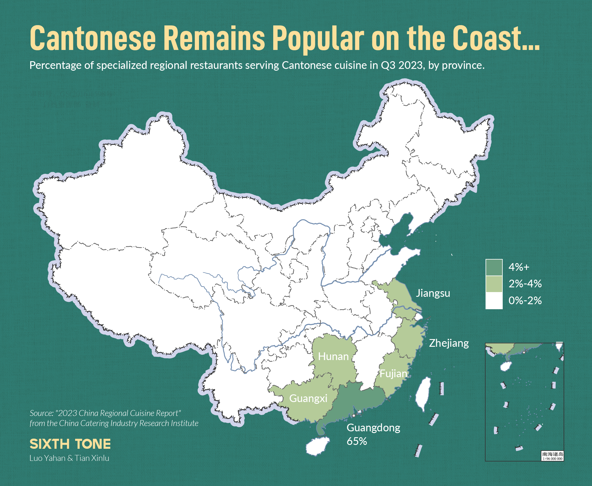
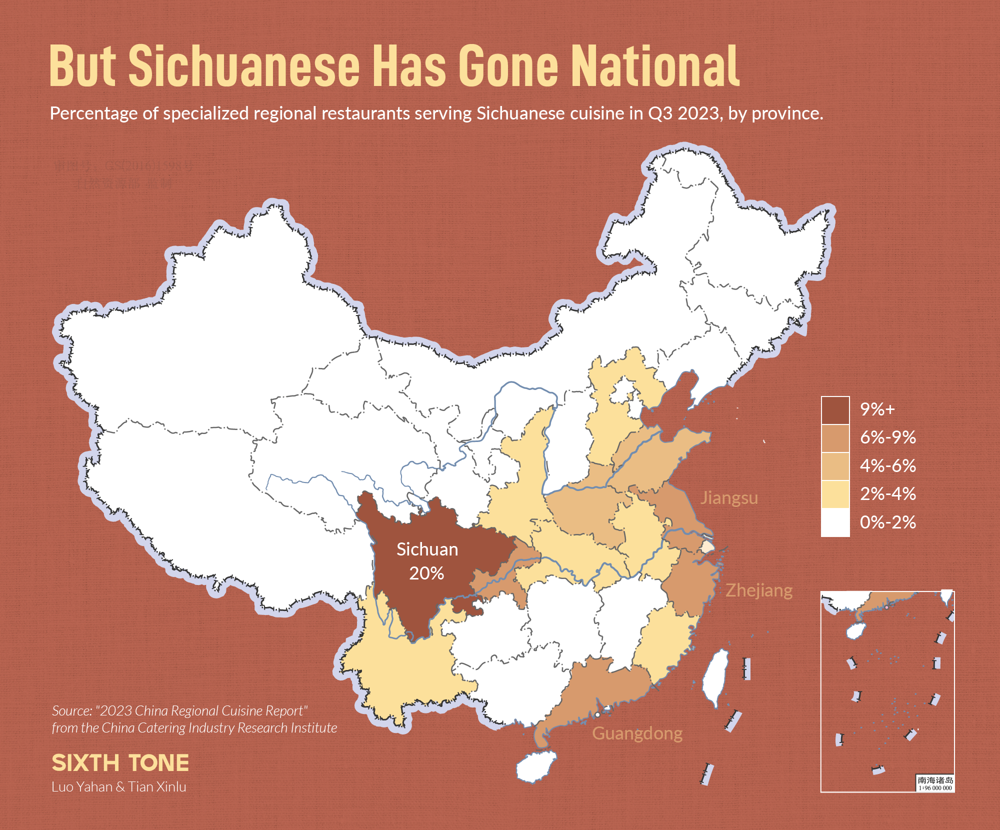
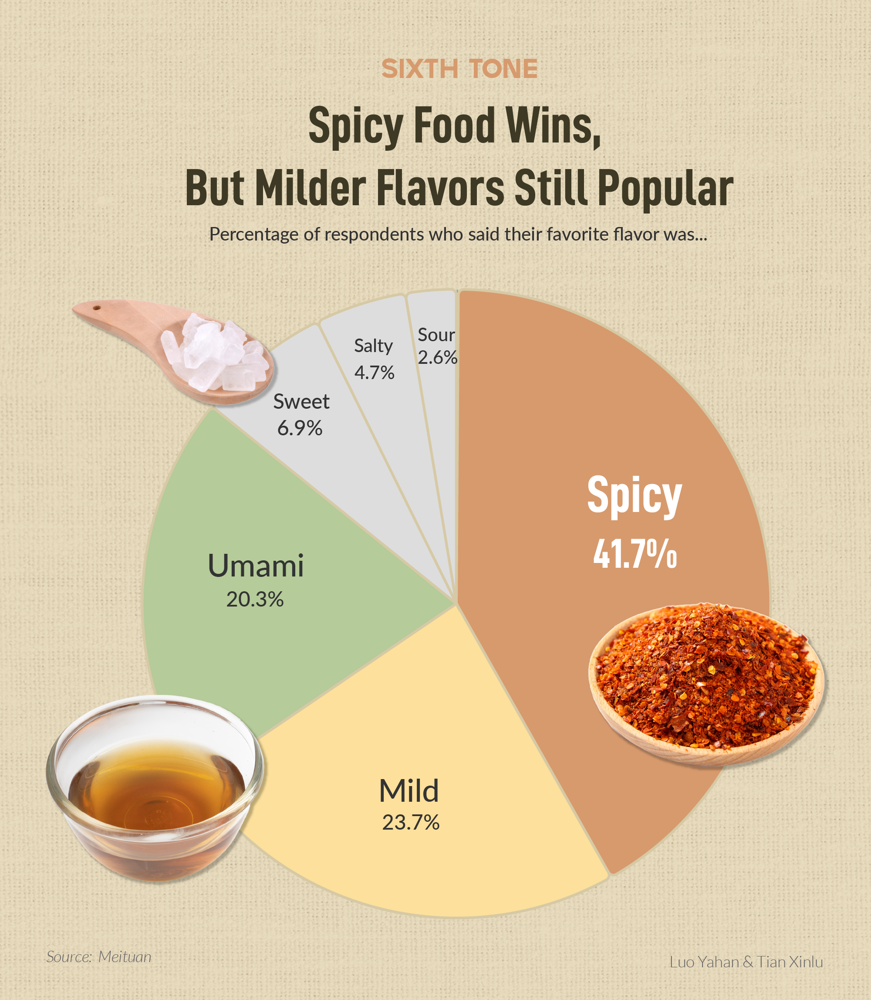
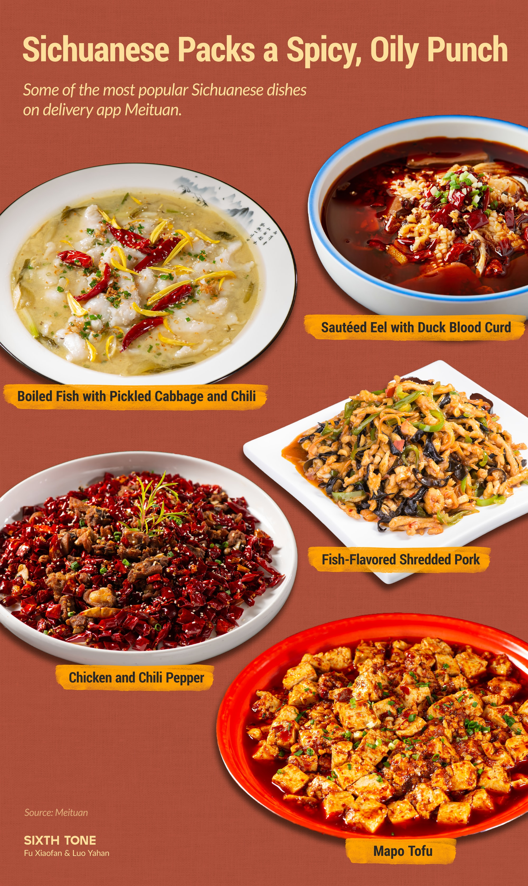
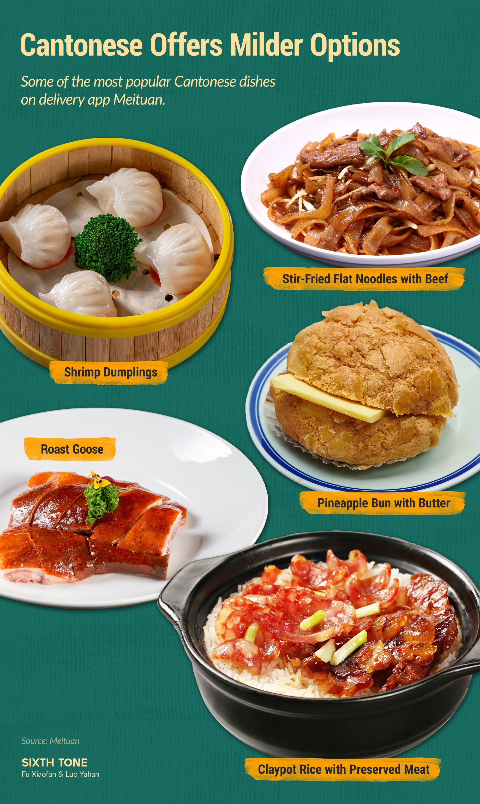
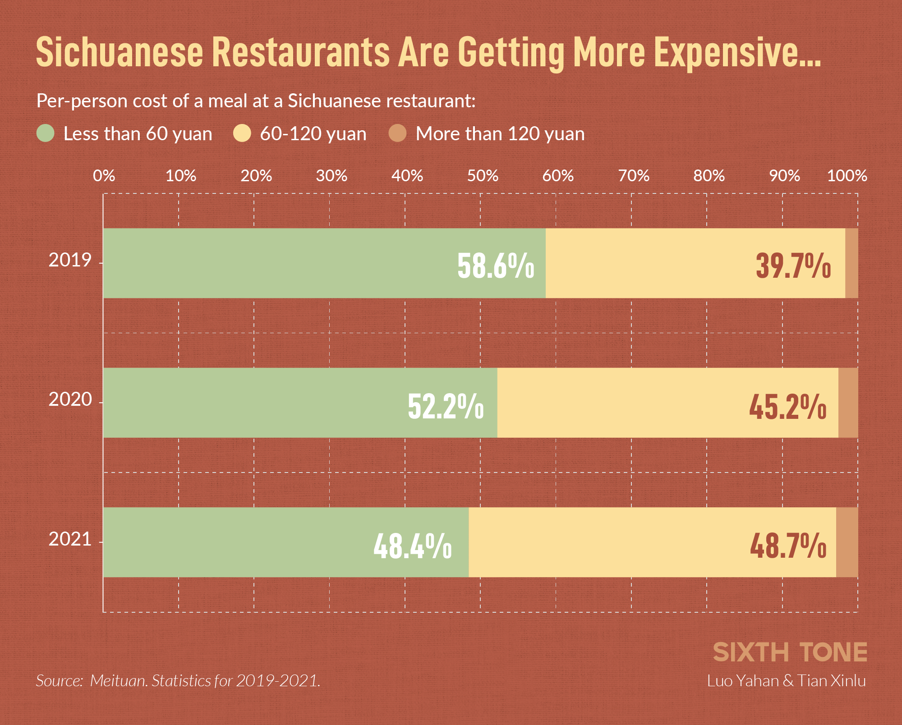
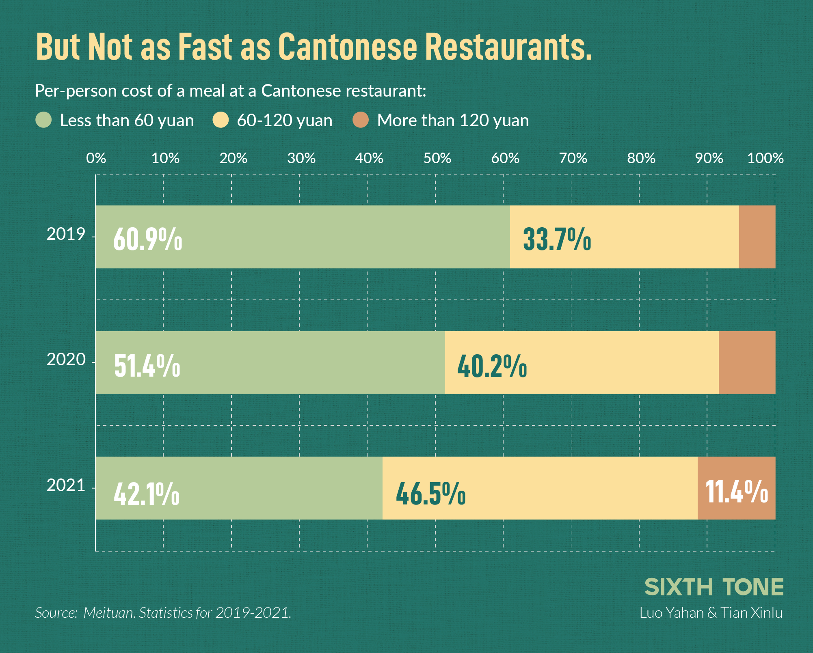

If you were to ask someone to describe Chinese food, they might mention dumplings, congee, or classic dishes like [kung pao chicken](https://www.sixthtone.com/news/1013993). One word that would almost surely come up is spice.  

如果让别人描述中国菜，他们可能会提到饺子、粥或宫保鸡丁等经典菜肴。但有一个词几乎肯定会被提及，那就是 "香料"。

It wasn’t always that way.

  

以前并非如此。  

Historically, outside of a few inland regions, Chinese food was mildly flavored, with more emphasis on highlighting an ingredient’s natural taste than overpowering it with the numbing spice of Sichuanese mala or its fierier Hunanese counterpart.  

历史上，除少数内陆地区外，中国菜的口味都比较清淡，更注重突出食材的本味，而不是用麻辣的川味麻辣或更辣的湘味麻辣来喧宾夺主。  

It was only with the [vast migration](https://www.sixthtone.com/news/1007963) of the 1990s and 2000s that spicy dishes became widespread along the country’s coast.  

只是随着 20 世纪 90 年代和 21 世纪的大规模移民，辣味菜肴才开始在中国沿海地区普及。

But there are signs that the tide is shifting. Two new surveys from the [China Catering Industry Research Institute](https://m.163.com/dy/article/IK6CF8DI05198DT6.html) and delivery app [Meituan](https://www.199it.com/archives/1538490.html) have found that, while spice is still king, the milder flavors of Cantonese cooking are making a comeback.

  

但有迹象表明，这一趋势正在发生变化。中国餐饮产业研究院和外卖应用程序美团的两项最新调查发现，虽然香料仍然是王道，但粤菜的温和口味正在卷土重来。  

Here are some of the main takeaways from the reports, as selected by Sixth Tone.  

以下是第六声从这两份报告中选取的一些主要观点。

**Sichuanese supremacy  

四川霸主**

Chinese cuisine is remarkably diverse, with recipes for popular dishes sometimes varying from village to village.  

中国菜肴种类繁多，有时每个村庄的流行菜肴食谱都不尽相同。  

But the country’s culinary habits are generally broken down into what’s known as the “eight regional cuisines”: Shandong cuisine, Sichuanese, Hunanese, Cantonese, Fujianese, Jiangsu cuisine, Zhejiang cuisine, and Anhui cuisine.  

但中国人的饮食习惯一般可分为所谓的 "八大菜系"：山东菜系、四川菜系、湖南菜系、广东菜系、福建菜系、江苏菜系、浙江菜系和安徽菜系。  

(That traditional classification system leaves out a number of regional culinary traditions, including the sour-spicy flavor profile of the Yunnan-Guizhou Plateau and the lamb-heavy dishes of the northwest).  

(这一传统分类系统遗漏了许多地区的烹饪传统，包括云贵高原的酸辣口味和西北地区的羊肉菜肴）。

SUBSCRIBE TO OUR NEWSLETTER  

订阅我们的通讯

By submitting, you agree to our [Terms Of Use.](https://www.sixthtone.com/terms-use)  

提交信息即表示您同意我们的《使用条款》。

\*Please enter an email address.  

\*请输入电子邮件地址。

Far and away the most popular are Sichuanese and Cantonese.  

最受欢迎的是川菜和粤菜。  

In 2021, Sichuanese and Cantonese food accounted for almost half of orders at restaurants specializing in one of the eight regional cuisines.  

2021 年，川菜和粤菜几乎占据了八大地方菜系中某一菜系专营餐厅一半的订单。

Hunanese dishes came in third, with roughly 10%.

  

湘菜位居第三，约占 10%。

Interestingly, Cantonese restaurants remain concentrated along China’s eastern coast, with few options for dim sum lovers inland.  

有趣的是，粤菜餐厅仍然集中在中国东部沿海地区，内陆地区的点心爱好者很少有选择。  

Sichuanese, on the other hand, has gone national, accounting for between 6% and 9% of restaurants even in traditionally spice-averse regions like Guangdong and Jiangsu.  

另一方面，川菜已经走向全国，即使在广东和江苏等传统上不喜欢吃辣的地区，川菜餐厅的比例也达到了 6% 到 9%。

**Peak spice?  

香料峰值？**

That’s a remarkable shift from just a century ago, when chili-heavy dishes like Sichuanese hot pot were confined to China’s remote southwest.  

与一个世纪前相比，这是一个显著的变化，当时川菜火锅等辣椒味重的菜肴仅限于中国偏远的西南地区。  

Today, thanks to waves of migrants from the inland to the coast, spice is the country’s most popular flavor profile.  

如今，由于从内陆到沿海的移民潮，辣味成为中国最受欢迎的口味。  

Over 40% of survey respondents listed spicy food as their top choice.  

超过 40% 的受访者将麻辣食品列为首选。

Yet there are signs that the wave might be cresting.  

然而，有迹象表明，这股浪潮可能正在消退。  

In 2019, there were twice as many Sichuanese restaurants as Cantonese restaurants.  

2019 年，川菜馆的数量是粤菜馆的两倍。  

Over the past five years, however, the number of Sichuanese restaurants has decreased steadily, while the number of Cantonese restaurants has risen.  

然而，在过去五年中，川菜馆的数量持续下降，而粤菜馆的数量却在上升。

This trend may reflect unmet demand for milder flavors.  

这一趋势可能反映了人们对口味较淡的菜肴的需求未得到满足。  

Roughly 44% of survey respondents said they preferred “mild” or “umami” flavor profiles the most — both defining characteristics of Cantonese cuisine, which minimizes the use of seasonings in favor of maintaining the original flavor of the ingredients.  

约 44% 的受访者表示，他们最喜欢 "清淡 "或 "鲜美 "的口味，这两种口味都是粤菜的显著特点，因为粤菜尽量少用调味料，以保持食材的原汁原味。

**Costly Cantonese  

昂贵的广东话**

As with much of the rest of the world, the cost of a meal out is climbing in China — but the hikes have been especially steep for Cantonese cuisine.

  

与世界其他大部分地区一样，中国人外出就餐的成本也在不断攀升，但粤菜的涨幅尤为明显。  

In 2019, 61% of meals at Cantonese restaurants cost less than 60 yuan ($8.70) per person.  

2019 年，61% 的粤菜馆人均餐费低于 60 元（8.70 美元）。  

By 2021, that calculus had nearly flipped: 58% of Cantonese restaurant meals cost over 60 yuan per person.  

到 2021 年，这种情况几乎发生了翻天覆地的变化：58% 的粤菜馆餐费超过每人 60 元。

Sichuanese restaurants have also gotten pricier, but more gradually than their Cantonese counterparts.

  

川菜馆的价格也在上涨，但比粤菜馆的价格上涨得更慢。  

By 2021, 51.6% of bills worked out to over 60 yuan per person, an increase of over 10 percentage points in just three years.  

到 2021 年，51.6% 的餐馆人均消费超过 60 元，在短短三年内增长了 10 多个百分点。

  

_(Header image: By Luo Yahan, Fu Xiaofan, and Ding Yining/Sixth Tone)  

(头图：罗雅涵、傅晓帆、丁一宁/《第六声》报道）_
