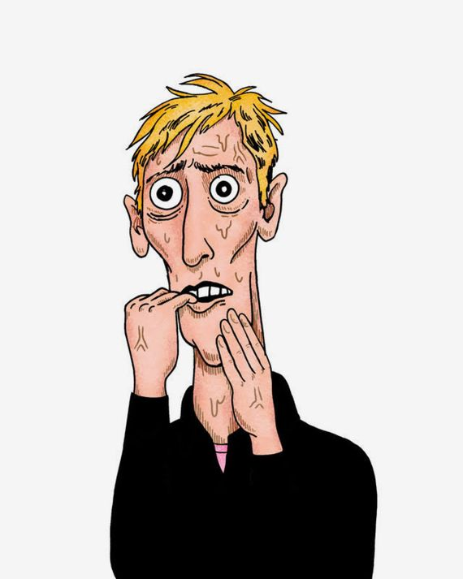
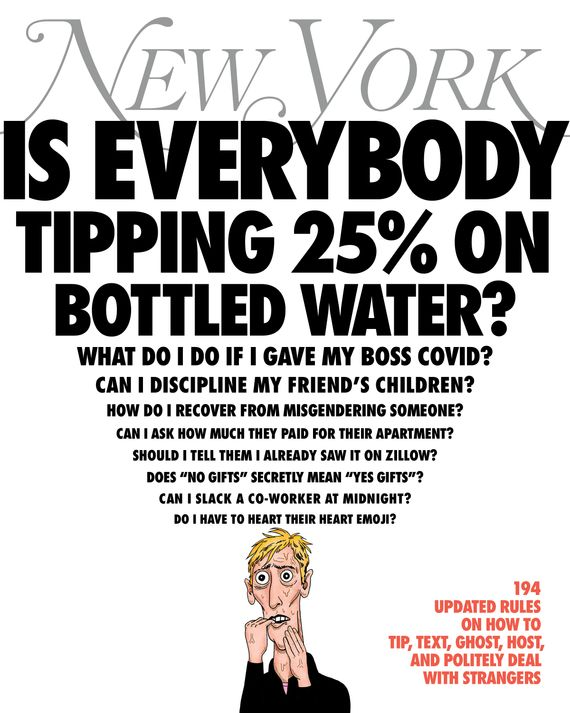

 
How to text, tip, ghost, host, and generally exist in polite society today.
您知道如何举止得体吗？你确定吗？如何发短信、给小费、做鬼、做主人，以及如何在当今彬彬有礼的社会中生存。

Illustration: Andrew Rae  
插图安德鲁-雷

The ways we socialize and date, commute and work are nearly unrecognizable from what they were three years ago.  
我们的社交、约会、通勤和工作方式与三年前几乎不可同日而语。  
We’ve enjoyed a global pandemic, open employer-employee warfare, a multifront culture war, and social upheavals both great and small.  
我们经历了全球大流行病、公开的雇主与雇员之争、多线文化战争以及大大小小的社会动荡。  
The old conventions are out (we don’t whisper the word _cancer_ or let women off the elevator first anymore, for starters).  
旧的惯例已经过时（例如，我们不再低声谈论癌症一词，也不再让女性先下电梯）。  
The venues in which we can make fools of ourselves (group chats, Grindr messages, Slack rooms public and private) are multiplying, and each has its own rules of conduct.  
我们可以出丑的场所（群聊、Grindr 消息、Slack 公共或私人房间）越来越多，而且每个场所都有自己的行为准则。  
And everyone’s just kind of rusty. Our social graces have atrophied.  
大家都有点生疏了。我们的社交礼仪也萎缩了

## On the cover  

### —

  
  

  
  

Art: Andrew Rae  
艺术安德鲁-雷

We wanted to help.  
我们想帮忙。  
So we started with the problems — not the obvious stuff, like whether it’s okay to wear a backpack on the subway or talk loudly on speakerphone in a restaurant (you know the answers there).  
因此，我们从问题入手--不是那些显而易见的问题，比如在地铁上是否可以背着背包，在餐厅里是否可以大声使用免提电话（你知道答案的）。  
We asked people instead what specific kinds of interactions or situations really made them anxious, afraid, uncertain, ashamed.  
我们反过来问人们，哪些具体的互动或情况真正让他们焦虑、害怕、不确定、羞愧。  
From there, we created rigid, but not entirely inflexible, rules.  
在此基础上，我们制定了严格但并非完全不灵活的规则。

Then we took our own medicine — we implemented these rules in our professional and personal lives.  
然后，我们自食其果--在我们的职业和个人生活中执行这些规则。  
Some really didn’t work. (“It’s been great to chat” didn’t quite land when we used it as a way to [exit a boring conversation at a holiday party](#exit).) Others felt like instant canon (we agreed, for example, that [text-message amnesty is granted after 72 hours](#amnesty)). We fine-tuned and eliminated. We talked to friends, entertaining experts, and service workers.  
有一些确实不起作用。(当我们在节日聚会上用 "很高兴能和你聊天 "来结束无聊的对话时，这句话就不太管用）。还有一些则感觉像即时教规（例如，我们同意在 72 小时后赦免短信）。我们进行了微调和淘汰。我们与朋友、娱乐专家和服务人员进行了交谈。  
We sparked office arguments and made messes and ended up with a guide that we hope will stand the test of at least a bit of time — until the next great exciting social upheaval.  
我们在办公室里引发了争论，弄得一团糟，最后我们希望这本指南至少能经受住时间的考验--直到下一次激动人心的社会大变革。

## Friends & Lovers  
朋友与情人

1.You don’t have to read everyone’s book.  
1.你不必读每个人的书。

Life is finite.  
生命是有限的。  
We can’t be expected to spend all our time metabolizing content by friends or friends of friends.  
不能指望我们把所有时间都花在新陈代谢朋友或朋友的朋友的内容上。  
Still, if you encounter someone who has recently produced something creative and you don’t feel like telling them you haven’t gotten around to engaging with it, say something about how impressive it is that they’ve created something in the first place.  
不过，如果你遇到最近创作了一些有创意的作品的人，而你又不想告诉他们你还没来得及参与其中，那就说说他们首先创作出这样的作品是多么令人印象深刻。  
“What a feat!” (with a cheerful hand gesture) is always effective.  
"多么了不起的壮举啊！"(配上欢快的手势）总是很有效。  
(“What a feat!” also works well if you saw your friend’s show and hated it.) Just don’t overplay your hand and try to get into specifics.  
(如果你看了朋友的节目并对其深恶痛绝，"这真是一项壮举！"也同样适用。  
But if you do consume their artistic product, send them a nice note. They’ll remember forever.  
但是，如果你真的消费了他们的艺术产品，请给他们寄一张漂亮的便条。他们会永远记住的。

2.
You may callously cancel almost any plans up until 2 p.m.  
2.在下午 2 点之前，您几乎可以随意取消任何计划。

At 2 p.m., there’s still ample time for your friend — if they so choose — to text around and find another dinner companion.  
下午 2 点，您的朋友仍有充足的时间（如果他们愿意的话）发短信四处寻找另一位晚餐同伴。  
By three, they almost certainly will be alone for the night.  
到了三点，他们几乎肯定会独自过夜。  
(This doesn’t apply if you want to cancel on someone who is cooking for you — in that situation, you have to tell them the night before.)  
(如果您想取消为您做饭的人的预约，这一点并不适用--在这种情况下，您必须在前一天晚上告诉他们）。

3.Don’t be loudly naïve about dating apps if you’re in a relationship.  
3.如果你正在谈恋爱，就不要对约会软件大肆宣扬自己的天真。

Your single friends have likely put up with a host of your well-intended yet annoying behaviors: that time you invited your significant other to tag along without asking, those other times you offered to set them up with your significant other’s unemployed friends.  
你的单身朋友很可能已经忍受了你一系列善意却令人讨厌的行为：那次你不问青红皂白就邀请你的另一半一起去，还有几次你主动提出撮合他们和你另一半的失业朋友在一起。  
You may think that asking basic questions about their newfangled dating apps (“So which way do you swipe again?”) shows interest and engagement in their love lives, but your wide-eyed curiosity could just as easily come across as patronizing — and as a subtle reminder of your own blissful insulation from the dumpster fire that is app-dating.  
你可能会认为，问一些关于他们新奇的约会软件的基本问题（"那你又是用哪种方式刷卡的？"）表明了你对他们爱情生活的兴趣和参与，但你睁大眼睛的好奇心很容易让人觉得你是在施舍--也会让人微妙地联想到你自己与软件约会的垃圾场隔绝的幸福生活。

4.When shopping with a friend, don’t cut them in the rack.  
4.与朋友一起购物时，不要在货架上剪断。

This is doubly true in a vintage shop, where you should also offer to let them try on the things you’ve decided not to buy.  
在古董店更是如此，你还应主动让他们试穿你决定不买的东西。

5.Don’t use friends as foreplay.  
5.不要把朋友当前戏。

If, as a couple, you start an argument in the middle of a group of friends, that group of friends may start looking a lot like potential allies.  
如果作为一对夫妻，你们在一群朋友中间开始争吵，那这群朋友可能会开始看起来很像潜在的盟友。  
Resist that urge. Do not attempt to shore up support.  
抵制这种冲动。不要试图拉拢支持者。  
Do not ask if you are “clearly in the right.” Continue debating with your significant other if you must, but leave the others out of it.  
不要问自己是否 "显然是对的"。如果有必要，继续与你的另一半辩论，但不要把其他人扯进来。  
Your addiction to argument isn’t everyone else’s kink.  
你沉迷于争论并不是其他人的怪癖。

6.Never wake up your significant other on purpose, ever.  
6.永远不要故意吵醒你的另一半。

And don’t turn on the lights when they’re asleep. Jet-lagged and want to talk? Don’t do it.  
他们睡着时不要开灯。倒时差想说话？别这么做。  
Think someone is coming in to kill you? Work it out yourself.  
觉得有人要杀你？自己想办法

7.While on a date, if you find you’re talking a lot, ask yourself, _When was the last time I asked a question?_  
7.约会时，如果发现自己话很多，问问自己：我上次问问题是什么时候？

There’s no need to keep a tally or trade queries back and forth like it’s a tennis match, but do at least be aware of how long you’re holding the floor and take care to share it.  
没有必要像网球比赛那样记账或来回交换询问，但至少要注意自己的发言时间，并注意分享。

8.It’s acceptable to tell any kind of lie in order to leave a drinks date.  
8.为了离开酒会，撒任何谎都是可以接受的。

If the conversation is so painful you’re considering making up a story about a sick animal, your date will probably feel relieved.  
如果谈话让你非常痛苦，你会考虑编一个关于生病动物的故事，那么你的约会对象可能会觉得如释重负。

9.If someone starts telling you a story you’ve heard before, you have two seconds to tell them.  
9.如果有人开始给你讲一个你以前听过的故事，你有两秒钟的时间告诉他。

Interject with “Oh my gosh, that was hilarious,” or “truly horrific,” or “unbelievable — you’ve told me.” But if you don’t say it within the allotted time, you just have to listen to them tell the story again.  
插一句："哦，我的天哪，太搞笑了"，或者 "真是骇人听闻"，或者 "难以置信--你已经告诉我了"。但如果你没有在规定时间内说出来，就只能听他们再讲一遍。  
And if you’re in a larger group, you just have to listen, period.  
如果你在一个更大的团体中，你就必须倾听，就这样。

10.Straight people can use the word _partner_ only when they’re trying to get something out of it.  
10.异性恋者只有在想从中得到什么时，才能使用伴侣这个词。

It’s annoyingly vague (and also smug).  
含糊其辞（还自以为是），令人讨厌。  
Some examples of when it’s acceptable: when trying to procure an apartment or a seat next to your, ahem, “partner” on an airplane and in negotiations with bosses about relocations.  
例如，在试图购买公寓或在飞机上与你的 "搭档 "邻座时，以及在与老板就搬迁事宜进行谈判时，这样做是可以接受的。  
(This rule doesn’t apply to people who are actively resisting the patriarchy by refusing to get married.  
(这条规则不适用于通过拒绝结婚来积极抵制父权制的人）。  
You have no other word, we realize.)  
我们知道，你没有别的词）。

11.When another human is present, don’t talk to your animal in the private voice you use when alone together.  
11.当有其他人在场时，不要用单独相处时的私人声音与动物交谈。

12.On a date, all individuals present should gently and politely compete to pay the entire bill.  
12.在约会时，所有在场的人都应该温和礼貌地争相付清全部账单。

Still, the historical mandate is hard-coded into most people and should be considered: If you’re penetrating, you pay.  
尽管如此，历史使命对大多数人来说都是硬编码，应该予以考虑：如果你渗透了，你就得付出代价。

13.It’s never too late to send a condolence note.  
13.发送慰问信永远不晚。

Your friend who is bereaved or suffering lives in time differently than you do.  
你失去亲人或遭受痛苦的朋友与你生活在不同的时间里。  
You learned about the death or the diagnosis at a particular moment and felt a pang of sympathy, tinged — if you’re honest — with relief that you evaded loss this time, as well as a teensy bit of actuarial superiority: You don’t smoke (that much), don’t drink (that much), don’t check your phone while driving (very often). **But you feel for your friend, so you put “condolence note” on a list along with other to-dos** — the health-insurance thing, the birthday gift, the financial-aid application — and there it sits, continually shuffled to the bottom of the agenda, reprimanding you as the days become weeks.  
你在某一时刻得知了他的死讯或诊断结果，并感到一阵同情，同时--如果你诚实的话--还为这次躲过一劫而感到欣慰，以及一丝精算上的优越感：你不抽烟（那么多），不喝酒（那么多），开车时也不看手机（很频繁）。但你很同情你的朋友，所以你把 "吊唁信 "和其他待办事项--健康保险、生日礼物、经济援助申请--一起列在了清单上，它就在那里，不断地被排到日程的最末端，随着时间一天天变成几周，不断地斥责你。

**Your friend, meanwhile, is in the midst of an alternative timeline** that began with the death or diagnosis and unfolds in a way that refutes clocks or calendars.  
与此同时，你的朋友正处于另一条时间线之中，这条时间线从死亡或诊断开始，以一种驳斥时钟或日历的方式展开。  
Spending long periods in a hospital is like being on the moon.  
长期待在医院里就像在月球上一样。  
Caring for a sick loved one is like fasting: an ungrounding exercise of devotion and deprivation.  
照顾生病的亲人就像禁食一样，是一种毫无根据的奉献和剥夺。  
Recovering from serious illness is like landing in a foreign country at night in the fog: a terrifying muddle with no clear horizon.  
从重病中恢复过来，就像在大雾弥漫的夜晚降落在异国他乡：浑浑噩噩，没有清晰的地平线，令人恐惧。

But just because your friend is unmoored by grief, **don’t make the mistake of believing she isn’t keeping track.** Perhaps as a way to rebalance the scales of cosmic unfairness, some crude, Old Testament part of your friend’s mind has assumed the role of condolence accountant, tabulating the incoming gestures and cards.  
但是，不要因为你的朋友悲痛欲绝，就错误地认为她没有记账。也许是为了重新平衡宇宙不公平的天平，你朋友头脑中某些粗糙的、《旧约》中的部分已经承担起了吊唁会计的角色，将收到的手势和卡片制成表格。  
She will remember — possibly as long as she lives — who offered to walk the dog, who made the Bolognese, and who sent the hummus platter.  
她会记得--可能在她有生之年--是谁主动提出遛狗，是谁做的肉酱，是谁送的鹰嘴豆泥拼盘。  
She will remember certain condolence notes as surprisingly meaningful and others as dashed off, obligatory, like a gift purchased from an airport store.  
在她的记忆中，某些唁电出人意料地意味深长，而另一些唁电则像机场商店里买来的礼物一样，草草了事，义不容辞。  
She may especially disdain those notes containing the phrase “I can’t imagine.” Your friend doesn’t care about your guilt, your excuses, your schedule; to her, **your condolence note, even a late one, could be a gift from a parallel universe where love and friendship can be reliably counted in days off, date nights, and coffee klatches.** She doesn’t need a store-bought card or a postage stamp. A text will do. — _Lisa Miller_  
她可能尤其不喜欢那些写着 "我无法想象 "的纸条。你的朋友不在乎你的内疚、借口和日程安排；对她来说，你的吊唁信，哪怕是迟来的，也可能是来自平行宇宙的礼物，在那里，爱情和友谊可以可靠地用休息日、约会之夜和咖啡聚会来计算。她不需要商店里买的卡片或邮票。一条短信就够了。- 丽莎-米勒

14.Never send an Edible Arrangement.  
14.切勿寄送食用插花。

Things that are appropriate in any situation: babka, Brodo, money (if there are unexpected costs to deal with).  
在任何情况下都适用的东西：Babka、Brodo、钱（如果有意外费用需要处理）。  
A smoked turkey is especially nice for a grieving family — it can feed a lot of people, is delicious cold or warm, and can be eaten on its own, in a sandwich or salad, or hot open-faced.  
对于悲伤的家庭来说，熏火鸡肉尤其适合--它可以喂饱很多人，冷热皆宜，既可以单独食用，也可以夹在三明治或沙拉里吃，还可以热着吃。

15.It’s okay to ghost after one date.  
15.约会一次后就鬼混没关系。

You met up for a drink after work; discussed work, school, and siblings for 90 minutes; and ended the evening with a noncommittal “Let’s do this again sometime.” Now it’s been three days and you’re wondering what you owe this person you don’t particularly want to see again. You _could_ send a text letting them down gently, but it’s also fine to say nothing.  
下班后，你们相约去喝一杯；讨论了 90 分钟的工作、学业和兄弟姐妹问题；最后以一句不置可否的 "有机会我们再去吧 "结束了这个夜晚。现在已经过去三天了，你想知道你欠这个你并不特别想再见面的人什么。你可以发一条短信，让他们轻轻放下心来，但什么也不说也行。  
At this point, neither of you has put so much energy into the interaction that it warrants a formal ending.  
此时此刻，你们都没有在互动中投入太多精力，以至于需要正式结束。  
(And besides, nobody likes getting rejected by someone they didn’t care that much about in the first place).  
(况且，没有人喜欢被自己本来就不太在乎的人拒绝）。

There are exceptions, though.  
但也有例外。  
If you’ve been texting a lot after the date, or you’ve clearly talked about going on another one, then there is a social contract to not ghost.  
如果你们在约会后经常发短信，或者你们已经明确谈过要再约会一次，那么就有了不鬼混的社会契约。  
Quickly say good-bye and good luck and get outta there.  
赶紧说再见，祝你好运，然后离开那里。

16.If you ghost someone, stay gone forever.  
16.如果你鬼魂缠身，就永远消失吧。

I don’t ghost people because abandonment is my central trauma and passive-aggressive has never been my style.  
我不鬼魂，因为被遗弃是我的核心创伤，而消极攻击从来不是我的风格。  
(I’m more aggressive-aggressive.) I suppose I can understand the appeal of ghosting as an easy way to cut someone off for whatever reason, or for none at all. **What I cannot understand is ghosting someone and then coming back several years later to request a favor** that would have been a considerable ask even if we had remained friendly.  
(我想我可以理解 "幽灵 "的魅力，它可以让你轻松地与某人断绝关系，不管是出于什么原因，或者根本没有任何原因。但我不能理解的是，你把一个人 "幽禁 "起来，几年后又回来请求他帮你一个忙，而这个忙即使我们还保持着友好关系，也是一个不小的请求。

Weirdly, this has happened to me a number of times — and in ways that range from the silly to the egregious — and I honestly need it to stop.  
奇怪的是，这种情况在我身上发生过好几次，而且发生的方式从愚蠢到恶劣不一而足。  
Do people figure I’m an easy target? Does this happen to others?  
人们是不是觉得我很容易成为攻击目标？这种情况会发生在其他人身上吗？  
I consider myself a fairly compassionate, generous person who answers emails in a timely fashion and has with pleasure put a lot of people on to a broad range of opportunities.  
我认为自己是一个相当有同情心、慷慨大方的人，会及时回复电子邮件，并乐于为很多人提供各种机会。  
I am by no means perfect (the ne plus ultra of honest self-evaluation), and, like everyone (in media), I have made some very bad decisions.  
我绝非完美无缺（这是诚实的自我评价的最高境界），和每个人（媒体）一样，我也做过一些非常错误的决定。

But let’s say we worked together in some context, were supportive of each other as colleagues, spent some time together socially, created a genuine rapport — and then you stopped responding to emails, texts, DMs, whatever.  
但假设我们在某种情况下共事过，作为同事相互支持，一起度过了一些社交时间，建立了真正的融洽关系--然后你就不再回复邮件、短信、DM 什么的了。  
That’s fine, I guess.  
没关系，我想。  
Working relationships don’t always last (even if it feels like more than a working relationship).  
工作关系并不总是长久的（即使感觉比工作关系更长久）。  
It’s always going to take me a minute to stop reaching out, because _abandonment trauma,_ but I’ll eventually move on and try not to take it personally (with varying degrees of success).  
因为被遗弃的创伤，我总是要花点时间才能停止联系，但我最终会向前看，并试着不把它放在心上（成功的程度不一）。

**Then, months or years later, you’re back?** With a DM or an email asking for a letter of recommendation, or help promoting your new book, or an essay about the psychological toll of racism for your personal newsletter for a less than nominal fee (that last request was from a white person, obviously), as if nothing had ever happened?  
几个月或几年后，你又回来了？收到一封 DM 或一封电子邮件，请求你写一封推荐信，或帮助宣传你的新书，或为你的个人时事通讯写一篇关于种族主义的心理伤害的文章，但只收取象征性的费用（最后一个请求显然来自一个白人），就好像什么事都没发生过一样？  
What is that?  
那是什么？  
After ghosting someone, it seems obvious that you cannot ask for any kind of professional support or emotional labor without following these simple steps: (1) Acknowledge that you ghosted, (2) explain why you ghosted, and (3) apologize for ghosting.  
在与某人鬼混之后，如果不遵循这些简单的步骤，显然就无法请求任何形式的专业支持或情感劳动：(1）承认你鬼魂缠身，（2）解释你鬼魂缠身的原因，（3）为鬼魂缠身道歉。  
Then, and only then, when we agree that you ghosted me (for the made-up reason of your choice) but now need something specific to my skill set, talents, or network, may you begin to lean on me for favors. — _Rebecca Carroll_  
然后，也只有到那时，当我们一致认为你（出于你选择的虚构理由）抛弃了我，但现在又需要我的技能、才能或人际网络，你才可能开始找我帮忙。- 丽贝卡-卡罗尔

17.Don’t wait for the right time to break up with someone.  
17.不要等到合适的时机才提出分手。

There are fewer breakup blackout dates than you think.  
分手日期比你想象的要少。  
Think it’s compassionate to wait until January 2 to dump them?  
你认为等到 1 月 2 日再抛弃他们会有同情心吗？  
No, it just shows you were planning to do it all through the holidays!  
不，这只能说明你打算整个假期都这样做！

18.If you’re a dating adult, you should own lube.  
18.如果你是成年人，你应该拥有润滑油。

It doesn’t matter who you have sex with.  
与谁发生性关系并不重要。

19.If your friend is dating someone you seriously object to, you have one shot to sit your pal down and say so.  
19.如果你的朋友正在和一个你严重反对的人约会，你有一次机会让你的朋友坐下来说清楚。

The conventional wisdom has been that unless your friend is being hurt, keep your opinion to yourself because it will damage your relationship.  
传统观念认为，除非你的朋友受到了伤害，否则请不要发表意见，因为这会破坏你们之间的关系。  
Our feeling is that you can share your reservations — but you have only one shot.  
我们的感觉是，你可以分享你的保留意见，但你只有一次机会。  
After that, your friend decides what they want to do and you can’t bring up your grievances again unless they ask (no eyebrow raises or passive-aggressive observations, either).  
之后，你的朋友决定他们想做什么，除非他们要求，否则你不能再提起你的不满（也不能挑眉或消极攻击性地观察）。

20.Don’t describe TikToks. It’s more boring than describing dreams.  
20.不要描述 TikToks。这比描述梦境更无聊。

21.Gift randomly.  
21.礼品随机赠送。

This is partly because I can never remember anyone’s birthday, but I like giving people gifts as soon as I find something that may amuse them or that I want them to read or hear rather than waiting for some societally designated occasion.  
这部分是因为我总是记不住别人的生日，但我喜欢在发现有什么东西能逗他们开心，或者我想让他们读或听的时候，就立刻给他们送礼物，而不是等到某个社会指定的场合。  
It feels less contractual this way.  
这样感觉就没那么契约化了。  
And the things I like giving — novelty T-shirts, hyperspecific vintage mugs, old issues of _The Face,_ fruitcake, glossy eight-by-tens of ’90s musicians — rarely rise to the gravitas of a birthday or holiday.  
而我喜欢送的东西--新奇的 T 恤衫、超特别的复古马克杯、旧版的《脸谱》、水果蛋糕、90 年代音乐家的光鲜八开本--很少能上升到生日或节日的高度。

**It’s just nice to offer someone a physical manifestation of “I was thinking about you.”** Or to figure out how you might distill someone’s personality into an eBay search string.  
为别人提供 "我一直在想你 "的实际表现形式是件好事。或者想想如何将某人的个性提炼成一个 eBay 搜索字符串。  
Obviously, this doesn’t work with children.  
显然，这对孩子们不起作用。  
But most other people in your life will appreciate the small unexpected interruption to business as usual.  
但是，你生活中的大多数其他人都会感谢你对一切照旧的小意外打扰。  
This dovetails with another personal rule: Always send mail; everyone loves getting surprises in the mail. — _Hua Hsu_  
这与另一条个人规则不谋而合：一定要寄信；每个人都喜欢在邮件中得到惊喜。- 徐华

22.If you’re real friends, you accommodate the most COVID-careful among you.  
22.如果你们是真正的朋友，你们就会包容你们中间最谨慎的人。

## Strangers & Others  
陌生人和其他人

23.If you’ve met someone and they clearly don’t remember your name, say, “Hi, we’ve met, I’m X.”  
23.如果你见过一个人，但对方显然不记得你的名字，那就说 "你好，我们见过，我叫 X"。

It’s the perfect middle ground: assertive (_We’ve met, I know it, and so do you_) but generous (you’re telling them your name so they don’t have to grope around blindly).  
这是一个完美的中间立场：自信（我们见过，我知道，你也知道）但又大方（你告诉他们你的名字，这样他们就不必盲目摸索）。

24.Never answer a compliment with a compliment.  
24.永远不要以恭维回答恭维。

A couple of months ago, I met a famous singer backstage after her concert.  
几个月前，我在一位著名歌手的演唱会后台遇到了她。  
I was wearing a loud pair of pants — the kind that attract a lot of attention wherever they go — designed by a friend.  
我当时穿着一条很显眼的裤子--那种走到哪里都会吸引很多目光的裤子--是一个朋友设计的。  
“I like your pants,” the singer said. “I like your glasses,” I responded in a panic. Horrible.  
"我喜欢你的裤子，"歌手说。"我喜欢你的眼镜。"我慌忙回应道。太可怕了  
False sounding.  
假声音。  
And how could it not be?  
怎么可能不是这样呢？  
A compliment that follows a compliment, even if meant sincerely, will always sound forced.  
恭维之后的恭维，即使是真诚的，听起来也总是很勉强。  
I’ve thought about it for months since and know exactly what I should have said: “Thank you” (owning the compliment) and “My friend will be so happy to hear you liked them” (gracious). — _Katy Schneider_  
之后的几个月里我一直在想这件事，我很清楚我应该说什么："谢谢"（拥有赞美）和 "我的朋友听到你喜欢它们，一定会很高兴"（亲切）。- 凯蒂-施耐德

25.It’s okay to ask how to say someone’s name.  
25.问别人的名字怎么说没关系。

Just do it as early as possible, and casually.  
尽可能早地、随意地去做。

26.If someone mispronounces a word but you knew what they meant, move along.  
26.如果有人发音不准，但你知道他们的意思，那就继续前进。

There’s no better way to bring a conversation to a grinding halt.  
没有比这更好的方法让谈话戛然而止了。

27.The proper response to being told something you already know isn’t “I know.” It’s “You’re right.”  
27.当别人告诉你一些你已经知道的事情时，正确的反应不是 "我知道"，而是 "你是对的"。而是 "你是对的"。

28.Don’t ask people how they got COVID.  
28.不要问别人是怎么得到 COVID 的。

The only good COVID conversation is “Are you feeling better, and can I get you anything?” No boring anecdata, no “how I became infected” stories, and certainly never ask anyone, “How did you get it?” It’s dumb!  
只有 "你感觉好些了吗，需要点什么吗？"才是好的 COVID 对话。没有无聊的轶事，没有 "我是怎么被感染的 "的故事，更不要问别人 "你是怎么感染的？"这太蠢了  
Do you ask people how they got chlamydia? Do you ask where babies come from? Grow up.  
你会问人们衣原体是怎么感染的吗？你会问婴儿从哪里来吗？长大吧

29.Or why they’re wearing a mask.  
29.或者他们为什么要戴面具。

If their mask makes you nervous, put one on too. If their mask makes you annoyed, get over yourself.  
如果他们的面具让你紧张，也戴上一个。如果他们的面具让你恼火，那就克服自己。

Maybe they’re at the tail end of bronchitis. Maybe they’re visiting an elderly relative next week.  
也许他们正处于支气管炎的末期。也许他们下周要去看望一位年迈的亲戚。  
Maybe they’re feeling ugly. Maybe they have COVID right now! It’s simply none of your business.  
也许他们觉得自己很丑。也许他们现在有 COVID！这根本不关你的事。

30.When casually asked how you are, say “Good!”  
30.当别人随意问起你的近况时，说 "很好！"

It’s neutral and doesn’t force someone to endure a trauma dump or a spiel on how “the world is up in flames.”  
它是中性的，不会强迫别人忍受创伤倾诉或 "世界正在燃烧 "的滔滔不绝。

31.Never ask someone about their nationality if you want to know their ethnicity.  
31.如果您想知道某人的种族，千万不要问他的国籍。

These are not the same. Try “What’s your ethnic heritage?” instead.  
这些都不一样。不妨试试 "您的民族血统是什么？  
It’s not great, but at least it’s honest.  
虽然不是很好，但至少是诚实的。

32.Accents aren’t “cute.”  
32.口音并不 "可爱"。

It’s condescending to describe them thusly.  
这样形容他们是居高临下。

33.If you bring up astrology and it isn’t met enthusiastically, change the topic.  
33.如果你提起占星术，却没有得到热情回应，那就换个话题。

Not everyone believes in your made-up star bullshit.  
不是每个人都相信你编造的明星鬼话。

34.Actually, it’s great to talk about the weather.  
34.事实上，谈论天气是件好事。

It was 60 degrees in January. There’s lots to say.  
一月份的气温是 60 度。有很多话要说。

35.Don’t address two or more women as “ladies.”  
35.不要称呼两个或两个以上的女性为 "女士"。

It’s oddly creepy when it comes from a man, and in other contexts, it reads as an unnecessary attempt to feign some kind of unity or connection between women.  
这句话从男人口中说出来会让人觉得怪怪的，而在其他情况下，则会让人觉得这是在不必要地试图假装女性之间的某种团结或联系。

36.Never ask anyone what their job is.  
36.永远不要问别人的工作是什么。

It’s classist and boring. Try three other topics first.  
这是阶级歧视，也很无聊。先试试其他三个话题吧。

37.Don’t feel bad about standing up in the aisle immediately upon the plane landing.  
37.飞机着陆后立即站到过道上，不要觉得不妥。

Flying is bad enough already. Do what you can to make things better for yourself.  
飞行已经够糟糕了。尽你所能，为自己创造更好的条件。  
Just don’t knock down elderly people on the way.  
只要别在路上撞倒老人就行。

38.Always wink.  
38.总是眨眼睛

39.Don’t tell people they look like other people.  
39.不要说别人长得像别人。

In the vast majority of circumstances, it is unacceptable to issue a verdict on the totality of someone else’s appearance.  
在绝大多数情况下，根据他人的整体外貌做出判决是不可接受的。  
You cannot walk up to a stranger at a party and declare, “Wow, great waist-to-hip ratio, but you sure do have a noticeably large forehead!” Yet that is exactly what “You know who you look like?” is, except in code.  
你不能在聚会上走到一个陌生人面前，然后说："哇，腰臀比例不错，但你的额头确实明显偏大！"然而，这正是 "你知道你长得像谁吗？"的意思，只不过是暗语而已。  
“I have assessed you,” you are saying, “and here is my inscrutable decision.” So now the target of your observation gets to figure out if it was a compliment or an insult, and because beauty is subjective, there’s no way for them to know what you meant and no way for you to know how they received it — you simply cannot guess how the other feels about “young Barbra Streisand.”  
"我对你进行了评估"，你在说，"这是我难以捉摸的决定"。所以，现在你的观察对象要弄清楚你这是在夸奖还是在侮辱他，而且因为美是主观的，他们无法知道你的意思，你也无法知道他们是如何接受的--你根本无法猜测对方对 "年轻的芭芭拉-史翠珊 "的感受。

The risk, in other words, is too high. **It is potentially insulting, maybe ambiently racist, and frequently weird.** For example, I don’t think I especially look like Anne Frank, though because of the consistency of the comparison, I have spent an unsettling amount of time evaluating the relative appeal of a pubescent victim of the Holocaust.  
换句话说，风险太高。这有可能是一种侮辱，也许隐含着种族主义，而且经常很奇怪。例如，我并不认为自己长得特别像安妮-弗兰克，但由于这种比较的一致性，我花了很多时间来评估一个青春期的大屠杀受害者的相对吸引力。

It is a mercy that we never know exactly how we are perceived by others. **We are perceived, of course, but I have learned that the only way to function is to bumble on in willful ignorance.** And then someone tells you who you look like and your bliss is immediately shattered and there are only two possible reactions: One is “Are you delusional?” And the other is “Her?” If you want to give someone a compliment, there are better possibilities.  
我们永远不知道别人是如何看待我们的，这是一种悲哀。我们当然会被别人看出来，但我知道，唯一的办法就是在故意的无知中摸索前进。如果有人告诉你你长得像谁，你的幸福感立刻就会被打碎，只有两种可能的反应：一种是 "你有妄想症吗？"另一种是 "她？"如果你想赞美别人，还有更好的选择。  
“I like your sweater” is, I find, a timeless classic.  
我觉得 "我喜欢你的毛衣 "是永恒的经典。  
It is kinder, it is safer, and it will save us all so many hours on the internet, Google-image-searching other people’s chins. — _Rachel Sugar_  
这样做更亲切、更安全，还能让我们省下许多时间在网上用谷歌图片搜索别人的下巴。- 瑞秋-糖

40.Do not touch the small of my back to move around me at the bar _if you’re ugly._  
40.在酒吧里，如果你长得丑，就不要摸着我的小蛮腰在我身边走来走去。

One time, I was in a very spacious bar with at least a good two feet behind me, and then I felt it: a hand on my lower back like a piece of sandpaper.  
有一次，我在一个非常宽敞的酒吧里，身后至少有两英尺远，然后我感觉到了：一只手放在我的下背上，就像一块砂纸。  
I turned around to find a man whose head was shaped like Caillou’s staring back at me.  
我转过身去，发现一个脑袋长得像卡伊鲁的男人正回头盯着我。  
It’s awkward, uncomfortable, and unnecessary.  
这很尴尬、不舒服，也没有必要。  
A nice little “Excuse me” would suffice. Is the music too loud? Give me a tap on the shoulder. — _Tarkor Zehn_  
一句 "对不起 "就足够了。音乐太吵了吗？拍拍我的肩膀。- 塔科-泽恩

41.Never show that you’re impressed by anyone.  
41.永远不要表现出你对任何人都印象深刻。

You might assume I’m saying you should hold yourself in such high regard that no one else would ever impress you.  
你可能会认为我是在说，你应该把自己看得很高，别人永远不会给你留下深刻印象。  
That is not what I mean.  
我不是这个意思。  
I’m counseling you never to be impressed based on my conviction that being impressed by people you meet is an implicit endorsement of the status competition that dogs so much of our social lives.  
我劝你千万不要被人打动，因为我深信，被你遇到的人打动，是对我们社会生活中的地位竞争的默许。  
We’re impressed by degrees and professional accomplishments and physical beauty and fame, none of which is the basis of lasting human connection.  
我们对学位、专业成就、美貌和名气印象深刻，但这些都不是人与人之间持久联系的基础。  
Developing affection for someone makes you more human; being impressed by someone makes you less.  
对一个人产生好感，会让你更有人情味；对一个人留下深刻印象，会让你更没有人情味。

**The problem with being impressed by people is that it subordinates you and dehumanizes them.** I don’t know if you’ve ever seen someone who isn’t famous interact with a celebrity, but it’s excruciatingly awkward.  
给人留下深刻印象的问题在于，这会让你处于从属地位，使他们失去人性。我不知道你是否见过没有名气的人与名人互动，但那是非常尴尬的。  
The regular person tends to be obsequious and anxious, while the celebrity seems distracted and uncomfortable.  
普通人往往谄媚、焦虑，而名人则显得心不在焉、不自在。  
I don’t blame either side of this equation given the power of fame in our culture, but when someone approaches a celebrity and asks to take a selfie, even tentatively, it’s not really a human interaction at all.  
鉴于名气在我们文化中的力量，我并不责怪这等式的任何一方，但当有人接近名人并要求自拍时，哪怕是试探性的，也根本不是真正的人际交往。  
The kind of intimate exchange that marks real social engagement is impossible if one party is deeply impressed with another, as that person will inevitably seek the other’s approval and behave in a way that’s untrue to themselves.  
如果一方对另一方印象深刻，就不可能有真正社会交往中的那种亲密交流，因为这个人不可避免地会寻求对方的认可，做出不真实的行为。  
Meanwhile, the impressive person, even if they’re paying equal attention, isn’t really there; what the other person is reacting to is the feeling of being impressed, of being overwhelmed by someone else’s esteem.  
与此同时，那个给人留下深刻印象的人，即使也同样关注着对方，但他并不真正存在；对方的反应是一种被打动的感觉，一种被别人的尊重所征服的感觉。  
No room left for them.  
没有地方留给他们。

Years ago, I had opportunities to hang out in a larger social setting with the child of a politician who was very prominent and powerful at the time.  
多年前，我曾有机会在一个较大的社交场合与一位当时非常显赫和有权势的政治家的孩子一起玩耍。  
They seemed in most respects to be friendly and grounded, but these encounters were always pregnant with that person’s proximity to power, and the weight of other people being impressed choked the room. No thanks.  
他们在大多数方面似乎都很友好，也很接地气，但这些接触总是蕴含着这个人与权力的接近，以及其他人被打动的沉重感，让整个房间都窒息了。不用了，谢谢。  
I’d prefer to keep both sides of a social exchange human and then maybe with time we’ll develop a genuine, warm regard for each other.  
我更希望社交中的双方都能保持人性，这样也许随着时间的推移，我们会对彼此产生真诚、热情的关注。

Don’t be aloof. Don’t be cold. Good God, don’t be self-impressed. **Just meet someone, note who they are, feel your indifference to their accomplishments, and get busy with the work of getting to know them and, hopefully, of becoming their friend.** Before too long, you’ll forget why you were ever impressed by anyone in the first place. — _Freddie Deboer_  
不要冷漠。不要冷漠。上帝啊，不要自我感觉良好。只要遇到一个人，注意到他是谁，感受到你对他成就的漠不关心，然后忙着去了解他，并希望成为他的朋友。过不了多久，你就会忘记自己当初为什么会被别人打动。- 弗雷迪-德布尔

42.Avoid vague and cliché euphemisms for your privilege.  
42.避免用含糊不清和陈词滥调的委婉语来表达你的特权。

“We’re comfortable”? Leave it in the ’90s. Be forthright or say nothing. They’ve already noticed!  
"我们很舒服"？把它留在 90 年代吧。要么直言不讳，要么一言不发。他们已经注意到了！

43.Here’s a good way to handle yourself when being introduced to a famous person.  
43.在被介绍给名人时，有一个很好的自我介绍方法。

YOUR FRIEND: “This is my boyfriend, Pete.” (It’s Pete Davidson.)  
"这是我男朋友，皮特"(是皮特-戴维森）

YOU: “Oh, of course! So nice to meet you.”  
你："哦，当然！很高兴见到你

It’s weird to pretend you don’t know who they are, and unless you’re a true fan, saying you love their work just feels disingenuous.  
假装不知道他们是谁很奇怪，除非你是真正的粉丝，否则说你喜欢他们的作品只会让人觉得虚伪。

44.You and Bobby De Niro may go way back, but to everyone else, he’s Robert.  
44.你和鲍比-德尼罗可能是老相识了，但对其他人来说，他就是罗伯特。

Same goes for Annie Hathaway and Jen Lawrence.  
安妮-海瑟薇和珍-劳伦斯也是如此。  
Nickname-dropping is worse than regular name-dropping.  
绰号比普通绰号更糟糕。

45.White people should always clearly pronounce 50 Cent.  
45.白人应该总是清楚地发音 50 Cent。

He’s not “Fiddy” for you.  
他不是你的 "菲迪"。

46.Being an ally doesn’t mean debasing yourself.  
46.成为盟友并不意味着贬低自己。

Oh, look, you’re the center of attention again!  
哦，瞧，你又成了众人瞩目的焦点！

In a bit from 2022, the stand-up comedian Sureni Weerasekera describes a common interaction she had while living in Oakland.  
在 2022 年的一个段子中，相声演员 Sureni Weerasekera 描述了她在奥克兰生活时的一次常见互动。  
“White people meet me there and they’ll crumble like feta,” she says.  
"她说："白人在那里遇到我，就会像羊奶酪一样碎掉。  
“They’ll be like, ‘You’re a woman of color?  
"他们会说，'你是有色人种女性？  
How do I take up less space?’” — like their back goes bad, they get scoliosis, they go into fight-or-flight mode.  
'"。- 就像他们的背变坏了，他们的脊柱侧弯了，他们进入了 "要么战斗，要么逃跑 "的模式。  
I’m like, ‘Me and my girlfriend, like, we’re cool, like you don’t gotta be weird about it,’ and they’re like, ‘AND YOU’RE A QUEER?  
我就说，'我和我女朋友，我们很好，你不用觉得奇怪'，然后他们就说，'你是同性恋？  
HOW DO I STOP EXISITING? HOW DO I CEASE TO EXIST? I’M SO SORRY.’”  
如何停止存在？我该如何停止存在？我很抱歉。"

We get it: You’ve Done the Work, you’ve Listened and Learned, you’ve purchased a copy of _How to Be an Ally,_ and maybe you’ve even read it.  
我们明白：你已经做了工作，你已经聆听并学习了，你已经购买了一本《如何成为盟友》，也许你甚至已经读过了。  
But constantly reminding others that you understand how much more privilege you have than they do is — in addition to being an example of the dreaded “virtue signaling” — just condescending.  
但是，不断提醒别人你明白你比他们拥有更多的特权--除了是可怕的 "美德信号 "的一个例子之外--就是居高临下了。

47.Listening is not the time for you to silently rehearse what you want to say next.  
47.聆听不是你默默排练下一句要说的话的时候。

We can see your eyes glazing over.  
我们可以看到你的眼睛炯炯有神。

48.You can recover from misgendering someone.  
48.你可以从误解他人的性别中恢复过来。

A classic good response: “Thanks for correcting me.” Then take the initiative to push the conversation forward.  
典型的好回答"谢谢你纠正我的错误"。然后主动推进对话。  
After the moment has passed, you may feel the urge to get more time with the person you misgendered, either to secure their forgiveness or to assure them (and yourself, let’s be honest) that you’re an ally. Resist it!  
在那一刻过去之后，你可能会有一种冲动，想和被你误用性别的人多待一会儿，以获得他们的原谅，或者向他们（还有你自己，说实话）保证你是他们的盟友。抵制它！  
Don’t, for example, remind them of your progressive bona fides (“My best friend is trans!”), and don’t find them later to apologize some more.  
例如，不要提醒他们你的进步身份（"我最好的朋友是变性人！"），也不要事后再找他们道歉。

49.And if you see someone being misgendered, say something.  
49.如果你看到有人被错误地称呼，请说出来。

A simple “\[Name\] uses the pronouns they/them” will do.  
简单的"\[姓名\]使用代词他们/她们 "就可以了。

## GOING OUT & STAYING IN  
出门在外

50.If your burger is becoming a salad, your restaurant-order modifications have gone too far.  
50.如果你的汉堡变成了沙拉，那么你在餐厅点的菜已经改得太过分了。

You’re allowed to ask for things based on allergies and preferences.  
你可以根据过敏症和喜好来要求一些东西。  
But when your dish transforms into another dish, you’re a problem.  
但当你的菜变成另一道菜时，你就麻烦了。

51.No deciding your order at the counter. When you roll up, speak up.  
51.不要在柜台前决定您的订单。点菜时，请大声说出来。

If you’re waiting in line behind more than one person, that’s your time to figure this out — it’s not for texting, getting deranged health tips from TikTok, or reading work Slack.  
如果你排在一个人以上的队伍后面，那你就该好好想想办法了--这可不是用来发短信、从 TikTok 上获取疯狂的健康提示或阅读 Slack 上的工作内容的。  
Come ready to play, and cut right to the chase — just a string of nouns: “Poppy-seed bagel, cream cheese, not toasted.” Done. Next!  
准备好了，就直奔主题--只说一串名词："罂粟籽面包圈，奶油芝士，不烤"。完成。下一个

52.Don’t foist your allergies onto a dinner party.  
52.不要把你的过敏症强加给晚宴。

Once, I gave a dinner party with my ex, who was a fantastic cook.  
有一次，我和我的前男友一起举办了一个晚宴，他的厨艺非常棒。  
He created a five-course menu and made the pasta by hand.  
他设计了一份五道菜的菜单，并手工制作意大利面。  
Then a famous designer — I won’t say who — showed up with a blender filled with the ingredients for his own meal.  
然后，一位知名设计师--我不会说是谁--带着一个搅拌机出现了，里面装满了他自己做饭的材料。  
He was on some very restricted diet.  
他的饮食非常有限。  
If I were on a very restricted diet or if I were gluten free, or vegan, or anything, I would not say a word to my host.  
如果我的饮食非常严格，或者我不含麸质，或者我是素食主义者，或者其他什么，我都不会对我的主人说一个字。  
At a dinner party, it’s about what the host wants to do.  
在晚宴上，主人想做什么就做什么。  
Just pick at what you can, then eat when you get home.  — _Wendy Goodman_  
能吃什么就吃什么，回家再吃。- 温迪-古德曼

53.To gracefully exit a boring conversation, merge with another chatting duo, then sneak away unnoticed in the hubbub.  
53.要想优雅地退出无聊的谈话，可以与另一个聊天的二人组合并，然后在喧闹声中偷偷溜走。

They’ll see straight through “I’m going to the bathroom” or “I’m going to get another drink.” And “I’m gonna go make the rounds” is a bit cruel.  
他们会直接看穿 "我要去洗手间 "或 "我要再去喝一杯"。而 "我要去巡视一下 "就有点残忍了。

54.Don’t browbeat anyone into joining a game at a party.  
54.不要在聚会上强迫别人参加游戏。

But if you’re the only person who doesn’t want to play the game, offer to be scorekeeper.  
但如果只有你一个人不想玩游戏，那就请你当记分员吧。

55.For group dinners with friends, always split the bill evenly.  
55.与朋友共进晚餐时，一定要平分账单。

The worst part of any restaurant meal is the arrival of the check. Paranoia infects the table: _Who got what? And how many drinks? And you’re a vegetarian? And whose card gets points where?_ This is the police-interrogation room of the modern diner, bright and relentless.  
餐厅用餐最糟糕的部分莫过于结账。妄想症在餐桌上蔓延：谁买了什么？几杯酒？你吃素吗？谁的卡在哪里积分？这就是现代餐厅的警察审讯室，明亮而无情。

There is an easy solution: Split the bill evenly.  
有一个简单的解决办法：平分账单。  
This is the cleanest, easiest, most moral method for restaurant dining, and you will not encounter half, or even a quarter, of the amount of problems as you do when everyone looks at what they specifically paid and forgets to add tax and then under-Venmos whoever wins the Chase Sapphire lottery.  
这是在餐厅就餐最干净、最简单、最道德的方法，而且不会遇到像大家只看具体支付金额而忘记加税，然后不管谁中了大通蓝宝石彩票，都会遇到的问题的一半，甚至四分之一。  
“What if I just got a salad?” Split the bill evenly.  
"如果我只吃沙拉呢？"平分账单  
“What if my friend had three drinks?” Split the bill evenly. **“What if I don’t want dessert?” Split the bill evenly.** Like all aspects of adult life, it is briefly annoying and then it is totally fine.  
"如果我朋友喝了三杯呢？"平分账单"如果我不想吃甜点呢？"平分账单就像成人生活的方方面面一样，短暂的恼人，然后就没事了。

Let me share a horror story with you: About six lives ago, I went out to lunch with some co-workers on a long, lazy winter Friday.  
让我和大家分享一个恐怖故事：大约六十年前，在一个漫长而慵懒的冬日星期五，我和几个同事出去吃午饭。  
I volunteered to put the meal on my card as long as everyone paid me back.  
我主动把餐费记在我的卡上，只要大家还我钱。  
What ensued was a complete mess of table math and approximations, and by the time the swords fell, I was left with a personal deficit of around $65. Consider any other instance in which a bill has been evenly split.  
接下来就是一塌糊涂的桌面计算和近似计算，当剑落下时，我的个人赤字约为 65 美元。试想一下其他平分账单的情况。  
No grudges held there.  
我们之间没有恩怨。  
But for the rest of my life, I’ll be able to name the nine other people who skimped out on that lunch.  
但在我有生之年，我还能说出其他九个人在那顿午餐上吝啬的名字。

Split the bill evenly, pay on one card, and have everyone Venmo you immediately.  
平分账单，用一张卡付款，然后让所有人立即给你发 Venmo。  
If you don’t trust your friends as dining partners — if they order too much or gripe about drinks — these are not good friends.  
如果您不信任作为用餐伙伴的朋友--如果他们点太多东西或对饮料抱怨，那么他们就不是好朋友。  
These are ornery acquaintances whose selfishness will one day disrupt your life in a much more permanent sense. **After a few months of splitting the bill evenly, you will find that it promotes equitable and thoughtful behavior across the table.** The people who order three or four drinks will cool their jets to accommodate the sober people; the folks who just get a salad will concede to having some French fries.  
这些都是脾气暴躁的熟人，他们的自私有一天会更长久地扰乱你的生活。平分账单几个月后，你会发现这促进了整个餐桌上的平等和体贴。点了三四杯饮料的人会冷静下来迁就清醒的人，只点沙拉的人也会同意吃点薯条。  
When meals are made equal financially, they are made equal in pleasure, too. — _Fran Hoepfner_  
当膳食在经济上平等时，它们在快乐上也是平等的。- 弗兰-霍普夫纳

56.But if you’re drinking and I’m not, offer to pay the entire tip.  
56.但如果你喝了酒，而我没喝酒，那就主动付清全部小费。

Just offer! Admit that you ordered a whole-ass brook trout more than me on the check! It’s all I ask.  
你就开个价吧承认你比我多点了一整条溪鳟鱼吧这是我唯一的要求  
The acknowledgment. Plus, the entire tip is easy arithmetic.  
确认。另外，整个提示都是简单的算术。  
Nobody needs you to pull out the calculator function on your phone.  
没人需要你拿出手机上的计算器功能。  
Look, it’s not as if you’re underwriting my California-sober lifestyle, either.  
听着，你也不是要包养我这种加利福尼亚式的清醒生活方式。  
You did not get invoiced for the CBD-forward hybrid I deployed to put on different clothes when it’s dark outside at 4 p.m. Respectfully.  
我在下午四点外面天黑时穿上不同的衣服而部署的 CBD-forward 混合动力系统的发票并没有给你。  
Besides, I’m Asian! Chances are I’ll pay the check on my way to the bathroom for the flex.  
再说，我是亚洲人！我有可能在去洗手间的路上付账。  
I just need to know that you know. Y’know? — _Mary H.K. Choi_  
我只需要知道你知道你知道吗？- Mary H.K. Choi

57.When planning a hangout, it’s absolutely fine to say “No partners.”  
57.计划聚会时，说 "没有伙伴 "绝对没问题。

58.The grace period for one-on-one social lateness without penalty remains unchanged at ten minutes sharp.  
58.一对一社交迟到不受处罚的宽限期仍为十分钟整。

No credit is awarded for arriving early, and demanding any is impolite.  
早到不记分，要求记分也是不礼貌的。  
The pandemic changed everything but this.  
除此以外，大流行病改变了一切。

## MY RULES  
我的规则

### Amy Sedaris  
艾米-塞达里斯

     

Photo: Getty Images/Getty Images  
照片盖蒂图片社/盖蒂图片社

Be specific when ordering a martini. **•** _Be on time — the people with the most expensive watches are always late._ **• Assume everyone is grieving. •** Stay on the right. **• Make tipping your extravagance; don’t just give back your change. •** _Stop ordering everything online, especially if you live in New York City._ **•** No dogs in grocery stores or restaurants — not everyone loves dogs. And stay near the leash; stop taking up the whole sidewalk. **•** _Leaving negative comments says more about you, the person who left the negative comment._ **• Lose music in shops or just play jazz. Old songs are triggering. •** Don’t ride a Citi Bike if you don’t know how. **•** _If you use a building laundry room, set a timer for when the washer and dryer finish.  
点马提尼酒时要具体。- 准时--戴最贵手表的人总是迟到。- 假定每个人都在悲伤。- 站在右边。- 给小费是一种奢侈，不要只找零。- 不要再在网上订购任何东西，尤其是如果你住在纽约。- 不要在杂货店或餐馆养狗--不是所有人都喜欢狗。- 留下负面评论更能说明你，也就是那个留下负面评论的人。- 商店里不要放音乐，或者只放爵士乐。老歌容易引发情绪波动。- 如果你不知道如何骑花旗自行车，就不要骑。- 如果您使用大楼的洗衣房，请设定洗衣机和烘干机的使用时间。  
No one wants to remove your clothes.没人想脱你的衣服_ **• No one wants to hear about your dreams or a TV show they haven’t seen. •\- 没有人想听你说你的梦想或他们没看过的电视节目。-** Stop sharing an umbrella. **•** _Don’t butt in line with “a quick question.” They are never quick._ **• Learn how to properly mail a box. •** Stop calling your friend to ask the same questions every year—addresses, recipes, numbers.  
不要共用一把伞。- 不要以 "快速提问 "为由插队。他们从来都不会很快。- 学习如何正确邮寄盒子。- 不要每年都给朋友打电话问同样的问题--地址、食谱、电话号码。  
Write these things down. Keep track. **•** _Holding a seat for someone isn’t fair._ **• Don’t just order a martini — be specific. Vodka? Gin? Straight up? On the rocks? Olive? A twist?  
把这些事情写下来。记录下来- 替人占座不公平。- 不要只点马提尼--要具体。伏特加？杜松子酒？直饮？加冰？橄榄？麻花？  
Don’t make someone drag it out of you. •不要让别人从你身上拽出来。-** _Don’t make people have to chase you for money. Pay it.不要让别人追着你要钱。给钱吧。_ **•** Find a new icebreaker.  
寻找新的破冰点  
Not everyone wants to answer “What do you do?” or “What are you working on?” Assume maybe they don’t do anything and aren’t working. **• If you smoke weed or cigarettes, have them on you. Don’t always ask.  
不是每个人都愿意回答 "你是做什么的？"或 "你在忙什么？"。假设他们什么都不做，也不工作。- 如果你抽大麻或香烟，请随身携带。不要总是问。  
Especially if you’re on a four-hour boat ride for a wedding. •尤其是当你要坐四个小时的船去参加婚礼的时候。-** _If you bring flowers to a party, they should already be in a vase.  
如果你带鲜花参加派对，它们应该已经插在花瓶里了。_

Amy Sedaris is an actress, comedian, and writer.  
艾米-塞达里斯是一位演员、喜剧演员和作家。

59.The correct number of slices of pizza to order for a group of X people is 2X + X/3.  
59.为 X 人订购披萨的正确数量是 2X +X/3。

Any fewer is for misers; any more risks catatonia.  
再少是给守财奴的，再多就有精神错乱的危险。  
N.B.: This rule holds for “classic” New York–style pizza.  
注：这条规则适用于 "经典 "纽约式披萨。

60.Venmo’s “remind” button is too aggressive. Text them instead.  
60.Venmo 的 "提醒 "按钮太激进。用短信代替吧。

Whoever owes you money may have a reason they’re waiting to pay you back — give them a chance to explain before you robo-remind them.  
欠你钱的人可能有等待还钱的理由--在你用机器人提醒他们之前，给他们一个解释的机会。  
That being said, try to pay people in a timely manner.  
尽管如此，还是要尽量及时付款。

61.White people should not use any variation of racial slurs at karaoke.  
61.白人不应该在卡拉 OK 上使用任何形式的种族辱骂。

Tricked into performing a classic Jay-Z–Kanye collab? That song is “Friends in Paris” to you.  
被骗去演唱 Jay-Z-Kanye 合作的经典歌曲？那首歌对你来说就是 "巴黎的朋友"。

62.After high school, you’re not allowed to be a birthday diva.  
62.高中毕业后，你就不能再当生日歌后了。

You can’t use the day to make unreasonable demands on people. You’re growing up, so grow up.  
你不能利用这一天对别人提出无理要求。你在长大，所以要长大。

63.If you plan a birthday trip, aggressively message that people shouldn’t feel obligated to come.  
63.如果您计划生日旅行，请积极地告诉大家，不要觉得自己有义务来。

Not everyone can or wants to pay for a round-trip ticket to Sedona plus lodging to celebrate your 31st, and no one wants to have to say that.  
不是每个人都能或愿意为庆祝自己的 31 岁生日而支付前往塞多纳的往返机票和住宿费用，也没有人愿意这样说。

64.Don’t have an ironic birthday party.  
64.不要举办具有讽刺意味的生日派对。

It’s rude to the people genuinely enjoying that cheesy supper club or Medieval Times.  
这对真正喜欢俗气的晚餐俱乐部或中世纪的人来说是不礼貌的。

65.Don’t scan the room for someone cooler to talk to.  
At any party, offer to bring down a bag of trash on your way out.  
65.不要扫视房间，寻找更酷的人交谈。在任何聚会上，临走时主动提一袋垃圾下来。

66.And if you bring food or drink, you can’t take it home with you.  
66.如果您带了食物或饮料，也不能带回家。

It’s a house gift! It stays.  
这是一份礼物！它可以留下来。

67.How to not be a problem when dining out.  
67.如何在外出就餐时不惹麻烦。

_Rules from an anonymous server at a Michelin-starred restaurant in New York.  
纽约一家米其林星级餐厅匿名服务员的规则。_

People don’t know how to behave, but no one’s ever known how to behave.  
人们不知道如何做人，但从来没有人知道如何做人。  
Still, I’ve been working in restaurants for 13 years and I feel like there’s been a shift. **Restaurant etiquette has lapsed; people, at this point, treat everything like their living room.** Part of that has to do with the commodification of bourgeois luxury: Now everyone has a car service at their fingertips, everyone has on-demand concierge delivery of literally anything they need.  
尽管如此，我在餐馆工作了 13 年，我感觉餐馆已经发生了变化。餐厅礼仪已经失效，人们把一切都当成了自己的客厅。这部分与资产阶级奢侈品的商品化有关：现在，每个人都有随叫随到的汽车服务，每个人都能按需获得礼宾服务，他们需要的任何东西都能送到。

There’s a complete lack of shame that is linked specifically to smartphones.  
完全没有专门与智能手机相关的羞耻感。  
Some people will come to a restaurant and just be like, “What the fuck do you mean you don’t have Apple Pay?  
有些人来到餐厅后会说："你们没有 Apple Pay 是什么意思？  
I don’t have a card.” Cash has disappeared to the extent that if someone’s like, “Sorry, you can only tip cash,” people are like, “I literally can’t.” But **you should carry a card with you** in case the place doesn’t have Apple Pay and **have a little bit of cash** for when the card reader is down.  
我没有卡。"如果有人说 "对不起，您只能付现金"，人们就会说 "我真的不能付现金"。但你应该随身携带一张卡，以防餐厅没有 Apple Pay，同时准备一点现金，以备读卡器故障时使用。

Also everyone in the world now has a flashlight in their pocket.  
此外，现在世界上每个人的口袋里都有一个手电筒。  
I work in a really dark space, which means there will be nights when every other seat at the bar is occupied by somebody shining their light to look at the menu.  
我工作的地方非常暗，这意味着有些晚上，吧台的其他座位上都会有人拿着灯照着菜单。  
  
Sure, use your light. But **there’s a way to do it discreetly, where you’re not shining it directly into a mirror or into someone’s eyes.** A couple of times, people were just shining their flashlights like crazy for TikTok.  
当然，用你的光。但有一种方法可以让你不直接对着镜子或别人的眼睛照，而是悄悄地照。有几次，人们为了 TikTok 疯狂地用手电筒照。  
We were like, “Hey, guys, **you can’t film a movie during dinner.** Sorry.”  
我们说："嘿，伙计们，吃饭的时候不能拍电影。对不起"

68.Disperse — don’t clump — the superstars at the table.  
68.分散--不要聚集--餐桌上的超级明星。

And never, ever make a superstar, whether they are famous or just extremely charismatic, face a wall; they always face the room.  
永远不要让超级巨星面对墙壁，无论他们是大名鼎鼎还是极富魅力，他们总是面对着房间。  
They must be allowed to sparkle. I once sat a very famous actor facing a wall at a dinner party.  
必须让他们熠熠生辉。在一次晚宴上，我曾让一位非常有名的演员面壁而坐。  
He didn’t say anything to me, but I think he was upset — and I’ve often thought about it since. — _Wendy Goodman_  
他没有对我说什么，但我觉得他很难过--从那以后，我经常想起这件事。- 温迪-古德曼

69.Don’t go into a phone vortex at dinner.  
69.晚餐时不要陷入电话漩涡。

If you need to use your phone, say you have to respond to something, then get in and get out (no perusing).  
如果你需要使用手机，比如说你必须回复某件事情，那就进去然后出来（不要翻阅）。

70.Always be the first one out.  
70.总是第一个出来。

No matter if you’re on the subway, in the office, or at a party, you should be the first one to bounce when things go wrong for any reason.  
无论你是在地铁上、办公室里，还是在派对上，当事情因任何原因出错时，你都应该是第一个跳出来的人。  
Feeling menaced? Smell smoke? Time to head out. Not bringing anything to the situation?  
感觉受到威胁？闻到烟味？是时候离开了。没有带来任何东西？  
Run for the door.  
往门口跑  
Making it a choice to always be the first one to leave in any kind of bad situation can save lives and help end a boring party for those who don’t feel as bold.  
在任何糟糕的情况下，选择第一个离开可以挽救生命，也可以帮助那些没有胆量的人结束无聊的聚会。

71.If you put out bowls of cigarettes at a party, you have to let people smoke inside.  
71.如果在聚会上摆放烟碗，就必须让人们在室内吸烟。

They’re not décor.  
它们不是装饰品。

72.If you like them, text people within three hours of hanging out with them.  
72.如果你喜欢对方，就在与对方交往三小时内给对方发短信。

If you didn’t receive a text from me within three hours after our hanging out, it would signal that I did not have a good time and I am simply not interested.  
如果我们出去玩后三个小时内你没有收到我的短信，那就说明我玩得不开心，我对你根本不感兴趣。  
I understand that not all of my cohort follows this rule, but they should.  
我知道并非所有的同学都遵守这一规则，但他们应该遵守。  
It is rude not to confirm that a good time was had. **I don’t care if we’ve known each other for 15 years; I’d like verification of a successful hang.** Most of my friends don’t do this, so I tend to be the one to follow up.  
不确认是否度过了一段美好时光是不礼貌的。我不在乎我们是否已经相识 15 年，但我希望能证实我们的聚会很成功。我的大多数朋友都不会这么做，所以我往往是那个跟进的人。  
That said, a response to a confirmation of a solid hang is absolutely necessary.  
话虽如此，但对确凿悬挂的确认做出回应是绝对必要的。  
If I text “That was so nice,” I’d like to hear “I love you so much” in return within the hour.  
如果我发短信说 "你真好"，我希望能在一小时内收到 "我好爱你 "的回信。

**If a first meeting was nice — not even great!  
如果初次见面很愉快，那就更好了！  
— the person who did not ask for the hang should be the first to text that they had a good time.  
\- 没有要求挂的人应该第一个发短信说他们玩得很开心。  
How else am I supposed to know we like each other?  
不然我怎么知道我们喜欢对方？** My mother used to comfort me that it takes two to tango, but the older I get, the more I see how capable I am of dancing with another person’s limp body.  
我母亲曾安慰我说，探戈需要两个人一起跳，但我越长大，就越发现自己是多么有能力与另一个人瘫软的身体共舞。  
If nobody texts within three hours post the initial meetup, not only should you not expect a friendship but you should come to terms with the fact that neither of you respects the other.  
如果在初次见面后的三个小时内没有人给你发短信，那么你不仅不应该期待友谊，还应该接受这样一个事实：你们都不尊重对方。

**When hanging out with a famous person, you should not expect a follow-up text.** Those people are very busy with inboxes filled with acquaintances begging for validation.  
和名人出去玩时，你不应该期待会有后续短信。那些人都很忙，收件箱里装满了熟人的求证短信。  
You can, however, expect an Instagram follow after two or three hangs.  
不过，你可以期待在 Instagram 上挂两三次后就能得到关注。  
If you do not get a follow, they do not respect you.  
如果你得不到关注，他们就不会尊重你。

In a romantic meetup, there is no hope of a reciprocal future relationship if the person who asked the other one out does not text within the hour of the date’s end to confirm that a good time was had.  
在浪漫的约会中，如果约对方出来的人没有在约会结束后一小时内发短信确认玩得很开心，那么未来就没有希望建立互惠关系。  
A meme does not count as confirmation.  
备忘录不能算作确认。

I don’t like leaving things to chance. I need to know how to proceed.  
我不喜欢听天由命。我需要知道如何继续。  
I need to know who is ahead in the friendship race.  
我需要知道谁在友谊赛中领先。  
When Friday hits and I’m still lonely after 12 coffee dates, at least I know how to repair it.  
当周五来临时，我在 12 次咖啡约会后仍然感到孤独，至少我知道如何修复它。  
I wait for Sunday. Sunday is the least desperate day to fire off desperate messages.  
我在等星期天。周日是最不应该发出绝望信息的一天。  
I get into bed and text 15 people in rapid succession telling them how much I love them, and by Monday morning, I can at least see who loves me back. — _Annie Hamilton_  
我躺在床上，接二连三地给 15 个人发短信，告诉他们我有多爱他们，到了周一早上，我至少能看到谁也爱我。- 安妮-汉密尔顿

73.Your house? Your COVID rules.  
73.你的房子？你的 COVID 规则。

Windows open in winter? Mandatory testing?  
冬天开窗？强制测试？  
Hosting no-ventilation winter ragers where everyone spits in one another’s mouths? Absolutely fine.  
在没有通风设备的冬季狂欢中，大家互相吐口水？绝对没问题。  
In your home, you set the rules.  
在家里，规则由你来定。

Good hosts communicate expectations, whatever they are: “Hi, before we set up this playdate, you should know we’re asking all the kids to be masked indoors” or “Hey, this party is going to involve close-quarters a cappella singing.  
好的主人会传达期望，不管是什么期望："嗨，在我们安排这次聚会之前，你应该知道我们要求所有的孩子在室内都戴上面具 "或者 "嘿，这次聚会将有近距离的无伴奏合唱。  
Don’t attend if you’re not comfortable with lots of aerosols.” **Letting people know what to expect is the best way to put guests at ease.** Include your testing requirements or other needs in the invite.  
如果你对大量喷雾剂不适应，就不要参加"。让人们知道会发生什么是让客人放心的最好办法。在邀请函中写明您的测试要求或其他需求。  
And if you’re not feeling bold, it’s okay to lie and say you’re asking for masks because you were just exposed.  
如果你觉得不够大胆，没关系，可以撒谎说你要求戴面具是因为你刚刚暴露了身份。  
(It’s not a lie, anyway — you probably were!)  
(总之，这不是谎言--你很可能就是！）。

74.And if you’re hosting a gathering, you should explain the size of the invite list in real numbers.  
74.如果你要举办聚会，你应该用实际数字来说明邀请名单的规模。

One person’s “small party” is another person’s “quite large party.”  
一个人的 "小型聚会 "就是另一个人的 "大型聚会"。

75.Whoever put the most work into planning the trip gets first dibs on the rooms. And yes, that’s whether they’re single or a couple.  
75.谁为旅行计划付出的努力最多，谁就能优先获得房间。是的，无论他们是单身还是情侣。

Choosing bedrooms in an Airbnb tends to unfold in one of two ways: (1) A couple gets the biggest bedroom, leaving everyone else to fight over the rest, or (2) it’s first-come, first-served (i.e., anarchy).  
在 Airbnb 上选择卧室往往有两种情况：（1）一对情侣得到最大的卧室，其他人争抢剩下的卧室；或者（2）先到先得（即无政府状态）。  
Both can be recipes for secret resentment.  
这两者都会让人暗生怨恨。  
Instead, agree beforehand that the person who project-managed the trip into existence gets first pick.  
相反，应事先商定，由负责这次旅行的项目经理优先挑选。  
After all, putting together a group vacation can be a massive and complex logistical lift, from figuring out the dates, to researching lodgings and restaurants, to making reservations, to chasing down unresponsive members of the group text.  
毕竟，从确定日期、研究住宿和餐馆、预订房间，到追问回复不及时的群组成员，组织一次集体度假可以说是一项庞大而复杂的后勤工作。  
And if you played a more passive role, it’s a good and basically cost-free way to show your appreciation.  
如果你扮演的角色比较被动，这也是一种很好的表达谢意的方式，而且基本上不需要花钱。  
(The one caveat is that if you’re traveling with people who brought their kids, it’s probably not nice to put them in a super-tiny room.)  
(需要注意的是，如果您和带孩子的人一起旅行，把他们安排在一个超小的房间里可能不太好）。

76.If your host is doing the dishes, it means you’re supposed to leave.  
76.如果主人在洗碗，就意味着你该走了。

Party’s over.  
派对结束了

77.If you’re somebody’s houseguest, always strip the bed, even if they tell you not to worry about it.  
77.如果你是别人家的客人，一定要脱掉床上的衣服，即使他们告诉你不用担心。

78.Don’t talk about a movie when leaving the theater.  
78.离开影院时不要谈论电影。

You never know who might overhear you raving about the big twist or panning an actor’s overhyped performance.  
你永远不知道谁会无意中听到你对重大转折的赞美或对演员夸张表演的抨击。  
At a certain point, people have to accept that they’re going to hear spoilers for the film, but not three minutes before seeing it.  
在某种程度上，人们必须接受他们会听到电影的剧透，但不是在看电影前三分钟。

79.If you lose or break something you borrowed, offer to replace it.  
79.如果您丢失或弄坏了借来的东西，请主动更换。

If you can’t afford to, say that and see if there’s some other way to make it right.  
如果你负担不起，那就说出来，看看是否有其他办法来弥补。

80.Don’t buy a gift off-registry.  
80.不要在登记处外购买礼物。

But money is always the perfect gift. Does this feel tacky to you? Reconsider.  
但钱永远是最好的礼物。你觉得这样很俗气吗？重新考虑。

81.While not always feasible, it is morally superior to call in takeout and delivery orders rather than using the apps.  
81.虽然并非总是可行，但从道义上讲，打电话叫外卖和送外卖比使用应用程序更有优势。

Aim for at least a 60-40 ratio of telephone to Seamless.  
电话和 Seamless 的比例至少为 60-40。

Big App is not your neighbor, rents aren’t getting any cheaper, and despite what you might have heard, occasional telephone calls will strengthen your mind and your social graces as well as your vocal instrument.  
大 App 不是你的邻居，房租也不会变得更便宜，尽管你可能听说过，但偶尔打电话会增强你的心智和社交礼仪，以及你的嗓音。

82.It’s fine to use COVID as an excuse to get out of almost anything.  
82.以 COVID 为借口几乎可以摆脱任何事情。

We deserve something out of this.  
我们应该有所收获。

83.Go on, take the last bite.  
83.来吧，吃最后一口。

Nobody wants to be the person who swipes that lone, lingering croquette or slurps down the final oyster from a communal seafood tower.  
没有人愿意成为那个独吞残羹冷炙的可乐饼的人，也没有人愿意成为那个对着公共海鲜塔的最后一个生蚝啧啧称奇的人。  
Are you selfish? A glutton? All of the above? No.  
你自私吗？贪吃？以上皆是？都不是。  
You are sparing everyone — your guests, yourself, your server — from the limbo of leaving one last bite on a shared plate.  
您这样做可以让所有人--您的客人、您自己、您的服务员--免于在共用的盘子里留下最后一口的窘境。  
Letting something sit on the table uneaten while the bussers wonder whether they should clear the dish: That’s not polite. It’s annoying.  
当服务员在考虑是否要收拾盘子的时候，你却让东西放在桌子上不吃：这不礼貌很烦人  
Eat the food! That’s why it’s there.  
把食物吃掉！这就是它在那里的原因

84-91.There are new rules of tipping.  
84-91.小费有了新规定。

It is now almost impossible to make any sort of purchase without being confronted with a Square screen asking for 15, 20, or 25 percent.  
现在，几乎不可能在进行任何形式的购物时不被 Square 屏幕要求支付 15%、20% 或 25%的费用。  
And not just for a coffee: Buying a water bottle at the deli or crackers at a specialty grocery store now sometimes also prompts the option.  
不仅仅是喝咖啡：现在，在熟食店购买水瓶或在专业杂货店购买饼干时，有时也会提示 "请选择"。  
This might irritate or confuse you, but the reality is there are new social expectations around what deserves a tip. [**_Read about how to tip everyone here_**](https://www.grubstreet.com/article/new-tipping-rules.html) ➼  
这可能会让您感到恼火或困惑，但现实是，社会对什么值得付小费有了新的期望。在这里了解如何给每个人小费➼。

## WORK  
工作

92.If you’re Slacking together in a meeting, don’t giggle.  
92.如果你们在会议上一起偷懒，不要傻笑。

The reality is we’re all having side conversations. If something is funny, just don’t laugh out loud.  
现实情况是，我们都在旁敲侧击。如果事情很有趣，就不要笑出声来。  
A smirk is fine.  
傻笑就可以了。

93.And yes, it’s fine to text.  
93.是的，发短信也可以。

Unless the vibe of the meeting is dire.  
除非会议气氛非常糟糕。

94.It’s okay to email, text, or DM anyone at any hour.  
94.任何时候都可以给任何人发邮件、短信或 DM。

There’s nothing worse than being woken up at 2:30 a.m. with a dumb text or a Slack notification.  
没有什么比凌晨 2:30 被一条愚蠢的短信或 Slack 通知吵醒更糟糕的事了。  
So why did you do that to yourself?  
那你为什么要这样对自己？  
Phones and computers have great tools now to manage your time away, including setting working hours and muting types of notifications. **We’re responsible for which flashing lights and noises we let into our lives.** Because of that, anyone should feel free to text a friend or message a co-worker at any hour.  
现在，手机和电脑都有很好的工具来管理你的外出时间，包括设置工作时间和静音通知类型。我们要对让哪些闪光灯和噪音进入我们的生活负责。正因为如此，任何人都可以随时给朋友发短信或给同事发信息。  
We can’t successfully move into the future unless we recognize that the onus is on the receiver, not the sender.  
除非我们认识到，责任在于接受者，而不是发送者，否则我们就无法成功迈向未来。

95.It’s polite to have your camera on for everyone in a Zoom or Teams meeting.  
95.在 Zoom 或 Teams 会议上，为每个人打开摄像头是很礼貌的。

Sorry, Gen Z!  
对不起，Z 世代！  
And for those times when you have to be camera-off, just tell the host or group at the beginning.  
如果您需要关闭摄像机，只需在开始时告诉主持人或节目组即可。  
No need to give a reason; that’s your business.  
无需说明理由，这是你自己的事。

96.But don’t Zoom in from the Palace of Versailles.  
96.但不要从凡尔赛宫进入。

If your video-call background contains an infinity pool, a grand marble staircase, or a view from your yacht, the least tacky thing is to find a white wall instead.  
如果您的视频通话背景是无边泳池、宏伟的大理石楼梯或游艇上的美景，最不俗气的做法就是找一面白墙来代替。

97.And if you’re dialing into a meeting and your internet connection is choppy, don’t power through.  
Put your thoughts in the chat, or message someone to say them for you.  
97.如果你正在拨号参加会议，而网络连接不稳定，请不要强行通过。把你的想法说出来，或者发信息让别人帮你说出来。

It’s far kinder than forcing your colleagues to play the game of “Can you decode what I’m saying based on every fifth word?”  
这比强迫你的同事玩 "你能根据我说的每五个字解读出我在说什么吗？"的游戏要仁慈得多。

98.There are three things never to gossip about at work:  
98.在工作中有三件事是绝对不能说闲话的：

1\. Someone crying.  
1.有人在哭泣  
2\. Someone getting yelled at.  
2.有人被骂  
3\. A private phone call you overheard.  
3.你无意中听到的私人电话

99.Ignore your colleagues on the subway.  
99.在地铁上无视你的同事。

I like to think of my subway commute as “me time.” I know, objectively speaking, that this is untrue, that the train during rush hour is jammed with people who are not me.  
我喜欢把地铁通勤当成 "我的时间"。客观地说，我知道这是不真实的，高峰时段的列车上挤满了不是我的人。  
Nevertheless, under certain ideal circumstances, the bustling subway is a place where I can step outside my life, a no-man’s-land between home and office, where, on the way to work, I can read a book in the quiet lull before battle and where, on the way back, I can reflect on the day that has passed.  
然而，在某些理想的情况下，熙熙攘攘的地铁是我可以跳出生活的地方，是家庭和办公室之间的无人区，在上班的路上，我可以在战斗前的宁静中读一本书，在回来的路上，我可以回想已经过去的一天。  
  
**The commute, in the right light, is a sacred space not to be infringed upon.  
从正确的角度看，上下班时间是不容侵犯的神圣空间。**

And certainly not to be violated with regularity.  
当然，也不能经常违反。  
I once knew a married couple who commuted together every day so they could talk — sounded horrible to me! Worse, **I once had a colleague who insisted on taking the subway home with me about once a week** since we lived close to each other.  
我曾经认识一对夫妻，他们每天一起上下班，这样他们就可以聊天了--在我看来这听起来太可怕了！更糟糕的是，我曾经有一位同事，因为我们住得很近，他坚持每周和我一起坐地铁回家一次。  
Here was an opportunity for him to disburden himself of his grievances, talk shit about our co-workers, and blow off, like an old radiator, some of the angry steam that had gathered in dangerously high levels within his spare frame — in short, to indulge in the sort of human interaction that is necessary to keep yourself sane in the modern white-collar workforce.  
在这里，他有机会发泄自己的怨气，说我们同事的坏话，像老式暖气片一样，吹走他体内积聚到危险程度的愤怒蒸汽--总之，他可以尽情地进行人际交往，而这种交往正是现代白领保持理智所必需的。  
Except we were doing this in the subway carriage, the sacred space.  
只不过我们是在地铁车厢这个神圣的空间里做这件事。

One day, shortly after my colleague and I had safely gotten home, our subway line broke down, leaving commuters stuck between stations for hours.  
有一天，我和同事刚安全到家不久，我们的地铁线就发生了故障，乘客们在站与站之间被困了好几个小时。  
When the problem was finally fixed and the trains rolled into the station, the windows were fogged with body heat and desperate fingers could be seen clawing between the doors, trying to wrench them open. _That could have been us,_ I thought with terror as I watched the videos that had gone viral.  
当问题最终得到解决，列车驶入车站时，车窗上弥漫着体温的雾气，可以看到绝望的手指在车门之间抓挠，试图将车门扳开。我一边看着病毒式传播的视频，一边惊恐地想，那可能就是我们。  
In such a situation, would I have rather had a companion, someone who could watch my back in case we descended into a _Lord of the Flies_ situation? No. Even when the sacred becomes hell, it’s best to be on your own. — _Ryu Spaeth_  
在这种情况下，我是否更愿意有一个同伴，一个可以在我们陷入 "蝇王 "境地时保护我的人呢？不，即使神圣变成了地狱，最好还是靠自己。- 隆-斯帕思

100.If you’re a boss and you see your employees in the wild, greet them warmly but briskly.  
100.如果你是老板，在野外看到你的员工，要热情而轻快地打招呼。

Cordially say hello, make five minutes of engaged conversation (to show them you’re not trying to escape), then say you’re running late and get out of there.  
亲切地打声招呼，进行五分钟投入的交谈（让他们知道你不是在逃避），然后说你要迟到了，然后离开那里。

101.Don’t comment on other people’s food.  
101.不要评论别人的食物。

You don’t know their trauma!  
你不知道他们的创伤！  
I get very amped up in workplaces, and sometimes that takes the form of overly aggressive conviviality — like discussing what people are putting on their plates in the cafeteria or eating at their desks.  
在工作场所，我的情绪会变得非常激动，有时会表现为过于激进的欢聚--比如讨论人们在自助餐厅的盘子里放了什么，或者在他们的办公桌前吃了什么。  
Once, I said to a colleague, “Wow, sport, you’re really going whole hog at the steam tables!” Needless to say, we then had an emotional heart-to-heart about that person’s long journey with disordered eating and why what I did was not okay, and **I never talk about people’s food anymore. (Mostly.)** Why would I want to make someone’s fraught lunch moment worse?  
有一次，我对一位同事说："哇，运动健将，你在蒸汽餐桌上可真是大显身手啊！"不用说，我们随后进行了一次情绪激动的心灵交流，讲述了那个人长期以来的饮食失调历程，以及为什么我的做法是不对的，从此我再也不谈论别人的食物了。(大多数情况下。）我为什么要让别人充满焦虑的午餐时光变得更糟呢？  
Simply minding your own business is the best manners of all. — _Choire Sicha_  
只要管好自己的事，就是最好的礼仪。- 乔尔-西夏

102.You can eat anything at your desk in an open-plan office.  
102.在开放式办公室里，你可以在办公桌前吃任何东西。

Others can simply leave if they don’t like it.  
其他人如果不喜欢，可以直接离开。

103.Disclose your recent positive COVID test to those possibly affected promptly but without shame.  
103.及时但不羞愧地向可能受影响的人披露您最近的 COVID 阳性检测结果。

“I’m embarrassed to say I just tested positive for COVID,” one of our co-workers DM’d us while we were working on this guide.  
"我很不好意思地说，我刚检测出 COVID 阳性。"在我们编写本指南时，一位同事给我们发去了这样的 DM。  
But why should they feel bad?  
但他们为什么要感到难过呢？  
Straight people who didn’t live through the AIDS pandemic are still catching up with the idea that it’s not your fault when you get a virus.  
没有经历过艾滋病大流行的异性恋者仍在接受 "感染病毒不是你的错 "这一观点。

Instead, coronavirus outbreaks in communities are a time to revisit the group norms of a place like an office.  
相反，在社区爆发冠状病毒疫情时，我们应该重新审视办公室等场所的群体规范。  
Are you sure your office should be a mask-free space, endangering or excluding older and immunocompromised people?  
您确定您的办公室应该是一个没有口罩的空间，危及或排斥老年人和免疫力低下者？  
Is your community or employer addressing ventilation? **Are you still sure you should have to work in an office at all?** The only entities that should feel shame or embarrassment are the structures that allow us to spread COVID, not the people who are just trying to get through a day of work.  
您所在的社区或雇主是否正在解决通风问题？你还确定你应该在办公室工作吗？唯一应该感到羞耻或难堪的是那些让我们传播 COVID 的机构，而不是那些只是为了完成一天工作的人。

104.If you’re in the office, you’re wearing shoes.  
104.如果你在办公室，你就得穿鞋。

Socks aren’t the worst thing you can see in an office. But toes are.  
袜子并不是办公室里最难看的东西。但脚趾却是。

105.If you hear rumblings of layoffs and are wondering if a friend or acquaintance was affected, the gentlest way to inquire is “Sounds like a tough day at \[insert company or team name\].  
Sending good vibes.”  
105.如果你听到裁员的传言，想知道朋友或熟人是否受到影响，最温和的询问方式是："听起来\[插入公司或团队名称\]的日子不好过。送上祝福"。

That way, they don’t have to share if they’re not ready.  
这样，如果他们还没准备好，就不必分享。

## The City  
城市

106.If you are a fast walker and the person in front of you on the sidewalk is walking slowly, do not walk directly behind them for blocks on end.  
106.如果你走得很快，而人行道上走在你前面的人走得很慢，不要直接跟在他们后面连续走几个街区。

Just sidestep into the street and go around them.  
只要侧身进入街道，绕过他们就可以了。

107.Treat [subway](https://www.curbed.com/article/reasons-to-love-new-york-2022.html) cars and buses like church pews — sit or stand as far in as possible so no one has to climb over you.  
107.对待地铁车厢和公交车要像对待教堂的座位一样--尽量坐得靠里或站得靠里，这样就不会有人从你身上爬过去。

Don’t cluster by the door. Don’t sit in an aisle seat and leave an empty window seat next to you.  
不要挤在门口。不要坐在靠走道的座位上，而把空着的靠窗座位留在旁边。  
Everyone will get in and out faster.  
每个人进出都会更快。

108.Don’t try to help a stranger parallel park.  
108.不要试图帮助陌生人并排停车。

Nothing strips you down to your bare humanity like having to parallel park.  
没有什么比并排停车更能让人丧失人性了。  
A successful parallel-parking job requires the motor skills and depth perception of a professional athlete along with the kind of intuition that guides a migratory bird back home in the spring.  
要成功完成并线停车工作，除了需要专业运动员的运动技能和深度知觉外，还需要候鸟在春天回家时的那种直觉。  
It feels like a test — by God and by everyone else in the line of cars impatiently waiting behind you.  
这感觉就像是一场考验--是上帝的考验，也是在你身后不耐烦等待的车阵中的所有人的考验。

**People should be allowed the grace to park alone without being perceived.** If you are walking down the street and see that a stranger is parallel parking, avert your eyes.  
人们应该有独自停车而不被察觉的雅量。如果你走在街上，看到一个陌生人正在并排停车，请移开你的视线。  
“What if they need my help?” you ask.  
"如果他们需要我的帮助呢？"你问。  
You are allowed to help only if you are directly and explicitly asked to by the driver.  
只有在司机直接明确要求您帮忙时，您才可以帮忙。  
Otherwise, keep walking — it’s what’s best for everyone. — _Clio Chang_  
否则，就继续走吧，这样对大家都好。- Clio Chang

109.Gossip as if the person were just 12 feet from you.  
109.说闲话时，就好像对方离你只有 12 英尺。

Especially in New York, where their friend likely is.  
尤其是在纽约，他们的朋友很可能就在那里。

110.Saw someone shoplifting? No, you didn’t.  
110.看到有人在偷东西？不，你没有

Ditto for jumping the turnstile.  
跳过旋转栅门的情况也是如此。

111.It’s perfectly fine to walk through someone’s scene.  
111.走过别人的现场完全没问题。

Whether it’s Marty Scorsese or someone filming an outfit-of-the-day TikTok, they don’t own the sidewalk.  
无论是马蒂-斯科塞斯（Marty Scorsese），还是拍摄 TikTok 当日服装的人，他们都不拥有人行道。

112.Ask how much everyone pays in rent.  
112.问每个人要交多少房租？

It’s not a big deal. New York is expensive, impossibly so. [Median rents hit unprecedented highs in 2022](https://www.curbed.com/2023/01/nyc-real-estate-covid-more-apartments-higher-rent.html), and a slow comedown from the summer peak has done little to improve things.  
这没什么大不了的。纽约很贵，贵得离谱。2022 年，租金中位数创下了前所未有的新高，而从夏季高峰期开始的缓慢回落对情况的改善作用甚微。  
In this kind of market, **talking about what we pay to live here isn’t rude — it’s more like asking someone how they managed to survive a bear attack.**  
在这样的市场环境中，谈论我们为生活在这里所付出的代价并不失礼--这更像是在问别人是如何在熊的袭击中幸存下来的。

The question is an invitation to share feats of tremendous strength, rare cunning, or an inheritance: _Where did you find it? How long have you been there? Have you requested your rental history?_ Exciting personal revelations, considerations of value, and ruminations on existence may follow. _What makes for a good place — a good life?_ “I pay $1,100 for a one-bedroom, but it faces into a courtyard and is dark after 2 p.m.  
这个问题邀请大家分享巨大的力量、罕见的狡猾或遗产：你在哪里找到的？你在那里住了多久？你申请过租房记录吗？随之而来的可能是令人兴奋的个人启示、对价值的思考以及对存在的反思。什么才是好地方--好生活？"我花 1100 美元租了一间单卧室，但它朝向一个院子，下午两点后就一片漆黑。  
every day.” “My mother pays my rent, and she visits unannounced.” “No one is cashing my rent checks.  
每天都来"我的房租是我妈妈付的，她却不请自来""没人给我兑现房租支票  
I think my landlord is dead.”  
我想我的房东已经死了。"

**To speak plainly about rent rejects a baseless taboo about money.** It’s also fun. I tell you my rent, you tell me yours — we react with awe, horror, or both.  
直言不讳地谈论房租，摒弃了毫无根据的金钱禁忌。这也很有趣。我告诉你我的房租，你告诉我你的房租--我们的反应是敬畏、惊恐，或者两者兼而有之。  
And what’s the worst that could happen? Someone won’t tell you?  
最坏的结果是什么？有人不告诉你？  
You’ll just look them up on StreetEasy later. — _Katie McDonough_  
你可以稍后在 "街易 "上查找。- 凯蒂-麦克唐纳

## PARENTING  
家长

113.You can discipline your friends’ kids, but not a stranger’s.  
113.你可以管教朋友的孩子，但不能管教陌生人的孩子。

Almost a decade ago, I was at my local park chatting with a friend while our young kids played in the little-kid area.  
差不多十年前，我在当地的公园里和一位朋友聊天，当时我们的小孩正在儿童区玩耍。  
We were in that wonderful liminal space of caregiving awareness where we were facing our kids’ general direction but weren’t paying them any mind.  
我们正处于照顾意识的奇妙边缘空间，我们面向孩子们的大方向，但并没有在意他们。  
Just then a dad we didn’t know strode into our field of vision with his voice raised to an unnecessary pitch.  
就在这时，一位我们不认识的爸爸大步走进了我们的视野，他的声音提高到了一个不必要的音调。  
He was — wait, what? He was yelling at our kids.  
他--等等，什么？他对我们的孩子大喊大叫

His kid had toddled into their game, and I guess one of our kids swatted them away.  
他的孩子蹒跚着走进他们的游戏，我猜是我们的一个孩子把他们赶走了。  
I don’t know for sure what happened because, as I said, I was in the middle of a nice conversation.  
我不确定发生了什么，因为正如我所说的，我当时正在进行一场愉快的谈话。  
The point of the story is that nearly ten years later, I still see that guy around at the grocery store or on the bus.  
故事的重点是，近十年过去了，我仍然能在杂货店或公交车上看到那个人。  
And every time I do, I think, _There’s that asshole._  
每当我这样做，我想，有那个混蛋。

**The rule of the park is that the children of your friends are your children, and the children you don’t know are simply not.** (If you see a child in physical danger, it is your job as an adult to step in immediately, no matter who they are.  
公园的规则是，你朋友的孩子就是你的孩子，你不认识的孩子就不是你的孩子。(如果你看到一个孩子有人身危险，作为成年人，不管他是谁，你都有责任立即介入）。  
But most of the conflicts that go on between children do not constitute danger, and if you think they do, you probably haven’t been around many kids and you will learn this lesson in due time.)  
但是，孩子们之间发生的大多数冲突并不构成危险，如果你认为构成危险，那你可能还没有接触过很多孩子，你会在适当的时候学到这个教训的）。

Let me be clear: This rule isn’t concerned with children’s special snowflake feelings.  
让我把话说清楚：这条规则与孩子们的特殊雪花情感无关。  
Kids of your acquaintance are absolutely fair game for your disciplinary tactics, as far as I’m concerned.  
在我看来，你认识的孩子绝对是你管教手段的公平对象。  
If you know my kid by name, and you see him doing something uncool, I am grateful for your swift attention to the matter.  
如果你知道我孩子的名字，并看到他在做一些不酷的事情，我很感谢你能迅速关注此事。  
  
**Shout his name across the park so the sound hits him like the impact of a BB.** Take him to task if you must!  
在公园里大喊他的名字，让声音像BB弹的冲击力一样击中他。如果有必要，你可以找他算账！  
But strangers’ discipline doesn’t teach kids anything but fear and resentment.  
但是，陌生人的管教除了让孩子们感到恐惧和怨恨之外，并没有教会他们任何东西。  
It doesn’t make the park safer. All it really does is kill the vibe. — _Kathryn Jezer-Morton_  
这不会让公园更安全。它真正做的只是破坏了公园的氛围。- 凯瑟琳-杰泽-莫顿

114.Don’t talk shit about your baby.  
114.不要说你孩子的坏话

Friend, if I’ve traveled to your inconvenient neighborhood to meet you for dinner, and I ask, “How’s baby?,” I’m going to need you to parry with something better than, “Baby’s fine, boring,” shrug, eye roll.  
朋友，如果我跑到你不方便的街区和你共进晚餐，然后我问 "宝宝好吗？"，我需要你用比 "宝宝很好，很无聊"、耸耸肩、翻白眼更好的方式来回应我。

There are a thousand valid reasons why talking about your baby might feel brain-deadening to you.  
有千百个合理的理由可以解释为什么谈论宝宝会让你觉得脑残。  
You may resent the branding associated with this new station in life.  
你可能会反感与人生新阶段相关的品牌效应。  
You may want to feel like Just You for a moment.  
你可能想暂时感受一下 "只有你 "的感觉。  
It could be that you only want to Talk Baby with Other Parents because you can only abide by the commiseration of those who have lived it or possess practical, applicable advice.  
可能你只想和其他父母一起讨论宝宝的问题，因为你只能接受那些经历过的人的建议，或者是那些实用的、适用的建议。  
All fair.  
一切正常。

But come on, we’re long-term friends, not third-tier Slackmates: Conversation has always involved taking turns bullying each other with unsolicited disclosure.  
但拜托，我们是长期的朋友，不是三流的 Slackmates：聊天时总是轮流欺负对方，主动透露信息。  
Hand to heart, I promise you’ve always been self-absorbed and logorrheic, so why should this be different? JK!  
手心手背都是肉，我保证你一直都是自以为是、自以为是的人，为什么这次会不一样呢？JK  
But bud, you’ve made a portal from inside yourself and extracted another person. **It’s as if you went to space and I was like, “OMG, how was space?” And you go \[_pained expression_\], “Fine?”**  
但是新芽，你从自己的内心深处开辟了一条通道，提取了另一个人。就好像你去了太空 我问你 "天哪 太空怎么样"你就会说 "还好吗？"

You spend all day existing in four-minute intervals of preventing a cute small person from undoing all the hard work of gestation by trying to mortally injure themselves.  
你整天都在以四分钟为间隔，防止一个可爱的小家伙因试图伤害自己而毁掉所有的孕育艰辛。  
I know you have stories! Unburden yourself.  
我知道你有故事！卸下包袱  
They say it’s your heart living outside your body and worrying not only about that heart’s health but also the heart’s happiness? Yikes!  
有人说，这是你的心脏活在身体之外，不仅要担心心脏的健康，还要担心心脏的幸福？呀！  
Tell me in exhaustive detail about biological horrors.  
详尽无遗地告诉我生物恐怖。  
Is it true that when your baby throws up on you, it’s unpleasant, but only to the same degree as throwing up on yourself?  
宝宝吐在你身上时，你会觉得很难受，但难受程度只相当于吐在自己身上，这是真的吗？  
  
  
And that somehow, miraculously, this property extends to poop? Fascinating! Share your daymares!  
而这种特性竟然奇迹般地延伸到了大便上？太神奇了分享你的噩梦吧  
The call of the baby-shaking void! **Zero judgment here; just spill. Please. Let me in.** This is it, you know: where the drifting-apart happens.  
摇晃婴儿的呼唤！在此不做任何评判，只管说出来。请让我进去 Please.让我进去就是这里，你知道的：漂泊分离发生的地方。

I have no babies and a staggeringly privileged life, and I have had an amazing amount of therapy to workshop my feelings around motherhood as a de facto lifestyle.  
我没有孩子，生活优越得令人咋舌，我曾接受过大量的治疗，来研讨我对做母亲这种事实上的生活方式的感受。  
But when you tell me your baby’s fine, it comes off as, “Hey, no offense, but you don’t have a baby, so …” It’s as if you’re implying that I lack patience or compassion; it makes me feel strange and awkward.  
但是，当你告诉我你的孩子很好时，就好像在说："嘿，无意冒犯，但是你没有孩子，所以......"。就好像你在暗示我缺乏耐心或同情心；这让我觉得很奇怪，很尴尬。  
And don’t give me that shit about how you don’t want to be That Person, that you didn’t care about babies when you didn’t have one and now it’s a matter of restraint and hygiene.  
别跟我说什么你不想成为那样的人，你没有孩子的时候不关心孩子，现在是克制和卫生的问题。  
Your discretion, in other words, makes me feel managed. Handled. A little mom’d, if I’m honest. — _Mary H.K. Choi_  
换句话说，你的谨慎让我觉得自己被管理了。管理。老实说，还有点妈妈的感觉。- Mary H.K. Choi

## My Rules  
我的规则

### Lauren Santo Domingo  
劳伦-圣多明各

     

Photo: Getty Images/Getty Images for WSJ. Magazine I  
照片：Getty Images/Getty Images for WSJGetty Images/Getty Images for WSJ.杂志 I

Whatever you do, try to avoid “Pleasure to meet you.” **• Text, email, and Paperless Post invitations are all okay.  
无论如何，请尽量避免使用 "幸会 "一词。- 短信、电子邮件和无纸邮寄邀请函都可以。  
The only thing that’s not okay is an invitation from an assistant sent to your friends. •唯一不妥的是助理向你的朋友发出邀请。-** _Tell your guests what time you plan to sit down for dinner at a dinner party.  
在晚宴上告诉您的客人您打算什么时候坐下来用餐。  
(Example: “The party starts at 7:30, we’re sitting at eight.”)(例如："派对七点半开始，我们八点就坐"）。_ **•** If there is no dress code, tell your guests what you are wearing — and then actually wear it.  
如果没有着装要求，请告诉您的客人您要穿什么，然后穿上它。  
Don’t say you’re wearing jeans and then wear a gown or vice versa. **• Don’t make complicated dress codes (like Tuscan-sunset sorbet tones) or send an elaborate mood board with outfit ideas.•**_Be up-to-date with_ The White Lotus. _As in, don’t put your hands over your ears and scream “No spoilers!”_ **•** Always RSVP “no” if you’re the slightest bit unsure.  
不要说你要穿牛仔裤，然后又穿礼服，反之亦然。- 不要制定复杂的着装要求（比如托斯卡纳日落冰糕色），也不要发送包含着各种着装想法的精致心情板。不要用手捂住耳朵大喊 "不要剧透！"- 如果你有丝毫的不确定，一定要回复 "不"。  
It’s so much easier to change your reply to a “yes” at the last minute than to try to come up with an excuse to cancel.  
在最后一刻改口说 "好"，比找借口取消要容易得多。  
And if you reply “yes,” you have to go. **• Reply to an invite right away. Busy, productive people respond quickly.  
如果你回复 "是"，你就得走了。- 立即回复邀请。忙碌而高效的人回复很快。  
Lazy, chaotic people reply late. It’s a fact. I have proof. •懒惰、混乱的人回复得晚。这是事实。我有证据。-** _If you’re going to a small party, do not arrive on time. It’s rude.  
如果您要参加一个小型聚会，请不要准时到达。这很不礼貌。  
But if you’re going to a large party where you don’t know anyone, go early.  
但如果你要参加一个没有熟人的大型派对，那就早点去吧。  
It’s easier to find someone new to talk to in a small crowd than in a big crowd.在小人群中比在大人群中更容易找到新的交谈对象。_ **•** Always introduce people who are in a conversation or who you think may have something in common.  
总是介绍正在交谈的人或你认为可能有共同点的人。  
Don’t be offended if they become friends without you. **• Always introduce a younger person to an older or a more distinguished person. •** _Say “How do you do?” instead of “Pleasure to meet you.”_ **•** Never name-drop unless it’s a funny, self-deprecating story. But if you must (and sometimes you must), use the celebrity’s first and last name.  
如果没有你，他们也成了朋友，不要生气。- 一定要把年轻人介绍给年长或更杰出的人。- 说 "你好"，而不是 "幸会"。- 除非是有趣的、自嘲的故事，否则千万不要提及名人的名字。但如果你必须这样做（有时你必须这样做），请使用名人的名和姓。  
Somehow it’s less obnoxious. **• Host couples should be seated at different tables so more people feel as if they’re at a good table. •** _Never ask your guests to take off their shoes._ **•** Never ask your guests to smoke outside — or not to smoke at all. **• Never give “a tour” unless people insist. And if they insist, don’t show the bathrooms.•**_If you want out of a conversation, you can say, “Well, I don’t want to keep you any longer.”_ **•** Don’t cough in a crowded room. **• When setting a table, put the silverware and glasses wherever you want, and don’t invite the person who would give you a hard time about things being in the wrong place.**  
不知怎么的，这样就不那么令人讨厌了。- 主人夫妇应该坐在不同的桌子上，这样会让更多人觉得他们是在一个好的桌子上。- 切勿要求客人脱鞋。- 切勿要求客人在室外吸烟，或根本不吸烟。- 除非客人坚持，否则永远不要让客人 "参观"。如果他们坚持，就不要带他们去卫生间--如果你想退出谈话，你可以说："好吧，我不想再耽误你的时间了"。- 不要在拥挤的房间里咳嗽。- 摆放餐桌时，银器和杯子随手放，不要邀请会因为东西放错地方而刁难你的人。

_Lauren Santo Domingo is the co-founder of Moda Operandi and a former editor.  
Lauren Santo Domingo 是《Moda Operandi》杂志的联合创始人，也曾担任过编辑。_

115.But is your kid doing algebra in second grade? Reading at 3½? Selectively share.  
115.但是，你的孩子二年级就开始学代数了吗？阅读能力是 3½？有选择地分享。

How clever they are is a great topic to discuss at length with partners, grandparents, and their teachers.  
他们有多聪明是一个很好的话题，可以和他们的伙伴、祖父母和老师详细讨论。  
Friends (especially ones with kids) and even siblings, not so much.  
朋友（尤其是有孩子的朋友），甚至兄弟姐妹，就没那么多了。

116.And sharing parenting advice is a no-win game.  
116.分享育儿建议是一场没有赢家的游戏。

All kids are different, and you pretty much always end up offending or stressing out another parent.  
所有的孩子都是不同的，而你最终总是会得罪另一位家长或给他们造成压力。  
So keep it to yourself and enjoy being quietly smug about your superior parenting choices.  
所以，你还是少说两句吧，默默地为自己优越的育儿选择沾沾自喜吧。

117.Go easy when asking young people about life after high school.  
117.在询问年轻人高中毕业后的生活时，要从容不迫。

Asking a teenager “Where do you want to go to college?” can raise a host of sore subjects they’d rather avoid, including their own self-worth and family net worth.  
问青少年 "你想去哪里上大学？"可能会引起他们宁愿回避的一系列痛心话题，包括他们的自我价值和家庭净资产。  
We asked a group of high-stress high-school students what to say instead.  
我们询问了一群压力很大的高中生该怎么说。  
They included “What are you thinking about life after high school?” and “What are you most excited about when thinking about college?” and the more direct but all-inclusive “What are your plans after high school?”  
其中包括 "你对高中毕业后的生活有什么想法？"、"在考虑上大学时，你最兴奋的是什么？"以及更直接但却包罗万象的 "你高中毕业后有什么打算？"

118.Get into the gory details about your kids’ various illnesses pre-playdate.  
118.游戏前详细了解孩子们的各种疾病。

Were they exposed to COVID three days ago? Do they have diarrhea?  
他们三天前接触过COVID吗？他们有腹泻吗？  
Let it all hang out and then let the other parents decide how to proceed.  
把事情说清楚，然后让其他家长决定如何处理。

119.Be clear about the kind of birthday party you are hosting.  
119.明确您要举办什么样的生日派对。

Are you feeding them? Y/N.  
您在喂养它们吗？是/否。

Am I supposed to stay? Y/N.  
我应该留下来吗？是/否

Are siblings welcome? Y/N.  
是否欢迎兄弟姐妹？是/否。

Is this a no-gift party? Y/N.  
这是一个没有礼物的派对吗？是/否。

120.Even when a kids’ party says “no gifts,” you’re supposed to bring a gift.  
120.即使儿童派对上说 "不要礼物"，你也应该带一份礼物。

We may never be able to identify the patient zero of “Please, no gifts.” But it’s easy to understand why, once we parents saw this phrase for the first time, we all then began to affix it to our own _PAW Patrol_–themed evites.  
我们可能永远也无法确定 "请不要送礼物 "的零号病人是谁。但我们不难理解，为什么当我们这些家长第一次看到这句话时，就开始把它贴在我们自己以《小猫总动员》为主题的邀请函上。  
No one wants to make people they barely know feel obligated to add an errand and a financial obligation to their overburdened lives, and also our kids are already swimming in an ocean of plastic crap. The problem with “Please, no gifts”? **It doesn’t work, and it makes people feel weird whether they obey the rule or — as it’s tacitly understood one can and maybe should — loudly ignore it.**  
没有人愿意让他们几乎不认识的人感到有义务为他们不堪重负的生活增添一份差事和经济负担，而且我们的孩子已经在塑料垃圾的海洋中遨游了。"请勿送礼 "的问题是什么？请不要送礼物 "的问题是什么？"请不要送礼物 "不起作用，它让人们感觉怪怪的，无论他们是遵守规则，还是--因为人们心照不宣--可以也应该大声无视它。

Since people will bring gifts no matter what, it is now my belief that gentle and specific gift guidance is more realistic. You know, **“Gifts aren’t necessary, but Hortense loves books about turtles,”** for instance. Alternatively, we might opt to say nothing and let the chips fall where they may.  
既然人们无论如何都会带礼物，那么我现在认为，温和而具体的礼物指导更为现实。比如说，"礼物不是必须的，但霍顿斯喜欢关于乌龟的书"。或者，我们也可以选择什么都不说，任其自生自灭。  
Then we can all turn our attention to bigger problems, like the abolition of goody bags. — _Emily Gould_  
然后我们就可以把注意力转移到更大的问题上，比如取消礼品袋。- 艾米丽-古尔德

121.If someone’s baby is crying in public, you don’t need to stare at them.  
121.如果有人的孩子在公共场合哭闹，你不必盯着他看。

They know their baby is crying.  
他们知道孩子在哭。

## Posting & TEXTING  
发帖和发短信

122.Don’t ever message someone “k.”  
122.永远不要给别人发 "k "的信息。

The combination of the single letter and period comes across as unfriendly (even if it doesn’t read that way to boomers).  
单字母和句号的组合给人一种不友好的感觉（即使对年轻人来说读起来不是这样）。  
It basically means “fuck you” to Gen Z. But _k_ (no period), _kk,_ or _ok_ are fine.  
但 k（没有句号）、kk 或 ok 都可以。

123.If you’re someone who types “hahaha” to things that are actually funny, don’t just say “ha” when they’re clearly not.  
123.如果你是一个会对有趣的事情打 "哈哈哈 "的人，那就不要在明明不有趣的事情上只说 "哈"。

The sudden demotion can feel disheartening to the other person.  
突然降职会让对方感到沮丧。  
A mid-level “haha” or a quick “Lol” is kinder.  
中级的 "哈哈 "或快速的 "傻笑 "更亲切。

124.Don’t scroll through your friend or acquaintance’s photo roll.  
124.不要滚动浏览朋友或熟人的照片卷。

If they hand you their phone to show you a photo, keep your thumb still.  
如果他们把手机递给你看照片，请保持拇指不动。  
Sure, you’re friends, but they’d probably prefer you not see the close-up selfies of their moles, their screenshots of text gossip, or the 200 outtakes from the nude photo shoot they did the other night.  
当然，你们是朋友，但他们可能更希望你不要看到他们的痣特写自拍、他们的八卦短信截图，或者他们那天晚上拍裸照的 200 张花絮。

125.Ask before sending a super-graphic pic.  
125.发送超级图片前请先咨询。

This is true across the board for men communicating with women.  
对于与女性交流的男性来说，情况也是如此。

In a spicy man-on-man venue like Grindr, dick pics are fine, but everything else requires consent.  
在像 Grindr 这样的 "男人对男人 "场所，鸡鸡照片是可以的，但其他一切都需要征得同意。

126.Don’t use Instagram Stories to surveil what your friends choose to do instead of hanging out with you.  
126.不要用 Instagram Stories 来监视你的朋友选择做什么，而不是和你一起出去玩。

Let’s say you invited someone to your “thing” (dinner, party, book talk, baby shower, séance, intention-setting gathering), and they said “no” or offered a noncommittal “maybe.” It might smart a little, but should you discover that they went to another social engagement instead, do not reach out and confront them or shit-talk them to your mutual friends.  
比方说，你邀请某人参加你的 "活动"（晚宴、派对、读书会、婴儿洗礼、降灵会、意向设定聚会），而对方却说 "不"，或者不置可否地表示 "也许吧"。这可能有点聪明，但如果你发现他们去参加了另一个社交活动，不要去找他们对质，也不要在你们共同的朋友面前说他们的坏话。  
In fact, it’s probably best not to track them on Instagram in the first place — the story you’ll tell yourself will always be worse than the real one. — _Allison P. Davis_  
事实上，最好一开始就不要在 Instagram 上追踪他们--你给自己讲的故事永远比真实的故事更糟糕。- 艾莉森-P-戴维斯

127.Don’t post in the manner of an influencer if you’re not one.  
127.如果你不是有影响力的人，就不要以有影响力的人的方式发布信息。

Social media has familiar formats because they accomplish goals.  
社交媒体有人们熟悉的形式，因为它们能实现目标。  
YouTubers flash a peace sign and sign off with “Don’t forget to like and subscribe!” because it works.  
YouTubers 闪烁着和平手势，并以 "别忘了点赞和订阅！"作为结束语，因为这很有效。  
But they’re businesspeople. You’re actual people.  
但他们是生意人。你们是真正的人。  
Sound, imagery, and text are your palette for self-expression.  
声音、图像和文字是你表达自我的调色板。  
Why not use these platforms to find out how you communicate best instead of borrowing from everyone else?  
为什么不利用这些平台找出自己的最佳沟通方式，而不是借鉴别人的方式呢？

128.You don’t have to heart-react DMs or comments that don’t require a proper response.  
128.你不必用心回复 DM 或不需要适当回复的评论。

We’re talking about the one-word responses to your photos or stories (“cute!” “haha!”) or even the heart emoji itself.  
我们说的是对你的照片或故事的单字回复（"可爱！""哈哈！"），甚至是心形表情符号本身。  
It’s okay to heart-react if you want to, but you can set yourself free from the expectation.  
如果你想做出心里反应，这没什么，但你可以让自己从这种期望中解脱出来。  
(This holds true for text-message reactions.)  
(短信反应也是如此）。

129.Hot gossip goes only in the voice memo, never in text.  
129.热门八卦只能在语音备忘录中出现，绝不能在文本中出现。

When you (Oh my God) have something wild to share (You won’t believe this!) and you just (Are you kidding?!) can’t wait (I’m dying) to share it in person (Holy shit), you know you can’t put it in writing. **Texts are far too easy to screenshot and far too boring to type.** As your attorney, I must advise you: Send that gossip in a voice memo.  
当你（哦，我的天哪）有一些疯狂的事情要分享（你不会相信的！），你（你在开玩笑吗！）迫不及待（我要死了）要当面分享（我的天哪）时，你知道你不能把它写下来。文字太容易截图，打字又太无聊。作为你的律师，我必须建议你：以语音备忘录的形式发送八卦。

Unless the recipient is one of those people who saves all their voice memos — careful, they exist — this mode is ephemeral.  
除非收件人是那种会保存所有语音备忘录的人--小心，这种人是存在的--否则这种模式是短暂的。  
It is fast, and it is fun. Nothing beats a face-to-face tête-à-tête or even a dishy phone call.  
它既快捷又有趣。没有什么能比得上面对面的交谈，甚至是亲切的电话。  
But a series of increasingly (What?) unhinged (No!) recordings (Again?!) of your friend talking out of school in their actual (Gasp!) voice?  
但是，你的朋友用他们真实的（嘎吱！）声音从学校里说出来的一系列越来越不正常（什么？  
It’s enough to singe your ear. — _Madeline Leung Coleman_  
这足以灼伤你的耳朵。- Madeline Leung Coleman

## My Rules  
我的规则

### Laila Gohar  
莱拉-戈哈尔

     

Photo: Getty Images/Dave Benett/Getty Images for Per  
照片盖蒂图片社/Dave Benett/Getty Images for Per

No neighborhood profiling! **•** _Never do dishes while your guests are still at the table.  
不以邻里关系定性！- 切勿在客人还在餐桌旁时洗碗。  
This is the same as committing party murder.这等同于政党谋杀。_ **•** **Always greet your partner with a kiss, and if you’re looking at your phone, look up. •始终以亲吻问候你的伴侣，如果你在看手机，请抬头。-** Face up and away from your phone when you cross the street (even if you’re at a crosswalk and it’s green). **•** _Don’t ask people how much they pay in rent._ **• Don’t ask people where they live within two minutes of meeting them.  
过马路时，脸朝上，远离手机（即使是在人行横道上，而且是绿灯）。- 不要问别人付了多少房租。- 不要在见面两分钟内就问别人住在哪里。  
This is every New Yorker’s attempt to profile you based on your neighborhood. •这是每一个纽约人都在试图根据你所在的社区为你建立个人档案。-** Don’t ask people what their star sign is upon meeting them (or ever). **•** _Don’t smell like Le Labo Santal 33._ **• If you’re fit and capable and see a woman alone with a stroller on the subway stairs, offer to help out. •** Buy the churros on the subway. They’re good. And a very respectable hustle, IMO. **•** _Don’t say things like “I don’t go above 14th Street.”_ **• Don’t ask the server for “something funky” when they ask what wine you would like. •** And while we’re at it, here are some phrases and words I think should be banned: _creative type_ and _creatives_ as a noun, _circle back,_ _inspo, girlboss, the ’gram, influencer._  
不要一见面（或永远不要）就问别人的星座是什么。- 不要闻起来像 Le Labo Santal 33。- 如果你身强力壮，在地铁楼梯上看到一位独自推着婴儿车的女士，请主动伸出援手。- 买地铁上的巧克力蛋糕。它们很好吃。在我看来，这也是一种值得尊敬的小生意。- 不要说 "我不去 14 街以上的地方 "之类的话。- 当服务员问你要什么酒时，不要要 "时髦的"。- 顺便说一句，以下是我认为应该禁止使用的一些短语和单词：创意型和作为名词的创意者、circle back、inspo、girlboss、the 'gram、influencer。

[_Laila Gohar_](https://www.thecut.com/2022/05/up-on-the-rooftop-in-gohar-world.html) _is a chef, artist, and founder of_ [_Gohar World_](https://gohar.world/)  
莱拉-戈哈尔是一名厨师、艺术家和戈哈尔世界的创始人。_._

130.Sit down and respond to an email, even if it’s a year late.  
130.坐下来回复一封电子邮件，哪怕已经晚了一年。

Then be honest about the fact that you ignored it in the first place.  
那就诚实地承认你一开始忽略了它。

131.Text-message amnesty is granted after 72 hours.  
131.短信特赦在 72 小时后生效。

After that point, you don’t have to acknowledge the old text when you get in contact again.  
此后，当你们再次联系时，就不必再承认以前的文本了。

132.If you like something your friend is doing, promote it online.  
132.如果你喜欢你朋友正在做的事情，就在网上推广它。

It doesn’t matter if you have a big following.  
如果你有很多追随者，这并不重要。  
It’s a gesture, it takes 0.5 seconds, and it matters more than you probably realize.  
这只是一个手势，只需 0.5 秒钟，而它的重要性可能超出你的想象。

133.But don’t harass your friends (or, worse, co-workers) to promote you online — and don’t forget lots of people just don’t live like this online.  
133.但不要骚扰你的朋友（或者更糟糕的是同事），让他们在网上为你做宣传--别忘了，很多人在网上并不是这样生活的。

134.Find your signature sign-off and stick with it.  
134.找到自己的签名，并坚持下去。

From “all best” to “lotsa love,” be yourself.  
从 "万事如意 "到 "爱意满满"，做你自己。

135.But if you can’t find your way, consider “as always.”  
135.但如果找不到方向，可以考虑 "一如既往"。

I refuse to give up email sign-offs because I’m a romantic and a historian — they are the last vestige of written correspondence, and they must be preserved.  
我拒绝放弃电子邮件签收，因为我是一个浪漫主义者和历史学家--它们是书面通信的最后遗迹，必须保留下来。  
That said, there is only one correct way to sign off on an email, and that is “as always.” It’s a workhorse that can be intimate without being weirdly romantic, respectful without being overly formal, or exasperated without being too cold.  
尽管如此，在电子邮件上签名的正确方式只有一种，那就是 "一如既往"。它是一种有效的表达方式，既亲切又不失浪漫，既尊重他人又不过分拘谨，既让人气愤又不至于过于冷淡。  
An initial is abrupt, “best” is boring, and “cheers” is obnoxious.  
首字母是唐突的，"最好的 "是无聊的，而 "干杯 "则是令人讨厌的。  
An adverb — “hastily,” “warmly,” “faithfully,” “tenderly” — has charm but requires some thought.  
副词--"匆忙地"、"热情地"、"忠实地"、"温柔地"--有魅力，但需要花点心思。  
“As always,” on the other hand, is the effortless adieu of someone dashing off emails in between fabulous outings — while I am in actuality hunched over my laptop reading and rereading emails I drafted a week ago. — _Madeline Porsella_  
另一方面，"一如既往 "则是某人在美妙的外出活动间隙匆忙写下的电子邮件，而实际上我正趴在笔记本电脑前阅读和重读一周前起草的电子邮件。

136.Read receipts (pronounced as in the color, e.g., Clifford the Big Read Receipts Dog) are to be turned on only in cases of medical emergency.  
136.只有在医疗紧急情况下，才能打开读取收据（读取收据的颜色，如克利福德大读取收据狗）。

While it is safe to assume that most people under the age of 50 are umbilically attached to their phone, to have demonstrable proof that they have seen and ignored your communiqué is psychologically inadvisable.  
虽然可以肯定的是，大多数 50 岁以下的人都与手机有着千丝万缕的联系，但从心理上讲，如果有确凿证据证明他们已经看到并忽略了你的信息，则是不可取的。

137.You have to get consent to post a conversation with a friend.  
137.发布与朋友的对话必须征得同意。

No screenshots, and no copy and paste, without permission. And pictures?  
未经许可，不得截图，也不得复制粘贴。图片呢？  
Get the consent in triplicate.  
获得一式三份的同意书。

138.Don’t pelt your friends with text messages.  
138.不要给朋友发短信。

People text differently. It’s okay to communicate about it. Getting bombarded?  
人们发短信的方式各不相同。对此进行交流是没有问题的。被轰炸了？  
Try saying “Hey, I don’t text that much” or “I don’t text as much when I’m busy during the day at work” if you have a different text cadence from a friend.  
如果你和朋友发短信的频率不一样，试着说 "嘿，我没那么多短信 "或 "我白天工作忙的时候没那么多短信"。

139.Post like the wind.  
139.像风一样发布

On Instagram, where best practices are unspoken but nearly universal, the conventional wisdom is that you should post on your main feed no more than once a day.  
在 Instagram 上，最佳实践虽然没有明文规定，但几乎是通用的，传统智慧认为，你应该每天在主 feed 上发布不超过一次的内容。  
Infrequent posting is perfectly in line with Instagram’s social mechanisms — it maximizes likes on each post, prioritizes the consumer, and lends itself to a tasteful, optimized feed where only the best-of-the-best pics make the cut.  
不频繁地发布信息完全符合 Instagram 的社交机制--它能最大限度地提高每条信息的点赞数量，优先考虑消费者，并提供一个有品位的、经过优化的信息源，只有最好的照片才能入选。  
But if you’re going to participate in social media, the only way to have any fun with it is by consciously defying the incentives it dangles in front of you. **Post excessively, indulgently, tastelessly.** Maybe even take some shots with the in-app camera and post them as-is (it only seems unimaginable because you’re not thinking big enough). **The curated** [**photo-dump**](https://www.thecut.com/2021/09/instagram-photo-dump-trend.html) **carousel, polite and unintrusive, is dead**; posting 15 individual photos to your main grid in one day is what freedom feels like. — _Rayne Fisher-Quann_  
但是，如果你要参与社交媒体，唯一能从中获得乐趣的方法就是有意识地抵制它在你面前摆出的诱饵。过度、放纵、无趣地发布信息。也许还可以用应用内的相机拍几张照片，然后原封不动地发布（这看起来不可思议，只是因为你想得不够远大）。精心策划的照片倾泻传送带，礼貌而不扰人，已经死了；一天之内在主网格上发布 15 张单独的照片，才是自由的感觉。- 雷恩-费舍尔-泉

140.Don’t post RIPs for celebrities.  
140.不要为名人发布讣告。

“Only the most moronic amongst us post photos of famous people seconds after they die,” [Keith McNally](https://www.curbed.com/article/reasons-to-love-new-york-2022.html) recently wrote on Instagram.  
"基思-麦克纳利（Keith McNally）最近在 Instagram 上写道："只有最低能的人才会在名人死后几秒钟发布他们的照片。  
“It’s not a form of respect for the dead, but an attempt to sycophantically associate themselves with the famous.  
"这不是对逝者的一种尊重，而是试图谄媚地将自己与名人联系在一起。  
It’s their 15 minutes of fame, the necrophiliac bastards.” We tend to agree: Unless David Crosby was your actual uncle,  
这是他们15分钟的成名时间，这些恋尸癖混蛋"。我们倾向于同意这一点：除非大卫-克罗斯比真的是你叔叔  
or cousin, or whatever, refrain.  
或表弟，或其他什么的，请不要这样做。

**Additional contributions by:** Mariam Aldhahi, Rachel Bashein, Marisa Carroll, Danielle Cohen, Brock Colyar, Chris Crowley, Andrea González-Ramírez, Sukjong Hong, Danya Issawi, Tirhakah Love, Shawn McCreesh, Justin Miller, Sasha Mutchnik, Jen Ortiz, Matthew Schneier, Joy Shan, Genevieve Smith, Alexis Swerdloff, Jen Trolio, Olivia Truffaut-Wong, Elizabeth Weil, and Winnie Yang.  
其他贡献者Mariam Aldhahi、Rachel Bashein、Marisa Carroll、Danielle Cohen、Brock Colyar、Chris Crowley、Andrea González-Ramírez、Sukjong Hong、Danya Issawi、Tirhakah Love、Shawn McCreesh、Justin Miller、Sasha Mutchnik、Jen Ortiz、Matthew Schneier、Joy Shan、Genevieve Smith、Alexis Swerdloff、Jen Trolio、Olivia Truffaut-Wong、Elizabeth Weil 和 Winnie Yang。

Want more stories like this one? [Subscribe now](https://subs.nymag.com/magazine/subscribe/official-subscription.html?itm_source=csitepromo&itm_medium=siteacquisition&itm_campaign=end-of-magazine-article) to support our journalism and get unlimited access to our coverage.  
想要了解更多类似故事？立即订阅，支持我们的新闻报道，无限量获取我们的报道。  
If you prefer to read in print, you can also find this article in the January 30, 2023, issue of New York Magazine.  
如果您喜欢阅读印刷品，也可以在 2023 年 1 月 30 日出版的《纽约杂志》上找到这篇文章。

## Related  
相关

[Everything You Need to Know About Tipping Right Now](https://www.grubstreet.com/article/new-tipping-rules.html)  
[关于小费，您现在需要知道的一切](https://www.grubstreet.com/article/new-tipping-rules.html)