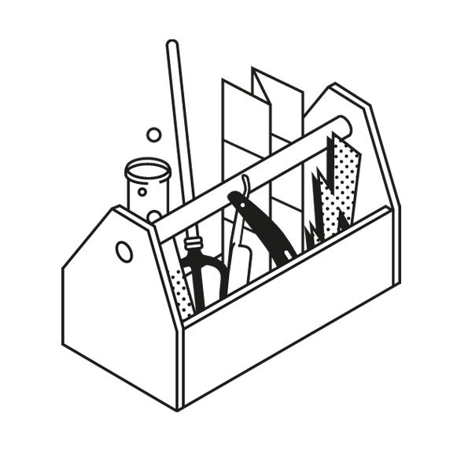

## What Are Mental Models?  

什么是心理模型？

A mental model is a compression of how something works.  

心智模式是对事物运作方式的压缩。  

Any idea, belief, or concept can be distilled down.  

任何想法、信念或概念都可以提炼出来。  

Like a map, mental models reveal key information while ignoring irrelevant details.  

就像地图一样，心智模式可以揭示关键信息，同时忽略无关细节。  

Models concentrate the world into understandable and useable chunks.  

模型将世界浓缩成可以理解和使用的小块。

Mental models help us understand the world.  

心智模式帮助我们理解世界。  

For example, velocity is a mental model that helps you understand that both speed and direction matter.  

例如，速度是一种心智模式，它能帮助你理解速度和方向都很重要。  

Reciprocity is a mental model that helps you understand how going positive and going first gets the world to do most of the work for you.  

互惠是一种心智模式，它能帮助你理解积极行动和先行一步是如何让世界为你做大部分工作的。  

Margin of Safety is a mental model that helps you understand that things don’t always go as planned.  

安全边际是一种心理模式，它能帮助你理解事情并不总是按计划进行。  

Relativity is a mental model that shows us we have blind spots and how a different perspective can reveal new information. The list goes on.  

相对论是一种思维模式，它告诉我们存在盲点，而不同的视角可以揭示新的信息。这样的例子不胜枚举。

## Eliminating Blind Spots  

消除盲点

In life and business, the person with the fewest blind spots wins.  

在生活和事业中，盲点越少的人越能获胜。

The source of all poor choices is blind spots. Think about it.  

所有错误选择的根源都是盲点。想一想吧。  

If you had perfect information, you would always make the best decision.  

如果你拥有完美的信息，你总是能做出最好的决定。  

You’d play your hand perfectly in a poker game where you could see everyone’s cards.  

在扑克牌游戏中，如果你能看到每个人的牌，你就能完美地打出自己的牌。  

You wouldn’t make any mistakes.  

你不会犯任何错误。

How do we eliminate blind spots?  

如何消除盲点？

The best way to reduce our blind spots is to change our perspective.  

减少盲点的最好办法就是改变我们的视角。  

Just as knowing where to stand can turn a good photo into a great one, changing your perspective on a situation reveals critical information and offers new solutions.  

就像知道站在什么位置能把一张好照片变成一张好照片一样，改变你对某种情况的看法能揭示关键信息并提供新的解决方案。

Think of each model as a lens through which you can see the world.  

把每种模式都看成是你观察世界的透镜。  

Each lens offers a different perspective, revealing new information.  

每个镜头都提供了不同的视角，揭示了新的信息。  

Looking through one lens lets you see one thing, and looking through another reveals something different.  

通过一个镜头看到的是一种事物，而通过另一个镜头看到的则是另一种事物。  

Looking through them both reveals more than each one individually.  

通过对这两本书的阅读，我们会发现比单独阅读更多的东西。

While there are a lot of specific mental models, only a handful of general ones come from the big disciplines.  

虽然有很多具体的心智模式，但只有少数几种一般模式来自于大学科。  

Understanding them positions you to make fewer errors, see things others miss, and take better actions.  

了解了它们，你就能减少错误，看到别人忽略的东西，并采取更好的行动。

Let’s take a look at the best general models.  

让我们来看看最佳通用模型。

> You’ve got to have models in your head and you’ve got to array you experience – both vicarious and direct – onto this latticework of mental models.  
> 
> 你必须在头脑中建立模型，并将你的经验--包括替代经验和直接经验--排列到这个心智模型的格子上。
> 
> Charlie munger  
> 
> 查理-芒格

## A Latticework of Mental Models  

心智模式的格子结构

Worldly wisdom is not simply memorizing things and repeating them back.  

世俗的智慧不是简单地背诵和复述。  

The people that do that fail at work and fail in life.  

这样做的人工作和生活都会失败。  

Wisdom is knowing the consequences of your actions, which comes from the alignment between facts and reasoning.  

智慧就是知道自己行为的后果，它来自于事实与推理的统一。

The world is not divided into distinct disciplines.  

世界并没有划分为不同的学科。  

For example, business professors won’t discuss physics in their lectures, but they should.  

例如，商学教授不会在讲座中讨论物理学，但他们应该讨论物理学。  

Velocity teaches us that speed and direction matter.  

速度告诉我们，速度和方向很重要。  

Kinetic energy teaches us that velocity matters more than mass when creating a force.  

动能告诉我们，在产生力时，速度比质量更重要。  

Understanding these insights helps you outperform.  

了解这些洞察力有助于您取得更好的业绩。

In the real world, everything is connected like a latticework.  

在现实世界中，所有事物都像格子一样连接在一起。  

Just because our teachers didn’t show us how to use the big ideas from all the disciplines in life and business doesn’t mean we can’t learn them ourselves.  

虽然我们的老师没有告诉我们如何在生活和工作中运用各学科的重要思想，但这并不意味着我们不能自己学习这些思想。  

That’s why we created _[The Great Mental Models](https://fs.blog/tgmm/)_ project.  

这就是我们创建 "伟大的心智模式 "项目的原因。

Here are the big ideas that can help you make better decisions, avoid problems, and spot opportunities others miss.  

以下这些重要理念可以帮助你做出更好的决策，避免问题，并发现别人错失的机会。

-   [Core Thinking Concepts  
    
    核心思维概念](https://fs.blog/mental-models/#general_thinking_concepts)
-   [Physics and Chemistry  
    
    物理和化学](https://fs.blog/mental-models/#physics_and_chemistry)
-   [Biology  
    
    生物学](https://fs.blog/mental-models/#biology)
-   [Systems  
    
    系统](https://fs.blog/mental-models/#systems)
-   [Numeracy  
    
    识数](https://fs.blog/mental-models/#numeracy)
-   [Microeconomics  
    
    微观经济学](https://fs.blog/mental-models/#microeconomics)
-   [Military and War  
    
    军事与战争](https://fs.blog/mental-models/#military_and_war)
-   [Human Nature and Judgment  
    
    人性与判断力](https://fs.blog/mental-models/#human_nature_and_judgment)

## The Core Mental Models  

核心思维模式

**[1\. The Map is Not the Territory  

1.地图不是领土](https://fs.blog/map-and-territory/)**  

The map of reality is not reality. Even the best maps are imperfect.  

现实的地图并非现实。再好的地图也是不完美的。  

That’s because they are reductions of what they represent.  

这是因为他们对自己所代表的东西有所减弱。  

If a map were to represent the territory with perfect fidelity, it would no longer be a reduction and thus would no longer be useful to us.  

如果一张地图能够完全忠实地表现领土，那么它就不再是缩小版，因此对我们也不再有用。  

A map can also be a snapshot of a point in time, representing something that no longer exists.  

地图也可以是一个时间点的快照，代表着不复存在的事物。  

This is important to keep in mind as we think through problems and make better decisions.  

我们在思考问题和做出更好的决定时，必须牢记这一点。

**[2\. Circle of Competence  

2.能力圈](https://fs.blog/circle-of-competence/)**  

When ego and not competence drive what we undertake, we have massive blind spots.  

当自我而非能力成为我们工作的驱动力时，我们就会出现巨大的盲点。  

If you know what you understand, you know where you have an edge over others.  

如果你知道自己了解什么，你就知道自己在哪些方面比别人更有优势。  

When you are honest about where your knowledge is lacking, you know where you are vulnerable and where you can improve.  

当你诚实地说出自己的知识欠缺之处时，你就会知道自己的弱点和可以改进之处。  

Understanding your circle of competence improves decision-making and outcomes.  

了解自己的能力圈可以改善决策和结果。

**[3\. First Principles Thinking  

3.第一原理思维](https://fs.blog/first-principles/)**  

First-principles thinking is one of the best ways to reverse-engineer complicated situations and unleash creative possibility.  

第一原理思维是逆向设计复杂情况、释放创造可能性的最佳方法之一。  

Sometimes called reasoning from first principles, it’s a tool to help clarify complicated problems by separating the underlying ideas or facts from any assumptions based on them.  

有时也称作 "第一原理推理"，它是一种将基本概念或事实与基于它们的任何假设分离开来，从而帮助澄清复杂问题的工具。  

What remains are the essentials.  

剩下的都是基本要素。  

If you know the first principles of something, you can build the rest of your knowledge around them to produce something new.  

如果你知道某件事情的基本原理，你就可以围绕这些原理构建其他知识，从而产生新的东西。

**[4\. Thought Experiment  

4.思想实验](https://fs.blog/thought-experiment/)**  

Thought experiments can be defined as “devices of the imagination used to investigate the nature of things.” Many disciplines, such as philosophy and physics, make use of thought experiments to examine what can be known.  

思想实验可以定义为 "用来研究事物本质的想象装置"。哲学和物理学等许多学科都利用思想实验来研究已知事物。  

In doing so, they can open up new avenues for inquiry and exploration.  

这样，他们就能开辟新的探究和探索途径。  

Thought experiments are powerful because they help us learn from our mistakes and avoid future ones.  

思想实验之所以强大，是因为它能帮助我们从错误中吸取教训，避免未来的错误。  

They let us take on the impossible, evaluate the potential consequences of our actions, and re-examine history to make better decisions.  

它们让我们承担不可能完成的任务，评估行动的潜在后果，重新审视历史，从而做出更好的决定。  

They can help us both figure out what we really want and the best way to get there.  

他们可以帮助我们双方弄清自己真正想要什么，以及达到目标的最佳途径。

**[5\. Second-Order Thinking  

5.二阶思维](https://fs.blog/second-order-thinking/)**  

Almost everyone can anticipate the immediate results of their actions.  

几乎每个人都能预见到自己行为的直接结果。  

This type of first-order thinking is easy and safe, but it’s also a way to ensure you get the same results that everyone else gets.  

这种一阶式思维既简单又安全，但也能确保你获得与其他人相同的结果。  

Second-order thinking is thinking farther ahead and thinking holistically.  

二阶思维是更长远的思考和全面的思考。  

It requires us to consider not only our actions and their immediate consequences but the subsequent effects of those actions as well.  

它要求我们不仅要考虑自己的行为及其直接后果，还要考虑这些行为的后续影响。  

Failing to consider the second and third-order effects can unleash disaster.  

不考虑二阶和三阶效应会带来灾难。

**[6\. Probabilistic Thinking  

6.概率思维](https://fs.blog/probabilistic-thinking/)**  

Probabilistic thinking is essentially trying to estimate, using some tools of math and logic, the likelihood of any specific outcome coming to pass.  

概率思维本质上是利用一些数学和逻辑工具来估算任何特定结果实现的可能性。  

It is one of the best tools we have to improve the accuracy of our decisions.  

它是我们提高决策准确性的最佳工具之一。  

In a world where each moment is determined by an infinitely complex set of factors, probabilistic thinking helps us identify the most likely outcomes.  

在一个每时每刻都由无限复杂的因素决定的世界里，概率思维帮助我们确定最有可能出现的结果。  

When we know these, our decisions can be more precise and effective.  

了解了这些，我们的决策就会更加准确和有效。

**[7\. Inversion  

7.反转](https://fs.blog/inversion/)**  

Inversion is a powerful tool to improve your thinking because it helps you identify and remove obstacles to success.  

逆向思维是提高思维能力的有力工具，因为它能帮助你识别和消除成功的障碍。  

The root of inversion is “invert,” which means to upend or turn upside down.  

倒置的词根是 "invert"，意思是颠倒或翻转。  

As a thinking tool, it means approaching a situation from the opposite end of the natural starting point.  

作为一种思维工具，它意味着从自然起点的另一端切入情境。  

Most of us tend to think one way about a problem: forward.  

我们大多数人都倾向于从一个角度思考问题：向前看。  

Inversion allows us to flip the problem around and think backward.  

逆向思维可以让我们反过来思考问题。  

Sometimes it’s good to start at the beginning, but it can be more useful to start at the end.  

有时，从头开始是好的，但从尾部开始可能更有用。

**[8\. Occam’s Razor  

8.奥卡姆剃刀](https://fs.blog/occams-razor/)**  

Simpler explanations are more likely to be true than complicated ones.  

简单的解释比复杂的解释更有可能是真的。  

This is the essence of Occam’s Razor, a classic principle of logic and problem-solving.  

这是奥卡姆剃刀的精髓，是逻辑和解决问题的经典原则。  

Instead of wasting your time trying to disprove complex scenarios, you can make decisions more confidently by basing them on the explanation that has the fewest moving parts.  

与其把时间浪费在推翻复杂的假设上，还不如根据活动部分最少的解释，更有把握地做出决策。

**[9\. Hanlon’s Razor  

9.汉伦剃刀](https://fs.blog/mental-model-hanlons-razor/)**  

Hard to trace in its origin, Hanlon’s Razor states that we should not attribute to malice that which is more easily explained by stupidity.  

汉伦剃刀说，我们不应该把更容易解释为愚蠢的事情归结为恶意，这一点很难追溯其起源。  

In a complex world, using this model helps us avoid paranoia and ideology.  

在一个复杂的世界里，使用这种模式有助于我们避免偏执和意识形态。  

By not generally assuming that bad results are the fault of a bad actor, we look for options instead of missing opportunities.  

如果我们不笼统地认为糟糕的结果是不良行为者的过错，我们就会寻找各种选择，而不是错失良机。  

This model reminds us that people do make mistakes.  

这种模式提醒我们，人是会犯错误的。  

It demands that we ask if there is another reasonable explanation for the events that have occurred.  

这就要求我们问一问，对于已经发生的事件，是否还有其他合理的解释。  

The explanation most likely to be right is the one that contains the least amount of intent.  

最有可能正确的解释是包含最少意图的解释。

## The Mental Models of Physics and Chemistry  

物理和化学的心理模型

**1\. [Relativity](https://fs.blog/galilean-relativity/)  

1.相对论**  

Relativity has been used in several contexts in the world of physics, but the important aspect to study is the idea that an observer cannot truly understand a system of which he himself is a part.  

相对论在物理学界有多种应用，但研究的重要方面是观察者无法真正理解他自己也是其中一部分的系统这一观点。  

For example, a man inside an airplane does not feel like he is experiencing movement, but an outside observer can see that movement is occurring.  

例如，一个人在飞机内感觉不到自己正在经历运动，但外部观察者却能看到运动正在发生。  

This form of relativity tends to affect social systems in a similar way.  

这种形式的相对性往往会以类似的方式影响社会系统。

**2\. [Reciprocity](https://fs.blog/reciprocity/)  

2.互惠性**  

If I push on a wall, physics tells me that the wall pushes back with equivalent force.  

如果我推一堵墙，物理学告诉我，墙会以等效的力向后推。  

In a biological system, if one individual acts on another, the action will tend to be reciprocated in kind.  

在生物系统中，如果一个人对另一个人采取行动，这种行动往往会得到相应的回报。  

And of course, human beings act with intense reciprocity demonstrated as well.  

当然，人类的行为也表现出强烈的互惠性。

**3\. Thermodynamics  

3.热力学**  

The laws of thermodynamics describe energy in a closed system.  

热力学定律描述了封闭系统中的能量。  

The laws cannot be escaped and underlie the physical world.  

物理世界的基础是无法摆脱的定律。  

They describe a world in which useful energy is constantly being lost, and energy cannot be created or destroyed.  

它们描述了这样一个世界：有用的能量不断流失，能量无法被创造或毁灭。  

Applying their lessons to the social world can be a profitable enterprise.  

将他们的经验应用到社会世界中，是一项有利可图的事业。

**4\. Inertia  

4.惯性**  

An object in motion with a certain vector wants to continue moving in that direction unless acted upon.  

运动中的物体具有一定的矢量，除非受到作用，否则会继续朝该方向运动。  

This is a fundamental physical principle of motion; however, individuals, systems, and organizations display the same effect.  

这是运动的基本物理原理；然而，个人、系统和组织也会产生同样的效果。  

It allows them to minimize the use of energy, but can cause them to be destroyed or eroded.  

这使它们能够最大限度地减少能源消耗，但也可能导致它们遭到破坏或侵蚀。

**5\. Friction and Viscosity  

5.摩擦和粘度**  

Both friction and viscosity describe the difficulty of movement.  

摩擦力和粘度都描述了运动的难度。  

Friction is a force that opposes the movement of objects that are in contact with each other, and viscosity measures how hard it is for one fluid to slide over another.  

摩擦力是一种阻碍相互接触的物体运动的力，而粘度则衡量一种流体在另一种流体上滑动的难易程度。  

Higher viscosity leads to higher resistance.  

粘度越高，阻力越大。  

These concepts teach us a lot about how our environment can impede our movement.  

这些概念告诉我们很多关于环境如何阻碍我们运动的知识。

**6\. [Velocity](https://fs.blog/speed-velocity/)  

6.速度**  

Velocity is not equivalent to speed; the two are sometimes confused.  

速度并不等同于速度，两者有时会被混淆。  

Velocity is speed plus vector: how fast something gets somewhere.  

速度是速度加矢量：物体到达某处的速度。  

An object that moves two steps forward and then two steps back has moved at a certain speed but shows no velocity.  

一个物体向前移动两步，然后后退两步，它以一定的速度移动，但没有显示速度。  

The addition of the vector, that critical distinction, is what we should consider in practical life.  

在实际生活中，我们应该考虑的是增加矢量，即关键的区别。

**7.** [**Leverage**](https://fs.blog/leverage/)  

7.杠杆作用  

Most of the engineering marvels of the world were accomplished with applied leverage.  

世界上大多数工程奇迹都是通过应用杠杆实现的。  

As famously stated by Archimedes, “Give me a lever long enough and I shall move the world.” With a small amount of input force, we can make a great output force through leverage.  

正如阿基米德的名言："给我一根足够长的杠杆，我就能撬动世界"。只要输入少量的力，我们就能通过杠杆产生巨大的输出力。  

Understanding where we can apply this model to the human world can be a source of great success.  

了解我们可以在哪些方面将这一模式应用于人类世界，这将是取得巨大成功的源泉。

**8\. [Activation Energy](https://fs.blog/activation-energy/)  

8.活化能**  

A fire is not much more than a combination of carbon and oxygen, but the forests and coal mines of the world are not combusting at will because such a chemical reaction requires the input of a critical level of “activation energy” in order to get a reaction started.  

火不过是碳和氧的结合，但世界上的森林和煤矿并不是随意燃烧的，因为这种化学反应需要输入临界水平的 "活化能 "才能开始。  

Two combustible elements alone are not enough.  

仅有两个可燃元素是不够的。

**9\. Catalysts  

9.催化剂**  

A catalyst either kick-starts or maintains a chemical reaction but isn’t itself a reactant.  

催化剂可以启动或维持化学反应，但本身不是反应物。  

The reaction may slow or stop without the addition of catalysts.  

如果不添加催化剂，反应可能会减慢或停止。  

Social systems, of course, take on many similar traits, and we can view catalysts in a similar light.  

当然，社会系统也有许多类似的特征，我们可以从类似的角度来看待催化剂。

**10\. Alloying  

10.合金化**  

When we combine various elements, we create new substances.  

当我们将各种元素结合在一起时，就会产生新的物质。  

This is no great surprise, but what can be surprising in the alloying process is that 2+2 can equal not 4 but 6 – the alloy can be far stronger than the simple addition of the underlying elements would lead us to believe.  

这并不令人感到惊讶，但在合金化过程中，令人惊讶的是 2+2 不等于 4，而是等于 6 --合金的强度可能远远超过简单地添加基本元素所能达到的程度。

This process leads us to engineer great physical objects, but we understand many intangibles in the same way; a combination of the right elements in social systems or even individuals can create a 2+2=6 effect similar to alloying.

  

这一过程引导我们设计出伟大的实物，但我们对许多无形资产的理解也是如此；社会系统甚至个人中正确元素的组合可以产生类似合金的 2+2=6 效果。

## The Mental Models of Biology  

生物学的心理模型

**1\. Evolution Part One: Natural Selection and Extinction  

1.进化论》第一部分：自然选择与灭绝**  

Evolution by natural selection was once called “the greatest idea anyone ever had.” In the 19th century, Charles Darwin and Alfred Russel Wallace simultaneously realized that species evolve through random mutation and differential survival rates.  

自然选择进化论曾被称为 "有史以来最伟大的思想"。19 世纪，查尔斯-达尔文和阿尔弗雷德-拉塞尔-华莱士同时认识到，物种是通过随机变异和不同的存活率进化而来的。  

If we call human intervention in animal breeding an example of “artificial selection,” we can call Mother Nature deciding the success or failure of a particular mutation “natural selection.” Those best suited for survival tend to be preserved.  

如果我们把人类对动物繁殖的干预称为 "人工选择"，那么我们就可以把大自然母亲决定特定变异成败的行为称为 "自然选择"。那些最适合生存的变异往往会被保留下来。  

But of course, conditions change.  

当然，情况是会变化的。

**2\. Evolution Part Two:  Adaptation and [The Red Queen Effect](https://fs.blog/the-red-queen-effect/)2.进化论》第二部分：适应与红皇后效应**    

Species tend to adapt to their surroundings in order to survive, given the combination of their genetics and their environment – an always-unavoidable combination.  

在遗传和环境的共同作用下，物种为了生存往往会适应周围的环境--这是一个始终无法避免的组合。  

However, adaptations made in an individual’s lifetime are not passed down genetically, as was once thought: 然而，个体一生中的适应性并不像人们曾经认为的那样会遗传下去： _Populations人口_ of species adapt through the process of evolution by natural selection, as the most-fit examples of the species replicate at an above-average rate.  

在自然选择的进化过程中，最适合的物种会以高于平均水平的速度复制，从而适应物种的进化。

The evolution-by-natural-selection model leads to something of an arms race among species competing for limited resources.  

自然选择进化模式导致物种之间为争夺有限资源而展开军备竞赛。  

When one species evolves an advantageous adaptation, a competing species must respond in kind or fail as a species.  

当一个物种进化出一种有利的适应性时，与之竞争的物种必须做出相应的反应，否则就会失败。  

Standing still can mean falling behind.  

原地踏步可能意味着落后。  

This arms race is called the Red Queen Effect for the character in _Alice in Wonderland_ who said, “Now, here, you see, it takes all the running you can do, to keep in the same place.”  

这种军备竞赛被称为 "红皇后效应"，因为《爱丽丝梦游仙境》中的人物曾说过："在这里，你看，你需要竭尽全力奔跑，才能保持在同一个地方"。

**3\. Ecosystems  

3.生态系统**  

An ecosystem describes any group of organisms coexisting with the natural world.  

生态系统是指与自然界共存的任何生物群体。  

Most ecosystems show diverse forms of life taking on different approaches to survival, with such pressures leading to varying behavior.  

在大多数生态系统中，不同形式的生命采取了不同的生存方式，这些压力导致了不同的行为。  

Social systems can be seen in the same light as the physical ecosystems and many of the same conclusions can be made.  

我们可以从与物理生态系统相同的角度来看待社会系统，并得出许多相同的结论。

**4\. Niches  

4.龛位**  

Most organisms find a niche: a method of competing and behaving for survival.  

大多数生物都能找到自己的生存空间：一种为生存而进行竞争和行为的方法。  

Usually, a species will select a niche for which it is best adapted.  

通常情况下，一个物种会选择最适合自己的生存环境。  

The danger arises when multiple species begin competing for the same niche, which can cause an extinction – there can be only so many species doing the same thing before limited resources give out.  

当多个物种开始竞争同一个生态位时，危险就出现了，这可能导致物种灭绝--在有限的资源耗尽之前，只能有这么多物种做同样的事情。

**5\. Self-Preservation   

5.自我保护**  

Without a strong self-preservation instinct in an organism’s DNA, it would tend to disappear over time, thus eliminating that DNA.  

如果生物 DNA 中没有强烈的自我保护本能，随着时间的推移，这种本能就会逐渐消失，从而消除这种 DNA。  

While cooperation is another important model, the self-preservation instinct is strong in all organisms and can cause violent, erratic, and/or destructive behavior for those around them.  

虽然合作是另一种重要的模式，但所有生物的自我保护本能都很强，会对周围的人造成暴力、不稳定和/或破坏性的行为。

**6\. Replication  

6.复制**  

A fundamental building block of diverse biological life is high-fidelity replication.  

高保真复制是构成多样化生物生命的基本要素。  

The fundamental unit of replication seems to be the DNA molecule, which provides a blueprint for the offspring to be built from physical building blocks.  

复制的基本单位似乎是 DNA 分子，它为后代提供了由物理积木构建的蓝图。  

There are a variety of replication methods, but most can be lumped into sexual and asexual.  

复制方法多种多样，但大多数可归纳为有性复制和无性复制。

**7\. Cooperation   

7.合作**  

Competition tends to describe most biological systems, but cooperation at various levels is just as important a dynamic.  

竞争往往是大多数生物系统的写照，但不同层次的合作也是同样重要的动力。  

In fact, the cooperation of a bacterium and a simple cell probably created the first complex cell and all of the life we see around us.  

事实上，一个细菌和一个简单细胞的合作很可能创造了第一个复杂细胞和我们周围的所有生命。  

Without cooperation, no group survives, and the cooperation of groups gives rise to even more complex versions of organization.  

没有合作，就没有群体的生存，而群体的合作又会产生更为复杂的组织形式。  

Cooperation and competition tend to coexist at multiple levels.  

合作与竞争往往在多个层面并存。

The Prisoner’s Dilemma is a famous application of game theory in which two prisoners are both better off cooperating with each other, but if one of them cheats, the other is better off cheating.  

囚徒困境是博弈论的一个著名应用，其中两个囚徒相互合作会更好，但如果其中一人作弊，另一人作弊也会更好。  

Thus the dilemma.  

因此，我们进退两难。  

This model shows up in economic life, in war, and in many other areas of practical human life.  

这种模式体现在经济生活、战争以及人类实际生活的许多其他领域。  

Though the prisoner’s dilemma theoretically leads to a poor result, in the real world, cooperation is nearly always possible and must be explored.  

虽然囚徒困境在理论上会导致糟糕的结果，但在现实世界中，合作几乎总是可能的，必须加以探索。

**8\. Hierarchical  Organization  

8.分级组织**  

Most complex biological organisms have an innate feel for how they should organize.  

大多数复杂的生物有机体天生就知道自己应该如何组织。  

While not all of them end up in hierarchical structures, many do, especially in the animal kingdom.  

虽然并不是所有的动物都会形成等级结构，但很多动物都是如此，尤其是在动物界。  

Human beings like to think they are outside of this, but they feel the hierarchical instinct as strongly as any other organism.  

人类喜欢认为自己置身事外，但他们和其他生物一样强烈地感受到等级本能。  

This includes the Stanford Prison Experiment and Milgram Experiments, which demonstrated what humans learned practically many years before: the human bias towards being influenced by authority.  

其中包括斯坦福监狱实验和米尔格拉姆实验，这两个实验证明了人类在许多年前就已经了解到的实际情况：人类受权威影响的偏差。  

In a dominance hierarchy such as ours, we tend to look to the leader for guidance on behavior, especially in situations of stress or uncertainty.  

在像我们这样的支配型等级制度中，我们倾向于向领导者寻求行为指导，尤其是在压力或不确定的情况下。  

Thus, authority figures have a responsibility to act well, whether they like it or not.  

因此，权威人士有责任采取良好的行动，无论他们喜欢与否。

**9\. [Incent](https://fs.blog/bias-incentives-reinforcement/)**ives  

9.激励措施  

All creatures respond to incentives to keep themselves alive. This is the basic insight of biology.  

所有生物都会对激励措施做出反应，以保持自身的活力。这是生物学的基本观点。  

Constant incentives will tend to cause a biological entity to have constant behavior to an extent.  

恒定的激励机制在一定程度上会使生物实体的行为趋于恒定。  

Humans are included and are particularly great examples of the incentive-driven nature of biology; however, humans are complicated in that their incentives can be hidden or intangible.  

人类也包括在内，而且是生物学激励驱动性质的一个特别好的例子；然而，人类是复杂的，因为他们的激励可能是隐藏的或无形的。  

The rule of life is to repeat what works and has been rewarded.  

生活的法则就是重复那些行之有效并获得回报的事情。

**10\. Tendency to Minimize Energy Output (Mental and physical)  

10.尽量减少能量输出的倾向（精神和体能）**  

In a physical world governed by thermodynamics and competition for limited energy and resources, any biological organism that was wasteful with energy would be at a severe disadvantage for survival.  

在一个受热力学和有限能源与资源竞争支配的物理世界中，任何浪费能源的生物体都将处于严重的生存劣势。  

Thus, we see in most instances that behavior is governed by a tendency to minimize energy usage when at all possible.  

因此，我们发现在大多数情况下，人们的行为倾向于尽可能减少能源消耗。

## The Mental Models of Systems Thinking  

系统思维的心理模型

**1\. [Feedback L](https://fs.blog/mental-model-feedback-loops/)**oops   

1.反馈回路  

All complex systems are subject to positive and negative feedback loops whereby A causes B, which in turn influences A (and C), and so on – with higher-order effects frequently resulting from the continual movement of the loop.  

所有复杂的系统都存在正反馈循环，即 A 引起 B，B 又影响 A（和 C），如此循环往复，循环的持续运动往往会产生更高阶的效应。  

In a homeostatic system, a change in A is often brought back into line by an opposite change in B to maintain the balance of the system, as with the temperature of the human body or the behavior of an organizational culture.  

在同态系统中，A 的变化往往会通过 B 的相反变化而恢复正常，以维持系统的平衡，如人体的温度或组织文化的行为。  

Automatic feedback loops maintain a “static” environment unless and until an outside force changes the loop.  

自动反馈回路维持着一种 "静态 "环境，除非或直到外力改变了回路。  

A “runaway feedback loop” describes a situation in which the output of a reaction becomes its own catalyst (auto-catalysis).  

失控反馈回路 "是指反应的输出变成了自身的催化剂（自动催化）。

**2\. Equilibrium  

2.平衡**  

Homeostasis is the process through which systems self-regulate to maintain an equilibrium state that enables them to function in a changing environment.  

稳态是系统自我调节以维持平衡状态的过程，这种平衡状态使系统能够在不断变化的环境中发挥作用。  

Most of the time, they over or undershoot it by a little and must keep adjusting.  

大多数情况下，他们会略微偏高或偏低，必须不断调整。  

Like a pilot flying a plane, the system is off course more often than on course.  

就像飞行员驾驶飞机一样，该系统偏离航线的次数多于航线上的次数。  

Everything within a homeostatic system contributes to keeping it within a range of equilibrium, so it is important to understand the limits of the range.  

平衡系统中的一切都有助于将其保持在一定的平衡范围内，因此了解平衡范围的界限非常重要。

**3\. Bottlenecks  

3.瓶颈**  

A bottleneck describes the place at which a flow (of a tangible or intangible) is stopped, thus constraining it from continuous movement.  

瓶颈是指流量（有形或无形的流量）停止流动的地方，从而限制了流量的持续流动。  

As with a clogged artery or a blocked drain, a bottleneck in the production of any good or service can be small but have a disproportionate impact if it is in the critical path.  

就像动脉堵塞或下水道堵塞一样，任何商品或服务生产中的瓶颈可能很小，但如果处于关键路径上，就会产生不成比例的影响。  

However, bottlenecks can also be a source of inspiration as they force us to reconsider if there are alternate pathways to success.  

然而，瓶颈也可以成为灵感的源泉，因为它迫使我们重新考虑是否有其他通往成功的途径。

**4\. Scale  

4.规模**  

One of the most important principles of systems is that they are sensitive to scale.  

系统最重要的原则之一就是对规模敏感。  

Properties (or behaviors) tend to change when you scale them up or down.  

属性（或行为）在放大或缩小时往往会发生变化。  

In studying complex systems, we must always be roughly quantifying – in orders of magnitude, at least – the scale at which we are observing, analyzing, or predicting the system.  

在研究复杂系统时，我们必须始终粗略地量化--至少是数量级--我们观察、分析或预测系统的尺度。

**5\. [Margin of Safety](https://fs.blog/margin-of-safety/)5.安全边际**    

Similarly, engineers have also developed the habit of adding a margin for error into all calculations.  

同样，工程师们也养成了在所有计算中增加误差幅度的习惯。  

In an unknown world, driving a 9,500-pound bus over a bridge built to hold precisely 9,600 pounds is rarely seen as intelligent.  

在一个未知的世界里，驾驶一辆重达 9500 磅的公共汽车通过一座精确承载 9600 磅的桥梁，很少有人会认为这是一种智慧。  

Thus, on the whole, few modern bridges ever fail.  

因此，总体而言，现代桥梁很少出现故障。  

In practical life outside of physical engineering, we can often profitably give ourselves margins as robust as the bridge system.  

在物理工程学之外的实际生活中，我们往往可以给自己留出与桥梁系统一样稳健的余地，并从中获利。

**6\. Churn  

6.搅动**  

Insurance companies and subscription services are well aware of the concept of churn – every year, a certain number of customers are lost and must be replaced.  

保险公司和订阅服务公司都很清楚客户流失的概念--每年都会有一定数量的客户流失，必须加以补充。  

Standing still is the equivalent of losing, as seen in the model called the “[Red Queen Effect](https://fs.blog/the-red-queen-effect/).” Churn is present in many business and human systems: A constant figure is periodically lost and must be replaced before any new figures are added over the top.  

原地踏步就等于失败，这在被称为 "红皇后效应 "的模式中可见一斑。在许多商业和人类系统中都存在流失现象：一个恒定的数字会周期性地丢失，在新的数字加入之前，必须先进行替换。

**7\. Algorithms  

7.算法**  

While hard to precisely define, an algorithm is generally an automated set of rules or a “blueprint” leading a series of steps or actions resulting in a desired outcome, and often stated in the form of a series of “If → Then” statements.  

虽然很难精确定义，但算法通常是一套自动规则或 "蓝图"，引导一系列步骤或行动，最终产生预期结果，通常以一系列 "如果→那么 "语句的形式呈现。  

Algorithms are best known for their use in modern computing, but are a feature of biological life as well.  

算法因其在现代计算中的应用而最为人熟知，但它也是生物生命的一个特征。  

For example, human DNA contains an algorithm for building a human being.  

例如，人类 DNA 就包含了构建人类的算法。

**8\. Critical mass  

8.临界质量**  

A system becomes critical when it is about to jump discretely from one phase to another.  

当一个系统即将从一个阶段离散地跳转到另一个阶段时，它就会变得至关重要。  

The marginal utility of the last unit before the phase change is wildly higher than any unit before it.  

相变前最后一个单位的边际效用远远高于相变前的任何单位。  

A frequently cited example is water turning from a liquid to a vapor when heated to a specific temperature.  

一个经常被引用的例子是，当加热到特定温度时，水会从液体变成蒸汽。  

“Critical mass” refers to the mass needed to have the critical event occur, most commonly in a nuclear system.  

"临界质量 "是指发生临界事件所需的质量，最常见于核系统。

**9\. Emergence  

9.出现**  

Higher-level behavior tends to emerge from the interaction of lower-order components.  

高层次的行为往往产生于低层次成分的相互作用。  

The result is frequently not linear – not a matter of simple addition – but rather non-linear, or exponential.  

结果往往不是线性的，不是简单的加法，而是非线性的，或者说是指数式的。  

An important resulting property of emergent behavior is that it cannot be predicted from simply studying the component parts.  

突发行为的一个重要特性是，它无法通过简单地研究各组成部分来预测。

**10\. Irreducibility   

10.不可还原性**  

We find that in most systems there are irreducible quantitative properties, such as complexity, minimums, time, and length.  

我们发现，在大多数系统中，都存在不可还原的定量属性，如复杂性、最小值、时间和长度。  

Below the irreducible level, the desired result simply does not occur.  

在不可还原水平以下，根本不会出现预期的结果。  

One cannot get several women pregnant to reduce the amount of time needed to have one child, and one cannot reduce a successfully built automobile to a single part.  

我们不能让几个妇女怀孕来减少生一个孩子所需的时间，我们也不能把一辆成功制造的汽车简化为一个部件。  

These results are, to a defined point, irreducible.  

这些结果在一定程度上是不可还原的。

**11\. Law of Diminishing Returns  

11.收益递减法则**  

Related to scale, most important real-world results are subject to an eventual decrease of incremental value.  

与规模有关的是，现实世界中大多数重要成果的增量价值最终都会下降。  

A good example would be a poor family: Give them enough money to thrive, and they are no longer poor.  

贫困家庭就是一个很好的例子：给他们足够的钱，让他们茁壮成长，他们就不再贫穷。

But after a certain point, additional money will not improve their lot; there is a clear diminishing return of additional dollars at some roughly quantifiable point.

  

但是，到了一定程度之后，额外的资金并不能改善他们的命运；在某个大致可以量化的点上，额外资金的回报明显递减。  

Often, the law of diminishing returns veers into negative territory – i.e., receiving too much money could destroy the poor family.  

通常情况下，收益递减法则会出现负面影响，即收到太多的钱会毁了这个贫困家庭。

## The Mental Models of Numeracy  

计算能力的心理模型

**1\. Distributions  

1.分布情况**  

The normal distribution is a statistical process that leads to the well-known graphical representation of a bell curve, with a meaningful central “average” and increasingly rare standard deviations from that average when correctly sampled.  

正态分布是一个统计过程，它产生了众所周知的钟形曲线图，其中有一个有意义的中心 "平均值"，在正确取样的情况下，该平均值的标准偏差越来越小。  

(The so-called “central limit” theorem.) Well-known examples include human height and weight, but it’s just as important to note that many common processes, especially in non-tangible systems like social systems, do not follow this pattern.  

(所谓的 "中心极限 "定理。）众所周知的例子包括人类的身高和体重，但同样重要的是，许多常见的过程，尤其是在社会系统等非有形系统中，并不遵循这种模式。  

Normal distributions can be contrasted with power law, or exponential, distributions.  

正态分布可与幂律分布或指数分布进行对比。

**2\. Compounding  

2.复合**  

It’s been said that Einstein called compounding a wonder of the world.  

有人说，爱因斯坦把复利称为世界奇迹。  

He probably didn’t, but it is a wonder.  

他可能没有，但这是一个奇迹。  

Compounding is the process by which we add interest to a fixed sum, which then earns interest on the previous sum复利是将利息加到固定金额上的过程，然后在前一笔金额的基础上赚取利息。 _and_ the newly added interest, and then earns interest on that amount, and so on新增加的利息，然后从该金额中赚取利息，依此类推 _ad infinitum  

无穷无尽_. It is an.它是一个 _exponential  

指数_ effect, rather than a linear, or additive, effect.  

效应，而不是线性或叠加效应。  

Money is not the only thing that compounds; ideas and relationships do as well.  

金钱并不是唯一的财富，思想和人际关系也是如此。  

In tangible realms, compounding is always subject to physical limits and diminishing returns; intangibles can compound more freely.  

在有形领域，复利总是受到物理限制和收益递减的制约；而无形资产的复利则更加自由。  

Compounding also leads to the time value of money, which underlies all of modern finance.  

复利还带来了货币的时间价值，这是现代金融的基础。

**3\. Sampling  

3.取样**  

When we want to get information about a population (meaning a set of alike people, things, or events), we usually need to look at a sample (meaning a part of the population).  

当我们想要获取一个群体（指一组相同的人、事物或事件）的信息时，通常需要查看一个样本（指群体的一部分）。  

It is usually not possible or even desirable to consider the entire population, so we aim for a sample that represents the whole.  

通常情况下，不可能甚至不希望考虑全部人口，因此我们的目标是抽取能代表全部人口的样本。  

As a rule of thumb, more measurements mean more accurate results, all else being equal.  

根据经验，在其他条件相同的情况下，测量次数越多，结果越准确。  

Small sample sizes can produce skewed results.  

样本量小可能导致结果偏差。

**4\. Randomness  

4.随机性**  

Though the human brain has trouble comprehending it, much of the world is composed of random, non-sequential, non-ordered events.  

虽然人脑难以理解，但世界上的许多事情都是由随机、无序、无序的事件组成的。  

We are “fooled” by random effects when we attribute causality to things that are actually outside of our control.  

当我们把因果关系归因于实际上不受我们控制的事物时，我们就被随机效应 "愚弄 "了。  

If we don’t course-correct for this fooled-by-randomness effect – our faulty sense of pattern-seeking – we will tend to see things as being more predictable than they are and act accordingly.  

如果我们不对这种 "被随机性愚弄 "的效应--我们错误的 "寻求模式 "的意识--进行纠正，我们就会倾向于把事情看得比实际情况更可预测，并据此采取行动。

**5\. [Regression to the Mean](https://fs.blog/regression-to-the-mean/)  

5.回归均值**  

In a normally distributed system, long deviations from the average will tend to return to that average with an increasing number of observations: the so-called Law of Large Numbers.  

在正态分布系统中，随着观测次数的增加，长期偏离平均值的情况往往会回归平均值：这就是所谓的大数定律。  

We are often fooled by regression to the mean, as with a sick patient improving spontaneously around the same time they begin taking an herbal remedy, or a poorly performing sports team going on a winning streak.  

我们经常会被平均值的回归所迷惑，比如一个病人在开始服用草药的同时，病情就会自动好转，或者一个表现不佳的运动队开始连胜。  

We must be careful not to confuse statistically likely events with causal ones.  

我们必须小心谨慎，不要将统计上可能发生的事件与因果事件混为一谈。

**6\. [Multiplying by Zero](https://fs.blog/multiplicative-systems/)  

6.乘以零**  

Any reasonably educated person knows that any number multiplied by zero, no matter how large the number, is still zero.  

任何受过合理教育的人都知道，任何数字乘以零，无论数字有多大，仍然是零。  

This is true in human systems as well as mathematical ones.  

人类系统和数学系统都是如此。  

In some systems, a failure in one area can negate great effort in all other areas.  

在某些系统中，一个领域的失败可能会抵消所有其他领域的巨大努力。  

As simple multiplication would show, fixing the “zero” often has a much greater effect than does trying to enlarge the other areas.  

正如简单的乘法所显示的那样，解决 "零 "的问题往往比试图扩大其他方面的影响要大得多。

**7\. Equivalence  

7.等效**  

The introduction of algebra allowed us to demonstrate mathematically and abstractly that two seemingly different things could be the same.  

代数的引入使我们能够从数学上抽象地证明，两个看似不同的事物可能是相同的。  

By manipulating symbols, we can demonstrate equivalence or inequivalence, the use of which led humanity to untold engineering and technical abilities.  

通过对符号的操作，我们可以证明等价或不等价，而符号的使用为人类带来了难以计数的工程和技术能力。  

Knowing at least the basics of algebra can allow us to understand a variety of important results.  

至少了解代数的基础知识可以让我们理解各种重要的结果。

**8\. Surface Area  

8.表面积**  

The surface area of a three dimensional object is the amount of space on the outside of it.  

三维物体的表面积是指物体外部的空间大小。  

Thus, the more surface area you have, the more contact you have with your environment.  

因此，表面积越大，与环境的接触就越多。  

Sometimes a high surface area is desirable: Our lungs and intestines have a huge surface area to increase the absorption of oxygen and nutrients.  

有时，高表面积是可取的：我们的肺和肠都有很大的表面积，以增加氧气和营养物质的吸收。  

Other times we want to reduce our exposure, such as limiting our internet exposure to reduce the attack surface.  

还有一些时候，我们希望减少暴露的机会，比如限制我们接触互联网的机会，以减少攻击面。

**9\. Global and Local Maxima  

9.全局和局部最大值**  

The maxima and minima of a mathematical function are the largest and smallest values over its domain.  

数学函数的最大值和最小值是其域内的最大值和最小值。  

Although there is one maximum value, the global maximum, there can be smaller peaks of value in a given range, the local maxima.  

虽然存在一个最大值，即全局最大值，但在给定范围内也可能存在较小的峰值，即局部最大值。  

Global and local maxima help us identify peaks, and if there is still potential to go higher or lower.  

全局最大值和局部最大值可以帮助我们识别峰值，以及是否还有可能升高或降低。  

It also reminds us that sometimes we have to go down to go back up.  

它还提醒我们，有时我们必须跌倒才能爬起来。

## The Mental Models of Microeconomics  

微观经济学的心理模型

**1\. Opportunity Costs  

1.机会成本**  

Doing one thing means not being able to do another.  

做一件事意味着无法做另一件事。  

We live in a world of trade-offs, and the concept of opportunity cost rules all.  

我们生活在一个权衡利弊的世界，机会成本的概念决定了一切。  

Most aptly summarized as “there is no such thing as a free lunch.”  

最贴切的概括就是 "天下没有免费的午餐"。

**2\. Creative Destruction  

2.创造性毁灭**  

Coined by economist Joseph Schumpeter, the term “creative destruction” describes the capitalistic process at work in a functioning free-market system.  

创造性破坏 "一词由经济学家约瑟夫-熊彼特（Joseph Schumpeter）提出，描述了一个正常运作的自由市场体系中的资本主义过程。  

Motivated by personal incentives (including but not limited to financial profit), entrepreneurs will push to best one another in a never-ending game of creative one-upmanship, in the process destroying old ideas and replacing them with newer technology.  

在个人动机（包括但不限于经济利益）的驱使下，企业家们会在一场永无休止的创造性 "单挑 "游戏中力争上游，并在此过程中摧毁旧观念，用更新的技术取而代之。  

Beware getting left behind.  

小心落在后面

**3. [Comparative Advantage](https://fs.blog/should-tiger-woods-mow-his-own-lawn-the-principles-of-comparative-advantage/)  

3.比较优势**  

The Scottish economist David Ricardo had an unusual and non-intuitive insight: Two individuals, firms, or countries could benefit from trading with one another even if one of them was better at everything.  

苏格兰经济学家大卫-李嘉图（David Ricardo）有一个不寻常、不直观的见解：两个人、公司或国家可以从相互贸易中获益，即使其中一方在所有方面都更胜一筹。  

Comparative advantage is best seen as an applied opportunity cost: If it has the opportunity to trade, an entity gives up free gains in productivity by not focusing on what it does best.  

比较优势最好被看作是一种应用机会成本：如果一个实体有机会进行贸易，它就会因为不专注于自己最擅长的领域而放弃生产率方面的免费收益。

**4\. Specialization (Pin Factory)  

4.专业化（针厂）**  

Another Scottish economist, Adam Smith, highlighted the advantages gained in a free-market system by specialization.  

另一位苏格兰经济学家亚当-斯密强调了自由市场体系中专业化所带来的优势。  

Rather than having a group of workers each producing an entire item from start to finish, Smith explained that it’s usually far more productive to have each of them specialize in one aspect of production.  

史密斯解释说，与其让一群工人每人从头到尾生产一个完整的产品，不如让他们每人专门从事一个方面的生产，这样通常会更有成效。  

He also cautioned, however, that each worker might not enjoy such a life; this is a trade-off of the specialization model.  

不过，他也提醒说，每个工人都不一定能享受这样的生活；这是专业化模式的一种权衡。

**5\. Seizing the Middle  

5.抓住中间地带**  

In chess, the winning strategy is usually to seize control of the middle of the board, so as to maximize the potential moves that can be made and control the movement of the maximal number of pieces.  

在国际象棋中，制胜的策略通常是夺取棋盘中间的控制权，从而最大限度地增加可能走的棋步，控制最多棋子的移动。  

The same strategy works profitably in business, as can be demonstrated by John D.  

同样的策略在商业中也能获利，约翰-D.  

Rockefeller’s control of the refinery business in the early days of the oil trade and Microsoft’s control of the operating system in the early days of the software trade.  

洛克菲勒在石油贸易早期对炼油厂业务的控制，以及微软在软件贸易早期对操作系统的控制。

**6\. Trademarks, Patents, and Copyrights  

6.商标、专利和版权**  

These three concepts, along with other related ones, protect the creative work produced by enterprising individuals, thus creating additional incentives for creativity and promoting the creative-destruction model of capitalism.  

这三个概念以及其他相关概念保护了有进取心的个人所创作的创造性作品，从而为创造性提供了额外的激励，并促进了资本主义的创造性毁灭模式。  

Without these protections, information and creative workers have no defense against their work being freely distributed.  

没有这些保护，信息和创意工作者就无法抵御其作品被自由传播。

**7\. Double-Entry Bookkeeping  

7.复式簿记**  

One of the marvels of modern capitalism has been the bookkeeping system introduced in Genoa in the 14th century.  

现代资本主义的奇迹之一是 14 世纪在热那亚引入的记账系统。  

The double-entry system requires that every entry, such as income, also be entered into another corresponding account.  

复式记账法要求每笔账目（如收入）都要记入另一个相应的账户。  

Correct double-entry bookkeeping acts as a check on potential accounting errors and allows for accurate records and thus, more accurate behavior by the owner of a firm.  

正确的复式记账法可以防止潜在的会计错误，使记录准确无误，从而使公司所有者的行为更加准确。

**8\. Utility (Marginal, Diminishing, Increasing)  

8.效用（边际效用、递减效用、递增效用）**  

The usefulness of additional units of any good tends to vary with scale.  

任何商品的额外单位的效用往往随规模而变化。  

Marginal utility allows us to understand the value of one additional unit, and in most practical areas of life, that utility diminishes at some point.  

边际效用让我们了解多一个单位的价值，而在生活的大多数实际领域，这种效用会在某一时刻递减。  

On the other hand, in some cases, additional units are subject to a “critical point” where the utility function jumps discretely up or down.  

另一方面，在某些情况下，额外的单位会受到 "临界点 "的影响，效用函数会离散地向上或向下跳跃。  

As an example, giving water to a thirsty man has diminishing marginal utility with each additional unit, and can eventually kill him with enough units.  

举例来说，给一个口渴的人水喝，每增加一个单位，边际效用就会递减，如果增加的单位足够多，最终就会要了他的命。

**9\. Bribery  

9.贿赂**  

Often ignored in mainstream economics, the concept of bribery is central to human systems: Given the chance, it is often easier to pay a certain agent to look the other way than to follow the rules.  

贿赂的概念往往被主流经济学所忽视，但它却是人类制度的核心：如果有机会，付钱让某个代理人睁一只眼闭一只眼往往比遵守规则更容易。  

The enforcer of the rules is then neutralized.  

这样，规则的执行者就失去了作用。  

This principal/agent problem can be seen as a form of arbitrage.  

这种委托/代理问题可视为一种套利形式。

**10\. Arbitrage  

10.套利**  

Given two markets selling an identical good, an arbitrage exists if the good can profitably be bought in one market and sold at a profit in the other.  

如果有两个市场销售相同的商品，而在一个市场购买该商品并在另一个市场出售并获利，那么就存在套利。  

This model is simple on its face, but can present itself in disguised forms: The only gas station in a 50-mile radius is also an arbitrage as it can buy gasoline and sell it at the desired profit (temporarily) without interference.  

这种模式表面上很简单，但也可以以伪装的形式出现：方圆 50 英里内唯一的加油站也是一种套利行为，因为它可以不受干扰地购买汽油并以所需利润（暂时）出售。  

Nearly all arbitrage situations eventually disappear as they are discovered and exploited.  

几乎所有套利情况最终都会随着被发现和利用而消失。

**11\. [Supply and Demand](https://fs.blog/mental-model-supply-and-demand/)  

11.供应与需求**  

The basic equation of biological and economic life is one of limited supply of necessary goods and competition for those goods.  

生物和经济生活的基本等式是必需品的有限供应和对这些必需品的竞争。  

Just as biological entities compete for limited usable energy, so too do economic entities compete for limited customer wealth and limited demand for their products.  

正如生物实体争夺有限的可用能源一样，经济实体也在争夺有限的客户财富和有限的产品需求。  

The point at which supply and demand for a given good are equal is called an equilibrium; however, in practical life, equilibrium points tend to be dynamic and changing, never static.  

某种商品的供需平衡点被称为均衡点；然而，在实际生活中，均衡点往往是动态变化的，绝非一成不变。

**12\. Scarcity  

12.稀缺性**  

Game theory describes situations of conflict, limited resources, and competition.  

博弈论描述了冲突、资源有限和竞争的情况。  

Given a certain situation and a limited amount of resources and time, what decisions are competitors likely to make, and which should they make?  

在特定情况下，在有限的资源和时间内，竞争对手可能会做出哪些决定，又应该做出哪些决定？  

One important note is that traditional game theory may describe humans as more rational than they really are.  

值得注意的一点是，传统博弈论可能会把人类描述得比实际更理性。  

Game theory is theory, after all.  

博弈论毕竟是理论。

**13\. [Mr. Market](https://fs.blog/mr-market/)  

13.市场先生**  

Mr. Market was introduced by the investor Benjamin Graham in his seminal book _The Intelligent Investor_ to represent the vicissitudes of the financial markets.  

投资者本杰明-格雷厄姆（Benjamin Graham）在其开创性著作《聪明的投资者》（The Intelligent Investor）中介绍了 "市场先生"（Market）一词，以代表金融市场的风云变幻。  

As Graham explains, the markets are a bit like a moody neighbor, sometimes waking up happy and sometimes waking up sad – your job as an investor is to take advantage of him in his bad moods and sell to him in his good moods.  

正如格雷厄姆所解释的那样，市场有点像一个喜怒无常的邻居，有时高兴地醒来，有时悲伤地醒来--作为投资者，你的工作就是在他心情不好的时候利用他，在他心情好的时候卖给他。  

This attitude is contrasted to an efficient-market hypothesis in which Mr. Market always wakes up in the middle of the bed, never feeling overly strong in either direction.  

这种态度与有效市场假说形成鲜明对比，在有效市场假说中，"市场先生 "总是在半梦半醒之间醒来，从来不会对任何一个方向感到过于强烈。

## The Mental Models of Military and War  

军事和战争的心理模式

**1\. Seeing the Front  

1.看到前方**  

One of the most valuable military tactics is the habit of “personally seeing the front” before making decisions – not always relying on advisors, maps, and reports, all of which can be either faulty or biased.  

最有价值的军事战术之一就是在决策前 "亲临前线 "的习惯--而不是一味地依赖顾问、地图和报告，因为所有这些都可能是错误或有偏见的。  

The Map/Territory model illustrates the problem with not seeing the front, as does the incentive model.  

地图/领土模型和激励模型一样，都说明了看不到前面的问题。  

Leaders of any organization can generally benefit from seeing the front, as not only does it provide firsthand information, but it also tends to improve the quality of secondhand information.  

任何组织的领导者一般都能从看到前线的情况中受益，因为这不仅能提供第一手信息，还往往能提高二手信息的质量。

**2\. Asymmetric Warfare  

2.非对称战争**  

The asymmetry model leads to an application in warfare whereby one side seemingly “plays by different rules” than the other side due to circumstance.  

不对称模式在战争中的应用是，由于环境因素，一方似乎与另一方 "按不同的规则行事"。  

Generally, this model is applied by an insurgency with limited resources.  

一般来说，资源有限的叛乱分子会采用这种模式。  

Unable to out-muscle their opponents, asymmetric fighters use other tactics, as with terrorism creating fear that’s disproportionate to their actual destructive ability.  

由于无法以武力战胜对手，非对称战士会使用其他战术，如恐怖主义会制造与其实际破坏能力不相称的恐惧。

**3\. Two-Front War  

3.两线作战**  

The Second World War was a good example of a two-front war.  

第二次世界大战就是两线作战的典范。  

Once Russia and Germany became enemies, Germany was forced to split its troops and send them to separate fronts, weakening their impact on either front.  

一旦俄国和德国成为敌人，德国就被迫将其部队分割开来，分别派往不同的战线，从而削弱了他们在任何一条战线上的影响力。  

In practical life, opening a two-front war can often be a useful tactic, as can solving a two-front war or avoiding one, as in the example of an organization tamping down internal discord to focus on its competitors.  

在实际生活中，开辟两线作战往往是一种有用的战术，解决两线作战或避免两线作战也是一种有用的战术，比如一个组织平息内部不和，集中精力对付竞争对手。

**4\. [Counterinsurgency](https://fs.blog/counterinsurgency/)  

4.反叛乱**  

Though asymmetric insurgent warfare can be extremely effective, over time competitors have also developed counterinsurgency strategies.  

虽然非对称叛乱战可能极为有效，但随着时间的推移，竞争对手也制定了反叛乱战略。  

Recently and famously, General David Petraeus of the United States led the development of counterinsurgency plans that involved no additional force but substantial additional gains.  

最近，美国的戴维-彼得雷乌斯将军领导制定了一项著名的反叛乱计划，该计划不需要增加兵力，但却能获得大量额外收益。

Tit-for-tat warfare or competition will often lead to a feedback loop that demands insurgency and counterinsurgency.

  

针锋相对的战争或竞争往往会导致要求叛乱和反叛乱的反馈循环。

**5\. [Mutually Assured Destruction](https://fs.blog/mutually-assured-destruction/)  

5.相互保证毁灭**  

Somewhat paradoxically, the stronger two opponents become, the less likely they may be to destroy one another.  

有点自相矛盾的是，两个对手越强大，就越不可能互相摧毁。  

This process of mutually assured destruction occurs not just in warfare, as with the development of global nuclear warheads, but also in business, as with the avoidance of destructive price wars between competitors.  

这种相互确保摧毁的过程不仅发生在战争中，如全球核弹头的研发，也发生在商业中，如避免竞争对手之间破坏性的价格战。  

However, in a fat-tailed world, it is also possible that mutually assured destruction scenarios simply make destruction more severe in the event of a mistake (pushing destruction into the “tails” of the distribution).  

然而，在一个 "肥尾 "世界中，也有可能出现这样的情况，即在相互确保摧毁的情况下，一旦出现失误，就会造成更严重的破坏（将破坏推向分布的 "尾部"）。

## The Mental Models of Human Nature and Judgment  

人性和判断力的心理模型

**1\. Trust  

1.信任**  

Fundamentally, the modern world operates on trust.  

从根本上说，现代世界是在信任的基础上运行的。  

Familial trust is generally a given (otherwise we’d have a hell of a time surviving), but we also choose to trust chefs, clerks, drivers, factory workers, executives, and many others.  

一般来说，家人之间的信任是必然的（否则我们会活得很艰难），但我们也会选择信任厨师、店员、司机、工厂工人、高管以及其他许多人。  

A trusting system is one that tends to work most efficiently; the rewards of trust are extremely high.  

一个充满信任的系统往往能最有效地运作；信任的回报率极高。

**2\. Bias from Incentives  

2.激励机制带来的偏差**  

Highly responsive to incentives, humans have perhaps the most varied and hardest to understand set of incentives in the animal kingdom.  

人类对激励机制的反应非常灵敏，在动物王国中，人类的激励机制可能是最多样、最难理解的。  

This causes us to distort our thinking when it is in our own interest to do so.  

这导致我们在符合自身利益的情况下扭曲自己的思维。  

A wonderful example is a salesman truly believing that his product will improve the lives of its users.  

一个绝妙的例子是，推销员坚信自己的产品能改善用户的生活。  

It’s not merely convenient that he sells the product; the fact of his selling the product causes a very real bias in his own thinking.  

他销售产品并不只是为了方便，他销售产品的事实导致他自己的思维出现了非常真实的偏差。

**3\. Pavlovian Association  

3.巴甫洛夫联想**  

Ivan Pavlov very effectively demonstrated that animals can respond not just to direct incentives but also to associated objects; remember the famous dogs salivating at the ring of a bell.  

伊万-巴甫洛夫（Ivan Pavlov）非常有效地证明，动物不仅能对直接刺激做出反应，还能对相关对象做出反应。  

Human beings are much the same and can feel positive and negative emotion towards intangible objects, with the emotion coming from past associations rather than direct effects.  

人类也是如此，会对无形物体产生积极或消极的情感，这种情感来自过去的联想而非直接影响。

**4. [Tendency to Feel Envy & Jealousy](https://fs.blog/mental-model-bias-envy-jealousy/)  

4.羡慕嫉妒恨的倾向**  

Humans have a tendency to feel envious of those receiving more than they are, and a desire “get what is theirs” in due course.  

人类往往会羡慕那些比自己得到更多的人，并渴望在适当的时候 "得到属于自己的东西"。  

The tendency towards envy is strong enough to drive otherwise irrational behavior, but is as old as humanity itself.  

妒忌的倾向强烈到足以驱动其他非理性行为，但它与人类本身一样古老。  

Any system ignorant of envy effects will tend to self-immolate over time.  

任何无视嫉妒效应的系统都会随着时间的推移而自我毁灭。

**5. [Tendency to Distort Due to Liking/Loving](https://fs.blog/mental-model-bias-from-liking-loving/) or [Disliking/Hating](https://www.farnamstreetblog.com/2016/09/bias-from-disliking-hating/)  

5.因喜欢/喜爱或厌恶/憎恨而扭曲的倾向**  

Based on past association, stereotyping, ideology, genetic influence, or direct experience, humans have a tendency to distort their thinking in favor of people or things that they like and against people or things they dislike.  

基于过去的联想、刻板印象、意识形态、遗传影响或直接经验，人类倾向于扭曲自己的思维，支持自己喜欢的人或事物，反对自己不喜欢的人或事物。  

This tendency leads to overrating the things we like and underrating or broadly categorizing things we dislike, often missing crucial nuances in the process.  

这种倾向会导致我们对喜欢的事物评价过高，对不喜欢的事物评价过低或笼统归类，在此过程中往往会忽略一些关键的细微差别。

**6\. Denial   

6.拒绝**  

Anyone who has been alive long enough realizes that, as the saying goes, “denial is not just a river in Africa.” This is powerfully demonstrated in situations like war or drug abuse, where denial has powerful destructive effects but allows for behavioral inertia.  

任何一个活得足够久的人都会意识到，正如俗话所说，"否认不仅仅是非洲的一条河流"。这一点在战争或吸毒等情况中得到了有力的证明，否认具有强大的破坏性影响，但却允许行为惯性的存在。  

Denying reality can be a coping mechanism, a survival mechanism, or a purposeful tactic.  

否认现实可以是一种应对机制、一种生存机制，也可以是一种有目的的策略。

**7. [Availability Heuristic](https://fs.blog/mental-model-availability-bias/)  

7.可用性启发式**  

One of the most useful findings of modern psychology is what Daniel Kahneman calls the Availability Bias or Heuristic: We tend to most easily recall what is salient, important, frequent, and recent.  

丹尼尔-卡尼曼（Daniel Kahneman）称之为 "可得性偏差 "或 "启发式"（Heuristic），它是现代心理学最有用的发现之一：我们倾向于最容易回忆起突出的、重要的、经常出现的和最近的事物。  

The brain has its own energy-saving and inertial tendencies that we have little control over – the availability heuristic is likely one of them.  

大脑有其自身的节能和惯性倾向，我们几乎无法控制，可用性启发式很可能就是其中之一。  

Having a truly comprehensive memory would be debilitating.  

拥有真正全面的记忆会让人崩溃。  

Some sub-examples of the availability heuristic include the Anchoring and Sunk Cost Tendencies.  

可用性启发式的一些子实例包括锚定倾向和沉没成本倾向。

**8\. Representativeness Heuristic  

8.代表性启发式**  

The three major psychological findings that fall under Representativeness, also defined by Kahneman and his partner Tversky, are:  

卡尼曼和他的搭档特沃斯基还定义了表征性的三大心理学发现：

**a. [Failure to Account for Base Rates](https://fs.blog/mental-model-bias-from-insensitivity-to-base-rates/)  

a.未核算基本费率**  

An unconscious failure to look at past odds in determining current or future behavior.  

在决定当前或未来行为时，不自觉地不考虑过去的几率。

**b. Tendency to Stereotype   

b.定型化倾向**  

The tendency to broadly generalize and categorize rather than look for specific nuance.  

倾向于笼统归纳和分类，而不是寻找具体的细微差别。  

Like availability, this is generally a necessary trait for energy-saving in the brain.  

与可用性一样，这通常也是大脑节能的必要特征。

**c. Failure to See False Conjunctions  

c.看不出假连接词**  

Most famously demonstrated by the Linda Test, the same two psychologists showed that students chose more vividly described individuals as more likely to fit into a predefined category than individuals with broader, more inclusive, but less vivid descriptions, even if the vivid example was a mere subset of the more inclusive set.  

最有名的是琳达测试，同样是这两位心理学家，他们的研究表明，与描述更广泛、更具包容性但不那么生动的个人相比，学生选择描述更生动的个人更有可能符合预定义的类别，即使生动的例子只是更具包容性的集合中的一个子集。  

These specific examples are seen as more representative of the category than those with the broader but vaguer descriptions, in violation of logic and probability.  

这些具体的例子被视为比那些描述更宽泛但更模糊的例子更能代表该类别，这违反了逻辑和概率。

**9. [Social Proof](https://fs.blog/mental-model-social-proof/) (Safety in Numbers)  

9.社会证明（人多安全）**  

Human beings are one of many social species, along with bees, ants, and chimps, among many more.  

人类与蜜蜂、蚂蚁、黑猩猩等其他物种一样，是众多社会性物种之一。  

We have a DNA-level instinct to seek safety in numbers and will look for social guidance of our behavior.  

我们有一种 DNA 级的本能，那就是寻求人多势众的安全感，并寻求社会对我们行为的指导。  

This instinct creates a cohesive sense of cooperation and culture which would not otherwise be possible but also leads us to do foolish things if our group is doing them as well.  

这种本能创造了一种具有凝聚力的合作意识和文化，如果没有这种意识和文化是不可能的，但如果我们的团队也在做傻事，这种本能也会导致我们去做傻事。

**10. [Narrative Instinct](https://fs.blog/narrative-fallacy/)  

10.叙事本能**  

Human beings have been appropriately called “the storytelling animal” because of our instinct to construct and seek meaning in narrative.  

人类被恰当地称为 "会讲故事的动物"，因为我们有在叙事中构建和寻求意义的本能。  

It’s likely that long before we developed the ability to write or to create objects, we were telling stories and thinking in stories.  

很可能早在我们发展出书写或创造物品的能力之前，我们就已经在讲故事和用故事思考了。  

Nearly all social organizations, from religious institutions to corporations to nation-states, run on constructions of the narrative instinct.  

几乎所有的社会组织，从宗教机构到企业再到民族国家，都是在叙事本能的构建下运行的。

**11\. Curiosity Instinct  

11.好奇本能**  

We like to call other species curious, but we are the most curious of all, an instinct which led us out of the savanna and led us to learn a great deal about the world around us, using that information to create the world in our collective minds.  

我们喜欢称其他物种为 "好奇"，但我们是最好奇的物种，这种本能引领我们走出大草原，了解我们周围的世界，并利用这些信息在我们的集体头脑中创造世界。  

The curiosity instinct leads to unique human behavior and forms of organization like the scientific enterprise.  

好奇本能导致了独特的人类行为和组织形式，如科学事业。  

Even before there were direct incentives to innovate, humans innovated out of curiosity.  

即使在有直接的创新激励机制之前，人类的创新也是出于好奇。

**12\. Language Instinct  

12.语言本能**  

The psychologist Steven Pinker calls our DNA-level instinct to learn grammatically constructed language the Language Instinct.  

心理学家史蒂文-平克（Steven Pinker）将我们学习语法结构语言的 DNA 级本能称为 "语言本能"。  

The idea that grammatical language is not a simple cultural artifact was first popularized by the linguist Noam Chomsky.  

语言学家诺姆-乔姆斯基（Noam Chomsky）首先推广了语法语言并非简单的文化人工制品这一观点。  

As we saw with the narrative instinct, we use these instincts to create shared stories, as well as to gossip, solve problems, and fight, among other things.  

正如我们在叙事本能中所看到的，我们利用这些本能来创造共同的故事，以及闲聊、解决问题和战斗等。  

Grammatically ordered language theoretically carries infinite varying meaning.  

从理论上讲，语法有序的语言具有无限变化的意义。

**13\. First-Conclusion Bias  

13.第一结论偏见**  

As Charlie Munger famously pointed out, the mind works a bit like a sperm and egg: the first idea gets in and then the mind shuts.  

正如查理-芒格（Charlie Munger）所指出的，思维的运作有点像精子和卵子：第一个想法进入后，思维就会关闭。  

Like many other tendencies, this is probably an energy-saving device.  

与许多其他趋势一样，这可能是一种节能设备。  

Our tendency to settle on first conclusions leads us to accept many erroneous results and cease asking questions; it can be countered with some simple and useful mental routines.  

我们倾向于先下结论，这导致我们接受了许多错误的结果，并停止了提问；我们可以用一些简单而有用的思维常规来对付这种倾向。

**14. [Tendency to Overgeneralize from Small Samples](https://fs.blog/mental-model-bias-from-insensitivity-to-sample-size/)  

14.从小样本中过度概括的倾向**  

It’s important for human beings to generalize; we need not see every instance to understand the general rule, and this works to our advantage.  

对于人类来说，概括是很重要的；我们不需要看到每一个事例就能理解一般规则，这对我们很有利。  

With generalizing, however, comes a subset of errors when we forget about the Law of Large Numbers and act as if it does not exist.  

然而，在以偏概全的过程中，当我们忘记了大数定律，并认为它不存在时，就会出现一部分错误。  

We take a small number of instances and create a general category, even if we have no statistically sound basis for the conclusion.  

我们从少量事例中归纳出一个普遍的类别，即使我们的结论没有任何统计依据。

**15\. Relative Satisfaction/Misery Tendencies  

15.相对满意度/痛苦倾向**  

The envy tendency is probably the most obvious manifestation of the relative satisfaction tendency, but nearly all studies of human happiness show that it is related to the state of the person relative to either their past or their peers, not absolute.  

嫉妒倾向可能是相对满意倾向最明显的表现，但几乎所有关于人类幸福的研究都表明，嫉妒倾向与人相对于其过去或同龄人的状态有关，而不是绝对的。  

These relative tendencies cause us great misery or happiness in a very wide variety of objectively different situations and make us poor predictors of our own behavior and feelings.  

在各种客观不同的情况下，这些相对倾向会给我们带来巨大的痛苦或幸福，并使我们无法预测自己的行为和感受。

**16. [Commitment & Consistency Bias](https://fs.blog/commitment-consistency-bias/)  

16.承诺与一致性偏差**  

As psychologists have frequently and famously demonstrated, humans are subject to a bias towards keeping their prior commitments and staying consistent with our prior selves when possible.  

正如心理学家经常证明的那样，人类有一种偏好，那就是在可能的情况下信守先前的承诺，并与先前的自我保持一致。  

This trait is necessary for social cohesion: people who often change their conclusions and habits are often distrusted.  

这种特质是社会凝聚力的必要条件：经常改变结论和习惯的人往往不被信任。  

Yet our bias towards staying consistent can become, as one wag put it, a “hobgoblin of foolish minds” – when it is combined with the first-conclusion bias, we end up landing on poor answers and standing pat in the face of great evidence.  

然而，正如一位学者所说的那样，我们对保持一致性的偏见可能会成为 "愚蠢头脑中的妖魔鬼怪"--当这种偏见与第一结论偏见相结合时，我们最终会得出错误的答案，并在大量证据面前束手无策。

**17. [Hindsight Bias](https://fs.blog/what-is-hindsight-bias/)  

17.事后诸葛亮**  

Once we know the outcome, it’s nearly impossible to turn back the clock mentally.  

一旦我们知道了结果，就几乎不可能在心理上让时光倒流。  

Our narrative instinct leads us to reason that we knew it all along (whatever “it” is), when in fact we are often simply reasoning post-hoc with information not available to us before the event.  

我们的叙述本能会让我们推理出我们一直都知道（不管 "它 "是什么），而事实上，我们往往只是根据事件发生前无法获得的信息进行事后推理。  

The hindsight bias explains why it’s wise to keep a journal of important decisions for an unaltered record and to re-examine our beliefs when we convince ourselves that we knew it all along.  

后见之明偏差解释了为什么明智的做法是记下重要决定的日志，以便不加改动地记录下来，并在我们相信自己一直都知道的时候，重新审视我们的信念。

**18. [Sensitivity to Fairness](https://fs.blog/kantian-fairness-tendency/)  

18.对公平的敏感性**  

Justice runs deep in our veins.  

正义深深地流淌在我们的血管里。  

In another illustration of our relative sense of well-being, we are careful arbiters of what is fair.  

我们是公平的审慎仲裁者，这从另一个角度说明了我们的相对幸福感。

Violations of fairness can be considered grounds for reciprocal action, or at least distrust.

  

违反公平的行为可被视为采取对等行动的理由，或至少是不信任的理由。  

Yet fairness itself seems to be a moving target. What is seen as fair and just in one time and place may not be in another.  

然而，公平本身似乎是一个不断变化的目标。在一个时间和地点被视为公平和公正的东西，在另一个时间和地点却未必如此。  

Consider that slavery has been seen as perfectly natural and perfectly unnatural in alternating phases of human existence.  

想想看，在人类生存的不同阶段，奴隶制被视为完全自然和完全不自然。

**19\. Tendency to Overestimate Consistency of Behavior ([Fundamental Attribution Error](https://fs.blog/fundamental-attribution-error/))  

19.高估行为一致性的倾向（基本归因错误）**  

We tend to over-ascribe the behavior of others to their innate traits rather than to situational factors, leading us to overestimate how consistent that behavior will be in the future.  

我们倾向于将他人的行为过多地归因于其与生俱来的特质，而不是情境因素，这导致我们高估了这种行为在未来的一贯性。  

In such a situation, predicting behavior seems not very difficult.  

在这种情况下，预测行为似乎并不难。  

Of course, in practice this assumption is consistently demonstrated to be wrong, and we are consequently surprised when others do not act in accordance with the “innate” traits we’ve endowed them with.  

当然，在实践中，这一假设一直被证明是错误的，因此，当别人不按照我们赋予他们的 "先天 "特征行事时，我们会感到惊讶。

**20\. Influence of** **Stress (Including Breaking Points)**  

20.应力的影响（包括断裂点）  

Stress causes both mental and physiological responses and tends to amplify the other biases.  

压力会引起心理和生理反应，往往会放大其他偏差。  

Almost all human mental biases become worse in the face of stress as the body goes into a fight-or-flight response, relying purely on instinct without the emergency brake of Daniel Kahneman’s “System 2” type of reasoning.  

几乎所有人类的心理偏差在面对压力时都会变得更加严重，因为身体会进入 "要么战斗，要么逃跑 "的反应状态，完全依赖本能，而没有丹尼尔-卡尼曼（Daniel Kahneman）提出的 "系统 2 "类型推理的紧急制动。

Stress causes hasty decisions, immediacy, and a fallback to habit, thus giving rise to the elite soldiers’ motto: “In the thick of battle, you will not rise to the level of your expectations, but fall to the level of your training.”

  

压力会导致仓促决策、急功近利和习惯性退缩，从而催生出精英士兵的座右铭："在激烈的战斗中，你不会上升到你所期望的水平，而会下降到你训练的水平"。

**21\. [Survivorship Bias](https://fs.blog/survivorship-bias/)  

21.幸存者偏差**  

A major problem with historiography – our interpretation of the past – is that history is famously written by the victors.  

历史学（我们对过去的解释）的一个主要问题是，历史是由胜利者书写的。  

We do not see what Nassim Taleb calls the “silent grave” – the lottery ticket holders who did not win.  

我们看不到纳西姆-塔勒布所说的 "沉默的坟墓"--那些没有中奖的彩票持有者。  

Thus, we over-attribute success to things done by the successful agent rather than to randomness or luck, and we often learn false lessons by exclusively studying victors without seeing all of the accompanying losers who acted in the same way but were not lucky enough to succeed.  

因此，我们将成功过度归因于成功者所做的事情，而不是随机性或运气，而且我们往往只研究胜利者，而不去看那些以同样方式行事却没有足够运气成功的失败者，从而吸取错误的教训。

**22. [Tendency to Want to Do Something](https://fs.blog/do-something-syndrome/) (Fight/Flight, Intervention, Demonstration of Value, etc.)  

22.想做某事的倾向（战斗/逃跑、干预、价值展示等）**  

We might term this Boredom Syndrome: Most humans have the tendency to need to act, even when their actions are not needed.  

我们可以称之为 "无聊综合症"：大多数人都有需要行动的倾向，即使他们的行动并不需要。  

We also tend to offer solutions even when we do not have knowledge to solve the problem.  

即使我们不具备解决问题的知识，我们也倾向于提供解决方案。

**23\. [Falsification](https://fs.blog/peter-cathcart-wason-falsification/) / [Confirmation Bias](https://fs.blog/confirmation-bias/)  

23.篡改/确认偏见**  

What a man wishes, he also believes. Similarly, what we believe is what we choose to see.  

一个人希望什么，他就会相信什么。同样，我们相信什么，我们就选择看到什么。  

This is commonly referred to as the confirmation bias.  

这通常被称为确认偏差。  

It is a deeply ingrained mental habit, both energy-conserving and comfortable, to look for confirmations of long-held wisdom rather than violations.  

这是一种根深蒂固的心理习惯，既省力又舒适，即寻找长期以来智慧的印证，而不是违背。  

Yet the scientific process – including hypothesis generation, blind testing when needed, and objective statistical rigor – is designed to root out precisely the opposite, which is why it works so well when followed.  

然而，科学过程--包括假设的产生、必要时的盲测和客观严谨的统计--的目的恰恰是为了根除相反的情况，这也是为什么科学过程在被遵循时会如此有效的原因。

The modern scientific enterprise operates under the principle of falsification: A method is termed scientific if it can be stated in such a way that a certain defined result would cause it to be proved false.  

现代科学事业是在证伪原则的指导下运行的：如果一种方法的表述方式能够使某个确定的结果被证明是错误的，那么这种方法就被称为科学方法。  

Pseudo-knowledge and pseudo-science operate and propagate by being unfalsifiable – as with astrology, we are unable to prove them either correct or incorrect because the conditions under which they would be shown false are never stated.  

伪知识和伪科学的运作和传播靠的是不可证伪性--就像占星术一样，我们无法证明它们的正确与否，因为从来没有说明在什么条件下它们会被证伪。
