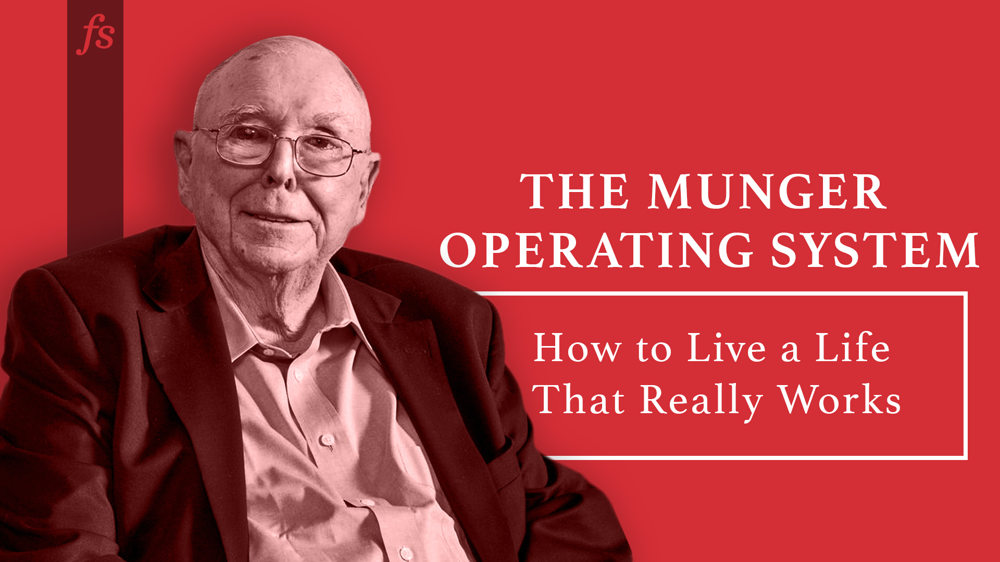

In 2007, Charlie Munger gave [the commencement address](https://www.youtube.com/watch?v=jY1eNlL6NKs) at USC Law School, opening his speech by saying, _“Well, no doubt many of you are wondering why the speaker is so old.  

2007 年，查理-芒格（Charlie Munger）在南加州大学法学院毕业典礼上致辞，他在开场白中说："毫无疑问，你们中的许多人都想知道为什么演讲者这么老。  

Well, the answer is obvious: He hasn’t died yet.”  

答案显而易见：他还没死。_

Fortunately for us, Munger has kept on ticking.  

幸运的是，芒格还在继续努力。  

The commencement speech is an excellent response to the Big Question: _How do we live a life that really works?_ It has so many of Munger’s core ideas that we think the speech represents the **Munger Operating System** for life.  

芒格在毕业典礼上的演讲是对 "大问题 "的精彩回应：我们该如何过一种真正有效的生活？它包含了许多芒格的核心理念，我们认为这篇演讲代表了芒格的人生操作系统。

\*\*\*

To get what you want, deserve what you want. Trust, success, and admiration are earned.   

要想得到你想要的，就要配得上你想要的。信任、成功和钦佩都是争取来的。

> It’s such a simple idea.  
> 
> 这个想法很简单。  
> 
> It’s the golden rule so to speak: You want to deliver to the world what you would buy if you were on the other end. There is no ethos, in my opinion, that is better for any lawyer or any other person to have. By and large the people who have this ethos win in life and they don’t win just money, not just honors. They win the respect, the deserved trust of the people they deal with, and there is huge pleasure in life to be obtained from getting deserved trust.  
> 
> 可以说是黄金法则：你想向世界提供的东西，如果你在另一端，你也会买。在我看来，没有任何一种精神更适合律师或其他人。大体上，拥有这种精神的人都能赢得人生，他们赢得的不仅仅是金钱，也不仅仅是荣誉。他们赢得了尊重，赢得了与他们打交道的人应有的信任，而获得应有的信任会给人生带来巨大的乐趣。

Learn to love and admire the right people, alive or dead.  

学会爱护和钦佩正确的人，无论他们是生是死。

> A second idea that I got very early was that there is no love that’s so right as admiration-based love, and that love should include the instructive dead. Somehow, I got that idea and I lived with it all my life; and it’s been very, very useful to me.  
> 
> 我很早就有了第二个想法，那就是，没有一种爱像以钦佩为基础的爱那样正确，爱应该包括教诲性的死亡。不知何故，我有了这个想法，并终生与之相伴；它对我非常非常有用。

Acquiring wisdom is a moral duty as well as a practical one.   

获得智慧既是一种道德责任，也是一种实践责任。

> And there’s a corollary to that proposition which is very important.  
> 
> 这个命题还有一个非常重要的推论。  
> 
> It means that you’re hooked for lifetime learning, and without lifetime learning you people are not going to do very well. You are not going to get very far in life based on what you already know. You’re going to advance in life by what you’re going to learn after you leave here…if civilization can progress only when it invents the method of invention, you can progress only when you learn the method of learning.  
> 
> 这意味着你要终身学习，而没有终身学习，你就不会做得很好。如果没有终身学习，你的人生就不会有大的发展。如果说文明只有在发明方法时才能进步，那么你只有在学会学习方法时才能进步。

Attain fluency on [the big multidisciplinary ideas](https://fs.blog/mental-models/) of the world and use them regularly.   

熟练掌握并经常使用世界多学科大思想。

> What I noted since the really big ideas carry 95% of the freight, it wasn’t at all hard for me to pick up all the big ideas from all the big disciplines and make them a standard part of my mental routines. Once you have the ideas, of course, they are no good if you don’t practice — if you don’t practice you lose it.  
> 
> 我所注意到的是，由于真正的大道理能承载 95% 的运费，因此对我来说，从各门大学科中汲取所有大道理，并将其作为我思维常规的标准组成部分，一点也不难。当然，一旦你有了这些想法，如果你不去实践，它们就不会有任何用处--如果你不去实践，你就会失去它。
> 
> So I went through life constantly practicing this model of the multidisciplinary approach.  
> 
> 因此，我在生活中不断实践这种多学科方法模式。  
> 
> Well, I can’t _tell_ you what that’s done for me.  
> 
> 我无法告诉你这给我带来了什么。  
> 
> It’s made life more fun, it’s made me more constructive, it’s made me more helpful to others, it’s made me enormously rich, you name it, that attitude really helps.  
> 
> 它让我的生活更有乐趣，让我更有建设性，让我更乐于助人，让我变得非常富有。
> 
> Now there are dangers there, because it works so well, that if you do it, you will frequently find you are sitting in the presence of some other expert, maybe even an expert that’s superior to you, supervising you.  
> 
> 现在有一些危险，因为它的效果非常好，如果你这样做，你会经常发现你正坐在其他一些专家的面前，甚至可能是一个比你更高的专家，在监督你。  
> 
> And you will know more than he does about his own specialty, a lot more.  
> 
> 而你对自己专业的了解会比他多，多得多。  
> 
> You will see the correct answer when he’s missed it.  
> 
> 当他错过了正确答案时，你会看到正确答案。
> 
> \[…\]  
> 
> \[...\]
> 
> It doesn’t help you just to know them enough just so you can give them back on an exam and get an A.  
> 
> 仅仅了解这些知识并不能让你在考试中得A。  
> 
> You have to learn these things in such a way that they’re in a mental latticework in your head and you automatically use them for the rest of your life.  
> 
> 你必须以这样一种方式来学习这些知识，使它们在你的头脑中形成一个思维格子，并在你的余生中自动使用它们。

Learn to think through problems [backwards](https://fs.blog/charlie-munger-thinking-backward-forward/) as well as forward.  

学会反向和正向思考问题。

> The way complex adaptive systems work and the way mental constructs work, problems frequently get easier and I would even say usually _are_ easier to solve if you turn around in reverse.  
> 
> 根据复杂适应系统的工作方式和心理建构的工作方式，问题经常会变得更容易解决，我甚至可以说，如果你反其道而行之，问题通常会更容易解决。
> 
> In other words if you want to help India, the question you should ask is not “how can I help India?”, you think “what’s doing the worst damage in India?  
> 
> 换句话说，如果你想帮助印度，你应该问的问题不是 "我怎样才能帮助印度？"而是 "是什么在印度造成了最严重的破坏？  
> 
> What would automatically do the worst damage and how do I avoid it?” You’d think they are logically the same thing, but they’re not.  
> 
> 什么会自动造成最严重的破坏，我该如何避免？你会认为它们在逻辑上是一回事，但其实不然。  
> 
> Those of you who have mastered algebra know that inversion frequently will solve problems which nothing else will solve. And in life, unless you’re more gifted than Einstein, inversion will help you solve problems that you can’t solve in other ways.  
> 
> 精通代数的人都知道，倒装经常能解决其他方法都解决不了的问题。而在生活中，除非你比爱因斯坦更有天赋，否则反演也能帮你解决其他方法无法解决的问题。

Be reliable. Unreliability can cancel out the other virtues.  

要可靠。不可靠会抵消其他美德。

> If you’re unreliable it doesn’t matter what your virtues are, you’re going to crater immediately. So doing what you have faithfully engaged to do should be an automatic part of your conduct.  
> 
> 如果你不可靠，不管你有什么美德，你都会立刻崩溃。因此，忠实地做你承诺要做的事，应该成为你行为的自动组成部分。  
> 
> You want to avoid sloth and unreliability.  
> 
> 你要避免懒惰和不可靠。

Avoid intense ideologies. Always [consider the other side](https://fs.blog/the-work-required-to-have-an-opinion/) as carefully as your own.  

避免激烈的意识形态。始终像对待自己的观点一样认真考虑对方的观点。

> Another thing I think should be avoided is extremely intense ideology, because it cabbages up one’s mind. You’ve seen that.  
> 
> 我认为应该避免的另一件事是极度强烈的意识形态，因为它会让人的思想 "白菜化"。你已经看到了。  
> 
> You see a lot of it on TV, you know preachers for instance, they’ve all got different ideas about theology and a lot of them have minds that are made of cabbage.  
> 
> 你在电视上看到过很多，比如传教士，他们对神学都有不同的想法，其中很多人的思想都是白菜做的。
> 
> But that can happen with political ideology.  
> 
> 但政治意识形态也会出现这种情况。  
> 
> And if you’re young it’s easy to drift into loyalties and when you announce that you’re a loyal member and you start shouting the orthodox ideology out what you’re doing is pounding it in, pounding it in, and you’re gradually ruining your mind.  
> 
> 如果你还年轻，就很容易陷入忠诚的误区，当你宣布你是一个忠诚的成员，并开始高喊正统的意识形态时，你所做的就是把它灌输进去，把它灌输进去，你就会逐渐毁掉你的思想。  
> 
> So you want to be very careful with this ideology. It’s a big danger.  
> 
> 因此，你要非常小心地对待这种意识形态。这是一个很大的危险。
> 
> In my mind I have a little example I use whenever I think about ideology, and it’s these Scandinavian canoeists who succeeded in taming all the rapids of Scandinavia and they thought they would tackle the whirlpools in the Grand Rapids here in the United States.  
> 
> 在我的脑海中，每当我想到意识形态时，我都会用一个小例子来说明，这些斯堪的纳维亚独木舟手成功地驯服了斯堪的纳维亚的所有激流，他们认为他们可以解决美国大激流中的漩涡。  
> 
> The death rate was 100%. A big whirlpool is not something you want to go into and I think the same is true about a really deep ideology.  
> 
> 结果死亡率高达 100%。大漩涡不是你想进入的，我认为真正深刻的意识形态也是如此。
> 
> I have what I call an iron prescription that helps me keep sane when I naturally drift toward preferring one ideology over another.  
> 
> 我有一个所谓的 "铁处方"，当我自然而然地倾向于一种意识形态而不是另一种意识形态时，它能帮助我保持理智。  
> 
> And that is I say “I’m not entitled to have an opinion on this subject unless I can state the arguments against my position better than the people do who are supporting it.  
> 
> 那就是我会说："除非我能比支持我的人更好地陈述反对我的立场的论据，否则我无权对这个问题发表意见。  
> 
> I think that only when I reach that stage am I qualified to speak.” Now you can say that’s too much of an iron discipline..it’s not too much of an iron discipline.  
> 
> 我认为，只有达到那个阶段，我才有资格发言。"你可以说这是铁的纪律。  
> 
> It’s not even that hard to do.  
> 
> 这并不难做到。

Get rid of self-serving bias, envy, resentment, and self-pity.   

摆脱自以为是的偏见、嫉妒、怨恨和自怜。

> Generally speaking, envy, resentment, revenge and self pity are disastrous modes of thought.  
> 
> 一般来说，嫉妒、怨恨、报复和自怜都是灾难性的思维模式。  
> 
> Self-pity gets pretty close to paranoia, and paranoia is one of the very hardest things to reverse.  
> 
> 自怨自艾近乎偏执，而偏执是最难扭转的思维模式之一。  
> 
> You do not want to drift into self-pity.  
> 
> 你不要陷入自怜。
> 
> I have a friend who carried a big stack of index cards about this thick, and when somebody would make a comment that reflected self pity, he would take out one of the cards, take the top one off the stack and hand it to the person, and the card said, “Your story has touched my heart, never have I heard of anyone with as many misfortunes as you”.  
> 
> 我有一个朋友，他随身携带着一大叠厚厚的索引卡片，每当有人发表自怜的言论时，他就会拿出其中一张卡片，把最上面的那张从卡片上取下来递给那个人，卡片上写着："你的故事打动了我的心，我从未听说过有人像你一样有这么多的不幸"。  
> 
> Well, you can say that’s waggery, but I suggest that every time you find you’re drifting into self pity, I don’t care what the cause — your child could be dying of cancer — self-pity is not going to improve the situation.  
> 
> 好吧，你可以说这是俏皮话，但我建议，每当你发现自己陷入自怜时，我不在乎是什么原因--你的孩子可能正死于癌症--自怜是不会改善现状的。  
> 
> Just give yourself one of those cards.  
> 
> 给自己一张这样的卡片吧。
> 
> It’s a ridiculous way to behave, and when you avoid it you get a great advantage over everybody else, almost everybody else, because self-pity is a standard condition and yet you can train yourself out of it.  
> 
> 这是一种可笑的行为方式，而当你避免这种行为时，你就会比其他人，几乎是所有人都更有优势，因为自怨自艾是一种标准状态，但你可以训练自己摆脱这种状态。
> 
> And of course self-serving bias, you want to get that out of yourself; thinking that what’s good for you is good for the wider civilization and rationalizing all these ridiculous conclusions based on the subconscious tendency to serve one’s self.  
> 
> 当然还有自我服务的偏见，你想让自己摆脱这种偏见；认为对自己有利的事情就是对更广泛的文明有利的事情，并根据为自己服务的潜意识倾向合理化所有这些荒谬的结论。

At the same time, allow for the self-serving bias in others who haven’t removed it.  

与此同时，也要考虑到其他没有消除偏见的人的自以为是的偏见。

> You also have to allow for the self serving bias of everybody else, because most people are not going to remove it all that successfully, the human condition being what it is.  
> 
> 你还必须考虑到其他人的自我服务偏见，因为大多数人都不会那么顺利地消除这种偏见，这就是人的本性。  
> 
> If you don’t allow for self serving bias in your conduct, again you’re a fool.  
> 
> 如果你在行为中不考虑为自己服务的偏见，那你就是个傻瓜。
> 
> I watched the brilliant Harvard Law School trained general counsel of Salomon lose his career, and what he did was when the CEO became aware that some underling had done something wrong, the general counsel said, “Gee, we don’t have any _legal_ duty to report this but I think it’s what we should do it’s our _moral_ duty.”  
> 
> 我亲眼目睹哈佛法学院培养出来的杰出的所罗门公司总法律顾问丢掉了他的职业生涯，他的做法是，当首席执行官意识到某个下属做错了事时，总法律顾问说："天哪，我们没有任何法律义务去报告这件事，但我认为这是我们应该做的，这是我们的道德义务。"
> 
> Of course, the general counsel was totally correct but of course it didn’t _work;_ it was a very unpleasant thing for the CEO to do and he put it off and put if off and of course everything eroded into a major scandal and down went the CEO and the general counsel with him.  
> 
> 当然，总法律顾问是完全正确的，但这当然行不通；对首席执行官来说，这是一件非常令人不快的事情，他一拖再拖，结果一切都演变成了一桩重大丑闻，首席执行官和总法律顾问也随之下台。
> 
> The correct answer in situations like that was given by Ben Franklin, he said, “If you want to persuade, appeal to interest not to reason.” The self serving bias is _so_ extreme. If the general counsel had said, “Look this is going to erupt, it’s something that will destroy you, take away your money, take away your status…it’s a perfect disaster,” it would have worked!  
> 
> 本-富兰克林（Ben Franklin）给出了在这种情况下的正确答案，他说："如果你想说服别人，要诉诸利益而不是理性"。自我服务的偏见是如此极端。如果总法律顾问说："听着，这件事即将爆发，它会毁了你，夺走你的钱财，夺走你的地位......这是一场完美的灾难"，那就会奏效！

Avoid being part of a system with perverse incentives.  

避免成为具有反常激励机制的系统的一部分。

> Incentives are too powerful a controller of human cognition and human behavior, and one of the things you are going to find in some modern law firms is billable hour quotas.  
> 
> 激励机制对人类认知和行为的控制力太强大了，而在一些现代律师事务所中，你会发现计费小时配额就是其中之一。  
> 
> I could not have lived under a billable hour quota of 2,400 hours a year.  
> 
> 我不可能在每年 2400 小时的计费小时配额下生活。  
> 
> That would have caused serious problems for me — I wouldn’t have done it and I don’t have a solution for you for that.  
> 
> 那会给我带来严重的问题--我不会这么做，我也没有办法解决这个问题。  
> 
> You’ll have to figure it out for yourself but it’s a significant problem.  
> 
> 你必须自己想办法解决，但这是个大问题。

Work with and under people you admire, and avoid the inverse when at all possible.  

与你钦佩的人一起工作或在他们手下工作，尽可能避免与之相反。

> And that requires some talent.  
> 
> 这需要一定的才能。  
> 
> The way I solved that is, I figured out the people I did admire and I maneuvered cleverly without criticizing anybody, so I was working entirely under people I admired.  
> 
> 我解决这个问题的方法是，我找出了我敬佩的人，并巧妙地加以利用，没有批评任何人，所以我完全是在我敬佩的人手下工作。  
> 
> And a lot of law firms will permit that if you’re shrewd enough to work it out.  
> 
> 如果你足够精明，很多律师事务所都会允许你这样做。  
> 
> And your outcome in life will be way more satisfactory and way better if you work under people you really admire.  
> 
> 如果你在自己真正钦佩的人手下工作，你的人生结果会更令人满意，也会更好。  
> 
> The alternative is not a good idea.  
> 
> 替代方案不是一个好主意。

Learn to maintain your objectivity, especially when it’s hardest.  

学会保持客观，尤其是在最困难的时候。

> Well we all remember that Darwin paid special attention to disconfirming evidence particularly when it disconfirmed something he believed and loved. Well, objectivity maintenance routines are totally required in life if you’re going to be a correct thinker.  
> 
> 我们都记得，达尔文特别关注不确定的证据，尤其是当这些证据不确定他所相信和喜爱的东西时。如果你想成为一个正确的思想家，那么在生活中完全需要保持客观性和常规性。  
> 
> And there we’re talking about Darwin’s attitude, his special attention to disconfirming evidence, and also to checklist routines. Checklist routines avoid a lot of errors.  
> 
> 在这里，我们谈论的是达尔文的态度、他对不确定证据的特别关注，以及核对表例行程序。清单式例行公事可以避免很多错误。  
> 
> You should have all this elementary wisdom and then you should go through and have a checklist in order to use it.  
> 
> 你应该掌握所有这些基本的智慧，然后你应该通过检查表来使用这些智慧。  
> 
> There is no other procedure that will work as well.  
> 
> 没有其他程序能像这样有效。

Concentrate experience and power into the hands of the right people – the wise learning machines.   

将经验和权力集中到合适的人--智慧的学习机器--手中。

> I think the game of life in many respects is getting a lot of practice into the hands of the people that have the most aptitude to learn and the most tendency to be learning machines.  
> 
> 我认为，人生的游戏在很多方面都是让那些最有学习能力、最有可能成为学习机器的人去大量实践。  
> 
> And if you want the very highest reaches of human civilization that’s where you have to go.  
> 
> 如果你想获得人类文明的最高境界，你就必须这样做。
> 
> You do not want to choose a brain surgeon for your child among fifty applicants all of them just take turns during the procedure. You don’t want your airplanes designed that way. You don’t want your Berkshire Hathaways run that way. You want to get the power into the right people.  
> 
> 你不会想在 50 个应聘者中为你的孩子选择一个脑外科医生，而所有应聘者都只是在手术过程中轮番上阵。你也不希望你的飞机是这样设计的。你不希望你的伯克希尔哈撒韦公司以这种方式运营。你希望把权力交给正确的人。

You’ll be most successful where you’re most intensely interested.  

在你最感兴趣的地方，你会取得最大的成功。

> Another thing that I found is an intense interest of the subject is indispensable if you are really going to excel.  
> 
> 我还发现，要想真正出类拔萃，对学科的浓厚兴趣是必不可少的。  
> 
> I could force myself to be fairly good in a lot of things, but I couldn’t be really good in anything where I didn’t have an intense interest.  
> 
> 我可以强迫自己在很多事情上取得相当好的成绩，但如果没有强烈的兴趣，我就不可能在任何事情上取得真正的好成绩。
> 
> So to some extent, you’re going to have to follow me. If at all feasible you want to drift into doing something in which you really have a natural interest.
> 
>   
> 
> 因此，在某种程度上，你必须跟着我走。如果可行的话，你应该去做自己天生感兴趣的事情。

Learn the all-important concept of assiduity: Sit down and do it until it’s done.  

学习 "坚持不懈 "这一重要概念：坐下来做，直到完成为止。

> Two partners that I chose for one little phase of my life had the following rule: They created a little design/build construction team, and they sat down and said, two-man partnership, divide everything equally, here’s the rule; “Whenever we’re behind in our commitments to other people, we will both work 14 hours a day until we’re caught up.”  
> 
> 在我人生的一个小阶段里，我选择的两个合伙人有如下规定：他们成立了一个小小的设计/建造施工团队，他们坐下来说：两人合伙，平分一切，规则是这样的："每当我们对其他人的承诺落后时，我们都会每天工作 14 个小时，直到我们赶上为止。"
> 
> Well, needless to say, that firm didn’t fail. The people died rich. It’s such a simple idea.  
> 
> 不用说，那家公司没有倒闭。那些人死得很富有。就是这么一个简单的想法。

Use setbacks in life as an opportunity to become a bigger and better person. Don’t wallow.  

把生活中的挫折当作成为更大更好的人的机会。不要沉湎其中。

> Another thing of course is life will have terrible blows, horrible blows, unfair blows, doesn’t matter.  
> 
> 当然，还有一点就是生活中会有可怕的打击、可怕的打击、不公平的打击，这些都不重要。  
> 
> And some people recover and others don’t. And there I think the attitude of Epictetus is the best.  
> 
> 有些人可以恢复，有些人则不能。在这方面，我认为伊壁鸠鲁的态度是最好的。  
> 
> He thought that every mischance in life was an opportunity to behave well, every mischance in life was an opportunity to learn something, and your duty was not to be submerged in self-pity but to utilize the terrible blow in a constructive fashion.  
> 
> 他认为，生活中的每一次不幸都是表现良好的机会，生活中的每一次不幸都是学习的机会，你的责任不是沉浸在自怨自艾中，而是以建设性的方式利用可怕的打击。  
> 
> That is a very good idea.  
> 
> 这是一个非常好的主意。

The highest reach of civilization is a seamless system of trust among all parties concerned.   

文明的最高境界是在有关各方之间建立无缝的信任体系。

> The last idea that I want to give you as you go out into a profession that frequently puts a lot of procedure and a lot of precautions and a lot of mumbo jumbo into what it does, this is not the highest form which civilization can reach.  
> 
> 我想告诉你的最后一个想法是，当你进入一个经常把很多程序、很多预防措施和很多胡言乱语放在工作中的行业时，这并不是文明所能达到的最高境界。  
> 
> The highest form which civilization can reach is a seamless web of deserved trust.  
> 
> 文明所能达到的最高境界是一个无缝的、值得信赖的网络。  
> 
> Not much procedure, just totally reliable people correctly trusting one another.  
> 
> 没有太多的程序，只有完全可靠的人们正确地相互信任。  
> 
> That’s the way an operating room works at the Mayo Clinic.  
> 
> 这就是梅奥诊所手术室的工作方式。
> 
> If a bunch of lawyers were to introduce a lot of process, the patients would all die.  
> 
> 如果一群律师引入大量程序，病人就会全部死亡。  
> 
> So never forget when you’re a lawyer that you may be rewarded for selling this stuff but you don’t have to buy it.  
> 
> 所以，当你是一名律师的时候，千万不要忘记，你可能会因为推销这些东西而得到回报，但你并不一定要买它。  
> 
> In your own life what you want is a seamless web of deserved trust.  
> 
> 在你自己的生活中，你想要的是一张无缝的信任之网。  
> 
> And if your proposed marriage contract has 47 pages, my suggestion is do not enter.  
> 
> 如果你提议的婚姻合同有 47 页，我的建议是不要签订。

_**Read this next:** Inspired by Munger, we’ve put together [the best collection of mental models on the internet](https://fs.blog/mental-models/).   

阅读下一篇：在芒格的启发下，我们收集了互联网上最好的心智模式。_
