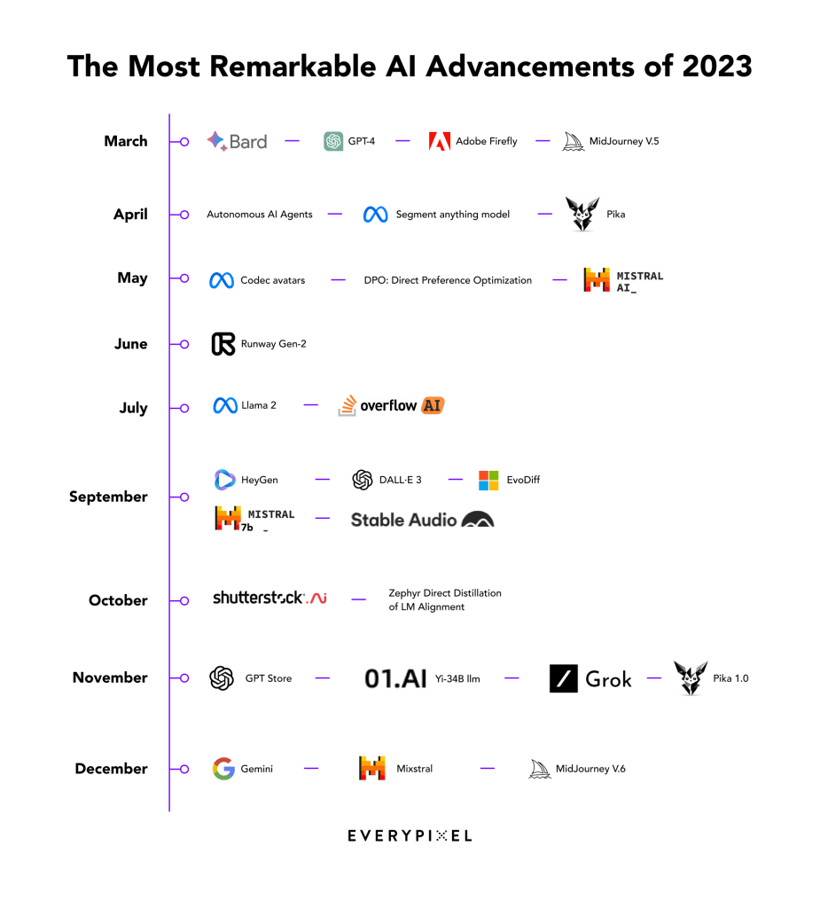
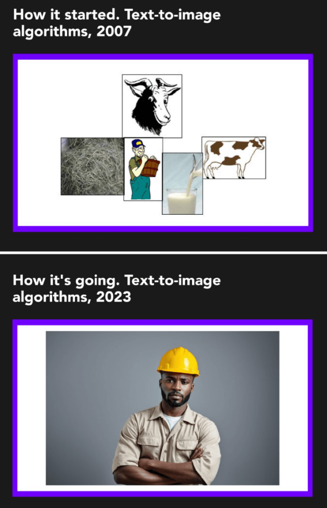

AI has undoubtedly made waves in 2023 and here we spotlight the most significant stories of the year poised to shape the future of this groundbreaking industry:  

人工智能无疑在 2023 年掀起了波澜，在此，我们将重点介绍本年度最重要的故事，它们将塑造这一开创性行业的未来：

_Correction: In the original blog post published on December 22, 2023, the title “AI Releases” caused confusion as the content encompassed announcements and updates in addition to releases.  

更正：在 2023 年 12 月 22 日发布的原始博文中，标题 "人工智能发布 "引起了混淆，因为除了发布之外，内容还包括公告和更新。  

We clarified the title of the text and infographic.  

我们明确了文本和信息图表的标题。  

The mention of Stability AI open-sourcing its LLM was excluded from the infographic but left in the article, underscoring its significance in promoting accessibility rather than focusing on tech improvement.  

信息图表中没有提及 Stability AI 将其 LLM 开放源码，但文章中却保留了这一内容，强调了其在促进无障碍环境方面的重要意义，而不是专注于技术改进。  

The infographic initially featured the establishment of the xAI startup, now removed because of irrelevance.  

信息图表最初以 xAI 初创公司的成立为特色，现在由于无关紧要而被删除。  

Additionally, the mention of Apple Vision Pro was excluded as the article focuses on software.  

此外，由于文章的重点是软件，因此没有提及 Apple Vision Pro。  

We also included Midjourney V.6 in the list as it is a very recent release.  

我们还将 Midjourney V.6 列入列表，因为它是最近发布的版本。_ _These adjustments aim to improve accuracy and coherence.  

这些调整旨在提高准确性和一致性。  

We apologize for any confusion and appreciate your understanding!  

我们对任何混淆表示歉意，并感谢您的理解！_

#### **AI Advancements  

人工智能的进步**

In the landscape of AI advancements this year, notable progress was made, refining existing technologies rather than introducing groundbreaking innovations akin to the [ChatGPT or image generators of the previous year](https://journal.everypixel.com/ai-highlights-2022).  

在今年的人工智能发展中，我们取得了显著的进步，完善了现有技术，而不是像前一年的 ChatGPT 或图像生成器那样推出突破性的创新。  

While there was no wow effect and the real Artificial General Intelligence (AGI) is still far away, this year marked an intermediate stage between prior breakthroughs and something even more powerful to come.  

虽然没有令人惊叹的效果，真正的人工通用智能（AGI）也还很遥远，但今年标志着之前的突破与未来更强大的技术之间的中间阶段。  

To showcase this evolution, we crafted a visual timeline, highlighting the most remarkable AI advancements that have shaped this year of AI:  

为了展示这一演变，我们制作了一个可视化时间轴，突出显示了塑造人工智能年的最显著的人工智能进步：

**Image Generation  

图像生成**

-   **Adobe Firefly:** [Adobe’s Firefly](https://journal.everypixel.com/top-ai-news-march-2023) and [Generative Fill](https://www.adobe.com/products/photoshop/generative-fill.html) empowered diverse visual content creation, including illustrations, art concepts, and photo manipulation. [Integrated into Photoshop](https://journal.everypixel.com/top-ai-news-may-2023), Adobe Firefly democratized AI, extending its power to a broad user base at once.  
    
    Adobe 萤火虫Adobe 的 Firefly 和 Generative Fill 增强了各种视觉内容创作的能力，包括插图、艺术概念和照片处理。与 Photoshop 集成后，Adobe Firefly 实现了人工智能的民主化，将其威力一次性扩展到广大用户群。  
    
    The release of the [Text Effect feature](https://www.adobe.com/products/firefly/features/text-effects.html) also marked a significant stride, allowing users to apply styles or textures to words and phrases.  
    
    文本效果功能的发布也标志着一大进步，用户可以在单词和短语上应用样式或纹理。
-   **Midjourney:** [Midjourney’s V.5 model](https://journal.everypixel.com/top-ai-news-march-2023 "Midjourney's V.5 model") marked a milestone in image generation, showcasing improved efficiency, coherence, and higher resolution.  
    
    MidjourneyMidjourney V.5 型号是图像生成技术的一个里程碑，它提高了效率、一致性和分辨率。  
    
    The latest alpha-version, [Midjourney V.6](https://mid-journey.ai/midjourney-v6-release/ "Midjourney V.6"), brought additional enhancements such as more accurate prompt following, increased model knowledge, and minor text drawing ability.  
    
    最新的 alpha 版本（Midjourney V.6）带来了更多增强功能，如更准确的提示跟踪、更多的模型知识和更小的文本绘制能力。
-   **DALL·E 3:** Built on ChatGPT, [DALL·E 3](https://journal.everypixel.com/top-ai-news-september-2023) simplified image generation, eliminating the need for complex prompt engineering.  
    
    DALL-E 3：基于 ChatGPT，DALL-E 3 简化了图像生成，无需复杂的提示工程。  
    
    In addition, ChatGPT introduced a feature to help users refine prompts and make image adjustments based on feedback.  
    
    此外，ChatGPT 还推出了一项功能，帮助用户根据反馈意见完善提示和调整图像。
-   **Shutterstock.AI:** The stock image giant [integrated AI capabilities](https://journal.everypixel.com/top-ai-news-january-2023), allowing users to transform prompts into license-ready imagery.  
    
    Shutterstock.AI：这家图片库巨头整合了人工智能功能，允许用户将提示转化为可授权的图片。  
    
    Recognizing and rewarding contributing artists, Shutterstock made the first step in ethical AI.  
    
    通过表彰和奖励有贡献的艺术家，Shutterstock 在人工智能伦理方面迈出了第一步。

The Evolution of Text-to-Image Algorithms, 2007 vs 2023  

文本到图像算法的演变，2007 年与 2023 年对比

**Video Generation  

视频生成**

-   **Stability AI:** Stability AI [introduced Stable Video Diffusion](https://journal.everypixel.com/top-ai-news-november-2023), a groundbreaking model for generative video, with open-source access on GitHub.  
    
    Stability AI：Stability AI 推出了用于生成视频的开创性模型 Stable Video Diffusion，可在 GitHub 上开源访问。  
    
    Drawing a parallel to [AI image generation trends](https://journal.everypixel.com/ai-image-statistics), it’s highly possible that the Stable Video Diffusion model will play a pivotal role in the creation of a significant portion of AI-generated videos.  
    
    与人工智能图像生成趋势相似，稳定视频扩散模型极有可能在相当一部分人工智能生成的视频创作中发挥关键作用。
-   **HeyGen:** AI startup unveiled [a tool for voice cloning](https://the-decoder.com/heygen-offers-ai-powered-video-translation-with-impressive-lip-syncing-capabilities/), lip movement adjustments, and language translation in videos.  
    
    HeyGen：人工智能初创公司发布了一款用于克隆语音、调整唇部动作和视频语言翻译的工具。
-   **Runway Gen-2**: [Runway launched the Gen-2](https://research.runwayml.com/gen2) model, enabling users to effortlessly generate full-blown videos from just text prompts, images, or other videos.  
    
    Runway Gen-2：Runway 推出 Gen-2 模型，使用户可以毫不费力地从文本提示、图像或其他视频中生成完整的视频。  
    
    Just have a look at the example below.   
    
    请看下面的例子。
-   **Pika and Pika 1.0**: With its initial release, Pika garnered half a million users, generating millions of videos weekly.  
    
    Pika 和 Pika 1.0：Pika 发布之初就获得了 50 万用户，每周产生数百万个视频。  
    
    Then upgraded AI model in [Pika 1.0](https://pika.art/launch) empowered users to create and edit videos in various styles, including 3D animation, anime, cartoon, and cinematic.  
    
    随后，Pika 1.0 升级了人工智能模型，使用户能够创建和编辑各种风格的视频，包括三维动画、动漫、卡通和电影。
-   **Codec avatars by Meta:** [Meta’s Pixel Codec Avatars](https://youtu.be/MVYrJJNdrEg?si=NR3DJMeYOfbiAunX) (PiCA) model for 3D human faces in videos brought us closer to photorealistic telepresence.  
    
    Meta 的编解码头像：Meta 的 Pixel Codec Avatars（PiCA）模型用于视频中的三维人脸，使我们更接近逼真的远程呈现。

**Text Generation  

文本生成**

-   **Bard and Gemini:** [Google’s Bard](https://journal.everypixel.com/top-ai-news-march-2023) added human-like emotion and sentiment to the chatbot landscape.  
    
    巴德（Bard）和双子座（Gemini）：谷歌的巴德为聊天机器人增添了类似人类的情感和情绪。  
    
    Introduced into Bard chatbot and trained on a multimodal dataset, [Google’s Gemini](https://blog.google/technology/ai/google-gemini-ai/) emerged as the “most capable” AI model and the closest competitor to OpenAI’s ChatGPT.  
    
    谷歌的 Gemini 被引入 Bard 聊天机器人并在多模态数据集上进行训练，成为 "能力最强 "的人工智能模型，也是 OpenAI 的 ChatGPT 最接近的竞争对手。
-   **Grok:** [Elon Musk’s startup xAI](https://journal.everypixel.com/top-ai-news-april-2023) signaled a commitment to AI development, potentially competing with OpenAI, by [unveiling “Grok”](https://journal.everypixel.com/top-ai-news-november-2023) — a chatbot with humor, rebelliousness, and real-time knowledge via the 𝕏 platform.  
    
    Grok：埃隆-马斯克（Elon Musk）的初创公司xAI发布了一款名为 "Grok "的聊天机器人，它幽默、叛逆，并能通过𝕏平台实时获取知识，这表明该公司致力于开发人工智能，有可能与OpenAI展开竞争。  
    
    The xAI promised that Grok [was designed to answer provocative questions](https://x.ai/ "was designed to answer provocative questions") rejected by other AI systems.  
    
    xAI 承诺，Grok 旨在回答其他人工智能系统拒绝回答的挑衅性问题。
-   **OverflowAI:** [Stack Overflow’s OverflowAI](https://journal.everypixel.com/top-ai-news-july-2023) enhanced knowledge curation, enabling AI-powered search for relevant answers in Visual Studio Code and Slack.  
    
    OverflowAI：Stack Overflow 的 OverflowAI 增强了知识整理功能，可在 Visual Studio Code 和 Slack 中用人工智能搜索相关答案。
-   **Llama 2:** [Meta released Llama 2](https://journal.everypixel.com/top-ai-news-july-2023), the next generation of its open-source large language model, showcasing enhanced efficiency.  
    
    Llama 2：Meta 发布了下一代开源大型语言模型 Llama 2，展示了更高的效率。  
    
    Meta’s fine-tuned LLM was also optimized for dialogue use cases and outperformed other open-source models on most benchmarks.  
    
    Meta 的微调 LLM 还针对对话用例进行了优化，在大多数基准测试中都优于其他开源模型。
-   **GPT-4:** [OpenAI’s GPT-4](https://journal.everypixel.com/top-ai-news-march-2023) now handles image input, generates captions, classifications, hears, and responds in a back-and-forth conversation, and supports [real-time web browsing](https://journal.everypixel.com/top-ai-news-september-2023).  
    
    GPT-4：OpenAI 的 GPT-4 现在可以处理图像输入，生成标题、分类，在来来回回的对话中进行聆听和回应，并支持实时网页浏览。  
    
    OpenAI also extended support for plugins, fostering a landscape enriched with open-source competitors.  
    
    OpenAI 还扩展了对插件的支持，促进了开源竞争者的丰富发展。  
    
    GPT-4 is the next step in OpenAI’s journey to develop AGI.  
    
    GPT-4 是 OpenAI 开发 AGI 的下一步。
-   **Mistral 7B:** [Mistral AI](https://mistral.ai/), [valued at around $2 billion](https://www.nytimes.com/2023/12/10/technology/mistral-ai-funding.html) this year, released Mistral 7B, a large language model challenging GPT-4 and Claude 2. Emphasizing an open technology approach, Mistral AI offered its model for free download.  
    
    Mistral 7B：今年估值约 20 亿美元的 Mistral AI 发布了 Mistral 7B，这是一个挑战 GPT-4 和 Claude 2 的大型语言模型。Mistral AI 强调开放技术，提供免费下载。
-   **Mixtral 8x7B:** [Mistral AI also introduced Mixtral 8x7B](https://mistral.ai/news/mixtral-of-experts/), a high-quality sparse mixture of expert model (SMoE) with open weights, featuring 46.7B total parameters, pioneering openness in models with enhanced truthfulness and reduced biases.  
    
    Mixtral 8x7B：Mistral AI 还推出了具有开放权重的高质量稀疏专家混合模型（SMoE）Mixtral 8x7B，总参数达 46.7B，开创了模型开放性的先河，增强了真实性并减少了偏差。
-   **Yi-34B llm:** [Valued at $1 billion](https://techcrunch.com/2023/11/05/valued-at-1b-kai-fu-lees-llm-startup-unveils-open-source-model/) this year, Kai-Fu Lee’s startup [01.AI](http://01.ai/) released Yi-34B — an open-source neural network that outperformed competing models with significantly higher parameter counts, emphasizing its cost-efficiency.  
    
    Yi-34B llm：李开复的初创公司 01.AI 发布了开源神经网络 Yi-34B，该网络今年的估值达到 10 亿美元。

**Other Advancements:  

其他进展：**

-   **Segment Anything Model (SAM):** [Meta AI presented SAM](https://segment-anything.com/), a segmentation model capable of “cutting out” objects in images without additional training, underscoring its adaptability.  
    
    任意分割模型（SAM）：Meta AI 推出的 SAM 是一种分割模型，能够 "切出 "图像中的物体，而无需额外的训练，这突显了它的适应性。  
    
    SAM was trained on a vast dataset, showcasing its robust performance in object segmentation.  
    
    SAM 在大量数据集上进行了训练，展示了其在物体分割方面的强大性能。
-   **Direct Preference Optimization (DPO):** [DPO emerged](https://arxiv.org/abs/2305.18290) as a stable and efficient method for fine-tuning large-scale unsupervised language models and teaching text-to-image models.  
    
    直接偏好优化（DPO）：DPO 是一种稳定、高效的方法，可用于微调大规模无监督语言模型和教学文本到图像模型。  
    
    It achieved precise control without complex reinforcement learning from human feedback (RLHF).  
    
    它无需复杂的人类反馈强化学习（RLHF）就能实现精确控制。
-   **Zephyr Direct Distillation of LM Alignment:** [Zephyr-7B](https://arxiv.org/abs/2310.16944), a result of distilled direct preference optimization (dDPO), set the benchmark for chat models with 7B parameters, enhancing intent alignment without extensive training.  
    
    Zephyr 直接提炼 LM 对齐：Zephyr-7B 是蒸馏直接偏好优化（dDPO）的结果，为带有 7B 参数的聊天模型设定了基准，无需大量训练即可增强意图对齐。
-   **Autonomous AI Agents:** [Autonomous AI agents emerged](https://journal.everypixel.com/top-ai-news-april-2023) as a notable trend, showcasing a transformative shift toward advanced and autonomous AI systems. AI Agents are considered a first glimpse of AGI as they can generate self-directed tasks and instructions based on a user’s goal, and work on them autonomously until the goal is achieved.  
    
    自主人工智能代理：自主人工智能代理的出现是一个显著的趋势，展示了向先进的自主人工智能系统的转变。人工智能代理被认为是 AGI 的雏形，因为它们可以根据用户的目标生成自主任务和指令，并自主完成这些任务和指令，直至目标实现。
-   **EvoDiff:** [Microsoft’s EvoDiff](https://journal.everypixel.com/top-ai-news-september-2023), an open-source AI framework for fast and cost-saving protein generation, promised advancements in therapeutics and industrial applications.  
    
    EvoDiff：微软的 EvoDiff 是一个开源的人工智能框架，用于快速、节约成本地生成蛋白质，有望在治疗和工业应用方面取得进展。
-   **Stable Audio:** [Stability AI launched](https://journal.everypixel.com/top-ai-news-september-2023) a tool for generating short high-quality audio clips from simple text prompts.  
    
    稳定音频Stability AI 推出了一款工具，用于根据简单的文字提示生成高质量的短音频片段。
-   **GPT Store, Copyright Shield, ChatGPT Bot Constructor:** [OpenAI introduced](https://journal.everypixel.com/top-ai-news-november-2023) the GPT Store to sell custom GPT bots, Copyright Shield to cover legal costs related to copyright infringement claims, and a no-code platform for custom ChatGPT versions.  
    
    GPT 商店、版权保护、ChatGPT 机器人构造器：OpenAI 推出了用于销售定制 GPT 机器人的 GPT Store、用于支付版权侵权索赔相关法律费用的 Copyright Shield 以及用于定制 ChatGPT 版本的无代码平台。
-   **Stability AI Open-Sourced its LLM:** [Stability AI has open-sourced its models](https://journal.everypixel.com/top-ai-news-april-2023), StableLM-Alpha and Stable Vicuna, renowned for their impressive performance in generating text and code.  
    
    稳定人工智能开源了其 LLM：稳定人工智能开源了其模型 StableLM-Alpha 和 Stable Vicuna，这两个模型在生成文本和代码方面表现出色。  
    
    Stable Vicuna is the first open-source chatbot trained using reinforcement learning from human feedback (RLHF).  
    
    稳定的 Vicuna 是第一个使用人类反馈强化学习（RLHF）训练的开源聊天机器人。  
    
    Furthermore, Stability AI [unveiled SDXL Turbo](https://journal.everypixel.com/top-ai-news-november-2023), a real-time text-to-image generation model.  
    
    此外，Stability AI 还推出了实时文本到图像生成模型 SDXL Turbo。

#### **Partnerships  

合作伙伴**

In the dynamic realm of 2023, significant collaborations have surfaced among industry leaders, shaping the trajectory of the future.  

在充满活力的 2023 年，行业领导者之间的重要合作浮出水面，塑造了未来的发展轨迹。  

Here are the top merges and partnerships that were defining the AI landscape in this year 2023:  

以下是决定 2023 年人工智能格局的顶级合并与合作：

**Stability AI and Init ML  

稳定人工智能和初始 ML**

Stability AI has made a significant move by [acquiring Init ML](https://journal.everypixel.com/top-ai-news-march-2023), the brains behind the popular editing app ClipDrop. The objective was clear: [integrate Stability AI’s advanced technologies](https://stability.ai/news/stability-ai-acquires-init-ml-makers-of-clipdrop-application "integrate Stability AI's advanced technologies") into ClipDrop’s ecosystem. The collaboration has already resulted in the [development of SDXL Turbo](https://journal.everypixel.com/top-ai-news-november-2023 "development of SDXL Turbo").  

稳定人工智能公司（Stability AI）收购了热门编辑应用程序 ClipDrop 的幕后推手 Init ML，这是一项重大举措。目标很明确：将 Stability AI 的先进技术整合到 ClipDrop 的生态系统中。双方的合作已经促成了 SDXL Turbo 的开发。

**Runway and Getty** **Images**  

Runway 和 Getty Images

[Runway has joined forces with Getty Images](https://runwayml.com/blog/runway-partners-with-getty-images/) in a strategic partnership to introduce a new video generation model RGM (The Runway and Getty Images Model).  

Runway 与 Getty Images 建立战略合作伙伴关系，推出全新视频生成模型 RGM（The Runway and Getty Images Model）。  

The model combines Runway’s AI capabilities with Getty Images’ licensed creative content library.  

该模型将 Runway 的人工智能功能与 Getty Images 的授权创意内容库相结合。  

The collaboration aims to revolutionize content creation workflows, enabling companies to generate high-quality, customized videos tailored to their brand identities.  

双方的合作旨在彻底改变内容创作工作流程，使企业能够生成符合其品牌形象的高质量定制视频。

**Snowflake and Neeva  

雪花和妮娃**

Snowflake, a major player in the data warehouse platform, [has acquired Neeva](https://www.snowflake.com/blog/snowflake-acquires-neeva-to-accelerate-search-in-the-data-cloud-through-generative-ai/), a startup known for using generative AI to enhance the search experience.  

数据仓库平台领域的主要企业 Snowflake 收购了 Neeva，后者是一家以使用生成式人工智能提升搜索体验而闻名的初创企业。  

Neeva had recently closed its subscription-based, ad-free search engine.  

Neeva 最近关闭了其基于订阅的无广告搜索引擎。  

The founders of Neeva also acknowledged the challenge of convincing users to try a new search engine.  

Neeva 的创始人也承认，说服用户尝试新的搜索引擎是一项挑战。

**Shutterstock and OpenAI  

Shutterstock 和 OpenAI**

[Shutterstock and OpenAI have committed](https://investor.shutterstock.com/news-releases/news-release-details/shutterstock-expands-partnership-openai-signs-new-six-year) to an extended 6-year partnership.  

Shutterstock和OpenAI已承诺延长6年的合作伙伴关系。  

OpenAI gained access to high-quality data from Shutterstock, enriching its model training datasets with a diverse range of images, videos, and music libraries.  

OpenAI 获得了来自 Shutterstock 的高质量数据，利用各种图片、视频和音乐库丰富了其模型训练数据集。  

Shutterstock continued to leverage OpenAI’s technologies, leading to the launch of Shutterstock’s AI image-generating tool.  

Shutterstock 继续利用 OpenAI 的技术，推出了 Shutterstock 的人工智能图像生成工具。

#### **Legal Landscape  

法律环境**

In the ever-evolving legal realm of AI, 2023 finds itself amidst a landscape filled with uncertainties and ongoing debates.  

在不断发展的人工智能法律领域，2023 发现自己处于一个充满不确定性和持续争论的环境中。  

As new challenges emerge, discussions surrounding copyright, corporate policies, and the broader regulatory framework continue, shaping the contours of AI’s legal landscape.  

随着新挑战的出现，围绕版权、企业政策和更广泛的监管框架的讨论仍在继续，塑造着人工智能法律领域的轮廓。  

Here are the most important legal issues of the year 2023:  

以下是 2023 年最重要的法律问题：

**European AI Act  

欧洲人工智能法**

The [European Union introduced the AI Act](https://www.europarl.europa.eu/news/en/headlines/society/20230601STO93804/eu-ai-act-first-regulation-on-artificial-intelligence), the world’s first comprehensive law, to regulate the use of AI.  

欧盟出台了《人工智能法》，这是世界上第一部规范人工智能使用的综合性法律。  

The act classifies AI systems based on the risk they pose and sets forth regulations accordingly.  

该法案根据人工智能系统带来的风险对其进行分类，并制定相应的法规。  

Although the AI Act has been provisionally agreed upon, its implementation faces delays, and the enforcement won’t commence until 2025.  

虽然《人工智能法》已暂时达成一致，但其实施面临拖延，要到 2025 年才能开始执行。

**U.S. Copyright Office Stance on Registration of AI-Generated Content  

美国版权局对人工智能生成内容注册的立场**

The U.S. Copyright Office took a decisive stance, [denying copyright](https://journal.everypixel.com/top-ai-news-february-2023) registration for images created by the AI algorithm Midjourney.  

美国版权局采取果断立场，拒绝为人工智能算法 Midjourney 创造的图像进行版权登记。  

The rejection set a precedent, asserting that AI artworks solely created by AI, without human involvement, are ineligible for copyright protection.  

这一拒绝开创了一个先例，即人工智能艺术作品在没有人类参与的情况下，仅由人工智能创作，不符合版权保护的条件。  

In the same vein, the [U.S. Copyright Office issued guidance](https://journal.everypixel.com/top-ai-news-march-2023) on AI-assisted works, clarifying that works created by humans using AI tools may be eligible for copyright protection.  

同样，美国版权局发布了关于人工智能辅助作品的指南，明确指出人类使用人工智能工具创作的作品可以获得版权保护。  

The guidance confirmed that works created by humans using AI tools should be evaluated based on whether the human role in the creation of those works was determinative.  

该指南确认，人类使用人工智能工具创作的作品应根据人类在这些作品创作中的作用是否具有决定性进行评估。

> _“Currently, the existing legal system is not prepared to acknowledge copyright for works created with AI, given that AI learns from existing data, the rights to which belong to other people, challenging the attribution of ownership.  
> 
> "目前，现有的法律体系并不准备承认人工智能作品的版权，因为人工智能是从现有数据中学习的，而这些数据的权利属于其他人，这就对所有权的归属提出了挑战。  
> 
> The practice for addressing this issue is expected to develop next year, facilitated by public participation through [state-conducted surveys](https://www.copyright.gov/policy/artificial-intelligence/ "state-conducted surveys"). Resolving this matter independently is now difficult without broader public engagement.”  
> 
> 解决这一问题的做法预计将在明年形成，并通过国家开展的调查促进公众参与。如果没有更广泛的公众参与，现在很难独立解决这一问题"。_
> 
> Daria Kuznetsova, Corporate Lawyer of Everypixel  
> 
> Daria Kuznetsova，Everypixel 公司律师

[McKinsey](https://www.mckinsey.com/featured-insights/2023-year-in-review/2023-the-year-in-charts) also released a comprehensive graph capturing the most important AI governance-related policy and regulatory efforts in 2023. The visual representation highlights the significant contributions of 2023 in shaping the legal landscape of AI.  

麦肯锡还发布了一张全面的图表，记录了 2023 年与人工智能治理相关的最重要的政策和监管工作。直观的表现形式突显了 2023 年在塑造人工智能法律格局方面的重大贡献。

Source: [McKinsey](https://www.mckinsey.com/featured-insights/2023-year-in-review/2023-the-year-in-charts)  

来源：麦肯锡资料来源：麦肯锡

#### **Debates  

辩论**

The year 2023 was abuzz with intriguing debates and discussions, grappling with uncertainties and the evolving norms of the AI landscape.  

2023 年充斥着引人入胜的辩论和讨论，人们努力应对人工智能领域的不确定性和不断演变的规范。  

As the industry shapes its course, these debates become inevitable, promising more thought-provoking dialogues and challenges on the horizon.  

随着行业的发展，这些争论已不可避免，并有望在未来出现更多发人深省的对话和挑战。

Here are some of the most noteworthy debates that defined the year:

  

以下是本年度最值得关注的几场辩论：

**Corporate Restrictions on ChatGPT  

企业对 ChatGPT 的限制**

Major financial institutions, including JP Morgan, Citigroup, Bank of America, Deutsche Bank, Goldman Sachs, and Wells Fargo & Co, [have restricted ChatGPT usage](https://journal.everypixel.com/top-ai-news-february-2023) due to security and privacy concerns.  

摩根大通、花旗集团、美国银行、德意志银行、高盛和富国银行等大型金融机构出于安全和隐私方面的考虑，限制了 ChatGPT 的使用。  

This reflected a broader trend where companies were issuing warnings to employees about the legal considerations associated with AI applications in corporate environments.  

这反映了一种更广泛的趋势，即公司正在就企业环境中人工智能应用的相关法律问题向员工发出警告。

**OpenAI’s Use of Low-Paid Workers  

OpenAI 使用低薪工人**

Time’s investigation exposed OpenAI’s collaboration with Sama, [employing low-paid workers in Kenya](https://journal.everypixel.com/top-ai-news-january-2023) to sift through sensitive content for ChatGPT.  

时代》周刊的调查揭露了 OpenAI 与 Sama 的合作，后者在肯尼亚雇佣低薪工人为 ChatGPT 筛选敏感内容。  

The revelation raised ethical questions about the treatment of workers and the impact of content moderation on mental well-being.  

这一事件引发了有关工人待遇和内容审核对心理健康影响的道德问题。

**Leadership Transition at OpenAI  

OpenAI 领导层的过渡**

[Sam Altman’s departure](https://journal.everypixel.com/top-ai-news-november-2023) and quick return made headlines last month.  

Sam Altman 的离职和迅速回归成为上个月的头条新闻。  

A leadership transition unfolded at OpenAI as Sam Altman stepped down amid communication inconsistencies with the board.  

山姆-奥特曼（Sam Altman）因与董事会沟通不畅而下台，OpenAI 的领导层随之发生交接。  

Interim CEO Mira Murati, along with a majority of staff, advocated for Altman’s return.  

临时首席执行官米拉-穆拉提（Mira Murati）和大多数员工都主张阿尔特曼回归。  

This unprecedented situation attracted widespread attention, leaving questions about the true reasons behind the transition and future implications.  

这一史无前例的情况引起了广泛关注，人们对过渡背后的真实原因和未来影响产生了疑问。

**Adobe and Figma  

Adobe 和 Figma**

[Adobe’s $20 billion acquisition plan for Figma](https://news.adobe.com/news/news-details/2022/Adobe-to-Acquire-Figma/default.aspx) encountered regulatory hurdles, prompting investigations by the European Commission and the UK Competition and Markets Authority over potential antitrust issues.  

Adobe 斥资 200 亿美元收购 Figma 的计划遇到了监管障碍，促使欧盟委员会和英国竞争与市场管理局就潜在的反垄断问题展开调查。  

The proposed deal’s impact also extended beyond design considerations, as Adobe’s dominance in customer data platforms raised concerns among Chief Information Officers (CIOs) about its potential influence on cloud software spending.  

拟议交易的影响还超出了设计方面的考虑，因为 Adobe 在客户数据平台方面的主导地位引发了首席信息官 (CIO) 对其对云软件支出的潜在影响的担忧。  

However, [Adobe abandoned the deal](https://news.adobe.com/news/news-details/2023/Adobe-and-Figma-Mutually-Agree-to-Terminate-Merger-Agreement/default.aspx) due to challenges in securing antitrust approvals in Europe and the UK, resulting in a termination fee of $1 billion to Figma.  

然而，由于在欧洲和英国获得反垄断审批方面的挑战，Adobe 放弃了这项交易，并因此向 Figma 支付了 10 亿美元的终止费。

**Photographer Hacked the World Photography Awards  

摄影师破解世界摄影大赛**

Photographer Boris Eldagsen [disrupted the Sony World Photography Awards](https://journal.everypixel.com/top-ai-news-april-2023) by submitting AI-generated artwork.  

摄影师鲍里斯-埃尔达格森（Boris Eldagsen）提交了人工智能生成的作品，从而扰乱了索尼世界摄影大赛。  

Eldagsen’s refusal to accept the prize sparked a debate on the place of AI-generated images in traditional photography competitions, challenging perceptions of authenticity and creativity.  

Eldagsen 拒绝领奖，引发了一场关于人工智能生成的图像在传统摄影比赛中的地位的辩论，挑战了人们对真实性和创造性的看法。
