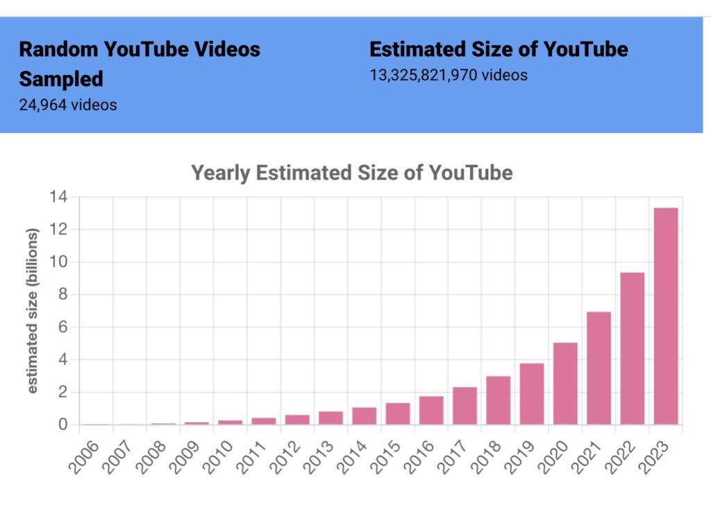

I got interested in this question a few years ago, when I started writing about the [“denominator problem”](https://theconversation.com/facebook-has-a-misinformation-problem-and-is-blocking-access-to-data-about-how-much-there-is-and-who-is-affected-164838).  

几年前，当我开始撰写关于 "分母问题 "的文章时，我就对这个问题产生了兴趣。  

A great deal of social media research focuses on finding unwanted behavior – mis/disinformation, hate speech – on platforms. This isn’t that hard to do: search for “white genocide” or “ivermectin” and count the results.  

大量社交媒体研究的重点是发现平台上的不良行为--错误/虚假信息、仇恨言论。要做到这一点并不难：搜索 "白人种族灭绝 "或 "伊维菌素"，然后统计结果。  

Indeed, a lot of eye-catching research does just this – consider [Avaaz’s August 2020 report about COVID misinformation](https://secure.avaaz.org/campaign/en/facebook_threat_health/). It reports 3.8 billion views of COVID misinfo in a year, which is a very big number.  

事实上，许多引人注目的研究就是这样做的--请看 Avaaz 于 2020 年 8 月发布的关于 COVID 错误信息的报告。报告称，一年内COVID误导信息的浏览量达到38亿次，这是一个非常大的数字。  

But it’s a numerator without a denominator – Facebook generates dozens or hundreds of views a day for each of its 3 billion users – 3.8 billion views is actually a very small number, contextualized with a denominator.  

但这是一个没有分母的分子--Facebook 的 30 亿用户中，每人每天都会产生几十或几百次浏览量--如果加上分母，38 亿次浏览量实际上是一个很小的数字。

A few social media platforms have made it possible to calculate denominators.  

有几个社交媒体平台可以计算分母。  

Reddit, for many years, permitted Pushshift to collect all Reddit posts, which means we can calculate what a small fraction of Reddit is focused on meme stocks or crypto, versus conversations about mental health or board gaming. Our [Redditmap.social platform](https://redditmap.social/) – primarily built by Virginia Partridge and Jasmine Mangat – is based around the idea of looking at the platform as a whole and understanding how big or small each community is compared to the whole.  

多年来，Reddit 允许 Pushshift 收集 Reddit 上的所有帖子，这意味着我们可以计算出 Reddit 上有多小部分的帖子是关于 meme 股票或加密货币的，而不是关于心理健康或棋盘游戏的。我们的Redditmap.social平台主要由弗吉尼亚-帕特里奇（Virginia Partridge）和茉莉-曼加特（Jasmine Mangat）建立，其基础是将平台作为一个整体来看待，了解每个社区与整体相比有多大或多小。  

Alas, Reddit cut off public access to Pushshift this summer, so Redditmap.social can only use data generated early this year.  

遗憾的是，Reddit 今年夏天切断了公众对 Pushshift 的访问，因此 Redditmap.social 只能使用今年年初生成的数据。

Twitter was also a good platform for studying denominators, because it created a research API that took a statistical sample of all tweets and gave researchers access to every 10th or 100th one.  

Twitter 也是一个研究分母的好平台，因为它创建了一个研究 API，对所有推文进行统计抽样，让研究人员可以访问每 10 条或 100 条推文。  

If you found 2500 tweets about ivermectin a day, and saw 100m tweets through the decahose (which gave researchers 1/10th of tweet volume), you could calculate an accurate denominator (100m x 10) (All these numbers are completely made up.) Twitter has cut off access to these excellent academic APIs and now charges massive amounts of money for much less access, which means that it’s no longer possible for most researchers to do denominator-based work.  

如果你发现每天有 2500 条关于伊维菌素的推文，并通过 decahose 看到 1 亿条推文（这给研究人员提供了 1/10 的推文量），你就可以计算出精确的分母（1 亿 x 10）（所有这些数字都是完全虚构的）。Twitter 已经切断了这些优秀的学术 API 的访问权限，现在要为更少的访问权限收取巨额费用，这意味着大多数研究人员不再可能进行基于分母的工作。

Interesting as Reddit and Twitter are, they are much less widely used than YouTube, which is used by virtually all internet users. [Pew reports that 93% of teens use YouTube](https://www.pewresearch.org/internet/2023/12/11/teens-social-media-and-technology-2023/) – the closest service in terms of usage is Tiktok with 63% and Snapchat with 60%.  

Reddit和Twitter虽然有趣，但它们的使用范围远不如YouTube广泛，后者几乎为所有互联网用户所使用。皮尤报告称，93% 的青少年使用 YouTube，使用率最接近的服务是 Tiktok（63%）和 Snapchat（60%）。  

While YouTube has a good, well-documented API, there’s no good way to get a random, representative sample of YouTube.  

虽然 YouTube 有一个良好的、有据可查的 API，但却没有好的方法来获得 YouTube 的随机、有代表性的样本。  

Instead, most research on YouTube either studies a collection of videos (all videos on the channels of a selected set of users) or videos discovered via recommendation (start with [Never Going to Give You Up](https://www.youtube.com/watch?v=dQw4w9WgXcQ), objectively the center of the internet, and collect recommended videos.) You can do excellent research with either method, but you won’t get a sample of all YouTube videos and you won’t be able to calculate the size of YouTube.  

相反，大多数关于 YouTube 的研究要么研究视频集合（选定用户频道上的所有视频），要么研究通过推荐发现的视频（从《Never Going to Give You Up》开始，客观上是互联网的中心，然后收集推荐视频）。用这两种方法都能进行出色的研究，但你无法获得所有 YouTube 视频的样本，也就无法计算 YouTube 的规模。

I brought this problem to Jason Baumgartner, creator of PushShift, and prince of the dark arts of data collection.  

我把这个问题提交给了 PushShift 的创建者、数据收集黑魔法王子 Jason Baumgartner。  

One of Jason’s skills is a deep knowledge of undocumented APIs, ways of collecting data outside of official means.  

杰森的技能之一是对未注明 API 的深入了解，这些 API 是在官方手段之外收集数据的方法。  

Most platforms have one or more undocumented APIs, widely used by programmers for that platform to build internal tools.  

大多数平台都有一个或多个未注明的 API，被该平台的程序员广泛用于构建内部工具。  

In the case of YouTube, that API is called [“Inner Tube”](https://gizmodo.com/how-project-innertube-helped-pull-youtube-out-of-the-gu-1704946491) and its existence is an open secret in programmer communities.  

就 YouTube 而言，这种 API 被称为 "Inner Tube"，它的存在是程序员社区公开的秘密。  

Using InnerTube, Jason suggested we do something that’s both really smart and really stupid: guess at random URLs and see if there are videos there.  

利用 InnerTube，杰森建议我们做一件既聪明又愚蠢的事：猜测随机 URL，看看那里是否有视频。

Here’s how this works: YouTube URLs look like this: `https://www.youtube.com/ watch?v=vXPJVwwEmiM`  

具体操作如下：YouTube URL 是这样的： `https://www.youtube.com/ watch?v=vXPJVwwEmiM`

That bit after “watch?v=” is an 11 digit string. The first ten digits can be a-z,A-Z,0-9 and \_-.  

在 "watch?v="后面的数字是一个 11 位数的字符串。前十位数字可以是 a-z、A-Z、0-9 和 \_-。  

The last digit is special, and can only be one of 16 values.  

最后一位数字比较特殊，只能是 16 个数值中的一个。  

Turns out there are 2^64 possible YouTube addresses, an enormous number: 18.4 quintillion.  

原来有 2^64 个可能的 YouTube 地址，这是一个巨大的数字：18.4 万亿。  

There are lots of YouTube videos, but not that many.  

YouTube 视频有很多，但没那么多。  

Let’s guess for a moment that there are 1 billion YouTube videos – if you picked URLs at random, you’d only get a valid address roughly once every 18.4 billion tries.  

让我们猜想一下，YouTube 上有 10 亿个视频--如果你随机挑选 URL，大约每 184 亿次尝试才能得到一个有效的地址。

We refer to this method as “drunk dialing”, as it’s basically as sophisticated as taking swigs from a bottle of bourbon and mashing digits on a telephone, hoping to find a human being to speak to.  

我们把这种方法称为 "醉酒拨号"，因为它基本上就像喝一口波旁酒，然后在电话上敲击数字，希望能找到一个人说话一样复杂。  

Jason found a couple of cheats that makes the method roughly 32,000 times as efficient, meaning our “phone call” connects lots more often.  

杰森发现了一些小窍门，使这种方法的效率提高了大约 32000 倍，这意味着我们的 "电话 "能更频繁地接通。  

Kevin Zheng wrote a whole bunch of scripts to do the dialing, and over the course of several months, we collected more than 10,000 truly random YouTube videos.  

Kevin Zheng 写了一大堆脚本来完成拨号，在几个月的时间里，我们收集了超过 10,000 个真正随机的 YouTube 视频。

There’s lots you can do once you’ve got those videos. Ryan McGrady is lead author [on our paper in the Journal of Quantitative Description](https://journalqd.org/article/view/4066), and he led the process of watching a thousand of these videos and hand-coding them, a massive and fascinating task.  

有了这些视频，你可以做很多事情。Ryan McGrady 是我们在《定量描述期刊》（Journal of Quantitative Description）上发表的论文的第一作者，他带领我们观看了上千个这样的视频，并对它们进行了手工编码，这是一项艰巨而有趣的任务。  

Kevin wired together his retrieval scripts with a variety of language detection systems, and we now have a defensible – if far from perfect – estimate of what languages are represented on YouTube.  

凯文将他的检索脚本与各种语言检测系统连接在一起，现在我们对 YouTube 上的语言有了一个可靠的估计，尽管还远不够完美。  

We’re starting some experiments to understand how the videos YouTube recommends differ from the “average” YouTube video – YouTube likes recommending videos with at least ten thousand views, while the median YouTube video has 39 views.  

我们正在开始一些实验，以了解 YouTube 推荐的视频与 "平均 "YouTube 视频有什么不同--YouTube 喜欢推荐至少有一万次浏览量的视频，而 YouTube 视频的中位数只有 39 次浏览量。

I’ll write at some length in the future about what we can learn from a true random sample of YouTube videos.  

今后，我还会花些篇幅介绍我们能从真正的 YouTube 视频随机样本中学到什么。  

I’ve been doing a lot of thinking about the idea of “the quotidian web”, learning from the bottom half of the long tail of user-generated media so we can understand what most creators are doing with these tools, not just from the most successful influencers.  

我一直在思考 "语录网络 "的概念，从用户生成媒体长尾的下半部分学习，这样我们就能了解大多数创作者在利用这些工具做什么，而不仅仅是从最成功的影响者那里学习。  

But I’m going to limit myself to the question that started this blog post: how big is YouTube?  

但我只想谈谈这篇博文开头提出的问题：YouTube 有多大？

Consider drunk dialing again.  

再考虑一下醉酒拨号。  

Let’s assume you only dial numbers in the 413 area code: 413-000-0000 through 413-999-9999. That’s 10,000,000 possible numbers.  

假设你只拨打 413 区号中的号码：413-000-0000 到 413-999-9999。这就是 10,000,000 个可能的号码。  

If one in 100 phone calls connect, you can estimate that 100,000 people have numbers in the 413 area code.  

如果每 100 个电话中就有一个能接通，那么您可以估计有 100,000 人的号码是 413 区号。  

In our case, our drunk dials tried roughly 32k numbers at the same time, and we got a “hit” every 50,000 times or so.  

在我们的案例中，我们的醉酒拨号器同时尝试了大约 32K 个号码，每 50,000 次左右就有一个 "命中"。  

Our current estimate for the size of YouTube is 13.325 billion videos – we are now updating this number every few weeks at [tubestats.org](https://tubestats.org/).  

我们目前估计 YouTube 的视频数量为 133.25 亿个，我们每隔几周就会在 tubestats.org 上更新这个数字。

Once you’re collecting these random videos, other statistics are easy to calculate.  

一旦你收集了这些随机视频，其他统计数据就很容易计算了。  

We can look at how old our random videos are and calculate how fast YouTube is growing: we estimate that over 4 billion videos were posted to YouTube just in 2023. We can calculate the mean and median views per video, and show just how long the “long tail” is – videos with 10,000 or more views are roughly 4% of our data set, though they represent the lion’s share of views of the YouTube platform.  

我们可以查看随机视频的播放时间，计算 YouTube 的增长速度：据估计，仅在 2023 年，就有超过 40 亿部视频发布到 YouTube 上。我们可以计算每个视频的平均观看次数和中位数，并显示 "长尾 "有多长--观看次数达到或超过 10,000 次的视频在我们的数据集中大约只占 4%，尽管它们占 YouTube 平台观看次数的绝大部分。

Perhaps the most important thing we did with our set of random videos is to demonstrate a vastly better way of studying YouTube than drunk dialing.  

也许我们用这组随机视频所做的最重要的事情，就是展示了一种比醉酒拨号更好的研究 YouTube 的方法。  

We know our method is random because it iterates through the entire possible address space.  

我们知道我们的方法是随机的，因为它会遍历整个可能的地址空间。  

By comparing our results to other ways of generating lists of YouTube videos, we can declare them “plausibly random” if they generate similar results.  

通过将我们的结果与其他生成 YouTube 视频列表的方法进行比较，如果它们生成的结果相似，我们就可以宣布它们是 "看似随机的"。  

Fortunately, one method does – it was [discovered by Jia Zhou et. al. in 2011](https://dl.acm.org/doi/10.1145/2068816.2068851), and it’s far more efficient than our naïve method.  

幸运的是，有一种方法确实如此--它是由周佳等人在 2011 年发现的，而且比我们的天真方法有效得多。  

(You generate a five character string where one character is a dash – YouTube will autocomplete those URLs and spit out a matching video if one exists.) Kevin now polls YouTube using the “dash method” and uses the results to maintain our dashboard at Tubestats.  

(你生成一个五个字符的字符串，其中一个字符是破折号--YouTube 会自动完成这些 URL，并在存在匹配视频的情况下吐出匹配视频）。凯文现在使用 "破折号法 "对 YouTube 进行民意调查，并将结果用于维护我们在 Tubestats 的仪表板。

We have lots more research coming out from this data set, both about what we’re discovering and about some complex ethical questions about how to handle this data.  

我们还将对这组数据进行更多的研究，既包括我们的发现，也包括如何处理这些数据的一些复杂的伦理问题。  

(Most of the videos we’re discovering were only seen by a few dozen people.  

(我们发现的大多数视频只有几十个人看过。  

If we publish those URLs, we run the risk of exposing to public scrutiny videos that are “public” but whose authors could reasonably expect obscurity.  

如果我们公布这些 URL，我们就有可能将那些 "公开 "但其作者有理由期望其不为人知的视频暴露在公众监督之下。  

Thus our paper does not include the list of videos discovered.) [Ryan has a great introduction to main takeaways from our hand-coding](https://publicinfrastructure.org/2023/12/21/notes-from-random-youtube-coding/).  

因此，我们的论文不包括发现的视频列表）。Ryan 对我们手工编码的主要收获做了很好的介绍。  

He and I are both working on longer writing about the weird world of random videos – what can we learn from spending time deep in the long tail?  

他和我都在撰写更长的关于随机视频的奇怪世界的文章--我们能从长尾视频中学习到什么？

Perhaps most importantly, we plan to maintain [Tubestats](https://tubestats.org/) so long as we can.  

也许最重要的是，我们计划尽可能长久地维护 Tubestats。  

It’s possible that YouTube will object to the existence of this resource or the methods we used to create it.  

YouTube 有可能会反对这一资源的存在，或者反对我们创建这一资源的方法。  

Counterpoint: I believe that high level data like this should be published regularly for all large user-generated media platforms. These platforms are some of the most important parts of our digital public sphere, and we need far more information about what’s on them, who creates this content and who it reaches.  

反方观点：我认为，所有大型用户生成媒体平台都应定期发布类似的高级数据。这些平台是我们数字公共领域最重要的组成部分，我们需要更多关于这些平台上的内容、谁创造了这些内容以及这些内容影响到了谁的信息。

Many thanks to the Journal for Quantitative Description of publishing such a large and unwieldy paper – it’s 85 pages!  

非常感谢《定量描述期刊》（Journal for Quantitative Description）发表这样一篇庞大的论文--长达 85 页！  

Thanks and congratulations to all authors: Ryan McGrady, Kevin Zheng, Rebecca Curran, Jason Baumgartner and myself.  

感谢并祝贺所有作者：Ryan McGrady、Kevin Zheng、Rebecca Curran、Jason Baumgartner 和我本人。  

And thank you to everyone who’s funded our work: the Knight Foundation has been supporting a wide range of our work on studying extreme speech on social media, and other work in our lab is supported by the Ford Foundation and the MacArthur Foundation.  

还要感谢资助我们工作的所有人：奈特基金会一直在支持我们研究社交媒体上极端言论的大量工作，我们实验室的其他工作也得到了福特基金会和麦克阿瑟基金会的支持。

Finally – I’ve got COVID, so if this post is less coherent than normal, that’s to be expected.  

最后--我得了COVID，所以如果这篇文章比平时不那么连贯，那也是意料之中的事。  

Feel free to use the comments to tell me what didn’t make sense and I will try to clear it up when my brain is less foggy.  

欢迎在评论中告诉我哪些地方说不通，等我脑子不那么糊涂的时候，我会尽量把它说清楚。
