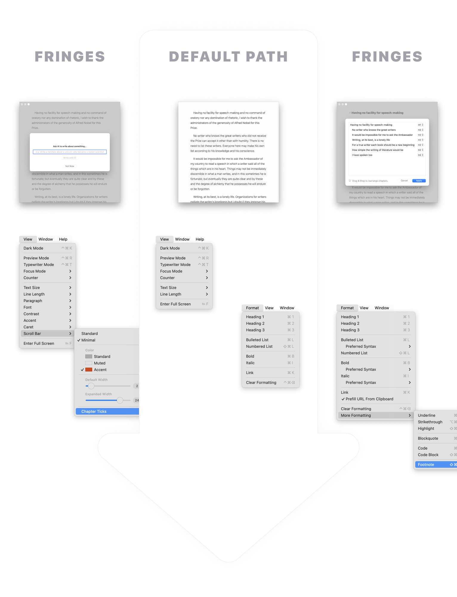
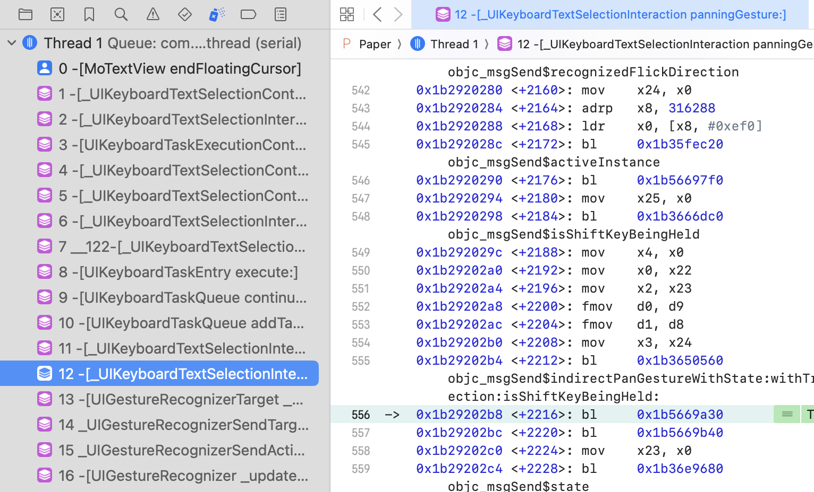
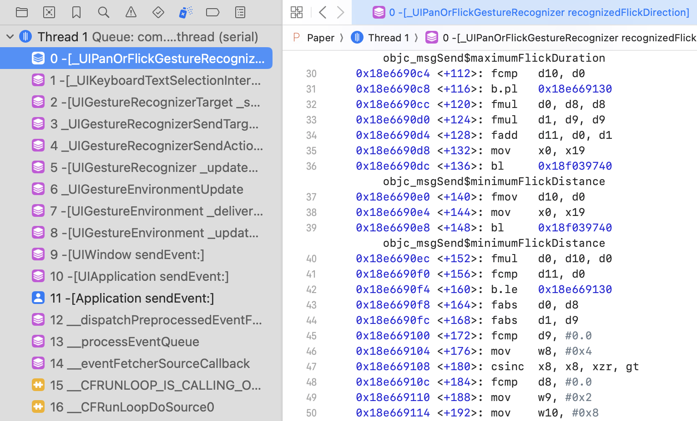
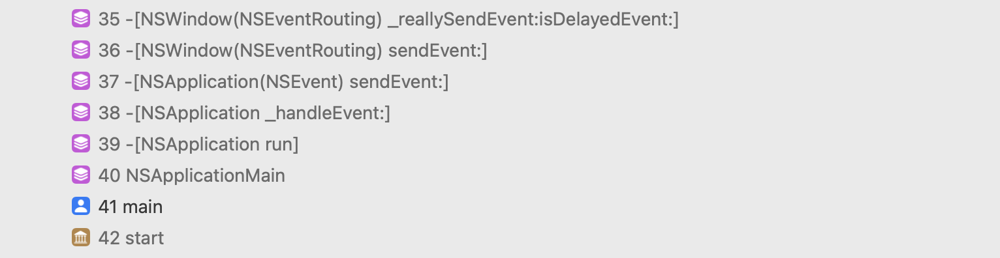
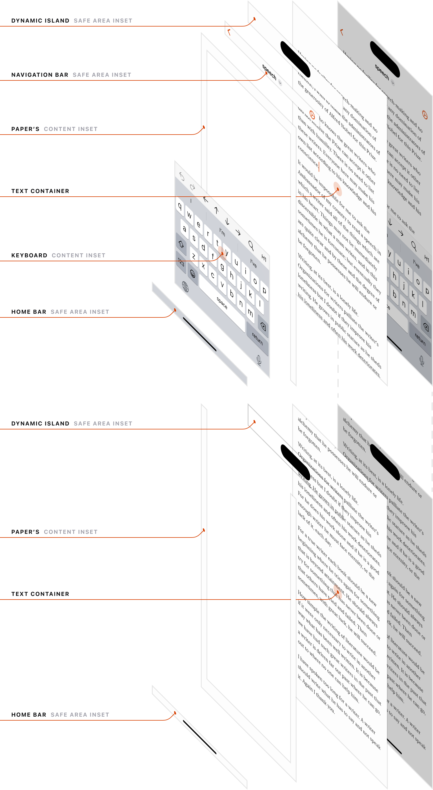
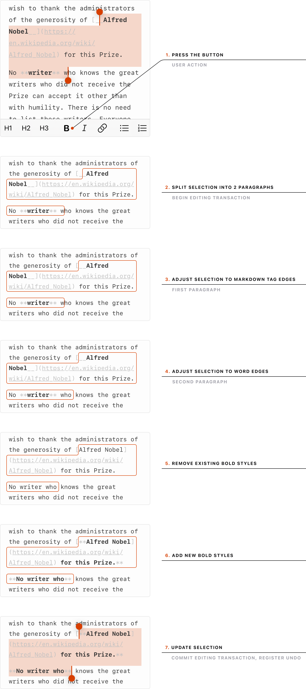
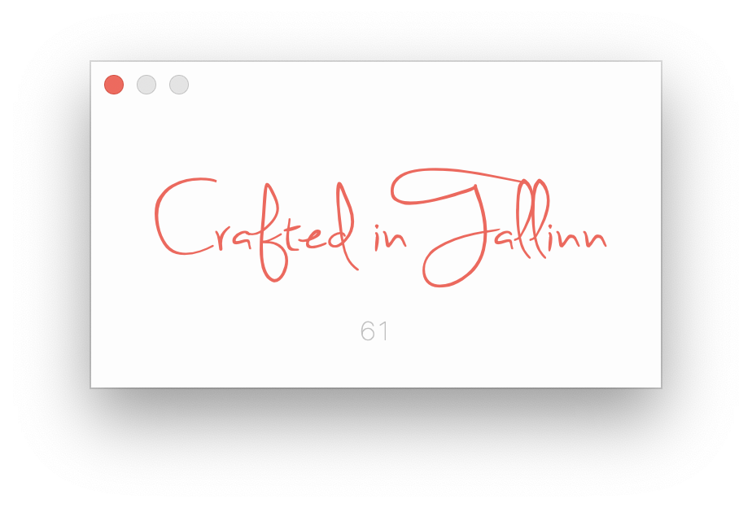
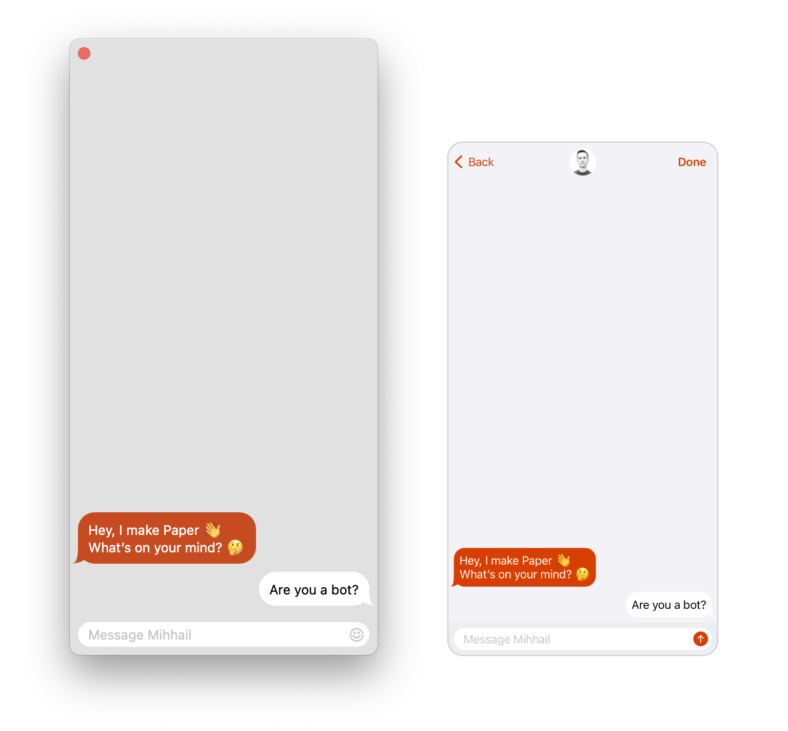
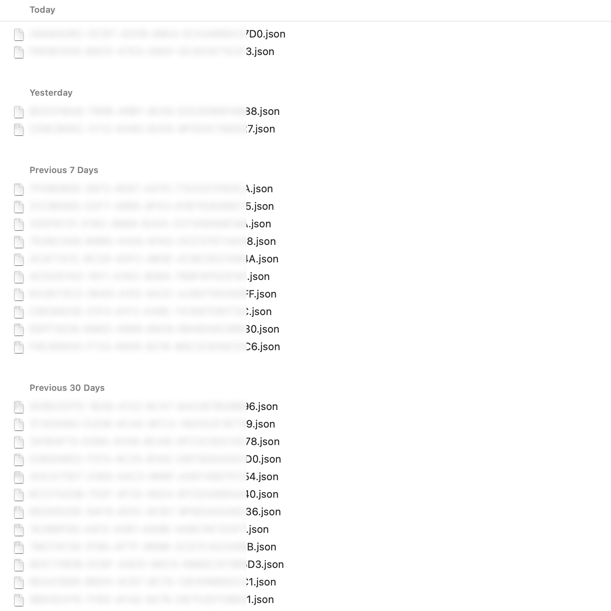
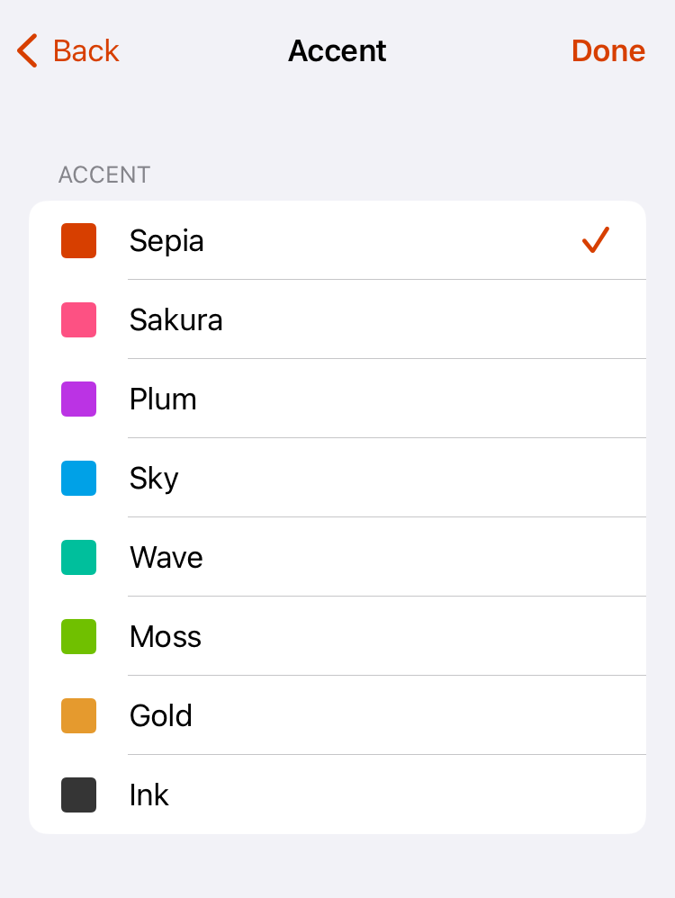

✍🏻  Thoughts on building [Paper](https://papereditor.app/) as a solo maker.  

✍🏻 关于作为独立开发者构建Paper的思考。

In 2015 [I](https://twitter.com/_mihhail) was a regular full-stack web developer (and still am to this day). I’ve owned a Mac. I’ve built a tiny iOS app once.  

2015年，我是一名普通的全栈Web开发者（至今仍然如此）。我有一台Mac电脑。我曾经开发过一个小型iOS应用。  

That was about the extent of my proximity to the world of Apple dev at the time.  

那时候，这就是我与苹果开发世界的接触程度。

Having spent some time behind a Mac, I’ve grown fond of its quirky and vibrant ecosystem of indie apps.  

在使用Mac一段时间后，我对其独特而充满活力的独立应用生态系统产生了喜爱。  

One day, after stumbling upon a very simple and elegant Markdown editor called [iA Writer](https://ia.net/writer?ref=papereditor.app/dev), for one reason or the other, I decided to make something similar.  

有一天，偶然间我发现了一个非常简单而优雅的Markdown编辑器，名为iA Writer，出于某种原因，我决定做一个类似的东西。

Armed with enthusiasm, I started learning how to make a native text editor for the Mac.  

怀着热情，我开始学习如何为Mac制作一个本地文本编辑器。  

Xcode, AppKit, Objective-C — all of it was new to me and not something I would ever find use for at my day job.  

Xcode、AppKit、Objective-C——这些对我来说都是新的东西，也不是我在日常工作中会用到的。  

I had to learn a completely different tech stack that would live inside my head parallel to all the web knowledge.  

我不得不学习一个完全不同的技术栈，与我所有的Web知识并行存在于我的脑海中。

At some point, I started calling the app _Paper_ because, in pursuit of ultimate minimalism, I’ve reduced the editor to nothing more than a blank rectangle.  

在某个时候，我开始将这个应用称为Paper，因为为了追求极简主义，我将编辑器简化成了一个空白的矩形。  

To top it off, I’ve made the corners 90° instead of the typical rounded ones. Silly?  

为了更加突出，我将角落变成了90°，而不是常见的圆角。有点傻吧？  

Maybe… But it was my app so I could do whatever I wanted. 😈  

也许是吧...但这是我的应用，所以我可以做任何我想做的事情。😈

In January 2017, 2 years after starting from ground zero, I launched the Mac app on the Mac App Store.  

2017年1月，从零开始两年后，我在Mac App Store上发布了这个Mac应用程序。  

The iOS app followed in 2019.  

iOS应用程序在2019年发布。

Now, it’s not every day that a random, unknown web developer decides to build an app in a ridiculously crowded category, in a tech stack they have no experience with, and then actually does it, carrying on for the next 7 years. “There’s gotta be some good material here” — I thought to myself.  

现在，不是每天都有一个随机的、不知名的网页开发者决定在一个极其拥挤的类别中构建一个应用程序，使用他们没有经验的技术栈，并且实际上做到了，并持续了接下来的7年。“这里一定有一些好的素材”——我对自己说。

And so — here is a brain dump of all the weird, bizarre, and occasionally smart ways that I’ve organized my dev process, app architecture, and product philosophy, coming from a web developer who has not earned a cent working at a job as a Mac or an iOS developer but has earned quite a few of them selling a native text editor to the users of Apple devices.  

因此，这里是我整理的所有怪异、奇特，有时聪明的方式，我在开发过程中组织我的应用程序架构和产品理念，这些都来自一个网页开发者，他在Mac或iOS开发者的工作中没有赚到一分钱，但却通过向Apple设备的用户销售本地文本编辑器赚到了不少钱。

## Why native?  

为什么选择本地应用？

You could make the argument that an Electron app would work as well.  

你可以说一个Electron应用程序也可以工作得很好。  

Why go through the hassle of learning a brand new tech stack especially when my main job is web-related?  

为什么要费心学习一个全新的技术栈，特别是当我的主要工作与Web相关时？  

I could have reused the skills, saved time, and supported more platforms all at the same time.  

我本可以重复利用技能，节省时间，并同时支持更多的平台。

Well, my goal was to deliver the best experience possible.  

嗯，我的目标是提供最好的体验。  

I was trying to compete with highly polished writing apps, thus my app had to be light and fast to begin with.  

我试图与经过精心打磨的写作应用竞争，因此我的应用程序必须从一开始就轻巧快速。  

In addition to that, there are simply more ways to mess with the app on the native level — to make it unique (especially when it comes to text). I was not trying to reach the maximum number of users nor to cut down the development time.  

此外，在原生级别上，有更多的方法可以对应用程序进行调整，使其变得独特（尤其是在文本方面）。我并不是为了达到最大用户数或缩短开发时间。  

I had all the time in the world.  

我有充足的时间。  

I was trying to craft an experience that starts with lightning-fast download time and carries on into a native-feeling UI and UX.  

我试图打造一种体验，从闪电般快速的下载时间开始，延续到本地化的用户界面和用户体验。

I wanted the best and I was willing to pay the penalty.  

我想要最好的，我愿意承担代价。

## Why Objective-C?  

为什么选择Objective-C？

In 2015 Swift was just getting started. I decided to make a test.  

在2015年，Swift刚刚开始。我决定进行一次测试。  

I’ve compiled an empty Xcode project in Objective-C and another one in Swift and then examined the respective `.app` packages. To my surprise, the Swift one had the full Swift runtime embedded into it — about `5MB`, while the Objective-C one was super light — tens or maybe `100KB` in total. That was enough to convince me to go with Objective-C.  

我编译了一个空的Objective-C项目和一个Swift项目，然后检查了各自的 `.app` 包。令我惊讶的是，Swift项目中嵌入了完整的Swift运行时 - 大约 `5MB` ，而Objective-C项目非常轻巧 - 总共只有几十个甚至 `100KB` 。这足以让我决定选择Objective-C。

Again — I wanted the best and I was willing to pay the penalty of a harder-to-learn, soon-to-be outdated language to get a slimmer distributable.  

再次强调 - 我想要最好的，我愿意承担学习难度更大、即将过时的语言的代价，以获得更小的分发包。

To be fair, if you run this experiment today the difference will not be that dramatic.  

公平地说，如果你今天运行这个实验，差异将不会那么明显。  

Swift has come a long way and my guess is Apple has either embedded it into their platforms or added some fancy [tree shaking](https://en.wikipedia.org/wiki/Tree_shaking) for the binary.  

Swift已经发展了很长一段时间，我猜想苹果要么将其嵌入到他们的平台中，要么为二进制文件添加了一些高级的树摇技术。

## Third-party dependencies  

第三方依赖

Paper does not have third-party dependencies.  

该论文没有第三方依赖。

I had little trust in my ability to pick the right dependencies from an ecosystem that I was not familiar with.  

我对自己在一个我不熟悉的生态系统中选择正确的依赖项的能力没有太多信心。  

Plus by building everything on my own I could tailor it to my needs, gaining a slight advantage over competitors who often rely on external dependencies even for core parts of their apps.  

此外，通过自己构建一切，我可以根据自己的需求进行定制，相比那些即使对于应用程序的核心部分也经常依赖外部依赖项的竞争对手，我可以获得一点优势。

For example, the Markdown parsing engine in Paper is bespoke. Why is that a good thing?  

例如，Paper中的Markdown解析引擎是定制的。为什么这是一件好事呢？  

Because Paper supports less Markdown syntax than the traditional fully-fledged Markdown editor.  

因为Paper支持的Markdown语法比传统的完整Markdown编辑器要少。  

I can code in just the right amount of parsing logic and nothing more.  

我可以编写恰到好处的解析逻辑，而不多不少。  

In addition to that, I can parse it with the right level of _metadata granularity_ which makes implementing features such as highlighting and text transformations simpler and more efficient.  

除此之外，我可以以正确的元数据粒度进行解析，这使得实现诸如高亮和文本转换等功能更简单、更高效。

A similar but even stricter approach applies to UI components.  

对于UI组件也采用了类似但更严格的方法。  

Paper uses only native UI elements from AppKit and UIKit since they have the lowest maintenance overhead: auto-updated by Apple, adjustable to various [traits](https://developer.apple.com/documentation/uikit/uitraitcollection), backward compatible, and guaranteed to work on every device.  

论文只使用来自AppKit和UIKit的原生UI元素，因为它们具有最低的维护成本：由Apple自动更新，可适应各种特性，向后兼容，并且保证在每个设备上都能正常工作。  

Not to mention that to the average user, it is the most familiar UI — from the way it works to the _bounciness_ of animations.  

更不用说对于普通用户来说，这是最熟悉的UI界面——从工作方式到动画的弹性。

In case not a single built-in UI component is suitable to implement the desired feature, then I simply don’t add the feature.  

如果没有一个内置的UI组件适合实现所需的功能，那么我就不会添加这个功能。  

For instance, the `NSPopover` is a good candidate for _bubbles that hint at stuff_ in the Mac app. An iOS counterpart sadly does not exist ([TipKit](https://developer.apple.com/documentation/tipkit) is Swift-exclusive 😢), so no bubbles in the iOS app. 🤷🏼♂️  

例如， `NSPopover` 是Mac应用程序中用于提示内容的气泡的一个很好的选择。不幸的是，iOS没有相应的组件（TipKit只支持Swift 😢），所以iOS应用程序中没有气泡。🤷🏼♂️

There were quite a few times when relying on auto-updated native components resulted in Paper getting free stylistic and feature updates that played to its strengths.  

有很多次，依赖于自动更新的原生组件使得Paper获得了免费的风格和功能更新，这些更新都符合它的优势。  

Here are some of them that appeared in various versions of iOS:  

以下是一些出现在不同版本iOS中的更新：

-   Navigation bar turns transparent if the scroll position is 0  
    
    如果滚动位置为0，导航栏变为透明
    
    -   Minimalism  
        
        极简主义
    
-   Buttons with [SF Symbols](https://developer.apple.com/sf-symbols/) animate on press  
    
    按下时，带有SF Symbols的按钮会有动画效果
    
    -   Delight  
        
        愉悦感
    -   Native feel  
        
        本地化体验
    

-   _Find and Replace_ support in the text view component  
    
    在文本视图组件中提供查找和替换支持
    
    -   Delight  
        
        愉悦感
    -   Native feel  
        
        本地化体验
    

## Vision  

愿景

The initial vision for Paper was simple — build something that has the core tricks of iA Writer, but in a package that feels even more elegant and minimal.  

Paper最初的愿景很简单 - 构建一个具有iA Writer核心功能的东西，但在外观上更加优雅和简约。  

To achieve the desired effect I went all-in on cutting down distractions:  

为了实现期望的效果，我全力以赴地减少了干扰：

-   Not having a single extra button inside the app window.  
    
    不在应用窗口内有任何额外的按钮。
-   Not having a standard Preferences window, but instead packing everything into menu items and menu widgets and hiding rarely used menu items under the ⌥ key.  
    
    没有标准的偏好设置窗口，而是将所有内容都打包到菜单项和菜单小部件中，并将很少使用的菜单项隐藏在⌥键下。
-   Slimming down the scroll bar to a 2px line that runs on the edge of the window and matches the 2px caret.  
    
    将滚动条变窄为2像素的线条，沿窗口边缘运行，并与2像素的插入符匹配。
-   Centering characters within the line so that there is an equal amount of caret above and below the character.  
    
    将字符居中在行内，以使插入符在字符上方和下方的数量相等。
-   _Scrolling away_ the title bar and extending the text area into the title bar (and making the remaining whitespace around the editor _draggable_ to account for the fact that the usual draggable title bar area can be taken by the editor).  
    
    将标题栏滚动隐藏，并将文本区域扩展到标题栏中（并使编辑器周围的剩余空白可拖动，以适应通常可拖动的标题栏区域可能被编辑器占用的情况）。

Have people noticed the effort? Most probably not… but some have.  

人们是否注意到了这些努力？很可能没有...但有些人注意到了。  

So much so that at one point Paper received a perfectly succinct review that I use as a tagline to this day.  

事实上，有一次，Paper收到了一条非常简洁的评论，我至今仍将其用作标语。

> This is a super-clean writing space with a lot of configurability that stays out of sight when you don’t need it.  
> 
> 这是一个超级干净的写作空间，具有很多可配置性，在你不需要它时保持不可见。

As time went on I started developing a feeling for how the market of minimal Apple text editors looks like and what could be Paper’s place in it.  

随着时间的推移，我开始对最小化苹果文本编辑器市场有了一些了解，并思考Paper在其中的定位。

To my observations, minimalist writing apps usually follow 2 paths:  

根据我的观察，极简写作应用通常有两种发展路径：

1.  Become popular and start slowly drifting away from their minimalist roots to satisfy the ever-growing demands of mainstream users.  
    
    变得流行起来，并逐渐远离其极简主义的根源，以满足日益增长的主流用户需求。
2.  Remain too simple and niche to eventually be abandoned by their creators.  
    
    保持过于简单和小众，最终被其创建者抛弃。

Paper is not \[1.\] but it could be on the path to \[2.\].  

Paper目前还不是\[1.\]，但有可能朝着\[2.\]的方向发展。

My plan is to forever keep the app as minimal as it was when it launched — to resist adding any visual clutter.  

我的计划是永远保持这个应用程序的极简风格，就像它刚发布时一样，抵制添加任何视觉杂乱。  

For a certain group of people, this is a vital requirement that other apps (apparently) fail to address.  

对于某些人来说，这是一个重要的要求，其他应用程序（显然）未能满足。

> Please do not make Paper more complex!  
> 
> 请不要让Paper变得更复杂！  
> 
> There are plenty and plenty of 'full featured' editors out there, and they do not fit the bill for focused writing.  
> 
> 市面上有很多“功能齐全”的编辑器，但它们并不适合专注写作。

At the same time by having a slow and predictable cadence of small updates (more on that [at the end](https://papereditor.app/dev#releases)) I can slowly add features to the _fringes_ of the app while keeping the _default path_ super clean. Making Paper more useful but not bloated.  

同时，通过缓慢而可预测的小型更新节奏（后面会详细介绍），我可以在应用程序的边缘逐渐添加功能，同时保持默认路径的超级清洁。使Paper更有用但不臃肿。

The slow pace and the overall limited number of features allow me to focus on building a better foundation, to better understand how things work together, and to avoid adding features that bring instability and a high maintenance burden in the future.  

缓慢的节奏和总体上有限的功能数量使我能够专注于构建更好的基础，更好地理解各个组件之间的工作方式，并避免添加会带来不稳定性和高维护负担的功能。

Closed-sourced native UI is a fragile place compared to the predictable JavaScript runtime of the browser.  

封闭的本地用户界面与可预测的浏览器JavaScript运行时相比，是一个脆弱的地方。  

If you don’t invest substantial resources into refactoring your app and eliminating bugs — it’s death by a thousand crashes.  

如果您不投入大量资源来重构您的应用程序并消除错误，那么它将因为无数次崩溃而死亡。  

And this is what I am banking on with regard to \[1.\]. The bloat, complexity, and bugs that \[1.\] accumulate from their decision to go mainstream present good opportunities to capture some of the disappointed users that eventually leave them.  

这就是我对于\[1.\]的期望。\[1.\]决定走向主流所带来的臃肿、复杂和错误，为我们提供了捕捉一些最终离开它们的失望用户的好机会。

This however may not be enough to make Paper into a viable product. There are simply not enough (reachable) people who need these kinds of ultra-simple writing apps (let alone pay for one).  

然而，这可能还不足以使Paper成为一个可行的产品。没有足够（可触及的）人们需要这种超简单的写作应用程序（更不用说为之付费了）。  

Power users are the ones who pay the bills because they need power tools to earn money that they can then justify spending on those tools.  

付费用户是支付账单的人，因为他们需要强大的工具来赚钱，然后可以为这些工具的支出提供合理的理由。  

And while \[1.\] and \[2.\] are the majority, there _definitely_ are cases of simple writing apps that remain simple and/or that are still supported by obsessive single players like me.  

虽然\[1.\]和\[2.\]是大多数情况，但确实存在一些简单的写作应用程序，它们仍然保持简单和/或由像我这样的痴迷单打独斗的玩家提供支持。  

There might just never be a big enough gap in the market for Paper. 🤷🏼♂️  

也许市场上永远不会有足够大的空缺来容纳Paper。🤷🏼♂️

## Architecture  

架构

I find it convenient to think of Paper’s code as consisting of two _scopes_.  

我认为将Paper的代码分为两个范围是很方便的。

-   **Application scope  
    
    应用程序范围**
    
    -   Global stuff that exists as a single instance or is applied to the app as a whole.  
        
        全局的东西，作为一个单一实例存在，或者应用于整个应用程序。
        
        -   macOS menu  
            
            macOS 菜单
        -   iOS status bar  
            
            iOS 状态栏
        -   Touch bar  
            
            触控栏
        -   App icon  
            
            应用图标
        -   Dark mode  
            
            暗黑模式
        -   Input language  
            
            输入语言
        -   Global app config  
            
            全局应用配置
        -   Global app logic  
            
            全局应用逻辑
        -   Single instance views  
            
            单一实例视图
        
    
-   **Document scope  
    
    文档范围**
    
    -   A collection of views and logic that live inside a view controller representing a single document.  
        
        文档范围是指存在于表示单个文档的视图控制器内的一组视图和逻辑。
    -   A new document scope spawns into life the moment the document is opened and dies when it is closed.  
        
        新的文档范围在文档打开时诞生，并在文档关闭时终止。
    -   Unlike a singular application scope, zero or more document scopes can exist at the same time.  
        
        与单一应用程序范围不同，可以同时存在零个或多个文档范围。
    

The reality is a bit more nuanced as there are also _scenes_ on iOS that subdivide the global scope, but the mental model holds more or less.  

实际情况要更加微妙，因为在iOS上还有场景将全局范围细分，但这个心智模型基本上是成立的。

For every scope, I define a _storyboard_ that serves 2 functions:  

对于每个范围，我定义了一个故事板，它具有两个功能：

-   It describes various views and widgets that are used within the scope.  
    
    它描述了在该范围内使用的各种视图和小部件。
-   It acts as a [dependency injection](https://en.wikipedia.org/wiki/Dependency_injection) container that glues together all _modules_ within the scope.  
    
    它充当依赖注入容器，将范围内的所有模块粘合在一起。

Modules (not to be confused with `.modulemap` stuff — I just happen to use the same name) in Paper are plain Objective-C classes that take responsibility for a piece of functionality within the app.  

Paper中的模块（不要与 `.modulemap` 混淆——我只是碰巧使用了相同的名称）是普通的Objective-C类，负责应用程序中的某个功能。  

It’s a way to group functionality related to a particular feature instead of spreading it across multiple places.  

这是一种将与特定功能相关的功能组合在一起而不是分散在多个地方的方法。

Modules have a well-defined lifecycle:  

模块有一个明确定义的生命周期：

1.  They are created by the storyboard when the _main thing_ within the storyboard gets created.  
    
    当故事板中的主要内容被创建时，它们由故事板创建。
    
    -   **Application scope  
        
        应用程序范围**
        
        -   The _main thing_ is the app itself, so all modules are created on startup.  
            
            主要内容是应用程序本身，因此所有模块都在启动时创建。
        
    -   **Document scope  
        
        文档范围**
        
        -   The _main thing_ is the view controller that holds the editor.  
            
            主要内容是持有编辑器的视图控制器。
        
    
2.  They have a setup method that gets called after the dependencies have been injected, but before the _main thing_ becomes visible.  
    
    它们有一个设置方法，在依赖项被注入之后调用，但在主要内容可见之前。
    
    -   **Application scope  
        
        应用程序范围**
        
        -   Called on  
            
            调用于
            
            -   `ApplicationDidFinishLaunchingNotification`
            -   `UISceneWillConnectNotification` for scenes  
                
                `UISceneWillConnectNotification` 用于场景
            
        
    -   **Document scope  
        
        文档范围**
        
        -   Called on `didMoveToWindow` of the main view.  
            
            在主视图的 `didMoveToWindow` 上调用。
        
    
3.  They have a tear-down method that gets called before the _main thing_ is destroyed.  
    
    它们有一个在主要事物被销毁之前调用的拆除方法。
    
    -   **Application scope  
        
        应用程序范围**
        
        -   No need. Modules die with the app.  
            
            不需要。模块随应用程序一起终止。
        
    -   **Document scope  
        
        文档范围**
        
        -   Called on `willMoveToWindow` of the main view when the `newWindow` argument is `nil`.  
            
            当 `newWindow` 参数为 `nil` 时，在主视图的 `willMoveToWindow` 上调用。
        
    

Modules declare their dependencies — views and other modules.  

模块声明它们的依赖关系 - 视图和其他模块。

`@interface TvTextAttributeModule()`

`@property IBOutlet NSTextView *textView;`

`@property IBOutlet TvTextContentModule *tvTextContentModule;    @property IBOutlet TvLayoutAttributeModule *tvLayoutAttributeModule;    @property IBOutlet TvCaretModule *tvCaretModule;    @property IBOutlet TvTypewriterModeModule *tvTypewriterModeModule;`

`@end`

I resolve them manually in Xcode.  

我在Xcode中手动解决它们。

Dependencies are then injected by the storyboard at runtime when the view controller is instantiated.  

依赖项在视图控制器实例化时由故事板在运行时注入。

OpenCloseDocumentModule.m

`UIStoryboard *sb = [UIStoryboard storyboardWithName:@"Document"                                                 bundle:nil];    UINavigationController *ctr = [sb instantiateInitialViewController];`

If a document-scoped module needs something from the application scope it can get it from the global variable…  

如果文档范围的模块需要应用程序范围的内容，可以从全局变量中获取..

`[self.viewController.presentingViewController dismiss_:^{      [self.docNavigationBarModule documentViewControllerDidDismiss];      [Application.get.viewController.storeReviewModule tryAsk];    }];`

…or from the root of the view hierarchy for scenes.  

...或者从场景的视图层次结构根部获取。

`BOOL unread = self.rootViewController.supportChatModule.unread > 0;    UIImage *icon = [UIImage systemImageNamed:@"gear"];    UIImage *unreadIcon = [UIImage systemImageNamed:@"gear.badge"];    self.rightBarButtonItem.image = unread ? unreadIcon : icon;`

Modules subscribe to notifications (pub-sub events between classes) during the setup phase of the lifecycle and unsubscribe during the tear-down phase.  

模块在生命周期的设置阶段订阅通知（类之间的发布-订阅事件），并在拆卸阶段取消订阅。

`- (void)addNotificationObservers {      [self addObserver:@selector(windowDidResize)                       :NSWindowDidResizeNotification                       :self.window];      [self addObserver:@selector(textViewDidChangeSelection)                       :NSTextViewDidChangeSelectionNotification                       :self.textView];      [self addObserver:@selector(colorsDidChange)                       :Colors.didChangeNotification];    }`

Modules can let other modules know that something has happened.  

模块可以让其他模块知道发生了某些事情。  

This is done through direct method calls rather than notifications to keep things simpler, IDE navigable, and faster.  

这是通过直接方法调用而不是通知来完成的，以使事情更简单、IDE可导航和更快速。

`UIEdgeInsets contentInset = self.calculateContentInset;    UIEdgeInsets indicatorInsets = self.calculateScrollIndicatorInsets;`

`self.textView.contentInset = contentInset;    self.textView.verticalScrollIndicatorInsets = indicatorInsets;`

`[self.docFrameModule textViewDidChangeInsets];    [self.tvTypewriterModeModule textViewDidChangeInsets];`

Modules can ask other modules to do or to calculate something that those other modules are responsible for.  

模块可以要求其他模块执行或计算那些其他模块负责的任务。

`- (void)textViewDidAnimateCaretFirstAppearance {      if (self.shouldCancel) {        return;      }`

  `[self.label centerIn_:self.docFrameModule.visibleFrame];`

  `[self animateIn:self.label :^{        [Delay_ by:1.0 :^{          [self animateOut:self.label :^{            [self.label removeFromSuperview];            self.label = nil;          }];        }];      }];`

  `self.label.hidden = NO;    }`

This leaves the delegates, view controllers, and views as proxies that notify modules about stuff that’s going on in the app and delegate everything to them.  

这样一来，代理、视图控制器和视图就成为了通知模块应用程序中正在发生的事情并将所有事情委托给它们的代理。

`- (void)insertText:(id)string replacementRange:(NSRange)range {      [self.tvAutocompleteModule textViewWillInsertText:string];      [self.tvTypewriterModeModule textViewWillInsertText:string];`

  `if ([self.tvTextAttributeModule textViewWillInsertText:string]) {        [super insertText:string replacementRange:range];      }`

  `[self.tvTextAttributeModule textViewDidInsertText];      [self.tvTypewriterModeModule textViewDidInsertText];    }`

All in all, the combination of modules and dependency injection through storyboards gives a nice mechanism to decouple and subdivide what would have been a giant document view controller and/or text view.  

总的来说，模块和通过storyboards进行的依赖注入的结合为解耦和细分原本可能是一个庞大的文档视图控制器和/或文本视图提供了一个很好的机制。  

Applying the same approach to the application scope gives the whole app a uniform structure that is a joy to work with.  

将相同的方法应用于应用程序范围，可以为整个应用程序提供一个统一的结构，非常方便使用。

## Cross-platform code  

跨平台代码

AppKit and UIKit are both quite similar and annoyingly different in many places.  

AppKit和UIKit在许多地方都非常相似，但也存在令人讨厌的差异。

I employ 2 Objective-C features to work around the differences:  

我使用了两个Objective-C特性来解决这些差异：

-   Macros (this one is inherited from C)  
    
    宏（这个概念是从C语言继承而来）
-   Categories  
    
    类别

For example, in many cases, the difference comes down to `NS` vs `UI` prefix which I mitigate with this macro.  

例如，在许多情况下，区别在于 `NS` 和 `UI` 前缀，我可以通过这个宏来缓解这个问题。

`#if TARGET_OS_OSX    #define KIT(symbol) NS##symbol    #else    #define KIT(symbol) UI##symbol    #endif`

Now, whenever I need to declare a view in a shared module I can simply type `KIT(View)` instead of `NSView` or `UIView`.  

现在，每当我需要在共享模块中声明一个视图时，我只需输入 `KIT(View)` ，而不是 `NSView` 或 `UIView` 。

`- (KIT(View) *)cloneCaretView {      KIT(View) *view = [self createCaretView:self.caretFrame];      [view.layer setNeedsDisplay];      return view;    }`

Besides that, I can use those `#if` statements to quickly add platform-specific code in shared classes.  

除此之外，我还可以使用这些 `#if` 语句在共享类中快速添加特定于平台的代码。  

To make such code more readable Xcode even has a cool trick that deemphasizes the code that does not apply to the currently selected platform.  

为了使这样的代码更易读，Xcode甚至有一个很酷的技巧，可以减弱当前选择平台不适用的代码的显示效果。

Categories in Objective-C are a way to add new methods to any existing class, including framework classes (categories can also be used to replace methods, which is both powerful and scary 😵). I use them to harmonize the API. So if a method in `UITextField` is called `text` and in `NSTextField` it is called `stringValue` I can add a `stringValue` method to `UITextField` that calls `text` (or vice versa). Now I can always refer to the `stringValue` method in my `KIT(TextField)` variable and it will compile on both platforms.  

在Objective-C中，类别是一种向任何现有类（包括框架类）添加新方法的方式（类别还可以用于替换方法，这既强大又可怕😵）。我使用它们来统一API。因此，如果在 `UITextField` 中一个方法被称为 `text` ，而在 `NSTextField` 中被称为 `stringValue` ，我可以在 `UITextField` 中添加一个 `stringValue` 方法来调用 `text` （或反之亦然）。现在，我可以始终在我的 `KIT(TextField)` 变量中引用 `stringValue` 方法，并且它将在两个平台上编译。

I gather all these little patches to an _adapter_ header in the shared library.  

我将所有这些小补丁都收集到共享库的适配器头文件中。

SharedApplicationAdapter.h

`@interface UITextField(SharedApplicationAdapter)`

`@property (nonatomic) NSString *stringValue;    @property (nonatomic) NSString *placeholderString;`

`@end`

And then implement this header in respective app projects.  

然后在各自的应用程序项目中实现这个头文件。

SharedApplicationAdapter.m

`@implementation UITextField(SharedApplicationAdapter)`

`- (NSString *)stringValue {      return self.text;    }`

`- (void)setStringValue:(NSString *)stringValue {      self.text = stringValue;    }`

`- (NSString *)placeholderString {      return self.placeholder;    }`

`- (void)setPlaceholderString:(NSString *)placeholderString {      self.placeholder = placeholderString;    }`

`@end`

By the way, I also use categories to shorten long framework methods.  

顺便说一下，我还使用分类来缩短长的框架方法。

UIViewController+Mobile\_.m

`@implementation UIViewController(Mobile_)`

`- (void)dismiss_ {      [self dismissViewControllerAnimated:YES completion:nil];    }`

`@end`

The underscore at the end helps to avoid clashes with public or private methods that Apple might decide to add in the future.  

末尾的下划线有助于避免与苹果可能在未来添加的公共或私有方法发生冲突。  

Apple often prefixes private methods with an underscore, so having it at the end makes more sense.  

苹果经常在私有方法前加下划线，所以将其放在末尾更有意义。

## Debugging  

调试

Throughout my career I’ve always learned the quickest and the most about a particular third-party dependency by reading the code rather than going through the docs.  

在我的职业生涯中，我总是通过阅读代码而不是查阅文档来最快地了解特定的第三方依赖。  

Documentation is fine to get a general picture, but the details matter especially when stuff does not work the way it should either by (undocumented) design or due to mistakes of the authors.  

文档可以提供一个总体的概念，但细节尤为重要，特别是当事情不按照预期工作时，可能是由于（未记录的）设计问题或作者的错误。

Now in the case of Apple frameworks, documentation is sadly the only readable option you have.  

现在在苹果框架的情况下，文档是唯一可读的选项。  

A far less readable one is to put a breakpoint in your code and examine the compiled stack trace of the framework.  

一种不太可读的方法是在代码中设置断点，并检查框架的编译堆栈跟踪。

It looks like gibberish, but the important thing is that the method names are visible.  

它看起来像胡言乱语，但重要的是方法名是可见的。  

Analyzing the flow of method calls is enough to grasp what is going on.  

分析方法调用的流程足以理解正在发生的事情。  

And if you need to inspect something that is outside the stack ending in your source code you can always add a _symbolic breakpoint_ to stop inside the framework. For instance, below it stops at `recognizedFlickDirection` which is visible at the top of the compiled code above.  

如果您需要检查一些在堆栈结束之外的源代码中的内容，您可以随时添加一个符号断点以停在框架内部。例如，下面的代码在编译代码的顶部可见的地方停在 `recognizedFlickDirection` 。

As a side note, going through a 30-year-old codebase you occasionally discover gems such as `if` statements adjusting the logic of the framework depending on the (Apple) app that runs the framework, or instances of creative naming. 🙃  

顺便说一下，在浏览30年历史的代码库时，您偶尔会发现一些宝藏，比如根据运行框架的（苹果）应用程序调整框架逻辑的语句，或者创造性命名的实例。🙃

## Paid features  

付费功能

Back in 2015–17, subscriptions were not a widespread thing yet in the App Store. Pay-to-download was (and is) common, but I did not think that someone would pay for an unknown app without trying it, so the one-time payment freemium seemed like the only option.  

回到2015年至2017年，订阅在App Store中还不是很普遍。付费下载是常见的，但我没有想到有人会在没有尝试的情况下支付一个未知的应用程序，所以一次性付费的免费模式似乎是唯一的选择。  

At the same time, I did not want to just paywall the features or implement a custom time-based trial (only subscriptions have built-in trials in the App Store). I wanted something extremely user-friendly.  

同时，我不想只是将功能设为付费，或者实现一个基于时间的自定义试用（只有订阅才有内置的试用功能在App Store中）。我想要的是一种极其用户友好的方式。  

Something that feels like you can push all the buttons and adjust all the toggles of the paid offering without limits, without needing to explicitly commit to a trial of arbitrary length.  

我希望用户可以随意使用付费功能的所有按钮和开关，而无需明确选择一个任意长度的试用期。

My solution was to offer only _cosmetic_ upgrades as part of the Pro offering — visual changes rather than functional features (e.g. file syncing or PDF exports).  

我的解决方案是将Pro版本仅提供视觉上的升级，而不是功能性的特点（例如文件同步或PDF导出）。

I would then make them _trialable_ for an unlimited amount of time. Users could _test drive_ the features to see how they look and work and then buy the Pro offering if they thought that the features were worth it.  

然后，我将这些升级功能设置为无限试用。用户可以测试这些功能的外观和使用方式，然后决定是否购买Pro版本。

Of course, there needed to be a measure that prevented people from using the features indefinitely without paying.  

当然，需要有一种措施防止人们无限期地免费使用这些功能。  

At first, it was a 60-second timer that would nag them to buy if at least one of the Pro features was active.  

起初，我设置了一个60秒的计时器，如果至少有一个Pro功能处于激活状态，它会提醒用户购买。  

This proved to be too annoying, so I tied the nagging to characters written instead.  

但这被证明太过烦人，所以我将提醒与已输入的字符绑定在一起。  

It made more sense — try everything for as much time as you want without distractions but as soon as you start using Paper to write then every couple of hundred characters you would see a popup.  

这样做更有意义 - 您可以尽情尝试所有功能，没有任何干扰，但一旦开始使用Paper进行写作，每隔几百个字符就会弹出一个弹窗。

Why does this work only for cosmetic upgrades?  

为什么这只适用于外观升级？  

Because, unlike functional features whose value is tied to a specific momentary action, cosmetic upgrades enhance your writing experience on a constant basis.  

因为，与功能性特性不同，其价值与特定的瞬时动作相关，外观升级可以不断增强您的写作体验。  

You cannot put a functional feature behind the same frictionless trial described above since the value of the feature is fully realized the moment the action is performed.  

您不能将功能性特性放在上述无摩擦试用中，因为该特性的价值在执行动作的那一刻就完全实现了。  

On the other hand, letting the users apply cosmetic changes accompanied by a nagging mechanism gives them a taste of the enhanced writing experience yet limits the prolonged value of this enhancement.  

另一方面，让用户应用外观变化并伴随着一种唠叨的机制，让他们尝试增强的写作体验，但限制了这种增强的持久价值。  

Forcing the purchase, yet not limiting the ability to fully explore everything on their terms before spending the money.  

强制购买，但不限制在花钱之前完全探索一切的能力。

What do users think about it? Here is an excerpt from a recent review.  

用户对此有何看法？以下是最近一篇评论的摘录。

> …the fact that it lets you mess around with and test pro features instead of locking them behind a paywall (a reason I do not like a lot of apps.  
> 
> ……事实上，它让您可以随意测试专业功能，而不是将其锁定在付费墙后面（这是我不喜欢很多应用的原因）。  
> 
> They don’t let you try the features until you start a subscription or trial you may very well forget about, if it even gives you a trial) is extremely nice. \[…\] You don’t even have to necessarily trust me on it: jump in and try it yourself.  
> 
> 他们不允许你在开始订阅或试用之前尝试这些功能，而你可能会忘记它们，如果它们甚至给你提供试用的话) 这非常好。\[...\] 你甚至不必完全相信我：跳进来自己试试看。  
> 
> It lets you test every single feature it has.  
> 
> 它让你测试它拥有的每一个功能。

## Pricing  

定价

Paper started with 2 one-time payments of $5 each for 2 sets of Pro Features. Today, after many experiments, it is $10 per month or $100 lifetime for a single set.  

Paper 最初是通过两次一次性支付每次 5 美元的费用来启动的，用于购买两套专业功能。经过多次实验，现在它是每月 10 美元或者一次性支付 100 美元终身使用一套功能。

First, before plunging into the world of subscriptions, I experimented with one-time payments.  

首先，在进入订阅的世界之前，我进行了一次性支付的实验。  

I started gradually doubling the price and observing if the total amount of money earned would increase or decrease.  

我逐渐加倍价格，并观察所赚取的总金额是否会增加或减少。  

My App Store traffic was pretty stable, so there were always new people coming through the door who did not know anything about previous prices.  

我的 App Store 流量相当稳定，所以总是有新人进来，对之前的价格一无所知。  

That’s when I first discovered that people were willing to pay up to $100 for an app from an unknown developer. I tried going up to $200.  

那时我第一次发现人们愿意为来自一个未知开发者的应用支付高达 100 美元。我试过涨到 200 美元。  

I think I’ve gotten like 1 or 2 sales and some amount of complaints over several months so I figured that $200 is probably the pain point. Thus the market has decided that $100 is an adequate price for Paper.  

我想我大概只卖出了 1 或 2 份，并且在几个月内收到了一些投诉，所以我认为 200 美元可能是痛点。因此，市场已经决定 100 美元是 Paper 的合适价格。

Next after a lot of hesitation, I decided to introduce subscriptions. “No one would pay a subscription for such a simple app” — was my conviction. But I was wrong.  

经过很多犹豫之后，我决定引入订阅服务。"没有人会为这样一个简单的应用付费订阅"，这是我的信念。但我错了。  

They worked and today Paper has a healthy mix of monthly, annual, and lifetime payments with subscriptions being the default, promoted payment option (since SaaS is all the rage, right?).  

它们起作用了，如今Paper拥有健康的月度、年度和终身付款方式，订阅成为默认的、推广的付款选项（因为SaaS很火嘛，对吧？）。

Even now I still experiment with prices.  

即使现在，我仍在尝试不同的价格。  

Recently I doubled the monthly price for new subscribers in some countries while keeping the annual price unchanged.  

最近，我在一些国家将新订阅者的月度价格翻倍，但年度价格保持不变。  

This is to incentivize the annual option and to reduce churn.  

这是为了激励选择年度选项，并减少流失。  

Preliminary results show that people continue subscribing though in smaller numbers.  

初步结果显示，尽管人数较少，但人们仍在继续订阅。  

Still — this could be a positive change taking into account the higher monthly price and annual upgrades.  

尽管月度价格较高，年度升级可能是一个积极的变化。  

We’ll have to wait and see…  

我们还需要等待和观察..

What’s also great about the App Store is that you can easily test lowering prices for countries with lower incomes.  

App Store的另一个好处是，你可以轻松测试降低低收入国家的价格。  

Since Apple does not charge the typical ¢50 per transaction (e.g. like [Paddle](https://www.paddle.com/pricing)) you can go as low as you want without those fees eating into your margins.  

由于苹果不像Paddle那样每笔交易收取典型的50美分费用，所以你可以任意降低价格，而不会影响你的利润。  

Currently, I am testing to see if lowering the price has any effect or if people in those countries simply don’t pay for software (or text editors 🤷🏼♂️) no matter what.  

目前，我正在测试降低价格是否会产生任何影响，或者在这些国家，无论如何人们都不愿意为软件（或文本编辑器🤷🏼♂️）付费。

## Gnarly bits  

复杂的细节

Text editors are hard…  

文本编辑器很难..

Text is one of those things that always gets things bolted onto it.  

文本是那种总是会有各种功能添加进去的东西。  

Copy-paste, drag and drop, undo, caret interactions, right-to-left languages, non-alphabetic languages, dictation, spoken text, scanned text, non-text objects in text, data format recognizers, tap-and-hold link previews, text search overlay, spell check, autocorrection, autocomplete, AI suggestions — it never stops.  

复制粘贴，拖放，撤销，插入符交互，从右到左的语言，非字母语言，口述，语音文本，扫描文本，文本中的非文本对象，数据格式识别器，长按链接预览，文本搜索叠加，拼写检查，自动更正，自动完成，AI建议——它永远不会停止。  

You’re always at the mercy of the next OS update adding new ways to insert, update, and interact with editable text.  

你总是受制于下一个操作系统更新，添加新的插入、更新和与可编辑文本交互的方式。

Figuring out the math behind the text editor rectangle is particularly tricky on iOS with various factors like the Dynamic Island (or the notch), the Home Bar, and the dynamically appearing software keyboard, times 2 orientations, getting in the way.  

在iOS上，计算文本编辑器矩形的数学问题特别棘手，因为有各种因素，如动态岛屿（或刘海屏），Home Bar和动态出现的软件键盘，加上2个方向的问题。

Input languages and fonts are a headache as well.  

输入语言和字体也是一个头疼的问题。  

Alphabetic languages are relatively easy to deal with as most major fonts support even quirky glyphs like [umlauts](https://en.wikipedia.org/wiki/Umlaut_(diacritic)) and Cyrillics. The non-alphabetic languages however need specific fonts to display their glyphs.  

字母语言相对容易处理，因为大多数主要字体都支持像umlauts和Cyrillics这样的奇怪字形。然而，非字母语言需要特定的字体来显示它们的字形。  

Luckily Apple’s systems come with at least one of those fonts preinstalled per every non-alphabetic input language.  

幸运的是，Apple的系统每个非字母输入语言都预装了至少一个这样的字体。  

The only problem is that no API maps an input language to supported fonts — so I had to brute force it.  

唯一的问题是，没有API将输入语言映射到支持的字体 - 所以我不得不采取蛮力方法。  

I’ve installed every input language on my Mac and wrote some text in each of them in TextEdit to see what font TextEdit falls back to when it sees the typed glyphs. The following `switch` is the result of it (I am pretty sure I’ve messed up the names of some languages or nationalities — don’t judge me too hard, I am just a developer 😩).  

我在我的Mac上安装了每种输入语言，并在TextEdit中每种语言中写了一些文本，以查看当TextEdit看到输入的字形时会回退到哪个字体。以下是结果（我很确定我搞砸了一些语言或国籍的名称 - 不要对我太苛刻，我只是一个开发者 😩）。

`switch (inputLanguage) {      case InputLanguage_Alphabetic:        switch (fontName) {          case FontName_Courier:            return @"Courier";          case FontName_CourierPrime:            return @"CourierPrime";          case FontName_CourierPrimeSans:            return @"CourierPrimeSans-Regular";          case FontName_Menlo:            return @"Menlo-Regular";          case FontName_Helvetica:            return @"Helvetica-Light";          case FontName_Avenir:            return @"AvenirNext-Regular";          case FontName_NewYork:            return @"NewYork-Regular";          case FontName_Georgia:            return @"Georgia";          case FontName_TimesNewRoman:            return @"TimesNewRomanPSMT";          case FontName_Palatino:            return @"Palatino-Roman";          case FontName_BrushScript:            return @"BrushScriptMT";          case FontName_Charter:            return @"Charter-Roman";        }      case InputLanguage_Japanese:      case InputLanguage_Cantonese:        return @"HiraginoSans-W2";      case InputLanguage_ChineseSimplified:        return @"PingFangSC-Light";      case InputLanguage_ChineseTraditional:        return @"PingFangTC-Light";      case InputLanguage_Korean:        return @"AppleSDGothicNeo-Regular";      case InputLanguage_Arabic:        return @"SFArabic-Regular";      case InputLanguage_Thai:        return @"Thonburi-Light";      case InputLanguage_Hebrew:        return @"SFHebrew-Regular";      case InputLanguage_Hindi:        return @"KohinoorDevanagari-Regular";      case InputLanguage_Bengali:        return @"KohinoorBangla-Regular";      case InputLanguage_Malayalam:        return @"MalayalamSangamMN";      case InputLanguage_Burmese:        return @"MyanmarSangamMN";      case InputLanguage_Gujarati:        return @"KohinoorGujarati-Regular";      case InputLanguage_Kannada:        return @"NotoSansKannada-Regular";      case InputLanguage_Oriya:        return @"NotoSansOriya";      case InputLanguage_Telugu:        return @"KohinoorTelugu-Regular";      case InputLanguage_Gurmukhi:        return @"GurmukhiSangamMN";      case InputLanguage_Sinhala:        return @"SinhalaSangamMN";      case InputLanguage_Khmer:        return @"KhmerSangamMN";      case InputLanguage_Tibetan:        return @"Kailasa";      case InputLanguage_Armenian:        return @"SFArmenian-Regular";      case InputLanguage_Georgian:        return @"SFGeorgian-Regular";      case InputLanguage_Tamil:        return @"TamilSangamMN";      case InputLanguage_Amharic:        return @"Kefa-Regular";      case InputLanguage_Syriac:        return @"NotoSansSyriac-Regular";      case InputLanguage_Cherokee:        return @"Galvji";      case InputLanguage_Dhivehi:        return @"NotoSansThaana-Regular";      case InputLanguage_Adlam:        return @"NotoSansAdlam-Regular";      case InputLanguage_Hmong:        return @"NotoSansPahawhHmong-Regular";      case InputLanguage_Inuktitut:        return @"EuphemiaUCAS";      case InputLanguage_Lao:        return @"LaoSangamMN";      case InputLanguage_Mandaic:        return @"NotoSansMandaic-Regular";      case InputLanguage_MeeteiMayek:        return @"NotoSansMeeteiMayek-Regular";      case InputLanguage_NKo:        return @"NotoSansNKo-Regular";      case InputLanguage_Osage:        return @"NotoSansOsage-Regular";      case InputLanguage_Rejang:        return @"NotoSansRejang-Regular";      case InputLanguage_HanifiRohingya:        return @"NotoSansHanifiRohingya-Regular";      case InputLanguage_OlChiki:        return @"NotoSansOlChiki-Regular";      case InputLanguage_Tifinagh:        return @"NotoSansTifinagh-Regular";      case InputLanguage_Wancho:        return @"NotoSansWancho-Regular";      case InputLanguage_Punjabi:        return @"MuktaMahee-Regular";    }`

I then detect the selected input language and set the font accordingly.  

然后我检测所选的输入语言并相应地设置字体。

One more thing worth mentioning is the fiddly logic of batched text updates e.g.  

值得一提的另一件事是批量文本更新的棘手逻辑，例如切换Markdown格式的快捷方式。  

shortcuts that toggle Markdown formatting on a selected piece of text.  

一个简单的解决方案很直接，但编写所有边缘情况的代码以避免破坏Markdown可能会很麻烦。  

A naive solution is straightforward, but coding for all the edge cases to avoid breaking the Markdown can be a pain.  

花招

## Gimmicks

A _thing_ I’ve picked up from the amazing [Things](https://culturedcode.com/things/?ref=papereditor.app/dev) app is the delightful resize bounce.  

从令人惊叹的Things应用中我学到了一个很有趣的功能，那就是可爱的调整大小弹跳效果。

After a lot of trial and error, this is the damping logic that I’ve landed on.  

经过多次尝试和错误，我找到了这个阻尼逻辑。

WindowResizeBounceModule.m

`NSRect frame = self.window.frame;`

`if (self.isMinWidthReached) {      if (NSWidth(frame) > self.window.minSize.width) {        self.minWidthReached = NO;      }    } else if (NSWidth(frame) == self.window.minSize.width) {      self.minWidthReached = YES;      self.minWidthFrame = frame;      self.minWidthMouse = NSEvent.mouseLocation;    }`

`if (self.isMinHeightReached) {      if (NSHeight(frame) > self.window.minSize.height) {        self.minHeightReached = NO;      }    } else if (NSHeight(frame) == self.window.minSize.height) {      self.minHeightReached = YES;      self.minHeightFrame = frame;      self.minHeightMouse = NSEvent.mouseLocation;    }`

`CGFloat (^damp)(CGFloat) = ^(CGFloat delta) {      return sign(delta) * 3.0 * log(pow(fabs(delta) / 30.0 + 1.0, 5.0));    };    CGFloat mouseDeltaX = NSEvent.mouseLocation.x - self.minWidthMouse.x;    CGFloat mouseDeltaY = NSEvent.mouseLocation.y - self.minHeightMouse.y;    CGFloat minWidthFrameX = NSMinX(self.minWidthFrame);    CGFloat minHeightFrameY = NSMinY(self.minHeightFrame);    CGFloat dampedX = minWidthFrameX + self.axes.x * damp(mouseDeltaX);    CGFloat dampedY = minHeightFrameY + self.axes.y * damp(mouseDeltaY);`

`[self.window setFrame:NSMakeRect(      self.isMinWidthReached ? dampedX : NSMinX(frame),      self.isMinHeightReached ? dampedY : NSMinY(frame),      NSWidth(frame),      NSHeight(frame)    ) display:YES];`

The tricky part was figuring out the combination of math functions that yield a realistic rubber band effect. 🤓  

最棘手的部分是找到一组数学函数的组合，以产生逼真的橡皮筋效果。🤓

Another fun mathy feature in Paper is the _rotate-to-undo_ gesture.  

Paper中另一个有趣的数学功能是旋转撤销手势。

A lot of calculations are involved to make it happen, but at the core of it is this logic.  

需要进行大量计算才能实现，但其核心逻辑如下。

`self.wheelView.frameCenterRotation = self.wheelViewRotation;`

`for (NSUInteger i = 0; i < self.wheelView.subviews.count; i++) {      CircleView* undoItemView = self.wheelView.subviews[i];      CGFloat scale = [self bottomPointPercent:i :-35.0 :180.0];`

  `undoItemView.alpha = [self bottomPointPercent:i :5.0 :20.0];      undoItemView.layer.affineTransform = CGAffineTransformMakeScale(        scale,        scale      );`

  `if ([self shouldWheelItemBeFilled:i]) {        undoItemView.fillColor = [self wheelItemFillColor:i];      } else {        undoItemView.fillColor = KIT(Color).clearColor;      }    }`

`- (CGFloat)bottomPointPercent:(CGFloat)wheelItemIndex                                 :(CGFloat)zeroRange                                 :(CGFloat)maxRange {      CGFloat rotation = self.wheelViewRotation + wheelItemIndex * 15.0;`

  `while (rotation < 0.0) {        rotation += 360.0;      }`

  `return fmin(        fmax(fabs(fmin(360.0 - rotation, rotation)) - zeroRange, 0.0),        maxRange      ) / maxRange;    }`

`- (BOOL)shouldWheelItemBeFilled:(NSUInteger)wheelItemIndex {      return [self undoItemIndex:wheelItemIndex] >= 0             &&             [self undoItemIndex:wheelItemIndex] <= self.undoRedoCount;    }`

`- (KIT(Color) *)wheelItemFillColor:(NSUInteger)wheelItemIndex {      if ([self undoItemIndex:wheelItemIndex] == self.redoCount) {        return Colors.theme.floatingElementHighlight;      }`

  `return Colors.theme.floatingElement;    }`

`- (NSInteger)undoItemIndex:(NSUInteger)wheelItemIndex {      NSUInteger wheelItemCount = self.wheelView.subviews.count;      NSUInteger highlightedIndex = self.redoCount % wheelItemCount;      CGFloat fullWheelTurns = floor(self.redoCount / wheelItemCount);`

  `return floor((fullWheelTurns - 0.5) * wheelItemCount)             +             (wheelItemIndex < highlightedIndex ? wheelItemCount : 0)             +             wheelItemIndex;    }`

[Arc](https://arc.net/?ref=papereditor.app/dev) used to use the phrase _[Gift Arc to a friend](https://twitter.com/disco_lu/status/1660347464124178440)_ in their app-sharing feature — this felt right up Paper’s alley.  

Arc曾在其应用共享功能中使用了“Gift Arc to a friend”这个短语，这与Paper的理念非常契合。

I have no idea if this next one has any effect on sales, but in any case — I show the total number of Pro users, the positive delta since the last time the user saw this number, and the annual plan savings (which may differ per country or change on-the-fly due to pricing experiments).  

我不知道这个功能是否对销售有任何影响，但无论如何，我会显示Pro用户的总数，与上次用户看到该数字相比的正增量，以及年度计划的节省金额（可能因国家而异或因定价实验而变动）。

The delta number is considered _seen_ when it becomes visible on the screen.  

当增量数字在屏幕上可见时，它被视为已查看。  

So it can sit there, unseen for a long time, and then display a big delta once the user has scrolled to it.  

所以它可以在用户滚动到它之前长时间隐藏，然后显示一个大的差异。

Moving on to the super gimmicky territory — this animation is triggered when the screen goes to sleep while Paper is in the foreground. 💤  

接下来是超级花哨的领域 - 当屏幕在Paper处于前台时进入睡眠状态时，会触发此动画。💤

Lastly — something I’ve noticed in the world of Mac apps is that despite the attention to detail in the app itself the About window almost always gets zero love.  

最后——我在Mac应用程序世界中注意到的一件事是，尽管应用程序本身非常注重细节，但关于窗口几乎从来没有得到关注。  

Why not make it a little bit more fun? 👨🏻🎨  

为什么不让它变得更有趣一些呢？👨🏻🎨

(roughly in the dimensions of a business card)  

（大致与名片尺寸相同）

## Feedback  

反馈

Back in the day, Paper was using an app lifecycle management platform called HockeyApp.  

在过去，Paper使用了一个名为HockeyApp的应用程序生命周期管理平台。  

The Mac version of HockeyApp came with a hosted support chat that you could easily launch from within your app.  

HockeyApp的Mac版本配备了一个托管的支持聊天，您可以轻松地从应用程序内启动。  

Because this chat was so accessible, people were leaving useful feedback in vastly greater numbers compared to email.  

由于这个聊天非常方便，与电子邮件相比，人们留下了更多有用的反馈。

Then came Microsoft, bought HockeyApp and turned it into AppCenter, sunsetting this feature in the process.  

然后微软出现了，收购了HockeyApp，并将其转变为AppCenter，在此过程中停用了此功能。

After going back to the desert that is feedback via email I decided to build the support chat myself for both platforms and integrate it to be a beautiful part of the app experience rather than something _tacked on_ as an afterthought.  

经过回顾通过电子邮件收到的反馈，我决定为两个平台自己构建支持聊天，并将其整合到应用体验中，而不是作为事后添加的东西。

I tried mimicking the aesthetic of the Messages app on respective platforms down to those little curvy tips on chat bubbles.  

我试图模仿各个平台上“消息”应用的美学，包括聊天气泡上那些小曲线提示。

Unlike HockeyApp which required an email to get started, I decided to lower the friction to zero to maximize the feedback potential.  

与HockeyApp不同，它需要一个电子邮件才能开始使用，我决定将摩擦降至零，以最大化反馈潜力。  

I was fine to trade lower entry barriers for more spam.  

我愿意为了更多的垃圾邮件而降低进入门槛。

For the backend, I wanted something hosted and free so I ended up saving conversations to `UUID.json` files on Dropbox.  

对于后端，我希望找到一个免费的托管解决方案，所以最终我选择将对话保存到Dropbox的文件中。

I edit those files in a text editor and it syncs back to Dropbox.  

我在文本编辑器中编辑这些文件，然后它会同步回Dropbox。  

Looking back, I should have simply built it on top of a Slack workspace.  

回顾过去，我应该简单地在一个Slack工作区上构建它。  

Nevertheless, Dropbox has worked well and still works great for me.  

尽管如此，Dropbox一直运行良好，对我来说仍然非常好用。

With time I even spotted a few clear patterns and coded the logic that looks for keywords both in the unsent message box and in the last sent message to show auto-replies as soon as the user has typed the needed keyword.  

随着时间的推移，我甚至发现了一些明显的模式，并编写了逻辑，以便在用户输入所需关键字后，无论是在未发送的消息框中还是在上一条已发送的消息中，都会显示自动回复。  

Now I rarely get these questions — they are answered _before_ the send button is pressed.  

现在，我很少收到这些问题——它们在按下发送按钮之前就已经得到了回答。

Oh, and of course I can’t answer at night. 😴  

哦，当然了，晚上我是不能回答的。😴

In the end, building a polished, frictionless support chat was one of the best decisions that I have ever made for Paper.  

最终，为Paper构建一个精心打磨、无摩擦的支持聊天系统是我做出的最好决定之一。  

Not only did it differentiate the app from the rest (unlike the web, live chats in native apps are not a thing especially in tiny apps like Paper), but also resulted in happier (and often positively surprised) users, faster feedback in case of bugs, and a lot of great ideas.  

不仅使该应用与其他应用区分开来（与网页不同，原生应用中的实时聊天在像Paper这样的小型应用中并不常见），而且还带来了更加满意（并且通常是积极惊喜的）用户、更快的错误反馈以及许多优秀的创意。  

In fact, at some point, 90% of my roadmap started being informed by ideas from the chat.  

事实上，在某个时刻，我路线图的90%开始受到聊天中的创意的影响。

## Releases  

发布

So I’ve gathered and implemented the feedback from the chat.  

所以我收集并实施了聊天中的反馈。  

How are the features then propagated to the users?  

那么这些功能是如何传播给用户的呢？

About once a month I release one flagship feature that goes into release notes.  

大约每个月我会发布一个主打功能，并在发布说明中介绍。  

Often I prepare multiple features during a development streak and then drip them out one at a time over the next months.  

通常在开发过程中，我会准备多个功能，然后在接下来的几个月逐个发布。  

This gives me the highest chance that someone would actually read the single sentence that is present in the release notes every month.  

这样做可以最大程度地确保每个月都有人真正阅读到发布说明中的那一句话。

Bug fixes, tweaks, and smaller features go into releases usually without being mentioned.  

Bug修复、微调和较小的功能通常会在发布中进行，而不会被提及。  

As a developer, you might feel better about putting “We’ve fixed some bugs and made a few performance improvements” into your release notes, but the average user of a niche, unknown app like Paper has no patience to care.  

作为开发者，你可能更喜欢在发布说明中写上“我们修复了一些错误并进行了一些性能改进”，但像Paper这样的小众、不知名的应用程序的普通用户并不耐心关心这些。

If an urgent fix is needed — I simply copy-paste the previous release notes to keep the flagship feature advertisement going.  

如果需要紧急修复，我只需复制粘贴之前的发布说明，以保持旗舰功能的广告进行。  

I do not mention the fix at all.  

我根本不提及修复。

For the version number, I use a single monotonically increasing number.  

对于版本号，我使用一个单调递增的数字。  

It’s the simplest thing so why complicate it with 2+ numbers separated by dots?  

这是最简单的事情，为什么要用由点分隔的2个或更多数字来复杂化呢？

And here is the template that I use for the release notes.  

这是我用于发布说明的模板。

> Dear User,  
> 
> 亲爱的用户，
> 
> One sentence. Two–three in rare cases.  
> 
> 一句话。在极少数情况下，两到三句话。
> 
> Pleasant update,
> 
>   
> 
> 愉快的更新，  
> 
> Your Paper  
> 
> 你的论文

A bit cringey, but I _kinda_ like it. 🫠 It’s like every month the app sends you a letter explaining what’s new.  

有点尴尬，但我还是挺喜欢的。🫠 就像每个月这个应用程序都会给你发送一封信，解释有什么新内容。  

Some users have even mentioned this as a thing they look forward to.  

一些用户甚至提到这是他们期待的事情之一。

Having something to release every month be it small or big is what greases the flywheel of App Store distribution.  

每个月都有一些小或大的更新，这是App Store分发的动力。

It shows the current users that their subscription is worth it.  

它向当前用户展示他们的订阅是值得的。

It signals to potential users that the app has been recently updated.  

它向潜在用户传达这个应用程序最近有更新。

It tells the App Store algorithm that the app is not abandoned.  

它告诉App Store算法这个应用程序没有被放弃。

And finally, this slow and steady pace is what allows me to keep this thing going for years to come.  

最后，这种缓慢而稳定的步伐让我能够将这个项目持续多年。

## Acknowledgment  

致谢

Early on in Paper’s life, an artist and a fan of Paper reached out to offer his services.  

在Paper的早期阶段，一位艺术家和Paper的粉丝联系我，提供了他的服务。

The most prominent result of our collaboration is Paper’s palette of accent colors.  

我们合作的最显著成果是Paper的调色板，其中最引人注目的是Sepia色调，受到了棕褐色墨水的启发。  

Especially the signature _Sepia_ color that was inspired by [sepia ink](https://en.wikipedia.org/wiki/Sepia_(color)).  

向Ben Marder表示敬意，感谢他的帮助。🎩

Hats off to [Ben Marder](https://penwave.com/?ref=papereditor.app/dev) for his help. 🎩  

PS - 我喜欢关注细节。如果你认为我可能对你有用→联系我吧。😉

PS — I like sweating the details. If you think I might be useful to you → [reach out](https://twitter.com/_mihhail). 😉  

苹果文本编辑器独立开发了9年
