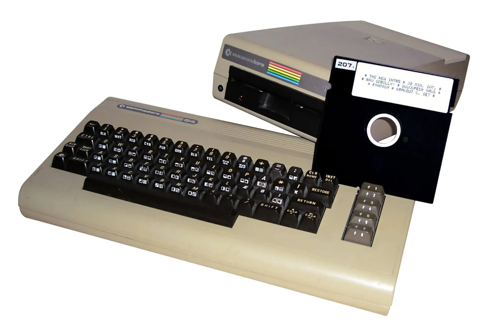

In this article, I'm going to dissect my entire Personal Knowledge Management (PKM) system and how it has evolved over the years.  

在本文中，我将剖析我整个个人知识管理（PKM）系统以及它在多年间的演变。  

I'll describe the information I keep, and where I currently store it.  

我将描述我保存的信息以及我目前存储它们的位置。  

I'll also cover the tools I use and why I chose them.  

我还将介绍我使用的工具以及选择它们的原因。  

I'll tell you how I capture/organize/share data and how everything fits together.  

我将告诉你我如何捕捉/组织/共享数据以及它们如何相互配合。  

I'll also try to describe the different processes I use to keep the system "under control".  

我还将尝试描述我使用的不同过程，以保持系统“可控”。

Like many other digital natives, my Personal Knowledge Management system has evolved a lot over the years.  

和许多其他数字原住民一样，我的个人知识管理系统多年来发展了很多。  

I've accumulated _many_ terabytes of data, and store my information all over the Internet.  

我积累了许多TB的数据，并将我的信息存储在互联网上的各个角落。  

A gazillion 0s and 1s spread across the entire planet.  

无数的0和1分布在整个地球上。  

That growth was organic, but I've made conscious _design_ choices over time to keep things manageable.  

这种增长是有机的，但我随着时间的推移做出了有意识的设计选择，以保持事物的可管理性。

In this article, I'll use the terms "personal data" and "personal knowledge management" (PKM) interchangeably.  

在本文中，我将互换使用“个人数据”和“个人知识管理”（PKM）这两个术语。  

Those are separate but closely related concepts, but it's not very important what I want to discuss with you.  

这些是独立但密切相关的概念，但我想要与你讨论的并不是很重要。  

So don't get mad right away 😂  

所以不要马上生气 😂

Take this content with a grain of salt.  

对这些内容持保留态度。  

My system is always in flux and that's the way it should remain. There's no perfect system.  

我的系统一直在不断变化，这也是它应该保持的方式。没有完美的系统。  

It's all very personal.  

这一切都非常个人化。  

Writing this article is also an opportunity for me to reflect on what still makes sense and what does not.  

写这篇文章也是给我一个机会来反思什么仍然有意义，什么不再有意义。

Alright, let's dive in!  

好了，让我们开始吧！

## **The early days  

早年的日子**

I started taking notes when I received my first computer, a [Commodore 64](https://en.wikipedia.org/wiki/Commodore_64). Before that, I didn't think much about writing things down.  

当我收到我的第一台电脑——Commodore 64时，我开始做笔记。在那之前，我从来没有考虑过写下来的事情。  

School only taught me how to write, but not why it was great to be able to!  

学校只教我如何写字，但没有告诉我为什么能够写字是多么伟大！



A Commodore 64 with its floppy drive.  

一台带有软盘驱动器的Commodore 64。  

Source: https://upload.wikimedia.org/wikipedia/commons/2/28/Commodore64withdisk.jpg  

来源：https://upload.wikimedia.org/wikipedia/commons/2/28/Commodore64withdisk.jpg

There I was, staring at a blinking cursor for the first time in my life. It was calling me.  

我盯着闪烁的光标看了很久，那是我生命中第一次面对它。它在呼唤着我。  

Hoping for me to write some things down. So I obliged. And I _loved_ it. Writing text and BASIC code was great, but I needed to save my data.  

希望我写下一些东西，所以我就答应了。而且我很喜欢。写文本和BASIC代码很棒，但我需要保存我的数据。  

When I turned the machine off, my text was gone. I had to start all over again. How frustrating!  

当我关闭机器时，我的文本就消失了。我不得不重新开始。多么令人沮丧啊！

I was lucky because I received a [floppy disk drive](https://en.wikipedia.org/wiki/Commodore_64_peripherals#Floppy_disk_drives) together with my computer. I had a bunch of [5 1/4 floppy disks](https://en.wikipedia.org/wiki/Floppy_disk#8-inch_and_5%C2%BC-inch_disks), each of which could store a whopping 360KB of data (!). To be honest, at the time it felt INFINITE.  

我很幸运，因为我得到了一台带有软盘驱动器的电脑。我有一堆5 1/4英寸软盘，每个盘可以存储360KB的数据（！）。说实话，在当时，它感觉就像是无限的。  

I could store seemingly endless amounts of text onto a single disk.  

我可以将看似无穷无尽的文本存储在一个盘片上。  

That is, until the dreaded "RAT-AT-AT-AT-AT" sound indicated that the data could not be read anymore.  

直到可怕的“RAT-AT-AT-AT-AT”声音表明数据无法再读取。

Gasp...

  

哇...

During those early days, I learned about saving files, naming them, etc. Those were good lessons.  

在那些早期的日子里，我学会了保存文件、命名等等。这些都是很好的教训。  

Proper data management starts with clear and consistent naming.  

正确的数据管理从清晰和一致的命名开始。  

I quickly realized that the names were critical for me to be able to retrieve the content later on.  

我很快意识到，这些名称对我以后能够检索内容至关重要。  

I made tons of mistakes and lost my journal more than once along the way.  

我犯了很多错误，一路上不止一次地丢失了我的日记。

Unfortunately, my Commodore is long gone, and I have no idea what happened to my old floppy disks.  

很不幸，我的Commodore早已不复存在，我也不知道我的旧软盘去了哪里。  

It would be fun to find those back.  

找回那些东西会很有趣。  

But the lessons I've learned during those early days are still relevant today.  

但是我在那些早期的日子里学到的经验至今仍然适用。

## **Early PC era  

早期的个人电脑时代**

Later on, around 1994, I got my first PC: an [Intel i486DX2](https://en.wikipedia.org/wiki/Intel_DX2). I was ~11 years old. That's when I started _exploring_ the Web and _collecting_ information. My uncle was into computers and taught me a lot.  

后来，大约在1994年，我得到了我的第一台个人电脑：一台Intel i486DX2。那时我大约11岁。那时我开始探索互联网并收集信息。我的叔叔对计算机很感兴趣，教了我很多东西。  

He was the one that got me interested in hacking.  

他是让我对黑客技术产生兴趣的人。  

At the time, I didn't realize that computers were new for most people on earth.  

当时，我没有意识到计算机对大多数人来说都是新鲜事物。  

My brain did not register the fact that the world was just leaving the "dark ages" (sorry for the older folks 😂).  

我的大脑没有意识到世界刚刚离开“黑暗时代”（对年长的人表示抱歉 😂）。

From that point on, I never stopped having fun with computers.  

从那时起，我就再也没有停止过与计算机玩乐。  

I launched and fiddled with every program I could put my hands on. I could never get enough.  

我启动并调试了我能找到的每个程序。我永远无法满足。  

At the time, paper magazines were super popular in France and Belgium.  

当时，在法国和比利时，纸质杂志非常流行。  

There were many publications dedicated to computers and video games. Some of those [can still be found online](https://www.abandonware-magazines.org/). I remember [PC Magazine](https://www.abandonware-magazines.org/affiche_mag.php?mag=75&page=3), PC Loisirs, [Player One](https://www.abandonware-magazins.org/affiche_mag.php?mag=32&page=1), Joypad, Nintendo Magazine, and others.  

有很多专门介绍计算机和电子游戏的出版物。其中一些仍然可以在网上找到。我记得有PC Magazine、PC Loisirs、Player One、Joypad、Nintendo Magazine等等。

Those magazines often included CDs filled with images, free programs, shareware, demos, and other goodies.  

这些杂志经常附带光盘，里面装满了图片、免费软件、共享软件、演示版和其他好东西。  

It was endless fun to read and explore those.  

阅读和探索这些杂志是无尽的乐趣。  

I started collecting the things I found interesting, without realizing I was _curating content_.  

我开始收集我觉得有趣的东西，但并没有意识到我正在策划内容。  

I took notes about which programs were cool, how to use them, I saved files I created using those, etc.  

我记下了哪些程序很酷，如何使用它们，我保存了使用这些程序创建的文件等等。  

At the time I simply created `notes.txt` files next to the programs.  

当时，我只是在程序旁边创建了 `notes.txt` 文件。

I tried all the possible tweaks I found and broke my computer a few times along the way.  

我尝试了所有我找到的可能的调整方法，有时候还会把电脑弄坏几次。  

But I didn't care, it was my personal laboratory.  

但我不在乎，那是我的个人实验室。  

I did not imagine for one second that I was actually orienting my future career already 😂  

我从来没有想过我实际上已经在引导我的未来职业了 😂 第二次意译结果： 当时，在法国和比利时，纸质杂志非常流行

I vividly remember a magazine called [La Bible des Tips](https://www.abandonware-magazines.org/affiche_mag.php?mag=120&num=2554&album=oui), which was a compendium of thousands of video game secrets, tips & tricks.  

我清晰地记得一本叫做《La Bible des Tips》的杂志，它是一本收录了成千上万个视频游戏秘籍、技巧和窍门的汇编。  

I would create text files with those I found useful.  

我会创建包含我认为有用的秘籍的文本文件。  

I had countless files on my computer, and at the time it was probably an incredible mess.  

我电脑上有无数个文件，那时可能是一团糟。

## **Internet at home, a world-changing experience  

家里有互联网，改变了整个世界的经历**

Somewhere between 1994 and 1997, I finally had access to the Internet at home (I remember the joy!).  

在1994年至1997年之间的某个时候，我终于在家里接入了互联网（我记得当时的喜悦！）。  

Before that, I had to go to my uncle's to visit Websites (I went over there almost every single day).  

在那之前，我必须去我叔叔那里上网（我几乎每天都去那里）。

By that time, I had become really introverted and was super shy.  

那时候，我变得非常内向，非常害羞。  

I preferred the company of computers.  

我更喜欢和电脑为伴。  

Those were predictable, fun, fascinating, and everything felt way safer behind my screen.  

那些都是可预测的、有趣的、迷人的，而且在屏幕后面一切都感觉更安全。

I had two passions in life: computers and video games. I was an addict.  

我生活中有两个热爱：电脑和视频游戏。我是个上瘾者。  

Every minute of free time was spent in front of a screen (Don't tell my kids... 😂).  

每一分钟的空闲时间都花在了屏幕前（别告诉我的孩子们... 😂）。  

Everything in my life was centered around learning more about computers, and collecting/playing video games.  

我生活中的一切都围绕着学习更多关于计算机的知识，以及收集/玩电子游戏。

I collected paper magazines, programs, tried all the Linux distributions I could put my hands on, and downloaded all sorts of things from the Internet.  

我收集纸质杂志、程序，尝试了所有我能找到的Linux发行版，并从互联网上下载了各种各样的东西。  

I collected images, game solutions taken from Jeuxvideo.com, [GameFAQs](https://gamefaqs.gamespot.com/), PC game cracks from [GameCopyWorld](https://gamecopyworld.com/), manga scanlations downloaded via IRC (DCC transfers FTW!), and god knows what else I found on FTP servers, newsgroups, etc.  

我收集图片，从Jeuxvideo.com、GameFAQs获取游戏解决方案，从GameCopyWorld获取PC游戏破解补丁，通过IRC下载漫画扫描版（DCC传输太棒了！），还有神知道我从FTP服务器、新闻组等地方找到了什么其他东西。

I also wrote a lot, even if I kept it all to myself back then.  

我也写了很多东西，尽管当时我都是自己保存着。

At the time, I started developing strong opinions about the importance of free access to knowledge, ideas, and culture.  

那时候，我开始对自由获取知识、思想和文化的重要性形成了强烈的观点。  

I discussed a lot about this on IRC. I cared about those conversations, so I kept copies of the logs.  

我在IRC上经常讨论这个问题。我很在意这些对话，所以我保存了聊天记录的副本。

And I did the same with my other online conversations. I kept _everything_. I still have my old ICQ logs 😂.

  

我对其他的在线对话也是如此。我保存了一切。我现在还保留着我旧的ICQ聊天记录 😂。

I quickly accumulated TONS of data and had no choice but to develop a system to organize my information.  

我很快积累了大量的数据，别无选择，只能开发一个系统来组织我的信息。  

I developed naming conventions for files and folders, and learned to love the greatest date format: `YYYY-MM-DD`.  

我制定了文件和文件夹的命名规范，并且学会了热爱最伟大的日期格式： `YYYY-MM-DD` 。

Disk space was a real problem at the time. It was a constant struggle to get everything to fit.  

磁盘空间当时是一个真正的问题。要让所有东西都适应进去是一场持续的挑战。  

Luckily the ZIP and RAR formats were there to help.  

幸运的是，ZIP和RAR格式帮了大忙。  

It was a time when Windows users needed to use Defrag for hours and hours.  

那时候，Windows用户需要花上几个小时来进行碎片整理。  

I remember spending so much time looking at the tiny blocks moving around... Sigh 😂  

我记得我花了很多时间盯着那些小方块移动... 唉 😂

Over time, hard disk drives were able to store more and more data. But those weren't cheap.  

随着时间的推移，硬盘能够存储越来越多的数据。但那些并不便宜。  

Luckily, my uncle had a CD burner very early on. It was so cool!  

幸运的是，我叔叔早早就有了一个CD刻录机。太酷了！

## **Burning CDs for fun and profit  

刻录CD，既有趣又有利可图**

CDs were cool, but CD burners were next level. Once I got mine, I discovered [Nero Burning ROM](https://en.wikipedia.org/wiki/Nero_Burning_ROM) and fell in love with it. I started creating my own CDs as magazines did.  

CD很酷，但CD刻录机更高级。一旦我有了自己的刻录机，我就发现了Nero Burning ROM并爱上了它。我开始像杂志一样制作自己的CD。  

I called those "PlayZone Rxy". I still have the 20 or so first releases.  

我把它们称为“PlayZone Rxy”。我现在还保留着最初的20多个版本。  

I burned all the cool utilities, demos, hacks, and fun things I found.  

我刻录了所有我找到的酷工具、演示、黑客和有趣的东西。  

I also created my own autorun.exe, which would display a nice menu listing the contents. Fun times.  

我还创建了自己的autorun.exe，它会显示一个漂亮的菜单列出内容。那时候真是好玩。  

I managed to sell a number of copies to other kids at school.  

我成功地卖出了一些副本给学校里的其他孩子们。  

It was my first successful business I guess? 😂  

这可能是我第一个成功的生意吧？ 😂

I remember the folder structure I used for those CDs:  

我记得我当时用于这些光盘的文件夹结构：

```
* Music
* Notes
* Software
  * Audio
  * Games
    * PC
      * <Game Name>
        * Notes
        * Savegames
    * PSX
      * Tools
      * Cracks
      * FAQs
  * Internet
    * Communication
    * Downloads
  * OS
  * System
    * Drivers
    * Tools
  * Utilities
  * Video
  * Writing
```

Structure brought ease of use and reduced the mental burden of knowing where to find what I needed.  

这种结构带来了使用的便利性，减轻了知道在哪里找到所需内容的心理负担。  

And the naming scheme made everything _beautiful_. I slowly became _obsessed_ with data organization.  

而且命名方案使一切变得美丽。我慢慢地对数据组织变得痴迷起来。

## **The making of a data hoarder  

一个数据收藏者的诞生**

Between 1997 and 2000, I continued burning tons of CDs.  

在1997年至2000年间，我继续刻录大量的光盘。  

I started making copies of PSX games and music albums.  

我开始复制PSX游戏和音乐专辑。

I collected literally thousands of manga chapters. Most are probably nowhere to be found these days.  

我收集了成千上万的漫画章节。大部分可能现在已经找不到了。  

Those were "scanlated" (i.e., scanned and translated) from Japanese to English by hardcore fans.  

那些是由狂热的粉丝将日语翻译成英语的“扫描翻译”（即扫描和翻译）。

To organize my Mangas, I used a simple but effective file structure.  

为了整理我的漫画，我使用了一个简单但有效的文件结构。  

At the top level, I simply had a folder with a letter:  

在顶层，我只有一个带有字母的文件夹：

```
#
A
B
C
...
```

Inside each of those, I had one folder per series, with metadata inside brackets: `<Name> [<Metadata>]`.  

在每个文件夹中，我有一个系列的文件夹，括号内有元数据： `<Name> [<Metadata>]` 。  

The metadata either listed the chapters/volumes I had or indicated that I had the complete collection (for ended series).  

元数据要么列出我拥有的章节/卷数，要么表示我拥有完整的系列（对于已完结的系列）。

It also included the language. Some examples:

  

它还包括语言信息。以下是一些例子：

```
Captain Tsubasa [c001-c114 EN]
Kenshin [COMPLETE EN]
Ranma [01-15 FR]
```

Organizing those by letter was useful for multiple reasons:  

按字母进行组织有多个好处：

-   If I didn't have enough space left, I could move a letter or two to a different hard drive  
    
    如果剩余空间不足，我可以将一个或两个字母移动到另一个硬盘上
-   The operating system never struggled because there were too many sub-folders and files  
    
    操作系统不会因为子文件夹和文件太多而出现问题
-   It was simpler and faster to find my way around  
    
    找到自己需要的内容更简单更快速

Within each folder, I made sure to correctly name all files: `<Name> <Number>.cbr`.  

在每个文件夹中，我确保正确命名了所有的文件： `<Name> <Number>.cbr` 。

If I were to start over, I would probably use [something like this](https://github.com/Daiz/manga-naming-scheme). But it didn't exist back then.  

如果我重新开始，我可能会使用类似这样的东西。但那时候还不存在。

Organizing thousands of mangas like that represented a _crazy_ amount of work. I did it meticulously for hundreds of hours.  

像那样整理成千上万的漫画代表了大量的工作。我花了数百个小时一丝不苟地完成了这项工作。  

I suppose it was a sort of obsessive-compulsive disorder.  

我想这可能是一种强迫症。  

I couldn't stand looking at folders and files that were not properly named/organized.  

我无法忍受看到没有正确命名/组织的文件夹和文件。  

Apparently, I was one of a kind because most files I've seen on other people's computers were so messy that I didn't even want to touch those).  

显然，我是独一无二的，因为我在其他人的电脑上看到的大多数文件都是如此混乱，以至于我甚至不想碰它们。

Around that time I also started maintaining endless lists.  

在那个时候，我还开始维护无尽的清单。  

I had a complete inventory of all my stuff.  

我有一个完整的清单，列出了我所有的东西。  

Thinking about that makes me feel pretty bad, although I know it partly led to who I am today: a **very** patient, organized, and meticulous person.  

想到这些让我感到很糟糕，尽管我知道这在一定程度上导致了我今天的样子：一个非常耐心、有条理和一丝不苟的人。

Aside from that, I also collected comic books, books, music (back then [Napster](https://en.wikipedia.org/wiki/Napster) was king), emulators & ROMs (oh dear [GBATemp](https://gbatemp.net/)), PSX games (Thank you [Paradox](https://en.wikipedia.org/wiki/Paradox_(warez))), PC games, operating systems, etc.  

除此之外，我还收集漫画书、书籍、音乐（那时候Napster是王者）、模拟器和ROM（哦，亲爱的GBATemp）、PSX游戏（谢谢Paradox）、PC游戏、操作系统等等。

I defined specific folder structures and naming conventions for each type of data.  

我为每种类型的数据定义了特定的文件夹结构和命名约定。  

I clearly became a data hoarder.  

我显然成了一个数据囤积者。  

I was just eager to "get it all", hoping that I could consume it all someday, somehow.  

我只是渴望“拥有一切”，希望有一天能够消化它们。  

Pretty naive ambition if you ask me 😂  

如果你问我，这是一个相当天真的野心 😂

Life didn't get any better at school... So computers, games, and data hoarding were my escape hatch from reality.  

在学校里，生活并没有变得更好...所以电脑、游戏和数据囤积成了我逃离现实的出口。

## **Bigger and cheaper disks, faster and faster Internet access  

越来越大、越来越便宜的硬盘，越来越快的互联网接入**

Over time, disks became larger and larger. Prices also dropped.  

随着时间的推移，硬盘变得越来越大。价格也下降了。  

The limits and constraints I had before slowly vanished. I stored even more data.  

我之前的限制和约束逐渐消失了。我存储了更多的数据。  

Soon after 2000, I had a DVD recorder and 7–8 hard disk drives still connected to my PC.  

2000年后不久，我有了一个DVD录制机和7-8个硬盘驱动器，仍然连接在我的电脑上。  

I burned tons of CDs and DVDs that I kept in numbered spindles.  

我烧录了大量的CD和DVD，它们都放在编号的盘子里。  

Every single one of those had a label with a unique identifier (e.g., DVD 067).  

每一张都有一个带有唯一标识符的标签（例如，DVD 067）。  

And that matched an entry in my lists where I described the content.  

这与我列表中描述内容的条目相匹配。

Console games had beautiful covers. My room was Ali Baba's cave for computer and gaming nerds.  

游戏机的封面非常漂亮。我的房间就像计算机和游戏迷的阿里巴巴洞穴。  

But I kept it all to myself. It was my secret kingdom.  

但我把这一切都独自留给自己。这是我的秘密王国。

Around the time I got broadband Internet access, online piracy became endemic.  

在我获得宽带互联网接入的时候，网络盗版变得非常普遍。  

There were endless sources of content. That's when I became a fan of cinema.  

有无尽的内容来源。那时我成为了电影的粉丝。  

I watched 2-4 films each day.  

我每天看2-4部电影。  

I watched more and more anime and discovered Japanese and Korean movies. I couldn't get enough.  

我越来越多地观看动漫，并发现了日本和韩国的电影。我无法满足。

And again, I collected the data. I kept the movies, the TV shows, the documentaries. _Everything_. It was tough for me to just "let go".  

而且，我收集了这些数据。我保留了电影、电视节目、纪录片。一切都舍不得放手。  

Once I had watched a good movie, I had to keep it around, like a trophy, just in case I would want to watch it again later.  

有一次我看了一部好电影，我就像把它当作奖杯一样留下来，以防我以后还想再看一遍。

I had clear naming conventions for everything. For movies: `<Engligh name> (YYYY) (EN|FR|JP|...) (<Quality>)`. For TV series: `<English name>\Sxy_<EN|FR|JP|...>`. Consistency was essential for me to be able to stay sane.  

我对一切都有清晰的命名规范。对于电影： `<Engligh name> (YYYY) (EN|FR|JP|...) (<Quality>)` 。对于电视剧： `<English name>\Sxy_<EN|FR|JP|...>` 。对我来说，保持一致性是保持理智的关键。  

It also made it much simpler to automate various operations.  

这也使得自动化各种操作变得更加简单。

These were the days of QuickTime, RealPlayer, Windows Media Player, and all that jazz. Fortunately, [VLC](https://www.videolan.org/vlc/) came to save the day 🎉  

那时候是QuickTime、RealPlayer、Windows Media Player等等的时代。幸运的是，VLC来拯救了这一天🎉

I also explored Photoshop (for 2D) and Blender (for 3D), and started collecting digital assets.  

我还探索了Photoshop（用于2D）和Blender（用于3D），并开始收集数字资产。  

Patterns, backgrounds, textures, models, plugins, examples, etc. Even more data.  

图案、背景、纹理、模型、插件、示例等等。数据更多了。

And there's more. I also collected music.  

还有更多。我还收集音乐。  

I explored many genres and discovered that I enjoyed listening to various kinds of music.  

我探索了许多音乐流派，发现我喜欢听各种类型的音乐。  

From classical to reggae, dance to metal, and blues to French rap (to name but a few).  

从古典音乐到雷鬼，从舞曲到金属，从布鲁斯到法国说唱（仅举几例）。  

Again I spent time organizing everything properly. This was long before Spotify came along.  

我又花了很多时间来正确组织一切。这是在Spotify出现之前的很久以前。  

Those were the days of [Amarok](https://amarok.kde.org/), Winamp, Clementine, etc. I collected MP3 and FLAC files.  

那些年，Amarok、Winamp、Clementine等软件盛行。我收集了许多MP3和FLAC文件。  

I actually never heard the difference, but I still wanted to get the FLAC versions 😂.  

其实我从来没有听出它们之间的区别，但我还是想要FLAC版本😂。

For music I used the following naming convention:  

对于音乐，我使用了以下的命名规则：

```
<Letter>
  <Artist>
    <YYYY> - <Artist> - <Album> (<FORMAT>)
      <Artist> - <Album> - <Track Number> - <Song>
```

And again, as you can imagine, harmonizing the names was tough. And there was more.  

可以想象，统一命名是一项艰巨的任务。而且还有更多的问题。  

Sound also needed to be normalized. Fortunately, there were tools to help with that.  

声音也需要进行归一化处理。幸运的是，有一些工具可以帮助解决这个问题。

Later on, I became involved in various online forums and hosted/administered some myself.  

后来，我参与了一些在线论坛，并自己托管和管理了一些论坛。  

I remember that PhpBB was all the rage at the time.  

我记得当时PhpBB非常流行。  

I discussed movies, TV shows, and anime with my community, sharing discoveries, ideas, new releases, subtitles, etc.  

我和社区成员们讨论电影、电视剧和动漫，分享发现、想法、新作品和字幕等。

I backed up the MySQL databases regularly to make sure I could restore the service in case of an issue.  

我定期备份MySQL数据库，以确保在出现问题时能够恢复服务。  

Again this was a good learning opportunity as it taught me key principles about data backup and recovery.  

这也是一个很好的学习机会，让我了解了关于数据备份和恢复的关键原则。  

I of course also had to organize and store those backups ;-)  

我当然也要组织和存储这些备份 ;-)

I paid _a lot_ of attention to backups.  

我非常重视备份。  

I made sure to save the most important bits regularly: my books, bookmarks, mangas, music, personal notes, and Websites.  

我确保定期保存最重要的内容：我的书籍、书签、漫画、音乐、个人笔记和网站。  

I couldn't stand the idea of losing my treasures.  

我无法忍受失去我的珍宝的想法。  

In real life, I had so few things and people I was attached to that I probably transferred the attachment I longed for into the digital world... Who knows!  

在现实生活中，我所依恋的东西和人很少，所以我可能把我渴望的依恋转移到了数字世界中...谁知道呢！  

Backups are a complex topic so I won't dive into that here.  

备份是一个复杂的话题，所以我不会在这里深入讨论。  

But if you're curious, then I'll share some details about my current system.  

但如果你好奇的话，我可以分享一些关于我的当前系统的细节。

Aside from all that, I maintained a personal journal.  

除此之外，我还保持了一个个人日记。  

Writing was always a way for me to express what I couldn't otherwise.  

写作对我来说一直是一种表达我无法用其他方式表达的方式。  

I used raw text files (one per day <yyyy-mm-dd Journal.txt), and it worked great.  

我使用原始文本文件（每天一个文件  

I still have those old journal entries safe and sound.  

我仍然安全地保存着那些旧的日记条目。

## **Bookmarks  

书签**

I always had a huge collection of bookmarks (many of which I still haven't explored to this day 😂).  

我一直有一个庞大的书签收藏（其中许多我至今仍未探索😂）。  

I discovered many interesting sites through StumbleUpon (oh the joy of exploring the Web! ❤️).  

通过StumbleUpon，我发现了许多有趣的网站（探索网络的乐趣啊！❤️）。  

Over the years I used different approaches to manage my bookmarks.  

多年来，我使用了不同的方法来管理我的书签。  

I used Delicious (RIP), XMarks (RIP), and others.  

我使用过Delicious（已经停止运营），XMarks（已经停止运营）和其他工具。  

Nowadays, I've decided to simplify my life, and just let Google take care of my bookmarks.  

如今，我决定简化我的生活，让Google来管理我的书签。  

I'm privacy-conscious, but I accept the risks and tradeoffs.  

我注重隐私，但我接受风险和权衡。  

Google knows a lot about me (probably more than I do 😂).  

Google对我了解很多（可能比我自己还多😂）。  

They've got my mail, my browsing and search history, my position.  

他们知道我的邮件、浏览和搜索历史、我的位置。  

Bookmarks are just a drop in the ocean in comparison.  

书签只是大海中的一滴水。

The structure of my bookmarks has been very stable over the years:  

多年来，我的书签结构一直非常稳定：

-   Fun: Anything relaxing (I check those out when I'm bored — Never)  
    
    娱乐：任何放松的事物（当我无聊时会查看，但几乎从不）
-   Future: Stuff I'm curious about but don't have a buffer for (i.e., not prioritized)  
    
    未来：我感兴趣但没有时间去看的东西（即没有优先级）
-   Games: Links to board game rules I'm busy learning, Kickstarter campaigns, etc  
    
    游戏：我正在学习的棋盘游戏规则链接，Kickstarter 众筹等等
-   Home: Links to various self-hosted Web services running at home (NAS Admin UI, network appliances, etc)  
    
    家庭：链接到我在家中运行的各种自托管 Web 服务（NAS 管理界面，网络设备等）
-   News: What I avoid looking at these days  
    
    新闻：我现在避免看的东西
-   Now: Anything that is currently on the top of my mind  
    
    现在：任何目前我最关注的事物
-   Open: Links that I open multiple times a day (mail, task list, social media, HackerNews, etc)  
    
    打开：我每天打开多次的链接（邮件，任务列表，社交媒体，HackerNews 等）
-   Projects: One sub-folder per project, with links to the project's homepage, GitHub repositories, etc  
    
    项目：每个项目一个子文件夹，包含项目主页、GitHub 仓库等链接
-   Utils: Utilities I need regularly (e.g., Unsplash, calculators, translation tools, grammar checkers, etc)  
    
    工具：我经常使用的实用工具（例如Unsplash、计算器、翻译工具、语法检查器等）
-   Work: Anything related to my work, freelancing clients, etc  
    
    工作：与我的工作、自由职业客户等相关的一切

I started using RSS feeds and Google Reader around 2005–2006. I started collecting interesting feeds when I started my IT studies.  

我开始在2005-2006年左右使用RSS订阅和Google Reader。当我开始我的IT学习时，我开始收集有趣的订阅源。  

Most cool Websites and blogs provided an RSS feed.  

大多数酷炫的网站和博客都提供了RSS订阅。

I started following tons of people who wrote interesting things about IT, software development, technology, and science.  

我开始关注许多写有关IT、软件开发、技术和科学等有趣内容的人。我整天读着Jeff Atwood、Joel Spolsky、Steve Yegge、John Perry Barlow、Dave Winer、David Heinemeier Hansson、Bruce Schneier、Ward Cunningham、Chet Haase、Romain Guy等人的文章。他们是我不知道的导师。  

I started reading all day long the likes of [Jeff Atwood](https://en.wikipedia.org/wiki/Jeff_Atwood), [Joel Spolsky](https://en.wikipedia.org/wiki/Joel_Spolsky), [Steve Yegge](https://en.wikipedia.org/wiki/Steve_Yegge), [John Perry Barlow](https://en.wikipedia.org/wiki/John_Perry_Barlow), [Dave Winer](https://en.wikipedia.org/wiki/Dave_Winer), [David Heinemeier Hansson](https://dhh.dk/), [Bruce Schneier](https://en.wikipedia.org/wiki/Bruce_Schneier), [Ward Cunningham](https://en.wikipedia.org/wiki/Ward_Cunningham), Chet Haase, Romain Guy, and so many others. They were my mentors without knowing.  

这就是互联网的美妙之处。  

That's the beauty of the Web.  

Google Reader在我的生活中非常重要。

Google Reader was really important in my life.  

它是我持续阅读我关心的内容的解决方案。  

It was the solution for me to consistently read things I cared about.  

I had my list of interesting sources, ordered by importance, and I _chose_ what I wanted to read. I read [Slashdot](https://slashdot.org/), [LifeHacker](https://en.wikipedia.org/wiki/Lifehacker), [Ars Technica](https://arstechnica.com/), [Hackaday](https://hackaday.com/), etc.  

我有一个按重要性排序的有趣来源列表，我选择了我想要阅读的内容。我读了Slashdot、LifeHacker、Ars Technica、Hackaday等等。

There were countless interesting blogs to follow.  

有无数有趣的博客可以关注。  

Blogs about tech, photography, music, sciences, nature, writing, etc.  

有关科技、摄影、音乐、科学、自然、写作等等的博客。  

An endless source of discoveries ✨. When I started working, I couldn't stop printing blog articles.  

这是一个无尽的发现之源✨。当我开始工作时，我无法停止打印博客文章。  

My bag was full of those. I read non-stop during my train commutes and learned a ton.  

我的包里装满了这些文章。我在坐火车的时候不停地阅读，学到了很多东西。

I still use RSS nowadays even if there are way fewer sources than in the past.  

即使现在的来源比过去少得多，我仍然使用RSS。  

I currently use Feedly as my aggregator.  

我目前使用Feedly作为我的聚合器。

What I love about RSS is the fact that it makes it a breeze to avoid missing posts, but more importantly, the fact that it _helps prioritize content consumption_.  

我喜欢RSS的原因是它让我轻松地避免错过文章，更重要的是，它帮助我优先消费内容。  

By having an organized list of sources and prioritizing those, I can remain mindful about of I want to explore and consume first.  

通过有组织地列出来源并优先考虑它们，我可以保持对我想要探索和消费的内容的关注。  

Thanks to RSS I've thus switched from a random/serendipity-based content consumption approach to a systematic one.  

多亏了RSS，我从随机/偶然的内容消费方式转变为系统性的方式。

## **Passwords and mailboxes galore  

密码和邮箱的海量**

As the Web expanded, the number of credentials exploded.  

随着互联网的扩张，凭证的数量也急剧增加。  

In the beginning, I did what everybody did, I reused a few key passwords.  

起初，我像每个人一样，重复使用了几个关键密码。  

But I learned from my mistakes and was taught better while exploring Linux.  

但是通过探索Linux，我从错误中吸取了教训并得到了更好的教导。  

I cannot thank enough the people who worked on the outstanding [documentation of ArchLinux](https://wiki.archlinux.org/). It was (and remains) a real gold mine of knowledge.  

我无法感谢那些为ArchLinux出色文档工作的人们。它是（并仍然是）一个真正的知识宝库。

I started using [KeePass](https://keepass.info/) early on. I configured a password generator and started using it _systematically_. Different credentials for each Website, and even different e-mail addresses for different purposes.  

我早早开始使用KeePass。我配置了一个密码生成器，并开始系统地使用它。每个网站都有不同的凭证，甚至为不同的目的使用不同的电子邮件地址。  

I had my main mail address under a pseudonym, a secondary one using my real name, yet another one for all the Websites I didn't care about (i.e., a spam box), and I also used throwaway addresses from time to time.  

我有一个主要的邮件地址使用化名，一个次要的邮件地址使用真实姓名，还有一个用于我不关心的所有网站的邮件地址（即垃圾邮件箱），我也会不时使用一次性地址。

Of course, my KeePass database had to be organized as well.  

当然，我的KeePass数据库也需要有组织。  

I created different folders for different purposes:  

我为不同的目的创建了不同的文件夹：

-   Domains: FTP and database credentials for my domains  
    
    域名：我的域名的FTP和数据库凭证
-   eMail: e-mail credentials  
    
    eMail: 电子邮件凭证
-   Games: CD Keys (also a remnant of the past!) and online game accounts  
    
    Games: CD密钥（也是过去的遗留物！）和在线游戏账户
-   Home: credentials for home appliances (routers, modems, etc)  
    
    家庭：家用电器（路由器、调制解调器等）的凭证
-   Banking  
    
    银行
-   Identity Card pin codes  
    
    身份证密码
-   Internet: credentials for most online services  
    
    互联网：大多数在线服务的凭证
-   Computers: Linux, Windows, etc  
    
    计算机：Linux、Windows等
-   Phones: SIM card PIN, PUK etc  
    
    手机：SIM卡PIN码、PUK等
-   ...

To this day KeePass remains my go-to solution for passwords, even if it suffers from really bad UI/UX.  

直到今天，KeePass仍然是我首选的密码解决方案，即使它的用户界面/用户体验非常糟糕。  

It's not perfect, but it works great, and it's safe enough.  

它并不完美，但它运行得很好，而且足够安全。

One thing I should pay more attention to is reviewing and deleting old accounts I don't need anymore.  

我应该更加注意的一件事是审查和删除我不再需要的旧账户。

I use multiple KeePass databases. Usually one per major project/organization.  

我使用多个KeePass数据库，通常每个主要项目/组织一个。  

I don't want all my eggs in the same basket.  

我不希望把所有的鸡蛋放在一个篮子里。  

There's more to the security aspect, but I'll tell you about that another day.  

安全方面还有更多内容，但我会在另一天告诉你。

For e-mail, I used Thunderbird for a long time with IMAP but finally switched over to the Web and mobile apps of GMail.  

对于电子邮件，我长时间使用Thunderbird和IMAP，但最终转而使用GMail的Web和移动应用程序。  

As I sent and received more and more e-mails, I also needed to put some order in there.  

随着我发送和接收的电子邮件越来越多，我也需要对其进行一些整理。  

I used folders, labels, filters, and rules to organize everything.  

我使用文件夹、标签、过滤器和规则来组织一切。  

I created folders for Conferences, Games, Job listings, Meetups, Newsletters, Videos, etc.  

我创建了会议、游戏、职位列表、聚会、通讯、视频等文件夹。  

Most importantly, I created rules to automate whatever I could: mark items as read, automatically delete some, move others here and there, and even forward stuff between different mailboxes, because why not.  

最重要的是，我创建了规则来自动化尽可能多的事情：标记项目为已读，自动删除一些项目，将其他项目移动到不同的邮箱中，甚至在不同的邮箱之间转发邮件，因为为什么不呢。

I still rely a lot on this system.  

我仍然非常依赖这个系统。  

It helps me avoid the noise and makes it easier for me to remain at inbox zero.  

它帮助我避免噪音，让我更容易保持收件箱清零。  

I just added new e-mails to the mix.  

我刚刚添加了新的电子邮件。  

Fortunately, the evolution of GMail has made switching between accounts easier over time.  

幸运的是，GMail的发展使得在不同账户之间切换变得更加容易。

Mailbrew is something I should really look into to reduce the clutter and actually read more of the newsletter I'm subscribed to.  

Mailbrew是我应该认真考虑的东西，可以减少杂乱，并且实际上更多地阅读我订阅的新闻简报。

## **Getting Things Done: Staying on top of my time with calendars, task managers, and time trackers  

完成任务：通过日历、任务管理器和时间追踪器掌控我的时间**

When I joined "the workforce", I introduced new tools and systems into my life. Once I read [Getting Things Done](https://amzn.to/3rJyvhg) by David Allen, I started using Google Calendar, and never looked back.  

当我加入"职场"时，我将新的工具和系统引入了我的生活。在读了David Allen的《完成任务》之后，我开始使用Google日历，再也没有回头。

I use different calendars for different purposes.  

我为不同的目的使用不同的日历。  

I have calendars for the family, birthdays, public holidays, work, side projects, vacations, content publication, etc.  

我有家庭日历、生日日历、公共假期日历、工作日历、副业项目日历、假期日历、内容发布日历等等。  

Multiple ones are shared with other people.  

其中有多个与其他人共享。  

I'll write an article about how I use my calendar more in detail another time.  

我会在另一个时间写一篇关于我如何更详细地使用我的日历的文章。

Next to that I also tested all the task managers I could get my hands on. I used and enjoyed [Remember The Milk](https://en.wikipedia.org/wiki/Remember_the_Milk) (RTM) for the longest time. After trying many others I finally settled on Trello.  

接下来，我还测试了所有我能找到的任务管理器。我曾经使用并喜欢使用Remember The Milk（RTM）很长一段时间。尝试了许多其他的任务管理器后，我最终选择了Trello。

I use one board per major project plus a personal one.  

我为每个重要的项目和个人事务都使用一个看板。  

In each of those boards, I use different columns.  

在每个看板中，我使用不同的列。  

There's always a generic one called "Backlog", and others with endless lists of ideas and things to explore in the future.  

总是有一个通用的列叫做“待办事项”，还有其他无尽的想法和未来要探索的事物的列表。  

More importantly, I use temporal columns to prioritize and organize my work (e.g., this year, this month, this week, today).  

更重要的是，我使用时间列来优先和组织我的工作（例如，今年、本月、本周、今天）。  

It works wonders and removes a lot of guesswork about what to do next.  

这真是太神奇了，它消除了很多关于下一步该做什么的猜测。

I've been using Clockify for time tracking in order to remain realistic about the costs of my projects and to help me prepare my invoices.  

我使用Clockify来跟踪时间，以便对我的项目成本保持现实，并帮助我准备发票。

I slowly became a productivity nut, to the point of burning out.  

我逐渐成为一个追求高效的狂热者，甚至快要烧脑了。  

Since then I've learned to love zen productivity.  

从那时起，我学会了热爱禅宗式的高效工作。  

I still work just as hard, but I also take care of myself.  

我仍然努力工作，但也照顾好自己。  

That's why I liked my friend André's idea about building [a sane productivity app](https://focusd.app/).  

这就是为什么我喜欢我朋友安德烈的想法，他提出要建立一个理智的生产力应用程序。

## **Mind mapping to document and visualize everything  

思维导图用于记录和可视化一切**

I became obsessed with mind maps.  

我对思维导图着迷了。  

I used those document my processes, my organization system, my naming schemes, my PKM system, my projects, etc.  

我用它们来记录我的流程、组织系统、命名方案、个人知识管理系统、项目等等。

For many years I also used a mind map to keep track of my long-term goals in life.  

多年来，我还用思维导图来追踪我在生活中的长期目标。  

In it I explored what I wanted to learn, what I wanted to achieve, places I wanted to visit, etc.  

在这个导图中，我探索了我想学习的内容、想要实现的目标、想要去的地方等等。  

I followed David Allen's advice and used different branches of the map to explore different aspects of my life at different time horizons (e.g., this year, within 3 years, within 5, within 10).  

我遵循了大卫·艾伦的建议，使用导图的不同分支来探索不同时间范围内我生活的不同方面（例如，今年、三年内、五年内、十年内）。  

I still use that mind map but now combine it with other tools and techniques to define and review my personal plans.  

我仍然使用那个思维导图，但现在结合其他工具和技术来制定和审查我的个人计划。

## **Adulting, family budget, and filing papers  

成年、家庭预算和文件整理**

The transition to adulting happened faster than I had anticipated.  

成年的转变比我预期的要快。  

Before I realized it, I transitioned from playing Quake and Diablo to working, having kids, and building a home for our family.  

在我意识到之前，我从玩《雷神之锤》和《暗黑破坏神》转变为工作、养育孩子和为我们的家庭建造一个家。  

Along with adulting came the boring parts: tons of stupid paperwork created by stupid administrations desperate to remain in a paper-based world.  

随着成年人的到来，带来了一些无聊的事情：大量由愚蠢的行政机构创建的愚蠢文件工作，他们迫切希望保持纸质世界。  

It was tough for me to accept that IT did not change the world any faster 😂  

对我来说很难接受的是，IT并没有让世界变得更快 😂

But my organized mind helped.  

但是我的有条理的思维帮了我很多。  

My wife and I started scanning and filing all documents, getting rid of the paper as soon as we legally could.  

我和妻子开始扫描和归档所有文件，尽快摆脱纸质文件。  

We had to keep some (grr) like warranty tickets, official documents, diplomas, and the like.  

我们不得不保留一些（呃），比如保修票、官方文件、毕业证书之类的。  

But we threw away the rest.  

但是其他的我们都扔掉了。

I started adulting around 2007-2008. It forced me to create one more organizational system; the "documents" folder.  

我大约在2007-2008年开始成年。这迫使我创建了另一个组织系统；“文件”文件夹。  

I organized it like this:  

我按照以下方式进行组织：

```
Animals
Banks
  <Bank Name>
    <YYYY>
      <YYYY-MM-DD> - Document description
Budget
  <YYYY>
Genealogy
Home
Insurances
  ...
Inventory
Invoices
Manuals
Persons
  <Name>
    Health
    Studies (e.g., files, projects, diplomas, etc)
    Work (e.g., CV, work-related documents, etc)
    ...
Service providers
Taxes
  <YYYY>
Tickets
  <YYYY-MM-DD> - Event
Writing
  Journal
...
```

Our family budget was defined in [YNAB](https://en.wikipedia.org/wiki/YNAB). The [methodology behind YNAB](https://www.youneedabudget.com/the-four-rules/) helped us a lot.  

我们的家庭预算在YNAB中定义。YNAB背后的方法论对我们帮助很大。

Next to that I started investing, so I also needed to keep track of my investments, the costs involved, when I bought what, for how much, when I sold, how much profit/loss I made, etc.  

接下来，我开始进行投资，所以我也需要跟踪我的投资，包括涉及的成本、购买时间、购买价格、出售时间、盈亏等等。  

That information became part of my personal Wiki, along with tons of other things.  

这些信息成为了我的个人维基的一部分，还有很多其他的东西。

## **How to organize 100K photos  

如何组织10万张照片**

As soon as I got into photography, I knew I was in trouble. It was one more area to organize.  

一旦我开始摄影，我就知道我有麻烦了。这又是一个需要组织的领域。  

And once you start with photography, data accumulates at a rapid pace (video is worse, indeed 😂).  

而且一旦你开始摄影，数据就会以惊人的速度积累（视频更糟糕，确实是这样 😂）。

My organization system for photographs is pretty straightforward:  

我的照片组织系统非常简单：

```
_Inbox
_Shared
<YYYY>
  <YYYY-MM-DD - <Event description>
```

And that's about it. Nothing fancy, but that's all I need, even with 100K+ pictures!  

就是这样。没有花哨的东西，但这已经足够了，即使有10万张以上的照片！  

With tools such as Adobe Lightroom, I can directly import from an SD card to the catalog, and move files to my "photos" folder with the right naming scheme ❤️  

借助像Adobe Lightroom这样的工具，我可以直接从SD卡导入到目录中，并按照正确的命名方案将文件移动到我的“照片”文件夹中 ❤️

Today I back up all my pictures multiple times:  

如今，我多次备份所有的照片：

-   I have a backup on my NAS (second disk)  
    
    我在我的NAS上备份（第二个硬盘）
-   I have an online backup along with the rest of my data  
    
    我有一个在线备份，其中包括我的其他数据
-   I have a backup on Google Photos  
    
    我在Google相册上有一个备份

## **Organizing videos  

组织视频**

I use pretty much the same structure for Videos.  

我几乎使用相同的结构来管理视频。

The Inbox is useful because I don't always have time to process/sort the new files.  

收件箱很有用，因为我并不总是有时间处理/整理新文件。  

Sometimes I accumulate videos for months before being able to organize those properly.  

有时我会积累几个月的视频，然后才能正确地组织它们。

I also have multiple backups of my videos as those are so important.  

我还有多个视频备份，因为它们非常重要。

Now that I'm about to start my YouTube channel, I'm also going to have to improve this area of my system.  

现在，我即将开始我的YouTube频道，我也需要改进我的系统中的这个领域。

I've shared pictures and videos on different platforms over time: Flickr, YouTube, WordPress, Facebook, ... In the past, I always saved a copy of the exports to my photo or video folder, just to have a backup of what I shared.  

我随着时间的推移在不同的平台上分享了照片和视频：Flickr、YouTube、WordPress、Facebook等等。过去，我总是将导出的副本保存在我的照片或视频文件夹中，只是为了备份我分享的内容。  

I don't do it anymore since we can now share content around much more easily.  

现在我们可以更轻松地分享内容，所以我不再这样做了。

I used Flickr for a while and was a happy customer, but it died.  

我曾经使用Flickr相当长一段时间，是一个很满意的用户，但它已经消失了。  

Then I started using Google Plus, and it died too 😞.  

然后我开始使用Google Plus，但它也消失了 😞。  

I later started using Google Photos to make sharing Photos/Videos with friends easier (and have one more backup around).  

后来我开始使用Google Photos，以便更轻松地与朋友分享照片/视频（并且多备份一份）。  

But I still consider Google Photos as duplicated content, so I continue importing photos to my NAS.  

但我仍然认为Google Photos是重复的内容，所以我继续将照片导入我的NAS。

So, **my NAS remains the single source of truth for my personal data**.  

因此，我的NAS仍然是我个人数据的唯一真实来源。

## **Organizing loads of data on a NAS  

在NAS上组织大量数据**

At that time I acquired my first NAS. It was a Synology DiskStation DS107e. I really _loved_ it. Having a NAS was a revelation.  

那时候我买了我的第一个NAS。它是一个Synology DiskStation DS107e。我真的很喜欢它。拥有一个NAS是一种启示。  

At that time I still had 7-8 hard disk drives in my computer, many external disks (with and without enclosures), and a metric ton of data, hoarded over many years.  

那时候我电脑上还有7-8个硬盘驱动器，许多带和不带外壳的外部硬盘，以及大量多年积累的数据。

I finally had a device that would always be accessible from the network without having to leave my PC on and fiddling with NFS and Windows shares!  

我终于有了一个可以随时从网络访问的设备，而不需要让我的电脑一直开着并且折腾NFS和Windows共享！

Organizing my NAS was rather intuitive since I already had a very organized system.  

由于我已经有一个非常有组织的系统，所以组织我的NAS相当直观。  

I just moved my over to the NAS, creating a different share for each type of data and usage: books, courses, documents, downloads, movies, music, source code, TV series, uploads, etc.  

我只是把我的文件转移到了NAS上，为每种类型的数据和用途创建了不同的共享：书籍、课程、文档、下载、电影、音乐、源代码、电视剧、上传等等。

The second huge benefit of the Synology NAS was (and still is) the package system and the community around it.  

Synology NAS的第二个巨大优势（至今仍然如此）是其软件包系统和周围的社区。  

Over the years, I've used many packages.  

多年来，我使用过许多软件包。  

There were packages to download (e.g., Transmission, Sabnzbd, Sickbeard, Couch Potato, Mylar, ...), packages to take care of backups, copy files around, index media files, expose photos and videos to the outside world, serve Websites, create VPN tunnels, etc.  

有一些软件包用于下载（例如Transmission、Sabnzbd、Sickbeard、Couch Potato、Mylar等），有一些软件包用于备份、复制文件、索引媒体文件、将照片和视频展示给外界、提供网站服务、创建VPN隧道等等。

The NAS slowly replaced all my old hard disks and allowed me to finally stop the madness of having a PC with 7-8 disks, partitions all over the place with a mix of NTFS, HFS, EXT, etc.  

NAS逐渐取代了我所有的旧硬盘，并让我终于停止了拥有一个装着7-8个硬盘、分区到处都是的电脑的疯狂。

Things became even more interesting around 2013 when I received an 8-bay NAS for my birthday (I loved that present ❤️).  

2013年左右，当我收到一个8盘位的NAS作为生日礼物时，事情变得更加有趣了（我非常喜欢那份礼物 ❤️）。  

It was a Synology DS1812+, a NAS with an Intel CPU; how awesome 🤩. I still use that one today.  

这是一台Synology DS1812+，一台带有Intel CPU的NAS；太棒了🤩。我现在仍在使用它。  

Just with much larger disks 😂  

只是使用了更大的硬盘 😂

## **An online drive for better experience  

一个在线驱动器，提供更好的体验**

As the Web evolved, so did my use of online services.  

随着互联网的发展，我对在线服务的使用也在不断演变。  

I introduced Google Drive into my personal data landscape and started using it as an extension of my NAS.  

我将Google Drive引入了我的个人数据领域，并开始将其用作我的NAS的扩展。  

An extension that I could access anywhere, anytime, and easily share with others.  

这是一个我可以随时随地访问并与他人轻松共享的扩展。  

I could already do that with my NAS, but I needed to fiddle with OpenVPN tunnels, open ports on my home router, etc.  

我在NAS上已经可以做到这一点，但是我需要在家庭路由器上调整OpenVPN隧道、打开端口等等。  

Not a great experience to say the least. Google Drive was just more convenient.  

说实话，这并不是一个很好的体验。Google Drive更加方便。  

I suppose I've hit the point in my life where I don't want to fiddle with tech just as much as I did before.  

我想我已经到了生活中不想再像以前那样纠结于技术的地步了。

I still use CloudStation on my Linux and PC to synchronize more sensible data, but Google Drive has been a great addition to the mix.  

我仍然在我的Linux和PC上使用CloudStation来同步更敏感的数据，但是Google Drive是一个很好的补充。

What I do now is synchronize some folders between Google Drive and my NAS using [Synology Cloud Sync](https://www.synology.com/en-global/dsm/feature/cloud_sync).  

我现在做的是使用Synology Cloud Sync将一些文件夹在Google Drive和我的NAS之间进行同步。  

For instance, some personal documents that I need regularly, the documents of my company (contracts, coaching notes, invoices, processes, etc) shared with my accountant, my [Obsidian](https://obsidian.md/) vault, etc  

例如，一些我经常需要的个人文件，与我的会计师共享的公司文件（合同、辅导笔记、发票、流程等），我的Obsidian保险库等

## **Never lose a line of code  

永远不会丢失一行代码**

To this day, I still have most of the code that I've written.  

直到今天，我仍然保留着我写过的大部分代码。  

My first Websites, my school projects, my open source projects (Ok, that one is easy, thanks to GitHub).  

我的第一个网站，我的学校项目，我的开源项目（好吧，这个很容易，多亏了GitHub）。  

But it's all still part of the overall picture.  

但这些都是整体的一部分。  

Private Git repositories on my NAS, on GitHub, and Gitlab.  

我的NAS上有私有的Git仓库，GitHub和Gitlab上也有。  

Public ones on GitHub and Gitlab. I've kept it all.  

GitHub和Gitlab上有公开的仓库。我都保留了。  

This includes projects, but also my books (yes, I do version my books), my dotfiles, etc.  

这包括项目，还有我的书籍（是的，我对我的书籍进行版本控制），我的dotfiles等。  

There are also a number of public and private GitHub gists.  

还有一些公开和私有的GitHub gists。  

I don't have any backups of those, so that's a risk.  

我没有对这些内容进行任何备份，所以这是一个风险。  

Moderate, but still a risk.  

适度的，但仍然存在风险。

## **Courses and YouTube videos  

课程和YouTube视频**

As YouTube slowly took over the world, I wanted to capture whatever I found interesting (data hoarder, I told you).  

随着YouTube逐渐占据世界，我想要保存我发现有趣的任何内容（我告诉过你，我是一个数据收集者）。  

For a while, I downloaded all the videos of YouTube Channels I cared about.  

有一段时间，我下载了我关心的所有YouTube频道的视频。  

No, I'm not kidding, I even wrote [a few scripts](https://github.com/dsebastien/youtubeChannelVideosFinder) to help me do that easily. And to be honest it was a good call.  

不，我不是在开玩笑，我甚至写了几个脚本来帮助我轻松完成这个任务。说实话，这是个明智的决定。  

There are so many guitar lessons that have disappeared entirely or are now behind paywalls 😂.  

有很多吉他课程完全消失了，或者现在被设置了付费墙 😂。  

I don't do it anymore though.  

不过，我现在已经不这样做了。

I also kept courses and curated interesting articles about subjects of interest like piano, guitar, photography, 3D modeling, etc.  

我还收集了一些课程和关于钢琴、吉他、摄影、3D建模等感兴趣主题的有趣文章。  

I used to download entire Websites to make sure that I would never lose access.  

我曾经下载整个网站，以确保我永远不会失去访问权限。  

For some, I'm glad I did because they went dark.  

有些人可能会觉得我很庆幸自己做了这件事，因为他们的联系方式都消失了。

For the longest time, I didn't put much thought into how I managed my contacts.  

很长一段时间里，我对于如何管理我的联系人并没有太多的考虑。  

Initially, I only had contact information on my phone.  

起初，我只在手机上保存了联系信息。  

Then I lost contacts because those were only stored on the SIM card.  

然后，我丢失了一些联系人，因为它们只存储在SIM卡上。  

Then, fortunately, Google Contacts came along and helped me improve the situation.  

幸运的是，Google Contacts出现了，帮助我改善了这种情况。  

I started centralizing everything in there.  

我开始将所有的联系人信息集中在那里。

I revisited this choice when I decided to start freelancing.  

当我决定开始自由职业时，我重新考虑了这个选择。  

I now consider contact management and CRM much more seriously.  

现在，我对于联系人管理和CRM更加认真对待。  

At first, I used my wiki for that, but have now migrated that to my Obsidian vault.  

起初，我使用我的wiki来管理，但现在我已经将其迁移到了我的Obsidian保险库中。

## **Movies, TV shows and games lists  

电影、电视剧和游戏列表**

I like tracking my progress for various things: progress towards my goals (yay for productivity), but also for content I consume.  

我喜欢追踪各种事物的进展：追踪我的目标进展（提高效率），也包括我消费的内容。

As a big fan of Movies, TV series, and anime, I needed ways to track what I had seen or not, what I had access to, etc.  

作为一位电影、电视剧和动漫的忠实粉丝，我需要一种方式来追踪我看过或者没看过的作品，以及我可以访问到的资源等等。  

In the beginning, I used text files to track the media that I owned, and the status (watched, deleted, etc).  

起初，我使用文本文件来记录我拥有的媒体和状态（已观看、已删除等）。  

I later switched to [Ant Movie Catalog](https://antp.be/software/moviecatalog), which I used to fetch information from IMDb.  

后来，我转而使用Ant Movie Catalog，通过它从IMDb获取信息。

But as online platforms matured I started relying more and more on those: [IMDb](https://www.imdb.com/) for movies, [TV Time](https://www.tvtime.com/) and Netflix for TV Shows and Anime, [Goodreads](https://www.goodreads.com/) and [Calibre](https://calibre-ebook.com/) for books. It's again a tradeoff between "safety" and user experience.  

但随着在线平台的发展，我越来越多地依赖这些平台：IMDb用于电影，TV Time和Netflix用于电视剧和动漫，Goodreads和Calibre用于图书。这又是一种"安全性"和用户体验之间的权衡。

For video games, I still maintain a list in my wiki with the games I own on different platforms and their completion status.  

对于视频游戏，我仍然在我的维基上维护一个列表，列出我在不同平台上拥有的游戏及其完成状态。  

My gaming backlog is abysmal. I still haven't played most of my PS2, PS3, PS4, and PC games.  

我的游戏积压堪称惨不忍睹。我仍然没有玩过我大部分的PS2、PS3、PS4和PC游戏。  

And it's not going to happen anytime soon, I'm not playing much these days 😂  

而且这在短时间内不会发生，我这些天玩得不多 😂

For board games, my most recent addiction (costly both in terms of money AND space :p), I maintain my list on [BoardGameGeek](https://boardgamegeek.com/) (BGG).  

至于桌游，我最近的瘾头（无论是在金钱还是空间上都很昂贵 :p），我在BoardGameGeek（BGG）上维护我的列表。  

BGG is nice because it allows marking games as owned, previously owned, for trade, pre-ordered or in our wishlist (among other things).  

BGG之所以好，是因为它允许我们标记游戏为已拥有、曾拥有、可交换、预订或在我们的愿望清单上（还有其他功能）。  

It's also possible log plays and game details.  

我们还可以记录游戏的玩法和详细信息。

In the future, I'd like to take ownership of my data again and find other solutions to keep track of it all, instead of relying on third-party services that could disappear at any time.  

将来，我希望能够重新拥有我的数据，并找到其他解决方案来跟踪它们，而不是依赖可能随时消失的第三方服务。

## **Letting go of the past  

放下过去**

With the rise of Netflix, Spotify, and all their competitors, holding onto my collection of movies, TV shows and music makes less and less sense.  

随着Netflix、Spotify及其竞争对手的崛起，保留我收藏的电影、电视节目和音乐变得越来越没有意义。  

There are of course gems that I won't find anywhere else, but those are quite rare.  

当然，也有一些珍品是我在其他地方找不到的，但这些相当罕见。  

Also, older movies that I keep on offline disks were in SD, and I'm certainly not going to try and find better quality versions.  

此外，我保存在离线光盘上的旧电影都是标准清晰度的，我肯定不会去寻找更高质量的版本。  

I don't have time for that anymore.  

我没有时间再这样做了。

I feel like I've come to terms with the idea that it's time for me to let go of the past.  

我觉得我已经接受了这样一个观念，即是时候放下过去了。  

I don't pressure myself, but I'm getting rid of more and more things. I do this slowly. Thoughtfully.  

我不会给自己施加压力，但我正在逐渐摆脱更多的东西。我会慢慢地、深思熟虑地这样做。

Not so much because I fear losing something important, but rather because I have fond memories, and I realize that it takes me time to accept deleting some things, even if I know I'll never need those again.

  

并不是因为我担心失去重要的东西，而是因为我怀念过去的回忆，我意识到我需要时间来接受删除一些东西，即使我知道我再也不会需要它们了。  

While discussing with my friend André he mentioned emotional attachment to things and gently letting go of those, as Marie Kondo recommends.  

在与我的朋友安德烈讨论时，他提到了对物品的情感依恋，并温和地放手，就像玛丽·康多建议的那样。  

I gave it some thought, and while it's true that I'm not attached to many actual things in my life, I'm actually attached to many digital ones.  

我仔细思考了一下，虽然我并没有对生活中的很多实际物品产生依恋，但我对许多数字物品却产生了依恋。

## **Using a wiki as a single source of truth  

使用维基作为唯一的真理来源**

Since my old Commodore 64 days, I've used countless tools to write and retain information.  

自从我使用Commodore 64以来，我使用了无数工具来编写和保存信息。  

I started with simple text files, and tried various note-taking/journaling apps, before realizing that Wikis were great.  

我从简单的文本文件开始，尝试了各种笔记/日记应用程序，然后意识到维基是很好的选择。  

I was a very early adopter of MediaWiki.  

我是MediaWiki的早期用户。  

I hosted an instance on my NAS for years and used it to centralize tons of information both for myself and my family:  

多年来，我在我的NAS上托管了一个实例，并将大量信息集中在一起，既为自己，也为我的家人：

-   Configurations (e.g., Windows and Linux setup, Network setup at home, routers configuration, KODI, Plex, RPis, etc)  
    
    配置（例如Windows和Linux设置，家庭网络设置，路由器配置，KODI，Plex，RPis等）
-   Family stories  
    
    家庭故事
-   Hardware inventory: What we bought, where from, when, warranty duration, etc  
    
    硬件清单：我们购买了什么、从哪里购买、何时购买、保修期等等
-   Lists: Games, ideas for vacations  
    
    列表：游戏、度假想法
-   Project ideas at various stages and plans  
    
    各个阶段的项目想法和计划

It was a bit messy at first, as I also stored notes about work, things I was learning about, etc.  

一开始有点乱，因为我还存储了关于工作、学习的笔记等等。  

But I later extracted the "knowledge" part.  

但后来我提取了“知识”部分。

A few years later I switched to DokuWiki then to Atlassian Confluence.  

几年后，我转用了DokuWiki，然后又转到了Atlassian Confluence。  

I continued using Confluence until [Notion](https://www.notion.so/) came along. I've finally moved over last year and said goodbye to my old wiki.  

我一直使用Confluence，直到Notion出现。去年，我终于转移到了Notion，并告别了我的旧维基。

Wikis have been my **single source of truth** for a long time.  

维基长期以来一直是我唯一的真相来源。  

Whenever I need to find information, I always know where to start looking: at my wiki.  

每当我需要查找信息时，我总是知道从哪里开始寻找：我的维基。  

I still own many hard disks, each keeping some pieces of my data puzzle.  

我仍然拥有许多硬盘，每个硬盘都保存着我数据拼图的一部分。  

Since my lists are on the wiki, I can simply go there and check which disk holds the thing I'm after.  

由于我的列表存储在维基上，我可以直接去那里查看哪个磁盘存放了我需要的东西。

In this sense, my wiki is also a metadata store.

  

从这个意义上说，我的维基也是一个元数据存储库。

Another example is my user profile.  

另一个例子是我的用户个人资料。  

Like most people, I have countless online profiles, each with a picture, a small bio, and other information.  

和大多数人一样，我有无数个在线个人资料，每个资料都有一张照片、一个简短的个人简介和其他信息。  

If I decide to change my profile picture, I need to go to 30+ different places.  

如果我决定更改我的个人资料照片，我需要去30多个不同的地方。  

I don't want to have to remember those kinds of details, so I documented that in my wiki.  

我不想记住那些细节，所以我在我的维基上记录了这些。

The same goes for my PKM system, my processes, my naming schemes, etc.  

对于我的PKM系统、我的流程、我的命名方案等等，都是一样的。  

Whenever I start storing new information or moving things around, I make sure to update my wiki to reflect the new situation.  

每当我开始存储新的信息或移动东西时，我都会确保更新我的维基以反映新的情况。

As the number of online services exploded, having a wiki is really critical to be able to keep track of what is where.  

随着在线服务的数量激增，拥有一个维基对于能够跟踪各种信息的位置非常关键。

So far, I've barely discussed the elephant in the Personal Knowledge Management room: the notes, the journals, the notebooks, and their treasures.  

到目前为止，我几乎没有讨论过个人知识管理中的大象：笔记、日志、笔记本及其宝藏。  

I've used Evernote for years. It was the neuralgic center of my "external knowledge".  

多年来，我一直在使用Evernote。它是我“外部知识”的神经中枢。  

It stored my notes, my ideas, my thoughts, my discoveries, etc.  

它存储了我的笔记、想法、思考、发现等等。

For years, I took notes and maintained a journal regularly, capturing things while learning, but I didn't put a lot of thought and energy into that activity.  

多年来，我经常做笔记并定期维护日志，记录学习过程中的事物，但我并没有花太多心思和精力在这个活动上。  

My primary focus was learning more about software development. I really missed out!  

我的主要关注点是更多地了解软件开发。我真的错过了很多机会！

Aside from note-taking, I've been blogging since ~2009. Initially, I wanted to share my photographs as well as ideas about software development, code quality, and Web design.  

除了做笔记，我从2009年开始写博客。最初，我想分享我的照片以及关于软件开发、代码质量和网页设计的想法。  

I wasn't very consistent; it was just for fun.  

我并不是很有规律，只是出于兴趣。  

I started blogging much more seriously on Medium at the end of 2018 when I was about to start freelancing.  

2018年底，当我准备开始自由职业时，我开始更加认真地在Medium上写博客。  

My rationale was that writing more articles would be a win-win.  

我的理由是写更多的文章将是双赢的局面。  

I would help people learn, and I would get more recognition, hopefully helping me find new clients.  

我可以帮助人们学习，也可以获得更多的认可，希望能帮助我找到新的客户。  

That's also partly why I've accepted to write a book about TypeScript.  

这也是我接受写一本关于TypeScript的书的部分原因。  

Later, when I started working on my startup project, I simply wanted to share my journey, the problems I faced, how I resolved those, etc.  

后来，当我开始着手我的创业项目时，我只是想分享我的经历，我所面临的问题，以及我是如何解决这些问题的等等。  

Over time it became a lot more about sharing my journey in IT and trying to grow my audience.  

随着时间的推移，这变得更多是关于分享我的IT之旅，并努力扩大我的受众。  

I decided to rebuild my personal Website and to cross-post my articles on Medium, HashNode, and DEV.to. Once [my book](https://amzn.to/33RBHyV) was published at the end of 2019, I had _a lot_ more time to write blog posts, and so I did.  

我决定重建我的个人网站，并在Medium、HashNode和DEV.to上发布我的文章。在2019年底出版我的书后，我有了更多的时间来写博客文章，所以我就这么做了。  

I published ~70 articles in 2020, and many others since.  

2020年我发布了大约70篇文章，之后还有很多其他的文章。

Next to that, I started working on my [Dev Concepts collection](https://dev-concepts.dev/), a project that has become way quite ambitious.  

除此之外，我还开始着手我的Dev Concepts系列，这个项目变得非常雄心勃勃。  

Out of the 12 books that I've imagined, I've self-published two so far.  

在我构思的12本书中，我已经自助出版了两本。  

The third one should soon be ready.  

第三本书应该很快就会准备好。

Around June 2021, as [my startup project was dying](https://dsebastien.net/blog/2021-01-04-20-months-in-2k-hours-spent-and-200k-lost-a-story-about-resilience-and-the-sunk-cost-fallacy), I became more and more interested in modern note-taking tools, and the whole wave of Tools for Thought.  

大约在2021年6月，由于我的创业项目即将失败，我对现代笔记工具和整个思考工具的浪潮越来越感兴趣。  

That's when I realized that a lot of things had changed since the last time I checked the PKM space.  

那时我意识到，自从我上次关注PKM领域以来，很多事情已经发生了变化。  

I discovered Obsidian, Roam Research, and a ton of cool innovations.  

我发现了Obsidian、Roam Research和许多很酷的创新。  

Needless to say, I got super excited.  

不用说，我非常兴奋。  

Although, instead of rushing to build something, I entered into research mode.  

然而，我没有急于去构建什么，而是进入了研究模式。  

Probably as a way to cope with the failure of my startup and to avoid repeating some mistakes I made before.  

可能是为了应对我创业失败的打击，避免重复之前犯过的一些错误。  

I decided to turn the results of that research into a small info product at the end of last year: the [Personal Knowledge Management Library](https://developassion.gumroad.com/l/PersonalKnowledgeManagementLibrary).  

去年年底，我决定将那次研究的结果制作成一个小型信息产品：个人知识管理库。

The deeper I dived into modern PKM, the more energy I put into my note-taking.  

我越深入现代PKM，就越投入我的笔记工作。  

I chose to use Obsidian and started migrating some of my existing content to it. I resumed [journaling](https://dsebastien.net/blog/2021-10-07-periodic-journaling-part-1) [consistently](https://dsebastien.net/blog/2021-10-07-periodic-journaling-part-2) since then and started taking better notes while reading non-fiction books.  

我选择使用Obsidian，并开始将我的一些现有内容迁移到它上面。从那时起，我开始坚持写日记，并在阅读非虚构书籍时做更好的笔记。  

Obsidian is now my second brain.  

Obsidian现在是我的第二大脑。  

It holds my Zettelkasten (literature notes, permanent notes, etc), my personal plans, my meeting notes, my article drafts, my CRM, etc.  

它保存着我的Zettelkasten（文献笔记、永久笔记等）、个人计划、会议笔记、文章草稿、CRM等。  

In the future, I intend to rely on it more and more in favor of third-party SaaS.  

将来，我打算越来越多地依赖它，而不是第三方SaaS。

Finally, I decided to become consistent with [my newsletter](https://newsletter.dsebastien.net/) and started publishing a new edition each week.  

最后，我决定保持连续性，每周发布一期新的通讯。  

I've written 50+ so far, and it has become my place of choice to explore ideas in public.  

到目前为止，我已经写了50多期，这已经成为我公开探索思想的首选场所。

## **What about analog notes?  

那么，关于纸质笔记呢？**

I've always taken analog notes, and won't stop anytime soon.  

我一直都在做纸质笔记，并且不打算停下来。  

My analog notes are almost always transient.  

我的纸质笔记几乎总是暂时性的。  

The problem with paper is that it takes a lot of space, and it quickly becomes unusable and gets lost.  

纸质笔记的问题在于它占用了很多空间，很快就会变得无法使用并且丢失。  

That's why it's very rare for me to keep those for more than a week.  

这就是为什么我很少保留纸质笔记超过一周。  

I review my paper notes regularly and digitize what I can then before ditching the paper.  

我定期复习我的纸质笔记，并在丢弃纸质笔记之前将其中的内容数字化。  

I've described my approach a while ago [on my blog](https://dsebastien.net/blog/2020-06-09-do-you-ever-forget-things-at-work).  

我之前在我的博客上描述了我的方法。

## **Wait, that's it?  

等等，就这些了吗？**

I think that this article is quite long already, so I won't go deeper today.  

我认为这篇文章已经很长了，所以今天我不会深入讨论。  

But there's indeed way more.  

但实际上还有更多。  

There's my health data, my running sessions, my hikes data, how I handle the list of groceries, my [Twitter lists](https://twitter.com/dSebastien/lists), where I sell board games, my board game files (e.g., custom tokens, rules homemade translations, etc), how I organize my books/my guitar tablatures/my sheet music, my how I take notes at work, how I organize my personal and professional projects, how I organize my downloads, my text expansions, my Lightroom presets, how I create/store diagrams, how I store my recipes, ... It's endless 😂  

有我的健康数据，我的跑步记录，我的徒步数据，我如何处理杂货清单，我的Twitter列表，我卖棋盘游戏的地方，我的棋盘游戏文件（例如自定义代币，规则自制翻译等），我如何组织我的书籍/吉他谱/乐谱，我如何在工作中做笔记，我如何组织我的个人和专业项目，我如何组织我的下载文件，我的文本扩展，我的Lightroom预设，我如何创建/存储图表，我如何存储我的食谱...无穷无尽 😂

## **Tips to keep your digital mess organized  

保持数字杂乱有序的提示**

Since I've been doing this for many years, I can probably share a few ideas:  

由于我已经这样做了很多年，我可能可以分享一些想法：

-   Choose a single source of truth for information  
    
    选择一个信息的唯一真实来源
-   Choose a single source of truth for data (preferably on a device you own such as a NAS)  
    
    选择一个数据的唯一真实来源（最好是你拥有的设备，如NAS）
-   Use a common structure across data types and silos (e.g., the PARA method) to find your way more easily  
    
    在不同类型和领域的数据中使用统一的结构（例如PARA方法），以便更容易找到你要的东西
-   Use consistent naming conventions and automate what you can. If you don't, you might go nuts  
    
    使用一致的命名约定，并自动化你可以的部分。如果不这样做，你可能会疯掉
-   Reduce the number of storage locations  
    
    减少存储位置的数量
-   Reduce the number of tools you use for the same purpose to 1 if you can  
    
    减少使用相同目的的工具数量，如果可以的话，只使用一个工具
-   Rely on Open Source software whenever you can  
    
    尽可能依赖开源软件
-   Rely on open data formats whenever you can  
    
    尽可能使用开放数据格式
-   Synchronize files across devices using automated tools; don't duplicate stuff manually  
    
    使用自动化工具在设备之间同步文件，不要手动复制
-   Keep source data whenever possible  
    
    尽可能保留源数据
-   Work on copies ONLY after making copies/backups of the original  
    
    在制作副本/备份原始文件后，只对副本进行操作
-   Use a single inbox for each type of data (e.g., an inbox for videos to process/sort)  
    
    每种类型的数据使用一个收件箱（例如，一个用于处理/整理视频的收件箱）。
-   Apply the Zero Inbox principle (GTD) on all your inboxes  
    
    在所有收件箱上应用零收件箱原则（GTD）
-   Be serious about backups (gentle reminder: RAID is NOT a backup solution!)  
    
    备份要认真对待（温馨提示：RAID不是备份解决方案！）
-   Avoid hoarding tons of content if you can.  
    
    如果可以的话，避免囤积大量内容。  
    
    Dealing with huge amounts of data can hurt your mental health  
    
    处理大量数据可能会对你的心理健康造成伤害
-   Learn to let go of the past (the sooner the better)  
    
    学会放下过去（越早越好）

Most importantly, don't ruin your life trying to organize everything. Life is way too short for that.  

最重要的是，不要为了整理一切而毁掉你的生活。生命太短暂了。  

Design your own system and try to apply the Pareto principle.  

设计你自己的系统，并尝试应用帕累托原则。  

Organize what matters most, and don't feel bad about the rest.  

整理最重要的事情，不要为其他事情感到难过。

## **Going further  

进一步探索**

If you want to further explore Personal Knowledge Management, then take a look at [starter kit for Obsidian](https://developassion.gumroad.com/l/obsidian-starter-kit). It will give you a solid starting point for your note-making efforts.  

如果你想进一步探索个人知识管理，请看一下Obsidian的入门套件。它将为你的笔记制作工作提供一个坚实的起点。

Also check out [my Personal Knowledge Management Library](https://developassion.gumroad.com/l/PersonalKnowledgeManagementLibrary). It’s a _huge_ collection of resources (articles, books, videos, YouTube channels, and a lot more).  

还可以查看我的个人知识管理图书馆。这是一个庞大的资源收藏（文章、书籍、视频、YouTube频道等等）。

By the way, I publish a [weekly newsletter](https://newsletter.dsebastien.net/) about PKM, note-taking, lifelong learning, and more!  

顺便说一下，我每周发布一份关于PKM、记笔记、终身学习等内容的新闻简报！

If you find PKM interesting (I really hope you do!), then you might want to [join our community](https://dsebastien.net/blog/2021-11-12-personal-knowledge-management-community).  

如果你觉得PKM很有趣（我真的希望你觉得有趣！），那么你可能想加入我们的社区。

## **Conclusion  

结论**

As a digital native, most of my information is stored in digital form, and that's the way I like it.  

作为一个数字原住民，我的大部分信息都以数字形式存储，而且我喜欢这样。  

But the more data you have, the more important it is to have it organized:  

但是，拥有更多的数据意味着更重要的是要对其进行组织：

> A place for everything and everything in its place.  
> 
> 每样东西都有其归属之处，每样东西都应该放在合适的位置。

Most people I know in real life don't pay much attention to their personal data.  

我认识的大多数人在现实生活中并不太关注他们的个人数据。  

They accumulate and scatter it all over the place without even realizing the risks.  

他们将数据积累并散落在各个地方，甚至没有意识到其中的风险。  

They fail to organize their content, lose track of what is where, and often end up losing precious memories and important documents.  

他们没有组织好自己的内容，迷失了数据的所在位置，经常会丢失珍贵的回忆和重要的文件。  

I don't want that. It did happen to me once or twice when I was younger, and it was really painful!  

我不想发生这种情况。在我年轻的时候，我曾经遇到过一两次，那真的很痛苦！  

Since then I've learned my lesson. I'm _very_ organized (probably too much so), I keep track of what is where and take multiple backups of the key pieces of my personal data puzzle.  

从那以后，我吸取了教训。我非常有条理（可能有点过头），我会记录每样东西的所在位置，并对个人数据拼图的关键部分进行多次备份。

As the quantity of information you have to deal with increases, so does the need to create a system.  

随着你需要处理的信息数量增加，建立一个系统的需求也随之增加。  

It doesn't have to be perfect, but you have to think about it.  

它不必完美，但你必须考虑一下。  

You need to define naming conventions early on to avoid ending up with a huge mess.  

你需要早期定义命名规范，以避免最后变成一团糟。  

You also need to decide what goes where, and you need to document it somewhere.  

你还需要决定什么放在哪里，并且需要在某个地方记录下来。  

Create a single source of truth for yourself and your family.  

为自己和家人创建一个真实的信息来源。  

That way you will be able to stay on top of it all instead of drowning and wondering "where is my data?" all the time.  

这样你就能够时刻掌握一切，而不是一直陷入困惑，想着“我的数据在哪里？”。

Hopefully, this story about my own journey as a data hoarder will give you a few ideas about what to do and what to avoid!  

希望我作为一个数据收集者的旅程能给你一些关于该做什么和避免什么的想法！  

No need to change everything overnight.  

不需要一夜之间改变一切。  

Just think about it from time to time, and make small improvements, one step at a time.  

只需时不时地思考一下，并逐步进行小的改进。

That's it for today! ✨  

今天就到这里吧！✨

## **About Sébastien  

关于Sébastien**
