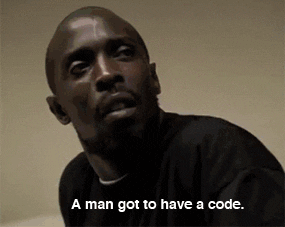
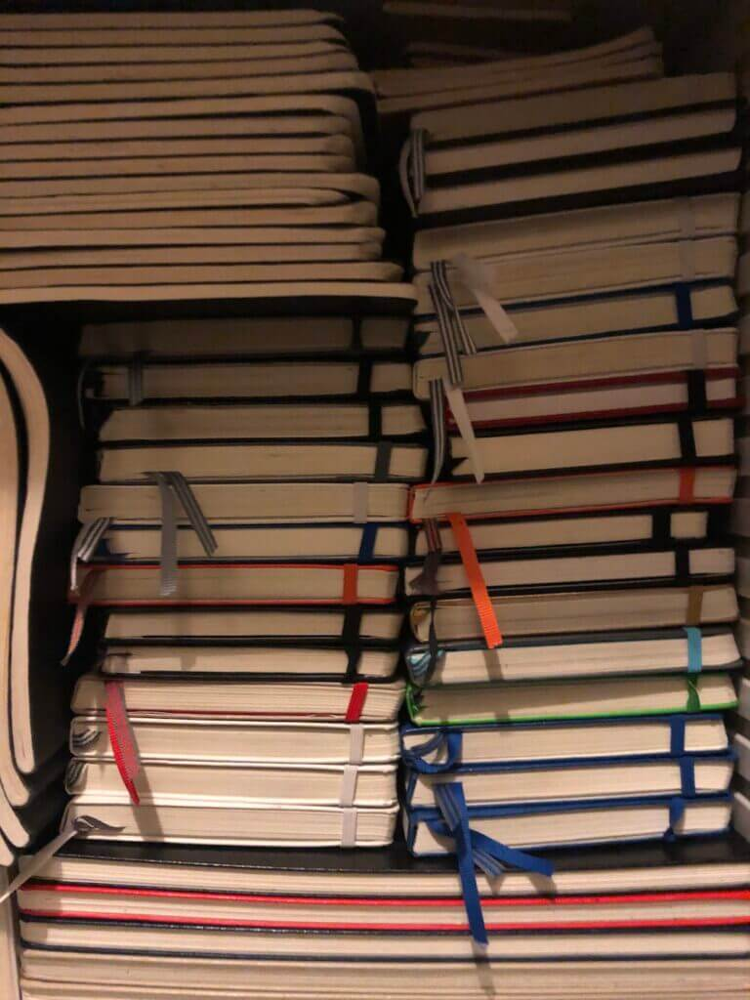

I began journaling in 2013.  

我从 2013 年开始写日记。

A few years later, I started collecting rules that I read every morning.  

几年后，我开始收集每天早上阅读的规则。

Each rule points to a personal story. These are reminders.  

每条规则都指向一个个人故事。这些都是提醒。

✦ ✦ ✦

## [😠](https://emojipedia.org/angry-face/) Stress  

😠 压力

_Choosing battles wisely.  

明智地选择战斗。_

1\. **“Focus on what you control.”** — It’s unhelpful to dwell on things outside of your control.  

1."专注于你能控制的事情"。- 纠缠于自己无法控制的事情是无益的。

2\. **“This too shall pass.”** — _“There are more things likely to frighten us than there are to crush us; we suffer more often in imagination than in reality.”_ –[Seneca](https://en.wikipedia.org/wiki/Seneca_the_Younger)  

2."这也会过去"。- "让我们恐惧的事情比让我们崩溃的事情更多，我们在想象中遭受的痛苦比在现实中遭受的痛苦更多"。- 塞内加

3\. **“Not wanting something is as good as having it.”** — If you don’t want something, you’re just as satisfied as someone who has it. [Naval Ravikant](https://twitter.com/naval) says that _“…desire is a contract that you make with yourself to be unhappy until you get what you want.”_  

3."不想要某样东西和拥有它一样好"。- 如果你不想要某样东西，你就会像拥有它的人一样满足。纳瓦尔-拉维坎特说："......欲望是你与自己签订的契约，在得到你想要的东西之前，你都会不快乐"。

## [📅](https://emojipedia.org/calendar/) Productivity  

📅 生产率

_Getting shit done.  

完成任务_

4\. **“Perfect is a myth. Make a choice.”** — Start and iterate.  

4."完美是个神话。做出选择"。- 开始并迭代。

5\. **“Use models.”** — Don’t recreate the wheel. Learn from others and save time.  

5."使用模型。- 不要重蹈覆辙。向他人学习，节省时间。

6\. **“Start super simple.”** — Make the simplest version first. Don’t complicate things. Build an MVP. Or a [concierge MVP](https://www.allencheng.com/concierge-mvp/).  

6."从超级简单开始"。- 先做最简单的版本。不要把事情复杂化。打造一个 MVP。或者是门房 MVP。

7\. **“Read and listen to whatever you’re most interested in.”** — We get more out of what interests us.  

7."阅读和聆听你最感兴趣的东西"。- 我们会从感兴趣的事物中获得更多。  

Find something that you enjoy reading instead of struggling through books. This idea came from [Shane Parrish](https://twitter.com/ShaneAParrish).  

找一些你喜欢读的书，而不是苦读。这个想法来自谢恩-帕里什（Shane Parrish）。

8\. **“The best returns in life come from compound interest.”** — This applies to relationships, habits and business. Thanks again [Naval](https://www.youtube.com/watch?v=q7PvBO7aRV4).  

8."生活中最好的回报来自复利"。- 这适用于人际关系、习惯和事业。再次感谢纳瓦尔。

9\. **“Successful people say no to almost everything.”** — Focus.  

9."成功者几乎对所有事情都说不"。- 专注。

10\. **“Get it working by any means.”** — Inspired by [test-driven development](https://en.wikipedia.org/wiki/Test-driven_development). Improve the solution _after_ the test passes. This applies to more than code.  

10."不择手段，确保成功。- 受测试驱动开发的启发。测试通过后再改进解决方案。这不仅适用于代码。

11\. **“Hire/build when it hurts.”** — Handle your most painful problems first. Avoid premature optimization.  

11."在最痛苦的时候雇用/构建"。- 先处理最棘手的问题。避免过早优化。

12\. **“Set goals. And work backwards.”** — Use big goals and small goals. Milestones can expose whether you undershot or overshot.  

12."设定目标。并倒着来"。- 利用大目标和小目标。里程碑式的目标可以暴露你是未达标还是超标。

## [👁](https://emojipedia.org/eye/) Influences  

👁 影响

_Curating influences.  

策划影响。_

13\. **“Don’t read/watch the news. Skewed incentives.”** — The news is a war on our attention.  

13."不要读/看新闻。扭曲的激励机制"。- 新闻是一场争夺我们注意力的战争。  

We are frightened into coming back to find out what else to be afraid of. This leads to [availability bias](https://en.wikipedia.org/wiki/Availability_heuristic) and pessimism. Some of us are more afraid to fly than drive.  

我们被吓得不得不回来看看还有什么可害怕的。这导致了可用性偏见和悲观主义。我们中的一些人害怕坐飞机胜过开车。  

Counteract the news with positive propaganda.  

用正面宣传来抵消新闻。

14\. **“You’re the average of the 5 people you surround yourself with.”** — This goes beyond people. What books, podcasts, videos or music do you consume?  

14."你是你周围 5 个人的平均值"。- 这不仅仅是指人。你喜欢看什么书、听什么播客、看什么视频、听什么音乐？

15\. **“Stay away from negative people.”** — Vibes are contagious.  

15."远离消极的人- 氛围是会传染的。

## [🧐](https://emojipedia.org/face-with-monocle/) Decisions  

🧐 决定

_Making good decisions.  

做出正确的决定。_

16\. **“Listen to your gut.”** — Don’t ignore your instincts.  

16."听从直觉- 不要忽视自己的直觉。

17\. **“Hard choices, easy life. Easy choices, hard life.”** — Hard decisions are often the most important. [Ben Horowitz](https://twitter.com/bhorowitz) tells us to _[run towards the fear](https://a16z.com/2019/10/17/how-to-be-effective-ceo-leader/)_.  

17."艰难的选择，轻松的生活。选择容易，生活艰难"。- 艰难的决定往往是最重要的决定。本-霍洛维茨告诉我们要奔向恐惧。

18\. **“Consensus is regression to the mean.”** — Trying to appease everyone takes you nowhere.  

18."共识就是向均值回归"。- 试图安抚每一个人都会让你一事无成。

19\. **“Think probabilistically.”** — Think grey. Not black and white. This comes from [Annie Duke](https://twitter.com/AnnieDuke) and her book, _[Thinking in Bets](https://www.amazon.com/Thinking-Bets-Making-Smarter-Decisions/dp/0735216355)_. Assign percentages to your beliefs instead of speaking in absolutes.  

19."从概率角度思考"。- 灰色思维。而不是非黑即白。这句话来自安妮-杜克（Annie Duke）和她的《赌注思维》（Thinking in Bets）一书。为你的信念设定百分比，而不是绝对化。

20\. **“Short engagements. Test situations.”** — Test partnerships and commitments with trial runs.  

20."短期约定。测试情况"。- 通过试运行来测试伙伴关系和承诺。  

Build a small project together before going all in.  

在全情投入之前，先共同建立一个小项目。

21\. **“Red team. Blue team.”** — Approach decisions as a critic and a supporter. Answers often reveal themselves.  

21."红队。蓝队"。- 以批评者和支持者的身份对待决策。答案往往会自己揭晓。

22\. **“IDK = No”** — If you’re uncertain, the answer should probably be no. This comes from [Derek Sivers](https://sivers.org/) who wrote [_No “yes.” Either “HELL YEAH!” or “no.”_](https://sivers.org/hellyeah)  

22."IDK=否"--如果你不确定，答案也许应该是 "否"。这句话来自德里克-西弗斯（Derek Sivers），他写道：不 "是"。要么 "HELL YEAH！"，要么 "NO"。

23\. **“Know your alternatives.”** — You always have a choice. Remain aware of your alternatives.  

23."了解你的选择- 你总是有选择的。保持对备选方案的了解。  

Has your current path become too expensive? Has a better option emerged?  

你当前的道路是否变得过于昂贵？是否出现了更好的选择？

24\. **“Don’t risk ruin. Not even a small chance.”** — This is what killed Long-Term Capital Management. _[When Genius Failed](https://www.amazon.com/When-Genius-Failed-Long-Term-Management/dp/0375758259)_ tells the story.  

24."不要冒毁灭的风险。哪怕是很小的机会。- 这就是长期资本管理公司的死因。当天才失败时》讲述了这个故事。

## 🗣️ Communication  

🗣️ 通讯

_Being understood.  

被理解。_

25\. **“Use simple language. Few syllables. Short sentences. Short paragraphs.”** — Simplicity is hard to achieve. Work hard so your audience doesn’t have to.  

25."使用简单的语言。少音节。短句。简短的段落"。- 简洁是很难做到的。努力工作，让你的受众不必如此。

26\. **“Our brains are built to enjoy stories.”** — Stories help information stick.  

26."我们的大脑天生喜欢听故事。- 故事能让信息深入人心。

## 🙂 People  

🙂 人

_Understanding others.  

理解他人。_

27\. **“We’re all driven by the fundamental desire to be appreciated”.** — Don’t underestimate the role of emotion.  

27."我们都渴望得到赏识"。- 不要低估情感的作用。

28\. **“Don’t argue. Bet.”** — Test belief through sacrifice not words.  

28."不要争论。打赌"。- 通过牺牲而非言语来检验信念。

29\. **“Appeal to interest, not reason.”** — We don’t care about what makes sense. We care about what makes sense for us.  

29."诉诸兴趣，而非理智。- 我们不关心什么是合理的。我们关心的是什么对我们有意义。

30\. **“Misery loves company.”** — So does happiness.  

30."苦难喜欢同伴"。- 幸福也是如此。

31\. **“Happy people rarely become haters.”** — Unconstructive critics are often dealing with their own demons.  

31."快乐的人很少会成为憎恨者。- 没有建设性的批评者往往是在对付自己的心魔。

32\. **“Difficulty reveals character.”** — Our masks fall during struggle. Build friendships through shared struggle.  

32."困难彰显个性"。- 我们的面具在斗争中脱落。通过共同奋斗建立友谊。  

Jiu-Jitsu, hackathons, work, travel.  

柔术、黑客马拉松、工作、旅行。

33\. **“We stereotype all of the time. Rightly or wrongly. Don’t ignore it.** [**Signals matter**](https://en.wikipedia.org/wiki/Signalling_theory)**.”** — We take mental shortcuts to conserve energy.  

33."我们总是对事物抱有成见。无论对错。不要忽视它。信号很重要"。- 我们走心理捷径是为了节省能量。  

Use pattern interrupts when you’re being negatively stereotyped. Life is short. Not fair.  

当你被负面定型时，使用模式中断。人生苦短。不公平

34\. **“The more you understand incentives, the less you take things personally.”** — Incentives drive behavior. Sometimes it’s not personal. Change incentives instead of _trying_ to change people.  

34."你对激励机制了解得越多，就越不会把事情往心里去。- 激励推动行为。有时并非针对个人。改变激励机制，而不是试图改变人。

35\. **“Hurt people, hurt people.”** — Don’t react. Remember this.  

35."伤害别人，就是伤害别人"。- 不要做出反应。记住这句话。

36\. **“Don’t try to change someone’s worldview. Take those who see it and take them further.”** — It’s hard to change someone’s worldview. It’s easier to help someone who already sees it.  

36."不要试图改变别人的世界观。把那些看到它的人带得更远"。- 改变一个人的世界观很难。帮助已经看清世界观的人更容易。  

What’s the best use of your time?  

怎样才能更好地利用时间？

## 👯♂️ Relationships  

👯♂️ 关系

_Building connections.  

建立联系。_

37\. **“Trust saves time.”** — Invest in trust on the frontend and reap rewards on the backend.  

37."信任能节省时间"。- 在前端投资信任，在后端收获回报。  

High trust relationships move faster and get more done.  

高度信任的关系能加快工作进度，完成更多工作。

38\. **“Focus on compounding relationships.”** — Focus on building relationships with long-term potential.  

38."注重复合型关系。- 注重建立具有长期潜力的关系。

39\. **“Don’t force relationships.”** — What’s forced eventually falls apart. Forcing only delays the inevitable.  

39."不要强迫关系"- 强求的东西最终会分崩离析。强迫只会拖延不可避免的结果。

## 🤝 Negotiation  

🤝 谈判

_Getting what you want.  

得到你想要的_

40\. **“Whoever cares less wins negotiations.”** — Who can afford to walk away? Who needs it the least? This person tends to get the best deal.  

40."谁在乎得少，谁就能赢得谈判"- 谁走得起？谁最不需要？这个人往往能得到最好的交易。

41\. **“Negotiation and business are about alternatives.”** — Good decisions are relative. It’s about choosing the best option among alternatives. _Know your [BATNA](https://corporatefinanceinstitute.com/resources/knowledge/deals/what-is-batna/)_.  

41."谈判和生意都是关于选择"。- 好的决定是相对的。就是要在备选方案中选择最佳方案。了解你的 BATNA。

## 🧘🏿♀️ Wisdom  

🧘🏿♀️ 智慧

_Knowing yourself.  

了解自己_

42\. **“It’s easier to resist in the beginning than the end.”** — Mistakes become harder to correct the longer they linger. [Sunk costs](https://en.wikipedia.org/wiki/Sunk_cost) play tricks on us. Suck it up and rip the bandaid off now.  

42."开始比结束更容易抵制"。- 错误拖得越久就越难改正。沉没成本在作祟。忍气吞声，现在就撕掉创可贴。  

Toxic relationships, bad hires and tough conversations. It’s immediate pain versus chronic pain.  

有毒的人际关系、糟糕的招聘和艰难的对话。这是眼前的痛苦与慢性的痛苦。

43\. **“To know all is to forgive all.”** — You would be more understanding if you knew everything about a person.  

43."了解一切就是宽恕一切"。- 如果你对一个人了如指掌，你就会更加善解人意。  

Look closer when something doesn’t make sense.  

当某些事情不合理时，请仔细观察。

## 🌱 Growth  

🌱 增长

_Constantly improving.  

不断改进。_

44\. **“Focus on doing the thing, not the outcome.”** — Commit to the process, not the outcome. You control whether you do it, not how it turns out.  

44."专注于做事，而不是结果"。- 致力于过程，而非结果。你能控制是否去做，而不是结果如何。

45\. **“Continuous improvement requires feedback.”** — Feedback is a gift. No feedback. No improvement.  

45."持续改进需要反馈"。- 反馈是一种恩赐。没有反馈。没有改进。

46\. **“How to build confidence? Do things just outside your comfort zone. And repeat as it expands.”** — This fuses confidence with progressive overload. Confidence-building can become a habit.  

46."如何建立自信？做超出自己舒适区的事情。随着舒适区的扩大而重复"。- 这将自信与渐进式超负荷融合在一起。建立自信可以成为一种习惯。  

This comes from [Tim Ferriss](https://twitter.com/tferriss).  

这句话来自蒂姆-费里斯（Tim Ferriss）。

47\. **“If you decide to only do what works. You’re leaving a lot of opportunity on the table.”** — Experiment.  

47."如果你决定只做有效的事，你就会错失很多机会。"- 实验。

## 🧗🏿♀️ Courage  

🧗🏿♀️ 勇气

_Doing despite fear.  

不畏恐惧，勇往直前。_

48\. **“Courage is a muscle that you need to train.”** — Picture courage as a muscle that atrophies if it goes unused.  

48."勇气是你需要训练的肌肉"。- 把勇气想象成一块肌肉，如果它闲置不用，就会萎缩。  

Courage can also be strengthened through [progressive overload](https://en.wikipedia.org/wiki/Progressive_overload). This came from a conversation with [Harry Dry](https://twitter.com/harrydry).  

勇气也可以通过逐渐超负荷的训练得到加强。这句话来自哈利-德莱的一次谈话。

49\. **“New things scare us. Do it anyway.”** — By acknowledging fear, we are better able to move past it.  

49."新事物让我们害怕。无论如何都要去做"。- 承认恐惧，我们就能更好地克服恐惧。

50\. **“The biggest upside comes from being outside your comfort zone.”** — In the words of [DJ Khaled](https://twitter.com/djkhaled), _major_ ?  _alert_. There will be an entire post on this.  

50."最大的优势来自于走出你的舒适区"。- 这句话出自 DJ Khaled 之口。将有一整篇文章讨论这个问题。

51\. **“Fear is a good thing. It means you’re close to making a breakthrough.”** — Fear can indicate potential growth opportunities.  

51."恐惧是件好事。它意味着你即将取得突破。"- 恐惧可能预示着潜在的发展机遇。

## 👩🏽🎨 Design  

👩🏽🎨 设计

_Making things.  

制作东西_

52\. **“Trying to appeal to all leads to average.”** — We make too many concessions by trying to appeal to everyone. [Seth Godin](https://www.sethgodin.com/) writes about the importance of [being important to a small group](https://seths.blog/2014/06/in-search-of-meaningful/). This rule mirrors _“Consensus is regression to the mean.”_ But as [David Senra](https://twitter.com/davidsenra1) says, _repetition is persuasive_.  

52."试图迎合所有人，结果只能是平庸"。- 我们做出了太多的让步，试图吸引所有人。塞斯-戈丁（Seth Godin）写道，对一小部分人来说，重要的是自己。这条规则反映了 "共识是向平均值的回归"。但正如大卫-森拉（David Senra）所说，重复是有说服力的。

53\. **“Brevity is the soul of wit.”** — Shorter is better.  

53."简洁是智慧的灵魂。- 越短越好。

54\. **“Keep it simple.”** — Stay away from unnecessary complexity. _“Everything should be made as simple as possible, but not simpler.”_ -Einstein  

54."保持简单"。- 远离不必要的复杂。"一切都应尽可能简单，但不能更简单"。-爱因斯坦

55\. **“Make it work. THEN make it pretty.”** — It’s easier to find an elegant solution once you have something working.  

55."先让它有用。然后让它漂亮"。- 一旦有了工作原理，就更容易找到优雅的解决方案。  

This applies to any craft.  

这适用于任何工艺。

56\. **“Don’t make them think.”** — Make it obvious.  

56."不要让他们思考"。- 显而易见。

## 💼 Business  

💼 商业

_Delivering value.  

实现价值。_

57\. **“Start with problems. Not solutions.”** — Start by studying the problem instead of offering solutions. Study the lock before you make a key.  

57."从问题开始。而不是解决方案"。- 从研究问题开始，而不是提供解决方案。先研究锁，再配钥匙。

58\. **“Frustration is an opportunity.”** — Keep an idea journal. Jot down your problems. Some are business opportunities.  

58."挫折就是机会"。- 写一本想法日记。记下你的问题。有些就是商机。

59\. **“The most important part of business is the market.  

59."企业最重要的部分是市场。  

It’s easier to ride a wave than it is to make one.”  

乘风破浪比乘风破浪更容易"。** — A good team won’t survive a bad market. A good product won’t survive a bad market.  

\- 一个好的团队无法在糟糕的市场中生存。一个好的产品无法在糟糕的市场中生存。  

A bad team with a bad product can survive in a good market. Pick hungry markets. This comes from [Marc Andreessen](https://en.wikipedia.org/wiki/Marc_Andreessen) who wrote _[The Only Thing That Matters](https://pmarchive.com/guide_to_startups_part4.html)_.  

糟糕的团队和糟糕的产品可以在好的市场中生存。选择饥饿的市场。这句话来自马克-安德森（Marc Andreessen），他写了《唯一重要的事》（The Only Thing That Matters）一书。

60\. **“Business opportunities can lead to others.”** — Build something even if you don’t have a “good” idea yet. We find new problems by solving problems.  

60."商机可以带来其他机会"。- 即使还没有 "好 "点子，也要有所建树。我们通过解决问题来发现新问题。

61\. **“A company can be your vehicle for continuous learning.”** — Do something. Don’t just study.  

61."公司可以成为你不断学习的载体。- 做点什么。不要只是学习。

62\. **“Awareness → Interest → Decision → Action”** — Marketing is about awareness and conversion. Be visible. [Pieter Levels](https://twitter.com/levelsio), [Andrey Azimov](https://twitter.com/AndreyAzimov) and [Danielle Johnson](https://twitter.com/dinkydani21) are great examples of this.  

62."认知→兴趣→决定→行动"--营销就是认知和转化。引人注目。Pieter Levels、Andrey Azimov 和 Danielle Johnson 就是很好的例子。

63\. **“50% Rule. 1/2 Growth. 1/2 Product.”** — Spend half of your time talking to customers and half building.  

63."50%法则。1/2 增长。1/2 产品"。- 一半时间与客户交流，一半时间开发产品。  

Don’t endlessly build without feedback.  

不要在没有反馈的情况下无休止地建造。

64\. **“Does the business have network effects? Does it require funding?”** — [Network effects](https://en.wikipedia.org/wiki/Network_effect) determine the number and size of the businesses a market. These are winner take most games.  

64."企业是否具有网络效应？是否需要资金？- 网络效应决定了市场上企业的数量和规模。这些都是赢家通吃的游戏。  

Nextdoor, LinkedIn, Facebook. Building these companies often involves raising money.  

Nextdoor、LinkedIn、Facebook。建立这些公司往往需要筹集资金。  

Is this the kind of business that you want to run? Consider founder-market fit.  

这是你想经营的企业吗？考虑创始人与市场的契合度。

65\. **“The more you ship. The more you increase your chance of success.  

65."出货越多成功的几率就越大。  

Throw enough against the wall and something’s bound to stick.”  

"把足够多的东西扔到墙上，一定会有东西粘住的。** —[Andrew Pierno](https://twitter.com/andrewpierno) wrote about this in _[The Edison Approach to Profitability](https://medium.com/@AndrewPierno/the-edison-approach-to-profitability-a6db28f42800)_.  

\- 安德鲁-皮埃尔诺在《爱迪生的盈利方法》一书中对此进行了论述。

66\. **“Consider buying a business. A statistically profitable approach.”** — Validating business ideas involves a lot of false starts.  

66."考虑购买企业。从统计学角度看，这是一种有利可图的方法。"- 验证商业创意需要经历很多错误的开始。  

Buying a business with product-market fit _can_ be a statistically profitable approach. _Price affects risk._ [Nassim Nicholas Taleb](https://en.wikipedia.org/wiki/Nassim_Nicholas_Taleb) discussed the idea of statistical profitability in [Fooled by Randomness](https://www.amazon.com/dp/B001FA0W5W).  

购买一家产品与市场契合的企业，从统计学角度看是一种盈利方法。价格影响风险。纳西姆-尼古拉斯-塔勒布（Nassim Nicholas Taleb）在《随机性的愚弄》（Fooled by Randomness）一书中讨论了统计盈利的概念。

67\. **“Copy businesses that are working. These are formulas. Steal and improve them.”** — Find a proven market. Study the problem. Be different or better or both.  

67."复制成功的企业。这些都是公式。窃取并改进它们"。- 找到一个成熟的市场。研究问题。与众不同或更好，或两者兼而有之。

68\. **“Choose the fastest option. Refactor later.”** — Prioritize speed early on.  

68."选择最快的方案。稍后再重构"。- 尽早优先考虑速度。  

If you’re unable to validate an idea, there may be no long-term to worry about.  

如果你无法验证一个想法，可能就没有什么长期性可言了。

69\. **“Theory of 3 (good money) and 7 (wealth).”** — Pick something that you can stick with for the long run. The hosts of [The TMBA Podcast](https://www.tropicalmba.com/podcasts/) have a theory that it takes three years of working on something to make good money and seven years to generate wealth.  

69."3（好钱）和 7（财富）理论"。- 选择你能长期坚持的事情。The TMBA Podcast 的主持人有一个理论：要想赚到好钱，需要花三年的时间去做一件事，而要创造财富，则需要七年的时间。

70\. **“Build what YOU need or want.”** — [Sahil Lavingia](https://twitter.com/shl) says that _if you build for yourself then you at least have one customer_. It doesn’t guarantee that others will want your solution but it’s a good start.  

70."建造你需要或想要的东西"。- Sahil Lavingia 说，如果你为自己而建，那么你至少有一个客户。这并不能保证其他人会需要你的解决方案，但这是一个好的开始。

## 💁🏾♂️ Selling  

💁🏾♂️ 销售

_Persuading.  

说服。_

71\. **“Ask for feedback to sell.”** — _If you want money, ask for advice. If you want advice, ask for money_.  

71."征求反馈意见才能销售"。- 如果你想要钱，就征求意见。如果你想要建议，就去要钱。

72\. **“Don’t try to sell what you wouldn’t buy.”** — Confidence is palpable. Potential customers will know if you believe in what you’re selling.  

72."不要试图推销你不会买的东西"。- 自信是可以感觉到的。潜在客户会知道你是否相信你所卖的东西。

73\. **“Deliver value and build trust before you try to sell.”** — Trust saves time. Write great content. Offer a free trial.  

73."在尝试销售之前，先提供价值并建立信任。- 信任可以节省时间。撰写精彩内容。提供免费试用。

74\. **“Have a rejection goal.”** — Each ‘no’ moves you closer to your goal. Flip the psychology of selling. [Carl Jacobi](https://en.wikipedia.org/wiki/Carl_Gustav_Jacob_Jacobi) told us to _“Invert. Always invert.”_  

74."有一个拒绝目标"。- 每一次 "拒绝 "都会让你离目标更近。翻转销售心理。卡尔-雅各比告诉我们要 "反转。永远反转"。

75\. **“Start with why. They’ll be more likely to comply.”** — Explain why something is important before making a request.  

75.从 "为什么 "开始。他们会更容易服从"。- 在提出要求之前，先解释为什么某件事情很重要。

## 🙃 Enjoying Life  

🙃 享受生活

_Living without regrets.  

无怨无悔地生活_

76\. **“If you don’t HAVE to keep reading or listening, don’t.”** — Don’t trudge through books, podcasts or movies. Pick something else up.  

76."如果你没有必要继续阅读或聆听，就不要继续"。- 不要在书籍、播客或电影中踯躅不前。拿起别的东西。  

You don’t have to finish every book.  

你不必读完每本书。

77\. **“The journey is the reward. Hedonistic adaptation.”** — Lottery winners return to their baseline happiness levels. Learn to love the process.  

77."旅程就是收获。享乐主义的适应"。- 彩票中奖者会回到他们的幸福基线水平。学会热爱过程。  

That’s where 99% of your time is spent.  

你 99% 的时间都花在这里。

78\. **“We get more out of what interests us.”** — You learn more when you’re engaged. [Charlie Munger](https://en.wikipedia.org/wiki/Charlie_Munger) says _follow your natural drift_.  

78."我们从感兴趣的事情中获得更多"。- 当你投入时，你会学到更多。查理-芒格说，要顺其自然。

79\. **“Memento Mori.”** — Your time is limited. Live with urgency. Remember death.  

79.纪念- 你的时间有限。紧迫而活。记住死亡。

## 🥇 Success  

🥇 成功

_Winning.  

赢了_

80\. **“Don’t self-reject.”** — Don’t tell yourself no before someone else can. This came from [Sahil Lavingia](https://twitter.com/shl).  

80."不要自我拒绝"- 在别人拒绝你之前，不要先拒绝自己。这句话来自 Sahil Lavingia。

81\. **“Knowledge is (potential) power. Action makes it so.”** — Applied knowledge is power. It takes courage and energy to activate. [Derek Sivers](https://sivers.org/) said that _if information was the answer, then we’d all be billionaires with perfect abs._  

81."知识就是（潜在的）力量。行动使之成为现实"。- 应用知识就是力量。它需要勇气和能量来激活。德里克-西弗斯（Derek Sivers）说，如果信息就是答案，那么我们都会成为拥有完美腹肌的亿万富翁。

82\. **“Play long-term games. Compound returns.”** — Focus on the long-term. Most benefits come from later stages of [compounding](https://en.wikipedia.org/wiki/Compound_interest). Pick up habits that you can see yourself sticking with. [Jeff Bezos](https://en.wikipedia.org/wiki/Jeff_Bezos) says to _focus on what doesn’t change_.  

82."玩长期游戏。复利回报"。- 注重长期。大多数收益来自后期的复利。养成自己能坚持的习惯。杰夫-贝索斯说，要关注不会改变的东西。

83\. **“Play asymmetric games. Life is not baseball. 1 hit can pay for 1000 runs.”** — Some activities have asymmetric upside.  

83."玩不对称游戏。生活不是棒球。1次击球可以换来1000次跑垒。"- 有些活动具有非对称的上升空间。  

Reading, writing, coding, selling, leading, comfort challenges, publishing.  

阅读、写作、编码、销售、领导、舒适挑战、出版。  

Play games with asymmetric upside.  

玩上下颠倒不对称的游戏。

84\. **“Ask for what you want. You can’t get what you don’t ask for.”** — You’ll get a yes or a know.  

84."要求你想要的。不问则无所得"。- 你会得到 "是 "或 "知道"。

85\. **“Move with intent. You’re more likely to get what you want.”** — Are you living proactively or reactively? Establish a north star to orient your decisions around.  

85."用心行动。你更有可能得到你想要的。"- 你是积极主动地生活还是被动地生活？确立一颗北极星，让你的决定有方向。  

‘_If you don’t know what you want, you end up with a lot that you don’t._‘ –[Chuck Palahnuik](https://www.goodreads.com/author/show/2546.Chuck_Palahniuk)  

如果你不知道自己想要什么，你最终会得到很多你不想要的东西。- 查克-帕拉尼克

86\. **“We thrive in niches. Specialize.”** — Focus on what you’re good at and rely on others for the rest.  

86."我们在利基中茁壮成长。专业化"。- 专注于自己擅长的领域，其他领域则依赖他人。  

Leverage the API instead of building from scratch.  

利用应用程序接口，而不是从零开始。

87\. **“Wealth is made in extreme concentration.”** — Wealth is maintained through diversification but made in extreme concentration. Focus.  

87."财富是在极度集中中创造的"。- 财富通过多样化来维持，但在极度集中中创造。聚焦。

88\. **“Price affects risk.”** — If an experiment is cheap, just do it. The more the price goes up, the more you should reconsider.  

88."价格影响风险- 如果一项实验很便宜，就去做。价格涨得越多，你就越应该重新考虑。

89\. **“Follow up.”** — This can yield dividends.  

89."跟进"。- 这可以产生红利。

90\. **“Live below your means for freedom and options.”** — Establish a margin of safety to take more risks. [James Clear](https://twitter.com/JamesClear) says that ‘_Your success depends on the risks you take. Your survival depends on the risks you avoid._‘  

90."量入为出，自由选择"。- 建立安全边际，承担更多风险。詹姆斯-克利说："你的成功取决于你承担的风险。你的生存取决于你避免的风险。

91\. **“Don’t be desperate.”** — Desperation often results in bad deals.  

91."不要孤注一掷"。- 孤注一掷往往会导致交易失败。

92\. **“Ship daily/weekly/monthly. Build your shipping muscle.”** — Become comfortable exposing your art to an audience and embracing feedback.  

92."每天/每周/每月发货。锻炼你的发货能力"。- 在观众面前展示自己的艺术并接受反馈，让自己变得游刃有余。

93\. **“Fuck imposter syndrome. Do it.”** — We second-guess ourselves a lot. Do not wait for permission. It may never come.  

93."去他的冒名顶替综合症。去做吧。"- 我们经常猜疑自己。不要等待许可。它可能永远不会到来。  

Acknowledge self-doubt and move past it.  

承认自我怀疑并超越它。

## ⏳ Management  

⏳ 管理

_Being effective.  

有效。_

94\. **“Put your name on it. This makes you try harder. Accountability.”** — You work harder when your name is on the line.  

94."写上你的名字。这会让你更加努力。责任"。- 写上自己的名字，你会更加努力。

95\. **“Get the incentives right.”** — It’s the most important thing in management. You get what you reward. Align incentives.  

95."正确制定激励措施"。- 这是管理中最重要的事情。赏罚分明。调整激励机制。

## 🕺🏾 Personal  

🕺🏾 个人

_Adjusting for your own quirks.  

调整自己的怪癖。_

96\. **“Associate growth with doing. Not reading/watching/listening.”** — Don’t overstudy and underexecute.  

96."将成长与实践联系起来。而不是读/看/听"。- 不要过度学习和执行不足。

97\. **“Do high energy tasks early in the day.”** — Do creative work when you have the most energy.  

97."每天早起做精力充沛的工作"。- 在精力最充沛的时候做创造性的工作。

98\. **“Reading fiction = Increased empathy and creativity. Better verbal communication and writing.  

98."阅读小说 = 增强同理心和创造力。更好的语言交流和写作。  

And less stress via escapism.”  

通过逃避现实来减少压力"。** — I once avoided novels because I didn’t know what I would learn. I still don’t know.  

\- 我曾经回避小说，因为我不知道我能学到什么。现在我仍然不知道。  

But I read fiction for other reasons.  

但我读小说还有其他原因。

99\. **“Use podcasts to stay motivated.”** — Listening to other misfits helps me stay motivated.  

99."用播客保持动力"。- 倾听其他不合群的人的声音有助于我保持动力。

100\. **“Habit levels. 3/10/30/100/300/1000/etc.” —** The rule of 3 and 10. This came from an interview with [Phil Libin](https://twitter.com/plibin?lang=en) in [Tools of Titans](https://www.amazon.com/Tools-Titans-Billionaires-World-Class-Performers/dp/1328683788). It states that everything changes at multiples of 3 and 10. When a company triples in size, everything breaks.  

100."习惯等级。3/10/30/100/300/1000/etc.”- 3和10法则。这是菲尔-利宾（Phil Libin）在《泰坦工具》（Tools of Titans）一书中的一段采访。它指出，在 3 和 10 的倍数上，一切都会发生变化。当公司规模扩大三倍时，一切都会打破。  

I use multiples of 3 and 10 to celebrate milestones in habits and business.  

我用 3 和 10 的倍数来庆祝习惯和事业上的里程碑。  

Gamify your life to stay engaged through the [messy middle](https://www.amazon.com/Messy-Middle-Finding-Through-Hardest/dp/0735218072).  

将你的生活游戏化，在混乱的中途保持投入。

✦ ✦ ✦

My Journals  

我的日记

Thanks for reading. These rules emerged from years of refining and transferring notes.  

感谢您的阅读。这些规则是多年提炼和转移笔记的结果。

The goal is _not_ to remember everything. I read the list with problems in mind.  

目的不是记住所有东西。我是带着问题去读清单的。  

The path usually becomes clear by the time I finish.  

通常在我读完之后，道路就会变得清晰起来。

What rules do you live by? Share some with me [on Twitter](https://twitter.com/DruRly).  

你遵循哪些规则？请在 Twitter 上与我分享。
