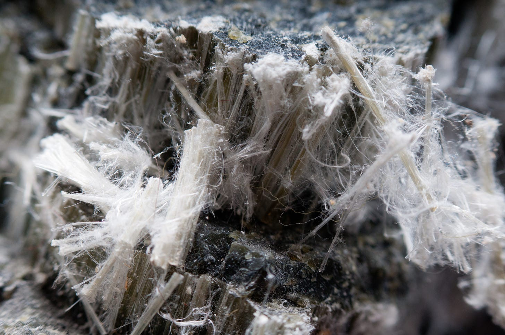

_Mano Majumdar writes about the rise and fall of asbestos for Issue 13. Read it online [here](https://worksinprogress.co/issue/the-asbestos-times/).  

Mano Majumdar 在第 13 期中写到了石棉的兴衰。在此处在线阅读。_

Few materials fell from grace like asbestos.  

很少有材料像石棉一样失宠。  

Once cherished as an almost-magical material, it is now the archetypal carcinogen.  

曾经被珍视的几乎神奇的材料，现在已成为典型的致癌物。  

We spent over a century integrating it into buildings, wiring, pipes, brake pads, and more, and we now spend billions of dollars a year removing it.   

我们花了一个多世纪的时间将其集成到建筑物、电线、管道、刹车片等中，现在我们每年花费数十亿美元来移除它。

But the standard story of asbestos as a mistake – or even a crime – of massive proportions does not do justice to the real benefits it brought.  

但将石棉的标准故事视为一个错误——甚至是一场大规模的犯罪——并不能证明它带来的真正好处。  

Asbestos was central to mitigating urban fires, which cost thousands of lives each year as modern cities grew larger, denser, and more flammable.  

随着现代城市变得更大、更密集、更易燃，石棉对于减少每年造成数千人死亡的城市火灾起到了核心作用。  

But as we learned to control urban fires without it, asbestos’s health costs seemed less and less worth bearing.  

但随着我们学会在没有石棉的情况下控制城市火灾，石棉的健康成本似乎越来越不值得承受。  

Asbestos is in its final days and soon the material will almost disappear entirely.   

石棉正处于最后的日子，很快这种材料将几乎完全消失。

Miracle materials are not all manmade.  

神奇的材料并非都是人造的。  

Asbestos is a family of six naturally occurring silicates, made from the same elemental blocks as sand or glass, organized in delicate fibrous strands that tease apart like cotton candy and compare with steel in tensile strength.  

石棉是一系列六种天然存在的硅酸盐，由与沙子或玻璃相同的元素块制成，以精致的纤维状细丝组织在一起，像棉花糖一样分开，并且在拉伸强度方面可与钢媲美。  

Chrysotile or white asbestos, the commercially dominant form, is a serpentine silicate, with fibrous strands that crumble to the touch; the remaining five are amphiboles (including crocidolite, blue asbestos), spiky forests of short and fragile needles.  

商业上占主导地位的蛇纹石或白石棉是一种蛇纹石硅酸盐，纤维状细丝触之即碎；其余五种是闪石（包括青石棉，蓝石棉），是短而脆弱的针状尖刺森林。  

In all its forms, asbestos has remarkable properties: it’s light, waterproof, and, most famously, fireproof.  

石棉以其各种形式具有非凡的特性：它轻便、防水，最著名的是防火。

The unique structure of asbestos requires a [unique set of circumstances to form](https://pubs.usgs.gov/of/2002/of02-149/of02-149.pdf).  

石棉的独特结构需要一系列独特的情况才能形成。  

The fibers of asbestos are crystals precipitated out of a solution of minerals in hot water under pressure.  

石棉纤维是矿物质溶液在高温高压下析出的晶体。  

This is hydrothermal synthesis,  a process used to grow artificial crystals in laboratory settings (or candy from syrup).  

这是水热合成，一种用于在实验室环境（或糖浆中生成糖果）中生长人造晶体的工艺。

The low-silica rocks in which asbestos originates are found naturally across the planet, and asbestos has been found and mined on

  

石棉起源的低二氧化硅岩石在地球上自然存在，并且已在[every inhabited continent  

每个有人居住的大陆](https://www.researchgate.net/figure/a-global-map-with-the-main-asbestos-mines-active-and-inactive-modified-after-Virta_fig3_342181663).

The first written record of asbestos was by [Theophrastus](https://www.jstor.org/stable/24995833), who categorized it correctly by including it in his mineralogical work, _On Stones_.  

上发现并开采了石棉。最早的石棉书面记录是由泰奥弗拉斯托斯撰写的，他将其正确归类，并将其纳入他的矿物学著作《论石头》中。  

He did better than most, considering that an animal origin for asbestos was a common misconception in the ancient world: asbestos was credited to everything from phoenix feathers to the mythical salamander to  

他做得比大多数人好，因为在古代世界，人们普遍误认为石棉起源于动物：石棉被认为是凤凰羽毛、神话中的蝾螈，甚至_Princess Bride  

《公主新娘》_–style literal  

风格的字面[volcano-dwelling fire rats  

居住在火山中的火老鼠](https://www.jstor.org/stable/4526458?seq=15).

Its rarity and invulnerability to fire gave asbestos an air of mystique and an association with power.  

。它的稀有性和耐火性使石棉具有神秘感并与力量相关联。  

Charlemagne is said to have had a  

据说查理曼大帝有一块[tablecloth of pure asbestos  

纯石棉](https://daily.jstor.org/when-asbestos-was-a-gift-fit-for-a-king/) that he would throw into the fire as a party trick, and Emperor Ashoka of India sent a gift of asbestos cloth to Sri Lanka.  

桌布，他会把它扔进火里作为聚会戏法，而印度的阿育王则向斯里兰卡赠送了石棉布。  

Earnest pilgrims into the Holy Land were sold pieces of asbestos cloth as remnants of the Holy Shroud, made credible by their immunity to fire.  

前往圣地的虔诚朝圣者被出售了石棉布碎片，作为圣裹尸布的残余物，其耐火性使其可信。  

Benjamin Franklin paid for his time in Europe by selling an asbestos purse to a collector (for which he was paid ‘  

本杰明·富兰克林通过向一位收藏家出售一个石棉钱包来支付他在欧洲的时间（他因此获得了“[handsomely  

丰厚](http://www.benfranklin300.org/frankliniana/result.php?id=621&sec=1)’). Yet asbestos existed only as an interesting novelty without a clear use.  

”的报酬）。然而，石棉只是作为一种有趣的新奇事物而存在，没有明确的用途。

That use case came into being in the late nineteenth century.  

这种用例出现在十九世纪末。  

The fast-growing cities of the time were exceptionally flammable, with densely clustered buildings full of wood, fabric, and open flames.  

当时快速发展的城市极其易燃，密集的建筑物中充满了木材、织物和明火。  

Electrification was new; fire codes were yet to become ubiquitous (or stringently applied).  

电气化是新的；消防规范尚未普及（或严格执行）。  

In some cases, even roads were made of timber.  

在某些情况下，甚至道路都是用木材制成的。

Unsurprisingly, [‘Great Fires’ struck virtually every major city](https://worksinprogress.co/issue/pandemic-prevention-as-fire-fighting).  

毫不奇怪，“大火”几乎袭击了每个主要城市。  

Theaters, full of flammable set elements and a tightly packed audience, were a frequent source of fire.  

剧院里满是易燃的布景元素和拥挤的观众，是火灾的常见来源。  

The risky productions themselves did not help – 31 of the 1,108 theater fires documented worldwide between 1797 and 1897 were started by fireworks on the stage.  

危险的制作本身也没有帮助——1797 年至 1897 年间记录在案的 1,108 起剧院火灾中有 31 起是由舞台上的烟花引起的。

Theater fires started mostly on the stage and then spread to the audience.  

剧院火灾大多始于舞台，然后蔓延到观众席。  

It was critical that the two areas be separated to protect the audience.  

将这两个区域分开以保护观众至关重要。  

Theater owners attempted to separate the stage and audience with heavy curtains of sheet metal, called ‘iron curtains’.  

剧院老板试图用称为“铁幕”的厚重的金属板窗帘将舞台和观众分开。  

Experiments on a scale model following a fire in Vienna’s Ringtheatre in 1881 showed their limitations.  

1881 年维也纳环形剧院发生火灾后，对比例模型进行的实验表明了它们的局限性。  

A fire on the stage would blow the hot metal curtain out onto the audience it was meant to protect, not only endangering them but also extinguishing the gaslights meant to light the way to safety.  

舞台上的火会将滚烫的金属幕布吹到它本应保护的观众身上，不仅会危及他们，还会熄灭为安全照明的气灯。  

In other instances, the curtain could collapse onto the stage or fail to descend at all.  

在其他情况下，幕布可能会倒塌在舞台上或根本无法下降。

Engineers and regulators experimented with a diversity of materials for safety curtains, settling on asbestos.  

工程师和监管人员尝试了多种安全幕布材料，最终确定了石棉。  

The 1903 fire at the Iroquois Theatre in Chicago led to an exemplary institutional response.  

1903 年芝加哥伊洛魁剧院的火灾导致了示范性的机构反应。  

The Iroquois supposedly had an asbestos curtain that  

伊洛魁剧院据称有一块石棉幕布，但在火灾期间[failed to come down  

未能落下](https://archive.org/details/greatchicagothea00everiala/page/109/mode/2up) during the fire, but later investigation of the remnants of the curtain revealed that the curtain was mostly vegetable fiber.  

，但后来对幕布残骸的调查显示，该幕布大部分是植物纤维。  

Following the fire, Chicago ordered all its theaters to be closed down immediately, while in New York inspectors went around setting fire to theater curtains, in search of dupes being passed off as asbestos by noncompliant ownership.  

火灾发生后，芝加哥下令立即关闭所有剧院，而纽约的检查员则四处纵火烧毁剧院幕布，以寻找不合格所有者冒充石棉的赝品。  

The message now was clear: asbestos, or nothing.  

现在信息很明确：石棉，或者什么都没有。

Theaters were not the only place where fires were common.  

剧院并不是唯一经常发生火灾的地方。  

Movie theaters, schools, hotels, hospitals, ships, and ports all existed under the threat of fire.  

电影院、学校、酒店、医院、船舶和港口都存在火灾威胁。  

Asbestos was gradually introduced in each.   

石棉逐渐被引入到每个地方。

Ports were particularly keen on fire safety.  

港口特别注重消防安全。  

A fire port-side could easily spread among ships and destroy them, as it did famously in the 1900 Hoboken Docks fire in New Jersey.  

港口一侧的火灾很容易在船只之间蔓延并摧毁它们，就像 1900 年新泽西州霍博肯码头火灾中发生的那样。  

A fire that started in bales of cotton stored on a pier spread with the wind to stores of flammable turpentine and oil, which exploded in quick succession.  

从码头上储存的棉花包中开始的火灾随着风势蔓延到易燃松节油和石油储存处，并迅速发生爆炸。  

Within 45 minutes, the fire had destroyed three piers and three major transatlantic liners belonging to the Norddeutscher Lloyd shipping company, and claimed over  

在 45 分钟内，大火摧毁了三个码头和三艘属于北德意志劳埃德航运公司的主要跨大西洋班轮，并造成超过[200 lives  

200 人死亡](https://timesmachine.nytimes.com/timesmachine/1900/07/01/101060726.pdf). Navies and merchant navies were eager and early adopters of asbestos.  

。海军和商船队热切且早早采用了石棉。  

When Norddeutscher Lloyd finally rebuilt the pier,  

当北德意志劳埃德最终重建码头时，[asbestos felt  

石棉毡](https://hoboken.pastperfectonline.com/Archive/C9A187AD-22AD-41D1-95F4-363295383946) was among the materials used.  

是所用材料之一。

The first mass-produced asbestos products in the United States were gas fireplaces, eventually joined by protective suits for firefighters and materials for roofing, felting, and boiler insulation.  

美国第一批大规模生产的石棉产品是燃气壁炉，最终还包括消防员的防护服以及用于屋顶、毡垫和锅炉绝缘的材料。  

Asbestos became the standard material for applications as diverse as brake pad linings and insulation for electrical wiring.  

石棉成为各种应用的标准材料，从刹车片衬里到电线绝缘。  

In the case of brake pad linings, asbestos was the only reliable material until well into the 1940s, and  

在刹车片衬里的情况下，石棉是唯一可靠的材料，直到 20 世纪 40 年代中期，[remains one of the few permitted uses in the United States today  

并且](https://www.icij.org/investigations/dangers-dust/top-asbestos-user-china-faces-epidemic-cancer/). _Scientific American  

仍然是当今美国少数几个允许使用的材料之一_ wrote in 1919 that ‘new uses of this material are being found almost daily’.  

《科学美国人》

Production kept pace: prices fell from $128 per ton to $30 per ton in the United States from 1890–1904 following the discovery of commercially viable deposits in Canada and improved methods of refinement and transport.  

在 1919 年写道，“几乎每天都会发现这种材料的新用途”。  

It was rapidly becoming price competitive in construction in the form of roofing tiles and in products where it could be blended with cheaper material, as in asbestos stucco and asbestos-cement shingles.  

产量保持同步：随着加拿大发现具有商业价值的矿床以及改进的精炼和运输方法，1890 年至 1904 年间，美国的价格从每吨 128 美元降至每吨 30 美元。  

One particularly clever product was asbestos paint, which made wooden structures flame-retardant.  

它迅速在建筑中以屋顶瓦的形式以及可以与更便宜的材料混合的产品中具有价格竞争力，例如石棉灰泥和石棉水泥瓦。  

Patented in 1878, it was already on federal buildings, including the US Capitol, by 1879.   

一种特别巧妙的产品是石棉涂料，它使木结构具有阻燃性。

Asbestos became more important than ever in World War II.  

它获得专利于 1878 年，到 1879 年，它已用于联邦建筑，包括美国国会大厦。  

It was classified as a critical material by the US War Production Board, and its scope expanded from its traditional roles of fireproofing, friction reduction, and insulation to substituting other materials that were even more desperately needed elsewhere.  

它被美国战时生产委员会归类为关键材料，其范围从传统的防火、减摩和绝缘作用扩展到替代其他更急需的材料。  

It became the material of choice for aircraft hangars and ordnance stores, military prefabs, ductwork, and even common gutters and downspouts.  

它成为飞机库和军械库、军事预制件、管道，甚至普通排水沟和落水管的首选材料。  

Soon, conservation orders were issued limiting its use and privileging defense applications.  

很快，就发布了限制其使用并优先考虑国防应用的保护令。

The Navy was at the forefront of asbestos use.  

海军走在石棉使用的最前沿。  

Shipboard fires engulfed vessels that had limited means of fire suppression.  

船上火灾吞噬了灭火手段有限的船只。  

Newer classes of ships such as the  

像_Essex  

埃塞克斯_ featured asbestos curtains and fire doors, and no ships were lost to fire after 1942. In later years,  

号这样的新型舰艇配备了石棉帘和防火门，1942年之后没有船只因火灾而损失。在后来的几年里，[as many as a third of all asbestos-related cancer  

美国三分之一的与石棉相关的癌症](https://www.mesotheliomahope.com/veterans/navy/ships/) cases in the US would be linked to US Navy ships or shipyards.  

病例与美国海军舰艇或造船厂有关。

The postwar era combined a heightened awareness of the risk of fire with a massive wave of new construction.  

战后时代，人们对火灾风险的认识提高，同时迎来了大规模的新建热潮。  

Asbestos was cheap enough to use in every building.  

石棉便宜到足以用于每栋建筑。  

America produced and imported asbestos at a fantastic rate.  

美国以惊人的速度生产和进口石棉。  

Asbestos consumption tripled between 1940 and 1950, increasing from 240,000 metric tons to 400,000 metric tons from 1940–1941 alone.  

仅在 1940 年至 1950 年间，石棉消耗量就增长了两倍，从 1940 年至 1941 年的 24 万公吨增加到 40 万公吨。  

At one point, as many as 4,000 products contained asbestos, including toothpaste.  

一度多达 4,000 种产品含有石棉，包括牙膏。  

Things would soon change.  

情况很快就会发生改变。

As early as 1898, factory inspectors noted the effects of asbestos on workers who breathed in its fibers, with one going so far as to call it ‘[the evil dust](https://www.youtube.com/watch?v=ihgCi2k7M04&themeRefresh=1)’ (safety reports were a lot more colorful then).  

早在 1898 年，工厂检查员就注意到了石棉对吸入其纤维的工人的影响，其中一位甚至称其为“邪恶的灰尘”（当时的安全性报告色彩丰富得多）。  

A 1918 report to the US Bureau of Labor Statistics, ‘  

1918 年向美国劳工统计局提交的一份报告“[Mortality from Respiratory Diseases in Dusty Trades  

多尘行业呼吸系统疾病的死亡率](https://fraser.stlouisfed.org/title/mortality-respiratory-diseases-dusty-trades-inorganic-dusts-3865)’, explained that ‘in the practice of American and Canadian life insurance companies asbestos workers are generally declined on account of the assumed health-injurious conditions of the industry’.  

”解释说，“在美国和加拿大的人寿保险公司中，石棉工人通常会被拒保，因为该行业的健康危害条件被认为是理所当然的”。

In 1924, [Nellie Kershaw](https://en.wikipedia.org/wiki/Nellie_Kershaw), a 33-year-old British asbestos spinner, died.  

1924 年，33 岁的英国石棉纺织工内莉·科肖去世。  

The inquest concluded that the cause of her death was suffocation traced to profound scarring of her lung tissue from being lacerated with microscopic asbestos fibers.  

验尸官得出结论，她的死因是窒息，可追溯到她的肺组织被微小的石棉纤维刺伤后留下的严重疤痕。  

The coroner who led the inquest called it ‘asbestos poisoning’.  

负责验尸的验尸官称之为“石棉中毒”。  

Her employer, the largest asbestos factory in the world and the owner of asbestos mines in Canada and South Africa, rejected the report.  

她的雇主是世界上最大的石棉工厂，也是加拿大和南非石棉矿的拥有者，拒绝了这份报告。

Nellie Kershaw’s death was not entirely without consequence.  

内莉·科肖的死并非完全没有后果。  

The coroner pressed on, publishing his results in  

验尸官继续努力，在_The_ _British Medical Journal  

英国医学杂志_.  

Kershaw’s illness now had a name – asbestosis – and a British government survey of the asbestos industry in 1930 found that a quarter of all workers were suffering from it.  

上发表了他的调查结果，科肖的疾病现在有了名字——石棉沉着症——英国政府在 1930 年对石棉行业进行的调查发现，四分之一的工人患有这种疾病。  

The next year, Britain passed  

次年，英国通过了[Asbestos Industry Regulations, 1931  

1931 年石棉行业法规](https://www.bbc.com/news/uk-england-manchester-59261304), the world’s first regulation dealing specifically with asbestos.  

，世界上第一部专门处理石棉的法规。

That did not immediately put a stop to asbestos, even in the United Kingdom.  

即使在英国，这也没有立即制止石棉的使用。  

The event that finally did set off a wave of asbestos bans across advanced economies came over 30 years later, at a conference convened at the New York Academy of Sciences in 1964.  

最终在发达经济体中掀起石棉禁令浪潮的事件发生在 30 多年后，即 1964 年在纽约科学院召开的一次会议上。

This conference was organized by Irving J. Selikoff of New York’s Mount Sinai Hospital.  

这次会议由纽约西奈山医院的欧文·J·塞利科夫组织。  

Selikoff had spent years interviewing workers involved with asbestos, among them asbestos weavers, pipe insulators, and shipyard workers.  

塞利科夫花了数年时间采访与石棉有关的工人，其中包括石棉织工、管道绝缘工和造船厂工人。  

He later published results in 1965 and 1968 that suggested asbestos might be a carcinogen, but at the 1964 conference, he may have had his greatest impact by catalyzing the conversation in the first place.  

他后来在 1965 年和 1968 年发表了研究结果，表明石棉可能是致癌物，但在 1964 年的会议上，他可能首先通过催化对话产生了最大的影响。  

The conference itself was largely a consolidation of already available knowledge and presented little that was new or surprising, but the momentum it generated made a definite difference, and in the case of Selikoff, enemies.   

会议本身在很大程度上是对现有知识的整合，几乎没有提出什么新颖或令人惊讶的内容，但它产生的势头产生了明确的影响，就塞利科夫而言，还产生了敌人。

Asbestos use collapsed in the wealthy world almost as dramatically as it had risen.  

富裕国家对石棉的使用几乎与石棉的兴起一样急剧下降。  

The bans took off, slowly, in the early seventies.  

禁令在 70 年代初缓慢地取消。  

Denmark was first, banning asbestos for insulation and waterproofing in 1972. Sweden followed with a ban on asbestos spraying in 1973. The first total ban came in 1980, with Denmark again leading the charge.  

丹麦率先于 1972 年禁止使用石棉作为绝缘和防水材料。瑞典紧随其后，于 1973 年禁止喷洒石棉。第一个全面禁止令于 1980 年颁布，丹麦再次带头。  

Each successive decade saw more jurisdictions join in restricting the use of asbestos, partially or fully, for the first time: eight more in the 1980s, 24 in the 1990s, and 36 in the 2000s.  

此后每十年都有更多司法管辖区首次加入限制使用石棉的行列，部分或全部禁止使用石棉：20 世纪 80 年代新增 8 个，20 世纪 90 年代新增 24 个，2000 年代新增 36 个。  

The bans were augmented with requirements to remove asbestos where found in existing buildings.  

这些禁令还增加了在现有建筑物中发现石棉时必须将其清除的要求。  

As the threat of fire dwindled, Asbestos prohibitions spread.   

随着火灾威胁的减少，禁止使用石棉的规定开始蔓延。

Asbestos is now banned in [at least 66 countries](http://ibasecretariat.org/alpha_ban_list.php), including all members of the European Union, the United Kingdom, Japan, Australia, and South Africa.  

目前，至少有 66 个国家禁止使用石棉，包括欧盟所有成员国、英国、日本、澳大利亚和南非。  

The United States is often cited as a rare industrialized country without a total ban, but it was no laggard in pursuing restrictions, either.  

人们经常提到美国是少数没有全面禁止石棉的发达国家，但它在实施限制方面也毫不落后。  

The first American restriction came in 1973,  

美国第一个限制令于 1973 年颁布，[followed in quick succession  

随后于 1975 年、1977 年和 1978 年迅速颁布了进一步的限制令。环境保护局于 1989 年尝试全面禁止石棉，这是美国最接近全面禁止石棉的一次。](http://ibasecretariat.org/chron_ban_list.php) by further restrictions in 1975, 1977, and 1978. An effort by the Environmental Protection Agency to ban asbestos completely in 1989 was the closest the United States came to a complete ban on asbestos.  

1991 年，联邦上诉法院  

In 1991, a Federal appeals court [overturned provisions of the ban  

推翻了禁令的条款](https://www.nytimes.com/1991/10/22/us/appeals-court-strikes-down-major-parts-of-federal-asbestos-ban.html) that would have come into force in 1993 and 1996, effectively protecting asbestos use in brake drum linings, roofing and flooring felt, and asbestos tiles.  

，该条款原定于 1993 年和 1996 年生效，有效保护了石棉在制动鼓衬里、屋顶和地板毡以及石棉瓷砖中的使用。  

Despite this, the popularity of asbestos in the United States continued to fall.  

尽管如此，石棉在美国的受欢迎程度持续下降。

The move against asbestos in the United States was globally consequential.  

美国反对石棉的行动产生了全球性后果。  

The United States had traditionally  

美国传统上 [imported nearly all of its asbestos and was the largest asbestos importer in the world  

进口几乎所有石棉，并且是世界上最大的石棉进口国](https://pubs.usgs.gov/circ/2006/1298/c1298.pdf).  

In 1970, the United States had imported close to 590,000 metric tons of asbestos; in 2000, this had collapsed to below 15,000 metric tons.  

1970 年，美国进口了近 590,000 吨石棉；2000 年，这一数字已降至 15,000 吨以下。  

Global trade in asbestos fell from 2.4 million to 1 million metric tons between 1970 and 2000, and the United States was responsible for 40 percent of this decline in volume.  

1970 年至 2000 年间，全球石棉贸易量从 240 万吨下降至 100 万吨，而美国占这一贸易量下降的 40%。

Substitutes have been found for most applications.  

大多数应用领域都找到了替代品。  

The majority of substitutes are natural or synthetic fibers that are  

大多数替代品是天然或合成纤维，它们[not considered carcinogenic  

不被认为是致癌物](https://insulation.org/io/articles/cancer-warning-labels-removed-from-fiberglass-building-insulation-products/).  

Asbestos has been replaced in fiber-reinforced cement by cellulose fibers, in insulation by fiberglass and mineral wool, and in clothing by aramid fibers.  

石棉在纤维增强水泥中已被纤维素纤维取代，在绝缘材料中已被玻璃纤维和矿物棉取代，在服装中已被芳纶纤维取代。

Elsewhere, its unique confluence of useful properties has proved harder to replicate.  

在其他地方，其独特的有用特性汇合已被证明更难复制。  

Asbestos cement,  

石棉水泥[which was used to make cheap, durable pipes and prefabricated sheets for wall cladding  

，用于制造廉价、耐用的管道和用于墙面覆层的预制板](https://pubs.usgs.gov/of/2002/of02-149/of02-149.pdf), was by far the biggest use of asbestos, accounting for 80 percent of asbestos production in 1988. A particularly interesting niche where asbestos persists is in the production of chlorine.  

，是石棉的最大用途，占 1988 年石棉产量的 80%。石棉持续存在的特别有趣的利基市场是氯气的生产。  

Asbestos diaphragms are used in the chlor-alkali process, the dominant technology for manufacturing chlorine, to separate the anode and cathode of an electrolytic cell.  

石棉隔膜用于氯碱工艺，这是制造氯气的主要技术，用于分离电解槽的阳极和阴极。  

An alternative method uses polymer membranes instead.  

另一种方法是改用聚合物膜。  

These methods have traditionally been considered ‘low concern’ from a health and safety standpoint; some researchers now  

从健康和安全角度来看，这些方法传统上被认为是“低关注”；一些研究人员现在[suggest that we should be more concerned  

建议我们应该更加关注](https://pubs.acs.org/doi/full/10.1021/acs.est.0c03244?source=cen), but switching to the alternative method is  

，但改用替代方法[expensive  

昂贵](https://www.mesothelioma.com/blog/how-asbestos-invaded-the-chlorine-industry/).

The economic case for asbestos slowed its decline in many places.  

石棉的经济效益使其在许多地方的衰落速度放缓。  

Canada’s exit was particularly protracted, given its former status as a leading producer.  

加拿大退出特别漫长，因为它以前是主要生产国。  

The costs of damages and litigation, over $70 billion in the United States alone, have resulted in widespread bankruptcies of asbestos manufacturers and closures of asbestos mines.  

仅在美国，损害和诉讼的成本就超过 700 亿美元，导致石棉制造商普遍破产和石棉矿关闭。  

The last asbestos mine in Canada, which was also the world’s largest, discontinued operations in 2011. While Canada ceased mining, a  

加拿大也是世界上最大的最后一个石棉矿于 2011 年停止运营。虽然加拿大停止了开采，但[ban on export  

出口禁令](https://www.canada.ca/en/environment-climate-change/news/2018/10/the-government-of-canada-takes-measures-to-ban-asbestos-and-asbestoscontaining-products.html) did not come into force until the penultimate day of 2018. The town of Asbestos, Quebec, home to that final mine,  

直到 2018 年的倒数第二天才生效。魁北克省的石棉镇是该最后一个矿山的所在地，[abandoned its name in 2020  

于 2020 年放弃了其名称](https://www.bbc.com/news/world-us-canada-54608836).

The [costs of abatement](https://books.google.co.uk/books?hl=en&lr=&id=PJTDCwAAQBAJ) have been just as significant.  

减排成本同样巨大。  

That asbestos is implicated in asbestosis (limited mostly to workers with direct exposure, such as Nellie Kershaw) and mesothelioma (cancer of the mesothelium, which forms a lining around the lungs) is universally accepted.  

石棉与石棉肺（主要限于直接接触石棉的工人，例如内莉·科肖）和间皮瘤（胸膜癌，在肺部周围形成衬里）有关，这是普遍接受的。  

What’s controversial is the benefit from removing asbestos from all structures, given the risk to building occupants tends to be low.  

有争议的是从所有建筑物中清除石棉的好处，因为对建筑物居住者的风险往往很低。  

It is instead people who work directly with high concentrations of asbestos – such as shipyard and textile workers – who are at high risk.  

相反，直接接触高浓度石棉的人——例如造船厂和纺织厂工人——面临着高风险。

The Environmental Protection Agency estimates there are over 700,000 public and commercial buildings in the US that contain asbestos, as well as 45 percent of the nation’s 100,000 schools.  

美国环保署估计，美国有超过 700,000 座公共和商业建筑含有石棉，以及全国 100,000 所学校的 45%。  

The number of residential buildings that contain asbestos is simply not known.  

含有石棉的住宅建筑数量根本不详。  

Rachel Maines, the author of  

《石棉与火》的作者蕾切尔·梅恩斯认为，基本上每个在 1980 年之前建造的 20 世纪建筑都含有石棉。_Asbestos and Fire  

在美国，无论在何处发现建筑环境中的石棉，都必须清除石棉，即所谓的“就地”石棉，这催生了一个治理行业，年收入已超过 30 亿美元。_, figures essentially every building constructed in the twentieth century prior to 1980 contains it.  

The requirement to remove asbestos in the built environment wherever found, so-called “in-place” asbestos, has given rise to an abatement industry in the United States with annual revenues already exceeding three billion dollars.  

These are expensive projects, where a consultant must be retained, workers must wear protective gear, and the worksite must be isolated with negative pressure.  

这些都是昂贵的项目，需要聘请顾问、工人必须佩戴防护装备，并且必须用负压隔离施工现场。

The cost of such abatement at a national scale would likely [run into hundreds of billions](https://apps.who.int/iris/bitstream/handle/10665/344114/9789289052481-eng.pdf) of dollars, for uncertain benefits. Asbestos is dangerous [only when inhaled](https://books.google.co.uk/books?hl=en&lr=&id=QmFoDwAAQBAJ), and it cannot be inhaled except as airborne fibers that are released when asbestos is disturbed.  

在全国范围内进行此类治理的成本可能高达数百亿美元，而收益却是不确定的。石棉只有在吸入时才危险，并且只有在石棉受到干扰时释放出的空气纤维才能吸入。  

Since abatement takes the form of ripping or scraping off asbestos from the places where it is found, it generates clouds of airborne fibers where there were none, and  

由于治理采取从发现石棉的地方将其撕下或刮下的形式，因此会在原本没有空气纤维的地方产生空气纤维云，并且

[needs to be disposed of very carefully  

需要由治理工人非常小心地处理。](https://books.google.co.uk/books?hl=en&lr=&id=QmFoDwAAQBAJ) by abatement workers.   

虽然尚未完全了解清除石棉对健康的危害，但目前还没有理由感到担忧。天然石棉来源可能会混淆数据。例如，一项使用加利福尼亚州各地数据的大型研究发现，距离最近的环境石棉源每增加十公里，患间皮瘤的几率就会降低 6.3 个百分点。

While the health consequences of _removing asbestos_ are not yet fully understood, there are not [currently reasons to be concerned](https://www.phrp.com.au/wp-content/uploads/2016/04/PHRP-26-02-05-Asbestos1.pdf). And natural sources of asbestos can confound data. For example, [a large study using data across California](https://www.atsjournals.org/doi/10.1164/rccm.200412-1731OC) found that the odds of developing mesothelioma declined by 6.3 percent for each ten kilometers of distance from the nearest source of environmental asbestos.  

If members of the ‘control group’ in a study, who are assumed to have no exposure to asbestos, actually had natural exposure to asbestos, researchers would underestimate the harms they face and the risks of further exposure to asbestos in occupational work.  

如果一项研究中“对照组”的成员被认为没有接触过石棉，但实际上他们自然接触过石棉，那么研究人员就会低估他们面临的危害以及在职业工作中进一步接触石棉的风险。

How many lives did asbestos itself save in the final reckoning, net of the deaths it caused?  

最终算下来，石棉本身挽救了多少生命，扣除它造成的死亡人数？  

It’s impossible to say. This is what we know: Fire deaths  

这无法说清。我们知道的是：火灾死亡人数[fell by over 90 percent  

在整个二十世纪里在美国下降了 90% 以上；石棉作为阻燃剂存在于数千种应用中；如果没有有效的刹车片，道路会变得更加危险。](https://www.researchgate.net/publication/6796961_Planning_for_Burn_Disasters_Lessons_Learned_From_One_Hundred_Years_of_History#pf5) in the United States over the twentieth century; asbestos was present in thousands of applications as a fire retardant; and without effective brake pads, the roads would have been much more dangerous.  

然而，就在石棉变得无处不在的同时，消防法规日益完善，消防技术得到改进，保险业也制定了严格的承保要求。  

However, at the same time that asbestos became ubiquitous, fire codes matured, firefighting technology improved, and the insurance industry laid down stringent requirements for coverage.  

在完全自满和不惜一切代价进行减排之间，存在着符合常识的折中方案。

There are common-sense compromises that sit between complete complacency and abatement regardless of cost.  

纽约市地方法律 76/85 要求在拆除和翻新时清除石棉，但不要求主动清除所有存在石棉的地方。  

New York City Local Law 76/85 required asbestos to be removed in the cases of demolitions and renovations, but did not call for it to be removed proactively from all places where it existed.  

Theater remains an iconic industry in New York City, and many theaters continue to have asbestos curtains.  

剧院仍然是纽约市的一个标志性产业，许多剧院仍然有石棉幕布。

The same calculus features in global attitudes toward asbestos.  

全球对石棉的态度也具有同样的特点。  

Even as the developed world has abandoned asbestos, others have expanded their production.  

即使发达国家已经放弃了石棉，其他国家却扩大了石棉的生产。  

The two leading producers are Russia and Kazakhstan, which have built upon Soviet-era operations to account for  

俄罗斯和哈萨克斯坦是两个主要的生产国，它们在苏联时代的运营基础上，占[over 83 percent of all exports  

所有出口的 83% 以上](https://wits.worldbank.org/trade/comtrade/en/country/ALL/year/2021/tradeflow/Exports/partner/WLD/product/252400).  

The market is similarly concentrated on the importers side as well – the three largest importers of asbestos account for  

。进口市场也同样集中——三个最大的石棉进口国占[over 65 percent of all imports  

所有进口的 65% 以上](https://wits.worldbank.org/trade/comtrade/en/country/ALL/year/2021/tradeflow/Imports/partner/WLD/product/252400), and the top ten are all in Asia.  

，前十名都在亚洲。  

Russia is itself a major consumer, in third place behind China and India.  

俄罗斯本身也是一个主要的消费者，仅次于中国和印度，位居第三。

India, where asbestos is called ‘[the poor man’s material](https://www.thehindu.com/news/cities/Delhi/invader-in-white/article3696941.ece)’ and asbestos roofs are an alternative to safer, but more expensive, tin or fiberglass roofs, is also beginning to move away from asbestos.  

印度将石棉称为“穷人的材料”，石棉屋顶是更安全但更昂贵的锡或玻璃纤维屋顶的替代品，印度也开始远离石棉。  

The country banned the domestic production of asbestos in 1986, but not its use, becoming the largest importer of asbestos in the world by 2003. In 2011, the  

该国于 1986 年禁止国内生产石棉，但并未禁止使用石棉，并于 2003 年成为全球最大的石棉进口国。2011 年，[Supreme Court of India denied a public interest filing to ban asbestos  

印度最高法院驳回了一项禁止石棉的公益诉讼](https://www.thehindu.com/news/cities/Delhi/invader-in-white/article3696941.ece), favoring continued regulation by states instead. In 2018, the western state of Maharashtra  

，转而支持各邦继续监管。2018 年，西部马哈拉施特拉邦[forbade the inclusion of asbestos in regional development plans  

禁止在区域发展规划中纳入石棉](https://www.thehindu.com/news/cities/mumbai/new-rules-to-make-state-free-of-asbestos/article23469360.ece). The following year, the southern state of Kerala ordered the  

。次年，南部喀拉拉邦下令[removal of asbestos roofing in schools  

拆除学校的石棉屋顶](https://www.thehindu.com/news/cities/Thiruvananthapuram/govt-bans-asbestos-roofs-in-schools/article29678751.ece).

The impact on trade figures has been slow but certain. The [global trade in asbestos fell from over $500 million to under $300 million](https://oec.world/en/profile/sitc/asbestos-512784#market-concentration) from 2012–2018, with [India reducing imports by over $100 million](https://oec.world/en/profile/sitc/asbestos-512784#market-dynamics), the most of any country. The next-largest importers, Indonesia and China, also cut down.  

。对贸易数据的影响缓慢但肯定。2012 年至 2018 年，全球石棉贸易额从超过 5 亿美元降至不到 3 亿美元，印度减少进口超过 1 亿美元，降幅最大。其次是印度尼西亚和中国，也减少了进口。  

As these countries grow richer, they too may soon decide that the costs of asbestos have come to outweigh its benefits.  

随着这些国家变得更加富裕，它们也可能很快决定石棉的成本已经超过了其收益。

_Mano Majumdar is a management consultant at a global consulting firm.  

马诺·马朱姆达尔是全球咨询公司的一名管理顾问。  

He has a background in chemical engineering, and has taught at a leading Canadian business school.  

他拥有化学工程背景，曾在加拿大一所领先的商学院任教。_

