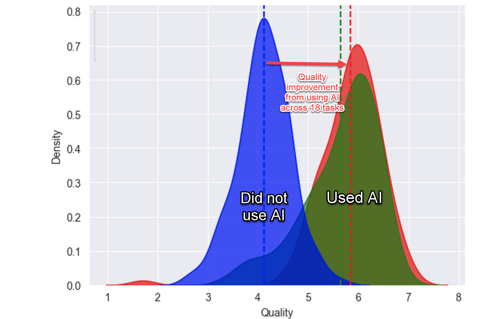
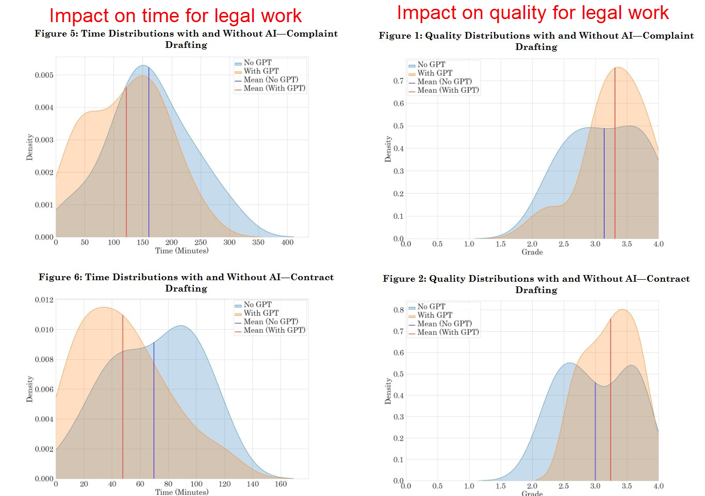

As we begin the second year of our AI Moment (it is still too early and dramatic to call it the AI Age), it is time to consider the future.  

在我们进入人工智能时刻的第二年之际（现在称之为人工智能时代还为时过早且过于夸张），是时候考虑未来了。

To be clear, nobody can tell you the future of AI accurately, except that AI development seems to be happening much, much faster than even experts expected.  

说清楚一点，除了人工智能的发展似乎比专家预期的要快得多之外，没有人能准确地告诉你人工智能的未来。  

We can be confident about that because a  

我们可以确信这一点，因为一篇[new paper just came out  

新论文刚刚发表](https://aiimpacts.org/wp-content/uploads/2023/04/Thousands_of_AI_authors_on_the_future_of_AI.pdf) surveying almost three thousand published AI researchers, following up on a similar paper published a year earlier.  

，对近三千名已发表的人工智能研究人员进行了调查，并对一年前发表的类似论文进行了跟进。  

The average estimated date for when AI could beat humans at  

仅仅在过去一年中，人工智能可能在**every possible task  

每一项可能的任务** shifted dramatically, moving from 2060 to 2047—a decrease of 13 years—in just the past year alone!  

上击败人类的平均估计日期就从 2060 年大幅提前至 2047 年——减少了 13 年！  

(And the collective estimate was that there was a 10% chance that it would happen by 2027).  

（并且集体估计有 10% 的可能性会在 2027 年发生）。

With so much changing so quickly, we need to take predictions with a grain of salt, but that doesn’t mean we can’t say anything useful about the coming year in AI.  

随着如此多的变化如此迅速地发生，我们需要谨慎地对待预测，但这并不意味着我们不能对人工智能的未来一年做出任何有用的预测。  

To ground ourselves, we can start with two quotes that should inform any estimates about the future.  

为了脚踏实地，我们可以从两句名言开始，这两句名言应该为任何对未来的估计提供信息。  

The first is  

第一句是[Amara’s Law:  

阿姆拉定律：](https://www.oxfordreference.com/display/10.1093/acref/9780191826719.001.0001/q-oro-ed4-00018679) “We tend to overestimate the effect of a technology in the short run and underestimate the effect in the long run.” Social change is slower than technological change.  

“我们倾向于高估一项技术在短期内的影响，而低估其在长期内的影响。”社会变革比技术变革慢。  

We should not expect to see immediate global effects of AI in a major way, no matter how fast its adoption (and it is remarkably fast), yet we certainly will see it sooner than many people think.  

无论人工智能的采用速度有多快（而且它的速度非常快），我们都不应期望立即看到人工智能对全球产生的重大影响，但我们肯定会比许多人想象的更快地看到它。

While Amara’s Law speaks to aggregate change, real change often originates in smaller communities and pockets, among user innovators and those with extreme needs, or in the research being done in labs and universities.  

阿马拉定律谈论的是整体变化，而真正的变化通常源于较小的社区和群体，源于用户创新者和有极端需求的人，或者源于实验室和大学的研究。  

If we want to understand what AI will do, we need to look for these early effects.  

如果我们想了解人工智能会做什么，我们需要寻找这些早期影响。  

This brings us to our second quote, by William Gibson, who famously wrote “The future is already here - it is just unevenly distributed” - a point backed up by decades of research on user innovation.  

这让我们想到了威廉·吉布森的第二句话，他曾写过著名的“未来已经到来——只是分布不均”——几十年的用户创新研究支持了这一点。

So rather than predict the future by speculating, it is worth looking at the places where it is already occurring.  

因此，与其通过猜测来预测未来，不如看看它已经发生的地方。  

Here is a rapid tour of the signs and portents that signal the future of AI.  

以下是对人工智能未来的迹象和预兆的快速浏览。

There are now enough careful studies of the use of AI in real work to draw three conclusions about how GPT-4 level AIs impact work performance:  

现在有足够多的关于在实际工作中使用人工智能的仔细研究，可以得出三个关于 GPT-4 级人工智能如何影响工作绩效的结论：

**1) AI boosts overall performance at complex work tasks.** In [the large-scale controlled trial that my colleagues and I conducted at Boston Consulting Group](https://www.oneusefulthing.org/p/centaurs-and-cyborgs-on-the-jagged) we found consultants using the same version of GPT-4 everyone in the world has access to 12.2% more tasks on average, completed tasks 25.1% more quickly, and produced 40% higher quality results than those without the tool.  

1) 人工智能提升了复杂工作任务的整体绩效。在我的同事和我于波士顿咨询集团进行的大规模受控试验中，我们发现使用每个人都能访问的相同版本的 GPT-4 的顾问平均多完成 12.2% 的任务，比没有该工具的人员快 25.1% 完成任务，并且产生了高出 40% 的优质结果。

A [new paper looking at legal work done by law student](https://papers.ssrn.com/sol3/papers.cfm?abstract_id=4626276)s found the same results. As have studies on writing, programming, and innovation.  

一篇研究法律学生所做的法律工作的新论文发现了相同的结果。写作、编程和创新方面的研究也发现了相同的结果。  

All of these papers rely on chatbots, but the impact seems to persist even when AI is integrated into other software.  

所有这些论文都依赖于聊天机器人，但即使将人工智能集成到其他软件中，这种影响似乎仍然存在。[Microsoft found large-scale performance improvements  

微软发现其由 GPT-4 驱动的 Copilot AI（已内置到 Office 应用程序中，但这是他们的产品，因此请谨慎对待）在会议和电子邮件中实现了大规模的绩效改进。](https://www.microsoft.com/en-us/worklab/work-trend-index/copilots-earliest-users-teach-us-about-generative-ai-at-work)in meetings and emails from their GPT-4 powered Copilot AI, which is built into Office applications (though it is their product, so take it with a grain of salt).  

总体而言，这些都是许多研究中非常一致的结果。  

Overall, these are very consistent results across many studies.  

在广泛的任务中实现 20%-80% 的改进，而无需培训或集成工作，这是闻所未闻的。  

A 20%-80% improvement across wide ranges of tasks, without training or integration work, is unheard of.  

这表明人工智能将在工作中发挥重要作用。  

And it suggests that AI is going to play a big role in work.

**2) The effects are largest for lower performers (for now).** Another universal result (which you can see in the graphs from the legal paper above) is that AI acts as a leveler, helping low performers more than high performers.  

2) 目前，效果对表现较差者最大。另一个普遍结果（您可以在上述法律文件的图表中看到）是，AI 充当均衡器，对表现较差者比对表现较好者更有帮助。  

This may temporary.  

这可能是暂时的。  

Current AIs are good enough that they essentially do solid work on their own, raising the level of lower performers who use them.  

当前的 AI 足够好，它们基本上可以独立完成扎实的工作，从而提高使用它们的较差表现者的水平。[In the long run, it may that AI ends up helping high performers more, or follows some other pattern entirely.  

从长远来看，AI 最终可能对表现较好者更有帮助，或者完全遵循其他模式。](https://www.oneusefulthing.org/p/everyone-is-above-average) We will learn a lot more about this in the coming year.  

我们将在来年了解更多关于这一点的信息。

**3) The Jagged Frontier: AI is better at some tasks than others.** Multiple studies have identified what we refer to as the 'Jagged Frontier' - because AI is excellent at some tasks that seem hard to humans, and bad at some tasks that seem easy, it is hard to know what it is good at in advance.  

3) 参差不齐的前沿：AI 在某些任务上的表现优于其他任务。多项研究确定了我们所说的“参差不齐的前沿”——因为 AI 在某些对人类来说似乎困难的任务上表现出色，而在某些看似简单的任务上表现不佳，因此很难预先知道它擅长什么。  

So, the only way to understand what AI can do is to use it and see what happens.  

因此，了解 AI 能做什么的唯一方法是使用它并看看会发生什么。  

Only with experience can you understand the shape of the frontier and learn to avoid relying on AI in cases where it does not operate well.  

只有通过经验，您才能了解前沿的形状，并学会避免在 AI 运行不佳的情况下依赖 AI。  

Though the frontier of what AIs can do is constantly expanding.  

尽管 AI 能做什么的前沿在不断扩展。

Despite these early findings, and as you might expect from Amara’s Law, many companies have been slow to deploy AI.  

尽管有这些早期发现，正如您可能从阿马拉定律中预期的那样，许多公司在部署人工智能方面进展缓慢。  

Actually, it is slightly worse than that: most companies have either ignored AI (  

实际上，情况略微糟糕：大多数公司要么忽视人工智能（[though their employees are using it all the time  

尽管其员工一直在使用它](https://www.oneusefulthing.org/p/detecting-the-secret-cyborgs)) or decided to treat it as s  

），要么决定将其视为某种标准知识管理工具，而这正是实际上并不擅长的任务[ome sort of standard knowledge management tool, a task that LLMs are not actually that good at  

这种缺乏想象力的现象可能会持续下去，并继续损害公司，但更多领导者将在来年意识到人工智能作为变革性力量的本质。](https://www.oneusefulthing.org/p/on-holding-back-the-strange-ai-tide).  

This failure of imagination will likely continue, and continue to hurt companies, but more leaders are going to wake up to the nature of AI as transformational in the coming year.  

我知道这一点，因为高管层的焦虑分布不均，而且已经出现了对普遍人工智能自满情绪的例外情况。

I know this because anxiety in the C-suite is unevenly distributed, and there are already exceptions to the general AI complacency.  

例如，软件公司 IgniteTech 的首席执行官埃里克·沃恩迅速看到了人工智能的含义，并使其在今年夏天成为整个公司的强制性使用工具。  

For example, Eric Vaughan, the CEO of software company IgniteTech, saw the implications of AI quickly and made its use mandatory throughout the company this summer.  

他让所有员工都可以访问 Plus 订阅和一些培训，并期望公司中的每个人都参与实验。  

He gave all employees access to a ChatGPT Plus subscription and some training, with the expectation that everyone in the company would engage in experimentation.

Eric was extremely serious about the need to transform that company - he fired everyone who did not at least try to use AI by the end of the month, and gave cash prizes to people who came up with good prompts to improve their work - a much more dramatic embrace of AI than I have seen elsewhere.

  

埃里克非常严肃地对待变革公司的必要性——他解雇了所有到月末仍未尝试使用人工智能的人，并给出了现金奖励给那些想出好提示来改进工作的人——这比我在其他地方看到的对人工智能的接受程度要强烈得多。  

But other companies are considering transformation as well.  

但其他公司也在考虑转型。  

Another organization I spoke to altered their hiring policy.  

我交谈过的另一家公司改变了他们的招聘政策。  

Before a new hire is approved, the team has to spend a couple hours trying to automate the potential job as using AI.  

在批准新员工之前，团队必须花几个小时尝试使用人工智能来实现潜在的工作自动化。  

They can only post new openings after they see how much AI can supplement or replace the need for a new employee.  

只有在他们了解到人工智能能够在多大程度上补充或取代对新员工的需求后，他们才能发布新的职位空缺。

The experiences of these early adopters suggest that productivity improvements could significantly alter the nature of jobs.  

这些早期采用者的经验表明，生产力的提高可能会极大地改变工作的性质。  

And, indeed, there are some troubling signs about the potential job market impact of AI on freelance workers.  

而且，确实有一些令人不安的迹象表明人工智能对自由职业者的潜在就业市场影响。[A new study of a major freelancing platform  

对一个主要自由职业平台进行的一项新研究](https://papers.ssrn.com/sol3/papers.cfm?abstract_id=4602944) found that posting for jobs that could be done with AI declined 21% after ChatGPT was introduced, and a 17% drop in graphic design jobs after image-creating AIs were released.  

发现，在ChatGPT推出后，可以由人工智能完成的工作的招聘信息下降了 21%，而在图像创建人工智能发布后，平面设计工作下降了 17%。  

We are likely to see similar effects ripple through the economy,  

我们很可能会看到类似的影响在经济中蔓延，[though a survey of economists still sees net job growth as a result of AI  

尽管经济学家的调查仍认为人工智能会带来净就业增长](https://cepr.org/voxeu/columns/impact-artificial-intelligence-growth-and-employment), there will certainly be many changes to individual jobs that policy makers need to consider.  

，但政策制定者肯定需要考虑个人工作岗位的诸多变化。

Despite the potential for disruption, another common finding in studies is that people who use AI for work are happier with their jobs, [because they outsource the boring work to the AI](https://www.oneusefulthing.org/p/in-praise-of-boring-ai).  

尽管存在颠覆的可能性，但研究中的另一个常见发现是，使用人工智能工作的人对自己的工作更满意，因为他们将无聊的工作外包给了人工智能。  

Leaders and managers of organizations need to think hard about how to capitalize on the positive aspects of AI-driven change while avoiding the negative.  

组织的领导者和管理者需要认真思考如何利用人工智能驱动的变革的积极方面，同时避免消极方面。  

A successful 2024 for AI’s role in work will be one in which considerable effort goes to thinking about  

2024 年人工智能在工作中发挥作用的成功之处在于，人们会花费大量精力思考[how to transform organizations  

如何转变组织](https://www.oneusefulthing.org/p/reshaping-the-tree-rebuilding-organizations), taking advantage of the inherent power (and weirdness) of AI in order to help both workers and companies flourish.  

，利用人工智能固有的力量（和怪异之处）来帮助工人和公司蓬勃发展。

Way back in February, [I wrote about](https://www.oneusefulthing.org/p/a-quick-and-sobering-guide-to-cloning) how easy it was to create a deepfake of myself.  

早在 2 月份，我就写过创建自己的深度伪造内容是多么容易。  

In the last year, the technology has come so much further.  

在过去的一年中，这项技术已经取得了很大的进步。**[To see what I mean, please watch this short video  

为了让我说的更清楚，请观看这个短视频](https://youtu.be/9EIsGra80_I)**. It is less than a minute and illustrates the point much better than I can with words.  

。它不到一分钟，并且比我能用语言说明的要好得多。  

It is the result of me recording a 30 second clip of video, and providing 30 seconds of my voice, to  

这是我录制一段 30 秒的视频剪辑，并提供 30 秒的语音给[Heygen](https://www.heygen.com/), one of many video AI startups.  

，众多视频 AI 初创公司之一，所产生的结果。  

After a couple of minutes, I had an avatar that I could make say anything, in any language.  

几分钟后，我便拥有了一个虚拟形象，我可以让它用任何语言说任何话。  

It used some of my motions (like adjusting the microphone) from the source video, but created a clone of my voice and altered my mouth movements, blinking and everything else.  

它使用了源视频中的一些我的动作（比如调整麦克风），但创建了一个我的声音的克隆，并改变了我的嘴部动作、眨眼和其他所有动作。  

And this took almost no time. You really can’t trust what you see or hear anymore.  

而且这几乎不需要时间。你真的不能再相信你看到或听到的东西了。

In addition to voice and video, AI images have become incredibly convincing.  

除了语音和视频，AI 图像也变得令人难以置信地信服。  

Here is the result of a few minutes of my using Midjourney 6 (just released as well) to produce cellphone images of the Hello Kitty invasion of America.  

这是我使用 Midjourney 6（也刚刚发布）几分钟后制作的凯蒂猫入侵美国的手机图像的结果。  

I picked an obviously fake topic, but realistic images of almost anyone and any scene are easy to make.  

我选择了一个显然是虚假的主题，但几乎任何人和任何场景的逼真图像都很容易制作。  

They are already circulating, and you will certainly be seeing a lot more of this, especially with upcoming election years in many countries.  

它们已经在流传，你肯定会看到更多这样的东西，尤其是在许多国家即将举行的选举年中。

Almost every area of information security is going to be altered in the coming year.  

几乎每个信息安全领域都将在来年发生改变。  

For example, AIs can now complete CAPTCHAS and send convincing emails to get people to click on malicious links.  

例如，人工智能现在可以完成验证码并发送令人信服的电子邮件，让人们点击恶意链接。

These changes are now inevitable.  

这些变化现在不可避免。  

Open source models, which are free to use and modify, can already fake voices, photos, emails and more - and they can run on a home computer.  

免费使用和修改的开源模型已经可以伪造语音、照片、电子邮件等 - 它们可以在家用电脑上运行。

Even if we shut down AI development, the information landscape post-2023 will never be the same as it was before.

  

即使我们关闭人工智能开发，2023 年之后的信息格局也永远不会像以前一样。  

I don’t think most people are ready for what that means for privacy, security (come up with a secret family password to prove your identity now!) and global politics.  

我认为大多数人还没有准备好应对这对隐私、安全（现在就想出一个秘密的家庭密码来证明你的身份！）和全球政治意味着什么。

If you have been reading this Substack, you know I am especially interested in the use of AI in education.  

如果你一直在阅读这个 Substack，你就会知道我对人工智能在教育中的应用特别感兴趣。  

I have written about our  

我写过关于我们的[papers and prompts  

论文和提示](https://www.oneusefulthing.org/p/assigning-ai-seven-ways-of-using) for teaching with AI, as well as  

，用于人工智能教学，以及[classroom experiments  

课堂实验](https://www.oneusefulthing.org/p/my-class-required-ai-heres-what-ive).  

(I hope to have a really in-depth dive into this topic in my next post, including lots of new examples of prompts and approaches.) Many other instructors are also experimenting with AI and sharing what they are learning.  

（我希望在下一篇文章中对此主题进行深入探讨，包括大量新的提示和方法示例。）许多其他讲师也在尝试人工智能并分享他们的学习成果。  

But we haven’t had good data from experiments using AI in education until very recently.  

但直到最近，我们还没有关于在教育中使用人工智能的实验的可靠数据。

Now we are starting to see some early results, and they suggest that the potential for AIs for teaching and mentoring is quite high. [A new large scale, pre-registered controlled experiment using GPT-4](https://papers.ssrn.com/sol3/papers.cfm?abstract_id=4641653) in tutoring found that practicing with the help of GPT-4 (especially when the AI was given a simple prompt to provide good explanations) significantly improved performance on SAT math problems. To be clear, GPT-4 is not yet a universal tutor, and the experiment was more about guided practice problems with AI help than a deep educational experience.  

现在我们开始看到一些早期结果，它们表明人工智能在教学和指导方面的潜力非常大。一项使用 GPT-4 进行辅导的大规模、预先注册的对照实验发现，在 GPT-4 的帮助下练习（尤其是在人工智能收到提供良好解释的简单提示时）可以显着提高 SAT 数学题的成绩。需要明确的是，GPT-4 还不是一个通用的导师，而且该实验更多的是关于在人工智能帮助下进行指导性练习题，而不是深入的教育体验。  

However, given that billions of people around the world have free GPT-4 access through Bing (and will be able to get a similar quality AI through Google, whenever they release Gemini Ultra), this is a potentially very important finding.  

然而，鉴于全球数十亿人可以通过必应免费访问 GPT-4（并且只要他们发布 Gemini Ultra，就可以通过谷歌获得类似质量的人工智能），这是一个潜在的非常重要的发现。

Moving beyond the classroom, we also have our first findings on the real-world impact of AI mentoring. A [fascinating new paper reports on a six-month long experiment using GPT-4 to provide advice to small business entrepreneurs in Kenya](https://osf.io/preprints/osf/hdjpk).  

除了课堂之外，我们还首次发现了人工智能辅导对现实世界的影响。一篇引人入胜的新论文报告了一项为期六个月的实验，该实验使用 GPT-4 为肯尼亚的小企业家提供建议。  

They found that getting AI mentoring boosted the performance of the best entrepreneurs by 20% - a very large effect for an educational intervention.  

他们发现，获得人工智能辅导使表现最好的企业家的绩效提高了 20%——这对教育干预来说是一个非常大的影响。  

Interestingly, low performers actually did worse after getting AI mentoring help because they tended to ask questions that the AI was not good at answering or got advice they could not take (many of the low performers had businesses that were already in trouble).  

有趣的是，表现不佳的人在获得人工智能辅导帮助后实际上做得更糟，因为他们倾向于提出人工智能不擅长回答的问题或得到他们无法接受的建议（许多表现不佳的人的企业已经陷入困境）。  

To me, this suggests that AI instruction can have real-world impacts, but we need to carefully design these tools to work for students of all ability levels.  

对我来说，这表明人工智能教学可以产生现实世界的影响，但我们需要仔细设计这些工具，以便适用于所有能力水平的学生。

Of course, there are also massive risks associated with AI in classrooms. The [AI can basically do everyone’s homework](https://www.oneusefulthing.org/p/the-homework-apocalypse) ([And remember, AI writing is undetectable](https://www.oneusefulthing.org/p/what-people-ask-me-most-also-some)). A lack of clear information means that there is confusion over how AI works and how to use it.  

当然，在课堂上使用人工智能也存在巨大的风险。人工智能基本上可以完成每个人的家庭作业（请记住，人工智能写作是无法检测到的）。缺乏明确的信息意味着人们对人工智能的工作方式及其使用方法感到困惑。  

And the biases and issues that AI brings to the classroom are still poorly understood.  

人工智能给课堂带来的偏见和问题仍然知之甚少。  

We are in the early days of exploring AI and education, but, given its wide-spread accessibility and potential for improving educational outcomes, t  

我们正处于探索人工智能和教育的早期阶段，但鉴于其广泛的可访问性和改善教育成果的潜力，t[his seems like an area where it is imperative that we actively experiment to find positive use cases  

这似乎是一个我们必须积极尝试以找到积极用例的领域](https://www.oneusefulthing.org/p/the-best-available-human-standard). I expect to see a lot of progress this year.  

。我预计今年会取得很大进展。

One clear theme of recent academic work on practical uses of LLMs is that there is a lot of potential left in GPT-4. It is [(still) best AI available](https://www.oneusefulthing.org/p/an-opinionated-guide-to-which-ai), despite being a system that is already year old. Consider this paper showing [a well-prompted GPT-4 beats the best specialized medical AI](https://www.microsoft.com/en-us/research/blog/the-power-of-prompting/) (and most doctors), or [this paper finding that GPT-4 can help automate novel scientific research](https://www.nature.com/articles/s41586-023-06792-0), or t[his one suggesting that GPT-4 can navigate web pages visually with the right tools](https://arxiv.org/abs/2401.01614).  

最近关于LLMs的实际用途的学术工作的一个明确主题是，GPT-4 中仍有很大潜力。它（仍然）是最好的可用人工智能，尽管它已经是一个一年前的系统了。考虑一下这篇论文，展示了一个经过良好提示的 GPT-4 击败了最好的专业医学人工智能（以及大多数医生），或者这篇论文发现 GPT-4 可以帮助自动执行新颖的科学研究，或者t 这篇论文表明，GPT-4 可以使用合适的工具在视觉上浏览网页。  

Even if we never exceeded GPT-4 level performance (very unlikely) we know that good prompting, connecting the LLM to other tools, and other simple approaches greatly expand the AI's capabilities.  

即使我们从未超过 GPT-4 水平的性能（极不可能），我们也知道良好的提示、将LLM连接到其他工具以及其他简单方法极大地扩展了人工智能的能力。  

I believe that we have 5-10 years of just figuring out what GPT-4 (and the soon-to-be-released Gemini Ultra) can do, even if AI development stopped today.  

我相信，即使人工智能发展在今天停止，我们也有 5-10 年的时间来弄清楚 GPT-4（以及即将发布的 Gemini Ultra）可以做什么。  

There are so many real-world tasks that are at least somewhat tractable by the current set of GPT-4 class LLMs with the right processes and tools.  

在当前的 GPT-4 类LLMs中，有很多现实世界的任务至少在一定程度上是可处理的，只要有合适的流程和工具。

[But, of course, technology is not going to stand still](https://www.oneusefulthing.org/p/the-shape-of-the-shadow-of-the-thing).  

但是，当然，技术不会停滞不前。  

Open source models are coming out every week that exceed ChatGPT-3.5 levels of performance and can run for free on a gaming computer.  

开源模型每周都会发布，其性能水平超过ChatGPT-3.5，并且可以在游戏计算机上免费运行。  

New models that will beat GPT-4 are in development and likely to be released this year.  

能够击败 GPT-4 的新模型正在开发中，并有可能在今年发布。  

AI is going to be integrated into your Google and Microsoft applications, with  

人工智能将集成到您的 Google 和 Microsoft 应用程序中，具有[uncertain implications  

不确定的含义](https://www.oneusefulthing.org/p/setting-time-on-fire-and-the-temptation). And the specter of possible AGI — that potential machine smarter than a human — haunts us.  

。而且，潜在的机器比人类更智能的通用人工智能的幽灵困扰着我们。

Among this broad acceleration, I think people who are worried about AI are often paying too much attention to scattered signals that AI might be hitting limits.  

在这一广泛的加速过程中，我认为担心人工智能的人们往往过于关注人工智能可能触及极限的零散信号。  

The _New York Times,  

例如，《纽约时报》最近起诉 OpenAI，原因是它在_ for example, recently sued OpenAI over how it trained on _Times  

《纽约时报》_data, including how it can, under some circumstances, reproduce copyrighted articles (and fake other articles the  

数据，包括在某些情况下它如何能够复制受版权保护的文章（以及伪造其他文章，_Times  

《纽约时报》_did not write).  

没有写过）。  

I am no legal expert, and cannot speak to the merits of the case, but I think it is extremely unlikely that any legal finding will do much to put the AI genie back in the bottle.  

我不是法律专家，无法对案件的优点发表意见，但我认为任何法律裁决都不太可能对让人工智能精灵重回瓶中起到多大作用。  

There are already companies, like Adobe, that only train AI on data they have unambiguous legal rights to, so there are paths forward for large companies even if the  

已经有一些公司，比如 Adobe，只对他们拥有明确法律权利的数据进行人工智能训练，因此即使_Times  

《纽约时报》_suit is successful.  

的诉讼成功，大型公司也有前进的道路。  

Additionally, open source models, already released into the wild and being developed all over the world, cannot be stopped.  

此外，已经发布到野外并在世界各地开发的开源模型是无法阻止的。  

And different legal rules in different countries (Japan appears to view copyright as not applying to training data) suggest that AI, as a global phenomenon, will continue.  

不同国家/地区不同的法律规则（日本似乎认为版权不适用于训练数据）表明，作为一种全球现象，人工智能将继续发展。

Most likely, AI development is actually going to accelerate for a while yet before it eventually slows down due to technical or economic or legal limits.  

很可能，人工智能的发展实际上会加速一段时间，然后才最终因技术、经济或法律限制而放缓。  

While how far AI comes this year is not yet clear, I do know that this may be the critical time to assert our agency over AI’s future.  

虽然今年人工智能能发展到什么程度尚不清楚，但我确实知道，这可能是对人工智能的未来施加我们能动性的关键时刻。  

Managers, educators, and policy makers need to recognize that we are living in an AI-haunted world, and we need to both adjust to it, and shape it, in ways that increase its benefits and mitigate its harms.  

管理者、教育工作者和政策制定者需要认识到，我们生活在一个受人工智能困扰的世界中，我们需要适应它，并以增加其益处和减轻其危害的方式塑造它。

We need to start now, because we are facing exponential change, and that means that even the signs and portents I have discussed in this post are quickly becoming prophecies of the past, rather than indicators of the future.  

我们需要立即开始，因为我们正面临着指数级变化，这意味着即使是我在这篇文章中讨论过的迹象和预兆也正迅速成为过去的预言，而不是未来的指标。

_Speaking of the future, I have a book coming out on April 2: “Co-Intelligence: Living and Working with AI.” If you like this Substack, you may like it as well.  

说到未来，我有一本书将于 4 月 2 日出版：“协同智能：与人工智能生活和工作”。如果您喜欢这个 Substack，您也可能会喜欢它。  

More on the book later,  

稍后会详细介绍这本书，[but it is available for pre-order here  

但它可以在此处预订](https://www.penguinrandomhouse.com/books/741805/co-intelligence-by-ethan-mollick/?ref=PRH98EE61A85F24&aid=19815&linkid=PRH98EE61A85F24)._

[Share  

分享](https://www.oneusefulthing.org/p/signs-and-portents?utm_source=substack&utm_medium=email&utm_content=share&action=share)
