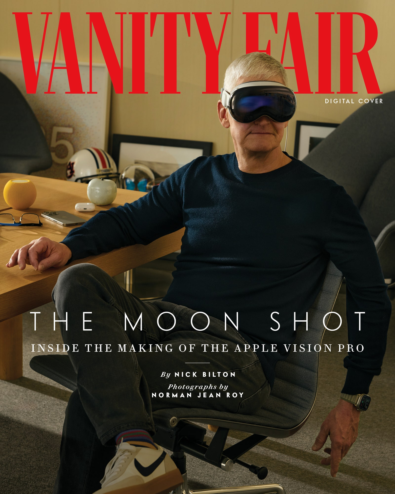

T**he first time** Tim Cook experienced the Apple Vision Pro, it wasn’t called the Apple Vision Pro.  

蒂姆-库克第一次体验 Apple Vision Pro 时，它还不叫 Apple Vision Pro。  

It was years ago; maybe six, seven, or even eight.  

那是几年前的事了，也许是六、七甚至八年前。  

Before the company built Apple Park, where we’re sitting right now, at a bleached oak table in this incredible circular edifice of a building clad in miles of curved glass.  

在苹果公司建造苹果园之前，也就是我们现在所坐的地方，在这座由数英里长的弧形玻璃包裹的令人难以置信的圆形建筑中，我们坐在一张漂白的橡木桌旁。  

It’s been raining, and the clouds are clearing over the pine trees and the rows of citrus and maple trees, and the sun is reflecting off the pond in the meadow, and it’s kind of mesmerizing.  

雨一直在下，松树、成排的柑橘树和枫树上云开雾散，阳光从草地上的池塘反射过来，令人陶醉。  

And Cook’s telling me about that time, all those years ago, in his dulcet Robertsdale, Alabama, accent, when he first saw it.  

库克用他那阿拉巴马州罗伯茨代尔的口音，向我讲述了多年前他第一次看到这本书时的情景。

It was at Mariani 1, a nondescript low-rise building on the edge of the old Infinite Loop campus with blacked-out windows.  

那是在玛丽安尼 1 号，一幢不起眼的低层建筑，位于旧无限循环校园的边缘，窗户都是黑的。  

This place is so secret, it’s known as one of Apple’s “black ops” facilities.  

这个地方非常秘密，被称为苹果公司的 "秘密行动 "设施之一。  

Nearly all of the thousands of employees who work at Apple have never set foot inside one.  

在苹果公司工作的数千名员工中，几乎所有人都从未踏进过苹果公司的大门。  

There are multiple layers of doors that lock behind and in front of you.  

你的前后左右都有多层门锁。  

But Cook is the CEO and can go anywhere.  

但库克是首席执行官，他可以去任何地方。  

So he strolls past restricted rooms where foldable iPhones and MacBooks with retractable keyboards or transparent televisions were dreamed up.  

因此，他漫步走过一些受限制的房间，在这些房间里，折叠式 iPhone 和带有可伸缩键盘的 MacBook 或透明电视都是梦寐以求的。  

Where these devices, almost all of which will never leave this building, are stored in locked Pelican cases inside locked cupboards.  

这些设备几乎都不会离开这座大楼，它们被存放在上锁的鹈鹕箱中，放在上锁的柜子里。

This building, after all, is folklore to Apple. It’s where the iPod and the iPhone were invented.  

毕竟，这栋大楼对于苹果公司来说是一个民间传说。iPod 和 iPhone 就是在这里发明的。  

This same building, where Cook finds the industrial design team working on this thing virtually no one else knows exists.  

就在这栋大楼里，库克发现工业设计团队正在研究这个几乎无人知晓的东西。  

Mike Rockwell, vice president of Apple’s Vision Products Group, is there when Cook enters and sees it.  

库克进来时，苹果公司视觉产品部副总裁迈克-罗克韦尔（Mike Rockwell）就在现场，他看到了这一幕。  

It’s like a “monster,” Cook tells me.  

库克告诉我，它就像一个 "怪物"。  

“An apparatus.” Cook’s told to take a seat, and this massive, monstrous machine is placed around his face.  

"一台仪器"库克被叫坐下，然后这台巨大的机器就围着他的脸转。  

It’s crude, like a giant box, and it’s got screens in it, half a dozen of them layered on top of each other, and cameras sticking out like whiskers.  

它很简陋，就像一个巨大的盒子，里面装着屏幕，半打屏幕层层叠叠，摄像头像胡须一样伸出来。  

“You weren’t really wearing it at that time,” he tells me.  

"他告诉我："你当时并没有真正穿上它。  

“It wasn’t wearable by any means of the imagination.” And it’s whirring, with big fans—a steady, deep humming sound—on both sides of his face.  

"无论如何都穿不上"他的脸两侧都有大风扇在呼呼作响，发出稳定而低沉的嗡嗡声。  

And this apparatus has these wires coming out of it that sinuate all over the floor and stretch into another room, where they’re connected to a supercomputer, and then buttons are pressed and lights go on and the CPU and GPU start pulsating at billions of cycles per second and…Tim Cook is on the moon!  

这台设备上的电线在地板上蜿蜒曲折，一直延伸到另一个房间，在那里它们与一台超级计算机相连，然后按下按钮，灯光亮起，CPU 和 GPU 开始以每秒数十亿次的频率跳动，然后......蒂姆-库克就登上了月球！

Photograph by Norman Jean Roy.  

摄影师：诺曼-让-罗伊

He’s sitting right there. On the fucking moon!  

他就坐在那里在他妈的月球上  

With Buzz Aldrin and Neil Armstrong of Apollo 11, he looks around and there’s the ghostly luminescence of ancient dust under a black, star-studded sky.  

与阿波罗 11 号的巴兹-奥尔德林和尼尔-阿姆斯特朗一起，他环顾四周，在星光闪烁的黑色天空下，古老的尘埃发出幽幽的荧光。  

It’s magnificent. It’s amazing. There, in the distance, is the earth. The blue dot.  

太壮观了。令人惊叹远处是地球蓝点  

Where all of this magic is happening.  

所有这些神奇的事情都发生在这里。

But Cook’s not just on the moon. He’s also in that secret room. In that secret building.  

但库克不仅在月球上他还在那个秘密房间里在那栋秘密建筑里  

And he can see Rockwell and other Apple employees, and he can see his own hands.  

他能看到罗克韦尔和其他苹果员工，也能看到自己的双手。  

And he knows right then and there what this all means. Like the universe is telling him something.  

他当时就知道这一切意味着什么。就像宇宙在告诉他什么。  

He knows that this is the future of computing and entertainment and apps and memories, and that this crude apparatus wrapped around his head will change everything.  

他知道，这是计算、娱乐、应用程序和记忆的未来，这个包裹在他头上的简陋装置将改变一切。  

He knows Apple has to make this thing its next product category.  

他知道，苹果公司必须把它作为下一个产品类别。

What Cook didn’t know is how his engineers were going to take this thing that needs a supercomputer in another room, and fans and multiple screens, and shrink it down to the size of a pair of goggles that weighs a little more than a box of spaghetti.  

库克不知道的是，他的工程师们如何把这个需要在另一个房间里安装超级计算机、风扇和多个屏幕的东西，缩小到一副护目镜的大小，重量比一盒意大利面条还要重一点。  

“I’ve known for years we would get here,” Cook told me.  

"库克告诉我："我早就知道我们会来到这里。  

“I didn’t know when, but I knew that we would arrive here.”  

"我不知道什么时候，但我知道我们会到达这里"

Now that time is finally here.  

现在，时间终于到了。  

The first Vision Pro, in a perfect white cube the size of a large shoebox, will arrive in stores on Friday, with tens of thousands of Apple obsessives and early adopters already having preordered it.  

首款 Vision Pro 将于本周五上市，它是一个完美的白色立方体，只有一个大鞋盒大小，数以万计的苹果痴迷者和早期用户已经预购了这款产品。  

Of course, the niche crowd is easy.  

当然，小众人群很容易。  

What Cook and his army of executives know is that the company still has to convince everyone else that, in their own daily lives, for work or entertainment or meditating or capturing the most surreal family memories, or all of the above, they need to spend $3,500 on a spatial computer.  

库克和他的高管团队知道，公司还必须说服其他人，在日常生活中，为了工作、娱乐、冥想或捕捉最不真实的家庭记忆，或以上所有目的，他们需要花 3500 美元购买一台空间电脑。  

A headset that makes you look, as a friend put it, like “you’re going skiing in the Matrix,” and on which you can’t access popular apps like Netflix and YouTube—at least not yet.  

用一位朋友的话说，这款耳机让你看起来就像 "在黑客帝国里滑雪"，而且至少现在还不能访问 Netflix 和 YouTube 等流行应用。  

It won’t be hard to get people to try the Apple Vision Pro; buying it may be another story.  

让人们尝试 Apple Vision Pro 并不难，但购买它可能是另一回事。  

Though fortunately for Apple, seemingly anyone who has strapped one on prior to Friday’s launch is preaching with the zeal of the converted about all the wondrous things it can do.  

但幸运的是，在周五的发布会之前，似乎所有戴上苹果手机的人都在以皈依者的热情宣扬它的神奇功能。

“I **would say** my experience was religious,” the director James Cameron told me when I asked him about his first encounter with the Apple Vision Pro.  

"当我问及导演詹姆斯-卡梅隆他与苹果 Vision Pro 的第一次接触时，他告诉我："我想说我的经历是虔诚的。  

“I was skeptical at first.  

"一开始我还心存疑虑。  

I don’t bow down before the great god of Apple, but I was really, really blown away.” Another prominent filmmaker, Jon Favreau, offered a similar sentiment, telling me he was “blown away” by the technology and what it will do to storytelling.  

我不会向伟大的苹果之神顶礼膜拜，但我真的非常非常震惊。另一位著名电影制片人乔恩-费儒（Jon Favreau）也表达了类似的看法，他告诉我，这项技术以及它对讲故事的作用让他 "大开眼界"。  

(Favreau created content for Apple specifically to showcase the device’s 3D capabilities, where a dinosaur climbs out of a screen and looks like it wants to eat you.) “I’m excited by what kind of story I can tell now that I couldn’t tell before now,” he said.  

(法夫罗专门为苹果公司制作了展示设备 3D 功能的内容，一只恐龙从屏幕中爬出来，看起来就像要吃人一样）。"他说："现在我可以讲述以前无法讲述的故事，这让我非常兴奋。  

And when I called Om Malik, who has been writing about tech since tech reporters used to write about calculators, he was even more effusive.  

当我给奥姆-马利克（Om Malik）打电话时，他更是赞不绝口，因为从科技记者写计算器开始，他就一直在写科技方面的文章。  

“It’s amazing! It’s incredible!” he enthused.  

"太神奇了！太不可思议了！"他兴奋地说。  

“You can feel a vibration in the universe!” Everyone else I’ve spoken to who has had a chance to try out the Apple Vision Pro: investors (“Whoa!”) and designers (“Wow!”) and analysts (“Ooh!”) and producers (“Ahh”).  

"你能感受到宇宙的振动！"与我交谈过的其他所有人都有机会试用 Apple Vision Pro：投资者（"哇！"）、设计师（"哇！"）、分析师（"哦！"）和制片人（"啊"）。

I was thinking about all of those _whoas_ and _wows_ and _oohs_ and _ahhs_ as I walked up to the Steve Jobs Theater, a round building with walls made of nothing but glass that hold up a massive cylindrical roof that looks like it’s resting on air.  

当我走到史蒂夫-乔布斯剧院（Steve Jobs Theater）的时候，我一直在想那些 "哇"、"哗"、"哦 "和 "啊 "的声音。这座圆形建筑的墙壁除了玻璃之外什么都没有，它支撑着一个巨大的圆柱形屋顶，看起来就像靠在空气上一样。  

It was my first time visiting “SJT,” as they call it, an homage to the man, the legend, the guy who dreamed all of this up.  

这是我第一次参观 "SJT"，他们称之为 "向传奇人物致敬"，是他创造了这一切。  

An Apple employee walked out holding a Pelican case the size of a lunch box, and I knew what was inside.  

一位苹果公司的员工拿着一个饭盒大小的 Pelican 盒子走了出来，我知道里面装的是什么。  

Yeah, it’s one of those.  

是的，这是其中之一。  

And seeing him reminded me that when I had first spoken to Apple months earlier, I had absolutely no desire to try what was inside that case.  

看到他，我想起了几个月前第一次与苹果公司交谈时，我完全不想尝试箱子里的东西。

Zero interest. Not an inkling.  

零兴趣。一点都不感兴趣

I didn’t watch Cook’s June keynote about the Apple Vision Pro.  

我没有看库克 6 月份关于 Apple Vision Pro 的主题演讲。  

I didn’t read the dissecting blog posts or the uninformed conjecture on social media.  

我没有看那些剖析性的博文，也没有看社交媒体上那些不知所云的猜测。  

I just kept scrolling, like I do when I see anything about Harry and Meghan.  

我就像看到任何有关哈里和梅根的消息一样，继续滚动。  

I told Cook this as I sat with him in the same room where he did that keynote, because I’ve seen this play before, and I know what the first act is like, and the second act, and I know how it ends.  

当我和库克坐在他做主题演讲的同一个房间里时，我告诉了他这一点，因为我以前看过这出戏，我知道第一幕是什么样的，第二幕是什么样的，我也知道结局是什么样的。

Back in 2013, in a conference room in Los Angeles, I strapped an Oculus VR headset to my head for the first time.  

2013 年，在洛杉矶的一间会议室里，我第一次将 Oculus VR 头显戴在头上。  

(Oculus, a well-funded start-up, would later be purchased by Facebook, which would later rename itself Meta.) It was cool, sure.  

(Oculus 是一家资金雄厚的初创公司，后来被 Facebook 收购，后者后来改名为 Meta）。当然，这很酷。  

I offered my proverbial “wow” and gave out a few oohs and aahs as I played a video game with brutalist square-edged graphics that looked like Pablo Picasso had smoked too much opium and designed a digital world.  

我在玩一款游戏时，发出了众所周知的 "哇 "的惊叹声，这款游戏的画面方方正正，看起来就像毕加索吸了太多的鸦片，设计出了一个数字世界。  

But after a few minutes I felt claustrophobic, and by the intermission I was mired in an existential crisis that maybe I had stopped inhabiting the real world because I could only see myself in the virtual one.  

但几分钟后，我就感到了幽闭恐惧症，中场休息时，我陷入了生存危机，也许我已经不再居住在现实世界中，因为我只能在虚拟世界中看到自己。  

Over the last decade, as the graphics became smoother and the chips faster, the same thing kept happening with each new VR device.  

在过去的十年中，随着图形变得更流畅，芯片变得更快，每款新的 VR 设备都出现了同样的情况。  

Rift, Vive, Quest, Quest 2, and Quest 3. I used them all once or twice, and then they went into a drawer or a cupboard or a box in my basement because I didn’t want to feel the claustrophobia of putting something on my face.  

Rift、Vive、Quest、Quest 2 和 Quest 3。我都用过一两次，然后就把它们放进抽屉、橱柜或地下室的盒子里，因为我不想感受把东西放在脸上的幽闭恐惧症。

Then last August, I was invited to Apple’s Los Angeles office, formally the home of Beats, to experience what I thought would be yet another VR device.  

去年 8 月，我应邀来到苹果公司洛杉矶办事处（Beats 的前身），体验了我以为会是另一款 VR 设备。  

I was sitting in a sleek room with white oak furniture and polished floors, and all I was thinking about was how long it would take me to get home, and whether I’d take the local streets because the 405 by that hour is just a nightmare.  

我坐在一间配有白橡木家具和抛光地板的时尚房间里，满脑子想的都是回家要花多长时间，以及我是否会走当地的街道，因为 405 公路在那个时间段简直就是一场噩梦。  

I sat on this gray couch, and an Apple employee told me to reach out and grab the Apple Vision Pro in front of me and place it on my head, which I did, reluctantly, just wanting to get this over with, and then—as I expected—the world disappeared, as it always does with VR headsets.  

我坐在这张灰色的沙发上，一位苹果公司的员工让我伸手拿起面前的 Apple Vision Pro，把它戴在头上，我很不情愿地照做了，只想快点结束这一切，然后--正如我所料--世界消失了，VR 头显总是这样。  

But that only lasted for a few seconds, because a digital curtain pulled back and behind it was the real world.  

但这只持续了几秒钟，因为数字幕布拉开了，幕布后面是真实的世界。  

I could see my arms and legs, and then the Apple app icons popped up in front of me like a multicolored apparition.  

我可以看到自己的胳膊和腿，然后苹果应用程序的图标就像一个五颜六色的幽灵一样出现在我面前。

This was as far from a VR headset as a kid’s Schwinn bicycle is from a Gulfstream G800 private jet.  

这与 VR 头显的距离就像儿童的 Schwinn 自行车与湾流 G800 私人飞机的距离一样遥远。  

Just as when I scrolled my finger around the wheel of the first iPod or used my finger and thumb to zoom into an image on the first iPhone.  

就像我用手指在第一代 iPod 的滚轮上滚动，或用手指和拇指放大第一代 iPhone 上的图像一样。  

With the Vision Pro, I could look at an app icon and simply tap my fingers together, and the app would open.  

有了 Vision Pro，我只需看着一个应用程序图标，手指轻轻一点，应用程序就会打开。  

And then it was hanging in front of me. In the clearest resolution I’d ever seen in my life.  

然后它就挂在了我的面前。这是我这辈子见过的最清晰的分辨率。  

I could swipe through images with my hands, move things with my fingers.  

我可以用手轻扫图片，用手指移动东西。  

Unlike other VR headsets, where you have to use a controller that feels like you have lobster claws for hands, with the Apple Vision Pro your eyes become the mouse absolutely seamlessly.  

与其他 VR 头显不同的是，在其他 VR 头显中，你必须使用一个手感像龙虾爪子一样的控制器，而在 Apple Vision Pro 中，你的眼睛完全可以无缝地变成鼠标。  

“It’s mind-blowing,” Cook said to me when I told him about my experience.  

"当我把我的经历告诉库克时，他对我说："太震撼了。  

“We live in a 3D world, but the content that we enjoy is flat.”  

"我们生活在一个 3D 的世界里，但我们欣赏的内容却是平面的"。

During that first demo I went to the iconic Mount Hood stratovolcano in Oregon, and I could hear and see a million raindrops falling into Mirror Lake, so much so that I felt like I was there, and the only thing missing was the earthy scent of rain-soaked soil.  

在第一次演示期间，我去了俄勒冈州标志性的胡德山平火山，我能听到和看到无数雨滴落入镜湖，以至于我仿佛身临其境，唯一缺少的就是雨水浸泡过的泥土的气息。  

I interacted with graphics in midair that were crisper than anything I’d ever seen before.  

我与半空中的图形进行了互动，它们比我以前见过的任何东西都要清晰。  

And I touched them all with my fingers, not a mouse or keyboard.  

我都是用手指触摸它们，而不是用鼠标或键盘。  

I saw spatial videos for the first time. To say this feature is astounding is an understatement.  

我第一次看到空间视频。如果说这项功能令人震惊，那简直是轻描淡写。  

You actually feel like the person is in front of you and you can reach out and touch them.  

实际上，你会觉得对方就在你面前，你可以伸手去触摸他。  

I saw clips of movies that were 100 feet wide, sharper and clearer than any IMAX.  

我看到了 100 英尺宽的电影片段，比任何 IMAX 电影都清晰锐利。  

But most importantly, I saw the world around me. That very room.  

但最重要的是，我看到了周围的世界。就在那个房间里。  

I didn’t feel closed off or claustrophobic. I was there. I was everywhere, all at once.  

我没有感到封闭或幽闭。我就在那里。我无处不在，一气呵成。

I left the Apple offices that day and went to a nearby coffee shop, and when I opened my laptop, a relatively new computer, it felt like a relic pulled from the rubble of a Soviet-era power plant.  

那天，我离开苹果公司的办公室，来到附近的一家咖啡馆，当我打开我的笔记本电脑时，这台相对较新的电脑给我的感觉就像是从苏联时期发电厂的废墟中挖出来的遗物。

“You know, one of our most common reactions we love is people go, ‘Hold on, I just need a minute.  

"你知道，我们最喜欢的反应之一就是人们会说，'等一下，我只需要一分钟。  

I need to process what just happened,’” said Greg “Joz” Joswiak, Apple’s senior vice president of worldwide marketing, as we ate lunch at Apple Park.  

苹果公司全球营销高级副总裁格雷格-乔兹-乔斯维克（Greg "Joz" Joswiak）在苹果公园吃午餐时说："我需要处理一下刚刚发生的事情。  

“How cool is that?  

"这有多酷？  

How often do people have a product experience where they’re left speechless, right?”  

人们有多少次产品体验会让他们哑口无言，对吗？

I wasn’t really left speechless until the second demo.  

直到第二次演示，我才真正无话可说。  

A few months after my initial experience, I went back to the LA offices.  

初次经历几个月后，我再次来到洛杉矶办事处。  

Two Apple employees led me into a room.  

两名苹果公司的员工把我领进了一个房间。  

I put on the Apple Vision Pro and the curtain opened and I was looking at them.  

我戴上 Apple Vision Pro，窗帘拉开，我就看到了他们。  

The only difference this time was I had a cup of tea with me.  

这次唯一不同的是，我带了一杯茶。  

In the middle of this new demo, I reached down and grabbed the tea and I took a sip, and as I did, one of my fingers flickered, like I was in a simulation no different from reality and there was a glitch.  

在这个新演示中，我伸手拿起茶，喝了一口，就在我喝的时候，我的一根手指闪了一下，就像我在一个与现实无异的模拟中，出现了一个小故障。

“Wait, what am I seeing?” I asked, confused. “Are you real? Or…”  

"等等，我看到了什么？"我困惑地问。"你是真的吗？还是......"

“No, you’re seeing a video of us that’s being rendered in real time,” one of the employees explained.  

"不，你看到的是我们实时呈现的视频，"一名员工解释说。  

I sat there for a moment, speechless.  

我呆坐了片刻，无言以对。  

I had thought what I had been seeing was the real world, and that all the digital wonder was layered on top of that.  

我一直以为我看到的是真实世界，而所有的数字奇观都是在真实世界之上叠加的。  

That the Apple Vision Pro was transparent and there was a layer of technology on top of it.  

Apple Vision Pro 是透明的，上面还有一层技术。  

In reality, it was the other way around.  

实际上，情况恰恰相反。

“I think it’s not evolutionary; it’s revolutionary,” Cameron said to me when I told him about my experience.  

"当我把我的经历告诉卡梅伦时，他说："我认为这不是进化，而是革命。  

“And I’m speaking as someone who has worked in VR for 18 years.” He explained that the reason it looks so real is because the Apple Vision Pro is writing a 4K image into my eyes.  

"我是一个在 VR 领域工作了 18 年的人"。他解释说，之所以看起来如此真实，是因为 Apple Vision Pro 将 4K 图像写入了我的眼睛。  

“That’s the equivalent of the resolution of a 75-inch TV into each of your eyeballs—23 million pixels.” To put that into perspective, the average 4K television has around 8 million pixels.  

"这相当于将一台 75 英寸电视机的分辨率植入你的每个眼球--2300 万像素"。从这个角度来看，普通 4K 电视的像素约为 800 万。  

Apple engineers didn’t slice off a rectangle from the corner of a 4K display and put it in the Apple Vision Pro.  

苹果工程师并没有从 4K 显示屏的一角切下一个矩形，然后把它放到 Apple Vision Pro 中。  

They somehow compressed twice as many pixels into a space as small as your eyeball.  

他们以某种方式将两倍的像素压缩到眼球那么小的空间里。  

This, to people like Cameron who have been working in this space for two decades, “solves every problem.”  

对于像卡梅伦这样在这一领域工作了二十年的人来说，这 "解决了所有问题"。

But even with all this wonder, with 23 million pixels that are so clear and crisp that you can’t tell reality from a digital composite of it, there are some problems Apple hasn’t solved—at least not yet.  

但是，即使拥有如此神奇的 2,300 万像素，清晰度如此之高，以至于你无法将现实与数字合成的图像区分开来，苹果公司仍有一些问题没有解决--至少现在还没有。

T**here’s an old** story about Steve Jobs that has become folklore in Silicon Valley.  

关于史蒂夫-乔布斯（Steve Jobs）有一个古老的故事，已经成为硅谷的民间传说。  

It takes place about 25 years ago, in that same nondescript black ops building, Mariani 1, where Cook would see the first Apple Vision Pro prototype years later.  

故事发生在大约 25 年前，就在那座不起眼的黑色行动大楼 Mariani 1，库克多年后在这里看到了第一台苹果 Vision Pro 原型机。  

Back then, in the late ’90s, Jobs had a team of engineers building the first iPod.  

上世纪 90 年代末，乔布斯的工程师团队正在制造第一代 iPod。  

They’re toiling away, bending physics and doing engineering acrobatics to make the smallest prototype of an iPod they can squeeze into a box.  

他们煞费苦心，弯曲物理学原理，在工程学上做杂技表演，以制造出能挤进盒子里的最小的 iPod 原型。  

Finally, when it can’t get any smaller, they take it to Jobs.  

最后，当它不能再小的时候，他们把它拿给了乔布斯。  

Now, these prototypes cost millions of dollars, sometimes more, and Jobs looks at it, he inspects it, and he says it needs to be smaller.  

现在，这些原型耗资数百万美元，有时甚至更多，乔布斯看着它，检查它，然后说它需要更小。  

The engineers say it’s as small as it can get, and Jobs walks over to a fish tank and drops the prototype in—_splash!_ And as it drowns, Jobs says, “You see those air bubbles? That means you can make it smaller.”  

工程师们说这已经是最小的了，乔布斯走到一个鱼缸前，把原型机扔了进去！当它被淹没时，乔布斯说："看到那些气泡了吗？这说明你可以把它做得更小

“You’ve got your M2 chip here…R1 chip…near zero latency…5,000 patents…seven years…” Richard Howarth, the vice president of industrial design, said in a thick Leicester accent as he pointed to the dozens of disassembled components splayed out in front of me, all of which made up the cadaver of the Apple Vision Pro.  

“You’ve got your M2 chip here…R1 chip…near zero latency…5,000 patents…seven years…”负责工业设计的副总裁理查德-豪沃斯（Richard Howarth）操着一口浓重的莱斯特口音，指着我面前摆放的几十个拆卸下来的部件说，所有这些部件构成了苹果 Vision Pro 的尸体。  

And yet, all I could think about was the fish story and that iPod prototype, and whether Jobs, if he were alive today, would throw the Apple Vision Pro into a fish tank and say, “There’s bubbles.  

然而，我满脑子都是鱼的故事和那个 iPod 原型，以及如果乔布斯还活着，他会不会把 Apple Vision Pro 扔进鱼缸，然后说："有气泡。  

Make it smaller!”  

小一点！"

If there’s one consistent grumble about the Apple Vision Pro, it’s about the size and weight.  

如果说对 Apple Vision Pro 有什么一致的抱怨，那就是它的尺寸和重量。  

It’s around 20 ounces, which might not sound like a lot, because you cook with ounces, you don’t necessarily wear them.  

它大约有 20 盎司，听起来可能不是很多，因为你做饭用的是盎司，不一定要佩戴。  

But that’s the same as five sticks of butter—imagine walking around with five sticks of butter on your face all day.  

但这相当于五条黄油--想象一下，你脸上整天涂着五条黄油走来走去吧。  

Carolina Cruz-Neira, a pioneer of virtual reality, told me that the way a device sits on your face really impacts how you respond to the technology.  

虚拟现实技术的先驱卡罗琳娜-克鲁兹-内拉（Carolina Cruz-Neira）告诉我，设备放在脸上的方式确实会影响你对技术的反应。  

“I’ve been working in VR for over 30 years, and until we can get the scuba diving mask off your face and we make it less noticeable, we’re not going to make this a mass-adoption technology,” Cruz-Neira said.  

"克鲁兹-内拉说："我在虚拟现实领域工作了 30 多年，除非我们能把潜水面罩从你的脸上取下来，并让它不那么引人注目，否则我们不会让这项技术得到大规模普及。  

“And the size and weight of these scuba diving masks are not going to be solved in a year.”  

"这些潜水面罩的尺寸和重量不是一年就能解决的"。

It’s largely this question that will determine if the Apple Vision Pro will be a financial success.  

苹果 Vision Pro 能否在财务上取得成功，很大程度上取决于这个问题。  

While Apple execs would only tell me “we’re excited” about the sales numbers so far, Wall Street analysts believe the company sold around 180,000 units in the opening weekend of online preorders.  

虽然苹果公司的高管只告诉我 "我们对目前的销售数字感到兴奋"，但华尔街分析师认为，该公司在首周末的在线预订中售出了约 180,000 台。  

Morgan Stanley anticipates that sales will ramp up to 2 million to 4 million units a year over the next five years, and it will become a new product category for the company.  

摩根士丹利预计，在未来五年内，该产品的销量将增至每年 200 万至 400 万台，并将成为公司的一个新产品类别。  

But others, like Ming-Chi Kuo, an Apple supply chain analyst, thinks it’s going to remain a niche product for some time.  

但也有一些人，比如苹果供应链分析师郭明池（Ming-Chi Kuo），认为它在一段时间内仍将是一款小众产品。  

Almost all the analysts I spoke with believe it will eventually get there.  

几乎所有与我交谈过的分析师都认为，它最终会实现这一目标。  

“We think a few years from now it’ll resemble sunglasses and be less than $1,500,” Dan Ives, a senior analyst at the investment firm Wedbush Securities, told me.  

"投资公司 Wedbush Securities 的高级分析师 Dan Ives 告诉我："我们认为，几年后，它将会像太阳镜一样，价格低于 1500 美元。

I didn’t even have to ask Howarth about the weight; he brought it up himself.  

我甚至都不用问 Howarth 关于体重的问题，他自己就提出来了。  

But he did so as he explained that this component and that component are made of magnesium and carbon fiber and aluminum (he pronounced it a-loo-_min_\-e-um, not a-_loo_\-min-um, which I respected as a Brit myself), and he noted that these are the lightest materials on earth, and that there is no more diminutive alternative.  

但他还是解释说，这个部件和那个部件都是由镁、碳纤维和铝（他的发音是 a-loo-min-eum，而不是 a-loo-min-um，作为英国人，我对此表示尊重）制成的，他还指出，这些都是地球上最轻的材料，没有比它们更小巧的替代品了。  

“There’s nothing we could have done to make it lighter or smaller,” Howarth explained.  

"Howarth 解释说："我们没有办法让它更轻或更小。  

“This is the state of the art.” Everyone else I spoke to at Apple proffered a similar sentiment.  

"这就是最先进的技术"。我在苹果公司与其他所有人交谈时，他们都发出了类似的感慨。  

“It feels like we’ve reached into the future and grabbed this product,” Joswiak said to me.  

"乔斯维克对我说："感觉就像我们把手伸向了未来，抓住了这个产品。  

“You’re putting the future on your face.” As did Rockwell, who told me: “We packed just about as much technology as you could possibly pack into that small of a form factor.”  

"你把未来写在脸上"罗克韦尔也这么说，他告诉我"我们在这么小的外形里 装进了尽可能多的技术"

“Y**ou can actually** lay on your sofa and put the displays on your ceiling if you wish,” Cook told me.  

"库克告诉我："如果你愿意，其实可以躺在沙发上，把显示器放在天花板上。  

“I watched the third season of _\[Ted\]_ _Lasso_ on my ceiling and it was unbelievable!” When I got home and hooked up my own Apple Vision Pro, I watched _Ford v Ferrari_ on my ceiling, and with the spatial audio it felt like Ken Miles’s Ford GT40 was in the room with me.  

"我在天花板上观看了《\[泰德\]套索》第三季，真是难以置信！"当我回到家并连接上自己的 Apple Vision Pro 时，我在天花板上观看了《福特大战法拉利》，通过空间音频，我感觉肯-迈尔斯的福特 GT40 就在我的房间里。  

“I think meditation is on a different level than anything I’ve ever experienced, and I’ve meditated for a long time,” Cook said.  

"库克说："我认为冥想与我所经历过的一切都不同，我已经冥想了很长时间。  

I’ve always had trouble meditating, and he was right about that too.  

我在冥想时总是遇到困难，这一点他也说对了。  

“And I use it for productivity,” Cook told me.  

"库克告诉我："我用它来提高工作效率。

Typing with the Apple Vision Pro virtual keyboard is a little like trying to write with a pen between your toes.  

使用 Apple Vision Pro 虚拟键盘打字有点像用脚趾夹着笔写字。  

Not impossible but impractical.  

不是不可能，而是不切实际。  

But when I opened my MacBook Pro while wearing the Vision Pro, the screen popped into my augmented reality and I was able to work pretty seamlessly.  

不过，当我戴着 Vision Pro 打开 MacBook Pro 时，屏幕就跳进了我的增强现实技术中，我可以非常流畅地工作。  

I’m actually writing these words here, the ones you’re reading, on the Vision Pro using the MacBook, and all I can say is I bet if you were watching me now you’d think I looked just like Tom Cruise in _Minority Report,_ only slightly more handsome. And then there’s those spatial videos.  

实际上，我是用 MacBook 在 Vision Pro 上写下这些文字，也就是你正在阅读的这些文字，我只能说，我敢打赌，如果你现在看着我，你会觉得我看起来就像《少数派报告》中的汤姆-克鲁斯，只是稍微帅气一些。还有那些空间视频。  

I’ve recorded and watched dozens of spatial videos of my kids just playing and talking, reliving moments that seem mundane but when played back are so emotionally immersive, it’s like stepping into a living, breathing memory.  

我录制并观看了几十段孩子们玩耍和聊天的空间视频，重温那些看似平淡无奇的时刻，回放时却让人感慨万千，仿佛走进了一段鲜活的记忆。  

Again, it’s hard to describe how realistic the environments feel, but I’ve found myself periodically returning to Mirror Lake, turning off all my notifications, and just sitting there at the edge of the water, peacefully watching and listening to the rain for 5 or 10 minutes before returning to work.  

同样，很难描述环境的真实感，但我发现自己会定期返回镜湖，关闭所有通知，就坐在水边，静静地看雨、听雨，5 或 10 分钟后再继续工作。

There are plenty of quirks using the device.  

使用该设备有很多怪癖。  

One of my favorites is when you use the Vision Pro in one room and then go to another, open the same app, and you have to find it by looking all around the room; sometimes it’s on the ceiling or the floor.  

我最喜欢的一件事是，当你在一个房间里使用 Vision Pro，然后去另一个房间，打开同一个应用程序，你必须在房间里四处寻找，有时它就在天花板或地板上。  

I couldn’t find my text app the other day and turned around to find it was in my bathroom.  

有一天，我找不到我的短信应用程序，一转身发现它在我的浴室里。  

(I later learned you can reset the apps by pressing the digital crown for a few seconds.) But the more I’ve used the Apple Vision Pro over the past two weeks, the more one glaring problem revealed itself to me.  

(后来我才知道，按住数字表冠几秒钟就可以重置应用程序）。但在过去两周里，我使用 Apple Vision Pro 越多，就越发现一个明显的问题。  

It’s not the weight (which is a problem but will come down over time), or the size (which will shrink with each iteration), or the worry that it will drive us to consume more content alone (almost half of Americans already watch TV alone).  

问题不在于重量（这是个问题，但随着时间的推移会逐渐减轻），也不在于体积（每次迭代都会缩小），更不在于担心它会促使我们独自消费更多的内容（几乎一半的美国人已经独自看电视了）。  

Or how tech giants like Meta, Netflix, Spotify, and Google are currently withholding their apps from the device.  

或者说，Meta、Netflix、Spotify 和谷歌等科技巨头目前是如何将其应用程序拒之门外的。  

(Content creators may come around once the consumers are there, and some, like Disney, are already embracing the device, making 150 movies available in 3D, including from mega-franchises like _Star Wars_ and Marvel.) And it’s not even the price, because if Apple wanted to, the company could subsidize the cost of the Apple Vision Pro and it would have about as much financial impact as Cook losing a nickel between his couch cushions.  

(一旦消费者接受了，内容制作商可能就会加入进来，迪斯尼等一些公司已经开始采用这种设备，推出了 150 部 3D 电影，其中包括《星球大战》和《漫威》等巨型电影）。这甚至不是价格的问题，因为如果苹果愿意，该公司可以对 Apple Vision Pro 的成本进行补贴，而这对财务的影响就像库克在他的沙发垫之间丢了五分钱一样。

I’m talking about something that I don’t see a solution for.  

我说的是我看不到解决办法的事情。

I first recognized the problem when I was at Apple Park, in the basement offices of SJT.  

我第一次意识到这个问题是在苹果园，在 SJT 的地下室办公室里。  

I was seeing yet another demo, this time in Joshua Tree, where I sat in the striking desert silhouette of the arid landscape.  

我又去看了一场演示，这次是在约书亚树，我坐在沙漠中，看到了干旱地貌中引人注目的轮廓。  

I played Fruit Ninja, where I got to slice fruit with my bare hands.  

我玩过《水果忍者》，可以徒手切水果。  

Then I tried a DJ app, where a turntable opened in front of me and I could slide the fader, tweak the mixer, and scratch the records, and I summoned a disco ball that magically clung to the ceiling as animated ravers danced around me.  

然后，我尝试了一款 DJ 应用，在这款应用中，我面前出现了一个转盘，我可以滑动推子、调整混音器、刮擦唱片，我还召唤了一个迪斯科球，它神奇地附着在天花板上，动画狂欢者在我身边翩翩起舞。

In the middle of my DJ set, an Apple employee said it was time to wrap up.  

在我的 DJ 表演进行到一半时，一位苹果公司的员工说该结束了。  

I took the Apple Vision Pro off, and that’s when it hit me. The problem.  

我摘下 Apple Vision Pro，这才发现问题所在。问题出在哪里？  

It happened again at home, scrolling through the spatial videos I’ve taken of my kids over the last few weeks, seeing them as if they’re actually in front of me.  

在家里，我滚动着过去几周为孩子们拍摄的空间视频，看到他们就像真的在我面前一样，这种感觉再次出现。  

And it’s going to happen in a few minutes, when I finish writing this article and the Word document in front of me the size of an IMAX screen goes away.  

几分钟后，当我写完这篇文章，我面前的 IMAX 屏幕大小的 Word 文档消失时，这一切就会发生。

When I take it off, every other device feels flat and boring: My 75-inch OLED TV feels like a CRT from the ’90s; my iPhone feels like a flip phone from yesteryear, and even the real world around me feels surprisingly flat.  

当我摘下它时，其他所有设备都感觉平淡无奇：我的 75 英寸 OLED 电视感觉就像 90 年代的显像管，我的 iPhone 感觉就像昔日的翻盖手机，就连我周围的现实世界也出奇地平淡无奇。  

And this is the problem.  

这就是问题所在。  

In the same way that I can’t imagine driving a car without a stereo, in the same way I can’t imagine not having a phone to communicate with people or take pictures of my children, in the same way I can’t imagine trying to work without a computer, I can see a day when we all can’t imagine living without an augmented reality.  

就像我无法想象在没有音响的情况下开车，无法想象没有手机与人交流或给孩子拍照，无法想象在没有电脑的情况下工作一样，我可以预见有一天我们都无法想象没有增强现实技术的生活。  

When we’re enveloped more and more by technology, to the point that we crave these glasses like a drug, like we crave our iPhones today but with more desire for the dopamine hit this resolution of AR can deliver.  

当我们被越来越多的技术所包围，以至于我们像吸食毒品一样渴求这些眼镜时，就像我们今天渴求 iPhone 一样，但我们更渴求这种分辨率的 AR 带来的多巴胺冲击。

I know deep down that the Apple Vision Pro is too immersive, and yet all I want to do is see the world through it.  

我深知 Apple Vision Pro 太具沉浸感了，但我只想通过它看世界。  

“I’m sure the technology is terrific.  

"我确信这项技术非常了不起。  

I still think and hope it fails,” one Silicon Valley investor said to me.  

一位硅谷投资者对我说："我仍然认为并希望它失败。  

“Apple feels more and more like a tech fentanyl dealer that poses as a rehab provider.” Harsh words, but he feels what we all feel, a slave to our smartphone, and he’s seen this play before and he knows what the first act is like, and the second act, and he knows how it ends.  

"苹果让人感觉越来越像一个技术芬太尼贩子" "冒充康复治疗提供商"他以前看过这出戏，知道第一幕和第二幕是什么样子，也知道结局是什么。

I didn’t ask Cook about this because I didn’t realize it all until days later, but I did ask him if technology is moving too quickly.  

我没有问库克这个问题，因为我直到几天后才意识到这一切，但我确实问了他，科技是否发展得太快了。  

If all of it, AI, spatial computing, and our reliance on technology, if it’s all too much.  

如果这一切、人工智能、空间计算以及我们对技术的依赖，都太过分了。  

“What does the future of it all look like?” I asked Cook.  

"这一切的未来是什么样的？"我问库克。

“I think it’s hard to predict exactly,” he replied.  

"他回答说："我认为很难准确预测。

“But you’re making it,” I said. “So don’t you get to predict it?”  

"但你正在创造它，"我说。"那你就不能预测一下吗？"

“What we do is we get really excited about something and then we start pulling the string and see where it takes us,” Cook told me.  

"库克告诉我："我们所做的就是对某件事情感到非常兴奋，然后我们就开始牵线搭桥，看看它会把我们带向何方。  

“And yes, we’ve got things on the road maps and so forth, and yes, we have a definitive point of view.  

"是的，我们已经在路线图等方面有所行动，是的，我们有明确的观点。  

But a lot of it is also the exploration and figuring out.” He concluded, “Sometimes the dots connect.  

但很多时候也是在探索和摸索"。他最后说："有时候，点与点之间是相通的。  

And they lead you to some place that you didn’t expect.” (Letting connected dots lead the way was a theme Cook’s predecessor used to talk about.)  

它们会把你带到你意想不到的地方。(让连点带路是库克的前任经常谈论的一个主题）。

The question is, is the place we’re about to go, into the era of spatial computing, going to make our lives better, or will it become the next technology that becomes a necessity, where we can’t live in a world that’s not augmented?  

问题是，我们即将进入的空间计算时代会让我们的生活更美好，还是会成为下一个成为必需品的技术，让我们无法生活在一个没有增强功能的世界？  

I think Joswiak had it half right when he said, “It feels like we’ve reached into the future and grabbed this product.  

乔斯维克说："感觉就像我们把手伸向了未来，抓住了这个产品。  

You’re putting the future on your face.” I think it’s the other way around.  

你是在把未来写在脸上"。我觉得恰恰相反。  

Apple is taking us into the future, into a new era of computing.  

苹果正带领我们进入未来，进入一个全新的计算时代。  

Some of us are running as fast as we can to get there, and others are being dragged, kicking and screaming.  

我们中有些人拼命奔跑，有些人则被拖着又踢又叫。  

But we’re all going.  

但我们都要去。  

We’re going to the moon, and we’re going to look around at the ghostly luminescence of ancient dust under a black, star-studded sky, and we’ll just know that this is the future of computing and entertainment and apps and memories, and that this apparatus wrapped around our head will change everything.  

我们将登上月球，在星罗棋布的黑色星空下，环视远古尘埃发出的幽幽荧光，我们只知道这就是计算、娱乐、应用程序和记忆的未来，这个包裹在我们头上的仪器将改变一切。

-   “I Need Six to Eight Pardons”: Inside the [Secret Scheme](https://www.vanityfair.com/news/sidney-powells-secret-scheme-find-trumps-votes) to “Find” Trump’s Votes  
    
    "我需要六到八次赦免"："寻找 "特朗普选票的秘密计划内幕
    
-   [Simone Biles](https://www.vanityfair.com/style/simone-biles-cover-interview) Talks Marriage, WAG Life, and the Paris Olympics  
    
    西蒙娜-拜尔斯谈婚姻、WAG 生活和巴黎奥运会
