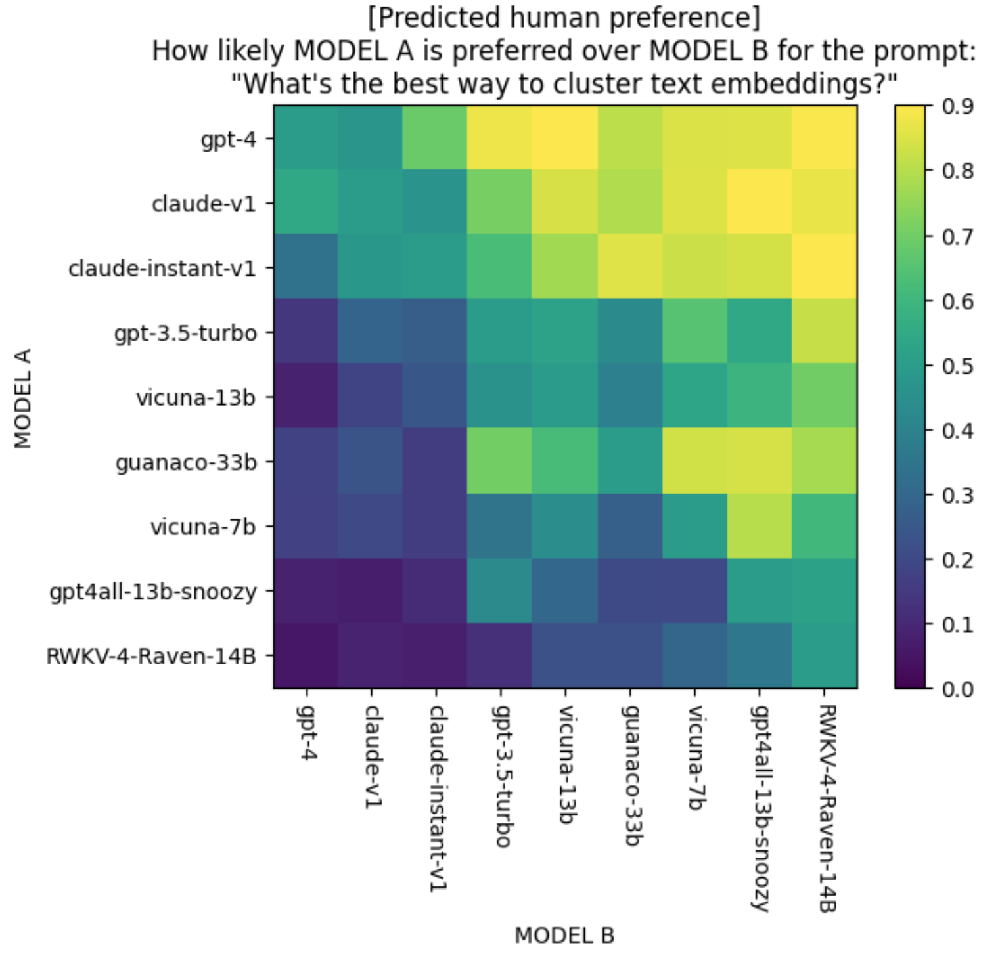
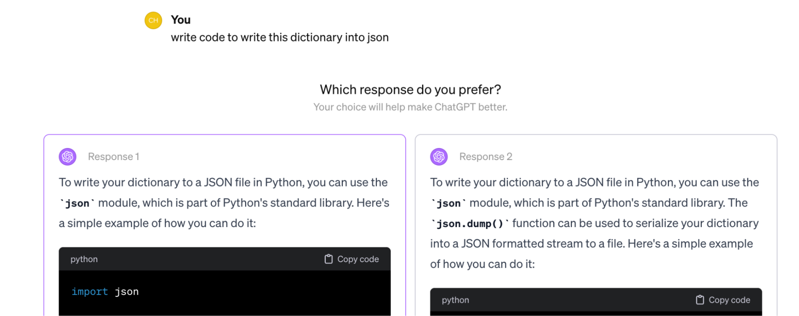
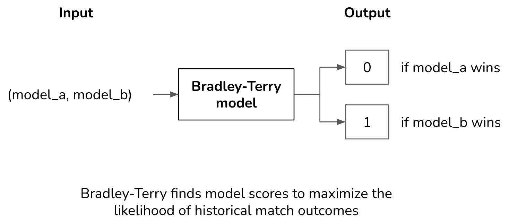
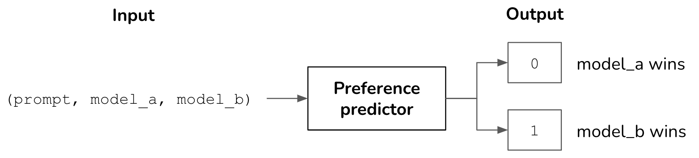
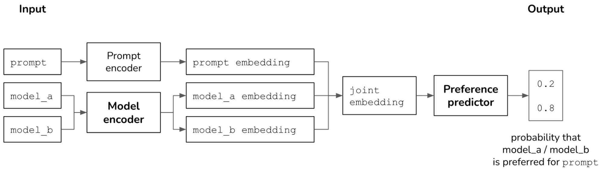
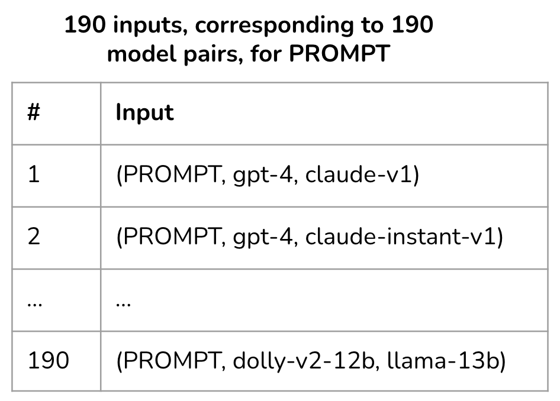
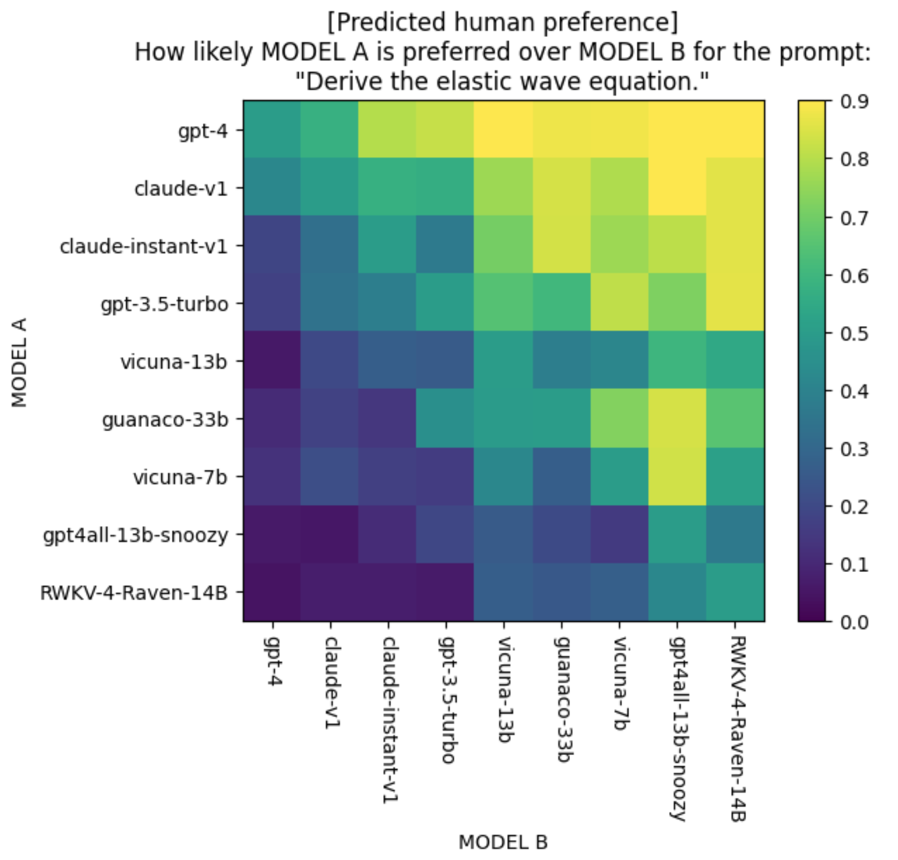
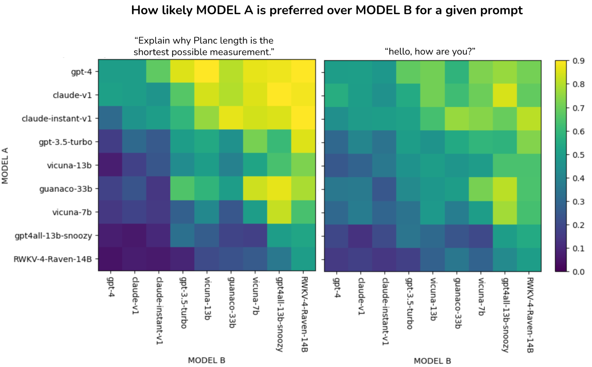
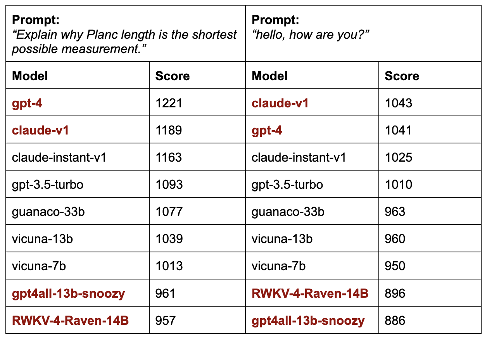
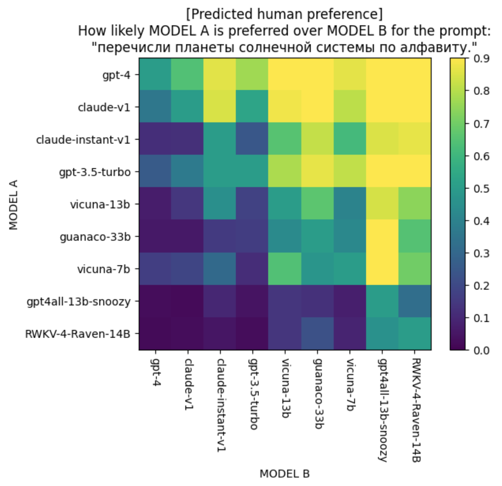

A challenge of building AI applications is choosing which model to use. What if we don’t have to?  

构建人工智能应用的一个难题是选择使用哪种模型。如果我们不必这样做呢？  

What if we can predict the best model for any prompt?  

如果我们能预测任何提示的最佳模型呢？  

Predictive human preference aims to predict which model users might prefer for a specific query.  

预测人类偏好的目的是预测用户在进行特定查询时可能偏好哪种模型。

___

**Table of contents  

目录**  

[Ranking Models Using Human Preference  

利用人类偏好对模型进行排序](https://huyenchip.com/2024/02/28/predictive-human-preference.html#ranking_models_using_human_preference)  

…. [How Preferential Ranking Works](https://huyenchip.com/2024/02/28/predictive-human-preference.html#how_preferential_ranking_works)  

....优先排序的工作原理  

…. [Correctness of Chatbot Arena Ranking](https://huyenchip.com/2024/02/28/predictive-human-preference.html#correctness_of_chatbot_arena_ranking)  

....聊天机器人竞技场排名的正确性  

…….. [Eval data](https://huyenchip.com/2024/02/28/predictive-human-preference.html#eval_data)  

........评估数据  

…….. [Results](https://huyenchip.com/2024/02/28/predictive-human-preference.html#results)  

........成果  

[Predicting Human Preference For Each Prompt  

预测人类对每个提示的偏好](https://huyenchip.com/2024/02/28/predictive-human-preference.html#predicting_human_preference_for_each_prompt)  

…. [Experiment setup](https://huyenchip.com/2024/02/28/predictive-human-preference.html#experiment_setup)  

....实验设置  

…. [Experiment results](https://huyenchip.com/2024/02/28/predictive-human-preference.html#experiment_results)  

....实验结果  

…….. [Domain-specific and query-specific leaderboards](https://huyenchip.com/2024/02/28/predictive-human-preference.html#domain_specific_and_query_specific_leaderboards)  

........特定领域和特定查询的排行榜  

[Conclusion  

结论](https://huyenchip.com/2024/02/28/predictive-human-preference.html#conclusion)  

___

Human preference has emerged to be both the Northstar and a powerful tool for AI model development.  

人类偏好已成为人工智能模型开发的北斗星和有力工具。  

Human preference guides post-training techniques including [RLHF](https://huyenchip.com/2023/05/02/rlhf.html) and [DPO](https://arxiv.org/abs/2305.18290). Human preference is also used to rank AI models, as used by LMSYS’s [Chatbot Arena](https://arena.lmsys.org/).  

人的偏好可以指导包括 RLHF 和 DPO 在内的后期训练技术。LMSYS 的聊天机器人竞技场（Chatbot Arena）也使用人类偏好对人工智能模型进行排序。

Chatbot Arena aims to determine which model is generally preferred.  

聊天机器人竞技场旨在确定哪种模式更受青睐。  

I wanted to see if it’s possible to predict which model is preferred _for each query_.  

我想看看是否有可能预测出每个查询的首选模型。

One use case of predictive human preference is model routing.  

预测人类偏好的一个应用案例是模型路由。  

For example, if we know in advance that for a prompt, users will prefer Claude Instant’s response over GPT-4, and Claude Instant is cheaper/faster than GPT-4, we can route this prompt to Claude Instant.  

例如，如果我们事先知道，对于某个提示，用户更喜欢 Claude Instant 的响应而不是 GPT-4，而 Claude Instant 又比 GPT-4 更便宜/更快，那么我们就可以将该提示路由到 Claude Instant。  

Model routing has the potential to increase response quality while reducing costs and latency.  

模型路由有可能提高响应质量，同时降低成本和延迟。

Another use case of predictive human preference is interpretability.  

预测人类偏好的另一个用例是可解释性。  

Mapping out a model’s performance on different prompts can help us understand this model’s strengths and weaknesses.  

绘制模型在不同提示下的表现图有助于我们了解该模型的优缺点。  

See section **Experiment results** for examples.  

示例请参见 "实验结果 "部分。

Here’s what predictive human preference for different model pairs looks like for the prompt “_What’s the best way to cluster text embeddings?_”. The predictions were generated by my toy preference predictor.  

下面是针对 "对文本嵌入进行聚类的最佳方法是什么？"这一提示，人类对不同模型对的预测偏好。这些预测由我的玩具偏好预测器生成。  

The bright yellow color for the (GPT-4, GPT-3.5-Turbo) cell means that my predictor thinks GPT-4’s response is very likely to be preferred to that of GPT-3.5-Turbo’s for this prompt.  

GPT-4、GPT-3.5-Turbo）单元格的亮黄色表示我的预测器认为 GPT-4 的回答很可能比 GPT-3.5-Turbo 的回答更适合这个提示。

This post first discusses the correctness of Chatbot Arena, which will then be used as a baseline to evaluate the correctness of preference predictions.  

本文章首先讨论了 Chatbot Arena 的正确性，然后将以此为基准来评估偏好预测的正确性。  

It then discusses how to build a preference predictor and the initial results.  

然后讨论如何建立偏好预测器以及初步结果。

## Ranking Models Using Human Preference  

利用人类偏好对模型进行排序

Using preferential signals (comparisons) to rank models has grown in popularity in the last few years.  

使用偏好信号（比较）对模型进行排序在过去几年中越来越受欢迎。  

Other than powering LMSYS’s [Chatbot Arena](https://arena.lmsys.org/), it’s also used by many model providers ([Anthropic](https://arxiv.org/abs/2112.00861), Gemini, ChatGPT, etc.) to evaluate their models in production.  

除了为 LMSYS 的聊天机器人竞技场提供动力外，它还被许多模型提供商（Anthropic、Gemini、ChatGPT 等）用于评估其生产中的模型。

**Side note**: Friends who have deployed this in production told me that most users don’t read both options and just randomly vote for one.  

题外话：在生产中使用过这种方法的朋友告诉我，大多数用户不会同时阅读两个选项，而是随意选择其中一个。  

This introduces a lot of noise.  

这会产生大量噪音。  

However, the signals from the small percentage of users who vote correctly can sometimes be sufficient to help determine which model is preferred, as long as there’s minimal bias in the random voting.  

不过，只要随机投票中的偏差最小，来自一小部分正确投票用户的信号有时足以帮助确定哪个模型更受欢迎。

### How Preferential Ranking Works  

优先排序的工作原理

Preferential ranking works in two steps:  

优先排序分两步进行：

1.  Collect comparison data about user preference.  
    
    收集有关用户偏好的对比数据。
2.  Compute a model ranking from these comparisons.  
    
    根据这些比较结果计算模型排名。

For each request, two or more models are selected to respond.  

对于每项请求，都会选择两个或更多型号做出响应。  

An evaluator, which can be human or AI, picks the winner.  

评估者（可以是人类或人工智能）选出优胜者。  

The evaluator shouldn’t know which models are being judged. Each comparison is called a _match_. This process results in a series of comparisons.  

评估者不应该知道正在对哪些模型进行评估。每次比较称为一次匹配。这个过程会产生一系列比较。

<table data-immersive-translate-walked="4a987b65-ecc2-4806-82cd-e3de990ccc46"><tbody data-immersive-translate-walked="4a987b65-ecc2-4806-82cd-e3de990ccc46"><tr data-immersive-translate-walked="4a987b65-ecc2-4806-82cd-e3de990ccc46"><td data-immersive-translate-walked="4a987b65-ecc2-4806-82cd-e3de990ccc46"><strong data-immersive-translate-walked="4a987b65-ecc2-4806-82cd-e3de990ccc46" data-immersive-translate-paragraph="1">Match ID 匹配 ID</strong></td><td data-immersive-translate-walked="4a987b65-ecc2-4806-82cd-e3de990ccc46"><strong data-immersive-translate-walked="4a987b65-ecc2-4806-82cd-e3de990ccc46" data-immersive-translate-paragraph="1">Prompt 提示</strong></td><td data-immersive-translate-walked="4a987b65-ecc2-4806-82cd-e3de990ccc46"><strong data-immersive-translate-walked="4a987b65-ecc2-4806-82cd-e3de990ccc46" data-immersive-translate-paragraph="1">Model A A 型</strong></td><td data-immersive-translate-walked="4a987b65-ecc2-4806-82cd-e3de990ccc46"><strong data-immersive-translate-walked="4a987b65-ecc2-4806-82cd-e3de990ccc46" data-immersive-translate-paragraph="1">Model B B 型</strong></td><td data-immersive-translate-walked="4a987b65-ecc2-4806-82cd-e3de990ccc46"><strong data-immersive-translate-walked="4a987b65-ecc2-4806-82cd-e3de990ccc46" data-immersive-translate-paragraph="1">Winner 优胜者</strong></td></tr><tr data-immersive-translate-walked="4a987b65-ecc2-4806-82cd-e3de990ccc46"><td data-immersive-translate-walked="4a987b65-ecc2-4806-82cd-e3de990ccc46">1</td><td data-immersive-translate-walked="4a987b65-ecc2-4806-82cd-e3de990ccc46">…</td><td data-immersive-translate-walked="4a987b65-ecc2-4806-82cd-e3de990ccc46" data-immersive-translate-paragraph="1">Model 1 模型 1</td><td data-immersive-translate-walked="4a987b65-ecc2-4806-82cd-e3de990ccc46" data-immersive-translate-paragraph="1">Model 2 模型 2</td><td data-immersive-translate-walked="4a987b65-ecc2-4806-82cd-e3de990ccc46" data-immersive-translate-paragraph="1">Model 1 模型 1</td></tr><tr data-immersive-translate-walked="4a987b65-ecc2-4806-82cd-e3de990ccc46"><td data-immersive-translate-walked="4a987b65-ecc2-4806-82cd-e3de990ccc46">2</td><td data-immersive-translate-walked="4a987b65-ecc2-4806-82cd-e3de990ccc46">…</td><td data-immersive-translate-walked="4a987b65-ecc2-4806-82cd-e3de990ccc46" data-immersive-translate-paragraph="1">Model 3 模型 3</td><td data-immersive-translate-walked="4a987b65-ecc2-4806-82cd-e3de990ccc46" data-immersive-translate-paragraph="1">Model 1 模型 1</td><td data-immersive-translate-walked="4a987b65-ecc2-4806-82cd-e3de990ccc46" data-immersive-translate-paragraph="1">Model 1 模型 1</td></tr><tr data-immersive-translate-walked="4a987b65-ecc2-4806-82cd-e3de990ccc46"><td data-immersive-translate-walked="4a987b65-ecc2-4806-82cd-e3de990ccc46">3</td><td data-immersive-translate-walked="4a987b65-ecc2-4806-82cd-e3de990ccc46">…</td><td data-immersive-translate-walked="4a987b65-ecc2-4806-82cd-e3de990ccc46" data-immersive-translate-paragraph="1">Model 1 模型 1</td><td data-immersive-translate-walked="4a987b65-ecc2-4806-82cd-e3de990ccc46" data-immersive-translate-paragraph="1">Model 4 模型 4</td><td data-immersive-translate-walked="4a987b65-ecc2-4806-82cd-e3de990ccc46" data-immersive-translate-paragraph="1">Model 4 模型 4</td></tr><tr data-immersive-translate-walked="4a987b65-ecc2-4806-82cd-e3de990ccc46"><td data-immersive-translate-walked="4a987b65-ecc2-4806-82cd-e3de990ccc46">...</td><td data-immersive-translate-walked="4a987b65-ecc2-4806-82cd-e3de990ccc46">...</td><td data-immersive-translate-walked="4a987b65-ecc2-4806-82cd-e3de990ccc46">...</td><td data-immersive-translate-walked="4a987b65-ecc2-4806-82cd-e3de990ccc46">...</td><td data-immersive-translate-walked="4a987b65-ecc2-4806-82cd-e3de990ccc46">...</td></tr></tbody></table>

From these comparisons, we need to compute the rankings of all models.  

通过这些比较，我们需要计算出所有模型的排名。  

The two most common ranking algorithms are [Elo](https://en.wikipedia.org/wiki/Elo_rating_system) (from chess) and [TrueSkill](https://en.wikipedia.org/wiki/TrueSkill) (from video games).  

最常见的两种排名算法是 Elo（来自国际象棋）和 TrueSkill（来自电子游戏）。

While Chatbot Arena refers to their model scores “Elo scores”, they actually don’t use Elo.  

虽然 Chatbot Arena 将他们的模型分数称为 "Elo 分数"，但实际上他们并没有使用 Elo。  

In December 2023, they switched to [Bradley-Terry](https://lmsys.org/blog/2023-12-07-leaderboard/#transition-from-online-elo-rating-system-to-bradley-terry-model) but scaled the resulting scores to make them look Elo-like (see their [notebook](https://colab.research.google.com/drive/1KdwokPjirkTmpO_P1WByFNFiqxWQquwH#scrollTo=HdZrGr4IcWCl)).  

2023 年 12 月，他们改用 Bradley-Terry 算法，但将得出的分数按比例缩放，使其看起来类似 Elo（见他们的笔记本）。

Given a history of match outcomes, the Bradley-Terry algorithm finds the model scores that maximize the likelihood of these match outcomes, turning model scoring into a maximum likelihood estimation problem.  

布拉德利-特里算法给定比赛结果的历史记录，找出使这些比赛结果的可能性最大化的模型得分，从而将模型评分转化为最大可能性估计问题。  

The input, for each training example, is the models that participate in the match.  

每个训练实例的输入都是参与匹配的模型。  

The output is the outcome of the match.  

输出即为比赛结果。  

Assuming there’s no draw, the outcome of a match is either 0 (a wins) or 1 (b wins).  

假设没有平局，比赛结果要么是 0（a 获胜），要么是 1（b 获胜）。

### Correctness of Chatbot Arena Ranking  

聊天机器人竞技场排名的正确性

Given the same match outcomes, different ranking algorithms can produce different rankings.  

同样的比赛结果，不同的排名算法会产生不同的排名。  

For example, the ranking computed by Elo might differ from the ranking computed by Bradley-Terry.  

例如，Elo 计算的排名可能与 Bradley-Terry 计算的排名不同。  

How do we know that a ranking is correct?  

我们如何知道排名是否正确？

At its core, model ranking is a predictive problem.  

模型排序的核心是预测问题。  

We compute a ranking from historical match outcomes and use it to predict future match outcomes.  

我们根据历史比赛结果计算排名，并以此预测未来的比赛结果。  

The quality of a ranking is determined by how accurately it can predict future match outcomes.  

排名的质量取决于其预测未来比赛结果的准确程度。

Let’s say we have a match between model A and model B.  

假设模型 A 和模型 B 之间存在匹配关系。  

If model A has a higher score, meaning that the ranking algorithm predicts that A wins.  

如果模型 A 得分更高，意味着排名算法预测 A 获胜。  

If users indeed prefer the higher-ranking model, the ranking algorithm makes a correct prediction.  

如果用户确实更喜欢排名较高的模型，排名算法就会做出正确的预测。

#### Eval data  

评估数据

To compute the accuracy of Chatbot Arena ranking, I used their data published in July 2023, which consists of [33K crowd-sourced comparisons](https://drive.google.com/file/d/1ZXiBRtADf9HZ8eEarIFTy-qrPNDUP_H0/view) for matches among 20 models. I used this smaller dataset instead of [their Jan 2024 dataset](https://drive.google.com/file/d/1ZXiBRtADf9HZ8eEarIFTy-qrPNDUP_H0/view) because this smaller dataset contains the prompt used for each match, which I need for predictive human preference.  

为了计算 Chatbot Arena 排名的准确性，我使用了他们在 2023 年 7 月发布的数据，其中包括 33K 个人群来源的 20 个模型之间的匹配比较。我使用了这个较小的数据集，而不是他们的 2024 年 1 月数据集，因为这个较小的数据集包含了每场比赛使用的提示，而这正是我预测人类偏好所需要的。  

Benchmarking on this dataset allows me to compare my model with the Bradley-Terry algorithm later on.  

以这个数据集为基准，我就可以将我的模型与 Bradley-Terry 算法进行比较。

Here’s an example from their July 2023 dataset.  

下面是 2023 年 7 月数据集中的一个例子。

<table data-immersive-translate-walked="4a987b65-ecc2-4806-82cd-e3de990ccc46"><tbody data-immersive-translate-walked="4a987b65-ecc2-4806-82cd-e3de990ccc46"><tr data-immersive-translate-walked="4a987b65-ecc2-4806-82cd-e3de990ccc46"><td data-immersive-translate-walked="4a987b65-ecc2-4806-82cd-e3de990ccc46"><strong data-immersive-translate-walked="4a987b65-ecc2-4806-82cd-e3de990ccc46" data-immersive-translate-paragraph="1">prompt 推动</strong></td><td data-immersive-translate-walked="4a987b65-ecc2-4806-82cd-e3de990ccc46"><strong data-immersive-translate-walked="4a987b65-ecc2-4806-82cd-e3de990ccc46" data-immersive-translate-paragraph="1">model_a 模型_a</strong></td><td data-immersive-translate-walked="4a987b65-ecc2-4806-82cd-e3de990ccc46"><strong data-immersive-translate-walked="4a987b65-ecc2-4806-82cd-e3de990ccc46" data-immersive-translate-paragraph="1">model_b 模型_b</strong></td><td data-immersive-translate-walked="4a987b65-ecc2-4806-82cd-e3de990ccc46"><strong data-immersive-translate-walked="4a987b65-ecc2-4806-82cd-e3de990ccc46" data-immersive-translate-paragraph="1">winner 获奖者</strong></td><td data-immersive-translate-walked="4a987b65-ecc2-4806-82cd-e3de990ccc46"><strong data-immersive-translate-walked="4a987b65-ecc2-4806-82cd-e3de990ccc46" data-immersive-translate-paragraph="1">model_a's response model_a 的答复</strong></td><td data-immersive-translate-walked="4a987b65-ecc2-4806-82cd-e3de990ccc46"><strong data-immersive-translate-walked="4a987b65-ecc2-4806-82cd-e3de990ccc46" data-immersive-translate-paragraph="1">model_b's response model_b 的回复</strong></td></tr><tr data-immersive-translate-walked="4a987b65-ecc2-4806-82cd-e3de990ccc46"><td data-immersive-translate-walked="4a987b65-ecc2-4806-82cd-e3de990ccc46" data-immersive-translate-paragraph="1">who was the last monarch of uk 英国最后一任君主是谁</td><td data-immersive-translate-walked="4a987b65-ecc2-4806-82cd-e3de990ccc46" data-immersive-translate-paragraph="1">koala-13b 考拉-13b</td><td data-immersive-translate-walked="4a987b65-ecc2-4806-82cd-e3de990ccc46" data-immersive-translate-paragraph="1">vicuna-13b</td><td data-immersive-translate-walked="4a987b65-ecc2-4806-82cd-e3de990ccc46" data-immersive-translate-paragraph="1">model_a 模型_a</td><td data-immersive-translate-walked="4a987b65-ecc2-4806-82cd-e3de990ccc46" data-immersive-translate-paragraph="1">The last monarch of the United Kingdom was Queen Elizabeth II, who reigned from 1952 to 2020. 英国最后一任君主是伊丽莎白二世女王，在位时间为 1952 年至 2020 年。</td><td data-immersive-translate-walked="4a987b65-ecc2-4806-82cd-e3de990ccc46" data-immersive-translate-paragraph="1">The current monarch of the United Kingdom is Queen Elizabeth II. 英国现任君主是女王伊丽莎白二世。 She has been the monarch since 1952, and is the longest-reigning monarch in British history. 她自 1952 年以来一直担任君主，是英国历史上在位时间最长的君主。</td></tr></tbody></table>

For reference, the Bradley-Terry (BT) scores of the top 7 models in this dataset are as follows.  

作为参考，该数据集中排名前 7 位的模型的布拉德利-特里（BT）得分如下。

1.  GPT-4: 1189
2.  Claude-v1: 1150
3.  Claude-instant-v1: 1110
4.  GPT-3.5-Turbo: 1104
5.  WizardLM-13B: 1058
6.  Vicuna-13b: 1040
7.  Guanaco-33b: 1031

To create a test set, I randomly select 10% of the data (3300 examples).  

为了创建测试集，我随机抽取了 10%的数据（3300 个示例）。  

Each match has three possible outcomes: model\_a wins, model\_b wins, or tie.  

每场比赛都有三种可能的结果：model\_a 获胜、model\_b 获胜或平局。  

This can still be framed as a binary classification problem if we treat a tied match as two matches: one in which model\_a wins and one in which model\_b wins.  

如果我们把一场平局比赛看作两场比赛：一场是模型\_a 获胜，另一场是模型\_b 获胜，那么这仍然可以被看作是一个二元分类问题。

#### Results  

成果

I found that for all non-tie matches in my test set, the model with the higher Bradley-Terry score is preferred 74.1% of the time.  

我发现，在测试集中的所有非平局匹配中，74.1% 的情况下，Bradley-Terry 得分较高的模型更受青睐。  

This means that if we always predict the higher-ranked model as the winner for a match, we’d have an accuracy of 74.1%.  

这意味着，如果我们总是预测排名较高的模型为比赛的获胜者，我们的准确率将达到 74.1%。

<table data-immersive-translate-walked="4a987b65-ecc2-4806-82cd-e3de990ccc46"><tbody data-immersive-translate-walked="4a987b65-ecc2-4806-82cd-e3de990ccc46"><tr data-immersive-translate-walked="4a987b65-ecc2-4806-82cd-e3de990ccc46"><td data-immersive-translate-walked="4a987b65-ecc2-4806-82cd-e3de990ccc46"><strong data-immersive-translate-walked="4a987b65-ecc2-4806-82cd-e3de990ccc46" data-immersive-translate-paragraph="1">Test data 测试数据</strong></td><td data-immersive-translate-walked="4a987b65-ecc2-4806-82cd-e3de990ccc46"><strong data-immersive-translate-walked="4a987b65-ecc2-4806-82cd-e3de990ccc46" data-immersive-translate-paragraph="1">Output classes 输出类别</strong></td><td data-immersive-translate-walked="4a987b65-ecc2-4806-82cd-e3de990ccc46"><strong data-immersive-translate-walked="4a987b65-ecc2-4806-82cd-e3de990ccc46" data-immersive-translate-paragraph="1"># samples # 样品</strong></td><td data-immersive-translate-walked="4a987b65-ecc2-4806-82cd-e3de990ccc46"><strong data-immersive-translate-walked="4a987b65-ecc2-4806-82cd-e3de990ccc46" data-immersive-translate-paragraph="1">BT's accuracy 英国电信的准确性</strong></td></tr><tr data-immersive-translate-walked="4a987b65-ecc2-4806-82cd-e3de990ccc46"><td data-immersive-translate-walked="4a987b65-ecc2-4806-82cd-e3de990ccc46" data-immersive-translate-paragraph="1">All matches 所有比赛</td><td data-immersive-translate-walked="4a987b65-ecc2-4806-82cd-e3de990ccc46"><ul data-immersive-translate-walked="4a987b65-ecc2-4806-82cd-e3de990ccc46"><li data-immersive-translate-walked="4a987b65-ecc2-4806-82cd-e3de990ccc46" data-immersive-translate-paragraph="1">model_a wins 模型 a 获胜</li><li data-immersive-translate-walked="4a987b65-ecc2-4806-82cd-e3de990ccc46" data-immersive-translate-paragraph="1">model_b wins 模型_b获胜</li><li data-immersive-translate-walked="4a987b65-ecc2-4806-82cd-e3de990ccc46">tie</li></ul></td><td data-immersive-translate-walked="4a987b65-ecc2-4806-82cd-e3de990ccc46">3,300</td><td data-immersive-translate-walked="4a987b65-ecc2-4806-82cd-e3de990ccc46">53.33%</td></tr><tr data-immersive-translate-walked="4a987b65-ecc2-4806-82cd-e3de990ccc46"><td data-immersive-translate-walked="4a987b65-ecc2-4806-82cd-e3de990ccc46" data-immersive-translate-paragraph="1">Non-tie matches 非平局比赛</td><td data-immersive-translate-walked="4a987b65-ecc2-4806-82cd-e3de990ccc46"><ul data-immersive-translate-walked="4a987b65-ecc2-4806-82cd-e3de990ccc46"><li data-immersive-translate-walked="4a987b65-ecc2-4806-82cd-e3de990ccc46" data-immersive-translate-paragraph="1">model_a wins 模型 a 获胜</li><li data-immersive-translate-walked="4a987b65-ecc2-4806-82cd-e3de990ccc46" data-immersive-translate-paragraph="1">model_b wins 模型_b获胜</li></ul></td><td data-immersive-translate-walked="4a987b65-ecc2-4806-82cd-e3de990ccc46">2,367</td><td data-immersive-translate-walked="4a987b65-ecc2-4806-82cd-e3de990ccc46">74.1%</td></tr><tr data-immersive-translate-walked="4a987b65-ecc2-4806-82cd-e3de990ccc46"><td data-immersive-translate-walked="4a987b65-ecc2-4806-82cd-e3de990ccc46" data-immersive-translate-paragraph="1">Non-tie matches involving GPT-4 涉及 GPT-4 的非平局比赛</td><td data-immersive-translate-walked="4a987b65-ecc2-4806-82cd-e3de990ccc46"><ul data-immersive-translate-walked="4a987b65-ecc2-4806-82cd-e3de990ccc46"><li data-immersive-translate-walked="4a987b65-ecc2-4806-82cd-e3de990ccc46" data-immersive-translate-paragraph="1">model_a wins 模型 a 获胜</li><li data-immersive-translate-walked="4a987b65-ecc2-4806-82cd-e3de990ccc46" data-immersive-translate-paragraph="1">model_b wins 模型_b获胜</li></ul></td><td data-immersive-translate-walked="4a987b65-ecc2-4806-82cd-e3de990ccc46">355</td><td data-immersive-translate-walked="4a987b65-ecc2-4806-82cd-e3de990ccc46" data-immersive-translate-paragraph="1">85.1% (always pick GPT-4 as winner) 85.1%（总是选 GPT-4 为优胜者）</td></tr></tbody></table>

Back in July 2023, GPT-4 was considered the strongest model by a long shot (this was before Gemini, Mistral, Claude-v2).  

早在 2023 年 7 月，GPT-4 就被认为是最强大的机型（这是在双子座、Mistral、Claude-v2 之前）。  

Did users always prefer GPT-4 to all other models? They didn’t.  

与其他所有机型相比，用户总是更喜欢 GPT-4 吗？并非如此。  

In 355 non-tie matches involving GPT-4, GPT-4 wins 85.1%.  

在 355 场涉及 GPT-4 的非平局比赛中，GPT-4 获胜率为 85.1%。

This means that even though GPT-4 is the best model overall, there are prompts for which other models can outperform GPT-4. If we can figure out which prompts these are, and which models work best for them, we can route these prompts to the best-performing models, improving the response quality.  

这意味着，尽管 GPT-4 是整体上最好的模型，但在某些提示上，其他模型的表现也会优于 GPT-4。如果我们能找出这些提示是哪些，以及哪些模型最适合它们，我们就能将这些提示路由到性能最好的模型，从而提高响应质量。

## Predicting Human Preference For Each Prompt  

预测人类对每个提示的偏好

If a ranking algorithm is about figuring out which model is better overall, predictive human preference is about figuring out which model is better for each prompt.  

如果说排名算法是为了找出哪种模式更适合整体，那么预测人类偏好则是为了找出哪种模式更适合每个提示。  

If we know in advance that for a particular prompt, GPT-3.5 works just as well as GPT-4, and GPT-3.5 is cheaper, we can route that prompt to GPT-3.5 instead.  

如果我们事先知道，对于某个特定的提示符，GPT-3.5 和 GPT-4 一样好用，而且 GPT-3.5 更便宜，那么我们就可以将该提示符路由到 GPT-3.5。  

Or if we know that Mistral-7B works just as well as GPT-4 and Mistral-7B is faster, we can route our query to Mistral-7B instead.  

或者，如果我们知道 Mistral-7B 和 GPT-4 运行得一样好，而且 Mistral-7B 的速度更快，那么我们可以将查询路由到 Mistral-7B。

Model routing can also help with budget planning.  

模型路由还有助于预算规划。  

Say, you only have enough budget to serve 50% of queries on the strongest model, and the rest to a weaker model, you want to make sure that you send to the weaker model only the queries that you’re confident it can do well on.  

如果您只有足够的预算将 50% 的查询发送给最强的模型，而将其余的发送给较弱的模型，那么您要确保只向较弱的模型发送您确信它能处理好的查询。

### Experiment setup  

实验设置

I treat predictive human preference as a binary classification task.  

我将预测人类偏好视为一项二元分类任务。  

Given a match between 2 models, predict which one wins.  

给定两个模型之间的比赛，预测哪一个获胜。  

If the probability of model\_a winning is around 0.5, it can be considered a tie.  

如果 model\_a 获胜的概率约为 0.5，则可视为平局。  

If a Bradley-Terry model takes only `(model_a, model_b)` as the input, a preference predictor takes `(prompt, model_a, model_b)` as the input.  

如果布拉德利-特里模型只将 `(model_a, model_b)` 作为输入，那么偏好预测器则将 `(prompt, model_a, model_b)` 作为输入。

The architecture of my preference predictor looks like this.  

我的偏好预测器的结构是这样的。  

The model encoder and preference predictor are neural networks that can be trained independently or together.  

模型编码器和偏好预测器都是神经网络，可以单独训练，也可以一起训练。  

I used DistilBERT as my prompt encoder.  

我使用 DistilBERT 作为提示编码器。

To train my model, I used 90% of LMSYS’s July 2023 dataset.  

为了训练我的模型，我使用了 LMSYS 2023 年 7 月数据集的 90%。  

I found that the predictor performed better using only non-tie matches (as opposed to using both tie and non-tie matches).  

我发现，仅使用非领带匹配（而不是同时使用领带和非领带匹配）时，预测器的性能更好。  

I randomly flipped the order of models in a match 50% of the time.  

在一场比赛中，我有 50% 的时间都是随机翻转模型的顺序。

To evaluate my model, I used 10% of this data.  

为了评估我的模型，我使用了其中 10% 的数据。  

This is the same test data used to evaluate the correctness of Chatbot Arena’s ranking above.  

这与上文用于评估 Chatbot Arena 排名正确性的测试数据相同。

<table data-immersive-translate-walked="4a987b65-ecc2-4806-82cd-e3de990ccc46"><tbody data-immersive-translate-walked="4a987b65-ecc2-4806-82cd-e3de990ccc46"><tr data-immersive-translate-walked="4a987b65-ecc2-4806-82cd-e3de990ccc46"><td data-immersive-translate-walked="4a987b65-ecc2-4806-82cd-e3de990ccc46"><strong data-immersive-translate-walked="4a987b65-ecc2-4806-82cd-e3de990ccc46" data-immersive-translate-paragraph="1">Split 分割</strong></td><td data-immersive-translate-walked="4a987b65-ecc2-4806-82cd-e3de990ccc46"><strong data-immersive-translate-walked="4a987b65-ecc2-4806-82cd-e3de990ccc46" data-immersive-translate-paragraph="1">All matches 所有比赛</strong></td><td data-immersive-translate-walked="4a987b65-ecc2-4806-82cd-e3de990ccc46"><strong data-immersive-translate-walked="4a987b65-ecc2-4806-82cd-e3de990ccc46" data-immersive-translate-paragraph="1">Non-tie matches 非平局比赛</strong></td></tr><tr data-immersive-translate-walked="4a987b65-ecc2-4806-82cd-e3de990ccc46"><td data-immersive-translate-walked="4a987b65-ecc2-4806-82cd-e3de990ccc46" data-immersive-translate-paragraph="1">Train 火车</td><td data-immersive-translate-walked="4a987b65-ecc2-4806-82cd-e3de990ccc46">29,700</td><td data-immersive-translate-walked="4a987b65-ecc2-4806-82cd-e3de990ccc46">20,927</td></tr><tr data-immersive-translate-walked="4a987b65-ecc2-4806-82cd-e3de990ccc46"><td data-immersive-translate-walked="4a987b65-ecc2-4806-82cd-e3de990ccc46" data-immersive-translate-paragraph="1">Test 测试</td><td data-immersive-translate-walked="4a987b65-ecc2-4806-82cd-e3de990ccc46">3,300</td><td data-immersive-translate-walked="4a987b65-ecc2-4806-82cd-e3de990ccc46">2,367</td></tr></tbody></table>

**Note**: I should’ve made a separate validation set for hyperparameter tuning.  

注：我应该为超参数调整制作一个单独的验证集。  

However, given that I didn’t have a lot of data and this is only a proof of concept, I didn’t do it.  

不过，鉴于我没有很多数据，而且这只是一个概念验证，所以我没有这么做。  

(I’m also lazy.) The matches are among 20 models, corresponding to 190 model pairs.  

(我也很懒。）匹配的是 20 个模型，对应 190 个模型对。  

20,927 comparisons mean that, on average, there are only 110 comparisons per model pair.  

20 927 次比较意味着平均每个模型对只有 110 次比较。

### Experiment results  

实验结果

I evaluated my preference predictor under two settings:  

我在两种设置下评估了我的偏好预测器：

1.  Using only `model_a` and `model_b` as the input.  
    
    仅使用 `model_a` 和 `model_b` 作为输入。  
    
    This is to see whether this predictor, using only model names, can make better predictions about match outcomes than Chatbot Arena scores.  
    
    这样做的目的是为了了解这种仅使用模型名称的预测器是否能比 Chatbot Arena 分数更好地预测比赛结果。
2.  Using `(prompt, model_a, model_b)` as the input. This is to see whether including prompts helps improve match outcome prediction.  
    
    使用 `(prompt, model_a, model_b)` 作为输入。这是为了了解加入提示是否有助于改善比赛结果预测。

I found that for all non-tie matches, my preference predictor can predict the match outcome accurately 75% of the time if not using prompts, and 76.2% of the time if using prompts.  

我发现，对于所有非平局匹配，如果不使用提示，我的偏好预测器能在 75% 的时间内准确预测匹配结果，而如果使用提示，则能在 76.2% 的时间内准确预测匹配结果。  

This suggests that human preference for models does change depending on the prompt.  

这表明，人类对模型的偏好确实会随着提示的不同而改变。  

While the improvement doesn’t seem much, a 2.1% improvement can be significant at scale.  

虽然改善幅度似乎不大，但 2.1% 的改善幅度在一定范围内是非常显著的。

<table data-immersive-translate-walked="4a987b65-ecc2-4806-82cd-e3de990ccc46"><tbody data-immersive-translate-walked="4a987b65-ecc2-4806-82cd-e3de990ccc46"><tr data-immersive-translate-walked="4a987b65-ecc2-4806-82cd-e3de990ccc46"><td data-immersive-translate-walked="4a987b65-ecc2-4806-82cd-e3de990ccc46"><strong data-immersive-translate-walked="4a987b65-ecc2-4806-82cd-e3de990ccc46" data-immersive-translate-paragraph="1">Eval data 评估数据</strong></td><td data-immersive-translate-walked="4a987b65-ecc2-4806-82cd-e3de990ccc46"><strong data-immersive-translate-walked="4a987b65-ecc2-4806-82cd-e3de990ccc46" data-immersive-translate-paragraph="1"># eval samples # 评估样本</strong></td><td data-immersive-translate-walked="4a987b65-ecc2-4806-82cd-e3de990ccc46"><strong data-immersive-translate-walked="4a987b65-ecc2-4806-82cd-e3de990ccc46" data-immersive-translate-paragraph="1">Chatbot Arena 聊天机器人竞技场</strong></td><td data-immersive-translate-walked="4a987b65-ecc2-4806-82cd-e3de990ccc46" data-immersive-translate-paragraph="1"><strong data-immersive-translate-walked="4a987b65-ecc2-4806-82cd-e3de990ccc46" data-immersive-translate-paragraph="1">Preference predictor 偏好预测器</strong> (without prompts) (无提示）</td><td data-immersive-translate-walked="4a987b65-ecc2-4806-82cd-e3de990ccc46" data-immersive-translate-paragraph="1"><strong data-immersive-translate-walked="4a987b65-ecc2-4806-82cd-e3de990ccc46" data-immersive-translate-paragraph="1">Preference predictor 偏好预测器</strong> (with prompts) (有提示）</td></tr><tr data-immersive-translate-walked="4a987b65-ecc2-4806-82cd-e3de990ccc46"><td data-immersive-translate-walked="4a987b65-ecc2-4806-82cd-e3de990ccc46" data-immersive-translate-paragraph="1">Non-tie matches 非平局比赛</td><td data-immersive-translate-walked="4a987b65-ecc2-4806-82cd-e3de990ccc46">2,367</td><td data-immersive-translate-walked="4a987b65-ecc2-4806-82cd-e3de990ccc46">74.1%</td><td data-immersive-translate-walked="4a987b65-ecc2-4806-82cd-e3de990ccc46">75%</td><td data-immersive-translate-walked="4a987b65-ecc2-4806-82cd-e3de990ccc46">76.2%</td></tr><tr data-immersive-translate-walked="4a987b65-ecc2-4806-82cd-e3de990ccc46"><td data-immersive-translate-walked="4a987b65-ecc2-4806-82cd-e3de990ccc46" data-immersive-translate-paragraph="1">Non-tie matches involving GPT-4 涉及 GPT-4 的非平局比赛</td><td data-immersive-translate-walked="4a987b65-ecc2-4806-82cd-e3de990ccc46">355</td><td data-immersive-translate-walked="4a987b65-ecc2-4806-82cd-e3de990ccc46">85.1%</td><td data-immersive-translate-walked="4a987b65-ecc2-4806-82cd-e3de990ccc46">86.2%</td><td data-immersive-translate-walked="4a987b65-ecc2-4806-82cd-e3de990ccc46">87%</td></tr></tbody></table>

Keep in mind that this predictor was trained with a small amount of crowd-sourced (e.g. noisy) data.  

请记住，这个预测器是用少量的人群来源（如噪声）数据训练出来的。  

The prompts crowdsourced are also simple. Among [33K prompts](https://huggingface.co/datasets/lmsys/chatbot_arena_conversations), 180 (0.55%) of them are “hello” and “hi”.  

众包的提示语也很简单。在 33K 条提示中，有 180 条（0.55%）是 "你好 "和 "嗨"。  

These simple prompts are insufficient to distinguish strong models from weak ones.  

这些简单的提示不足以区分强模型和弱模型。  

I suspect that with more/better data, the performance of this predictor can significantly improve.  

我认为，如果有更多/更好的数据，这个预测器的性能就会大大提高。

#### Domain-specific and query-specific leaderboards  

特定领域和特定查询的排行榜

Recall that 20 models correspond to 190 model pairs.  

回顾一下，20 个模型对应 190 个模型对。  

To visualize how the predictor captures human preference, for each evaluation prompt, I generated 190 different inputs, one for each model pair.  

为了直观地展示预测器是如何捕捉人类偏好的，我为每个评估提示生成了 190 个不同的输入，每个模型对一个输入。

I then visualized the 190 predictions for 190 model pairs in a 20 x 20 grid, as shown below for the prompt “Derive the elastic wave equation.” I only included 9 models in the plot to make it readable.  

然后，我将 190 个模型对的 190 项预测结果以 20 x 20 的网格直观显示出来，如下图所示，提示 "推导弹性波方程"。为了便于阅读，我只在图中包含了 9 个模型。  

The diagonal values refer to comparing a model to itself, so the predicted preference should be 0.5.  

对角线数值指的是将模型与自身进行比较，因此预测偏好值应为 0.5。

Given the predicted preference for all model pairs for a prompt, I used a Bradley-Terry model (the same ranking algorithm that LMSYS uses) to create a leaderboard for this prompt.  

考虑到所有模型对对某一提示的预测偏好，我使用 Bradley-Terry 模型（与 LMSYS 使用的排名算法相同）为这一提示创建了一个排行榜。  

I used the same scaling that LMSYS uses to make the scores look Elo-like.  

我使用了与 LMSYS 相同的缩放比例，使分数看起来像 Elo。  

Here’s the ranking of the 9 models shown above for the query “Derive the elastic wave equation.”  

以下是上述 9 个模型在查询 "推导弹性波方程 "时的排名。

This also means that with this preference predictor, we can create a leaderboard for any arbitrary subset of data.  

这也意味着，有了这个偏好预测器，我们可以为任意数据子集创建一个排行榜。  

We can have a leaderboard specific to any domain.  

我们可以针对任何领域设立一个排行榜。

<table data-immersive-translate-walked="4a987b65-ecc2-4806-82cd-e3de990ccc46"><tbody data-immersive-translate-walked="4a987b65-ecc2-4806-82cd-e3de990ccc46"><tr data-immersive-translate-walked="4a987b65-ecc2-4806-82cd-e3de990ccc46"><td colspan="2" data-immersive-translate-walked="4a987b65-ecc2-4806-82cd-e3de990ccc46">
<strong data-immersive-translate-walked="4a987b65-ecc2-4806-82cd-e3de990ccc46">Model ranking for the prompt</strong><em data-immersive-translate-walked="4a987b65-ecc2-4806-82cd-e3de990ccc46">"Derive the elastic wave equation."</em> 提示 "推导弹性波方程 "的模型排名。
</td></tr><tr data-immersive-translate-walked="4a987b65-ecc2-4806-82cd-e3de990ccc46"><td data-immersive-translate-walked="4a987b65-ecc2-4806-82cd-e3de990ccc46" data-immersive-translate-paragraph="1">gpt-4</td><td data-immersive-translate-walked="4a987b65-ecc2-4806-82cd-e3de990ccc46">1214</td></tr><tr data-immersive-translate-walked="4a987b65-ecc2-4806-82cd-e3de990ccc46"><td data-immersive-translate-walked="4a987b65-ecc2-4806-82cd-e3de990ccc46" data-immersive-translate-paragraph="1">claude-v1</td><td data-immersive-translate-walked="4a987b65-ecc2-4806-82cd-e3de990ccc46">1162</td></tr><tr data-immersive-translate-walked="4a987b65-ecc2-4806-82cd-e3de990ccc46"><td data-immersive-translate-walked="4a987b65-ecc2-4806-82cd-e3de990ccc46" data-immersive-translate-paragraph="1">gpt-3.5-turbo</td><td data-immersive-translate-walked="4a987b65-ecc2-4806-82cd-e3de990ccc46">1104</td></tr><tr data-immersive-translate-walked="4a987b65-ecc2-4806-82cd-e3de990ccc46"><td data-immersive-translate-walked="4a987b65-ecc2-4806-82cd-e3de990ccc46" data-immersive-translate-paragraph="1">claude-instant-v1</td><td data-immersive-translate-walked="4a987b65-ecc2-4806-82cd-e3de990ccc46">1110</td></tr><tr data-immersive-translate-walked="4a987b65-ecc2-4806-82cd-e3de990ccc46"><td data-immersive-translate-walked="4a987b65-ecc2-4806-82cd-e3de990ccc46" data-immersive-translate-paragraph="1">guanaco-33b</td><td data-immersive-translate-walked="4a987b65-ecc2-4806-82cd-e3de990ccc46">1023</td></tr><tr data-immersive-translate-walked="4a987b65-ecc2-4806-82cd-e3de990ccc46"><td data-immersive-translate-walked="4a987b65-ecc2-4806-82cd-e3de990ccc46" data-immersive-translate-paragraph="1">vicuna-13b</td><td data-immersive-translate-walked="4a987b65-ecc2-4806-82cd-e3de990ccc46">1007</td></tr><tr data-immersive-translate-walked="4a987b65-ecc2-4806-82cd-e3de990ccc46"><td data-immersive-translate-walked="4a987b65-ecc2-4806-82cd-e3de990ccc46" data-immersive-translate-paragraph="1">vicuna-7b</td><td data-immersive-translate-walked="4a987b65-ecc2-4806-82cd-e3de990ccc46">985</td></tr><tr data-immersive-translate-walked="4a987b65-ecc2-4806-82cd-e3de990ccc46"><td data-immersive-translate-walked="4a987b65-ecc2-4806-82cd-e3de990ccc46" data-immersive-translate-paragraph="1">RWKV-4-Raven-14B</td><td data-immersive-translate-walked="4a987b65-ecc2-4806-82cd-e3de990ccc46">970</td></tr><tr data-immersive-translate-walked="4a987b65-ecc2-4806-82cd-e3de990ccc46"><td data-immersive-translate-walked="4a987b65-ecc2-4806-82cd-e3de990ccc46" data-immersive-translate-paragraph="1">gpt4all-13b-snoozy</td><td data-immersive-translate-walked="4a987b65-ecc2-4806-82cd-e3de990ccc46">915</td></tr></tbody></table>

Despite being a toy predictor, the model seems to be able to capture different models’ performance patterns.  

尽管只是一个玩具预测器，但该模型似乎能够捕捉到不同模型的性能模式。  

One pattern is that for simple prompts, weak models can do (nearly) as well as strong models.  

其中一种模式是，对于简单的提示，弱模型可以（几乎）和强模型一样做得很好。  

For more challenging prompts, however, users are much more likely to prefer stronger models.  

然而，对于更具挑战性的提示，用户更倾向于选择更强的模型。  

Here’s a visualization of predicted human preference for an easy prompt (“hello, how are you?”) and a challenging prompt (“Explain why Planc length …”).  

以下是预测人类对简单提示（"你好，你好吗？"）和高难度提示（"解释为什么 Planc 长度......"）偏好的可视化结果。

Here are the model rankings for these two prompts.  

以下是这两个提示的模型排名。  

The score spread for the simple prompt is much less than the score spread for the challenging prompt.  

简单提示的分差远远小于挑战提示的分差。  

The models that are ranked differently for these two prompts are highlighted in red.  

在这两个提示中排名不同的模型用红色标出。

The predictor is also the most confident that GPT-4 will be preferred for queries in Russian and queries that involve code writing.  

对于俄语查询和涉及代码编写的查询，该预测器也最有信心认为 GPT-4 是首选。  

For example, the average predicted win rate for the following Russian query of GPT-4 against all other models is 91.55%.  

例如，GPT-4 与所有其他模型相比，在以下俄罗斯查询中的平均预测胜率为 91.55%。  

Notice that for this query, while claude-v1 is predicted to do well on this query, claude-instant-v1 is predicted to do poorly.  

请注意，就该查询而言，虽然预测 claude-v1 在该查询中表现良好，但预测 claude-instant-v1 表现不佳。

## Conclusion  

结论

My primitive experiment suggests that predictive human preference is feasible using a surprisingly small amount of data.  

我的原始实验表明，使用令人惊讶的少量数据预测人类偏好是可行的。  

There are many potential use cases for predictive human preference – model routing and interpretability are just two of them.  

预测人类偏好的潜在用例有很多，模型路由和可解释性只是其中两种。

Predictive human reference is the first and the most important step in model routing (the other key step is routing strategy).  

预测人类参考是模型路由的第一步，也是最重要的一步（另一个关键步骤是路由策略）。  

With more and more models being developed, each with different capabilities and a cost structure, model routing has clear economic values.  

随着越来越多的模型被开发出来，每种模型都有不同的功能和成本结构，模型路由具有明显的经济价值。

I’m aware of four groups (two in stealth) that are working on model routing.  

据我所知，有四个小组（其中两个处于隐身状态）正在研究模型路由。  

One startup is Martian, which announced its [$9M seed round](https://techcrunch.com/2023/11/15/martians-tool-automatically-switches-between-llms-to-reduce-costs/).  

其中一家初创公司是 Martian，该公司宣布获得 900 万美元的种子轮融资。  

LMSYS is also working on model routing, which I think is a natural progression from their work in comparative evaluation.  

LMSYS 还在研究模型路由，我认为这是他们比较评估工作的自然发展。

While my experiment used human-annotated comparisons, LMSYS folks told me that due to the noisiness of crowd-sourced annotations and the costs of expert annotations, they’ve found that using GPT-4 to compare two responses works better.  

虽然我的实验使用了人工标注的比较结果，但 LMSYS 的工作人员告诉我，由于众包标注的噪音和专家标注的成本，他们发现使用 GPT-4 比较两个响应效果更好。  

Depending on the complexity of the queries, generating 10,000 comparisons using GPT-4 would cost only $200 - 500, making this very affordable for companies that want to test it out.  

根据查询的复杂程度，使用 GPT-4 生成 10,000 次比较只需花费 200 至 500 美元，这对于想要进行测试的公司来说非常实惠。

This is the most fun side project I’ve worked on in a while, so I’d love to talk more about it.  

这是我最近一段时间从事的最有趣的副业项目，所以我很乐意多谈谈这个项目。  

For those interested, I’ll be hosting a casual 30-minute discussion on predictive human preference on Tuesday, Mar 5, 9.30am PST. Join our [Discord](https://discord.gg/Bgxhua5XVR) or email me if you want an invite!  

对于那些感兴趣的人，我将在北京时间 3 月 5 日星期二上午 9 点 30 分主持一个 30 分钟的关于预测人类偏好的休闲讨论。如果你想获得邀请，请加入我们的 Discord 或给我发电子邮件！

## Acknowledgment  

鸣谢

Thanks [Luke Metz](https://twitter.com/luke_metz) for helping me with the experiments and coercing me into using JAX.  

感谢 Luke Metz 帮助我进行实验，并强迫我使用 JAX。  

While JAX is super cool and makes a lot of things easy, it also caused some of the weirdest bugs I’ve ever seen.  

虽然 JAX 超酷，让很多事情变得简单，但它也造成了一些我见过的最奇怪的 bug。  

I’m glad I used it though. Thanks [Han-chung Lee](https://www.linkedin.com/in/hanchunglee/) for feedback on the plots.  

不过我很高兴我用了它。感谢李汉忠对情节的反馈。
