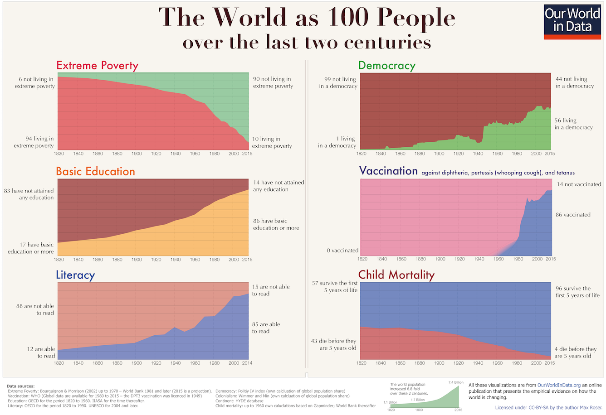

In one sense, the concept of progress is simple, straightforward, and uncontroversial.  

从某种意义上说，"进步 "的概念是简单、直接和没有争议的。  

In another sense, it contains an entire worldview.  

从另一种意义上说，它包含了整个世界观。

The most basic meaning of “progress” is simply advancement along a path, or more generally from one state to another that is considered more advanced by some standard.  

进步 "的最基本含义是沿着一条道路前进，或者更笼统地说，从一种状态到另一种按照某种标准被认为更先进的状态。  

(In this sense, progress can be good, neutral, or even bad—e.g., the progress of a disease.) The question is always: advancement along what path, in what direction, by what standard?  

(从这个意义上说，进步可以是好的、中性的，甚至是坏的，例如疾病的发展）。问题始终是：沿着什么道路、朝什么方向、以什么标准取得进步？

## Types of progress  

进展类型

“Scientific progress,” “technological progress,” and “economic progress” are relatively straightforward.  

"科学进步"、"技术进步 "和 "经济进步 "相对简单明了。  

They are hard to measure, they are multi-dimensional, and we might argue about specific examples—but in general, scientific progress consists of more knowledge, better theories and explanations, a deeper understanding of the universe; technological progress consists of more inventions that work better (more powerfully or reliably or efficiently) and enable us to do more things; economic progress consists of more production, infrastructure, and wealth.  

它们很难衡量，是多维的，我们可能会就具体的例子争论不休--但总的来说，科学进步包括更多的知识、更好的理论和解释、对宇宙更深入的理解；技术进步包括更多的发明，这些发明工作得更好（更强大、更可靠或更高效），使我们能够做更多的事；经济进步包括更多的生产、基础设施和财富。

Together, we can call these “material progress”: improvements in our ability to comprehend and to command the material world.  

我们可以把这些统称为 "物质进步"：我们理解和驾驭物质世界能力的提高。  

Combined with more intangible advances in the level of social organization—institutions, corporations, bureaucracy—these constitute “progress in capabilities”: that is, our ability to do whatever it is we decide on.  

这些进步与社会组织--机构、公司、官僚机构--层面上更为无形的进步相结合，构成了 "能力的进步"：也就是说，我们有能力做任何我们决定要做的事情。

## True progress  

真正的进步

But this form of progress is not an end in itself.  

但这种形式的进步本身并不是目的。  

True progress is advancement toward the good, toward ultimate values—call this “ultimate progress,” or “progress in outcomes.” Defining this depends on axiology; that is, on our theory of value.  

真正的进步是向着善、向着终极价值的进步--称之为 "终极进步 "或 "结果的进步"。定义这一点取决于公理；也就是说，取决于我们的价值理论。

To a humanist, ultimate progress means progress in human well-being: “human progress.” Not everyone agrees on what constitutes well-being, but it certainly includes health, happiness, and life satisfaction.  

对人文主义者来说，最终的进步意味着人类福祉的进步："人类进步"。并非每个人都同意什么是福祉，但它肯定包括健康、幸福和生活满意度。  

In my opinion, human well-being is not purely material, and not purely hedonic: [it also includes “spiritual” values](https://rootsofprogress.org/the-spiritual-benefits-of-material-progress) such as knowledge, beauty, love, adventure, and purpose.  

在我看来，人类的福祉并不纯粹是物质性的，也不纯粹是享乐性的：它还包括 "精神 "价值，如知识、美、爱、冒险和目的。

The humanist also sees other kinds of progress contributing to human well-being: “moral progress,” such as [the decline of violence](https://rootsofprogress.org/the-most-peaceful-time-in-history), the elimination of slavery, and the spread of equal rights for all races and sexes; and more broadly “social progress,” such as the evolution from monarchy to representative democracy, or the spread of education and especially literacy.  

人文主义者还认为其他类型的进步也有助于人类福祉："道德进步"，如暴力的减少、奴隶制的消除、所有种族和性别平等权利的普及；以及更广泛的 "社会进步"，如从君主制到代议制民主的演变，或教育尤其是扫盲的普及。

Others have different standards. Biologist David Graber [called himself](https://www.latimes.com/archives/la-xpm-1989-10-22-bk-726-story.html) a “biocentrist,” by which he meant  

其他人则有不同的标准。生物学家戴维-格拉伯称自己为 "生物中心主义者"，他的意思是

> … those of us who value wildness for its own sake, not for what value it confers upon mankind.  
> 
> ......我们这些人重视野性本身，而不是野性赋予人类的价值。  
> 
> … We are not interested in the utility of a particular species, or free-flowing river, or ecosystem, to mankind.  
> 
> ......我们并不关心某个物种或自由流动的河流或生态系统对人类的效用。  
> 
> They have intrinsic value, more value—to me—than another human body, or a billion of them.  
> 
> 它们具有内在价值，对我来说，比另一个人体或十亿个人体更有价值。  
> 
> … Human happiness, and certainly human fecundity, are not as important as a wild and healthy planet.  
> 
> ......人类的幸福，当然还有人类的繁殖力，都不如一个野生健康的星球重要。

By this standard, virtually all human activity is antithetical to progress: Graber called humans “a cancer… a plague upon ourselves and upon the Earth.”  

按照这一标准，几乎所有人类活动都与进步背道而驰：格拉伯称人类是 "癌症......是我们自己和地球的瘟疫"。

Or for another example, [one Lutheran stated](https://twitter.com/lymanstoneky/status/1654187457909346317) that his “primary measure of the goodness of a society is the population share which is a baptized Christian and regularly attending church.”  

又比如，一位路德会教徒说，他 "衡量一个社会是否善良的主要标准是，受洗的基督徒和经常去教堂的人口比例"。

The idea of progress isn’t _completely_ incompatible with some flavors of environmentalism or of religion (and there are both Christians and environmentalists in the progress movement!) but these examples show that it is possible to focus on a non-human standard, such as God or Nature, to the point where human health and happiness become irrelevant or even diametrically opposed to “progress.”  

进步的理念与某些环保主义或宗教并不是完全不相容的（进步运动中既有基督徒，也有环保主义者！），但这些例子表明，关注上帝或大自然等非人类标准，以至于人类的健康和幸福与 "进步 "无关，甚至截然相反，是有可能的。

## Unqualified progress  

无保留进展

What are we talking about when we refer to “progress” unqualified, as in “the progress of mankind” or “the roots of progress”?  

当我们在 "人类进步 "或 "进步的根源 "中无条件地提及 "进步 "时，我们在谈论什么？

**“Progress” in this sense is the concept of _material progress, social progress, and human progress as a unified whole._** It is based on the premise that progress in capabilities really does on the whole lead to progress in outcomes.  

这种意义上的 "进步 "是物质进步、社会进步和人类进步作为一个统一整体的概念。它的前提是，能力的进步总体上确实会带来结果的进步。  

This doesn’t mean that all aspects of progress move in lockstep—they don’t.  

这并不意味着所有方面的进步都是齐头并进的，它们并不是。  

It means that all aspects of progress support each other and over the long term depend on each other; they are intertwined and ultimately inseparable.  

这意味着各方面的进展相互支持，长期而言相互依存；它们相互交织，最终密不可分。

Consider, for instance, how Patrick Collison and Tyler Cowen defined the term in [their article calling for “progress studies”](https://www.theatlantic.com/science/archive/2019/07/we-need-new-science-progress/594946/):  

举例来说，帕特里克-科里森（Patrick Collison）和泰勒-考恩（Tyler Cowen）在他们呼吁开展 "进步研究 "的文章中是如何定义 "进步研究 "一词的：

> By “progress,” we mean the combination of economic, technological, scientific, cultural, and organizational advancement that has transformed our lives and raised standards of living over the past couple of centuries.  
> 
> 我们所说的 "进步 "是指经济、技术、科学、文化和组织进步的综合体，在过去的几个世纪里，这些进步改变了我们的生活，提高了我们的生活水平。

David Deutsch, in _[The Beginning of Infinity](https://rootsofprogress.org/books/the-beginning-of-infinity),_ is even more explicit, saying that progress includes “improvements not only in scientific understanding, but also in technology, political institutions, moral values, art, and every aspect of human welfare.”  

大卫-多伊奇在《无限的开始》中说得更明确，进步不仅包括 "科学认识的提高，还包括技术、政治体制、道德价值观、艺术以及人类福祉各个方面的提高"。

Skepticism of this idea of progress is sometimes expressed as: “progress towards _what?_” The undertone of this question is: “in your focus on material progress, you have lost sight of social and/or human progress.” On the premise that different forms of progress are diverging and even coming into opposition, this is an urgent challenge; on the premise that progress is a unified whole, it is a valuable intellectual question but not a major dilemma.  

对这种进步思想的怀疑有时表现为："朝着什么方向进步？"进步是为了什么？"这个问题的暗含意思是："在关注物质进步的同时，你们忽略了社会和/或人类的进步"。在不同形式的进步出现分歧甚至对立的前提下，这是一个紧迫的挑战；在进步是一个统一整体的前提下，这是一个有价值的思想问题，但不是一个重大的困境。

## Historical progress  

历史性进展

“Progress” is also _an interpretation of history_ according to which all these forms of progress have, by and large, been happening.  

"进步 "也是对历史的一种解释，根据这种解释，所有这些形式的进步大体上都在发生。

In this sense, the study of “progress” is the intersection of axiology and history: given a standard of value, are things getting better?  

从这个意义上说，对 "进步 "的研究是公理与历史的交汇：给定一个价值标准，事情是否变得更好了？

In Steven Pinker’s book _[Enlightenment Now: The Case for Reason, Science, Humanism, and Progress](https://rootsofprogress.org/books/enlightenment-now),_ the bulk of the chapters are devoted to documenting this history.  

在史蒂文-平克（Steven Pinker）的《启蒙现在》（Enlightenment Now）一书中：理性、科学、人文主义和进步的理由》一书中，大部分章节都在记录这段历史。  

Many of the charts in that book were sourced from Our World in Data, which also [emphasizes the historical reality of progress](https://ourworldindata.org/a-history-of-global-living-conditions).  

该书中的许多图表来自《数据中的我们的世界》，该书也强调了进步的历史现实。

## So-called “progress”  

所谓的 "进步"

Not everyone agrees with this concept of progress.  

并不是每个人都同意这种进步的概念。  

It depends on an Enlightement worldview that includes confidence in reason and science, and a humanist morality.  

它取决于启蒙运动的世界观，包括对理性和科学的信心，以及人文主义的道德观。

One argument against the idea of progress claims that material progress has not actually led to human well-being.  

反对进步思想的一种观点认为，物质进步实际上并没有给人类带来福祉。  

Perhaps the benefits of progress are outweighed by the costs and risks: health hazards, technological unemployment, environmental damage, existential threats, etc.  

也许，进步带来的好处与代价和风险相比是得不偿失的：健康危害、技术失业、环境破坏、生存威胁等等。  

Some downplay or deny the benefits themselves, arguing that material progress doesn’t increase happiness (owing to the hedonic treadmill), that it doesn’t satisfy our spiritual values, or that it degrades our moral character. [Rousseau famously asserted](https://www.stmarys-ca.edu/sites/default/files/attachments/files/arts.pdf) that “the progress of the sciences and the arts has added nothing to our true happiness” and that “our souls have become corrupted to the extent that our sciences and our arts have advanced towards perfection.”  

有些人轻描淡写或否认其本身的益处，认为物质进步不会增加幸福（由于享乐主义的跑步机），物质进步不能满足我们的精神价值，或者物质进步会降低我们的道德品质。卢梭有一句名言："科学和艺术的进步并没有给我们真正的幸福增添任何东西"，"我们的灵魂已经堕落到我们的科学和艺术走向完美的程度"。

Others, as mentioned above, argue for a different standard of value altogether, such as nature or God.  

还有一些人，如上所述，主张完全采用不同的价值标准，如自然或上帝。  

(Often these arguments contain some equivocation between whether these things are good in themselves, or whether we should value them because they are good for human well-being over the long term.)  

(通常，这些论点在这些事物本身是否是好的，或者我们是否应该重视它们，因为从长远来看，它们有利于人类的福祉之间，存在着一些模棱两可的地方）。

When people start to conclude that progress is not in fact good, they talk about this as no longer “believing in progress.” Historian Carl Becker, [writing in the shadow of World War I](https://rootsofprogress.org/in-the-shadow-of-the-great-war), said that “the fact of progress is disputed and the doctrine discredited,” and asked: “May we still, in whatever different fashion, believe in the progress of mankind?” In 1991, [Christopher Lasch asked](https://www.amazon.com/True-Only-Heaven-Progress-Critics-ebook/dp/B00DI29DLY):  

当人们开始断定进步实际上并不好时，他们就会说这是不再 "相信进步"。历史学家卡尔-贝克尔（Carl Becker）在第一次世界大战的阴影下写道 "进步的事实是有争议的，进步的学说是不可靠的"，他问道："我们还能以任何不同的方式相信人类的进步吗？1991 年，克里斯托弗-拉斯奇问道：

> How does it happen that serious people continue to believe in progress, in the face of massive evidence that might have been expected to refute the idea of progress once and for all?  
> 
> 面对可能会一劳永逸地驳斥 "进步 "理念的大量证据，严肃的人们怎么会继续相信 "进步 "呢？

Those who dispute the idea of progress often avoid the term, or quarantine it in scare quotes: so-called “progress.” When Jeremy Caradonna questioned the concept in _The Atlantic_, the headline was: “[Is ‘Progress’ Good for Humanity?](https://www.theatlantic.com/business/archive/2014/09/the-industrial-revolution-and-its-discontents/379781/)” One of the first [court rulings on environmental protection law](https://law.justia.com/cases/federal/appellate-courts/F2/449/1109/240994/), in 1971, said that such law represented “the commitment of the Government to control, at long last, the destructive engine of material ‘progress.’” Or consider this from _[Guns, Germs, and Steel](https://rootsofprogress.org/books/guns-germs-and-steel):_  

那些对 "进步 "这一概念提出异议的人，通常会回避这个词，或者用吓人的引号将其隔离：所谓的 "进步"。当杰里米-卡拉多纳在《大西洋月刊》上质疑这个概念时 标题是："'进步'对人类有益吗？"1971 年，法院对环境保护法做出的首批裁决之一称，此类法律代表了 "政府最终控制物质'进步'的破坏性引擎的承诺"。或者考虑一下《枪炮、病菌和钢铁》中的这段话：

> … I do not assume that industrialized states are “better” than hunter-gatherer tribes, or that the abandonment of the hunter-gatherer lifestyle for iron-based statehood represents “progress,” or that it has led to an increase in human happiness.  
> 
> ......我并不假定工业化国家比狩猎采集部落 "更好"，也不假定放弃狩猎采集的生活方式而建立以铁器为基础的国家代表了 "进步"，或导致了人类幸福的增加。

The idea of progress is inherently an idea that progress, overall, is good.  

进步的理念本质上就是进步总体上是好的理念。  

If “progress” is destructive, if it does not in fact improve human well-being, then it hardly deserves the name.  

如果 "进步 "是破坏性的，如果 "进步 "实际上并没有改善人类的福祉，那么 "进步 "就名不副实。

Contrast this with the concept of growth.  

这与增长的概念形成鲜明对比。  

“Growth,” writ large, refers to an increase in the population, the economy, and the scale of human organization and activity.  

所谓 "增长"，大体上是指人口、经济以及人类组织和活动规模的扩大。  

It is not inherently good: everyone agrees that it is happening, but some are against it; some even define themselves by being against it (the “degrowth” movement). No one is _against_ progress, they are only against “progress”: that is, they either believe in it, or deny it.  

进步本身并不是好事：每个人都同意进步正在发生，但有些人反对进步；有些人甚至以反对进步来定义自己（"退化 "运动）。没有人反对进步，他们只是反对 "进步"：也就是说，他们要么相信进步，要么否认进步。

The most important question in the philosophy of progress, then, is whether the idea of progress is valid—whether “progress” is real.  

因此，进步哲学中最重要的问题是，进步的理念是否有效--"进步 "是否真实。

## “Progress” in the 19th century  

"19 世纪的 "进步

Before the World Wars, there was an idea of progress that went even beyond what I have defined above, and which contained at least two major errors.  

在世界大战之前，有一种进步的观念甚至超出了我上面所定义的范围，它至少包含两个重大错误。

One error was the idea that progress is inevitable.  

其中一个错误就是认为进步是不可避免的。  

Becker, in the essay quoted above, said that according to “the doctrine of progress,”  

贝克尔在上文引用的文章中说，根据 "进步学说"，"......"。

> the Idea or the Dialectic or Natural Law, functioning through the conscious purposes or the unconscious activities of men, could be counted on to safeguard mankind against future hazards.  
> 
> 思想、辩证法或自然法，通过人们有意识的目的或无意识的活动发挥作用，可以依靠它们来保护人类免受未来的危害。  
> 
> … At the present moment the world seems indeed out of joint, and it is difficult to believe with any conviction that **a power not ourselves** … will ever set it right.  
> 
> ......此刻，世界似乎确实失去了联系，很难让人相信，一个不是我们自己的力量......会将其纠正过来。

(Emphasis added.)  

(着重部分由作者标明）。

The other was the idea that moral progress was _so_ closely connected to material progress that they would always move together. [Condorcet believed](https://books.google.com/books?id=K3RZAAAAcAAJ&pg=PA233&dq=%22nature+has+connected,+by+a+chain+which+cannot+be+broken,+truth,+happiness,+and+virtue%22&hl=en&newbks=1&newbks_redir=0&sa=X&ved=2ahUKEwjn5uH7vueEAxUwLTQIHX8AAf0Q6AF6BAgFEAI#v=onepage&q=%22nature%20has%20connected%2C%20by%20a%20chain%20which%20cannot%20be%20broken%2C%20truth%2C%20happiness%2C%20and%20virtue%22&f=false) that prosperity would “naturally dispose men to humanity, to benevolence and to justice,” and that “nature has connected, by a chain which cannot be broken, truth, happiness, and virtue.”  

另一种观点则认为，道德进步与物质进步紧密相连，两者总是相辅相成。孔多塞认为，繁荣会 "自然而然地使人们走向人道、仁慈和正义"，"大自然用一条无法切断的链条将真理、幸福和美德联系在一起"。

The 20th century, with the outbreak of world war and the rise of totalitarianism, [proved these ideas disastrously wrong](https://rootsofprogress.org/why-a-new-philosophy-of-progress).  

20 世纪，随着世界大战的爆发和极权主义的兴起，这些观点被证明是灾难性的错误。

## “Progress” in the 21st century and beyond  

"21 世纪及其后的 "进步

To move forward, we need a wiser, more mature idea of progress.  

为了向前迈进，我们需要一种更明智、更成熟的进步理念。

Progress is not automatic or inevitable. It depends on [choice and effort](https://rootsofprogress.org/descriptive-vs-prescriptive-optimism). It is up to us.  

进步不是自动的，也不是不可避免的。它取决于选择和努力。这取决于我们自己。

Progress is not automatically good. It must be steered.  

进步不会自动成为好事。必须加以引导。  

Progress always creates new problems, and they don’t get solved automatically.  

进步总会带来新的问题，而这些问题不会自动得到解决。  

Solving them requires active focus and effort, and [this is a part of progress, too](https://rootsofprogress.org/towards-a-philosophy-of-safety).  

解决这些问题需要积极的关注和努力，这也是进步的一部分。

Material progress does not automatically lead to moral progress.  

物质进步不会自动带来道德进步。  

Technology within an evil social system can do more harm than good.  

在邪恶的社会体系中，技术可能弊大于利。  

We must commit to improving morality and society along with science, technology, and industry.  

我们必须致力于在改进科学、技术和工业的同时改进道德和社会。

With these lessons well learned, we can rescue the idea of progress and carry it forward into the 21st century and beyond.  

有了这些经验教训，我们就能拯救进步的理念，并将其带入 21 世纪，甚至更远。

Comment: [Progress Forum](https://progressforum.org/posts/fBqejBdA9efcMnJmY), [LessWrong](https://www.lesswrong.com/posts/staxgbYqodorSuBmZ), [Reddit](https://www.reddit.com/r/rootsofprogress/comments/1balw3z)  

评论进步论坛、LessWrong、Reddit
