Summary:  Use this versatile GUI tool to support users when they need to make a decision that involves considering multiple attributes of a small number of offerings.  

摘要：当用户需要考虑少量产品的多种属性来做出决策时，可以使用这款多功能图形用户界面工具为用户提供支持。  

Consistency in content, scannability, and a simple layout are some of the most important qualities of successful comparison tables.  

内容的一致性、可扫描性和简单的布局是成功的对照表最重要的品质。

**Comparison is** [one of the most critical activities](https://www.nngroup.com/articles/the-3cs-of-critical-web-use-collect-compare-choose) **users perform on the web**.  

比较是用户在网络上进行的最重要的活动之一。  

In many cases, it’s a necessary step before your site visitors will perform a desired action, like buying your product, signing up for membership, contacting you, or requesting a quote.  

在许多情况下，这是网站访客执行所需的操作（如购买产品、注册会员、联系您或询价）之前的必要步骤。

However, this essential information is often distributed across detail pages, forcing users to remember information or open multiple windows or tabs.  

然而，这些基本信息往往分布在各个详细页面，迫使用户记住信息或打开多个窗口或标签页。  

This is where the **comparison table** comes in.  

这就是对照表的作用所在。

-   [Definition  
    
    定义](https://www.nngroup.com/articles/comparison-tables/#definition)
-   [When You Need a Comparison Table  
    
    需要比较表时](https://www.nngroup.com/articles/comparison-tables/#when-you-need-a-comparison-table)
-   [When You Don’t Need a Comparison Table  
    
    不需要比较表时](https://www.nngroup.com/articles/comparison-tables/#when-you-dont-need-a-comparison-table)
-   [Types of Comparison Tables  
    
    比较表的类型](https://www.nngroup.com/articles/comparison-tables/#types-of-comparison-tables)
-   [Static Comparison Tables  
    
    静态比较表](https://www.nngroup.com/articles/comparison-tables/#static-comparison-tables)
-   [Dynamic Comparison Tables  
    
    动态比较表](https://www.nngroup.com/articles/comparison-tables/#dynamic-comparison-tables)
-   [Best Practices for Comparison Tables  
    
    比较表的最佳做法](https://www.nngroup.com/articles/comparison-tables/#best-practices-for-comparison-tables)
-   [The Golden Rule of Comparison Tables  
    
    黄金法则比较表](https://www.nngroup.com/articles/comparison-tables/#the-golden-rule-of-comparison-tables)

## Definition  

定义

> **Comparison table:** A table that uses columns for products (or services) and rows for the attributes.  
> 
> 比较表：用列表示产品（或服务），用行表示属性的表格。  
> 
> It allows for quick and easy comparison between each offering’s features and characteristics.  
> 
> 它可以快速、方便地比较每种产品的功能和特点。

_A basic comparison table in the most common layout: a different column for each product and a different row for each characteristic of the product.  

最常见布局的基本比较表：每种产品有不同的列，产品的每种特性有不同的行。_

## When You Need a Comparison Table  

需要比较表时

Comparison tables are often misunderstood as tools for ecommerce only.  

比较表常常被误解为仅适用于电子商务的工具。  

It’s true that the most common instances of comparison tables are for mid-range to expensive consumer goods, especially electronics (think microwaves, fitness trackers, vacuum cleaners, or cars).  

诚然，最常见的比较表是针对中档到昂贵的消费品，尤其是电子产品（如微波炉、健身追踪器、吸尘器或汽车）。  

But, in addition to products, **comparison tables are equally well-suited for:**  

但是，除了产品之外，比较表同样适用于以下方面：

-   **Services  
    
    服务**
-   **Membership levels  
    
    会员级别**
-   **Pricing packages  
    
    定价套餐**
-   **App features  
    
    应用程序功能**
-   **Tuition rates学费标准**  
-   **Locations  
    
    地点**

They can be used to **compare similar items from the same organization** or to **compare one organization’s products against those of a competitor**. The comparison table is a much more versatile tool than it gets credit for.  

它们可用于比较同一组织的同类产品，或将一个组织的产品与竞争对手的产品进行比较。对照表是一种用途广泛的工具，它的作用远远超出了人们对它的认识。

### Types of Decision Making: Compensatory vs. Noncompensatory  

决策类型：补偿性决策与非补偿性决策

When people have to choose among many alternatives, it’s hard to compare the pros and cons of each individual alternative.  

当人们必须在众多备选方案中做出选择时，很难比较每个备选方案的利弊。  

As a result, people engage in [noncompensatory decision](https://www.nngroup.com/articles/compensatory-noncompensatory-decisions/) **making** — in other words, using one factor as the basis for decision-making.  

因此，人们会进行非补偿性决策--换句话说，将一个因素作为决策的基础。

For example, a user looking to buy a new car might filter out all the cars that are more expensive than $20,000, even though some of them are only slightly above their budget.  

例如，想要购买新车的用户可能会过滤掉所有价格超过 20,000 美元的汽车，尽管其中有些汽车只略高于他们的预算。  

This nonnegotiable filter helps the user restrict the set of results to a reasonable size.  

这个不可更改的过滤器可以帮助用户将结果集限制在合理的范围内。

When people have to select among a small set of alternatives (usually under 5–7), they usually engage in **compensatory decision** **making**: looking at the individual merits of each item and comparing their advantages and disadvantages according to a number of criteria.   

当人们必须从一小批备选方案（通常少于 5-7 个）中进行选择时，他们通常会进行补偿性决策：查看每个项目的个别优点，并根据一些标准比较它们的优缺点。

For example, a user researching a new laptop might be willing to consider a heavier computer if it has better battery life and computing power.  

例如，用户在研究新的笔记本电脑时，如果它的电池寿命和计算能力更强，可能会愿意考虑更重的电脑。

[Filters and facets](https://www.nngroup.com/articles/filters-vs-facets/) support noncompensatory decision-making. **In contrast,** [compensatory decision making](https://www.nngroup.com/articles/compensatory-noncompensatory-decisions/) **is best served by comparison tables**. They allow users to easily see and compare multiple important attributes at a glance.  

筛选器和面支持非补偿性决策。相比之下，比较表最适合补偿性决策。它们能让用户一目了然地轻松查看和比较多个重要属性。

## When You Don’t Need a Comparison Table  

不需要比较表时

There are certainly cases when a comparison table is unnecessary.  

当然，有些情况下不需要对照表。  

In addition to the noncompensatory decision situation discussed above, you probably don’t need a comparison table if the items are:  

除了上文讨论的非补偿性决策情况外，如果项目是，您可能不需要对照表：

-   Not mutually exclusive  
    
    不相互排斥
-   Simple  
    
    简单
-   Cheap or replaceable  
    
    便宜或可更换
-   Unique or hard to compare  
    
    独特或难以比较

Outside of these exceptions, a comparison table’s applications are limited only by your imagination.  

除了这些例外情况外，比较表的应用只能受限于你的想象力。  

Any time your users want to choose among similar offerings, it’s an opportunity for a comparison table — especially if multiple factors contribute to the decision.  

只要用户想在同类产品中做出选择，就有机会制作比较表，尤其是在多种因素共同作用的情况下。

### Not Mutually Exclusive  

并非相互排斥

Similar items are not necessarily mutually exclusive.  

类似项目不一定相互排斥。  

A shopper may only need to purchase a single microwave or laptop, but that isn’t the case for items like shirts, toys, or lightbulbs.  

购物者可能只需要购买一台微波炉或笔记本电脑，但衬衫、玩具或灯泡等商品却并非如此。  

For example, a consumer probably doesn’t need a comparison table to help them choose a dress, because they aren’t limited to one.  

例如，消费者可能不需要比较表来帮助他们选择一件衣服，因为他们并不局限于一个比较表。

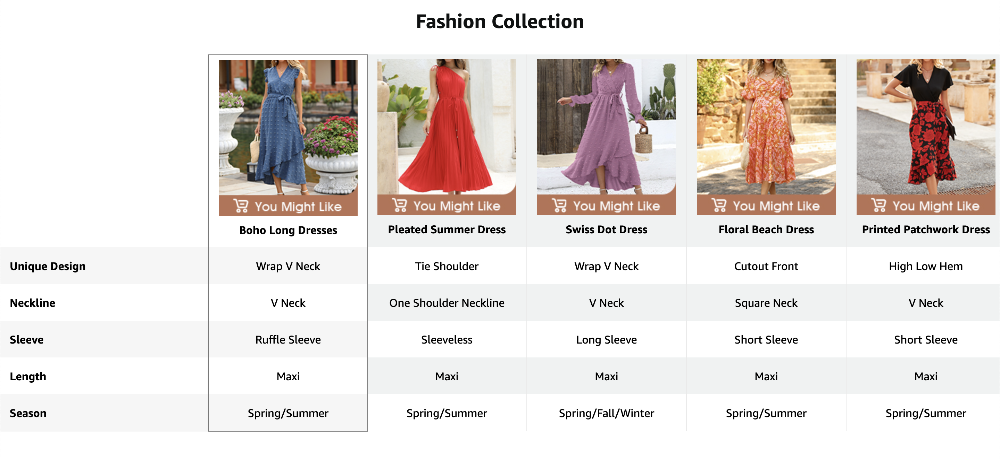

❌  _amazon.com: A comparison table of similar dresses isn’t necessary._  

❌ amazon.com：类似礼服的对照表并无必要。

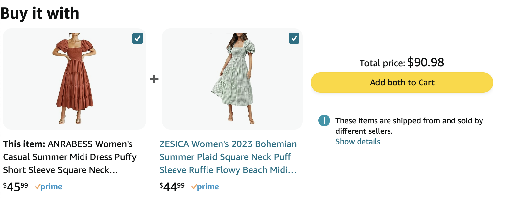

✅ _amazon.com: Instead of a comparison table, this Amazon dress product page offered a quick way to add a similar dress to your order._  

✅亚马逊网站：亚马逊的这个连衣裙产品页面没有提供对比表，而是提供了一种快速添加类似连衣裙到订单的方法。

### Simple Items  

简单项目

When a product or service is very simple, users don’t need to analyze its characteristics.  

当产品或服务非常简单时，用户不需要分析其特点。  

For example, a coffee mug doesn’t have many meaningful, comparable attributes.  

例如，咖啡杯并没有太多有意义的可比属性。  

Someone shopping for a coffee mug online might be interested in the style (and possibly size) but probably won’t want to compare many attributes of several coffee mugs.  

在网上选购咖啡杯的人可能会对咖啡杯的款式（也可能是尺寸）感兴趣，但可能并不想比较多个咖啡杯的许多属性。

Comparison tables tend to be unnecessary for items that are primarily chosen for aesthetics, like furniture, home décor, clothing, or accessories.  

对于家具、家居装饰、服装或配饰等主要为了美观而选择的物品，往往不需要比较表。

### Cheap or Replaceable Items  

廉价或可更换物品

When a product or service is cheap or easily replaceable, users are likely to engage in [satisficing](https://www.nngroup.com/articles/satisficing/) behavior and not spend much time analyzing alternatives.  

当产品或服务价格低廉或易于替代时，用户很可能会采取满足行为，而不会花太多时间分析替代品。  

People don’t need to compare various rolls of paper towels, for example.  

例如，人们不需要比较各种卷筒纸巾。

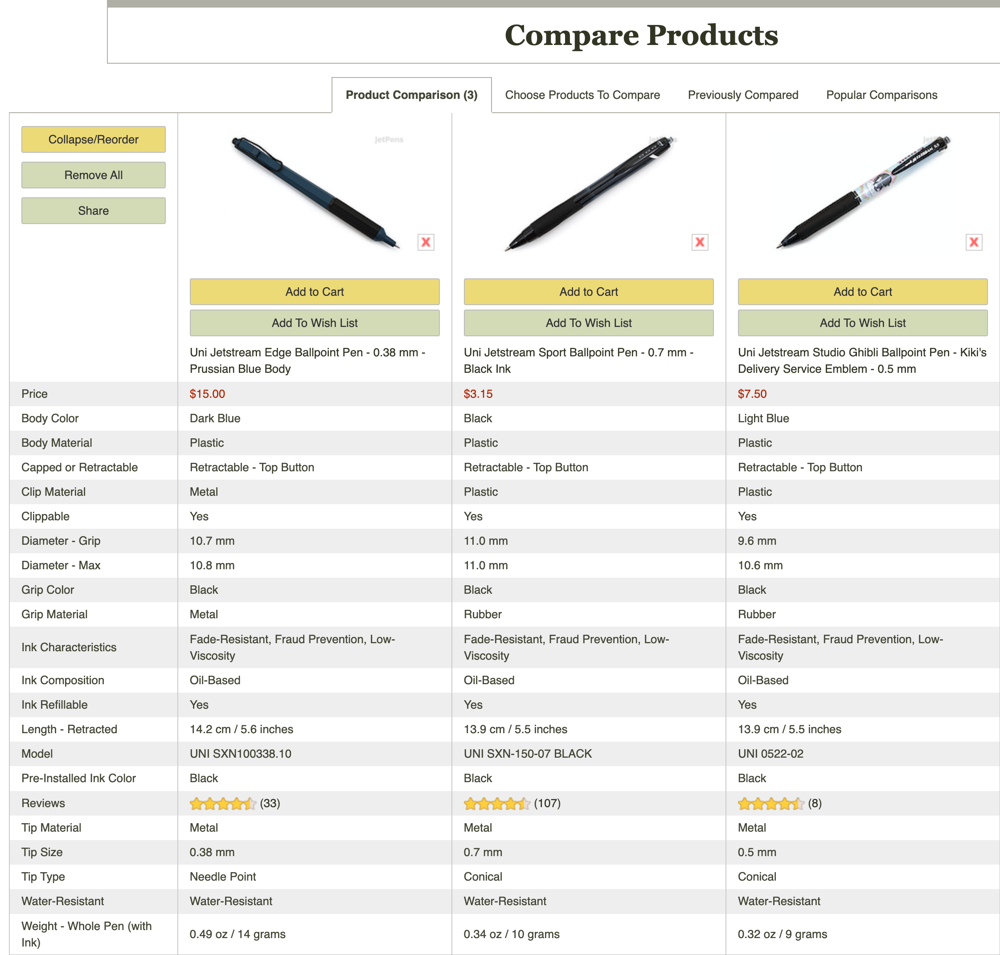

❌ _jetpens.com: People don’t need to compare this many factors for a simple, inexpensive item like a plastic pen._  

❌ jetpens.com：人们不需要为塑料笔这样简单、廉价的物品比较这么多因素。

### Unique, Hard-to-Compare Items  

独一无二、难以比拟的物品

Finally, products or services that are unique and hard to compare with others aren’t well suited to comparison tables.  

最后，那些独特的、难以与其他产品或服务进行比较的产品或服务并不适合放在比较表中。  

For example, it’d be hard to come up with a set of attributes to compare works of art.  

例如，要想出一套属性来比较艺术作品是很难的。

## Types of Comparison Tables  

比较表的类型

There are two types of comparison tables:  

比较表有两种类型：

-   **Static comparison tables** contain preselected products and are best used for small (under 5 items) product selections.  
    
    静态比较表包含预选产品，最适合用于小型（5 项以下）产品选择。
-   **Dynamic comparison tables** allow users to decide which items they want to compare and are best for large product selections.  
    
    动态比较表允许用户决定要比较哪些项目，最适合大量产品的选择。

## Static Comparison Tables  

静态比较表

If you have a small number of products your users will need to compare, you may want to create prebuilt, **static comparison tables**.  

如果用户需要比较的产品数量较少，可能需要创建预制的静态比较表。

For example, Apple’s most recent release only features three different models of the Apple Watch, so it provides a ready-made comparison table for users trying to decide.  

例如，苹果公司最新发布的 Apple Watch 只有三种不同的型号，因此它为试图做出决定的用户提供了一个现成的对照表。

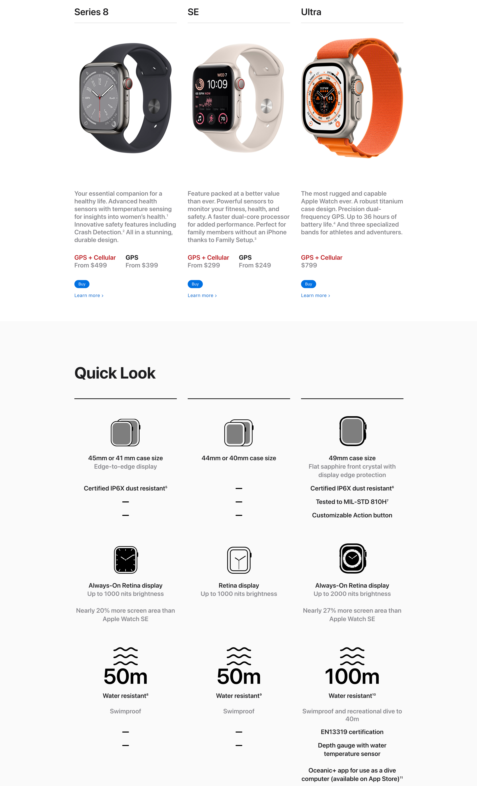

_✅_ _apple.com: With only 3 models of the most recent Apple Watch available, Apple provided a comparison table that included them all._  

✅ apple.com：由于最新款 Apple Watch 仅有 3 个型号，苹果公司提供了一个包含所有型号的对比表。

A good rule of thumb is to take this approach if you have 5 offerings or fewer, but we’ll get into limiting the number of compared items later in this article.  

一个好的经验法则是，如果你有 5 个或更少的产品，就采用这种方法，但我们将在本文后面讨论限制比较项目的数量。  

Static comparison tables usually work well for membership levels or pricing packages.  

静态对比表通常适用于会员级别或定价套餐。

With this kind of comparison table implementation, you’ll be able to control how the information is displayed on the page.  

有了这种比较表，您就可以控制信息在页面上的显示方式。

For example, you can change the copy to fit the space constraints of one cell.  

例如，您可以更改副本，以适应一个单元格的空间限制。  

Note, however, that this implementation is not as easily scalable as dynamic comparison tables; You’ll have to update the comparison table if you offer a new product or service.  

但请注意，这种实现方式不像动态比较表那样容易扩展；如果您提供新的产品或服务，就必须更新比较表。

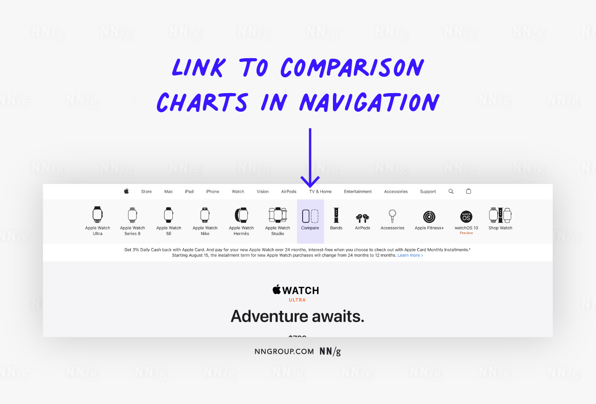

_✅_ _apple.com: Ensure users find a static comparison table by including a link to the table in your information architecture alongside your product menu.  

✅ apple.com：在产品菜单旁的信息架构中加入一个指向表格的链接，确保用户能找到静态对比表格。  

Apple included a link to its static comparison table in the苹果公司在其网站上提供了静态对照表的链接_ Watch _secondary navigation menu, alongside the links to the various Apple Watch models._  

手表二级导航菜单，以及各种 Apple Watch 型号的链接。

## Dynamic Comparison Tables  

动态比较表

**Dynamic tables allow users to select which items they want to see** in the comparison table. They are appropriate when you offer more than 5 products or services.  

动态表格允许用户选择他们希望在比较表格中看到的项目。当您提供的产品或服务超过 5 种时，就适合使用动态表格。

While dynamic comparison tables scale well as your set of offerings increases or changes, they are usually implemented using a [flexible layout](https://www.nngroup.com/articles/layout-vs-content/), and their appearance cannot be as closely controlled as that of static tables.  

虽然动态比较表可以随着产品的增加或变化而调整，但它们通常采用灵活的布局，其外观不能像静态表格那样受到严格控制。

 

✅ _tesla.com:_ _Tesla’s site allowed users to compare different models of Tesla using a dynamic table._   

✅ tesla.com：特斯拉网站允许用户使用动态表格对不同型号的特斯拉进行比较。

### **Selection of Items in a Dynamic Comparison Table  

在动态对照表中选择项目**

Two popular ways of allowing users to select which items to add to the table include: compare buttons or checkboxes, and direct manipulation of the items of interest.  

允许用户选择要添加到表格中的项目的两种常用方法包括：比较按钮或复选框，以及直接操作感兴趣的项目。

#### Compare Buttons or Checkboxes   

比较按钮或复选框

_Compare_ buttons or checkboxes appear directly on listing pages.  

比较按钮或复选框直接显示在列表页面上。  

With this method, users can select the items they’re interested in, and then move to a dynamically created comparison page.  

通过这种方法，用户可以选择他们感兴趣的项目，然后转到动态创建的比较页面。

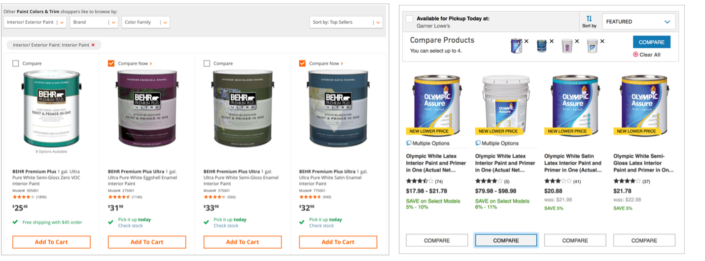

_Checkmarks (left, homedepot.com) and buttons (right, lowes.com) are the two most common ways of allowing users to select items for an interactive comparison table.  

复选标记（左，homedepot.com）和按钮（右，lowes.com）是允许用户为交互式比较表选择项目的两种最常见方式。_

Product listing pages tend to be overcrowded, so one major challenge for this implementation is making the _Compare_ buttons discoverable without giving them too much space on the page. The safest option is to **include _Compare_ buttons as secondary action buttons**, either at the top and bottom of the page, or beneath all product descriptions.  

产品列表页面往往过于拥挤，因此实施过程中的一个主要挑战是，既要让比较按钮易于发现，又要在页面上留出过多空间。最安全的选择是将比较按钮作为次要操作按钮，放在页面的顶部和底部，或放在所有产品描述的下方。

#### Direct Manipulation of Items  

直接操作项目

With this method, **users can click or drag the products that they want to add** to the comparison table.  

使用这种方法，用户可以点击或拖动要添加到比较表中的产品。  

Usually, this action is possible because, like in Garmin’s example below, a special _Compare_ mode disables the regular meaning of clicking on a product.  

通常情况下，这种操作是可行的，因为就像下面 Garmin 的例子一样，一种特殊的 "比较 "模式禁用了点击产品的常规含义。  

This can also be achieved by adding a separate _Compare_ page, seen in the bottom right-hand corner of the example.  

这也可以通过添加一个单独的比较页面来实现，如示例右下角所示。

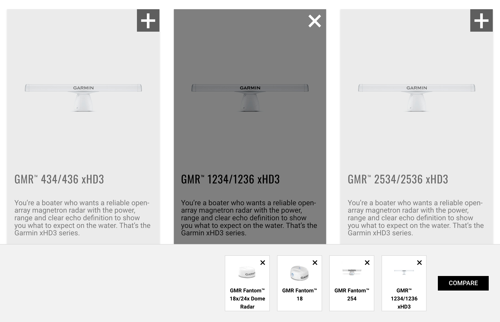

❌ _garmin.com: Although the grey ghost button faded into the UI and was not easily noticeable, this Garmin example wasn't all bad.  

❌ garmin.com：虽然灰色幽灵按钮淡出了用户界面，不易察觉，但 Garmin 的这个例子也并非一无是处。  

It featured a它的特点是_ COMPARE _button at the top of its product-listing page.  

产品列表页面顶部的 "COMPARE（比较）"按钮。  

When pressed, it would add the product to a comparison table instead of leading to a detail page.  

按下时，它会将产品添加到比较表中，而不是跳转到详细页面。_

One advantage of this direct-manipulation approach to selection is the opportunity to separate the comparison activity from the product-listing page, keeping that view visually cleaner.  

这种直接操作选择方法的一个优点是可以将比较活动与产品列表页面分开，使页面视觉上更加整洁。

A separate comparison page (like Fitbit’s) is a good option when you don’t have enough products or offerings to justify a traditional listing page in the first place.  

当你没有足够的产品或服务来支持传统的列表页面时，单独的比较页面（如 Fitbit 的页面）是一个不错的选择。

## Best Practices for Comparison Tables  

比较表的最佳做法

Regardless of which type of comparison table you choose, follow these best practices to support your users’ decision making.  

无论您选择哪种类型的比较表，都应遵循以下最佳实践，为用户的决策提供支持。

### Use Comparison Tables for Up to 5 Items  

使用多达 5 个项目的比较表

Comparison tables support compensatory decision making, in which people engage only when they have relatively few alternatives to consider.  

比较表支持补偿性决策，即人们只有在需要考虑的替代方案相对较少的情况下才会参与决策。  

When more than 5 items need to be compared, add other mechanisms such as filters to help users narrow down the larger set of possibilities to 5 or fewer.  

当需要比较的项目超过 5 个时，可添加其他机制，如筛选器，帮助用户将更多的可能性缩小到 5 个或更少。

**For static comparison tables,** err on the side of simplicity.  

对于静态对照表，应尽量简化。  

If you can’t keep a static table down to at most 5 comparable options, reconsider if it should be a static comparison table at all.  

如果不能将静态表格中的可比选项控制在最多 5 个，那么就应该重新考虑是否应该使用静态比较表。  

Depending on the complexity of the information you’re presenting, even 5 options may be too many.  

根据所展示信息的复杂程度，即使是 5 个选项也可能太多。

**For dynamic tables,** consider whether the layout will scale gracefully up to 5 items if users have the freedom to select what those 5 items will be.  

对于动态表格，如果用户可以自由选择 5 个项目，则要考虑布局是否能优雅地扩展到 5 个项目。  

Most dynamic comparison tables accept 3–4 items only.  

大多数动态对比表只接受 3-4 个项目。  

Consider how much text will need to be included for the attributes, and how that will impact layout and readability.  

考虑属性需要包含多少文字，以及这将如何影响版面设计和可读性。

Also consider **the size of the user’s device or browser.** You may need to reduce the number of items to two for presentation on mobile.  

还要考虑用户设备或浏览器的大小。您可能需要将项目数量减少到两个，以便在移动设备上呈现。  

On the other hand, don’t force users to compare only two items at a time if you have the space to show more.  

另一方面，如果有足够的空间展示更多内容，也不要强迫用户一次只比较两个项目。

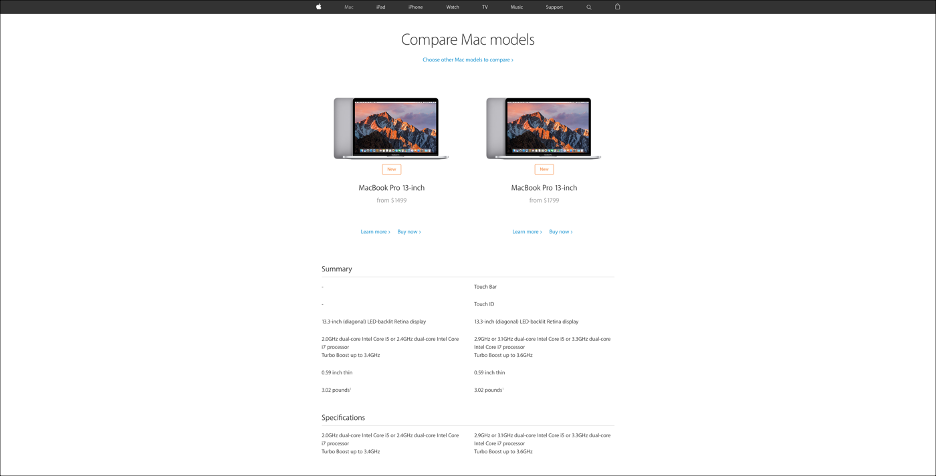

 ❌ _Apple’s dynamic comparison table for its Mac computers unnecessarily restricted users to comparing two items, even at very large screen sizes (shown here on a 3008x1692 resolution monitor.)_  

❌ 苹果公司 Mac 电脑的动态比较表不必要地限制了用户对两个项目的比较，即使在屏幕尺寸非常大的情况下也是如此（此处显示在分辨率为 3008x1692 的显示器上）。

Whatever your limit, make sure you clearly communicate it to your users to avoid confusion and errors.  

无论您的限制是什么，请确保您将其清楚地传达给用户，以避免混淆和错误。  

And don’t forget to let users remove items from the comparison, as they narrow down their selections.  

当用户缩小选择范围时，别忘了让他们从比较中删除项目。

### Be Consistent  

始终如一

**The biggest problem with most comparison tables isn’t design, it’s content**.  

大多数对照表的最大问题不是设计，而是内容。  

When attribute information is missing, incomplete, or inconsistent across similar offerings, otherwise handy comparison tables quickly become useless.  

如果类似产品的属性信息缺失、不完整或不一致，那么原本方便的对照表很快就会变得毫无用处。  

This is especially problematic for dynamic comparison tables, when you’re dealing with many offerings with slightly different metadata available.  

对于动态对比表来说，这尤其是个问题，因为你要处理许多元数据略有不同的产品。

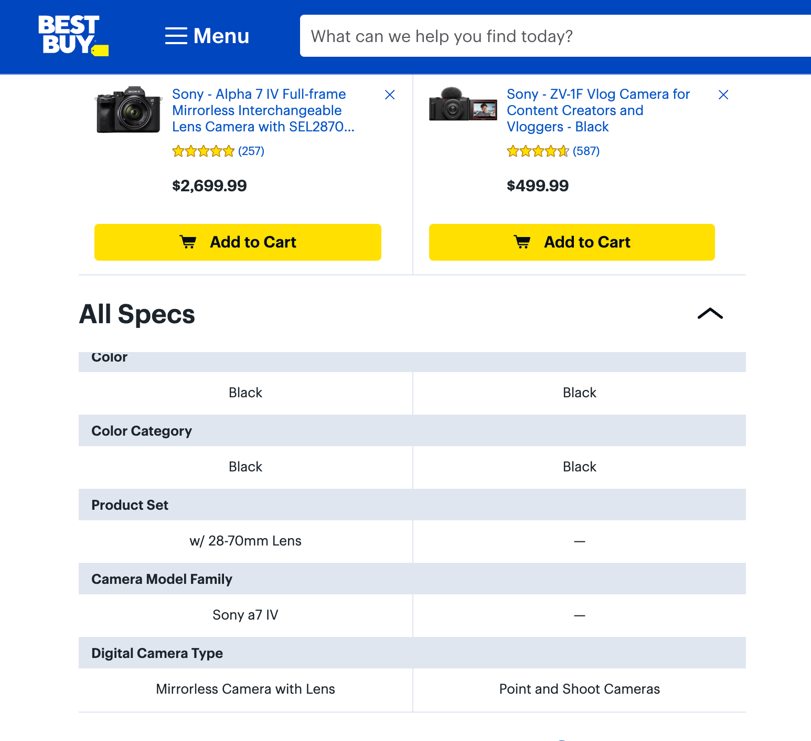

❌ _bestbuy.com: This comparison table displayed the attributes for 2 different cameras sold by Best Buy.  

❌ bestbuy.com：该比较表显示了 Best Buy 出售的 2 款不同相机的属性。  

The metadata for the Sony Alpha 7 camera was much richer.  

索尼阿尔法 7 相机的元数据要丰富得多。  

It can be challenging to keep the metadata consistent and up to date, especially when companies sell many products from many different manufacturers.  

保持元数据的一致性和及时更新是一项挑战，尤其是当公司销售来自不同制造商的多种产品时。  

However, if the information isn’t complete for all compared products, it might as well not be in a comparison table at all.  

但是，如果所有比较产品的信息都不完整，那还不如不放在比较表中。_

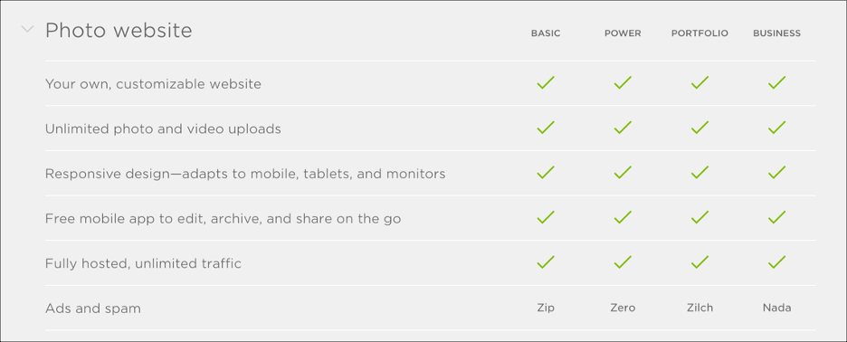

❌ _smugmug.com: This comparison table detailed the features of SmugMug’s four membership levels, with each column having a different value for the attribute_ Ads and spam_:_ Zip, Zero, Zilch, _and_ Nada_.  

❌ smugmug.com：该对比表详细列出了 SmugMug 四个会员级别的功能，每一列的广告和垃圾邮件属性值各不相同：Zip、Zero、Zilch 和 Nada。  

Comparison-table values aren’t a good place to showcase your site’s personality — it’d be better to leave these values equivalent and not distract users while they scan for differences.  

比较表中的数值并不是展示网站个性的好地方--最好让这些数值相等，不要在用户扫描差异时分散他们的注意力。_

### Support Scannability  

支持可扫描性

Comparing the pros and cons of different products is a cognitively demanding process.  

比较不同产品的优缺点是一个认知要求很高的过程。  

You want to make sure your users can focus on the essentials. An effective way to do this is to **make the table easy to scan for differences, similarities, and keywords.**  

您要确保您的用户能够专注于要点。要做到这一点，一个有效的方法就是使表格易于扫描，以便找出不同点、相似点和关键词。

Stick to the standard table layout: options as columns, attributes as rows, with row labels on the left and column labels above.  

坚持使用标准表格布局：选项为列，属性为行，行标签在左，列标签在上。  

Use consistent text alignment in each column.  

在各栏中使用一致的文字对齐方式。

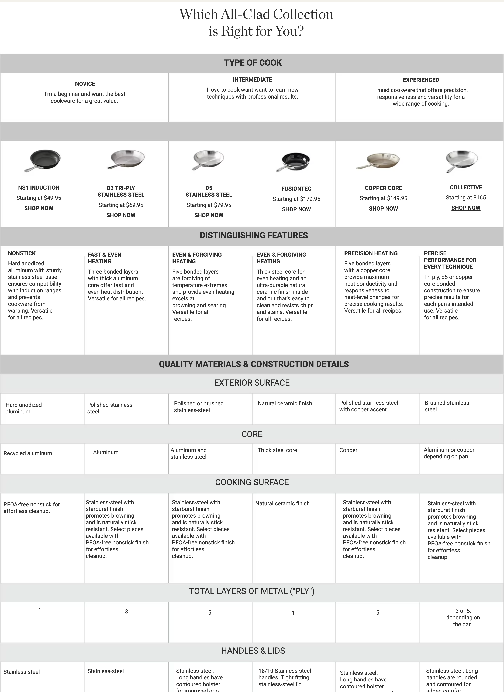

❌ _williams-sonoma.com: Williams Sonoma did a good job categorizing pans for this static comparison table.  

❌ williams-sonoma.com：Williams Sonoma 为这张静态对比表对平底锅做了很好的分类。  

Unfortunately, the horizontal row headers were nonstandard and impeded scannability.  

遗憾的是，横排标题不标准，影响了可扫描性。  

The narrow paragraphs under下的狭义段落_ DISTINGUISHING FEATURES _are not scannable or easy to read._  

识别特征无法扫描或不易阅读。

When using text within comparison tables, keep it short. Whenever possible, avoid full sentences.  

在比较表格中使用文字时，请尽量简短。尽可能避免使用完整的句子。

Color coding can help as well — either lightly shading the backgrounds of each column, or coloring the text of the cells.  

颜色编码也有帮助--给每一列的背景打上浅色阴影，或者给单元格的文字着色。  

Just make sure you’re maintaining enough contrast and not sacrificing readability.  

只要确保保持足够的对比度，不影响可读性即可。

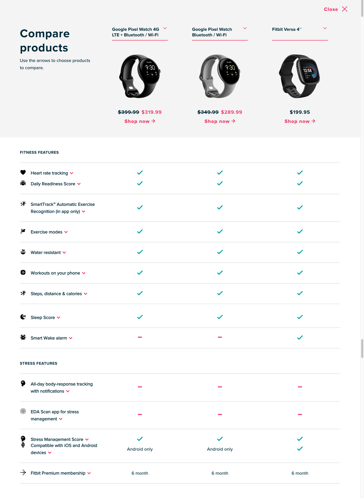

✅ _FitBit.com used a different color for each column’s checkmarks to help users clearly differentiate between each product’s features.  

✅ FitBit.com 为每一栏的勾选标记使用了不同的颜色，以帮助用户清楚地区分每种产品的功能。  

This color-coding approach wouldn’t work quite as well for more complex attribute values that can’t be expressed in checkmarks.  

对于无法用复选标记表示的更复杂的属性值，这种颜色编码方法就不太适用了。_

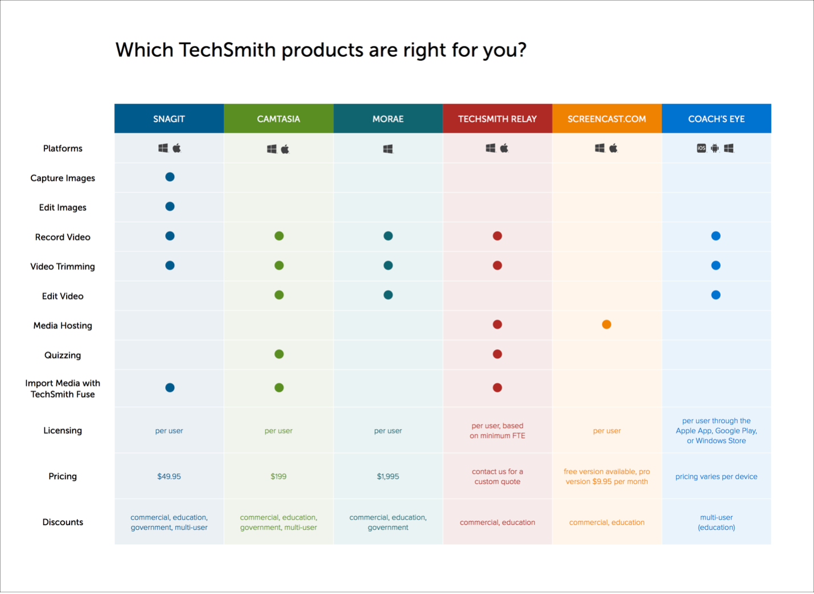

✅ _techsmith.com used color-coded columns to show the different features available in its software offerings, as well as which platforms they could be used on._  

✅ techsmith.com 使用彩色编码栏来显示其软件产品的不同功能，以及可在哪些平台上使用。

It’s also important to clearly indicate rows so users can easily tell which attribute a cell refers to, especially when using symbols like checkmarks that can’t stand alone.  

同样重要的是，要清楚地标明行，这样用户就能很容易地分辨出单元格所指的属性，尤其是在使用复选标记等不能独立存在的符号时。  

Row borders, row shading, or extra spacing can help keep the rows distinct and separate.  

行边框、行阴影或额外的行间距都有助于保持行与行之间的区别和隔离。

### Sticky Column Headers  

粘贴栏标题

Especially when dealing with long lists of attributes that occupy several screenfuls, **keep column headers fixed as users scroll.** Human short-term memory is limited, and users will easily forget which column is for which product.  

尤其是在处理占满几个屏幕的长属性列表时，应在用户滚动时保持列标题固定不变。人的短期记忆是有限的，用户很容易忘记哪一栏是哪种产品。

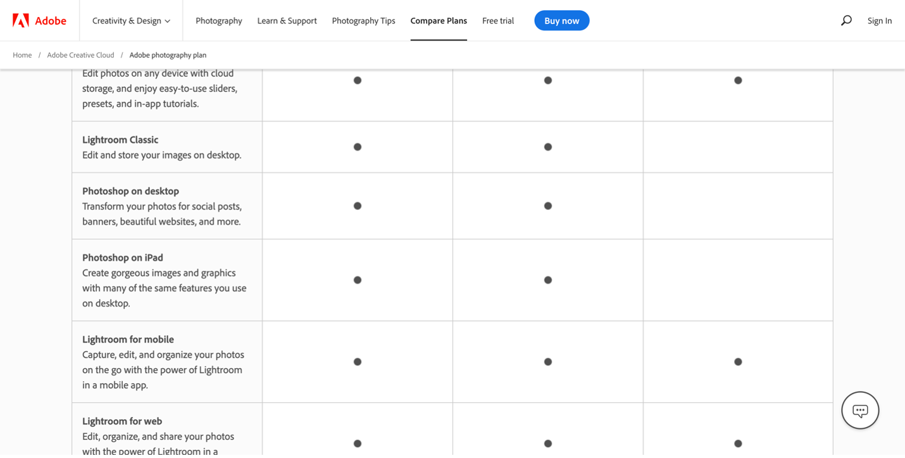

❌ _adobe.com: Adobe offered a static comparison table to help its customers compare different annual plans._ _Unfortunately, it didn’t have fixed column headers, so users were forced to remember column names or scroll back up the page to check which column was for what._   

❌ adobe.com：Adobe 提供了一个静态比较表，帮助客户比较不同的年度计划。遗憾的是，它没有固定的列标题，因此用户不得不记住列名，或向后滚动页面查看哪一列是什么。

### Meaningful Attributes  

有意义的属性

Your comparison table should include attributes that your users will actually care about.  

您的对照表应包含用户真正关心的属性。  

Don’t just throw every piece of metadata you have into the table, because it will make the job harder for users.  

不要把所有元数据都放到表格中，因为这会增加用户的工作难度。

As much as possible, **try to define unfamiliar terms in context**, and connect vague attributes to something concrete.  

尽可能根据上下文来定义不熟悉的术语，并将模糊的属性与具体事物联系起来。

For example, Anker’s comparison table has attributes that are useful in the context of comparing portable power banks: battery capacity in mAh, charging speed, and weight.  

例如，Anker 的比较表中列出了在比较便携式移动电源时非常有用的属性：以毫安时为单位的电池容量、充电速度和重量。  

What really makes this a good comparison table is the fact that it translates those attributes into things that would be meaningful for the average consumer.  

之所以说这是一个很好的比较表，是因为它将这些属性转换成了对普通消费者有意义的东西。  

The battery capacity is _3350 mAh,_ which is approximately _1.2 iPhone 6 charges._ The size is _3.5 x 0.9 x 0.9 inches_ — about the size of a tube of lipstick. The weight is _2.7 oz,_ which is similar to an egg’s weight.  

电池容量为 3350 毫安时，约等于 1.2 部 iPhone 6 的电量。尺寸为 3.5 x 0.9 x 0.9 英寸，与一管口红差不多大。重量为 2.7 盎司，与鸡蛋的重量相仿。  

The average consumer may have trouble imagining what 2.7 oz feels like, but can probably imagine the weight of an egg.  

普通消费者可能难以想象 2.7 盎司是什么感觉，但也许能想象出一个鸡蛋的重量。

✅ _amazon.com: The manufacturer’s product-comparison table translated technical attributes into language that was understandable by the average consumer._  

✅亚马逊网站：制造商的产品比较表将技术属性转化为普通消费者可以理解的语言。

Another effective way to make obscure attributes meaningful is to **include links to more information or in-context tooltips with definitions or clarifying information**.  

让晦涩的属性变得有意义的另一个有效方法是加入更多信息的链接或包含定义或说明信息的上下文工具提示。

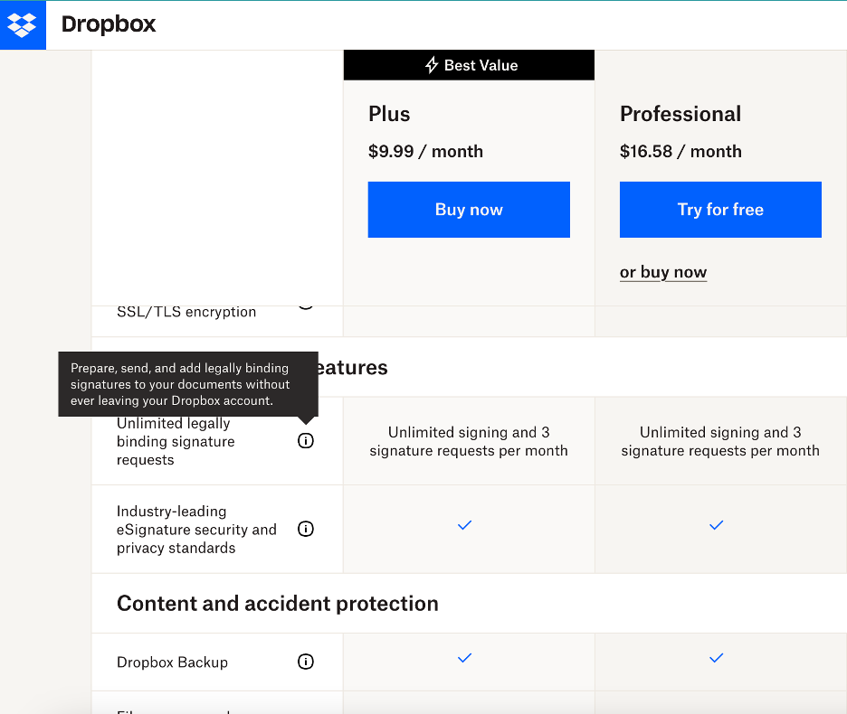

✅ _dropbox.com: The hover-activated tooltip clarified the meaning of the attributes without adding extra text to the page._  

✅ dropbox.com：悬停激活的工具提示明确了属性的含义，而不会在页面上添加额外的文本。

### Give Users Control  

赋予用户控制权

Even if you do a good job making the entries scannable or the headers sticky, it can be hard for users to compare products with many attributes, especially when these attributes span several screenfuls.  

即使你很好地做到了条目可扫描或标题具有粘性，用户也很难比较具有多种属性的产品，尤其是当这些属性跨越几个屏幕时。  

In those situations, users may have to scroll back and forth between different rows as they compare the pros and cons of different products.  

在这种情况下，用户在比较不同产品的优缺点时，可能不得不在不同行之间来回滚动。

In order to make the task manageable, **consider allowing users to select which attributes they want displayed in the table**. Collapsible rows are an easy implementation for this feature.  

为了使任务易于管理，可以考虑允许用户选择他们希望在表格中显示的属性。可折叠行是实现这一功能的简单方法。

Alternatively, let users hide the rows for which all offerings are similar, and only show the differences.  

或者，让用户隐藏所有产品都相似的行，只显示不同之处。

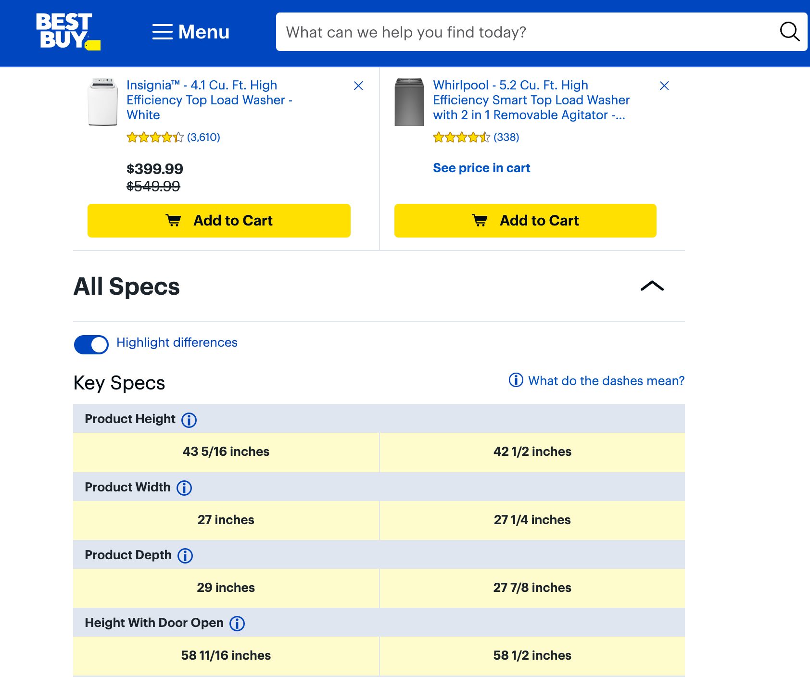

 ✅ _bestbuy.com: Users could easily identify differences (seen in yellow) between products by selecting the_ Highlight Differences _switch on this comparison table._  

✅bestbuy.com：用户可以通过选择对比表上的 "突出显示差异 "开关，轻松识别产品之间的差异（黄色显示）。

For simple static comparison tables, consider presenting a simplified table with those attributes you expect will be most important to users, but also allow access to a more detailed table.  

对于简单的静态比较表，可考虑使用简化的表格，列出用户认为最重要的属性，但也允许访问更详细的表格。

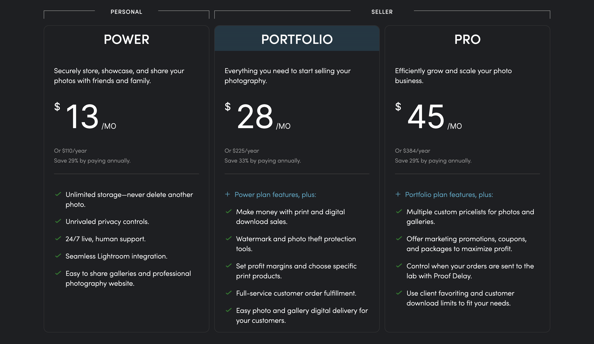

✅ _smugmug.com: For its 3 plan options, SmugMug presented a very simplified “at a glance” comparison table._  

✅Smugmug.com：SmugMug 为其 3 个计划选项提供了一个非常简单的 "一目了然 "比较表。

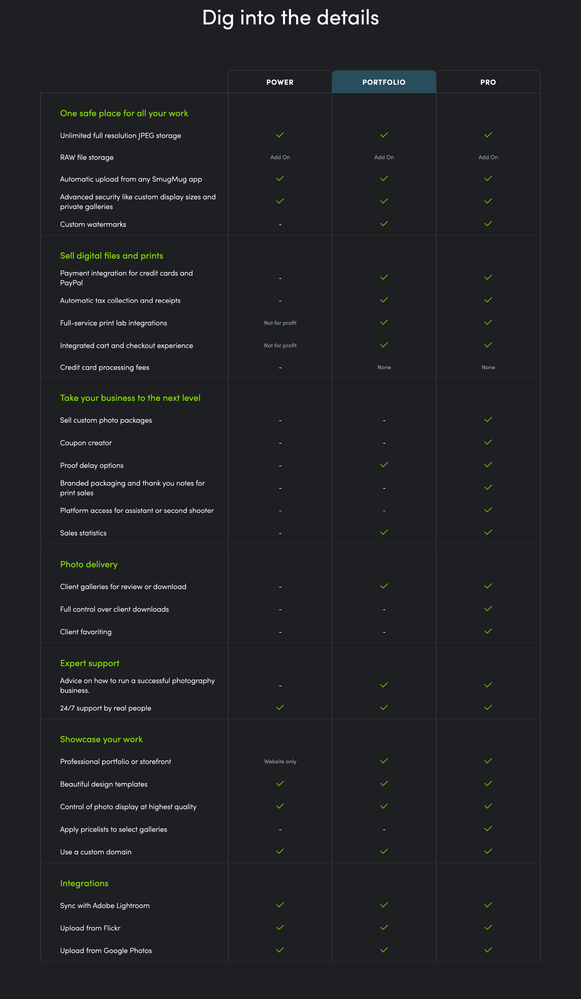

_smugmug.com: The much more detailed full comparison table was available on a different page.  

smugmug.com：更详细的完整对比表在另一页面上。_

### Simplify the Comparison for Mobile  

简化移动对比

Some websites just remove their comparison functionality altogether for small devices.  

有些网站干脆取消了针对小型设备的比较功能。  

If at all possible, **you should try to support some level of comparison on mobile**, but it’s unlikely that you’ll be able to show more than 2 items at a time in a comparison table.  

如果可能的话，您应该尝试在移动设备上支持某种程度的比较，但您不太可能在比较表中同时显示两个以上的项目。  

Remember that on smaller screens, fewer rows will be visible at a time and more strain will be placed on the user’s short-term memory.  

请记住，在较小的屏幕上，一次可显示的行数较少，用户的短期记忆将承受更大的压力。  

Therefore, following the previous recommendations (especially making entries scannable and giving users control to choose what they want to display) will be even more important on mobile.  

因此，遵循之前的建议（尤其是使条目具有可扫描性，并让用户有控制权来选择他们想要显示的内容）在移动设备上将变得更加重要。

If a true comparison table on a mobile devices is impractical for your offerings, you might alternatively consider converting the table to tabs or lists for small screens.  

如果在移动设备上使用真正的对照表不切实际，你也可以考虑将对照表转换成标签或列表，以便在小屏幕上使用。  

Just remember that these formats do not support compensatory decision making as well, because users have to remember the attributes for each products in order to weigh pros and cons.  

请记住，这些格式并不支持补偿决策，因为用户必须记住每种产品的属性才能权衡利弊。

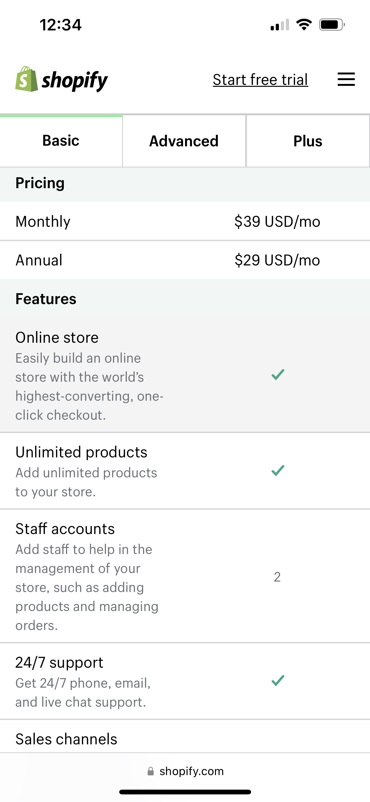

_✅_ _shopify.com: One strategy for making comparison tables work on mobile is converting the columns to tabs.  

✅shopify.com：让比较表在移动设备上运行的一种策略是将列转换为标签。  

This means users can’t do true side-by-side comparison like they can on a full table, but at least they will be able to switch among products more easily than if they had to scroll or switch mobile-browser tabs.  

这意味着用户无法像在完整的表格上那样进行真正的并排比较，但至少可以比滚动或切换移动浏览器标签更方便地在产品之间切换。_

## The Golden Rule of Comparison Tables  

黄金法则比较表

To sum up many of the guidelines we’ve listed here: **Above all else, do the work for the consumer.** Don’t slow them down with nonstandard or overly long tables with repeated information; don’t ask them to hold things in their memory; and don’t make them Google terms they aren’t familiar with.  

总结一下我们在此列出的许多准则：最重要的是，为消费者做工作。不要用不标准或过长的表格重复信息来拖慢他们的速度；不要要求他们记住一些东西；也不要让他们用谷歌搜索他们不熟悉的术语。

**Make your users’ decisions as easy as possible**: you’ll be happy, and they’ll be happy.  

让用户尽可能轻松地做出决定：你会高兴，用户也会高兴。
