In the realm of AI, image recognition stands as a gateway for machines to see and comprehend visual data, much like the way humans do.  

在人工智能领域，图像识别是让机器像人类一样观察和理解视觉数据的入口。  

In this guide, we explore how it works, provide a brief historical overview, and take a look at use cases:  

在本指南中，我们将探讨其工作原理，提供简要的历史概述，并介绍使用案例：

#### **Key Terms  

关键术语**

The landscape of image recognition is rich with terms that are often confused and used interchangeably.  

图像识别领域术语繁多，经常被混淆和互换使用。  

To bring clarity to the topic, here’s a quick guide explaining the key terms and highlighting their distinct differences:  

为了澄清这个话题，这里有一份快速指南，解释关键术语并强调它们之间的明显区别：

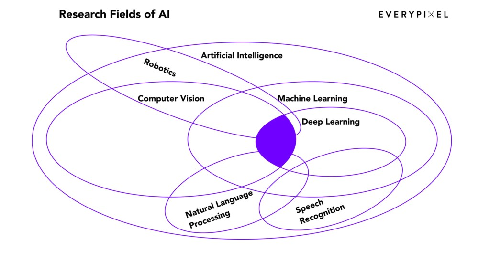

Source: [EECS 498-007 / 98-005](https://youtu.be/dJYGatp4SvA?si=z17ObdfG-YZGf_DF&t=318)  

资料来源EECS 498-007 / 98-005

**Computer Vision vs. Image Recognition vs. Visual Recognition  

计算机视觉 vs. 图像识别 vs. 视觉识别**

There are many approaches to the terms computer vision, image recognition, visual recognition, so confusion is most often found in these terms. We stick to the idea that **Computer Vision (CV)** is a field of AI, that focuses on enabling computers to identify, comprehend information of visual inputs, and take actions based on that information.  

关于计算机视觉、图像识别、视觉识别等术语有很多方法，因此这些术语经常被混淆。我们坚持认为，计算机视觉（CV）是人工智能的一个领域，其重点是使计算机能够识别和理解视觉输入信息，并根据这些信息采取行动。  

CV has many tasks for how computer vision programs process images and return information.  

CV 在计算机视觉程序处理图像和返回信息方面有许多任务。  

Here are some of them:  

下面是其中的一些：

-   **Image Classification**: assigning an image to one of the predefined classes.   
    
    图像分类：将图像归入预定义的类别之一。
-   **Image Keywording (or Image Tagging)**: assigning keywords or tags to images.  
    
    图像关键字（或图像标签）：为图像指定关键字或标签。
-   **Object Detection**: identifying a particular object in a photo, video, or image and framing it with a bounding box — a rectangle that precisely outlines an object.  
    
    物体检测：识别照片、视频或图像中的特定物体，并用边界框（精确勾勒出物体轮廓的矩形）对其进行取景。
-   **Optical Character Recognition (OCR)**: identifying letters and numbers in images and converting them into machine-encoded text.  
    
    光学字符识别（OCR）：识别图像中的字母和数字，并将其转换为机器编码文本。
-   **Image Segmentation**: splitting an image into smaller parts (segments) for a more detailed understanding of the image.  
    
    图像分割：将图像分割成更小的部分（片段），以便更详细地了解图像。  
    
    The result of this task is an image mask, representing the specific boundary and shape of each identified class.  
    
    这项任务的结果是一个图像掩码，代表每个已识别类别的特定边界和形状。
-   **Object Tracking**: processing the location of a moving object in a video over time.  
    
    物体跟踪：处理视频中移动物体随时间变化的位置。

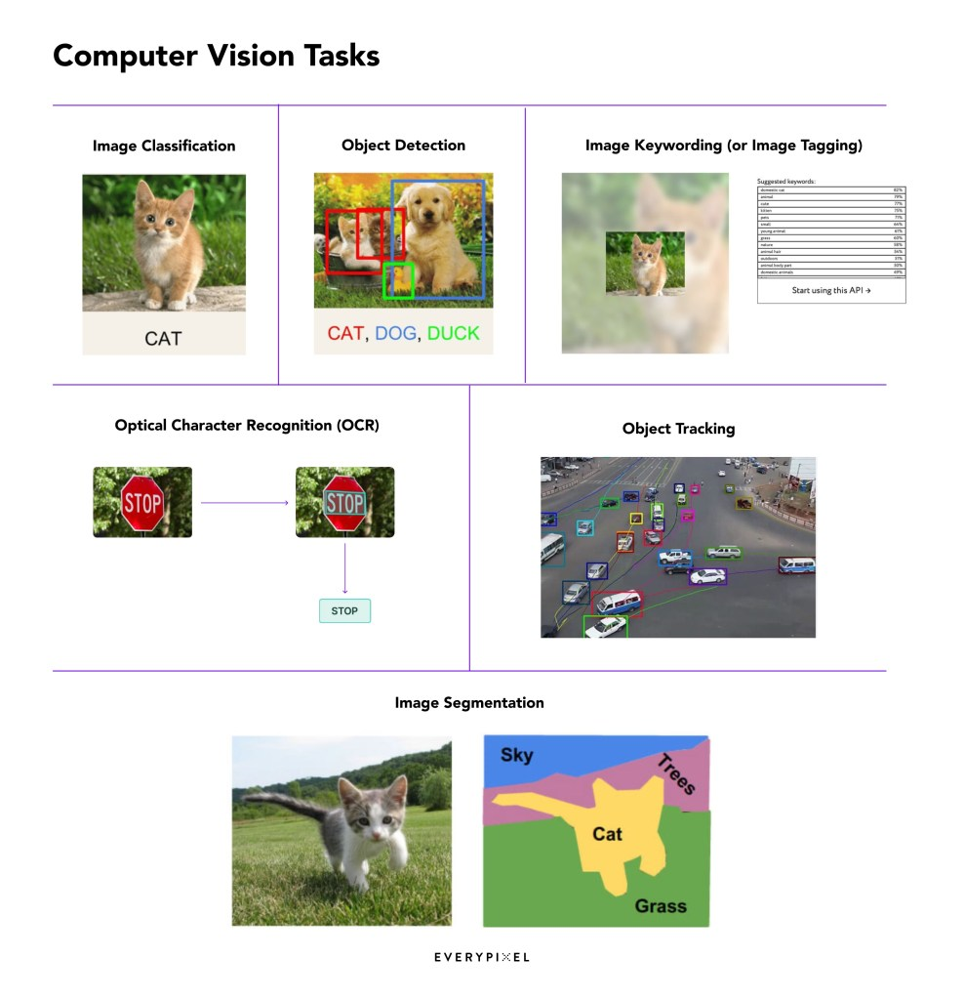

Thus, **Image Recognition (IR)** is an application of CV, that can use different tasks for different purposes. **Visual Recognition** is then a more extended term of Image Recognition and encompasses a broader range of visual data types, extending to videos and live streams.  

因此，图像识别（IR）是 CV 的一种应用，可用于不同目的的不同任务。视觉识别是图像识别的一个扩展术语，包含更广泛的视觉数据类型，可扩展到视频和实时流。

In scientific articles, you are more likely to come across the term CV, which is also more favorable among developers.  

在科学文章中，你更容易接触到 CV 这个词，它在开发人员中也更受欢迎。  

Meanwhile, IR tends to find its niche in business and practical applications.  

与此同时，投资者关系往往在商业和实际应用中找到自己的位置。  

A quick look at the comparison of search results volumes for CV and IR reinforces this trend.  

只要对简历和投资者关系的搜索结果量进行一下比较，就会发现这一趋势更加明显。  

However, it’s worth noting that, in general, these terms are sometimes used interchangeably.  

不过，值得注意的是，一般来说，这两个词有时会交替使用。

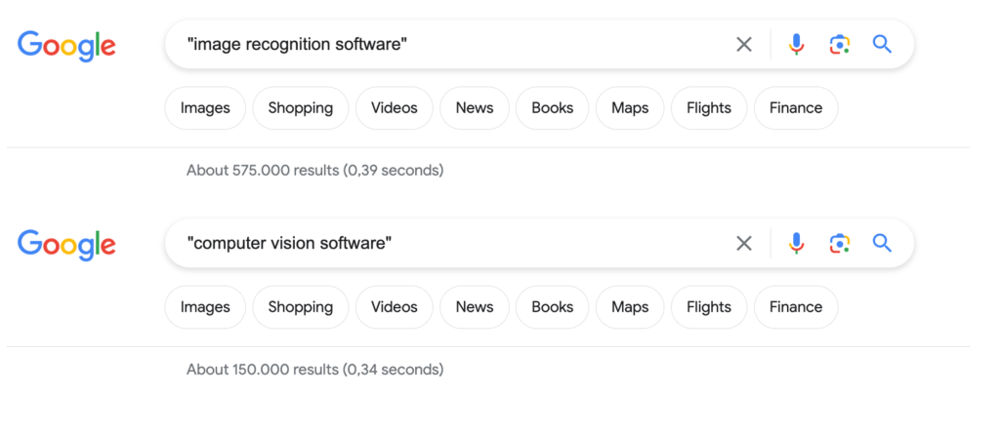

The comparison of search results volumes for CV and IR. Source: [Google](https://www.google.com/ "Google")  

简历和投资者关系的搜索结果数量对比。来源：Google来源：谷歌

#### **A Brief History of Image Recognition  

图像识别简史**

In the late 1950s, neurophysiologists Hubel and Wiesel’s [cat experiments](https://computervisionblog.wordpress.com/2013/06/01/cats-and-vision-is-vision-acquired-or-innate/) laid the foundation for understanding visual processing and image recognition.  

20 世纪 50 年代末，神经生理学家胡贝尔和维塞尔的猫实验为理解视觉处理和图像识别奠定了基础。  

The experiment conducted on cats accidentally discovered ‘simple cells’— neurons responding to edges with different orientations.  

在猫身上进行的实验意外发现了 "简单细胞"--对不同方向的边缘做出反应的神经元。  

Later identified in orientation columns, these simple cells had a profound impact on computer vision algorithms, underscoring that image recognition starts with processing simple shapes like straight edges.  

这些简单的单元后来在方位柱中被识别出来，对计算机视觉算法产生了深远的影响，强调了图像识别是从处理简单的形状（如直边）开始的。

Around the same period, the first computer image scanning technology emerged, allowing computers to digitize and capture images.  

大约在同一时期，出现了第一种计算机图像扫描技术，使计算机能够对图像进行数字化和捕捉。

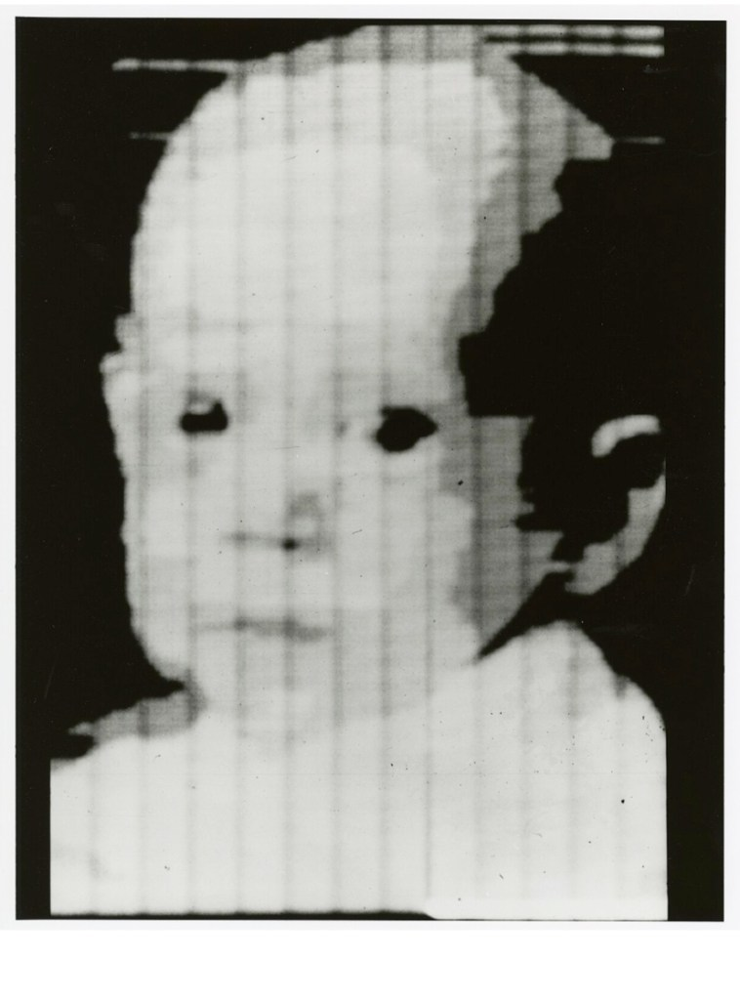

The first digitally scanned photo. Source: [Wikipedia](https://en.wikipedia.org/wiki/Image_scanner#:~:text=The%20first%20image,side.%5B3%5D)  

第一张数码扫描照片。来源：维基百科维基百科

In the 1960s, [AI emerged as an academic field](https://www.ibm.com/topics/computer-vision#:~:text=1960s%2C%20AI%20emerged%20as%20an%20academic%20field%20of%20study%2C%20and%20it%20also%20marked%20the%20beginning%20of%20the%20AI%20quest%20to%20solve%20the%20human%20vision%20problem.), initiating a quest to address the human vision problem.  

20 世纪 60 年代，人工智能作为一个学术领域出现，开启了解决人类视觉问题的探索。

In 1974, OCR and more advanced intelligent character recognition (ICR) [emerged](https://en.wikipedia.org/wiki/Optical_character_recognition), giving later birth to the OCR application [FineReader](https://pdf.abbyy.com/blog/finereader-20-years-ago/) developed by ABBYY.  

1974 年，出现了 OCR 和更先进的智能字符识别技术（ICR），随后诞生了 ABBYY 开发的 OCR 应用程序 FineReader。

In the 1980s, [scientists introduced](https://www.youtube.com/watch?v=dJYGatp4SvA&t=1800s) algorithms for machines to detect edges, corners, curves, and similar basic shapes.  

20 世纪 80 年代，科学家们推出了机器检测边缘、拐角、曲线和类似基本形状的算法。

In the early 2000s, the research focus shifted towards object recognition, with the emergence of the [first real-time face recognition applications](https://youtu.be/dJYGatp4SvA?si=TTousbxAS8MUIB1h&t=1217 "first real-time face recognition applications") by 2001. The 2000s also witnessed the [establishment of standardization](https://www.ibm.com/topics/computer-vision#citation3:~:text=Standardization%20of%20how%20visual%20data%20sets%20are%20tagged%20and%20annotated%20emerged%20through%20the%202000s) of how visual data sets are tagged and annotated.  

本世纪初，研究重点转向物体识别，到 2001 年出现了第一个实时人脸识别应用。2000 年代还见证了视觉数据集标记和注释标准化的建立。

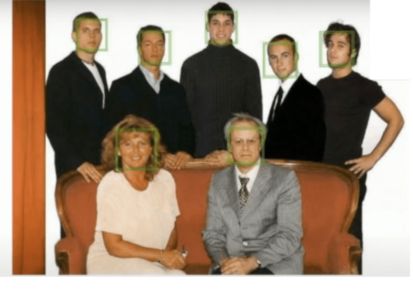

One of the first successful applications of machine learning to vision. Source: [Introduction to Deep Learning for Computer Vision](https://youtu.be/dJYGatp4SvA?si=TTousbxAS8MUIB1h&t=1217)  

机器学习在视觉领域的首次成功应用之一。资料来源计算机视觉深度学习入门

In 2010, the ImageNet [data set became available](https://www.image-net.org/challenges/LSVRC/index.php).  

2010 年，ImageNet 数据集可用。  

The ImageNet project, led by researchers including Olga Russakovsky, and Jia Deng, contained millions of hand-tagged images across a thousand object classes.  

由 Olga Russakovsky 和 Jia Deng 等研究人员领导的 ImageNet 项目包含数百万张手工标记的图像，涉及上千个对象类别。  

Serving as a foundation for today’s models, ImageNet not only enabled the comparison of detection progress across a wider variety of objects but also facilitated the measurement of the progress of large-scale image indexing for retrieval and annotation in the realm of computer vision.  

作为当今模型的基础，ImageNet 不仅能够比较更多对象的检测进展，还有助于衡量计算机视觉领域用于检索和注释的大规模图像索引的进展。

And in 2012 a team from the University of Toronto [developed the AlexNet model](https://en.wikipedia.org/wiki/AlexNet) that significantly reduced the error rate for image recognition.  

2012 年，多伦多大学的一个团队开发了 AlexNet 模型，大大降低了图像识别的错误率。

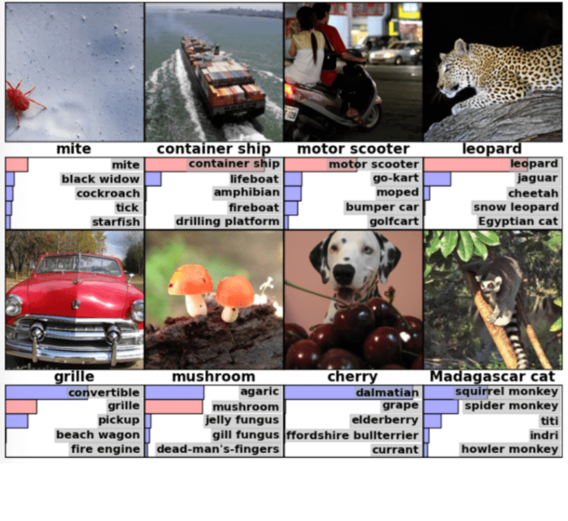

ImageNet’s 2010 test images and labels considered most probable by the model. Source: [ImageNet Classification](https://courses.csail.mit.edu/6.803/pdf/2012%20hinton.pdf)  

ImageNet 2010 测试图像和模型认为最有可能的标签。来源：ImageNet 分类ImageNet 分类

As the field progressed, one of the most interesting developments was done by Google. With [the acquisition of reCAPTCHA](https://googleblog.blogspot.com/2009/09/teaching-computers-to-read-google.html), a technology designed to distinguish between human and automated access to websites, Google significantly enhanced its OCR algorithms and AI training methods.  

随着这一领域的发展，谷歌取得了最令人瞩目的进展之一。通过收购 reCAPTCHA（一种用于区分人工和自动访问网站的技术），谷歌大大增强了其 OCR 算法和人工智能训练方法。  

Using image and text based CAPTCHAs (Completely Automated Public Turing tests to tell Computers and Humans Apart) Google began accumulating a large dataset of labeled examples.  

利用基于图像和文本的 CAPTCHAs（用于区分计算机和人类的完全自动化公共图灵测试），谷歌开始积累大量标注示例的数据集。  

Each time when users solve a CAPTCHA to access a website, they essentially label an image or text for Google’s dataset.  

用户每次通过验证码访问网站时，基本上都会为谷歌的数据集标注一张图片或一段文字。  

This dataset allows Google to train its AI using supervised machine learning, a method where AI learns from a large set of categorized examples.  

通过这个数据集，谷歌可以使用监督式机器学习（一种人工智能从大量分类示例中学习的方法）训练其人工智能。  

In essence, every Google user now plays a role in developing a more intelligent and capable AI, particularly in the field of computer vision.  

从本质上讲，每一位谷歌用户现在都在为开发更智能、能力更强的人工智能发挥作用，尤其是在计算机视觉领域。

#### **How Image Recognition Works  

图像识别如何工作**

It is worth clarifying that there are different approaches in image recognition technology, and one of the most common is the convolutional neural network (CNN) — one of the variants of the architecture of neural networks using convolutions.  

值得说明的是，图像识别技术有不同的方法，其中最常见的是卷积神经网络（CNN）--使用卷积的神经网络结构的变体之一。  

CNNs are employed, for example, in the already mentioned AlexNet, and in our projects as image recognition algorithms.  

例如，前面提到的 AlexNet 和我们的项目都采用了 CNN 作为图像识别算法。  

Firstly, an image is made of “pixels,” with each pixel being represented by a number or a set of numbers, which also include a set of values referring to its color.  

首先，图像是由 "像素 "组成的，每个像素由一个数字或一组数字表示，其中还包括一组颜色值。

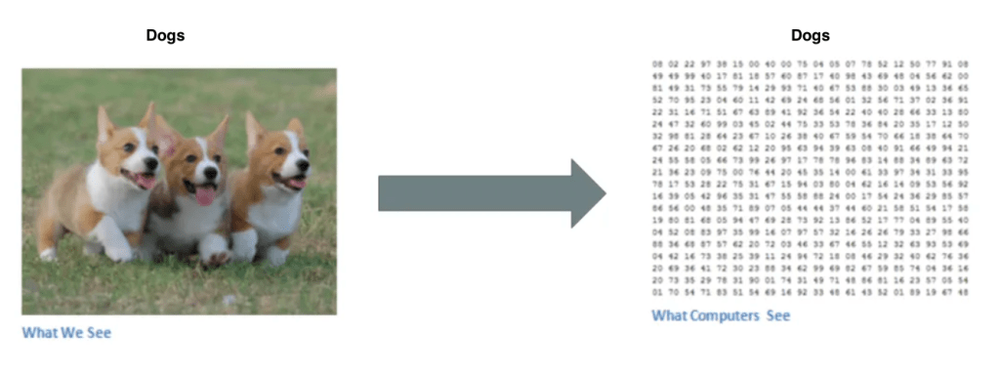

Binary image visualization. Source: [Basics of the Classic CNN](https://towardsdatascience.com/basics-of-the-classic-cnn-a3dce1225add)  

二值图像可视化资料来源经典 CNN 基础知识

In short, before CNNs can recognize objects and their relationships, patterns, and overall image structures, they undergo a training process.  

简而言之，CNN 在识别物体及其关系、模式和整体图像结构之前，需要经过一个训练过程。  

During training, CNNs are exposed to a vast dataset of labeled images, learning to associate specific patterns and features with corresponding object labels, such as “dog” or “mouse”.   

在训练过程中，CNN 会接触到大量带标签的图像数据集，学习将特定模式和特征与相应的对象标签（如 "狗 "或 "鼠标"）联系起来。

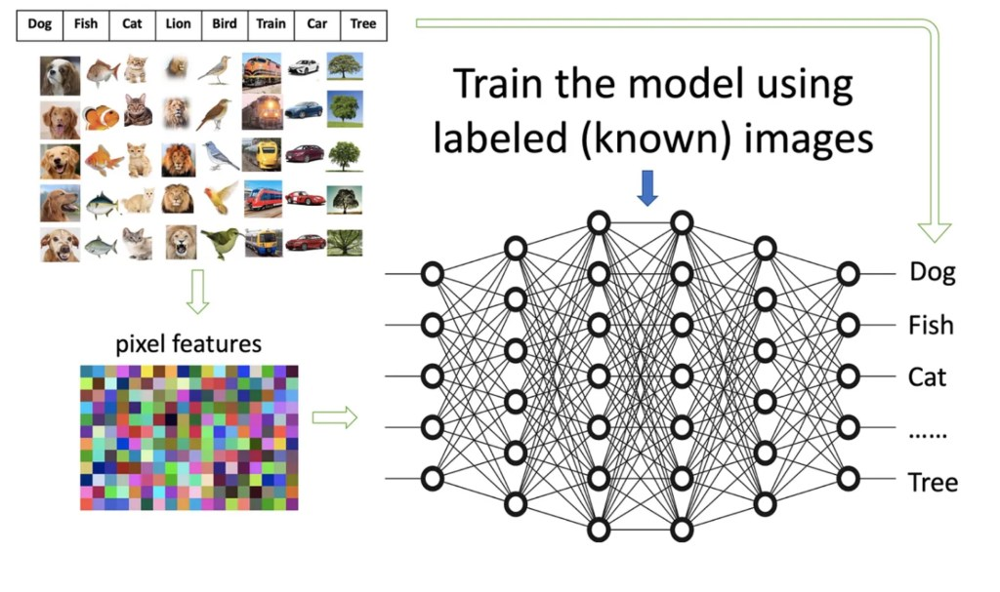

How a model is trained with pre-labeled images. Source: [What Is Image Recognition?](https://medium.com/dataman-in-ai/module-6-image-recognition-for-insurance-claim-handling-part-i-a338d16c9de0)  

如何使用预标记图像训练模型。资料来源什么是图像识别？

Once trained, CNNs internally compress input images into hidden representations, discarding insignificant information.  

经过训练后，CNN 会在内部将输入图像压缩为隐藏表征，并丢弃无关紧要的信息。  

These hidden representations encapsulate patterns, relationships between objects, significant pixels, etc.  

这些隐藏的表征包括模式、物体之间的关系、重要像素等。  

In essence, the original image undergoes a transformation, evolving from a picture into a map of distinctive features — a set of numerical values.  

从本质上讲，原始图像经历了一次转换，从一幅图片演变成了一张包含明显特征的地图--一组数值。  

Leveraging the knowledge gained from the training process, CNNs utilize these representations to make predictions about the content of new images.  

CNN 利用从训练过程中获得的知识，对新图像的内容进行预测。

To facilitate a better understanding of CNN’s operation, here we provide a gentle and simple explanation of each stage in CNNs.  

为了便于更好地理解 CNN 的运行，我们在此对 CNN 的每个阶段进行简单明了的解释。  

The CNN network layers are typically broken down into four distinct types:  

CNN 网络层通常分为四种不同类型：

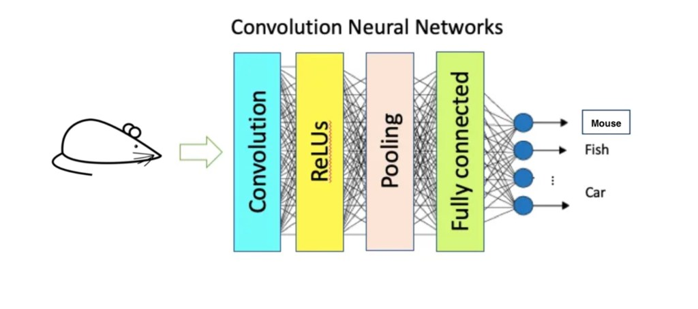

The network layers of CNNs. Source: [What Is Image Recognition?](https://medium.com/dataman-in-ai/module-6-image-recognition-for-insurance-claim-handling-part-i-a338d16c9de0)  

CNN 的网络层。资料来源什么是图像识别？

**Convolutional Layer  

卷积层**

In the convolutional layer, CNNs transform images into small pieces called features.  

在卷积层中，CNN 将图像转换成称为特征的小片段。  

These features capture information about specific shapes, edges, textures, color information, or other visual patterns essential for further scanning.  

这些特征可以捕捉到特定形状、边缘、纹理、颜色信息或其他对进一步扫描至关重要的视觉模式。  

The aim is to identify matches among these features and already learned patterns from training.  

目的是识别这些特征与从训练中已经学到的模式之间的匹配。  

This process, called filtering, assigns high scores for perfect matches and low or zero scores for less accurate ones.  

这一过程被称为过滤，为完全匹配的结果打高分，为不太准确的结果打低分或零分。  

It involves attempting every possible match through scanning — an operation known as convolution.  

它包括通过扫描尝试每一种可能的匹配--这种操作被称为卷积。  

The resulting output of this convolutional layer is a map of features.   

卷积层的输出结果是一张特征图。

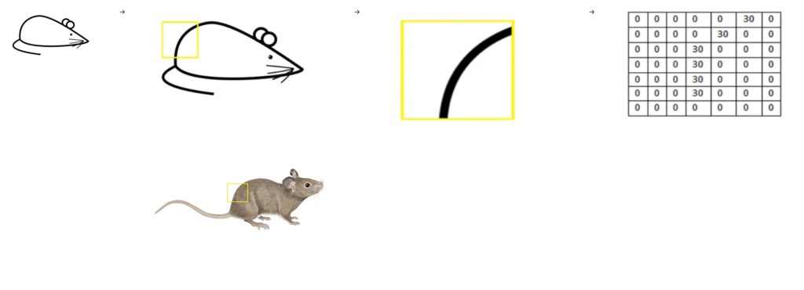

Visualization of the filter on the image and its pixel representation. Source: [Basics of the Classic CNN](https://towardsdatascience.com/basics-of-the-classic-cnn-a3dce1225add), Source: [Britannica](https://www.britannica.com/animal/mouse-rodent)  

滤镜在图像上的可视化及其像素表示。资料来源经典 CNN 基础知识，来源：《大英百科全书》：不列颠百科全书

**Activation Function Layer  

激活功能层**

After the convolutional layer transforms the image into features and filters it to identify patterns, the resulting information moves to the activation function layer.  

卷积层将图像转换为特征并进行过滤以识别模式后，所产生的信息会转移到激活函数层。  

It evaluates whether a specific pattern is present or not.  

它评估是否存在特定模式。  

This layer is crucial for introducing non-linearity, allowing the network to capture more complex dependencies and patterns in the data.  

这一层对于引入非线性至关重要，可让网络捕捉数据中更复杂的依赖关系和模式。  

This activation step helps the network focus on essential visual elements while filtering out less relevant information.  

这一激活步骤有助于网络将注意力集中在重要的视觉元素上，同时过滤掉不太相关的信息。  

The most commonly used activation function in CNNs is the rectified linear unit (ReLU).   

CNN 中最常用的激活函数是整流线性单元（ReLU）。

**Pooling Layer  

汇集层**

There are various types of pooling, including MaxPool, AvgPool, and MinPool, with MaxPool being the most commonly used.  

池化有多种类型，包括 MaxPool、AvgPool 和 MinPool，其中 MaxPool 最常用。  

The pooling layer takes the features identified so far and reduces the size of the feature map.  

汇集层利用目前已识别的特征，缩小特征图的尺寸。  

The aim behind pooling, particularly Max Pooling, lies in discarding some information to facilitate the neural network in searching for patterns more effectively.   

池化（尤其是最大池化）的目的在于舍弃一些信息，以帮助神经网络更有效地搜索模式。

The primary function of Max Pooling is to reduce the dimension of the feature map.  

最大池化的主要功能是降低特征图的维度。  

For example, a 2×2 window (or 3×3, or other dimensions) scans through each filtered feature, picking the biggest value it comes across, and placing it in a new, smaller 1×1 box.  

例如，2×2 窗口（或 3×3，或其他尺寸）会扫描每个过滤后的特征，选取其中最大的值，并将其放入一个新的、更小的 1×1 框中。  

Opting for the biggest value matters because it often encapsulates key details, like distinct colors or object boundaries, essential for effective pattern recognition.  

选择最大值很重要，因为它通常包含了关键细节，如独特的颜色或物体边界，这对有效识别模式至关重要。  

As a result, this Max Pooling with a 2×2 window decreases the dimension of the feature map by 2 times.   

因此，这种使用 2×2 窗口的最大池化技术可将特征图的维度降低 2 倍。

In simpler terms, the pooling layer helps keep the essential information while making the data more manageable.  

简单地说，汇集层有助于保留基本信息，同时使数据更易于管理。

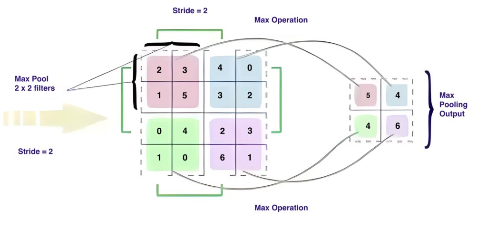

Pooling Operation. Source: [Basics of the Classic CNN](https://towardsdatascience.com/basics-of-the-classic-cnn-a3dce1225add)  

汇集操作。资料来源经典 CNN 基础知识

**Fully Connected Layer  

全连接层**

In the fully connected layer, the smaller filtered images go through a process of being split and stacked into a single list.  

在全连接层中，过滤后的较小图像会被分割并堆叠成一个列表。  

Each value in this list plays a role in predicting the probability of different outcomes.  

列表中的每个值都在预测不同结果的概率中发挥作用。

To put it simply, imagine taking the key features highlighted by the pooling layer and organizing them in a way that helps the network make its final decision.  

简单地说，想象一下将汇集层突出显示的关键特征进行整理，以帮助网络做出最终决定。  

For instance, if the network is deciding whether an image has a mouse, the fully connected layer will look at features like tails, whiskers, or a rounded body.  

例如，如果网络要判断图像中是否有老鼠，那么全连接层就会查看尾巴、胡须或圆形身体等特征。  

It assigns specific weights to these features, sort of like saying, “How important is the tail in determining if it’s a mouse?”  

它为这些特征分配了特定的权重，就好像在说："尾巴对判断是否是老鼠有多重要？

By calculating the products of these weights and the information from the previous layer, the fully connected layer helps the model generate accurate probabilities.  

通过计算这些权重与前一层信息的乘积，全连接层可以帮助模型生成准确的概率。  

In the end, it’s like the network’s way of saying, “Based on these features, I’m pretty confident this is or isn’t a mouse.” This step ensures the network makes precise predictions about what’s in the image.  

最后，这就像是网络在说："根据这些特征，我很确定这是不是一只老鼠"。这一步确保了网络能准确预测图像中的内容。

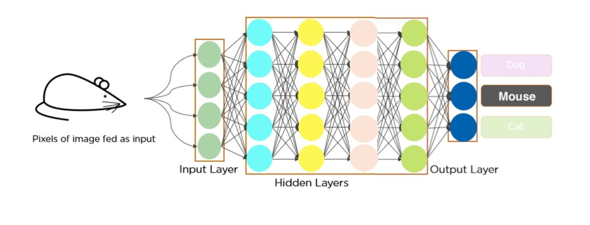

How image recognition works? Source: [Convolutional Neural Network](https://www.slideshare.net/Simplilearn/convolutional-neural-network-tutorial-cnn-how-cnn-works-deep-learning-tutorial-simplilearn)  

图像识别如何工作？来源卷积神经网络

While CNNs are widely adopted, there are also [visual transformers](https://huggingface.co/docs/transformers/model_doc/vit) (ViT), which are more recent and effective in some cases.  

在 CNN 被广泛采用的同时，还有视觉转换器 (ViT)，它在某些情况下更为新颖和有效。

Instead of directly handling the entire image (as CNNs do), ViT breaks it down into smaller “image patches”, and treats them as a structured sequence.  

ViT 不直接处理整幅图像（如 CNN 所做的），而是将其分解为更小的 "图像片段"，并将其作为一个结构化序列来处理。  

A pure transformer applied directly to sequences of image patches can perform very well, particularly in image classification tasks.  

直接应用于图像片段序列的纯变换器性能非常出色，尤其是在图像分类任务中。  

When pre-trained on large datasets and transferred to various image recognition benchmarks, such as ImageNet, ViT achieves excellent results compared to state-of-the-art convolutional networks while demanding significantly fewer computational resources for training.  

与最先进的卷积网络相比，ViT 在大型数据集上进行预训练并转移到各种图像识别基准（如 ImageNet）上时，取得了优异的成绩，同时大大减少了训练所需的计算资源。  

However, a deeper exploration of these subtleties and nuances may require a broader discussion.  

然而，要深入探讨这些微妙之处和细微差别，可能需要进行更广泛的讨论。

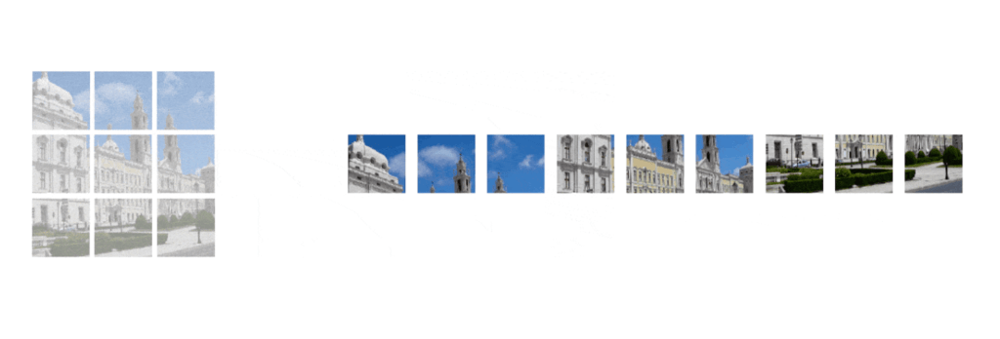

A demo of a Vision Transformer. Source: [Vision Transformer](https://www.v7labs.com/blog/vision-transformer-guide)  

幻视变形金刚演示。资料来源幻视变形金刚

#### **Image Recognition Software  

图像识别软件**

To simplify the creation and implementation of image recognition software, developers can leverage Image Recognition APIs.  

为了简化图像识别软件的创建和实施，开发人员可以利用图像识别 API。  

These APIs, available through cloud-based services, provide an efficient method for conducting image recognition.  

这些通过云服务提供的应用程序接口为进行图像识别提供了有效的方法。  

By transferring data to cloud servers, developers can quickly construct and launch image recognition solutions, obtaining valuable information about the image or its contained objects.  

通过将数据传输到云服务器，开发人员可以快速构建和启动图像识别解决方案，获取有关图像或其中包含的物体的宝贵信息。

Image recognition is a powerful capability that effortlessly integrates into diverse applications and devices, enabling a range of practical uses.  

图像识别功能强大，可毫不费力地集成到各种应用和设备中，实现一系列实际用途。  

As the minds behind Everypixel Journal, [Everypixel Labs](https://labs.everypixel.com/), develop APIs equipped with image recognition technology, we decided to delve into its functionalities and shed light on how they can contribute to the development and enhancement of projects and businesses.  

作为《Everypixel Journal》的幕后推手，Everypixel Labs 开发了配备图像识别技术的应用程序接口，我们决定深入了解其功能，并阐明它们如何有助于项目和业务的开发与改进。

**[Image Keywording](https://labs.everypixel.com/keywording "Image Keywording") (or Image Tagging)  

图像关键词（或图像标签）**

The image keywording API provides methods to recognize objects, people, places, and actions in images and turn them into keywords.  

图像关键字 API 提供了识别图像中的物体、人物、地点和动作并将其转化为关键字的方法。

**Functionality**: Generating a set of at least 20 keywords (up to 50) for each image.  

功能：为每张图片生成一组至少 20 个（最多 50 个）关键词。

**Best for**:  

最适合

-   Image categorization for websites and applications.  
    
    网站和应用程序的图像分类
-   Digital asset management for efficient content organization.  
    
    数字资产管理，实现高效的内容组织。
-   Image moderation.  
    
    图片管理。

**[Age Recognition  

年龄识别](https://labs.everypixel.com/age-recognition "Age Recognition")**

The age recognition API provides methods to extract facial features from photos to accurately estimate a person’s age.  

年龄识别应用程序接口提供了从照片中提取面部特征的方法，以准确估计一个人的年龄。

**Functionality:** Estimating a person’s age based on an analysis of patterns in an image of their face.  

功能：根据对人脸图像模式的分析，估算一个人的年龄。

**Best for**:  

最适合

-   Sales and marketing: it tailors advertising and product offerings based on age demographics.  
    
    销售和市场营销：根据年龄人口统计，量身定制广告和产品。
-   Entertainment and gaming: it enhances user experiences with personalized content and adaptive settings.  
    
    娱乐和游戏：通过个性化内容和自适应设置增强用户体验。
-   Access control and verification: it automatically controls access to services and products based on age.  
    
    访问控制和验证：根据年龄自动控制对服务和产品的访问。
-   Personalized UI: it facilitates the creation of adaptive user interfaces based on the user’s age.  
    
    个性化用户界面：它有助于根据用户的年龄创建自适应用户界面。

**[User Generated Content (UGC) Photo Scoring  

用户生成内容 (UGC) 照片评分](https://labs.everypixel.com/ugc-photo-scoring "User Generated Content (UGC) Photo Scoring")**

The UGC photo scoring API provides methods to give an aesthetic score to user-generated photographs based on technical parameters and attractiveness.  

UGC 照片评分 API 提供了根据技术参数和吸引力对用户生成的照片进行审美评分的方法。

**Functionality**: Scoring photos based on such parameters as clarity, composition, exposure, framing, and so on.  

功能：根据清晰度、构图、曝光、取景等参数对照片进行评分。

**Best for**:  

最适合

-   Recommendation services: it helps users choose the best photo for improved user satisfaction.  
    
    推荐服务：帮助用户选择最佳照片，提高用户满意度。
-   Image moderation: it filters out poor-quality photos in user-generated content.  
    
    图片管理：它能过滤掉用户生成内容中的劣质照片。
-   Image quality control system: it ensures platform success by preventing the upload of poor-quality photos.  
    
    图片质量控制系统：防止上传劣质照片，确保平台成功。
-   Search results ranking: it enhances visual search results on platforms with the UGC photo scoring algorithm.  
    
    搜索结果排名：通过 UGC 照片评分算法，增强平台上的视觉搜索结果。

Here we showcased just a glimpse into the vast capabilities of the technology.  

在这里，我们展示的只是该技术巨大功能的一个缩影。  

While there is considerable hype surrounding image generation, it’s crucial to recognize the profound importance of technology, especially in such domains as [medicine and accessibility](https://journal.everypixel.com/ai-for-social-good-health-well-being-and-reducing-inequality) for individuals with disabilities.  

虽然图像生成技术被炒得沸沸扬扬，但我们必须认识到技术的深远重要性，尤其是在医疗和残疾人无障碍环境等领域。  

These applications not only demonstrate the versatility of image recognition but also underscore its potential to significantly impact and improve various aspects of our lives.  

这些应用不仅展示了图像识别的多功能性，还凸显了图像识别在显著影响和改善我们生活的各个方面的潜力。
