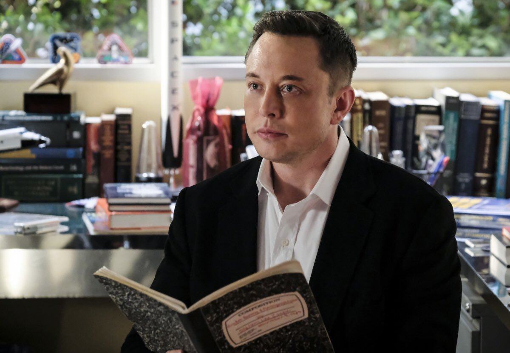
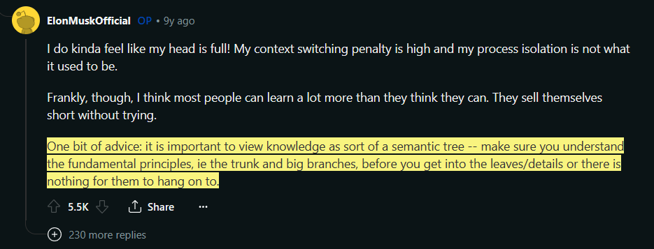
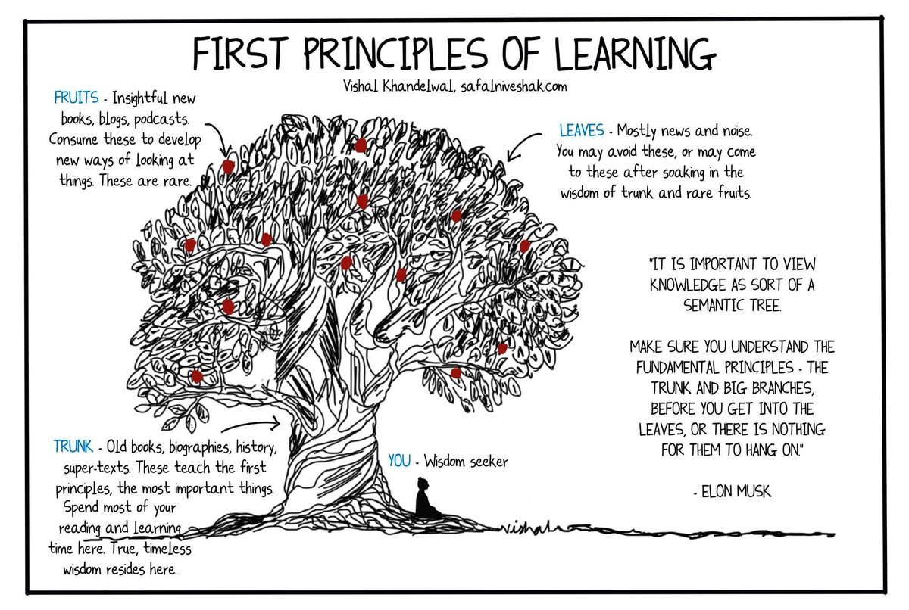
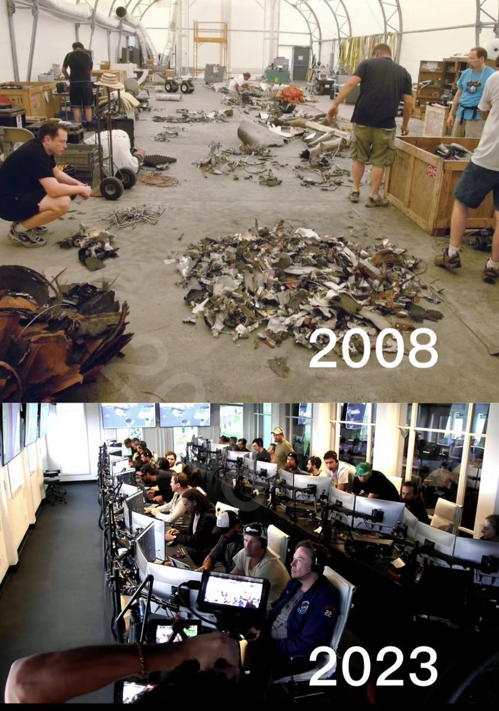
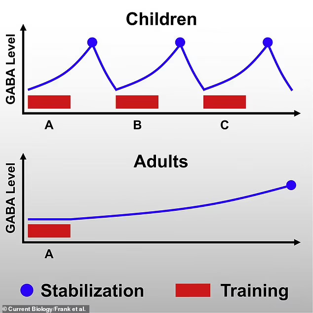
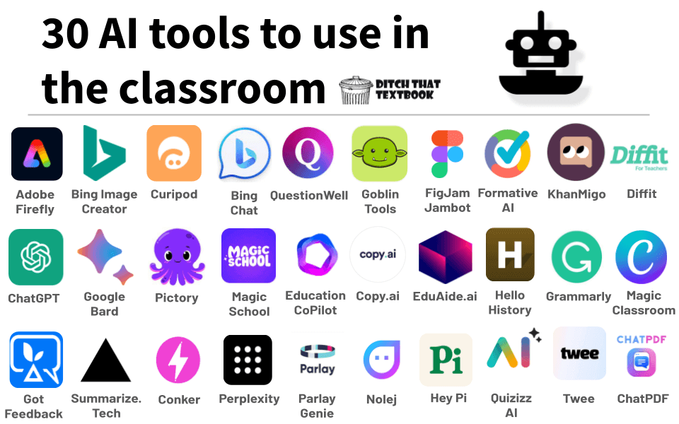
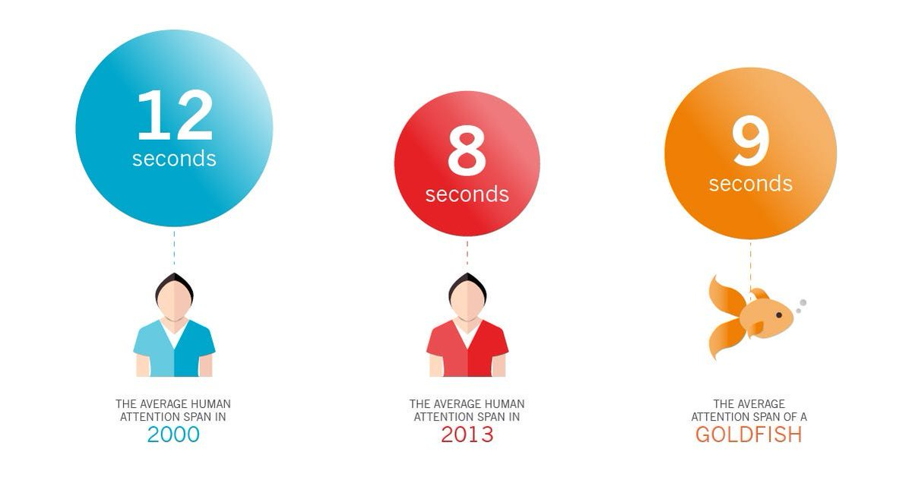
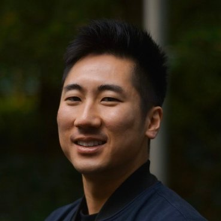

I’m obsessed with learning how to learn.  

我痴迷于学习如何学习。

So, I spent 100+ hours studying how Elon Musk, Sam Altman, and Naval Ravikant absorb information.  

因此，我花了 100 多个小时研究埃隆-马斯克、萨姆-奥特曼和纳瓦尔-拉维坎特是如何吸收信息的。

Here’s what I found on becoming a learning machine:  

以下是我在成为学习机器方面的发现：

___

College Is Overrated  

大学被高估了

Most people are convinced you need college to learn. Elon is proof that you don’t.  

大多数人都认为你需要在大学里学习。埃隆就是最好的证明。

Despite only majoring in Econ/Physics, he’s built 4 billion-dollar companies in industries he knew nothing about.

  

尽管只主修了经济学/物理学，他却在自己一无所知的行业里创建了 4 家市值十亿美元的公司。

How did he pull this off?  

他是怎么做到的？

Your browser does not support the video tag.  

您的浏览器不支持视频标记。

___

Elon’s mental model for learning quickly is the ‘Knowledge Tree.’  

埃隆快速学习的心智模式是 "知识树"。

The idea is to view knowledge as a tree so you can break it into bits.  

我们的想法是把知识看作一棵树，这样你就可以把它分成若干部分。

For example, ‘Trunks and big branches’ VS ‘Leaves and fruits’.  

例如，"树干和大树枝 "VS "树叶和果实"。

___

When you understand the trunk first (i.e., the fundamental principles) before moving on to the  

先了解主干（即基本原理），然后再了解次干（即基本原理）。  

leaves (the finer details), you can increase your learning capacity by 10x.  

叶（细节），你的学习能力就能提高 10 倍。

This simple framework is how he was able to teach himself rocket science.  

这个简单的框架就是他自学火箭科学的方法。

___

Make Learning Fun  

让学习充满乐趣

Seeing learning as a chore instantly inhibits the release of dopamine in your brain.  

将学习视为苦差事会立即抑制大脑中多巴胺的释放。

That’s why it’s vital to approach learning with the same excitement as a video game.  

因此，像玩电子游戏一样兴奋地对待学习至关重要。

This mental shift can help you move at your own pace and study for longer hours.  

这种心理转变可以帮助你按照自己的节奏学习，并延长学习时间。

Your browser does not support the video tag.  

您的浏览器不支持视频标记。

___

Be Curious  

要有好奇心

If you're not genuinely curious about a problem, you'll never go far in solving it.  

如果你对问题没有真正的好奇心，你就永远无法解决它。

Have the courage to go down rabbit holes that are deeply meaningful to you, not just trendy topics.  

要有勇气去探索对你意义深远的兔子洞，而不仅仅是时髦的话题。

The most successful people in any field are the most curious ones.  

在任何领域，最成功的人都是最好奇的人。

Your browser does not support the video tag.  

您的浏览器不支持视频标记。

___

The same goes for books.  

书籍也是如此。

Many people read books solely to cross them off their list. They read to gain bragging rights.  

许多人读书只是为了把书从书单上划掉。他们读书是为了获得炫耀的资本。

Instead of virtue signaling, read only to satisfy your intellectual curiosity.  

与其做美德的代言人，不如只为满足自己的求知欲而阅读。

Don't read to complete. Read to understand.  

不要为了完成而阅读。阅读是为了理解。

Your browser does not support the video tag.  

您的浏览器不支持视频标记。

___

Skip the Mental Masturbation  

跳过精神自慰

The purpose of knowledge is action, not knowledge itself.  

知识的目的是行动，而不是知识本身。

Instead of buying endless courses and bingeing YouTube videos, dive into a problem headfirst and learn on the job.  

与其购买没完没了的课程和狂看 YouTube 视频，不如一头扎进问题中，在工作中学习。

Experience will teach you more than any book ever will.  

经验比任何书本都更能教会你。

Your browser does not support the video tag.  

您的浏览器不支持视频标记。

___

Embrace Failure  

拥抱失败

The fear of failure is the start of it.  

害怕失败是失败的开始。

When learning something new, never worry about not getting it right away.  

在学习新知识时，永远不要担心不能马上掌握。  

Instead, embrace your mistakes and just get the reps in.  

相反，你要勇于承认错误，并积极参加训练。

Doing so increases your neuroplasticity, which makes learning happen 10x faster.  

这样做能增强你的神经可塑性，使学习速度提高 10 倍。

Your browser does not support the video tag.  

您的浏览器不支持视频标记。

___

Elon Musk and Space X are great examples of this.  

埃隆-马斯克和 Space X 就是很好的例子。

His first rocket, Falcon 1, had three of five launches fail miserably (40% success rate).  

他的第一枚火箭 "猎鹰 1 号 "五次发射中有三次惨遭失败（成功率为 40%）。

___

In contrast, his most recent Falcon 9 has only suffered two failures in 232 launches (92% success rate).  

相比之下，他最新的猎鹰 9 号在 232 次发射中只出现过两次失败（成功率为 92%）。

Moral lesson? Lean into your mistakes.  

教训？从错误中吸取教训。

___

Build A One-Track Mind  

建立单轨思维

Studies show people older than 25 have a harder time learning.  

研究表明，25 岁以上的人更难学习。

This is because the nervous systems of adults have less space in them to store new info.  

这是因为成年人的神经系统储存新信息的空间较小。

___

As an adult, the best way to force your brain to accept new patterns is through sheer focus while studying.  

作为成年人，迫使大脑接受新模式的最好方法就是在学习时全神贯注。

No TV. No phones. No multitasking.  

没有电视。没有电话。没有多任务处理

Isolate yourself from the world and zone in.  

将自己与世界隔离开来，沉浸其中。

Your browser does not support the video tag.  

您的浏览器不支持视频标记。

___

Use Tech To Your Advantage  

利用技术为你服务

We live in a time where tech can massively alter the scale and speed at which we learn.  

在我们生活的时代，科技可以极大地改变我们学习的规模和速度。

With AI, it's possible to reduce a 100-page book to a 3-paragraph summary.  

有了人工智能，就有可能将一本 100 页的书缩减为 3 段摘要。

Don't hesitate to use these tools for your benefit.  

为了您的利益，请不要犹豫使用这些工具。

___

While the act of learning itself will remain constant, the ‘how’ will continue to evolve.  

虽然学习行为本身将保持不变，但 "如何 "将继续演变。

Just as the world adapted to Google as a learning tool 20 years ago, you must also learn to leverage new tools.  

正如 20 年前世界适应了谷歌作为学习工具一样，你也必须学会利用新工具。

If you don’t, you’ll be left behind.  

否则，你就会被甩在后面。

Your browser does not support the video tag.  

您的浏览器不支持视频标记。

___

Repeat. Repeat. Repeat.  

重复。重复。重复

In an age where the average attention span is 9 seconds, you need constant repetition to retain new info.  

在一个平均注意力只有 9 秒钟的时代，你需要不断重复才能记住新信息。

Abandon the fantasy you can learn and master in one try.  

放弃一次就能学会并掌握的幻想。

Even geniuses revisit data over and over.  

即使是天才也会反复修改数据。

___

Instead, create a system for repetitive learning.  

相反，要创建一个重复学习的系统。

Find ways to expose yourself to the same info repeatedly until it's ingrained in your memory.  

想办法让自己反复接触相同的信息，直到这些信息在你的记忆中根深蒂固。

Doing this makes the new information second nature to you, up to the point where you can visualize it in your sleep.  

这样做会让新信息成为你的第二天性，甚至让你在睡梦中也能将其想象出来。

Your browser does not support the video tag.  

您的浏览器不支持视频标记。

___

Get Tons Of Rest  

大量休息

Lastly, your brain can only focus for 90 minutes before needing an hour of rest.  

最后，你的大脑只能专注 90 分钟，然后需要休息一个小时。

When you notice your mind wandering during study, drop everything and get some sleep.  

当你发现自己在学习过程中思绪飘忽不定时，请放下一切，好好睡一觉。

Just as you need sleep to grow muscle, you also need it to consolidate new information.  

正如你需要睡眠来增长肌肉一样，你也需要睡眠来巩固新信息。

Your browser does not support the video tag.  

您的浏览器不支持视频标记。

___

Don’t worry about losing time when you rest.  

不要担心休息会耽误时间。

Even in sleep, your brain revisits everything you've learned. It's wired to process info even with  

即使在睡眠中，你的大脑也会重新审视你所学到的一切。即使在睡眠中，它也能处理信息。  

your eyes closed.  

闭上眼睛

That means a quick nap doesn’t cost you anything.  

这意味着打个盹不需要任何花费。

Instead, it does you a favor.  

相反，它还能帮你一个忙。

___

If you got something from this...  

如果您从中有所收获...

1\. Follow [@ecomEddie](https://twitter.com/ecomEddie) for more  

1.关注 @ecomEddie 获取更多信息  

2\. Repost this  

2.转贴此文

I’m obsessed with learning how to learn.  

我痴迷于学习如何学习。

So, I spent 100+ hours studying how Elon Musk, Sam Altman, and Naval Ravikant absorb information.  

因此，我花了 100 多个小时研究埃隆-马斯克、萨姆-奥特曼和纳瓦尔-拉维坎特是如何吸收信息的。

Here’s what I found on becoming a learning machine:  

以下是我在成为学习机器方面的发现：

