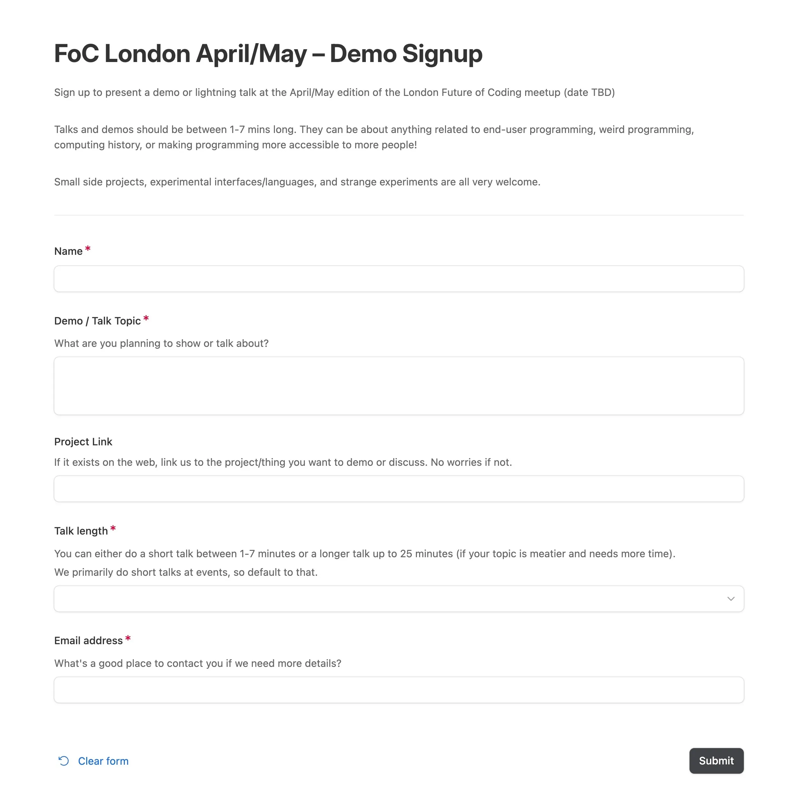
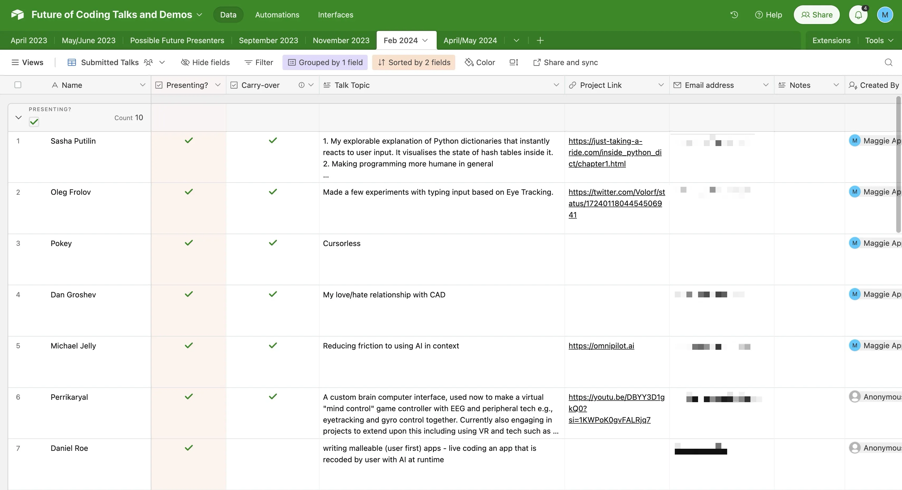
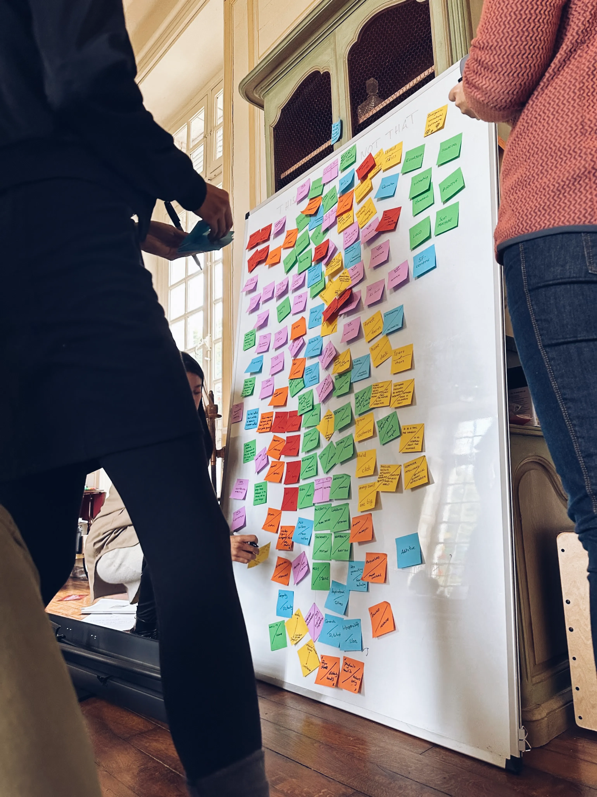
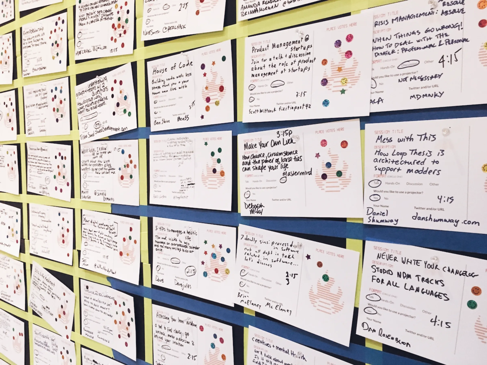
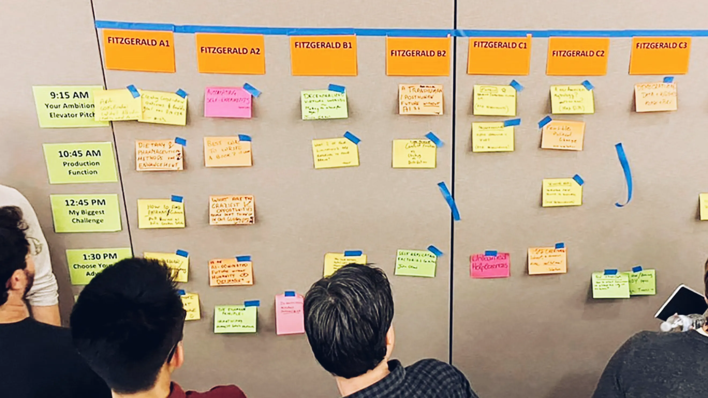
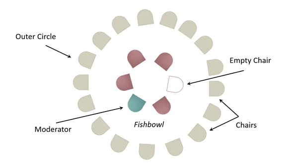
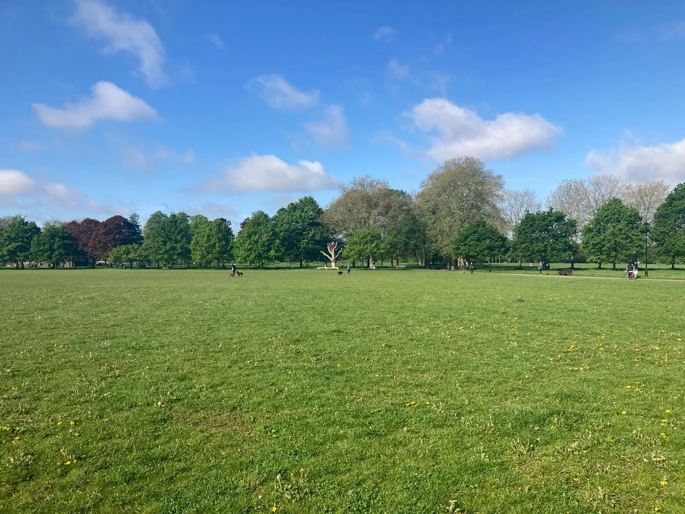
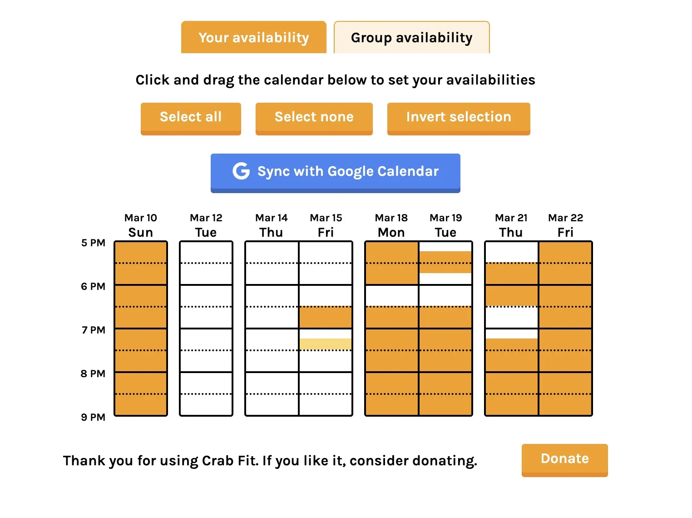
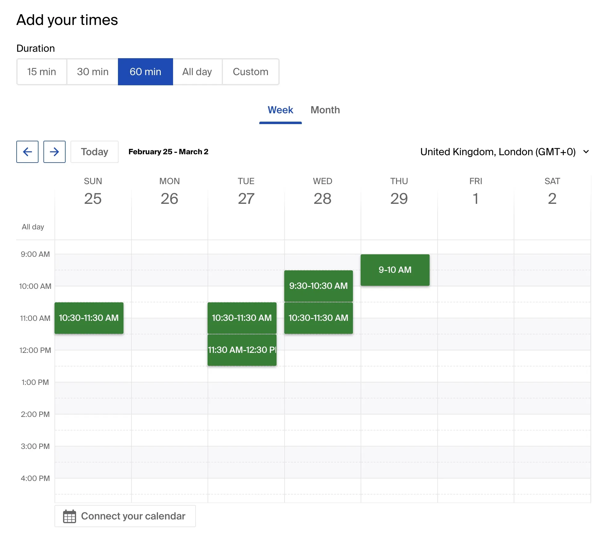

Assumed Audience  

假设的观众

People who currently put on events and gather people together, or people who want to start doing so.  

目前正在举办活动并将人们聚集在一起的人，或者想要开始这样做的人。

I have been inadvertenly gathering people and putting on community events for about fifteen years.  

大约十五年来，我一直在无意中聚集人们并举办社区活动。  

I say “inadvertently” because I've never sat down and thought “I want to be a community organiser.” What happens is I have a craving for certain kinds of experiences.  

我说“无意中”是因为我从未坐下来思考“我想成为一名社区组织者”。发生的事情是我渴望某些类型的经历。

I think “wouldn't it be great if I knew people also designing interfaces for language models”, or “I wish I could explore web animation with people also trying to learn it”, or “Jesus,

paper is wild, who can I talk to about this??”  

我想“如果我知道人们也在为语言模型设计界面，那不是很棒吗”，或者“我希望我可以和也尝试学习它的人们一起探索网络动画”，或者“天哪，这篇布鲁诺·拉图尔的论文太疯狂了，我可以和谁谈谈这件事吗？？”

Then I go looking for local events and social spaces that mights satisfy those cravings.  

然后我去寻找可能满足这些渴望的当地活动和社交空间。  

And I usually don't find them.  

而我通常找不到它们。  

Either because they don't exist, or because I'm bad at Googling and most communities don't loudly advertise themselves.  

要么是因为它们不存在，要么是因为我不擅长谷歌搜索，而且大多数社区都不会大声宣传自己。

If the craving is strong enough, and I don't think I'm the only human on earth interested in this topic, I create an event.  

如果渴望足够强烈，并且我认为我不是地球上唯一对这个话题感兴趣的人，我就会创建一个活动。  

That event is sometimes a one-off, but sometimes it morphs into an ongoing thing that eventually becomes a living community.  

该事件有时是一次性的，但有时它会演变成一件持续的事情，最终成为一个活生生的社区。

In the past I've hosted design evenings, run visual storytelling courses, co-hosted a comic-making group, gathered a reading group for LLM designers, put on

salons on cyborgism and rituals, organised coffee mornings for , setup , co-organised an early in San Fransisco, run a writing club for , and plenty of one-off events in between.  

过去，我主持过设计之夜、举办视觉讲故事课程、共同主持漫画制作小组、为 LLM 设计师聚集一个阅读小组、举办有关机器人主义和仪式的 InterIntellect 沙龙、组织咖啡早晨对于 PKM 书呆子，设置无声同步阅读课程，在旧金山共同组织一场早期的 AI x UX 活动，运营一个模仿其他作家的写作俱乐部，以及其间的大量一次性活动。

I've also been a participant in countless meetups, conferences, unconferences, hackathons, designathons, and retreats organised by people who are _much_ better at this than I am, and paid close attention to their tactics.  

我还参加了无数的聚会、会议、非会议、黑客马拉松、设计马拉松和静修活动，这些活动都是由比我擅长的人组织的，并密切关注他们的策略。

At the moment I'm focused on running the London

meetup, helping out with – a London reading group of philosophy, history, and social science nerds, and putting on smaller dinner parties at home.  

目前，我专注于举办“伦敦编程未来”聚会，为“Through a Glass Darkly”（一个由哲学、历史和社会科学书呆子组成的伦敦阅读小组）提供帮助，并在家里举办小型晚宴。

Over the years I've learned to reign in my impulse to start new communities and groups.  

多年来，我学会了克制自己建立新社区和团体的冲动。  

Or at least be wary of it in a way I wasn't a decade ago.  

或者至少以十年前不同的方式对此保持警惕。

[## The Mountain of Crap  

垃圾山](https://maggieappleton.com/gathering-structures#the-mountain-of-crap)

As an organiser, you have to deal with a mountain of crap.  

作为组织者，你必须处理堆积如山的垃圾。  

If someone disruptive or narcissistic shows up and hogs all the time and space, you're in charge of dealing with them.  

如果有人破坏性的或自恋的人出现并占据所有的时间和空间，你就负责对付他们。  

You have to be kind to people who have no boundaries, and think you owe them the world because they deigned to sign up for your event.  

你必须善待那些没有界限的人，并认为你欠他们整个世界，因为他们屈尊报名参加你的活动。  

You have to encourage and cajole the non-crazy people to share their thoughts and open up to each other.  

你必须鼓励和哄骗那些不疯狂的人分享他们的想法并互相敞开心扉。  

You have to design activities that faciliatate discussion and create space for everyone.  

您必须设计促进讨论并为每个人创造空间的活动。  

People will get hungry and thirsty, and you have to find a way to feed and water them.  

人们会感到饥饿和口渴，你必须找到一种方法来喂养和浇水他们。  

You sometimes have to pay for it, or convince someone else to pay for it.  

有时你必须为此付出代价，或者说服别人为此付出代价。  

You have to stay until the end and clean up everyone else's rubbish.  

你必须留到最后并清理其他人的垃圾。  

You have to field emails from a dozen people who failed to read the event description asking about the time, location, venue ammenities, schedule, food, and predicted weather for it.  

你必须回复十几个人发来的电子邮件，他们没有阅读活动描述，询问活动的时间、地点、场地设施、日程、食物和预测天气。

Your challenge is to setup enough systems and structures to shrink this mountain of crap to an acceptable level.  

您的挑战是建立足够的系统和结构，将这座堆积如山的垃圾缩小到可接受的水平。  

My organising impulses are reasonably selfish, so if I'm too busy dealing with unpleasant people, logistics, and literal rubbish to enjoy myself at an event, that's probably the end of that community.  

我的组织冲动相当自私，所以如果我太忙于处理令人不快的人、后勤工作和字面意义上的垃圾，而无法在活动中享受乐趣，那么这个社区可能就结束了。

Luckily, I've found a set of structures that help make events low-stress and high-payoff for me.  

幸运的是，我找到了一套结构，可以帮助我减轻压力并获得高回报。  

Which is good for everyone, because then I'm not a grump and I'm extremely happy to be the community's steward.  

这对每个人都有好处，因为这样我就不会脾气暴躁，而且我非常高兴成为社区的管家。  

I then have more energy to help others enjoy the event, make gatherings more frequent, and be a nice person.  

这样我就有更多的精力去帮助别人享受活动，让聚会更加频繁，做一个好人。

Some of the crap can be solved with software like

for group communication, for announcing events, emails, and registrations, for managing speaker sign-ups, and for pre-scheduling food/drink/pizza deliveries.  

有些问题可以通过诸如用于群组通信的 WhatsApp、用于宣布活动、电子邮件和注册的 Luma、用于管理演讲者注册的 Airtable 以及用于预先安排食物/饮料/披萨配送的 Deliveroo 等软件来解决。

I think the more interesting structures are the social-shaped ones that facilitate interesting interactions, draw out ideas, help people talk to one another, and spread the burden of co-ordinating many people in one space.  

我认为更有趣的结构是社交型的结构，它可以促进有趣的互动，提出想法，帮助人们相互交谈，并分散在一个空间中协调许多人的负担。

[## Seven Minute Demos  

七分钟演示](https://maggieappleton.com/gathering-structures#seven-minute-demos)

People do demos of something they've built, or give a lightning talk on whatever topic they like.  

人们对他们构建的东西进行演示，或者就他们喜欢的任何主题进行简短的演讲。  

The demo/talk just has be less than 7 minutes long. There's no minimum time limit.  

演示/演讲时长不到 7 分钟。没有最短时间限制。  

People can talk for 1 minute, 3 minutes, or take the whole 7.  

人们可以讲 1 分钟、3 分钟或整个 7 分钟。

7 minutes isn't enough time to waffle, or make your audience bored.  

7 分钟不足以胡言乱语或让观众感到无聊。  

You have to get to the point immediately.  

你必须立即进入正题。  

If you're demo-ing something, you can't talk about it for ages first, because you don't have time to.  

如果你正在演示某些东西，你不能先谈论它很长时间，因为你没有时间。  

You have to jump into showing us.  

你必须立即向我们展示。

This is what I do for my

meetup and it works perfectly.  

这就是我为“编码未来”聚会所做的事情，效果非常好。  

The Future of Coding is a community interested in making programming more accessible, exploratory, and humane for more people.  

The Future of Coding 是一个致力于让编程对更多人来说更容易理解、更具探索性、更人性化的社区。  

So most of what people want to see is cool, weird experiments in programming systems and interfaces.  

因此，大多数人希望看到的是编程系统和接口中很酷、很奇怪的实验。  

The short time format allows us to fit a dozen demos into every event, rather than only have a handful of speakers.  

短时间格式使我们能够在每个活动中进行十几个演示，而不是只有少数发言者。

The time limit also lowers the barrier to entry and makes it less intimidating for people to sign up and speak.  

时间限制还降低了进入门槛，让人们不再那么害怕注册和发言。  

You don't have to prepare a long song and dance, or show something elaborate.  

你不必准备很长的歌舞，或者表演一些精心制作的东西。  

Simple, short, punchy demos shine here.  

简单、简短、有力的演示在这里大放异彩。

Anyone can sign up to demo.  

任何人都可以注册演示。  

This works on a first-come, first-serve basis, and these spots tend to fill up quickly.  

这是按照先到先得的原则进行的，而且这些位置往往很快就会被填满。  

I use an Airtable form for this, which feeds into a spreadsheet I can easily review before the event.  

为此，我使用了 Airtable 表单，将其输入到电子表格中，我可以在活动前轻松查看。

The signup form for demos at the Future of Coding meetup  

未来编码聚会上的演示注册表单

The Airtable the Future of Coding form submissions are sent to  

Airtable“编码的未来”表单提交内容发送至

I very lightly filter demos for quality and relevance. People submit their topics ahead of time.  

我会根据质量和相关性对演示进行轻微过滤。人们提前提交他们的主题。  

If someone is clearly doing product promotion for their non-programming-related start-up, it's a no.  

如果有人明显是在为他们的非编程相关初创公司进行产品推广，那就不行。  

But otherwise, weird and unexpected topics are very welcome.  

但除此之外，奇怪和意想不到的话题是非常受欢迎的。

[## Ad-hoc, Rotating Hosts  

临时轮换主机](https://maggieappleton.com/gathering-structures#ad-hoc-rotating-hosts)

When you have a smaller group (let's say under 20), you can easily have rotating hosts who volunteer on an ad-hoc basis.  

当您的团体规模较小（假设人数不足 20 人）时，您可以轻松地轮流担任临时志愿者。

We do this in

– an informal reading club of sorts run by my friend . We have a WhatsApp group where anyone can suggest a reading they want to discuss.  

我们在“Through a Glass Darkly”中做到了这一点——这是一个由我的朋友布莱恩·卡姆（Bryan Kam）经营的非正式阅读俱乐部。我们有一个 WhatsApp 群组，任何人都可以建议他们想要讨论的读物。  

If other people are interested, they reply or add an emoji reaction.  

如果其他人感兴趣，他们会回复或添加表情符号反应。  

The proposer is now the de-facto host for a dicussion on this reading at the next event.  

提议者现在是下一次活动中对此解读进行讨论的事实上的主持人。  

Here's some genuine examples of how easy this is:  

以下是一些真实的例子，说明这是多么容易：

Some of the logistics are pre-solved in this group, which makes things a lot easier.  

一些后勤工作已在该组中预先解决，这使事情变得容易得多。  

We always meet at the same time and place.  

我们总是在同一时间、同一地点见面。  

Participants just have to show up having done (most) of the reading.  

参与者只需完成（大部分）阅读即可。

On weeks where no one suggests a reading, or not enough people are free, the group doesn't meet.  

如果几周没有人建议阅读，或者没有足够的人有空，小组就不会开会。  

It's a very flexible system that adjusts to when people are more or less busy.  

这是一个非常灵活的系统，可以根据人们或多或少忙碌的情况进行调整。

This turns the group into a much more democratically run endeavour, and Bryan doesn't have to carry the burden of selecting every reading and running the discussion.  

这使得该小组的运作变得更加民主，布莱恩不必承担选择每一份阅读材料和进行讨论的负担。  

You also get more diversity in what texts people want to read.  

人们想要阅读的文本也更加多样化。

[## The Unconference Wall  

非会议墙](https://maggieappleton.com/gathering-structures#the-unconference-wall)

This one is pretty well-known, but still a favourite. It comes from

  

这个非常有名，但仍然是最受欢迎的。它来自开放空间技术 and is the default format for .  

是非会议的默认格式。

You gather people with a common set of interests, but no specific agenda of what to talk about.  

你聚集了具有共同兴趣的人，但没有具体的讨论内容的议程。  

Everyone writes topics they want to discuss on post-it notes.  

每个人都在便利贴上写下他们想要讨论的话题。  

You put these on a wall for everyone to read.  

您将这些内容贴在墙上供每个人阅读。

A nice big whiteboard of post-its with topics and ideas to discuss  

一个漂亮的大白板便利贴，上面有可供讨论的主题和想法

Everyone then silently votes on which ones they also want to discuss.  

然后每个人都默默地投票选出他们也想讨论的内容。  

Usually by adding small sticker dots to the corner of the post-its (also known as

). The topics with the most dots will become sessions for the event.  

通常是在便利贴的一角添加小贴纸点（也称为 Dotmocracy）。得分最多的主题将成为该活动的分会场。

Session ideas with dot votes on them – Source: [Technical.ly](https://technical.ly/professional-development/barcamp-philly-2023-unconference/)  

带有点投票的会议创意 – 来源：Technical.ly

You do need some amount of space for the next bit – ideally separate rooms, or divided areas of one large room.  

您确实需要一定的空间来进行下一步——最好是独立的房间，或者一个大房间的划分区域。  

The organisers now need to create a schedule grid.  

组织者现在需要创建一个时间表网格。  

You put time slots along one side, and locations along another.  

您将时间段放在一侧，将位置放在另一侧。  

You take the most popular topics and slot them into a time and place. E.g. 9-10am in Room A.  

您可以选择最流行的主题并将它们划分到特定的时间和地点。例如。上午 9 点至 10 点，A 室。

A filled out unconference schedule with times and room names – Source: [Swarthmorean](https://www.swarthmoreanarchives.com/articles/content/2021-11-20/have-you-been-to-an-unconference)  

已填写的非会议时间表，包含时间和房间名称 - 来源：Swarthmorean

You now have a full schedule for your unconference. The people who proposed the topic (e.g.  

您现在已经有了完整的非会议日程安排。提出该主题的人（例如  

wrote the original post-it) are usually in charge of running their own session, but can negoitate co-running it with other people, or handing off facilitation entirely.  

写了最初的便利贴）通常负责运行自己的会议，但可以协商与其他人共同运行，或者完全放弃协助。  

It's up to them and everyone who voted for the session.  

这取决于他们和所有为会议投票的人。

It helps if your participants know about this format ahead of time.  

如果您的参与者提前了解这种格式，将会有所帮助。  

That way they can think of topics to suggest, and plan discussion questions or activites if those topics are picked.  

这样他们就可以想到要建议的主题，并在选择这些主题时计划讨论问题或活动。  

But I've also seen people completely wing it with no pre-planning, and the sessions turn out great.  

但我也看到人们在没有预先计划的情况下完全即兴发挥，而且会议结果很棒。

[## Fishbowl  

鱼缸](https://maggieappleton.com/gathering-structures#fishbowl)

The

is also from unconference culture.  

鱼缸也来自非会议文化。  

When it works, it's like a beautiful dance more than a discussion.  

当它发挥作用时，它更像是一场美丽的舞蹈，而不是一场讨论。

It's used to host a discussion with a larger number of people (let's say more than twenty).  

它用于主持与更多人（假设超过二十人）的讨论。  

You arrange everyone's chairs around the outside of a room in a large circle, then place 6 chairs in the center.  

你把每个人的椅子在房间外面围成一个大圈，然后把 6 把椅子放在中间。

This middle section is the fishbowl.  

中间部分是鱼缸。

The classic setup of a fishbowl discussion – Source: [Skills Converged](https://www.skillsconverged.com/blogs/free-training-materials/fishbowl-conversation-technique)  

鱼缸讨论的经典设置 – 来源：Skills Converged

The rules are simple; you can only talk if you're sitting in the fishbowl.  

规则很简单；只有坐在鱼缸里才能说话。  

There's a moderator who stays in the fishbowl the whole time.  

有一个主持人一直呆在鱼缸里。  

They should have some questions ready to start the discussion and keep the flow going.  

他们应该准备好一些问题来开始讨论并保持流程继续进行。  

They can also summarise points and reflect ideas back to the group.  

他们还可以总结要点并将想法反馈给小组。

Anyone can join the fishbowl at any time. But as soon as someone joins, someone else has to leave.  

任何人都可以随时加入鱼缸。但只要有人加入，就必须有人离开。  

There is always one chair left empty, as an invitation for someone new to join.  

总是有一张空椅子，作为对新人加入的邀请。

This dynamic forces everyone in the room to become attuned to the body language and behavior of everyone else.  

这种动态迫使房间里的每个人都适应其他人的肢体语言和行为。  

Who looks like they want to join the fishbowl next? Who looks like they want to leave the fishbowl?  

谁看起来是下一个想加入鱼缸的人？谁看起来想要离开鱼缸？  

Who hasn't been in it yet?  

谁还没有参与其中？  

Who's taking up too much space and overstaying their welcome in the fishbowl?  

谁在鱼缸里占据了太多的空间并超出了他们的欢迎范围？

It's brilliant for regulating groups where some people love the sound of their own voice.  

这对于规范某些人喜欢自己声音的群体来说非常有用。  

You become hyper-aware of how much time and space you're personally taking up when you're in the center.  

当你处于中心时，你会变得非常清楚自己占用了多少时间和空间。  

The majority of people default to succintly sharing their thoughts and then ceding the floor to others.  

大多数人默认会简洁地分享自己的想法，然后把发言权让给其他人。

[## Gatekeeping  

把关](https://maggieappleton.com/gathering-structures#gatekeeping)

This is slightly controvertial, but you should _sometimes_ channel Mean Girls and be selective about who you invite to events. You need to do some gatekeeping.  

这有点争议，但有时你应该引导“贱女孩”，并有选择性地邀请谁参加活动。你需要做一些把关工作。

Gatekeeping gets a bad rap as being exclusive and unfriendly. It can be if you do it wrong.  

看门人因排他性和不友好而受到诟病。如果你做错了，也可能会这样。  

I'm certainly not suggesting you plan an exciting event, loudly yell about it on Twitter, and then go around telling most people they're _not_ invited. Have a little discretion here.  

我当然不是建议你计划一场激动人心的活动，在 Twitter 上大声喊叫，然后到处告诉大多数人他们没有被邀请。这里有一点自由裁量权。  

Only people invited to the event should know it exists at all.  

只有受邀参加该活动的人才应该知道它的存在。

Why Gatekeep though?  

为什么要守门呢？  

Because events are usually better when the people: a) have high shared context on a particular topic or interest, and b) are genuinely nice, kind, social people who will add to the experience and not detract from it.  

因为当人们满足以下条件时，活动通常会更好：a) 在特定主题或兴趣上有高度的共同背景，b) 是真正善良、友善、善于交际的人，他们会增加体验而不是减损体验。

Everyone is more likely to have a good time in good company.  

每个人都更有可能在好的陪伴下度过愉快的时光。

The best events I've been to were ones where the host hand-picked everyone.  

我参加过的最好的活动是主持人亲自挑选每个人的活动。  

For example, one event only included people who had demonstrated significant dedication to a particular community, and were doing serious work in it.  

例如，一项活动仅包括那些对特定社区表现出重大奉献精神并在其中认真工作的人。  

Everyone came in with a lot of common background knowledge, which allowed us to jump into discussions at a deeper level.  

每个人都有很多共同的背景知识，这使我们能够进行更深层次的讨论。  

When you've all read the same books, know the same people, and reference the same historical touchpoints, debates become much meatier.  

当你们都读过同样的书，认识同样的人，参考同样的历史接触点时，争论就会变得更加激烈。  

It's probably what academia is like, but less soul-crushing and zero-sum.  

这可能就是学术界的样子，但不那么摧残灵魂，也不那么零和。

Think about it as positive exclusion.  

将其视为积极排除。  

Only inviting people who are deeply into X will give them stronger connections to one another, and they'll have plenty talk about.  

只有邀请那些对 X 有深入了解的人才能让他们彼此之间建立更牢固的联系，并且他们会有很多谈论的话题。  

Someone who doesn't care about X wouldn't want to come anyway.  

不关心X的人无论如何也不会愿意来。

This is a total tangent, but if you ever needed another reason to

by or podcasting or streaming or whathaveyou, add on that people will assume you're more competent than you are.  

这是完全离题的，但如果你需要另一个理由通过数字园艺、播客、流媒体或其他什么方式在公共场合学习，请补充一点，人们会认为你比你更有能力。  

This will get you invites to very cool exclusive events filled with high-achieving, interesting people, even though you have no right to be there.  

这将使您受邀参加非常酷的独家活动，其中有成就斐然、有趣的人，即使您没有权利参加那里。  

A+ side benefit.  

A+ 附带好处。[## Start Small and Simple  

从小而简单的开始](https://maggieappleton.com/gathering-structures#start-small-and-simple)

Okay, this is less of a structure and more of a principle.  

好吧，这与其说是一个结构，不如说是一个原则。  

Every community or event I've run started as small and simple as possible, with as few people as possible.  

我运行的每个社区或活动都是从尽可能小、尽可能简单、人员尽可能少的开始的。

My Future of Coding meetup started as a handful of people getting a casual drink in a pub, and is now up to 80 people and a dozen presenters each time.  

我的编程未来聚会最初是少数人在酒吧喝一杯，现在每次都有 80 人和十几位演讲者。  

Very much by demand, and with almost no promotional effort on my part.  

很大程度上是根据需求，我几乎没有做任何促销工作。

I try not to add complexity or overhead if I can help it.  

如果可以的话，我会尽量不增加复杂性或开销。  

I don't promise people it's going to be the best event of the season, or go above and beyond to make it exceptional.  

我不会向人们保证这将是本赛季最好的赛事，或者超越它以使其与众不同。  

In fact, I do as little as possible.  

事实上，我尽可能少做。  

I pick a time, a location, a set of people, and a topic / intention / reading for the group, and almost nothing else.  

我为小组选择一个时间、一个地点、一群人、一个主题/意图/阅读材料，几乎没有其他任何事情。

Another event organiser once asked me how they could get more people to come to their stuff.  

另一位活动组织者曾经问我他们如何才能让更多的人来参加他们的活动。  

This question confused me because I'm often trying to get _fewer_ people to come to my events.  

这个问题让我很困惑，因为我经常试图减少来参加我的活动的人。  

Not because I don't like people, but people and problems scale linearly.  

不是因为我不喜欢人，而是人与问题是线性相关的。  

It is more complex to organise more people.  

组织更多的人就更复杂了。  

It is harder to find venues, it is harder to coordinate them, and it is more likely one of your participants will be poorly attuned to social norms and behaviours.  

找到场地更难，协调它们也更难，而且其中一位参与者更有可能不太适应社会规范和行为。

My ideal community size is something like 8-12 people.  

我理想的社区规模是 8-12 人。  

Enough that if half of you are busy or sick one week, the rest can still hold a lively event.  

足够了，如果你们一半人一周很忙或生病，剩下的人仍然可以举办一场热闹的活动。

[## Unsolved Problems  

未解决的问题](https://maggieappleton.com/gathering-structures#unsolved-problems)

Here are some gathering problems I still haven't solved.  

这里有一些我还没有解决的收集问题。  

Some feel like they're one good app away from dissappearing.  

有些人觉得他们是一款远离消失的好应用程序。  

Others require enourmous social infrastructure shifts, which I won't be holding my breath for.  

其他人需要巨大的社会基础设施转变，我不会屏息以待。

### 1\. Finding the optimal meeting spot  

1\. 寻找最佳会面地点

By this I mean a location that is roughly equidistant from each person's home, so everyone's travel time is as short and convenient as possible.  

我指的是距离每个人的家大致等距离的位置，因此每个人的旅行时间都尽可能短且方便。

Mercifully, this isn't _too_ hard in London.  

幸运的是，这在伦敦并不难。  

Our public transport system is based around a few key hubs like King's Cross, Liverpool Street, London Bridge, and Waterloo.  

我们的公共交通系统以国王十字、利物浦街、伦敦桥和滑铁卢等几个主要枢纽为基础。  

These stations are well connected to tube and national rail lines, so people both in and out of London can easily make it.  

这些车站与地铁和国家铁路线连接良好，因此伦敦内外的人们都可以轻松到达。  

This is harder in places without sane transportation systems. My condolences if you live in one.  

在没有健全的交通系统的地方，这更加困难。如果您住在其中，我表示哀悼。

For larger events, I try to stay within range of these hubs.  

对于大型活动，我会尽量留在这些中心的范围内。  

But for smaller meetups of less than 15 people, there's likely some set of locations that would be easy for everyone to get to, less busy, and more pleasant than the bustling city center.  

但对于少于 15 人的小型聚会，可能有一些地点比熙熙攘攘的市中心更方便每个人到达、不那么繁忙且更令人愉快。  

But it depends on where everyone is coming from.  

但这取决于每个人来自哪里。

While not _every_ problem can be solved with an app, this is actually a pretty good candidate for one.  

虽然并不是所有问题都可以通过应用程序解决，但这实际上是一个非常好的候选者。  

Here's the shape of what I want:  

这是我想要的形状：

-   Every participant enters their postcode or address. These are obviously kept private.  
    
    每个参与者输入他们的邮政编码或地址。这些显然是保密的。
-   The magical algorithm uses its knowledge of public transportation to find the midpoint.  
    
    神奇的算法利用其公共交通知识来找到中点。  
    
    Importantly, this must be based on public transport travel time, not geographical distance.  
    
    重要的是，这必须基于公共交通旅行时间，而不是地理距离。
-   The system searches for pubs, cafes, and parks within a ~1km radius of that midpoint and suggests them as meeting points.  
    
    该系统会搜索中点半径约 1 公里范围内的酒吧、咖啡馆和公园，并建议将它们作为集合点。

Seems simple. Probably horrendously complex to actually build. Who wants to do it?  

看起来很简单。实际构建起来可能非常复杂。谁想做呢？

I gather this is less of a problem in giant countries with giant houses and giant cars that carry you everywhere.  

我猜想，在拥有巨大房屋和载着你去任何地方的巨型汽车的大国里，这不是什么问题。  

You just host events in your 1000 square foot living room, and everyone is happy to drive their personal vehicle over.  

您只需在 1000 平方英尺的客厅举办活动，每个人都会很乐意驾驶自己的私人车辆过来。  

Sounds idyllic.  

听起来很田园风光。

### 2\. Finding meeting spots for more than a dozen people  

2\. 寻找十几个人的聚会地点

Booking a table for less than 12 people at a pub or cafe is doable.  

可以在酒吧或咖啡馆预订 12 人以下的餐桌。  

Booking a table for more than 12 makes you a nuisance and now a “private party” who needs to pay a good chunk of £££ to take over half the establishment.  

预订一张超过 12 人的餐桌会让你变得很麻烦，而且现在你变成了一个“私人聚会”，需要支付一大笔英镑才能占据一半以上的餐厅。

Organising events with lots of people gets tricky.  

组织很多人参加的活动会很棘手。  

You end up re-using the same small set of pubs, cafes, and public buildings that will tolerate your larger group.  

你最终会重复使用同样的一小部分酒吧、咖啡馆和公共建筑，以容纳更大的团体。

In the summer, London's public parks essentially solve this problem.  

到了夏天，伦敦的公园基本上解决了这个问题。  

They're way more pleasant than a pub, free, and allow you to scale up to almost any number.  

它们比酒吧更令人愉快，免费，并且允许您扩展到几乎任何数量。  

Tell everyone to bring some food, drinks, and picnic blankets to share – this adds to the conviviality.  

告诉每个人带一些食物、饮料和野餐毯来分享——这会增加欢乐气氛。  

But this is only doable between late April and early September when the weather is humane.  

但这只能在四月下旬至九月初天气适宜时才可行。

The perfect meeting venue  

完美的会议场地

I have no good solutions for winter, except to continue watching the global temperature rise at an alarming rate.  

对于冬天我没有什么好的解决办法，除了继续看着全球气温以惊人的速度上升。  

If we wait until 2033, London will simply turn into Barcelona.  

如果等到 2033 年，伦敦就会变成巴塞罗那。

If you live in a perennially warm place, or a giantic home, congratulations!  

如果你住在一个常年温暖的地方，或者一个巨大的家，那么恭喜你！  

You don't have this problem.  

你没有这个问题。

### 3\. Finding a common meeting time  

3\. 寻找共同的会议时间

As a group, we need to find a time we're all free.  

作为一个团体，我们需要找到一个大家都有空的时间。  

Doing this with more than three people is the algorithmic challenge of the century.  

与三个以上的人一起完成这项工作是本世纪的算法挑战。

There are some tools that _almost_ solve this.

is the top contender, with coming in a distant second  

有一些工具几乎可以解决这个问题。 Crab Fit 是最大的竞争者，Doodle 远远落后于第二.  

They let organisers select some potential dates and time ranges on a calender, then have participants mark which ones they're free for.  

他们让组织者在日历上选择一些可能的日期和时间范围，然后让参与者标记他们可以自由参加的日期和时间范围。

Filling in which time slots you're for on Crab Fit  

填写您参加 Crab Fit 的时间段

It's a bit cumbersome as a participant to manually pull up your calendar, check which dates you can make it, and fill these in.  

作为参与者，手动调出您的日历，检查您可以参加哪些日期并填写这些内容有点麻烦。  

But Crab Fit lets you connect your existing calendars and auto-fills in times you're free – magical!  

但是 Crab Fit 可以让您连接现有的日历，并在您有空的时候自动填写 – 太神奇了！  

Doodle also lets you connect your calendar, but just shows your existing events on the page rather than filling out slots for you.  

Doodle 还允许您连接日历，但仅在页面上显示现有事件，而不是为您填写空位。

Selecting potential meeting times on Doodle  

在 Doodle 上选择潜在的会议时间

But these systems fail when none of the pre-selected times work out.  

但是，当预先选择的时间都没有达到时，这些系统就会失败。  

You then have to add more times, and restart the whole process.  

然后您必须添加更多次数，并重新启动整个过程。  

If your group meets regularly, say every fortnight or month, then people have to fill one of these out _every single time_. This turns into a bit of a headache.  

如果您的小组定期开会，例如每两周或每月一次，那么人们每次都必须填写其中一份。这变得有点令人头痛。

In a more ideal world, everyone in the group would connect their calendars to one system, and then it automatically picks a time for you every fortnight or month or whatever your meeting cadence is.  

在一个更理想的世界中，小组中的每个人都会将他们的日历连接到一个系统，然后它会自动为您每两周或每月选择一个时间，或者无论您的会议节奏如何。  

No one has to manually fill out anything.  

没有人需要手动填写任何内容。  

The calendars simply stay in sync and announce a new meeting time every so often.  

日历只是保持同步并经常宣布新的会议时间。

Maybe this does exist, but I haven't found it.  

也许这个确实存在，但我还没有找到。  

Maybe it's some paid-for feature in Doodle I haven't yet uncovered.  

也许这是我尚未发现的 Doodle 中的一些付费功能。  

Either way, please Tweet at me telling me which magical app does this.  

不管怎样，请发推文告诉我哪个神奇的应用程序可以做到这一点。

[## Some Words of Encouragement  

一些鼓励的话](https://maggieappleton.com/gathering-structures#some-words-of-encouragement)

There are not enough people organising events and running communities.  

没有足够的人组织活动和运营社区。  

We are deep into the historical moment of

.  

我们正深入了解独自打保龄球的历史时刻。 If you have any small spark within you that wishes to gather people around a shared topic or activity, act on it.  

如果你内心有任何小小的火花，希望将人们聚集到一个共同的话题或活动上，那就付诸行动吧。

No one else will organise the group you most want to be a part of.  

没有人会组织你最想加入的团体。  

Whatever weird, specific things you enjoy – perhaps doing speed sudokus while smoking robusto cigars, or hosting a chemistry analysis session on sourdough bread techniques (I'm not judging either of these) – it's worth trying to find the others.  

无论你喜欢什么奇怪的、具体的事情——也许是一边抽罗布斯托雪茄一边做速度数独，或者举办一个关于酵母面包技术的化学分析会议（我不会评判其中任何一个）——都值得尝试去寻找其他的。  

You are the most qualified person to create environments and experiences that you will personally enjoy, and in doing so you will attract people who like things that you also like.  

你是最有资格创造你个人喜欢的环境和体验的人，这样你就会吸引那些喜欢你也喜欢的东西的人。  

This is a decent way to make friends.  

这是结交朋友的好方法。

Some people think they need permission to be a community organiser or put on an event.  

有些人认为他们需要获得许可才能成为社区组织者或举办活动。  

They think they need to be famous on Twitter, or an important figure in their field, or incredibly suave and attractive.  

他们认为自己需要在推特上出名，或者成为所在领域的重要人物，或者极其温文尔雅和有吸引力。  

This is incorrect.  

这是不正确的。

What you need is a time, a place, an intention, and some people.  

你需要的是一个时间、一个地点、一个意图和一些人。  

In fact you only need 2 or 3 of these.  

事实上，您只需要其中 2 或 3 个。  

If you have people and an intention, you can figure out the time and place later.  

如果你有人和有意向，你可以稍后再确定时间和地点。  

If you have a time, place, and intention, you can find people by telling your friends and advertising it.  

如果你有时间、有地点、有意图，你可以通过告诉你的朋友、做广告来找到人。

Here are some resources that will teach you more than my piddly little garden note:  

这里有一些资源，除了我那小小的花园笔记之外，还能教给你更多的东西：

