Hey readers! Quick note before we jump in:  

读者朋友们好在我们开始之前，先给大家做个简单的说明：

This is a post about something I’ve been wanting to write about forever: careers.  

这是一篇关于我一直想写的东西的文章：职业生涯。  

Society tells us a lot of things about what we should want in a career and what the possibilities are—which is weird because I’m pretty sure society knows very little about any of this.  

社会告诉了我们很多关于职业的要求和可能性的事情--这很奇怪，因为我很确定社会对这些事情知之甚少。  

When it comes to careers, society is like your great uncle who traps you at holidays and goes on a 15-minute mostly incoherent unsolicited advice monologue, and you tune out almost the whole time because it’s super clear he has very little idea what he’s talking about and that everything he says is like 45 years outdated.  

说到职业，社会就像你的大伯，每逢节假日就会把你困住，然后开始长达 15 分钟、语无伦次的建议独白，而你几乎从头到尾都听不进去，因为很明显，他根本不知道自己在说什么，而且他说的每句话都已经过时 45 年了。  

Society is like that great uncle, and conventional wisdom is like his rant.  

社会就像那位伟大的叔叔，而传统智慧就像他的咆哮。  

Except in this case, instead of tuning it out, we pay rapt attention to every word, and then we make major career decisions based on what he says.  

只不过，在这种情况下，我们并没有置之不理，而是全神贯注地聆听他的每一句话，然后根据他说的话做出重大的职业决定。  

Kind of a weird thing for us to do.  

我们这样做有点奇怪。

This post isn’t me giving you career advice really—it’s a framework that I think can help you make career decisions that actually reflect who you are, what you want, and what our rapidly changing career landscape looks like today.  

其实，这篇文章并不是我在给你提供职业建议--而是一个框架，我认为它可以帮助你做出职业决定，从而真正反映出你是谁，你想要什么，以及当今瞬息万变的职业环境是什么样的。  

You’re not a pro at this, but you’re certainly more qualified to figure out what’s best for you than our collective un-self-aware great uncle.  

你不是这方面的专家，但你肯定比我们这个没有自知之明的伟大叔叔更有资格找出最适合你的方法。  

For those of you yet to start your career who aren’t sure what you want to do with their lives, or those of you currently in the middle of your career who aren’t sure you’re on the right path, I hope this post can help you press the reset button on your thought process and get some clarity.  

对于那些尚未开始职业生涯、不确定自己的人生目标的人，或者那些目前正处于职业生涯中期、不确定自己是否走在正确道路上的人，我希望这篇文章能帮助你们按下思维过程的重启键，并获得一些清晰的认识。

Finally, it feels very good to put this post up. It’s been way, way too long.  

终于把这篇文章贴出来了，感觉非常好。太久太久了。  

The last year has been pretty frustrating for me and anyone who likes Wait But Why—a lot of build-up of ideas with none of the satisfying release of those ideas on the blog (most of my last year has been spent working on another, way longer post).  

对我和所有喜欢《Wait But Why》的人来说，去年是相当令人沮丧的一年--积累了很多想法，却没有一个能在博客上令人满意地发布（我去年的大部分时间都在写另一篇更长的文章）。  

I’m hoping this WBW Dark Ages era is nearing its end, because I miss hanging out here.  

我希望 WBW 的 "黑暗时代 "即将结束，因为我很怀念在这里玩耍的时光。  

Thanks, as always, to the small group of ridiculously generous, ridiculously patient patrons who have stuck with us through such a slow period.  

我们一如既往地感谢那些慷慨大方、耐心细致的赞助人，是他们与我们一起度过了这段缓慢的时期。

– Tim  

\- 蒂姆

_**PDF:** If you want to print this post or read it offline, the PDF is probably the way to go. You can [buy it here](https://gum.co/wbw-career-path).  

PDF 格式：如果您想打印这篇文章或离线阅读，PDF 可能是您的最佳选择。您可以在这里购买。_

\_\_\_\_\_\_\_

##### **Your Life Path So Far  

你迄今为止的人生道路**

For most of us, childhood is kind of like a river, and we’re kind of like tadpoles.  

对我们大多数人来说，童年就像一条河流，而我们就像蝌蚪。

[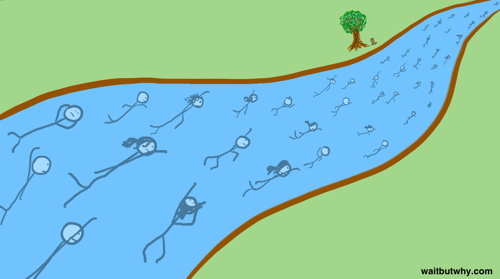](https://149909199.v2.pressablecdn.com/wp-content/uploads/2018/04/river-2.png)

We didn’t choose the river.  

我们没有选择河流。  

We just woke up out of nowhere and found ourselves on some path set for us by our parents, by society, and by circumstances.  

我们只是突然醒来，发现自己走上了一条由父母、社会和环境为我们设定的道路。  

We’re told the rules of the river and the way we should swim and what our goals should be.  

我们被告知河流的规则、游泳的方式以及我们的目标。  

Our job isn’t to think about our path—it’s to succeed on the path we’ve been placed on, based on the way success has been defined for us.  

我们的工作不是思考自己的道路，而是根据为我们定义的成功方式，在我们被安排的道路上取得成功。

For many of us—and I suspect for a large portion of Wait But Why readers—our childhood river then feeds into a pond, called college.[1](https://waitbutwhy.com/2018/04/picking-career.html#) We may have some say in which particular pond we landed in, but in the end, most college ponds aren’t really that different from one another.  

对我们中的许多人来说--我猜想对大部分《等着看为什么》的读者来说--我们的童年之河随后汇入了一个池塘，叫做大学。1 我们可能对自己落入哪个池塘有一些发言权，但归根结底，大多数大学池塘其实并没有什么不同。

[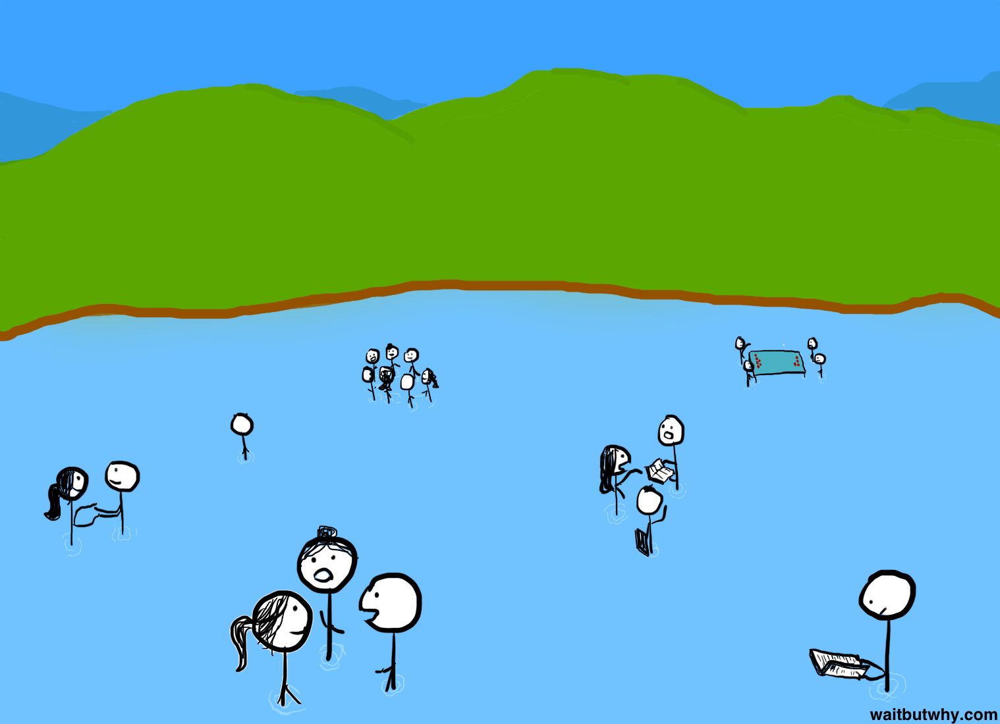](https://149909199.v2.pressablecdn.com/wp-content/uploads/2018/04/pond-1.png)

In the pond, we have a bit more breathing room and some leeway to branch out into more specific interests.  

在池塘里，我们有了更多的喘息空间，也有了更多的余地去发展更具体的兴趣。  

We start to ponder, looking out at the pond’s shores—out there where the real world starts and where we’ll be spending the rest of our lives.  

我们开始思索，望着池塘边--那里是现实世界的起点，也是我们度过余生的地方。  

This usually brings some mixed feelings.  

这通常会让人百感交集。

[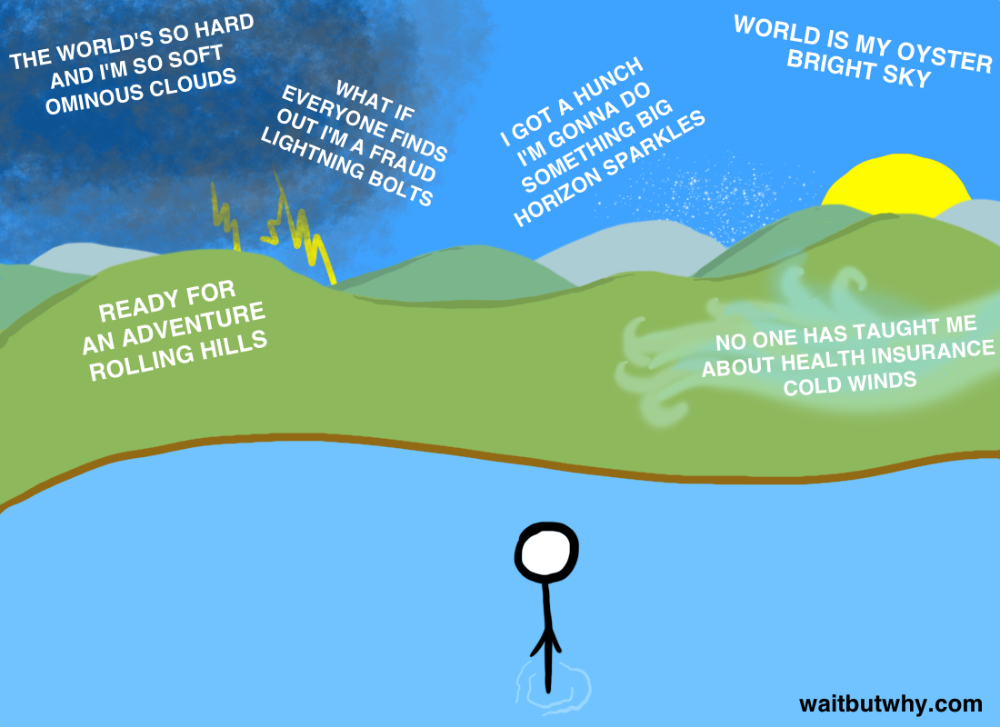](https://149909199.v2.pressablecdn.com/wp-content/uploads/2018/04/Looking-at-shore-2.png)

And then, 22 years after waking up in a rushing river, we’re kicked out of the pond and told by the world to go make something of our lives.  

然后，在汹涌的河流中醒来 22 年后，我们被踢出池塘，被世界告知要去创造我们的生活。

[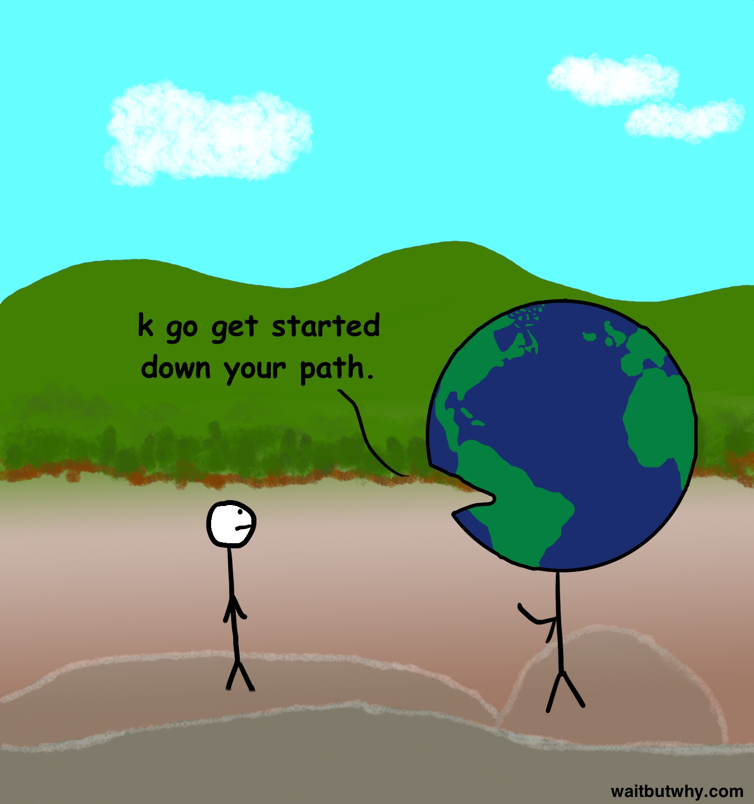](https://149909199.v2.pressablecdn.com/wp-content/uploads/2018/04/shore-1.jpg)

There are a few problems here.  

这里有几个问题。  

One is that at that moment, you’re kind of skill-less and knowledge-less and a lot of other things-less:  

一是在那一刻，你没有技能，没有知识，也没有其他很多东西：

[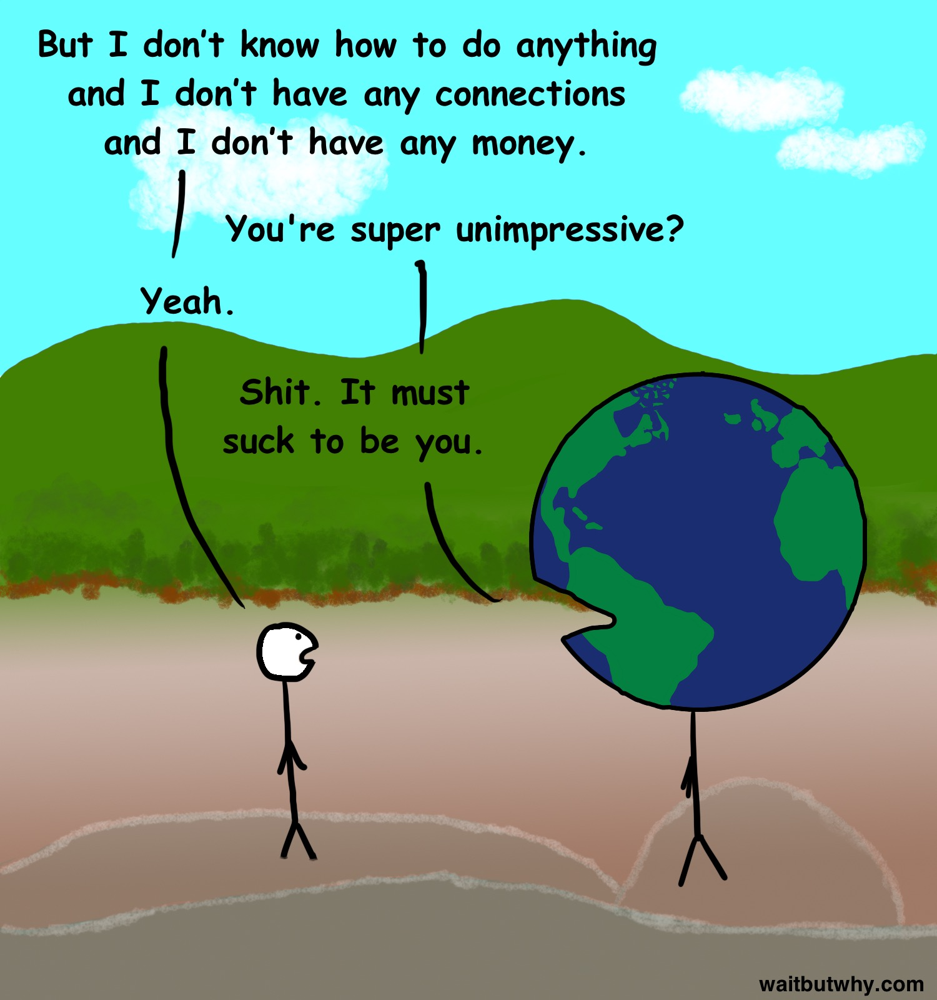](https://149909199.v2.pressablecdn.com/wp-content/uploads/2018/04/shore-2.jpg)

But before you can even address your general uselessness, there’s an even bigger issue—your pre-set path ended.  

但是，在你解决自己的普遍无用性之前，还有一个更大的问题--你的预设路径结束了。  

Kids in school are kind of like employees of a company where someone else is the CEO.  

孩子们在学校里就像是一家公司的员工，而这家公司的首席执行官是别人。  

But no one is the CEO of your life in the real world, or of your career path—except you.  

但是，在现实世界中，没有人是你生活的首席执行官，也没有人是你职业道路的首席执行官--除了你自己。  

And you’ve spent your whole life becoming a pro student, leaving you with zero experience as the CEO of anything.  

而你一辈子都在当职业学生，没有任何担任首席执行官的经验。  

Up to now, you’ve only been in charge of the micro decisions—”How do I succeed at my job as a student?”—and now you’re suddenly holding the keys to the macro cockpit as well, tasked with answering stressful macro questions like “Who am I?” and “What are the important things in life?” and “What are my options for paths and which one should I choose and how do I even make a path?” When we leave school for the last time, the macro guidance we’ve become so accustomed to is suddenly whisked away from us, leaving us standing there holding our respective dicks, with no idea how to do this.  

到目前为止，你只负责微观决策--"作为一名学生，我怎样才能在工作中取得成功？"而现在，你突然也掌握了宏观驾驶舱的钥匙，负责回答诸如 "我是谁？"、"人生中重要的事情是什么？"、"我的道路有哪些选择，我应该选择哪一条，甚至怎样才能确定一条道路？"等压力巨大的宏观问题。当我们最后一次离开学校时，我们已经习以为常的宏观指导突然从我们身边消失了，只剩下我们站在那里，握着各自的小弟弟，不知如何是好。

Then time happens. And we end up on a path. And that path becomes our life’s story.  

然后，时间发生了。我们最终走上了一条路。这条路就是我们的人生故事。

At the end of our life, when we look back at how things went, we can see our life’s path in its entirety, from an aerial view.  

在生命的最后时刻，当我们回首往事时，我们可以从空中俯瞰我们人生道路的全貌。

When scientists study people on their deathbed and how they feel about their lives, they usually find that many of them feel some serious regrets.  

科学家在研究临终者对自己一生的感受时，通常会发现很多人都会感到非常遗憾。  

I think a lot of those regrets stem from the fact that most of us aren’t really taught about path-making in our childhoods, and most of us also don’t get much better at path-making as adults, which leaves many people looking back on a life path that didn’t really make sense, given who they are and the world they lived in.  

我认为，这些遗憾很大程度上源于这样一个事实，即我们大多数人在童年时代并没有真正接受过关于如何规划人生道路的教育，而我们大多数人在成年后也并没有在规划人生道路方面取得多大进步，这让许多人在回顾人生道路时发现，根据他们的身份和所处的世界，他们的人生道路其实并不合理。

So this is a post about path-making.  

所以，这是一篇关于开辟道路的文章。  

Let’s take a 30-minute pre-deathbed pause to look down at the path we’re on, and ahead at where that path seems to be going, and make sure it makes sense.  

让我们在临终前暂停 30 分钟，低头看看我们正在走的路，再向前看看这条路似乎要去哪里，确保它是有意义的。

**The Cook and the Chef—Revisited  

重温《厨师与大厨**

In the past, [I’ve written about](https://waitbutwhy.com/2015/11/the-cook-and-the-chef-musks-secret-sauce.html) the critical distinction between “reasoning from first principles” and “reasoning by analogy”—or what I called being a “chef” vs.  

在过去的文章中，我曾写到过 "从第一原理推理 "和 "类比推理 "之间的重要区别--也就是我所说的 "厨师 "与 "厨师 "之间的区别。  

being a “cook.” Since writing the post, I notice this distinction everywhere, and I’ve thought about it roughly 2 million times in my own life.  

做一名 "厨师"。自从写了这篇文章后，我发现这种区别随处可见，在我自己的生活中，我大概想了 200 万次。

The idea is that reasoning from first principles is reasoning like a scientist.  

意思是说，从第一性原理进行推理就是像科学家那样推理。  

You take core facts and observations and use them to puzzle together a conclusion, kind of like a chef playing around with raw ingredients to try to make them into something good.  

你要利用核心事实和观察结果来拼凑出一个结论，这有点像厨师摆弄原材料，试图把它们做成美味佳肴。  

By doing this puzzling, a chef eventually writes a new recipe.  

通过这样的困惑，厨师最终写出了新的食谱。  

The other kind of reasoning—reasoning by analogy—happens when you look at the way things are already done and you essentially copy it, with maybe a little personal tweak here and there—kind of like a cook following an already written recipe.  

另一种推理--类比推理--是指当你看到别人已经做得很好时，你基本上会照搬过来，也许在这里或那里做一点个人的调整--就像一个厨师按照已经写好的食谱做菜一样。

A pure verbatim recipe-copying cook and a pure independently inventive chef are the two extreme ends of what is, of course, a spectrum.  

一个纯粹照搬食谱的厨师和一个纯粹独立创新的厨师当然是一个光谱的两个极端。  

But for any particular part of your life that involves reasoning and decision making, wherever you happen to be on the spectrum, your reasoning process can usually be boiled down to fundamentally chef-like or fundamentally cook-like.  

但是，对于你生活中涉及推理和决策的任何特定部分，无论你碰巧处于哪个阶段，你的推理过程通常都可以归结为 "基本像厨师 "或 "基本像厨师"。  

Creating vs. copying. Originality vs. conformity.  

创造与复制。原创与守旧。

Being a chef takes a tremendous amount of time and energy—which makes sense, because you’re not trying to reinvent the wheel, you’re trying to invent it for the first time.  

成为一名厨师需要花费大量的时间和精力--这也是有道理的，因为你不是要重新发明轮子，而是要第一次发明轮子。  

Puzzling your way to a conclusion feels like navigating a mysterious forest while blindfolded and always involves a whole lot of failure, in the form of trial and error.  

要想解开谜题，感觉就像蒙着眼睛在神秘的森林中穿梭，总是要经历大量的失败，包括尝试和错误。  

Being a cook is far easier and more straightforward and less icky.  

做厨师要简单、直接得多，也没那么恶心。  

In most situations, being a chef is a terrible waste of time, and comes with a high opportunity cost, since time on Earth is immensely scarce.  

在大多数情况下，当厨师是对时间的严重浪费，而且机会成本很高，因为地球上的时间是非常稀缺的。  

Right now, I’m wearing J.  

现在，我穿着 J.  

Crew jeans and a plain t-shirt and a hoodie and Allbirds shoes, because I’m trying to conform.  

Crew 牛仔裤、普通 T 恤、连帽衫和 Allbirds 鞋，因为我想顺应潮流。  

Throughout my life, I’ve looked around at people who seem kind of like me and I’ve bought a bunch of clothes that look like what they wear.  

在我的一生中，我看着周围那些看起来和我有点像的人，然后买了一堆和他们穿的一样的衣服。  

And this makes sense—because clothes aren’t important to me, and they’re not how I choose to express my individuality.  

这是有道理的--因为衣服对我来说并不重要，也不是我表达个性的方式。  

So in my case, fashion is a perfect part of life to use a reasoning shortcut and be a cook.[2](https://waitbutwhy.com/2018/04/picking-career.html#)  

因此，就我而言，时尚是生活的一个完美部分，可以利用推理的捷径，成为一名厨师2。

But then there are those parts of life that are really really deeply important—like where you choose to live, or the kinds of friends you choose to make, or whether you want to get married and to whom, or whether you want to have kids and how you want to raise them, or how you set your lifestyle priorities.  

但是，生活中也有一些非常非常重要的部分，比如你选择在哪里生活，或者你选择结交什么样的朋友，或者你是否想结婚以及和谁结婚，或者你是否想要孩子以及如何抚养他们，或者你如何确定生活方式的优先顺序。

Career-path-carving is definitely one of those really really deeply important things.  

刻画职业道路绝对是非常非常重要的事情之一。  

Let’s spell out the obvious reasons why:  

让我们来阐述一下显而易见的原因：

**Time.** For most of us, a career (including ancillary career time, like time spent commuting and thinking about your work) will eat up somewhere between 50,000 and 150,000 hours.  

时间。对我们大多数人来说，职业生涯（包括职业生涯的辅助时间，如通勤时间和思考工作的时间）将耗费 5 万至 15 万小时。  

At the moment, a long human life runs at about 750,000 hours.  

目前，人类的长寿时间约为 75 万小时。  

When you subtract childhood (~175,000 hours) and the portion of your adult life you’ll spend sleeping, eating, exercising, and otherwise taking care of the human pet you live in, along with errands and general life upkeep (~325,000 hours), you’re left with 250,000 “meaningful adult hours.”[3](https://waitbutwhy.com/2018/04/picking-career.html#) So a typical career will take up somewhere between 20% and 60% of your meaningful adult time—not something to be a cook about.  

如果减去童年（约 17.5 万小时）和成年生活中睡觉、吃饭、锻炼和照顾宠物的时间，再加上跑腿和一般生活维护（约 32.5 万小时），就剩下 25 万 "有意义的成年时间 "3 。

[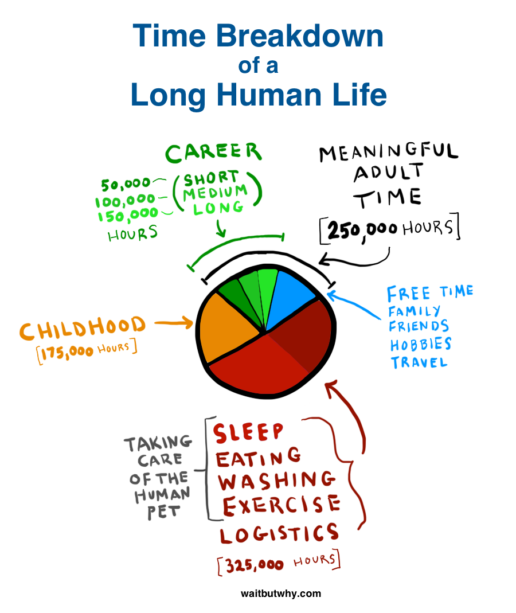](https://149909199.v2.pressablecdn.com/wp-content/uploads/2018/04/Pie-Chart.png)

**Quality of Life.** Your career has a major effect on all the non-career hours as well.  

生活质量。你的职业生涯对所有非职业时间也有重大影响。  

For those of us not already wealthy through past earnings, marriage, or inheritance, a career doubles as our means of support.  

对于那些尚未通过过去的收入、婚姻或继承而致富的人来说，职业生涯是我们的双重支撑。  

The particulars of your career also often play a big role in determining where you live, how flexible your life is, the kinds of things you’re able to do in your free time, and sometimes even in who you end up marrying.  

职业的特殊性往往对你的居住地、生活的灵活性、空闲时间能做的事情，有时甚至对你最终与谁结婚都有很大的影响。

**Impact.** On top of your career being the way you spend much of your time and the means of support for the rest of your time, your career triples as your primary mode of impact-making.  

影响力。你的职业生涯是你度过大部分时间的方式，也是支持你度过其余时间的手段，除此之外，你的职业生涯还是你产生影响的主要方式。  

Every human life touches thousands of other lives in thousands of different ways, and all of those lives you alter then go on to touch thousands of lives of their own.  

每个人的生命都会以成千上万种不同的方式影响其他成千上万人的生命，而你所改变的这些生命又会继续影响成千上万人的生命。  

We can’t test this, but I’m pretty sure that you can select any 80-year-old alive today, go back in time 80 years, find them as an infant, throw the infant in the trash, and then come back to the present day and find a countless number of things changed.  

我们无法验证这一点，但我非常肯定，你可以选择任何一个今天还活着的 80 岁老人，回到 80 年前，找到他们还是婴儿的时候，把婴儿扔进垃圾桶，然后回到今天，发现无数的事情都发生了变化。  

All lives make a large impact on the world and on the future—but the _kind_ of impact you end up making is largely within your control, depending on the values you live by and the places you direct your energy.  

每个人的一生都会对世界和未来产生巨大的影响，但你最终会产生什么样的影响，很大程度上取决于你的价值观和你的精力所向。  

Whatever shape your career path ends up taking, the world will be altered by it.  

无论你的职业道路最终走向何方，世界都将因此而改变。

**Identity.** In our childhoods, people ask us about our career plans by asking us what we want to _be_ when we grow up. When we grow up, we tell people about our careers by telling them what we _are._ We don’t say, “I practice law”—we say, “I am a lawyer.” This is probably an unhealthy way to think about careers, but the way many societies are right now, a person’s career quadruples as the person’s primary identity.  

身份。童年时，人们会问我们长大后想做什么，从而了解我们的职业规划。长大后，我们会告诉别人我们的职业，告诉他们我们是什么。我们不会说 "我从事法律工作"--我们会说 "我是一名律师"。这可能是一种不健康的职业思维方式，但在当下的许多社会中，一个人的职业是其主要身份的四倍。  

Which is kind of a big thing.  

这是一件大事。

So yeah—your career path isn’t like my shitty sweatshirt.  

所以是的，你的职业道路不像我那件破运动衫。  

It’s really really deeply important, putting it squarely in “Definitely absolutely make sure to be a chef about it” territory.  

这真的非常非常重要，完全属于 "绝对绝对一定要成为厨师 "的范畴。

**Your Career Map  

您的职业地图**

Which brings us to you. I don’t know exactly what your deal is.  

这就说到你了我不知道你到底是干什么的  

But there’s a good chance you’re somewhere in one of the blue regions—  

但你很有可能就在其中一个蓝色区域的某个地方。

[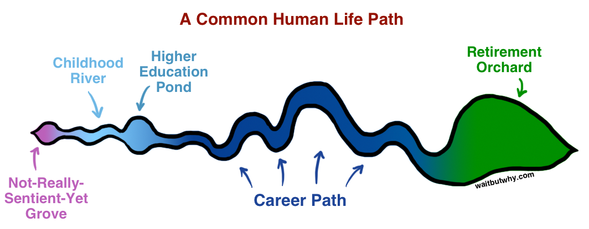](https://149909199.v2.pressablecdn.com/wp-content/uploads/2018/04/Life-path.png)

—which means your career path is a work in progress.[4](https://waitbutwhy.com/2018/04/picking-career.html#)  

\-这意味着你的职业道路还在继续。

Whether you’re yet to start your career or well into it, somewhere in the back of your mind (or maybe in the very front of it) is a “Career Plans” map.  

无论你的职业生涯是刚刚开始还是已经开始，在你脑海中的某个角落（或许是最前端）都有一张 "职业规划 "图。

We can group map holders into three broad categories—each of which is well-represented in the river, in the pond, standing on the shore, and at every stage of adult life.  

我们可以将地图持有者分为三大类--每一类都在河流中、池塘里、站在岸边以及成人生活的每个阶段都有充分的体现。

One group of people will look at the map and see a big, stressful question mark.  

一部分人看地图时会看到一个大大的、压力很大的问号。

[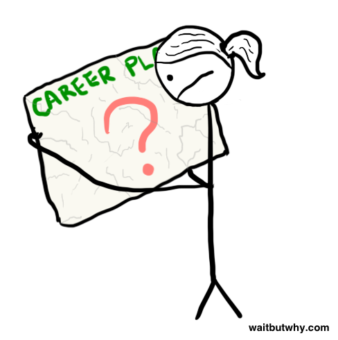](https://149909199.v2.pressablecdn.com/wp-content/uploads/2018/04/map1.png)

These are people who feel indecisive about their career path.  

这些人对自己的职业道路举棋不定。  

They’ve been told to follow their passion, but they don’t feel especially passionate about anything.  

他们被告知要追随自己的激情，但他们对任何事情都没有特别的激情。  

They’ve been told to let their strengths guide them, but they’re not sure what they’re best at.  

他们被告知要让自己的长处引导自己，但他们不确定自己最擅长什么。  

They may have felt they had answers in the past, but they’ve changed and they’re no longer sure who they are or where they’re going.  

过去，他们可能觉得自己已经有了答案，但现在他们变了，他们不再确定自己是谁，也不知道自己要去哪里。

Other people will see a nice clear arrow representing a direction they feel confident is right—but find their legs walking in a different direction.  

其他人会看到一个清晰的箭头，代表一个他们认为正确的方向，但却发现自己的双腿走在不同的方向上。  

They’re living with one of the most common sources of human misery, a career path they know in their heart is wrong.  

他们生活在人类最常见的痛苦之中，他们心里知道自己的职业道路是错误的。

[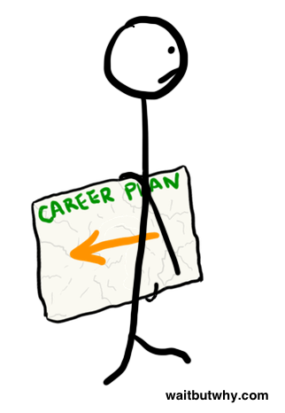](https://149909199.v2.pressablecdn.com/wp-content/uploads/2018/04/map2.png)

The lucky ones feel they know where they want to go and believe they’re marching in that direction.  

幸运的人觉得他们知道自己想去哪里，并相信自己正朝着那个方向前进。

[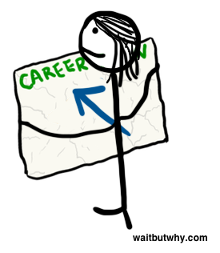](https://149909199.v2.pressablecdn.com/wp-content/uploads/2018/04/map3.png)

But even these people should pause and ask themselves, “Who actually drew this arrow?  

但是，即使是这些人也应该扪心自问："这支箭究竟是谁画的？  

Was it really me?” The answer can get confusing.  

真的是我吗？答案可能会令人困惑。

I’m pretty sure all of these people would benefit from a moment of career path reflection.  

我敢肯定，所有这些人都会从职业道路的反思中受益匪浅。

**The Okay But Why Do You Think You Can Help Me With My Career Reflection You Draw Stick Figures for a Living Blue Box  

好吧，但你为什么认为你能帮我解决职业问题？**

Extremely fair question.  

这个问题非常公平。  

One thing I always ask myself as I pick topics to write about is, “Am I qualified to write about this?” Here are the reasons I decided to take on this topic:  

在选择写作主题时，我总是问自己："我有资格写这个话题吗？以下是我决定写这个话题的原因：

1) I have spent most of the last 20 years in a perpetual state of analyzing my own career path.  

1) 在过去 20 年的大部分时间里，我一直在分析自己的职业道路。

2) My path has taken a lot of turns—from wanting to be a movie star when I was 7 to wanting to be the president when I was 17 to wanting to write film scores when I was 22 to wanting to be an entrepreneur when I was 24 to wanting to write musicals when I was 29 to most recently wanting to be a writer-ish guy.  

2) 我的人生道路经历了很多转折--从 7 岁时想当电影明星，到 17 岁时想当总统，再到 22 岁时想写电影配乐，24 岁时想当企业家，29 岁时想写音乐剧，最近又想当个作家。

3) After being pretty all over the place about my career path for most of my life, I actually love my job now.  

3) 在我大半辈子的职业生涯中，我对自己的职业道路一直很迷茫，但现在我真的爱上了我的工作。  

That’s always subject to change, but being able to look at the decision-making processes that led me to confusing or frustrating places, side by side with the decisions that led me to a more fulfilling place, has offered me some wisdom on where people tend to go wrong.  

这种情况总是会发生变化的，但是，如果能够把导致我陷入困境或令人沮丧的决策过程，与导致我获得更多满足的决策过程并列起来，就能为我提供一些智慧，让我知道人们往往会在哪些方面出错。

4) On top of having my own story to look at, I’ve had a front-row seat for the stories of my dozen or so closest friends.  

4) 除了我自己的故事，我还能看到我十几个最亲密朋友的故事。  

My friends seem to share my career path obsessiveness, so between observing their paths and talking with them about those paths again and again along the way, I’ve broadened my views on the topic, which helps me to distinguish between the lessons that are my-life specific and those that are more universal.  

我的朋友们似乎也和我一样对职业道路痴迷，因此，在观察他们的职业道路并与他们反复讨论这些道路的过程中，我拓宽了对这个话题的看法，这有助于我区分哪些是我生活中特有的经验，哪些是更普遍的经验。

5) Finally, this isn’t a post about which careers are better or worse than others or which career values are more or less meaningful—there are lots of social scientists and self-help authors out there with good data on that, and I’m not one of them.  

5) 最后，这不是一篇关于哪种职业比其他职业更好或更差，或者哪种职业价值更有意义或更无意义的文章--有很多社会科学家和自助作家在这方面有很好的数据，而我不是其中之一。  

It’s instead a framework that I think can help a career-path reflector better see their own situation, and what really matters to them, clearly and honestly.  

相反，我认为这是一个框架，可以帮助职业道路反思者更好地看清自己的处境，以及什么对他们来说才是真正重要的。  

This framework has worked really well for me, so I think it can probably be helpful for other people too.  

这个框架对我来说非常有效，所以我认为它也可能对其他人有帮助。

Now that you’ve taken a fresh look at your Career Plans map, along with whatever arrow may or may not be on it, put it down and out of sight.  

现在，你已经重新审视了你的职业规划图，以及上面可能有或可能没有的箭头，把它放下，不要让人看到。  

We’ll come back to it at the end of the post.  

我们将在文章最后再谈这个问题。  

It’s time now for a deep dive—let’s think about this from scratch. From first principles.  

现在是深入研究的时候了--让我们从头开始思考这个问题。从第一原则出发。

\_\_\_\_\_\_\_\_\_\_\_

In the [cook-chef post](https://waitbutwhy.com/2015/11/the-cook-and-the-chef-musks-secret-sauce.html), I designed a simple framework for how a chef makes major career choices.  

在《厨师-厨师》一文中，我为厨师如何做出重大职业选择设计了一个简单的框架。  

At its core is a simple Venn diagram.  

其核心是一个简单的维恩图。

The first part of the diagram is the Want Box, which contains all the careers you find desirable.  

图表的第一部分是 "需求箱"，它包含了所有你认为理想的职业。

[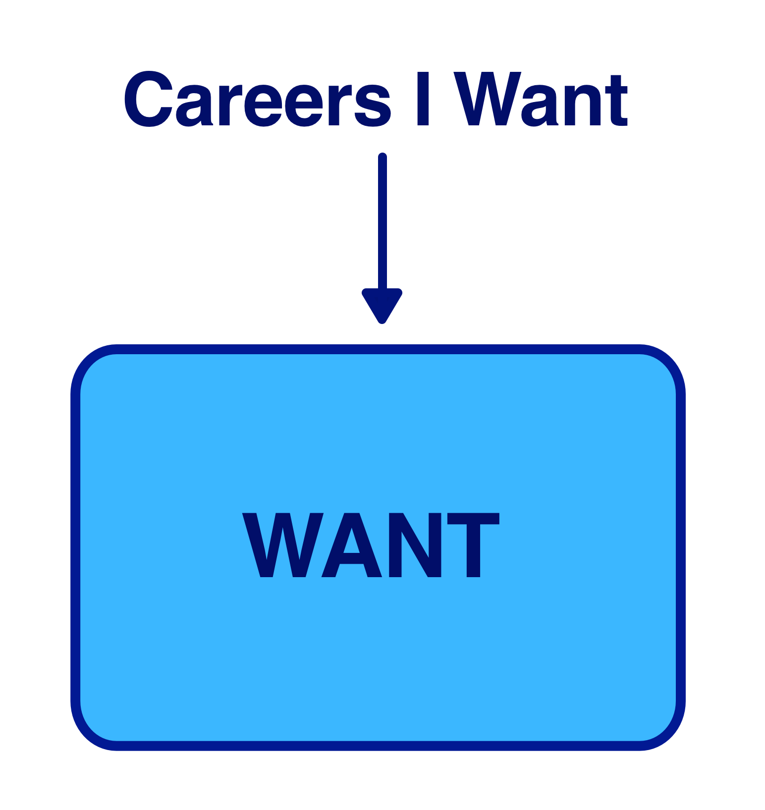](https://149909199.v2.pressablecdn.com/wp-content/uploads/2018/04/Want-Box.png)

The second part of the diagram is the Reality Box.  

图表的第二部分是 "现实盒子"。  

The Reality Box is for the set of all careers that are realistic to potentially achieve—based on a comparison, in each case, between your level of potential in an area and the general difficulty of achieving success in that area.  

现实框 "是根据你在某一领域的潜能水平与在该领域取得成功的一般难度之间的比较，为你设定的一套现实可行的职业生涯。

[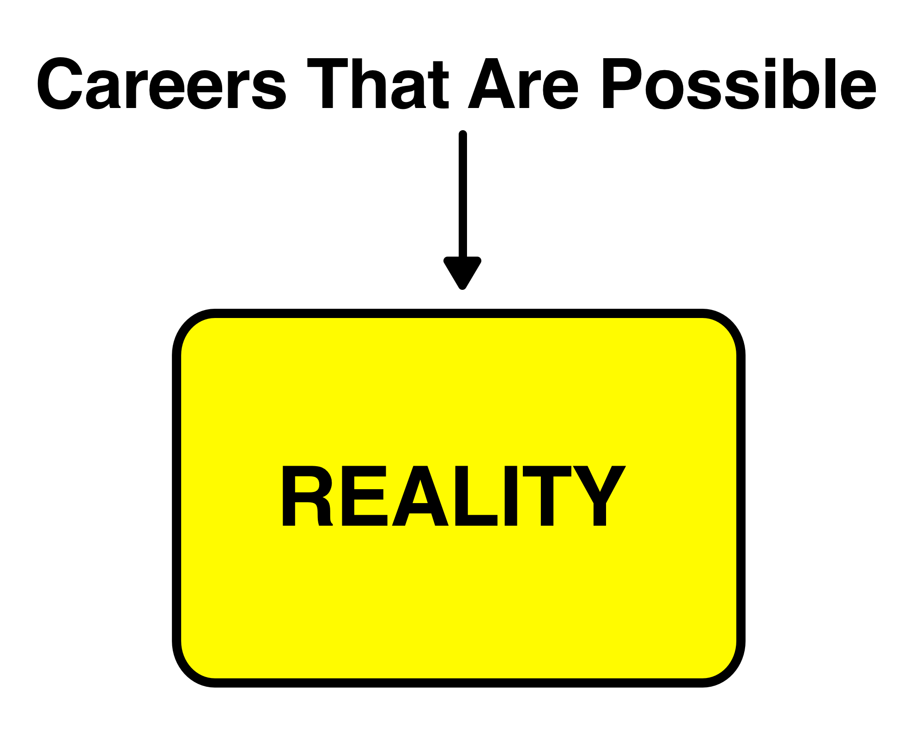](https://149909199.v2.pressablecdn.com/wp-content/uploads/2018/04/Reality-Box.png)

The overlapping area contains your optimal career path choices—the set of arrows you should consider drawing on your Career Map.  

重叠区域包含你的最佳职业道路选择--你应该考虑在你的职业地图上画一组箭头。  

We can call it the Option Pool.  

我们可以称之为 "期权池"。

[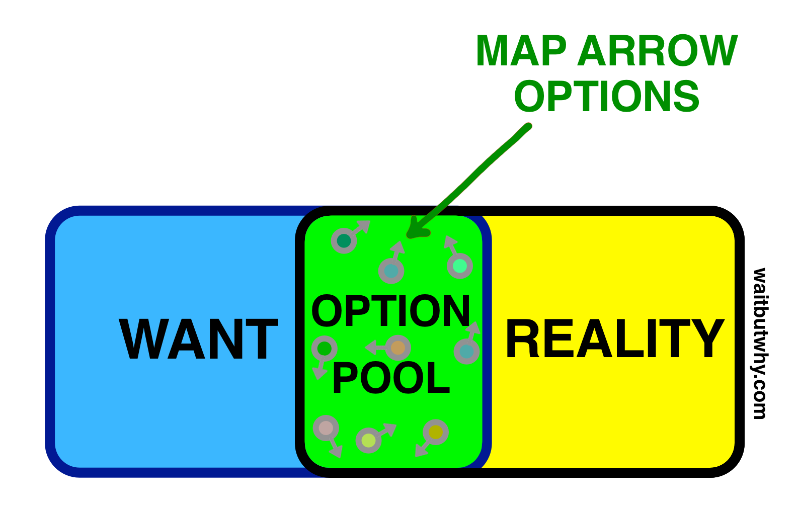](https://149909199.v2.pressablecdn.com/wp-content/uploads/2018/04/venn.png)

This is straightforward enough.  

这很简单明了。  

But actually filling in these boxes accurately is way harder than it looks.  

但要准确填写这些方框，比想象中要难得多。  

For the diagram to work, it has to be as close to the truth as possible, and to get there, we have to lift up the hood of our subconscious and head down.  

为了让图表发挥作用，它必须尽可能地接近真相，而为了达到这一目的，我们必须掀开潜意识的盖子，低下头来。  

Let’s start with the Want Box.  

让我们从 "旺旺盒子 "开始。

**Deep Analysis, Part 1: Your Want Box  

深度分析，第 1 部分：您的旺旺盒子**

The hard thing about the Want Box is that you want a bunch of different things—or, rather, there are a bunch of different sides of you, and each of them wants—and fears—its own stuff.  

关于 "想要盒子 "的困难之处在于，你想要很多不同的东西--或者说，你有很多不同的一面，每一面都想要--也害怕--自己的东西。  

And since some motivations have conflicting interests with others, you cannot, by definition, have everything you want.  

由于某些动机与其他动机之间存在利益冲突，因此顾名思义，你不可能拥有你想要的一切。  

Going for one thing you want means, by definition, not going for others, and sometimes, it’ll specifically mean going directly _against_ others. The Want Box is a game of compromise.  

想要一件东西，顾名思义，就意味着不想要其他东西，有时，还特别意味着直接与其他东西作对。旺旺盒子》是一个妥协的游戏。

**The Yearning Octopus  

渴望的章鱼**

To do a proper Want Box audit, you need to think about what you yearn for in a career and then unpack the shit out of it.  

要做好 "旺旺盒子 "审计，你需要思考自己渴望的职业是什么，然后把它拆解开来。  

Luckily, we have someone here who can help us. The Yearning Octopus.  

幸运的是，这里有人可以帮助我们。渴望的章鱼

[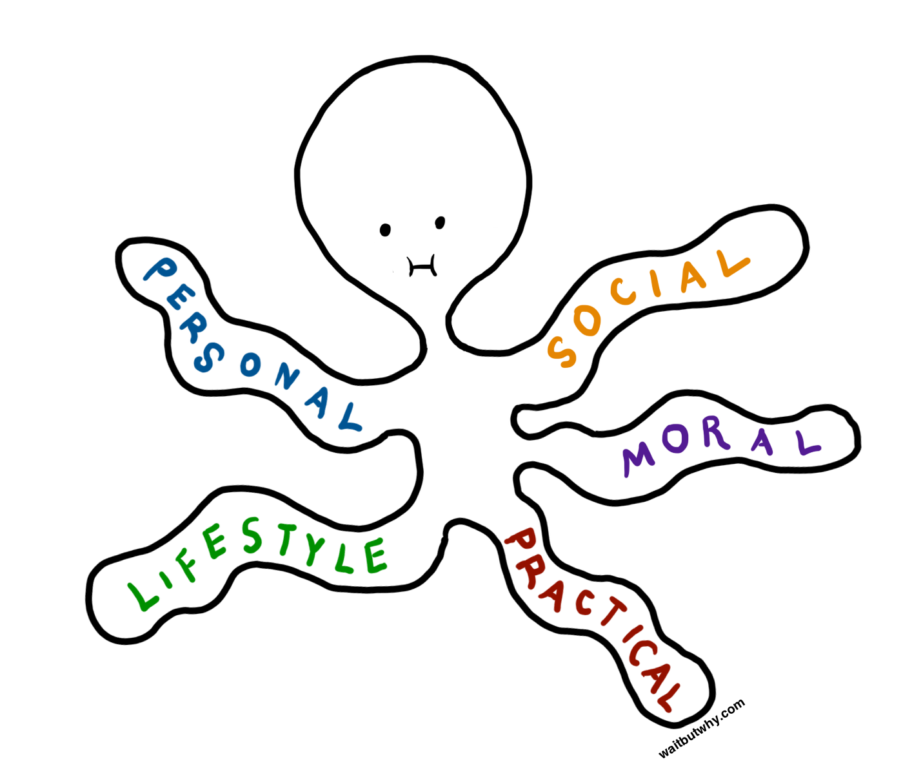](https://149909199.v2.pressablecdn.com/wp-content/uploads/2018/04/Octopus-1.png)

We each have our own personal Yearning Octopus[5](https://waitbutwhy.com/2018/04/picking-career.html#) in our heads.  

我们每个人的脑海中都有自己的个人 Yearning Octopus5。  

The particulars of each person’s Yearning Octopus will vary, but people also aren’t all that different from each other, and I bet many of us feel very similar yearnings and fears (especially given that I find that Wait But Why readers tend to have a lot in common).  

每个人的 "渴望章鱼 "的具体情况会有所不同，但人与人之间的差别也不大，我敢打赌，我们中的很多人都会有非常相似的渴望和恐惧（尤其是我发现《等着看好戏》的读者往往有很多共同点）。

The first thing to think about is that there are totally distinct yearning _worlds_—each living on one tentacle. These tentacles often do not get along with each other.  

首先要考虑的是，存在着完全不同的渴望世界--每个世界都生活在一根触角上。这些触手之间往往互不相容。

[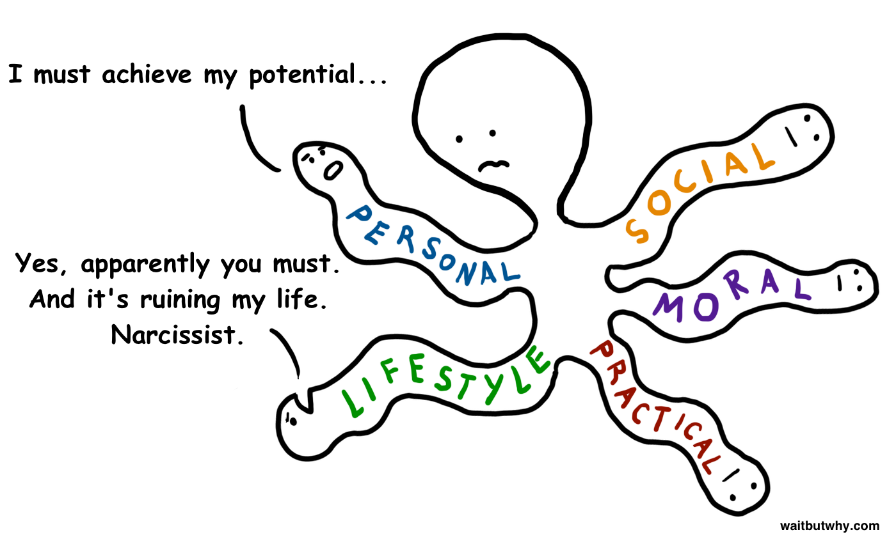](https://149909199.v2.pressablecdn.com/wp-content/uploads/2018/04/Octopus-2a.png)

[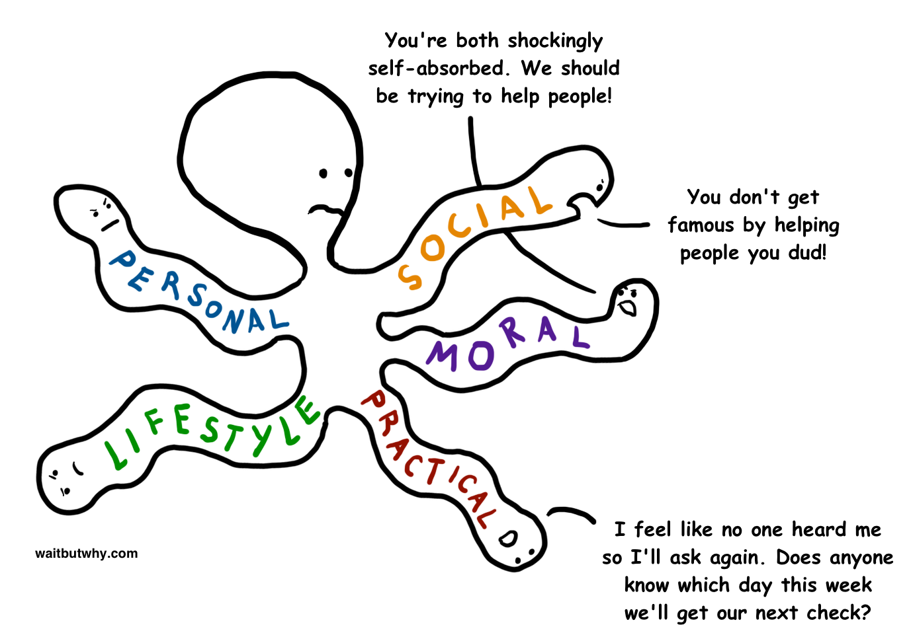](https://149909199.v2.pressablecdn.com/wp-content/uploads/2018/04/Octopus-2B.png)

It gets worse.  

情况更糟。  

Each tentacle is made up of a bunch of different individual yearnings and their accompanying fears—and _these_ often massively conflict with each other too.  

每个触角都是由各种不同的渴望和随之而来的恐惧组成的，而这些渴望和恐惧之间往往也存在着巨大的冲突。

[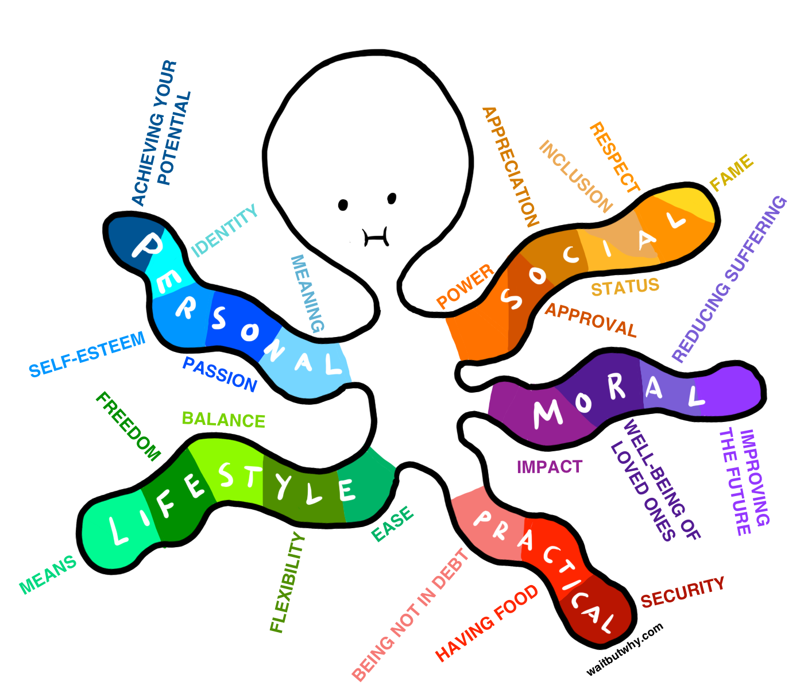](https://149909199.v2.pressablecdn.com/wp-content/uploads/2018/04/Octopus-3-segmented-1.png)

Let’s take a closer look at each tentacle to see what’s going on.  

让我们仔细观察每根触角，看看到底发生了什么。

[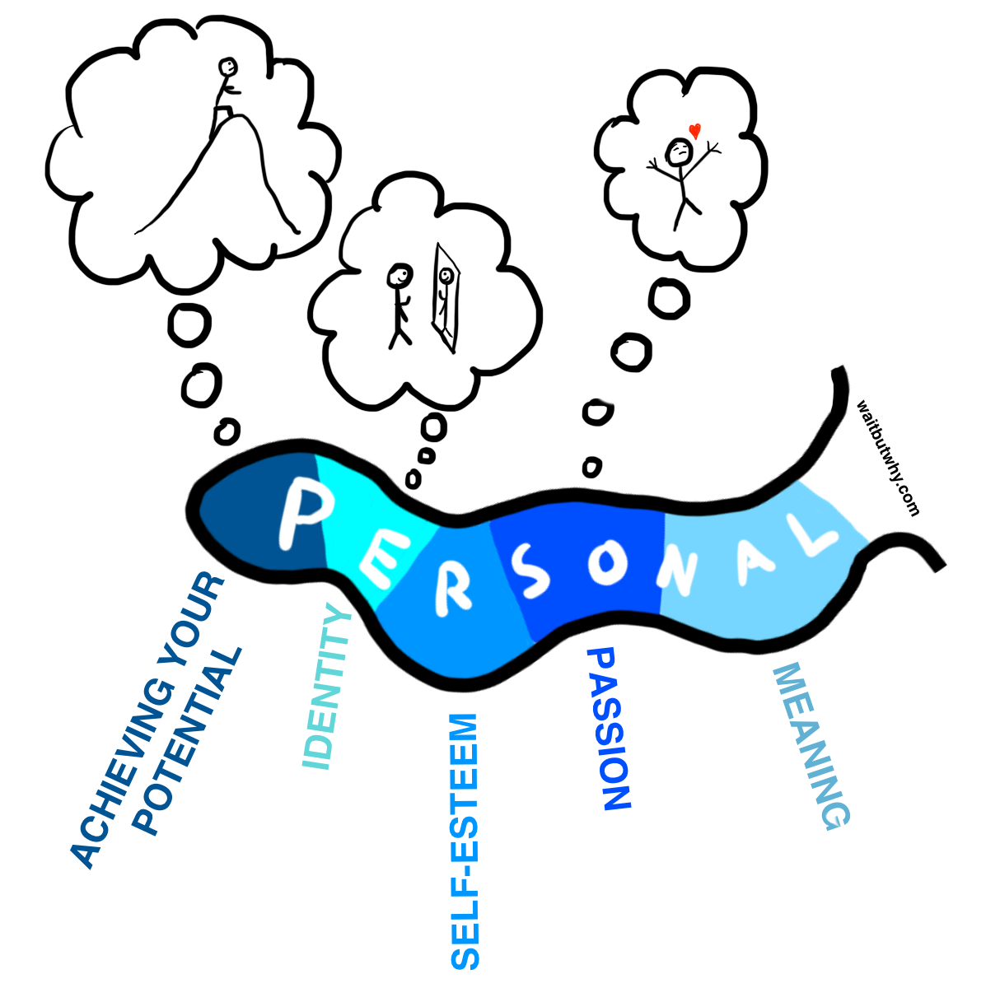](https://149909199.v2.pressablecdn.com/wp-content/uploads/2018/04/personal-tentacle.png)

The Personal Yearnings tentacle is probably the hardest one to generalize here—it’s pretty particular to each of us.  

在这里，"个人渴望 "可能是最难概括的--它对我们每个人来说都很特别。  

It’s a reflection of our specific personality and our values, and it bears the burden of probably the most complex and challenging human need: fulfillment.  

它反映了我们特定的个性和价值观，并承担着可能是最复杂、最具挑战性的人类需求：实现。  

It’s also in the shit dealing with not only our current selves, but a bunch of our past selves too.  

我们不仅要面对现在的自己，还要面对过去的自己。  

The dreams of 7-year-old you and the idealized identity of 12-year-old you and the secret hopes of 17-year-old you and the evolving passions of your current self are all somewhere on the personal tentacle, each throwing their own little fit about getting what they want, and each fully ready to make you feel horrible about yourself with their disappointment and disgust if you fail them.  

7 岁的你的梦想、12 岁的你的理想化身份、17 岁的你的秘密希望以及现在的你不断发展的激情都在个人触角的某个地方，每个人都在为得到自己想要的东西而大发脾气，每个人都做好了充分准备，如果你辜负了他们，他们的失望和厌恶会让你对自己感到可怕。  

On top of that, your fear of death sometimes emerges on the personal tentacle, all needy about you leaving your mark and achieving greatness and all that.  

除此之外，你对死亡的恐惧有时会出现在个人的触角上，对你留下印记、成就伟业之类的事情充满了需求。  

The personal tentacle is why you don’t find very many billionaires content to spend the rest of their life sipping cocktails on the beach—it’s a highly needy tentacle.  

这就是为什么没有多少亿万富翁愿意在沙滩上喝着鸡尾酒度过余生的原因--这是一种非常需要帮助的触角。

And yet, the personal tentacle is also one that often ends up somewhat neglected.  

然而，个人腾博会诚信为本也常常被忽视。  

Because in many cases, it’s the ickiest set of yearnings to really _go_ for; because the fears of this tentacle aren’t scary in an immediate way—they creep in out of the background over time; and because the personal tentacle is always at risk of getting bowled over early in your career by the powerful animal emotions of the other tentacles.  

因为在很多情况下，这是最难以实现的渴望；因为这个触角的恐惧并不可怕--它们会随着时间的推移从背景中悄然出现；还因为个人触角总是有可能在职业生涯的早期就被其他触角强大的动物情感所击倒。  

This neglect can leave a person with major regrets later on once the dust settles.  

一旦尘埃落定，这种忽视会给人留下重大遗憾。  

An unfulfilled Personal Yearnings tentacle is often the explanation, for example, behind a very successful, very unhappy person—who may believe they got successful in the wrong field.  

例如，一个非常成功却又非常不快乐的人--他可能认为自己在错误的领域获得了成功--背后的原因往往是 "个人渴望 "没有得到满足。

[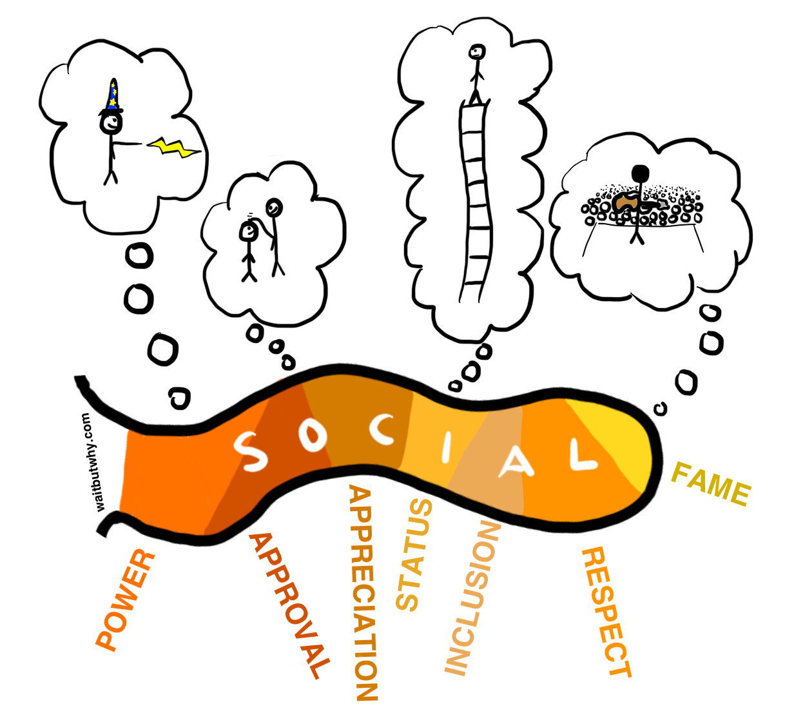](https://149909199.v2.pressablecdn.com/wp-content/uploads/2018/04/social-tentacle.png)

The Social Yearnings tentacle is probably our most primitive, animal side, with its core drive stemming back to our tribal evolutionary past.  

社会渴望触角可能是我们最原始、最动物性的一面，其核心驱动力可以追溯到我们部落进化的过去。  

On the tentacle are a number of odd creatures.  

触手上有许多奇怪的生物。

As we’ve discussed [before](https://waitbutwhy.com/2014/06/taming-mammoth-let-peoples-opinions-run-life.html) on this blog, we all have a Social Survival Mammoth living in our heads who’s earth-shatteringly obsessed with what other people think of us.  

正如我们以前在博客上讨论过的那样，我们的头脑中都住着一头 "社会生存猛犸象"，它对别人对我们的看法有着惊天动地的执着。  

This means he craves acceptance and inclusion and being well-liked, while likewise being petrified of embarrassment, negative judgment, and disapproval.  

这意味着他渴望被接纳、包容和喜欢，同时也害怕尴尬、负面评价和不认可。  

He really really really wants to be in the in-group and he really really really doesn’t want to be in the outgroup. He’s [quite cute](https://28oa9i1t08037ue3m1l0i861-wpengine.netdna-ssl.com/wp-content/uploads/2014/06/Mammoth1.png) though.  

他真的真的真的很想和同类在一起，他真的真的真的不想和异类在一起。不过他还是挺可爱的。

Then there’s your ego, who’s a similar character but even more needy.  

然后是你的自我，他也是类似的角色，但更加需要帮助。  

Your ego doesn’t just want to be accepted; it wants to be admired, desired, and fawned upon—ideally, on a mass scale.  

你的自我不仅希望被接受，还希望被崇拜、被渴望、被奉承，最好是大规模的崇拜。  

More upsetting to it than being disliked is being ignored.  

对它来说，比不喜欢它更让人难过的是被忽视。  

It wants to be relevant and important and widely known.  

它希望自己是相关的、重要的和广为人知的。

There are other characters milling about as well.  

还有其他一些人物也在四处游荡。  

Somewhere else on the social tentacle is a little judge with a little gavel who gets very butthurt if it thinks people aren’t judging you fairly—if you’re not appropriately appreciated.  

在社会触角的其他地方，有一个拿着小木槌的小法官，如果它认为人们对你的评价不公平--如果你没有得到适当的赞赏，它就会非常生气。  

It’s very important to the judge that people are aware of exactly how smart and talented you think you are.  

对法官来说，让人们了解你认为自己有多聪明、多有才华是非常重要的。  

The judge is also big on holding grudges—which is the reason a lot of people are driven more than anything by a desire to _show_ that person or those people who never believed in them.  

法官也很记仇--这也是很多人都想让那个人或那些从未相信过自己的人看到自己的原因。

Finally, some of us may find a loving little dog on our social tentacle who wants more than anything in the world to please its owner, and who just cannot bear the thought of disappointing them.  

最后，我们中的一些人可能会在我们的社交触角上发现一只充满爱心的小狗，它比世界上任何事物都更想取悦主人，只是不忍心让主人失望。  

The one problem with this adorable creature is that its owner isn’t you.  

这个可爱的生物有一个问题，那就是它的主人不是你。  

It’s a person with so much psychological power over you that, if you’re not careful, you may dedicate your whole career to trying to please them and make them proud.  

这个人在心理上对你有很大的影响力，一不小心，你可能会把整个职业生涯都用来取悦他们，让他们感到骄傲。  

(It’s probably a parent.)  

(可能是父母）。

[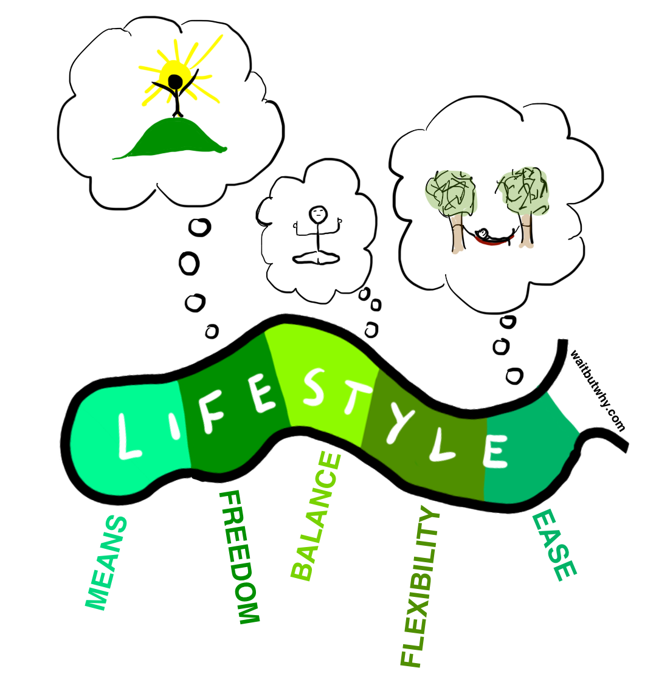](https://149909199.v2.pressablecdn.com/wp-content/uploads/2018/04/lifestyle-tentacle.png)

The Lifestyle Yearnings tentacle mostly just wants Tuesday to be a good day.  

生活方式渴望触角主要是希望周二是个好日子。  

But like, a really pleasant, enjoyable day—with plenty of free time and self-care and relaxation and luxuries.  

但是，就像真正愉快的一天--有充足的自由时间、自我保健、放松和奢侈。

It’s also concerned with your life in the big picture being as great as possible—as far as your lifestyle tentacle is concerned, you should be able to do what you want to do in life, when and how you want to do it, with the people you like most.  

它还关系到你的生活是否尽可能美好--就你的生活方式腾博会登录而言，你应该能够在生活中做你想做的事，在你想做的时候，以你想做的方式，与你最喜欢的人一起做你想做的事。  

Life should be full of fun times and rich experiences, but it should also roll by smoothly, without too much hard work and as few bumps in the road as possible.  

生活应该充满乐趣和丰富的经历，但也应该平平稳稳地走过，不需要太多的艰辛，尽可能减少道路上的坎坷。

The issue is, even if you place a high priority on your lifestyle yearnings, it’s pretty difficult to keep the whole tentacle happy at the same time.  

问题是，即使你把对生活方式的向往放在首位，也很难同时让整个触角都满意。  

The part of the tentacle that just wants to sit around and relax will hold you back from sweating to build the kind of career that offers long-term flexibility and the kind of wealth that can make life luxurious and cushy and full of toys.  

只想坐享其成的那部分触角，会让你无法挥洒汗水，去建立那种能提供长期灵活性的事业，以及那种能让生活变得奢华、舒适、充满玩具的财富。  

The part of the tentacle that only feels comfortable when the future feels predictable will reject the exact kinds of paths that may generate the long-term freedom another part of the tentacle longs for.  

只有在未来可预见的情况下，触角的一部分才会感到舒适，而这部分触角恰恰会拒绝那些可能带来长期自由的道路，而这正是触角的另一部分所渴望的。  

The side of you that wants a stress-free life doesn’t get along very well with the side of you that thirsts to be hang gliding off a cliff in Namibia like Richard Branson.  

你希望生活无压力的那一面，与渴望像理查德-布兰森一样在纳米比亚悬崖上滑翔的那一面，相处得并不融洽。

[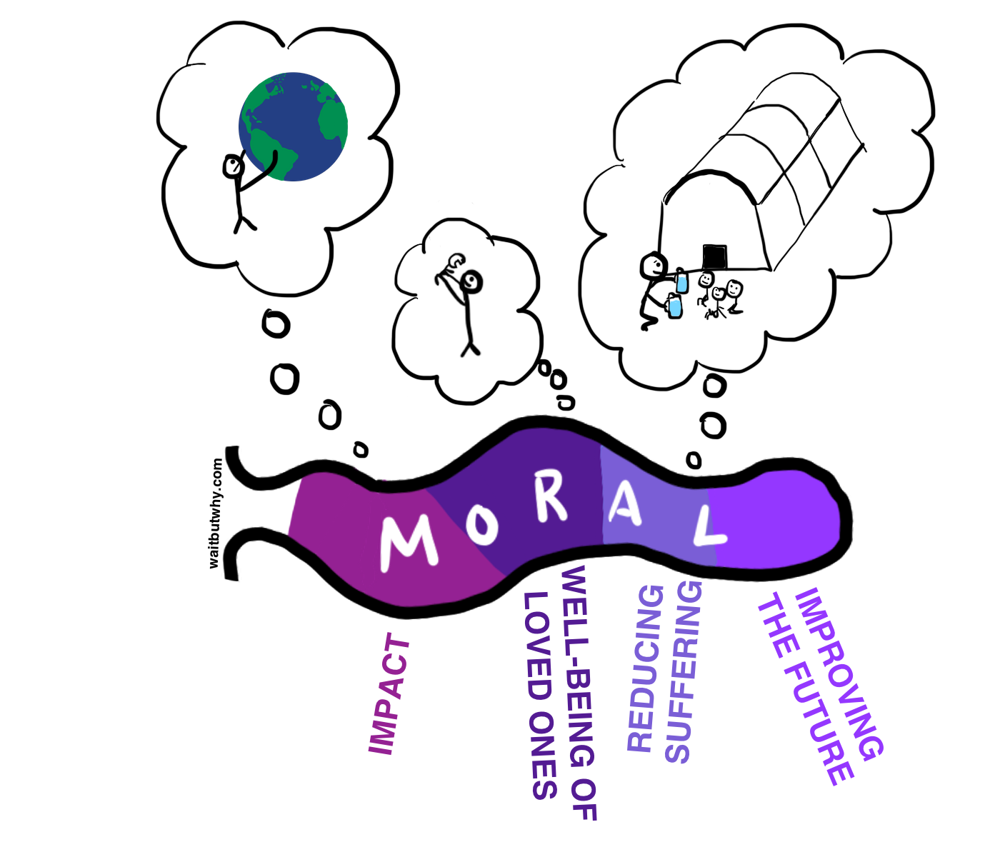](https://149909199.v2.pressablecdn.com/wp-content/uploads/2018/04/moral-tentacle-1.png)

The Moral Yearnings tentacle thinks the rest of the tentacles of your Yearning Octopus are a real pack of dicks—each one more self-involved and self-indulgent than the next.  

道德渴望触角认为你的渴望章鱼的其他触角都是一群真正的傻逼--每一根都比下一根更自我、更放纵。  

The parts of you on the moral tentacle look around and see a big world that needs so much fixing; they see billions of people no less worthy than you of a good life who just happened to be born into inferior circumstances; they see an uncertain future ahead that hangs in the balance between utopia and dystopia for life on Earth—a future we can actually push in the right direction if we could only get our other tentacles out of our way.  

你们的道德触角环顾四周，看到的是一个亟待修补的大千世界；看到的是数十亿并不比你们更不配过上美好生活的人们，他们只是碰巧生在了劣等的环境中；看到的是一个不确定的未来，地球上的生命在乌托邦和乌托邦之间徘徊。  

While the other tentacles fantasize about what you would do with your life if you had a billion dollars in the bank, the moral tentacle fantasizes about the kind of impact you could make if you had a billion dollars to _deploy_.  

当其他触角幻想着如果你有十亿美元存入银行，你会如何度过一生时，道德触角则幻想着如果你有十亿美元可供调配，你能产生什么样的影响。

Needless to say, the other tentacles of your Yearning Octopus find the moral tentacle to be insufferable.  

不用说，你的 "渴望章鱼 "的其他触角会觉得道德触角令人难以忍受。  

They also can’t begin to understand philanthropy for philanthropy’s sake—they think, “Other people aren’t me, so why would I spend my time and energy working to help them?”—but they _can_ understand philanthropy for their own motive’s sake.  

他们也无法理解为了慈善而慈善--他们认为，"别人又不是我，我为什么要花时间和精力去帮助他们？"但他们可以理解为了自己的动机而慈善。  

While the moral and lifestyle tentacles tend to be in direct conflict, others may sometimes find common ground—the social tentacle can get very into philanthropy if it’ll happen to win you respect and admiration from a highly regarded social group, and some people’s personal tentacle may find the meaning or self-worth it so craves in a philanthropic endeavor.  

虽然道德触角和生活方式触角往往会直接冲突，但其他触角有时也会找到共同点--如果慈善事业能为你赢得备受推崇的社会团体的尊重和钦佩，那么社会触角就会对慈善事业产生浓厚的兴趣；有些人的个人触角可能会在慈善事业中找到它所渴望的意义或自我价值。

That’s why, when you do something philanthropic—or anything altruistic, really—there are a few separate things going on in your head.  

这就是为什么当你做慈善或任何利他主义的事情时，你的脑子里会有几种不同的想法。  

The part of you _determined_ to get proper public credit for the deed lives on your social tentacle; the part of you that thinks “God I’m a good person” lives on your personal tentacle; and the part of you that really loves seeing the person or group you helped be better off lives on your moral tentacle.  

在你的社会触角上，有一部分人决心为自己的行为获得应有的公众赞誉；在你的个人触角上，有一部分人认为 "上帝啊，我是个好人"；在你的道德触角上，有一部分人非常喜欢看到自己帮助过的人或团体变得更好。  

Likewise, _not_ doing anything for others can hurt you on multiple tentacles—the moral tentacle because it feels guilty and sad, the social tentacle because this may cause others to judge you as a selfish or greedy person, and the personal tentacle because it may lower your self-esteem.  

同样，不为他人做任何事情也会对你造成多方面的伤害--道德方面，因为这会让你感到内疚和悲伤；社会方面，因为这会让他人认为你是一个自私或贪婪的人；个人方面，因为这会降低你的自尊。

[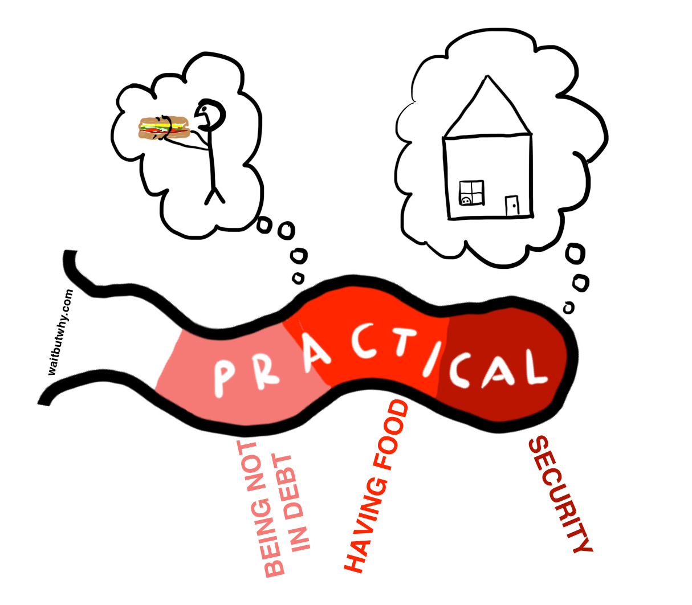](https://149909199.v2.pressablecdn.com/wp-content/uploads/2018/04/practical-tentacle.png)

Your Practical Yearnings tentacle thinks all of this is fine and great—but it would also like to point out that it’s March 31st and your rent is due tomorrow, and the funny thing about that is that it logged into your bank account and saw that the number of dollars in it is actually less than the number of dollars that your landlord will need from you sometime in the next 34 hours.  

你的 "实用年华 "触角认为这一切都很好很不错，但它还想指出，现在是 3 月 31 日，你的房租明天就要到期了，而有趣的是，它登录了你的银行账户，发现里面的美元数实际上少于房东在未来 34 小时内需要你支付的美元数。  

And yeah it knows that you deposited that check on Thursday and that it’s supposed to clear tomorrow morning, but your practical tentacle also could have sworn that just last month, all the tentacles promised that they’d make some sacrifices in order to build up at least a little bank account cushion so that simply paying the rent wouldn’t have to be really fucking stressful every month.  

是的，它知道你在周四存入了那张支票，而且应该在明天早上结清，但你那实用的触手也可以发誓，就在上个月，所有的触手都承诺他们会做出一些牺牲，以便至少在银行账户中积累一点缓冲资金，这样每个月只需支付房租就不会有太大的压力了。  

Your practical tentacle also can’t help but notice that your social tentacle offered to buy a round of drinks for all nine people you went to the bar with last Saturday so those people would think of you as a classy, generous person, and that your lifestyle tentacle chose to rent what sure seems like a pretty nice-ass apartment for someone now living check to check, and that the updates have gotten real quiet from your friend about that bagel delivery service he started six months ago that your moral tentacle happily invested $2,500 in to help it get off the ground, and oh also that meanwhile your personal tentacle has everyone sweating their dick off working at two comedy-writing internships simultaneously that somehow manage to bring in less money combined than you made dressing up as an Egyptian enchantress to wait tables at Jekyll & Hyde sophomore year of college.  

你的实用触角也不禁注意到，你的社交触角主动为上周六和你一起去酒吧的九个人买了一轮酒，这样那些人就会觉得你是个优雅大方的人；你的生活触角选择为一个现在过着拮据生活的人租了一套看起来相当不错的公寓、还有，你的朋友半年前创办了一家百吉饼外卖服务公司，你的道德触角很高兴地投资了 2500 美元帮助它起步，但他的最新消息却变得很冷清；哦，还有，与此同时，你的个人触角让每个人都汗流浃背地同时从事两份喜剧创作实习工作，而这两份工作带来的收入加起来还不如你大二那年装扮成埃及女魔法师在 Jekyll & Hyde 的餐厅当服务员赚的钱多。

At its basic level, your practical tentacle wants to make sure you can eat food and wear clothes and buy the medicine you need and not live outside.  

在最基本的层面上，你的实用触角希望确保你能吃饱穿暖，买到所需的药品，而不是生活在外面。  

It doesn’t really care how these things happen—it just wants them to happen.  

它并不关心这些事情是如何发生的，它只是希望它们发生。  

But then everyone else on the octopus makes your practical tentacle’s life super hard by being fucky about things.  

但是，章鱼上的其他人又会因为胡作非为而让你的实用触手的生活变得异常艰难。  

Every time your income goes up, your lifestyle tentacle decides to raise the bar on what it wants and expects, leaving your practical tentacle continually in the shit trying to cover it all so you don’t have to run up your credit card debt.  

每当你的收入增加，你的生活方式触角就会决定提高它想要和期望的标准，让你的实用触角不断陷入困境，试图支付这一切，以免你的信用卡债台高筑。  

Your personal tentacle has all of these weird needs that take up a lot of time and more often than not aren’t exactly big money-makers.  

你的个人腾博会诚信为本有各种奇怪的需求，这些需求会占用你大量的时间，而且往往不是什么赚钱的好办法。  

And while your practical tentacle would be totally down to just ask your rich uncle for money to help out, your social tentacle outlawed asking others for money because “it’s not a good look,” with your personal tentacle chiming in that “yeah, we’re better than that.”  

虽然你的实用触角完全可以向你有钱的叔叔要钱来帮忙，但你的社交触角却禁止向别人要钱，因为 "这样不好看"，而你的个人触角则在一旁附和说："是啊，我们比那要好"。

So that’s the situation.  

情况就是这样。  

You’ve got this Yearning Octopus in your head with five tentacles (or however many yours has), each with their own agenda, that often conflict with each other.  

你脑海中的渴望章鱼有五条触手（或者你的触手有多少条），每条触手都有自己的目的，而且经常相互冲突。  

Then there are the distinct individual yearnings on each tentacle, often in conflict amongst themselves.  

此外，每个触手上都有各自不同的渴望，它们之间经常会发生冲突。  

And if that weren’t enough, you sometimes have furious internal conflict inside a _single_ yearning.  

如果这还不够，有时你还会在单一的渴望中产生愤怒的内心冲突。  

Like when your desire to pursue your passion can’t figure out what it’s most passionate about.  

比如，当你想追求自己的激情时，却不知道自己最热衷的是什么。

[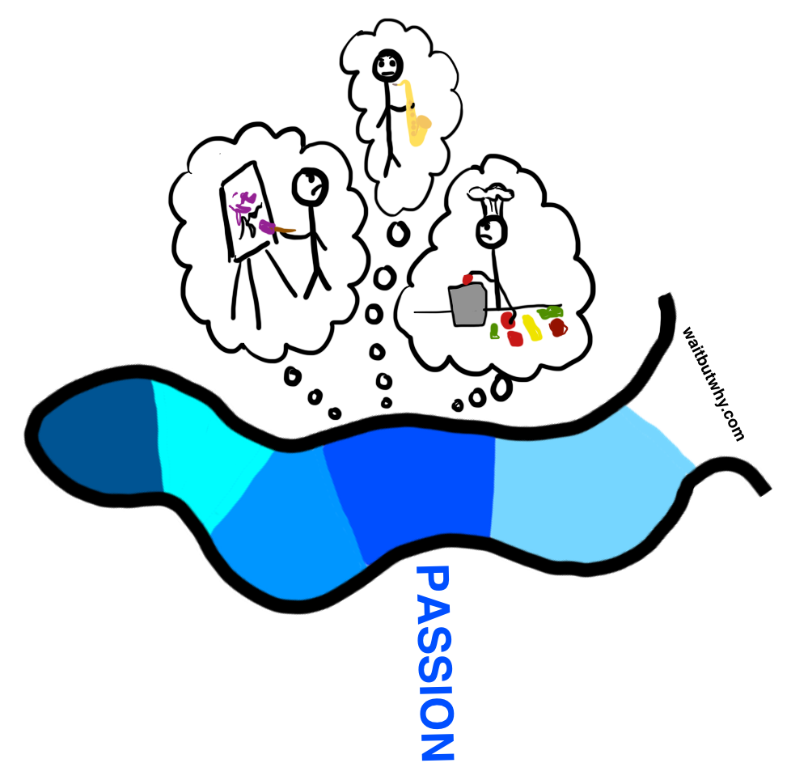](https://149909199.v2.pressablecdn.com/wp-content/uploads/2018/04/Passion-argument.png)

Or when you want so badly to be respected, but then you remember that a career that wins the undying respect of one segment of society will always receive shrugs from other segments and even contemptuous eye rolls from other segments still.  

或者，当你非常希望得到尊重，但你又会想起，一个职业如果赢得了社会某一部分人的不懈尊重，那么它总会得到其他部分人的耸耸肩，甚至还会遭到其他部分人轻蔑的白眼。

Or when you decide to satisfy your urge to help others, before realizing that the part of you that wants to dedicate your life to helping to mitigate humanity’s greatest existential risks has palpable disdain for the part of you that would rather make a tangible positive impact on your local community—while the part of you that can’t stand the thought of the millions of today’s humans without access to clean water finds both of those other yearnings to be pretty cold and heartless.  

或者，当你决定满足自己帮助他人的冲动时，才意识到你内心深处想用毕生精力帮助减轻人类最大生存风险的那部分人，对你更愿意为当地社区带来切实积极影响的那部分人，有着明显的蔑视--而你无法忍受当今数百万人无法获得清洁水的那部分人，则认为其他两种渴望都非常冷酷无情。

So yeah, your Yearning Octopus is complicated.  

所以，是的，你的渴望章鱼很复杂。  

And no human in history has ever satisfied their entire octopus—that’s why you’ll never find it fully smiling.  

历史上没有一个人能够让自己的整只章鱼都满意，这就是为什么你永远也找不到它完全微笑的原因。  

Human yearning is a game of choices and sacrifices and compromise.  

人类的渴望是一场选择、牺牲和妥协的游戏。

**Dissecting the Octopus  

解剖章鱼**

With that in mind, let’s return to your Want Box.  

考虑到这一点，让我们回到您的 "旺旺盒子"。  

When we think about our career goals and fears and hopes and dreams, our consciousness is just accessing the net output of the Yearning Octopus—which is usually made up of its loudest voices.  

当我们思考自己的职业目标、恐惧、希望和梦想时，我们的意识只是在访问 "渴望章鱼 "的净输出--它通常由最响亮的声音组成。  

Only by digging into our mind’s subconscious can we see what’s really going on.[6](https://waitbutwhy.com/2018/04/picking-career.html#)  

只有深入我们的潜意识，我们才能看清事情的真相6。

The cool thing is that we all have the ability to do that.  

最酷的是，我们都有能力做到这一点。  

The stuff in your subconscious is like stuff in the basement of a house.  

你潜意识里的东西就像房子地下室里的东西。  

It’s not off-limits to us—it’s just in the basement.  

它不是我们的禁区，只是在地下室。  

We can go look at it anytime—we just have to A) remember that the house has a basement, and B) actually spend the time and energy to go down there, even though going down there might suck.  

我们随时都可以去看它，我们只需要：A）记住房子有地下室；B）真正花时间和精力下去看看，尽管下去可能会很糟糕。

So let’s head to the basement of your mind to look for the octopus.  

所以，让我们去你心灵的地下室寻找章鱼吧。  

Unless you’re one of those people who’s really practiced at analyzing your subconscious, it might be dark in the basement, making it hard to see your octopus.  

除非你是那种非常善于分析自己潜意识的人，否则地下室里可能很暗，很难看到你的章鱼。  

The way to start turning the lights on is by identifying what your conscious mind currently knows about your yearnings and fears, and then unpacking it.  

开始开灯的方法是，找出你的意识目前对你的渴望和恐惧的了解，然后将其解开。

Like if there’s a certain career path that sounds fantastic to you, unpack that.  

比如，如果你觉得某条职业道路听起来很不错，那就去了解一下。  

Which tentacles in particular are yearning for that career—and which specific parts of those tentacles?  

哪些触角特别向往那份工作--这些触角的哪些具体部位？

If you’re not currently working towards that career you supposedly yearn for, try to figure out why not.  

如果你目前还没有从事你所谓向往的职业，那就试着找出原因。  

If you think it’s because you’re afraid of failing, unpack _that_. Fear of failure can emerge from any of the tentacles, so that’s not a specific enough analysis.  

如果你认为这是因为你害怕失败，那就把它解释清楚。对失败的恐惧可能来自任何一个触角，所以这种分析不够具体。  

You want to find the specific source of the fear.  

你要找到恐惧的具体来源。  

Is it a social tentacle fear of embarrassment, or of being judged by others as not that smart, or of appearing to be not that successful to your romantic interests?  

是社交触角的恐惧，害怕尴尬，还是害怕被别人评价为不那么聪明，还是害怕在恋爱对象面前显得不那么成功？  

Is it a personal tentacle fear of damaging your own self-image—of confirming a suspicion about yourself that haunts you?  

是个人的触角害怕损害自己的自我形象--害怕证实困扰自己的对自己的怀疑？  

Is it a lifestyle tentacle fear of having to downgrade your living situation, or of bringing stress and instability into a currently predictable life?  

是生活方式的触角害怕不得不降低生活档次，还是害怕给目前可预见的生活带来压力和不稳定？  

Or maybe that fear of a living situation downgrade isn’t actually emerging from your lifestyle tentacle, but more so from your social tentacle—in other words, is it possible you’re indifferent about the apartment change itself but super concerned about the _message_ a lifestyle downgrade sends to your friends and family?  

换句话说，有没有可能你对换房本身漠不关心，却对生活方式降级向亲朋好友传递的信息超级担忧？  

Or are there financial commitments you simply cannot back out of at the moment, and your practical tentacle is in a genuine panic about how you’ll make ends meet should this career switch take longer than expected to work out, or not work out at all?  

或者，你目前根本无法放弃一些经济上的承诺，而你的实际触角又着实恐慌，担心如果这次职业转换的时间比预期的要长，或者根本没有成功，你将如何维持生计？  

Or are a few of these combining together to generate your fear of making the leap?  

还是其中的几个因素共同导致了你对实现飞跃的恐惧？

Perhaps you don’t really think it’s fear of failure that’s stopping you, but something else.  

也许你并不真的认为是害怕失败阻碍了你，而是另有原因。  

Maybe it’s a dread of the change in identity—both internally and externally—that inevitably accompanies a career move like this.  

也许是害怕在这样的职业生涯中不可避免地要经历身份的转变，无论是对内还是对外。  

Maybe it’s the heavy weight of inertia—an intense resistance to change—that seems to exist in and of itself and overpowers all of your other yearnings.  

也许是沉重的惰性--对改变的强烈抵触--似乎本身就存在，压倒了你所有其他的渴望。  

In either case, you’d want to unpack the feeling and ask yourself exactly which tentacles are so opposed to an identity shift, or so driven by inertia.  

不管是哪种情况，你都会想解开这种感觉，问问自己到底是哪些触角如此反对身份转变，还是被惰性所驱使。

Maybe you pine to be rich.  

也许你渴望成为富人。  

You fantasize about a life where you make $1.2 million a year, and you feel a tremendous drive to make it happen.  

你幻想着年薪 120 万美元的生活，你感到有巨大的动力去实现它。  

All five tentacles can feel a desire for wealth under certain circumstances, each for their own reasons. Unpack it.  

在某些情况下，五根触角都会出于各自的原因而对财富产生渴望。打开包装

As you unpack an inner drive to make money, maybe you discover that at its core, the drive is more for a sense of security than for vast wealth.  

当你解开赚钱的内在驱动力时，也许你会发现，这种驱动力的核心是安全感，而不是巨额财富。  

That can be unpacked too.  

这也可以解开。  

A yearning for security at its simplest is just your practical tentacle doing what your practical tentacle does.  

对安全感的渴望最简单的说就是你的实用触角在做你的实用触角该做的事。  

But maybe it’s not actually basic security you want as much as a guarantee of a certain level of fanciness demanded by your lifestyle or social tentacle.  

但也许你想要的并不是基本的安全，而是保证你的生活方式或社交腾博会登录所要求的某种程度的时尚。  

Or perhaps what you really want is a level of security so over-the-top secure it can no longer be called a security yearning—instead, it may be an impulse by the emotional well-being section of your lifestyle tentacle to alleviate a compulsive financial stress you were raised to forever feel, almost regardless of your actual financial situation.  

或者，你真正想要的是一种超乎寻常的安全感，它已经不能被称为安全感的渴望--相反，它可能是你的生活方式触角中情感幸福部分的一种冲动，以减轻你从小到大永远感受到的强迫性财务压力，几乎与你的实际财务状况无关。

The answers to all of these questions lie somewhere on the tentacles of your Yearning Octopus.  

所有这些问题的答案就在你渴望的章鱼触角的某处。  

And by asking questions like these and digging deep enough to identify the true roots of your various yearnings, you start to turn on the basement light and acquaint yourself with your octopus in all its complexity.  

通过提出这样的问题，并深入挖掘，找出你各种渴望的真正根源，你就会开始打开地下室的灯，了解你的章鱼的复杂性。

You’ll also come to understand which of your inner yearnings seem to speak the loudest in your mind and carry the most pull in your decision-making processes.  

你还会明白，你内心的哪些渴望似乎在你的脑海中最响亮，在你的决策过程中最有影响力。  

Pretty quickly, a yearning hierarchy will begin to reveal itself.  

很快，一个向往的等级制度就会开始显现出来。  

You’ll identify yearnings that speak loudly and get their way; yearnings that cry at the top of their lungs but get continually elbowed out of the way by higher-prioritized parts of the octopus; yearnings that seem resigned to their low-status positions in the hierarchy.  

你会发现，有的渴望大声疾呼，却总是得理不饶人；有的渴望声嘶力竭地呐喊，却总是被章鱼中优先级更高的部分挡住去路；有的渴望似乎甘于在等级制度中处于低等地位。

**Searching for Imposters  

寻找冒名顶替者**

We’re making good progress—but we’re just getting started.  

我们正在取得良好进展，但我们才刚刚起步。  

Once you have a reasonably clear picture of your Yearning Octopus, you can start doing the real work—work that takes place another level down in your subconscious, in the basement of the basement.  

一旦你对自己的渴望八爪鱼有了相当清晰的认识，你就可以开始真正的工作--在你潜意识的另一层，在地下室的地下室里。  

Here, you can set up a little interrogation room and one by one, bring each yearning down into it for a cross-examination.  

在这里，你可以设立一个小审讯室，一个接一个地把每个渴望者带入其中进行盘问。

You’ll start by asking each yearning: how did you end up here, and why are you the way you are?  

首先，你要询问每一个渴望：你是如何来到这里的，为什么你会变成现在这个样子？  

Desires, beliefs, values, and fears don’t materialize out of nowhere.  

欲望、信念、价值观和恐惧不会凭空产生。  

They’re either developed over time by our internal consciousness as observations and life experience pour in, or they’re implanted in us from the outside, by someone else.  

它们要么是随着时间的推移，随着观察和生活经验的积累，由我们的内在意识形成的，要么是由他人从外部植入我们体内的。  

In other words, they’re the product of either you the chef or you the cook.  

换句话说，它们不是你这个厨师的产物，就是你这个厨子的产物。

So the goal here in your creepy interrogation room is to tug on the faces of each of your yearnings to find out if it’s authentically you, or if it’s someone else _disguised_ as you.  

所以，在这间令人毛骨悚然的审讯室里，我们的目标就是要揭开你每一个渴望的面纱，看看它到底是真实的你，还是伪装成你的另一个人。

You can pull on a yearning’s face by playing the Why Game. You’ll ask your initial Why—_Why is this something I want?—_and get to some kind of Because. Then you’ll keep going.  

你可以通过玩 "为什么 "游戏来消除渴望。你会问自己最初的 "为什么"--"为什么这是我想要的东西？"然后得出某种 "因为"。然后你就会继续下去。  

Why did that particular Because lead you to want what you now want?  

为什么那个特定的 "因为 "会导致你想要现在想要的东西？  

And when did that particular Because gain so much gravity with you?  

你什么时候对 "因为 "有了这么大的兴趣？  

You’ll get to a deeper Because behind the Because.  

你会更深入地了解 "因为 "背后的原因。  

And if you continue with this, you’ll usually discover one of three things:  

如果你继续这样做，通常会发现三件事中的一件：

1) You’ll trace the Why back to its origin and reveal a long chain of authentic evolution that developed through deep independent thought.  

1) 您将追溯 "为什么 "的源头，揭示其通过深入的独立思考而形成的一长串真实的演变过程。  

You’ll pull on their face and confirm that the skin is real.  

你要拉拉他们的脸，确认皮肤是真的。

2) You’ll trace the Why back to an original Because that someone else installed in you—_I guess the only reason I actually have this value is because my mom kind of forced it on me—_and you realize that you never really thought to consider whether you actually independently agree with it.  

2）你会追溯到 "为什么 "的最初原因，那是别人给你灌输的--我想我拥有这种价值观的唯一原因是我妈妈强迫我的--然后你会意识到，你从来没有想过要考虑一下你是否真的独立地认同这种价值观。  

You never stopped to ask yourself whether your own accumulated wisdom actually justifies the level of conviction you feel about that core belief.  

你从未停下来问问自己，你自己积累的智慧是否真的证明了你对这一核心信念的确信程度。  

In a case like this, the yearning is revealed to be an imposter pretending to be an authentic yearning of yours.  

在这种情况下，你的渴望就会被揭穿，原来是一个冒充你真实渴望的骗子。  

You pull on its face and it’s a mask that comes off, exposing the yearning’s original installer underneath.  

你拉一下它的脸，它的面具就会脱落，露出下面渴望的原始安装者。

3) You’ll trace the Why back and back and get kind of lost in a haze of “I guess I just know this because it’s true!” This could be an authentic you thing, or just another version of #2, in an instance where you can’t recall the moment this feeling was installed in you.  

3）你会追溯为什么，然后迷失在 "我想我就是知道这一点，因为这是真的！"的迷雾中。这可能是一个真实的你，也可能是第 2 项的另一个版本，在这种情况下，你无法回忆起这种感觉在你心中扎根的时刻。  

Somewhere deep in you, you’ll have a hunch about which it is.  

在你内心深处的某个角落，你会预感到它是哪一个。

In a #1 scenario, you can be proud that you developed that part of you like a chef.  

在第一种情况下，你可以为自己像厨师一样发展了这一部分而感到自豪。  

It’s an authentic and hard-earned feeling or value.  

这是一种真实的、来之不易的感觉或价值。

In a #2 or maybe #3 scenario, you’ve discovered that you’ve been duped.  

在第 2 或第 3 种情况下，你会发现自己上当受骗了。  

You’ve let someone else sneak onto your Yearning Octopus while you weren’t looking.  

你让别人趁你不注意，偷偷使用了你的渴望章鱼。  

When it comes to that particular belief of yours, you’re a cook following someone else’s recipe—an obedient robot reciting desires and fears out of someone else’s brain.  

说到你的那个特定信仰，你就是一个按照别人的食谱做菜的厨师--一个听话的机器人，从别人的大脑中背诵欲望和恐惧。

There’s a chance you’re an unusually wise person whose examination reveals an octopus developed mostly by you and kept readily up to date.  

有可能你是一个异常聪明的人，你的检查显示，章鱼主要是由你开发的，并随时保持更新。  

More likely, you’re like me and most of my friends—your interrogation room reveals some definite imposters, or at least a lot of ambiguity.  

更有可能的是，你和我以及我的大多数朋友一样，在审讯室里发现了一些明确的冒名顶替者，或者至少有很多模棱两可之处。  

Like, underneath one mask, you’ll find your mom.  

比如，在一个面具下面，你会找到你的妈妈。

[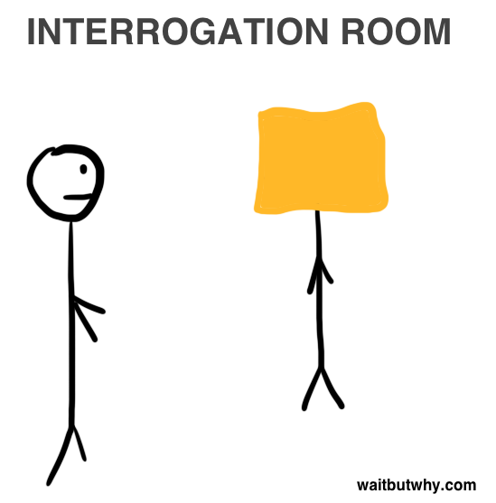](https://149909199.v2.pressablecdn.com/wp-content/uploads/2018/04/mask-1.png)

[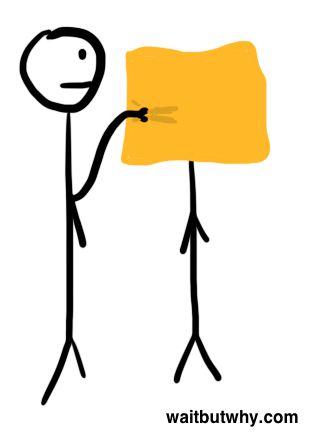](https://149909199.v2.pressablecdn.com/wp-content/uploads/2018/04/mask-2.png)

[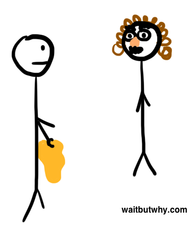](https://149909199.v2.pressablecdn.com/wp-content/uploads/2018/04/mask-3.png)

[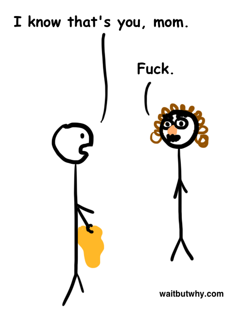](https://149909199.v2.pressablecdn.com/wp-content/uploads/2018/04/mask-4.png)

[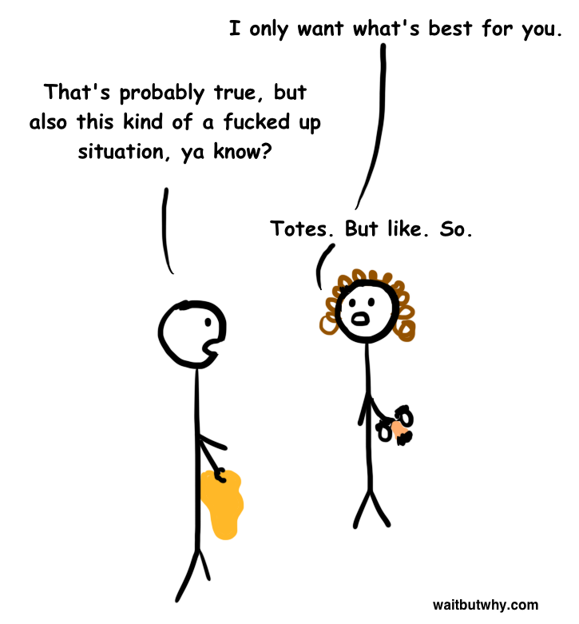](https://149909199.v2.pressablecdn.com/wp-content/uploads/2018/04/mask-5-1.png)

You’ll pull off others to reveal the values and judgments of broader conventional wisdom, or the viewpoints of your more immediate community, or what’s considered cool by the dominant culture of your generation or the immediate culture within your closest group of friends.  

你会从其他人身上揭示出更广泛的传统智慧的价值观和判断，或你更直接的社区的观点，或你这一代的主流文化或你最亲密的朋友圈子中的直接文化认为什么是酷的。

[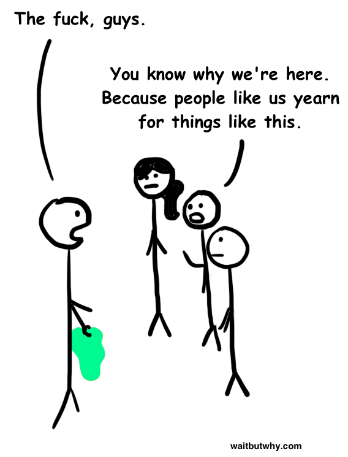](https://149909199.v2.pressablecdn.com/wp-content/uploads/2018/04/mask-6.png)

Sometimes you’ll get to the end of a Why-Because pathway only to find the philosophy in a famous novel, or something a celebrity hero of yours once said in an interview, or a strong opinion one of your professors always repeated.  

有时，当你写到 "为什么--因为 "的结尾时，你会发现其中蕴含的哲理来自一本著名的小说，或者是你的名人偶像在采访中说过的话，或者是你的某位教授总是反复强调的观点。

You might even find that some of your yearnings and fears were written by you…when you were seven years old.  

你甚至会发现，你的一些渴望和恐惧是你自己写的......在你七岁的时候。  

Like a childhood dream that was etched into the back of your consciousness as the thing you believe you _really_ want, when you’re being _truly_ honest.  

就像儿时的梦想，当你真正诚实地去面对时，它就会刻在你的意识深处，成为你认为自己真正想要的东西。

[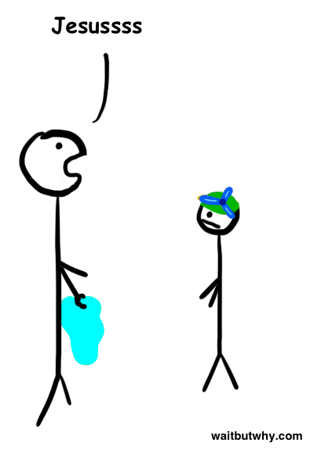](https://149909199.v2.pressablecdn.com/wp-content/uploads/2018/04/mask-7.png)

[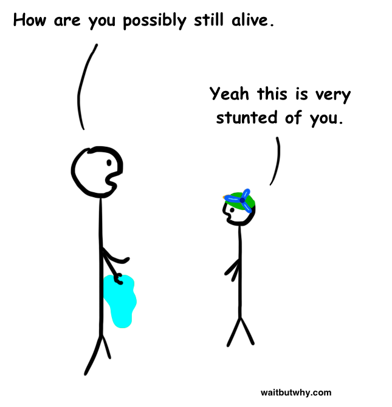](https://149909199.v2.pressablecdn.com/wp-content/uploads/2018/04/mask-8-1.png)

The interrogation room probably won’t be that fun a time.  

审讯室里可能没那么好玩。  

But it’s time well spent—because you’re not your 7-year-old self, just like you’re not your parents or your friends or your generation or your society or your heroes or your past decisions or your recent circumstances.  

但这段时间花得很值--因为你不是 7 岁的自己，就像你不是你的父母、朋友、同代人、社会、英雄、过去的决定或最近的环境一样。  

You’re Current-Age You—the only person, and the only version of yourself, who is actually qualified to want and not want the things you want and don’t want.  

你是当代的你--唯一有资格想要或不想要你想要或不想要的东西的人，也是唯一的你自己。

To be clear, this isn’t to say that it’s wrong to live by the words of a wise parent or a famous philosopher or friends you respect or the convictions of a younger you.  

要明确的是，这并不是说，听从睿智的父母、著名的哲学家、你尊敬的朋友或年轻时的你的信念来生活是错误的。  

Humble people are by _definition_ influence-able—influences are an important and inevitable part of who each of us is.  

顾名思义，谦逊的人是有影响力的--影响力是我们每个人重要而不可避免的一部分。  

The key distinction is this:  

关键的区别在于

Do you treat the words of your external influences as information, held and considered by an authentic inner you, that you’ve carefully decided to embrace?  

你是否将外部影响的言辞视为信息，由真实的内在的你来掌握和考虑，并慎重决定接受？  

Or are your influences themselves actually in your brain, _masquerading as_ inner you?  

还是你的影响本身其实就在你的大脑中，伪装成你的内心？

Do you want the same thing someone else you know wants because you heard them talk about it, you thought about it alongside your own life experience, and you eventually decided that, for now, you agree?  

你会不会因为听别人说起、结合自己的生活经验思考，最终决定暂时同意别人的想法？  

Or because you heard someone talk about what they want or fear, and you thought, “I don’t know shit and that person does, so if they say X is true, I’m sure they’re right”—and then you etched those ideas into your mind, never again feeling the need to question them?  

或者是因为你听到别人谈论他们想要什么或害怕什么，然后你就想，"我什么都不知道，而那个人知道，所以如果他们说 X 是真的，我就肯定他们是对的"--然后你就把这些想法刻在了脑海里，再也不觉得有必要质疑他们了？

The former is what chefs do. The latter is what you do when you’re being an obedient robot.  

前者是厨师的工作。后者则是你在做一个听话的机器人时要做的事。  

And a robot is what you become when at some point you get the idea in your head that someone else is more qualified to be you than you are.  

而当你在某一时刻头脑中认为别人比你更有资格成为你时，你就成了机器人。

The good news is that all humans make this mistake—and you can fix it.  

好消息是，所有人类都会犯这种错误，而且你可以纠正它。  

Just like your subconscious is right there for viewing if you want to view it—it’s also there for changing and updating and rewriting.  

就像你的潜意识就在那里，如果你想查看它，它也在那里，可以改变、更新和重写。  

It’s your head—you’re allowed to do with it what you want.  

这是你的脑袋，你可以随意支配它。

So it’s time for some evictions. Masked imposters have to go. Even mom and dad.  

是时候驱逐他们了。戴面具的冒牌货必须滚蛋甚至是爸爸妈妈

At the end of this, your octopus may look a little barren, leaving you feeling a little like you don’t know who you even are anymore.  

最后，你的章鱼可能会显得有些贫瘠，让你觉得自己都不知道自己是谁了。  

We usually think of this as a bad feeling, or even an existential crisis, but it actually means you’re doing better than most people.  

我们通常认为这是一种糟糕的感觉，甚至是一种生存危机，但实际上这意味着你比大多数人做得更好。

[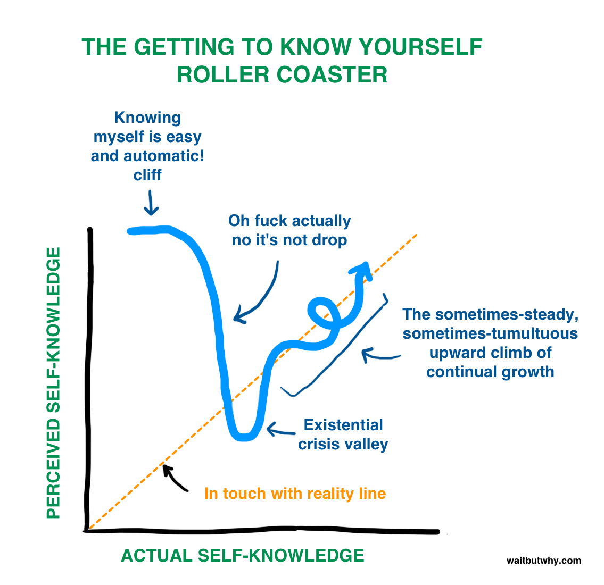](https://149909199.v2.pressablecdn.com/wp-content/uploads/2018/04/roller-coaster-1-2.png)

The drop from naive over-confidence to wise, realistic humility never feels good, but pausing the roller coaster while it’s still on that first cliff and avoiding the pain—which turns out to be a lot of people’s move—isn’t a great strategy.  

从天真的过度自信到明智、现实的谦卑，这种跌落的感觉从来都不好受，但在过山车还在第一道悬崖上时就暂停并回避痛苦--事实证明这是很多人的做法--并不是什么好策略。  

Wisdom isn’t correlated with knowledge, it’s correlated with being in touch with reality—it’s not how far to the right you are on the graph, it’s how close you are to the orange line.  

智慧与知识无关，而是与接触现实有关--它不在于你在图表上的右边有多远，而在于你离橙色线有多近。  

Wisdom hurts at first, but it’s the only place where actual growth happens.  

智慧一开始会伤人，但它是唯一能让人真正成长的地方。  

The irony is that the cliff-pausers of the world like to make the wiser, braver valley-dwellers or continual-climbers feel bad about themselves—because they fundamentally don’t get how knowing yourself works.  

具有讽刺意味的是，这个世界上的 "悬崖勒马者 "喜欢让那些更聪明、更勇敢的 "山谷居民 "或 "持续攀登者 "自怨自艾，因为他们从根本上就不明白 "认识你自己 "是如何发挥作用的。  

They haven’t reached that stage yet.  

他们还没有达到那个阶段。

Getting to know your real self is super hard and never complete.  

了解真实的自己是一件超级困难的事情，而且永远不会完成。  

But if you’ve tumbled off the cliff, you’ve gone through a key rite of passage and progress is now possible.  

但是，如果你从悬崖上跌落，你就经历了一个关键的成人仪式，现在取得进步是可能的。  

As you climb up the orange line, you’ll slowly but surely begin to repopulate your Yearning Octopus with your real self.  

当你爬上橙色线时，你就会慢慢地开始用真实的自己重新填充你的渴望章鱼。

At the moment, it probably won’t be obvious what those missing yearnings of yours are exactly—because they’re on an even deeper floor of your subconscious.  

此时此刻，你可能还不清楚那些缺失的渴望到底是什么--因为它们就在你潜意识中更深的一层。  

They’re in the basement of the basement of the basement—in a place called Denial Prison.  

他们在地下室的地下室，一个叫 "拒绝监狱 "的地方。

**Denial Prison  

拒绝监狱**

Our brain’s Denial Prison is a place most of us don’t even know is there—it’s where we put the parts of us we repress and deny.  

我们大脑中的 "否认监狱 "是一个大多数人都不知道的地方--我们把自己压抑和否认的部分放在那里。

The authentic yearnings of ours that we’re in touch with—i.e.  

我们所接触到的真实渴望--即  

those that proved to be authentic during interrogation—were easy parts of our true selves to find in our subconscious, lying in plain sight, right below the surface of our consciousness.  

那些在审问过程中被证明是真实的自我，是我们潜意识中很容易找到的真实自我的一部分，就隐藏在我们意识的表面之下，一览无余。  

Even our conscious mind knows these yearnings well, because they frequently make their way upstairs into our thoughts.  

就连我们的意识也对这些渴望了如指掌，因为它们经常会出现在我们的思想中。  

These are the parts of us we have a healthy relationship with.  

我们与这些部分保持着健康的关系。

But then there are the parts of you that weren’t living on your octopus where they’re supposed to be—instead, you found an imposter in their place.  

但是，你的那些部分并没有生活在章鱼身上它们应该生活的地方--相反，你在它们的位置上发现了一个冒名顶替者。  

These lost parts of you are often incredibly hard to access, because they’ve been living deep in your subconscious, on a floor so low it’s almost not there at all. Almost.  

你失去的这些部分往往很难触及，因为它们一直深藏在你的潜意识中，位置很低，几乎不存在。几乎没有

Some parts of us are banished down on basement #3 because they’re extraordinarily painful for us to acknowledge or think about.  

我们的某些部分被放逐到 3 号地下室，因为它们让我们异常痛苦，无法承认或思考。  

Sometimes new parts of us are born only to be immediately locked up in prison as part of a denial of our own evolution—i.e.  

有时，我们新的部分诞生了，但作为否认自身进化的一部分，却被立即关进了监狱--也就是说。  

out of stubbornness. But there are other times when a part of us is in Denial Prison because someone _else_ locked it up down there.  

出于固执。但还有一些时候，我们的一部分会被关进 "拒绝监狱"，因为有人把它锁在了监狱里。  

In the case of your yearnings, some of them will have been put there by whatever masked intruder had been taking its place.  

就你的渴望而言，其中一些渴望是被某个戴着面具的入侵者放在那里的。  

If dad has successfully convinced you that you care deeply about having a prestigious career, he probably has also convinced you that the part of you that, deep down, really wants to be a carpenter isn’t really you and isn’t what you really want.  

如果爸爸成功地让你相信，你非常在乎拥有一份有声望的职业，那么他很可能也让你相信，你内心深处真正想做木匠的那部分并不是真正的你，也不是你真正想要的。  

At some point during your childhood, he threw your passion for carpentry into a dark, dank Denial Prison cell.  

在你童年的某个时刻，他把你对木工的热情扔进了阴暗潮湿的拒绝监狱。

So let’s gather your courage and head down to the basement of the basement of the basement of your mind and see what we find.  

所以，让我们鼓起勇气，前往你心灵的地下室的地下室，看看我们能找到什么。

[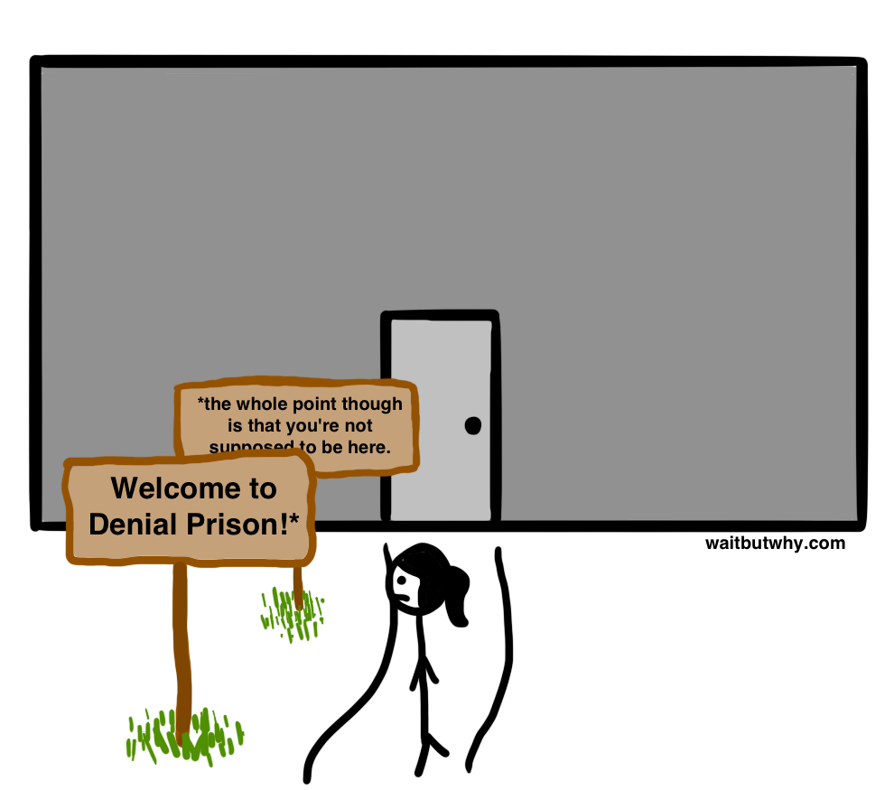](https://149909199.v2.pressablecdn.com/wp-content/uploads/2018/04/denial-prison-1-1.png)

You may pass some unpleasant characters.  

您可能会遇到一些不愉快的人物。

[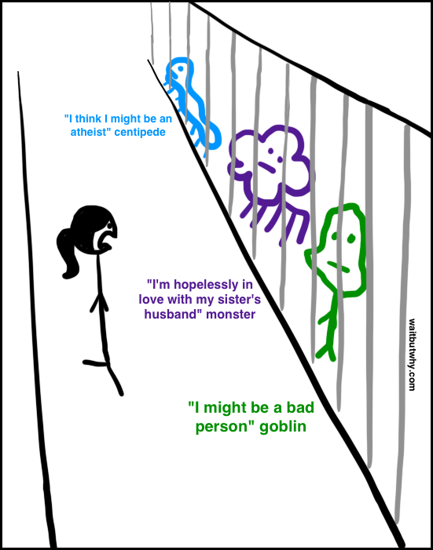](https://149909199.v2.pressablecdn.com/wp-content/uploads/2018/04/denial-prison-2.png)

Leave them for another time—right now, search for locked-away career-related yearnings.  

把它们留到下一次吧，现在，寻找被锁住的与职业有关的渴望。  

Maybe you’ll find a repressed passion to teach.  

也许你会找到一种被压抑的教学激情。  

Or a desire to be famous that your particular tribe has shamed you out of.  

或者你想出名，但你所在的部落却让你感到羞耻。  

Or a deep love of long blocks of free, open leisure time that your hornier, greedier teenage self kicked downstairs in favor of a raging ambition.  

或者，你深爱着长长的自由、开放的闲暇时光，而你那个更好色、更贪婪的少年时代，却为了汹涌澎湃的野心，把这些时光踢下了楼。

There will be certain parts of your authentic self you won’t be able to uncover in Denial Prison—it’s pretty dark down there.  

在 "拒绝监狱 "里，你无法发掘真实自我的某些部分--那里非常黑暗。  

But be patient—now that you’ve done your audit and cleared space for them on your octopus, they may begin to emerge.  

但请耐心等待--既然你已经完成了审核，并为它们在章鱼上清理出了空间，它们可能会开始出现。

**Priority Rankings  

优先等级**

The other part of our Yearning Octopus audit will address the hierarchy of your yearnings.  

我们的 "渴望八爪鱼 "审计的另一部分将涉及你的渴望的层次结构。  

Almost as important as the yearnings themselves is the priority they’re given.  

几乎与渴望本身同样重要的是它们被赋予的优先权。  

The hierarchy is easy to see because it’s revealed in your actions.  

层次结构很容易看出来，因为它就在你的行动中显露出来。  

You may like to think a desire to do something bold is high up on your hierarchy, but if you’re not currently working on something bold, it reveals that however important boldness is to you, something else—some source of fear or inertia in you—is currently being prioritized above it.  

你可能会认为做一些大胆事情的愿望在你的层次结构中处于很高的位置，但如果你目前没有在做一些大胆的事情，这就表明无论大胆对你来说有多重要，其他的事情--你内心的某种恐惧或惰性--目前正优先于它。

It’s important to remember that a ranking of yearnings is also a ranking of fears.  

重要的是要记住，渴望的排名也是恐惧的排名。  

The octopus contains anything that could make you want or not want to pursue a certain career, and the reverse side of each yearning is its accompanying fear of the opposite.  

章鱼包含了任何可能让你想要或不想从事某种职业的东西，而每种渴望的反面都伴随着对相反事物的恐惧。  

The reverse side of your yearning to be admired is a fear of embarrassment.  

你渴望被人钦佩的另一面是害怕出丑。  

If you flip over your desire for self-actualization, you’ll see a fear of underachieving.  

如果翻开你对自我实现的渴望，你就会看到对成绩不佳的恐惧。  

The other half of your craving of self-esteem is a fear of feeling shame.  

你渴望自尊的另一半原因是害怕感到羞耻。  

If your actions don’t seem to match what you believe is the internal hierarchy of your yearnings, usually it’s because you’re forgetting to think about the role your fears are playing.  

如果你的行动似乎与你认为的内心渴望层次不符，通常是因为你忘记了思考你的恐惧所扮演的角色。  

What looks like a determined drive for success, for example, might actually be someone running _away_ from a negative self-image or trying to escape feelings like envy or under-appreciation.  

例如，看似坚定的成功动力，实际上可能是某人在逃避消极的自我形象，或试图摆脱嫉妒或不被欣赏等情绪。  

If your actions seem beholden to yearnings that you don’t believe you actually care that much about, you’re probably not looking closely enough at your fears.  

如果你的行为似乎受制于你不认为自己真的那么在乎的渴望，那么你可能没有足够仔细地审视自己的恐惧。

With both yearnings and fears in mind, think about what your internal hierarchy might look like, and return that same important question: “Who made this order?  

带着渴望和恐惧，想想你的内部等级制度可能是什么样子的，然后再回到那个同样重要的问题："谁下的命令？  

Was it really me?”  

真的是我吗？"

For example, we’re often told to “follow our passion”—this is society saying “put your passion yearnings at the top of your hierarchy.” That’s a very specific instruction.  

例如，我们经常被告知要 "追随我们的激情"--这就是社会在说 "把你对激情的渴望放在最重要的位置"。这是一个非常具体的指示。  

Maybe that’s the right thing for you, but it also very well might not be.  

也许这对你来说是正确的，但也很可能不是。  

It’s something you need to independently evaluate.  

这需要您进行独立评估。

To get this right, let’s try to do a fresh ranking, from first principles, based on who we really are, how we’ve evolved over time, and what really matters to us most, right now.  

为了正确对待这个问题，让我们尝试从第一原则出发，根据我们的真实身份、我们随着时间的推移是如何演变的，以及现在对我们最重要的是什么，重新进行一次排名。

This isn’t about which yearnings or fears have the loudest voices or which fears are most palpable—if it were, you’d be letting your impulses take the wheel of your life.  

这并不是说哪种渴望或恐惧的声音最大，或者哪种恐惧最明显--如果是这样的话，你就会让自己的冲动掌控自己的人生。  

The person doing the ranking is _you_—the little center of consciousness reading this post who can observe your octopus and look at it objectively.  

做排名的人就是你--阅读这篇文章的小意识中心，他可以观察你的章鱼，并客观地看待它。  

This involves another kind of compromise.  

这涉及到另一种妥协。  

On one side, you’ll try to tap into all the wisdom you’ve accumulated throughout your life and make active decisions about values—about what you really believe is _important_. On the other side, it’s about self-acceptance and self-compassion.  

一方面，你要尝试利用你一生积累的所有智慧，并就价值观--关于你真正认为重要的东西--做出积极的决定。另一方面，则是自我接纳和自我同情。  

Sometimes you’ll have strong undeniable yearnings that you’re not super proud of—whether you like it or not, those are part of you, and when you neglect them, they may cause a continual stink and make you miserable.  

有时，你会有强烈的、不可否认的、并不引以为豪的渴望--无论你喜欢与否，这些都是你的一部分，当你忽视它们时，它们可能会引起持续的恶臭，让你痛苦不堪。  

Creating your yearning hierarchy is a give and take between what’s important and what’s you.  

创建你的渴望层次结构是重要的东西和你的东西之间的取舍。  

It’s probably a good goal to give higher priority to your more noble qualities, but it’s okay to throw a bone to some of your not-so-noble sides as well—depending on where you decide to draw the line.  

把更高尚的品质放在首位可能是个不错的目标，但也可以给自己的一些不那么高尚的方面加点料--这取决于你决定把界限划在哪里。  

There’s a wisdom to knowing when to accept your not-so-noble side and when to reject it entirely.  

知道何时接受自己不那么高尚的一面，何时完全拒绝它，是一种智慧。

To get all of this in order, we want a good system.  

要使这一切井然有序，我们需要一个良好的系统。  

You can play around with what works for you—I like the idea of a shelf:  

你可以根据自己的喜好来设计，我喜欢架子的想法：

[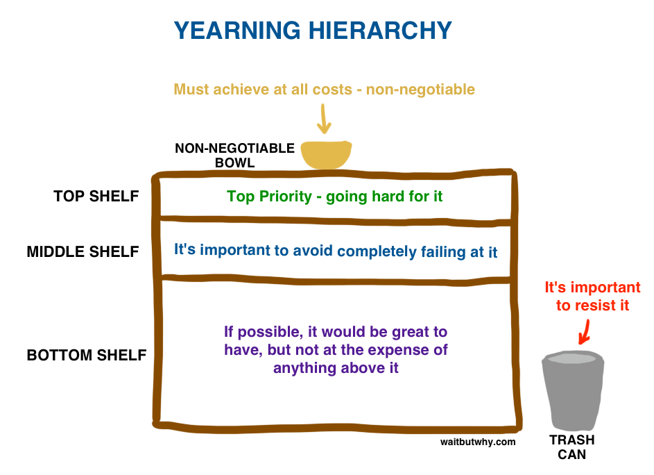](https://149909199.v2.pressablecdn.com/wp-content/uploads/2018/04/yearning-hierarchy-2.png)

This divides things into five categories.  

这将事物分为五类。  

The absolutely highest priority inner drives get to go in the extra special non-negotiable bowl.  

绝对最优先的内部驱动器会被放在特别的、没有商量余地的碗里。  

The NN bowl is for yearnings _so_ important to you that you want to essentially guarantee that they’ll happen—at the expense of all other yearnings, if necessary.  

NN 碗是为那些对你来说非常重要的愿望准备的，以至于你想从根本上保证它们的实现--如果有必要，你可以牺牲所有其他愿望。  

This is why so many of history’s legends were famously single-minded—they had a very intense NN bowl yearning and it led them to world fame, often at the expense of relationships, balance, and health.  

这就是为什么历史上那么多传奇人物都是著名的一心一意--他们对 NN 碗有着非常强烈的向往，这种向往让他们名扬天下，而这往往是以牺牲人际关系、平衡和健康为代价的。  

The bowl is small because it should be used very sparingly—if at all.  

碗很小，因为如果要使用的话，也要尽量少用。  

Like maybe only one thing gets it. Or _maybe_ two or three.  

比如说，也许只有一件事得到了它。或者两三件。  

Too many things in the NN bowl cancels out its power, making that the same as having nothing in the bowl at all.  

在 NN 碗里放太多东西会抵消它的力量，这就等于碗里什么都没有。

Your group of top shelf yearnings is mostly what will drive your career choices—but top shelf placement should also be doled out sparingly (that’s why it’s not a very large shelf).  

你的那些 "顶级渴望 "是你职业选择的主要驱动力--但 "顶级渴望 "也要适可而止（这就是为什么 "顶级渴望 "不是一个很大的架子）。  

Shelf placement is as much about de-prioritizing as it is about prioritizing.  

货架摆放既要分清轻重缓急，也要分清主次。  

You’re not just choosing which parts of you are the most important to make you happy, you’re choosing which parts of you to intentionally leave wanting or even directly opposed.  

你不只是在选择哪些部分是最重要的，能让你感到快乐，你还在选择哪些部分是你故意不想要的，甚至是直接反对的。  

No matter what your hierarchy looks like, some yearnings will be left feeling very unhappy and some fears will feel like they’re being continually assaulted.  

无论你的等级制度是什么样子的，有些渴望都会让你感到非常不开心，有些恐惧则会让你感到不断受到攻击。  

This is inevitable.  

这是不可避免的。

That’s why most yearnings should be on the middle shelf, the bottom shelf, or the trash can.  

这就是为什么大多数渴望都应该放在中间架子、底层架子或垃圾桶里的原因。  

The middle shelf is good for those not-so-noble qualities in you that you decide to accept.  

中间的架子适合那些你决定接受的并不高尚的品质。  

They deserve some of your attention.  

它们值得你们关注。  

And they’ll often demand it—core parts of you won’t go quietly into non-prioritization, and they sometimes can really ruin your life if they’re neglected.  

它们往往会要求你这样做--你的核心部分不会悄无声息地变成非优先事项，如果它们被忽视，有时真的会毁了你的生活。

Most of the rest will end up on the bottom shelf.  

剩下的大部分会被放在底层架子上。  

Putting a part of you on the bottom shelf is telling it, “I know you want these things, but for now, I’ve decided other things are more important.  

把你的一部分放在最底层，就是告诉它："我知道你想要这些东西，但现在，我决定其他东西更重要。  

I promise to revisit you a little later, after I’ve gotten some more information, and if I change my mind, you’ll get a shelf upgrade then.” The best way to think of the bottom shelf is this: the more yearnings you can convince to accept a bottom shelf rating, the better the chances your top shelf and NN bowl yearnings have of getting what they want.  

我保证过段时间再来看你，等我得到更多信息之后，如果我改变了主意，到时候你就会得到提升。对底层架子最好的看法是：你能说服越多的渴望者接受底层架子的评级，你的顶层架子和 NN 碗渴望者就越有机会得到他们想要的东西。  

Likewise, the fewer yearnings you put on the _top_ shelf, the more likely those on the top shelf will be to thrive.  

同样，放在架子顶端的渴望越少，架子顶端的渴望就越有可能茁壮成长。  

Your time and energy are severely limited, so this is a zero-sum compromise.  

你的时间和精力都非常有限，所以这是一种零和妥协。  

The amateur mistake is to be too liberal with the NN bowl and top shelf and too sparing with the large bottom shelf.  

业余爱好者的错误在于对 NN 碗和顶层架子过于随意，而对大型底层架子过于节省。

Then there’s the trash can, for the drives and fears you flat-out reject—those parts of you that fundamentally violate the person your wisest self wants to be.  

然后是垃圾桶，用来装你完全拒绝的驱动力和恐惧--那些从根本上违背了你最明智的自我意愿的部分。  

A good amount of inner conflict emerges from people’s trash cans, and trash can control is a major component of integrity and inner strength.  

很多内心冲突都来自于人们的垃圾桶，而控制垃圾桶则是正直和内心力量的重要组成部分。  

But like the rest of your hierarchy decisions, your criteria for what qualifies as trash should be derived from your own deep thought, not from what others tell you is and is not trash.  

但是，就像你的其他等级决定一样，你对垃圾的标准应该来自你自己的深思熟虑，而不是别人告诉你什么是垃圾，什么不是垃圾。

As you go through this difficult prioritizing process—inevitably, at times, against the screaming protests of unhappily deprioritized yearnings—remember that you’re the only wise one in the room.  

当你经历这个艰难的确定优先次序的过程时--有时难免要顶着被取消优先次序的渴望的尖叫抗议--请记住，你是房间里唯一明智的人。  

Yearnings and fears are impatient and bad at seeing the big picture.  

渴望和恐惧是急躁的，不善于从大局出发。  

Even a seemingly high-minded yearning, like those on the moral tentacle, can’t understand the complete picture in the way you can.  

即使是那些看似高高在上的渴望，比如那些道德触角上的渴望，也无法像你一样理解全局。  

Many of the people who have done wonders to make the world better got there on a path that started with selfish motives like wealth or personal fulfillment—motives their moral tentacle probably hated at first.  

许多创造奇迹、让世界变得更美好的人，他们的出发点是自私的动机，比如财富或个人成就感--他们的道德触角可能一开始就厌恶这些动机。  

The octopus won’t be the wise adult in the room—that’s your job.  

章鱼不会成为房间里的智者，那是你的工作。

[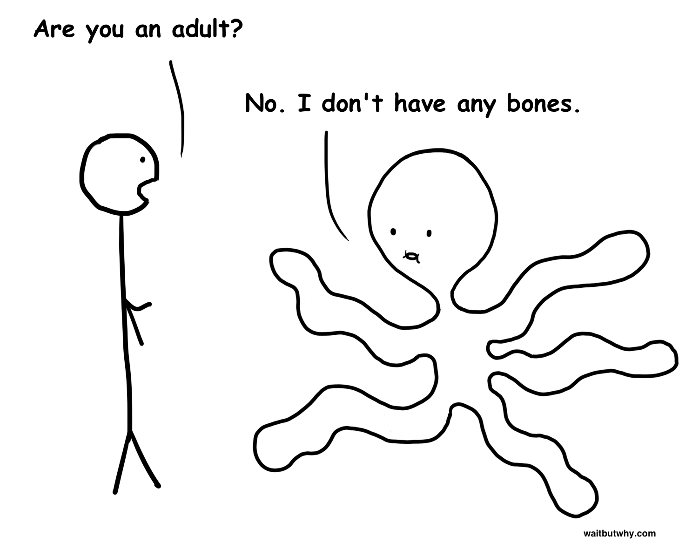](https://149909199.v2.pressablecdn.com/wp-content/uploads/2018/04/octopus-no-bones-1.png)

Finally, as we’ll discuss more later, this is not a permanent decision.  

最后，正如我们稍后将讨论的那样，这并不是一个永久性的决定。  

It’s the opposite—it’s a rough draft written in light pencil.  

恰恰相反，这是用浅色铅笔写的草稿。  

It’s a hypothesis that you’ll be able to test and then revise based on how actually living this hierarchy feels in practice.  

这是一个假设，你可以根据实际生活中的感受来检验和修正这个层次结构。

Your Want Box is ready to go. Now let’s turn to your Reality Box.  

您的 "愿望盒 "已准备就绪。现在，让我们来看看你的 "现实盒子"。

**Deep Analysis, Part 2: Your Reality Box  

深度分析，第 2 部分：你的现实盒子**

The Want Box deals with what you find desirable. The Reality Box deals with what’s _possible_.  

想要盒子 "处理的是你认为可取的东西。而 "现实盒子 "则处理可能发生的事情。

But when we examined the Want Box, it became clear that it’s not necessarily based on what you actually want—it’s based on what you _think_ you want—what you’re in the _habit_ of wanting.  

但是，当我们研究 "想要盒子 "时，发现它并不一定是基于你实际想要的东西，而是基于你认为你想要的东西--你习惯于想要的东西。

The Reality Box is the same deal.  

现实盒子也是如此。  

It doesn’t show you reality, it shows your best crack at what reality might be—your _perception_ of reality.  

它并不是向你展示现实，而是展示你对现实的最佳解读--你对现实的感知。

The goal of self-reflection is to bring both of these boxes as close to accuracy as possible.  

自我反思的目的是使这两个方框尽可能接近准确。  

We want our perceived yearnings to be a true reflection of our authentic inner selves, and we want our beliefs about what’s possible to come close to mirroring what’s actually possible.  

我们希望我们所感知到的渴望能够真实地反映我们的内心世界，我们希望我们关于什么是可能的信念能够接近于反映什么是实际可能的。  

For our Want Box audit, we looked under the hood of the Want Box and found its settings—your yearnings and fears.  

在对 "旺旺盒子 "进行审核时，我们查看了 "旺旺盒子 "的引擎盖，发现了它的设置--你的渴望和恐惧。  

When we open the hood of your Reality Box, we see a group of _beliefs_.  

当我们打开你的 "现实盒子 "的盖子时，我们看到的是一组信念。

When it comes to your career possibilities, you’re dealing with two sets of beliefs: beliefs about the world and beliefs about your own potential.  

说到职业的可能性，你要面对两套信念：对世界的信念和对自身潜力的信念。  

For a career option to qualify for your Reality Box, your potential in that career area has to measure up to the objective difficulty of achieving success in that area.  

要使某个职业选项符合 "现实盒子 "的要求，你在该职业领域的潜力必须达到在该领域取得成功的客观难度。

Us being us, we’re probably pretty bad at assessing either side of this comparison accurately.  

我们就是我们，我们可能很不擅长准确评估这种比较的任何一方。

I don’t know how you think about career path difficulty, but in my experience, people often see it like this:  

我不知道你是如何看待职业道路上的困难的，但根据我的经验，人们通常是这样看待职业道路上的困难的：

There are traditional careers—stuff like medicine or law or teaching or a corporate ladder, etc.—and these careers have predictable, set paths.  

有一些传统的职业--比如医学、法律、教师或企业阶梯等--这些职业都有可预测的、固定的发展路径。  

If you’re decently smart and work hard, you’ll end up in a successful, stable situation.  

如果你足够聪明并努力工作，你最终会获得成功和稳定的生活。

Then there are less traditional careers—the arts, entrepreneurship, non-profit work, politics, etc.—and these are wildcards.  

还有一些不那么传统的职业--艺术、创业、非营利性工作、政治等--这些都是通配符。  

Success and stability are no guarantee, and to reach great heights, it’s either a lottery ticket game of luck, a genetic lottery game of innate talent, or some combination of the two.  

成功和稳定是无法保证的，要想达到伟大的高度，要么是运气的彩票游戏，要么是先天天赋的基因彩票游戏，要么是两者的某种结合。

These are perfectly reasonable assumptions—if you live in 1952. Your beliefs about the world of careers and about what it takes to succeed need just as thorough an unmasking as your yearnings did—and I suspect that behind most of them, you’ll find big, fat conventional wisdom.  

如果你生活在 1952 年，这些假设是完全合理的。你对职业世界和成功要素的看法，和你的渴望一样需要彻底的揭开--我猜想，在大多数看法的背后，你会发现巨大的、肥胖的传统智慧。  

You might first pull off the mask of one of your beliefs and find your parents or your friends or your college career coach—but if you keep going and pull on _their_ face, you’ll usually see that it’s also a mask, and conventional wisdom is there hiding behind it.  

你可能会首先揭开你的某个信念的面具，找到你的父母、你的朋友或你的大学职业教练--但如果你继续揭开他们的面纱，你通常会发现这也是一个面具，传统智慧就隐藏在它的背后。  

A general conception, a common opinion, an oft-cited statistic[7](https://waitbutwhy.com/2018/04/picking-career.html#)—none of which have actually been verified by you, but all of which are treated as gospel by society.  

一个普遍的概念、一个常见的观点、一个经常被引用的统计数据7 --这些都没有经过你们的实际验证，但都被社会视为福音。

Today’s world goes through dramatic changes each decade, which usually leaves conventional wisdom wildly outdated.  

当今世界每十年都会发生巨变，这通常会让传统智慧变得非常过时。  

But we’re wired for a more ancient world where almost nothing ever changed, so we all reason like cooks and treat conventional wisdom as equivalent to truth.  

但是，我们的思维模式是更古老的世界，那里几乎没有什么变化，所以我们都像厨师一样推理，把传统智慧等同于真理。

These problems then extend to how we view our own potential.  

这些问题进而延伸到我们如何看待自身的潜力。  

When you overrate the impact of innate talent on how people fare in their careers—and you also conflate talent and skill level—it won’t leave you feeling great about your chances at many paths.  

如果你高估了先天天赋对人们职业生涯的影响，而且还混淆了天赋和技能水平，那么你就不会对自己在许多职业道路上的机会感到乐观。  

Because we better understand the trajectory of traditional careers, we’re less prone to do this with them.  

因为我们更了解传统职业的发展轨迹，所以我们不容易对他们这样做。  

A first-year medical student sees an experienced surgeon at work and thinks, “I can get there one day—just need to do about 20 years of hard work.” But when a young artist or entrepreneur or software engineer looks at the equivalent of the experienced surgeon in their field, they’re more likely to think, “Wow look how talented they are—I’m nowhere near that good,” and get all hopeless.  

医科一年级学生看到经验丰富的外科医生在工作，会想："我也有一天能达到那个水平--只需要努力工作 20 年。但是，当一个年轻的艺术家、企业家或软件工程师看到与自己领域中经验丰富的外科医生相当的人时，他们更有可能会想："哇，看看他们多么有才华，我还差得远呢！"然后就绝望了。  

There’s also the other common notion, that people who thrive in non-traditional careers had some “big break” at some point, like hitting a lucky scratch card jackpot—and I don’t know many people who want to risk their careers on scratch cards.  

还有另一种常见的观念，即那些在非传统职业中茁壮成长的人都曾在某一时刻获得过 "重大突破"，就像中了幸运刮刮卡大奖一样--我不知道有多少人愿意拿自己的职业生涯去赌刮刮卡。

These are only a few examples of the slew of delusions and misconceptions we tend to have about how great careers happen.  

这些只是我们对伟大事业如何发生的一系列错觉和误解中的几个例子。  

So let’s brainstorm how it might actually work:  

因此，让我们集思广益，看看它究竟是如何运作的：

**The Career Landscape  

职业前景**

I have no idea, mostly. And I think most people have no idea. Things are just changing too quickly.  

主要是我不知道。我想大多数人也不知道。事情变化得太快了。

But that’s kind of the key point.  

但这正是关键所在。  

If you can figure out how to get a reasonably accurate picture of the real career landscape out there, you have a massive edge over everyone else, most of whom will be using conventional wisdom as their instruction booklet.  

如果你能想出如何合理准确地了解真实的职业前景，你就会比其他人拥有巨大的优势，因为他们中的大多数人都会把传统智慧当作他们的指导手册。

First, there’s the broad landscape—the set of all the jobs someone could possibly have in today’s society.  

首先是广阔的前景--在当今社会，一个人可能从事的所有工作的集合。  

My current job description is: “Writer of 8,000-to-40,000-word articles about a bunch of different topics, with cursing and stick figures, on a remarkably sporadic schedule.” Think conventional wisdom has any job openings for me with that description?  

我目前的工作描述是："撰写 8000 到 40000 字的文章，内容涉及各种不同的主题，并配以咒骂和棍棒图，时间非常不固定"。你觉得传统智慧会给我这样的职位描述吗？  

The landscape today is made up of thousands of options—some 40 years old, some made possible only three months ago because of the advent of some new technology—and the way things work today, if there’s an option you want that’s not already out there, you can probably create it for yourself.  

今天的世界有成千上万种选择--有的已有 40 年的历史，有的三个月前才因为新技术的出现而成为可能--按照现在的工作方式，如果你想要一种尚未出现的选择，你很可能可以自己创造出来。  

Pretty stressful, but also incredibly exciting.  

压力很大，但也无比兴奋。

Then, there’s each specific career path. A career path is like a game board.  

然后是每条具体的职业道路。职业道路就像一个游戏棋盘。  

The conventional wisdom bookshelf contains instruction booklets for only a small fraction of today’s available game boards—and those that it does have usually tell you how that game was played in the past, even though the current game board has evolved significantly into something with new kinds of opportunities and different rules and loopholes.  

在传统智慧书架上，只有一小部分当今可用的棋盘游戏的说明手册--而那些有说明手册的棋盘游戏通常会告诉你该游戏过去是怎么玩的，尽管现在的棋盘游戏已经发生了很大的变化，有了新的机会、不同的规则和漏洞。  

When you consider a career path today, to make an accurate assessment of what the path looks like and what kinds of strength-weakness profiles it favors, you have to understand what that career’s current game board looks like.  

今天，当你考虑一条职业道路时，要想准确地评估这条道路是什么样的，以及它倾向于哪种强弱特征，你就必须了解该职业当前的棋盘是什么样的。  

Otherwise, it’s like trying to evaluate your chances of being a professional basketball player based on your height and strength without realizing that, say, basketball has evolved and is now played on oversize courts that contain 10 different 7-foot hoops, and the current game favors speed over height and strength.  

否则，这就好比试图根据你的身高和力量来评估你成为职业篮球运动员的机会，却没有意识到，比如说，篮球运动已经发展到了现在，在超大型的球场上进行比赛，里面有 10 个不同的 7 英尺篮球架，而现在的比赛更偏重速度，而不是身高和力量。

This is promising news.  

这是一个充满希望的消息。  

There are likely dozens of awesome career paths that beautifully match your natural strengths, _and_ it’s likely that most other people trying to succeed on those paths are playing with an outdated rulebook and strategy guide.  

可能有几十种很棒的职业道路与你的天赋优势完美契合，而其他大多数试图在这些道路上取得成功的人很可能是在玩一本过时的规则手册和战略指南。  

If you simply understand what the game board really looks like and play by modern rules, you have a huge advantage.  

如果你只是简单地了解游戏棋盘的真实面貌，并按照现代规则进行游戏，那么你就会拥有巨大的优势。

**Your Potential  

您的潜力**

And this brings us to you and your particular strengths.  

这就是你和你的特殊优势。  

Not only do we assess our strengths based on the wrong game boards (like in our basketball example)—even when we have the _right_ game board in mind, we’re often bad at identifying the real strengths that that game calls for.  

我们不仅会根据错误的游戏板块来评估自己的优势（比如我们的篮球例子）--即使我们心中有正确的游戏板块，我们也往往不善于识别该游戏所需要的真正优势。

When assessing your chances on a certain career path, the key question is:  

在评估自己在某条职业道路上的机会时，关键问题是

_With enough time, could you get good enough at this game to potentially reach whatever your definition of success is in that career?  

如果有足够的时间，你能否在这个游戏中取得足够的成绩，从而达到你对该职业成功的定义？_

I like to view this journey to “good enough at the game to succeed” as a distance.  

我喜欢把这段 "足以成功 "的旅程看作是一段距离。  

The distance starts with where you are now—point A—and ends with you reaching your definition of success, which we can draw with a star.  

距离的起点是你现在所处的位置--A 点，终点是你对成功的定义，我们可以用一颗星来表示。

The length of the distance depends on where point A is (how far along you are at the current moment) and where the star is (how lofty your definition of success is).  

距离的长短取决于 A 点在哪里（此时此刻你走了多远）和星星在哪里（你对成功的定义有多高）。

So if you’re a college graduate who majored in computer science and your career goal is to be a middle-of-the-ladder engineer at Google, your distance might look like this:  

因此，如果你是一名主修计算机科学的大学毕业生，你的职业目标是成为谷歌的一名中层工程师，那么你的距离可能是这样的：

But if you’ve never done any kind of computer science before, and your career goal is to be the top engineer at Google, you’ve got a much longer road ahead:  

但是，如果你以前从未接触过任何计算机科学，而你的职业目标是成为谷歌的顶级工程师，那么你前面的路会更漫长：

If your goal is to create the new Google, the road gets much, much longer.  

如果你的目标是创建新的谷歌，那么这条路就会变得更长、更漫长。

At this point, conventional wisdom might emerge as a voice in your head and point out that simply getting good enough at a certain skill doesn’t actually guarantee success—you might reach the star on a career path and still find that you haven’t “made it” yet.  

这时，传统智慧可能会在你的脑海中出现，指出仅仅掌握了某种技能并不能保证成功--你可能在职业道路上达到了顶峰，但仍然发现自己还没有 "成功"。

That’s mostly wrong, because it’s misunderstanding the star.  

这多半是错的，因为这是对星星的误解。  

The star isn’t about a particular skill level—e.g.  

这颗星星与特定的技能水平无关--例如  

coding ability or acting skills or business savvy—it’s about the entire _game_.  

编码能力、表演技巧或商业头脑--这关乎整个游戏。  

In traditional careers, the games tend to be more straightforward—if you want to be a top surgeon, and you get incredibly good at surgery, you’ve probably hit your star and you’ll have your career.  

在传统职业中，游戏往往更加简单明了--如果你想成为一名顶级外科医生，并在手术方面取得了令人难以置信的成就，那么你很可能就是你的明星，你将拥有自己的职业生涯。  

But the game boards in less traditional careers often involve many more factors.  

但是，在不太传统的职业中，游戏规则往往涉及更多的因素。  

Reaching the “I want to be a famous actor” star doesn’t simply mean getting as good at acting as Morgan Freeman, it means getting as good at the entire actor _game_ as most movie stars get by the time they break through.  

达到 "我想成为一名著名演员 "的境界，并不仅仅意味着要像摩根-弗里曼（Morgan Freeman）那样精通演戏，而是要像大多数电影明星那样，在突破自我时精通整个演员游戏。  

Acting ability is only one piece of that puzzle—you also need a knack for getting yourself in front of people with power, a shrewdness for personal branding, an insane amount of optimism, a ridiculous amount of hustle and persistence, etc.  

表演能力只是拼图中的一块--你还需要有让自己站在有权势的人面前的诀窍、打造个人品牌的精明、疯狂的乐观主义、令人难以置信的勤奋和坚持，等等。  

If you get good enough at that _whole_ game—every component of it—your chances of becoming an A-list movie star are actually pretty high. _That’s_ what hitting the star means.  

如果你的演技足够好，你成为 A 级电影明星的几率就会非常高。这就是 "击中明星 "的含义。

But conventional wisdom doesn’t get how non-traditional careers work—it only thinks in terms of a narrow aspect of success: talent and hard work.  

但是，传统观念并不了解非传统职业的运作方式--它只考虑到成功的一个狭隘方面：天赋和努力。  

When career paths have game boards with much more going on, conventional wisdom just throws its hands up and calls it “luck.” To conventional wisdom, becoming a movie star requires some talent, but mostly, hitting a rare scratch ticket jackpot.  

当职业道路上的游戏板上有更多内容时，传统智慧只能举起双手，称之为 "运气"。在传统智慧看来，成为电影明星需要一些天赋，但更主要的是中了一张罕见的刮刮乐彩票大奖。

So how do you figure out your chances of getting to any particular star?  

那么，如何计算出你到达某颗恒星的几率呢？  

It’s all about a simple formula:  

这就是一个简单的公式：

Distance = Speed x Time.  

距离 = 速度 x 时间。

In our case, the more apt wording might be:  

就我们而言，更贴切的措辞可能是

Progress = Pace x Persistence.  

进步 = 速度 x 坚持。

Your outlook on any career quest depends on A) the pace at which you’ll be able to improve at playing that career’s “game” and B) the amount of time you’re willing to persist in chasing that star.  

你对任何职业追求的前景都取决于：A) 你在该职业 "游戏 "中的进步速度；B) 你愿意坚持追逐那颗星星的时间。  

Let’s talk about both of these:  

让我们来谈谈这两个问题：

**Pace  

步伐**

What makes someone slower or faster at improving at a career game?  

是什么让一个人在职业比赛中进步得更慢或更快？  

I’d say it comes down to three factors:  

我认为这可以归结为三个因素：

**Your level of chefness.** As we discussed earlier, chefs look at the world with fresh eyes and build conclusions based on what they observe and what they’ve experienced.  

你的厨师水平。正如我们之前所讨论的，厨师会用全新的眼光看待世界，并根据他们的观察和经验得出结论。  

Cooks arrive at conclusions by following someone else’s recipe—in the case of careers, the recipe is usually conventional wisdom.  

厨师根据别人的配方得出结论--就职业而言，配方通常是传统智慧。  

Careers are complex games that almost everyone starts off bad at—then the chefs improve rapidly through a continual loop…  

职业是一种复杂的游戏，几乎每个人一开始都不擅长，然后厨师们通过不断的循环迅速提高......

[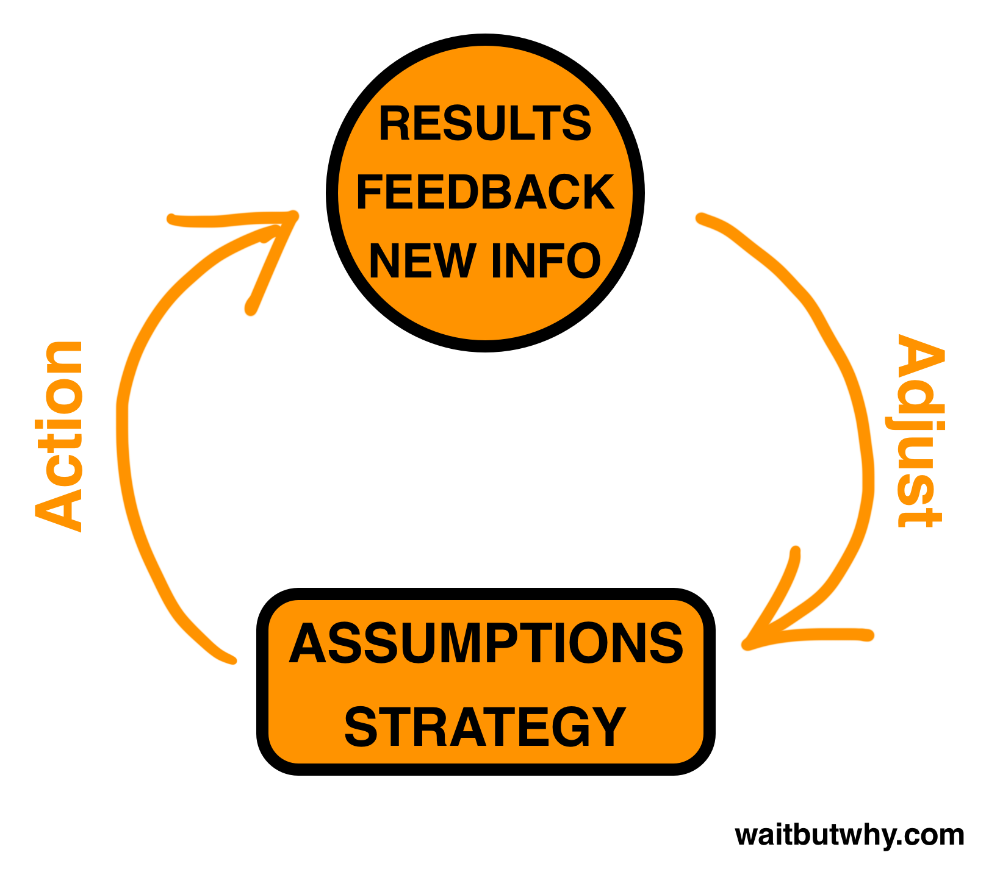](https://149909199.v2.pressablecdn.com/wp-content/uploads/2018/04/Chef-Strategy-Loop-1.png)

…while cooks improve at a snail’s pace, because their strategy is just following a recipe which itself barely changes.  

......而厨师们的进步却像蜗牛爬行，因为他们的策略只是沿用食谱，而食谱本身几乎不会改变。  

What’s more, in a world where career games are constantly evolving and morphing, the chef’s tactics can evolve in real time and keep up.  

更重要的是，在职业游戏不断发展和变形的世界里，厨师的战术也能实时发展，与时俱进。  

Meanwhile, the cook’s recipe just grows more and more outdated—a problem they remain oblivious to.  

与此同时，厨师的食谱却越来越过时，而他们却对这个问题熟视无睹。  

This is why I’m pretty convinced that at least for less traditional careers, your level of chefness is the single most important factor in determining your pace of improvement.  

这就是为什么我坚信，至少对于不那么传统的职业来说，你的厨师水平是决定你进步速度的最重要因素。

**Your work ethic.** This one is obvious.  

你的职业道德。这一点显而易见。  

Someone who works on their career 60 hours a week, 50 weeks a year, is going to move down the path almost four times faster than someone who works 20 hours a week, 40 weeks a year.  

一个每周工作 60 小时、每年工作 50 周的人，在职业道路上前进的速度几乎是每周工作 20 小时、每年工作 40 周的人的四倍。  

Someone who chooses a balanced lifestyle will move slower than a single-minded workaholic.  

选择平衡生活方式的人，会比一心工作的人走得慢。  

Someone with a propensity towards laziness or procrastination is going to lose a lot of ground to someone who’s good at putting in consistent work days.  

一个有懒惰或拖延倾向的人，会比一个善于坚持工作日的人输掉很多。  

Someone who frequently breaks from work to daydream or pick up their phone is going to get less done in each work hour than someone who practices deep focus.  

如果一个人经常在工作之余做白日梦或拿起手机，那么他在每个工作小时内完成的工作就会比深度专注的人少。

**Your natural abilities.** Talent does matter.  

你的天赋能力。天赋的确很重要。  

Smarter, more talented people will improve at a game at a faster rate than less naturally gifted people.  

更聪明、更有天赋的人会比天赋较差的人在游戏中进步得更快。  

But intelligence and talent are only two types of natural ability that come into play here.  

但是，智力和天赋只是其中的两种自然能力。  

Cleverness and savvy matter too, and those qualities don’t always correlate with raw intelligence.  

聪明和精明也很重要，而这些品质并不总是与原始智力相关联。  

Depending on the type of career, social skills can be critically important as well.  

根据职业类型的不同，社交技能也至关重要。  

In many careers, likable (or subtly manipulative) people have a big advantage over less likable people—and those who enjoy socializing will put in more people hours over time, and build deeper relationships, than antisocial types.  

在许多职业中，讨人喜欢（或善于操纵）的人比不讨人喜欢的人更有优势--喜欢社交的人会比反社会型的人投入更多的人际时间，建立更深的人际关系。

Other things, like existing connections, existing resources, and existing skills matter, of course, but they’re not components of pace—they’re part of the location of point A.  

当然，其他东西，如现有的联系、现有的资源和现有的技能也很重要，但它们不是速度的组成部分，而是 A 点位置的一部分。

**Persistence  

坚持不懈**

When I say persistence, I’m referring to long-term persistence (as opposed to day-to-day work ethic).  

我说的 "坚持"，指的是长期的坚持（而不是日复一日的工作态度）。  

Persistence is simpler than pace.  

坚持比步伐更简单。  

The more years you’re willing to commit to chasing a star, the farther along the road towards the star you’ll get.  

你愿意投入追星的时间越长，你就能在追星的道路上走得越远。  

A car going 30 mph that quits driving after 15 minutes gets a lot less far than a car that drives 10 mph for two hours.  

一辆时速 30 英里的汽车在行驶 15 分钟后就停止了行驶，其行驶距离要比一辆时速 10 英里的汽车行驶两小时少得多。

And this is why persistence is so important.  

这就是为什么坚持是如此重要。  

Someone who has decided they’re only willing to give a dream career a shot for three years before they’ll go for their fallback plan has essentially disqualified themselves from a chance at their dreams. It doesn’t matter how awesome you are—if you’ll give up after two or three years of not breaking through, you’re unlikely to succeed.  

一个人如果决定自己只愿意为梦想的事业奋斗三年，然后再去选择退路，那么他基本上就失去了实现梦想的机会。不管你有多棒，如果你在两三年内没有突破就放弃，那你就不可能成功。  

A few years is just not enough time to traverse the typically long distances it takes to get to the raddest success stars, no matter how impressive your pace.  

无论你的速度多么惊人，几年的时间都不足以走完通往最光芒四射的成功之星的漫长路程。

**Your Real Strengths and W****eaknesses**  

你真正的优势和劣势

With our pace-times-persistence equation in mind, let’s revisit the concept of strengths and weaknesses.  

有了 "速度-时间-持续时间 "的等式，我们再来看看 "优势和劣势 "的概念。  

It’s not that “strengths and weaknesses” is a bad concept—it’s that we think about it all wrong.  

并不是 "优缺点 "这个概念不好，而是我们想错了。  

When we list our strengths, we tend to list our areas of existing skill more than anything else.  

当我们列出自己的优势时，我们往往更倾向于列出自己现有的技能领域。  

Instead, strengths should be all about pace and persistence qualities.  

相反，优势应该是节奏和坚持的品质。  

Originality or lack thereof should be a critical component of the discussion, making qualities like agility and humility (trademark chef traits) notable strengths, and qualities like stubbornness[8](https://waitbutwhy.com/2018/04/picking-career.html#) or intellectual laziness (classic cook traits) important weaknesses.  

原创性或缺乏原创性应成为讨论的重要组成部分，使敏捷和谦逊等品质（厨师的标志性特征）成为显著的优势，而固执8 或智力懒惰等品质（厨师的典型特征）则成为重要的劣势。  

The subtleties of work ethic, like a knack for deep focus or a propensity to procrastinate, should also be a major part of the discussion, as should natural abilities beyond talent, like savvy and likability.  

职业道德的微妙之处，如专注的诀窍或拖延的倾向，也应该是讨论的主要部分，天赋之外的自然能力，如精明和讨人喜欢，也应该是讨论的主要部分。  

Qualities related to persistence, like resilience and determination and patience, should be thought of as promising strengths, while a social tentacle clamoring to appear successful as quickly as possible should be viewed as a bright red flag.  

与坚持不懈有关的品质，如韧性、决心和耐心，应被视为有前途的长处，而急于尽快获得成功的社会触角则应被视为鲜红的旗帜。

Most importantly, these items shouldn’t be discussed as a snapshot of where they are now, but rather in terms of your _potential for improvement_ in each of them.  

最重要的是，在讨论这些项目时，不应将其作为目前状况的缩影，而应考虑到您在每个项目上的改进潜力。  

If you handed 25-year-old Michael Jordan a basketball for the first time, he’d suck.  

如果你第一次把篮球交给 25 岁的迈克尔-乔丹，他一定会很逊。  

But calling basketball a “weakness” of his would be getting it very wrong.  

但如果说篮球是他的 "弱点"，那就大错特错了。  

Instead, you’d want to watch him practice over the next six weeks and evaluate the slope of his improvement.  

相反，你会希望在接下来的六周里观察他的训练，评估他的进步幅度。  

This lesson applies to specific skills—but most general pace and persistence qualities can _also_ be worked on and improved if you focus on them.  

这一课适用于特定的技能，但如果你集中精力，大多数一般的步伐和坚持品质也可以得到锻炼和提高。

**Filling in the Reality Box  

填写现实框**

Your true Reality Box would literally include all career paths for which you think a highly improved version of yourself could, with an entire lifetime of effort, reach the minimum star you’d be comfortable defining as success.  

你真正的 "现实盒子 "将包括所有的职业道路，在这些道路上，你认为经过高度改进的自己可以通过一生的努力，达到你认为可以定义为成功的最低星级。  

This would be an impossibly big list, only ruling out paths that are clearly far too long for you to traverse at your maximum possible pace on the path (like me chasing a career as an Olympic figure skater).  

这将是一个大得不可能再大的清单，只能排除那些显然太长，你无法以最大可能的速度走完的道路（比如我追逐奥运花样滑冰运动员的职业生涯）。  

But it’s still useful to pause for a minute and reflect on the vast extent of your full Reality Box—just acknowledging how many options are truly open to you can put you in the right mindset.[9](https://waitbutwhy.com/2018/04/picking-career.html#)  

但是，静下心来思考一下你的 "现实之箱 "到底有多大，还是很有帮助的--只 要承认有这么多选择真正向你敞开，就能让你保持正确的心态9。

So to be a bit more efficient, let’s worry about the parts of the Reality Box that might actually end up in your Option Pool (the middle of the Venn diagram where the Want and Reality Boxes overlap).  

因此，为了提高效率，让我们来关注一下现实框中可能最终会出现在你的选项池（维恩图中间，旺旺框和现实框重叠的地方）中的部分。  

To complete our Reality Box audit with that caveat, we need to evaluate:  

为了完成对 "现实之箱 "的审计，我们需要进行评估：

**1) The general landscape.** Take our best crack at evaluating the world’s current career landscape—the full range of options available (or create-able).  

1) 总体情况。尽我们最大的努力来评估当前世界的职业前景--现有的（或可创造的）各种选择。

**2) Specific game boards.** For any careers that sound remotely interesting, ponder what the deal might be with that career’s current game board—the parties involved, the way success seems to be happening for others recently, the most up-to-date rules of the game, the latest new loopholes that are being exploited, etc.  

2) 具体的游戏规则。对于任何听起来有点意思的职业，思考一下该职业当前的游戏规则可能是什么--参与方、最近其他人成功的方式、最新的游戏规则、最新被利用的新漏洞等。

**3) Starting point.** For those paths, evaluate your starting point, based on your current skills, resources, and connections relevant to that field.  

3) 起点。对于这些途径，请根据与该领域相关的现有技能、资源和人脉，评估自己的起点。

**4) Success point.** Think about end points and where on each line your star should be placed.  

4) 成功点。考虑终点以及星星应放在每行的哪个位置。  

Ask yourself what’s the minimum level of success you’d need to achieve in order to feel happy about having chosen that career path.  

问问自己，要想为选择了这条职业道路而感到高兴，你至少需要取得多大的成功。

**5) Your pace.** Make an initial estimate for what your pace of improvement might be on these various game boards, based on your current pace-related strengths and how much you think you can improve at each of them (in other words, how much your speed might be able to _accelerate_).  

5) 你的速度。根据你目前在速度方面的优势，以及你认为你在每个游戏板上可以提高多少（换句话说，你的速度可以加快多少），初步估计一下你在这些游戏板上的提高速度。

**6) Your level of persistence.** Evaluate the amount of time you think you’ll be willing to put into each of these respective paths.  

6) 你的坚持程度。评估你认为自己愿意在每条道路上投入的时间。

Now it’s just math.  

现在只剩下数学了。  

You take your game board and make it a line, you plot starting points and success stars that together generate the various distances in front of you, and for each, you multiply your pace by your level of persistence.  

你要把游戏板变成一条线，你要画出起点和成功之星，它们共同产生你面前的各种距离，对于每一个距离，你都要用你的速度乘以你的坚持程度。  

If it seems like the product of your pace and persistence for a given career path might be able to measure up to the path’s total length, that career lands in your Reality Box.  

如果你在某条职业道路上的步伐和毅力似乎能够达到这条道路的总长度，那么这条职业道路就会进入你的 "现实之箱"。  

Of course, it’s impossible to get exact values for any of the above factors, but it’s good to at least know the equation you’re working with.  

当然，我们不可能得到上述任何因子的精确值，但至少要知道你正在使用的等式。

A from-first-principles Reality Box audit may bring some overly optimistic people down to Earth, but I suspect that for most, an audit will leave them feeling like they have a lot more options than they realized, empowering them to set their sights on a bolder direction.  

从第一原则出发的 "现实盒子 "审计可能会让一些过于乐观的人回归现实，但我猜想，对大多数人来说，审计会让他们感觉到，他们拥有的选择比他们意识到的要多得多，使他们有能力把目光投向更大胆的方向。

A good Reality Box reflection warrants yet another Want Box reflection.  

一个好的 "现实盒子 "反思需要另一个 "愿望盒子 "反思。  

Reframing a bunch of career paths in your mind will affect your level of yearning for some of them.  

在脑海中重塑一系列职业道路会影响你对其中一些职业道路的向往程度。  

One career may seem less appealing after reminding yourself that it will entail thousands of hours of networking or multiple decades of pre-success struggle.  

在提醒自己某项职业需要花费数千小时的人际关系网络或数十年的成功前奋斗之后，这项职业似乎就不那么吸引人了。  

Another may seem less daunting after changing your mind about how much luck is actually involved.  

在改变了对运气的实际作用的看法之后，另一种方法可能看起来不那么令人生畏了。  

There will be other career paths you hadn’t considered wanting because you hadn’t considered them as real options, but some deep reflection has opened your mind to them.  

还会有其他职业道路是你不曾考虑过的，因为你没有把它们当作真正的选择，但一些深刻的思考让你对它们敞开了心扉。

This brings us to the end of our long, two-part deep dive.  

至此，我们漫长的两部分深入探讨告一段落。  

After a fairly exhausting box-auditing process, we can return to our Venn[10](https://waitbutwhy.com/2018/04/picking-career.html#) diagram.  

在进行了相当详尽的方框审核之后，我们可以回到维恩 10 图。

Assuming some things have changed, you have a new Option Pool to look at—a new list of options on the table that seem both desirable to your high-priority rankings and possible to achieve.  

假定有些事情发生了变化，你就有了一个新的备选方案库--一个摆在桌面上的新的备选方案清单，这些方案看起来既符合你的高优先级排名，又有可能实现。  

We’re ready now to return to where we were before we started our analysis: the present moment.  

现在，我们准备好回到开始分析之前的状态：当下。  

With these options in front of us, we’re ready to lift our heads up out of analysis and look forward into the future.  

有了这些选择，我们已经准备好从分析中抬起头来，展望未来。

**Connecting the Dots into the Future  

连接未来**

It’s time to bring back your Career Plans map that I made you put down at the beginning of the post—the one with the arrow or the question mark.  

现在是时候把我在文章开头让你放下的职业规划图--带箭头或问号的那张拿回来了。  

If there had been a clear arrow on your map before your audit, check out your new Option Pool.  

如果在审计之前，您的地图上有一个清晰的箭头，请查看新的选项池。  

Given everything you’ve reflected upon, does your current career plan still qualify to be there?  

鉴于您所反思的一切，您目前的职业规划是否仍符合条件？  

If so, congrats—you’re ahead of most of us.  

如果是这样，恭喜你--你走在了我们大多数人的前面。

If not, well that’s shitty news, but it’s also good news.  

如果没有，那就是个坏消息，但也是个好消息。  

Remember, going from a false arrow to a question mark is always major progress in life.  

请记住，从一个假箭头到一个问号，总是人生的一大进步。

[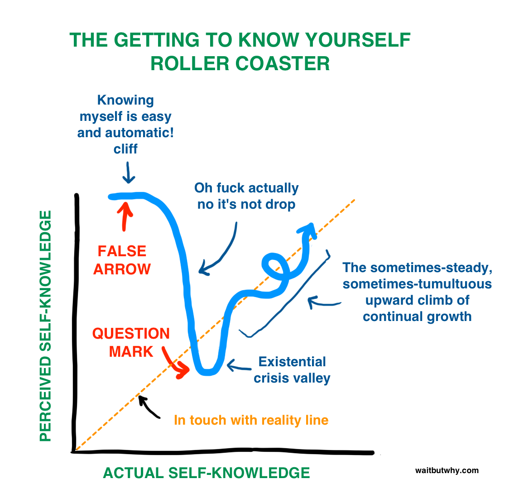](https://149909199.v2.pressablecdn.com/wp-content/uploads/2018/04/roller-coaster-2-2.png)

And actually, a new question mark implies having made the key cliff jump on _two_ roller coasters: getting to know yourself and getting to know the world.  

实际上，一个新的问号意味着在两个过山车上完成了关键的悬崖跳跃：认识自己和认识世界。  

Major step in the right direction. Cross out the arrow and join the question mark crowd.  

朝着正确方向迈出的重要一步。划掉箭头，加入问号人群。

Now the question mark crowd has a tough choice. You gotta pick one of the arrows in the Option Pool.  

现在，问号人群有了一个艰难的选择。你必须在选项池中选择一个箭头。

It’s a tough choice—but it should be _way less tough_ than it is. Here’s why:  

这是一个艰难的选择--但它不应该那么艰难。原因就在这里：

Careers used to be kind of like a 40-year tunnel.  

过去，职业生涯就像一条长达 40 年的隧道。  

You picked your tunnel, and once you were in, that was that.  

你选好你的隧道，一旦你进去了，一切就结束了。  

You worked in that profession for 40 years or so before the tunnel spit you out on the other side into your retirement.  

你在那个行业工作了 40 年左右，然后隧道把你从另一边吐出来，进入退休生活。

[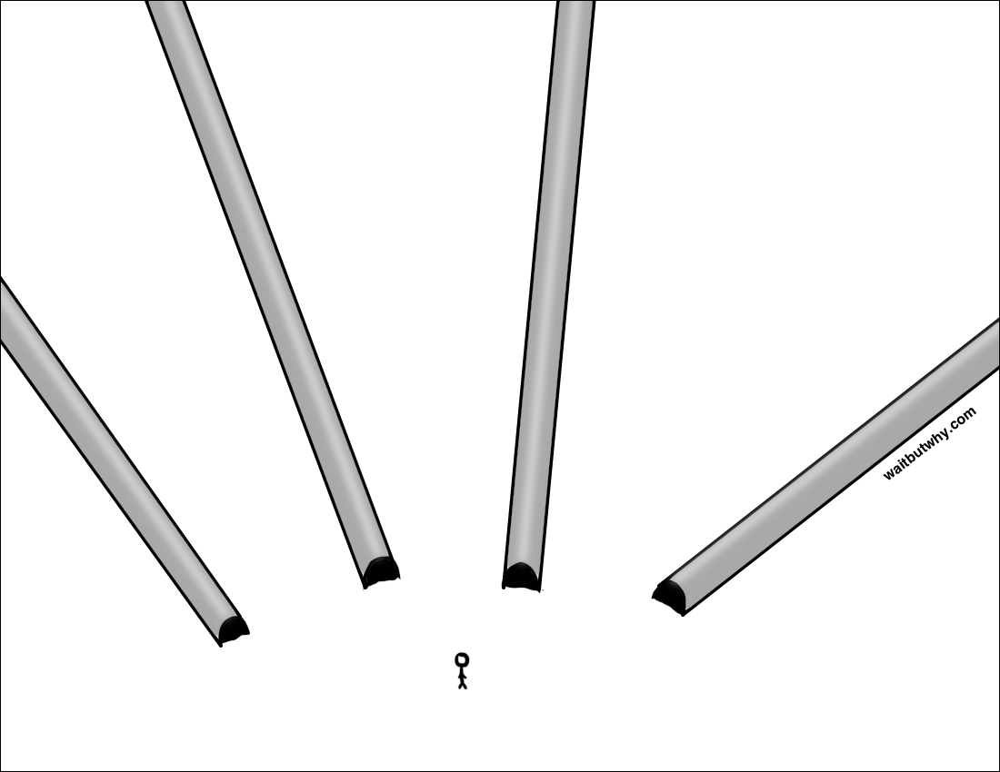](https://149909199.v2.pressablecdn.com/wp-content/uploads/2018/04/tunnels-2.png)

The truth is, careers have probably never really functioned like 40-year-tunnels, they just seemed that way.  

事实上，职业生涯可能从未像 40 年隧道那样真正运行过，只是看起来是这样而已。  

At best, traditional careers of the past played out _kind_ of like tunnels.  

充其量，过去的传统职业就像隧道一样。

Today’s careers—especially the less traditional ones—are really really not like tunnels.  

如今的职业，尤其是不太传统的职业，真的真的不像隧道。  

But crusty old conventional wisdom has a lot of us still viewing things that way, which makes the already hard job of making big career path choices much harder.  

但是，陈旧的传统观念让我们中的很多人仍然这样看待问题，这让我们在做出重大职业道路选择时变得更加困难。

When you think of your career as a tunnel, it causes an identity crisis in anyone who doesn’t feel sure of who exactly they are and who they’ll want to be decades from now—which is most sane people.  

当你把自己的职业生涯视为一条隧道时，就会给那些不确定自己到底是谁以及几十年后想成为谁的人带来身份危机--大多数正常人都是这样。  

It enhances the delusion that what we do for work is a synonym for who we are, making a question mark on your map seem like an existential disaster.  

它强化了一种错觉，即我们的工作就是我们是谁的同义词，让地图上的一个问号看起来像是一场生存灾难。

When you think of your career as a tunnel, the stakes to make the right choice seem so high that it explodes the feeling of tyranny of choice.  

当你把自己的职业生涯看作是一条隧道时，做出正确选择的风险就显得如此之高，以至于让人产生选择的暴虐感。  

For perfectionist types especially, this can be utterly paralyzing.  

特别是对于完美主义类型的人来说，这可能会让他们彻底瘫痪。

When you think of your career as a tunnel, you lose the courage to make a career switch, even when your soul is begging for it.  

当你把自己的职业生涯视为一条隧道时，你就会失去转行的勇气，即使你的灵魂在乞求转行。  

It makes switching careers feel incredibly risky and embarrassing, and it suggests that someone who does so is a failure.  

这让人觉得转行风险极大、令人尴尬，而且暗示转行的人是失败者。  

It also makes all kinds of multi-faceted, vibrant, mid-career people feel like they’re too old to make a bold switch or start a whole new path afresh.  

这也让各种多才多艺、朝气蓬勃的中年人觉得自己已经老了，不能再进行大胆的转变或重新开始全新的道路。

But conventional wisdom still tells many of us that careers are tunnels.  

但传统观念仍然告诉我们许多人，职业生涯是一条隧道。  

As the icing on its shit cake—on top of helping us yearn for things we don’t actually want, deny yearnings that we feel deep down, fear things that aren’t dangerous, and believe things about the world and our potential that aren’t accurate—conventional wisdom tells us that careers are a tunnel to help us daunt the shit out of ourselves unnecessarily.  

传统智慧告诉我们，职业是一条隧道，帮助我们无谓地让自己陷入困境，而这正是其狗屎蛋糕上的糖衣。

Today’s career landscape isn’t a lineup of tunnels, it’s a massive, impossibly complex, rapidly changing science laboratory.  

今天的职业环境并不是一排排隧道，而是一个庞大、复杂、瞬息万变的科学实验室。  

Today’s people aren’t synonymous with what they do—they’re impossibly complex, rapidly changing scientists.  

今天的人们已不再是他们所从事工作的代名词--他们是无比复杂、瞬息万变的科学家。  

And today’s career isn’t a tunnel, or a box, or an identity label—it’s a long series of science experiments.  

今天的职业生涯不是一条隧道、一个盒子或一个身份标签，而是一系列漫长的科学实验。

Steve Jobs [compared](https://www.youtube.com/watch?v=UF8uR6Z6KLc) life to connecting the dots, pointing out that while it’s easy to look at your past and see how the dots connected to lead you to where you are, it’s basically impossible in life to connect the dots forwards.  

乔布斯把人生比作 "连点成线"，他指出，回顾自己的过去，看看这些点是如何连接起来把你带到现在这个位置的，这很容易，但在生活中，要把这些点向前连接起来，基本上是不可能的。

If you look at the biographies of your heroes, you’ll see that their paths look a lot more like a long series of connected dots than a straight and predictable tunnel.  

如果你看看你的英雄们的传记，你会发现他们的人生道路更像是一长串相连的点，而不是一条笔直的、可预测的隧道。  

If you look at yourself and your friends, you’ll probably see the same trend—according to [data](https://web.archive.org/web/20170420130623/https://www.bls.gov/news.release/tenure.nr0.htm), the median time a young person stays in a given job is only 3 years (older people spend a longer time on each dot, but not that much longer—10.4 years on average).  

如果你看看自己和身边的朋友，你可能会发现同样的趋势--根据数据显示，年轻人在一份特定工作上停留的时间中位数仅为 3 年（年长者在每个点上花费的时间更长，但也没有那么长--平均为 10.4 年）。

So seeing your career as a series of dots isn’t a mental trick to help you make decisions—it’s an accurate depiction of what’s actually happening.  

因此，把你的职业生涯看成一连串的点并不是帮助你做决定的心理技巧，而是对实际情况的准确描述。  

And seeing your career as a tunnel isn’t just unproductive—it’s delusional.  

把自己的职业生涯看成是一条隧道，这不仅是无益的，而且是一种妄想。

Likewise, you’re limited to focusing mainly on the next dot on your path—because it’s the only dot you _can_ figure out.  

同样，你也只能把主要精力放在路径上的下一个点上--因为这是你唯一能想到的点。  

You don’t have to worry about dot #4 because you can’t anyway—you’re literally not qualified to do so.  

你不必担心第 4 点，因为无论如何你都做不到--你根本没有资格这么做。

By the time dot #4 rolls around, you will have learned stuff about yourself you don’t know now.  

当第 4 个点到来时，你将了解到现在还不了解的自己。  

You’ll also have changed from who you are now, and your Yearning Octopus will reflect those changes.  

与现在的你相比，你也会发生变化，你的渴望八达通也会反映出这些变化。  

You’ll know a lot more than you currently do about the career landscape and the specific game boards you’re interested in, and you’ll have become a much better game player.  

你会比现在更了解职业前景和你感兴趣的特定游戏板块，你也会成为一个更好的游戏玩家。  

And of course, that landscape—and those game boards—will have themselves evolved.  

当然，这些景观和游戏板本身也在不断演变。

The fantastic website [80,000 Hours](https://80000hours.org/) (which exists to help young, talented people work through their career choices) has compiled a lot of data to back this up: data on the fact that [you’ll change](https://80000hours.org/2015/02/we-change-more-than-we-expect-so-keep-your-options-open/), that [the world will change](https://80000hours.org/2015/02/which-careers-will-be-automated/), and that [you’ll only learn with time what you’re actually good at](https://80000hours.org/career-guide/personal-fit/). Popular psychologist Dan Gilbert also eloquently [describes](http://www.randomhouse.com/kvpa/gilbert/) just how bad we are at predicting what will make us happy in the future.  

一个名为 "80,000 小时 "的神奇网站（该网站旨在帮助有才华的年轻人进行职业选择）收集了大量数据来证明这一点：数据表明，你会改变，世界也会改变，只有随着时间的推移，你才会知道自己真正擅长什么。著名心理学家丹-吉尔伯特（Dan Gilbert）也雄辩地描述了我们是多么不善于预测什么会让我们在未来感到快乐。

Pretending you can figure out what dot #2 or #4 or #8 should be now is laughable.  

假装你现在就能想出 2 号、4 号或 8 号点应该是什么，实在是可笑。  

Future dots are the worry of a future, wiser you living in a future world. So let’s focus on dot #1.  

未来的点是对未来的担忧，是对生活在未来世界中更智慧的你的担忧。因此，让我们关注 1 号点。

If we’re thinking of ourselves as scientists and of society as a science lab, we should think of your current freshly revised Want-Reality Venn Diagram as nothing more than an early, rough hypothesis.  

如果我们把自己当作科学家，把社会当作科学实验室，那么我们就应该把你现在新修订的 "愿望-现实 "维恩图看作是一个早期的粗略假设而已。  

Dot #1 is your chance to test it out.  

1 号点是您测试的机会。

Hypothesis testing is intuitive in the dating world.  

假设检验在约会领域非常直观。  

If a friend were toiling over what kind of person she wants to marry but never went out with anyone, you’d tell her, “You can’t figure this out on your couch—you’ve gotta start going on dates, and that’ll teach you what you want in a partner.” If that friend then went on a solid first date and returned home to toil for hours about whether or not this new person was The One, you’d again have to correct her.  

如果一个朋友苦苦思索她想嫁给什么样的人，却从未与任何人约会过，你会告诉她："你不能在沙发上想清楚，你必须开始约会，那会让你知道你想要什么样的伴侣。"如果这位朋友第一次约会很顺利，回到家却为这个新对象是否是自己的真命天子纠结了几个小时，你又得纠正她了。  

You’d say, “There’s no way you can know that from just one date!  

你会说，"你不可能只通过一次约会就知道！  

You have to get some experience dating this person to learn what you need to learn to make that decision.”  

你必须有一些与这个人约会的经验，才能了解你需要了解什么，从而做出这个决定"。

We can all agree that this hypothetical friend is pretty nuts and is lacking a fundamental understanding of how you find a happy relationship.  

我们都同意，这位假想的朋友是个疯子，他对如何找到一段幸福的关系缺乏基本的了解。  

So let’s not be like her when it comes to picking our career.  

所以，在选择职业时，我们不要像她一样。  

Dot #1 is a chill situation—it’s just a first date.  

Dot #1是一种冷淡的情况--这只是第一次约会。

This is awesome news—because it makes it a lot less scary to draw an arrow on your map if it’s only an arrow to dot #1 of your future.  

这真是个好消息--因为如果你在地图上画的箭头只是指向你未来的 1 号点，那就不那么可怕了。  

The real cause of tyranny of choice is accurately seeing the sheer number of options you have in today’s world while delusionally seeing those careers as the 40-year tunnels of yesterday’s world.  

选择暴政的真正原因在于，你准确地看到了当今世界的大量选择，却妄想将这些职业视为昨日世界的 40 年隧道。  

That’s a lethal combo.  

这是一个致命的组合。  

Reframing your next major career decision as a far lower-stakes choice makes the number of options exciting, not stressful.  

将你的下一个重大职业抉择重塑为一个风险小得多的选择，会让你对选择的数量感到兴奋，而不是紧张。

And that’s all great in theory. But now comes the hard part.  

理论上这一切都很好。但现在困难的部分来了。

**Making Your Move  

搬家**

You’ve reflected and reflected and reflected and weighed and measured and predicted and considered.  

你反思了又反思，权衡了又权衡，衡量了又衡量，预测了又预测，考虑了又考虑。  

You’ve chosen a dot and drawn an arrow. And now you have to actually make the move.  

你选择了一个点，画了一个箭头。现在，你必须实际行动起来。

We’re super bad at this. We’re frightened people.  

我们在这方面超级差劲。我们是害怕的人  

We don’t like icky things and making a bold, real-life step is icky.  

我们不喜欢恶心的东西，而在现实生活中迈出大胆的一步就是恶心的。  

If there’s any ounce of procrastination susceptibility in us, here’s where it’ll show itself.  

如果我们身上有一丝一毫的拖延症倾向，那么它就会在这里表现出来。

The Yearning Octopus can help.  

渴望的章鱼》可以提供帮助。  

As we discussed earlier, your behavior at any given point simply displays the configuration of your octopus.  

正如我们前面所讨论的，你在任何给定点的行为都只是显示章鱼的配置。  

If you’ve decided on a life step and you can’t quite take it, it’s because the parts of you that don’t want to make a move are ranked higher in your subconscious than the parts of you that do.  

如果你已经决定了人生的某一步，却无法迈出去，那是因为在你的潜意识中，不想迈出去的部分比想迈出去的部分排得更靠前。  

Your conscious mind may have tried to assign lower shelf ratings to the parts of your octopus that lean towards inertia, but your yearnings have rebelled.  

你的意识可能试图给你的章鱼中偏向惰性的部分分配较低的货架等级，但你的渴望反抗了。  

You’re a CEO not in control of their staff.  

你是一个无法控制员工的首席执行官。

To fix this problem, think like a kindergarten teacher.  

要解决这个问题，就要像幼儿园老师一样思考。  

In your class, a faction of the 5-year-olds is rebelling against your wishes. What do you do?  

在你的班级里，有一派 5 岁的孩子在反抗你的意愿。你该怎么办？

Go talk to the 5-year-olds that are causing the trouble.  

去找那些制造麻烦的五岁小孩谈谈吧。  

They’re unpleasant, defiant simpletons, but they can still be reasoned with.  

他们是不讨人喜欢、目中无人的傻瓜，但还是可以跟他们讲道理的。  

Talk to them about why you’ve ranked them lower than others in the octopus hierarchy.  

跟他们谈谈为什么你把他们排在章鱼等级制度中比其他人低的位置。  

Describe to them the insights you gained from your Reality Box reflection.  

向他们描述你从 "现实盒子 "反思中获得的启示。  

Remind them about how connecting the dots works and about the chillness of dot #1. You’re the teacher—figure it out.  

提醒他们连线的原理，以及 1 号点的寒意。你是老师--想办法。

The older I get, the clearer it becomes that our internal battle as the kindergarten teachers of our mind is like 97% of life’s struggle.  

随着年龄的增长，我越来越清楚地认识到，作为幼儿园老师，我们的内心斗争就像人生中 97% 的挣扎一样。  

The world is easy—_you’re_ difficult.  

世界很简单，你却很难。  

If you find yourself continually not executing your plans in life and your promises to yourself, you’ve uncovered your new #1 priority—becoming a better kindergarten teacher.  

如果你发现自己总是无法执行自己的人生计划和对自己的承诺，那么你就发现了自己的新头等大事--成为一名更好的幼儿园教师。  

Until you do, your life will be run by a bunch of primitive, short-sighted 5-year-olds, and your whole shit will suck.  

如果你不这样做，你的生活就会被一群原始、目光短浅的 5 岁孩童所掌控，你的生活就会一团糟。  

Trust me, I know.  

相信我，我知道。

If your inner analysis does call for a career leap to a new dot, I hope that at some point, you’re able to make the jump.  

如果你的内心分析确实要求你的职业生涯飞跃到一个新的点，我希望在某个时刻，你能够实现跳跃。

**After the Move  

搬迁之后**

Jumping to a new dot is a liberating feeling, usually side by side with some substantial internal havoc.  

跳到一个新的点是一种解放的感觉，通常伴随着一些实质性的内部破坏。

First of all, for a while at least, you’ll probably suck at what you’re doing on your new dot.  

首先，至少在一段时间内，你可能会很不擅长在新点上做什么。  

While your wise self will know that’s exactly how it should be, your less wise selves will go into full existential meltdown mode.  

聪明的你会知道事情就应该是这样，而不那么聪明的你则会进入完全的生存崩溃模式。  

All of the fears you so thoughtfully deprioritized in your octopus ranking will think someone is murdering them and they’ll start trying to call 911. The yearnings you did prioritize won’t be feeling much gratification yet, and they’ll wonder if they were wrong all along about what they thought they wanted.  

你在章鱼排序中深思熟虑地取消了优先级的所有恐惧都会认为有人在谋杀他们，他们会开始试图拨打 911。你优先考虑的渴望还不会有太多满足感，他们会怀疑自己的想法是否一直都是错的。  

The yearnings you didn’t prioritize will get out the guitar and start singing love songs for the greener-seeming grass you deprived them of.  

你没有优先考虑的渴望会拿出吉他，开始为你剥夺的看似更绿的草地唱情歌。  

It won’t be much fun.  

那就没什么意思了。

Even if things do go well, you’ll be quickly reminded of the fact that the Yearning Octopus is a generally unhappy creature.  

即使一切顺利，你也会很快意识到，渴望年华的章鱼是一种普遍不快乐的生物。  

Core pieces of the octopus will feel neglected or even assaulted, and every day that goes by, you’ll be bearing the opportunity cost of the paths you were considering but chose not to walk down—the versions of you in parallel universes where you made other choices.  

章鱼的核心部分会感到被忽视，甚至受到攻击，而每过一天，你都要为你考虑过但选择不走的路承担机会成本--你在平行宇宙中的版本，在那里你做出了其他选择。  

You’ll think about their hypothetical advancement in the world and worry about what you may have passed up.  

你会思考他们在世界上的假想进步，担心自己可能会错过什么。

[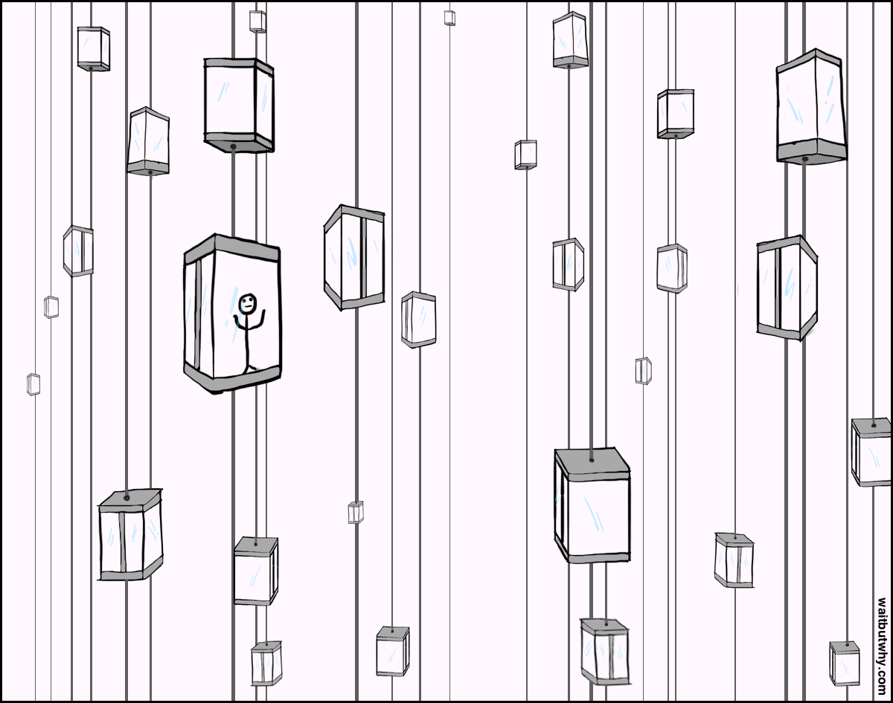](https://149909199.v2.pressablecdn.com/wp-content/uploads/2018/04/opportunity-cost-2.png)

As you get wiser, you’ll learn to view a largely unhappy octopus with acceptance.  

随着你变得越来越聪明，你会学会用接纳的态度来看待基本不快乐的章鱼。  

You’ll let it whine and get good at tuning it out, knowing that it’s whining in the exact way you planned for it to be.  

你会任由它抱怨，并善于把它调出来，因为你知道它抱怨的方式正是你计划让它抱怨的方式。

The whining octopus is a reminder of why pure, elated happiness is never a reasonable goal.  

唧唧歪歪的章鱼提醒人们，为什么纯粹的、令人欢欣鼓舞的幸福永远不是一个合理的目标。  

The times you feel pure happiness are temporary, drug-induced delusions—like the honeymoon phase of a new relationship or new job or the high following a long-awaited success.  

你感到纯粹幸福的时候是暂时的，是药物引起的错觉，就像新恋情或新工作的蜜月期，或是期待已久的成功后的兴奋。  

Those moments are the perfect golf shots of a mediocre golfer’s outing—they’re awesome, and you should enjoy the shit out of them—but they’re not the new normal, and they never will be.  

这些时刻是平庸球手出局后的完美一击--它们很棒，你应该尽情享受，但它们不是新常态，也永远不会是。

A better goal is contentment: the satisfying feeling that you’re currently taking the best crack you can at a good life path; that what you’re working on might prove to be a piece of an eventual puzzle you can feel really proud of.  

更好的目标是满足感：你会满足地感觉到，你目前正在尽你所能，在一条美好的人生道路上前进；你正在努力的事情可能会被证明是最终拼图中的一块，你可以为此感到真正的自豪。  

Chasing happiness is an amateur move.  

追逐幸福是一种业余行为。  

Feeling contentment in those times when your choices and your circumstances have combined to pull it off, and knowing you have all that you could ever ask for, is for the wise.  

当你的选择和你所处的环境合二为一时，你就会感到满足，知道自己拥有一切，这就是智者的境界。

People talk about being present in the moment, but there’s also the broader concept of macro-presence: feeling broadly present in your own life.  

人们常说 "当下在场"，但还有一个更广泛的概念，即 "宏观在场"：在自己的生活中感受广泛的在场。  

If you’re on a career dot that, when you’re being really honest with yourself, feels right, you get to stop thinking and stop planning for a while and just dig in.  

如果你的职业点，当你对自己真正诚实的时候，感觉是对的，你就可以暂时停止思考和计划，只是投入其中。  

You’ll come back to the big picture later—for now, you can put the macro picture aside, put your head down, and dedicate all of your energy to the present.  

现在，你可以把宏观画面放在一边，低下头，把全部精力投入到当下。  

For a while, you can just _live_.  

有一段时间，你可以就这样生活下去。

These moments don’t always last that long, so sink your teeth in.  

这种时刻并不总是那么长，所以要沉下心来。  

Put everything you’ve got into the dot you’ve chosen.  

把你的一切都投入到你选择的点上。  

As far as you know, you might be Michael Jordan holding his first basketball, so start playing.  

就你所知，你可能就是迈克尔-乔丹，拿着他的第一个篮球，开始玩吧。

**The Next Dot?  

下一个点？**

At some point, your good feelings about the macro picture may sour.  

在某些时候，你对宏观形势的好感可能会变差。  

And when they do, you’ll have to get back into analysis mode and figure out what, in particular, is causing the restlessness.  

一旦出现这种情况，你就必须重新进入分析模式，找出导致焦躁不安的具体原因。

Sometimes, the macro mission won’t be the problem.  

有时，宏观任务并不是问题所在。  

It’ll be that the chef in you has decided that the mission itself calls for a strategic dot jump.  

可能是你心中的大厨认为任务本身需要战略性的点跳。  

In these cases, jumping dots isn’t a release of persistence but the _stuff_ of persistence. This is the _mission-enhancing_ type of dot jump.  

在这种情况下，跳点不是坚持的释放，而是坚持的东西。这就是任务强化型跳点。

Other times, you’ll feel a darker kind of restlessness—the suspicion that you may need to change up the macro mission.  

其他时候，你会感到一种更阴暗的不安--怀疑自己可能需要改变宏观任务。  

When this happens, you’ll have to figure out if that feeling is emerging from the wise parts of you or simply from your restless, deprioritized yearnings. A _mission-changing_ dot jump may be in order, but depending on which parts of you are asking for it, it may also be the wrong move.  

当这种情况发生时，你必须弄清楚这种感觉是来自于你的智慧部分，还是仅仅来自于你躁动不安、没有优先权的渴望。改变任务的 "点跳 "可能是有必要的，但取决于你的哪些部分在要求这样做，这也可能是错误的举动。

In these moments, it’s important to consider where you tend to be on this spectrum:  

在这种时刻，考虑一下自己在这一光谱中的倾向是很重要的：

[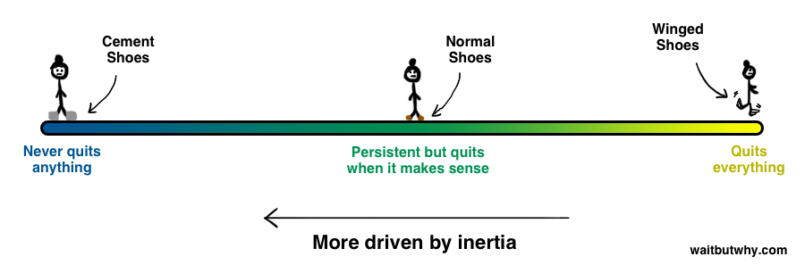](https://149909199.v2.pressablecdn.com/wp-content/uploads/2018/04/inertia-spectrum.png)

The people on the left side of this spectrum are jump-shy. The cement-footed.  

左边的人怯于跳跃。水泥脚。  

Their pitfall is staying way too long in the wrong things.  

他们的陷阱是在错误的事情上停留太久。  

The people on the right are jump-happy—the wing-footed—and they have the opposite pitfall: they’re quick quitters.[11](https://waitbutwhy.com/2018/04/picking-career.html#) (You should be especially wary of cement feet—psychologists believe that people at the end of their lives are most likely to regret living by inertia: a commonly voiced regret is [“I wish I had quit earlier,”](https://www.bakadesuyo.com/2012/12/top-career-regrets/) and the most common advice of the elderly is, “[Don’t stay in a job you dislike.](https://www.bakadesuyo.com/2013/04/most-important-life-lesson/)“)  

右边的人是跳跃快乐型--翼足型--他们有一个相反的陷阱：他们很快就放弃了。11 （你应该特别警惕水泥脚--心理学家认为，人在生命的最后阶段最有可能对惰性生活感到后悔：人们常说的一句后悔话是："我希望我早点放弃。"老年人最常说的一句忠告是："不要继续从事你不喜欢的工作。）

This is why these internal frameworks are important.  

因此，这些内部框架非常重要。  

They give you the ability to analyze the source of your impulses.  

它们能让你分析冲动的源头。  

In our example, the question is whether your impulse to jump missions is the result of genuine evolution or quick-quitter bias.  

在我们的例子中，问题在于你跳槽的冲动是真正进化的结果，还是急功近利的偏见。  

So think about your diagram.  

所以，想想你的图表吧。  

Is your restlessness just the expected incessant whining of an octopus still correctly configured?  

难道你的焦躁不安只是章鱼还在正确配置时发出的喋喋不休的抱怨？  

The weariness from a long trudge on what’s still the right path for you?  

长期跋涉所产生的疲惫感，对你来说仍然是正确的道路吗？  

Or have you learned new information about yourself or the world during the trudge that has corrected some off-base initial assumptions?  

或者说，在跋涉的过程中，你是否了解到了关于自己或这个世界的新信息，从而纠正了最初的一些错误假设？  

Or maybe something is fundamentally evolving—some blue or yellow _loop_ activity:  

或者，某些东西正在发生根本性的演变--一些蓝色或黄色的循环活动：

[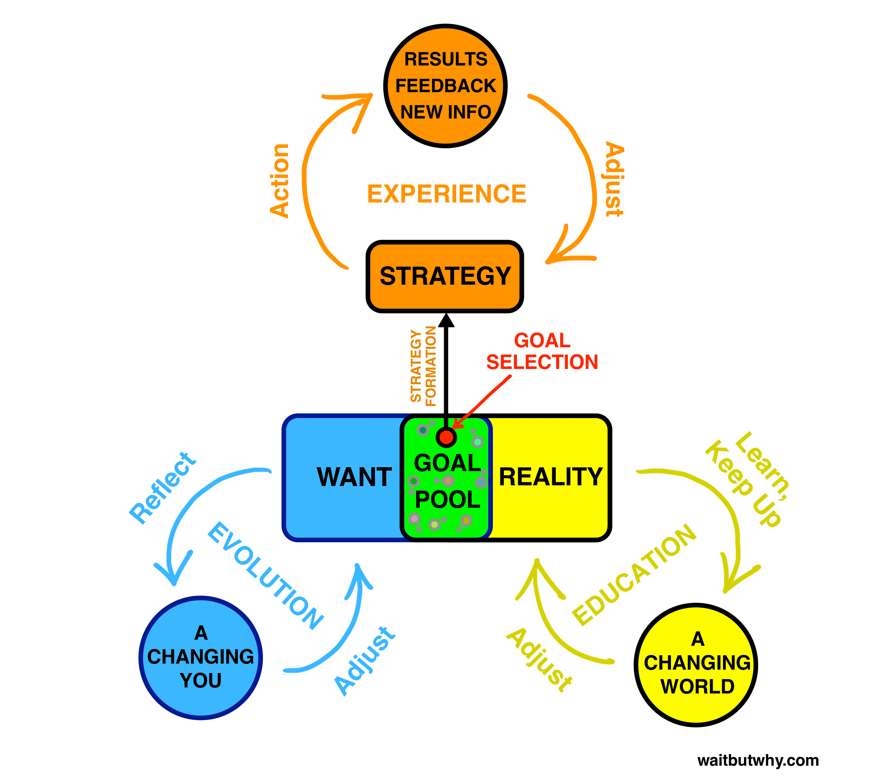](https://149909199.v2.pressablecdn.com/wp-content/uploads/2018/04/venn-with-loops-small.png)

If you feel that things have genuinely changed, you may decide to zoom out even further and think about the big red loop, which deals with fundamentally changing your mission:  

如果你觉得事情已经发生了真正的变化，你可能会决定进一步放大并思考红色大循环，这涉及到从根本上改变你的使命：

[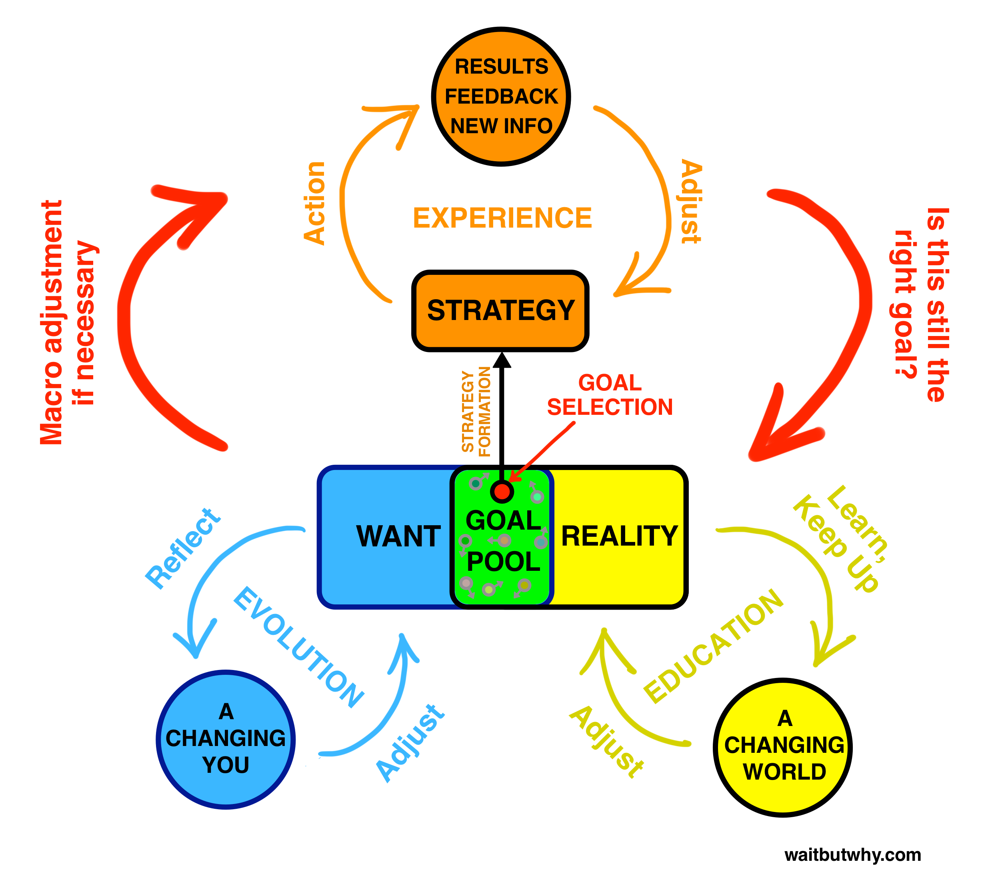](https://149909199.v2.pressablecdn.com/wp-content/uploads/2018/04/venn-with-big-loop-small.png)

If a career is like connecting the dots, we should probably rank “getting wise about dot-jumping” pretty high on our to-do list.  

如果说职业生涯就像连点成线，那么我们或许应该把 "在连点成线方面获得智慧 "列为我们的首要任务。  

The best place to start is by looking at your own past.  

最好的起点是回顾自己的过去。  

Studying your own past decisions, with the flashlight of hindsight and accumulated wisdom, is like an athlete studying game tape.  

用事后诸葛亮和积累的智慧来研究自己过去的决定，就像运动员研究比赛录像带一样。

Looking at my own past, I can see a lot of dot jumps (or, while I was still in school, career plan adjustments), and some of them look pretty unwise in retrospect.  

回顾我自己的过去，我可以看到很多点的跳跃（或者说，当我还在上学时，职业规划的调整），其中一些回想起来非常不明智。  

But the clearer a picture I can see of my past bad decisions and the thought patterns and behavioral habits that built them, the less likely I’ll be to repeat them in the future.  

但是，我对自己过去的错误决定以及造成这些决定的思维模式和行为习惯看得越清楚，我将来重复这些决定的可能性就越小。

Remembering that you’re kind of dumb is also a critical humbling exercise.  

记住自己有点笨，也是一种重要的谦卑练习。  

The insecurity of humility doesn’t feel very good, and the burden of having to continually invent your own life map is never easy—but insecurity and difficulty are the feelings of driving your own ship.  

谦卑带来的不安全感并不好受，而必须不断绘制自己的人生地图也绝非易事--但不安全感和困难正是驾驶自己的船的感受。  

It’s when we feel too good that we run the risk of becoming overconfident, intellectually complacent, and set in our ways.  

当我们感觉太好的时候，就有可能变得过于自信、自以为是、固步自封。  

It’s exactly when we think we have life all figured out that we end up losing our way.  

正是当我们自以为对生活了如指掌时，却最终迷失了方向。

\_\_\_\_\_\_\_\_\_\_\_

Over the course of your life, your good and bad decisions will collaborate to forge your unique life path.  

在你的一生中，你的好坏决定将共同铸就你独特的人生道路。  

Often on this blog, I’ve written about how irrational our fears can be and how badly they can hold us back.  

我经常在博客上写到，我们的恐惧是多么的不合理，它们会严重阻碍我们的发展。  

But we should probably embrace the fear of end-of-life regret.  

但我们或许应该接受对临终遗憾的恐惧。

I’ve thankfully never been on anything that felt like a deathbed, but it seems like there’s something about the end of life that lets people see things with clear eyes.  

庆幸的是，我从未经历过临终的感觉，但生命的尽头似乎能让人看清一些事情。  

It seems like facing death makes all of those voices in your head who aren’t actually you melt away, leaving your little authentic self standing there all alone, in reflection.  

似乎面对死亡，你脑海中那些实际上并不是你的声音都会消失，只剩下真实的小我孤零零地站在那里，进行反思。  

I think end-of-life regrets may simply be your authentic self thinking about the parts of your life you never got to live—the parts of you that someone else kicked down into your subconscious.  

我认为，生命终结时的遗憾可能只是真实的自己在思考自己生命中从未经历过的部分--那些被别人踢进潜意识的部分。

My own psyche seems to back this up—looking back on my path so far, the mistakes that bother me most are the ones that happened because someone else took the wheel of my head and overruled the quiet, insecure voice of my authentic self—the mistakes that I knew at the time, deep down, were wrong.  

我自己的心理似乎也证明了这一点，回顾我迄今为止所走过的道路，最让我困扰的错误都是因为别人控制了我的大脑，压倒了我真实自我的安静、不自信的声音--我当时就知道，在内心深处，这些错误是错误的。  

My goal for the future isn’t to avoid mistakes, it’s for the mistakes I do make to be my own.  

我未来的目标不是避免犯错，而是让我犯的错成为我自己的错。

That’s why I went through such an excruciatingly rigorous analysis in this post.  

这就是为什么我在这篇文章中进行了如此严谨的分析。  

I think this is one of those few topics in life that’s worth it.  

我认为这是生活中为数不多的值得探讨的话题之一。  

Other voices will never stop fiercely trying to live your life for you—you owe it to that little insecure character in the very center of your consciousness to get this right.  

其他的声音永远不会停止激烈地试图为你生活--为了你意识中心那个缺乏安全感的小人物，你必须做好这件事。

\_\_\_\_\_\_\_

If you like Wait But Why, sign up for our **[email list](https://newsletter.waitbutwhy.com/join)** and we’ll send you new posts when they come out.  

如果您喜欢《等一等，为什么》，请注册我们的电子邮件列表，我们会在新文章发布时发送给您。

To support Wait But Why, visit our **[Patreon page](https://patreon.com/waitbutwhy)**.  

要支持 Wait But Why，请访问我们的 Patreon 页面。

If you want to download this post for printing and offline sharing, you can [buy it here](https://gum.co/wbw-career-path).  

如果您想下载这篇文章用于打印和离线共享，可以在这里购买。

\_\_\_\_\_\_\_\_\_\_\_

**For help analyzing your situation:  

请帮助分析您的情况：**

**Some paper to write on:** [Your octopus](https://waitbutwhy.com/wp-content/uploads/2018/04/WORKSHEET-octopus-1.pdf). [Your priority shelf](https://waitbutwhy.com/wp-content/uploads/2018/04/WORKSHEET-yearning-hierarchy-1.pdf). [Some path distances](https://waitbutwhy.com/wp-content/uploads/2018/04/WORKSHEET-A-star-1.pdf). [Your career dot map](https://waitbutwhy.com/wp-content/uploads/2018/04/WORKSHEET-career-dot-map.pdf).  

一些可以写字的纸张：你的章鱼你的优先书架一些路径距离。你的职业生涯点阵图

**For those who want to dig in even further:** Alicia (WBW Manager of Lots of Things) has put together [a more involved group of worksheets](https://waitbutwhy.com/wp-content/uploads/2018/04/WBW_Career-Path_Worksheet-v4.pdf).  

对于那些想深入研究的人：艾丽西亚（WBW "万事通 "经理）整理了一组内容更丰富的工作表。

**For further exploration:  

进一步探索：**

The site [80,000 hours](https://80000hours.org/)—dedicated to helping young, high-potential people make big career choices—is an awesome resource.  

网站 "80,000 小时 "致力于帮助有潜力的年轻人做出重大职业选择，是一个非常好的资源。  

The site is run by super smart, thoughtful, forward-thinking people, and can be digested in [video](https://www.youtube.com/watch?v=iY5Vd4LH1J4&list=PL-BRtcBm4Yj6ZpOG49cbHut0gtuCEVXfk&index=2) or [book](https://www.amazon.com/80-000-Hours-fulfilling-career-ebook/dp/B01M70QISP/) format in addition to on their site.  

该网站由超级聪明、有思想、有远见的人运营，除了在网站上，还可以通过视频或书籍的形式进行消化。

I’ve been reading [Seth Godin’s blog](http://sethgodin.typepad.com/) for years.  

我读塞斯-戈丁的博客已经很多年了。  

Seth has a lot of wisdom in his head, and he doles it out in little bite-sized nuggets each morning on his blog (which I receive by email).  

塞思的脑子里有很多智慧，他每天早上都会在博客上分享这些智慧（我通过电子邮件收到）。  

A lot of Seth’s advice applies to career choices. [Here’s an example](http://sethgodin.typepad.com/seths_blog/2013/07/people-like-us-do-stuff-like-this.html) (which I adapted into one of the cartoons in this post).  

赛斯的很多建议都适用于职业选择。下面是一个例子（我把它改编成了这篇文章中的一幅漫画）。

Eric Barker’s [blog](https://www.bakadesuyo.com/) is full of actual data that can help with career choices, like [this post](https://www.bakadesuyo.com/2014/08/fulfilling-career/) on what makes a career fulfilling or [this one](https://www.bakadesuyo.com/2014/02/mentor/) on the importance of mentors.  

埃里克-巴克的博客上有很多有助于职业选择的实际数据，比如这篇关于什么让职业更充实的文章，或者这篇关于导师重要性的文章。

\_\_\_\_\_\_\_\_\_\_\_

**More Wait But Why human deep dives:  

更多 "Wait But Why "人类深潜：**

[**The Marriage Decision: Everything Forever or Nothing Ever Again  

婚姻的抉择一切永恒还是一无所有**](https://waitbutwhy.com/2016/09/marriage-decision.html)

**[Why Procrastinators Procrastinate  

拖延症患者为什么会拖延](https://waitbutwhy.com/2013/10/why-procrastinators-procrastinate.html)**

**And a post about [getting wiser](https://waitbutwhy.com/2014/10/religion-for-the-nonreligious.html)  

还有一篇关于变聪明的文章**

**And a few less self-reflect-y Wait But Why posts on:  

还有一些不那么自我反省的 "为什么等着我"（Wait But Why）帖子：**

**[Awkward social interactions  

尴尬的社交互动](https://waitbutwhy.com/2014/01/the-great-perils-of-social-interaction.html)**

**[The history of everything  

一切的历史](https://waitbutwhy.com/2013/08/putting-time-in-perspective.html)**

**[Colonizing Mars  

殖民火星](https://waitbutwhy.com/2015/08/how-and-why-spacex-will-colonize-mars.html)**
