\[_[Hacker News discussion](https://news.ycombinator.com/item?id=39709912), [LinkedIn discussion](https://www.linkedin.com/posts/chiphuyen_generativeai-aiapplications-llmops-activity-7174153467844820993-ztSE), [Twitter thread](https://twitter.com/chipro/status/1768388213008445837)_\]  

\[黑客新闻讨论、LinkedIn 讨论、Twitter 线程\]。

Four years ago, I did an analysis of the [open source ML ecosystem](https://huyenchip.com/2020/06/22/mlops.html). Since then, the landscape has changed, so I revisited the topic.  

四年前，我曾对开源 ML 生态系统进行过分析。从那时起，情况发生了变化，因此我重新审视了这个话题。  

This time, I focused exclusively on the stack around foundation models.  

这一次，我只关注基础模型的堆栈。

The full list of open source AI repos is hosted at [llama-police](https://huyenchip.com/llama-police). The list is updated every 6 hours. You can also find most of them on my [cool-llm-repos](https://github.com/stars/chiphuyen/lists/cool-llm-repos) list on GitHub.  

完整的开源人工智能软件仓库列表位于 llama-police。该列表每 6 小时更新一次。你也可以在我 GitHub 上的 cool-llm-repos 列表中找到其中大部分。

## Data  

数据

I searched GitHub using the keywords `gpt`, `llm`, and `generative ai`. If AI feels so overwhelming right now, it’s because it is. There are 118K results for `gpt` alone.  

我使用关键字 `gpt` 搜索了 GitHub, `llm` 和 `generative ai` 。.如果说人工智能现在给人的感觉是 "铺天盖地"，那是因为它确实是 "铺天盖地"。仅 `gpt` 就有11.8万个结果。

To make my life easier, I limited my search to the repos with at least 500 stars.  

为了方便起见，我将搜索范围限制在至少有 500 颗星的软件仓库。  

There were 590 results for `llm`, 531 for `gpt`, and 38 for `generative ai`. I also occasionally checked GitHub trending and social media for new repos.  

`llm` 有 590 条结果。 `llm` 有 590 条结果， `gpt` 有 531 条结果 `generative ai` 有 38 个结果。.我偶尔也会查看 GitHub 的趋势和社交媒体上的新版本库。

After MANY hours, I found 896 repos. Of these, 51 are tutorials (e.g. [dair-ai/Prompt-Engineering-Guide](https://github.com/dair-ai/Prompt-Engineering-Guide)) and aggregated lists (e.g. [f/awesome-chatgpt-prompts](https://github.com/f/awesome-chatgpt-prompts)). While these tutorials and lists are helpful, I’m more interested in software.  

经过许多小时，我找到了 896 个 repos。其中 51 个是教程（如 dair-ai/Prompt-Engineering-Guide）和汇总列表（如 f/awesome-chatgpt-prompts）。虽然这些教程和列表很有帮助，但我对软件更感兴趣。  

I still include them in the final list, but the analysis is done with the 845 software repositories.  

我仍将它们列入最终名单，但分析是针对 845 个软件仓库进行的。

It was a painful but rewarding process.  

这是一个痛苦但有意义的过程。  

It gave me a much better understanding of what people are working on, how incredibly collaborative the open source community is, and just how much China’s open source ecosystem diverges from the Western one.  

它让我更好地了解了人们正在研究什么，开源社区的协作是多么令人难以置信，以及中国的开源生态系统与西方生态系统的差异有多大。

### Add missing repos  

添加缺失的软件仓库

I undoubtedly missed a ton of repos. You can submit the missing repos [here](https://forms.gle/1ijNSnizgWQaVYK16). The list will be automatically updated every day.  

毫无疑问，我遗漏了很多软件仓库。您可以在这里提交遗漏的软件仓库。该列表将每天自动更新。

Feel free to submit the repos with less than 500 stars.  

请随意提交少于 500 颗星的软件仓库。  

I’ll continue tracking them and add them to the list when they reach 500 stars!  

我会继续跟踪它们，并在它们达到 500 颗星时将它们添加到列表中！

## The New AI Stack  

新的人工智能堆栈

I think of the AI stack as consisting of 4 layers: infrastructure, model development, application development, and applications.  

我认为人工智能堆栈由 4 层组成：基础设施、模型开发、应用开发和应用程序。

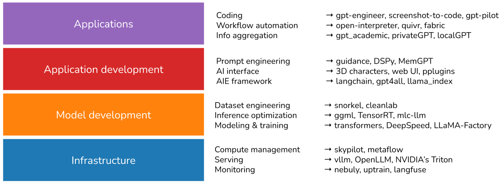

1.  **Infrastructure  
    
    基础设施**
    
    At the bottom is the stack is infrastructure, which includes toolings for serving ([vllm](https://github.com/vllm-project/vllm), [NVIDIA’s Triton](https://github.com/triton-inference-server/server)), compute management ([skypilot](https://github.com/skypilot-org/skypilot)), vector search and database ([faiss](https://github.com/facebookresearch/faiss), [milvus](https://milvus.io/), [qdrant](https://github.com/qdrant/qdrant), [lancedb](https://github.com/lancedb/lancedb)), ….  
    
    最底层的堆栈是基础设施，包括服务工具（vllm、英伟达的 Triton）、计算管理（skypilot）、矢量搜索和数据库（faiss、milvus、qdrant、lancedb）、....。
    
2.  **Model development  
    
    模型开发**
    
    This layer provides toolings for developing models, including frameworks for modeling & training (transformers, pytorch, DeepSpeed), inference optimization (ggml, openai/triton), dataset engineering, evaluation, ….. Anything that involves changing a model’s weights happens in this layer, including finetuning.  
    
    这一层提供开发模型的工具，包括建模和训练框架（transformers、pytorch、DeepSpeed）、推理优化（ggml、openai/triton）、数据集工程、评估、.....。任何涉及更改模型权重的工作都在这一层进行，包括微调。
    
3.  **Application development** With readily available models, anyone can develop applications on top of them.  
    
    应用程序开发 有了现成的模型，任何人都可以在其基础上开发应用程序。  
    
    This is the layer that has seen the most actions in the last 2 years and is still rapidly evolving.  
    
    该层是过去两年中行动最多的一层，目前仍在快速发展。  
    
    This layer is also known as AI engineering.  
    
    这一层也被称为人工智能工程。
    
    Application development involves prompt engineering, RAG, AI interface, …  
    
    应用程序开发涉及提示工程、RAG、人工智能接口、...
    
4.  **Applications  
    
    应用**
    
    There are many open sourced applications built on top of existing models.  
    
    在现有模型的基础上开发了许多开源应用程序。  
    
    The most popular types of applications are coding, workflow automation, information aggregation, …  
    
    最流行的应用类型包括编码、工作流程自动化、信息聚合...
    

Outside of these 4 layers, I also have another category, **Model repos**, that are created by companies and researchers to share the code associated with their models.  

在这 4 层之外，我还有一个类别，即模型 repos，由公司和研究人员创建，用于共享与他们的模型相关的代码。  

Examples of repos in this category are `CompVis/stable-diffusion`, `openai/whisper`, and `facebookresearch/llama`.  

此类软件仓库的例子有 `CompVis/stable-diffusion` , `openai/whisper` 和 `facebookresearch/llama` 。.

### AI stack over time  

人工智能堆栈随着时间的推移

I plotted the cumulative number of repos in each category month-over-month.  

我绘制了各类 repos 的月度累计数量。  

There was an explosion of new toolings in 2023, after the introduction of Stable Diffusion and ChatGPT.  

在引入稳定扩散和ChatGPT之后，2023 年出现了新工具的爆炸式增长。  

The curve seems to flatten in September 2023 because of three potential reasons.  

曲线似乎在 2023 年 9 月趋于平缓，这可能有三个原因。

1.  I only include repos with at least 500 stars in my analysis, and it takes time for repos to gather these many stars.  
    
    我的分析只包括至少有 500 颗星的 repos，而 repos 要获得这么多颗星是需要时间的。
2.  Most low-hanging fruits have been picked.  
    
    大多数低垂的果实都已被摘下。  
    
    What is left takes more effort to build, hence fewer people can build them.  
    
    剩下的东西需要花费更多的精力来建造，因此能建造它们的人就更少了。
3.  People have realized that it’s hard to be competitive in the generative AI space, so the excitement has calmed down.  
    
    人们已经意识到，在生成式人工智能领域很难有竞争力，因此兴奋的情绪已经平静下来。  
    
    Anecdotally, in early 2023, all AI conversations I had with companies centered around gen AI, but the recent conversations are more grounded.  
    
    据我所知，在 2023 年初，我与公司进行的所有人工智能对话都围绕着基因人工智能展开，但最近的对话更接地气。  
    
    Several even brought up scikit-learn.  
    
    有几个人甚至提到了 scikit-learn。  
    
    I’d like to revisit this in a few months to verify if it’s true.  
    
    我想过几个月再来验证一下这是否属实。

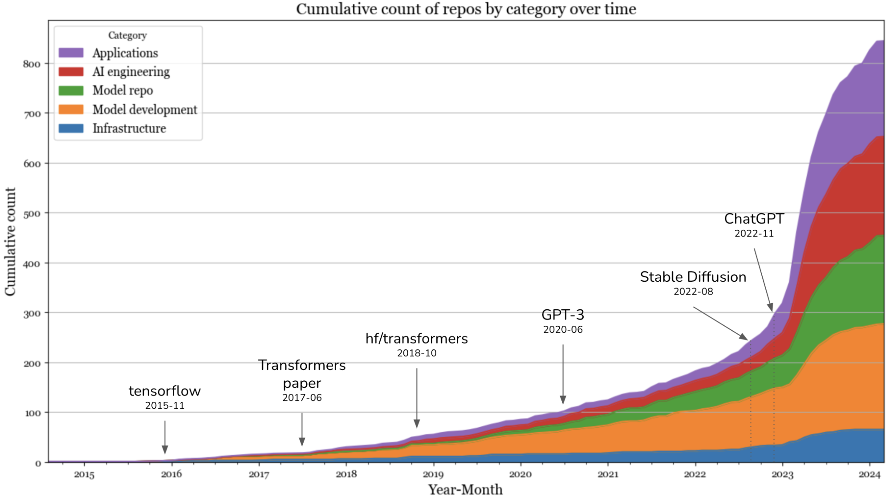

In 2023, the layers that saw the highest increases were the applications and application development layers.  

2023 年，增幅最大的层是应用层和应用开发层。  

The infrastructure layer saw a little bit of growth, but it was far from the level of growth seen in other layers.  

基础设施层有一点增长，但与其他层的增长水平相差甚远。

#### Applications  

应用

Not surprisingly, the most popular types of applications are coding, bots (e.g.  

最流行的应用程序类型是编码、机器人（例如  

role-playing, WhatsApp bots, Slack bots), and information aggregation (e.g.  

角色扮演、WhatsApp 机器人、Slack 机器人），以及信息聚合（如：......  

“let’s connect this to our Slack and ask it to summarize the messages each day”).  

"让我们把它连接到我们的 Slack，让它每天汇总信息"）。

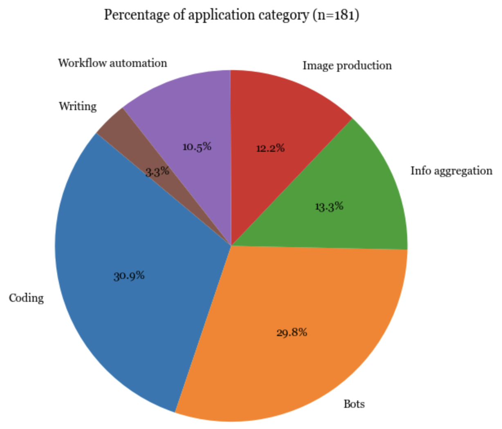

#### AI engineering  

人工智能工程

2023 was the year of AI engineering.  

2023 年是人工智能工程年。  

Since many of them are similar, it’s hard to categorize the tools.  

由于许多工具大同小异，因此很难对它们进行分类。  

I currently put them into the following categories: prompt engineering, AI interface, Agent, and AI engineering (AIE) framework.  

我目前将它们分为以下几类：提示工程、人工智能界面、Agent 和人工智能工程（AIE）框架。

**Prompt engineering** goes way beyond fiddling with prompts to cover things like constrained sampling (structured outputs), long-term memory management, prompt testing & evaluation, etc.  

提示工程远远超出了对提示的摆弄，还包括受限采样（结构化输出）、长期内存管理、提示测试和评估等。

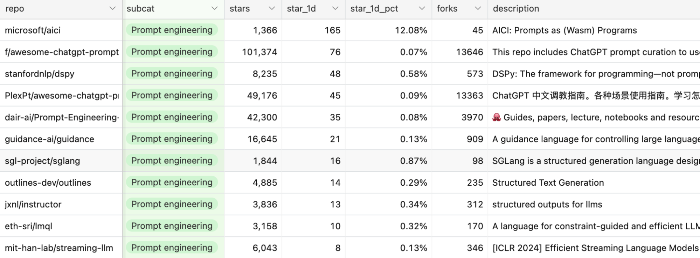

**AI interface** provides an interface for your end users to interact with your AI application.  

人工智能界面为最终用户提供了与人工智能应用程序交互的界面。  

This is the category I’m the most excited about.  

这是我最期待的类别。  

Some of the interfaces that are gaining popularity are:  

其中一些界面越来越受欢迎：

-   Web and desktop apps.  
    
    网络和桌面应用程序
-   Browser extensions that let users quickly query AI models while browsing.  
    
    可让用户在浏览网页时快速查询人工智能模型的浏览器扩展。
-   Bots via chat apps like Slack, Discord, WeChat, and WhatsApp.  
    
    通过 Slack、Discord、微信和 WhatsApp 等聊天应用程序使用机器人。
-   Plugins that let developers embed AI applications to applications like VSCode, Shopify, and Microsoft Offices.  
    
    让开发人员将人工智能应用嵌入 VSCode、Shopify 和 Microsoft Offices 等应用程序的插件。  
    
    The plugin approach is common for AI applications that can use tools to complete complex tasks (agents).  
    
    插件式方法在人工智能应用中很常见，它可以使用工具来完成复杂的任务（代理）。

**AIE framework** is a catch-all term for all platforms that help you develop AI applications.  

AIE 框架是帮助您开发人工智能应用程序的所有平台的总称。  

Many of them are built around RAG, but many also provide other toolings such as monitoring, evaluation, etc.  

其中许多都是围绕 RAG 建立的，但许多还提供其他工具，如监测、评估等。

**Agent** is a weird category, as many agent toolings are just sophisticated prompt engineering with potentially constrained generation (e.g.  

代理是一个奇怪的类别，因为许多代理工具只是复杂的提示工程，其生成可能会受到限制（如  

the model can only output the predetermined action) and plugin integration (e.g.  

模型只能输出预定动作）和插件集成（如  

to let the agent use tools).  

让代理使用工具）。

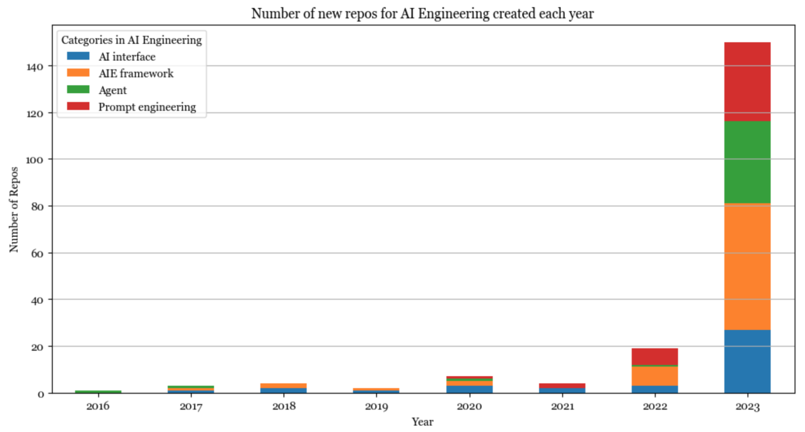

#### Model development  

模型开发

Pre-ChatGPT, the AI stack was dominated by model development.  

在ChatGPT之前，人工智能堆栈主要以模型开发为主。  

Model development’s biggest growth in 2023 came from increasing interest in inference optimization, evaluation, and parameter-efficient finetuning (which is grouped under Modeling & training).  

模型开发在 2023 年的最大增长来自于对推理优化、评估和参数高效微调（归入建模与训练）的日益浓厚的兴趣。

Inference optimization has always been important, but the scale of foundation models today makes it crucial for latency and cost.  

推理优化一直都很重要，但如今基础模型的规模使其对延迟和成本至关重要。  

The core approaches for optimization remain the same (quantization, low-ranked factorization, pruning, distillation), but many new techniques have been developed especially for the transformer architecture and the new generation of hardware.  

优化的核心方法保持不变（量化、低级因式分解、剪枝、蒸馏），但特别针对变压器架构和新一代硬件开发了许多新技术。  

For example, in 2020, 16-bit quantization was considered state-of-the-art. Today, we’re seeing [2-bit quantization](https://arxiv.org/abs/2212.09720) and [even lower than 2-bit](https://arxiv.org/abs/2402.17764).  

例如，在 2020 年，16 位量化被认为是最先进的技术。如今，我们看到的是 2 位量化，甚至低于 2 位。

Similarly, evaluation has always been essential, but with many people today treating models as blackboxes, evaluation has become even more so.  

同样，评估一直都是必不可少的，但如今很多人都把模型当作黑箱，评估就变得更加重要了。  

There are many new evaluation benchmarks and evaluation methods, such as comparative evaluation (see [Chatbot Arena](https://huyenchip.com/2024/02/28/predictive-human-preference.html#correctness_of_chatbot_arena_ranking)) and AI-as-a-judge.  

有许多新的评估基准和评估方法，如比较评估（见聊天机器人竞技场）和人工智能即评委。

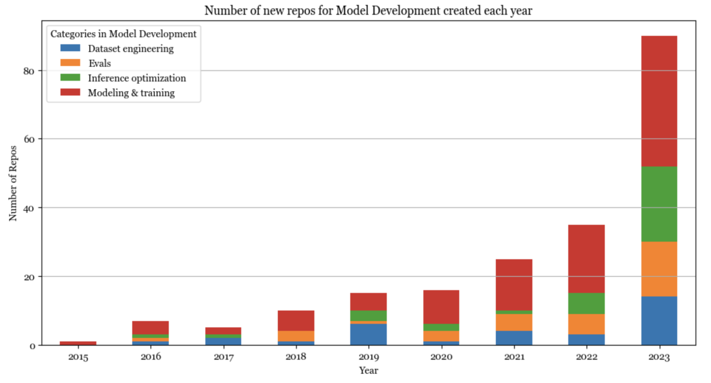

#### Infrastructure  

基础设施

Infrastructure is about managing data, compute, and toolings for serving, monitoring, and other platform work.  

基础设施涉及管理数据、计算以及用于服务、监控和其他平台工作的工具。  

Despite all the changes that generative AI brought, the open source AI infrastructure layer remained more or less the same.  

尽管生成式人工智能带来了种种变化，但开源人工智能基础架构层却大致保持不变。  

This could also be because infrastructure products are typically not open sourced.  

这也可能是因为基础设施产品通常不开源。

The newest category in this layer is vector database with companies like Qdrant, Pinecone, and LanceDB.  

该层的最新类别是向量数据库，包括 Qdrant、Pinecone 和 LanceDB 等公司。  

However, many argue this shouldn’t be a category at all.  

然而，许多人认为这根本不应该是一个类别。  

Vector search has been around for a long time.  

矢量搜索由来已久。  

Instead of building new databases just for vector search, existing database companies like DataStax and Redis are bringing vector search into where the data already is.  

现有的数据库公司，如 DataStax 和 Redis，正在将矢量搜索引入已有的数据中，而不是专门为矢量搜索建立新的数据库。

## Open source AI developers  

开源人工智能开发人员

Open source software, like many things, follows the long tail distribution.  

开放源码软件和许多事物一样，遵循长尾分布。  

A handful of accounts control a large portion of the repos.  

少数几个账户控制着大部分 repos。

### One-person billion-dollar companies?  

一个人的十亿美元公司？

845 repos are hosted on 594 unique GitHub accounts. There are 20 accounts with at least 4 repos.  

845 个版本库托管在 594 个不同的 GitHub 账户上。其中 20 个账户至少拥有 4 个版本库。  

These top 20 accounts host 195 of the repos, or 23% of all the repos on the list.  

这前 20 个账户托管了 195 个 repos，占名单上所有 repos 的 23%。  

These 195 repos have gained a total of 1,650,000 stars.  

这 195 个资源库共获得 1,650,000 颗星。

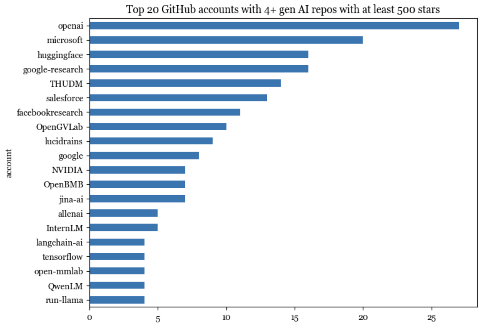

On Github, an account can be either an organization or an individual.  

在 Github 上，账户可以是组织或个人。  

19/20 of the top accounts are organizations. Of those, 3 belong to Google: `google-research`, `google`, `tensorflow`.  

排名靠前的账户中有 19/20 个是组织。其中，3 个属于 Google： `google-research` , `google` , `tensorflow` .

The only individual account in these top 20 accounts is lucidrains.  

这前 20 个账户中唯一的个人账户是 lucidrains。  

Among the top 20 accounts with the most number of stars (counting only gen AI repos), 4 are individual accounts:  

在星级数最多的前 20 个账户中（仅计算 gen AI repos），有 4 个是个人账户：

-   [lucidrains](https://github.com/lucidrains) (Phil Wang): who can implement state-of-the-art models insanely fast.  
    
    lucidrains（Phil Wang）：能以惊人的速度实现最先进的模型。
-   [ggerganov](https://github.com/ggerganov) (Georgi Gerganov): an optimization god who comes from a physics background.  
    
    gerganov（Georgi Gerganov）：物理学出身的优化之神。
-   [Illyasviel](https://github.com/lllyasviel) (Lyumin Zhang): creator of Foocus and ControlNet who’s currently a Stanford PhD.  
    
    Illyasviel （Lyumin Zhang）：Foocus 和 ControlNet 的创建者，现为斯坦福大学博士。
-   [xtekky](https://github.com/xtekky): a full-stack developer who created gpt4free.  
    
    xtekky: 全栈开发人员，创建了 gpt4free。

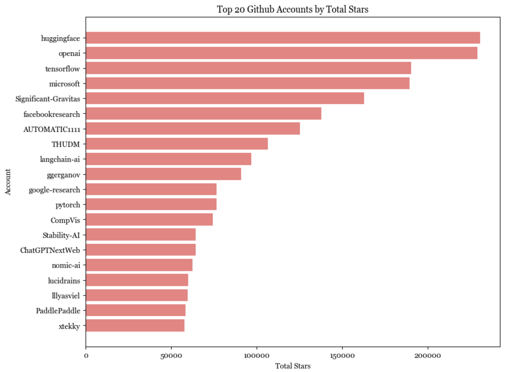

Unsurprisingly, the lower we go in the stack, the harder it is for individuals to build.  

不难理解，堆栈越低，个人就越难构建。  

Software in the infrastructure layer is the least likely to be started and hosted by individual accounts, whereas more than half of the applications are hosted by individuals.  

基础设施层的软件最不可能由个人账户启动和托管，而一半以上的应用程序是由个人托管的。

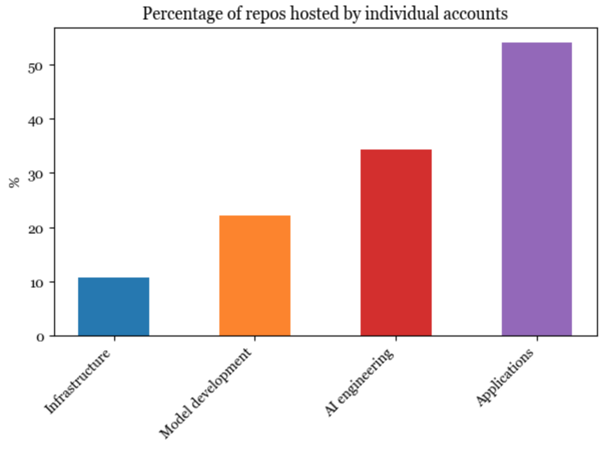

Applications started by individuals, on average, have gained more stars than applications started by organizations.  

由个人发起的申请获得的星级平均高于由组织发起的申请。  

Several people have speculated that we’ll see many very valuable one-person companies (see [Sam Altman’s interview](https://fortune.com/2024/02/04/sam-altman-one-person-unicorn-silicon-valley-founder-myth/) and [Reddit discussion](https://www.reddit.com/r/ChatGPT/comments/1ajwj5z/one_person_billion_dollar_company/)). I think they might be right.  

一些人猜测，我们将看到许多非常有价值的一人公司（见 Sam Altman 的采访和 Reddit 上的讨论）。我认为他们可能是对的。

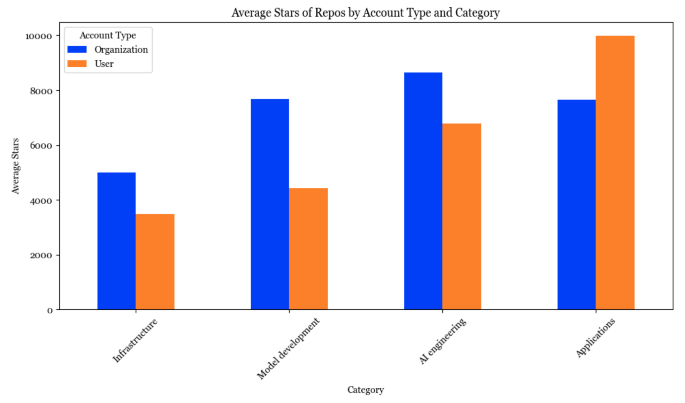

### 1 million commits  

100 万次提交

Over 20,000 developers have contributed to these 845 repos.  

超过 20,000 名开发人员为这 845 个软件仓库做出了贡献。  

In total, they’ve made almost a million contributions!  

他们总共捐出了近一百万美元！

Among them, the 50 most active developers have made over 100,000 commits, averaging over 2,000 commits each.  

其中，最活跃的 50 名开发者已提交超过 100,000 次，平均每人超过 2,000 次。  

See the full list of the top 50 most active open source developers [here](https://huyenchip.com/llama-devs).  

点击这里查看最活跃的 50 位开源开发者的完整名单。

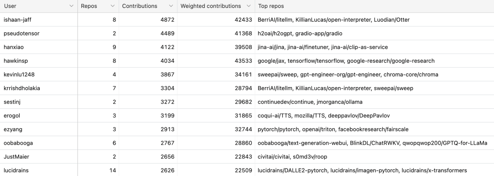

## The growing China's open source ecosystem  

不断壮大的中国开源生态系统

It’s been known for a long time that China’s AI ecosystem has diverged from the US (I also mentioned that in a [2020 blog post](https://huyenchip.com/2020/12/27/real-time-machine-learning.html#mlops_china_vs_us)).  

众所周知，中国的人工智能生态系统与美国的不同由来已久（我在 2020 年的一篇博文中也提到过这一点）。  

At that time, I was under the impression that GitHub wasn’t widely used in China, and my view back then was perhaps colored by China’s 2013 ban on GitHub.  

当时，我的印象是 GitHub 在中国并没有被广泛使用，而我当时的看法也许是受到了中国 2013 年对 GitHub 的禁令的影响。

However, this impression is no longer true.  

然而，这种印象已不复存在。  

There are many, many popular AI repos on GitHub targeting Chinese audiences, such that their descriptions are written in Chinese.  

GitHub 上有很多针对中国受众的热门人工智能软件仓库，它们的描述都是用中文写的。  

There are repos for models developed for Chinese or Chinese + English, such as [Qwen](https://github.com/QwenLM/Qwen), [ChatGLM3](https://github.com/THUDM/ChatGLM3), [Chinese-LLaMA](https://github.com/ymcui/Chinese-LLaMA-Alpaca).  

有一些为中文或中文+英文开发的模型 repos，如 Qwen、ChatGLM3、Chinese-LaMA。

While in the US, many research labs have moved away from the RNN architecture for language models, the RNN-based model family [RWKV](https://github.com/BlinkDL/RWKV-LM) is still popular.  

虽然在美国，许多研究实验室已经放弃了 RNN 架构的语言模型，但基于 RNN 的模型系列 RWKV 仍然很受欢迎。

There are also AI engineering tools providing ways to integrate AI models into products popular in China like WeChat, QQ, DingTalk, etc.  

还有一些人工智能工程工具提供了将人工智能模型集成到微信、QQ、叮当等中国流行产品中的方法。  

Many popular prompt engineering tools also have mirrors in Chinese.  

许多流行的提示工程工具也有中文镜像。

Among the top 20 accounts on GitHub, 6 originated in China:  

在 GitHub 上排名前 20 的账户中，有 6 个来自中国：

1.  [THUDM](https://github.com/THUDM): Knowledge Engineering Group (KEG) & Data Mining at Tsinghua University.  
    
    THUDM：清华大学知识工程小组（KEG）和数据挖掘。
2.  [OpenGVLab](https://github.com/OpenGVLab): General Vision team of Shanghai AI Laboratory  
    
    OpenGVLab：上海人工智能实验室通用视觉团队
3.  [OpenBMB](https://github.com/OpenBMB): Open Lab for Big Model Base, founded by ModelBest & the NLP group at Tsinghua University.  
    
    OpenBMB：大模型库开放实验室，由 ModelBest 和清华大学 NLP 小组创建。
4.  [InternLM](https://github.com/InternLM): from Shanghai AI Laboratory.  
    
    InternLM：来自上海人工智能实验室。
5.  [OpenMMLab](https://github.com/open-mmlab): from The Chinese University of Hong Kong.  
    
    OpenMMLab: 来自香港中文大学。
6.  [QwenLM](https://github.com/QwenLM): Alibaba’s AI lab, which publishes the Qwen model family.  
    
    QwenLM：阿里巴巴人工智能实验室，发布 Qwen 模型系列。

## Live fast, die young  

活得快，死得早

One pattern that I saw last year is that many repos quickly gained a massive amount of eyeballs, then quickly died down.  

去年我发现的一个规律是，许多 repos 很快就吸引了大量眼球，然后又很快消声匿迹。  

Some of my friends call this the “hype curve”.  

我的一些朋友称之为 "炒作曲线"。  

Out of these 845 repos with at least 500 GitHub stars, 158 repos (18.8%) haven’t gained any new stars in the last 24 hours, and 37 repos (4.5%) haven’t gained any new stars in the last week.  

在这 845 个拥有至少 500 个 GitHub 星级的版本库中，有 158 个版本库（18.8%）在过去 24 小时内没有获得任何新的星级，有 37 个版本库（4.5%）在过去一周内没有获得任何新的星级。

Here are examples of the growth trajectory of two of such repos compared to the growth curve of two more sustained software.  

以下是其中两个 repos 的增长轨迹与两个更持久的软件的增长曲线的对比示例。  

Even though these two examples shown here are no longer used, I think they were valuable in showing the community what was possible, and it was cool that the authors were able to get things out so fast.  

尽管这里展示的这两个示例已不再使用，但我认为它们在向社区展示可能性方面很有价值，而且作者能够如此迅速地完成工作也很酷。

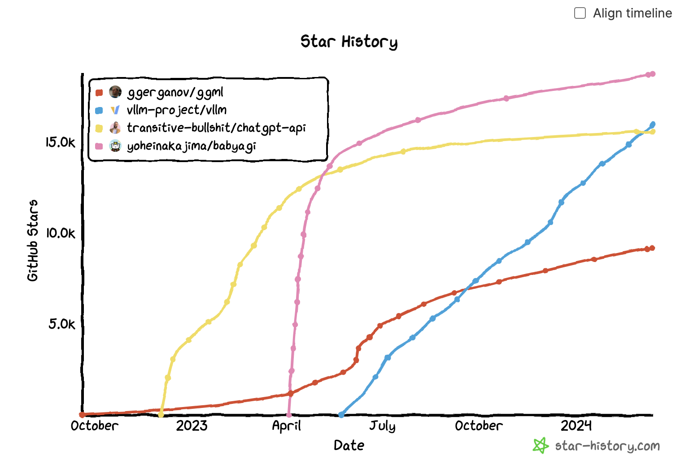

## My personal favorite ideas  

我个人最喜欢的想法

So many cool ideas are being developed by the community. Here are some of my favorites.  

社区提出了许多很酷的想法。以下是我最喜欢的一些。

-   Batch inference optimization: [FlexGen](https://github.com/FMInference/FlexGen), [llama.cpp](https://github.com/ggerganov/llama.cpp/pull/1375)  
    
    批量推理优化：FlexGen, llama.cpp
-   Faster decoder with techniques such as [Medusa](https://github.com/FasterDecoding/Medusa), [LookaheadDecoding](https://github.com/hao-ai-lab/LookaheadDecoding)  
    
    利用 Medusa、LookaheadDecoding 等技术加快解码速度
-   Model merging: [mergekit](https://github.com/cg123/mergekit)  
    
    模型合并：mergekit
-   Constrained sampling: [outlines](https://github.com/outlines-dev), [guidance](https://github.com/guidance-ai/guidance), [SGLang](https://github.com/sgl-project/sglang)  
    
    受限抽样：大纲、指南、SGLang
-   Seemingly niche tools that solve one problem really well, such as [einops](https://github.com/arogozhnikov/einops) and [safetensors](https://github.com/huggingface/safetensors).  
    
    看似小众的工具，却能很好地解决一个问题，例如 einops 和安全传感器。

## Conclusion  

结论

Even though I included only 845 repos in my analysis, I went through several thousands of repos.  

尽管我的分析只包括 845 个版本库，但我浏览了数千个版本库。  

I found this helpful for me to get a big-picture view of the seemingly overwhelming AI ecosystem.  

我发现这有助于我从全局的角度来看待看似铺天盖地的人工智能生态系统。  

I hope the [list](https://huyenchip.com/llama-police) is useful for you too. Please do let me know what repos I’m missing, and I’ll add them to the list!  

希望这份清单对你也有用。如有遗漏，请告诉我，我将把它们添加到列表中！
