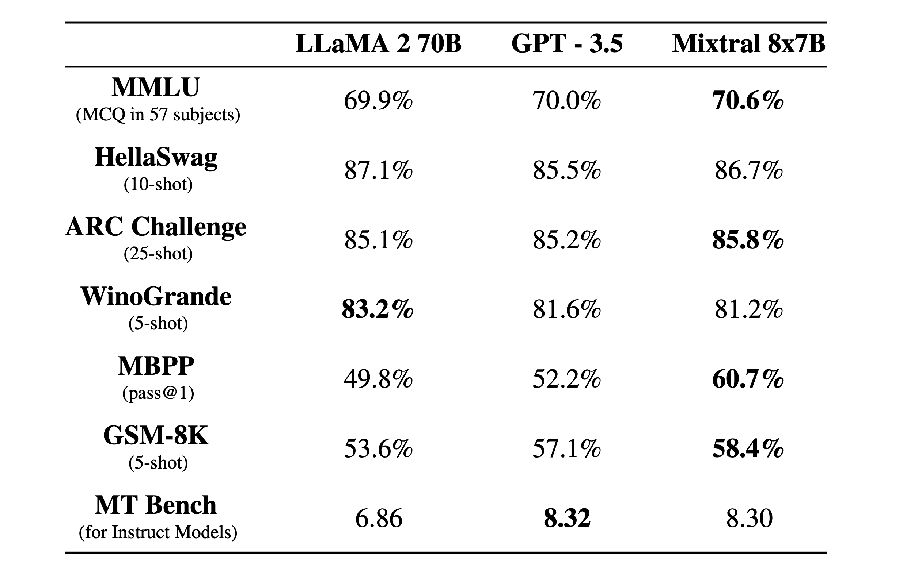
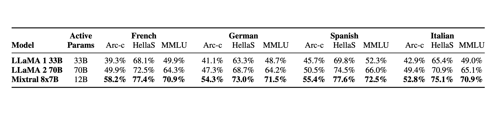

#### Navigating the World of Large Language Models  

导航大语言模型的世界

_March 21, 2024 • Written By Sherlock Xu  

2024 年 3 月 21 日 • 作者：Sherlock Xu_

Over the past year, the AI world has been abuzz with the rapid release of large language models (LLMs), each boasting advancements that push the boundaries of what's possible with generative AI.  

在过去的一年里，AI 领域一直在快速发布大型语言模型（LLMs），每个模型都以推动生成式 AI 的可能性为目标而取得了进展。  

The pace at which new models are emerging is breathtaking. Just last weekend, xAI released its [Grok](https://x.ai/blog/grok-os) language model, a behemoth with 314 billion parameters, under the Apache 2.0 license.  

新模型的涌现速度令人叹为观止。就在上周末，xAI 发布了其 Grok 语言模型，该模型拥有 3140 亿个参数，采用 Apache 2.0 许可证。

These models, powered by an ever-increasing number of parameters and trained on colossal datasets, have improved our efficiency to generate text and write (as well as understand) complex code.  

这些模型依靠越来越多的参数和庞大的数据集进行训练，提高了我们生成文本、编写（以及理解）复杂代码的效率。  

However, the sheer number of options available can feel both exciting and daunting.  

然而，可供选择的模型数量之多既令人兴奋又令人望而生畏。  

Making informed decisions about which to use — considering output quality, speed, and cost — becomes a problem.  

在考虑输出质量、速度和成本的情况下，做出明智的决策变得困难。

The answer lies not just in the specifications sheets or benchmark scores but in a holistic understanding of what each model brings to the table.  

答案不仅仅在规格表或基准分数中，而是在对每个模型所带来的整体理解中。  

In this blog post, we curate a select list of LLMs making waves over the past year.  

在本博客文章中，我们整理了过去一年中引起轰动的LLMs的精选列表。  

At the same time, we look to provide answers to some of the frequently asked questions.  

同时，我们也试图回答一些常见问题。

#### Llama 2

Meta AI has taken a significant leap forward in LLMs with the release of Llama 2, a pre-trained text generation model available in 7, 13 and 70 billion parameters.  

Meta AI 在LLMs领域迈出了重要的一步，发布了 Llama 2，这是一个预训练的文本生成模型，提供 7、13 和 70 亿个参数。  

It can be used across a broad spectrum of tasks, including chatbots and various natural language generation applications.  

它可以应用于广泛的任务，包括聊天机器人和各种自然语言生成应用。  

Meta has also tailored Llama 2 for specific use cases, with specialized variants such as Llama Chat and Code Llama.  

Meta 还为特定的用例量身定制了 Llama 2，推出了专门的变体，如 Llama Chat 和 Code Llama。

Why should you use Llama 2:  

为什么要使用 Llama 2：

-   **Performance**: Based on [Meta AI’s benchmarks](https://llama.meta.com/llama2), Llama 2 demonstrates better comprehension, reasoning, and general intelligence capabilities than other open-source models.  
    
    性能：根据 Meta AI 的基准测试，Llama 2 在理解能力、推理能力和智能能力方面表现优于其他开源模型。
-   **Fine-tuning**: With three different sizes, Llama 2 is an ideal foundation for a wide range of specialized applications.  
    
    微调：Llama 2 有三种不同的规模，是各种专业应用的理想基础。  
    
    Users can fine-tune them to meet the unique needs of specific tasks or industries ([over 12,000 search results for “Llama2” in Hugging Face Model Hub](https://huggingface.co/models?sort=trending&search=Llama2)).  
    
    用户可以对其进行微调，以满足特定任务或行业的独特需求（在 Hugging Face Model Hub 中搜索“Llama2”可获得超过 12,000 个搜索结果）。  
    
    These fine-tuned models not only save developers significant time and resources but also provide a powerful testament to Llama 2's capacity for customization and improvement.  
    
    这些经过微调的模型不仅可以节省开发人员大量的时间和资源，还为 Llama 2 的定制和改进能力提供了有力的证明。
-   **Safety**: Designed with a focus on generating safe responses, Llama 2 performs better at refusing inappropriate requests, which is ideal for corporate and public-facing applications.  
    
    安全性：Llama 2 的设计注重生成安全的回复，在拒绝不适当的请求方面表现更好，这对于企业和面向公众的应用非常理想。  
    
    During Meta's evaluations, the Llama 2 models with 7B, 13B, and 70B parameters demonstrated considerably lower percentages of safety violations (3% and 4%), surpassing Falcon and ChatGPT (7%).  
    
    在 Meta 的评估中，Llama 2 的 7B、13B 和 70B 参数模型显示出较低的安全违规百分比（3%和 4%），超过了 Falcon 和ChatGPT（7%）。

Challenges with Llama 2:  

Llama 2 的挑战：

-   **Coding capabilities**: Llama 2's abilities in coding tasks are not as advanced as some specialized models, like Code Llama, especially for complex programming tasks.  
    
    编码能力：Llama 2 在编码任务方面的能力不如一些专门的模型，比如 Code Llama，特别是对于复杂的编程任务。
-   **Preventative mechanism**: As mentioned above, Llama 2 may be more conservative than other models for safety concerns, and this stance on content generation can sometimes be overly restrictive, limiting dynamic interaction.  
    
    预防机制：如上所述，出于安全考虑，Llama 2 可能比其他模型更保守，这种内容生成的立场有时可能过于限制，限制了动态交互。
-   **Multilingual limitations**: Primarily trained on English data, Llama 2 shows limited capabilities in handling tasks in non-English languages, which may affect its usage in multilingual contexts.  
    
    多语言限制：Llama 2 主要在英语数据上进行训练，对于处理非英语语言的任务能力有限，这可能影响其在多语言环境中的使用。

#### Mixtral 8x7B

[Mixtral 8x7B](https://huggingface.co/mistralai/Mixtral-8x7B-v0.1), released by Mistral AI in December 2023, uses a sparse mixture-of-experts architecture.  

Mixtral 8x7B 是 Mistral AI 于 2023 年 12 月发布的，采用了稀疏的专家混合架构。  

Simply put, it uses many small networks, each specialized in different things.  

简单来说，它使用许多小型网络，每个网络专门处理不同的事情。  

Only a few of these "experts" work on each task, making the process efficient without using the full model's power every time and thus controlling cost and latency.  

只有少数几个“专家”在每个任务上工作，这使得过程高效，不需要每次都使用完整模型的能力，从而控制成本和延迟。

Licensed under the Apache 2.0 license for commercial use, Mixtral 8x7B demonstrates exceptional versatility across various text generation tasks, including code generation, and features a fine-tuned variant, Mixtral 8x7B Instruct, optimized for chat applications.  

Mixtral 8x7B 在商业使用方面获得了 Apache 2.0 许可证，展现出在各种文本生成任务中的卓越适应性，包括代码生成，并且还提供了经过精调的变体 Mixtral 8x7B Instruct，专为聊天应用进行了优化。

Why should you use Mixtral 8x7B:  

为什么要使用 Mixtral 8x7B：

-   **State-of-the-art performance:** Mixtral 8x7B outperforms leading models like Llama 2 70B and GPT-3.5 across many benchmarks.  
    
    最先进的性能：Mixtral 8x7B 在许多基准测试中超越了 Llama 2 70B 和 GPT-3.5 等领先模型。
    
    
    
    Source: [https://mistral.ai/news/mixtral-of-experts/](https://mistral.ai/news/mixtral-of-experts/)  
    
    来源：https://mistral.ai/news/mixtral-of-experts/
    
-   **Long context window**: Mixtral 8x7B's 32k-token context window significantly enhances its ability to handle lengthy conversations and complex documents.  
    
    长上下文窗口：Mixtral 8x7B 的 32k-token 上下文窗口显著增强了其处理长对话和复杂文档的能力。  
    
    This enables the model to handle a variety of tasks, from detailed content creation to sophisticated retrieval-augmented generation, making it highly versatile for both research and commercial applications.  
    
    这使得该模型能够处理各种任务，从详细内容的创作到复杂的检索增强生成，使其在研究和商业应用中具有高度的多功能性。
    
-   **Optimized for efficiency**: Despite its large parameter count, it offers cost-effective inference, comparable to much smaller models.  
    
    优化的效率：尽管参数数量庞大，但它提供了与更小模型相当的经济有效的推理能力。
    
-   **Versatile language support**: Mixtral 8x7B handles multiple languages (French, German, Spanish, Italian, and English), making it ideal for global applications.  
    
    多语言支持：Mixtral 8x7B 支持多种语言（法语、德语、西班牙语、意大利语和英语），非常适合全球应用。
    
    Source: [https://mistral.ai/news/mixtral-of-experts/](https://mistral.ai/news/mixtral-of-experts/)  
    
    来源：https://mistral.ai/news/mixtral-of-experts/
    

Challenges with Mixtral 8x7B:  

Mixtral 8x7B 的挑战：

-   **Lack of built-in moderation mechanisms**: Without native moderation, there may be a risk of generating inappropriate or harmful content, especially when the model is prompted with sensitive or controversial inputs.  
    
    缺乏内置的内容审核机制：没有原生的内容审核机制，可能存在生成不适当或有害内容的风险，特别是当模型接收到敏感或有争议的输入时。  
    
    Businesses aiming to deploy this model in environments where content control and safety are important should be careful about this.  
    
    希望在注重内容控制和安全性的环境中部署该模型的企业应该对此保持谨慎。
-   **Hardware requirements**: The entire parameter set requires substantial RAM for operation, which could limit its use on lower-end systems.  
    
    硬件要求：整个参数集需要大量的 RAM 进行操作，这可能限制其在低端系统上的使用。

#### Zephyr 7B

Zephyr 7B, built on the base of Mistral 7B, has been fine-tuned to achieve better alignment with human intent, outperforming its counterparts in specific tasks and benchmarks.  

Zephyr 7B 是基于 Mistral 7B 构建的，经过微调以更好地与人类意图对齐，在特定任务和基准测试中表现优于其他模型。  

At the time of its release, Zephyr-7B-β is the [highest ranked 7B chat model](https://huggingface.co/HuggingFaceH4/zephyr-7b-beta#performance) on the [MT-Bench](https://huggingface.co/spaces/lmsys/mt-bench) and [AlpacaEval](https://tatsu-lab.github.io/alpaca_eval/) benchmarks.  

在发布时，Zephyr-7B-β是 MT-Bench 和 AlpacaEval 基准测试中排名最高的 7B 聊天模型。

Zephyr 7B's training involves refinement of its abilities through exposure to a vast array of language patterns and contexts.  

Zephyr 7B 的训练涉及通过接触大量的语言模式和语境来提升其能力。  

This process allows it to comprehend complex queries and generate coherent, contextually relevant text, making it a versatile tool for content creation, customer support, and more.  

这个过程使它能够理解复杂的查询并生成连贯、与上下文相关的文本，使其成为内容创作、客户支持等方面的多功能工具。

Why should you use Zephyr 7B:  

为什么要使用 Zephyr 7B：

-   **Efficiency and performance**: Despite its smaller size relative to giants like GPT-3.5 or Llama-2-70B, Zephyr 7B delivers [comparable or superior performance](https://huggingface.co/HuggingFaceH4/zephyr-7b-beta#performance), especially in tasks requiring a deep understanding of human intent.  
    
    效率和性能：尽管相对于像 GPT-3.5 或 Llama-2-70B 这样的巨头来说，Zephyr 7B 体积较小，但在需要深入理解人类意图的任务中，它提供可比或更优秀的性能。
-   **Multilingual capabilities**: Trained on a diverse dataset, Zephyr 7B supports text generation and understanding across multiple languages, including but not limited to English, Spanish, French, German, Italian, Portuguese, Dutch, Russian, Chinese, Japanese, and Korean.  
    
    多语言能力：Zephyr 7B 在多样化的数据集上进行训练，支持多种语言的文本生成和理解，包括但不限于英语、西班牙语、法语、德语、意大利语、葡萄牙语、荷兰语、俄语、中文、日语和韩语。
-   **Task flexibility**: Zephyr 7B excels in performing a broad spectrum of language-related tasks, from text generation and summarization to translation and sentiment analysis.  
    
    任务灵活性：Zephyr 7B 在执行广泛的与语言相关的任务方面表现出色，包括文本生成和摘要、翻译和情感分析等。  
    
    This positions it as a highly adaptable tool across numerous applications.  
    
    这使其成为一个在众多应用中高度适应的工具。

Challenges with Zephyr 7B:  

Zephyr 7B 的挑战：

-   **Intent alignment**: While Zephyr 7B has made some progress in aligning with human intent, continuous evaluation and adjustment may be necessary to ensure its outputs meet specific user needs or ethical guidelines.  
    
    意图对齐：尽管 Zephyr 7B 在与人类意图对齐方面取得了一些进展，但为了确保其输出符合特定用户需求或道德准则，可能需要持续评估和调整。
-   **Adaptation for specialized tasks**: Depending on the application, additional fine-tuning may be required to optimize Zephyr 7B's performance for specialized tasks, like reasoning, math, and coding.  
    
    适应专业任务：根据应用的不同，可能需要进行额外的微调，以优化 Zephyr 7B 在推理、数学和编码等专业任务中的性能。

#### SOLAR 10.7B

SOLAR 10.7B is a large language model with 10.7 billion parameters, using an upscaling technique known as depth up-scaling (DUS).  

SOLAR 10.7B 是一个具有 107 亿个参数的大型语言模型，使用了一种称为深度放大（DUS）的升级技术。  

This simplifies the scaling process without complex training or inference adjustments.  

这简化了缩放过程，无需复杂的训练或推理调整。

SOLAR 10.7B undergoes two fine-tuning stages: [instruction tuning and alignment tuning](https://ar5iv.labs.arxiv.org/html/2312.15166). Instruction tuning enhances its ability to follow instructions in a QA format.  

SOLAR 10.7B 经历了两个微调阶段：指令微调和对齐微调。指令微调增强了其在问答格式中遵循指令的能力。  

Alignment tuning further refines the model to align more closely with human preferences or strong AI outputs, utilizing both open-source datasets and a synthesized math-focused alignment dataset.  

对齐微调进一步优化了模型，使其更接近人类偏好或强 AI 输出，利用了开源数据集和合成的以数学为重点的对齐数据集。

Why should you use SOLAR 10.7B:  

为什么要使用 SOLAR 10.7B：

-   **Versatility**: Fine-tuned variants like SOLAR 10.7B-Instruct offer enhanced instruction-following capabilities, making the model capable for a broad range of applications.  
    
    多功能性：像 SOLAR 10.7B-Instruct 这样的微调变体提供了增强的指令遵循能力，使模型适用于广泛的应用。
-   **Superior NLP performance**: SOLAR 10.7B demonstrates exceptional performance in NLP tasks, [outperforming other pre-trained models like Llama 2 and Mistral 7B](https://huggingface.co/upstage/SOLAR-10.7B-v1.0#evaluation-results).  
    
    卓越的自然语言处理性能：SOLAR 10.7B 在自然语言处理任务中表现出色，优于其他预训练模型如 Llama 2 和 Mistral 7B。
-   **Fine-tuning:** SOLAR 10.7B is an ideal model for fine-tuning with solid baseline capabilities.  
    
    微调：SOLAR 10.7B 是一个具有坚实基线能力的理想模型，适用于微调。

Challenges with SOLAR 10.7B:  

SOLAR 10.7B 的挑战：

-   **Resource requirements**: The model might require substantial computational resources for training and fine-tuning.  
    
    资源需求：该模型可能需要大量的计算资源进行训练和微调。
-   **Bias concerns**: The model's outputs may not always align with ethical or fair use principles.  
    
    偏见问题：该模型的输出可能并不总是符合道德或公平使用原则。

#### Code Llama

Fine-tuned on Llama 2, Code Llama is an advanced LLM specifically fine-tuned for coding tasks.  

在 Llama 2 上进行了精细调整，Code Llama 是一个专门针对编码任务进行精细调整的先进模型。  

It's engineered to understand and generate code across several popular programming languages, including Python, C++, Java, PHP, Typescript (Javascript), C#, and Bash, making it an ideal tool for developers.  

它被设计用于理解和生成多种流行的编程语言，包括 Python、C++、Java、PHP、Typescript（Javascript）、C#和 Bash，使其成为开发人员的理想工具。

The model is available in four sizes (7B, 13B, 34B, and 70B parameters) to accommodate various use cases, from low-latency applications like real-time code completion with the 7B and 13B models to more comprehensive code assistance provided by the 34B and 70B models.  

该模型有四个尺寸可供选择（7B、13B、34B 和 70B 参数），以适应不同的使用场景，从低延迟应用（如使用 7B 和 13B 模型进行实时代码补全）到由 34B 和 70B 模型提供的更全面的代码辅助。

Why should you use Code Llama:  

为什么要使用 Code Llama：

-   **Large input contexts**: Code Llama can handle inputs with up to 100,000 tokens, allowing for better understanding and manipulation of large codebases.  
    
    大输入上下文：Code Llama 可以处理最多 100,000 个标记的输入，从而更好地理解和操作大型代码库。
-   **Diverse applications**: It's designed for a range of applications such as code generation, code completion, debugging, and even discussing code, catering to different needs within the software development lifecycle.  
    
    多样的应用：它被设计用于各种应用，如代码生成、代码补全、调试，甚至是讨论代码，以满足软件开发生命周期中不同的需求。
-   **Performance**: With models trained on extensive datasets (up to 1 trillion tokens for the 70B model), Code Llama can provide more accurate and contextually relevant code suggestions.  
    
    性能：通过在大规模数据集上训练的模型（70B 模型的训练数据可达 1 万亿个标记），Code Llama 能够提供更准确和上下文相关的代码建议。  
    
    The Code Llama - Instruct 70B model even [scores 67.8 in HumanEval test, higher than GPT 4 (67.0)](https://ai.meta.com/blog/code-llama-large-language-model-coding/).  
    
    Code Llama - Instruct 70B 模型在 HumanEval 测试中得分为 67.8，高于 GPT 4（67.0）。

Challenges with Code Llama:  

Code Llama 的挑战：

-   **Hardware requirements**: Larger models (34B and 70B) may require significant computational resources for optimal performance, potentially limiting access for individuals or organizations with limited hardware.  
    
    硬件要求：较大的模型（34B 和 70B）可能需要大量的计算资源才能实现最佳性能，这可能限制了硬件有限的个人或组织的使用。
-   **Potential for misalignment**: While it has been fine-tuned for improved safety and alignment with human intent, there's always a risk of generating inappropriate or malicious code if not properly supervised.  
    
    可能存在不一致性：尽管经过了精细调整以提高安全性和与人类意图的一致性，但如果没有适当的监督，仍然存在生成不适当或恶意代码的风险。
-   **Not for general natural language tasks**: Optimized for coding tasks, Code Llama is not recommended for broader natural language processing applications.  
    
    不适用于一般的自然语言任务：Code Llama 经过了针对编码任务的优化，不建议用于更广泛的自然语言处理应用。  
    
    Note that only Code Llama Instruct is specifically fine-tuned to better respond to natural language prompts.  
    
    请注意，只有 Code Llama Instruct 经过了特别的精细调整，以更好地响应自然语言提示。

#### Why should I choose open-source models over commercial ones?  

为什么我应该选择开源模型而不是商业模型？

All the language models listed in this blog post are open-source, so I believe this is the very first question to answer.  

在这篇博文中列出的所有语言模型都是开源的，所以我认为这是首先要回答的问题。  

In fact, the choice between open-source and commercial models often depends on specific needs and considerations, but the former may be a better option in the following aspects:  

实际上，选择开源模型还是商业模型往往取决于具体的需求和考虑因素，但在以下几个方面，前者可能是更好的选择：

-   **High controllability**: Open-source models offer a high degree of control, as users can access and refine-tune the model as needed.  
    
    高可控性：开源模型提供了很高的可控性，用户可以根据需要访问和优化模型。  
    
    This allows for customization and adaptability to specific tasks or requirements that might not be possible with commercial models.  
    
    这样可以进行定制和适应特定任务或要求，这在商业模型中可能是不可能的。
-   **Data security:** Open-source models can be run locally, or within a private cloud infrastructure, giving users more control over data security.  
    
    数据安全性：开源模型可以在本地或私有云基础设施中运行，使用户对数据安全性有更多的控制。  
    
    With commercial models, there may be concerns about data privacy since the data often needs to be sent to the provider's servers for processing.  
    
    而商业模型可能存在数据隐私的担忧，因为数据通常需要发送到提供商的服务器进行处理。
-   **Cost-effectiveness:** Utilizing open-source models can be more cost-effective, particularly when considering the cost of API calls or tokens required for commercial offerings.  
    
    成本效益：利用开源模型可以更具成本效益，特别是考虑到商业产品所需的 API 调用或令牌的成本。  
    
    Open-source models can be deployed without these recurring costs, though there may be investments needed for infrastructure and maintenance.  
    
    开源模型可以在没有这些重复成本的情况下部署，尽管可能需要对基础设施和维护进行投资。
-   **Community and collaboration:** Open-source models benefit from the collective expertise of the community, leading to rapid improvements, bug fixes, and new features driven by collaborative development.  
    
    社区和协作：开源模型受益于社区的集体专业知识，通过协作开发，实现快速改进、错误修复和新功能的推动。
-   **No vendor lock-in:** Relying on open-source models eliminates dependence on a specific vendor's roadmap, pricing changes, or service availability.  
    
    没有供应商锁定：依赖开源模型消除了对特定供应商的路线图、定价变化或服务可用性的依赖。

#### How do specialized LLMs compare to general-purpose models?  

专用LLMs与通用模型相比如何？

Specialized LLMs like Code Llama offer a focused performance boost in their areas of specialization.  

专用LLMs（例如 Code Llama）在其专业领域提供了专注的性能提升。  

They are designed to excel at specific tasks, providing outputs that are more accurate, relevant, and useful for those particular applications.  

它们被设计用于在特定任务上表现出更准确、相关和有用的输出，适用于特定的应用。

In contrast, general-purpose models like Llama 2 are built to handle a wide range of tasks.  

相比之下，通用模型（例如 Llama 2）则是为处理各种任务而构建的。  

While they may not match the task-specific accuracy of specialized models, their broad knowledge base and adaptability make them helpful tools for a variety of applications.  

虽然它们可能无法与专用模型的任务特定准确性相匹配，但它们广泛的知识库和适应性使它们成为各种应用的有用工具。

The choice between specialized and general-purpose LLMs depends on the specific requirements of the task.  

选择专用还是通用LLMs取决于任务的具体要求。  

Specialized models are preferable for high-stakes or niche tasks where precision is more important, while general-purpose models offer better flexibility and broad utility.  

专门的模型更适合高风险或专业领域的任务，其中精确性更为重要，而通用模型则提供更好的灵活性和广泛的实用性。

#### What are the ethical considerations in deploying LLMs at scale?  

在大规模部署LLMs时有哪些伦理考虑？

The ethical deployment of LLMs requires a careful examination of issues such as bias, transparency, accountability, and the potential for misuse.  

LLMs的伦理部署需要仔细审查诸如偏见、透明度、问责制和滥用潜力等问题。  

Ensuring that LLMs do not perpetuate existing biases present in their training data is a significant challenge, requiring ongoing vigilance and refinement of training methodologies.  

确保LLMs不会延续其训练数据中存在的现有偏见是一个重大挑战，需要持续保持警惕并改进训练方法。  

Transparency about how LLMs make decisions and the data they are trained on is crucial for building trust and accountability, particularly in high-stakes applications.  

LLMs如何做出决策以及它们所训练的数据的透明度对于建立信任和问责制至关重要，尤其是在高风险应用中。

#### What should I consider when deploying LLMs in production?  

在生产环境中部署LLMs时应考虑哪些因素？

Deploying LLMs in production can be a nuanced process. Here are some strategies to consider:  

在生产环境中部署LLMs可能是一个复杂的过程。以下是一些需要考虑的策略：

1.  **Choose the right model size**: Balancing the model size with your application's latency and throughput requirements is essential.  
    
    选择合适的模型大小：平衡模型大小与应用的延迟和吞吐量要求至关重要。  
    
    Smaller models can offer faster responses and reduced computational costs, while larger models may provide more accurate and nuanced outputs.  
    
    较小的模型可以提供更快的响应和较低的计算成本，而较大的模型可能提供更准确和细致的输出。
2.  **Infrastructure considerations**: Ensure that your infrastructure can handle the computational load.  
    
    基础设施考虑：确保您的基础设施能够处理计算负载。  
    
    Using cloud services with GPU support or optimizing models with quantization and pruning techniques can help manage resource demands.  
    
    使用支持 GPU 的云服务或使用量化和修剪技术优化模型可以帮助管理资源需求。  
    
    A serverless platform with autoscaling capabilities can be a good choice for teams without infrastructure expertise.  
    
    具备自动扩展能力的无服务器平台对于没有基础设施专业知识的团队来说是一个不错的选择。
3.  **Plan for scalability**: Your deployment strategy should allow for scaling up or down based on demand.  
    
    规划可扩展性：您的部署策略应该允许根据需求进行扩展或缩减。  
    
    Containerization with technologies like Docker and orchestration with Kubernetes can support scalable deployments.  
    
    使用 Docker 等技术进行容器化，并使用 Kubernetes 进行编排可以支持可扩展的部署。
4.  **Build robust logging and observability**: Implementing comprehensive logging and observability tools will help in monitoring the system's health and quickly diagnosing issues as they arise.  
    
    构建强大的日志记录和可观察性：实施全面的日志记录和可观察性工具将有助于监控系统的健康状况，并在问题出现时快速诊断。
5.  **Use APIs for modularity**: APIs can abstract the complexity of model hosting, scaling, and management.  
    
    使用 API 实现模块化：API 可以抽象出模型托管、扩展和管理的复杂性。  
    
    They can also facilitate integration with existing systems and allow for easier updates and maintenance.  
    
    它们还可以促进与现有系统的集成，并实现更容易的更新和维护。
6.  **Consider model serving frameworks**: Frameworks like BentoML, TensorFlow Serving, TorchServe, or ONNX Runtime can simplify deployment, provide version control, and handle request batching for efficiency.  
    
    考虑模型服务框架：像 BentoML、TensorFlow Serving、TorchServe 或 ONNX Runtime 这样的框架可以简化部署，提供版本控制，并处理请求批处理以提高效率。

#### Final thoughts  

最后的思考

As we navigate the expanding universe of large language models, it's clear that their potential is only just beginning to be tapped.  

随着大型语言模型的不断发展，我们可以清楚地看到它们的潜力只是刚刚开始被挖掘。  

The rapid innovation in this field signifies a future where AI can contribute even more profoundly to our work and creative endeavors.  

这个领域的快速创新预示着一个未来，人工智能可以更深入地为我们的工作和创造性努力做出贡献。

Moving forward, I believe it's vital to continue promoting AI models in open-source communities, pushing for advances that benefit all and ensuring responsible usage of these powerful tools.  

展望未来，我认为继续在开源社区推广人工智能模型至关重要，推动有益于所有人的进步，并确保负责任地使用这些强大的工具。  

As we do so, hopefully, we'll find the right balance that maximizes the benefits of LLMs for society while mitigating their risks.  

在这样做的过程中，希望我们能找到合适的平衡，最大化社会的LLMs的好处，同时减轻其风险。

#### More on LLMs  

更多关于LLMs的信息

To learn more about how to serve and deploy LLMs, check out the following resources:  

要了解更多关于如何提供和部署LLMs的信息，请查看以下资源：

-   \[Doc\] [vLLM inference](https://docs.bentoml.com/en/latest/use-cases/large-language-models/vllm.html)  
    
    \[文档\] vLLM 推理
-   \[Blog\] [Deploying A Large Language Model with BentoML and vLLM](https://www.bentoml.com/blog/deploying-a-large-language-model-with-bentoml-and-vllm)  
    
    \[博客\] 使用 BentoML 和 vLLM 部署大型语言模型
-   \[Blog\] [Introducing BentoML 1.2](https://www.bentoml.com/blog/introducing-bentoml-1-2)  
    
    \[博客\] BentoML 1.2 新功能介绍
-   Try [BentoCloud](https://l.bentoml.com/sign-up-from-blog) and get $30 in free credits on signup! Experience a serverless platform tailored to simplify the building and management of your AI applications, ensuring both ease of use and scalability.  
    
    尝试 BentoCloud 并在注册时获得 30 美元的免费信用！体验一个专为简化构建和管理 AI 应用程序而量身定制的无服务器平台，确保易用性和可扩展性。
