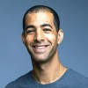

## This career skill will change the way you think about reading.  

这种职业技能将改变你对阅读的思考方式。

> “The information we consume matters just as much as the food we put in our body.  
> 
> 我们所消费的信息和我们摄入的食物一样重要。  
> 
> It affects our thinking, our behavior, how we understand our place in the world.  
> 
> 它影响我们的思维、行为以及我们对世界的理解。  
> 
> And how we understand others.” — Evan Williams, Co-Founder of Twitter and Medium  
> 
> 也影响我们对他人的理解。——Twitter 和 Medium 的联合创始人 Evan Williams

Right now, somewhere out in the world is a paragraph, chapter, or book that would change your life forever if you read it.  

现在，在世界的某个角落，有一段话、一章或一本书，如果你读了它，将会永远改变你的生活。  

I call this kind of information “breakthrough knowledge,” and mastering the ability to find breakthrough knowledge in our era of information overload is one of the most important skills we can develop.  

我称这种信息为“突破性知识”，而掌握在信息过载时代找到突破性知识的能力，是我们可以培养的最重要的技能之一。

We’ve all had breakthrough experiences.  

我们都曾有过突破性的经历。  

A phrase that a parent, mentor, or teacher said that stuck with us and changed everything.  

父母、导师或老师说过的一句话，让我们铭记并改变了一切。  

A “quake” book that shook us to our core.  

一本“地震”般的书，震撼了我们的核心。

[Warren Buffett’s quake book](https://www.cnbc.com/2017/02/02/billionaire-warren-buffett-discusses-the-book-that-changed-his-life.html), for example, was [_The Intelligent Investor_](http://amzn.to/2FfcsIJ), which he read when he was 19. This book cemented the core of the investment philosophy Buffett would use throughout his career. [Elon Musk’s quake book](https://www.cnbc.com/2017/06/06/elon-musk-says-this-science-fiction-classic-changed-his-life.html) was [_The Hitchhiker’s Guide to the Galaxy_](http://amzn.to/2F6h0lx), which he said helped him ask bigger questions, and therefore think about addressing larger problems in the world.  

沃伦·巴菲特的震撼之书是《聪明的投资者》，他在 19 岁时就读过这本书。这本书奠定了巴菲特在整个职业生涯中所使用的投资哲学的核心。埃隆·马斯克的震撼之书是《银河系漫游指南》，他说这本书帮助他提出更大的问题，从而思考如何解决世界上更大的问题。  

My most recent quake book was [_Poor Charlie’s Almanack_](http://amzn.to/2oylsPM), written by self-made billionaire Charlie Munger.  

我最近的震撼之书是由自我创造的亿万富翁查理·芒格所写的《查理的年鉴》。  

This was the first book that exposed me to mental models.  

这是第一本让我接触到心智模型的书籍。  

Learning and applying mental models has been so impactful that I recently created the [Mental Model of the Month Club](https://www.mentalmodelclub.com/mental-model-club-v2.html?utm_source=Medium&utm_medium=article&utm_campaign=18&utm_content=CTA1).  

学习和应用心智模型的影响如此之大，以至于我最近创建了“每月心智模型俱乐部”。

Quake books are rare, but one is worth a thousand merely good books.  

突破性的知识体验可能只持续几分钟，但其影响可以持续一生。  

A breakthrough knowledge experience might only last a few minutes, but its effect can last a lifetime.  

这是学习的终极形式。  

It is the ultimate form of learning leverage.  

现在，想象一下每年都能有一次突破性的知识体验，而不是十年一次。

Now, imagine having a breakthrough knowledge experience once a year rather than once a decade.  

或者每月两次，而不是每年一次。这将改变一切，而且是有可能的。  

Or perhaps twice a month rather than once a year. It would change everything, and it’s possible.  

鉴于突破性知识的力量和寻找它的困难，我们所有人都需要问自己的一个最基本的问题是：

Given the power of breakthrough knowledge and the difficulty of finding it, one of the most fundamental questions we all need ask ourselves is:

How do we use the limited time we have to find breakthrough knowledge in a sea of distraction?  

我们如何在无尽的干扰中利用有限的时间寻找突破性的知识呢？

My interest in this question is personal.  

对于这个问题，我个人非常感兴趣。  

As someone who has read thousands of books across disciplines, I’ve asked it repeatedly throughout the years.  

作为一个跨学科阅读了数千本书的人，多年来我一直在反复思考这个问题。  

There are hundreds of books scattered among my bookshelves, Amazon shopping cart, Kindle library, and Audible wish lists that I’d love to read, but don’t have time for — a veritable “[infinite playlist](https://www.newyorker.com/magazine/2009/08/10/infinite-playlist).”  

我的书架上、亚马逊购物车、Kindle 图书馆和 Audible 愿望清单上散落着数百本我想读的书，但我没有时间——简直是一个“无限播放列表”。

Over time, I’ve developed a unique approach to handling information overload, based on my own experience and observing how many of the [world’s top entrepreneurs and leaders learn](https://medium.com/@michaeldsimmons/how-elon-musk-learns-faster-and-better-than-everyone-else-a010a4f586ef) (including Elon Musk).  

但在我们深入探讨这种方法之前，我们首先需要了解这个问题。  

But before we jump into that approach, we first need to understand the problem.  

正如发明家查尔斯·凯特林曾经说过：“一个问题如果被明确陈述，那么问题就解决了一半。”  

As inventor Charles Kettering once said, “A problem well-stated is a problem half-solved.”  

（顺便说一句：有几个人已经在评论中分享了他们最喜欢的震撼之书或者他们寻找突破性知识的最大策略。

_(side note: several people have jumped into the comments and shared their favorite quake book or their biggest strategy to find breakthrough knowledge.  

我也很想听听你的想法，我会阅读每一条评论。）  

I’d love to hear from you too, and I read every comment.)_

## The Four Horsemen of the Info-Apocalypse

Although we think of information overload as one big problem, it actually consists of four problems that are each getting exponentially worse, and that together add up to one big crisis.  

虽然我们认为信息超载是一个大问题，但实际上它由四个问题组成，每个问题都在指数级别上恶化，而这四个问题加在一起构成了一个大危机。  

This crisis risks making us collectively dumber instead of more intelligent, and tearing us apart instead of bringing us together.  

这场危机可能会让我们集体变得更愚蠢而不是更聪明，让我们分裂而不是团结在一起。  

The crisis goes by many names, but the one that I think is most apt is [Info-Apocalypse](https://www.buzzfeed.com/charliewarzel/the-terrifying-future-of-fake-news?utm_term=.sxdj8a2vY#.lubjnZlo7).  

这场危机有很多名字，但我认为最合适的是信息启示录。

The four problems that make up the Info-Apocalypse are:  

内容冲击

1.  Content Shock
2.  Echo Chambers
3.  Constant Distraction  
    
    FOMO（害怕错过）
4.  FOMO (Fear of Missing Out)

## Info-Apocalypse Problem 1: Content Shock

> “A wealth of information creates a poverty of attention …” ―Herbert A. Simon  
> 
> “信息的丰富导致了注意力的贫乏…” ―赫伯特·A·西蒙

Source: Mark Schaefer

With the advent of online publishing and social media, the amount of knowledge available to us is expanding so fast that none of us can possibly keep up.  

随着在线出版和社交媒体的出现，可供我们获取的知识量正在迅速扩大，以至于我们中没有人能够跟上。  

Meanwhile, more content is added to the pile every second of every day.  

与此同时，每一天每一秒都有更多的内容被添加到堆积中。  

The gap between this total collective human knowledge and our time to consume it grows larger every second.  

这个总体人类知识与我们消化它的时间之间的差距每一秒都在变大。

The problem: Much new information and many new skills we could learn are out there, but they’re so buried that we don’t even know they exist.  

问题是：有很多新信息和新技能可以学习，但它们被埋得如此之深，以至于我们甚至不知道它们的存在。

## Info-Apocalypse Problem 2: Echo Chambers

Source: Michael Simmons

As groups grow in size, they become [less stable and more diverse](http://www.lifewithalacrity.com/2004/03/the_dunbar_numb.html), eventually fracturing into subgroups.  

随着群体规模的增长，它们变得越来越不稳定和多样化，最终分裂成子群体。  

One of the most identifiable examples of this phenomenon is religion.  

这种现象最具代表性的例子之一就是宗教。  

Judaism grows until it branches into several different sects, one of which breaks off into Christianity.  

犹太教发展壮大，分化为几个不同的派别，其中一个派别分裂出基督教。  

Christianity grows, then branches into Catholic and Protestant.  

基督教发展壮大，又分化为天主教和新教。  

Protestantism grows, then branches into Baptist, Methodist, Lutheran, and so on.  

新教发展壮大，又分化为浸信会、卫理公会、路德宗等等。

This happens in every growing field, discipline, and community.  

这种情况在每个不断发展的领域、学科和社群中都会发生。  

Each new group develops its own language and culture.  

每个新的群体都会发展出自己的语言和文化。  

While this improves communication inside the group, it makes it harder for knowledge to travel in or out, because it must be linguistically and culturally translated first.  

虽然这提高了群体内部的交流，但也使得知识在内外传播变得更加困难，因为必须先进行语言和文化上的翻译。

Each group develops an identity based, in part, on how it’s different or better than other groups. [These conceptual walls between groups lead to polarization and prejudice](http://ilp.mit.edu/media/news_articles/smr/2015/56411.pdf).  

每个群体都会根据自身与其他群体的不同或优势来建立自己的身份认同。这些概念上的壁垒导致了极化和偏见。  

It’s easy to see this happening in religion and politics, but it happens in all fields: Artists who become too business-oriented are considered “sellouts.” Business executives often look down on academics as too theoretical and not practical.  

这种情况在宗教和政治中很容易看到，但在所有领域都会发生：将艺术家过于商业化的人视为“出卖灵魂”。商业高管常常看不起学术界过于理论化而不实际。  

Many people in the hard sciences don’t even consider social sciences an actual science.  

许多硬科学领域的人甚至不认为社会科学是真正的科学。  

Academics who write popular books are considered to be less serious researchers.  

学术界的人士写通俗读物被认为是不够严肃的研究者。

The problem: Each group lives in its own echo chamber, which it believes is the “true” reality, and it fights to maintain this belief by demonizing other groups.  

问题：每个群体都生活在自己的回音室中，他们认为这是“真实”的现实，并通过妖魔化其他群体来维持这种信念。  

And in an age of social media and targeted, personalized content, these echo chambers become even more insular ([_see The Filter Bubble for more on this_](http://amzn.to/2FFBge7)), as we’re exposed to less and less information outside our own chosen groups.  

在社交媒体和定向个性化内容的时代，这些回音室变得更加封闭（详见《过滤泡沫》），因为我们接触到的信息越来越少，几乎都来自我们自己选择的群体之内。

## Info-Apocalypse Problem 3: Constant Distraction

Source: [Former Facebook Exec: Social Media Ripping Apart Society](https://www.youtube.com/watch?v=d6e1riShmak)

> Interviewer: You said that this is a time for soul searching in social media businesses and you were part of building the largest one.  
> 
> 您现在对此进行了哪些自我反思？  
> 
> What soul searching are you doing right now on that?  
> 
> Chamath Palihapitiya：我感到巨大的内疚...我认为我们所有人都知道，尽管我们假装这一整套说辞，“可能没有真正的不良后果。”但在我们的内心深处，我们有点知道可能会发生一些不好的事情

> Chamath Palihapitiya: I feel tremendous guilt … I think we all knew in the back of our minds, even though we feigned this whole line of, “There probably aren’t any really bad unintended consequences.” I think in the back, deep, deep, deep recesses of our minds, we kind of knew something bad could happen.  
> 
> Chamath Palihapitiya：我感到巨大的内疚...我想我们都心知肚明，尽管我们假装这一切都没有什么真正糟糕的意外后果。但在我们的内心深处，我们有点知道可能会发生一些糟糕的事情。

About five years ago, I interviewed the founder of [Meetup](https://www.meetup.com/).  

Somehow we got talking about social media news feeds, and he said something that has stuck with me: “If you think this is addictive, just wait until five years from now.”  

不知怎么的，我们开始谈论社交媒体的新闻推送，他说了一句让我记忆犹新的话：“如果你觉得现在已经上瘾了，等五年后再看看吧。”

Well, it’s five years later, and my relationship with mobile devices, the Internet, and social media has changed in a scary way.  

现在已经过去了五年，我的与移动设备、互联网和社交媒体的关系发生了可怕的变化。  

As time goes by, I’ve become extremely vigilant — downloading Chrome extensions like [Crackbook](https://chrome.google.com/webstore/detail/crackbook/nbgjmohekjolcgemlolblankocjlgalf), [Intently](https://chrome.google.com/webstore/detail/intently/nokodbpgmldcghbocpmmgipkigfkbgfb?hl=en), and [Newsfeed Eradicator](https://chrome.google.com/webstore/detail/news-feed-eradicator-for/fjcldmjmjhkklehbacihaiopjklihlgg?hl=es&)), deleting all social media apps from my phone, adding a password that only my wife has so I can’t download new apps — and it still feels like I’m losing the battle.  

随着时间的推移，我变得非常警惕——下载了 Chrome 扩展程序，如 Crackbook、Intently 和 Newsfeed Eradicator，从手机上删除了所有社交媒体应用程序，添加了只有我妻子知道的密码，以防止我下载新的应用程序——但仍然感觉自己正在失去这场战斗。

I can swear off Facebook, Twitter, or YouTube as much as I’d like, but each of these is also where I do work to build my business. I manage [Facebook Groups with nearly 50,000 members](https://www.facebook.com/groups/1049094761852823/). I buy Facebook and Google ads and promote new articles on Facebook.  

我曾试图屏蔽 YouTube，但那里有很多高价值的教育视频，所以我决定重新打开它。

I’ve tried blocking YouTube, but there are so many high-value educational videos there that I decided to turn it back on.  

即使我在家工作，当我打开电脑时，感觉就像我在一个繁忙的集市中设立了摊位。  

Even though I work from home, when I open my computer, it feels like I’ve set up shop in the middle of a busy bazaar.

Marketers, software developers, and hackers are gaining unprecedented access to data on human behavior. [They use this information](https://www.youtube.com/watch?v=d6e1riShmak) to master the science of capturing people’s attention and addicting them to their product.  

营销人员、软件开发人员和黑客正在获得前所未有的人类行为数据访问权限。他们利用这些信息来掌握捕捉人们注意力和使他们对产品上瘾的科学。  

Billions of dollars are spent every year toward these ends.  

每年都有数十亿美元用于这些目的。  

They have developed business models based on advertising — or spreading misinformation — to get the maximum number of clicks for the least amount of effort.  

他们已经开发了基于广告或传播虚假信息的商业模式，以最小的努力获取最大数量的点击量。

To complicate things further, in the not-too-distant future, a significant percent of humanity may be looking at life through augmented virtual-reality glasses or contact lenses, which will make the problem even worse.  

更进一步复杂化的是，在不久的将来，人类的很大一部分可能会通过增强虚拟现实眼镜或隐形眼镜来看待生活，这将使问题变得更加严重。

The problem: Our physical and virtual environments are surrounded by more and more content — whether editorial, advertising, or “fake news.” This content is marketed specifically to our own inclinations, which proves a powerful distraction that can keep us from pursuing more useful information or our own goals.  

问题在于：我们的物理和虚拟环境都被越来越多的内容所包围——无论是编辑、广告还是“假新闻”。这些内容专门针对我们的倾向进行营销，成为一个强大的干扰，使我们无法追求更有用的信息或实现自己的目标。

## Info-Apocalypse Problem 4: FOMO (Fear of Missing Out)  

信息启示录问题 4：FOMO（错过恐惧）

Today, compared to even a decade ago, there is more interesting “I’d love to read or watch this” content than ever.  

与十年前相比，今天有更多有趣的“我想阅读或观看这个”的内容。  

But having more choices is not necessarily a good thing. In fact, it [quickly becomes overwhelming](http://amzn.to/2F5bmMF).  

但是拥有更多的选择并不一定是件好事。事实上，它很快就会变得令人不知所措。

What makes it overwhelming is not the number of options; it’s the number of _good_ options. Letting go of good options is painful to humans. It’s called [loss aversion](https://en.wikipedia.org/wiki/Loss_aversion).  

令人不知所措的不是选项的数量，而是好的选项的数量。放弃好的选项对人类来说是痛苦的。这被称为损失厌恶。

Additionally, this plethora of good options means we often have to make decisions in which there isn’t a clear winner.  

我们应该读一本关于数据科学还是人工智能的书，以保护我们的职业前途？  

Should we read a book on data science or artificial intelligence in order to future-proof our careers?  

我们应该提升我们的沟通技巧，成为更好的领导者吗？  

Should we touch up on our communication skills so we can be a better leader?  

还是应该阅读最新的锻炼研究、饮食书籍或育儿指南，提升我们的个人生活水平？  

Or should we read the latest workout research, diet book, or parenting guide to take our personal life to the next level?  

所有这些领域都很重要，将它们进行比较就像是比较苹果、橙子和杏仁一样  

All of these areas are important, and comparing them can feel like comparing apples to oranges to almonds.  

我们发现这类决策在心理上极具挑战性。

We find these kinds of decisions [extremely challenging psychologically](http://amzn.to/2F5bmMF).  

问题：太多好的选择加上对哪个最好的预知不足，意味着我们不断地对自己的选择进行反复考虑。

Problem: Too many good options combined with not enough foreknowledge on which is best means we’re constantly second-guessing our choices.  

问题：太多好的选择加上对哪个是最好的没有足够的预知，意味着我们不断地对自己的选择进行反复思考。

## The Result: A Daily Diet of Media Junk Food  

结果：每天都在摄入媒体垃圾食品

These four challenges (content shock, echo chambers, constant distractions, and FOMO) make it so that the average person who is not deliberate will tend toward a media diet of “junk food.” They will engage with what’s presented, click on distractions, and when offered good options, never feel quite sure which is best.  

这四个挑战（内容冲击、回音室、持续的干扰和 FOMO）使得那些没有刻意选择的普通人倾向于摄入“垃圾食品”媒体。他们会与所呈现的内容互动，点击干扰物，并且当提供好的选择时，永远不会确定哪个是最好的。  

In health policy, a “food desert” is a geographic region where healthy food is not available.  

在健康政策中，"食物荒漠"是指没有健康食物可获得的地理区域。  

To those who are not deliberate, the Internet looks more and more like an information desert: full of mostly junk information.  

对于那些没有刻意选择的人来说，互联网看起来越来越像一个信息荒漠：充斥着大部分垃圾信息。  

Even worse, many people living on “junk food” media diets think they’re getting more informed and smarter when the opposite is happening.  

更糟糕的是，许多以"垃圾食品"媒体饮食为生活方式的人认为他们变得更加了解和聪明，而事实正好相反。

## Okay, That’s The Problem. What’s The Solution?  

好了，问题已经说清楚了。那么解决方案是什么呢？

While the Info-Apocalypse paints a potentially bleak picture, the flip side is that there is more breakthrough knowledge available than ever before.  

信息启示录描绘了一个可能黯淡的画面，但另一方面，可获得的突破性知识比以往任何时候都更多。  

There is now more diverse knowledge from the world’s top experts in any medium we want, and much of it is free or affordable. [Nine years from now](http://blogs.nature.com/news/2014/05/global-scientific-output-doubles-every-nine-years.html), humanity will have doubled the amount of scientific knowledge that has been created by humanity thus far.  

现在，我们可以以任何媒介获得来自世界顶级专家的更多多样化知识，而且其中很多是免费或者价格合理的。九年后，人类创造的科学知识将会是迄今为止的两倍。

Let’s say I want to learn videography.  

假设我想学习摄影。  

Twenty years ago, I would’ve had to find a local class or read a book.  

二十年前，我可能需要找一个本地的班级或者阅读一本书。  

Today, I can go on to YouTube and sort through one of the 277,000 results that come up for “learn videography.” Or I can literally sign up for an $180 all-access pass on Masterclass and learn directing from Ron Howard, screenwriting from Aaron Sorkin, or filmmaking from Martin Scorsese.  

而今天，我可以在 YouTube 上搜索“学习摄影”，得到 27.7 万个结果之一。或者，我可以花 180 美元购买 Masterclass 的全程通行证，从 Ron Howard 学习导演技巧，从 Aaron Sorkin 学习编剧技巧，或者从 Martin Scorsese 学习电影制作。  

On this level — and if we’re careful about what we consume — we actually live in an information utopia.  

在这个层面上，只要我们对所消费的内容保持谨慎，我们实际上生活在一个信息乌托邦中。

As Charles Dickens wrote in [_A Tale of Two Cities_](http://amzn.to/2F4IVCv)_:_  

正如查尔斯·狄更斯在《双城记》中写道：

> It was the best of times, it was the worst of times, it was the age of wisdom, it was the age of foolishness, it was the epoch of belief, it was the epoch of incredulity, it was the season of Light, it was the season of Darkness, it was the spring of hope, it was the winter of despair, we had everything before us, we had nothing before us.  
> 
> 这是最好的时代，也是最坏的时代；这是智慧的时代，也是愚蠢的时代；这是信仰的时期，也是怀疑的时期；这是光明的季节，也是黑暗的季节；这是希望的春天，也是绝望的冬天；我们拥有一切，我们一无所有。

People who learn to access breakthrough knowledge quickly while minimizing the noise have a huge advantage over others.  

那些学会快速获取突破性知识并减少噪音的人比其他人具有巨大的优势。  

These people are living in a veritable information cornucopia with lots of juicy fruit. This is the underrated skill.  

这些人生活在一个真正的信息丰富的宝库中，有许多诱人的果实。这是一项被低估的技能。

The only way to make this potential info-apocalypse into a utopia is to change our approach to media from a reactive to proactive one.  

将这种潜在的信息末日变成乌托邦的唯一方法是改变我们对媒体的态度，从被动变为主动。  

We cannot passively have faith in the stream on our news feeds, default settings, and notifications to guide us.  

我们不能被动地相信新闻源、默认设置和通知来指导我们。  

The companies that control these do not have our best interests in mind, and they have broken the public trust.  

掌控这些的公司并不抱有我们的最佳利益，他们已经破坏了公众的信任。  

These feeds are designed for one thing: Keep your attention for as long as possible in the short-term and long-term.  

这些信息源的设计目的只有一个：在短期和长期内尽可能地吸引你的注意力。  

This business model is fundamentally conflicted with our own life goals.  

这种商业模式与我们自己的生活目标存在根本冲突。

So how do we find the signal within the noise? The proverbial needle in the haystack?  

那么我们如何在噪音中找到信号呢？如同大海捞针一样？  

The breakthrough knowledge in a sea of FOMO and distraction?  

在 FOMO 和分心的海洋中找到突破性的知识？  

How do we live in an information utopia rather than an info-apocalypse?  

我们如何生活在信息乌托邦而不是信息末日？

In the following section, I’m propose three solutions:  

在接下来的部分，我提出了三个解决方案：

1.  Asking yourself a simple question that will help you filter breakthrough knowledge from incremental knowledge.  
    
    通过问自己一个简单的问题，帮助你从增量知识中过滤出突破性的知识。
2.  Using a new knowledge format that has a higher signal-to-noise ratio.  
    
    使用一种新的知识格式，具有更高的信噪比。
3.  Learning a skill that will help you systematically improve at finding breakthrough knowledge.  
    
    学习一项技能，帮助你系统地提高找到突破性知识的能力。

## Info-Apocalypse Solution 1: Ask The Magic Question In Order To Filter Breakthrough Knowledge From Incremental Knowledge  

信息末日解决方案 1：提出魔法问题以过滤出突破性知识和增量知识

One of the most important distinctions we can make when it comes to [learning how to learn](https://medium.com/@michaeldsimmons/5-hour-rule-if-youre-not-spending-5-hours-per-week-learning-you-re-being-irresponsible-309a76eabae7?inf_contact_key=cc10aaca105fceca1da79c32996f4dcfd766532b1ddaef2f2fece5553dd0e7a6) is distinguishing between incremental knowledge and breakthrough knowledge.  

在学习如何学习时，我们可以做出的最重要的区分之一是区分增量知识和突破性知识。  

Once you know what you’re _really_ looking for, it’s easier to find it.  

一旦你知道自己真正在寻找什么，就更容易找到它了。

Incremental knowledge further confirms what we already know to be true.  

增量知识进一步证实了我们已经知道的真理。  

It is reading yet another book on marketing, when we’ve already read twenty.  

当我们已经读了二十本关于市场营销的书时，再读一本书是多余的。  

It is an interesting tidbit that temporarily entertains, but is quickly forgotten.  

这是一个有趣的小知识片段，暂时娱乐一下，但很快就会被遗忘。

Breakthrough knowledge, on the other hand, challenges our fundamental beliefs about how the world works or introduces a new lens through which to see the world.  

而突破性的知识则挑战了我们对世界运作方式的基本信念，或者引入了一种新的视角来看待世界。  

It sticks with us.

Identifying potential breakthrough knowledge is actually fairly easy.  

实际上，识别潜在的突破性知识相当容易。  

There is a question that I ask myself before I consume any media that works as an incredible filter.  

在我消费任何媒体之前，我会问自己一个问题，这个问题可以作为一个非常好的过滤器。  

I simply ask:  

我只是简单地问：

_Does this have the potential to fundamentally change my life?  

这有可能从根本上改变我的生活吗？_

This power question helps me avoid mindlessly consuming content because it has a good title, shows up in my newsfeed, and just sounds sort of interesting.  

这个有力的问题帮助我避免盲目地消费内容，因为它有一个好标题，在我的新闻源中出现，并且听起来有点有趣。

The first time I truly understood the difference between the two types of knowledge was when I [watched an interview with Elon Musk](https://www.youtube.com/watch?v=L-s_3b5fRd8&feature=youtu.be&t=20m41). The interviewer asks Musk for his biggest advice for aspiring entrepreneurs.  

我第一次真正理解这两种知识之间的区别是当我观看了一次对埃隆·马斯克的采访时。采访者问马斯克对于有志成为企业家的人的最重要的建议是什么。  

Surprisingly, Musk responds:

I remember being surprised when I first heard this. It somehow felt too simple.  

我记得当我第一次听到这个时，感到非常惊讶。它似乎太简单了。  

But then I realized that Musk’s approach was much more powerful and fundamental than I had originally thought.  

但后来我意识到，马斯克的方法比我最初想象的要更强大和基础。  

It reflects the power of the scientific method.  

它反映了科学方法的力量。

Let me give you an example you’ll recognize.  

让我给你举个你会认识的例子。  

Hundreds of years ago, the idea that the sun orbited the Earth was obvious and a closed case.  

几百年前，太阳绕地球运行的观念是显而易见的，是一个已经封闭的案例。  

Although, the notion that the Earth revolves around the Sun had been proposed as early as the 3rd century BC, the idea had never received a lot of attention.  

尽管早在公元前 3 世纪，有人提出了地球绕太阳运行的观念，但这个想法从未引起过多的关注。

Every day throughout history, anybody could watch the sun rise on one side of the Earth and set on the other.  

历史上的每一天，任何人都可以看到太阳从地球的一边升起，然后在另一边落下。  

Every single shred of people’s personal experience seemed to support the prevailing belief.  

每一个人的个人经验似乎都支持着这个主流信念。

Copernicus overthrew millions of observations over thousands of years with just a few years of research, by using a new instrument (the telescope) in order to collect new data.  

哥白尼用几年的研究时间，通过使用一种新的仪器（望远镜）来收集新的数据，推翻了数千年来的数百万观察结果。  

This data showed him that in fact the Earth orbited around the sun.  

这些数据向他展示，实际上是地球绕太阳运行。

This well-known example points to a powerful idea: _Disconfirming evidence — evidence that proves your existing ideas wrong — is exponentially more valuable than confirming evidence._ Scientists throughout history have realized this.  

这个众所周知的例子指出了一个强大的观点：证明你现有观念错误的反证据比证实证据更有价值。历史上的科学家们已经意识到了这一点。  

Science grows by what is proven wrong, not what is proven right.  

科学的发展是通过证明错误而不是证明正确来实现的。

One piece of disconfirming evidence can be worth a million pieces of confirming evidence just like one breakthrough knowledge book can be worth more than 100 incremental knowledge books.  

一条反证据可以价值百万条证实证据，就像一本突破性的知识书籍可以比 100 本渐进式的知识书籍更有价值。

## Info-Apocalypse Solution 2: Realize Information Overload Is An Age-Old Problem With Age-Old Solutions  

信息启示录解决方案 2：认识到信息过载是一个古老问题，有古老的解决方案

It’s worth recognizing that information overwhelm is an age-old problem.  

值得认识到信息过载是一个古老的问题。  

The rate of overload may be increasing, but the problem itself is not new.  

过载的速度可能在增加，但问题本身并不新。

Collective human knowledge has been growing exponentially at a faster rate than our ability to process it for a long time.  

人类的集体知识一直以指数速度增长，而我们处理它的能力却远远赶不上。

Philosophers, thinkers, and intellectuals have commented on information overwhelm since time immemorial.  

自古以来，哲学家、思想家和知识分子们一直在评论信息过载的问题。  

Roman philosopher Seneca said:

> What is the use of having countless books and libraries, whose titles their owners can scarcely read through in a whole lifetime?  
> 
> 拥有无数的书籍和图书馆有什么用呢？他们的主人们在一生中几乎无法阅读完它们的标题  
> 
> The learner is not instructed, but burdened by the mass of them.  
> 
> 学习者不是受到指导，而是被这些大量的书籍所负担。

A 1962 study titled “Information Input Overload ” by James G.  

一项名为《信息输入过载》的 1962 年研究，由密歇根大学心理健康研究所所长詹姆斯·G·米勒（James G. Miller）进行，他警告说：“由于人们无法短路……他们必须进行调整。”  

Miller, Director of the Mental Health Research Institute at the University of Michigan, admonishes, “Since people can’t blow a fuse … they must adjust.”  

2007 年，小说家大卫·福斯特·华莱士（David Foster Wallace）撰写了一篇名为《总噪音》的文章，他将其定义为“一股可获得的事实、背景和观点的海啸”，给人一种“失去自主性、对获取信息负责的感觉”。他在文章中以以下呼吁结束，希望我们每个人都能行动起来：

A [2007 essay](http://neugierig.org/content/dfw/bestamerican.pdf) by novelist David Foster Wallace coined the word Total Noise as “a tsunami of available fact, context and perspective” which provides a sensation of a “loss of autonomy, of personal responsibility for being informed.” He concludes the essay with the following call to action for all of us:  

我们面临的紧急情况之一是，很容易退缩到狭隘的傲慢、预先形成的立场、僵化的过滤器和“不成熟的道义清晰度”中。

> Part of our emergency is that it’s so tempting… to retreat to narrow arrogance, pre-formed positions, rigid filters, the ‘moral clarity’ of the immature.  
> 
> 另一种选择是处理大量高熵的信息、模糊性、冲突和变动；不断发现个人无知和错觉的新领域。  
> 
> The alternative is dealing with massive, high entropy amounts of info and ambiguity and conflict and flux; it’s continually discovering new areas of personal ignorance and delusion.  
> 
> 与所有重要的古老问题一样，我们有几代人试图解决这个问题。

As with all important age-old problems, we have generations of people who have attempted to solve the problem.  

其中大多数尝试都失败了，但有些解决方案代代相传。  

Most of those attempts have failed, but some solutions have lived on generation after generation.  

值得注意的是这些解决方案是什么，并欣赏它们的价值。  

It’s worth noticing what those are and appreciating their value.

One lineage of solutions has been knowledge formats that have a higher value-density:  

一种解决方案的衍生是具有更高价值密度的知识格式：

The graphic above shows increasing condensed knowledge:  

图上显示了知识的逐渐浓缩：

-   A social media post is usually a writer’s best thought of the day — or in some cases their best thought of the month if they are posting a long article.  
    
    社交媒体帖子通常是作者当天最好的想法，或者在某些情况下，如果他们发布了一篇长文章，那可能是他们一个月来最好的想法。
-   A book is much more valuable because it contains an author’s best thoughts of the decade or year.  
    
    一本书更有价值，因为它包含了作者十年或一年来最好的想法。  
    
    It’s also vetted, approved, and edited.  
    
    它还经过了审核、批准和编辑。
-   Book summaries are even more valuable.  
    
    书摘更有价值。  
    
    Over the last five years, we’ve seen the rise of a cottage industry of these summaries.  
    
    在过去的五年里，我们看到了这些摘要的小产业的兴起。  
    
    Search for any bestseller on Amazon, and it’s likely you’ll see a few book summaries for purchase.  
    
    在亚马逊上搜索任何畅销书，很可能你会看到几个书摘供购买。  
    
    Search on Google, and you’ll see several for free.  
    
    在谷歌上搜索，你会看到几个免费的。  
    
    Services like Blinkist and Get Abstract have catalogued thousands of book summaries in audio and text format.  
    
    像 Blinkist 和 Get Abstract 这样的服务已经编目了成千上万本书的摘要，以音频和文本格式提供。  
    
    Book summaries are valuable because not all information within a book is created equal.  
    
    书籍摘要非常有价值，因为书中并非所有信息都是同等重要的。  
    
    They provide the most concise description of the book’s main ideas, stories, exercises, and takeaways.  
    
    它们提供了对书籍主要思想、故事、练习和要点的最简洁描述。  
    
    In this category, I would also include author presentations (e.g., TEDx Talks, Google Talks) and author interviews (e.g., podcasts) on the book.  
    
    在这个类别中，我还包括作者的演讲（例如 TEDx 演讲、Google 演讲）和作者的采访（例如播客）。  
    
    Each of these are condensed overviews of the book.  
    
    这些都是对书籍的概述。
-   Field summaries condense whole fields. The best example is the For Dummies guides.  
    
    领域摘要对整个领域进行了概括。最好的例子是《白痴指南》系列。  
    
    Since they were started nearly 30 years ago, they have sold 200 million copies of 2,500+ titles, making them one of the bestselling series of all time.  
    
    自从它们在近 30 年前开始出版以来，已经销售了 2,500 多种书籍的 2 亿册，成为有史以来最畅销的系列之一。

But there’s a way to learn that’s even more condensed than field summaries.  

但是，有一种学习方法比领域摘要更加简洁。  

It’s called mental models.  

它被称为心智模型。

I had a “holy sh\*t” moment back in 2013 when I saw the content shock curve and wondered, “What are we going to do about this as a society?  

2013 年，当我看到内容冲击曲线时，我有了一个“天哪”的时刻，我想知道：“作为一个社会，我们该怎么办？  

What should I do about it?”  

我应该怎么办？”

This question started a multi-year zig-zagging journey that has led me ultimately to realize that many of the smartest entrepreneurs in the world structure their knowledge differently from the rest of us.  

这个问题引发了我多年的曲折探索之旅，最终让我意识到世界上许多最聪明的企业家在知识结构上与我们其他人有所不同。  

Instead of organizing knowledge into separate disciplines or fields, [they use mental models](https://medium.com/the-mission/the-founders-of-the-worlds-five-largest-companies-all-follow-the-5-hour-rule-and-they-re-9ca82e93f3fc).  

他们不是将知识组织成独立的学科或领域，而是使用心智模型。

This ultimately led me to do a deep dive on mental models. Mental models are representations of phenomena that have been observed across time, across fields of study, and across domains of life.  

这最终引导我深入研究心智模型。心智模型是对现象的表征，这些现象在时间、研究领域和生活领域中都有所观察。  

In my opinion, they deliver the most knowledge value because:  

在我看来，它们提供了最多的知识价值，因为：

-   The knowledge they impart is much more condensed than book summaries or even field summaries.  
    
    它们所传授的知识比书籍摘要甚至领域摘要更加浓缩。
-   They retain their value over time (and even increase it).  
    
    它们的价值随着时间的推移保持不变（甚至增加）。
-   They are broadly applicable across fields.  
    
    它们在各个领域都有广泛的适用性。

One of my favorite mental models, for example, is the 80/20 Rule: the idea that 20 percent of efforts or input causes 80 percent of results or output.  

例如，我最喜欢的心智模型之一是 80/20 法则：即 20%的努力或投入导致 80%的结果或产出的观念。  

This rule applies to business, creativity, relationships, health, and many more domains.  

这个法则适用于商业、创造力、人际关系、健康等许多领域。

Another example of a mental model is Opportunity Cost, which is the value of the choice of a best alternative cost while making a decision.  

另一个心智模型的例子是机会成本，它是在做决策时选择最佳替代成本的价值。  

This model is valuable when making decisions across your entire life, because it encourages you to reflect on what potential alternatives to a decision might be.  

这个模型在你整个生活中做决策时非常有价值，因为它鼓励你思考可能的决策替代方案。  

It prevents you from going with the first choice that comes to your head.  

它防止你随意选择第一个决策。

[When you learn mental models](https://www.mentalmodelclub.com/mental-model-club-v2.html?utm_source=Medium&utm_medium=article&utm_campaign=18&utm_content=CTA2), you begin to see the underlying patterns at work in every area of life, and it becomes much easier to spot the signal in the noise.  

当你学习心智模型时，你开始看到生活中各个领域中的潜在模式，并且更容易在噪音中找到信号。  

You can read about some of the models I’ve found most valuable in [This Is Exactly How You Should Train Yourself To Be Smarter \[Infographic\]](https://medium.com/the-mission/this-is-exactly-how-you-should-train-yourself-to-be-smarter-infographic-86d0d42ad41c).  

你可以在《这就是你应该如何训练自己变得更聪明》\[信息图表\]中了解一些我认为最有价值的模型。

Once I understood the power of mental models, I started using them in my life.  

一旦我理解了心智模型的力量，我开始在生活中运用它们。  

Some of the first indications that I was experiencing reality in a different way were:  

我首次感受到现实以不同的方式呈现的迹象有：

-   I looked back on many of my old mistakes, and thought to myself, “Oh my God!  
    
    我回顾了许多以前的错误，并想着，“天哪！  
    
    I can’t believe I made that decision.  
    
    我简直不敢相信我做出了那个决定。  
    
    If I had only known XYZ mental model, I would’ve clearly avoided this.”  
    
    如果我当时知道 XYZ 心智模型，我肯定会避免这个问题。”
-   I suddenly was able to make breakthrough progress on problems in my life that I had been stalled in for years … particularly related to money.  
    
    我突然能够在我多年来一直停滞不前的问题上取得突破性进展……特别是与金钱有关的问题。
-   I started having many more big, counterintuitive ideas whereas previously many of my ideas had been much more conventional.  
    
    我开始有了更多大胆而反直觉的想法，而之前我的想法大多都比较传统。
-   I started talking and writing differently. I related all of my knowledge back to mental models.  
    
    我开始以不同的方式说话和写作。我将所有的知识都与心智模型联系起来。  
    
    Each new situation was an example of a greater principle.  
    
    每个新的情境都是一个更大原则的例子。
-   I was able to see more connections between disciplines.  
    
    我能够看到不同学科之间更多的联系。
-   I now come upon “aha” knowledge almost daily.  
    
    现在，我几乎每天都能获得“啊哈”式的知识。  
    
    I see or read something that either shatters my world view — in a good way — or connects lots of different strands I’ve been exploring for months or years.  
    
    我看到或读到的东西要么以一种好的方式颠覆了我的世界观，要么将我多个月甚至多年来探索的不同线索联系在一起。

If you’re just learning about mental models for the first time, my free email course will help you get started.  

如果你第一次了解心智模型，我的免费电子邮件课程将帮助你入门。  

My team and I have spent dozens of hours creating it.  

我和我的团队花费了数十个小时来创建它。  

Inside, you’ll learn the top mental models that the most successful entrepreneurs in the world use to make life and business decisions.  

在课程中，你将学习到世界上最成功的企业家们用来做出生活和商业决策的顶级心智模型。  

You’ll also learn how to naturally use these models in your everyday life.  

你还将学习如何在日常生活中自然地运用这些模型。

[Sign up for the free mini-course here >>  

立即在此处注册免费迷你课程 >>](https://seminal.lpages.co/mental-model-list-give-away-article-18-medium/?utm_source=Medium&utm_medium=article&utm_campaign=18&utm_content=CTA3)

If you’re sold on the power of mental models, and you’re ready to jump into the process of mastery, I recommend our Mental Model Of The Month Club.  

如果你已经被心智模型的力量所吸引，并且准备好投入掌握的过程中，我推荐我们的每月心智模型俱乐部。  

We help you master a new mental model every month.  

我们帮助您每个月掌握一个新的心智模型。  

Then, we also show you how to combine those models to make better decisions and have creative breakthroughs.  

然后，我们还向您展示如何将这些模型结合起来，做出更好的决策并取得创造性突破。

[Join the Mental Model Of The Month Club >>  

加入每月心智模型俱乐部 >>](https://www.mentalmodelclub.com/mental-model-club-v2.html?utm_source=Medium&utm_medium=article&utm_campaign=18&utm_content=CTA4)

## Info-Apocalypse Solution 3: Learn How to Learn  

信息启示解决方案 3：学会学习

Learning how to learn is the bundle of skills that ultimately helps us find breakthrough knowledge and apply it to our life in order to get a result in the least amount of time.  

学会学习是一系列技能的综合，最终帮助我们找到突破性的知识，并将其应用到我们的生活中，以在最短的时间内获得结果。

Few people even realize that learning how to learn is its own distinct skill set.  

很少有人意识到学会学习是一种独特的技能集。  

As a result, they don’t improve.  

因此，他们没有进步。

As it relates to information overload, it includes:  

就信息过载而言，它包括：

-   Understanding the scientific method in order to identify high quality information.  
    
    理解科学方法以识别高质量信息。  
    
    My favorite resource on this is [The Beginning Of Infinity](https://amzn.to/2HNqAau).  
    
    我最喜欢的资源是《无限的开始》。
-   Understanding the value of diverse knowledge. I write about this in [People Who Have “Too Many Interests” Are More Likely To Be Successful According To Research](https://medium.com/the-mission/modern-polymath-81f882ce52db).  
    
    理解多样化知识的价值。我在《研究表明，拥有“太多兴趣”的人更有可能成功》一文中谈到了这一点。
-   Understanding the cognitive biases that lead to us trusting information we shouldn’t (e.g., [confirmation bias](https://en.wikipedia.org/wiki/Confirmation_bias), [backfire effect](https://rationalwiki.org/wiki/Backfire_effect), [Dunning-Kruger Effect](https://en.wikipedia.org/wiki/Dunning%E2%80%93Kruger_effect), [halo effect](https://en.wikipedia.org/wiki/Halo_effect), [ingroup bias)](https://en.wikipedia.org/wiki/In-group_favoritism)  
    
    理解导致我们信任不应该信任的信息的认知偏见（例如，确认偏见、反作用效应、邓宁-克鲁格效应、光环效应、内群偏见）。

Learning how to learn is much larger topic, but these bullet points give you a place to start.  

学习如何学习是一个更大的话题，但这些要点可以让你有一个起点。

Interested in learning how to learn on a deeper level?  

对更深入学习如何学习感兴趣吗？  

Over the last three years, I’ve researched how top entrepreneurs and leaders find the time to learn, find breakthrough knowledge, remember what they learn, and get more results.  

在过去的三年里，我研究了顶级企业家和领导者如何找到学习的时间，找到突破性的知识，记住他们所学的内容，并取得更多成果。  

There was too much information to fit in one article, so I spent dozens of hours and created a free masterclass to help you master your learning ritual too!  

信息太多，无法在一篇文章中涵盖，所以我花了数十个小时，创建了一个免费的大师课程，帮助您掌握学习仪式！

[Sign up for the free Learning How To Learn webinar here >>  

在这里注册免费的学习如何学习网络研讨会 >>](https://joinnow.live/s/NOFK0x?utm_source=organic&utm_medium=linkedin&utm_content=article_&utm_term=while_everyone_is_distracted)

## The Final Take-Away: From Info-Apocalypse To Info-Utopia  

最终的收获：从信息启示到信息乌托邦

I remember getting a glimpse of how unequal the world was when I spoke to 20 inner city high schools about entrepreneurship when I was a student at New York University.  

我记得当我还是纽约大学的学生时，我曾经去过 20 所内城高中，向他们讲述创业。那时我第一次看到了世界的不平等。  

I specifically remember one high school in Harlem that looked more like a prison than a school.  

我特别记得有一所位于哈林区的高中，看起来更像是一座监狱而不是学校。  

All of the windows were boarded over and had bars over them.  

所有的窗户都被钉上了木板，并且有铁栏杆。  

The building had graffiti on the outside. To get in, I needed to go through a metal detector.  

建筑物外面有涂鸦。要进去，我需要通过金属探测器。  

The school was surrounded by a fence and abandoned buildings.  

学校周围被篱笆和废弃的建筑物包围着。

To contrast this with my own experience, my high school was surrounded by flowers, athletic fields, and trees.  

与此形成鲜明对比的是，我的高中周围有鲜花、运动场和树木。  

Almost everyone in my graduating class went to college.  

几乎我毕业班的每个人都上了大学。

As I walked into the Harlem school, I felt sadness.  

There was no way you could say that there was equal opportunity.  

你无法说这里有平等的机会。  

The only difference between which school a student went to was where they happened to be born.  

学生去哪所学校的唯一区别就是他们出生的地方。

This disparity is profound.  

这种差距是深远的。  

And, it scares me to think that the disparity online might be even larger than the physical world.  

而且，令我担心的是，在线世界的差距可能比现实世界还要大。  

While everyone with the Internet has equal access, not everyone has an equal understanding of how to use that access.  

虽然每个人都可以通过互联网平等地获得信息，但并不是每个人都对如何利用这种访问权有相等的理解。  

And, as a result, some people are living in an info-apocalypse and others are living in an info-utopia.  

因此，一些人生活在信息末日，而另一些人则生活在信息乌托邦中。  

If we don’t take it upon ourselves to learn the skills to manage the online environment, teach those we love, and spread this knowledge to everyone, I fear that society will become even more polarized.  

如果我们不自己学习管理在线环境的技能，教导我们所爱的人，并将这些知识传播给每个人，我担心社会将变得更加两极分化。

\* \* \*

Special thanks to my business partner and friend, Eben Pagan, for sharing dozens of conversations on this topic over the past two years.  

特别感谢我的商业伙伴和朋友 Eben Pagan，在过去两年中与我分享了许多关于这个话题的对话。  

Many of the ideas in this article are a result of those conversations.  

本文中的许多观点都是这些对话的结果。

_This article was written with love and care using the_ [_blockbuster mental model_](https://medium.com/accelerated-intelligence/the-1-mental-model-for-writers-who-want-to-write-high-quality-viral-content-43ecf0d4ec05)_._  

本文是用关键的思维模式写成的，充满了爱和关怀。

### 发布者:

3x 7-Figure Education Entrepreneur / Writing in Fortune, TIME, Forbes, & Harvard Business Review

已发布 • 3 年前

This is one of the most important articles I have written.  

这是我写过的最重要的文章之一。  

It is a modern approach to reading in the world of info overwhelm...  

这是在信息泛滥的世界中阅读的现代方法...
