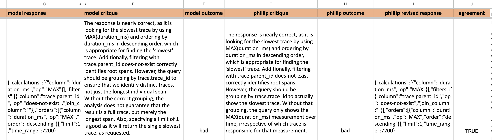
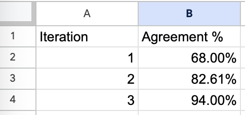

## Motivation  

动机[](https://hamel.dev/blog/posts/evals/#motivation)

I started working with language models five years ago when I led the team that created [CodeSearchNet](https://github.com/github/CodeSearchNet), a precursor to GitHub CoPilot.  

五年前，我开始与语言模型合作，当时我领导了创建 CodeSearchNet 的团队，这是 GitHub CoPilot 的前身。  

Since then, I’ve seen many successful and unsuccessful approaches to building LLM products.  

自那时以来，我见过许多成功和不成功的LLM产品的构建方法。  

I’ve found that unsuccessful products almost always share a common root cause: **a failure to create robust evaluation systems.**  

我发现，不成功的产品几乎总是有一个共同的根本原因：没有建立健全的评估系统。

I’m currently an independent consultant who helps companies build domain-specific AI products.  

我目前是一名独立顾问，帮助公司构建领域特定的 AI 产品。  

I hope companies can save thousands of dollars in consulting fees by reading this post carefully.  

我希望通过仔细阅读这篇文章，公司能够节省数千美元的咨询费用。  

As much as I love making money, I hate seeing folks make the same mistake repeatedly.  

尽管我喜欢赚钱，但我讨厌看到人们反复犯同样的错误。

This post outlines my thoughts on building evaluation systems for LLMs-powered AI products.  

本文概述了我对构建LLMs驱动的 AI 产品评估系统的思考。

## Iterating Quickly == Success  

快速迭代==成功

Like software engineering, success with AI hinges on how fast you can iterate.  

与软件工程一样，AI 的成功取决于你能够多快地迭代。  

You must have processes and tools for:  

您必须拥有以下过程和工具：

1.  Evaluating quality (ex: tests).  
    
    评估质量（例如：测试）。
2.  Debugging issues (ex: logging & inspecting data).  
    
    调试问题（例如：日志记录和检查数据）。
3.  Changing the behavior or the system (prompt eng, fine-tuning, writing code)  
    
    改变系统的行为（提示工程、微调、编写代码）

**Many people focus exclusively on #3 above, which prevents them from improving their LLM products beyond a demo.**[<sup data-immersive-translate-walked="99e3a0e9-de82-4e3f-808f-2ae11fe714e0">1</sup>](https://hamel.dev/blog/posts/evals/#fn1) Doing all three activities well creates a virtuous cycle differentiating great from mediocre AI products (see the diagram below for a visualization of this cycle).  

许多人只专注于上述第 3 点，这阻止了他们将LLM产品提升到演示之外的水平。 <sup data-immersive-translate-walked="99e3a0e9-de82-4e3f-808f-2ae11fe714e0">1</sup> 良好地完成这三个活动可以创建一个良性循环，区分出优秀和平庸的 AI 产品（请参见下图，以了解这个循环的可视化）。

If you streamline your evaluation process, all other activities become easy.  

如果您简化评估过程，其他所有活动都会变得容易。  

This is very similar to how tests in software engineering pay massive dividends in the long term despite requiring up-front investment.  

这与软件工程中的测试如何在长期内带来巨大回报的情况非常相似，尽管需要前期投资。

To ground this post in a real-world situation, I’ll walk through a case study in which we built a system for rapid improvement.  

为了将本文与现实情况联系起来，我将通过一个案例研究来介绍我们如何构建一个快速改进的系统。  

I’ll primarily focus on evaluation as that is the most critical component.  

我将主要关注评估，因为这是最关键的组成部分。

## Case Study: Lucy, A Real Estate AI Assistant  

案例研究：Lucy，一个房地产 AI 助手

[Rechat](https://rechat.com/) is a SaaS application that allows real estate professionals to perform various tasks, such as managing contracts, searching for listings, building creative assets, managing appointments, and more.  

Rechat 是一个 SaaS 应用程序，允许房地产专业人员执行各种任务，例如管理合同、搜索房源、构建创意资产、管理约会等。  

The thesis of Rechat is that you can do everything in one place rather than having to context switch between many different tools.  

Rechat 的论点是，你可以在一个地方完成所有事情，而不必在许多不同的工具之间切换。

[Rechat’s AI assistant, Lucy](https://rechat.com/ai/), is a canonical AI product: a conversational interface that obviates the need to click, type, and navigate the software.  

Rechat 的 AI 助手 Lucy 是一个典型的 AI 产品：一个对话界面，可以避免点击、输入和导航软件的需求。  

During Lucy’s beginning stages, rapid progress was made with prompt engineering.  

在 Lucy 的初期阶段，通过提示工程取得了快速进展。  

However, as Lucy’s surface area expanded, the performance of the AI plateaued.  

然而，随着 Lucy 的表面积扩大，AI 的性能出现了停滞。  

Symptoms of this were:  

这种情况的症状包括：

1.  Addressing one failure mode led to the emergence of others, resembling a game of whack-a-mole.  
    
    解决一个故障模式导致其他故障模式的出现，类似于打地鼠游戏。
2.  There was limited visibility into the AI system’s effectiveness across tasks beyond vibe checks.  
    
    除了“氛围检查”之外，对 AI 系统在各种任务中的有效性了解有限。
3.  Prompts expanded into long and unwieldy forms, attempting to cover numerous edge cases and examples.  
    
    提示扩展成了冗长而难以控制的形式，试图涵盖许多边缘情况和示例。

## Problem: How To Systematically Improve The AI?  

问题：如何系统地改进 AI？[](https://hamel.dev/blog/posts/evals/#problem-how-to-systematically-improve-the-ai)

To break through this plateau, we created a systematic approach to improving Lucy **centered on evaluation.** Our approach is illustrated by the diagram below.  

为了突破这个停滞期，我们创建了一个以评估为中心的系统化改进 Lucy 的方法。我们的方法如下图所示。


This diagram is a best-faith effort to illustrate my mental model for improving AI systems. In reality, the process is non-linear and can take on many different forms that may or may not look like this diagram.  

这个图表是我努力的最佳尝试，用来说明我改进 AI 系统的思维模型。实际上，这个过程是非线性的，可以采取许多不同的形式，可能与这个图表看起来不太一样。

I discuss the various components of this system in the context of evaluation below.  

我在评估的背景下讨论了这个系统的各个组成部分。

## The Types Of Evaluation  

评估的类型

Rigorous and systematic evaluation is the most important part of the whole system.  

严格而系统的评估是整个系统中最重要的部分。  

That is why “Eval and Curation” is highlighted in yellow at the center of the diagram.  

这就是为什么“评估和筛选”在图表的中心以黄色突出显示。  

You should spend most of your time making your evaluation more robust and streamlined.  

你应该花大部分时间来使你的评估更加健壮和高效。

There are three levels of evaluation to consider:  

有三个层次的评估需要考虑：

-   Level 1: Unit Tests  
    
    第一层：单元测试
-   Level 2: Model & Human Eval (this includes debugging)  
    
    第二层：模型和人工评估（包括调试）
-   Level 3: A/B testing  
    
    第三层：A/B 测试

The cost of Level 3 > Level 2 > Level 1. This dictates the cadence and manner you execute them.  

Level 3 > Level 2 > Level 1 的成本依次递增，这决定了你执行它们的节奏和方式。  

For example, I often run Level 1 evals on every code change, Level 2 on a set cadence and Level 3 only after significant product changes.  

例如，我经常在每次代码更改时运行 Level 1 的评估，按照一定的节奏运行 Level 2，而只在重大产品变化后才运行 Level 3。  

It’s also helpful to conquer a good portion of your Level 1 tests before you move into model-based tests, as they require more work and time to execute.  

在进入基于模型的测试之前，征服 Level 1 的测试也是有帮助的，因为它们需要更多的工作和时间来执行。

There isn’t a strict formula as to when to introduce each level of testing.  

并没有严格的公式来确定何时引入每个测试级别。  

You want to balance getting user feedback quickly, managing user perception, and the goals of your AI product.  

你需要平衡快速获取用户反馈、管理用户感知以及你的 AI 产品的目标。  

This isn’t too dissimilar from the balancing act you must do for products more generally.  

这与你对其他产品的平衡行为并没有太大的不同。

## Level 1: Unit Tests  

Level 1：单元测试[](https://hamel.dev/blog/posts/evals/#level-1-unit-tests)

Unit tests for LLMs are assertions (like you would write in [pytest](https://docs.pytest.org/en/8.0.x/)).  

LLMs的单元测试是断言（就像你在 pytest 中编写的那样）。  

Unlike typical unit tests, you want to organize these assertions for use in places beyond unit tests, such as data cleaning and automatic retries (using the assertion error to course-correct) during model inference.  

与典型的单元测试不同，你希望将这些断言组织起来，以便在单元测试之外的地方使用，例如数据清理和模型推断期间的自动重试（使用断言错误进行纠正）。  

The important part is that these assertions should run fast and cheaply as you develop your application so that you can run them every time your code changes.  

重要的是，这些断言应该在开发应用程序时快速且廉价地运行，以便在代码更改时每次都能运行它们。  

If you have trouble thinking of assertions, you should critically examine your traces and failure modes.  

如果你在思考断言时遇到困难，你应该对你的追踪和故障模式进行批判性的检查。  

Also, do not shy away from using an LLM to help you brainstorm assertions!  

此外，不要害怕使用LLM来帮助你产生断言的灵感！

### Step 1: Write Scoped Tests  

步骤 1：编写有范围的测试[](https://hamel.dev/blog/posts/evals/#step-1-write-scoped-tests)

The most effective way to think about unit tests is to break down the scope of your LLM into features and scenarios.  

思考单元测试的最有效方法是将你的LLM的范围分解为特性和场景。  

For example, one feature of Lucy is the ability to find real estate listings, which we can break down into scenarios like so:  

例如，Lucy 的一个特性是能够找到房地产列表，我们可以将其分解为以下场景：

**Feature: Listing Finder  

特性：列表查找器**

This feature to be tested is a function call that responds to a user request to find a real estate listing.  

这个要测试的特性是一个函数调用，它响应用户请求来查找房地产列表。  

For example, “Please find listings with more than 3 bedrooms less than $2M in San Jose, CA”  

例如，“请找到圣何塞，加利福尼亚州，价格低于 200 万美元，卧室数大于 3 间的房源”

The LLM converts this into a query that gets run against the CRM.  

LLM将其转换为针对 CRM 运行的查询。  

The assertion then verifies that the expected number of results is returned.  

然后，断言验证返回了预期数量的结果。  

In our test suite, we have three user inputs that trigger each of the scenarios below, which then execute corresponding assertions (this is an oversimplified example for illustrative purposes):  

在我们的测试套件中，我们有三个用户输入，触发以下每个场景，然后执行相应的断言（这只是一个为了说明目的而简化的示例）：

| Scenario  
场景 | Assertions  

断言 |
| --- | --- |
| Only one listing matches user query  

只有一个列表与用户查询匹配 | len(listing\_array) == 1 |
| Multiple listings match user query  

多个列表与用户查询匹配 | len(listing\_array) > 1 |
| No listings match user query  

没有列表与用户查询匹配 | len(listing\_array) == 0 |

  

There are also generic tests that aren’t specific to any one feature.  

还有一些通用测试，不针对任何特定功能。  

For example, here is the code for one such generic test that ensures the UUID is not mentioned in the output:  

例如，下面是一个通用测试的代码示例，用于确保输出中不提及 UUID：

```
const noExposedUUID = message => {
  // Remove all text within double curly braces
  const sanitizedComment = message.comment.replace(/\{\{.*?\}\}/g, '')

  // Search for exposed UUIDs
  const regexp = /[0-9a-f]{8}-[0-9a-f]{4}-[0-9a-f]{4}-[0-9a-f]{4}-[0-9a-f]{12}/ig
  const matches = Array.from(sanitizedComment.matchAll(regexp))
  expect(matches.length, 'Exposed UUIDs').to.equal(0, 'Exposed UUIDs found')
}
```

CRM results returned to the LLM contain fields that shouldn’t be surfaced to the user; such as the UUID associated with an entry.  

CRM 返回给LLM的结果包含不应向用户显示的字段，例如与条目相关联的 UUID。  

Our LLM prompt tells the LLM to not include UUIDs.  

我们的LLM提示告诉LLM不要包含 UUID。  

We use a simple regex to assert that the LLM response doesn’t include UUIDs.  

我们使用一个简单的正则表达式来断言LLM响应中不包含 UUID。

**Rechat has hundreds of these unit tests.  

Rechat 有数百个这样的单元测试。  

We continuously update them based on new failures we observe in the data as users challenge the AI or the product evolves.  

我们根据用户挑战 AI 或产品演进时观察到的新失败不断更新这些单元测试。** These unit tests are crucial to getting feedback quickly when iterating on your AI system (prompt engineering, improving RAG, etc.).  

这些单元测试对于在 AI 系统迭代时（如提示工程、改进 RAG 等）快速获得反馈至关重要。  

Many people eventually outgrow their unit tests and move on to other levels of evaluation as their product matures, but it is essential not to skip this step!  

随着产品成熟，许多人最终会超越他们的单元测试，并转向其他评估层面，但跳过这一步是不可或缺的！

### Step 2: Create Test Cases  

第二步：创建测试用例[](https://hamel.dev/blog/posts/evals/#step-2-create-test-cases)

To test these assertions, you must generate test cases or inputs that will trigger all scenarios you wish to test.  

要测试这些断言，您必须生成测试用例或输入，以触发您希望测试的所有场景。  

I often utilize an LLM to generate these inputs synthetically; for example, here is one such prompt Rechat uses to generate synthetic inputs for a feature that creates and retrieves contacts:  

我经常使用LLM来合成这些输入；例如，这是 Rechat 用来生成创建和检索联系人功能的合成输入的一个示例提示：

```
Write 50 different instructions that a real estate agent can give to his assistant to create contacts on his CRM. The contact details can include name, phone, email, partner name, birthday, tags, company, address and job.

For each of the instructions, you need to generate a second instruction which can be used to look up the created contact.

. The results should be a JSON code block with only one string as the instruction like the following:


[
  ["Create a contact for John (johndoe@apple.com)", 
  "What's the email address of John Smith?"]
]
```

Using the above prompt, we generate test cases like below:  

使用上述提示，我们生成如下的测试用例：

```
[ 
    [
        'Create a contact for John Smith (johndoe@apple.com) with phone number 123-456-7890 and address 123 Apple St.', 
        'What\'s the email address of John Smith?'
    ],
    [
        'Add Emily Johnson with phone 987-654-3210, email emilyj@email.com, and company ABC Inc.', 
        'What\'s the phone number for Emily Johnson?'
    ],
    [
        'Create a contact for Tom Williams with birthday 10/20/1985, company XYZ Ltd, and job title Manager.', 
        'What\'s Tom Williams\' job title?'
    ],
    [
        'Add a contact for Susan Brown with partner name James Brown, and email susanb@email.com.', 
    'What\'s the partner name of Susan Brown?'
    ],
…
]
```

For each of these test cases, we execute the first user input to create the contact.  

对于每个测试用例，我们执行第一个用户输入来创建联系人。  

We then execute the second query to fetch that contact.  

然后我们执行第二个查询来获取该联系人。  

If the CRM doesn’t return exactly 1 result then we know there was a problem either creating or fetching the contact.  

如果 CRM 没有返回确切的 1 个结果，那么我们就知道在创建或获取联系人时出现了问题。  

We can also run generic assertions like the one to verify UUIDs are not in the response.  

我们还可以运行通用的断言，比如验证响应中没有 UUID。  

You must constantly update these tests as you observe data through human evaluation and debugging.  

您必须不断更新这些测试，通过人工评估和调试来观察数据。  

The key is to make these as challenging as possible while representing users’ interactions with the system.  

关键是尽可能地使这些测试具有挑战性，同时代表用户与系统的交互。

You don’t need to wait for production data to test your system.  

您不需要等待生产数据来测试您的系统。  

You can make educated guesses about how users will use your product and generate synthetic data.  

您可以对用户如何使用您的产品进行合理猜测，并生成合成数据。  

You can also let a small set of users use your product and let their usage refine your synthetic data generation strategy.  

你还可以让一小部分用户使用你的产品，并让他们的使用经验来完善你的合成数据生成策略。  

One signal you are writing good tests and assertions is when the model struggles to pass them - these failure modes become problems you can solve with techniques like fine-tuning later on.  

一个信号表明你正在编写良好的测试和断言是，当模型难以通过它们时 - 这些失败模式成为你可以通过后续的微调等技术来解决的问题。

On a related note, unlike traditional unit tests, you don’t necessarily need a 100% pass rate.  

另外，与传统的单元测试不同，你不一定需要 100%的通过率。  

Your pass rate is a product decision, depending on the failures you are willing to tolerate.  

你的通过率是一个产品决策，取决于你愿意容忍的失败情况。

### Step 3: Run & Track Your Tests Regularly  

步骤 3：定期运行和跟踪你的测试[](https://hamel.dev/blog/posts/evals/#step-3-run-track-your-tests-regularly)

There are many ways to orchestrate Level 1 tests.  

有很多方法可以组织一级测试。  

Rechat has been leveraging CI infrastructure (e.g., GitHub Actions, GitLab Pipelines, etc.) to execute these tests.  

Rechat 一直在利用 CI 基础设施（例如 GitHub Actions、GitLab Pipelines 等）来执行这些测试。  

However, the tooling for this part of the workflow is nascent and evolving rapidly.  

然而，这个工作流程的工具链还处于初级阶段，正在快速发展中。

My advice is to orchestrate tests that involve the least friction in your tech stack.  

我的建议是在你的技术栈中选择最少摩擦的方式来组织测试。  

In addition to tracking tests, you need to track the results of your tests over time so you can see if you are making progress.  

除了跟踪测试，你还需要随时间跟踪测试结果，以便看到你是否在取得进展。  

If you use CI, you should collect metrics along with versions of your tests/prompts outside your CI system for easy analysis and tracking.  

如果您使用 CI（持续集成），您应该在 CI 系统之外收集测试/提示的版本和指标，以便进行简单的分析和跟踪。

I recommend starting simple and leveraging your existing analytics system to visualize your test results.  

我建议从简单的开始，利用您现有的分析系统来可视化您的测试结果。  

For example, Rechat uses Metabase to track their LLM test results over time.  

例如，Rechat 使用 Metabase 来跟踪他们的LLM测试结果的变化趋势。  

Below is a screenshot of a dashboard Rechat built with [Metabase](https://www.metabase.com/):  

下面是 Rechat 使用 Metabase 构建的仪表板的截图：


This screenshot shows the prevalence of a particular error (shown in yellow) in Lucy before (left) vs after (right) we addressed it.  

该截图显示了在我们解决该问题之前（左侧）和之后（右侧），Lucy 中特定错误（以黄色显示）的普遍程度。

## Level 2: Human & Model Eval  

Level 2: 人工和模型评估[](https://hamel.dev/blog/posts/evals/#level-2-human-model-eval)

After you have built a solid foundation of Level 1 tests, you can move on to other forms of validation that cannot be tested by assertions alone.  

在建立了坚实的 Level 1 测试基础之后，您可以进行其他形式的验证，这些验证不能仅通过断言来测试。  

A prerequisite to performing human and model-based eval is to log your traces.  

进行人工和基于模型的评估的先决条件是记录您的追踪信息。

### Logging Traces  

记录追踪信息[](https://hamel.dev/blog/posts/evals/#logging-traces)

A trace is a concept that has been around for a while in software engineering and is a log of a sequence of events such as user sessions or a request flow through a distributed system.  

追踪是软件工程中存在已久的概念，它是一系列事件的日志，例如用户会话或请求在分布式系统中的流程。  

In other words, tracing is a logical grouping of logs.  

换句话说，追踪是日志的逻辑分组。  

In the context of LLMs, traces often refer to conversations you have with a LLM.  

在LLMs的背景下，追踪通常指的是您与LLM的对话。  

For example, a user message, followed by an AI response, followed by another user message, would be an example of a trace.  

例如，用户消息，接着是 AI 的回复，再接着是另一个用户消息，这就是一个追踪的例子。

There are a growing number of solutions for logging LLM traces.[<sup data-immersive-translate-walked="99e3a0e9-de82-4e3f-808f-2ae11fe714e0">2</sup>](https://hamel.dev/blog/posts/evals/#fn2) Rechat uses [LangSmith](https://www.langchain.com/langsmith), which logs traces and allows you to view them in a human-readable way with an interactive playground to iterate on prompts.  

有越来越多的解决方案用于记录LLM的追踪。Rechat 使用 LangSmith，它记录追踪并允许您以人类可读的方式查看它们，并提供一个交互式的工具来迭代提示。  

Sometimes, logging your traces requires you to instrument your code. In this case, Rechat was using [LangChain](https://www.langchain.com/) which automatically logs trace events to LangSmith for you.  

有时，记录追踪需要您对代码进行仪器化。在这种情况下，Rechat 使用 LangChain 自动将追踪事件记录到 LangSmith 中。  

Here is a screenshot of what this looks like:  

这是一个屏幕截图，展示了这个过程的样子：


I like LangSmith - it doesn’t require that you use LangChain and is intuitive and easy to use.  

我喜欢 LangSmith - 它不需要您使用 LangChain，而且直观易用。  

Searching, filtering, and reading traces are essential features for whatever solution you pick.  

搜索、过滤和阅读追踪是您选择的任何解决方案的基本功能。  

I’ve found that some tools do not implement these basic functions correctly!  

我发现有些工具没有正确实现这些基本功能！

### Looking At Your Traces  

查看您的追踪信息[](https://hamel.dev/blog/posts/evals/#looking-at-your-traces)

**You must remove all friction from the process of looking at data.** This means rendering your traces in domain-specific ways. I’ve often found that it’s [better to build my own data viewing & labeling tool](https://hamel.dev/notes/llm/finetuning/04_data_cleaning.html) so I can gather all the information I need onto one screen.  

你必须消除查看数据的过程中的所有摩擦。这意味着以特定领域的方式呈现你的追踪数据。我经常发现，最好是构建自己的数据查看和标注工具，这样我就可以将所有需要的信息汇集到一个屏幕上。  

In Lucy’s case, we needed to look at many sources of information (trace log, the CRM, etc) to understand what the AI did.  

在 Lucy 的案例中，我们需要查看许多信息来源（追踪日志、CRM 等）来理解 AI 的工作情况。  

This is precisely the type of friction that needs to be eliminated.  

这正是需要消除的那种摩擦。  

In Rechat’s case, this meant adding information like:  

在 Rechat 的案例中，这意味着添加以下信息：

1.  What tool (feature) & scenario was being evaluated.  
    
    正在评估的工具（功能）和场景。
2.  Whether the trace resulted from a synthetic input or a real user input.  
    
    追踪结果是由合成输入还是真实用户输入产生的。
3.  Filters to navigate between different tools and scenario combinations.  
    
    在不同工具和场景组合之间导航的筛选器。
4.  Links to the CRM and trace logging system for the current record.  
    
    当前记录的 CRM 和追踪日志系统的链接。

I’ve built different variations of this tool for each problem I’ve worked on.  

我为每个问题构建了不同版本的这个工具。  

Sometimes, I even need to embed another application to see what the user interaction looks like.  

有时，我甚至需要嵌入另一个应用程序来查看用户交互的样子。  

Below is a screenshot of the tool we built to evaluate Rechat’s traces:  

以下是我们构建的用于评估 Rechat 跟踪的工具的截图：


Another design choice specific to Lucy is that we noticed that many failures involved small mistakes in the final output of the LLM (format, content, etc).  

Lucy 的另一个设计选择是，我们注意到许多故障涉及到LLM的最终输出中的小错误（格式、内容等）。  

We decided to make the final output editable by a human so that we could curate & fix data for fine-tuning.  

我们决定使最终输出可由人工编辑，以便我们可以筛选和修复数据以进行微调。

These tools can be built with lightweight front-end frameworks like Gradio, Streamlit, Panel, or Shiny in less than a day.  

这些工具可以使用轻量级前端框架（如 Gradio、Streamlit、Panel 或 Shiny）在不到一天的时间内构建。  

The tool shown above was built with Shiny for Python. Furthermore, there are tools like [Lilac](https://www.lilacml.com/) which uses AI to search and filter data semantically, which is incredibly handy for finding a set of similar data points while debugging an issue.  

上面展示的工具是使用 Python 的 Shiny 构建的。此外，还有像 Lilac 这样的工具，它使用人工智能来语义搜索和过滤数据，这在调试问题时非常方便，可以找到一组相似的数据点。

I often start by labeling examples as good or bad.  

我经常从将示例标记为好或坏开始。  

I’ve found that assigning scores or more granular ratings is more onerous to manage than binary ratings.  

我发现，与二进制评级相比，分配分数或更细粒度的评级更加繁琐。  

There are advanced techniques you can use to make human evaluation more efficient or accurate (e.g., [active learning](https://en.wikipedia.org/wiki/Active_learning_(machine_learning)), [consensus voting](https://supervisely.com/blog/labeling-consensus/), etc.), but I recommend starting with something simple.  

有一些高级技术可以使人工评估更高效或准确（例如主动学习、共识投票等），但我建议从简单的方法开始。  

Finally, like unit tests, you should organize and analyze your human-eval results to assess if you are progressing over time.  

最后，就像单元测试一样，您应该组织和分析您的人工评估结果，以评估您是否随时间推移取得了进展。

As discussed later, these labeled examples measure the quality of your system, validate automated evaluation, and curate high-quality synthetic data for fine-tuning.  

如后文所述，这些标记的示例用于衡量系统的质量，验证自动评估，并筛选高质量的合成数据进行微调。

#### How much data should you look at?  

你应该查看多少数据？[](https://hamel.dev/blog/posts/evals/#how-much-data-should-you-look-at)

I often get asked how much data to examine.  

我经常被问到应该查看多少数据。  

When starting, you should examine as much data as possible.  

在开始时，你应该尽可能地查看更多的数据。  

I usually read traces generated from ALL test cases and user-generated traces at a minimum. **You can never stop looking at data—no free lunch exists.** However, you can sample your data more over time, lessening the burden. [<sup data-immersive-translate-walked="99e3a0e9-de82-4e3f-808f-2ae11fe714e0">3</sup>](https://hamel.dev/blog/posts/evals/#fn3)  

我通常至少阅读从所有测试用例和用户生成的追踪中生成的追踪。你永远不能停止查看数据——没有免费的午餐。然而，随着时间的推移，你可以对数据进行更多的采样，减轻负担。

### Automated Evaluation w/ LLMs  

自动评估与LLMs[](https://hamel.dev/blog/posts/evals/#automated-evaluation-w-llms)

Many vendors want to sell you tools that claim to eliminate the need for a human to look at the data.  

许多供应商希望向你销售声称可以消除人工查看数据的工具。  

Having humans periodically evaluate at least a sample of traces is a good idea.  

定期让人工评估至少一部分追踪是一个好主意。  

I often find that “correctness” is somewhat subjective, and you must align the model with a human.  

我经常发现“正确性”在某种程度上是主观的，你必须将模型与人类对齐。

You should track the correlation between model-based and human evaluation to decide how much you can rely on automatic evaluation.  

你应该追踪基于模型和人工评估之间的相关性，以决定你可以多大程度上依赖自动评估。  

Furthermore, by collecting critiques from labelers explaining why they are making a decision, you can iterate on the evaluator model to align it with humans through prompt engineering or fine-tuning.  

此外，通过收集标注者解释他们为什么做出决策的批评意见，您可以通过提示工程或微调来迭代评估模型，使其与人类保持一致。  

However, I tend to favor prompt engineering for evaluator model alignment.  

然而，我更倾向于使用提示工程来对齐评估模型。

I love using low-tech solutions like Excel to iterate on aligning model-based eval with humans.  

我喜欢使用低技术解决方案，比如 Excel，来迭代地将基于模型的评估与人类对齐。  

For example, I sent my colleague Phillip the following spreadsheet every few days to grade for a different use-case involving a [natural language query generator](https://www.honeycomb.io/blog/introducing-query-assistant). This spreadsheet would contain the following information:  

例如，我每隔几天就会将以下电子表格发送给我的同事 Phillip，让他为涉及自然语言查询生成器的不同用例进行评分。这个电子表格包含以下信息：

1.  **model response**: this is the prediction made by the LLM.  
    
    模型回答：这是由LLM生成的预测。
2.  **model critique**: this is a critique written by a (usually more powerful) LLM about your original LLM’s prediction.  
    
    模型批评：这是由一个（通常更有权威的）LLM对您原始LLM的预测所写的批评。
3.  **model outcome**: this is a binary label the critique model assigns to the `model response` as being “good” or “bad.”  
    
    模型结果：这是批评模型对 `model response` 的二进制标签，表示其是“好”还是“坏”。

Phillip then fills out his version of the same information - meaning his critique, outcome, and desired response for 25-50 examples at a time (these are the columns prefixed with “phillip\_” below):  

然后，Phillip 会填写他自己版本的相同信息，即他的批评、结果和期望的回答，每次填写 25-50 个示例（这些示例的列以“phillip\_”为前缀）：



This information allowed me to iterate on the prompt of the critique model to make it sufficiently aligned with Phillip over time.  

这些信息使我能够通过时间来迭代批评模型的提示，使其与 Phillip 足够一致。  

This is also easy to track in a low-tech way in a spreadsheet:  

这在电子表格中也很容易进行低技术的跟踪：



This is a screenshot of a spreadsheet where we recorded our attempts to align model-based eval with a human evaluator.  

这是一个电子表格的截图，我们在其中记录了我们尝试将基于模型的评估与人类评估者对齐的过程。

General tips on model-based eval:  

关于基于模型的评估的一般提示：

-   Use the most powerful model you can afford.  
    
    尽量使用您能负担得起的最强大的模型。  
    
    It often takes advanced reasoning capabilities to critique something well.  
    
    批判性地评估某个事物通常需要高级的推理能力。  
    
    You can often get away with a slower, more powerful model for critiquing outputs relative to what you use in production.  
    
    相对于您在生产中使用的模型，您通常可以使用速度较慢但更强大的模型来批判性地评估输出。
-   Model-based evaluation is a meta-problem within your larger problem.  
    
    基于模型的评估是您更大问题中的一个元问题。  
    
    You must maintain a mini-evaluation system to track its quality.  
    
    您必须维护一个小型评估系统来跟踪其质量。  
    
    I have sometimes fine-tuned a model at this stage (but I try not to).  
    
    在这个阶段，我有时会对模型进行微调（但我尽量避免这样做）。
-   After bringing the model-based evaluator in line with the human, you must continue doing periodic exercises to monitor the model and human agreement.  
    
    在将基于模型的评估器与人类评估者对齐之后，您必须继续定期进行练习，以监控模型和人类的一致性。

My favorite aspect about creating a good evaluator model is that its critiques can be used to curate high-quality synthetic data, which I will touch upon later.  

我最喜欢创建一个好的评估模型的方面是，它的批评可以用来筛选高质量的合成数据，稍后我会详细介绍。

## Level 3: A/B Testing  

第三级：A/B 测试[](https://hamel.dev/blog/posts/evals/#level-3-ab-testing)

Finally, it is always good to perform A/B tests to ensure your AI product is driving user behaviors or outcomes you desire.  

最后，进行 A/B 测试是确保您的 AI 产品能够产生您期望的用户行为或结果的好方法。  

A/B testing for LLMs compared to other types of products isn’t too different.  

与其他类型的产品相比，对LLMs进行 A/B 测试并没有太大的区别。  

If you want to learn more about A/B testing, I recommend reading the [Eppo blog](https://www.geteppo.com/blog) (which was created by colleagues I used to work with who are rock stars in A/B testing).  

如果您想了解更多关于 A/B 测试的内容，我推荐阅读 Eppo 博客（该博客是由我曾经与之合作过的同事创建的，他们在 A/B 测试方面非常出色）。

It’s okay to put this stage off until you are sufficiently ready and convinced that your AI product is suitable for showing to real users.  

在您充分准备并确信您的 AI 产品适合向真实用户展示之前，可以推迟进行这个阶段的评估。  

This level of evaluation is usually only appropriate for more mature products.  

这种评估水平通常只适用于更成熟的产品。

## Evaluating RAG  

评估 RAG[](https://hamel.dev/blog/posts/evals/#evaluating-rag)

Aside from evaluating your system as a whole, you can evaluate sub-components of your AI, like RAG.  

除了整体评估系统外，您还可以评估 AI 的子组件，如 RAG。  

Evaluating RAG is beyond the scope of this post, but you can learn more about this subject [in a post by Jason Liu](https://jxnl.github.io/blog/writing/2024/02/28/levels-of-complexity-rag-applications/).  

评估 RAG 超出了本文的范围，但您可以在 Jason Liu 的一篇文章中了解更多相关内容。

## Eval Systems Unlock Superpowers For Free  

评估系统免费解锁超能力

In addition to iterating fast, eval systems unlock the ability to fine-tune and debug, which can take your AI product to the next level.  

除了快速迭代外，评估系统还能解锁微调和调试的能力，这可以将您的 AI 产品提升到一个新的水平。

## Fine-Tuning  

微调[](https://hamel.dev/blog/posts/evals/#fine-tuning)

Rechat resolved many failure modes through fine-tuning that were not possible with prompt engineering alone. **Fine-tuning is best for learning syntax, style, and rules, whereas techniques like RAG supply the model with context or up-to-date facts.**  

通过微调，Rechat 解决了许多无法仅通过提示工程解决的故障模式。微调最适合学习语法、风格和规则，而像 RAG 这样的技术则为模型提供了上下文或最新的事实。

99% of the labor involved with fine-tuning is assembling high-quality data that covers your AI product’s surface area.  

微调的 99%劳动涉及组装覆盖您的 AI 产品表面领域的高质量数据。  

However, if you have a solid evaluation system like Rechat’s, you already have a robust data generation and curation engine!  

然而，如果您拥有像 Rechat 这样的强大评估系统，您已经拥有了一个强大的数据生成和策划引擎！  

I will expand more on the process of fine-tuning in a future post.[<sup data-immersive-translate-walked="99e3a0e9-de82-4e3f-808f-2ae11fe714e0">4</sup>](https://hamel.dev/blog/posts/evals/#fn4)  

我将在未来的文章中更详细地介绍微调的过程。

### Data Synthesis & Curation  

数据合成与策划[](https://hamel.dev/blog/posts/evals/#data-synthesis-curation)

To illustrate why data curation and synthesis come nearly for free once you have an evaluation system, consider the case where you want to create additional fine-tuning data for the listing finder mentioned earlier.  

为了说明一旦拥有评估系统，数据策划和合成几乎是免费的，考虑一下您想为之前提到的列表查找器创建额外的微调数据的情况。  

First, you can use LLMs to generate synthetic data with a prompt like this:  

首先，您可以使用LLMs来生成带有类似提示的合成数据：

```
Imagine if Zillow was able to parse natural language. Come up with 50 different ways users would be able to search listings there. Use real names for cities and neighborhoods.

You can use the following parameters:

<ommitted for confidentiality>

Output should be a JSON code block array. Example:

[
"Homes under $500k in New York"
]
```

This is almost identical to the exercise for producing test cases!  

这几乎与生成测试用例的练习完全相同！  

You can then use your Level 1 & Level 2 tests to filter out undesirable data that fails assertions or that the critique model thinks are wrong.  

然后，您可以使用一级和二级测试来过滤掉不符合断言或被评论模型认为是错误的不良数据。  

You can also use your existing human evaluation tools to look at traces to curate traces for a fine-tuning dataset.  

您还可以使用现有的人工评估工具来查看追踪信息，为微调数据集筛选追踪信息。

## Debugging  

调试[](https://hamel.dev/blog/posts/evals/#debugging)

When you get a complaint or see an error related to your AI product, you should be able to debug this quickly.  

当您收到有关您的 AI 产品的投诉或看到与之相关的错误时，您应该能够快速进行调试。  

If you have a robust evaluation system, you already have:  

如果您拥有一个强大的评估系统，您已经拥有：

-   A database of traces that you can search and filter.  
    
    一个可以搜索和过滤的追踪数据库。
-   A set of mechanisms (assertions, tests, etc) that can help you flag errors and bad behaviors.  
    
    一组机制（断言、测试等），可以帮助您标记错误和不良行为。
-   Log searching & navigation tools that can help you find the root cause of the error.  
    
    日志搜索和导航工具，可以帮助您找到错误的根本原因。  
    
    For example, the error could be RAG, a bug in the code, or a model performing poorly.  
    
    例如，错误可能是 RAG，代码中的错误或模型表现不佳。
-   The ability to make changes in response to the error and quickly test its efficacy.  
    
    能够根据错误进行更改并快速测试其有效性的能力。

In short, there is an incredibly large overlap between the infrastructure needed for evaluation and that for debugging.  

简而言之，评估所需的基础设施与调试所需的基础设施之间存在非常大的重叠。

## Conclusion  

结论

Evaluation systems create a flywheel that allows you to iterate very quickly.  

评估系统可以创建一个飞轮，使您能够快速迭代。  

It’s almost always where people get stuck when building AI products.  

当构建 AI 产品时，这几乎总是人们遇到的难题所在。  

I hope this post gives you an intuition on how to go about building your evaluation systems. Some key takeaways to keep in mind:  

希望本文能让您对如何构建评估系统有所直觉。以下是一些要记住的关键要点：

-   Remove ALL friction from looking at data.  
    
    消除查看数据时的所有阻力。
-   Keep it simple. Don’t buy fancy LLM tools. Use what you have first.  
    
    保持简单。不要购买花哨的工具。先使用您已有的工具。
-   You are doing it wrong if you aren’t looking at lots of data.  
    
    如果您不查看大量数据，则做错了。
-   Don’t rely on generic evaluation frameworks to measure the quality of your AI.  
    
    不要依赖通用的评估框架来衡量您的 AI 的质量。  
    
    Instead, create an evaluation system specific to your problem.  
    
    相反，创建一个针对您的问题特定的评估系统。
-   Write lots of tests and frequently update them.  
    
    写很多测试并经常更新它们。
-   LLMs can be used to unblock the creation of an eval system. Examples include using a LLM to:  
    
    LLMs可以用来解决评估系统的创建问题。例如，可以使用LLM来：
    -   Generate test cases and write assertions  
        
        生成测试用例并编写断言
    -   Generate synthetic data  
        
        生成合成数据
    -   Critique and label data etc.  
        
        批判和标记数据等
-   Re-use your eval infrastructure for debugging and fine-tuning.  
    
    重复使用评估基础设施进行调试和微调。

I’d love to hear from you if you found this post helpful or have any questions. My email is `hamel@parlance-labs.com`.  

如果您觉得这篇文章有帮助或有任何问题，我很乐意听到您的意见。我的电子邮件是 `hamel@parlance-labs.com` 。

_This article is an adaptation of [this conversation](https://www.youtube.com/watch?v=B_DMMlDuJB0) I had with Emil Sedgh and Hugo Browne-Anderson on the [Vanishing Gradients podcast](https://vanishinggradients.fireside.fm/).  

本文是我在 Vanishing Gradients 播客上与 Emil Sedgh 和 Hugo Browne-Anderson 的对话的改编。  

Thanks to Jeremy Howard, Eugene Yan, Shreya Shankar, Jeremy Lewi, and Joseph Gleasure for reviewing this article.  

感谢 Jeremy Howard、Eugene Yan、Shreya Shankar、Jeremy Lewi 和 Joseph Gleasure 对本文的审阅。_

1.  This is not to suggest that people are lazy.  
    
    这并不是说人们懒惰。  
    
    Many don’t know how to set up eval systems and skip these steps.[↩︎](https://hamel.dev/blog/posts/evals/#fnref1)  
    
    很多人不知道如何设置评估系统，所以跳过了这些步骤。 ↩︎
    
2.  Some examples include [arize](https://arize.com/), [human loop](https://humanloop.com/), [openllmetry](https://github.com/traceloop/openllmetry) and [honeyhive](https://www.honeyhive.ai/).[↩︎](https://hamel.dev/blog/posts/evals/#fnref2)  
    
    一些例子包括 arize、human loop、openllmetry 和 honeyhive。 ↩︎
    
3.  A reasonable heuristic is to keep reading logs until you feel like you aren’t learning anything new.[↩︎](https://hamel.dev/blog/posts/evals/#fnref3)  
    
    一个合理的启发式方法是继续阅读日志，直到你觉得没有学到新的东西为止。 ↩︎
    
4.  If you cannot wait, I’ll be teaching [this course](https://maven.com/parlance-labs/fine-tuning) on fine-tuning soon.[↩︎](https://hamel.dev/blog/posts/evals/#fnref4)  
    
    如果你等不及的话，我很快就会教授这门关于微调的课程。 ↩︎
