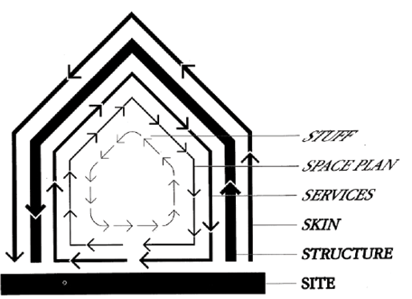

IN 2010, a traffic jam formed on China National Highway 110 between Beijing and Inner Mongolia that would last for 12 days and extend more than 60 miles, slowing thousands of cars to a near standstill, with speeds measured in single-digit miles per day.[1](https://summerofprotocols.com/protocols-dont-build-pyramids-web#footnote-025) The size and duration of the slowdown made the mass of stuck vehicles into a temporary, linear city, spawning a local economy of food vendors who catered to truck drivers as they passed the time playing cards.  

2010 年，在北京和内蒙古之间的 110 国道上出现了持续 12 天、长达 60 多英里的交通堵塞，数千辆汽车几乎停滞不前，日均车速仅为个位数英里。1 由于堵车规模大、持续时间长，大量滞留的车辆变成了一座临时的线性城市，催生了当地的食品摊贩经济，他们在卡车司机打牌消磨时间的同时，还为他们提供餐饮。  

By some accounts, it was the worst traffic jam ever observed.  

有人说，这是有史以来最严重的交通堵塞。

Notwithstanding extreme cases like China’s, there is no historical record of traffic jams. Like a rainy day, a traffic jam is an unexceptional event: statistical noise without a unifying narrative, a cascading slowdown that makes the inciting disruption irrelevant as it engulfs more and more cars.  

尽管有中国这样的极端案例，但历史上并没有关于交通堵塞的记录。就像下雨天一样，交通堵塞也是一个不寻常的事件：没有统一叙事的统计噪音，随着越来越多的汽车被堵塞，一连串的减速使得引发交通堵塞的因素变得无关紧要。  

Traffic congestion is not a catastrophe but business as usual, often quite predictable, rising and falling on daily cycles like tides.  

交通拥堵不是灾难，而是司空见惯的事情，往往是可以预测的，就像潮汐一样每天循环涨落。  

And while a traffic jam’s aggregate cost is quantifiable, in dollars or wasted hours, the pain it inflicts is ultimately personal, experienced as quotidian and arbitrary tedium by thousands of individual drivers.  

虽然交通堵塞的总成本可以用金钱或浪费的时间来量化，但它所造成的痛苦最终是个人的，是成千上万的驾驶员所经历的平凡而随意的乏味。  

Nothing is less interesting than someone else’s traffic jam story.  

没有什么比别人的堵车故事更不有趣了。

### Traffic Jams as Protocol Friction  

作为协议摩擦的交通堵塞

Local news media report on traffic in a manner that resembles their weather coverage, as though it’s a natural feature to plan one’s day around and beyond the scope of anyone’s control (which it is).  

当地新闻媒体对交通的报道方式就像他们对天气的报道一样，好像交通是人们计划一天的自然特征，超出了任何人的控制范围（事实的确如此）。  

A phenomenon like traffic congestion, having settled into its cyclical equilibrium, eventually congeals into a permanent feature of the built environment, and the traffic-laden roadway is thus a microcosm of the urban landscape as a whole: a layered matrix of material infrastructure (buildings, roads, fiber-optic cables) supporting additional strata of flows (people, money, information), with each layer possessing a different degree of flexibility.  

像交通拥堵这样的现象，在进入周期性平衡后，最终会凝结成建筑环境的永久特征，因此，车水马龙的道路是整个城市景观的缩影：由物质基础设施（建筑、道路、光缆）组成的分层矩阵，支持着更多层次的流动（人流、资金流、信息流），每一层都具有不同程度的灵活性。

Like traffic itself, the jam is a recognizable pattern that emerges from the interaction of these layers: human behavior, physical infrastructure, laws, and a variety of other forces.  

与交通堵塞本身一样，堵塞也是一种可识别的模式，它是由人类行为、物理基础设施、法律和其他各种力量等多个层面相互作用而形成的。  

However slowly it moves, this congestion is not a static object but a flow, a temporal mismatch between the supply of road capacity and the demand for it.  

无论移动速度多么缓慢，这种拥堵都不是静态的，而是流动的，是道路通行能力供应与需求之间的时间错配。  

At first glance, traffic jams appear to be a coordination failure—not quite anyone’s fault, but rather the emergent product of a self-organizing system.  

乍一看，交通堵塞似乎是协调失败--不是任何人的错，而是自组织系统的突发产物。  

When understood as individual sacrifice in the interest of collective mobility, however, traffic jams begin to blur the distinction between failure and success: by broadening or narrowing one’s perspective, either assessment is possible.  

然而，如果将交通堵塞理解为个人为了集体的流动性而做出的牺牲，那么它就开始模糊失败与成功之间的区别：通过拓宽或缩小自己的视角，任何一种评价都是可能的。

Traffic congestion is a representative problem of the contemporary Western city: a chronic tension between the built environment’s hard constraints and the fluid, volatile demand for that infrastructure and its various uses—a conflict that, in its worst cases, reverses the utility of a system altogether (like a municipal sewer system overflowing during a storm).  

交通拥堵是当代西方城市的一个代表性问题：建筑环境的硬约束与对基础设施及其各种用途的流动性、易变性需求之间的长期紧张关系--在最糟糕的情况下，这种冲突会使系统的效用完全逆转（就像暴雨期间城市下水道系统泛滥一样）。  

Better coordination mechanisms could presumably help, but the tradeoffs necessary for such optimization are often undesirable, entailing higher costs or restricted freedom.  

更好的协调机制可能会有所帮助，但这种优化所需的权衡往往是不可取的，会带来更高的成本或限制自由。  

As growing vehicular flow approaches the limit of a road’s maximum throughput, a traffic jam becomes the most likely resolution, like a packet-switched network suffering from bufferbloat[2](https://summerofprotocols.com/protocols-dont-build-pyramids-web#footnote-024) and jitter[3](https://summerofprotocols.com/protocols-dont-build-pyramids-web#footnote-023)—an analogy that highlights how cars and drivers are more like a highway’s informational content than individuals with agency, at least while on the road.  

当不断增长的车流接近公路最大吞吐量的极限时，交通堵塞就成了最有可能解决的问题，就像遭受缓冲区浮动 2 和抖动 3 之苦的分组交换网络--这个比喻强调了汽车和驾驶员更像是公路上的信息内容，而不是具有代理权的个人，至少在公路上是这样。  

Such outcomes, in their apparent disorder, may seem to indicate the absence of protocols.  

这样的结果表面上看是无序的，似乎表明缺乏规程。  

But they are more likely just symptoms of flawed protocols, or necessary headaches meted out by protocols working as intended.  

但它们更有可能只是有缺陷的协议的症状，或者是协议按原定计划运行所带来的必要的头痛。

Traffic jams are a problem that is not meant to be solved but managed—one possible approach to the challenge of distributing aggregate benefits and costs among individuals.  

交通堵塞问题不是用来解决的，而是用来管理的，这是应对在个人之间分配总收益和总成本这一挑战的一种可行方法。  

The jam is a feature of traffic, not a bug—less a failure than the janky avoidance of failure, a necessary compromise, the sufficient but “dumb” management of high throughput.  

拥堵是交通的一个特征，而不是一个错误，它是一种必要的妥协，是对高吞吐量进行充分但 "笨拙 "的管理，而不是避免失败的笨拙。  

What is traffic, after all, but a multitude of cars on the road, each driver pursuing their own self-interest, using transportation infrastructure for its intended purpose?  

归根结底，交通不过是道路上的众多汽车，每个驾驶员都在追求自身利益，利用交通基础设施达到预期目的。  

You aren’t stuck in traffic. You are traffic.  

你不是堵在路上。你就是堵车。

### Cities and Their Problems  

城市及其问题

As nodes of concentrated human activity, cities are inherently sites of conflict, as well as systems for resolving that conflict.  

作为人类活动集中的节点，城市本质上是冲突的场所，也是解决冲突的系统。  

If civilization is increasingly urbanized, so are its problems. Many of the contemporary city’s seemingly disparate troubles, including traffic congestion, are unified by an underlying condition: a mismatch between the built environment and the collective needs of its inhabitants, between physical systems and information flows, between material structures and the ever-changing uses to which they are put.  

如果说文明正在日益城市化，那么问题也在日益城市化。当代城市的许多看似不同的问题，包括交通拥堵，都有一个潜在的条件：建筑环境与居民的集体需求不匹配，物理系统与信息流不匹配，物质结构与不断变化的用途不匹配。

In the United States and elsewhere, city dwellers grapple with this mismatch in a variety of ways: widespread, often imprecise complaints about gentrification, along with an increasingly polarized debate about the proper solution to declining residential affordability, attest to a dissatisfaction with how access to the built environment is distributed.  

在美国和其他地方，城市居民以各种方式努力解决这种不匹配问题：对城市化的广泛、往往不精确的抱怨，以及对住宅可负担性下降的适当解决方案日益两极分化的争论，都证明了人们对建筑环境使用权分配方式的不满。  

Other urban areas, meanwhile, face economic decline and population loss, a phenomenon epitomized by the deindustrializing American Rust Belt in the late 20th century.  

与此同时，其他城市地区也面临着经济衰退和人口流失的问题，20 世纪末美国铁锈地带的去工业化现象就是一个缩影。  

The more recent explosion of remote work has led to a persistent underutilization of central city office space that seems poised to echo that previous phase of urban deindustrialization.  

最近，远程工作的爆炸式增长导致城市中心办公空间的利用率持续低下，这似乎与前一阶段的城市非工业化相呼应。  

Globally scaled problems like climate change and the COVID-19 pandemic have threatened the perceived viability of specific cities, or of cities in general, while exposing flaws in how those cities are organized.  

气候变化和 COVID-19 大流行病等全球性问题威胁着特定城市或一般城市的生存能力，同时也暴露了这些城市组织方式的缺陷。  

Chronic issues like traffic congestion endure.  

交通拥堵等长期问题依然存在。  

In all of these cases, the cumbersome base layers of the built environment can’t keep up with circumstances that seem to change faster and faster—and in their rigid materiality, how could they?  

在所有这些情况下，建筑环境的繁琐基础层都无法跟上似乎变化越来越快的环境--而且在其僵硬的物质性中，它们怎么可能跟得上？

More fundamentally, there is a prevailing sentiment among individuals that the city they want is unattainable—that they lack the agency to shape the built environment they inhabit, with real estate market conditions, digital platforms, corporate interests, vast infrastructure networks, and inexorable climate volatility superseding more local or individual control of housing, public space, commerce, and other urban systems. This misalignment fuels a desire for a more authentic, participatory urbanism: walkable cities, third places,[4](https://summerofprotocols.com/protocols-dont-build-pyramids-web#footnote-022) local community, a flourishing small business ecosystem, and a general reclamation of agency in an atomized, consumerized city.  

更根本的是，个人普遍认为他们想要的城市无法实现--他们缺乏塑造自己所居住的建筑环境的能力，房地产市场条件、数字平台、企业利益、庞大的基础设施网络以及不可阻挡的气候波动，取代了地方或个人对住房、公共空间、商业和其他城市系统的控制。这种错位激发了人们对更真实、参与性更强的城市主义的渴望：步行城市、第三空间、4 个本地社区、繁荣的小企业生态系统，以及在原子化、消费化的城市中重新获得自主权。

Not only is the built environment _temporally_ mismatched to collective needs, it is _spatially_ mismatched: the mechanisms for effecting change at local and individual scales are deficient, exacerbating both categories of misalignment.  

建筑环境不仅在时间上与集体需求不匹配，而且在空间上也不匹配：在地方和个人范围内实现变革的机制不足，加剧了这两类不匹配。  

Traffic exhibits this quality too, as a large-scale system that negatively impacts specific neighborhoods or commercial districts while subsuming or overwhelming individual action.  

交通也表现出这种特质，作为一个大规模的系统，它对特定社区或商业区产生负面影响，同时淹没或压倒个人行动。  

As these global forces exert a growing influence over local activities, there is a dearth of agency at more local scales: the individual, the household, the block, the neighborhood, and even the city itself.  

随着这些全球力量对地方活动的影响越来越大，在更大的地方范围内，即个人、家庭、街区、邻里，甚至城市本身，都缺乏机构。

The urban environment, again, is a layered system. In his 1994 book _How Buildings Learn,_ Stewart Brand quotes architect Frank Duffy’s assertion that a building is not a building per se, but “several layers of longevity of built components.”[5](https://summerofprotocols.com/protocols-dont-build-pyramids-web#footnote-021) These “pace layers” range from the more rigid—the building’s site and structure—to the more fluid and adaptable—the interior layout, furniture, and decorative elements.  

城市环境也是一个分层系统。斯图尔特-布兰德（Stewart Brand）在 1994 年出版的《建筑如何学习》一书中引用了建筑师弗兰克-达菲（Frank Duffy）的论断，即一栋建筑本身并不是一栋建筑，而是 "几层长寿的建筑构件"。5 这些 "步伐层 "的范围从较为僵硬的--建筑物的场地和结构--到较为流动和可适应的--室内布局、家具和装饰元素。  

Beyond its practical insight, Brand’s framing offers a broader understanding of how systems evolve over time and how humans live with those systems. Organizational agency, he notes, often corresponds to the pace layers, with faster-changing layers subject to more individual control (a homeowner or tenant) and slower-changing layers stewarded by the community or state.除了实用的洞察力之外，布兰德的框架还提供了对系统如何随时间演变以及人类如何与这些系统共存的更广泛理解。他指出，组织机构通常与节奏层相对应，变化较快的节奏层由个人（房主或租户）控制，而变化较慢的节奏层则由社区或国家管理。  

From Stuart Brand, How Buildings Learn: What Happens After They’re Built, chapter 2, “Shearing Layers” (New York: Viking Penguin, 1994)  

摘自斯图尔特-布兰德：《建筑是如何学习的？建筑建成后的情况》，第 2 章，"剪切层"（纽约：维京企鹅出版社，1994 年）

Perhaps most importantly, Brand observes, the dynamics of a building, city, or any system “will be dominated by the slow components, with the rapid components simply following along.”[6](https://summerofprotocols.com/protocols-dont-build-pyramids-web#footnote-020)  

也许最重要的是，布兰德认为，建筑物、城市或任何系统的动态 "将由慢速部分主导，而快速部分只是跟随其后"。6

This is both a blessing and a curse: the slow layers provide continuity, constraint, and stability, while the quicker layers are sources of innovation and dynamism.  

这既是好事也是坏事：慢速层提供了连续性、约束和稳定性，而快速层则是创新和活力的源泉。  

“But if we let our buildings come to a full stop, they stop us.”[7](https://summerofprotocols.com/protocols-dont-build-pyramids-web#footnote-019) The tension or “shearing” between the built environment’s various layers as they change at different rates is an unavoidable condition, but Brand notes that an adaptive system allows for “slippage” between those layers:  

"但如果我们让建筑完全停止，它们就会阻止我们"。7 建筑环境的各个层次以不同的速度变化时，它们之间的张力或 "剪切 "是不可避免的，但布兰德指出，自适应系统允许这些层次之间的 "滑动"：

When the base layers of the urban landscape, being both slow and expensive to modify, are unable to adapt and change as quickly as we’d like them to—when the hardware can’t keep up with the software that runs on it (sometimes literally)—then, in the meantime, we can turn our attention from its more rigid base layers to the more flexible and adaptable upper layers—the parts of the built environment that aren’t nailed down, so to speak, and the social, commercial, and informational layers on top of it all.  

当城市景观的底层由于修改速度慢、成本高，无法像我们希望的那样快速适应和变化时--当硬件跟不上软件的运行速度时（有时是真的）--与此同时，我们可以将注意力从较为僵硬的底层转向更为灵活、适应性更强的上层--可以说是建筑环境中没有被钉死的部分，以及在其之上的社会、商业和信息层。

Those malleable upper layers, as Brand observed, are also more responsive to local and individual influence.  

正如布兰德所观察到的，这些可塑性强的上层也更容易受到地方和个人的影响。  

It is easier to reorganize the furniture in one’s house than to change the building’s structure or expand the site on which it’s built.  

比起改变建筑结构或扩大建筑用地，重新摆放家中的家具要容易得多。  

Longer-term interventions in the built environment that adapt the base layers to new conditions are still worthwhile—they are as critical as ever—but, for individuals working at smaller spatial and temporal scales, the “software” (and the protocols that mediate it) may be a more fruitful domain of intervention than the hardware.  

但是，对于在较小的空间和时间范围内工作的个人来说，"软件"（以及对其进行调解的协议）可能是比硬件更有成效的干预领域。

The traffic jam, again, exemplifies this dynamic, and foreshadowed the broader problem when it first emerged in the 20th century: a coordination challenge bounded by physical infrastructure constraints that make subpar performance seem inevitable—quick systems blocked by slow systems, with insufficient slippage between them (in contrast to the infrastructure for a transportation mode like the bicycle).  

交通堵塞再次体现了这一动态，并预示了 20 世纪首次出现的更广泛的问题：受物理基础设施限制的协调挑战，使性能不佳似乎不可避免--快速系统被慢速系统阻塞，两者之间没有足够的滑动空间（与自行车等交通工具的基础设施形成鲜明对比）。  

Aside from limited solutions like tolls, congestion pricing, and HOV lanes, highway traffic protocols amount to a faux-democratic non-decision about how a multitude of overlapping vehicular trips should be organized and prioritized, with little regard for alternative paradigms that might reflect different goals or priorities.  

除了收费、拥堵定价和 HOV 车道等有限的解决方案外，高速公路交通协议等同于一种虚假的非民主决定，即如何组织大量重叠的车辆出行并确定其优先次序，而很少考虑可能反映不同目标或优先次序的替代模式。  

(Notably, mobile apps like Waze and Google Maps have emerged as an ad hoc coordination layer for traffic, although they have not changed the underlying paradigm.) Despite the looming prospect of self-driving cars finally rationalizing traffic, most drivers do not expect congestion to go away; our acceptance of the traffic jam is a kind of infrastructural fatalism.  

(值得注意的是，Waze 和谷歌地图等移动应用程序已经成为交通的临时协调层，尽管它们并没有改变基本模式）。尽管自动驾驶汽车有望最终实现交通合理化，但大多数司机并不指望交通拥堵会消失；我们对交通拥堵的接受是一种基础设施宿命论。

The allocation challenges afflicting many other urban systems, such as housing and public space, are versions of the traffic jam.  

困扰许多其他城市系统（如住房和公共空间）的分配难题就是交通堵塞的翻版。  

Like traffic jams, they have become so familiar and so persistent that they seem less like problems than like a sort of weather—abiding circumstances we should just learn to live with.  

就像交通堵塞一样，它们已经变得如此熟悉和顽固，以至于它们看起来不像是问题，而像是一种我们应该学会忍受的天气状况。

### How Protocols Work  

协议如何发挥作用

To claim that the built environment is full of infrastructurally constrained coordination problems is another way of saying that cities have _protocol_ problems. If protocols are coordination mechanisms supported by infrastructure, then cities are dense clusters of overlapping protocols—organizing processes that channel or filter physically grounded behavior in the pursuit of some overarching goal, such as traffic flow, public space usage, or the allocation of housing.  

说建筑环境充满了受基础设施制约的协调问题，就是说城市存在协议问题的另一种说法。如果说协议是由基础设施支持的协调机制，那么城市就是由重叠协议组成的密集群落--这些协议是为实现交通流量、公共空间使用或住房分配等总体目标而引导或过滤有形行为的组织过程。  

In his 1996 paean to the urban street grid, _Ladders_, Albert Pope argues that the widespread expansion of the grid in the 19th century “reconceived the city as an active process rather than a discrete urban plan.”[9](https://summerofprotocols.com/protocols-dont-build-pyramids-web#footnote-017) As this has become even more true in the time since, the role of protocols in the built environment has grown accordingly.  

阿尔伯特-波普（Albert Pope）在 1996 年出版的城市街道网格颂歌《梯子》中指出，19 世纪网格的广泛扩张 "将城市重新视为一个活跃的过程，而不是一个独立的城市规划"。9 由于这一观点在此后的时间里变得更加真实，协议在建筑环境中的作用也随之增长。

As with computers, the protocols of the built environment form a supple middle layer between hardware and software, binding the two together by engaging with the specific characteristics of each.  

与计算机一样，建筑环境的协议在硬件和软件之间形成了一个柔软的中间层，通过与每种硬件和软件的具体特性相结合，将两者结合在一起。  

Building codes and zoning laws, for example, address both the physical forms of the structures they regulate as well as their uses and externalities.  

例如，建筑规范和分区法既涉及其所规范的建筑物的物理形态，也涉及其用途和外部性。

Broadly, protocols can be understood as _infrastructure plus behavior_ (this oversimplifies the concept somewhat but will suffice for now).  

从广义上讲，协议可以理解为基础设施加行为（这在一定程度上简化了概念，但现在已经足够）。  

While protocols often depend upon their supporting infrastructure, they are also separate from it.  

虽然协议通常依赖于其支持性基础设施，但它们也与之分离。  

At the end of Don DeLillo’s novel _White Noise_, the protagonist’s 6-year-old son rides his tricycle down an embankment and across the busy multi-lane expressway near their home, narrowly avoiding a catastrophic accident:  

在唐-德里罗（Don DeLillo）的小说《白噪音》（White Noise）的结尾，主人公 6 岁的儿子骑着三轮车冲下堤坝，穿过家附近繁忙的多车道高速公路，险些酿成大祸：

It is thus possible to occupy infrastructure without participating in its corresponding protocols.  

因此，我们可以在不参与相应协议的情况下占用基础设施。  

Traffic protocols are not the road itself, nor are they the drivers, but a layer that mediates the interaction between those domains—a set of rules, norms, incentives, and design affordances that work together to translate a potentially chaotic range of behavior into a more orderly result.  

交通规则不是道路本身，也不是驾驶员，而是这些领域之间互动的中介层--一套规则、规范、激励措施和设计能力，它们共同作用，将潜在的混乱行为转化为更有序的结果。  

To perhaps state the obvious, not every immaterial process or set of rules is a protocol.  

显而易见，并非所有非物质过程或规则都是协议。  

Additionally, not every protocol works well.  

此外，并非每个协议都能很好地发挥作用。  

There are certain characteristics that all protocols share, along with a larger set of criteria, such as legibility, that characterize good protocols.  

所有协议都有一些共同的特点，同时还有一套更大的标准，例如可读性，这些都是好协议的特征。

Protocols are essential to cities.  

协议对城市至关重要。  

The physical concentration of thousands or millions of people and the intersection points of myriad local and global systems, all competing to use the same finite space, are places of constant compromise at every scale, full of externalities that must be managed, boundaries that must be negotiated, and conflicts that must be resolved.  

成千上万或数以百万计的人聚集在一起，无数的地方和全球系统交汇在一起，争相使用同一个有限的空间，在每一个规模上都是不断妥协的地方，充满了必须管理的外部因素、必须协商的边界和必须解决的冲突。  

From the individual lot to the block to the neighborhood and on up, cities contain sites of potential chaos that only maintain stability via the delicate balancing act that protocols perform, constraining individual agency along certain dimensions in order to extend it along others (but always within limits).  

从单个地块到街区，再到邻里，城市包含着潜在的混乱，只有通过协议进行微妙的平衡才能保持稳定，协议在某些方面限制了个人的能动性，以便在其他方面扩展个人的能动性（但总是在一定范围内）。

A local street in a dense urban core, for example, must accommodate traffic circulation, pedestrian movement, commercial activity, the interface between public and private residential space, and the wide range of additional activities that happen in the urban public realm.  

例如，在密集的城市核心地区，一条地方街道必须满足交通流、行人流、商业活动、公共和私人住宅空间之间的衔接，以及在城市公共领域发生的各种其他活动。  

These various systems are often at odds, sharing physical space by necessity.  

这些不同的系统往往相互冲突，不得不共享物理空间。  

Pedestrians cross the street orthogonally to the flow of cars while delivery vehicles find it expedient to park in bike lanes, risking a traffic citation that may be inconsistently enforced.  

行人横穿马路时与车流呈正交，而送货车辆则认为将车停在自行车道上是一种权宜之计，冒着被交通部门处罚的风险，而这种处罚的执行可能并不一致。  

Construction and maintenance work disrupt routine activities in exchange for longer-term benefits, which do not always accrue to the same parties who suffer its inconvenience.  

施工和维护工作扰乱了日常活动，却换来了较长期的利益，而这些利益并不总是由遭受不便的各方获得。  

Protocols help to manage these inevitable conflicts: shared street usage depends upon a mixture of behavioral patterns and laws, such as pedestrians’ right of way in crosswalks, along with physical design elements like street signs, traffic lanes, and curbs.  

协议有助于管理这些不可避免的冲突：共用街道的使用取决于行为模式和法律（如行人在人行横道上的通行权）的混合，以及物理设计元素（如街道标志、车道和路缘）。  

In many places, jaywalking is prohibited by laws that are largely unenforced, giving individuals discretion to decide when such crossings are safe or appropriate.  

在许多地方，法律禁止乱穿马路，但这些法律基本上没有得到执行，因此个人可以自行决定何时过马路是安全或适当的。

Defining what a city actually is, and what purpose cities ultimately serve, affirms the importance of protocols: a city is a place of concentrated _exchange_ and _interaction_—an active process, as Pope describes it.  

对城市的定义，以及城市最终的目的，肯定了协议的重要性：城市是一个集中交流和互动的地方--正如波普所描述的那样，是一个积极的过程。  

Urban theorist Michael Batty writes that the city’s essential feature is “interactions between different individuals rooted in time and space.”[11](https://summerofprotocols.com/protocols-dont-build-pyramids-web#footnote-015) Cities are where we meet to exchange money, goods, ideas, and above all, information.  

城市理论家迈克尔-巴蒂（Michael Batty）写道，城市的基本特征是 "植根于时间和空间的不同个体之间的互动"。11 城市是我们会面交换金钱、货物、思想，尤其是信息的地方。  

This implies a physical clustering of people—the people who are doing the interacting and exchanging, in the forms of commerce, cultural production, and social activity—and while cities are sites of concentrated population, that is secondary to their status as sites of concentrated _interaction_. A city is an information system, a conduit of flow.  

这意味着人的聚集--以商业、文化生产和社会活动的形式进行互动和交流的人的聚集--虽然城市是人口集中的地方，但这是次要的，因为城市是互动集中的地方。城市是一个信息系统，一个流动的通道。  

As architecture historian Kazys Varnelis argues, a city is a communication system, inextricable from the network infrastructure that supports it.[12](https://summerofprotocols.com/protocols-dont-build-pyramids-web#footnote-014) (Suburbs and other settlement patterns that are not commonly understood as “cities” also enable interaction, but less densely.)  

正如建筑历史学家卡齐斯-瓦内里斯（Kazys Varnelis）所言，城市是一个通信系统，与支持城市的网络基础设施密不可分12 （郊区和其他通常不被理解为 "城市 "的居住模式也能实现互动，但密度较低）。12（郊区和其他通常不被理解为 "城市 "的居住模式也能实现互动，但密度较低）。

Viewed another way, protocols are the immaterial apparatus that support and direct the physically grounded information flows that are concentrated in cities and transmitted by urban infrastructure.  

从另一个角度看，协议是一种非物质工具，它支持并引导着集中在城市并由城市基础设施传输的有形信息流。  

In her 2014 book _Extrastatecraft_, Keller Easterling describes the contemporary built environment as being increasingly structured by “infrastructure space,” an operating system or medium of information that governs the physical realm:  

凯勒-伊斯特林（Keller Easterling）在其 2014 年出版的著作《外在技艺》（Extrastatecraft）中描述，当代建筑环境越来越多地由 "基础设施空间 "构成，这是一种管理系统或信息媒介，管理着物理领域：

Those “invisible, powerful activities” are often protocols.  

这些 "无形而强大的活动 "往往是协议。  

And despite their immateriality, protocols imprint themselves on the physical landscape itself, producing observable patterns that both express the protocols’ nature and shape their ongoing performance, in a feedback loop.  

尽管协议是非物质性的，但它会给物理景观本身打上自己的烙印，产生可观察到的模式，这些模式既表达了协议的性质，又在反馈循环中塑造了协议的持续表现。  

The design of parks and public squares, for example, often codifies the informal protocols of public space usage (a process documented in William H.  

例如，公园和公共广场的设计通常会将公共空间使用的非正式协议编纂成文（William H.  

Whyte’s 1980 book _The Social Life of Small Urban Spaces_).  

Whyte 1980 年出版的《小型城市空间的社会生活》一书）。

### Cities as Protocols  

城市即协议

Where flows of information, human behavior, and physical infrastructure meet, protocols are often found.  

在信息流、人类行为和有形基础设施交汇的地方，往往能找到协议。  

Not only do cities _contain_ protocols within and between systems like traffic and public space, cities also _are_ protocols themselves.  

城市不仅包含交通和公共空间等系统内部和系统之间的协议，城市本身也是协议。  

A city, at its essence, is a localized system for organizing and focusing collective behavior toward coherent goals, like commerce or cultural production.  

从本质上讲，城市是一个本地化系统，用于组织和集中集体行为，以实现一致的目标，如商业或文化生产。  

And that is just what protocols facilitate. A more robust definition of protocols is this: _a structured process that organizes participants’ behavior in the interest of achieving a collective goal._  

而这正是协议的作用所在。协议的一个更严谨的定义是：为了实现集体目标而组织参与者行为的结构化过程。

Alfred North Whitehead said that “civilization advances by extending the number of operations we can perform without thinking about them.”[14](https://summerofprotocols.com/protocols-dont-build-pyramids-web#footnote-012) Protocols embody this process; understanding them this way supports the assertion that cities themselves are protocols, efficiently compressing civilizational knowledge and effort, thereby maximizing others’ ability to make use of it.  

阿尔弗雷德-诺斯-怀特海（Alfred North Whitehead）说过，"文明的进步是通过扩大我们无需思考即可完成的操作的数量"。14 规程体现了这一过程；以这种方式理解规程，可以支持这样的论断，即城市本身就是规程，它有效地压缩了文明的知识和努力，从而最大限度地提高了他人利用这些知识和努力的能力。  

As Lewis Mumford writes in _The Culture of Cities_:  

刘易斯-芒福德在《城市文化》一书中写道：

Protocolization is thus an essential quality of the urban built environment.  

因此，礼宾化是城市建筑环境的一个基本特征。  

Cities extend the operations available to their inhabitants by “doing the thinking” for them, enabling more sophisticated forms of interaction than would be possible in rural isolation.  

城市通过代人 "思考"，扩大了居民的活动范围，实现了比与世隔绝的农村更复杂的互动形式。  

Geographic hubs like Silicon Valley, Hollywood, and Wall Street all illustrate the amplifying effects of urban clustering and the shared infrastructure that it creates, but those are only the most visible examples of a phenomenon that every city dweller benefits from.  

硅谷、好莱坞和华尔街等地理中心都说明了城市群的放大效应及其创造的共享基础设施，但这些只是最明显的例子，每个城市居民都能从中受益。  

The cognitive burden of city life is likely higher than that of rural life, of course—a density of choices accompanies the density of interactions—but cities’ ability to amplify and extend one’s actions means that the benefits of that cognitive burden are higher still, encouraging more intensive usage of urban infrastructure.  

当然，城市生活的认知负担可能高于农村生活--选择的密度伴随着互动的密度，但城市放大和扩展个人行动的能力意味着认知负担的收益更高，从而鼓励人们更密集地使用城市基础设施。

A protocolized landscape tends to be user-friendly relative to the unprotocolized alternative, at least along the dimensions that align with the protocols’ functionality (and at the expense of dimensions that do not).  

与未按协议设计的方案相比，按协议设计的方案往往更便于用户使用，至少在与协议功能相一致的方面是这样（而在与协议功能不一致的方面则是这样）。  

Today, many individuals inhabit a nearly continuous globalized ecosystem of protocolized infrastructure, evoked by metaphors like the “cloud”—in this milieu, an iPhone and a credit card are enough to ensure seamless passage through cities around the world, with relatively uninterrupted access to an array of services like Uber and Airbnb that smooth over the differences between places.  

如今，许多人都居住在一个由协议化基础设施组成的近乎连续的全球化生态系统中，"云"（cloud）就是这样的一个比喻--在这个环境中，一部 iPhone 和一张信用卡就足以确保在世界各地的城市中无缝通行，还可以相对不间断地使用 Uber 和 Airbnb 等一系列服务，消除各地之间的差异。

In his 1965 essay “The Great Gizmo,” Reyner Banham praised the potent role of the gizmo or “clip-on device” in American culture, which he describes as “a small self-contained unit of high performance in relation to its size and cost, whose function is to transform some undifferentiated set of circumstances to a condition nearer human desires.”[16](https://summerofprotocols.com/protocols-dont-build-pyramids-web#footnote-010) Although Banham did not invoke protocols, his essay implies a complementary relationship between protocols and gizmos, with the protocols making gizmos more potent and versatile and gizmos making protocols more useful and usable.  

雷纳-班纳姆（Reyner Banham）在 1965 年发表的文章《伟大的小玩意儿》（The Great Gizmo）中赞扬了小玩意儿或 "夹式装置 "在美国文化中的强大作用，他将小玩意儿描述为 "相对于其体积和成本而言，具有高性能的小型自足装置，其功能是将一些无差别的环境转变为接近人类愿望的状态"。16 虽然班纳姆没有引用协议，但他的文章暗示了协议与小工具之间的互补关系，协议使小工具更强大、用途更广泛，而小工具则使协议更有用、更可用。  

Smartphones and cars are both ubiquitous because of robust mobile network coverage and road access; widespread usage of those devices, in turn, creates demand for further refinement and utilization of the protocols and infrastructure that support them.  

由于强大的移动网络覆盖和道路通行能力，智能手机和汽车无处不在；反过来，这些设备的广泛使用又要求进一步完善和利用支持它们的协议和基础设施。

If the city itself is a protocol, it is also a Russian doll that comprises many more protocols, at every scale.  

如果说城市本身是一个协议，那么它也是一个俄罗斯娃娃，由更多不同规模的协议组成。  

That is, protocols are frequently nested within other protocols, in the built environment and everywhere else.  

也就是说，在建筑环境和其他任何地方，协议经常嵌套在其他协议之中。  

The most complex instances of protocols, such as markets or religions or cities, are made up of countless “smaller” protocols that coordinate narrower subsets of behavior.  

最复杂的协议实例，如市场、宗教或城市，都是由无数个 "更小 "的协议组成的，这些协议协调着范围更小的行为子集。  

An auction is a protocol within markets, for example, just as a bid is a protocol within auctions.  

例如，拍卖是市场中的一个协议，就像出价是拍卖中的一个协议一样。  

Likewise, cities function as nodes within global networks, linked via air travel, real estate investment, and circuits of business conferences and trade shows.  

同样，城市也是全球网络中的节点，通过航空旅行、房地产投资以及商业会议和贸易展览的线路连接起来。  

Within cities, protocols operate at the most local and granular scales, organizing informal retail, parking, interactions between neighbors, and the usage of public spaces ranging from parks to sidewalks.  

在城市中，协议在最局部、最细微的范围内运作，组织非正式零售、停车、邻居之间的互动，以及从公园到人行道等公共空间的使用。

Like all protocols, those that mediate the built environment possess functionality but lack higher purpose.  

与所有协议一样，那些调解建筑环境的协议具有功能性，但缺乏更高的目的性。  

Every protocol seeks to produce _some_ outcome via behavioral coordination, but that outcome may not be worthwhile, and may even be counterproductive in other domains.  

每个协议都试图通过行为协调产生某种结果，但这种结果可能并不值得，在其他领域甚至可能适得其反。  

The protocol itself does not know or care, although its existence implies support for its functional objective simply by making the objective’s achievement more likely.  

协议本身既不知道也不关心，尽管它的存在意味着对其功能目标的支持，因为它使目标更有可能实现。  

Traffic protocols, in this framing, express an inherent affinity for movement by car, as they enable driving from one place to another without any perspective on the value of a given journey or its particular details.  

在这一框架下，交通规则表达了对汽车移动的固有亲和力，因为它们使人们能够从一个地方开车到另一个地方，而无需考虑特定旅程的价值或其具体细节。  

While a protocol’s design often _reflects_ the extrinsic values system or higher purpose that originally gave rise to it, the intrinsic operation of the protocol itself is independent of those values, and frequently drifts further from them over time.  

虽然协议的设计往往反映了最初产生它的外在价值体系或更高的目的，但协议本身的内在运行却与这些价值无关，而且经常会随着时间的推移而进一步偏离这些价值。

Cities are no different: they concentrate human interaction and facilitate exchange without answering the question of why such coordination matters (to answer that question with a purpose like economic growth or progress is to beg the question).  

城市也不例外：它们集中了人与人之间的互动，促进了交流，但却没有回答这种协调为何重要的问题（用经济增长或进步这样的目的来回答这个问题无异于乞讨）。  

For this reason, protocols become problematic, or at least unhelpful, within systems that demand such value judgments.  

因此，在要求进行这种价值判断的系统中，协议就成了问题，至少是无益的。  

Those questions must be answered outside the scope of the protocol itself.  

这些问题必须在议定书本身的范围之外回答。  

Trying to project higher purpose onto protocols is a futile endeavor—one that is all the more tempting when their design hints at the system of values that originated them.  

试图将更高的目标投射到协议上是徒劳无益的--当协议的设计暗示了其起源的价值体系时，这种想法就更加诱人了。

### Protocol Failure  

协议失败

If protocols lack any higher purpose, then protocol failure is difficult to diagnose.  

如果协议缺乏更高的目标，那么协议失效就很难诊断。  

What does it mean for a protocol to fail, and which subset of urban problems can accurately be described as protocol failures?  

协议失效意味着什么？哪些城市问题可以准确地描述为协议失效？

When a protocol fails, it does not fail according to external criteria, but according to its own internal objectives.  

当协议失效时，它不是根据外部标准失效，而是根据自身的内部目标失效。  

A cryptocurrency protocol that fosters illicit activity via the financial transactions it was built to enable, or a bureaucratic protocol that has become decoupled from any external usefulness but persists by inertia, have not failed by their own standards.  

一个加密货币协议，如果通过它所支持的金融交易来助长非法活动，或者一个官僚协议，如果已经与任何外部有用性脱钩，却因惯性而顽固存在，那么按照它们自己的标准，都没有失败。  

Neither has a traffic jam, as discussed above: what matters—what the protocol cares about—is that cars and passengers reached their destinations, however significant or pointless their journeys.  

如上所述，交通堵塞也不会发生：重要的是--协议关心的是--车辆和乘客到达目的地，无论他们的旅程多么重要或毫无意义。  

A traffic jam highlights the possibility of improved performance, but from the narrow perspective of traffic itself, that congestion is not quite a failure—rather, a driver’s decision to forego car travel altogether, for fear of traffic, would be the true failure.  

交通堵塞凸显了改进性能的可能性，但从交通本身的狭隘角度来看，这种拥堵并不完全是一种失败--相反，驾驶员因为害怕交通而决定完全放弃汽车出行，才是真正的失败。  

According to its own internal logic, a protocol succeeds to the extent that it is used.  

根据协议自身的内在逻辑，协议的成功取决于其被使用的程度。

Within a complex ecosystem like a city, this solipsistic quality of protocols means that they have externalities that must be managed—often by other protocols.  

在城市这样一个复杂的生态系统中，协议的这种孤独性意味着它们具有外部性，必须加以管理--通常是由其他协议来管理。  

A protocol that is nested within another protocol, after all, can still fail with respect to the encompassing protocol’s objectives while succeeding according to its own.  

毕竟，一个嵌套在另一个协议中的协议，在实现其自身目标的同时，仍有可能在包含协议的目标方面失败。  

Within a more broadly defined protocol of _regional mobility_, then, a traffic jam can indeed be considered a failure, if the narrow traffic protocol achieves a suboptimal solution by prioritizing excessive driving at the expense of other modes like transit or biking.  

因此，在更广义的区域交通协议中，如果狭义的交通协议通过优先考虑过度驾驶而牺牲公交或自行车等其他交通方式来实现次优解决方案，那么交通拥堵确实可以被视为一种失败。  

Zooming out far enough, it becomes possible to question the purpose of the car passengers’ trips themselves, and ask whether they should have just stayed home.  

放大到足够远的距离，我们就有可能质疑汽车乘客本身的旅行目的，并问他们是否应该呆在家里。  

These questions, again, cannot be answered within the context of traffic itself.  

这些问题同样无法在交通本身的范围内得到回答。

Protocol failure can be hard to identify for other reasons.  

协议故障可能由于其他原因而难以识别。  

Many of the best protocols fulfill Whitehead’s mandate so effectively that the problems they solve disappear from view, only to reappear when something breaks.  

许多最好的协议都有效地完成了怀特海的任务，以至于它们所解决的问题从人们的视线中消失，只是在出现问题时才重新出现。  

We mainly think about how the power grid works when it becomes unreliable, for example.  

例如，我们主要考虑电网不可靠时如何工作。  

In this sense, protocol failure offers a more complete view of a protocolized system, making the invisible visible.  

从这个意义上说，协议失效提供了一个更完整的协议系统视图，使不可见的东西变得可见。  

The average person’s awareness of protocols, in the built environment and elsewhere, likely suffers from adverse selection: the most visible protocols are the most dysfunctional ones.  

普通人对建筑环境和其他地方的规程的认识很可能受到逆向选择的影响：最明显的规程就是最不正常的规程。

There are positive and negative modes of protocol failure.  

协议失败有积极和消极两种模式。  

The positive mode creates a tangible problem—garbage piling up on the street, traffic congestion, rising housing costs, crime.  

积极模式造成了有形的问题--垃圾堆满街道、交通拥堵、房价上涨、犯罪。  

The negative mode, however, consists of missed opportunity: the markets that weren’t made, the transactions that didn’t occur, the value not created.  

消极模式则是错失良机：没有做成的市场、没有发生的交易、没有创造的价值。  

The negative failure mode is more difficult to observe or quantify, but is theoretically infinite.  

负失效模式更难观察或量化，但理论上是无限的。  

To put it another way, there is always room for protocols to improve.  

换句话说，协议总是有改进的余地。

Protocol failure is ultimately difficult to assess.  

协议失效最终难以评估。  

For chronic urban issues like traffic congestion and housing shortages, the appearance of failure often masks a system working more or less as designed, but to the detriment of certain participants.  

对于交通拥堵和住房短缺等长期存在的城市问题，失败的表象往往掩盖了一个系统或多或少按照设计在运行，但却损害了某些参与者的利益。  

The protocol itself does not care, and failure has different meanings at different scales and from different perspectives.  

协议本身并不关心失败，而失败在不同范围和不同角度有着不同的含义。  

Efforts to solve problems that involve protocols, however those problems are defined, must first identify the contours of those protocols, and then understand whether the proper domain of intervention is the protocols themselves or the context in which they operate.  

要解决涉及协议的问题，无论这些问题是如何定义的，都必须首先确定这些协议的轮廓，然后了解适当的干预领域是协议本身还是协议运行的环境。

### The Urbanist’s Dilemma  

城市学家的困境

The field of urban planning, Thomas Campanella writes:  

城市规划领域，托马斯-坎帕内拉写道：

The contemporary urbanist is stifled by protocols, having failed to adequately recognize or engage with them.  

当代城市学家因未能充分认识或参与协议而受到协议的束缚。  

“Architects and designers stick to the discrete and the designable,” Albert Pope writes, “even as their efforts are undermined by forces far beyond their control.”[18](https://summerofprotocols.com/protocols-dont-build-pyramids-web#footnote-008) As recent history has shown, urbanists’ failure to shape so much of the built environment does not mean that no one has done so, just that other industries like real estate and tech have shaped it instead—and they have shaped it according to their own objectives.  

"阿尔伯特-波普写道："建筑师和设计师坚持离散和可设计的东西，""即使他们的努力受到远远超出他们控制范围的力量的破坏。18 正如近代历史所显示的，城市学家未能塑造如此多的建筑环境并不意味着没有人这样做，只是房地产和科技等其他行业代替他们塑造了建筑环境，而且他们是按照自己的目标来塑造建筑环境的。  

As discussed above, the built environment is both temporally and spatially mismatched to the collective needs of those who inhabit and use it, and it is tempting to believe that this is an unresolvable conflict.  

如上所述，建筑环境在时间和空间上都与居住和使用它的人们的集体需求不匹配，人们很容易认为这是一个无法解决的矛盾。

Urbanism, as a practice and a point of view, is hampered by its core competency, a focus on the design of the physical environment.  

城市化作为一种实践和观点，受到其核心竞争力--专注于物理环境设计--的阻碍。  

The discipline suffers from a bias toward the visible and the tangible—a bias toward built forms. To a hammer, after all, every problem is a nail.  

这门学科偏向于看得见、摸得着的东西--偏向于建筑形式。毕竟，对于锤子来说，每个问题都是钉子。  

Pope continues:  

教皇继续说道：

While form does matter, it is no longer the primary lever of meaningful change.  

虽然形式确实重要，但它不再是有意义变革的主要杠杆。  

The overall quality of urban and suburban life has become less correlated with the quality of its physical design and more dependent upon global information flows, market forces, and infrastructural affordances (the two are not mutually exclusive, of course, and many places enjoy both).  

城市和郊区生活的整体质量与其物理设计质量的相关性越来越小，而更多地依赖于全球信息流、市场力量和基础设施的承受能力（当然，这两者并不相互排斥，许多地方同时享有这两者）。

As Stewart Brand’s model implies, the shearing that occurs between a system’s slow and fast layers is a fundamental feature of built structures, whether individual buildings or cities.  

正如斯图尔特-布兰德的模型所暗示的那样，系统的慢速层和快速层之间发生的剪切是建筑结构（无论是单个建筑还是城市）的基本特征。  

To somehow eliminate this quality—by forcing solid structures to become flexible or freezing moveable parts in place—would undermine many of those structures’ advantages.  

如果以某种方式消除这种特性--强迫坚固的结构变得灵活，或将可移动部件冻结在原地--就会破坏这些结构的许多优点。  

Demand for various parts of the built environment will always fluctuate, and the volatility of those fluctuations is likely to keep increasing.  

对建筑环境各部分的需求总是在波动，而这种波动的不稳定性可能会不断增加。  

The true problem is not that this happens, but rather the urbanist’s ongoing failure to properly engage with it.  

真正的问题并不在于这种情况的发生，而在于城市学家一直未能正确对待这种情况。

In his 2001 essay “Junkspace,” architect Rem Koolhaas offers an ambiguous and backhanded tribute to a protocolized urbanism, which the rest of his piece goes on to describe:  

建筑师雷姆-库哈斯（Rem Koolhaas）在 2001 年发表的文章 "垃圾空间"（Junkspace）中，含糊其辞地反手向礼仪化的城市主义致敬：

Much to the dismay of traditionalists who hope to restore a fading vision of the city, the protocolized built environment is not inherently monumental or even photogenic, and must be evaluated according to different criteria.  

传统主义者希望恢复正在消逝的城市愿景，而协议化的建筑环境本质上并不具有纪念意义，甚至也不上镜，因此必须根据不同的标准进行评估，这让传统主义者大失所望。  

Core urbanist values like walkability and density—the values espoused by Jane Jacobs and codified by the profession in the subsequent half century—have been historically correlated with the centers of European and prewar American cities, which happen to be aesthetically legible and visually appealing (partially due to nostalgia).  

可步行性和密度等城市主义核心价值观--简-雅各布斯（Jane Jacobs）所推崇的价值观，在随后的半个世纪中被该专业编纂为法典--在历史上一直与欧洲和战前美国城市的中心相关联，而这些城市的中心恰好在美学上清晰可辨，在视觉上极具吸引力（部分原因在于怀旧情绪）。  

The failure of any competing urbanist paradigm to emerge in the intervening decades suggests a lack of imagination at best and an abdication of responsibility for the built environment at worst.  

在这几十年间，没有出现任何与之竞争的城市主义范例，这往好里说是缺乏想象力，往坏里说是放弃了对建筑环境的责任。

Today, we no longer build pyramids, or cathedrals, or Venice (unless you count the simulacra found in Las Vegas or Disney World).  

今天，我们不再建造金字塔、大教堂或威尼斯（除非算上拉斯维加斯或迪斯尼世界的仿真建筑）。  

Protocols don’t require monuments and they don’t generate them.  

协议不需要纪念碑，也不会产生纪念碑。  

This is not for lack of ability, obviously, but rather a shift in priorities as well as the processes that create the built environment.  

这显然不是因为缺乏能力，而是因为工作重点以及创造建筑环境的过程发生了变化。  

Today we build fulfillment centers, freeways, container ships, and supertall skyscrapers, all accidental monuments to the various protocols that utilize them, and equally impressive (but usually more esoteric, largely appreciated by the “protocol literate”).  

如今，我们建造了履约中心、高速公路、集装箱船和超高层摩天大楼，所有这些都是使用各种协议的意外纪念碑，同样令人印象深刻（但通常更加深奥，主要由 "懂协议的人 "欣赏）。  

Unlike cathedrals and pyramids, the charismatic qualities of protocol monuments are likely to be incidental, a side effect of their primary purpose.  

与大教堂和金字塔不同，礼仪古迹的魅力很可能是附带的，是其主要目的的副作用。  

Like computer hardware, they are often not even meant to be seen—only indirectly, through the output of their software.  

就像计算机硬件一样，它们通常甚至不被人看到，只能通过软件的输出间接地看到。

The people who claim to still want literal or figurative cathedrals are rarely the ones shaping the contemporary built environment.  

那些声称仍然需要文字或形象大教堂的人，很少是塑造当代建筑环境的人。  

If they were, they would likely realize they wanted something else instead.  

如果是这样，他们很可能会意识到自己想要的是其他东西。  

And when they do get their cathedrals, they come in the form of marketing content or superficial decoration that disguises otherwise unassuming infrastructure space.  

而当他们拥有自己的大教堂时，它们也只是以营销内容或表面装饰的形式出现，掩盖了原本不起眼的基础设施空间。

It’s possible that much of “urbanism” as we know it today is a kind of pyramid or cathedral—a red herring that reflects our bias toward the concrete and the visible at the expense of protocols, which already mold the built environment whether we choose to acknowledge them or not.  

我们今天所知道的 "城市化 "可能就是一种金字塔或大教堂--它反映了我们对混凝土和可见性的偏爱，而忽略了协议，无论我们选择承认与否，协议已经塑造了建筑环境。  

To bemoan the unflagging prevalence of suburbia and the junkspace that Koolhaas describes is to miss the point: those arrangements have clear problems, yes, but urbanists should inquire why so much of the built environment has escaped their purview, only to get their attention later as an object of knee-jerk criticism.  

如果对郊区和库哈斯所描述的垃圾空间的持续盛行感到遗憾，那就错失了重点：这些安排确实有明显的问题，但城市学家应该探究为什么有这么多的建筑环境逃脱了他们的视线，只是后来作为膝跳式批评的对象引起了他们的注意。  

When human settlement is successfully protocolized, it no longer must wait for anyone to plan it.  

当人类定居成功实现协议化后，就不再需要等待任何人来规划。  

The same is true of the massive informal settlements that have flourished on the margins of cities around the world: permissionless urbanism for populations who can’t access the official version.  

在世界各地城市边缘兴起的大规模非正规居住区也是如此：为无法进入官方城市的人口提供了未经许可的城市化。

Traffic congestion is notorious for being a problem you cannot simply build your way out of.  

交通拥堵是出了名的问题，不是通过简单的建设就能解决的。  

Expanding highway capacity induces additional demand following a period of temporary relief, ultimately settling at a new equilibrium that is as bad as the original congestion.[21](https://summerofprotocols.com/protocols-dont-build-pyramids-web#footnote-005) Occasionally, new road capacity even makes the problem worse.[22](https://summerofprotocols.com/protocols-dont-build-pyramids-web#footnote-004) The intuitive explanation is that drivers have a congestion tolerance and will increase the amount they drive as long as that threshold is not exceeded, but more fundamentally, traffic congestion is an inherent feature of traffic protocols.  

扩大公路通行能力会在暂时缓解之后引发更多需求，最终达到新的平衡，而这种平衡与原来的拥堵状况一样糟糕。21 有时，新的道路容量甚至会使问题更加严重。22 直观的解释是，驾驶者对交通拥堵有一个容忍度，只要不超过这个临界值，他们就会增加驾驶量，但更根本的是，交通拥堵是交通协议的固有特征。

Protocol problems exhibit this quality more generally: although infrastructure, broadly defined, is a prerequisite for protocols to work, infrastructure is not enough to ensure that they do work.  

协议问题更普遍地表现出这种特性：尽管广义上的基础设施是协议发挥作用的前提条件，但基础设施并不足以确保协议发挥作用。  

Protocols are supported by infrastructure but also separate from it, such that changing the infrastructure doesn’t necessarily change the protocol.  

协议由基础设施支持，但也与基础设施分离，因此改变基础设施并不一定会改变协议。  

Like traffic, then, we can’t build our way out of protocol problems—we need to tweak (or overhaul) the protocols themselves.  

因此，就像交通一样，我们无法通过构建协议来解决协议问题--我们需要调整（或彻底修改）协议本身。  

This is a more complex and uncertain endeavor than simply building, which is perhaps why we avoid doing it, and why bad protocols become intractable and endemic: in many cases, they can only be fixed by stepping outside of the protocols themselves, and addressing the broader context in which those protocols operate.  

这是比简单的构建更复杂、更不确定的工作，也许这就是我们避免这样做的原因，也是糟糕的协议变得棘手和流行的原因：在许多情况下，只有跳出协议本身，解决这些协议运行的更广泛背景，才能解决这些问题。  

Traffic protocols, in other words, will not solve the fundamental problem that traffic represents.  

换句话说，流量协议并不能解决流量所代表的根本问题。

In a 1994 essay, “What Ever Happened to Urbanism,” -Rem Koolhaas articulates a vision for a protocolized approach to urbanism, in contrast to efforts that had remained fixated on built forms, master planning, and traditional ideals:  

雷姆-库哈斯（Rem Koolhaas）在 1994 年发表的一篇题为 "城市化到底发生了什么 "的文章中，阐述了对城市化规程化方法的愿景，与那些固守建筑形式、总体规划和传统理想的努力形成鲜明对比：

Nearly thirty years later, the relevance of Koolhaas’s words continues to grow.  

近 30 年后的今天，库哈斯的话依然具有现实意义。  

Good protocols, more than comprehensive physical design, enable the staging of uncertainty, the irrigation of territories with potential, and the accommodation of unanticipated opportunity (protocols and physical design can complement each other, of course).  

好的规程比全面的实体设计更能分阶段处理不确定因素，灌溉有潜力的区域，并容纳意料之外的机会（当然，规程和实体设计可以相辅相成）。  

Protocol literacy—for individuals, groups, and institutions—is more than just a means of appreciating the monuments of the contemporary built landscape.  

对于个人、团体和机构而言，礼宾扫盲不仅仅是欣赏当代建筑景观古迹的一种手段。  

It is a path to efficacy.  

这是一条通往高效的道路。

### The Grid: Toward a Protocolized Urbanism  

网格：迈向协议化的城市化

Traffic congestion represents a particular kind of modern drudgery: the unpleasant second-order consequences of new technology, expressed in Frederik Pohl’s assertion:  

交通拥堵代表了一种特殊的现代苦役：新技术带来的令人不快的二阶后果，正如弗雷德里克-波尔（Frederik Pohl）所断言的那样：

Protocols are often generative, catalyzing an array of unforeseen outcomes beyond the specific problem they address.  

规程往往具有生成性，在其解决的具体问题之外催化一系列不可预见的结果。  

But those emergent outcomes aren’t always good. Flawed protocols like traffic create bad surprises.  

但这些突发结果并不总是好事。像交通这样有缺陷的协议会带来糟糕的意外。

Good protocols, on the other hand, create good surprises—hence Koolhaas’s call to “irrigate territories of potential.” In the century before traffic became an everyday concern, another protocol, the urban street grid, emerged as an equally fundamental organizing principle of the modernizing built environment.  

另一方面，好的规程会带来好的惊喜--这就是库哈斯所说的 "灌溉潜在的领土"。在交通成为人们日常关注的问题之前的一个世纪，另一种规程--城市街道网格--作为现代化建筑环境的基本组织原则出现了。  

Albert Pope writes in _Ladders_:  

阿尔伯特-波普在《梯子》中写道：

Pope makes a compelling case for the grid as a successful protocol—generative, legible, and flexible enough to accommodate the slippage between the built environment’s temporal layers.  

波普提出了一个令人信服的理由，说明网格是一种成功的协议--具有生成性、可读性和灵活性，足以适应建筑环境时间层之间的滑动。  

In its apparent simplicity, the grid is imperfect but good enough, reproducible, extensible, and widely applicable, reconciling a range of urban activities and enabling a self-organizing, unplanned form of urbanization.  

网格看似简单，却并不完美，但却足够优秀，具有可复制性、可扩展性和广泛适用性，可以协调一系列城市活动，实现一种自组织、无计划的城市化形式。  

Although the grid had ceased to be the default arrangement of urban growth by the 20th century, Pope writes, its residual presence in cities serves as an ongoing reminder of its generativity:  

波普写道，尽管到 20 世纪，网格已不再是城市发展的默认安排，但它在城市中的残留仍在不断提醒人们它的生成性：

In a way, the grid’s permissiveness as a spatial organizing system is the opposite of traffic’s self-sorting autonomy.  

在某种程度上，网格作为一种空间组织系统的纵容性与交通的自我排序自主性正好相反。  

Traffic surprises us with hard constraints; the grid surprises us with expansiveness and adaptability, demarcating new territory for urban development well before any buildings or people arrive.  

交通给我们带来的惊喜是硬约束；而网格给我们带来的惊喜则是广阔性和适应性，早在任何建筑物或人到达之前，网格就为城市发展划定了新的领地。  

As a protocol, the grid is far from perfect, but it is both flexible and constrained in the right ways.  

作为一项协议，电网远非完美，但它既灵活又有适当的限制。  

Traffic is both flexible and constrained in all the wrong ways.  

交通既灵活，又受到各种错误的限制。

Protocols don’t build pyramids.  

协议并不能建造金字塔。  

But the grid may be the closest thing we have to a protocol monument, so fundamental to our perception of cities that it is hidden in plain sight.  

但是，网格可能是我们所拥有的最接近于协议纪念碑的东西，它对于我们对城市的认知是如此重要，以至于它隐藏在众目睽睽之下。  

Seemingly humble in its understated simplicity, the grid is as audacious as it is visible and comprehensible, promising to extend infinitely outward and map the world onto its coordinate system.  

网格看似低调简洁，却大胆而又清晰易懂，有望向外无限延伸，并将世界映射到其坐标系上。  

Although the grid itself no longer furnishes the guiding logic of urban expansion, urbanists would do well to learn its lessons and seek their own grid-like protocols—even if the autonomy those protocols enable threatens to make central planning unnecessary.  

尽管网格本身已不再是城市扩张的指导逻辑，但城市学家最好还是吸取其教训，寻求自己的网格协议--即使这些协议所带来的自治可能会使中央规划变得不必要。  

At their worst, protocols create traffic jams. At their best, they can be something more enchanting: as Pope writes, “the concrete configuration that gives access to a greater, unknowable whole.”[26](https://summerofprotocols.com/protocols-dont-build-pyramids-web#footnote-000)  

在最糟糕的情况下，协议会造成交通堵塞。在最好的情况下，它们可以是更迷人的东西：正如波普所写的那样，"具体的配置可以让人进入一个更大的、不可知的整体"。26

Drew Austin is a writer whose work explores the relationship between technology, culture, and cities.  

德鲁-奥斯汀是一位作家，他的作品探讨技术、文化和城市之间的关系。  

His newsletter, _Kneeling Bus_, investigates the complicated relationship between physical and digital space, inquiring how those spaces evolve together and how they interact.  

他的通讯《跪着的巴士》调查了物理空间和数字空间之间的复杂关系，探究了这些空间如何共同发展以及它们如何相互作用。  

Drew is trained as an urban planner and has spent his career looking for ways to make transportation better, including the design of protocols like ridesharing.  

德鲁是一名城市规划师，他的职业生涯一直在寻找让交通更美好的方法，包括设计共享乘车等协议。  

He lives in Brooklyn. [kneelingbus.net](http://www.kneelingbus.net/)  

他住在布鲁克林。 kneelingbus.net

### References  

参考资料

Alexander, Christopher, Sara Ishikawa, and Murray Silverstein. 1977. _A Pattern Language: Towns, Buildings, Construction._ New York: Oxford University Press.  

Alexander, Christopher, Sara Ishikawa, and Murray Silverstein.1977.A Pattern Language：A Pattern Language: Towns, Buildings, Construction.牛津大学出版社：牛津大学出版社。

Banham, Reyner. “The Great Gizmo” (1965). Reprinted in Penny Sparke, ed. _Design by Choice_ (London: Academy Editions, 1981): 108–114.  

Banham, Reyner."伟大的小玩意儿》（1965 年）。重印于 Penny Sparke 编著的《选择设计》（伦敦：学院出版社，1981 年）。Design by Choice》（伦敦：Academy Editions 出版社，1981 年）：108-114.

Batty, Michael. 2013. _The New Science of Cities_. Cambridge, Mass.: MIT Press.  

Batty, Michael.2013.城市新科学》。马萨诸塞州剑桥：麻省理工学院出版社。

Brand, Stewart. 1994. _How Buildings Learn: What Happens After They’re Built_. New York: Viking Penguin.  

Brand, Stewart.1994.建筑如何学习：What Happens After They're Built.纽约：Viking Penguin.

DeLillo, Don. 1985. _White Noise_. New York: Viking Penguin.  

DeLillo, Don.1985.White Noise.纽约：Viking Penguin.

Easterling, Keller. 2014. _Extrastatecraft: The Power of Infrastructure Space_. New York: Verso.  

Easterling, Keller.2014.外太空技术：基础设施空间的力量》。纽约：Verso.

Koolhaas, Rem. “Junkspace.” _October 100_ (Spring 2002): 175–190.  

Koolhaas, Rem."垃圾空间"。October 100 (Spring 2002)：175-190.

Koolhaas, Rem. “What Ever Happened to Urbanism.” In _S,M,L,XL_, edited by Jennifer Sigler, 959–971. New York: Monacelli Press, 1995.  

库哈斯，雷姆。"城市化怎么了"。In S,M,L,XL, edited by Jennifer Sigler, 959-971.纽约：莫纳塞利出版社，1995 年。

Mumford, Lewis. 1938. _The Culture of Cities_. New York: Harcourt Brace Jovanovich.  

Mumford, Lewis.1938.城市文化》。New York: Harcourt Brace Jovanovich.

Pope, Albert. 1996. _Ladders_. New York: Princeton Architectural Press.  

Pope, Albert.1996.Ladders.纽约：普林斯顿建筑出版社。

Whyte, William H. 1980. _The Social Life of Small Urban Spaces._ New York: Project for Public Spaces.  

Whyte, William H. 1980.小型城市空间的社会生活》。纽约：Project for Public Spaces.

___
