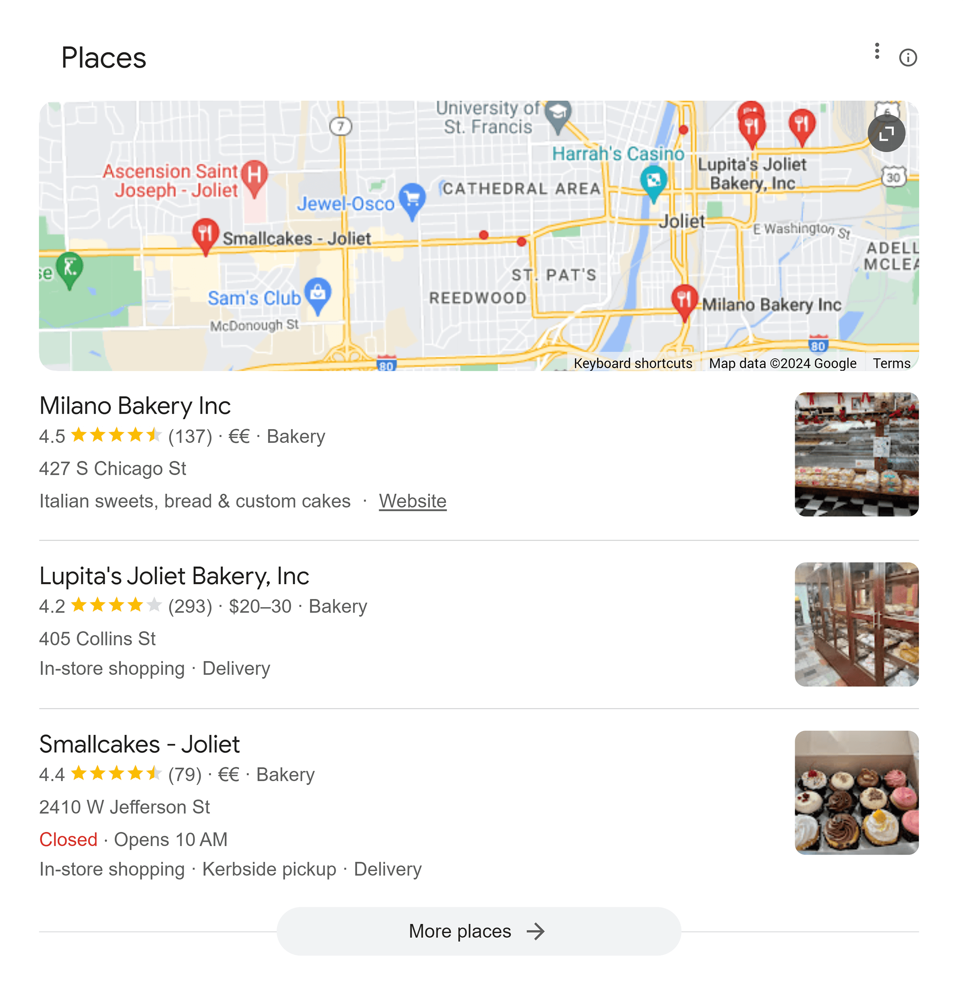
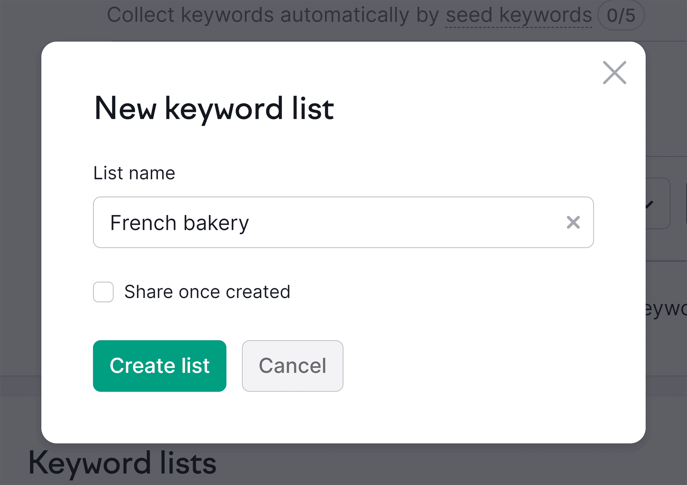
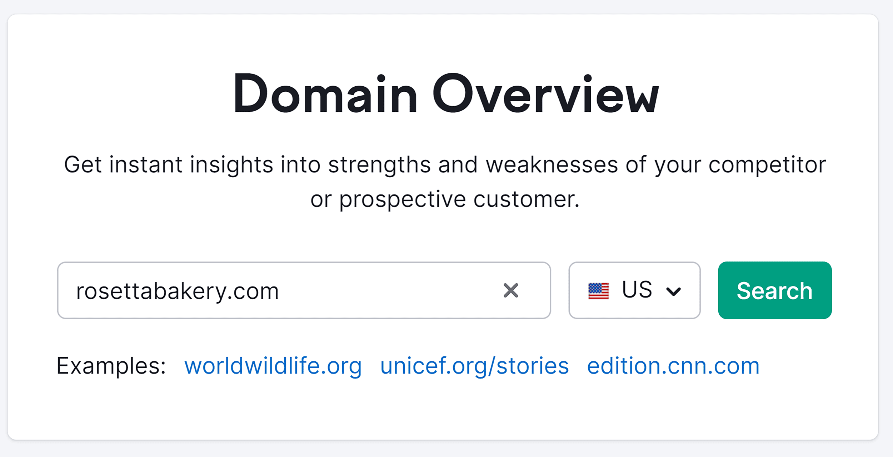

Local keyword research is the process of finding the keywords people use when they’re searching for locations, products, or services in their area.  

本地关键词研究是指找出人们在搜索其所在地区的地点、产品或服务时所使用的关键词的过程。

Like this:  

就像这样

**Why are local keywords useful to know?  

为什么要了解本地关键词？**

[Keywords](https://backlinko.com/hub/seo/seo-keywords) are a fundamental element of [search engine optimization (SEO)](https://backlinko.com/hub/seo/what-is-seo).  

关键词是搜索引擎优化（SEO）的基本要素。

Search engine algorithms, like Google, consider many factors when deciding which pages to rank highly in the results for any given search.  

谷歌等搜索引擎算法在决定将哪些网页排在搜索结果的前列时，会考虑很多因素。  

The prevalence of related keywords in your content is a major factor.  

内容中相关关键词的普遍性是一个重要因素。

Local keyword research tells you which keywords to target in your content.  

本地关键词研究可告诉您应在内容中使用哪些关键词。  

Do it right, and your business becomes more visible.  

做对了，你的企业就会更加引人注目。  

This means that you can attract more organic traffic to your business listings and site.  

这意味着您可以为您的企业列表和网站吸引更多的有机流量。

More traffic can mean more customers. And more customers means more sales.  

更多的流量意味着更多的客户。而更多的客户意味着更多的销售额。

Take Kody Smith, for example. He strategically used keyword research to inform his [local SEO strategy](https://backlinko.com/local-seo-guide). In doing so, he skyrocketed his former side hustle into a full-time business with [nearly $300,000](https://www.sidehustlenation.com/dominate-local-seo/ "How to Dominate Local SEO: From Side Hustle to $300k a Year") in annual revenue.  

以科迪-史密斯为例。他战略性地使用关键词研究来指导他的本地搜索引擎优化策略。通过这样做，他将以前的副业一跃成为年收入近 30 万美元的全职业务。

Putting the effort into local keyword research gives you a chance to replicate Kody’s success.  

努力进行本地关键词研究，就有机会复制科迪的成功。

This article provides the introduction you need to understand local keyword research.  

本文将为您提供了解本地关键词研究所需的介绍。  

And the exact steps to perform it for your location-specific business.  

以及针对您所在地区特定业务的确切执行步骤。

Let’s dive in.  

让我们深入了解一下。

## Applications of Local Keyword Research  

本地关键词研究的应用

Imagine you own a fantastic bakery and want more customers to discover your delicious treats.  

想象一下，您拥有一家很棒的面包店，并希望更多顾客发现您的美味。  

You’ll want to know what’s on the [search engine results page (SERP)](https://backlinko.com/hub/seo/serps) for the keyword “bakery in Joliet.”  

您想知道关键词 "Joliet 的面包店 "在搜索引擎结果页面（SERP）上的搜索结果。

First, you see the selection of Places. Like this:  

首先，您会看到 "地点 "选项。就像这样

Businesses that rank highly in Places likely have well-optimized Google Business Profiles (more on that later).  

在 "地点 "中排名靠前的企业很可能拥有优化良好的 Google Business Profiles（稍后详述）。

These ones probably have business descriptions that include bakery-related keywords, business categories set to “bakery,” and addresses in their listing that says “Joliet.”  

这些网站的业务描述可能包含面包店相关的关键字，业务类别设置为 "面包店"，并在其列表中注明 "Joliet "地址。

That information tells Google’s algorithm that the business is highly relevant to the search term “bakery in Joliet.” So Google deems it worthy of a high rank.  

这些信息告诉谷歌的算法，该企业与搜索词 "Joliet 的面包店 "高度相关。因此，谷歌认为它值得获得较高的排名。

Next, you’ll see the standard search results. Like this:  

接下来，你会看到标准搜索结果。就像这样

These websites may have earned a high SERP ranking, at least in part, by including the target keyword “bakery in Illinois” on their site.  

这些网站在 SERP 上获得较高的排名，至少部分原因是在网站上包含了目标关键词 "伊利诺伊州的面包店"。  

It may appear on the homepage, about us page, contact page, and blog.  

它可以出现在主页、"关于我们 "页面、联系页面和博客上。

Aim to earn a spot as high in the search results as possible.  

争取在搜索结果中占据尽可能高的位置。  

Ideally, among the top three results in the Places section.  

最好是在 "地点 "部分排名前三的结果中。  

Or the top 10 in the standard search results. Those are the pages searchers are most likely to open.  

或标准搜索结果的前 10 位。这些是搜索者最有可能打开的页面。

Keyword inclusion can make a huge impact on your business’ visibility in search.  

关键字的包含可对企业在搜索中的可见度产生巨大影响。

For example, Milano Bakery has 391 relevant keywords on its website.  

例如，Milano Bakery 网站上有 391 个相关关键词。  

It ranks #1 for the keyword “joliet bakery.” And it gets an estimated 3,000 site visits per month from desktop searches alone.  

它在关键词 "joliet bakery "中排名第一。据估计，每月仅桌面搜索就能带来 3,000 次网站访问。

## General vs. Local Keyword Research  

通用关键词研究与本地关键词研究

When you do [general keyword research](https://backlinko.com/keyword-research), you aim to understand the terms that people use to describe companies, products, or services like yours.  

在进行一般关键字研究时，您的目标是了解人们用来描述公司、产品或类似服务的术语。  

It’s the best approach for businesses that operate nationally or globally and don’t have a local model.  

对于那些在全国或全球范围内运营，但没有本地模式的企业来说，这是最好的方法。

Local keyword research helps you understand how people are searching for companies, products, or services like yours in a specific geographic area.  

本地关键词研究可帮助您了解特定地理区域内人们是如何搜索与您类似的公司、产品或服务的。

The biggest difference between general and local keyword research is keyword structure.  

通用关键字研究与本地关键字研究的最大区别在于关键字结构。

General keywords might be “best coffee beans” or “floss picks.” Local keywords include location-specific terms. Like the state, city, or neighborhood (e.g., “best coffee shop in Miami” or “dentist near me”).  

通用关键词可能是 "最好的咖啡豆 "或 "牙线"。本地关键词包括特定地点的术语。如州、城市或社区（如 "迈阿密最好的咖啡店 "或 "我附近的牙医"）。

A big part of local keyword research is identifying the exact location-specific modifiers your audience uses in their searches.  

本地关键词研究的一个重要部分是确定受众在搜索中使用的特定地点修饰词。  

Especially for businesses like yours.  

尤其是像贵公司这样的企业。

## Local Intent: Implicit vs. Explicit Keywords  

本地意图：隐式关键词与显式关键词

Local intent refers to a searcher’s desire to find results relevant to their geographic location.  

本地意图是指搜索者希望找到与其地理位置相关的搜索结果。  

Google is pretty good at figuring this out.  

谷歌在这方面很有一套。  

It uses several signals to determine when someone is looking for local businesses or information.  

它使用多种信号来确定某人何时在寻找本地企业或信息。

One clear clue to Google is the presence of explicitly local keywords in the search.  

对 Google 来说，一个明确的线索就是搜索中出现明确的本地关键词。  

For example, “bakery in Miami” or “restaurants near the Miami Zoo.”  

例如，"迈阿密的面包店 "或 "迈阿密动物园附近的餐馆"。

However, Google also considers implicit local intent.  

不过，谷歌也会考虑隐含的本地意图。  

This is when a search doesn’t explicitly mention a location, but the user is looking specifically for results near them.  

这是指搜索中没有明确提及地点，但用户专门查找其附近的结果。

Google uses a variety of factors to determine local intent. Such as:  

Google 使用多种因素来确定本地意图。例如

-   **The type of business:** Phrases like “bakery” or “dry cleaners” typically indicate local search intent.  
    
    企业类型：面包店 "或 "干洗店 "等词组通常表示本地搜索意图。
-   **The searcher’s location:** Google can use your IP address and other signals to understand where you are.  
    
    搜索者的位置：Google 可以使用您的 IP 地址和其他信号来了解您的位置。
-   **Search history:** If you’ve been searching for local businesses recently, Google is more likely to assume you’re doing it again.  
    
    搜索历史：如果您最近搜索过本地企业，Google 就更有可能认为您会再次搜索。

When researching keywords, you’ll definitely want to focus on those with explicit local intent.  

在研究关键字时，您一定要关注那些具有明确本地意图的关键字。  

Like “bakery in Miami.”  

比如 "迈阿密的面包店"

But don’t forget about implicit local intent, either.  

但也不要忘记当地的隐性意图。  

Many people simply search for “bakeries” while they’re in your area.  

许多人在您所在的地区搜索 "面包店 "即可。  

And you want to make sure your business shows up in those results as well.  

您要确保您的企业也出现在这些结果中。

## How to Identify Local Keywords  

如何识别本地关键词

You’re ready to find the best keywords to bring targeted customers to your business.  

您已经准备好寻找最佳关键词，为您的企业带来目标客户。  

This process has four simple steps:  

这个过程有四个简单的步骤：

1.  Create a spreadsheet for your keywords  
    
    为关键词创建电子表格
2.  Brainstorm your seed keywords  
    
    为种子关键词集思广益
3.  Find local keywords  
    
    查找本地关键字
4.  Use data to prioritize which keywords to target  
    
    利用数据优先选择目标关键词

Let’s begin.  

让我们开始吧。

### Step 1: Create a Spreadsheet for Your Keywords  

第 1 步：为关键词创建电子表格

Create a simple spreadsheet to save the keywords that will come up during your local keyword research.  

创建一个简单的电子表格，保存在本地关键词研究中出现的关键词。

A spreadsheet will keep your local keywords organized.  

电子表格将使您的本地关键词井井有条。  

And allow you to easily analyze them to make informed decisions for your SEO strategy.  

您还可以轻松对其进行分析，从而为搜索引擎优化战略做出明智的决策。

You can use our free [keyword research template](https://backlinko.com/templates/marketing/keyword-research "Backlinko – Free Keyword Research Template") to get organized. It looks like this:  

您可以使用我们的免费关键字研究模板来进行整理。它看起来是这样的

In your spreadsheet, identify places to track specific keyword data. Such as:  

在电子表格中，确定跟踪特定关键词数据的位置。例如

-   **Monthly searches:** How many times the keyword being searched each month.  
    
    每月搜索次数：关键词每月被搜索的次数。
-   **Cost per click (CPC):** The average amount people are paying per click for the keyword in paid ads.  
    
    每次点击成本 (CPC)：人们在付费广告中每次点击关键词所支付的平均金额。
-   **Keyword difficulty:** How difficult it is to rank for the specific keyword.  
    
    关键词难度：特定关键词的排名难度。
-   **Relevance:** How relevant the keyword is to your business.  
    
    相关性：关键词与您业务的相关程度。
-   **Trend:** Whether the keyword’s popularity is increasing, staying the same, or decreasing.  
    
    趋势：关键词的受欢迎程度是上升、保持不变还是下降。

You’ll learn how to find these metrics in step four of this section.  

您将在本节的第四步了解如何找到这些指标。

### Step 2: Brainstorm Your Seed Keywords  

第 2 步：为种子关键词集思广益

Seed keywords are the short, generic phrases most relevant to your business.  

种子关键词是与您的业务最相关的通用短语。  

For example, “French bakery.”  

例如，"法式面包店"。

They’re a great starting point for keyword research.  

它们是关键字研究的绝佳起点。  

You use them to unlock a larger number of more specific, related keyword phrases.  

您可以使用它们来解锁更多更具体、更相关的关键字短语。  

Such as “Parisian pastry near me.”  

比如 "我附近的巴黎糕点"。

Create a list of seed keywords that might be relevant to your location-based business.  

创建一份可能与您的定位业务相关的种子关键词列表。

Start by brainstorming all the terms or phrases customers might search when looking for businesses like yours.  

首先，集思广益，找出客户在寻找类似企业时可能会搜索的所有术语或短语。  

Irrespective of location. For example: “bakery,” “French bakery,” “fresh bread,” or “desserts.”  

与地点无关。例如"面包店"、"法式面包店"、"新鲜面包 "或 "甜点"。

Then, think of location-specific terms your audience might add to their search to describe your local area.  

然后，想一想受众在搜索时可能添加的描述您当地区域的特定地点术语。  

For example, “in Miami,” “near South Beach Miami,” or “near me.”  

例如，"迈阿密"、"迈阿密南滩附近 "或 "我附近"。

People might specify a location for their search using:  

人们在搜索时可能会指定一个地点：

-   **Local landmarks:** “bakery near Crandon Park”  
    
    当地地标："克兰登公园附近的面包店"
-   **Street names:** “bakery on Ocean Drive”  
    
    街道名称"大洋路面包店"
-   **Neighborhoods:** “bakeries in Brickell”  
    
    街区"布里克尔的面包店
-   **ZIP codes:** “bakeries in 33101”  
    
    邮政编码"33101的面包店"

Make sure to record any generic, short phrase that represents your business.  

确保记录下任何能代表您企业的通用短语。

### Step 3: Find Local Keywords  

第 3 步：查找本地关键词

In the previous step, you brainstormed the seed keywords.  

在上一步中，您集思广益，提出了种子关键词。  

Phrases your customers might be using in searches for businesses like yours.  

您的客户在搜索类似企业时可能会使用的短语。

Now, you’ll use that list to discover a wider range of highly relevant and specific keywords with local search intent.  

现在，您将使用该列表来发现更多具有本地搜索意图的高度相关和特定关键词。

Here’s why it’s important:  

重要原因如下

-   **Relevance:** Specific keywords with location details attract users actively looking for businesses in your area.  
    
    相关性：包含地点详细信息的特定关键词能吸引用户主动查找您所在地区的企业。
-   **Lower competition:** Specific keywords are often less competitive than broad seed keywords are.  
    
    竞争较小：特定关键词的竞争通常比宽泛的种子关键词要小。  
    
    This makes it easier to rank higher in search results for these terms.  
    
    这样就更容易在搜索结果中提高这些词的排名。
-   **Higher conversion potential:** More specific keywords indicate a user is closer to making a purchase.  
    
    更高的转换潜力：更具体的关键词表明用户更接近购买。  
    
    This leads to potentially higher conversion rates.  
    
    这可能会带来更高的转换率。

For local keyword research, you can use the free [Google Keyword Planner](https://backlinko.com/google-keyword-planner "Google Keyword Planner"). It lets you search keywords by country, territory, region, or city. Like this:  

对于本地关键词研究，您可以使用免费的 Google Keyword Planner。您可以按国家、地区、区域或城市搜索关键词。就像这样

For a more in-depth keyword research experience, Semrush’s [Keyword Magic Tool](https://www.semrush.com/analytics/keywordmagic/start?utm_campaign=local-keyword-research&utm_source=backlinko.com&utm_medium=referral "Semrush – Keyword Magic Tool") is great for finding specific keywords.  

要获得更深入的关键字研究体验，Semrush 的关键字魔术工具是查找特定关键字的绝佳工具。  

As you’ll see shortly, it provides additional keyword detail and ideas for more keywords.  

不久您就会看到，它提供了更多关键字细节和更多关键字的想法。

Enter one of your seed keywords from step one in the Keyword Magic Tool.  

在关键字魔术工具中输入第一步中的一个种子关键字。  

Select your location in the drop-down. Then click “Search.”  

在下拉菜单中选择您所在的位置。然后点击 "搜索"。

The tool will populate a list of keywords that contain your seed keyword.  

该工具会弹出包含种子关键词的关键词列表。  

Or are variations on your seed keyword. Like this:  

或者是种子关键词的变体。比如这样

The more terms you insert in this tool, the wider your keyword list can get and the lower the chances of missing out on the most relevant keywords.  

在该工具中插入的术语越多，关键字列表的范围就越广，遗漏最相关关键字的几率就越低。

The Keyword Magic Tool shows you keyword data like the search volume (the average number of searches per month) and keyword difficulty (how hard it is to rank for that term).  

关键词魔力工具会向您显示关键词数据，如搜索量（每月平均搜索次数）和关键词难度（该词的排名难度）。

Generally, the higher the search volume, the more people can find your business if you rank for that term.  

一般来说，搜索量越高，如果您在该词条上排名靠前，就会有更多的人找到您的企业。  

However, since many businesses use high-volume keywords, competition for them is usually high.  

不过，由于许多企业使用的关键字量很大，因此竞争通常也很激烈。  

Finding a balance between meaningful search volume and achievable keyword difficulty is key.  

在有意义的搜索量和可实现的关键词难度之间找到平衡是关键。

The data that Keyword Magic Tools shows you can help you decide which keywords to pick.  

Keyword Magic Tools 显示的数据可以帮助您决定选择哪些关键词。

The Keyword Magic Tool also allows you to apply filters to narrow your keywords list.  

关键词魔术工具还允许您应用过滤器来缩小关键词列表的范围。  

Let’s take a look at how you can apply filters for researching explicit and implicit keywords.  

让我们看看如何应用筛选器来研究显性和隐性关键词。

#### Finding Explicit Local Keywords  

查找明确的本地关键词

The best way to find explicit local keywords is to add your location modifiers from step one.  

查找明确的本地关键词的最佳方法是从第一步开始添加位置修饰符。

Click the “**Include keywords**” drop-down to start. Then, select the “**Any keywords**” option.  

点击 "包含关键字 "下拉菜单开始。然后，选择 "任何关键词 "选项。

Type your location-specifying modifiers one at a time, pressing “Enter” or “Return” between each one.  

逐个键入指定位置的修饰词，在每个修饰词之间按 "Enter "或 "Return "键。

As you find relevant keywords for your business, add them to your spreadsheet from step one.  

在找到与企业相关的关键词后，将其添加到第一步的电子表格中。  

If your business is just getting started with SEO, prioritize keywords with a lower KD%, which means a score of 0-49%.  

如果您的企业刚刚开始使用搜索引擎优化，应优先选择 KD% 较低的关键词，即得分在 0-49% 之间的关键词。

This way, you’ll be able to easily build a keyword strategy and track your results later on.  

这样，您就能轻松制定关键字策略，并在日后跟踪结果。

Now that you have your explicit keywords, look for implicit ones.  

既然已经有了显性关键词，那就寻找隐性关键词吧。

#### Finding Implicit Local Keywords  

查找隐含本地关键词

In the previous step, you added your location modifiers to filter the results.  

在上一步中，您添加了位置修饰符来过滤结果。  

To find implicit keywords, move your location modifiers from the “Include keywords” filter to the “Exclude keywords” filter.  

要查找隐含关键词，请将位置修饰符从 "包含关键词 "过滤器移至 "排除关键词 "过滤器。

Then, filter keywords with local intent using advanced filters:  

然后，使用高级过滤器过滤具有本地意图的关键词：

-   Open the “**Advanced filters**” drop-down  
    
    打开 "高级筛选器 "下拉菜单
-   Click the “**SERP Features**” drop-down  
    
    点击 "SERP 功能 "下拉菜单
-   Scroll down and select “**Local pack**”  
    
    向下滚动并选择 "本地软件包
-   Click “**Apply**”  
    
    点击 "应用"。

Repeat the steps for finding explicit and implicit keywords with as many seed keywords as you have.  

使用尽可能多的种子关键词，重复查找显性和隐性关键词的步骤。  

This way, you capture a wide range of important keywords.  

这样，您就能捕捉到广泛的重要关键词。

### Step 4: Prioritize Based on Keyword Metrics  

第 4 步：根据关键词指标确定优先级

Next, you’ll gather intel about your keywords.  

接下来，您要收集有关关键词的信息。  

This will help you prioritize the inclusion of the most lucrative ones.  

这将有助于您优先纳入最有利可图的内容。

A tool like [Keyword Manager](https://www.semrush.com/analytics/keywordmanager?utm_campaign=local-keyword-research&utm_source=backlinko.com&utm_medium=referral "Semrush – Keyword Manager") from Semrush can help.  

Semrush 的关键词管理器等工具可以提供帮助。

You already have your spreadsheet with your list of terms, so select the option to “**create a regular list**” at the bottom of the page.  

您已经有了包含术语列表的电子表格，因此请选择页面底部的 "创建常规列表 "选项。

Give your keyword list a name and click “**Create list**.”  

为关键词列表命名，然后点击 "创建列表"。

Click the “**Add keywords**” button in the upper right.  

点击右上角的 "添加关键词 "按钮。

Add up to 2,000 keywords from your spreadsheet. When you’re done, click the “**Add keywords**” button.  

从电子表格中最多添加 2,000 个关键词。完成后，点击 "添加关键词 "按钮。

On the default “Table” tab, you’ll see important metrics for your keywords.  

在默认的 "表格 "选项卡上，您可以看到关键字的重要指标。

These include:  

其中包括

-   **[Search intent](https://backlinko.com/hub/seo/search-intent "Search Intent and SEO"):** Describes the intent of the searcher.  
    
    搜索意图：描述搜索者的搜索意图。  
    
    You can tell whether the search was informational, navigational, transactional, or commercial.  
    
    您可以看出搜索是信息性的、导航性的、交易性的还是商业性的。
-   **[Search volume](https://backlinko.com/tools/keyword):** Tells you how many times people search for that specific keyword each month.  
    
    搜索量：告诉你每个月人们搜索该特定关键词的次数。
-   **Trend:** Describes how the search volume for the keyword has changed.  
    
    趋势：描述关键词搜索量的变化情况。  
    
    You can tell whether its popularity is increasing or decreasing.  
    
    您可以知道它的受欢迎程度是上升还是下降。
-   **Click potential:** Displays how likely people are to click through the website to learn more about their query.  
    
    点击潜力：显示人们点击网站了解更多信息的可能性。
-   **[Keyword difficulty](https://backlinko.com/hub/seo/keyword-difficulty):** Measured in percentage, this metric shows you how difficult or easy it is to rank for the keyword.  
    
    关键词难度：该指标以百分比表示，显示关键词排名的难易程度。  
    
    1% KD means it’s easiest to rank for the keyword, while 100% means it’s the hardest.  
    
    1% KD 表示关键词排名最容易，而 100% 则表示关键词排名最难。

Using this information, you can prioritize your list of relevant keywords based on your goals.  

利用这些信息，您可以根据自己的目标确定相关关键词列表的优先级。

For instance, since your ads are designed to drive action, you probably want to prioritize search terms with transactional or especially commercial intent.  

例如，由于您的广告旨在推动行动，您可能希望优先考虑具有交易或特别商业意图的搜索词。  

You want to include words in your content that have a healthy search volume, but aren’t too difficult to rank for.  

您希望在内容中包含搜索量高但不难排名的词语。  

A higher click potential is good.  

点击率越高越好。

When you incorporate those keywords into your content, your page has a better chance of being visible in the results.  

当您在内容中加入这些关键词时，您的网页就更有可能在搜索结果中出现。  

And being clicked on by the right type of audience.  

并被正确类型的受众点击。

From here, you can add the metrics from step one to your spreadsheet and sort the table based on your priorities.  

在这里，您可以将第一步中的指标添加到电子表格中，并根据优先级对表格进行排序。

## How to Structure Local Keywords  

如何构建本地关键词

Imagine customers searching for your business online.  

想象一下，客户在网上搜索您的企业。  

To find you easily, they’ll likely use keywords related to what you offer (“bakery”) and include their location (“Miami”).  

为了方便找到你，他们可能会使用与你提供的服务相关的关键词（"面包店"），并包括他们的位置（"迈阿密"）。

So, you’ll want to structure local keywords effectively.  

因此，您需要有效地构建本地关键词。  

It’s about combining relevant search terms for your business with the specific city, town, or area you serve.  

这就需要将您企业的相关搜索词与您所服务的具体城市、城镇或地区结合起来。

Let’s say you own a bakery in Miami. Here’s how you can structure your keywords:  

假设您在迈阿密开了一家面包店。下面是您如何构建关键词的方法：

1.  **Main target keyword + location:** This is the most basic and common structure for local keywords.  
    
    主要目标关键词 + 地点：这是最基本、最常见的本地关键词结构。  
    
    Simply combine your main service or product with the city or town your target customers are in.For example, “bakery in Miami.” This keyword clearly tells searchers what you offer (pastries) and where you’re located (Miami).  
    
    例如，"迈阿密的面包店"。这个关键词可以清楚地告诉搜索者您提供的服务（糕点）和您所在的城市（迈阿密）。
2.  **Include specific service or product you sell:** Refine your targeting by adding details about the services or products you offer.For example, “best custom birthday cake in Miami.” This keyword targets users searching for a specific type of cake (custom birthday cakes) within a particular location (Miami).  
    
    包括您销售的具体服务或产品：例如，"迈阿密最好的定制生日蛋糕"。这个关键词针对的是在特定地点（迈阿密）搜索特定类型蛋糕（定制生日蛋糕）的用户。
3.  **Consider question-based keywords:** These keywords recognize the informational intent behind question-based searches and can use that insight to attract potential customers.For example, “What bakery in Miami delivers croissants?”  
    
    考虑基于问题的关键词：例如，"迈阿密哪家面包店提供羊角面包？

Combine multiple strategies to create even more specific, [long-tail keywords](https://backlinko.com/hub/seo/long-tail-keywords "What are Long-Tail Keywords?"). For example:  

结合多种策略，创建更具体的长尾关键词。例如

-   “Gluten-free bakery near South Beach Miami” combines dietary preference and precise location.  
    
    "迈阿密南滩附近的无麸质面包店 "结合了饮食偏好和准确的地理位置。
-   “Can I order a cake online for same-day pickup in Miami?” targets convenience and location.  
    
    "我可以在网上订购蛋糕并在迈阿密当天取货吗？"目标是方便和地点。
-   “Best bakery for wedding cakes in Miami with affordable prices” combines intent, location, and price point.  
    
    "迈阿密价格实惠的最佳婚礼蛋糕面包店"，集用心、地点和价位于一身。

Once you’ve identified and structured your main target keywords, it’s time to start [optimizing your website](https://backlinko.com/on-page-seo "On-Page SEO: The Definitive Guide + FREE Template") and Google Business Profile to get your business to appear on local SERPs.  

确定并构建主要目标关键词后，就可以开始优化您的网站和 Google Business Profile，让您的企业出现在本地 SERP 上。

## The Role of Competitor Analysis in Local SEO  

竞争对手分析在本地搜索引擎优化中的作用

[Competitor analysis](https://backlinko.com/seo-competitor-analysis "How to Conduct an SEO Competitor Analysis") helps you understand who you’re competing with for space online.  

竞争对手分析可帮助您了解与您竞争网络空间的竞争对手。  

It reveals what terms people in your area are searching for.  

它揭示了您所在地区的人们正在搜索哪些词语。  

And how your competitors target those searches.  

以及您的竞争对手如何定位这些搜索。

Competitor analysis also shows you untapped opportunities.  

竞争对手分析还能为您提供尚未开发的机会。  

By referencing your keyword list, you might discover the keywords that your competitors aren’t targeting.  

通过参考关键字列表，您可能会发现竞争对手没有瞄准的关键字。  

This creates a chance for you to leverage the opportunity and potentially rank higher for those keywords since there isn’t as much competition.  

这就为您创造了一个机会，利用这个机会，您就有可能在这些关键字上获得更高的排名，因为竞争并不激烈。

You can also benchmark your rankings for certain keywords against your competitors.  

您还可以将某些关键词的排名与竞争对手进行比较。  

This can help you set realistic goals and track your progress toward achieving them.  

这可以帮助您制定切实可行的目标，并跟踪实现目标的进展情况。

### How to Do Competitor Analysis  

如何进行竞争对手分析

Start by using Google to search for a local keyword phrase relevant to your business.  

首先使用 Google 搜索与您的业务相关的本地关键字短语。  

Find your competitors who rank in the top three results on the SERP.  

查找在 SERP 中排名前三的竞争对手。

If you’re physically not in the location where your business operates, use a tool like [I Search From](http://isearchfrom.com/ "I Search From"). You’ll see the search engine results for the location you select.  

如果您不在业务所在地，可以使用 I Search From 这样的工具。您将看到所选地点的搜索引擎结果。

Say you own a bakery in Miami.  

假设你在迈阿密拥有一家面包店。  

Open the tool, and select the United States as your Country and English as your language.  

打开该工具，选择美国为国家，英语为语言。  

The search term you’re exploring first is “Bakery.” And you want to see the results as if you are searching from Miami, Florida, so set that as your city.  

您首先要搜索的词是 "面包店"。你希望看到的结果是你在佛罗里达州迈阿密搜索的结果，因此将迈阿密设为你的城市。

It looks like this:  

看起来是这样的

According to the search results, Rosetta Bakery and Arahi’s Bakery are among your main competitors.  

根据搜索结果，Rosetta Bakery 和 Arahi's Bakery 是您的主要竞争对手。

Now that you know who it is, use Semrush’s [Domain Overview](https://www.semrush.com/analytics/overview/?utm_campaign=local-keyword-research&utm_source=backlinko.com&utm_medium=referral "Semrush – Domain Overview") tool to take a look at your competitor’s keyword strategy.  

既然知道了竞争对手是谁，那就使用 Semrush 的 "域名概览 "工具来看看竞争对手的关键词策略吧。

Simply enter your competitor’s URL, select your location from the drop-down, and click “**Search**.”  

只需输入竞争对手的 URL，从下拉菜单中选择您所在的位置，然后点击 "搜索 "即可。

You’ll see important metrics like the domain’s organic search traffic and the top organic keywords it ranks for.  

您将看到域名的有机搜索流量和排名靠前的有机关键词等重要指标。

These metrics help you identify keywords you can target and benchmark your SEO efforts against your competitors.  

这些指标可帮助您确定可以瞄准的关键字，并将您的搜索引擎优化工作与竞争对手进行比较。

## Local Search Volumes and Keyword Relevance  

本地搜索量和关键词相关性

[Keyword research tools](https://backlinko.com/keyword-research-tools) are valuable assets in SEO.  

关键词研究工具是搜索引擎优化的宝贵财富。  

They help you get a general sense of the keywords that are relevant to your business.  

它们可以帮助您大致了解与您业务相关的关键字。

Tools like Semrush provide accurate metrics for larger-volume keywords.  

Semrush 等工具可为数量较大的关键词提供准确的指标。

However, keyword research tools can be less accurate when it comes to hyper-local search volume attributions and keywords with lower total volume, like less than 100.  

不过，在涉及超本地搜索量归因和总搜索量较低的关键词（如少于 100）时，关键词研究工具的准确性可能较低。

Having said that, there’s nothing wrong with slight inaccuracies.  

话虽如此，略有不准确之处也无可厚非。  

These tools rely on estimates and are very useful for exploring relevant keywords for your business rather than precisely orienting your prioritization.  

这些工具依赖于估算，对于探索与您的业务相关的关键字非常有用，而不是精确定位您的优先级。

We suggest going for the keyword if you think it’s what your audience will search for, even if SEO tools show low search volume, such as zero or 30.  

我们建议，如果您认为您的受众会搜索该关键词，即使搜索引擎优化工具显示搜索量较低，如 0 或 30，您也要选择该关键词。

After all, you know your audience the best.  

毕竟，你最了解你的受众。

You can also use the Google Autocomplete feature to validate any keyword ideas you have.  

您还可以使用 Google 自动完成功能来验证您的任何关键词想法。

To do so, enter your seed keyword idea (for example, “custom cake”) into Google’s search bar.  

为此，请在 Google 的搜索栏中输入您的种子关键词（例如 "定制蛋糕"）。  

Like this:  

就像这样

Google will automatically suggest related terms that people are using.  

Google 会自动推荐人们正在使用的相关词汇。  

If your idea comes up in an autocomplete suggestion, you can be sure that people are searching for it.  

如果你的想法出现在自动完成建议中，你就可以确定人们正在搜索它。

## How to Map Keywords to Webpages  

如何将关键字映射到网页

Keyword mapping is the strategic process of assigning target keywords—the words you want to rank highly for—to specific pages on your website.  

关键词映射是将目标关键词--您希望获得高排名的词--分配到网站特定页面的战略过程。  

You map a keyword to a page by including it in your [page URL](https://backlinko.com/hub/seo/urls), page title, and throughout the content on the page.  

通过在页面 URL、页面标题和整个页面内容中包含关键字，可以将关键字映射到页面上。

Keyword mapping is important for SEO.  

关键词映射对搜索引擎优化非常重要。  

The prominence of a keyword on a page helps Google determine its relevance when would-be customers use that keyword in a search.  

当潜在客户在搜索中使用关键字时，页面上关键字的突出程度有助于 Google 确定其相关性。  

If the algorithm sees that your page is relevant to your target keyword, it’s more likely to push your website to the top of the SERP.  

如果算法认为您的网页与目标关键词相关，它就更有可能将您的网站推到 SERP 的顶部。

If Google can’t find the keyword on your page, it’ll be harder to appear at the top of the SERP.  

如果 Google 无法在您的页面上找到关键字，那么您就更难在 SERP 上排名靠前。

It’s important to be intentional about how you map keywords.  

有意识地规划关键词非常重要。  

If you target the same keyword on multiple pages serving similar purposes, for instance, Google will see them as duplicate pages and struggle to identify the best result to rank.  

例如，如果您在多个具有类似目的的页面上使用相同的关键字，Google 就会将其视为重复页面，从而难以确定最佳排名结果。

To organize your mapping effort, here’s a free [Keyword Mapping Template](https://docs.google.com/spreadsheets/d/1ZbuxXHhVbPciTTdG-9wsZKhi4XsBBsU5AcgHEiks4hw/copy "Semrush – Keyword Mapping Template") by Semrush you can use:  

为了组织您的映射工作，您可以使用 Semrush 提供的免费关键词映射模板：

Use this template to organize your keywords and allocate the primary keywords to relevant pages on your website.  

使用此模板整理关键词，并将主要关键词分配到网站的相关页面。

The goal is to satisfy search intent by matching each keyword with the relevant page, which has the most potential for ranking high in SERPs.  

其目的是通过将每个关键词与相关页面进行匹配来满足搜索意图，这样的页面最有可能在 SERP 中排名靠前。

When you map keywords on your website, you’ll be:  

当您在网站上映射关键词时，您就会：

-   Optimizing pages for the most relevant keywords  
    
    针对最相关的关键词优化页面
-   Structuring your content throughout the website  
    
    构建整个网站的内容结构
-   Preventing keyword cannibalization  
    
    防止关键字蚕食
-   Gaining higher visibility in relevant SERPs  
    
    在相关 SERP 中获得更高的可见度

## How to Optimize Your Google Business Profile  

如何优化您的 Google 企业简介

Your website isn’t the only online property to optimize. Your [Google Business Profile](https://backlinko.com/google-business-profile-guide "Google Business Profile") is a dynamic snapshot of your business that enables users to gather basic information about your offerings right from the SERP.  

您的网站并不是唯一需要优化的在线资产。您的 Google Business Profile 是您企业的动态快照，用户可以直接从 SERP 中收集有关您产品的基本信息。

For example, customers can view images of your location, see your address, make an online reservation, read reviews, and contact you.  

例如，客户可以查看您所在位置的图片、地址、在线预订、阅读评论并与您联系。

Here’s what it looks like:  

看起来是这样的

To get your business profile to appear on the SERP, you need to optimize your Google Business Profile with relevant keywords your would-be customers are searching for.  

要让您的企业简介出现在 SERP 上，您需要使用潜在客户搜索的相关关键字来优化您的 Google 企业简介。

Optimizing your Google Business Profile helps to get you:  

优化您的谷歌企业简介有助于让您获得更多信息：

-   **Better local rankings:** Google’s algorithm looks at relevance and proximity for local searches.  
    
    更好的本地排名：谷歌算法会考虑本地搜索的相关性和邻近性。  
    
    But it also considers the quality of information.Optimize your Business Profile by including your target keyword in your business description and updating your address to be as specific as possible.  
    
    但它也会考虑信息的质量。优化您的企业简介，在企业描述中加入您的目标关键词，并更新您的地址，使其尽可能具体。  
    
    That way, Google has all the information it needs to rank it in relevant local search results.  
    
    这样，Google 就能获得在相关本地搜索结果中进行排名所需的所有信息。
-   **More customers:** An optimized Business Profile lets users find your business in local keyword searches.They can then call you, read reviews about your business, visit your website, discover your products and services, make a reservation or book an appointment, request a quote, and more.  
    
    更多客户：经过优化的企业简介可让用户在本地关键词搜索中找到您的企业，然后他们可以给您打电话、阅读关于您企业的评论、访问您的网站、了解您的产品和服务、进行预订或预约、要求报价等。

Here’s how to apply the local keyword insights from your research to your Google Business Profile:  

以下是如何将研究中获得的本地关键字见解应用到您的 Google Business Profile 中：

-   **Business description:** Include relevant keywords in your business description. Be careful not to force them in.  
    
    业务描述：在业务描述中包含相关关键词。注意不要强行加入。  
    
    Just like in any other SEO-optimized content, insert the keywords naturally into the text.  
    
    就像其他搜索引擎优化内容一样，在文本中自然插入关键词。
-   **Photo titles:** Name your images before you upload them to your Google Business Profile.  
    
    照片标题：在将图片上传到 Google Business Profile 之前，为图片命名。  
    
    Use descriptive file names and include relevant keywords naturally.Take an image of your storefront as an example.  
    
    使用描述性的文件名，并自然地包含相关关键词。  
    
    Change the generic file name like “Image\_123” to a more descriptive one like “bakery near South Beach Miami.”  
    
    将 "Image\_123 "等通用文件名改为 "迈阿密南滩附近的面包店 "等描述性更强的文件名。
-   **Categories:** Make sure your Google Business Profile is categorized accurately.  
    
    分类：确保您的 Google 企业简介分类准确。  
    
    The categories should match your services and products.  
    
    类别应与您的服务和产品相匹配。  
    
    Try to choose category names that resemble or match your target keywords.  
    
    尽量选择与目标关键词相似或匹配的类别名称。
-   **Updates:** Use this section of the Google Business Profile to post updates relevant to your business.For example, post an update when you’re hosting an event.  
    
    更新：例如，在举办活动时发布更新。  
    
    Or when you’re adding a new product or service.  
    
    或者当您添加新产品或服务时。  
    
    Make sure to include relevant keywords in your updates.  
    
    确保在更新中包含相关关键词。  
    
    This will help signal the Google algorithm that your profile satisfies a certain search intent.  
    
    这将有助于向 Google 算法发出信号，表明您的个人资料符合特定的搜索意图。
    
    Like this:  
    
    就像这样
    
    
    

Additionally, your rankings can benefit from the keywords people use when they review your business.  

此外，人们在评论您的企业时使用的关键字也会使您的排名受益。

For example, when you search “croissants near South Beach Miami,” you’ll notice that the places that come up on top results have reviews highlighting their croissants.  

例如，当您搜索 "迈阿密南滩附近的羊角面包 "时，您会发现排在结果前列的地方都有关于羊角面包的评论。

While you can’t control the reviews customers leave for your business, you can encourage them by providing excellent service.  

虽然您无法控制客户为您的企业留下的评论，但您可以通过提供优质服务来鼓励他们。  

You can also consider offering incentives that increase the quantity of reviews you receive.  

您还可以考虑提供奖励，以增加收到的评论数量。  

Like giving free coffee to satisfied customers who leave positive reviews.  

比如给留下好评的满意顾客免费提供咖啡。

## Ready to Perform Local Keyword Research for Your Business?  

准备好为您的企业进行本地关键词研究了吗？

Your local SEO success starts with strategic keyword research.  

本地搜索引擎优化的成功始于战略性关键词研究。

When you understand what specific terms your target audience uses to find businesses like yours, you can optimize your online presence to attract more customers.  

当您了解目标受众使用哪些特定术语来查找与您类似的企业时，您就可以优化您的在线形象，吸引更多客户。

Here’s what you can do today to put these learnings into action:  

今天，您就可以将这些学习成果付诸行动：

-   **Brainstorm seed keywords:** Make a list of words that describe your business, the products or services you offer, and the locations you serve.  
    
    头脑风暴种子关键词：列出一份描述您的业务、产品或服务以及服务地点的词语清单。
-   **Leverage keyword research tools:** Explore a basic tool like Google Keyword Planner or a more advanced one like Semrush to expand your list of specific keywords.  
    
    充分利用关键词研究工具：使用 Google Keyword Planner 等基本工具或 Semrush 等更高级的工具来扩展特定关键词列表。
-   **Prioritize low-difficulty keywords with high search volume:** Collect keyword data and focus on keywords that are relevant to your business, get good traffic, and are fairly easy to rank for.  
    
    优先考虑搜索量大的低难度关键词：收集关键字数据，重点关注与您的业务相关、流量大且相当容易排名的关键字。
-   **Optimize your website and Google Business Profile:** Include your target keywords throughout your website content, meta descriptions, images, and Google Business Profile.  
    
    优化网站和 Google 企业简介：在网站内容、元描述、图片和 Google 企业简介中加入目标关键词。

If you’d like to learn more about local SEO, read our definitive [local SEO guide](https://backlinko.com/local-seo-guide "Local SEO: The Definitive Guide").  

如果您想了解有关本地搜索引擎优化的更多信息，请阅读我们的本地搜索引擎优化权威指南。  

It shows you what it takes to rank in the top three positions on Google search and teaches you how to optimize your Google Business Profile.  

它告诉你如何才能在 Google 搜索中排名前三，并教你如何优化你的 Google Business Profile。
