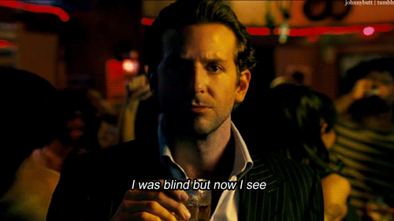
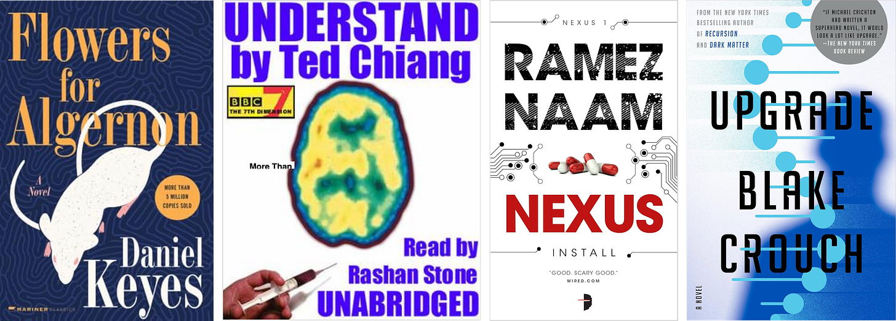
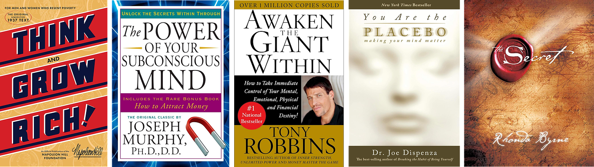
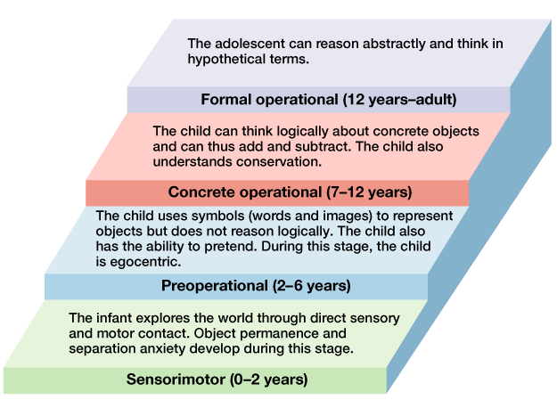
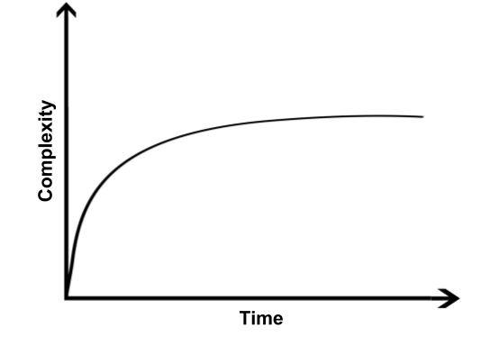
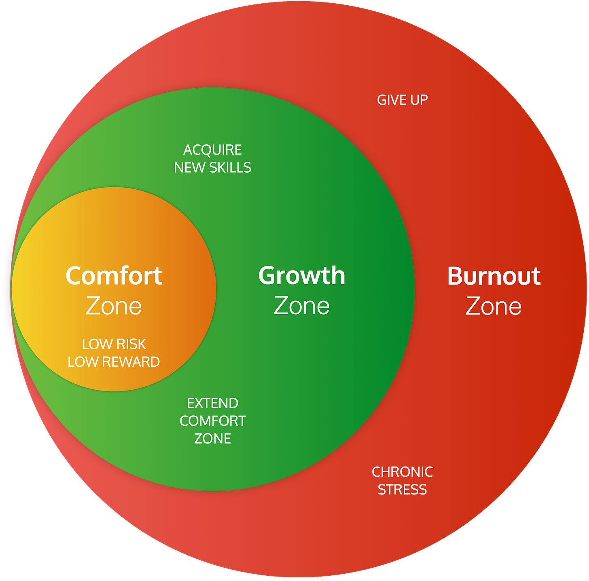

_**Author Note:** I became obsessed with learning when I was 16 and spent hundreds of dollars on books every month.  

作者简介：我 16 岁时开始迷恋学习，每个月都要花几百美元买书。  

Fast-forward 25 years, and I:  

一晃 25 年过去了，我_

-   _Have read thousands of books and academic studies in dozens of fields  
    
    阅读过数十个领域的数千本书籍和学术研究报告_
    
-   _Have spent hundreds of thousands of dollars on courses, masterminds, conferences, and one-on-one coaching  
    
    在课程、大师班、会议和一对一辅导上花费了数十万美元_
    
-   _Devote the majority of my time to curiosity-based learning  
    
    将大部分时间用于好奇心学习_
    

_When I look back, I am struck by this wise quote from Steve Jobs:  

回首往事，乔布斯的这句至理名言令我印象深刻：_

> _"You can't connect the dots looking forward. You can only connect them looking backward.  
> 
> "向前看，你无法把点连起来。你只能向后看。  
> 
> So you have to trust that the dots will somehow connect in your future.  
> 
> 所以，你必须相信，在你的未来，这些点会以某种方式连接起来。  
> 
> You have to trust in something -- your gut, destiny, life, karma, whatever.”  
> 
> 你必须相信一些东西 -- 你的直觉、命运、生活、因果报应，不管是什么。"  
> 
> **—Steve Jobs  
> 
> 史蒂夫-乔布斯**_

_My learning journey has given me unique dots, which have connected into a unique mosaic and belief system I couldn’t have planned for and haven’t seen written about.  

我的学习历程给了我独特的点，这些点连接成了独特的马赛克和信仰体系，这是我无法预料的，也是我没有见过的。_

_This article summarizes my journey and the biggest, life-changing takeaway. I hope you enjoy!  

这篇文章总结了我的心路历程和改变人生的最大收获。希望你们喜欢！_

The 10% brain “myth” states that humans only use a fraction of their brain’s potential.  

10%大脑 "神话 "认为，人类只利用了大脑潜能的一小部分。

This 130-year-old idea is thought to date back to the 1890s Reserve Energy Theory of Harvard psychologists William James and Boris Sidis.  

这个已有 130 年历史的观点被认为可以追溯到 19 世纪 90 年代哈佛大学心理学家威廉-詹姆斯和鲍里斯-西迪斯的储备能量理论。  

For example, in a 1907 article, James writes:  

例如，詹姆斯在 1907 年的一篇文章中写道：

> _“Most of us feel as if we lived habitually with a sort of cloud weighing on us, below our highest notch of clearness in discernment, sureness in reasoning, or firmness in deciding.  
> 
> "我们中的大多数人都会觉得，我们的生活中似乎习惯性地笼罩着一层阴云，使我们的辨别力、推理力和决断力都达不到最高境界。  
> 
> Compared with what we ought to be, we are only half awake.  
> 
> 与我们应该成为的样子相比，我们只醒了一半。  
> 
> Our fires are damped, our drafts are checked.我们的炉火被扑灭，我们的通风被检查。 **We are making use of only a small part of our possible mental and physical resources.  
> 
> 我们只是利用了我们可能的精神和物质资源中的一小部分。**_”  
> 
> **—William James  
> 
> 威廉-詹姆斯**

The concept gained momentum in the 1920s self-help movement. An ad in the 1929 _World Almanac_ even stated:  

这一概念在 20 世纪 20 年代的自助运动中获得了发展。1929 年《世界年鉴》上的一则广告甚至这样写道

> _"There is NO LIMIT to what the human brain can accomplish.  
> 
> "人脑的能力是无限的。  
> 
> Scientists and psychologists tell us we use only about TEN PERCENT of our brain power."  
> 
> 科学家和心理学家告诉我们，我们只使用了大约十分之一的脑力"。_

Fast forward to today.  

时至今日。

Even though [neuroscience has debunked the scientific version of the myth](https://www.psychologicalscience.org/uncategorized/myth-we-only-use-10-of-our-brains.html), the mythological version has lived on through popular movies and books.  

尽管神经科学已经揭穿了科学版本的神话，但神话版本却通过流行电影和书籍流传了下来。

For example, two of my favorite recent movies, _Limitless_ and _Lucy,_ build on the 10% myth:  

例如，我最近最喜欢的两部电影《无极限》和《露西》就建立在 "10%"神话的基础上：

And so do some of my favorite sci-fi books:  

我最喜欢的一些科幻书籍也是如此：

Furthermore, many non-fiction books have suggested other mechanisms for unlocking our giant dormant potential using pathways like specific parts of the brain (subconscious mind), our dreams (manifestation), our thoughts (thinking big), and our beliefs (placebo effect).  

此外，许多非虚构类书籍还提出了其他机制，利用大脑的特定部位（潜意识）、我们的梦想（表现）、我们的思想（大思维）和我们的信念（安慰剂效应）等途径，释放我们巨大的休眠潜能。

For whatever reason, the idea that we contain more potential than we can imagine and that we just need to find the right key to unlock it feels deeply true.  

无论出于什么原因，"我们蕴藏着超乎想象的潜能，我们只需要找到一把合适的钥匙，就能开启它 "的想法让人深感真实。  

It is almost as if our brains want to believe the 10% myth, and we will latch on to any story or theory that resonates with it.  

就好像我们的大脑愿意相信 "10%"的神话一样，我们会抓住任何与之产生共鸣的故事或理论。

The feeling reminds me of the following quote:  

这种感觉让我想起了下面这句话：

> _“If you want to build a ship, don’t drum up the men to gather wood, divide the work, and give orders.  
> 
> "如果你想造船，就不要鼓动大家去拾柴、分工和发号施令。  
> 
> Instead, teach them to yearn for the vast and endless sea.”  
> 
> 相反，教会他们向往辽阔无边的大海"。_  
> 
> **― Antoine de Saint-Exupéry  
> 
> \- 安托万-德-圣埃克苏佩里**

It is almost like we are wired to yearn for the vast and endless sees of our hidden potential just as surely as we are driven to survive or reproduce.  

几乎就像我们渴望看到广阔无尽的潜能一样，我们也渴望生存或繁衍。

More recently, a spate of research and personal experience has pushed me to reconsider the 10% myth, but in two unexpected ways:  

最近，一连串的研究和个人经历促使我重新考虑 10%的神话，但这是以两种意想不到的方式进行的：

-   According to AI research, .01 % of our brains are used, rather than 10% (read on for how I derived this number).  
    
    根据人工智能研究，我们大脑的使用率为 0.01%，而不是 10%（请继续阅读我是如何得出这个数字的）。
    
-   Rather than measuring the potential based on the percentage of our brain that is active in the moment, I calculate it by our potential intelligence based on the number of synapses in our brain (more on this as well).  
    
    我不是根据我们大脑当下活跃的百分比来衡量潜能，而是根据我们大脑突触的数量来计算我们的潜在智力（关于这一点还有更多内容）。
    

Before I dive into the research I uncovered, it’s worthwhile to understand my own learning and growth journey since it sets the context…  

在我深入探讨我所发现的研究之前，有必要了解一下我自己的学习和成长历程，因为它为我提供了一个背景。

When I was 16, I fell in love with learning and personal growth. Addicted is a better word.  

16 岁那年，我爱上了学习和个人成长。用 "上瘾 "这个词更好。

I read every book I could get my hands on.  

我阅读了我能拿到的每一本书。  

Books on everything from architecture, tennis, web design, graphic design, typography and business to meditation, biography, yoga, dancing, and spirituality.  

从建筑、网球、网页设计、平面设计、排版和商务，到冥想、传记、瑜伽、舞蹈和灵性，各种书籍应有尽有。

I spent hundreds of dollars to satisfy my curiosity.  

我花了几百美元来满足自己的好奇心。  

This money came from reinvesting the proceeds of a web development business that Cal Newport and I started.  

这笔钱来自我和卡尔-纽波特（Cal Newport）创办的一家网络开发公司的收益再投资。

One of my favorite purchases was from October 24, 1999, when I was 17. One of my unrealized high school goals was to get a girlfriend.  

我最喜欢的一次购物是在 1999 年 10 月 24 日，当时我 17 岁。我高中未实现的目标之一就是交女朋友。  

I was painfully shy.  

我非常害羞。  

So somehow I came to the conclusion that if I learned how to dance I would become the center of attention at dances and girls would want me.  

于是我得出结论，如果我学会了跳舞，我就会成为舞会上的焦点，女孩们就会想要我。  

So, I bought videos on freestyle dancing, hip-hop dancing, and party dancing…  

于是，我买了自由舞、嘻哈舞和派对舞的视频...

After school, before my mom got home, I would practice alone without any witnesses except my dogs, who gave me confused looks as I tried to follow along.  

放学后，在妈妈回家之前，我会一个人练习，除了我的狗，没有任何目击者。  

Unfortunately, I never learned how to dance, nor did I get a girlfriend in high school.  

遗憾的是，我从来没有学过跳舞，高中时也没有交过女朋友。

Here’s a sampling of some of my other Amazon receipts from 1999:   

下面是我 1999 年在亚马逊上的其他一些收据：

In college, I started going to seminars across the country, and I cultivated dozens of mentors.  

大学时，我开始参加全国各地的研讨会，并培养了几十位导师。  

For example, I went to a 10-day silent meditation retreat as well as spirituality conferences, entrepreneurship conferences, creativity symposiums, social impact conferences, and many more.  

例如，我参加了为期 10 天的静默冥想静修，还参加了灵性会议、创业会议、创意研讨会、社会影响会议等等。  

In addition, I started journaling for an hour per day when I was 18—a habit I keep up to today.   

此外，我从 18 岁开始每天写一小时日记，这个习惯一直保持到今天。

While reading did open my eyes to the world, I started feeling like I wasn’t getting as much from it in my 20s.  

虽然阅读确实让我开阔了眼界，但到了 20 多岁，我开始觉得自己从阅读中获得的东西并不多。  

Then I got humbled…  

然后我就谦卑了......

In my 20s, I had a few wake-up calls that made me realize that I wasn’t nearly as effective with my learning as I could be...  

在我 20 多岁的时候，有几次 "警钟 "敲醒了我，让我意识到自己的学习效率还远远不够高...

**Wake-Up Call #1  

警钟 #1**

First, I became exposed to entrepreneur and investor Peter Thiel’s famous question…  

首先，我开始接触企业家兼投资人彼得-蒂尔（Peter Thiel）的著名问题...

> _What's the one thing you know that no one else does?  
> 
> 你知道什么别人不知道的事情？_

When I honestly asked myself this question, I realized that I didn’t know that much different because many of the books I read were bestsellers that many others read.  

当我真诚地问自己这个问题时，我意识到我并不知道有多少不同，因为我读过的很多书都是畅销书，很多人都读过。

**Wake-Up Call #2  

唤醒电话 #2**

Another time, while a [close friend](https://www.linkedin.com/in/tijlkoenderink/) was visiting me from Europe and looking at my bookshelves, he commented…  

还有一次，一位好朋友从欧洲来看我，在看我的书架时，他评论说...

> _“These are all self-help books. Don’t you get bored from reading the same book over and over?”  
> 
> "这些都是自助书籍。同样的书读了一遍又一遍，你不觉得无聊吗？"_

As soon as he said it, I realized he was right.  

他话音刚落，我就意识到他是对的。  

His comment made me realize that there wasn’t nearly as much diversity in my learning as I thought there was.  

他的评论让我意识到，我的学习并不像我想象的那样具有多样性。

**Wake-Up Call #3  

唤醒电话 #3**

My final wake-up call was reading Nassim Taleb’s [Fooled By Randomness](https://www.amazon.com/Fooled-Randomness-Hidden-Markets-Incerto/dp/0812975219).  

阅读纳西姆-塔勒布（Nassim Taleb）的《被随机性愚弄》（Fooled By Randomness）给我敲响了最后的警钟。

In the book, Taleb reveals how a lot of success in any industry can simply be explained by random luck.  

在书中，塔勒布揭示了在任何行业中，很多成功都可以简单地用随机运气来解释。  

For example, if billions of people flip a quarter over and over, you’re naturally going to have a small percentage who beat the odds and get heads 100 times in a row.  

举例来说，如果数十亿人反复翻转 25 分硬币，自然会有一小部分人能够打破常规，连续 100 次得到人头。  

From the outside, it may look like these people are skilled at flipping coins.  

从外表上看，这些人似乎很擅长翻硬币。  

But, in reality, it’s just statistics.  

但实际上，这只是统计数据。

This made me realize that a lot of outlier success stories could be explained primarily by luck, not skill.  

这让我意识到，很多离群的成功故事主要可以用运气而非技巧来解释。  

But, this wouldn’t stop the individuals from writing books about how smart they were.  

但是，这并不妨碍这些人写书，吹嘘自己有多么聪明。

Therefore, Taleb’s book made me realize that I needed to be much more deliberate about who I learned from.  

因此，塔勒布的书让我意识到，在向谁学习的问题上，我需要更加慎重。

**Wake-Up Call #4  

警钟 #4**

My final wake-up call came in my late 30s when I started pushing up against the limits of cognitive book learning.  

30 多岁时，我开始挑战书本认知学习的极限，这给我敲响了最后的警钟。  

There were problems in my life that new learning wasn’t solving, and I felt myself getting bored, because learning yet another new mental model wasn’t moving the needle.  

我生活中的一些问题，新的学习并不能解决，我觉得自己越来越无聊，因为学习另一种新的心智模式并不能起到作用。

Around this time, I was fortunate enough to be coached one-on-one by [Annie Lalla](https://annielalla.com/), [Eben Pagan](https://ebenpagantraining.com/), and [Anand Rao](https://developmentalmastery.com/). All three introduced me to emotional regulation, somatic therapies, and energy work.  

大约在这个时候，我有幸得到了安妮-拉拉（Annie Lalla）、埃本-帕根（Eben Pagan）和阿南德-拉奥（Anand Rao）的一对一指导。他们三人都向我介绍了情绪调节、躯体疗法和能量工作。  

Previously, I had written off these fields as very woo-woo.  

以前，我一直认为这些领域非常胡闹。  

But, when I was guided through them, I noticed profound shifts in my life.  

但是，当我接受了这些指导后，我发现我的生活发生了深刻的变化。  

More on these in another article.  

更多内容请见另一篇文章。

**Bottom Line:  

底线：**

Before the wake-up calls, a lot of my learning was fake learning.  

在幡然醒悟之前，我的很多学习都是假学习。  

It made me feel like I was learning without actually making a concrete difference in my life.  

这让我觉得我在学习，但实际上并没有给我的生活带来具体的改变。  

This realization inspired me to go from treating learning like just a hobby and to treating it more like a professional.  

这种认识激励我从把学习仅仅当作一种爱好，转变为更像专业人士那样对待学习。  

This meant:  

这意味着

-   Studying **[learning how to learn](https://fivehourrule.com/)**  
    
    学习 如何学习
    
-   Learning about **[mental models](https://www.mentalmodelclub.com/mental-model-club-v2.html)**  
    
    学习心智模式
    
-   Learning how to **grow developmentally** (see [integrative complexity](https://blockbuster.thoughtleader.school/p/dialectical-thinking-how-to-develop) and [dialectical thinking](https://blockbuster.thoughtleader.school/p/dialectical-thinking-how-to-develop))  
    
    学习如何在发展中成长（见综合复杂性和辩证思维）
    
-   Learn from **innovator and investor outliers** with incredible skill (eg, [Jeff Bezos](https://blockbuster.thoughtleader.school/p/the-jeff-bezos-hockey-stick-rule), [Thomas Edison](https://blockbuster.thoughtleader.school/p/forget-the-10000-hour-rule-edison), [Bill Gates](https://blockbuster.thoughtleader.school/p/learning-speed-what-jeff-bezos-elon), [Albert Einstein](https://blockbuster.thoughtleader.school/p/unlock-your-brains-power-with-the), [Steve Jobs](https://blockbuster.thoughtleader.school/p/the-no-1-predictor-of-career-success), [Elon Musk](https://blockbuster.thoughtleader.school/p/how-elon-musk-learns-faster-and-better), [Leonardo da Vinci](https://blockbuster.thoughtleader.school/p/how-to-think-like-leonardo-da-vinci), [Ray Dalio](https://blockbuster.thoughtleader.school/p/self-made-billionaire-there-are-three), [Frederick Taylor](https://blockbuster.thoughtleader.school/p/in-1911-a-genius-revealed-a-forgotten), and [Warren Buffett](https://blockbuster.thoughtleader.school/p/the-no-1-lifelong-habit-of-warren)),  
    
    向具有惊人技能的创新者和投资者学习（例如，杰夫-贝索斯、托马斯-爱迪生、比尔-盖茨、阿尔伯特-爱因斯坦、史蒂夫-乔布斯、埃隆-马斯克、达芬奇、雷-达里奥、弗雷德里克-泰勒和沃伦-巴菲特）、
    
-   Moving **from reading just books and articles to academic studies** in many applied fields (e.g., AI, psychology, economics, network science, neuroscience, learning sciences, systems theory, etc).  
    
    从仅仅阅读书籍和文章，转向许多应用领域（如人工智能、心理学、经济学、网络科学、神经科学、学习科学、系统理论等）的学术研究。
    
-   Moving from an hour per day of learning to **[adopting a learning lifestyle](https://blockbuster.thoughtleader.school/p/the-no-1-lifelong-habit-of-warren)** where learning and growth was baked into every part of my day.  
    
    从每天学习一小时，到采用一种学习生活方式，让学习和成长融入我一天的每一个部分。
    
-   Exploring more modalities beyond cognitive learning like **somatic, emotional, and energetic skills through one-on-one coaching**.  
    
    通过一对一辅导，探索认知学习之外的更多模式，如躯体、情感和能量技能。
    

My big realization was this…  

我最大的感悟是

I’m going to spend tens of thousands of hours in my life learning.  

我这辈子要花上几万个小时来学习。  

If I can learn how to learn better and more, I can make dramatically more progress and get more results from that time.  

如果我能学会如何更好、更多地学习，我就能从这些时间中取得更大的进步，获得更多的成果。  

Even learning 10% better per year will compound dramatically over decades.  

即使每年提高 10%的学习效率，几十年下来也会产生巨大的复合效应。

This journey has led me to several fascinating studies and personal experiences that have pushed me to reconsider the 10% brain myth…  

这段旅程让我了解到一些引人入胜的研究和个人经历，促使我重新考虑 "10% 大脑神话"。

Image Credit: Gaping Void  

图片来源：Gaping Void

Below are the most interesting dots from my journey that combine to reveal a bigger picture of human potential and the opportunity to tap into that potential more:  

以下是我人生旅途中最有趣的点点滴滴，它们共同揭示了人类潜能的全貌，以及挖掘更多潜能的机会：

-   **Dot #1:** According To AI Research, we should invest millions of years into our learning based on the size of our brain  
    
    点 1：根据人工智能研究，基于我们大脑的大小，我们应该为学习投入数百万年的时间
    
-   **Dot #2:** The End Of History Illusion shows that we drastically underestimate our own evolution throughout life.  
    
    圆点 2：历史终结的幻觉表明，我们大大低估了自己一生的进化。
    
-   **Dot #3:** The field of adult development shows that adults evolve more than we thought.  
    
    点 3：成人发展领域表明，成人的进化比我们想象的要多。
    
-   **Dot #4:** The Law Of Increasing Learning shows that the minimal dose of learning required to succeed is growing.  
    
    点 4：不断学习的法则表明，成功所需的最低学习剂量在不断增加。
    
-   **Dot #5:** Knowledge is getting outdated faster, which means we need to learn more to stay where we are.  
    
    第 5 点：知识过时的速度越来越快，这意味着我们需要学习更多的知识才能保持现状。
    
-   **Dot #6:** The Law Of Requisite Variety shows that as the world changes faster, we should devote more time to learning.  
    
    点 6：必要多样性法则表明，随着世界变化的加快，我们应该投入更多的时间来学习。
    
-   **Dot #7:** For the first time, we live in a world that _really_ rewards intelligence.  
    
    点 7：我们第一次生活在一个真正奖励智慧的世界里。
    
-   **Dot #8:** As we learn more about learning, we gain the ability to rewire our ‘source code’  
    
    点 #8：随着我们对学习的了解越来越多，我们获得了重新连接 "源代码 "的能力
    

Let’s break down each of these dots…  

让我们逐一分析这些点...

###### _Video Clip Source: [Carl Shulman on Dwarkesh Patel Podcast](https://www.youtube.com/watch?v=_kRg-ZP1vQc&t=0s&ab_channel=DwarkeshPatel)  

视频片段来源：Carl Shulman on Dwarkesh Patel Podcast卡尔-舒尔曼在 Dwarkesh Patel 播客中的节目_

AI is a fascinating lens through which to understand human intelligence because many of its key features (e.g., neural nets, modularity, hierarchy, reinforcement learning, etc.) are inspired by the design of the human brain.  

人工智能是理解人类智能的一个迷人视角，因为它的许多关键特征（如神经网络、模块化、层次结构、强化学习等）都受到人脑设计的启发。  

Therefore, much of what we learn from AI is relevant to humans.  

因此，我们从人工智能中学到的很多东西都与人类息息相关。

A [2022 paper from Google’s AI division](https://arxiv.org/pdf/2203.15556.pdf) found that there is actually a golden ratio for the optimal amount of data given the number of parameters / compute of an AI model.  

谷歌人工智能部门在 2022 年发表的一篇论文中发现，在人工智能模型的参数/计算数量方面，实际上存在一个最佳数据量的黄金比例。  

This ratio is known as the Chinchilla Scaling Law:  

这一比例被称为钦奇拉缩放定律：

Applying this same ratio to the number of synapses in the human brain, AI researcher Carl Shulman suggests (see clip above) that the optimal amount of time we should invest in learning is **millions of years**.  

人工智能研究员卡尔-舒尔曼（Carl Shulman）认为（见上文片段），将这一比例应用到人类大脑的突触数量上，我们应该投入的最佳学习时间是数百万年。  

Said differently, if we theoretically lived forever and focused on learning, we could still keep evolving our intelligence and wisdom for millions of years.换句话说，如果我们理论上可以长生不老并专注于学习，我们仍然可以在数百万年内不断进化我们的智力和智慧。 **If you turn things into simple math and assume that the average person lives for 100 years and we theoretically could keep growing until one million years, then we’re only using .01% of our brain’s potential.  

如果用简单的数学方法来计算，假设人的平均寿命为 100 年，而理论上我们可以一直长到 100 万年，那么我们只使用了大脑潜能的 0.01%。**

On the surface, this finding doesn’t seem that relevant because we only live for decades.  

从表面上看，这一发现似乎并不那么重要，因为我们的生命只有几十年。  

But this finding is profound when you think about it at a deeper level.但如果从更深层次来思考，这一发现则意义深远。 **It challenges the idea that we stop rapidly developing when we turn 18 and become an adult.  

它挑战了我们在 18 岁成年后就不再快速发展的观点。  

It suggests that even the oldest adults are still like children when it comes to their consciousness.  

这表明，即使是最年长的成年人，在意识上也仍然像孩子一样。  

It also suggests that we should continue to invest in our own learning and growth throughout our lives because we can still grow from it in surprisingly large ways.  

这也表明，我们应该在一生中继续投资于自己的学习和成长，因为我们仍然可以从中获得令人惊讶的巨大成长。**

Furthermore, in the future, if there are people who live for thousands of years or even millions, they will look back on our level of consciousness today like we look back at our grade school years.  

此外，在未来，如果有人活了几千年甚至几百万年，他们回顾我们今天的意识水平时，就会像回顾我们的小学时代一样。  

And, if you believe the most accurate living futurist and a Director of Engineering at Google Ray Kurzweil, then we might reach take-off velocity for human longevity this decade, and you might get to experience this ourselves:  

而且，如果你相信最准确的在世未来学家、谷歌工程总监雷-库兹韦尔（Ray Kurzweil）的话，那么我们可能会在本十年内达到人类长寿的起飞速度，而你可能会亲身体验到这一点：

###### _[Joe Rogan Experience #2117 - Ray Kurzweil  

乔-罗根经验 #2117 - 雷-库兹韦尔](https://www.youtube.com/watch?v=w4vrOUau2iY&ab_channel=PowerfulJRE)_

The End Of History Illusion changed my life.  

历史终结的幻觉》改变了我的生活。

So much so that I consider it one of the top mental models worth learning.  

以至于我认为它是最值得学习的心智模式之一。

This 2014 TED video clip is the most concise overview of it.  

这段 2014 年 TED 视频短片是对其最简洁的概述。

###### _Source: [Daniel Gilbert TED Talk](https://www.youtube.com/watch?v=XNbaR54Gpj4&ab_channel=TED)  

资料来源丹尼尔-吉尔伯特 TED 演讲_

We humans drastically UNDERestimate how much we change throughout our adult life.  

我们人类大大低估了自己成年后的变化程度。  

And we do so on several levels:  

我们在多个层面上这样做：

-   Values  
    
    价值观
    
-   Personality  
    
    个性
    
-   Hobbies  
    
    业余爱好
    
-   Friend  
    
    朋友
    
-   Developmental complexity  
    
    发展的复杂性
    
-   Preferences (art, leisure)  
    
    偏好（艺术、休闲）
    

Most of us think that our personal rate of change falls off a cliff when we become an adult.  

我们大多数人都认为，当我们长大成人后，我们的个人变化率就会断崖式下跌。  

Or when we get married. Or when we have kids. Or when we reach other milestones.  

或者当我们结婚时。或者当我们有了孩子。或者当我们达到其他里程碑时。

It doesn't.  

没有。

We keep evolving in large and surprising ways into our 60s, 70s, and beyond.  

到了 60 多岁、70 多岁甚至更老的时候，我们仍在以令人惊讶的方式发生着巨大的变化。  

And we can evolve even faster when we center our life around personal growth.  

当我们的生活以个人成长为中心时，我们会发展得更快。

Despite this reality, we keep on underestimating how much we'll change when we look forward.  

尽管现实如此，但我们仍然低估了向前看时自己会发生的变化。

This bias matters because it challenges the basic premise of long-term goal-setting and decision-making...  

这种偏见之所以重要，是因为它挑战了制定长期目标和决策的基本前提...

When we change drastically every decade, then long-term goals can stifle our growth rather than help it.  

当我们每十年都发生巨大变化时，长期目标可能会阻碍而不是帮助我们的发展。

For example, just as we would take a 10-year-old's goal to own all the Legos in the world with a grain of salt, we should do the same for people’s goals in their 20s, 30s, 40s, and beyond.  

举例来说，就像我们会对一个 10 岁孩子提出的拥有世界上所有乐高积木的目标持谨慎态度一样，我们也应该对 20 多岁、30 多岁、40 多岁及以后的人提出的目标持同样的态度。

When a 10-year-old says they want to achieve something, we don't encourage them to give up everything else for the next decade.  

当一个 10 岁的孩子说他们想要实现什么目标时，我们不会鼓励他们在未来十年放弃其他一切。

We don't encourage them to sacrifice everything for long-term goals because...  

我们不鼓励他们为了长期目标而牺牲一切，因为...

1.  We know their preferences will change dramatically in the future  
    
    我们知道他们的喜好在未来会发生巨大变化
    
2.  If they over-focus on that one goal, they'll burn out  
    
    如果他们过度关注这一个目标，他们就会精疲力竭
    
3.  We want to leave space for them to fully develop in surprising ways they can’t predict in advance  
    
    我们希望为他们留出空间，让他们以事先无法预料的惊人方式充分发展
    

Therefore, we encourage the 10-year-old to continue their passion now, but we don't push them to make a long-term commitment.  

因此，我们鼓励 10 岁的孩子现在就继续保持他们的热情，但不会强迫他们做出长期承诺。

I'd make the case that the same logic should apply to adults as well.  

我想说的是，同样的逻辑也应该适用于成年人。

I was a goals acolyte for the first 15 years of my career.  

在我职业生涯的前 15 年里，我一直是目标的追随者。  

I set them, recited them, printed them, reviewed them, and shared them.  

我设定它们，背诵它们，打印它们，回顾它们，分享它们。  

I turned my long-term goals into medium-term goals into short-term goals into today’s tasks.  

我把长期目标变成了中期目标，把短期目标变成了今天的任务。

In other words, I orchestrated what I did and who I did it with based primarily on goals.  

换句话说，我主要根据目标来安排我的工作和工作对象。

While goals did help me, they also hindered me in ways that took me years to notice:  

虽然目标确实对我有帮助，但它们也在一些方面阻碍了我，我花了很多年才注意到这一点：

-   I constantly felt behind where I felt I should be  
    
    我总是觉得自己落后于自己应该达到的水平
    
-   I disciplined myself to the point of burnout  
    
    我严于律己，以至于精疲力竭
    
-   I dismissed anything that wasn’t directly related to my goals  
    
    我摒弃了任何与我的目标没有直接关系的东西
    
-   What actually happened was unexpected anyway  
    
    无论如何，实际情况出乎意料
    
-   The achievement of many goals felt empty  
    
    许多目标的实现都是空谈
    

Understanding the End Of History Illusion has helped me surrender the illusory certainty that goals provide in return for:  

对 "历史终结幻觉 "的理解帮助我放弃了目标所带来的虚幻确定性：

-   Allowing myself to fully experience whatever happens as it happens (rather than just valuing the ending)  
    
    让自己充分体验所发生的一切（而不是只看重结局）
    
-   Giving myself the freedom to do things that make me come alive now  
    
    给自己自由，去做那些让我充满活力的事情  
    
    (regardless of the goal payoff)  
    
    (无论目标回报如何）
    

As a result of these changes, several surprising things have happened:  

由于这些变化，发生了几件令人惊讶的事情：

1.  A deep aliveness has emerged inside of me that wasn't there previously  
    
    我的内心深处出现了一种前所未有的活力
    
2.  My focus increased as I became more clear on what makes me come alive  
    
    我的注意力更加集中，因为我更加清楚是什么让我充满活力
    
3.  My business has grown  
    
    我的业务增长了
    
4.  I've grown more  
    
    我变得更加
    

Next, we have the [lifetime work of Harvard psychologist Robert Kegan and his peers in the field of adult development](https://en.wikipedia.org/wiki/Constructive_developmental_framework).  

其次是哈佛大学心理学家罗伯特-凯根（Robert Kegan）和他在成人发展领域的同行们毕生的研究成果。  

To put their work in context, you should know that in the 1930s, psychologist Jean Piaget identified four universal stages of cognitive development in humans:  

要了解他们工作的背景，你应该知道，20 世纪 30 年代，心理学家让-皮亚杰（Jean Piaget）确定了人类认知发展的四个普遍阶段：

Piaget’s work suggested that adolescents reached a final stage, which they remained in throughout adulthood.  

皮亚杰的研究表明，青少年到了最后阶段，整个成年期都会处于这个阶段。  

Thus, it was thought that their level of development plateaued:  

因此，人们认为他们的发展水平已经趋于稳定：

This understanding was later turned on its head by the adult development field, where longitudinal studies showed that, similar to children, adults go through a series of universal and predictable phases, as shown in the model below created by Robert Kegan…  

成人发展领域的纵向研究表明，与儿童相似，成人也会经历一系列普遍的、可预测的阶段，正如罗伯特-凯根（Robert Kegan）创建的以下模型所示...

The final stage of Kegan’s model, which only 1% of the population reaches, is called the **Self-Transforming Mind**.  

凯根模型的最后一个阶段被称为 "自我变革心智"，只有 1%的人能够达到这一阶段。  

What’s fascinating about this stage is that one develops the ability to hold conflicting, contradictory, and paradoxical ideologies, thoughts, and values simultaneously.  

这个阶段的迷人之处在于，一个人发展出了同时持有相互冲突、矛盾和自相矛盾的意识形态、思想和价值观的能力。  

At this stage, we’re no longer prisoners of our identity.  

在这个阶段，我们不再是身份的囚徒。  

Instead, we can fluidly explore the subtleties and complexities of multiple ways of experiencing reality.  

相反，我们可以流畅地探索体验现实的多种方式的微妙性和复杂性。

In my favorite clip of my favorite Robert Kegan video, he makes the case that humans' longer lifespans mean that more and more people get to experience higher levels of adult development.  

在我最喜欢的罗伯特-凯根的视频片段中，他提出了这样一个观点：人类寿命的延长意味着越来越多的人能够经历更高层次的成人发展。  

Then, he makes the case that as we expand our lifespans even more, we will gain the wisdom to solve world problems that we aren’t able to solve today.  

然后，他提出了这样一个观点：随着我们的寿命进一步延长，我们将获得解决世界问题的智慧，而这些问题是我们今天无法解决的。

###### _Source: [RSA](https://www.youtube.com/watch?v=BoasM4cCHBc&ab_channel=RSA)  

来源：RSARSA_

[This fascinating New York Times video](http://www.nytimes.com/interactive/2012/08/05/sports/olympics/the-100-meter-dash-one-race-every-medalist-ever.html?_r=0) changed the way I think about career success:  

这段精彩的《纽约时报》视频改变了我对事业成功的看法：

Credit: New York Times  

资料来源：《纽约时报

It shows the world records in the men’s 100-meter sprint between 1896 and 2012.  

它显示了 1896 年至 2012 年期间男子 100 米短跑的世界纪录。

Notice anything interesting?  

注意到什么有趣的事情了吗？

There’s almost a straight line of improvement over time.  

随着时间的推移，进步几乎是一条直线。

Now, if you have any curiosity about how the world works, you have to ask yourself,  

现在，如果你对世界是如何运转的有任何好奇心，你就必须问问自己、

> _“What’s going on here? What does this say about how greatness is achieved?”  
> 
> "这是怎么回事？这说明了什么？_

[In an article](https://blockbuster.thoughtleader.school/p/law-of-accelerating-learning-why), I make the case that what we’re seeing here is a pattern that happens across almost all fields and industries: **The amount one needs to learn to be great increases exponentially as fields mature.**  

我在一篇文章中指出，我们在这里看到的是几乎所有领域和行业都会出现的一种模式：随着各个领域的成熟，一个人要想成为杰出人才，需要学习的知识量会呈指数级增长。

This happens because the body of knowledge required for greatness in a maturing field grows through a predictable set of stages…  

之所以会出现这种情况，是因为在一个日渐成熟的领域中，要想取得卓越成就，所需的知识体系会经历一系列可预测的阶段...

1.  **Trial & Error.** In new fields, people bumble around, trying to figure things out.  
    
    尝试与错误。在新的领域，人们会四处摸索，试图弄清事情的来龙去脉。
    
2.  **Best Practices.** Over time, best practices emerge.  
    
    最佳做法。随着时间的推移，最佳实践会不断涌现。  
    
    To get a quick start, competitors first copy the best practices of the top performers.  
    
    要想快速起步，竞争者们首先要复制优秀者的最佳做法。
    
3.  **Smart Experimentation.** Once people hit the edge of the best practice frontier, they then focus on smart experimentation.  
    
    智能实验。一旦人们找到了最佳实践的前沿，他们就会专注于智能实验。
    
4.  **New Best Practices.** Most of these experiments fail, but the ones that succeed become best practices and are copied by others.  
    
    新的最佳做法。这些实验大多以失败告终，但成功的实验会成为最佳实践，并被其他人效仿。  
    
    Thus, the body of knowledge that one must master in order to be great increases.  
    
    因此，一个人要想成为伟大的人，必须掌握的知识体系就会增加。
    
5.  **Respond To Creative Destruction.** Occasionally, completely new paradigms arise where large bundles of old best practices become obsolete, and early adopters opportunistically create a bundle of new practices that create a new paradigm.  
    
    应对创造性破坏。偶尔也会出现全新的范式，在这种情况下，大量旧的最佳实践就会过时，而早期采用者会伺机创造出一系列新的实践，从而形成一种新的范式。  
    
    Many great tech entrepreneurs have been able to succeed at a young age by devoting years of deliberate learning to a new field before anybody else.  
    
    许多伟大的科技创业者之所以能够在年轻时取得成功，就是因为他们比其他人更早地投入到一个新领域，进行了多年的潜心学习。
    

Ultimately, the process repeats itself.  

最终，这个过程会不断重复。

The [history of running](http://www.scienceofrunning.com/2010/06/evolution-and-history-of-training.html) backs this up.  

跑步的历史证明了这一点。  

Throughout the period when world records were improving, so too were the training paradigms: from intensity training to interval training to a focus on endurance.在世界纪录不断提高的整个时期，训练模式也在不断改进：从强度训练到间歇训练，再到注重耐力。 [Each generation built upon](http://www.businessinsider.com/katie-ledecky-olympics-swimming-swimmer-2016-8) the previous generation’s lessons and built new paradigms for training, technique, equipment, and health.  

每一代人都在上一代人的基础上，在训练、技术、装备和健康方面建立了新的范例。  

Or, as Isaac Newton eloquently said:  

或者，正如艾萨克-牛顿雄辩地说道

> _If I have seen further than others, it is by standing upon the shoulders of giants.  
> 
> 如果说我比别人看得更远，那就是站在巨人的肩膀上。  
> 
> _**—Isaac Newton  
> 
> 伊萨克-牛顿**

Running is a microcosm of what’s happening in the work world as knowledge explodes (social media content is [doubling every year](http://bits.blogs.nytimes.com/2008/11/06/zuckerbergs-law-of-information-sharing/?_r=0), digital information is increasing [tenfold every five years](http://www.economist.com/node/15557443), academic research is [doubling every nine years](http://blogs.nature.com/news/2014/05/global-scientific-output-doubles-every-nine-years.html)).  

随着知识的爆炸式增长（社交媒体内容每年翻一番，数字信息每五年增长十倍，学术研究每九年翻一番），跑步是职场的一个缩影。  

This explosion creates exponentially more “best practices” for us to build upon if we want to be great.  

这种爆炸式增长为我们创造了成倍增加的 "最佳实践"，如果我们想成为伟大的企业，就必须在此基础上再接再厉。

This observation is backed up by lots of data. According to [Our World In Data](https://ourworldindata.org/global-rise-of-education/), the average person in developed societies has been spending 10x time learning in formal settings over the last two centuries...  

大量数据支持这一观点。根据《我们的数据世界》（Our World In Data），在过去的两个世纪里，发达社会中的普通人在正规环境中学习的时间增加了 10 倍......

The same holds true for informal learning outside of traditional institutions, which accounts for 70 to 90 percent of all learning.  

传统机构之外的非正规学习也是如此，占所有学习的 70% 至 90%。  

Podcasts, videos, articles, games, and digital courses allow people to learn almost anything online for free.  

通过播客、视频、文章、游戏和数字课程，人们几乎可以免费在线学习任何知识。

We must also learn more because our existing knowledge is [becoming obsolete at a faster and faster rate](https://www.amazon.com/Half-Life-Facts-Everything-Know-Expiration/dp/159184651X). [One academic study](http://www.ncbi.nlm.nih.gov/pubmed/12069563), for example, found that the decay rate in the accuracy of clinical knowledge about cirrhosis and hepatitis was 45 years.  

我们还必须学习更多的知识，因为我们现有的知识正在以越来越快的速度过时。例如，一项学术研究发现，有关肝硬化和肝炎的临床知识准确性的衰减率为 45 年。  

In other words, if you’re talking to a 70-year-old liver specialist who hasn’t updated his skills, you have a 50% chance of getting outdated information.  

换句话说，如果你与一位 70 岁的肝脏专家交谈，而他的技能没有更新，那么你得到过时信息的几率为 50%。  

Engineering degrees went from a half-life of工程学学位的半衰期从 [35 years in 1930 to about 10 years in 1960](http://spectrum.ieee.org/riskfactor/computing/it/an-engineering-career-only-a-young-persons-game).  

从 1930 年的 35 年到 1960 年的约 10 年。

Because knowledge becomes outdated more quickly, we need to become more vigilant about unlearning as well, or else we risk captaining a leaky boat.  

因为知识过时的速度更快，所以我们也需要对不学习提高警惕，否则我们就有可能驾驶一艘漏水的船。

> _Ashy’s Law Of Requisite Variety is as important to managers as Einstein’s Law Of Relativity to physicists.  
> 
> 对于管理者来说，"必要多样性定律"（Ashy's Law Of Requite Variety）就像爱因斯坦的 "相对论定律"（Einstein's Law Of Relativity）对于物理学家一样重要。  
> 
> _**—Anthony Stafford Beer** **(Researcher)**  
> 
> 安东尼-斯塔福德-比尔（研究员）

We all know that the rate at which the world is changing is [growing exponentially](https://blockbuster.thoughtleader.school/p/google-director-of-engineering-this).  

我们都知道，世界变化的速度呈指数级增长。

As a result of this change, more companies face disruption, and more individuals face parts of their jobs being automated.  

由于这种变化，越来越多的公司面临颠覆，越来越多的个人面临部分工作被自动化的局面。

Given this, I became fascinated by a new question:  

有鉴于此，我对一个新问题产生了浓厚的兴趣：

> _"What makes or breaks a system in any quickly changing environment?  
> 
> "在瞬息万变的环境中，是什么决定了系统的成败？  
> 
> Whether an individual human, an ant colony, a Poplar tree, or an organization of people?"  
> 
> 是人类个体、蚁群、白杨树，还是人类组织？_

And according to systems theory, there is one underlying answer: **The Law Of Requisite Variety.** At its most basic level, this law says:  

根据系统理论，有一个基本答案：必要多样性法则。在最基本的层面上，这一法则是：

> _“If a system is to be stable, the number of states of its control mechanism must be greater than or equal to the number of states in the system being controlled._”  
> 
> "如果一个系统要保持稳定，其控制机制的状态数必须大于或等于被控制系统的状态数"。  
> 
> **—W. Ross Ashby  
> 
> \-W.罗斯-阿什比**

In less technical terms…  

用不太专业的术语来说...

-   As change happens in our environment,  
    
    随着环境的变化
    
-   In order to thrive,  
    
    为了茁壮成长
    
-   We need to first notice the change.  
    
    我们首先要注意到这种变化。
    
-   Then, we need to understand that change.  
    
    然后，我们需要理解这种变化。
    
-   Then, we need to mount a customized response to adapt.  
    
    然后，我们需要采取因地制宜的应对措施。
    
-   Finally, to adapt quickly, it is helpful to have a variety of tools on standby.  
    
    最后，为了快速适应，备好各种工具是很有帮助的。
    

The visual below captures the essence of the law:  

下面的图片抓住了法律的精髓：

Original Image Credit: Norman and Bar-Yam (2018)  

原始图片来源：Norman 和 Bar-Yam (2018)

-   The blue image shows a recognition of the environmental shift and a customized response to that shift.  
    
    蓝色图片显示的是对环境变化的认识，以及对这种变化的定制化反应。
    
-   The yellow image shows an understanding that the environment has shifted but a misunderstanding of what that shift is.  
    
    黄色图像表明，人们认识到环境已经发生了变化，但却误解了这种变化是什么。  
    
    The response to the shift is ineffective.  
    
    对转变的反应是无效的。
    
-   The red images show a complete lack of recognition that the environment has changed.  
    
    红色图像显示，人们完全没有意识到环境已经发生了变化。  
    
    Therefore, there is no response, and we could be blind-sided by changes in the environment.  
    
    因此，没有任何反应，我们可能会被环境的变化所蒙蔽。
    

The law ultimately shows the importance of creating an accurate [mental model of our environment](https://www.mentalmodelclub.com/mental-model-club-v2.html):  

该定律最终表明，为我们的环境建立一个准确的心理模型非常重要：

> _“Every good regulator of a system must be a model of that system.”  
> 
> "每一个好的系统监管者都必须是该系统的典范"。_  
> 
> **—Roger C. Conant and W. Ross Ashby (Good regulator theorom)  
> 
> 罗杰-C-科南特和 W. 罗斯-阿什比（良好调节理论）**

Up until very recently, having a bigger, more intelligent brain wasn’t a big advantage…  

直到最近，拥有更大、更聪明的大脑还不是一个很大的优势...

**In the Paleolithic era, the reason more intelligence wasn’t fully rewarded came down to energy.  

在旧石器时代，更多的智慧没有得到充分的回报，原因就在于能量。**

> _“Approximately 75% of deaths were caused by infection, including diarrheal diseases that resulted in dehydration and starvation.”  
> 
> "大约 75% 的死亡是由感染造成的，包括导致脱水和饥饿的腹泻疾病"。_  
> 
> —**[Three Stages of Health Encounters Over 8,000 Human Generations and How They Inform Future Public Health](https://ncbi.nlm.nih.gov/pmc/articles/PMC5719695/) (Study)**  
> 
> \- 人类 8000 多代人的三个健康阶段及其对未来公共卫生的启示（研究）

In short, using less energy helped people survive famines. And the brain is an energy hog.  

简而言之，使用更少的能源有助于人们在饥荒中生存。而大脑是个耗能大户。  

Thus a larger brain would mean that people would starve more quickly during a famine.  

因此，大脑越大，意味着人们在饥荒中会饿得越快。  

If anything, you’d prefer to spend excess energy on a better immune system to fend off infection.  

如果有的话，你更愿意把多余的精力花在增强免疫系统上，以抵御感染。

**In the industrial era, the reason more intelligence wasn’t fully rewarded came down to manual work.  

在工业时代，更多的智慧没有得到充分回报的原因归结于体力劳动。**

For example, in the early 1900s, most people were employed in manual work.  

例如，在 20 世纪初，大多数人从事体力劳动。  

Therefore, to succeed on an assembly line, it was better to have stronger muscles than a bigger brain.  

因此，要想在流水线上取得成功，肌肉强健胜过头脑聪明。

**At the beginning of the knowledge economy, the reason more intelligence wasn’t fully rewarded was because most knowledge work was routine work.  

在知识经济的初期，更多的智慧之所以没有得到充分的回报，是因为大多数知识工作都是常规工作。**

Routine knowledge work doesn’t require as much intelligence because you are doing the same thing over and over.  

常规知识工作不需要那么多智力，因为你是在重复做同样的事情。  

According to the US Census Bureau, most knowledge work jobs until the mid-1990s were routine.  

根据美国人口普查局的数据，在 20 世纪 90 年代中期之前，大多数知识工作都是常规性的。

**In the AI knowledge economy, more and more work will be high-level work that AI cannot do.  

在人工智能知识经济时代，越来越多的工作将是人工智能无法完成的高级工作。**

AI is automated knowledge work at an unprecedented rate.  

人工智能正以前所未有的速度实现知识工作的自动化。  

Over time, people with higher and more unique levels of skill will be most rewarded.  

随着时间的推移，技能水平更高、更独特的人将获得最多奖励。

**Bottom line:  

一句话**

It is only in the last 20 years that most jobs have reached four milestones at the same time:  

直到最近 20 年，大多数工作才同时达到四个里程碑：

-   Most people don’t have to worry about starvation.  
    
    大多数人不必担心挨饿。
    
-   Most jobs are white-collar jobs.  
    
    大多数工作都是白领工作。
    
-   Most white-collar jobs are nonroutine jobs.  
    
    大多数白领工作都是非例行工作。
    
-   More white-collar, nonroutine jobs are higher level.  
    
    更多的白领、非日常工作属于较高级别。
    

Said differently, for the first time ever, we live in a world where our limits are defined by our wisdom, imagination, and intelligence.  

换句话说，我们有史以来第一次生活在这样一个世界里，我们的智慧、想象力和聪明才智决定了我们的极限。

At times over the last 25 years, I’ve wondered if investing all of this time into learning was a waste of time on a career/wisdom level and more of a hobby than an investment.  

在过去的 25 年里，我时常在想，从事业/智慧的层面来看，投入这么多时间学习是否是在浪费时间，与其说是投资，不如说是一种爱好。  

But rather than transformation slowing down as I get older, it feels like it speeds up as I invest more time.  

但随着年龄的增长，转变的速度非但没有减慢，反而感觉随着时间的投入而加快了。

At first, I thought I was just imagining things, but now I have a better understanding of the mechanisms:  

起初，我以为自己只是在胡思乱想，但现在我对这些机制有了更深入的了解：

-   **More time in the growth zone.** As I learn to regulate my emotions, I spend more time in a growth zone rather than a burnout or comfort zone.  
    
    更多时间处于成长区。当我学会调节自己的情绪时，我就会把更多的时间花在成长区，而不是倦怠区或舒适区。  
    
    Thus, I gain the ability to learn from experiences that were previously overwhelming or traumatic.  
    
    因此，我获得了从以前难以承受或痛苦的经历中学习的能力。  
    
    I write about this more in我在 [Successful People All Have This One Experience, According To Research](https://blockbuster.thoughtleader.school/p/successful-people-transformative-experiences).  
    
    研究表明，成功人士都有这样一种经历。
    
    
    

-   **More knowledge transfer.** As I learn across fields, I see new, emergent patterns and see how connected everything is.  
    
    更多的知识转移。在跨领域学习的过程中，我看到了新的新兴模式，也看到了万事万物之间的联系。  
    
    This makes it easy to transfer knowledge from any area of my life to any other area.  
    
    这使得我很容易将生活中任何领域的知识转移到其他领域。  
    
    For example, I spend 10+ hours a week playing pickleball, and I get many of my biggest life lessons from it.  
    
    例如，我每周要花 10 多个小时打皮球，我从皮球中获得了许多人生的重要经验。  
    
    I write about this more in我在 [How Elon Musk Learns Faster And Better Than Everyone Else](https://blockbuster.thoughtleader.school/p/how-elon-musk-learns-faster-and-better).  
    
    埃隆-马斯克如何比别人学得更快、更好。  
    
-   **Less cognitive traps.** As I learn about cognitive biases, I avoid mental traps that used to slow me down for years.  
    
    减少认知陷阱。随着我对认知偏差的了解，我避开了多年来拖我后腿的心理陷阱。  
    
    For example, most of us fall prey to the confirmation bias, one of the most common cognitive biases.  
    
    例如，我们大多数人都会受到确认偏差的影响，这是最常见的认知偏差之一。  
    
    We go through reality, looking for evidence to confirm our beliefs.  
    
    我们穿越现实，寻找证据来证实我们的信念。  
    
    Realizing this, I built a habit of意识到这一点后，我养成了 [looking for disconfirming evidence](https://blockbuster.thoughtleader.school/p/while-everyone-is-distracted-by-social), which challenged my most fundamental beliefs. This drastically increased my learning rate.  
    
    寻找不确定的证据，这些证据对我最基本的信念提出了挑战。这大大提高了我的学习效率。  
    
    The most comprehensive list of cognitive biases to watch out for comes from需要警惕的认知偏差最全面的清单来自于 [Buster Benson](https://www.sog.unc.edu/sites/www.sog.unc.edu/files/course_materials/Cognitive%20Biases%20Codex.pdf).  
    
    巴斯特-本森  
    
-   **Understand how the mind creates reality.** As I understand how the mind creates my reality, I gain the ability to alter deeper and deeper levels of my own source code.  
    
    了解心灵如何创造现实。当我了解心灵如何创造现实时，我就获得了改变自己源代码更深层次的能力。  
    
    For example, when I’m feeling stressed, I observe the structure of the images I’m creating in my head that actually produce the stress.  
    
    例如，当我感到有压力时，我会观察我在脑海中创造的图像结构，这些图像实际上产生了压力。  
    
    When I alter the images, I alter my state and beliefs.  
    
    当我改变图像时，我也改变了自己的状态和信念。  
    
    I first became aware of this ability in the field of Neuro-Linguistic Programming (NLP).  
    
    我第一次意识到这种能力是在神经语言程序学（NLP）领域。  
    
    More recently, I learned how to put it into practice at a deeper level with最近，我学会了如何在更深层次上将其付诸实践。 [Anand Rao](https://developmentalmastery.com/).  
    
    阿南德-拉奥  
    
-   **More inspiration to grow.** As I learn more, I realize more of what I don’t know. This creates feelings of humility and wonder.  
    
    更多成长的灵感。随着学习的深入，我意识到更多我不知道的东西。这让我感到谦卑和惊奇。  
    
    These give me inspiration to keep growing and make me feel like a kid in the candy store.  
    
    它们激励我不断成长，让我感觉自己就像糖果店里的孩子。  
    
    As the saying from Ralph Sockman goes, “The larger the island of knowledge, the longer the shoreline of wonder.”  
    
    正如拉尔夫-索克曼所说："知识的岛屿越大，奇迹的海岸线就越长"。  
    
-   **Holding more of the world inside of me.** As I gain the ability to hold more of the world’s complexity inside of me, I am able to hold more things that I once resisted.  
    
    在我心中容纳更多的世界。当我有能力在内心容纳更多世界的复杂性时，我就能容纳更多我曾经抗拒的东西。  
    
    This includes things that once seemed uncomfortable, contradictory, bad, random, confusing, unrelated, or boring.  
    
    这包括曾经看起来不舒服、矛盾、糟糕、随意、混乱、无关或无聊的事情。  
    
    As I can hold more of the bigger picture, I am struck more and more by the world’s beauty and hidden intelligence.  
    
    随着我能够掌握更多的大局，我越来越被世界的美丽和隐藏的智慧所震撼。  
    
    I write about this in我在 [Studies Show That People Who Have High “Integrative Complexity” Are More Likely To Be Successful](https://blockbuster.thoughtleader.school/p/studies-show-that-people-who-have).  
    
    研究表明，"综合复杂性 "高的人更容易取得成功。  
    
-   **Cycles and other patterns of evolution become apparent.** As I explore deeper into human and cosmological history while simultaneously studying futurism, I think on much grander time scales, which gives me a different perspective on our present time.  
    
    循环和其他进化模式变得显而易见。随着我对人类和宇宙历史的深入探索，同时对未来主义的研究，我在更广阔的时间尺度上思考问题，这让我对我们现在的时代有了不同的视角。  
    
    Everything is contextualized in a larger process of the universe evolving.  
    
    一切都在宇宙演化的大过程中进行。  
    
    This present moment and everything it contains is just one phase in something much larger.  
    
    此刻及其所包含的一切，只是更大的事物中的一个阶段。  
    
-   **Ability to grow more consciously.** As I go through more identity shifts more quickly, I notice more of the [patterns of developmental change](https://blockbuster.thoughtleader.school/p/dialectical-thinking-how-to-develop), and can navigate them better and more quickly.  
    
    能够更自觉地成长。随着我更快地经历更多的身份转变，我注意到了更多的发展变化模式，并能更好、更快地驾驭它们。  
    
    My identity shifts from being one thing that is like a noun to being more like a verb.  
    
    我的身份从一个像名词的东西转变为更像动词的东西。  
    
    And it shifts from being singular to being plural. And it shifts from being fixed to more contextual.  
    
    它从单数变为复数。它也从固定的形式转变为更具语境性的形式。  
    
    Thus, I gain the ability to consciously evolve my identity, which then ripples out into other parts of my life.  
    
    这样，我就获得了有意识地发展自己身份的能力，进而影响到生活的其他部分。  
    
-   **Deeper understanding of how learning works.** As I’ve spent more time studying and learning how to learn, I naturally get better at it.  
    
    更深入地了解学习的原理。当我花了更多的时间去研究和学习如何学习时，我自然而然地变得更擅长学习了。  
    
    I write about this on my我在我的 [Five Hour Rule](https://fivehourrule.com/) mini-site.  
    
    五小时规则迷你网站。  
    
-   **Adopting a learning lifestyle.** Over time, my lens on life has shifted from productivity to growth.  
    
    采用学习型生活方式。随着时间的推移，我的生活视角已经从生产转向成长。  
    
    Thus, I’ve become better able to notice learning opportunities in every moment.  
    
    因此，我变得更能注意到每时每刻的学习机会。
    

**Bottom line:  

一句话**

**As we grow more, we don’t grow more slowly.** In fact, it can actually be the opposite if we are deliberate about growth.  

当我们成长得越多，我们的成长速度就不会越慢。事实上，如果我们有意识地成长，情况可能恰恰相反。  

As we grow more, we gain new abilities, which allow us to grow faster and more holistically.随着我们的成长，我们会获得新的能力，这让我们能够更快、更全面地成长。 **Furthermore, as we grow more, we uncover more hidden and surprising levels of growth.  

此外，随着我们的成长，我们会发现更多隐藏的、令人惊讶的成长层面。**

And standing where I am today, I still feel like there are many untapped opportunities to accelerate the growth process even further.  

站在今天的位置上，我仍然觉得有许多尚未开发的机会，可以进一步加快发展进程。

In this article, we connected eight dots:  

在这篇文章中，我们连接了八个点：

-   **Dot #1:** We should invest millions of years into learning based on the size of our brain, according to research  
    
    点 1：研究表明，根据我们大脑的大小，我们应该为学习投入数百万年的时间
    
-   **Dot #2:** The End Of History Illusion shows that we drastically underestimate our own evolution throughout life  
    
    圆点 2：历史终结的幻觉表明，我们大大低估了自己一生的进化过程
    
-   **Dot #3:** The field of adult development shows that adults evolve more than we thought  
    
    圆点 3：成人发展领域表明，成人的进化比我们想象的要多
    
-   **Dot #4:** The Law Of Increasing Learning shows that the minimal dose of learning required to succeed is growing  
    
    点 #4：不断学习的法则表明，成功所需的最低学习剂量在不断增加
    
-   **Dot #5:** Knowledge is getting outdated faster, which means we need to learn more to stay where we are  
    
    第 5 点：知识过时的速度越来越快，这意味着我们需要学习更多的知识才能保持我们的地位
    
-   **Dot #6:** The Law Of Requisite Variety shows that as the world changes faster, we should devote more time to learning  
    
    点 6：必要多样性法则表明，随着世界变化的加快，我们应该投入更多的时间来学习
    
-   **Dot #7:** For the first time, we live in a world that _really_ rewards intelligence  
    
    点 7：我们第一次生活在一个真正奖励智慧的世界里
    
-   **Dot #8:** As we learn more about learning, we gain the ability to rewire our ‘source code’  
    
    点 #8：随着我们对学习的了解越来越多，我们获得了重新连接 "源代码 "的能力
    

When we combine these dots together, we see a bigger picture…  

当我们把这些点组合在一起时，就会看到一幅更大的画面

**When it comes to AI, we have a growth mindset.** Historic amounts of resources and talent are streaming into the field based on the belief that we can create Artificial Superintelligence (ASI).  

说到人工智能，我们有一种成长的心态。基于 "我们可以创造人工超级智能（ASI）"的信念，大量资源和人才正源源不断地涌入这一领域。

**When it comes to humans, we have a fixed mindset.** There are shockingly few resources and attention going toward how we can use AI now to accelerate human potential in all of its forms to levels we can’t even imagine today.  

说到人类，我们有一种固定的思维模式。令人震惊的是，我们现在很少有资源和注意力去关注如何利用人工智能来加速发挥人类的各种潜能，以达到我们今天甚至无法想象的水平。

In other words, while we can collectively envision and build ASI that is years away, we don’t seem to be willing or able to do the same for Human Superintelligence (HSI).  

换句话说，虽然我们可以共同设想和建造多年后的人工智能，但我们似乎不愿意或不能够为人类超级智能（HSI）做同样的事情。

And, if ASI is truly around the corner, then we need HSI now, for it is the largest challenge and opportunity humanity has ever faced.  

如果人工智能真的指日可待，那么我们现在就需要恒星系统，因为这是人类有史以来面临的最大挑战和机遇。

As Albert Einstein once said, “You cannot solve a problem with the same mind that created it.” And we clearly need a higher level of thinking than we currently have on a collective level.  

阿尔伯特-爱因斯坦曾经说过："你不可能用制造问题的头脑来解决问题"。显然，我们需要一种比目前集体水平更高的思维方式。  

Therefore, Human Superintelligence is a placeholder idea for human potential more broadly.  

因此，"人类超级智能 "是对更广泛的人类潜能的一种定位。

**To live into our full potential, we need to rethink our lifelong learning systems and values.** Just as we have minimum recommended dosages of vitamins, steps per day, and minutes of aerobic exercise for maintaining physical health, we need to be rigorous about the minimum dose of deliberate learning that will maintain our economic health and inner vitality.  

为了充分发挥我们的潜能，我们需要重新思考我们的终身学习体系和价值观。就像我们有维持身体健康的维生素、每日步数和有氧运动分钟数的最低推荐剂量一样，我们也需要严格掌握维持经济健康和内在活力的最低刻意学习剂量。  

The long-term effects of intellectual complacency are just as insidious as the long-term effects of not exercising, eating well, or sleeping enough.  

智力自满的长期影响就像不锻炼、吃得不好或睡眠不足的长期影响一样隐蔽。  

Not learning at least 5 hours per week (the 5-hour rule) is the smoking of the 21st century and this article is the warning label.  

每周至少学习 5 小时（5 小时规则）是 21 世纪的吸烟现象，而这篇文章就是警示标签。

-   How much time are you currently spending on deliberate learning per week?  
    
    您目前每周用于刻意学习的时间是多少？
    
-   What is the optimal number you would like to work toward?  
    
    您希望达到的最佳数字是多少？
    
-   How can you set up your life so that learning is easy, fun, and rewarding?  
    
    如何安排自己的生活，让学习变得轻松、有趣、有意义？
