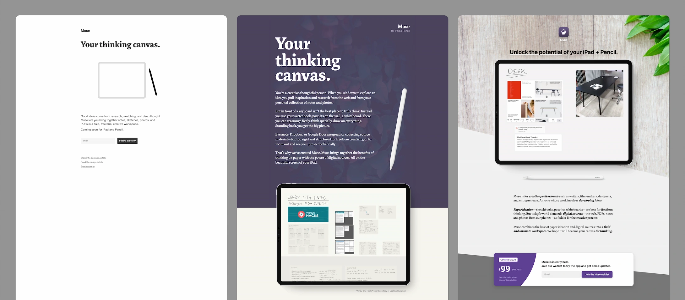
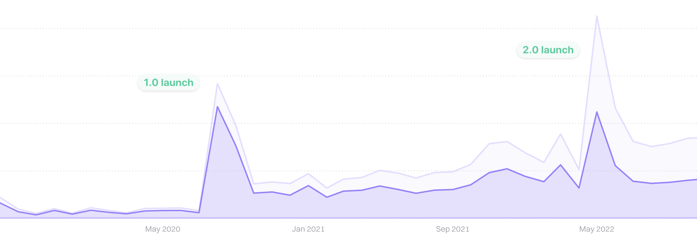
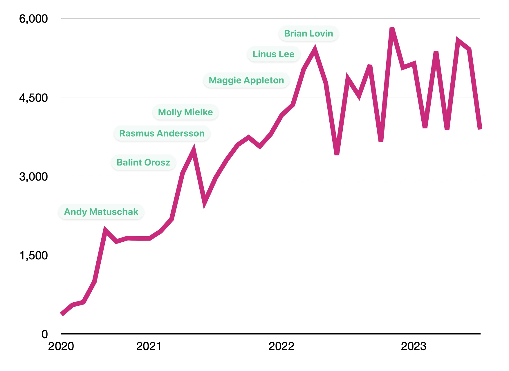
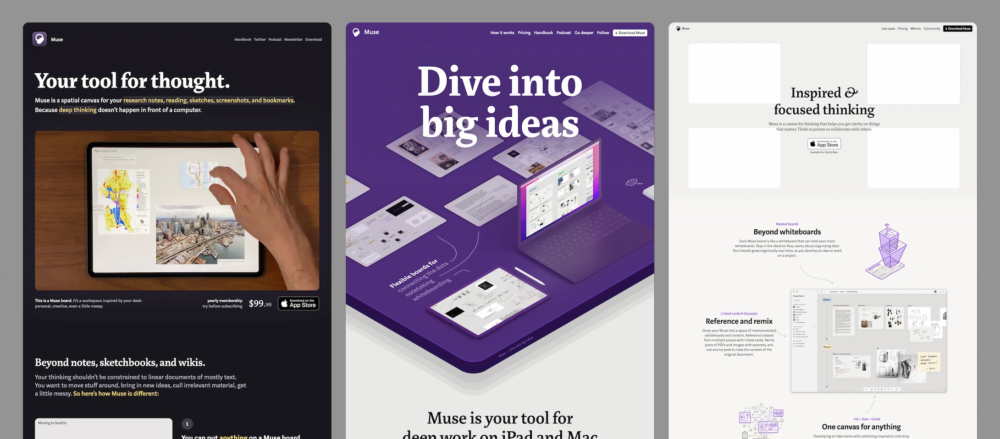
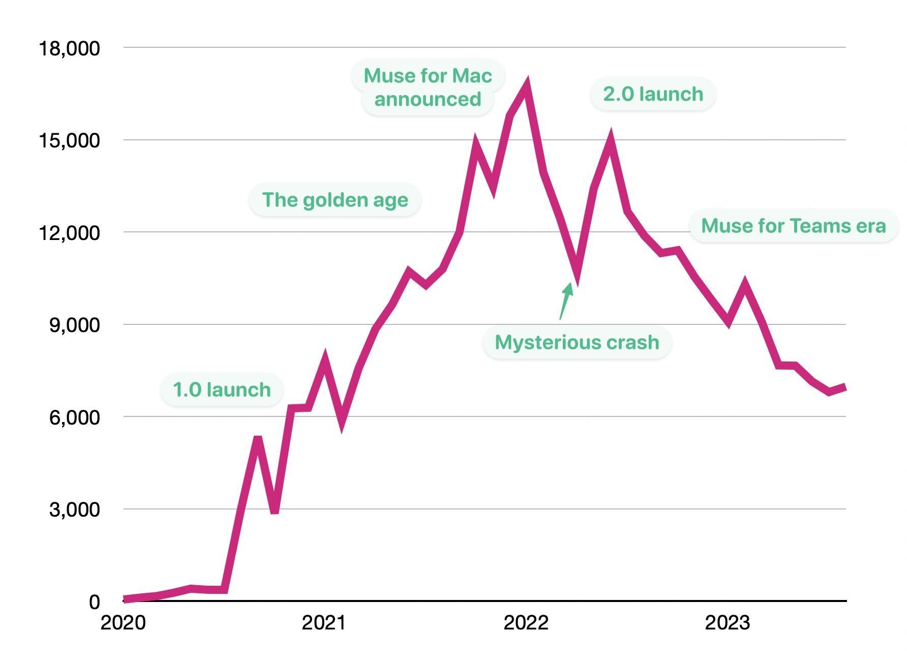
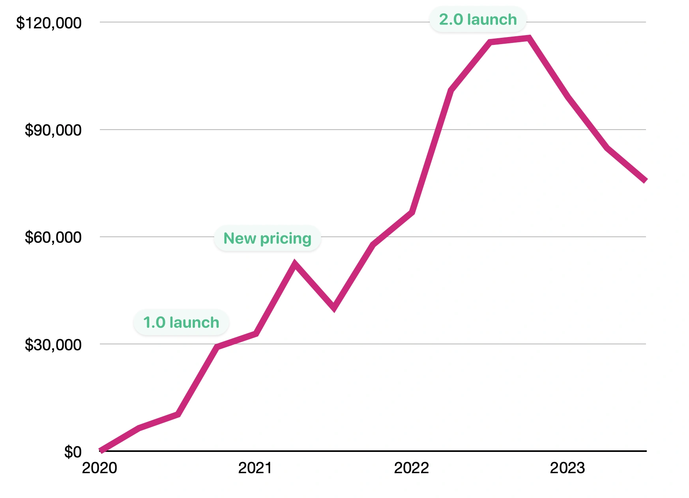
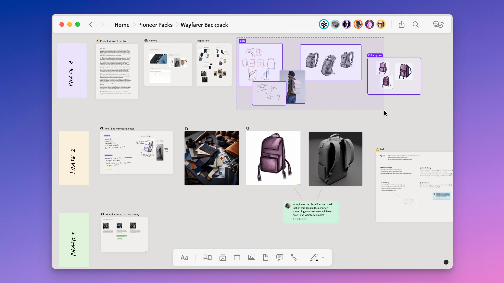

### Origins  

起源

Muse began life as part of a human-computer interaction lab called [Ink & Switch](https://www.inkandswitch.com/).  

Muse 最初是名为 Ink & Switch 的人机交互实验室的一部分。  

The lab's charter involved inventing a new computing environment that would better serve people doing important knowledge work: scientists, writers, entrepreneurs, designers, architects, and so on.  

该实验室的宗旨是发明一种新的计算环境，更好地服务于从事重要知识工作的人员：科学家、作家、企业家、设计师、建筑师等。

[Mark McGranghan](https://markmcgranaghan.com/), [Julia Roggatz](https://juliaroggatz.com/), and I were working together in the lab and started to see a confluence of several tracks of research that we thought could become a commercial product.  

马克-麦克格兰汉、朱莉娅-罗格茨和我在实验室里一起工作，开始发现我们认为可以成为商业产品的几个研究方向的交汇点。  

This included input devices and form factors (tablet + touchscreen + stylus), [infinite canvas](https://infinitecanvas.tools/) as a document type, and how digital tools can be more useful at the ideation stage of a project (which typically gets done with analog tools like whiteboards, sketchbooks, and post-its).  

其中包括输入设备和形式因素（平板电脑+触摸屏+手写笔）、无限画布作为一种文档类型，以及数字工具如何在项目的构思阶段发挥更大作用（通常使用白板、速写本和便利贴等模拟工具）。

Julia had created a fantastic prototype that ran on iPad, and Mark had been the product visionary (and also came up with the name “Muse”).  

朱莉娅创造了一个在 iPad 上运行的奇妙原型，而马克则是产品的设想者（他还想出了 "Muse "这个名字）。  

I was ready to transition from running a research lab to working on a commercial product and joined them to create a commercial spinout.  

我已经准备好从管理研究实验室过渡到开发商业产品，于是加入了他们，创建了一家商业分拆公司。

So in summer of 2019 we created Muse Software, Inc.  

因此，2019 年夏天，我们创建了 Muse 软件公司。  

Ink & Switch gave us the existing IP (name, product design, prototype codebase) in exchange for a stake in the new company, and we were off.  

斯维奇公司将现有的知识产权（名称、产品设计、原型代码库）交给我们，以换取新公司的股份，然后我们就走了。

### Research prototype → product  

研究原型 → 产品

We quickly discovered that things that had tested well in the lab were simply too hard to explain to new users.  

我们很快就发现，那些在实验室中测试结果良好的东西根本难以向新用户解释。  

For example, holding the stylus at a particular angle to activate different tools.  

例如，以特定角度握住触控笔以激活不同的工具。  

Most of our early onboarding (done either in person or over videochat) failed in the sense that people did not go on to use the product.  

我们早期的大多数入职培训（面对面或通过视频聊天完成）都失败了，因为人们没有继续使用产品。

Shortly after we started the company we were lucky enough to land [Lennart Ziburski](https://www.lennartziburski.com/) as a product designer.  

公司成立后不久，我们有幸聘请到 Lennart Ziburski 担任产品设计师。  

He immediately started finding ways to bring Muse closer to the status quo of what people expect from iPad apps, and before long we had our first handful of regular users.  

他立即开始想方设法让 Muse 更接近人们对 iPad 应用程序的期望，不久我们就拥有了第一批固定用户。

My background is in product development (e.g.  

我的背景是产品开发（例如  

design, engineering, user research), but since we had such a strong product team already I decided to make my focus for this venture be storytelling.  

但由于我们已经有了一支如此强大的产品团队，我决定把讲故事作为这次创业的重点。  

I challenged myself to figure out how to explain a novel product, build a brand, and generally get the word out to people we hoped to have as users and customers.  

我向自己提出了挑战，要想办法解释一个新颖的产品，建立一个品牌，并向我们希望拥有的用户和客户广泛宣传。

My first real try at this was starting [an email newsletter](https://museapp.com/email-updates/001/).  

我在这方面的第一次真正尝试是创办了一份电子邮件通讯。  

At the time this was a non-obvious idea, but the timing was perfect: independent writers, Substack, and the newsletter craze in general was just getting started.  

当时，这个想法并不显眼，但时机恰到好处：独立作家、Substack 和整个通讯热潮才刚刚开始。  

The early editions of our newsletter were a success at helping tell a larger story, test some ideas (including [pricing](https://museapp.com/email-updates/003/)), and generally keep folks on our waitlist engaged while we tried to get the product in shape.  

我们早期的通讯成功地帮助我们讲述了一个更大的故事，测试了一些想法（包括定价），并在我们努力使产品成型的同时，让我们等待名单上的人保持参与。

### Company vision  

公司愿景

For the company and team, we sought a somewhat unusual structure that blended elements from startups, indie businesses, and professional partnerships (such as legal or accounting firms).  

对于公司和团队而言，我们寻求的是一种不同寻常的结构，它融合了初创企业、独立企业和专业合伙企业（如律师事务所或会计师事务所）的元素。

Our [“small giants”](https://museapp.com/podcast/24-small-giants/) approach optimized for mojo over growth.  

我们的 "小巨人 "方法优化了魔力而非增长。  

We wanted a small, talent-dense team with a focus on craft, autonomy, and quality of life for all team members.  

我们希望有一个小型、人才密集的团队，注重工艺、自主性和所有团队成员的生活质量。  

We banished the term “founder” in favor of “partner” and tried to be transparent with all business matters across the team.  

我们放弃了 "创始人 "这一称谓，转而使用 "合伙人 "这一称谓，并努力让整个团队的所有业务事务都透明化。

We took some capital from investors in order to invest heavily in technology, design, and brand—just as a startup would.  

我们从投资者那里获得了一些资金，以便在技术、设计和品牌方面进行大量投资，就像初创企业一样。  

But we started charging a prosumer price early on, intending to avoid further funding rounds, and instead transition to being revenue-supported.  

但我们很早就开始以消费者的价格收费，打算避免进一步的融资，转而过渡到收入支持。

### Pre-1.0 doubts  

1.0 前的疑问

We quietly moved from TestFlight to the App Store in early 2020, and activated a subscription paywall once a user reached a data threshold.  

2020 年初，我们悄然从 TestFlight 迁移到 App Store，并在用户达到数据阈值后激活了订阅付费墙。  

Our team was nervous about this: as craftspeople it’s easy to feel like its not ready, see all the flaws, etc.  

我们的团队对此感到很紧张：作为手工艺者，我们很容易觉得还没准备好，看到所有的缺陷等等。  

But to our delight, we pushed the paywall live and several people purchased a $100 annual subscription right away.  

但令我们高兴的是，我们推出付费墙后，立即就有几个人购买了 100 美元的年度订阅。

But by mid-2020 I was having some doubts about the viability of the company.  

但到了 2020 年中期，我对公司的生存能力产生了一些怀疑。  

We had a few hundred active users—some incredibly active, using the app for hours a day to do important work like evaluating investment decisions or developing a master thesis.  

我们有几百名活跃用户--有些用户非常活跃，每天使用该应用数小时来完成评估投资决策或撰写硕士论文等重要工作。  

Of those, we had a very high conversion rate, with already 50 or so customers.  

其中，我们的转化率非常高，已经有 50 多位客户。  

But we didn’t have the growth we needed, and it wasn’t clear where it would come from.  

但我们并没有实现所需的增长，也不清楚增长从何而来。  

I thought a lot about whether the experiment of this venture was over almost before it began.  

我想了很久，这次冒险的实验几乎还没开始就已经结束了。

We were also struggling to find good messaging/positioning for our homepage.  

我们还在努力为我们的主页寻找好的信息/定位。  

New users often wanted to slot us into “note taking” or “sketchbook/whiteboarding” neither of which were a great fit for the problem we wanted to solve.  

新用户往往希望把我们归类为 "记笔记 "或 "素描本/白板"，而这两者都不太适合我们要解决的问题。

The first three iterations of museapp.com.  

museapp.com 的前三次迭代。

I loved “thinking canvas” but that phrase didn’t strike a chord with users.  

我喜欢 "思考画布"，但这句话并没有引起用户的共鸣。  

Based on early feedback, we tried a message of helping the iPad reach its potential as a creative tool.  

根据早期的反馈意见，我们尝试传递一种信息，帮助 iPad 发挥其作为创意工具的潜力。

The opportunity we were going after, one I think is still mearningful and [unsolved](https://twitter.com/tomcritchlow/status/1734262829299966339) by any product today, is to bring the earliest stages of unstructured thinking and project ideation onto the computer.  

我们所追求的机会，我认为是一个有意义的机会，也是目前任何产品都无法解决的机会，那就是将非结构化思维和项目构思的最初阶段带入计算机。  

Almost every other part of our information lives have long-since been digitized: accounting into spreadsheets, presentations into slide software, page layout into graphic design software, etc.  

我们信息生活中的几乎所有其他部分都早已数字化：会计工作纳入电子表格，演示文稿纳入幻灯片软件，页面排版纳入平面设计软件，等等。  

But when it comes time for an individual or a team to sit down and sketch out the beginnings of a new business, a new book, a new piece of art—this almost never happens at a computer.  

但是，当一个人或一个团队坐下来，勾勒出一个新企业、一本新书、一件新艺术品的雏形时，这几乎永远不会发生在电脑前。  

Or if it does, it’s a cobbled-together collection of tools like Google Docs and Zoom which aren’t really made for this critical part of the creative lifecycle.  

即使有，也是谷歌文档和 Zoom 等工具的拼凑，并非真正为创意生命周期的这一关键部分而设计。

But a long-winded description of the problem doesn’t cut it for something like a marketing website, which needs to sum up the problem and the value prop in a couple sentences.  

但对于营销网站来说，冗长的问题描述并不合适，因为营销网站需要用几句话来概括问题和价值主张。  

I found that, for any individual person, I could sit down and ask them a few questions that would quickly lead them to understand what we were doing.  

我发现，对于任何一个人，我都可以坐下来问他们几个问题，很快就能让他们明白我们在做什么。  

Usually that conversation would go like this:  

通常，对话会这样进行

> Me: What do you do when thinking about ideas for a new project?  
> 
> 我：在考虑新项目的创意时，你会怎么做？
> 
> Them: Well, I sketch some stuff in my notebook.  
> 
> 他们：嗯，我在笔记本上画了一些素描。  
> 
> Then I take a photo of those with my phone and upload them to Evernote. I hate Evernote, but anyway.  
> 
> 然后我用手机拍下这些照片，上传到 Evernote。我讨厌 Evernote，但不管怎样。  
> 
> From there, to share with my collaborator, I copy-paste some screenshots into iMessage/Slack/Google Docs, but that never works so well because … oh.  
> 
> 从那以后，为了与合作者分享，我把一些截图复制粘贴到 iMessage/Slack/Google Docs 中，但效果总是不佳，因为......哦。  
> 
> All of this is what you’re trying to make better?  
> 
> 所有这些都是你想要改善的？
> 
> Me: Yep.  
> 
> 我：是的。
> 
> Them: I need that. When can I buy it?  
> 
> 他们：我需要这个。什么时候能买到？

A related problem is that we had yet to target a narrow market, like just writers, or just designers, or just architects.  

与此相关的一个问题是，我们还没有瞄准一个狭窄的市场，比如只有作家、设计师或建筑师。  

In the research phase we had purposely kept it generic, e.g.  

在研究阶段，我们特意保持了通用性，例如  

it could just as well be used by someone working on a book as it could be someone designing a building.  

它既可以被写书的人使用，也可以被设计建筑的人使用。  

This seemed to make sense because analog ideation tools are generic: there’s no whiteboard for authors that’s different from a whiteboards for architects.  

这似乎是有道理的，因为模拟构思工具是通用的：作家用的白板和建筑师用的白板没有什么不同。

But if I’m honest it’s also because I loved the diversity of our userbase.  

但老实说，这也是因为我喜欢我们用户群的多样性。  

Even at this early stage, we had lawyers, doctors, fiction authors, journalists, investors, game designers, and many more using our product.  

即使是在早期阶段，我们的产品也得到了律师、医生、小说作家、记者、投资者、游戏设计师等众多人士的青睐。  

I had assumed that, at one point, we’d have a segment that would emerge as the most numerous, most likely to buy, or one we thought we could best serve and then we’d find a way to focus on that.  

我曾假设，我们会有一个细分市场，这个细分市场的数量最多、最有可能购买，或者是我们认为最能为其提供服务的市场，然后我们就会想办法专注于这个细分市场。  

But that never happened and we never forced it, which was probably a long-term problem.  

但这从未发生过，我们也从未强迫过，这可能是一个长期的问题。

### Launch rocketship  

发射火箭飞船

Despite our weak growth and my concerns about the messaging problems, we decided to push forward with the 1.0 launch.  

尽管我们的增长乏力，我也担心信息传递问题，但我们还是决定推进 1.0 版本的发布。  

This would be a pure marketing launch: the product was already stable enough for real use and available for purchase in the App Store.  

这将是一次纯粹的营销发布：产品已经足够稳定，可以实际使用，并可在 App Store 购买。  

But we needed to break out of our small circle of users who had discovered us organically.  

但是，我们需要跳出我们的用户小圈子，这些用户是通过有机方式发现我们的。

I churned through lots of messaging ideas and was generally gnashing my teeth about this.  

我想了很多传递信息的点子，总之为此咬牙切齿。  

I ultimately answered the question by coming up with a bunch of weird ideas and split-testing them on our existing website to see which converted.  

我最终回答了这个问题，我想出了很多奇怪的点子，并在我们现有的网站上对它们进行了拆分测试，看看哪个点子转化率高。  

A clear winner emerged from among these: calling ourselves a “tool for thought."  

其中一个明显的赢家是：称自己为 "思想工具"。

I was surprised, since this was a niche term from the dusty archives of the 1970s and 1980s HCI research world.  

我很惊讶，因为这是一个来自上世纪七八十年代人机交互研究领域尘封档案中的小众术语。  

Little did I know that the term was about to explode in popularity, largely driven by the breakout success of [Roam Research](https://roamresearch.com/) starting to build steam about this time.  

我并不知道，这个词即将大受欢迎，主要原因是 "漫游研究"（Roam Research）在这一时期取得了突飞猛进的成功。  

But I was delighted, because “thinking tool” or “thinking canvas” was how I personally always thought of Muse, I just didn’t think that would play with a wider audience.  

但我很高兴，因为 "思考工具 "或 "思考画布 "是我个人对缪斯的一贯印象，我只是没想到这会受到更多观众的欢迎。

In August of 2020 we launched on [Product Hunt](https://www.producthunt.com/products/muse-3#muse-e1675bce-2c44-47d7-baa5-e37ccb32d80c) and [Twitter](https://twitter.com/MuseAppHQ/status/1298928286064668672). Apple featured us prominently in the App Store.  

2020 年 8 月，我们在 Product Hunt 和 Twitter 上发布了产品。苹果公司在 App Store 显著位置介绍了我们。  

To my delight and surprise, the launch was a huge success.  

让我感到高兴和惊喜的是，发布会取得了巨大成功。  

We got mentions from high-profile tech thinkers, including [Benedict Evans](https://www.ben-evans.com/)’ newsletter, the economics blog [Marginal Revolution](https://marginalrevolution.com/marginalrevolution/2020/08/sunday-assorted-links-279.html), and a one-word tweet from [Patrick Collison](https://twitter.com/patrickc/status/1299868931679608833).  

本尼迪克特-埃文斯（Benedict Evans）的时事通讯、经济学博客 "边际革命"（Marginal Revolution）等知名科技思想家都提到了我们，帕特里克-科里森（Patrick Collison）还在推特上写了一个字。

Website traffic for the first three years of Muse.  

Muse 前三年的网站流量。

Note that the 1.0 launch bump produced a “new normal” baseline traffic that was 4x where we were before.  

需要注意的是，1.0 版本推出后，"新常态 "基线流量是之前的 4 倍。  

The 2.0 bump is only slightly bigger and didn’t adust the baseline afterward.  

2.0 的撞击只是稍微大了一点，之后并没有对基线造成影响。

With buzz building nicely and growth taking off, we had inbound interest from some angel investors whom I respected.  

随着热潮的兴起和增长的腾飞，一些我尊敬的天使投资人对我们产生了浓厚的兴趣。  

So we took another small funding round (about $600k).  

因此，我们又进行了一轮小额融资（约 60 万美元）。

Doubts set aside, we settled into a rhythm of shipping great features to our growing audience.  

抛开疑虑，我们进入了为不断增长的受众提供出色功能的节奏。

### Distribution channels  

分销渠道

You’ve probably seen [the meme about product distribution](https://twitter.com/justinkan/status/1376655257749450760), and I went into this venture knowing that productivity software is particularly difficult to market.  

你可能已经看到过关于产品分销的备忘录，我知道生产力软件尤其难以营销，所以我才投入了这项事业。  

Everyone needs software for email, calendar, todo, notes, etc.  

每个人都需要电子邮件、日历、待办事项、笔记等软件。  

But your computer comes with pretty good defaults, and there's no specific market (in the [Crossing the Chasm](https://en.wikipedia.org/wiki/Crossing_the_Chasm) sense of people with shared identity that talk to one another) for todo software.  

但你的电脑自带的默认设置相当不错，而且也没有特定的市场（在跨越鸿沟的意义上，即具有共享身份并能相互交流的人们）来购买待办事项软件。  

There's no "Todo Apps Monthly" magazine or trade show.  

没有 "Todo Apps 月刊 "杂志或贸易展。  

Hence these markets tend to be fragmented, with a zillion niche players, and no clear path to building a big business.  

因此，这些市场往往支离破碎，有数以亿计的利基参与者，没有明确的途径建立大企业。

I generally like the approach outlined in [Traction](https://www.goodreads.com/book/show/22091581-traction).  

我总体上喜欢《牵引》一书中概述的方法。  

Briefly: any given business will find a small number of highly-effective channels, and the rest don't matter.  

简而言之：任何一家企业都会找到少数几个高效的渠道，其他的都无关紧要。  

For Heroku, that was attending developer conferences and getting blog posts on Hacker News.  

对于 Heroku 来说，这就是参加开发者大会和在 Hacker News 上发表博客文章。  

For another business it might be YouTube influencer sponsorships and print ads in a niche magazine.  

对于另一个企业来说，这可能是 YouTube 影响力赞助和利基杂志上的平面广告。  

So I set about systematically testing many channels.  

于是，我开始系统地测试多种渠道。

Some of the things we tried that had mixed success:  

我们尝试过的一些方法有好有坏：

-   press outreach including early beta access, press kits, etc similar to [this guide](https://charliemchapman.com/posts/2019/9/27/marketing-dark-noise)  
    
    与本指南类似的新闻推广活动，包括早期测试访问、新闻资料袋等
    
-   our email newsletter (worked great during waitlist for brand-building, after that not so much)  
    
    我们的电子邮件时事通讯（在候选名单期间对建立品牌非常有效，但之后就不那么有效了）
    
-   [blog posts](https://museapp.com/memos/) explaining the design and philosophy behind new features  
    
    博客文章，解释新功能背后的设计和理念
    
-   paid ads (text or banner images) on Apple and productivity sites like MacStories and The Sweet Setup  
    
    在 MacStories 和 The Sweet Setup 等苹果和生产力网站上投放付费广告（文字或横幅图片
    
-   sponsorships on tools-nerds podcasts like Cortex  
    
    赞助 Cortex 等工具爱好者播客
    
-   promoted tweets and Reddit posts  
    
    推广推文和 Reddit 帖子
    
-   App Store paid keywords like “infinite canvas” and “tool for thought”  
    
    应用商店付费关键词，如 "无限画布 "和 "思考工具"
    
-   [YouTube instructional videos  
    
    YouTube 教学视频](https://www.youtube.com/@MuseAppHQ)
    

The marketing/distribution angles that worked best were:  

最有效的营销/传播角度是

-   **[10 second demo videos](https://twitter.com/MuseAppHQ/status/1264930667156176897) of the app, an iPad, and the hands/stylus operating it on Twitter.** These would sometimes “go viral” and get ourselves in front of many new people.  
    
    在 Twitter 上发布 10 秒钟的演示视频，展示应用程序、iPad 和操作者的双手/姿势。这些视频有时会 "病毒式传播"，让许多新朋友看到我们。  
    
    Important here was that I shot the video using an external camera (just an iPhone mounted on a mic stand) so that you can see the hands.  
    
    重要的是，我使用外置摄像头（只是一个安装在麦克风架上的 iPhone）拍摄视频，这样你就能看到手了。  
    
    Our screen recording videos (on iPad, and later Mac) didn’t attract the same attention.  
    
    我们的屏幕录制视频（在 iPad 和后来的 Mac 上）并没有引起同样的关注。
    
-   **Our podcast, [Metamuse](https://museapp.com/podcast/)**.  
    
    我们的播客 Metamuse  
    
    Mark and I had started this because we thought it would be fun, not because we thought it would be important for the business.  
    
    马克和我开始这样做，是因为我们觉得这会很有趣，而不是因为我们觉得这对企业很重要。  
    
    Although it took ten or so episodes to find our footing, once we started to secure high-profile guests ([Andy Matuschak](https://museapp.com/podcast/12-growing-ideas/) was our breakout moment, as you can see from the plot below) we found there was a natural slow virality to the podcast.  
    
    虽然我们花了十来集的时间才站稳脚跟，但一旦我们开始邀请高知名度的嘉宾（如下图所示，安迪-马图沙克（Andy Matuschak）就是我们的爆发时刻），我们就发现播客自然而然地慢慢形成了病毒式传播。
    
    -   I think the podcast worked so well because it was authentic.  
        
        我认为，播客之所以如此成功，是因为它是真实的。  
        
        Mark and I had something to say based on our long experience in the tech industry and our work at Muse.  
        
        基于我们在科技行业的长期经验和在 Muse 的工作，马克和我有话要说。  
        
        From there we wove in guests who were doing interesting work in the space of productivity software and creative tools.  
        
        从那时起，我们就把那些在生产力软件和创意工具领域从事有趣工作的嘉宾请进来。
        
    -   The podcast also helped immensely with our messaging problem.  
        
        播客还极大地帮助我们解决了信息传递问题。  
        
        We couldn’t boil our problem statement down into a website tagline very effectively, but if you listened to me and Mark talk about the problem of effective ideation, the value of having good ideas, etc for an hour you came away with an appreciation for the product’s purpose.  
        
        我们无法有效地将我们的问题陈述归结为一个网站标语，但如果你听我和马克谈了一个小时关于有效构思的问题、拥有好创意的价值等，你就会对产品的目的有所了解。
        
    -   The podcast also built trust in our team and helped people take the plunge on our premium-priced product.  
        
        播客还建立了人们对我们团队的信任，并帮助他们购买我们的高价产品。
        

Podcast monthly listeners, estimated by unique IP downloads.  

播客每月听众人数，按唯一 IP 下载量估算。

High-profile guests (some of which are labeled here) created spikes in new listeners.  

高知名度的嘉宾（其中一些在此标注）使新听众人数激增。  

But after I think many stayed as regular listeners thanks to ongoing high-quality episodes.  

但我认为，由于高质量的节目不断播出，许多人后来都成了固定听众。

-   **Getting featured on the App Store.** I’m deeply grateful to the folks inside the App Store editorial team who were rooting for us from the beginning.  
    
    登上 App Store。我非常感谢 App Store 编辑团队的成员们，他们从一开始就支持我们。  
    
    Getting featured here really is a game-changer.  
    
    在这里得到报道真的会改变游戏规则。
    
    -   That said, there are some challenges.  
        
        尽管如此，也存在一些挑战。  
        
        First, this works best when you go all-in on playing Apple’s game. I talked about this [with the creator of MindNode](https://museapp.com/podcast/66-business-of-apps/), who built a business by always building on the next platform or API that Apple wants to market this year.  
        
        首先，当你全身心投入到苹果的游戏中时，这样做的效果最好。我曾与 MindNode 的创建者讨论过这个问题，他就是通过始终在苹果公司希望在今年推出的下一个平台或 API 上进行开发而建立起自己的业务的。  
        
        For us this didn't work, our aspirations were too out of sync with Apple's direction on iPad and in general.  
        
        对我们来说，这行不通，因为我们的愿望与苹果公司在 iPad 上的发展方向和总体目标太不一致了。
        
    -   Also, leads that came via the App Store were very low quality.  
        
        此外，通过 App Store 获得的线索质量很低。  
        
        People would rarely see our website, or even read much on the App Store listing page.  
        
        人们很少看到我们的网站，甚至很少阅读应用商店的列表页面。  
        
        They would just think “oh cool a new whiteboard app, I’ll try it” and then immediately bounce out at the first moment of confusion or friction inside the app.  
        
        他们只会想："哦，酷毙了，新的白板应用程序，我试试看。"然后，一旦在应用程序中出现困惑或摩擦，他们就会立即跳出。  
        
        Often coupled with a one-star review!  
        
        通常还会加上一个一星评论！
        
-   Later on we got some great **coverage from YouTube reviewers**, most notably [DailyTekk](https://www.youtube.com/watch?v=IQYBw7jJjlo) but also some smaller channels like [Shu Omi](https://www.youtube.com/watch?v=BcagJV4QEDw) and [Keep Productive](https://www.youtube.com/watch?v=1gAeDfU6tbI&t=7s). This brought lots of new users; we later also sponsored some of the channels.  
    
    后来，我们得到了 YouTube 评论员的大力支持，其中最著名的是 DailyTekk，但也有一些较小的频道，如 Shu Omi 和 Keep Productive。这为我们带来了很多新用户；后来我们还赞助了一些频道。  
    
    My theory for why we got so many video-format reviews compared to traditional web publications is that the app shows really well on video, but is hard to explain with only text and screenshots.  
    
    与传统的网络出版物相比，我们得到了这么多视频形式的评论，我的理论是，这款应用程序在视频上显示得非常好，但仅靠文字和截图很难解释清楚。
    
-   **Product Hunt is pretty good and (nearly) free** if you’re already creating launch materials. And really, [product launches](https://museapp.com/podcast/52-product-launches/) in general. Always Be Launching!  
    
    如果您已经在制作发布材料，Product Hunt 是相当不错的选择，而且（几乎）免费。其实，产品发布也是如此。时刻准备发布！
    

Overall, I can’t point to any one thing that we did that worked: but rather [a succession of unlocks](https://longform.asmartbear.com/exponential-growth) which would work for a time, then level off or decline.  

总的来说，我无法指出我们所做的任何一件事是行之有效的：而是一连串的解锁，这些解锁在一段时间内行之有效，但随后就会趋于平缓或衰退。

### The golden age  

黄金时代

2021 was the best year for Muse.  

2021 年是缪斯最好的一年。  

A second engineer, Adam Wulf, had joined our team the previous year and now our team of five was cranking out product improvements at an impressive rate.  

去年，第二位工程师 Adam Wulf 加入了我们的团队，现在我们的五人团队正在以惊人的速度改进产品。  

The “tools for thought” trend was in full swing, and being described as note-taking or sketching app was in our review mirror.  

思想工具 "的趋势如火如荼，被描述为记笔记或素描应用程序是我们的审查镜像。  

We had a good amount of runway and a small but steadily-growing revenue stream.  

我们有充足的发展空间，收入虽然不多，但在稳步增长。  

The podcast was cranking out high-quality episodes, and we were consistently in the top 200 podcasts list in the Technology category of Apple Podcasts.  

我们的播客不断推出高质量的剧集，并且一直在 Apple Podcasts 科技类播客排名前 200 位。  

Team morale was at an all-time high and I was loving every day of my work.  

团队士气空前高涨，我热爱我的每一天工作。

museapp.com as it looked for the 1.0, 2.0, and 3.0 releases of the product.  

museapp.com产品的1.0、2.0和3.0版本。

We [launched new pricing](https://museapp.com/memos/2021-06-pricing/) which seemed to unlock the growth we needed to be on a track to sustainability.  

我们推出了新的定价，这似乎释放了我们所需的增长，使我们走上了可持续发展的轨道。  

But we were often running up against a problem: many people followed our work via Twitter and the podcast but would say: "Love what you're doing, but I don't use an iPad."  

但我们经常遇到一个问题：很多人通过推特和播客关注我们的工作，但他们会说："我喜欢你们的工作，但我不用iPad。"我喜欢你们的工作 但我不用iPad"

It had always been our intention to bring Muse to other devices, but it’s clear that desktop computers is where most professionals do their work.  

我们一直希望将 Muse 带到其他设备上，但很明显，台式电脑是大多数专业人士工作的地方。  

Even if you own an iPad, if the bulk of your serious work happens elsewhere, there’s a gravitational pull away from Muse on iPad despite your best intentions.  

即使你拥有 iPad，但如果你的大部分重要工作都在其他地方进行，那么尽管你有良好的意愿，但还是会被 iPad 上的 Muse 所吸引。

But a Mac app alone wouldn’t be enough. We needed your Muse boards to be available on both devices.  

但仅有 Mac 应用程序是不够的。我们需要您的 Muse 板在两种设备上都能使用。  

After extensive experiments with iCloud (slow, unreliable, impossible to debug) and Firebase (better but not really suitable for the large data sizes our best customers had) we decided to import another piece of bleeding-edge research technology from Ink & Switch. Namely: [local-first](https://www.inkandswitch.com/local-first/) sync with CRDTs.  

在对 iCloud（缓慢、不可靠、无法调试）和 Firebase（较好，但并不适合我们最好客户的大数据量）进行广泛试验后，我们决定从 Ink & Switch 引进另一项尖端研究技术。即：本地优先同步 CRDT。

Mark had previously worked on a research project which implemented this, so he ended up building a from-scratch system over the course of a year.  

马克之前曾参与过一个研究项目，该项目就是为了实现这一目标，因此他最终花了一年时间从零开始建立了一个系统。  

Wulf filled in the client-side implementation in Swift and ported the app from Core Data to the new persistence layer.  

Wulf 用 Swift 填充了客户端实现，并将应用程序从 Core Data 移植到了新的持久层。

After having tried to do sync with many other technologies, this bespoke system felt magical.  

在尝试过使用许多其他技术进行同步后，这个定制系统让人感觉非常神奇。  

You could draw on your iPad and see it instantly on your Mac.  

你可以在 iPad 上画图，并立即在 Mac 上看到。  

But you could also disable your network and continue working as long as you wanted, and reconnect to have all the changes merge back together.  

不过，你也可以禁用网络，继续工作，只要你愿意，然后重新连接，将所有更改合并到一起。

The Mac app was a huge effort by Julia and Lennart. [The challenge of adapting our tablet-native canvas to a keyboard/mouse/non-touchscreen](https://museapp.com/podcast/55-mac-app-design/) was substantial but I think they did an incredible job. And [Catalyst](https://developer.apple.com/mac-catalyst/) is an excellent technology for using the same codebase for both platforms.  

Mac 应用程序是 Julia 和 Lennart 付出的巨大努力。将我们的平板原生画布调整为键盘/鼠标/非触摸屏是一项巨大的挑战，但我认为他们做得非常出色。催化剂是一项出色的技术，可以在两个平台上使用相同的代码库。

At the end of 2021, all our metrics were up and to the right. We [tweeted a teaser shot of our icon in the Mac dock](https://twitter.com/MuseAppHQ/status/1460289906081779718) which got everyone really excited.  

2021 年年底，我们的所有指标都在上升，而且都在右边。我们在推特上发布了我们在 Mac dock 中的图标预告，这让每个人都非常兴奋。  

It felt like the addition of the Mac app would push us over the edge into being a serious tool for work, open us to new audiences, and juice our revenue to bring us to financial sustainability.  

我们感觉，Mac 应用程序的加入将使我们成为一个严肃的工作工具，为我们带来新的受众，并增加我们的收入，使我们实现财务上的可持续发展。

### The crash  

坠机

In the first quarter of 2022, something strange happened that I still can’t fully explain.  

2022 年第一季度，发生了一件我至今无法完全解释的怪事。  

Our active users dropped by almost half over the course of a month or two, and all our other metrics (revenue, podcast listeners, etc) seemed to level off or even decline.  

在一两个月的时间里，我们的活跃用户减少了近一半，我们的所有其他指标（收入、播客听众等）似乎都趋于平稳，甚至有所下降。

Weekly active users.  

每周活跃用户。

To this date it remains a mystery why we had solid growth for nearly two years after the initial launch, followed by a decline only briefly interrupted by our 2.0 launch.  

时至今日，我们仍然不明白，为什么在最初推出后的近两年时间里，我们的业绩一直保持稳定增长，而在推出 2.0 版后，业绩却出现了短暂的下滑。

Our 2.0 release wasn’t out quite yet and people were getting a little annoyed/impatient, since we had implied it would be available early in the year, and in the end we didn’t launch until late May.  

我们的 2.0 版本还没有发布，人们有点恼火/不耐烦，因为我们曾暗示它将在年初发布，但最终我们直到 5 月底才发布。  

But after speaking to some other tools developers, who were seeing similar things, I think this was more a function of the macro economy.  

但在与其他一些看到类似情况的工具开发人员交谈后，我认为这更多是宏观经济的作用。  

The world was entering a period of tech market decline, rapid inflation, and high interest rates.  

世界进入了一个科技市场衰退、快速通胀和高利率的时期。

I’ve built businesses in time of financial recession: I started my first tech company in 2000, and Heroku was just getting started when the 2008 financial crisis occurred.  

我曾在金融衰退时期创建过企业：我在 2000 年创办了自己的第一家科技公司，2008 年金融危机爆发时，Heroku 刚刚起步。  

But in both of those cases, I think the underlying business was more solid.  

但在这两种情况下，我认为基本业务都比较稳固。

So while I could try to handwave away my failure as a CEO (“something something Ukraine war something something inflation”), I won’t do that.  

因此，虽然我可以用 "什么什么乌克兰战争什么什么通货膨胀 "来掩饰我作为首席执行官的失败，但我不会这么做。  

Instead I’ll ask the question: was Muse a [zero-interest rate phenomenon](https://www.theguardian.com/technology/2023/apr/11/techscape-zirp-tech-boom)?  

相反，我要问一个问题：缪斯是零利率现象吗？

Briefly, I think: yes.  

简而言之，我认为：是的。  

Or to put it less harshly, Muse as a brand and a product represented something aspirational.  

或者不那么严厉地说，缪斯作为一个品牌和产品，代表着某种令人向往的东西。  

People want to be deeper thinkers, to be more strategic, and to use cool, status-quo challenging software made by small passionate teams. These kinds of aspirations are easier to indulge in times of plenty.  

人们希望成为更深入的思考者，更具战略性，并使用由充满激情的小团队制作的、很酷的、挑战现状的软件。在富裕的时代，这些愿望更容易得到满足。  

But once you're getting [laid off](https://news.crunchbase.com/layoffs/us-tech-layoffs-accumulating-amzn-goog/) from your high-paying tech job, or struggling to raise your next financing round, or scrambling to protect your kids' college fund from runaway inflation and uncertain markets... I guess you don't have time to be excited about cool demos on Twitter and thoughtful podcasts on product design.  

但是，一旦你从高薪的技术工作岗位上被解雇，或者正在为下一轮融资而苦苦挣扎，或者正在为保护孩子的大学基金免受失控的通货膨胀和不确定市场的影响而焦头烂额......我想你就没时间再为推特上炫酷的演示和关于产品设计的深思熟虑的播客而兴奋了。

I’d speculate that another factor is the half-life of cool new productivity software.  

我推测，另一个因素是新的炫酷生产力软件的半衰期。  

Evernote, Slack, Notion, Roam, Craft, and many others seem to get pretty far on community excitement for their first few years.  

Evernote、Slack、Notion、Roam、Craft 和其他许多公司在成立的头几年似乎都在社区的推动下走得很远。  

After that, I think you have to be left with software that serves a deep and hard-to-replace purpose in people’s lives.  

在此之后，我认为你就只能使用那些在人们生活中具有深刻意义且难以替代的软件了。  

Muse got there for a few thousand people, but the economics of prosumer software means that just isn’t enough.  

Muse 有几千人使用，但消费者软件的经济性意味着这远远不够。  

You need tens of thousands, hundreds of thousands, to make the cost of development sustainable.  

你需要几万、几十万才能使开发成本可持续。

### 2.0 launch and B2B pivot  

2.0 启动和 B2B 支点

So with this looming problem showing itself in our metrics, we pushed on through to a launch of Muse 2.0 in summer of 2022. It did pretty well, largely thanks to all the love and support our many friends showed us on Twitter, for which I’m eternally grateful.  

因此，尽管我们的指标显示出了这个迫在眉睫的问题，但我们还是在 2022 年夏天推出了 Muse 2.0。它的表现相当不错，这主要归功于推特上众多朋友对我们的关爱和支持，对此我永远心存感激。

It did make a difference for our numbers: our revenue doubled, from around 60k ARR to around 120k ARR, shortly after the launch.  

这确实为我们的数据带来了变化：推出后不久，我们的收入就翻了一番，从约 6 万年平均收入增至约 12 万年平均收入。  

But the absolute numbers were just still too small.  

但绝对数字还是太小了。  

120k ARR is a one-person business, not a team effort.  

120k ARR 是一个人的事业，而不是团队的努力。

Revenue annual run rate (ARR) over time.  

收入年运行率（ARR）随时间变化。

In the summer of 2022 I did some soul-searching, as did the rest of the team.  

2022 年夏天，我和团队其他成员一样进行了反思。  

We knew our dream of reaching sustainability with our current model wasn’t going to work.  

我们知道，以现有模式实现可持续发展的梦想是行不通的。  

But for me, I wasn’t done.  

但对我来说，我还没有完成。  

We had such incredible assets: the team, the brand, the beautifully-crafted app, the groundbreaking sync system, the podcast.  

我们拥有令人难以置信的资产：团队、品牌、制作精美的应用程序、开创性的同步系统和播客。  

Maybe we just needed a new business model.  

也许我们只是需要一种新的商业模式。

It had always been our plan to create a multiplayer version of the app, once we had conquered single-player and multi-device.  

我们一直计划，在完成单人和多设备游戏后，再创建一个多人版本的应用程序。  

The sync engine was already built and now battle-tested on 100k+ devices, many syncing very large datasets.  

同步引擎已经建成，目前已在 10 万多台设备上进行了实战测试，其中许多设备正在同步非常大的数据集。  

We already knew we wanted to move into collaboration—so why not pair it with a well-known, lucrative, venture-capable business model?  

我们已经知道我们想进入合作领域，为什么不将它与一个知名的、有利可图的、有风险投资能力的商业模式结合起来呢？  

Namely, B2B SaaS.  

即 B2B SaaS。

So as we convened for a team summit in August 2022, I laid everything out.  

因此，当我们在 2022 年 8 月召开团队峰会时，我把一切都安排好了。  

Everyone agreed: we had more to do here, and keeping all the good stuff (team/product/brand/etc) but jettisoning the thing that wasn’t working (business model and financing approach) made sense.  

每个人都同意：我们在这里还有更多的事情要做，保留所有好的东西（团队/产品/品牌等），但放弃不起作用的东西（商业模式和融资方式）是合理的。

My experience with fundraising from venture capitalists was brief, a bit painful, but also enlightening and inspiring.  

我从风险投资人那里筹集资金的经历很短暂，有点痛苦，但也很有启发和鼓舞。  

I had spent the last decade somewhat trying to escape the gravitational pull of Silicon Valley and venture-backed hypergrowth startups.  

在过去的十年里，我一直试图摆脱硅谷和风险投资支持的超高速增长初创企业的引力。  

Reconnecting to that world I discovered… a lot of really lovely people, with smart perspectives on business, founder-friendly mindsets, and general integrity and goodwill!  

重新回到那个世界后，我发现......有很多非常可爱的人，他们对商业有着睿智的见解，对创始人有着友好的心态，而且普遍正直善良！  

This made me feel encouraged to plug into the startup machine a bit more than we had so far.  

这让我感到很受鼓舞，我们可以比现在更积极地投入到创业机器中去。

But not surprisingly, we struggled to raise from an institutional investor.  

但毫不奇怪，我们很难从机构投资者那里筹集到资金。  

Because our B2B product was a barely-working prototype at that point, we were effectively a pre-seed “still just an idea” type company.  

由于当时我们的 B2B 产品只是一个勉强能用的原型，因此我们实际上是一家 "还只是一个想法 "的种子公司。  

But we had several small rounds of financing and a product already in the market.  

但我们已经进行了几轮小规模融资，产品也已投放市场。  

Those things were a liability, they argued, since they weren’t directly relevant to our B2B move.  

他们认为，这些东西是一种负担，因为它们与我们的 B2B 行动没有直接关系。  

Also, summer of 2022 was probably the worst time since 2008 to try to raise venture funding, so we were playing on hard mode anyway.  

另外，2022 年夏天可能是自 2008 年以来最难筹集风险资金的时候，所以我们一直在玩 "困难模式"。

In the end we raised from a dozen or so goodhearted angels and scout funds, plus I put in some of my own money.  

最后，我们从十几个好心的天使和童子军基金中筹集了资金，另外我还投入了一些自己的资金。  

It was intended to be a bridge round: enough to let us validate the market and product just a tiny bit, and then use that initial traction to raise a real round.  

这只是一轮过渡性融资：足以让我们稍微验证一下市场和产品，然后利用最初的牵引力进行真正的融资。

### It didn’t work  

没用

Going into 2023, we conducted [a survey](https://museapp.com/memos/2022-11-group-ideation/) to see if our existing audience contained people that would introduce us to use on their teams. The signal here looked really good!  

进入 2023 年，我们进行了一项调查，看看我们现有的受众中是否有人愿意介绍我们在他们的团队中使用。这里的信号看起来非常好！

We had hundreds of impassioned answers from people working at big and small companies talking about the burning pain point of their group ideation situation now that their team had gone permanently remote.  

我们收到了数百份慷慨激昂的答复，这些答复来自大大小小的公司，他们都在谈论自己的团队已经永久远程化后，小组构思情况的迫切痛点。

One team lead described to me how they would fly out new employees for orientation, put them in a hotel, etc all so that they could spend a couple of hours drawing on a whiteboard together.  

一位团队领导向我描述了他们是如何让新员工飞来参加入职培训、安排他们住酒店等，以便他们能花几个小时一起在白板上画画的。  

If they had to buy those new employees iPads and a Muse subscription they would happily do that as much cheaper and less logistically-difficult than their current solution.  

如果他们必须为这些新员工购买 iPad 和 Muse 订阅，他们会很乐意这样做，因为这比他们目前的解决方案要便宜得多，而且物流难度也更低。

I took numerous customer-discovery calls in the same vein.  

我也接过无数类似的客户调查电话。  

Over and over, team leads and CEOs described to me how they had tried everything out there (including the obvious direct competitors of Miro, FigJam, Freeform, and Whimsical) and none of them solved the problem long-term.  

团队领导和首席执行官们一次又一次地向我描述，他们如何尝试了所有的方法（包括 Miro、FigJam、Freeform 和 Whimsical 这些显而易见的直接竞争对手），但没有一个能长期解决问题。  

They were acutely aware of how this was hurting their team’s ability to creatively solve problems together, but didn’t see going back to the office as a viable solution.  

他们敏锐地意识到，这种情况损害了团队共同创造性地解决问题的能力，但他们并不认为回到办公室是一个可行的解决方案。

We envisioned Muse as the perfect combination of the freeform elements of a whiteboard, the structured text-heavy style of Notion or Google Docs, and the sense of place you get from a “virtual office” ala group chat.  

我们将 Muse 设想为白板的自由元素、Notion 或 Google Docs 的结构化文本风格以及群聊等 "虚拟办公室 "所带来的场所感的完美结合。  

As a way to asynchronously trade ideas and inspiration, sketch out project ideas, and explore possibilities, the multiplayer Muse experience is, in my honest opinion, unparalleled for small creative teams working remotely. Here’s a [3-minute demo](https://www.youtube.com/watch?v=Tm75MdXuqCM) of the early beta.  

作为一种异步交换想法和灵感、勾勒项目构思和探索可能性的方式，在我看来，Muse 的多人体验对于远程工作的小型创意团队来说是无与伦比的。下面是 3 分钟的早期测试版演示。

A screenshot of the completed multiplayer canvas. A true thing of beauty, in my opinion.  

多人游戏画布完成后的截图。在我看来，这才是真正的美。

We onboarded a couple of dozen teams, and some of them went on to integrate it into their daily work.  

我们接纳了几十个团队，其中一些还将其融入了日常工作。  

We had a few quotes from folks describing how their work was forever changed to have this series of nested whiteboards were they could gather ideas, have a shared artifact during a meeting, easily reference older material, sketch together, etc.  

我们听到一些人这样描述：有了这一系列嵌套的白板，他们的工作发生了翻天覆地的变化，他们可以在白板上收集想法，在会议期间共享人工制品，轻松参考旧资料，一起画草图，等等。

But friction began almost immediately.  

但摩擦几乎是一触即发。  

The team lead or organizer was usually the one bringing Muse to the team, and they were already a fan of its approach.  

团队领导或组织者通常是将 Muse 带到团队中的人，他们已经是 Muse 方法的粉丝。  

But the other team members are generally a little annoyed to have to learn any new tool, and Muse’s steeper learning curve only made that worse.  

但团队的其他成员一般都会对学习任何新工具感到恼火，而 Muse 更陡峭的学习曲线只会让情况变得更糟。  

Those team members would push the problem back to the team lead, treating them as customer support (rather than contacting us directly for help).  

这些团队成员会把问题推回给团队领导，把他们当作客户支持（而不是直接联系我们寻求帮助）。  

The team lead often felt like too much of the burden of pushing Muse adoption was on their shoulders.  

团队领导经常觉得他们肩负着太多推动 Muse 采用的重任。

This was in addition to the obvious product gaps, like: no support for the web or Windows; minimal or no integration with other key tools like Notion and Google Docs; and no permissions or support for multiple workspaces.  

除此之外，还有一些明显的产品缺陷，比如：不支持网络或 Windows；与 Notion 和 Google Docs 等其他重要工具的集成度极低或根本没有集成；没有权限或不支持多个工作空间。  

Had we raised $10M back during the cash party of 2020–2021, we could have hired the 15+ person team that would have been necessary to build all of that.  

如果我们在 2020-2021 年的 "现金派对 "期间筹集到 1 千万美元，我们就可以聘请 15 人以上的团队来完成所有这些工作。  

But with only seven people (we had added two more people to the team in 2021–2022), it just wasn’t feasible.  

但由于只有七个人（2021-2022 年我们又增加了两个人），这并不可行。

By summer of 2023 I had started to accept that this new path, while it held a lot of promise, probably just wasn’t going to be doable by our particular team.  

到 2023 年夏天，我开始认识到，这条新路虽然大有可为，但对于我们这个团队来说，可能根本无法实现。  

We had a difficult all-hands where I laid out everything in our strategic landscape.  

我们进行了一次艰难的全员会议，我在会上阐述了我们的战略构想。  

We debated and brainstormed.  

我们争论不休，集思广益。  

And ultimately we decided together: we had reached a dead end in this particular [idea maze](https://cdixon.org/2013/08/04/the-idea-maze).  

最终，我们共同决定：在这个特殊的创意迷宫中，我们已经走到了死胡同。

Could we have managed to scrape together more money and keep going? Yes, I think so.  

我们还能凑到更多的钱继续前进吗？是的，我认为可以。  

But for me the question wasn’t whether we _could_, but whether we _should_. The team we had assembled was one of the best I’ve ever been a part of.  

但对我来说，问题不在于我们能否做到，而在于我们是否应该做到。我们组建的团队是我参加过的最好的团队之一。  

Their creations inspired me every day.  

他们的创作每天都在激励着我。  

I had become aware of the contrast between the level of execution and the apparent market opportunity.  

我已经意识到执行水平与明显的市场机会之间的反差。  

It was my feeling that everyone here, including me, deserved to be putting their efforts toward a stronger opportunity.  

我觉得，包括我在内的在座各位都应该为更强大的机会而努力。

### A graceful end  

优雅的结束

It was important to me that we ensure continuity to our customers, and facilitate a graceful exit for our investors and team.  

对我来说，重要的是我们要确保客户的连续性，并为我们的投资者和团队提供优美的退出环境。  

I know of so many startups that ran themselves right up to a zero bank balance, then had to lay off the entire team without warning.  

据我所知，有很多初创企业在银行存款余额为零的情况下，不得不毫无征兆地裁掉整个团队。  

And post the dreaded “Sorry, you have 30 days to export your data” to their website before shutting down their product.  

并在关闭产品之前，在网站上发布可怕的 "对不起，您有 30 天的时间导出数据"。

I’m interested in [software longevity](https://museapp.com/podcast/49-software-longevity/) and since we had built our app local-first, it could hypothetically run for a long time without a company to support it.  

我对软件的寿命很感兴趣，既然我们的应用程序是本地优先构建的，那么假设没有公司的支持，它也能运行很长时间。  

We sketched out various ideas for open-sourcing the app, documenting the data format, etc.  

我们草拟了关于开源应用程序、记录数据格式等的各种想法。  

But in the end the solution came from a surprising place: one of our team members, [Adam Wulf](https://adamwulf.me/about/), who felt there was a lot more life left in this business if we reframed it from a team effort to a solo indie developer.  

但最终的解决方案来自一个令人惊讶的地方：我们的团队成员之一亚当-伍尔夫（Adam Wulf），他认为如果我们将这项业务从团队合作转变为独立开发者的单打独斗，那么这项业务就会有更大的生命力。

I had some conversations with potential acquirers, but I knew these were likely talent acquisitions that wouldn’t make much difference to our investors, and would basically just be getting jobs at a new company for everyone.  

我与潜在的收购方进行了一些交谈，但我知道这些很可能是人才收购，对我们的投资者不会有太大影响，基本上只是为每个人在新公司找到工作而已。  

There weren’t many companies that we would have all been excited to work at.  

没有几家公司能让我们都为之兴奋。  

For the ones that were, we quickly discovered that the tech shakeout going on had many teams in our exact position.  

我们很快就发现，在技术大洗牌的过程中，有很多团队与我们的情况完全相同。  

The market was suddenly full of available talent, so demand was weak even for a well-respected team like ours.  

市场上突然出现了很多可用的人才，因此即使是像我们这样备受尊敬的团队，需求也很微弱。

So with our team and investors agreed on a plan to turn things over to Wulf, I went about the painful process of crafting [a goodbye letter](https://museapp.com/end-and-beginning/) and subsequent [podcast episode](https://museapp.com/podcast/83-end-and-beginning/).  

因此，在我们的团队和投资人商定了将工作移交给沃尔夫的计划后，我开始了撰写告别信和随后播客节目的痛苦过程。  

This was difficult to do, both in striking the right tone, but also what felt like “launching” the end of some of our ambitions and my failure as a CEO.  

这很难做到，既要有正确的基调，又要让人感觉 "启动 "了我们的一些雄心壮志的终结，以及我作为首席执行官的失败。

But I’m really glad we did it this way.  

但我真的很高兴我们这样做了。  

A different approach would have been to do some blog post that buried [the bad news in the middle](https://en.wiktionary.org/wiki/shit_sandwich) or tried to hide or gloss over the team's huge downsizing entirely.  

另一种不同的做法是，在博客上发表一些文章，把坏消息埋在中间，或者试图完全隐藏或掩盖团队大幅裁员的消息。  

I hate it when companies do that, and I also wanted to be able to speak freely about my own next move.  

我讨厌公司这样做，我也希望能够畅所欲言地讨论自己的下一步行动。

I got so many lovely messages of support after the announcement.  

消息发布后，我收到了很多可爱的支持留言。  

Folks were cautiously optimistic about Wulf’s stewardship of the business, and now (six months later) things are going well with [a 3.0 release that refocused on individuals](https://museapp.com/memos/2023-09-muse-3-collaboration/) and [a thriving Discord community](https://museapp.com/community).  

人们对 Wulf 的业务管理持谨慎乐观态度，现在（六个月后），随着 3.0 版本的发布，一切都进展顺利，该版本重新将重点放在了个人和繁荣的 Discord 社区上。

And I continue to use Muse nearly every day.  

我几乎每天都在使用 Muse。  

The ideation for this article, for example, started in Muse.  

例如，这篇文章的构思就是从 Muse 开始的。  

I genuinely don’t know how anyone gets by without a great digital ideation tool with a freeform canvas.  

我真的不知道，如果没有一个出色的数字构思工具和自由画布，大家是怎么过日子的。  

I’m very happy it will continue to exist and improve.  

我很高兴它将继续存在并不断完善。

### My takeaways  

我的收获

These are in no particular order, just some loose reflections on the whole experience.  

这些内容不分先后，只是对整个经历的一些粗略思考。

**Inventing a new document type is hard.** The conventions of text editors, spreadsheets, slide deck software, photo editing software, etc provide a foundation whenever you're building a product in that space.  

发明一种新的文档类型很难。文本编辑器、电子表格、幻灯片软件、照片编辑软件等的惯例为您在该领域开发产品奠定了基础。  

But canvas document types are still the wild west, and if you follow [tldraw](https://tldraw.dev/)'s explorations you'll see that there's no shortage of tiny design details to figure out.  

但是，画布文档类型仍然是狂野的西部，如果你关注 tldraw 的探索，就会发现其中不乏需要解决的微小设计细节。  

Users can't rely on muscle memory, and we spent a lot of time iterating on foundational details like how to zoom in and out.  

用户不能依赖肌肉记忆，我们花了很多时间反复推敲基础细节，比如如何放大和缩小。

**Helping to define an emerging category is hard.** I've done this before with Heroku—there, we were weird undefinable astronauts until other products with the same model (Google App Engine, Docker, AWS Lambda) came along.  

帮助定义一个新兴类别很难。我以前在 Heroku 工作时就遇到过这种情况--在其他具有相同模式的产品（谷歌应用引擎、Docker、AWS Lambda）出现之前，我们都是无法定义的古怪宇航员。  

Even then it was a decade later that the category of "serverless" was finally accepted.  

即便如此，"无服务器 "这一类别最终被接受也是在十年之后。  

I had hoped Muse would be in a similar situation with "tools for thought" but that term came to mean Roam-inspired outliners with backlinks.  

我曾希望 Muse 也能有类似的 "思考工具"，但这个词后来变成了带有反向链接的漫游启发式大纲。  

In the end, working within an established category is much easier.  

归根结底，在既定类别内开展工作要容易得多。

**We were too unfocused in our target market, and ended up as an “everything app.”** We neither focused on a particular vertical (academics, designers, authors...) or a narrow use case (PDF reading/annotation, collaborative whiteboarding, design sketching...).  

我们的目标市场过于分散，最终成为了一款 "无所不能 "的应用程序。我们既没有专注于特定的垂直领域（学术界、设计师、作家......），也没有专注于狭隘的使用案例（PDF 阅读/注释、协作白板、设计草图......）。  

That meant we were always spread pretty thin in terms of feature development, and marketing was difficult even over and above the problem of explaining canvas software and digital thinking tools.  

这意味着在功能开发方面，我们的精力总是被分散得很开，即使在解释画布软件和数字思维工具的问题上，市场营销也是困难重重。  

Part of this reflected our origins: in the lab, Muse was a subset of a comprehensive OS for creative tools, so being general-purpose was in its blood from birth.  

这在一定程度上反映了我们的起源：在实验室里，Muse 是创意工具综合操作系统的一个子集，因此它从一出生就具有通用性。  

Part of it was maker's hubris: don't we always dream of general-purpose tools that will be everything to everyone?  

部分原因是制作者的自负：我们不是一直梦想着通用工具能满足所有人的一切需求吗？  

And part of it was that it's truly the case that Muse excels at the ability to combine together so many different related knowledge tasks and media types into a single, minimal, powerful canvas.  

其中一部分原因是，Muse 确实擅长将众多不同的相关知识任务和媒体类型整合到一个单一、简约、强大的画布中。  

Not sure what I would do differently here, even with the benefit of hindsight.  

即使事后诸葛，我也不知道自己会有什么不同的做法。

**Integrity and goodwill are great, but needs to be balanced with self-interest.** I think Muse built a lot of its reputation on being principled, but we were maybe too cautious to do the mercenary things that help you succeed.  

诚信和善意固然重要，但也需要与自身利益相平衡。我认为，缪斯公司的声誉很大程度上是建立在坚持原则的基础上的，但我们也许过于谨慎，没有去做那些能帮助你取得成功的唯利是图的事情。  

A good example here is asking users for ratings; I felt like this was not to user benefit and distracting when the user is trying to use your app.  

要求用户评分就是一个很好的例子；我觉得这对用户没有好处，而且在用户尝试使用应用程序时会分散他们的注意力。  

Our App Store rating was on the low side (~3.9 stars) for most of our existence.  

在大部分时间里，我们的应用商店评分都偏低（约 3.9 星）。  

When we finally added the standard prompt-for-rating dialog, it instantly shot up to ~4.7 stars.  

当我们最终添加了标准的评分提示对话框后，它立即飙升到了 ~4.7 星。  

This was a small example of being too principled about doing good for the user, and not thinking about what would benefit our business.  

这是一个小例子，说明我们在为用户做好事时过于坚持原则，而没有考虑到什么对我们的业务有利。

**I'm proud that we were so capital efficient, but I wonder about the opposite path.** What would have happened if we had raised $5M – $10M back in 2020 and used that to build for more platforms, with more integrations to other products, and just a more feature-rich and useful product generally?  

我为我们如此高效的资本运作感到自豪，但我也想知道相反的路径。如果我们早在 2020 年就筹集了 500 万至 1000 万美元，并将其用于构建更多平台、与其他产品进行更多集成，以及打造功能更丰富、更实用的产品，那么会发生什么呢？  

I think that path has as many or more pitfalls as the one we took, so I don't necessarily think it would have turned out better.  

我认为这条路和我们走过的路一样，有很多甚至更多的陷阱，所以我并不认为它的结果会更好。  

But I wonder about it.  

但我想知道。

**Growing the team slowly was a delight.** At several previous ventures, I've onboard people in the hiring-is-job-one environment of a growth startup.  

慢慢壮大团队是一件令人愉快的事。在之前的几次创业中，我都是在成长型初创企业 "招聘即工作 "的环境中加入团队的。  

At Muse, we started with three founders and then hired roughly one person per year.  

在 Muse，我们最初有三个创始人，然后每年大约招聘一个人。  

This was absolutely fantastic for being able to really take our time to find the perfect person for the role, and then for that person to have tons of time to onboard and find their footing on the team before anyone new showed up.  

这对于我们能够真正花时间找到最合适的人选，然后在新人出现之前让他有大量的时间入职并在团队中站稳脚跟来说，绝对是一个绝佳的机会。  

The resulting team was the best I've ever worked on, with minimal deadweight or emotional baggage.  

最终组建的团队是我工作过的团队中最优秀的，没有任何累赘和情感包袱。

**Stuff that works… eventually stops working.** Our newsletter was a great growth souce for a while, but then flatlined.  

有效的东西......最终会停止工作。我们的时事通讯在一段时间内是一个很好的增长来源，但后来就停滞不前了。  

Our 10-second demo video tweets would go viral, until they didn't anymore because of \[algorithm changes|our target audience fleeing Twitter|people were bored of us|who knows\].  

我们的 10 秒演示视频推文会引起病毒式传播，直到因为\[算法变化|我们的目标受众逃离 Twitter|人们对我们感到厌烦|谁知道\]而不再传播。

**Local-first is great for app developers.** Although the digression into building our own sync system was arguably too big of an investment for a small team like ours, the result was really a pleasure to work with compared to backend-heavy / cloud systems. The only problem was that we had to build it from scratch.  

本地优先对于应用程序开发人员来说是件好事。虽然对于我们这样的小团队来说，建立自己的同步系统可能是一项太大的投资，但与后台繁重的云系统相比，我们的工作确实非常愉快。唯一的问题是，我们必须从头开始构建。  

Happily, in the three years since we started working on it, there are a lot more off-the-shelf options.  

令人欣慰的是，自我们开始研究以来的三年里，有了更多现成的选择。

**Apple platforms are great, but you have to be on the web.** In terms of development speed, quality of the resulting product, hardware integration, and a million other things: native app development wins.  

苹果平台很棒，但你必须在网络上使用。无论从开发速度、最终产品的质量、硬件集成还是其他方面来看，原生应用开发都是赢家。  

But ultimately your product does have to have some web presence.  

但归根结底，你的产品必须有一定的网络影响力。  

My biggest regret is not building a simple share-to-web function early on, which could have created some virality and a great deal of utility for users as well.  

我最大的遗憾是没有在早期建立一个简单的分享到网络的功能，这本可以为用户创造一些病毒式传播和大量的实用功能。

**I accomplished my goal to grow as a storyteller.** After decades working in product development, being on the marketing/brand/growth/storytelling side was a huge personal challenge for me.  

我实现了自己的目标，成长为一名讲故事的人。在从事了几十年的产品开发工作后，在市场营销/品牌/成长/讲故事方面的工作对我来说是一个巨大的个人挑战。  

But I feel like I managed to grow into the role and find my own approach (podcasting, demo videos, etc) to create a beacon to attract potential customers to our product.  

但我觉得自己成功地融入了这个角色，并找到了自己的方法（播客、演示视频等），为我们的产品吸引潜在客户树立了一座灯塔。

### Final thoughts  

最后的想法

That’s about it.  

仅此而已。  

Overall this was one of the most satisfying experiences of my professional life, even though it wasn’t a financial success.  

总的来说，这是我职业生涯中最令人满意的经历之一，尽管在经济上并不成功。  

I feel grateful for all the parts of this that worked: the stellar team, the community of toolmakers we got to be a part of, the journey of becoming a podcaster.  

我很感激这一切的努力：我们有一个优秀的团队，有一个工具制作者社区，有一段成为播客的旅程。  

Most of all, I loved working with our wonderful users and customers, who shared our vision for a more thoughtful world.  

最重要的是，我喜欢与我们出色的用户和客户一起工作，他们与我们有着共同的愿景，那就是创造一个更体贴的世界。

People like to ask me “what’s next” and I’m far enough out now to be able to say I’ll be looking at new opportunities in 2024. After having been in the founder/leader role for the last eight years (four years at Ink & Switch, four years at Muse) I’m in the mood to join up with someone else’s thing.  

人们喜欢问我 "下一步是什么"，而我现在已经有足够的底气说我将在 2024 年寻找新的机会。在过去的八年里，我一直担任创始人/领导者的角色（在斯维奇公司（Ink & Switch）四年，在缪斯公司（Muse）四年），现在我想加入别人的事业。  

Undoubtedly I’ll still be operating in the realm of productivity software, creative tools, and products designed to help others make things.  

毫无疑问，我仍将在生产力软件、创意工具和旨在帮助他人创造产品的产品领域开展工作。  

Feel free to [get in touch](https://adamwiggins.com/) if you have any short- or long-term opportunities that you think are relevant to my skills.  

如果您有任何与我的技能相关的短期或长期机会，请随时与我联系。
