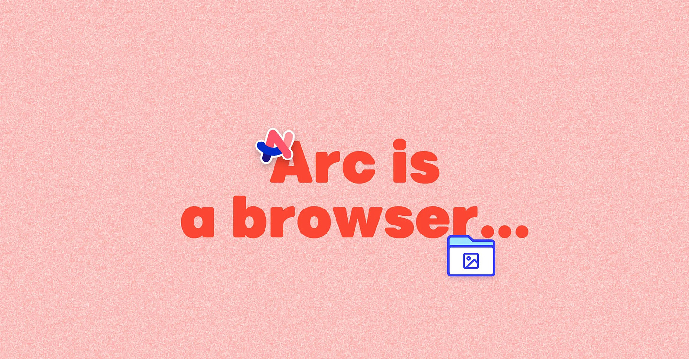
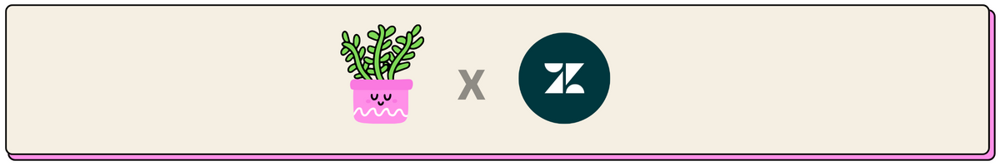
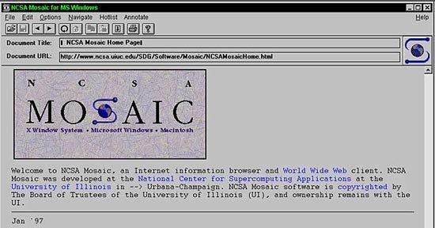
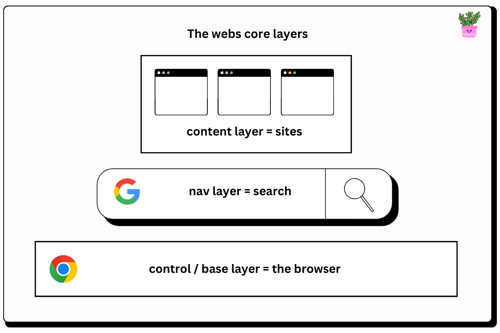
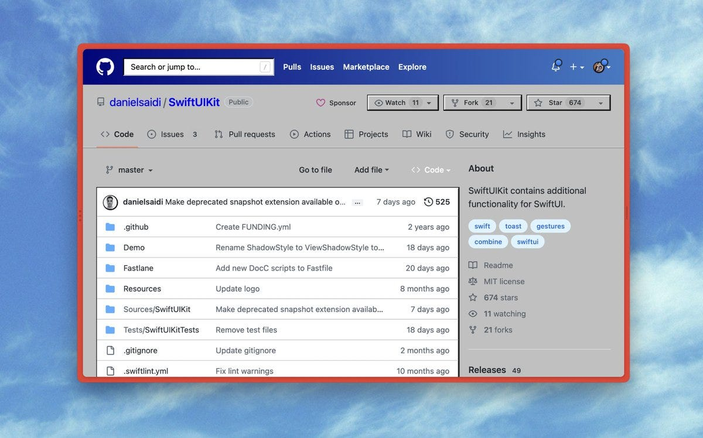

👋 _Welcome to **How They Grow,** my newsletter’s main series.  

👋欢迎来到 "它们是如何成长的"，这是我的时事通讯的主要系列。  

Bringing you in-depth analyses on the growth of world-class companies, including their early strategies, current tactics, and actionable product-building lessons we can learn from them.  

为您带来世界级公司成长的深度分析，包括他们的早期战略、当前战术以及我们可以从中学到的可行的产品建设经验。_

Hi, friends 👋  

嗨，朋友们 👋

Sometimes in the world of tech, what we consider innovative concepts aren’t necessarily all that new.  

在科技世界里，有时我们认为创新的概念并不一定那么新颖。  

Sometimes, “new” is just a unique and different perspective on something so expected and mundane.  

有时，"新 "只是以独特和不同的视角来看待一些意料之中的平凡事物。  

Something boring.  

无聊的东西

And **[The Browser Company of New York](https://thebrowser.company/)**, with their flagship product **[Arc](https://arc.net/)**, is a great example of a company solving a boring problem in a delightful, unexpected, and contrarian way.  

而纽约浏览器公司（The Browser Company of New York）的旗舰产品Arc 就是一个很好的例子，它以一种令人愉悦、出乎意料和逆向思维的方式解决了一个枯燥乏味的问题。

As the name may have given away…  

正如其名称所透露的信息...

A browser, yes. Now you might be thinking, “_But why, nothing is wrong with the browser?_” You’d be right, and you’d be wrong.  

浏览器，没错。现在你可能会想，"但为什么，浏览器没有任何问题？"你是对的，也是错的。  

Arc believe there is a more fundamental opportunity that goes beyond the browser though:Arc 不过，我们相信，除了浏览器之外，还有一个更根本的机会： **that there is a better way to use the internet**. The browser is just the means—the window if you will—to pretty much everything in our lives.  

有一种更好的方式来使用互联网。浏览器只是我们生活中几乎所有事情的手段和窗口。

Since the era of Internet Explorer (🪦), countless companies have attempted to build a new browser experience.  

自 Internet Explorer (🪦)时代以来，无数公司都在尝试打造全新的浏览器体验。  

We’ve seen Chrome, Safari, Firefox, Opera, DuckDuckGo, Brave, and Edge. But, while we’ve seen我们已经看到了 Chrome、Safari、Firefox、Opera、DuckDuckGo、Brave 和 Edge。但是，虽然我们已经看到 _new logos_ for browsers, we haven’t really seen _a new concept of the browser._ Open any of the ones listed above, and you’ll find a pretty standard and expected experience with the same UI and UX you’ve become deeply familiar with.  

虽然浏览器的新标识层出不穷，但我们并没有看到浏览器的新概念。打开上面列出的任何一款浏览器，你都会发现它的用户界面和用户体验与你已经非常熟悉的一样，都是相当标准和令人期待的体验。

You know—horizontal tabs along the top, bookmarks, the address bar.  

比如顶部的横向标签、书签和地址栏。

That’s the design pattern engrained in us.  

这就是我们根深蒂固的设计模式。  

The design pattern nobody has dared challenge, because pushing against the grain of deeply learnt user behavior can be dangerous.  

这种设计模式无人敢于挑战，因为违背用户行为习惯的做法是危险的。

Well, that has all changed with the arrival of Arc—the browser that takes on an entirely new notion for what searching, discovering, and interacting with content on the web should be.  

随着Arc浏览器的问世，这一切都发生了改变--该浏览器以全新的理念诠释了网络内容的搜索、发现和交互。

When/If you go and open up Arc, you’ll be greeted with new design patterns and concepts.  

如果您打开Arc ，您将看到新的设计模式和概念。  

Which, despite truly amazing onboarding, still take some time to get comfortable with.  

尽管入职培训非常出色，但仍需要一些时间来适应。

I’ve been using Arc now for about a week, and personally, despite the imperfections, I absolutely love everything about the product.  

我使用Arc 已经有一个星期了，尽管有一些瑕疵，但我个人还是非常喜欢这款产品。  

And the more that I’ve been discovering all their differentiators and the browsing superpowers, the more I’ve “got” what Arc is really trying to do.我越是发现他们所有的与众不同之处和超级浏览功能，我就越是 "明白 "Arc 的真正意图。 [David Pierce from the Verge puts it into words perfectly:  

来自 Verge 的大卫-皮尔斯（David Pierce）一语道破天机：](https://www.theverge.com/23462235/arc-web-browser-review)

> _The Browser Company’s CEO, Josh Miller, talks a lot about operating systems and browsers.  
> 
> 浏览器公司首席执行官乔希-米勒（Josh Miller）经常谈论操作系统和浏览器。  
> 
> The difference is subtle but important.  
> 
> 两者之间的区别很微妙，但却很重要。  
> 
> Browsers, traditionally, have mostly just tried to show you the web without getting in your way; they provide tabs and a URL bar and maybe a way to add extensions, but not much more.  
> 
> 传统上，浏览器大多只是试图在不妨碍你的情况下为你显示网页；它们提供标签页和 URL 栏，也许还有添加扩展的方法，但除此之外就没有什么了。  
> 
> Operating systems, on the other hand, are deeply involved in how things work.  
> 
> 另一方面，操作系统则与事物的运行方式息息相关。  
> 
> Think of the way Siri and Apple Pay operate across apps on your iPhone or how Google’s Material You changes the look and feel of everything on your phone.  
> 
> 想想 Siri 和 Apple Pay 在 iPhone 应用程序中的操作方式，或者谷歌的 Material You 如何改变手机上所有东西的外观和感觉。  
> 
> Even the share menus or simple drag-and-drop between apps — that’s all operating system stuff.  
> 
> 即使是共享菜单或应用程序之间的简单拖放，也都是操作系统的事情。_
> 
> _Arc wants to be the web’s operating system.  
> 
> Arc 希望成为网络的操作系统。  
> 
> So it built a bunch of tools that make it easier to control apps and content, turned tabs and bookmarks into something more like an app launcher, and built a few platform-wide apps of its own.  
> 
> 因此，它开发了一系列工具，使控制应用程序和内容变得更容易，将标签和书签变成了更像应用程序启动器的东西，并开发了一些自己的全平台应用程序。  
> 
> The app is much more opinionated and much more complicated than your average browser with its row of same-y tabs at the top of the screen.  
> 
> 与屏幕上方一排相同标签的普通浏览器相比，这款应用程序更有主见，也更复杂。_
> 
> _Another way to think about it is that Arc treats the web the way TikTok treats video: not as a fixed thing for you to consume but as a set of endlessly remixable components for you to pull apart, play with, and use to create something of your own.  
> 
> 另一种思考方式是，Arc 像 TikTok 处理视频一样处理网络：它不是一个固定的供你消费的东西，而是一套无穷无尽的可混搭组件，供你拆分、玩弄和使用，以创造属于你自己的东西。  
> 
> Want something to look better or have an idea for what to do with it? Go for it  
> 
> 想让某样东西更好看，或者有了如何处理它的想法？开始吧_.

**This is the big bet they’re making.  

这是他们下的一个大赌注。**

Now, Arc is earlier stage than most companies we look at here (valued at about $100M), but the more I learnt about the company and the execution behind Arc, the more I realized there was a lot worth sharing here about startup building.  

现在，Arc 比我们在这里看到的大多数公司（估值约 1 亿美元）都要早，但我对这家公司以及Arc 背后的执行力了解得越多，就越意识到这里有很多关于初创公司建设的内容值得分享。  

From strategy, to product ethos, to storytelling and brand building.  

从战略到产品精神，再到讲故事和品牌建设。

Which leads me to ask you this quick question before we get cracking…  

在我们开始之前，我想问你一个简单的问题

### What types of companies do you prefer I write about?  

您希望我写哪些类型的公司？

Stick with popular companies I know  

选择我熟悉的热门公司

10%

Do more startup posts (like Arc)  

提供更多创业岗位（如Arc)

36%

I like the mix of both  

我喜欢两者的结合

54%

POLL CLOSED  

投票结束

-   **A story of David** _**avoiding**_ **Goliath**  
    
    大卫躲避歌利亚的故事
    
    -   A brief history of the internet’s original layers  
        
        互联网原始层简史
        
    -   Transforming the internet, and merging the layers together to build a new category  
        
        改造互联网，层层合并，打造新品类
        
-   **Keeping tabs on growth  
    
    掌握增长情况**
    
    -   Arc’s Go-To-Market strategy  
        
        Arc走向市场战略
        
    -   Horses and Cars: _Not what users know they want_  
        
        马和汽车：用户并不知道他们想要什么
        
    -   Their product ethos: _Exploring with a machete_  
        
        他们的产品精神：用大砍刀进行探索
        
    -   Branding, product-marketing, and storytelling  
        
        品牌塑造、产品营销和故事讲述
        

_Here are just some of the many takeaways in today’s deep dive:  

以下是今天深入探讨的一些收获：_

-   **Category creation often boils down to counter positioning yourself, and making yourself, un-copyable to the incumbents.** Pick an idea in a boring and untouched space, and then say _fuck that_ to the norms, challenge them, and do it radically differently for an unbundled niche audience.  
    
    创造类别通常可以归结为反定位，让自己成为现任者无法复制的对象。在一个枯燥乏味、无人问津的领域选取一个创意，然后对规范说 "去他妈的"，挑战它们，以完全不同的方式为未被捆绑的利基受众服务。
    
-   **Find your nuclear go-to-market audience by picking a very specific community and tailoring your product for them.** Like, even as specific as focusing on a single /subreddit.  
    
    选择一个非常具体的社区，为他们量身定制你的产品，从而找到你的核心市场受众。比如，甚至可以具体到只关注一个/subreddit。  
    
    Communities beat personas because the individuals in them are connected.  
    
    社群胜过 "角色"，因为社群中的个体是相互联系的。  
    
    Once you break in, you can snowball your way through fast.  
    
    一旦闯入，你就能以滚雪球的方式快速通过。
    
-   **In a very unconventional product manager way, consider putting your audience** _**last**_**.** This is borrowed from contrarian writing wisdom, but as you read this post, you’ll see how it translates to Arc’s approach to building.  
    
    以一种非常规的产品经理方式，考虑将受众放在最后。这句话借用了逆向写作的智慧，但当你阅读这篇文章时，你会发现它是如何转化为Arc的构建方法的。  
    
    If you are building for an ICP like yourself, Arc shows us that sometimes you need to如果您和自己一样正在为 ICP 建站，Arc 告诉我们，有时您需要 _build what’s true to you first and foremost_. As with art, that creates soul and craftsmanship that people see and come to love.  
    
    首先要打造真正属于自己的东西。就像艺术一样，这样才能创造出灵魂和工艺，让人们看到并爱上它。
    
-   **The numbers and metrics—while important for holding yourself accountable—often lead to optimizing for the wrong things**. To build _human_ software, you need to look beyond the screen and the data, and optimize for feelings.  
    
    数字和度量标准虽然对自我问责很重要，但往往会导致错误的优化。要构建人性化的软件，就必须跳出屏幕和数据，针对感受进行优化。  
    
    This is the balance between data and product sense.  
    
    这就是数据和产品感之间的平衡。
    
-   **Put more surprises and magic moments into your product.** Often this means doing delightful things that have no function, but elevate your form.  
    
    在产品中加入更多惊喜和神奇时刻。这往往意味着要做一些令人愉悦的事情，这些事情没有任何功能，却能提升你的产品形态。
    
-   **Assume you don’t know anything, and approach building like whacking through a juggle with a machete**.  
    
    假设你什么都不知道，就像用大砍刀劈开杂耍一样对待建筑。  
    
    Despite heaps of experience on Arc’s team, they assume they know nothing and use rapid/messy prototypes and assumption testing as their machete to find their way.  
    
    尽管Arc团队拥有丰富的经验，但他们认为自己一无所知，并使用快速/混乱原型和假设检验作为他们的弯刀来找到自己的方向。
    
-   **Ask “What if…"?” more.** Push your team’s quality standards, and push your innovation, by asking the simple question that can squeeze out more.  
    
    多问 "如果......会怎样？通过这个简单的问题，可以挤出更多的时间，从而提高团队的质量标准，推动创新。
    
-   **Communicate like influencers, not corporations.** Nobody cares about more bland B2B/enterprise content.  
    
    像有影响力的人，而不是企业那样沟通。没有人会在意更多平淡无奇的 B2B/企业内容。  
    
    Don’t forget people who make decisions at those companies are still people, and we all resonate more with real talk vs bland company content.  
    
    别忘了，在这些公司做决策的人也是人，我们都会对真实的谈话与平淡的公司内容产生更多共鸣。  
    
    Simply, tell better stories.  
    
    简单地说，就是讲更好的故事。  
    

_…many more inside.  

......里面还有更多。_

One thing that stood out to me about Arc, which we’ll get more into shortly, is not just how good and responsive their level of support is, but how they think about “support” so much more holistically.  

Arc 有一件事让我印象深刻，我们稍后会详细介绍，那就是他们的支持水平不仅有多好，响应速度有多快，而且他们对 "支持 "的考虑更加全面。  

For Arc,供Arc 、 **it’s all about building long-term customer relationships.  

这一切都与建立长期的客户关系有关。**

They do provide **excellent support** of course, but they also use the team to **build relationships, engage with the community, gather feedback**, and as Josh says, eventually **sell**.  

当然，他们确实提供了很好的支持，但他们也利用团队建立关系，与社区互动，收集反馈，正如乔希所说，最终实现销售。

I literally only saw this yesterday when chatting with the Arc team about an idea, but **Arc use [Zendesk](https://www.zendesk.com/lp/startup-partner/?ref=gen&partner_account=001PC000006eqyxYAA) to power their entire membership team**—and Zendesk just so happen to be our select sponsor this week.  

我是昨天在与Arc 团队讨论一个想法时才看到这个消息的，但Arc 使用 Zendesk 为他们的整个会员团队提供支持，而 Zendesk 恰好是我们本周的精选赞助商。

**For our startup founders specifically**, I’ve partnered with **[Zendesk](https://www.zendesk.com/lp/startup-partner/?ref=gen&partner_account=001PC000006eqyxYAA)** for 4 reasons:  

具体到我们的初创企业创始人，我与 Zendesk 合作有四个原因：

1.  I used Zendesk everyday when I ran my own startup. _We got setup before we had a single user._  
    
    在我经营自己的初创公司时，我每天都在使用 Zendesk。我们在有一个用户之前就已经安装好了。
    
2.  My team use Zendesk and I’m often in there combing for insights.  
    
    我的团队使用 Zendesk，我也经常在其中寻找见解。
    
3.  Zendesk are the best-in-class CRM to support customers and build relationships  
    
    Zendesk 是一流的 CRM，可为客户提供支持并建立关系
    
4.  **They are offering HTG readers, who are at early stage startups, their full stack for free for 6 months. ( [Click here to get going](https://www.zendesk.com/lp/startup-partner/?ref=gen&partner_account=001PC000006eqyxYAA) )  
    
    他们将为 HTG 读者提供为期 6 个月的免费全栈服务。(点击此处开始）**
    

I’m super proud to work with such a great product, and truly, **there really is no better time to start building a great membership experience**. That can **[start with Zendesk right now.](https://www.zendesk.com/lp/startup-partner/?ref=gen&partner_account=001PC000006eqyxYAA)**  

能与这样一款伟大的产品合作，我感到非常自豪。说真的，没有比这更好的时机来开始打造出色的会员体验了。现在就可以从 Zendesk 开始。

To get your free 6 months, just hit the button below.  

要获得 6 个月的免费试用期，只需点击下面的按钮。

[Join the startup program for free  

免费加入创业计划](https://www.zendesk.com/lp/startup-partner/?ref=gen&partner_account=001PC000006eqyxYAA)

_Bought to you by our select sponsor, **[Zendesk](https://www.zendesk.com/lp/startup-partner/?ref=gen&partner_account=001PC000006eqyxYAA)**. Want to partner? **[Learn more here.](https://home.howtheygrow.co/sponsor)**  

由我们的精选赞助商 Zendesk 为您提供。想成为合作伙伴？点击此处了解更多。_

While Arc is building a browser, they are not trying to win the browser market.  

虽然Arc 正在开发一款浏览器，但他们并不是要赢得浏览器市场。

They have realistic ambitions, and know very well that Google Chrome is going nowhere.  

他们有着现实的雄心壮志，也深知谷歌 Chrome 浏览器将一事无成。  

That is a Goliath who will take那是一个巨人，他将 _many_ rocks without budging.  

许多岩石纹丝不动。

Arc is rather taking the road less travelled.  

Arc 而是在走一条少有人走的路。  

Instead of needing to be precise with a slingshot to knock the category leaders down, Arc is walking around the market and creating a new category for themselves—  

Arc 不需要精准地用弹弓将品类领导者击倒，而是在市场上游刃有余地为自己创造一个新的品类--这就是 "新品类"。**a category using a counter positioning strategy that Google, with their ~3.3 billion daily active users, will** _**never**_ **copy.**  

在这一类别中，谷歌采用了一种反定位策略，而拥有约 33 亿日活跃用户的谷歌永远不会模仿这种策略。

**Google cannot risk doing what Arc is doing. Nor should they.** That would be an awful decision, both because it messes with the money (more on this soon), and because the vast majority of Google users would hate it. _Don’t go move Aunty Marge’s cheese—she likes her tabs, favorites, and buttons just the way they are, thank you very much!_  

谷歌不能冒险去做Arc 正在做的事情。他们也不应该这样做。这将是一个可怕的决定，因为它不仅会扰乱资金（很快会有更多相关内容），而且绝大多数谷歌用户都会讨厌它。不要动玛吉阿姨的奶酪--她喜欢她的标签、收藏夹和按钮保持原样，非常感谢！

**Chrome works very well**. **It’s a passive browser that gets out of your way**.  

Chrome 浏览器运行良好。它是一个被动的浏览器，不会妨碍你的工作。  

Almost all of those 3.3B people like that and don’t even think for a second about Chrome as a product they use.  

在这 33 亿人中，几乎所有人都喜欢 Chrome 浏览器，他们根本不会把 Chrome 浏览器当作自己使用的产品。  

That makes Chrome an excellent product.  

这使得 Chrome 浏览器成为一款出色的产品。

In a sense, **Arc is unbundling a very small subset of Chrome users**.  

从某种意义上说，Arc 正在为 Chrome 浏览器的一小部分用户松绑。  

A group of people who spend all day on their computers and see the pain points within the current paradigm of browsing (although may not be able to pin point what the pain necessarily is).  

这群人整天对着电脑，能看到当前浏览模式中的痛点（尽管他们可能无法明确指出痛点是什么）。  

A group of folks who want a premium browser when they see it, and that’s what Arc is.  

一群人看到优质浏览器就想拥有，这就是Arc 。  

It’s a product that is more active in your web experience, and you definitely know you’re using Arc when you’re using Arc.  

这是一款在您的网络体验中更加活跃的产品，当您使用Arc 时，您肯定会知道自己正在使用Arc 。

**What Arc is doing for browsing the internet, Superhuman is doing for email.  

Arc 在浏览互联网方面的作用，就是超人在电子邮件方面的作用。**

But we’re getting a little ahead of ourselves here…how did David come across Goliath in the first place?  

不过，我们说得有点远了......大卫当初是怎么遇到歌利亚的呢？

Our story starts in 1993, with Mosaic.  

我们的故事始于 1993 年的马赛克。

Quite simply, Mosaic set in motion the popularization of the internet.  

很简单，Mosaic 启动了互联网的普及。  

It was the very first visual portal people had into the web.  

它是人们进入网络的第一个可视化门户。

I say portal, because that’s what Mosaic defined the browser to be—the means to interacting with graphic websites.  

我说门户网站，是因为这就是 Mosaic 对浏览器的定义--与图形网站交互的手段。  

Mosaic unlocked马赛克解锁 **the content layer** of the internet. In other words, everything.  

互联网的内容层。换句话说，就是一切。  

And with the portal open, more and more websites were made for us to reach through and use.  

随着门户网站的开放，越来越多的网站可供我们访问和使用。

To squish history, Netscape and Microsoft then came along, and off the back of Mosaics’ shoulders, stole the market.  

为了粉碎历史，网景公司和微软公司后来居上，从 Mosaics 的肩膀上抢走了市场。

As the Web gained steam, Netscape Navigator (by Marc Andreessen) became the most popular browser (80% of the market in 1996).  

随着网络的发展，网景浏览器（Netscape Navigator，由马克-安德森（Marc Andreessen）设计）成为最流行的浏览器（1996 年占 80% 的市场份额）。  

But seeing the importance owning但是，看到拥有 **the control/base layer** of the rapidly rising interent, Microsoft were fervently working on Internet Explorer 1.0. Before IE, Windows' stock browser was literally an icon labeled "The Internet."  

作为迅速崛起的互联网的控制层/基础层，微软公司正在全力开发 Internet Explorer 1.0。在 IE 之前，Windows 的浏览器只是一个标有 "互联网 "的图标。

By 1998, thanks to clever distribution tactics with Windows machines and leveraging the mighty **power of defaults**, Internet Explorer stole the crown with over 65% of the market.  

到 1998 年，IE 浏览器凭借在 Windows 机器上巧妙的分销策略和默认设置的强大威力，夺得了 65% 以上的市场份额。

The 90s were where Microsoft won the first battle of the browser.  

上世纪 90 年代，微软赢得了浏览器的第一场战役。  

And only in 2003, where Internet Explorer was at its unchallenged zenith (95% of the market), did Firefox and Safari enter the ring.  

到了 2003 年，IE 浏览器的市场占有率达到了 95%，处于无可争议的顶峰，Firefox 和 Safari 才加入了竞争行列。

The lack of competition allowed Firefox to quickly rise into second place with only around 5%, with Safari having the smallest at just 1%.  

由于缺乏竞争，火狐浏览器迅速跃居第二，仅占 5%左右，Safari 浏览器最小，仅占 1%。  

Despite IE’s dominance, the browser battle was starting to become a war.  

尽管 IE 独占鳌头，但浏览器之争已开始演变成一场战争。

The early 2000s saw Safari and Firefox chipping away at IE.  

本世纪初，Safari 和 Firefox 开始逐步取代 IE。  

But at the same time, Google was building a powerful search business. And their Search product was但与此同时，谷歌正在建立强大的搜索业务。他们的搜索产品 **the navigation layer** of the internet.  

互联网的导航层。

Of course, to use Google Search, you’d still be operating on the control layer—the browser.  

当然，要使用谷歌搜索，你还是要在控制层--浏览器上操作。  

A layer Google had no stake it…yet.  

一层谷歌还没有股份......。

On October 23rd 2000, Google made their first advertising dollar.  

2000 年 10 月 23 日，Google 赚到了第一笔广告费。

Very quickly, Google started printing money. Search x Ad Words became their cash cow.  

很快，谷歌开始印钞。搜索 x 广告词成了他们的摇钱树。

And what do you do when you have a cash cow?  

当你有了摇钱树，你会怎么做？  

Well, you think of ways to make it even fatter, of course!  

当然，你会想办法让它变得更胖！

A good place to start brainstorming how is to ask, _what is the cow eating to get so big?_ In the case of Ad Words, the answer is data. User data. Your data. Your search patterns.  

头脑风暴的一个好的开始就是问：这头牛吃什么长得这么大？就 Ad Words 而言，答案就是数据。用户数据。您的数据。您的搜索模式。

So, when you start working the whiteboard to figure out how to feed more data inputs into the cow, you fairly quickly land on the obvious answer—just get more of it by capturing data _beyond_ search.  

因此，当你开始在白板上思考如何将更多的数据输入到奶牛体内时，你很快就会找到一个显而易见的答案--那就是通过捕捉搜索以外的数据来获取更多的数据。

How? By owning the layer that can track you wherever you go. Whatever you linger on.  

怎么做？拥有这一层，无论你走到哪里，都能追踪到你。无论你在哪里逗留。  

Whatever you hover over, and whatever you click.  

无论您将鼠标悬停在什么位置，还是点击什么。

So, in September 2004, rumors of Google building a web browser first appeared.  

因此，2004 年 9 月，关于谷歌将推出网络浏览器的传言首次出现。

The rest, as they say, is history.  

正如人们常说的那样，剩下的就是历史了。

Today, there is no browser war.  

今天，没有浏览器战争。  

Google controls the battlefield, and the only way the other browsers make money is by charging the king to have Google Search as the default search engine in the url.  

谷歌控制着战场，其他浏览器赚钱的唯一途径就是向谷歌收取费用，让谷歌搜索成为网址中的默认搜索引擎。

In other words…  

换句话说

-   Google got into the browser business because of **search** (their business model revolves around spying on us)  
    
    谷歌因搜索而涉足浏览器业务（他们的商业模式围绕着监视我们展开）
    
-   The other browsers keep the lights on because of **search** (e.g Google pay Apple ~$18 billion a year to have Google Search the default in Safari…eyes everywhere)  
    
    其他浏览器也因为有了搜索功能而不熄灯（例如，谷歌每年向苹果支付约 180 亿美元，让 Safari 默认使用谷歌搜索......到处都是谷歌的眼睛）
    

It all revolves around the classic notion of **search, and the ad dollars behind it.**  

这一切都围绕着经典的搜索概念以及背后的广告费用。

All together, it looks like this…  

总的来说，它看起来像这样...

-   **Control/Base layer** = the browser to contain the web  
    
    控制层/基础层 = 包含网页的浏览器
    
-   **Navigation layer** = to search the web  
    
    导航层 = 搜索网络
    
-   **Content layer** = websites / web apps that make the web, well, the web!  
    
    内容层 = 使网络成为网络的网站/网络应用程序！
    

And this worked/works well. Very. Very. Well.  

而且效果很好。非常。非常好非常好

Everything we do moved to the internet and nothing was really questioned.  

我们所做的一切都转移到了互联网上，没有任何事情真正受到质疑。

LLMs (large language models) are underpinned by the invention of the breakthrough **transformer**.  

LLMs (大型语言模型）的基础是突破性变压器的发明。

And LLMs are what make AI as we know it today. Simply, they have changed the game.  

而LLMs 正是我们今天所熟知的人工智能的雏形。简而言之，它们改变了游戏规则。  

They are changing websites, and they are changing search.  

它们在改变网站，也在改变搜索。  

But, until now, they haven’t touched the control layer.  

但直到现在，他们还没有触及控制层。

It’s now what Josh Miller (founder/CEO) and the Arc team sees as a huge opportunity for the browser—their browser.  

乔希-米勒（Josh Miller，创始人兼首席执行官）和Arc 团队认为这是浏览器--他们的浏览器--的巨大机遇。

> _They afford us the opportunity start over.  
> 
> 它们为我们提供了重新开始的机会。  
> 
> To take a web browser, web pages, and a search engine and blur them together into a brand new category of software.将网络浏览器、网页和搜索引擎融合在一起，形成一个全新的软件类别。 **A new type of browser that browsers for you.  
> 
> 一种新型浏览器，为您提供浏览器。**_

We’ll get more into this, but I just want to be clear now, Arc is not some generative AI tool.  

我们会进一步讨论这个问题，但我现在只想说清楚，Arc 并不是什么生成式人工智能工具。  

They do use AI for quality of life features, but not right now as the core.  

他们确实使用人工智能来提高生活质量，但现在还不是核心。  

And I don’t want you to think that that statement above means you can’t search for things the way you always have on Arc.  

我不希望你认为上述说法意味着你不能像以前那样在Arc 上搜索东西。  

You absolutely can.  

绝对可以。

But, I’ve definitely seen what they mean by merging all of those layers together.  

不过，我肯定已经明白了他们把所有这些层次合并在一起的意思。  

If you use Arc in it’s entirety, the browser feels like a companion across/through/within each of the traditional parts of the internet.  

如果您完整地使用Arc ，浏览器就会像一个伴侣，横跨/穿过/融入互联网的每一个传统部分。

It’s very cool. And I think this is a fun moment in browser history.  

这很酷。我认为这是浏览器历史上一个有趣的时刻。  

After more than a decade of total Chrome dominance, folks are looking elsewhere for more features, more privacy, and better UI.经过十多年 Chrome 浏览器的统治，人们开始寻求更多功能、更多隐私和更好的用户界面。 [Vivaldi](https://vivaldi.com/) has [some really clever features](https://www.theverge.com/2022/6/9/23159860/vivaldi-browser-free-built-in-email-client-vivaldi-calendar-vivaldi-feed-reader-integrated); [SigmaOS](https://sigmaos.com/) is also betting on browsers as operating systems and is most similar to Arc; [Brave](https://brave.com/) has smart ideas about privacy; even [Edge](https://click.linksynergy.com/deeplink?id=nOD/rLJHOac&mid=24542&murl=https://www.microsoft.com/en-us/edge?form=MA13FJ&u1=[]vg[p]23226276[t]w[r]https://bootcamp.uxdesign.cc/elevate-your-browser-) and [Firefox](https://www.mozilla.org/en-US/firefox/new/?redirect_source=firefox-com) are getting better fast.  

Vivaldi 有一些非常聪明的功能；SigmaOS 也将浏览器作为操作系统，与Arc 最为相似；Brave 在隐私保护方面有聪明的想法；甚至 Edge 和 Firefox 也在快速进步。

**But, Arc is the biggest swing of them all: an attempt to not just improve the browser but reinvent it entirely.  

但是，Arc 是其中最大的变革：它不仅试图改进浏览器，还试图完全重塑浏览器。**

This is category creation 101—which we won’t get into the mechanics of today.  

这就是类别创建 101--我们今天不讨论其中的机制。  

But to go deeper on this topic, check out some of the posts by  

不过，要想更深入地了解这个话题，可以看看以下作者的文章

. They are all excellent.  

类别 海盗 🏴☠️ 。它们都非常出色。

In a piece about a browser company, I’d be remise to not use the word “tab” somehow today.  

在一篇关于浏览器公司的文章中，如果我今天不使用 "标签 "这个词，那就太不应该了。  

I feel like it makes sense for this section, so let’s look at some important growth tabs in Arc’s journey.  

我觉得这对本节很有意义，让我们来看看Arc旅程中一些重要的成长标签。

First…  

首先...

If Arc tried to appeal to the masses, they’d appeal to nobody.  

如果Arc 试图迎合大众的口味，那么他们谁也不会喜欢。  

And I don’t just mean that from the classic go-to-market approach of niching down and then expanding later.  

我指的不仅仅是那种先细分市场，然后再扩大市场的经典市场推广方法。  

No, Arc’s market will always in my view my mostly niche.  

不，在我看来，Arc的市场永远是我的利基市场。

Arc is for the tech enthusiasts. For the people who enjoy customization and modularity.  

Arc 是为技术爱好者准备的。适合喜欢定制和模块化的人。  

It’s for the folks who love tools like Notion and Miro for their Lego-like nature and aesthetic.  

它适合那些喜欢 Notion 和 Miro 等工具的人，因为它们具有类似乐高的性质和美感。  

It’s for people who geek out on organizing things, and those that get excited to play around with new, beautifully crafted, software.  

它是为那些热衷于整理东西的人，以及那些对玩弄制作精美的新软件感到兴奋的人准备的。

For those people, and just those people, Arc wants to replace Chrome.  

对于这些人，也仅仅是这些人，Arc 希望取代 Chrome 浏览器。  

And by being very intentional about who Arc is and is not for, they’ve built a cult-like fan base who plaster stickers on their computers, tout Arc hats, and enthusiastically tell people they don’t use Chrome anymore.通过有意识地明确Arc 的适用人群和不适用人群，他们建立了一个类似于邪教的粉丝群，在电脑上贴上贴纸，兜售Arc 帽子，并热情地告诉别人他们不再使用 Chrome 浏览器了。 **That’s the power of making something for a very specific type of person.  

这就是为特定类型的人制作产品的力量。**

As Josh Miller [told my friend Jacob Jolibois in an interview:](https://www.theglimpse.co/p/the-future-of-arc-with-josh-miller)  

乔希-米勒（Josh Miller）在一次采访中告诉我的朋友雅各布-乔利博伊斯（Jacob Jolibois）：

> Our goal is not to make Arc the best browser for every person.  
> 
> 我们的目标不是让Arc 成为每个人的最佳浏览器。
> 
> And actually one of the things that motivates us is that the internet is so central in our lives across all parts of our life.  
> 
> 实际上，促使我们这样做的原因之一是，互联网在我们生活的方方面面都占据着重要位置。  
> 
> And all of the people that use the internet are so different from each other.  
> 
> 所有使用互联网的人都是如此不同。
> 
> There's so much diversity in people, the needs and moments of the day.  
> 
> 人们的需求和一天中的时刻千差万别。
> 
> > #### _**The thing that is most flawed about the web browser market in our opinion is that there's a lack of choice.  
> > 
> > 在我们看来，网络浏览器市场最大的缺陷就是缺乏选择。**_
> 
> They're essentially a handful of web browsers.  
> 
> 它们基本上都是一些网络浏览器。
> 
> -   They all effectively look exactly the same.  
>     
>     它们实际上都长得一模一样。
>     
> -   They all effectively do exactly the same things.  
>     
>     它们实际上都做着完全相同的事情。
>     
> -   And they all effectively have the exact same philosophy about how we should use the internet.  
>     
>     在如何使用互联网的问题上，他们的理念完全相同。
>     
> 
> If you were to apply that to anything else we spent hours and hours a day in as a human, you'd be like, are you, are you kidding me?  
> 
> 如果你把它应用到我们人类每天花费数小时的其他事情上，你会觉得，你，你在开玩笑吗？  
> 
> Imagine if we all lived in homes that effectively were an identical layout, identical appearance, maybe change the little things on the wall, you know, it's dystopian.  
> 
> 试想一下，如果我们都住在布局、外观完全一样的房子里，也许只是换换墙上的小东西，你知道，这简直就是乌托邦。
> 
> > #### _**The motivation for The Browser Company and Arc is not that everyone in the world will use Arc, it's that there's gotta be another way.  
> > 
> > 浏览器公司（The Browser Company）和Arc 的动机并不是希望世界上的每个人都使用Arc ，而是一定会有另一种方法。**_
> 
> We are gonna try to build a way that feels right to us and we think a lot of people relate to that, but it's not for everyone.  
> 
> 我们会尝试建立一种让自己感觉正确的方式，我们认为很多人都会有同感，但这并不适合所有人。  
> 
> So I just wanna say that at the top, our goal is not to convince every single person that Arc is great for them.  
> 
> 因此，我只想说，我们的目标不是让每个人都相信Arc 对他们有好处。

I love that point about bringing optionality to a bland space.  

我喜欢为平淡的空间带来可选择性这一点。  

And that really is Arc’s big hook to appeal to this group of folks.  

这确实是Arc吸引这群人的一大亮点。  

It’s just so different from everything else.  

它与其他一切都如此不同。

And when you have something so different, the first task is figuring out which little community you can win over.  

当你拥有如此与众不同的东西时，首要任务就是找出你能赢得哪个小团体的青睐。  

In Arc’s case, the group most likely to try out a new browser that nobody had heard of was the tech nerds.  

在Arc的案例中，最有可能尝试从未听说过的新浏览器的群体是技术呆子。

So, they adapted their product accordingly for them by adding powerful integrations to the tools they already used, like Notion, GitHub, Linear, and Figma.  

因此，他们对自己的产品进行了相应的调整，为他们已经使用的工具（如 Notion、GitHub、Linear 和 Figma）添加了强大的集成功能。  

That’s something no other browser does. But, it did something important for the first users—  

这是其他浏览器无法做到的。但是，它为第一批用户做了一件重要的事情--**it made them feel like the product was for** _**them**_**.** And in doing so, they gave them a good reason to take a flyer on an unknown and unproven product.  

这让他们觉得产品是为他们准备的。这样一来，他们就有了一个很好的理由去购买一个未知的、未经证实的产品。

A quick aside…  

顺便说一下...

Being big in the tech scene, I believe Arc reached this initial audience by tapping into Josh and Hursh Agrawal’s own personal networks.  

作为科技界的大佬，我相信Arc 是通过利用 Josh 和 Hursh Agrawal 自己的人际关系网络来吸引最初的受众的。

But as I was writing the above about targeting a community, one thing I wanted to pull out here as a tactical lesson is this: **when you’re figuring out the audience for your product and how to reach them, one approach is to identify in great detail a specific community.**  

不过，在我写上述关于定位社区的文章时，有一点我想在这里作为一个战术教训提出来：当你在为你的产品确定受众以及如何接触到他们时，一种方法是非常详细地确定一个特定的社区。

Why? Because unlike personas, for example, who have similarities but likely no connections, **people within communities are by definition very connected.**  

为什么呢？因为 "角色 "与 "人物 "不同，"角色 "与 "人物 "有相似之处，但可能没有联系，而 "社区 "中的人顾名思义联系紧密。

They know and follow the same opinion leaders. They value similar things.  

他们认识并追随同样的意见领袖。他们的价值观相似。  

They have norms and talk in certain ways, and they enjoy talking about specific interests in great depth that others think are crazy.  

他们有自己的规范和说话方式，他们喜欢深入探讨特定的兴趣爱好，而别人却认为他们疯了。  

Communities have a shared and local meme culture, and they, again by definition, aggregate and hang out in the same places.  

社区拥有共同的本地meme文化，而且根据定义，它们聚集在同一个地方。

While you can get people from a persona signing up for your product, you can’t “break into” a persona.  

虽然你可以让某个角色中的人注册你的产品，但你无法 "打入 "某个角色。

But, when you break into a community and win some trust, you can very easily snowball your way through that community.  

但是，当你打入一个社区并赢得一些信任时，你就可以非常容易地在这个社区里滚雪球。  

AKA—  

AKA-**communities have a ton of leverage.  

社区有很大的影响力。**

For example, say you’re building an investing and savings product.  

例如，您正在开发一款投资和储蓄产品。  

Instead of saying “we want to reach young people who care about saving money in America” say, “we want to break into the与其说 "我们希望接触那些关心美国储蓄问题的年轻人"，不如说 "我们希望打入 **[r/SavingMoney](https://www.reddit.com/r/SavingMoney/)** [forum](https://www.reddit.com/r/SavingMoney/) with 27K members".  

拥有 27K 名成员的 r/SavingMoney 论坛"。

Now you can go study that community in detail.  

现在，你可以去详细研究那个社区了。  

Identify who posts a lot, summarize key themes they talk about, and importantly, make a note of their language and norms.  

找出经常发帖的人，总结他们谈论的关键主题，更重要的是，记下他们的语言和规范。

Then, use all of that in your product marketing, and start by winning over that community by making the product seem hyper-specific _for them_.  

然后，在产品营销中利用这一切，首先通过使产品看起来对他们非常有针对性来赢得社区。

⚠️ **This post is about to get cropped in your email. To keep reading, [click here.](https://www.howtheygrow.co/p/how-arc-grows)** ⚠️  

⚠️ 这篇文章即将在您的电子邮件中被裁剪。要继续阅读，请单击此处。⚠️

[Keep reading  

继续阅读](https://www.howtheygrow.co/p/how-arc-grows)

Back to the Arc specifics.  

回到Arc 的具体内容。

Arc was in a private beta for quite a while.  

Arc 在相当长一段时间内都处于私人测试阶段。  

To download it, you had to join a waitlist, where only a portion of folks who put their emails down were granted access to the app.  

要下载它，你必须加入一个等待名单，只有一部分写下电子邮件的人才能获得该应用的访问权限。

And for each person who joined in roughly the first year—**each person was given a 1:1 onboarding walkthrough over Zoom with someone on their membership team.**  

大约在第一年，每个加入者都能通过 Zoom 与会员团队的人员进行 1 对 1 的入职培训。

**This was important for three reasons:  

这一点很重要，原因有三：**

1.  It allowed the Arc team to build direct relationships with their new members  
    
    这使Arc 团队得以与新成员建立直接关系
    
2.  It allowed the Arc team to give a hands-on demo, ensuring the new members got familiarized with the product enough to start playing around  
    
    这使得Arc 团队能够进行实际操作演示，确保新成员熟悉产品，并能够开始实际操作
    
3.  It allowed Arc to pressure test their product, which for a browser, is essential.  
    
    Arc 可以对其产品进行压力测试，这对浏览器来说至关重要。  
    
    People have zero tolerance for slowness, poor security, or unreliability of the browser since it powers their entire web experience.  
    
    人们对浏览器速度慢、安全性差或不可靠的容忍度为零，因为浏览器是他们整个网络体验的基础。  
    
    Certain elements had to be perfect for release, otherwise they risked a buggy and cumbersome experience.  
    
    某些元素必须完美无缺才能发布，否则就有可能带来错误和繁琐的体验。
    

Superhuman did the same thing initially, and for software that works so differently to status quo stuff like Gmail and Chrome, **showing people around is key to driving early “getting it” and retention.**  

超人公司最初也是这样做的，对于那些与 Gmail 和 Chrome 浏览器等现状截然不同的软件来说，带人们参观是推动早期 "了解 "和留住用户的关键。

While Arc had to roll out slowly, onboarding also played crucially into Arc’s early growth strategy, which was leaning into the scarcity/FOMO effect by (1) using waitlists, and (2) giving members invitation codes to share with others.  

虽然Arc 必须缓慢推出，但入会也对Arc的早期发展战略起到了至关重要的作用，该战略通过（1）使用候补名单和（2）向会员提供邀请码与他人分享，充分利用了稀缺性/FOMO 效应。

Because people had gone through private onboarding, they both had met someone from the Arc team (thus **humanizing the product)**, and had a higher likelihood of experiencing the _aha_ moment thanks to actually being shown around and having their questions answered.  

由于人们通过了私人入职培训，他们既见到了Arc 团队的成员（从而使产品人性化），又由于有人带他们参观并回答他们的问题，他们更有可能体验到 "顿悟 "时刻。  

This meant those folks who were allowed in where far more likely to share those invite codes out and bring in friends from their communities.  

这意味着那些获准进入的人更有可能把邀请码分享出去，并把他们社区的朋友带进来。

By the time Arc launched publicly in May 2022, they had a nuclear audience eagerly waiting to give the product a try.  

当Arc 于 2022 年 5 月公开发布时，他们已经拥有了一批跃跃欲试的核心受众。  

And **they made the announcement of Arc 1.0 with this emotive video designed to appeal perfectly to the audience of tech nerds, who have an appreciation for experimentation and risks.  

他们在宣布Arc 1.0 时，播放了一段富有情感的视频，这段视频旨在完美地吸引那些喜欢尝试和冒险的技术书呆子受众。**

Who—from this community—wouldn’t want to try a product that positions itself either as **the beginning of everything, or the end of nothing?** Clever.  

在这个社区里，谁不想尝试一下这种将自己定位为万物之始或万物之终的产品呢？真聪明

<iframe src="https://www.youtube-nocookie.com/embed/n5Vwrj1gEWs?rel=0&amp;autoplay=0&amp;showinfo=0&amp;enablejsapi=0" frameborder="0" loading="lazy" gesture="media" allow="autoplay; fullscreen" allowautoplay="true" allowfullscreen="true" width="728" height="409"></iframe>

Arc is currently free. And as the saying goes—if you don’t pay for the product, _you’re_ the product.  

Arc 目前是免费的。俗话说得好--如果你不为产品付费，你就是产品。

That is particularly true in the browser space given all the spying for advertising purposes.  

考虑到出于广告目的的间谍活动，浏览器领域的情况尤其如此。  

But, Arc doesn’t track you. The experience, by default, is completely private.  

但是，Arc 不会跟踪你。默认情况下，这种体验是完全私密的。  

A big part of what they’re trying to do is get rid of ads as much as possible while you work on the on internet.  

他们要做的很大一部分工作就是在你上网工作时尽可能摆脱广告。

But Arc isn’t here for charity—they’re in the business if making money.  

但Arc 并不是来做慈善的，他们是来赚钱的。  

Or as Josh says, “a lot of money”.  

或者如乔希所说，"一大笔钱"。

So that begs the question—which many people have taken to social media and Reddit—how will Arc start generating revenue?  

这就引出了一个问题--许多人都在社交媒体和 Reddit 上提出了这个问题--Arc 将如何开始创收？

A few possibilities:  

有几种可能性：

1.  They do what Superhuman does, and charge a flat fee to use a premium browser.  
    
    他们的做法与 Superhuman 相同，对使用高级浏览器收取统一费用。
    
2.  They do what all other browsers do, and charge Google to be the default search engine.  
    
    它们与所有其他浏览器一样，收取 Google 作为默认搜索引擎的费用。
    
3.  They go freemium, where core parts of Arc remain free, but power users upgrade for extended features.  
    
    他们采用免费模式，即Arc 的核心部分仍然免费，但高级用户可以升级获得扩展功能。
    
4.  **They focus on teams and standard PLG, in that way, following in the steps of Notion and Figma where they try to monetize the B2B side eventually.  
    
    通过这种方式，他们将重点放在团队和标准 PLG 上，并效仿 Notion 和 Figma 的做法，尝试最终实现 B2B 方面的货币化。**
    

I don’t see #2 being possible given (1) Arc’s approach to privacy and anti-tracking stance, and (2) how Arc is trying to build an experience that bypasses the Google Search page entirely.  

考虑到（1）Arc的隐私保护和反跟踪立场，以及（2）Arc 试图打造一种完全绕过谷歌搜索页面的体验，我认为第 2 项是不可能实现的。

The most likely scenario, given the below statement by Josh, is a PLG hybrid of 3 and 4 above.  

根据乔希的以下说法，最有可能的情况是上述 3 和 4 的 PLG 混合体。

> #### _**We think the future of the internet is multi-player and full of people at the browser layer.  
> 
> 我们认为，互联网的未来是多玩家的，是充满人的浏览器层。**_ 

The question is—will companies care about a team-based browser?  

问题是，企业会关注基于团队的浏览器吗？  

Browsing the web is a very personal thing, and I’m not sure I see the case for companies seeing Arc solve a company-wide problem.  

浏览网页是一件非常个人化的事情，我不认为Arc 可以解决整个公司的问题。  

But they’re investing in team-based browsing, and if anyone can create the Slack of browsing—Arc will.  

但他们正在投资基于团队的浏览，如果有人能创造出浏览界的 Slack，Arc 。

Personally, I think they should lean into #1—just have a simple pay-to-play model, with the option of having a company buy a discounted set of licenses.  

我个人认为，他们应该倾向于 #1--只需采用简单的付费模式，公司可以选择购买一套打折的许可证。  

Start with a 30 day free trail to allow folks to test it and discover the power of Arc, as well as invest in customizing their experience (  

从 30 天免费试用期开始，让人们测试并发现Arc 的强大功能，以及投资定制他们的体验 (**[IKEA effect](https://thedecisionlab.com/biases/ikea-effect)**).  

宜家效应）。

It shouldn’t be cheap—around $30 a month.  

它应该不便宜，每月大约 30 美元。  

This, for the niche they’re in, could be meaningful revenue.  

这对于他们所处的利基市场来说，可能是一笔有意义的收入。

For now, it seems the strategy around pricing is to just figure it out later.  

目前看来，定价策略是稍后再想办法。  

Get the users in, let them built habits, tell their friends, and set Arc as the default,让用户参与进来，让他们养成习惯，告诉他们的朋友，并将Arc 设置为默认设置、 _then_ layer in pricing.  

然后再分层定价。

Personally I advice having a monetization strategy from the beginning, and being clear about it with users.  

就我个人而言，我建议从一开始就制定货币化战略，并向用户明确说明。  

Otherwise people start to wonder and get suspicious that it’s too good to be true.  

否则，人们就会开始怀疑，觉得它好得不像真的。

[Share  

分享](https://www.howtheygrow.co/p/how-arc-grows?utm_source=substack&utm_medium=email&utm_content=share&action=share)

Arc is a great example of the “faster horse vs.  

Arc 是 "快马与骏马 "的典范。  

a car” conundrum, where if you went and asked the market what they wanted out of a browser, hardly anyone would have said anything that resembles what Arc is today.  

汽车 "的难题，如果你去询问市场对浏览器的需求，几乎没有人会说出与Arc 如今相似的话。

In an interview with [VentureBeat](https://venturebeat.com/2021/11/03/the-browser-companys-ceo-on-going-up-against-alphabet-apple-and-microsoft/), Josh explained...  

在接受 VentureBeat 采访时，乔希解释说...

> You’ve got to build what feels right to you and your team, and have your creation be an authentic expression of you.  
> 
> 你必须创造出你和你的团队都觉得正确的东西，让你的创造成为你的真实表达。  
> 
> Not what the market wants, not what a blog post says is good, and not what some fancy person told you to do, but what feels right to you  
> 
> 不是市场想要什么，不是博文说什么是好的，也不是某个高人告诉你要做什么，而是你觉得什么是对的

It’s true, people don’t always know what they want, and intuition is important.  

的确，人们并不总是知道自己想要什么，直觉很重要。  

But generally, even when doing that, you have to build something people will use and, eventually, something people will pay for.  

但一般来说，即使这样做了，你也必须建立一些人们会使用的东西，并最终建立一些人们会为之付费的东西。

The first part of Arc therefore is the table stakes stuff of a browser. Speed. Reliability. Privacy.  

因此，Arc 的第一部分就是浏览器的赌注。速度。可靠性隐私。  

Security.  

安全。

That must be there first and foremost—and it is. But it’s all the other stuff that makes Arc, well, _more an integrated operating system for the internet that a typical browser._  

这必须是首要的，而且确实如此。但正是这些其他的东西，使得Arc 更像是一个集成的互联网操作系统，而不是一个普通的浏览器。

Now I don’t want to talk too much about features here…I’m not trying to pitch the product.  

现在，我不想在这里过多谈论功能......我并不想推销产品。  

But I will skim very quickly through some of the things they are doing different just for context.  

不过，我还是要简要介绍一下他们所做的一些与众不同的事情，以了解背景情况。  

As you’ll see,你会看到 **an underlying ethos of Arc’s here is to look at the status quo of a browser and simply say,** _**fuck that**_**, we can do it very different.**  

Arc的基本精神是，在看到浏览器的现状后，简单地说，去他妈的，我们可以做得很不一样。

As I’ve used Arc more and more, I’ve come to see so much of their product is just quality of life, design-led, features that make browsing the Web so much easier and more fun. **They are very clearly not afraid to experiment with** _**fuck that**_ **features.**  

随着我越来越多地使用Arc ，我发现他们的产品有很多都是以设计为主导的生活品质功能，这些功能让浏览网页变得更简单、更有趣。显然，他们并不惧怕对这些功能进行试验。

-   **Tabs and bookmarks  
    
    标签和书签**
    
    -   **😴** _**Conventional**_: Tabs are arranged linearly. Tabs and bookmarks are separate things.  
        
        😴 传统：标签按线性排列。标签和书签是分开的。
        
    -   **😯** _**Arc**_: They merge tabs and bookmarks together, and organize it horizontally, with the option to hide the entire sidebar.  
        
        😯Arc ：它们将标签和书签合并在一起，横向整理，并可选择隐藏整个侧边栏。  
        
-   **Split screens  
    
    分屏**
    
    -   **😴** _**Conventional**_: To work off two tabs, you need to create multiple windows and put them next to each other.  
        
        😴 传统：要在两个标签页之间工作，您需要创建多个窗口并将它们放在一起。
        
    -   **😯** _**Arc**_: Within the same window, you can split up to 4 websites side by side.  
        
        😯Arc ：在同一窗口中，最多可并排分割 4 个网站。  
        
-   **Keyboard shortcuts  
    
    键盘快捷键**
    
    -   **😴** _**Conventional**_: Traditionally you click and point around a browser to get what you want.  
        
        😴 传统：传统上，您需要在浏览器中点击和指向来获取您想要的内容。
        
    -   **😯** _**Arc**_: They have keyboard shortcuts for almost everything.  
        
        😯Arc: 几乎所有功能都有键盘快捷键。  
        
-   **Spaces  
    
    空间**
    
    -   **😴** _**Conventional**_: You have multiple profiles (i.e work and personal) and open new widows to interact with each.  
        
        😴 传统：您有多个个人档案（即工作和个人档案），并打开新的窗口与每个档案互动。
        
    -   **😯** _**Arc**_: Within the same window, you can swipe between multiple spaces without having to click around and find the right window.  
        
        😯Arc ：在同一窗口内，您可以在多个空间之间轻扫，而无需点击四周并找到合适的窗口。  
        
-   **Interoperable Notes  
    
    互操作说明**
    
    -   This is a new feature to the browser, and the idea is an integrated notepad that follows you around the web.  
        
        这是浏览器的一项新功能，其设计理念是让一个集成的记事本跟随你在网上游览。  
        
-   **Easels  
    
    画架**
    
    -   Also novel to the browser, Easels is an internet-native canvas that allows you to collect and organize the web in a neat way.  
        
        Easels 也是一款新颖的浏览器，它是一个互联网原生画布，可以让你以整洁的方式收集和整理网络信息。  
        
        Say you’re planning a trip with friends.  
        
        假设您计划与朋友一起旅行。  
        
        Instead of sending people a bunch of links, you can just take screenshots of parts of a site and add them into a Miro-like canvas.  
        
        无需向他人发送大量链接，只需截取网站的部分内容并将其添加到类似 Miro 的画布中即可。  
        
        Each screenshot is then linked to the live version of the site automatically, making it like an interactive presentation of a real-time view of many websites at once.  
        
        然后，每张截图都会自动链接到网站的实时版本，这就像是同时实时查看多个网站的互动演示。  
        
        Every Easel is shareable and collaborative, too.每个 Easel 还可以共享和协作。 **[Watch how it works here](https://www.youtube.com/watch?v=ukquBSOpmTk)**.  
        
        在此观看其工作原理。
        
    -   And with Easels, Arc are leaning into **[the product acquisition loop known as billboarding.](https://www.howtheygrow.co/i/136636012/turning-your-product-into-a-billboard)** Because you can share an Easel with anyone, and the Easel is cross-browser compatible, whenever someone opens an Easel link in Chrome there is a clear CTA to get that person to try Arc. **When you have UGC on your platform, make sure you’re branding it for free marketing.**  
        
        有了 Easel，Arc 就能进入被称为 "广告牌 "的产品获取循环。由于您可以与任何人分享 Easel，而且 Easel 兼容跨浏览器，因此只要有人在 Chrome 浏览器中打开 Easel 链接，就会有一个明确的 CTA 让他尝试Arc 。当您的平台上有 UGC 时，请确保将其打造成免费营销的品牌。
        
        
        
-   **Boosts  
    
    提升**
    
    -   _Also_ unique to Arc, are Boosts which allow you to customize how _you_ see a site.  
        
        Arc 独有的 Boosts 功能可让您自定义网站的显示方式。  
        
        For any website, you can change the color, style, and even completely strip away elements.  
        
        对于任何网站，你都可以改变颜色、风格，甚至完全剥离元素。  
        
        Like this Boost a user made of GitHub, turning it into a Windows ‘98 theme.  
        
        比如这位用户将 GitHub 制作成 Windows '98 主题的 Boost。
        
        
        
    -   I don’t care for this feature, but being able to customize the Arc browser is great for growth for two main reasons. **First**, it brings in play—and fun through gamification that gets people making the browser their own increases the odds that a person will stick around (again, IKEA effect). **Second**, it encourages more User Generated Content.  
        
        我并不喜欢这个功能，但能够定制Arc 浏览器对发展非常有利，主要原因有两个。首先，它带来了游戏性和趣味性，通过游戏化让人们将浏览器变成自己的东西，从而增加了人们坚持使用的几率（同样，宜家效应）。其次，它鼓励更多的用户生成内容。  
        
        If I design my own version of Substack (say, making it pink and taking away everything besides just the main feed), I’d probably share it with you guys.  
        
        如果我设计了自己版本的 Substack（比如，把它变成粉红色，去掉除了主馈之外的所有东西），我可能会和你们分享。  
        
        This creates free brand awareness and word of mouth growth.  
        
        这可以免费提高品牌知名度，促进口碑传播。
        
    -   I can definitely see a play here where Arc launch a Boost marketplace, where power users can give away—or sell—their customizations to the community. A classic _template_ play.  
        
        在这里，我肯定能看到Arc 推出一个 Boost 市场，让高级用户向社区赠送或出售他们的定制功能。典型的模板游戏。
        

Those features show us that **Arc is full of surprises and unexpected delighters**.  

这些特点向我们展示了Arc 充满惊喜和意想不到的乐趣。  

While Chrome remains Chrome with nothing new, Arc’s users get new features that improve the browsing experience虽然 Chrome 浏览器仍然是 Chrome 浏览器，没有任何新功能，但Arc的用户获得了可改善浏览体验的新功能 **every Friday.** Some of them land, some of them don’t.  

每周五。有些能着陆，有些不能。

And this is a great transition into **how Arc thinks about building product.**  

这也是Arc 如何思考构建产品的一个很好的过渡。

There are 4 things I’d like to pull the thread on when it comes to how Arc builds product:  

说到Arc 如何制造产品，我想从 4 个方面来谈谈：

-   Their prototyping philosophy  
    
    他们的原型设计理念
    
-   Their release note style  
    
    其发布说明的风格
    
-   Maximizing for magic moments, and balancing data and intuition to optimize “user feelings”  
    
    最大限度地利用神奇时刻，平衡数据和直觉，优化 "用户感受"
    
-   Their membership and storytelling teams  
    
    他们的成员和故事团队
    

Let’s unpack each.  

让我们逐一解读。

I really _really_ recommend watching this short (5m) video.  

我非常非常推荐大家观看这段短短的（5 米）视频。  

It’s not only done incredibly well style wise (we’ll talk more about their brand and story telling soon), but there’s a lot to aspire to there in terms of how to build things—particularly, their approach to prototyping.  

它不仅在风格上做得令人难以置信（我们很快会进一步讨论他们的品牌和故事讲述），而且在如何构建事物方面也有很多值得借鉴的地方，特别是他们的原型设计方法。

<iframe src="https://www.youtube-nocookie.com/embed/edftwE_S0Ak?rel=0&amp;autoplay=0&amp;showinfo=0&amp;enablejsapi=0" frameborder="0" loading="lazy" gesture="media" allow="autoplay; fullscreen" allowautoplay="true" allowfullscreen="true" width="728" height="409"></iframe>

**“We don’t know until we try it”** — this is great.  

"不试不知道"--这句话说得太好了。

Arc’s entire approach to building product is rooted in everybody being empowered to share ideas, and everyone being empowered to make them and give demos.  

Arc公司开发产品的整个方法，就是让每个人都能分享创意，让每个人都能制作创意并进行演示。

As that video highlights, and as Josh touched on in Lenny’s Podcast, Arc don’t have any formal PRD process, not do they have any formal PMs on their team.  

正如这段视频所强调的，以及乔希在莱尼的播客中提到的，Arc 没有任何正式的 PRD 流程，他们的团队中也没有任何正式的 PM。  

It’s all much scrappier by design.  

这一切的设计都更加零碎。  

Rather, Josh’s approach to product is to hire people that just love to make thing things, and by doing so, that they will do whatever is necessary to get that thing made.  

相反，乔希对产品的态度是雇佣那些热爱制造产品的人，这样他们就会不惜一切代价去制造产品。  

Which includes wearing the PM hat sometimes.  

这包括有时戴上总理的帽子。

So instead of writing PRD docs and plans and often doing traditional discovery work, the Arc team operate a lot conversationally in Slack.  

因此，Arc 团队不再撰写 PRD 文档和计划，也不再经常进行传统的发现工作，而是在 Slack 中进行大量对话。

They just Slack ideas in a channel, make pitches/cases for what they are thinking and why, and then have a day or two to put together something very rough that shows what the idea is.  

他们只需在一个频道里发送想法，为自己的想法和原因做宣传/说明，然后用一两天的时间整理出一个非常粗糙的东西，说明这个想法是什么。

Most ideas that get prototyped internally don’t see the light, but of the ones that do, Arc don’t approach them as AB tests in that sense.  

大多数在公司内部进行原型设计的想法都无法实现，但在实现的想法中，Arc ，从这个意义上讲，它们并不是 AB 测试。  

They just release and monitor.  

他们只是释放和监控。  

This is assumption testing which I love—it’s less “scientific” but much faster and less effort.  

这就是我喜欢的假设检验--它不那么 "科学"，但更快更省力。

As Josh says:  

正如乔希所说

> We're a very prototype and experiment-driven culture.  
> 
> 我们的文化非常注重原型和实验。  
> 
> So what we like to do is if we feel someone has an inkling, we don't spend a lot of time talking about it.  
> 
> 因此，我们喜欢做的是，如果我们觉得有人有预感，我们就不会花很多时间去谈论它。  
> 
> We just say, cool, go build it and we'll play with it.  
> 
> 我们只是说，酷，去造吧，我们会玩的。
> 
> -   Do the first version in 48 hours,  
>     
>     在 48 小时内完成第一个版本、
>     
> -   make it ugly,  
>     
>     让它变得丑陋、
>     
> -   try to get something out there,  
>     
>     试着做点什么、
>     
> -   and we'll let the thing in our hands, do the talking.  
>     
>     让我们手中的东西来说话。
>     

**And that extends beyond just that first stage of the product development process, which drives home an important point:** _**product development is subtractive as much as it is additive.  

这不仅仅局限于产品开发流程的第一阶段，这也说明了一个重要问题：产品开发既是减法，也是加法。  

You must be comfortable unshipping things.  

你必须能自如地卸下货物。**_

> I think a good 50% of things in the product today won't be there in five years because we think removing from the product and sculpting down and refining is just as important as adding to it.  
> 
> 我认为，今天产品中 50%的东西在五年后将不复存在，因为我们认为，从产品中删除、精雕细琢和精益求精与添加一样重要。

Of course this is not for everyone.  

当然，这并不适合所有人。  

But it’s a cool and scrappy way to generate ideas, empower people to contribute, and push a culture of assumption testing vs AB testing  

但这是一种很酷、很潦草的方式，可以产生想法，让人们做出贡献，并推动假设测试与 AB 测试的文化。

**The outcom**e of it is Arc are focusing on creating numerous prototypes instead of overthinking charts, user journeys, and behavioral diagrams, **and** **the impact** is that it enables longer and more precise testing of the user experience in a real-world environment.  

这样做的结果是，Arc ，专注于创建大量原型，而不是过多地考虑图表、用户旅程和行为图，其影响是可以在真实环境中对用户体验进行更长时间、更精确的测试。

To be clear, **this doesn't mean that pre-prototype stages are wrong or that they should be avoided**, rather, it's a reminder of the importance of allocating resources equally and not lingering too much in project phases that can't provide the best possible feedback on the product itself.  

要明确的是，这并不意味着原型前期阶段是错误的，也不意味着应该避免，而是提醒我们必须平等分配资源，不要在无法为产品本身提供最佳反馈的项目阶段过多逗留。

With this rapid approach to building and rolling things out, Arc ship meaningful features every Friday.  

通过这种快速构建和推出功能的方法，Arc ，每周五都会推出有意义的功能。  

That’s a great cadence.  

这节奏很棒

And when you’re building with such velocity, letting users know about it becomes a secret weapon.  

当你以如此快的速度进行建设时，让用户了解它就成了一种秘密武器。

Now, nothing makes a product feel dead like reading bland “bug fixes and performance improvements”.  

现在，没有什么比阅读平淡无奇的 "错误修复和性能改进 "更能让人感觉到产品的死气沉沉了。  

If you want users to care about your product, you need to let them know how it’s evolving and getting better for them.如果你想让用户关心你的产品，你就必须让他们知道你的产品是如何发展的，如何为他们带来更好的体验。 **[We saw this with beehiiv](https://www.howtheygrow.co/p/how-beehiiv-grows)**, and how their build in public approach generates a lot of buzz and anticipation.  

我们从 beehiiv 身上看到了这一点，也看到了他们在公开场合进行建设的方式是如何引发热议和期待的。

Arc does that every week in their [Release Notes](https://arc.net/e/311118A6-3CB8-4337-8C1D-B40BB81AA342).  

Arc 每周都会在发布说明中这样写。  

It’s not some text-only changelog, but a highly visual doc (using their own Easel feature) that boasts a great design.  

这不是一个纯文字的更新日志，而是一个高度可视化的文档（使用他们自己的 Easel 功能），拥有出色的设计。  

It tells a story in each release, it’s actually exciting to scroll through (remember who their audience is) and it goes beyond just product updates, but includes other new stuff from the Arc-verse, like newsletter components, videos from the team, and other highlights of the week that aren’t related to the update.  

它在每个版本中都讲述了一个故事，滚动浏览令人兴奋（请记住他们的受众），而且它不仅仅是产品更新，还包括Arc-verse 的其他新内容，如时事通讯组件、团队视频以及与更新无关的本周亮点。  

It’s like a press release each week that I look forward to.  

这就像每周的新闻稿，让我期待不已。

Of course, these updates are easier to write if you frequently ship interesting new features.  

当然，如果能经常发布有趣的新功能，这些更新就更容易编写了。  

But even if you don’t, it’s worth considering your customer communication strategy for new features.但即使没有，也值得考虑针对新功能的客户沟通策略。 **If a desktop browser can pull this off, any product can.  

如果桌面浏览器能做到这一点，那么任何产品都能做到。**

**[Take a look at an example announcement.  

请看一个公告示例。](https://arc.net/e/311118A6-3CB8-4337-8C1D-B40BB81AA342)**

What’s clear across the Arc product is their emphasis on seemingly small details that have hard to measure implications.  

Arc 产品的显著特点是，他们重视看似微小的细节，而这些细节却具有难以衡量的影响。

These are magic moments, and they are peppered everywhere across Arc.  

这些神奇的时刻在Arc 上随处可见。

Magic moments are _not_ the same as aha moments—which as we know, mean a user finds the core product value and then activates.  

神奇时刻与 "啊哈时刻 "不同--我们知道，"啊哈时刻 "意味着用户发现了产品的核心价值，然后激活了产品。

Rather, **they're** **experiences that so wildly exceed your expectations of what a product should provide that you feel surprised and delighted by them.**  

相反，这些体验远远超出了你对产品的预期，让你感到惊喜和愉悦。

In Arc, these little details are variable too. Sometimes you just experience it once.  

Arc ，这些小细节也是可变的。有时，你只能体验一次。  

But they have a compounding effect, where you just但它们有一种复合效应，你只需 _feel_ like Arc is special.  

觉得Arc 很特别。

This may sound romantic, so here are four tangible examples of the things I’ve seen.  

这听起来可能很浪漫，下面是我看到的四个具体例子。

1.  **They have multi-sensory onboarding**. I’ve never seen onboarding done the way they do it.  
    
    他们有多感官入职培训。我从未见过像他们这样的入职培训。  
    
    From the moment the app was installed, Arc made me feel something.  
    
    从安装应用程序的那一刻起，Arc 就给了我一些感觉。  
    
    The screen outside of the Arc window faded into black, they used an illuminating sphere visual, and a sound effect that made be feel like I was one of the first people using the iPhone.  
    
    Arc 窗口外的屏幕逐渐变黑，他们使用了一个发光球体视觉效果和一种声音效果，让我感觉自己是第一批使用 iPhone 的人之一。  
    
    It grabbed my attention for sure.  
    
    它确实吸引了我的注意力。
    
2.  **Animations.** Across the browser you’ll find little animations.  
    
    动画在整个浏览器中，你会发现一些小动画。  
    
    I can’t even recall when and where, but that’s the point.  
    
    我甚至记不起是何时何地，但这就是问题所在。  
    
    They are subtle but just add a nice polish to everything.  
    
    它们很微妙，但却为一切增添了光彩。  
    
    Ooh, I just saw one…little notes very subtly come out of the Spotify logo when playing music!  
    
    哦，我刚看到一个......在播放音乐时，Spotify 徽标上会巧妙地出现一些小音符！  
    
    Nice touch.  
    
    这招不错
    
    
    
3.  **Membership cards.** Literally nobody needs this, but someone was like “Let’s give each user a membership card to Arc!” It does nothing, but you get it at the end of onboarding and it makes you feel like you’re part of something.  
    
    会员卡。从字面上看，没有人需要这个，但有人想："让我们给每个用户一张会员卡，Arc ！"虽然没什么用，但你在入职结束时会得到它，这让你觉得自己是其中的一员。  
    
    Mine says “Methodical Guest” because I haven’t yet set Arc as my default browser—I’m still “pragmatically exploring” as I think they’d say.  
    
    我的浏览器上写着 "循规蹈矩的客人"，因为我还没有把Arc 设置为默认浏览器--我想他们会说我还在 "循规蹈矩地探索"。
    

4.  **Lastly, how Arc use AI to create magic moments—all without needing to use the word AI and the sparkle emoji.** Unlike many products who over-hype their AI, **[Arc use AI in small little ways](http://custom%20ai-generated%20websites/)**, ways that Josh says, _“make your day on the internet a bit easier, and a bit faster.”_ These are quality of life things that just happen, and when you find them, are little delights.  
    
    最后，Arc 如何利用人工智能创造神奇时刻--所有这些都无需使用人工智能一词和闪光表情符号。与许多过度夸大人工智能的产品不同，Arc 将人工智能应用于细微之处，乔希说，"让你在互联网上的每一天都变得更轻松、更快捷"。乔希说，"让你每天上网更轻松、更快捷。"这些都是生活品质的体现，当你发现它们时，就会感到非常高兴。  
    
    For example:  
    
    例如
    
    1.  **Tidy Tab Title** - if you've ever pinned a tab, you might have experienced an instance where the title of the tab is too lengthy to be of any help.  
        
        整洁的标签页标题--如果你曾经固定过一个标签页，你可能会遇到过标签页标题太长而没有任何帮助的情况。  
        
        With Tidy Tab Title, Arc browser uses AI to rename the tab to make it easier to locate.  
        
        有了 Tidy Tab Title，Arc 浏览器会使用 AI 重新命名标签页，使其更易于查找。
        
    2.  **Tidy Downloads** - this is similar to Tidy Tab Title, only AI will be used to rename downloaded files to an actual descriptive title.  
        
        Tidy Downloads（整洁下载）--这与 Tidy Tab Title（整洁标签标题）类似，只是 AI 将用于将下载的文件重命名为实际的描述性标题。
        
    3.  **Five-Second Previews** - If you hover over any link in Arc browser and press the Shift key, Arc browser will fetch a brief summary and preview of the link in question.  
        
        五秒预览--如果您将鼠标悬停在Arc 浏览器中的任何链接上并按下 Shift 键，Arc 浏览器将获取相关链接的简要摘要和预览。
        
    4.  **Ask On Page** - When you use the Find feature (Command+F) to locate a word or phrase on a website, if your keyword (or phrase) isn't found, Arc will lean into AI to find an answer for you.  
        
        在页面上提问 - 当你使用查找功能（Command+F）在网站上查找一个词或短语时，如果没有找到你的关键词（或短语），Arc 将利用人工智能为你找到答案。  
        
        This makes querying page content super easy and useful.  
        
        这使得查询页面内容变得超级简单和有用。
        
    5.  **Browse For Me -** This is a feature I see expanding quite a bit. It’s sort of like Arc’s version of Google’s “_I’m feeling lucky_”.  
        
        为我浏览"--我认为这项功能正在不断扩展。它有点像Arc版本的谷歌 "我很幸运"。  
        
        Simply, instead of taking you to a page, Arc will create a custom website for you based on a bunch of content.  
        
        简单地说，Arc 不会把你带到一个页面，而是根据一堆内容为你创建一个定制网站。  
        
        Great for information searches.  
        
        非常适合信息搜索。
        

And all these magic moments boil down to a big philosophy of Arc’s…  

所有这些神奇的时刻都归结为Arc的一个重要理念。

_What are you talking about, Jimmy!  

你在说什么 吉米_

Valid reaction.  

反应有效。  

Like most things, Arc goes against the grain and puts craftsmanship and product sense at the front and center, with data giving me the vibe of a secondary input.  

和大多数东西一样，Arc 与传统背道而驰，将工艺和产品感放在首位和中心，数据给我的感觉是辅助输入。  

That’s why they prototype and ship so fast—to see if the intution is right.  

这就是为什么他们的原型设计和发货如此之快--以确定意图是否正确。

This is a big value of theirs, so let me not put words in their mouth. **[Here is how they describe what they mean](https://www.howtheygrow.co/publish/post/141530795)**. A concept at the least worth entertaining.  

这是他们的一大价值观，我就不多说了。他们是这样描述自己的意思的。这个概念至少值得玩味。

> Why are we here?  
> 
> 我们为什么在这里？
> 
> It’s a question we often ask.  
> 
> 这是我们经常问的一个问题。  
> 
> And while it’s not our style to dwell on the past, there’s simply no way around the fact that we’re pretty fed up with a certain philosophical framework in Silicon Valley.  
> 
> 虽然沉湎于过去不是我们的风格，但我们对硅谷的某种哲学框架已经厌倦了，这是无法回避的事实。
> 
> It has many names: the growth mindset. OKRs. KPIs.  
> 
> 它有很多名字：成长型思维模式。OKRs。KPIs.  
> 
> Even Minimalism — the predominant aesthetic of our era.  
> 
> 甚至是极简主义--我们这个时代的主流美学。  
> 
> But at its core, it all comes down to one thing: the relentless但归根结底，这一切都源于一件事：无情的 _optimization_ of everything in our world.  
> 
> 优化我们世界上的一切。
> 
> We believe this mindset has led us to a very specific place: one of efficiency, productivity, and profit… but not a place of humanity. Soul.  
> 
> 我们相信，这种思维模式将我们引向了一个非常特殊的地方：一个充满效率、生产力和利润的地方......但却不是一个充满人性的地方。灵魂  
> 
> Or feeling.  
> 
> 或感觉。
> 
> And when we take a step back, we think _feeling_ is kind of what matters most in this world.  
> 
> 退一步说，我们会觉得感觉才是这个世界上最重要的东西。
> 
> Humor us for a moment and picture your favorite neighborhood restaurant.  
> 
> 幽默一下，想象一下您最喜欢的社区餐厅。  
> 
> Ours is a corner spot in Fort Greene, Brooklyn.  
> 
> 我们的餐厅位于布鲁克林格林堡的一个角落。  
> 
>  It has overflowing natural light, handmade textile seat cushions, a caramel wood grain throughout, and colorful ornaments dangling from the ceilings.  
> 
> 这里自然光线充足，坐垫采用手工纺织品，整个房间都是焦糖色木纹，天花板上还悬挂着五颜六色的装饰品。  
> 
> Can you picture yours? Do you feel the warmth and spirit of the place?  
> 
> 你能想象出你的家乡吗？你能感受到那里的温暖和精神吗？
> 
> A Silicon Valley optimizer might say, “Well, they don’t brew their coffee at exactly 200 degrees.  
> 
> 硅谷的优化师可能会说："好吧，他们冲泡咖啡的温度并不精确到 200 度。  
> 
> And the seats look a little ratty. And the ceiling ornaments don’t serve any function.”  
> 
> 座椅看起来有点破旧。天花板上的装饰品也没有任何作用。"
> 
> But we think that’s exactly the point.  
> 
> 但我们认为这正是问题的关键所在。  
> 
> That these little, hand-crafted touches give our environment its humanity and spirit.  
> 
> 这些手工制作的小装饰赋予了我们的环境以人性和精神。  
> 
> In their absence, we’re left with something universal but在他们缺席的情况下，我们只剩下一些普遍的东西，但 [utterly sterile](https://www.theverge.com/2016/8/3/12325104/airbnb-aesthetic-global-minimalism-startup-gentrification) — a space that may “perfectly” serve our _functional_ needs, but leave our _emotional_ needs in the lurch.  
> 
> 完全无菌--一个可能 "完美 "满足我们功能需求的空间，却让我们的情感需求无所适从。

So, by focusing on what they want a user to feel after using a specific feature, Arc are on a mission to try bring _**humanity back into the software we use every day.**_  

因此，通过关注用户在使用特定功能后的感受，Arc ，他们的使命就是努力让我们每天使用的软件回归人性。

Because, when our software optimizes for numbers alone— no matter the number— it appears doomed to lack a certain spirit, and a certain humanity.  

因为，当我们的软件只为数字而优化时--无论数字是多少--它似乎注定会缺乏某种精神和人性。

I really really like this concept.  

我非常非常喜欢这个概念。  

And while it may seem idealistic at best or naive at worst (as they rightfully acknowledge), the truth is that we already know how to do this to some degree.  

虽然这在最好的情况下可能显得理想化，在最坏的情况下可能显得天真（正如他们所承认的那样），但事实是，我们在某种程度上已经知道如何做到这一点。  

Here is what Arc do to help measure feelings:  

以下是Arc 用来帮助测量情感的方法：

1.  **They index heavily on their own sense.** “_We optimize for feelings. Our own, and of those we serve.  
    
    他们严重依赖自己的感觉。"我们优化感觉。我们自己的感受，以及我们服务对象的感受。  
    
    Because our most treasured, human creations are far from neutral… In fact, they are full of opinions, taste, and subjectivity!  
    
    因为我们最珍视的人类创造物远非中立......事实上，它们充满了意见、品味和主观性！  
    
    That is what gives them their spirit and vitality, so own what moves you and let it run wild in your software!  
    
    这就是他们的精神和活力所在，因此，请拥有打动你的东西，让它在你的软件中肆意驰骋！_”
    
2.  **They look beyond the screen. “**_David Adjaye drew from Yoruban sculpture, and Steve Jobs from Zen Buddhism and calligraphy.  
    
    他们的目光超越了屏幕。"大卫-阿贾耶（David Adjaye）从约鲁巴雕塑中汲取灵感，史蒂夫-乔布斯（Steve Jobs）从禅宗和书法中汲取灵感。  
    
    We could continue this list forever, but that’s not the point.  
    
    我们可以一直列下去，但这不是重点。  
    
    The point is to look outside the confines of our industry toward what makes us feel in the world around us, and ask ourselves why. Borrow.  
    
    问题的关键在于，我们要跳出本行业的局限，看看周围的世界能给我们带来什么感受，并问问自己为什么。借阅。  
    
    Remix. Let it shape your work!  
    
    混音。让它塑造你的作品！_”
    
3.  **They cede control to the individual, and allow people to customize their own space.** _**“**In so much modern software today, you’re placed in a drab gray cubicle — anonymized and aggregated until you’re just a daily active user.  
    
    它们将控制权交给个人，允许人们定制自己的空间。"如今，在许多现代软件中，你都被放置在一个单调的灰色隔间里--被匿名和汇总，直到你只是一个日常活跃用户。  
    
    For minimalism. For simplicity. For scale!  
    
    为了极简主义。为了简约。为了规模！  
    
    But if our hope is to create software with feeling, it means inviting people in to craft it for themselves — to mold it to the contours of their unique lives and taste.”  
    
    但是，如果我们希望创造出有感情的软件，那就意味着要邀请人们自己来制作软件，按照他们独特的生活和品味来塑造软件。_
    

The takeaway here, please, is not to throw away the value of data.  

请记住，不要放弃数据的价值。  

We should look at the data and use it to make decisions and as a measuring stick to keep us honest.  

我们应该研究数据，用数据做出决策，并将其作为衡量标准，让我们保持诚实。  

Arc also does. But rather, that data alone misses nuance. It’s why we say that data will tell youArc 也是如此。但是，仅有数据却会忽略细微差别。这就是为什么我们说数据会告诉你 _what_ is happening, but seldom _why_. To understand why, you need speak to people.  

发生了什么，但很少知道为什么。要了解原因，就需要与人交谈。

This rifts on a similar idea. Use data, but also think about the end feeling your trying to invoke.  

这也是一个类似的想法。使用数据，但也要考虑到你试图唤起的最终感觉。  

Do you want people to feel accomplished and smart? Do you want them feeling relaxed?  

您想让人们感到有成就感和聪明吗？你想让他们感到轻松吗？  

Do you want them to feel excited?  

你想让他们感到兴奋吗？

When you’re building a feature, just consider (which hardly anyone ever does) what you want people to feel when they use it.  

当你构建一个功能时，只需考虑（几乎没有人考虑过）你希望人们在使用它时有什么感受。  

Just that alone may lead you to add some magic moments to stir that feeling.  

仅凭这一点，您就可以添加一些神奇的时刻来激发这种感觉。

Related to magic moments and optimizing for feelings by “giving software soul”, Arc is a product all about craftsmanship.  

Arc 与 "赋予软件灵魂 "的神奇时刻和情感优化有关，是一款充满匠心的产品。

The user experience is everything.  

用户体验就是一切。  

The finishing touches are polished, and the things being tested are still beautifully left rough around the edges.  

点睛之笔是经过打磨的，而被测试的东西仍然漂亮地留有粗糙的边缘。

Last week **[we spoke about raising the bar, and asking whether your standards are high enough (and how to raise your teams)](https://www.howtheygrow.co/i/141431583/are-your-standards-too-low)**.  

上周，我们谈到了提高标准，并询问了您的标准是否足够高（以及如何提高团队的标准）。  

Arc is a great example of a team who prioritize design and keep asking “What if…” in their product.  

Arc 就是一个很好的例子，他们的团队将设计放在首位，并在产品中不断提出 "如果......会怎样 "的问题。

This is what keeps pushing them to build new features nobody knew they needed.  

这也是促使他们不断开发出无人知晓的新功能的原因。

Instinctively, you know to some degree what this is because the term “membership” is clear.  

本能地，你在某种程度上知道这是什么，因为 "成员 "一词是明确的。  

But, this isn’t a typical org within a startup.  

但是，这并不是创业公司内部的典型组织。

Often companies have various teams related to the customer—from user research, customer success, to product advocates.  

通常情况下，公司有各种与客户相关的团队--从用户研究、客户成功到产品宣传。

Each of those teams typically focus on different points within the user journey.  

这些团队通常各自关注用户旅程中的不同点。

At Arc, they see the user relationship as holistic.  

在Arc ，他们将用户关系视为一个整体。  

The same people on their own team should get to know the users from the beginning—the first touchpoint—through to the end of their story with Arc.  

他们自己团队中的同一批人应该通过Arc 了解用户从开始--第一个接触点--到故事结束的整个过程。  

How this single team engage with members evolves overtime from onboarding, to support, and feedback/user sessions.  

从入门到支持，再到反馈/用户会议，这个单一团队与成员的互动方式在不断演变。

This, as Josh Miller says on Lenny’s Podcast, is how Arc build deep and ongoing relationships with their members (they don’t use the term user ever).  

正如乔希-米勒（Josh Miller）在莱尼的播客（Lenny's Podcast）中所说，这就是Arc 如何与其会员（他们从不使用用户一词）建立深厚而持续的关系。

And ongoing relationships with your users is how you build loyalty, lean into community-led product development, and generally have a very customer-centric culture.  

与用户保持持续的关系是建立用户忠诚度、进行社区主导型产品开发以及形成以客户为中心的企业文化的重要途径。

**How does Arc do it?  

Arc 是如何做到的？**

They use **[Zendesk](https://www.zendesk.com/lp/startup-partner/?ref=gen&partner_account=001PC000006eqyxYAA)**. Simply, **[Zendesk](https://www.zendesk.com/lp/startup-partner/?ref=gen&partner_account=001PC000006eqyxYAA)** is best-in-class software that powers Arc’s membership team, as well as thousands of other startups and bigger companies.  

他们使用 Zendesk。简单地说，Zendesk 是一流的软件，为Arc的会员团队以及成千上万的其他初创公司和大公司提供支持。  

I used Zendesk at my startup everyday since I did support by myself (they made it easy and manageable), and my current team also do for customer service, engagement, and sales.在我的初创公司，我每天都使用 Zendesk，因为我一个人就能提供支持（他们让这一切变得简单而易于管理），我现在的团队也使用 Zendesk 提供客户服务、参与和销售。 **We just started using their AI tools, and it’s incredibly helpful.  

我们刚刚开始使用他们的人工智能工具，它对我们的帮助非常大。**

I know a ton of you are founders at early stage companies, which is why I’ve partnered with **Zendesk** to bring you **[6 months free of Zendesk](https://www.zendesk.com/lp/startup-partner/?ref=gen&partner_account=001PC000006eqyxYAA)**. All you have to do is go **[here](https://www.zendesk.com/lp/startup-partner/?ref=gen&partner_account=001PC000006eqyxYAA)**, submit your info, and join their startup program.  

我知道你们很多人都是处于早期阶段的公司的创始人，这就是为什么我与 Zendesk 合作，为你们带来 6 个月免费 Zendesk 的原因。您只需点击这里，提交您的信息，然后加入他们的初创公司计划。

**It’s never too early to start building a membership team like Arc.  

开始建立会员团队永远不嫌早，如Arc 。**

[Get my 6 months free  

免费使用 6 个月](https://www.google.com/url?q=https%3A%2F%2Fwww.zendesk.com%2Flp%2Fstartup-partner%2F%3Fref%3Dgen%26partner_account%3D001PC000006eqyxYAA&sa=D&source=calendar&usd=2&usg=AOvVaw1i44CvG5ioSRTD7uyH6c2H)

When I think about Arc, I surprisingly don’t just think about the product.  

当我想到Arc 时，我想到的竟然不仅仅是产品。  

I think about their brand which is just as meticulously thought about and crafted as their product.  

我想到了他们的品牌，这和他们的产品一样，都是经过深思熟虑和精心打造的。

Here are the 4 big things that stand out to me.  

以下是让我印象最深刻的 4 件大事。

-   They are personal, and communicate to people like people, not a company  
    
    他们是个人，像人一样与人沟通，而不是像公司一样与人沟通
    
-   They weave the community into their brand  
    
    他们将社区融入品牌
    
-   They humanize their software—features come from someone, not Arc  
    
    他们将软件人性化--功能来自于某个人，而不是Arc
    
-   They emphasize storytelling, and have a standalone story team  
    
    他们强调讲故事，并有一个独立的故事团队
    

Let’s zoom into each.  

让我们逐一放大。

Social media has proven repeatedly that people care about people, not brands.  

社交媒体一再证明，人们关心的是人，而不是品牌。  

That’s why influencer marketing exists.  

这就是影响者营销存在的原因。

If you want to build a strong connection with your audience, you need to show your face, personality, and avoid corporate talk.  

如果你想与受众建立紧密联系，你就需要展示自己的面貌和个性，避免公司式的谈话。

That’s why Arc’s videos [are often vlogs](https://www.youtube.com/watch?v=Xy7FQM10wF4), in a typical YouTube creator style.  

这就是为什么Arc的视频通常是 Vlog，具有典型的 YouTube 创作者风格。  

They showcase things like board meetings and offsites, as well as just run of the mill behind the scenes of startup life.  

它们展示了董事会会议和外部会议等内容，以及初创公司幕后生活的方方面面。  

People like that, it makes them feel part of a journey.  

人们喜欢这样，这让他们觉得自己是旅程的一部分。

Josh also often records Q&A sessions, where he’s surprisingly candid and vulnerable about what’s going on, even about sensitive topics like [their struggle to settle on a vision for Arc on mobile](https://youtu.be/OsMVtuuwOXc?t=287).  

乔希还经常录制问答环节，在这些环节中，他出人意料地坦率和脆弱，即使是敏感话题，比如他们为确定Arc 移动平台的愿景所做的努力。

This approach to content gives you something exclusive, letting you get a peak behind the curtain around how they come up with new features and just generally do things.  

这种内容方式为您提供了一些独家内容，让您了解他们是如何开发新功能以及如何开展工作的。  

Again, remember who Arc is building for—this resonates with that community.  

同样，请记住Arc 是为谁而建的--这能引起该社区的共鸣。

But very importantly, it also personalizes the people behind Arc.  

但非常重要的是，它还将Arc 背后的人物个性化。  

In their content you get to meet people (like Patrick from the earlier video) and learn about their backgrounds and how they do their job.  

在他们的内容中，你可以认识一些人（比如前面视频中的帕特里克），了解他们的背景和工作方式。  

You can’t help but start rooting for these people—a powerful storytelling technique.  

你会情不自禁地开始支持这些人--这是一种强大的叙事技巧。

The style they use gives an amateurish vibe, and it plays a significant role through which Arc communicates on a friendly, personalized, and human level.  

他们使用的风格给人一种业余的感觉，这在Arc 进行友好、个性化和人性化交流时发挥了重要作用。  

Again, just watch this video incase you didn’t.  

再说一遍，如果你没看过，就看看这段视频吧。

<iframe src="https://www.youtube-nocookie.com/embed/edftwE_S0Ak?rel=0&amp;autoplay=0&amp;showinfo=0&amp;enablejsapi=0" frameborder="0" loading="lazy" gesture="media" allow="autoplay; fullscreen" allowautoplay="true" allowfullscreen="true" width="728" height="409"></iframe>

Look how it’s playful and honest.  

你看，它多么俏皮、多么真诚。  

Our new friend Patrick speaks from home via webcam, giving the impression that he's personally addressing each one of us.  

我们的新朋友帕特里克（Patrick）在家里通过网络摄像头讲话，给人一种他在亲自向我们每个人讲话的感觉。  

This creates a much stronger connection with us vs something overly polished.  

这样与我们建立的联系要比那些过于光鲜亮丽的东西强得多。

And while it gives the vibe of amateurish on purpose, this content is clearly very thoughtfully planned and edited.  

虽然它故意给人一种业余的感觉，但这些内容显然是经过精心策划和编辑的。  

To me at least, it evokes an emotional response thanks to clever audio design, the webcam vibe, and the showing of Slack channel messages (making me feel a bit like an insider).  

至少对我来说，巧妙的音频设计、网络摄像头的氛围以及 Slack 频道信息的展示（让我感觉有点像内部人员），都能唤起我的情感共鸣。

Of course this doesn’t work for every company and I’m not saying go blow up your content strategy, but I do think it’s something to noodle on at the very least: **how can you humanize your messaging and be more like an influencer vs a corporation.** Because at the end of the day, even the people who make the buying decisions at enterprises are just that, people.  

当然，这并不是对每家公司都适用，我也不是说要颠覆你的内容策略，但我认为这至少是一个值得思考的问题：如何让你的信息人性化，让你更像一个有影响力的人，而不是一家公司。因为归根结底，即使是在企业中做出购买决定的人也只是人。  

And people like stories with characters they can root for.  

人们喜欢故事中的人物，他们可以为这些人物鸣不平。

Arc is following **the relationship trope** in their communication.  

Arc 在他们的交流中遵循了关系特例。

The _we're in this together_ narrative keeps coming back in the messaging in a very conversational and empathetic tone:  

我们同舟共济 "以一种非常对话和感同身受的口吻不断出现在信息中：

> Here are a few recent fixes that we found and solved, thanks to you!  
> 
> 以下是我们最近发现并解决的几个问题，感谢您的帮助！
> 
> Please keep sending us feedback as we make Arc _**the best possible browser**,_ for you!  
> 
> 在我们将Arc 打造成最适合您的浏览器的过程中，请不断向我们反馈意见！
> 
> We're hoping to build something new and different — and we can only do that with you.  
> 
> 我们希望打造一些全新的、与众不同的东西--而我们只有通过你们才能做到这一点。

And for Arc, co-designing is much more than just a buzzword.  

对于Arc 来说，共同设计不仅仅是一个流行语。  

Their members are actively involved in shaping new features.  

他们的成员积极参与新功能的开发。  

For example, Josh often goes to Twitter to ask folks how they’d design a feature.  

例如，乔希经常在 Twitter 上询问人们如何设计功能。

Not only sending the challenge out into the world but also tagging specific experts who use Arc  

不仅要向全世界发出挑战，还要标记使用以下功能的特定专家Arc

Co-designing—or community-led product development—goes beyond surveys and interviews.  

共同设计--或社区主导的产品开发--超越了调查和访谈。  

It’s about tapping into your users across channels, engaging with them, and communicating their contributions back to them.  

这就是要通过各种渠道挖掘用户，与他们互动，并将他们的贡献反馈给他们。  

If someone suggests something that you—call them out in your release note or social announcement.如果有人向你提出建议，请在发布说明或社交公告中指出。 **It’s about appreciating your customers, saying thank you, and making them feel seen.  

这关乎对客户的欣赏、感谢，以及让他们感觉自己被看见。  

And your content is a great way to do that.  

而您的内容就是一个很好的途径。**

Just look at how active Josh is at engaging with people on social media (regardless of following size).  

看看乔希在社交媒体上与人互动的活跃程度就知道了（无论粉丝数量多少）。  

These little moments of community engagement add up.  

这些社区参与的点点滴滴累积起来。

Most companies tell you what’s new, but what Arc does that I love, is they tell you who made it.  

大多数公司都会告诉你有什么新产品，但Arc 的做法让我很喜欢，那就是他们会告诉你是谁生产的。  

Just check out this release note:  

请查看这份发布说明：

> Since [November](https://www.linkedin.com/redir/suspicious-page?url=https%3A%2F%2Fcompany%2eus6%2elist-manage%2ecom%2Ftrack%2Fclick%3Fu%3D73c2f0478f1b3cd8343ae8f45%26id%3D14a4a05d33%26e%3D23ad8432ce), [Adam](https://www.linkedin.com/redir/suspicious-page?url=https%3A%2F%2Fcompany%2eus6%2elist-manage%2ecom%2Ftrack%2Fclick%3Fu%3D73c2f0478f1b3cd8343ae8f45%26id%3Dfa3efa77bd%26e%3D23ad8432ce), [Karla](https://www.linkedin.com/redir/suspicious-page?url=https%3A%2F%2Fcompany%2eus6%2elist-manage%2ecom%2Ftrack%2Fclick%3Fu%3D73c2f0478f1b3cd8343ae8f45%26id%3D9896dabd3a%26e%3D23ad8432ce), [Kasper](https://www.linkedin.com/redir/suspicious-page?url=https%3A%2F%2Fcompany%2eus6%2elist-manage%2ecom%2Ftrack%2Fclick%3Fu%3D73c2f0478f1b3cd8343ae8f45%26id%3Db0db0b3da3%26e%3D23ad8432ce), Sika, and [Nate](https://www.linkedin.com/redir/suspicious-page?url=https%3A%2F%2Fcompany%2eus6%2elist-manage%2ecom%2Ftrack%2Fclick%3Fu%3D73c2f0478f1b3cd8343ae8f45%26id%3Dfb2645b43f%26e%3D23ad8432ce) have been hard at work building the _fastest_ way to search, and the _cleanest_ way to browse.  
> 
> 自 11 月以来，Adam、Karla、Kasper、Sika 和 Nate 一直在努力构建最快的搜索方式和最简洁的浏览方式。
> 
> [Seb](https://www.linkedin.com/redir/suspicious-page?url=https%3A%2F%2Fcompany%2eus6%2elist-manage%2ecom%2Ftrack%2Fclick%3Fu%3D73c2f0478f1b3cd8343ae8f45%26id%3D6959743672%26e%3D23ad8432ce)'s been reducing CPU and memory usage by freezing background tabs that start using a significant amount of CPU — with over _200,000_ now frozen every day! \[...\] Relentless as ever, [Andrzej](https://www.linkedin.com/redir/suspicious-page?url=https%3A%2F%2Fcompany%2eus6%2elist-manage%2ecom%2Ftrack%2Fclick%3Fu%3D73c2f0478f1b3cd8343ae8f45%26id%3D28716776ca%26e%3D23ad8432ce) got rid of a slight flickering that happened when switching tabs. \[...\] [Justin](https://www.linkedin.com/redir/suspicious-page?url=https%3A%2F%2Fcompany%2eus6%2elist-manage%2ecom%2Ftrack%2Fclick%3Fu%3D73c2f0478f1b3cd8343ae8f45%26id%3Db105a81c0a%26e%3D23ad8432ce) made drag-resizing your browser windows _smoother than butter._  
> 
> Seb 通过冻结占用大量 CPU 的后台标签页来降低 CPU 和内存的使用率，现在每天冻结的标签页超过 20 万个！\[...\]Andrzej 一如既往地坚持不懈，解决了切换标签页时出现的轻微闪烁问题。\[......\]Justin 让拖动调整浏览器窗口比黄油还顺滑。

Instead of just“_Here are Split Views_”, Arc will tell you that _Kristina_ made Split Views for you.  

Arc 会告诉你克里斯蒂娜为你制作了 "分割视图"，而不仅仅是 "这里有分割视图"。

**Features are given names and faces, and anyone reading can easily start following the designers and engineers behind Arc.** You start learning how fixed that annoying bug, or who’s been spending the past week making Arc faster for you.  

这些功能被赋予了名字和面孔，任何人在阅读时都可以很容易地开始关注Arc 背后的设计师和工程师。你可以开始了解是谁修复了那个恼人的错误，或者是谁在过去一周里为你加快了Arc 的运行速度。

This is so cool and one of my favorite parts of Arc’s product marketing.  

这太酷了，也是Arc产品营销中我最喜欢的部分之一。  

Again, it’s all about relationship building and humanizing the product.  

同样，这一切都与建立关系和人性化产品有关。

In a B2B setting, customers _might_ know the faces of the CEO, or perhaps sales and customer service folks.  

在 B2B 环境中，客户可能知道首席执行官的面孔，也可能知道销售和客户服务人员的面孔。  

But PMs, designers, developers, are usually in the shadows.  

但项目管理人员、设计师和开发人员通常都在暗处。

**Arc let’s the people who did the making stand up and reveal what they made.  

Arc 让制作者站起来，展示他们的作品。**

It makes me appreciate their work more. My connection with the product becomes more personal.  

这让我更加欣赏他们的工作。我与产品之间的联系变得更加个人化。

**And it's really that simple. Praise publicly. Make things more human.** Next time, instead of sending a poorly “personalized” email from the CEO, give the mic to someone on the team who was involved and would proudly describe what they did.  

其实就这么简单。公开表扬。让事情更人性化。下一次，与其发送一封来自首席执行官的拙劣的 "个性化 "电子邮件，不如把麦克风给团队中的某个人，让他参与其中，并自豪地描述自己所做的一切。

You might be picking up on a theme: **Arc are incredible story tellers.**  

您可能会发现一个主题：Arc 是不可思议的故事讲述者。

This is no accident…  

这绝非偶然

> Our brains process stories differently than straight facts.  
> 
> 我们的大脑处理故事的方式与处理直接事实的方式不同。  
> 
> It's why positioning and messaging is best done through stories—an employee's, a customer's, the product's, or the company's—and product marketing must be good at telling stories that bring it all together.  
> 
> 这就是为什么定位和信息传递最好通过故事来完成--员工的故事、客户的故事、产品的故事或公司的故事--而产品营销必须善于讲故事，将这一切串联起来。
> 
> _[— Martina Lauchengco  
> 
> \- 玛蒂娜-劳琴科](https://www.linkedin.com/in/martinalauchengco/)_

Arc knows that, which is why they have another unique team: **a team of storytellers.**  

Arc 因此，他们拥有另一支独特的团队：讲故事的团队。

> If the membership team takes people from the moment they touch our product for the first time to the last, the storytelling team is about people we don't have the privilege of serving yet.  
> 
> 如果说会员团队的工作是让人们从第一次接触我们的产品到最后一次接触我们的产品，那么讲故事团队的工作则是为我们还无缘接触的人服务。  
> 
> They don't use Arc, they don't know what Arc is.  
> 
> 他们不使用Arc ，他们不知道Arc 是什么。  
> 
> That could be an investor, that could be members of the press, or could be just people out in the world.  
> 
> 他们可能是投资者，可能是新闻界人士，也可能是普通人。  
> 
> It’s a mix of marketing and one-day sales.  
> 
> 这是市场营销和单日销售的混合体。  
> 
> But at the end of the day, it's telling our story to people.  
> 
> 但归根结底，还是要向人们讲述我们的故事。  
> 
> It's telling our story to people and thinking about that holistically in full stack.  
> 
> 这就是向人们讲述我们的故事，并从全栈的角度进行整体思考。
> 
> So that's how we think about teams—we start with first principles by asking, what are we really trying to do here?  
> 
> 这就是我们思考团队的方式--我们从第一原则出发，问 "我们在这里到底要做什么？  
> 
> And what is the most direct way to manifest that, even if it's not how other people do it?  
> 
> 最直接的方法是什么？  
> 
> In practice, one of the benefits of that is I do think it leads to certain pieces of content.  
> 
> 实际上，这样做的好处之一是，我确实认为它能带来某些内容。
> 
> It's as simple as the intentionality of what the team is. What are their incentives?  
> 
> 团队的意图很简单。他们的动力是什么？  
> 
> What are the disciplines on the team? Even hiring a video editor, for example, as a small company.  
> 
> 团队有哪些学科？例如，作为一家小公司，甚至连视频编辑都要聘请。
> 
> _— Josh Miller, [via Lenny’s Podcast](https://www.lennyspodcast.com/competing-with-giants-an-inside-look-at-how-the-browser-company-builds-product-josh-miller-ceo/#transcript)  
> 
> \- 乔希-米勒，通过莱尼的播客_

Like with many of the things we’ve seen with Arc—this isn’t suited for everyone.  

就像我们在Arc上看到的很多东西一样，这并不适合每一个人。  

But, whether you’re writing a product strategy, coming up with a feature release, or working on a new marketing campaign, ask yourself:但是，无论您是在撰写产品战略、发布新功能，还是在开展新的营销活动，都要问问自己： _**how can I tell a better story here?  

怎样才能把故事讲得更好？**_

And that’s a wrap folks on The Browser Company of New York, and Arc!  

关于纽约浏览器公司的介绍到此结束，Arc ！

If you’re curious, you should give Arc a try! You can download it (Mac only) below.  

如果你很好奇，不妨试试Arc ！您可以在下方下载（仅限 Mac）。  

I’d love to know what you think.  

我很想知道你的想法。

[Download Arc  

下载Arc](https://arc.net/)

Otherwise, thanks for reading! If you learned anything new today, you can sign up **[here](https://www.howtheygrow.co/publish/post/https://www.howtheygrow.co/subscribe?)** for more issues. Also consider **[sharing this post,](https://www.howtheygrow.co/publish/post/https://www.howtheygrow.co/p/how-arc-grows?utm_source=substack&utm_medium=email&utm_content=share&action=share)** or perhaps becoming a **[paying subscriber](https://www.howtheygrow.co/publish/post/https://www.howtheygrow.co/subscribe?)** to support my work.  

此外，感谢您的阅读！如果你今天学到了什么新东西，可以在这里注册订阅更多期刊。也可以考虑分享这篇文章，或者成为付费订阅者来支持我的工作。

[Share  

分享](https://www.howtheygrow.co/p/how-arc-grows?utm_source=substack&utm_medium=email&utm_content=share&action=share)

Until next time.  

下次再见

_— Jaryd_ ✌️  

\- Jaryd ✌️

_p.s If you’re a founder, don’t forget to **[check out Zendesk’s 6 month free offer](https://www.howtheygrow.co/p/how-arc-grows).**  

p.s 如果您是创始人，别忘了查看 Zendesk 的 6 个月免费优惠。_

**Build brand awareness, acquire new customers, and drive revenue by partnering with me for a sponsorship.  

与我合作赞助，建立品牌知名度，获得新客户，增加收入。**

You can learn more and book future ad spots **[here](https://home.howtheygrow.co/sponsor/)**.  

您可以在这里了解更多信息并预订未来的广告位。

[Learn about partnerships  

了解伙伴关系](https://home.hometheygrow.co/sponsor)
