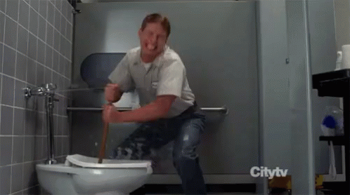

I'm really not qualified to give advice. But enough people DM'd me on Twitter, so here it is.  

我真的没有资格给予建议。但有足够多的人在Twitter上DM我，所以在这里。  

I don't have to answer the same question over and over again.  

我不需要一遍又一遍地回答同样的问题。  

After some more editing I realised that I am actually writing this for my younger sister Katherine.  

经过一些更多的编辑，我意识到我实际上是为我的妹妹凯瑟琳写这篇文章。

If you want to know who I am, check out [blog/whoami](https://jxnl.co/writing/2024/01/01/whoami/) or my [Twitter](https://twitter.com/jxnlco).  

如果你想知道我是谁，请查看我的博客/whoami或我的Twitter。

Don't read this if you're seeking a nuanced perspective  

如果你在寻找一个微妙的视角，

These are simply the lies I tell myself to keep on living my life in [good faith](https://en.wikipedia.org/wiki/Bad_faith_(existentialism)). I'm not saying this is the right way to do things. I'm just saying this is how I did things.  

这些只是我告诉自己的谎言，让我继续真诚地生活。我不是说这是正确的做事方式。我是说我就是这么做事的。  

I will do my best to color my advice with my own experiences, but I'm not going to pretend that the suffering and the privilege I've experienced is universal.  

我会尽我所能用我自己的经历来美化我的建议，但我不会假装我所经历的痛苦和特权是普遍的。

Choosing  

选择

You'll notice that I use the word "choosing" frequently.  

你会注意到我经常使用“选择”这个词。  

I genuinely believe that we are always making choices and that we have the ability to choose.  

我真的相信我们总是在做出选择，我们有能力做出选择。  

Choosing can be terrifying because it means we are accountable for our decisions, and there are infinite options before us.  

选择可能是可怕的，因为它意味着我们要对自己的决定负责，我们面前有无限的选择。  

It is also frightening because once we have made a decision, we must live with it, it is the death of optionality.  

这也是可怕的，因为一旦我们做出了决定，我们必须忍受它，这是选择性的死亡。  

But I believe that choosing is the only way to live authentically.  

但我相信选择是活得真实的唯一途径。

-   **Existential Despair**: A feeling of hopelessness rooted in the existentialist belief that life lacks inherent meaning.  
    
    潜在的绝望：一种源于存在主义信仰的绝望感，认为生活缺乏内在的意义。  
    
    This despair arises from the realization of one's absolute freedom and the responsibility for creating one's own essence and purpose.  
    
    这种绝望来自于一个人的绝对自由的实现和创造自己的本质和目的的责任。
    
-   **Anguish**: In existentialism, anguish is the emotional response to recognizing the vastness of one's freedom and the accompanying responsibility for one's actions.  
    
    痛苦：在存在主义中，痛苦是一种情感反应，承认一个人的自由和随之而来的责任，一个人的行动。  
    
    It involves the realization that each decision shapes one's essence and affects others, leading to a deep sense of moral responsibility.  
    
    它涉及到认识到每一个决定都塑造了一个人的本质并影响到他人，从而产生深刻的道德责任感。
    

There's a joke I once heard about a philosopher.  

我听过一个关于哲学家的笑话。  

Before going to bed, he wonders if he will be thirsty during the night.  

睡觉前，他想知道他晚上是否会口渴。  

So, he goes to the kitchen and places two cups beside his bed: one filled with water and the other left empty, just in case he doesn't want any water.  

所以，他去了厨房，在床边放了两个杯子：一个装满了水，另一个是空的，以防万一他不想喝水。

## How to Be Lucky[¶](https://jxnl.co/writing/2024/06/01/advice-to-young-people/#how-to-be-lucky "Permanent link")  

如何成为幸运儿¶

You make your own luck.  

你自己创造运气。  

There's a great experiment that I can't cite, but it has stuck in my mind since I was a child.  

有一个伟大的实验，我不能引用，但它一直在我的脑海里，因为我是一个孩子。  

They identified people as lucky and unlucky, and asked them to count the number of photographs in a newspaper.  

他们将人们分为幸运者和不幸者，并让他们数一数报纸上的照片数量。  

The unlucky people took a long time to count the photographs, while the lucky people took a very short time.  

不幸的人花了很长时间来数照片，而幸运的人花了很短的时间。  

The reason is that the unlucky people were so focused on counting the photographs that they missed the giant text that said, "Stop counting, there are 43 photographs in this newspaper."  

原因是那些倒霉的人太专注于数照片了，以至于他们错过了一个巨大的文字，上面写着：“停止计数，这张报纸上有43张照片。“

What I took away from this experiment was the idea that it might not be the case that lucky people and unlucky people have different opportunities, but rather that their field of perception is wider.  

我从这个实验中得到的想法是，幸运的人和不幸的人可能没有不同的机会，而是他们的感知范围更广。  

Lucky people can actually see the opportunities.  

幸运的人可以看到机会。  

A lucky person and an unlucky person might meet the same businessman, but they might talk about different things.  

一个幸运的人和一个不幸的人可能会遇到同一个商人，但他们可能会谈论不同的事情。  

One could be presented with or ask for an opportunity that the unlucky person doesn't even see as possible.  

一个人可能会得到或要求一个机会，不幸的人甚至没有看到作为可能的。

I often ask myself, "Okay, I'm focused on getting X, but let's not forget to read the headlines."  

我经常问自己，“好吧，我专注于获得X，但让我们不要忘记阅读标题。“

## How to Get a Job[¶](https://jxnl.co/writing/2024/06/01/advice-to-young-people/#how-to-get-a-job "Permanent link")  

如何找到工作¶

I've never gotten a job by applying to it. It's always been referrals or someone reaching out to me.  

我从来没有通过申请得到过一份工作，一直都是别人推荐或者主动联系我。  

So honestly, my resume is shit compared to my peers.  

所以说实话，我的简历和我的同龄人比起来简直是垃圾。  

I'm terrible at interviewing, and I've never done leetcode.  

我不擅长面试，而且我从来没有做过leetcode。  

This is not a brag; it's just not my style. Am I a nepo baby? I don't know. Was I a morale hire?  

这不是吹牛，这不是我的风格。我是一个nepo婴儿？我不知道我是一个士气雇佣？  

I'm pretty disagreeable. Was it merit? Also not sure.  

我很不讨人喜欢。这是优点吗？也不确定。

### Merit[¶](https://jxnl.co/writing/2024/06/01/advice-to-young-people/#merit "Permanent link")  

优点¶

Very few people get a job on merit alone. You have to be a big fish in a big pond.  

很少有人仅仅凭才干就得到一份工作。你必须是大池塘里的大鱼。  

That's like IOI, top 1% in your class, etc. That's just... Sort by grades and interview? That's hard.  

就像IOI，你班上的前1%，等等。那只是...按成绩和面试排序？这很难  

You literally have to be the best.  

你一定要做到最好。  

I say what I say knowing that you've already worked hard, knowing that you've already put in the sweat, but understanding that the next 10% or the next 5% of improvement is going to be much more difficult, than focusing on being a better person.  

我说我知道你已经努力工作了，知道你已经付出了汗水，但是要知道接下来的10%或5%的改进将比专注于成为一个更好的人要困难得多。  

And that I want you make a conscious of the trade-offs you make between these 'soft' and 'hard' skills.  

我希望你们能意识到在这些“软”和“硬”技能之间的权衡。

### High Agency[¶](https://jxnl.co/writing/2024/06/01/advice-to-young-people/#high-agency "Permanent link")  

高级代理¶

When I hire someone, I simply want to know that they are capable of taking charge of their own life.  

当我雇用一个人时，我只是想知道他们有能力掌控自己的生活。  

It's quite common for people to DM me saying, "Hey man, how can I help you?" However, I often find that they haven't put any effort into thinking about it.  

很常见的情况是，人们发短信给我说，“嘿，伙计，我能帮你什么吗？“但是，我经常发现他们没有花任何精力去思考它。  

I usually ignore such messages unless I truly believe they can provide assistance.  

我通常会忽略这些信息，除非我真的相信它们能提供帮助。

There have been many times people will DM me offering to help while I am writing a blog post.  

有很多次，人们会DM我提供帮助，而我写博客文章。  

I'll link the blog PR and say 'let me know what you think'. No comments, and then I get ghosted?  

我会链接博客公关，说'让我知道你的想法'。没意见，然后我就消失了？

How to Reach Out  

如何吸引男人

Do not send me anything longer than you would send to a crush.  

不要给我发任何比你发送给迷恋的东西更长的东西。  

Some people email me six-paragraph essays about the time they saved a cat from a tree.  

有些人给我发电子邮件，写一篇六段的文章，讲述他们从树上救下一只猫的经历。

I find the most effective way to get someone's attention is to simply give, just like in dating.  

我发现吸引别人注意力最有效的方法就是简单的给予，就像约会一样。  

Hey, I noticed that you read this book on your website.  

嘿，我注意到你在你的网站上读过这本书。  

I think you'd like this book too; it's pretty short, etc.  

我想你也会喜欢这本书的;它很短，等等。  

Oh, I noticed some tests were failing in your repository. I fixed them for you. Hey!  

哦，我注意到你的仓库里有一些测试失败了。我帮你修好了。嘿！嘿！  

I've added some examples to the codebase. Do you have any feedback?  

我在代码库中添加了一些示例。你有什么意见吗？

There are so many little ways to get people's attention that aren't self-centered.  

有很多小方法可以吸引人们的注意力，而不是以自我为中心。  

I do this with my consulting too.  

我的咨询也是这样。  

During the first call, my only goal is to tell you everything I think could help your business.  

在第一个电话中，我唯一的目标是告诉你我认为对你的生意有帮助的一切。  

I don't care if you hire me or not. I just want to help.  

我不在乎你雇不雇我。我只是想帮忙  

And as it turns out, this leads me to the next part.  

事实证明，这将我引向下一个部分。

I recognize that not everyone has access to the same networking opportunities, and the traditional job application process can be a valid and necessary path for many.  

我认识到，不是每个人都有机会获得同样的网络机会，传统的工作申请流程对许多人来说是一个有效和必要的途径。  

But social media when used correctly is a great way to get a opportunity  

但如果使用得当，社交媒体是获得机会的好方法

### Be the Plumber[¶](https://jxnl.co/writing/2024/06/01/advice-to-young-people/#be-the-plumber "Permanent link")  

成为水管工¶

When my toilet is overflowing with shit and my wife is about to come home in 2 hours, and I find a plumber, the plumber does not go, "OMG, thank you for this opportunity." They are past that.  

当我的厕所里满是大便，我妻子两个小时后就要回家的时候，我找到了一个水管工，水管工不会说，“天哪，谢谢你给我这个机会。”他们过去了。  

They know that you're in a pinch, and they know that what they have is valuable.  

他们知道你在紧要关头，他们知道他们所拥有的是有价值的。  

They know they are here to solve MY problem. Hiring is the same way.  

他们知道他们是来解决我的问题的。招聘也是一样。  

This is why people want to hire senior folks because there's some trust.  

这就是为什么人们想雇用资深人士，因为有一些信任。

But ultimately, you have to understand that unless there's some tremendous tax break and positive EV, the people who are hiring NEED HELP.  

但最终，你必须明白，除非有一些巨大的税收减免和积极的EV，雇用的人需要帮助。  

Your job is to help them solve the problem or find the problem to solve.  

你的工作是帮助他们解决问题或找到问题来解决。  

You're here to solve my problem; you're not here to collect charity work.  

你是来解决我的问题的;不是来收慈善工作的。

### Be Someone People Want to Work With[¶](https://jxnl.co/writing/2024/06/01/advice-to-young-people/#be-someone-people-want-to-work-with "Permanent link")  

成为人们想与之共事的人¶

If your metric for working somewhere is being someone people want to work with, it turns out skill is not the highest metric.  

如果你在某个地方工作的衡量标准是成为人们想与之合作的人，那么技能并不是最高的衡量标准。  

I've seen people get hired because they're fun to be around.  

我见过有人因为有趣而被雇佣。  

If you want to be the smartest person, then yeah, good grades and being the smartest person in the room is a good metric.  

如果你想成为最聪明的人，那么是的，好成绩和成为房间里最聪明的人是一个很好的衡量标准。  

But if you want to get a job, "man, you're great to be around" is a very strong metric.  

但如果你想找份工作，“伙计，你很棒”是一个非常强的衡量标准。  

This is obviously conditional on skill, and you should obviously focus on skills acquisition.  

这显然是有条件的技能，你显然应该专注于技能的获取。

### Impostor Syndrome[¶](https://jxnl.co/writing/2024/06/01/advice-to-young-people/#impostor-syndrome "Permanent link")  

冒名顶替者综合征¶

If I hired you, don't insult me by having impostor syndrome.  

如果我雇了你，别拿骗子综合症来侮辱我。  

I hired you because I think you can solve my problem.  

我雇你是因为你能解决我的问题。  

I didn't hire you to compare you to other plumbers (I might), but at the end of the day, you must just think I have shit taste and that you've somehow tricked me into thinking you're good when you're an impostor? Right?  

我雇你不是为了把你和其他水管工比较（我可能会），但在一天结束的时候，你一定认为我的品味很差，你在某种程度上欺骗了我，让我认为你是个骗子时很好？对不对啊？

That said, it's advised that junior people seek out teams which prioritize a high degree of psychological safety.  

也就是说，建议年轻人寻找优先考虑高度心理安全的团队。

If you don't believe in yourself, believe in me that believes in you.  

如果你不相信自己，请相信你的我。

## How to Be Good at Many Things[¶](https://jxnl.co/writing/2024/06/01/advice-to-young-people/#how-to-be-good-at-many-things "Permanent link")  

如何做好很多事情¶

I think too many people reading this are mostly pursuing intellectual activities, but I'm mostly gonna focus on using analogies of personal physical fitness to describe how I think about this kind of stuff.  

我想很多阅读这篇文章的人大多是在追求智力活动，但我主要是用个人身体健康的类比来描述我是如何看待这类事情的。

In the beginning, you're gonna have a noob gains, just an act of practicing is going to be enough to make improvements.  

在开始的时候，你会有一个新手的收获，只是一个练习的行为将是足以作出改进。  

You're gonna be so weak and out of shape that if you wait, it's gonna be cardio, and if you run, you're gonna get stronger.  

你会变得很虚弱，身材也不好，如果你等着，那就是有氧运动，如果你跑步，你会变得更强壮。  

And it's gonna be months or years of seeing progress just by showing up every day and doing anything.  

这将是几个月或几年的进步，只是出现在每一天，做任何事情。  

You're just gonna be making progress.  

你只是在进步。  

Maybe you're also "gifted" and so things come easier to you, but there's gonna be a time when things change.  

也许你也有“天赋”，所以事情对你来说更容易，但总有一天事情会改变。

### Cost of Being a Champion[¶](https://jxnl.co/writing/2024/06/01/advice-to-young-people/#cost-of-being-a-champion "Permanent link")  

成为冠军的代价¶

The story I tell myself is one where Travis Stevens talks about what it takes to be a judo champion.  

我告诉自己的故事是特拉维斯·史蒂文斯谈论成为柔道冠军需要什么。  

Something along the lines of "You think you want to be a champion until you meet someone who truly knows they want to be a champion." Replace "champion" with "comedian," "boxer," "founder," and so on.  

沿着“你认为你想成为一个冠军，直到你遇到一个人谁真正知道他们想成为一个冠军。把“冠军”换成“喜剧演员”、“拳击手”、“创始人”等等。

Do you realize what it takes to be a judo champion?  

你知道成为柔道冠军需要什么吗？

You need to sacrifice relationships, break some fingers, go through an ACL tear, and even get a concussion before fighting for the Olympics.  

在为奥运会而战之前，你需要牺牲人际关系，折断一些手指，经历ACL撕裂，甚至脑震荡。  

You have to endure injuries and wonder if your career is over.  

你必须忍受伤病，怀疑你的职业生涯是否结束了。  

You have to get the flu right before nationals and fight through it.  

你必须在全国赛前得流感并战胜它。  

And if you lose, you have to refrain from making excuses.  

如果你输了，你必须克制自己不要找借口。  

That's incredibly challenging, and it's perfectly acceptable to choose not to pursue that path.  

这是非常具有挑战性的，选择不走这条路是完全可以接受的。

### Love Plateaus[¶](https://jxnl.co/writing/2024/06/01/advice-to-young-people/#love-plateaus "Permanent link")  

爱的高原¶

Once you start hitting a plateau, can you just start thinking about progressive overload and making sure what you're doing is facing difficulty at some consistent rate, but ultimately this is just to get you over and through some of these spots.  

一旦你开始达到一个平台，你能不能开始考虑渐进式超负荷，并确保你所做的是以某种一致的速度面临困难，但最终这只是让你通过这些点。  

At some point in the future, how much better you get will just be a function of how badly you want it and how much you enjoy the act.  

在未来的某个时候，你能得到多少好处，将取决于你有多渴望得到它，以及你有多享受这一行为。

How to identify the champ  

如何识别冠军

I remember that video where they were asking this Olympic weightlifter what matters more talent or hard work.  

我记得有一段视频，他们问一位奥运举重运动员，天赋和努力哪个更重要。  

And he said something along the lines of.  

他说了些沿着。  

"At the national level, everyone is talented, but when you by the time you go to the olympics hard work is the only thing that matters, there are many injuries and challenges, and the people who get it are the people who want it the most"  

“在国家队，每个人都很有天赋，但是当你去参加奥运会的时候，努力工作是唯一重要的事情，有很多伤病和挑战，得到它的人是最想要它的人”

### On Season and Off Season[¶](https://jxnl.co/writing/2024/06/01/advice-to-young-people/#on-season-and-off-season "Permanent link")  

在季节和淡季¶

I think a lot of people ask me specifically about this question because I do so many things.  

我想很多人都特别问我这个问题，因为我做了很多事情。  

I'm a martial artist, assistant, free diver, blah blah blah blah blah.  

我是个武术家，助理，自由潜水员，等等。  

I don't think I'm a leader at any of these things, but I do think I'm elite at learning.  

我不认为我是这些事情的领导者，但我认为我是学习的精英。  

And just like there is an off-season and on-season for sports, I think there's an off-season and on-season for learning.  

就像运动有淡季和旺季一样，我认为学习也有淡季和旺季。  

And I think that's the most important thing to understand.  

我认为这是最重要的一点。

At some point, cardio will hurt your strength gains.  

在某种程度上，有氧运动会损害你的力量增长。  

At some point, strength gains will hurt your cardio.  

在某种程度上，力量的增加会伤害你的有氧运动。  

At some point, you're gonna have to choose between being a powerlifter or a marathon runner.  

在某种程度上，你必须在举重和马拉松之间做出选择。  

And that's okay. You can always come back to it.  

没关系你可以随时回来。  

But I think the most important thing is to understand that you can't be good at everything all the time. And that's okay.  

但我认为最重要的是要明白，你不可能在所有的时间都擅长。没关系  

You can always come back to it.  

你可以随时回来。

## How to Be Confident[¶](https://jxnl.co/writing/2024/06/01/advice-to-young-people/#how-to-be-confident "Permanent link")  

如何保持自信¶

I am a deeply insecure person, and I think my therapist would probably agree that I have low self-esteem.  

我是一个非常没有安全感的人，我想我的治疗师可能会同意我的自尊心很低。  

But I am confident just the same.  

但我还是很有信心。  

I believe it's important to understand that confidence is the ability to believe despite feeling uneasy.  

我相信重要的是要明白，信心是尽管感到不安，但仍然相信的能力。

> Courage is not the absence of fear, but rather taking action despite the fear.  
> 
> 勇气不是没有恐惧，而是尽管恐惧，仍然采取行动。

I think this applies to many virtues. So I'll only talk about my own experience with confidence.  

我认为这适用于许多美德。所以我只会满怀信心地谈谈我自己的经历。  

My confidence simply comes from taking action.  

我的信心来自于行动。  

I know I outwork everyone around me, even if I have no talent.  

我知道我比周围的人都努力，即使我没有天赋。  

I know I'm willing to make sacrifices, and I know I can focus my energy on a specific goal. Why?  

我知道我愿意做出牺牲，我知道我可以把精力集中在一个特定的目标上。为什么？为什么？  

Because I've done it so many times in my life.  

因为我这辈子做过太多次了。

> Confidence is the memory of success  
> 
> 自信是成功的记忆

### Jiu Jitsu[¶](https://jxnl.co/writing/2024/06/01/advice-to-young-people/#jiu-jitsu "Permanent link")  

柔术¶

When I started doing jiu-jitsu, I trained hard five days a week.  

当我开始练柔术的时候，我一周训练五天。  

Every training session was challenging, but it also meant that whenever I went to a new gym or a competition, I knew I could handle it.  

每次训练都很有挑战性，但这也意味着每当我去一个新的健身房或比赛，我知道我可以处理它。  

I had already been through tough situations, and I knew I could overcome them again.  

我已经经历过坚韧的处境，我知道我可以再次克服它们。

### Freediving[¶](https://jxnl.co/writing/2024/06/01/advice-to-young-people/#freediving "Permanent link")  

自由潜水¶

When I started freediving, I swam for an hour every day, six days a week.  

当我开始自由潜水时，我每天游泳一小时，一周六天。  

At the end of each workout, I would practice my breathing routines and apnea training.  

在每次训练结束时，我会练习我的呼吸程序和呼吸暂停训练。  

By the end of my training session, I could swim 80 meters in a pool without taking a breath and hold my breath for 4 ½ minutes.  

训练结束后，我可以在游泳池里一口气游80米，并能屏住呼吸4分半钟。  

This was important because I knew that during my diving trip, the longest distance I would have to swim was 45 meters and the longest breath-hold would be 2 ½ minutes.  

这很重要，因为我知道在我的潜水之旅中，我最长要游45米，最长的屏气时间是2分半钟。  

By the time I went on my diving trip, I felt relaxed and ready to enjoy the water.  

当我开始潜水之旅的时候，我感到很放松，准备好享受水了。  

I knew I could do it because I had already accomplished it.  

我知道我能做到，因为我已经做到了。

Hitting 30m for the first time  

第一次冲击30米

My personal record for the deepest dive I've done on a single breath is 30m.  

我个人的最深潜水记录是一口气下潜30米。  

It was not a very fast dive, so I ended up being underwater for 3 ½ minutes.  

这不是一个非常快的潜水，所以我最终在水下呆了三分半钟。  

But how did I feel at the time?  

但我当时是什么感觉？

1.  3.5 minutes is a minute shorter than my personal best, so I knew I could do it.  
    
    3.5这比我个人最好成绩少了一分钟，所以我知道我能做到。
2.  During the 10-minute rest before the dive, the goal was to lower my heart rate and relax.  
    
    在潜水前的10分钟休息时间里，我的目标是降低心率和放松。  
    
    I was so relaxed that I fell asleep in the water for 10 minutes, and my heart rate was 43 bpm.  
    
    我太放松了，在水里睡了10分钟，心率是43次/分。  
    
    I woke up, took the last few breaths, and went down.  
    
    我醒来，做了最后几次呼吸，然后倒下了。

### Public Speaking[¶](https://jxnl.co/writing/2024/06/01/advice-to-young-people/#public-speaking "Permanent link")  

公开演讲¶

People don't believe this, but my talk at the AI Summit was actually my first public speaking experience.  

人们不相信这一点，但我在AI峰会上的演讲实际上是我第一次公开演讲。  

It has over 120k views on YouTube.  

它在YouTube上有超过12万的浏览量。  

I was so nervous that I basically blacked out and didn't eat all day until the talk.  

我太紧张了，几乎昏过去了，一整天都没吃东西，直到演讲开始。  

I have no recollection of the day, and I had so much adrenaline that I was shivering before I got up on stage.  

我不记得那天的事了，我肾上腺素太多了，在我上台之前我就在发抖。  

Leading up to the talk, I rehearsed it for about two hours each day in the past three days.  

在演讲之前，我在过去的三天里每天排练大约两个小时。  

By the time I got on stage, the words just flowed out of me.  

当我上台的时候，我的话就流出来了。  

I had rehearsed the speech standing up, wearing the same jacket, about 20 times in the past month.  

在过去的一个月里，我穿着同样的夹克站着排练了大约20次演讲。  

I knew I could do it because I had already done it.  

我知道我能做到，因为我已经做到了。

In order to keep doing the reps in the past 3 months I've been relentlessly trying to find podcasts to speak on to keep doing the reps and practicing.  

为了继续做代表在过去的3个月里，我一直在不懈地试图找到播客发言，继续做代表和实践。

The theme is consistent throughout.  

主题贯穿始终。  

I don't think it's the only way to gain confidence, as there could be some delusion at play.  

我不认为这是获得信心的唯一方法，因为可能有一些错觉在起作用。  

But I have simply shown myself, over the past 15 years, that I can overcome difficult challenges and do them repeatedly..  

但在过去的15年里，我只是向自己证明，我可以克服困难的挑战，并反复做到这一点。

## Practice more than you play, confidence is the memory of success[¶](https://jxnl.co/writing/2024/06/01/advice-to-young-people/#practice-more-than-you-play-confidence-is-the-memory-of-success "Permanent link")  

多练少玩，自信是成功的记忆¶

No notes.  

没有笔记。

## The Greatest Gift You Can Give Yourself[¶](https://jxnl.co/writing/2024/06/01/advice-to-young-people/#the-greatest-gift-you-can-give-yourself "Permanent link")  

你能给自己给予的最好礼物

The greatest gift you can give yourself is the gift of being enough.  

你能给予自己的最好的礼物就是知足常乐。

## Choosing happiness[¶](https://jxnl.co/writing/2024/06/01/advice-to-young-people/#choosing-happiness "Permanent link")  

选择幸福¶

In the short term, you would be much happier if you accepted and admitted to yourself that the reason you don't have what you want is simply because you do not want it badly enough.  

从短期来看，如果你接受并承认你没有得到你想要的东西的原因仅仅是因为你不够想要它，你会更快乐。  

The sooner you accept that, the happier you'll be.  

你越早接受这一点，你就会越快乐。  

Then the next question is: Do you want to be happy or do you want to achieve what you want?  

那么下一个问题是：你是想要快乐还是想要实现你想要的？  

It's not the last question, but it definitely is the next question.  

这不是最后一个问题，但肯定是下一个问题。

For who i think my audience is I really recommended Byung Chul Han's book the [Burnout Society](https://www.amazon.ca/Burnout-Society-Byung-Chul-Han/dp/0804795096) or [Psychopolitics](https://www.amazon.ca/Psychopolitics-Neoliberalism-New-Technologies-Power/dp/1784785776).  

对于我认为我的观众是谁，我真的推荐Byung Chul Han的书《倦怠社会或精神政治学》。

## Write More[¶](https://jxnl.co/writing/2024/06/01/advice-to-young-people/#write-more "Permanent link")  

写更多¶

I used to hate writing. I was always incredibly insecure about it.  

我以前讨厌写作。我对此总是非常不安全。  

English is my second language, and I was often told that I would never be a good writer because I am an immigrant.  

英语是我的第二语言，我经常被告知，我永远不会成为一个好作家，因为我是一个移民。  

I scored poorly on the writing section of the SATs.  

我在SAT的写作部分得分很低。  

In fact, I failed the entrance English exam at Waterloo and had to rewrite an English essay, or else I would have been kicked out of college in the first week.  

事实上，我在滑铁卢大学的入学英语考试中失败了，不得不重写一篇英语论文，否则我会在第一周就被踢出大学。

This is my first piece of writing  

这是我的第一篇文章

I've run a bunch of technical blog posts, but this is the first time I'm really speaking from my heart.  

我写过很多技术博客文章，但这是我第一次真正说出自己的心声。  

This whole article took me about an hour to write using speech to text.  

这篇文章花了我大约一个小时的时间用语音来写。  

I almost didn't write this, but then I realized that if it even helped one person feel a little less anxious for one day it would've been positive.  

我几乎没有写这篇文章，但后来我意识到，如果它能帮助一个人在一天内减轻一点焦虑，那就是积极的。

It wasn't until November 2023 that I truly appreciated the power of writing.  

直到2023年11月，我才真正体会到写作的力量。  

Writing helps me stop dwelling on the same thoughts repeatedly.  

写作帮助我停止反复思考同样的想法。  

Moreover, when someone asks for advice, I can simply share a link instead of repeating myself.  

而且，当有人寻求建议时，我可以简单地分享一个链接，而不是重复自己。  

I have found writing to be incredibly valuable because if someone is not willing to read it, they won't benefit from it.  

我发现写作是非常有价值的，因为如果有人不愿意读它，他们就不会从中受益。  

The worst outcome is not having written anything at all; it is failing to help someone who could have benefited from it.  

最糟糕的结果是什么也没写;它未能帮助那些本可以从中受益的人。  

I have found that writing is a great way to help others while helping myself exorcise the thoughts from my mind and make room for new ones.  

我发现写作是一种帮助他人的好方法，同时也能帮助自己驱除脑海中的想法，为新的想法腾出空间。

## Do It Scared[¶](https://jxnl.co/writing/2024/06/01/advice-to-young-people/#do-it-scared "Permanent link")  

做它害怕¶

I believe many young people struggle with the insecurity of being intelligent.  

我相信许多年轻人都在为自己的聪明而感到不安全。  

They often feel the need to prove their intelligence by overthinking, excessively planning, and acquiring knowledge before taking action.  

他们经常觉得有必要在采取行动之前通过过度思考，过度计划和获取知识来证明自己的智慧。  

However, this approach is a waste of time.  

然而，这种方法是浪费时间。  

The more you research, the more you realize how little you actually know.  

你研究得越多，你就越意识到你实际上知道得有多少。  

Instead, you just have to do it, even if you're scared.  

相反，你只需要去做，即使你害怕。

> Literature is the most agreeable way of ignoring life.  
> 
> 文学是漠视生命的最惬意的方式。

The theory is for analysis; it is not for action.  

理论是用来分析的，不是用来行动的。

When you learn to draw, just draw what you see.  

当你学画画的时候，就画你所看到的。  

And when we get an art education, the theory simply gives us the language to describe our tastes.  

当我们接受艺术教育时，理论只是给了我们描述我们品味的语言。  

The challenge I'm giving myself this year is to learn the trumpet without learning any music theory.  

今年我给自己的挑战是在不学习任何乐理的情况下学习小号。  

I'm just going to play with it like a child.  

我就像个孩子一样摆弄它。  

I'm just going to listen to a lot of music and try to make those sounds that I like.  

我只是要听很多音乐，试着发出我喜欢的声音。

There have been enough examples of little Chinese kids being forced to learn the piano for seven years, and the moment their parents stop taking them to class, they stop playing music.  

中国的小孩子被迫学了七年钢琴，当他们的父母不再带他们去上课的时候，他们就停止了演奏。  

I think if you love the world and think it is beautiful, learning physics, for example, would not take away from that beauty it only adds to it.  

我认为，如果你热爱这个世界，并认为它是美丽的，例如，学习物理，不会带走这种美丽，它只会增加它。  

But if you study natural science without loving the natural world, you will only see the world as a machine.  

但如果你学习自然科学而不热爱自然世界，你只会把世界看作一台机器。  

Which is just not that fun.  

一点都不好玩。

## You are not your work[¶](https://jxnl.co/writing/2024/06/01/advice-to-young-people/#you-are-not-your-work "Permanent link")  

你不是你的作品

When I was in art school, one thing I discovered was that many people believed they were defined by the work they created.  

当我在艺术学校的时候，我发现了一件事，那就是许多人认为他们是由他们创造的作品来定义的。  

If their work wasn't good, they saw it as a reflection of their skill rather than a reflection of their taste, which was actually superior to their ability.  

如果他们的工作做得不好，他们会把它看作是他们技能的反映，而不是他们品味的反映，这实际上比他们的能力高出上级。

You are simply the person who created the work.  

你只是创造工作的人。  

You are a vessel, a medium for the work, but you are not the work itself.  

你是一个容器，一个工作的媒介，但你不是工作本身。

The sooner you realize this, the easier it will be to share the work you have produced, receive feedback, develop your skills, and reflect on your taste.  

你越早意识到这一点，就越容易分享你的作品，接受反馈，发展你的技能，并反思你的品味。

## Get Rid of Complexity[¶](https://jxnl.co/writing/2024/06/01/advice-to-young-people/#get-rid-of-complexity "Permanent link")  

摆脱复杂性¶

I think in the same way when making plans or building systems, the same insecurity of being intelligent leads to overthinking and overcomplicating a system, in the hope that the same complexity will be a proxy for intelligence.  

我认为在制定计划或构建系统时，同样的智能不安全感会导致过度思考和过度复杂化系统，希望同样的复杂性将成为智能的代理。  

I think this is a mistake. The best systems are the simplest ones.  

我觉得这是个错误。最好的系统是最简单的系统。  

Feynman's approach to physics is a great example of this.  

费曼的物理学方法就是一个很好的例子。  

Famously, Einstein said that if you can't explain something simply, you don't understand it well enough.  

爱因斯坦曾说过，如果你不能简单地解释某件事，那说明你对它的理解还不够好。  

I think this is true for many things.  

我认为这对很多事情来说都是正确的。

## A Great Person is not Always a Good Person[¶](https://jxnl.co/writing/2024/06/01/advice-to-young-people/#a-great-person-is-not-always-a-good-person "Permanent link")  

一个伟大的人并不总是一个好人

Mike Tyson once said, "If you're favored by God, you're also favored by the devil." It's alright to strive for greatness, but it's equally important to choose goodness.  

迈克·泰森曾说过：“如果你受到上帝的青睐，你也会受到魔鬼的青睐。“追求伟大是可以的，但选择善良同样重要。  

Don't neglect your loved ones for work; time is fleeting.  

不要因为工作而忽略了你所爱的人;时间转瞬即逝。  

Appreciate people and sincerely express your love for them.  

欣赏别人，真诚地表达你对他们的爱。  

Grief is the result of unexpressed love, and the key to avoiding grief is to love abundantly.  

悲伤是未表达的爱的结果，避免悲伤的关键是要有丰盛的爱。

Some people claim they will grind for ten years and then relax once they find a partner or something similar, but I believe that's nonsense.  

有些人声称他们会磨十年，然后放松，一旦他们找到一个合作伙伴或类似的东西，但我相信这是胡说八道。  

You won't be able to do it suddenly without practice.  

你不可能不经过练习就突然做到的。  

Along your journey of hard work, you must consciously practice winding down and being a good person.  

沿着你的努力工作之旅，你必须有意识地练习放松，做一个好人。  

Otherwise, you'll only address it after experiencing your first divorce.  

否则，你只能在经历第一次离婚后才能解决这个问题。

Fatherhood  

父亲

I think fatherhood is a great example of this.  

我认为父亲就是一个很好的例子。  

I think a lot of people think that they can just be a good father when they have kids.  

我想很多人认为他们有了孩子就可以做个好父亲。  

But I think that's a mistake. I think you have to practice being a good father before you have kids.  

但我认为这是个错误。我觉得在你有孩子之前你得先练习做个好父亲。  

You have to practice being a good husband before you get married.  

在你结婚之前你必须练习做一个好丈夫。

It might be easy to convince myself that a good father is able to take care of the family, but how many times was that an excuse to just work yourself to death is the father who can pay for piano lessons, truly a better man than the father, who can be present at the recital?  

也许很容易说服自己，一个好父亲能够照顾家庭，但有多少次，一个借口，只是工作自己的死亡是父亲谁可以支付钢琴课，真的是一个更好的人比父亲，谁可以出席独奏会？  

I just don't think this is something that we can turn on and off so easily.  

我只是不认为这是我们可以这么容易打开和关闭。

## Self-Worth[¶](https://jxnl.co/writing/2024/06/01/advice-to-young-people/#self-worth "Permanent link")  

自我价值¶

For a large part of my life, I held onto the belief that my purpose was to help and teach people.  

在我生命的大部分时间里，我坚信我的目的是帮助和教导人们。  

I believed in working hard, generating capital, and taking care of my partner, family, and so on.  

我相信努力工作，创造资本，照顾我的伴侣，家庭，等等。  

However, when I got injured, I had to confront the fact that I wasn't able to fulfill those responsibilities.  

然而，当我受伤时，我不得不面对我无法履行这些责任的事实。  

I struggled with the realization that I couldn't work, produce, or take care of my partner and family.  

我挣扎着意识到我不能工作，生产，或照顾我的伴侣和家庭。  

It made me question, "If the ox cannot plow, what is it good for?" This struggle consumed me during the latter half of my twenties.  

我不禁要问：“牛不能耕田，有什么用？“这场斗争在我20多岁的后半段消耗了我。

It is crucial to start practicing self-love.  

开始练习自爱是至关重要的。  

While successful people may attribute their success to their struggles, I believe a significant part of it is simply coming to terms with those struggles.  

虽然成功的人可能会把他们的成功归功于他们的奋斗，但我相信其中很大一部分只是简单地接受这些奋斗。  

Each person's pain is maximum to them. You have already endured hardships.  

每个人的痛苦对他们来说都是最大的。你已经经受了磨难。  

Seek success because you deserve it and learn to love yourself, rather than punishing yourself for not being good enough.  

追求成功，因为你值得它，学会爱自己，而不是因为不够好而惩罚自己。

You deserve the life that you desire.  

你值得拥有你想要的生活。

I used to write down "What would I do if I really loved myself?" Sometimes that's hard, especially for someone who has been through a lot of trauma.  

我曾经写下“如果我真的爱自己，我会做什么？“有时候这很难，尤其是对于一个经历过很多创伤的人来说。  

It can be difficult to even imagine what that would look like. Instead, I now use inverted thinking.  

很难想象那会是什么样子。相反，我现在使用逆向思维。  

What would I do if I really hated myself?  

如果我真的恨自己，我会怎么做？  

What if I wanted myself to lose out as much as possible? What would I do?  

如果我想让自己尽可能地失去什么呢？我该怎么办？

-   Stay home all day.  
    
    整天呆在家里。
-   If my friends don't ask to hang out, don't reach out to them out of fear of rejection.  
    
    如果我的朋友不要求出去玩，不要因为害怕被拒绝而向他们伸出援手。
-   Don't ask the girl out.  
    
    别约那个女孩出去。
-   Never learn to talk to strangers.  
    
    永远不要学着和陌生人说话。
-   Work hard and make tons of money but die an unhappy old man with regrets.  
    
    努力工作，赚很多钱，但遗憾地死去，一个不快乐的老人。
-   Neglect my health and my body.  
    
    不顾我的健康和身体。
-   Never learn to cook.  
    
    永远不要学做饭。
-   Be afraid to dance in public.  
    
    害怕在公共场合跳舞。
-   Make excuses and believe other people are more talented than me.  
    
    找借口，相信别人比我更有才华。
-   Never look at how far I've come and only focus on what I don't have.  
    
    永远不要看我走了多远，只关注我没有的东西。

Whatever it is, just do the opposite.  

不管是什么，反其道而行之。

## Self talk[¶](https://jxnl.co/writing/2024/06/01/advice-to-young-people/#self-talk "Permanent link")  

自我对话¶

What are the mantras you've inhereted from others?  

你从别人那里继承了什么咒语？  

How often are you chasing "The Dream" and not "Your Dream?".  

有多少次你追逐的是“梦想”而不是“你的梦想”？“.  

Really evaluate what you want and why you want it, and make sure your practice talking to yourself.  

真正评估你想要什么，为什么你想要它，并确保你的练习自言自语。

Happiness is the quality of thoughts  

幸福是思想的品质

You don’t need to believe in yourself to be an artist, you just need to believe in your audience.  

你不需要相信自己是一个艺术家，你只需要相信你的观众。  

To believe that it is important to communicate with them.  

相信与他们沟通很重要。  

Make sure that if your goal is to build an audience that you have some message to say.  

确保如果你的目标是建立一个观众，你有一些信息要说。  

Otherwise it just gets hopeless.  

否则就没希望了。  

Celebrity is the cost you pay to deliver your message, celebrity is to be hated.  

名人是你为传递信息而付出的代价，名人是被憎恨的。

Celebrity is to be hated  

名人是要被憎恨的

Twitter is a place where low status people can feel like high status people.  

Twitter是一个低地位的人可以感觉像高地位的人的地方。  

I think the Internet is basically summarized by those words.  

我认为互联网基本上可以用这些词来概括。  

For most of the people who are fighting online the Internet might be the only place where they have a sense of control.  

对于大多数在网上战斗的人来说，互联网可能是他们唯一有控制感的地方。  

When you approach it from a point of sympathy, even getting hate online is an opportunity to be grateful for the real life friendships that you have, and the digital communities that you've built.  

当你从同情的角度看待它时，即使是在网上得到仇恨也是一个机会，让你感激你拥有的真实的生活友谊，以及你建立的数字社区。

## Isolation is the gift, all others are a test of your endurance[¶](https://jxnl.co/writing/2024/06/01/advice-to-young-people/#isolation-is-the-gift-all-others-are-a-test-of-your-endurance "Permanent link")  

孤独是一份礼物，其他一切都是对你耐力的考验。

Really value your time alone. It is the only time you can truly see yourself.  

真正珍惜你的独处时间。只有这样，你才能真正看到自己。  

It is the only time you can truly hear yourself.  

只有这样，你才能真正听到自己的声音。  

Isolation is time not only away from people, but also media.  

隔离不仅是远离人群的时间，也是远离媒体的时间。

I believe success truly comes from being yourself, but if you're always surrounded by others the influence is too strong.  

我相信成功真的来自于做自己，但如果你总是被别人包围，这种影响力就太大了。  

But if you can truely live in the isolation, you'll be like a still pond.  

但如果你能真正地生活在孤独中，你就会像一个平静的池塘。  

When others project their image onto you, you'll be able to see the ripples clearly.  

当别人把他们的影像投射到你身上时，你会清楚地看到涟漪。

## The world is a mirror[¶](https://jxnl.co/writing/2024/06/01/advice-to-young-people/#the-world-is-a-mirror "Permanent link")  

世界是一面镜子

The only language you have to describe the world is with your own perception. The world is a mirror.  

你描述世界的唯一语言是用你自己的感知。世界是一面镜子。  

Often your fear of judgement might stem from your own judgement of others.  

通常，你对判断的恐惧可能源于你对他人的判断。

Jason goes to the gym  

杰森去健身房

I used to be afraid of going to the gym because I was afraid of being judged.  

我以前害怕去健身房，因为我害怕被评判。  

I was so focused on the idea of the right workout and the right form.  

我太专注于正确的锻炼和正确的形式。  

If I went to the gym alone, I would just think, "Wow, people must think I'm so weak.  

如果我一个人去健身房，我会想，“哇，人们一定认为我很虚弱。  

I can barely squat the bar.  

我都快蹲不下吧台了。  

I'm so lanky." I would look at the fat guy or the skinny guy and think, "Man, they are just like me, clueless."  

我太瘦了。“我会看着胖子或瘦子想，“伙计，他们就像我一样，一无所知。“

Looking back at that time, I had so much judgment of others, but it was really just a reflection of my own judgment of myself.  

回想当时，我对别人有那么多的评判，但那其实只是我对自己评判的一种反映。  

I was so afraid of being judged, but I was the one judging myself the most.  

我很害怕被评判，但我是评判自己最多的人。

Fast forward 5 years, everyone I see coming into the gym is trying to improve their health.  

快进5年，我看到的每个进入健身房的人都在努力改善他们的健康。  

I don't think the same way. I look at these people and think, "Wow, they are so much braver than me.  

我可不这么想。我看着这些人，心想：“哇，他们比我勇敢多了。  

I see them coming consistently, and I can see they are getting results. Good for them!  

我看到他们始终如一地来，我可以看到他们正在取得成果。对他们有好处！  

Oh, wow, they are bringing their friends. Awesome."  

哦，哇，他们带朋友来了。棒了“

The world looks different when you fix your own perception.  

当你修复自己的感知时，世界看起来就不一样了。

## You are a mirror[¶](https://jxnl.co/writing/2024/06/01/advice-to-young-people/#you-are-a-mirror "Permanent link")  

你是一面镜子

In the same way that the world is a mirror, you are a mirror. You are a mirror to others.  

世界是一面镜子，你也是一面镜子。你是别人的镜子。  

When you accept this you also realize that you are not responsible for others.  

当你接受这一点时，你也意识到你对别人不负责。  

The people who are negative to you are usually miserable themselves.  

对你消极的人通常自己也很痛苦。  

The sooner you realize this the easier it is to let go of the negativity.  

你越早意识到这一点，就越容易摆脱消极情绪。

## Pessimists Are Losers[¶](https://jxnl.co/writing/2024/06/01/advice-to-young-people/#pessimists-are-losers "Permanent link")  

悲观主义者是失败者¶

You impress nobody except yourself when you're a pessimist. It doesn't make you a better friend.  

当你是一个悲观主义者时，你只会给自己留下深刻印象。这并不会让你成为更好的朋友  

It does not make you cool and edgy.  

它不会让你变得冷静和急躁。  

It does not make you seem smarter just because you can be critical of everything.  

它不会让你看起来更聪明，只是因为你可以批评一切。  

The world is neither inherently against you nor for you, so believing one or the other is in bad faith.  

这个世界既不是天生反对你也不是支持你，所以相信其中一个是不诚实的。

> “He who blames others has a long way to go on his journey. He who blames himself is halfway there.  
> 
> “责怪别人的人在他的旅程中还有很长的路要走。责备自己的人已经成功了一半。  
> 
> He who blames no one has arrived.”  
> 
> 谁也不责怪谁的人已经到了。”

Survival  

生存

I think pessimism as a survival mechanism is great, its the alertness that warns us potential outcomes we do not want.  

我认为悲观主义作为一种生存机制是伟大的，它的警觉性，警告我们潜在的结果，我们不想要的。  

It's a way to protect yourself. People are also more able to find problems than solutions.  

这是一种保护你自己的方法人们也更容易发现问题而不是解决方案。  

It's a good exercise to understand if that energy is productive, can this critique of the work improve the work?  

这是一个很好的练习，可以了解这种能量是否有生产力，这种对工作的批评是否能改善工作？  

Or is it just a way to feel superior or to get sympathy?  

或者这只是一种感觉上级或获得同情的方式？

> All cruelty stems from weakness, Happiness is the quality of thought  
> 
> 所有的残忍都源于软弱，幸福是思想的品质

## Let Go of Anticipation[¶](https://jxnl.co/writing/2024/06/01/advice-to-young-people/#let-go-of-anticipation "Permanent link")  

放开期待¶

Here's a story about how regular people and Buddhist monks anticipated the future.  

这里有一个关于普通人和佛教僧侣如何预测未来的故事。  

They put both of them into an MRI and told them they were going to get shocked at some random time in the future.  

他们把两个人都放进核磁共振成像仪，告诉他们他们会在未来的某个随机时间受到电击。  

What they found was that regular people would have an anxious baseline response minutes before they were going to get shocked, but when they did, it was only slightly higher than the baseline.  

他们发现，普通人在受到电击前几分钟会有一个焦虑的基线反应，但当他们受到电击时，它只比基线略高。

The monks, however, had no resting anxious anticipatory response.  

然而，僧侣们没有休息焦虑的预期反应。  

There was no overactive brain activity until the moment of the shock.  

在电击之前没有过度活跃的大脑活动。  

But when they did feel the shock, it was much higher than the group of regular people.  

但是当他们真正感受到震动的时候，却要比普通人高出许多。  

They felt more pain!  

更痛了！

The lesson I learned from this is that anticipation likely dampens the sensations at the moment life happens, but at the cost dampening the joy as well, while creating a contraction in the present moment.  

我从中学到的教训是，期待可能会抑制生活发生时的感觉，但代价是也会抑制快乐，同时在当下创造一种收缩。  

This relates to the pessimism bit.  

这与悲观主义有关。  

You might think you're winning because you believe the pain was lessened by expecting the worse, but you also lose because you were in anticipation the entire time.  

你可能认为你赢了，因为你相信痛苦会因为预期更糟而减轻，但你也输了，因为你一直在预期。  

On the same token letting go of anticipation of success also allows you to enjoy the moment more, the pressure to succeed is equally a contraction.  

同样的道理，放下对成功的期待也会让你更享受当下，成功的压力同样是一种收缩。

## You were just a child[¶](https://jxnl.co/writing/2024/06/01/advice-to-young-people/#you-were-just-a-child "Permanent link")  

你只是个孩子

Stuck with me for a bit.  

坚持了一会儿。  

I looked at all the stupid things I had done in the past, and all the things that happened to me that I didn't understand.  

我看着我过去做过的所有愚蠢的事情，以及所有发生在我身上的我不理解的事情。  

Then someone said to me "you were just a child" and it was honestly the most liberating thing I've ever heard.  

然后有人对我说“你只是个孩子”，这是我听过的最解放的话。  

I was just a child.  

我只是个孩子。  

I didn't know any better. I didn't know.  

我也不知道。我不知道

> You suffered for no reason. You were just a child.  
> 
> 你无缘无故地受苦。你只是个孩子。

Now, you also have to realize that this applies to everyone else too.  

现在，你也必须意识到这也适用于其他人。  

Its everyone's first time being a person, including your parents.  

每个人都是第一次做人，包括你的父母。

## Attention is a Gift[¶](https://jxnl.co/writing/2024/06/01/advice-to-young-people/#attention-is-a-gift "Permanent link")  

注意力是一份礼物¶

The most valuable thing you can give someone is your attention.  

你能给予别人的最有价值的东西就是你的注意力。  

Talk about the things you love, spend time with the people you love, and give your attention wisely.  

谈论你喜欢的事情，花时间和你爱的人在一起，明智地给予你的注意力。  

As I said before, grief is the result of unexpressed love, and the key to avoiding grief is to love abundantly, especially yourself.  

正如我之前所说，悲伤是未表达的爱的结果，避免悲伤的关键是要充分地爱，特别是你自己。

So attend to the things that matter, and make sure to spend your arrogance while you're still young.  

所以，关注那些重要的事情吧，确保在你还年轻的时候，花掉你的傲慢。

___

If you like the like content give me a follow on [twitter](https://twitter.com/jxnlco) or even [buy me a coffee](https://www.buymeacoffee.com/jxnl).  

如果你喜欢类似的内容，给予我一个关注的twitter，甚至给我买一杯咖啡。

Was this page helpful?  

此页面是否有帮助？
