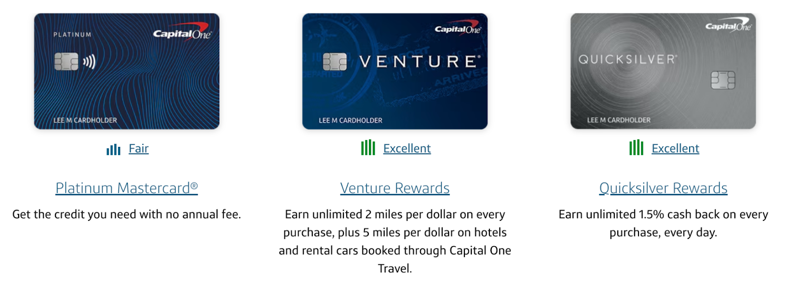
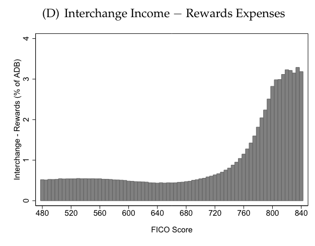
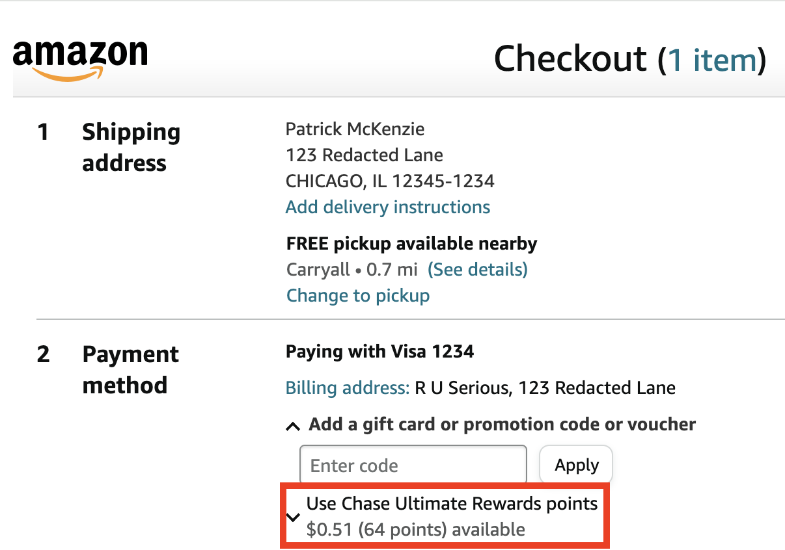

There are only a few opportunities to make a living by getting good at creating tables to facilitate high-frequency math that end-users will find entertaining but will have predictable statistical properties at scale.  

只有少数几个谋生的机会，可以通过制作表格来促进高频数学的发展，让最终用户觉得有趣，同时在规模上具有可预测的统计特性。

One of them is designing roleplaying games.  

其中之一就是设计角色扮演游戏。  

Seems like an interesting topic but someone else will have to write about it.  

这似乎是个有趣的话题，但还得由别人来写。  

In this column, the dragon sleeps on a hoard of interchange revenue, you slay him to get credit cards rewards points, and the card issuer running the game merrily chuckles at players’ misperception that they are dragons.  

在这一专栏中，"龙 "沉睡在囤积的交换费收入上，你杀死它就能获得信用卡积分，而运营游戏的发卡机构则对玩家误以为自己是 "龙 "而开心地大笑。  

No, silly, they’re much realer and much richer.  

不，傻瓜，它们更真实、更丰富。

A disclaimer off the top: I used to work at, and am still an advisor of, Stripe.  

先声明一下：我曾在 Stripe 工作，现在仍是该公司的顾问。  

A major portion of the Stripe economic model is charging businesses money to take payments on credit cards.  

Stripe 经济模式的主要部分是向企业收取信用卡付款费用。  

Stripe’s two largest costs are paying smart people and paying interchange, and of the two, one would feel a lot better to cut.   

Stripe 最大的两项成本是支付聪明人和交换费，而在这两项成本中，削减其中一项会让人感觉好很多。

Another disclaimer: Due to long-standing practice, I am (homeopathically) exposed to the common equity of financial services companies that my family uses, so that I can call up Investor Relations if I ever need to escalate a routine banking issue.  

另一个免责声明：由于长期的实践，我（顺势）接触到了我的家人所使用的金融服务公司的普通股，这样，如果我需要升级一个常规的银行问题，我就可以打电话给投资者关系部。  

My family’s main U.S. bank happens to be Chase, which is mentioned below.  

我家在美国的主要银行是大通银行，具体如下。

Almost everybody writing about credit cards on the Internet receives some sort of spiff if you sign up after clicking through tagged links in their material.  

几乎所有在互联网上撰写有关信用卡的文章的人都会在你点击他们材料中的标签链接后注册，从而获得某种好处。  

That is not my business model (people [pay me to write](https://www.bitsaboutmoney.com/memberships/) about financial infrastructure), but is probably one you want to be cognizant of every time you read about credit cards online.  

这不是我的商业模式（人们付钱让我写金融基础设施方面的文章），但可能是你每次在网上阅读有关信用卡的信息时都要注意的一个问题。

As we have [discussed previously](https://www.bitsaboutmoney.com/archive/how-credit-cards-make-money/), credit cards have multiple different ways of earning money, but the most important one to this discussion is interchange.  

正如我们之前所讨论的，信用卡有多种不同的赚钱方式，但其中最重要的是交换费。  

It is a fee, ultimately paid by the card-accepting business, which gets sliced up between various parties in the credit card ecosystem to incentivize them to put their logos in the wallets and on the phones of well-heeled customers and increase the amount they spend and the frequency with which they spend it.  

这是一笔费用，最终由接受信用卡的企业支付，由信用卡生态系统中的各方共同分担，以激励他们将自己的标识放入富裕客户的钱包和手机中，增加他们的消费金额和消费频率。  

(In industry, we sometimes distinguish interchange—which mostly goes to the issuing bank—and scheme fees—which mostly go to the credit card brand itself—but as interchange is much larger, let’s just call them both interchange for simplicity.)  

(在行业中，我们有时会区分交换费（主要归发卡银行所有）和计划费（主要归信用卡品牌本身所有）。

Interchange is generally a percentage fee based on the final transaction size plus optionally a per-transaction fee.  

交换费一般是按最终交易额的一定比例收取的费用，也可选择按每笔交易收取费用。  

You can just [look up](https://usa.visa.com/content/dam/VCOM/download/merchants/visa-usa-interchange-reimbursement-fees.pdf) the [rates](https://www.mastercard.us/content/dam/public/mastercardcom/na/us/en/documents/merchant-rates-2023-2024.pdf), but I strongly recommend you don’t, as you will be reduced to gibbering madness.  

您可以直接查询费率，但我强烈建议您不要这样做，因为您会陷入胡言乱语的疯狂之中。  

(It took many smart people many years of work before Stripe could deterministically predict almost all interchange it was charged in advance of actually getting billed for it.)  

(很多聪明人花了很多年的时间，Stripe 才能够在实际收到账单之前，确定性地预测出几乎所有被收费的交换项目）。

To highlight something which is routinely surprising for non-specialists: interchange fees are not constant and fixed.  

要强调的是，非专业人士通常会感到惊讶：交换费并不是恒定不变的。  

They are set based on quite a few factors (_gibbering madness intensifies_) but, most prominently, based on the rank of card product you use.  

它们是根据许多因素（胡言乱语的疯狂加剧）设定的，但最主要的是根据您使用的卡片产品的等级设定的。  

The more a card product is pitched to socioeconomically well-off people, the more expensive interchange is.  

越是面向社会经济条件好的人的银行卡产品，交换费就越贵。  

Credit card issuers _explicitly and directly_ charge the rest of the economy for the work involved in recruiting the most desirable customers.  

信用卡发行商明确直接向其他经济部门收取招募最受欢迎客户的费用。

The basic intuition underlying rewards cards as a product is that highly desirable customers have options in how they spend their money.  

奖励卡作为一种产品的基本直觉是，非常受欢迎的客户可以选择如何花钱。  

You can directly influence them to use your rails by making those rails more lucrative, more fun, or both for the customer.  

您可以直接影响他们使用您的轨道，让这些轨道为客户带来更多利润、更多乐趣，或两者兼而有之。  

And so card issuers (and the networks) compete with each other for so-called “share of wallet” by bidding with interchange.  

因此，发卡机构（和网络）之间通过交换费竞标来争夺所谓的 "钱包份额"。

This is not quite as sophisticated as the system of dueling robots which bids for your attention every time you open a page on the Internet with an ad on it.  

这种系统并不像决斗机器人系统那样复杂，每次你打开互联网上有广告的页面时，决斗机器人都会争夺你的注意力。  

The bids are generally speaking pretty static and made years in advance, at or before the time a user signs up for a card product, with relatively minor adjustments made over time.  

一般来说，出价都是静态的，在用户注册卡产品时或之前就已提前数年做出，随着时间的推移，调整幅度相对较小。  

Program managers at card issuers are extremely, extremely sensitive to upsetting the apple cart and churning loyal users, and so they attempt to avoid doing this except when circumstances make it unavoidable.  

发卡机构的项目经理对打乱苹果车和让忠实用户流失非常非常敏感，因此他们会尽量避免这样做，除非在不可避免的情况下。

## Why isn’t every card a rewards card?  

为什么不是每张卡都是奖励卡？

Different regions have ended up with different equilibria in the rewards game.  

不同地区在奖励博弈中的均衡点也不尽相同。  

In the United States, card acceptance is expensive and the rewards economy is _robust_.  

在美国，接受银行卡的成本很高，而奖励经济却很发达。  

In Japan, card acceptance is expensive and the rewards economy is fairly muted due to—ahem—effective collusion by issuers.  

在日本，接受银行卡的成本很高，而且由于发卡机构的有效串通，奖励经济的发展相当缓慢。  

In Europe, card acceptance is cheap by regulatory fiat and so rewards are far less common (or commonly lucrative) than in the U.S.  

在欧洲，由于监管部门的强制规定，接受银行卡的成本很低，因此奖励远没有美国那么普遍（或普遍有利可图）。

Similarly, debit card rewards used to be fairly common in the United States until the Dodd-Frank Act [capped debit card interchange](https://www.bitsaboutmoney.com/archive/debit-cards-are-hidden-financial-infrastructure/) (with a very important carveout for small banks in the Durbin amendment).  

同样，在《多德-弗兰克法案》（Dodd-Frank Act）规定借记卡交换费上限之前，借记卡奖励在美国也曾相当普遍（《多德-弗兰克法案》修正案为小型银行规定了非常重要的例外条款）。  

When interchange is regulated, the size of the pie isn’t large enough to give the end-user of the card a tasty slice, and so they get nothing.  

当交换费受到管制时，蛋糕的大小就不足以让银行卡的最终用户分得一杯羹，因此他们什么也得不到。

But we can see that, even scoping to credit cards in the United States, not every card is a rewards card.  

但我们可以看到，即使是美国的信用卡，也不是每张卡都是奖励卡。  

What explains why CapitalOne, for example, offers rewards for its Quicksilver card but not the Platinum Mastercard? Is [mercury](https://dictionary.cambridge.org/us/dictionary/english/quicksilver) attempting to burnish its image after that horrible toxicity thing?  

举例来说，CapitalOne 为什么为其 Quicksilver 卡提供奖励，而不为白金万事达卡提供奖励呢？难道水银公司在经历了那场可怕的毒性事件后，正试图提升自己的形象？

Three of Capital One's many offerings.  

Capital One 的众多产品中的三种。

Partly, this is that different users have different jobs-to-be-done for credit cards.  

部分原因是不同的用户对信用卡有不同的需求。  

(Many users of credit cards, potentially including some readers of this column, believe that they are the typical users of credit cards.  

(许多信用卡用户，可能包括本专栏的一些读者，都认为自己是信用卡的典型用户）。  

No users of credit cards are typical.)  

没有使用信用卡的用户就是典型）。

Credit cards are both a payment instrument and an access point for a revolving credit line.  

信用卡既是一种支付工具，也是循环信贷额度的接入点。  

That they are an expensive way to borrow money is one of the first things said in any personal finance text.  

任何个人理财书籍都会首先提到，这是一种昂贵的借贷方式。  

They are also one of the most accessible ways to borrow money, and that is their primary value proposition for many users, typically ones lower on the socioeconomic ladder.  

对于许多用户（通常是社会经济地位较低的用户）来说，这也是其主要价值主张。  

These users spend relatively little in a month compared to their revolving balance, which they continuously pay interest on.  

与不断支付利息的循环余额相比，这些用户一个月的支出相对较少。  

It trivially follows that most money on their accounts is earned via net interest margin and not from interchange.  

由此可见，他们账户上的大部分资金是通过净息差赚取的，而不是通过交换赚取的。

To the extent these users notice numerically defined features of their credit cards, which is somewhat dubious, it is the headline APR (cost of credit) and their credit limits.  

如果这些用户注意到信用卡的数字特征（这一点有点可疑），那就是年利率（信贷成本）和信用额度。  

“Starter” cards and other products aimed at this user group typically have no rewards; they instead use interchange income to “bid down” the headline APR.  

针对这一用户群体的 "入门卡 "和其他产品通常没有奖励，而是利用交换费收入来 "压低 "年利率。  

Interchange functions as a subsidization of the cost of credit throughout the economy by businesses which want to sell things to people who would use credit to buy things.  

交换的作用是，企业在整个经济中对信贷成本进行补贴，因为企业想把东西卖给使用信贷买东西的人。  

The limit case of this is Buy Now, Pay Later, where the cost of credit is [subsidized straight to free](https://www.bitsaboutmoney.com/archive/buy-now-pay-later/).  

这种情况的极限是 "先买后付"，即信贷成本直接补贴到免费。

The heaviest credit card _spenders_, and this fact is both uncontroversial and flies in the face of what many personal finance columnists believe, are wealthy and sophisticated.  

信用卡消费最多的人是富裕和老练的人，这一事实既没有争议，也与许多个人理财专栏作家的观点背道而驰。  

They use credit cards primarily as payment instruments.  

他们主要使用信用卡作为支付工具。  

Issuers compete aggressively for their business, which is quite lucrative.  

发行商为争夺业务而激烈竞争，利润相当丰厚。  

This is not because they pay much in interest, because while they have higher headline APRs they only rarely revolve balances.  

这并不是因为他们支付的利息多，因为虽然他们的年利率较高，但他们很少循环使用余额。  

It is because “clipping the ticket” via interchange on a high volume of transactions is an excellent business to be in.  

这是因为，通过大量交易的交换来 "剪票 "是一项非常好的业务。

How dramatic is this? Allow me to reproduce a graph from [Regulating Consumer Financial Products: Evidence from Credit Cards](https://papers.ssrn.com/sol3/papers.cfm?abstract_id=2330942).  

这有多么戏剧性？请允许我重现《监管消费金融产品》中的一张图表：来自信用卡的证据。  

(This paper is something of the Rosetta stone for credit card issuance as a field, both in that it is a single source for understanding a huge range of human endeavor and in that it stands in for a very large literature that nobody else reaches for to be the first citation when the Rosetta Stone already exists.  

(这篇论文堪称信用卡发行领域的 "罗塞塔石碑"（Rosetta Stone），因为它是了解人类大量工作的唯一资料来源，而且它代表了大量文献，当 "罗塞塔石碑 "已经存在时，没有其他人会首先引用它。  

If you see an unlabeled graph on Twitter about credit cards, it was probably lifted from this paper.)  

如果您在 Twitter 上看到一张关于信用卡的无标签图表，很可能就是从这篇论文中摘录的）。  

Interchange income net of rewards expenses heavily favors high FICO users.  

扣除奖励支出后的交换费收入对高 FICO 用户非常有利。

As you can see, as a percentage of Average Daily Balance (ADB), even after rewards expense, interchange gets very sharply more lucrative at the top of the credit score distribution (740+, which is roughly 10% of accounts). The difference is _actually larger than you see here_, since credit lines and ADB also increase with credit score, for predictable reasons.  

如您所见，即使扣除奖励费用后，交换费在日均余额（ADB）中所占的百分比在信用评分分布最高的账户（740 分以上，约占 10%）中也会变得非常有利可图。由于信用额度和 ADB 也会随着信用评分的提高而提高，因此这种差异实际上比您在这里看到的要大。  

(Rich people consume more than poor people on an absolute basis, film at eleven.)  

(按绝对值计算，富人比穷人消费更多，影片为 11）。

## The complexity spectrum of rewards products  

奖励产品的复杂性

The simplest reward products are straight “cashback”.  

最简单的奖励产品是直接 "返现"。  

The issuer totals up all of one’s net purchases (all purchases less refunds) in a statement period.  

发卡机构将个人在账单期间的所有净消费（所有消费减去退款）合计起来。  

It then credits the user with a particular percentage of that for each statement.  

然后，用户可以从每份报表中按一定比例获得贷记。  

Either automatically or periodically at the user’s request, it transforms some of that notional banked credit into a statement credit, decreasing the amount the user needs to pay to cover their purchases in the current month.  

在用户的要求下，它可以自动或定期将部分名义上的银行信贷转化为账单信用额度，从而减少用户当月需要支付的购物金额。

This is as simple as it gets and we’re already necessarily handwaving away libraries worth of complexity.  

这已经是最简单的了，而我们却要把图书馆的复杂性一笔勾销。  

(For example, calculation of net purchases needs to be fairly robust against adversarial collaboration of users and merchants or the issuer gets turned into a money pump within a matter of days and will not likely be able to detect or reverse this condition for at least several weeks.  

(例如，净购买额的计算必须相当稳健，以防止用户和商家的恶意合作，否则发行商在几天内就会变成 "抽水机"，而且至少在几周内无法发现或扭转这种情况）。  

This has happened many, many times.  

这种情况已经发生过很多次了。  

Credit card issuers, when they screw this up, lose millions of dollars and dry their tears on money.)  

信用卡发行商一旦搞砸，就会损失数百万美元，欲哭无泪）。

Anyhow, in the mists of history, that percentage started flat; typically, 1%.  

总之，在历史的迷雾中，这个百分比开始时是持平的，通常是 1%。  

The math supporting this is typically fairly simple: take in 140bps as revenue, pay the user 100 bps as effectively a cost of customer acquisition, keep some portion of 40 bps as one’s margin.  

支持这种做法的数学计算通常相当简单：将 140 个基点作为收入，向用户支付 100 个基点作为获取客户的有效成本，保留 40 个基点中的一部分作为自己的利润率。

In nations other than ones with effective cartel-like behavior by issuers, this equilibrium was not stable, because competing issuers would bid e.g.  

除了发行商存在有效的卡特尔式行为的国家外，其他国家的这种均衡并不稳定，因为竞 争性发行商会出价，例如  

1.25% cash back on the same underlying economics and compete for share of wallet.  

1.25% 的现金返还是基于相同的经济基础，并争夺钱包份额。  

This happened extremely robustly, for decades.  

几十年来，这种情况发生得极为频繁。

One iteration of this game was cash back “categories”.  

这个游戏的一个版本是现金返还 "类别"。  

Particularly post-Internet, certain cohorts of customers were most interested in the headline cashback percentage rate.  

特别是在互联网时代之后，某些客户群体最感兴趣的是现金返还百分比。  

Issuers began to design products which were more complicated, such as “1% cash back in principle, however, 1.5% cash back at gas stations.”  

发行商开始设计更复杂的产品，比如 "原则上返现 1%，但在加油站返现 1.5%"。

## A fun rabbit hole about credit card acceptance  

关于信用卡受理的有趣兔子洞

A huge percentage of all credit cards are “co-branded”; they are issued by a financial institution but bear the name of some other institution which inspires a lot of loyalty.  

在所有信用卡中，有很大一部分是 "联名卡"；它们由一家金融机构发行，但冠以其他一些机构的名称，从而激发了客户的忠诚度。  

A teeny, tiny percentage of co-branded cards name e.g. tertiary educational institutions.  

只有极少数联名卡冠以高等教育机构等名称。  

Most name a business that a customer has an intense, ongoing relationship with: Costco, their airline of choice, etc.  

大多数人都会说出一个与顾客有密切、持续关系的企业：好市多、他们选择的航空公司等。

Co-branded cards are _extremely_ big business.  

联名卡是一门非常大的生意。  

One subtlety about them: a co-branded card will often have a special rewards tier for the business named on the card.  

其中一个微妙之处是：联名卡通常会为卡上指定的企业设置一个特殊的奖励等级。  

This is partially that business choosing, as a marketing expense, to split some of their core margin with their most loyal customers (_overwhelmingly_ the target audience for the co-branded card).  

部分原因是企业选择将部分核心利润分给最忠实的客户（绝大多数是联名卡的目标客户），作为营销费用。  

But, surprisingly to many non-specialists, that is not the sole source of margin to reward cardholders with.  

但让许多非专业人士感到意外的是，这并不是奖励持卡人的唯一利润来源。

This is because, at the scale of the largest businesses in the world, financial services are cross-sold and structurally interconnected.  

这是因为，在全球最大的企业中，金融服务是交叉销售的，在结构上是相互关联的。  

There is one team in a bank (it happens to be Chase, for what it is worth) attempting to capture Starbuck’s card processing business.  

有一家银行（恰好是大通银行）的一个团队试图抢占星巴克的银行卡处理业务。  

There is another team that wants to convince Starbucks to co-brand Chase card products.  

还有一个团队希望说服星巴克联合推出大通卡产品。  

These two teams _can talk to each other_ prior to making proposals to Starbucks.  

在向星巴克提出建议之前，这两个团队可以互相交流。

And so, without knowing anything about the payments industry, you can speculate with a very high degree of confidence that Starbucks has received a complicated spreadsheet saying what Chase will charge it for every conceivable type of credit and debit card that wants a latte.  

因此，在对支付行业一无所知的情况下，你可以非常有把握地推测，星巴克已经收到了一份复杂的电子表格，上面列明了大通对每一种想要一杯拿铁的信用卡和借记卡收取的费用。  

A prominent negotiated line on that spreadsheet includes, effectively, a major discount for “on us” transactions: when Chase’s left hand needs to move money from Chase’s right hand because someone wants to pay Starbucks money for their Starbucks using their Starbucks-branded money.  

在该电子表格上，有一条显眼的协商线，实际上是为 "本行 "交易提供的大折扣：当大通银行的左手需要从大通银行的右手调钱时，因为有人想用星巴克品牌的钱支付星巴克的钱。  

(This is easy to conflate with, and is separate from, Starbucks’ extremely impressive stored-value product. _That_ probably mostly [cannibalized](https://www.nerdwallet.com/article/credit-cards/chase-to-sunset-starbucks-credit-card-convert-users-to-freedom-cards) their credit product, which… alright, we have to stop the levels of digression somewhere or we’ll be here all day.)  

(这很容易与星巴克令人印象深刻的储值产品混为一谈，而且两者是分开的）。这可能在很大程度上蚕食了他们的信贷产品，而信贷产品......好吧，我们必须在某个地方停止离题，否则我们会在这里呆上一整天）。

Because “on us” is structurally cheaper (the transaction literally travels over fewer rails and therefore there are fewer “mouths to feed”) and because it is incentive compatible for all parties to subsidize these transactions, as a card program designer, you have a relatively easy time being generous with regards to this particular cell of your spreadsheet.  

由于 "在我们这里 "在结构上更便宜（交易在较少的轨道上进行，因此 "需要养活的人 "也更少），而且补贴这些交易对所有各方都有激励作用，因此作为银行卡计划的设计者，在电子表格的这一特定单元上可以相对轻松地慷慨解囊。

## Back to more complicated cases  

回到更复杂的案例

So imagine you’re the card program designer for a card that, like most cards, does not have a particular named business happily subsidizing your users.  

想象一下，你是一张卡片的程序设计员，和大多数卡片一样，这张卡片没有特定的指定企业乐意为你的用户提供补贴。  

You desire to quote a headline cashback number much higher than 1%.  

您希望报出一个比 1%高得多的现金返还数字。  

But you’d still like to keep some margin from interchange. What could you do?  

但您还是想从交换中保留一些余地。你能怎么办？

One is you make the headline number larger but contingent on something.  

一是把标题数字做大，但要视情况而定。  

Say, for example, the card rebates 1.5%, but only for… bookstores. Any bookstore.  

比如说，该卡返利 1.5%，但仅限于......书店。任何书店。  

For all other transactions, it is 1%.  

对于所有其他交易，则为 1%。

The thing you would love with this offering is to preferentially attract people who are _very emotionally invested in being readers_ and who spends _very little of her on-this-card wallet on books_. The emotional investment in the story the card offers brings the customer in; the _blended_ cost to acquire the customer is closer to 1% industry standard and not to the 1.5% headline number.  

这种产品最吸引人的地方在于，它能优先吸引那些对阅读非常投入感情的人，而这些人很少把钱包里的钱花在书本上。对这张卡所提供的故事的情感投入会吸引顾客；获得顾客的混合成本更接近 1%的行业标准，而不是 1.5% 的标题数字。

Money is fungible, money is fungible, money is fungible, but many people don’t actually orient their lives as if this were true, and so the financial industry meets them where they are and then charges them for the privilege.  

钱是可替代的，钱是可替代的，钱是可替代的，但许多人并没有真正把自己的生活定位为可替代的，因此金融业满足了他们的需求，然后向他们收取费用。  

This user values a dollar more when it is a books-dollar than when it is a food-dollar.  

该用户更看重书本上的一美元，而不是食品上的一美元。  

You, a credit card program manager, can math out a way to get her as many books-dollars as she is interested in.  

你作为信用卡项目经理，可以想出一个办法，只要她感兴趣，就能为她争取到尽可能多的书币。  

(This is similar, in spirit, to how Bryrne Hobart [describes](https://marker.medium.com/why-the-survival-of-the-airlines-depends-on-frequent-flyer-programs-2509bd3f25d0) airline frequent flyer programs as working.  

(在精神上，这与 Bryrne Hobart 描述航空公司常旅客计划的运作方式类似）。  

One key difference that credit card program managers have to understand: a source of advantage for frequent flyer miles as a pseudocurrency is that they can turn very-low-marginal-cost inputs, unsold seats, into very-high-perceived-marginal-benefit outputs, “free vacations”.  

信用卡计划管理者必须了解的一个关键区别是：飞行常客里程作为一种伪货币，其优势在于可以将边际成本极低的投入--未售出的座位--转化为边际收益极高的产出--"免费假期"。  

Books-dollars may very well be worth more than a dollar to our target user here, but books-dollars are very difficult to manufacture in quantity for less than about 98ish cents.)  

对于我们的目标用户来说，书本美元的价值很可能超过一美元，但书本美元很难以低于 98 美分的价格大量生产）。

In principle, you could even offer _more_ than your direct interchange revenue as the headline number, if you were very, very sure that your typical user would not preferentially use your card only to buy books and use a competitor’s card to buy groceries, gasoline, medicine, and similar.   

原则上，如果你非常非常确定，你的典型用户不会只用你的卡买书，而用竞争对手的卡买日用品、汽油、药品等类似物品，那么你甚至可以提供比直接交换费收入更高的数字作为标题数字。

Now, unfortunately, remember what we said about typical credit card users? That’s _right_. They don’t exist.  

现在，不幸的是，还记得我们说过的典型信用卡用户吗？没错。他们并不存在。  

Very many of your users will do what you want them to, and use the card in a perfectly-acceptable-but-not-exactly-optimal fashion, and you will have a blended cost very near 1% for them.  

很多用户都会按照你的要求，以一种完全可以接受但并不完全理想的方式使用卡片，而你为他们支付的混合成本将非常接近 1%。  

And very many of your users will do exactly what you most don’t want, and use the card _only_ to buy books.  

很多用户会做你最不想做的事，只用这张卡买书。

This is… far less incentive compatible for you, particularly if you decided that the business of manufacturing books-dollars was so lucrative that you could rebate more than the direct interchange revenue given mix effects.  

这对你来说......就不那么具有激励性了，特别是如果你认为制造书币的业务利润丰厚，考虑到混合效应，你可以返还比直接交换收入更多的钱。  

These users will have blended costs very close to your headline number, not to your modeled blended costs.  

这些用户的混合成本将非常接近您的标题数字，而不是您的混合成本模型。

These users will even band into tribes, find each other on the Internet, and [swap tips](https://www.reddit.com/r/churning/) for exploiting poor, defenseless credit card program managers like yourself.  

这些用户甚至会结成部落，在互联网上互相寻找，并交换利用像你这样手无寸铁的可怜信用卡项目经理的诀窍。  

The tribal elders will eventually run businesses, with names like [The Points Guy](https://thepointsguy.com/), which eventually get quietly acquired by very sophisticated private equity firms. Those PE firms are betting that you continue paying generous per-signup affiliate commissions to Internet properties which send you new card users.  

部落长老们最终会经营起像 "积分小子"（The Points Guy）这样的企业，这些企业最终会被非常成熟的私募股权公司悄悄收购。这些私募股权公司的赌注是，你将继续向为你输送新卡用户的互联网公司支付丰厚的每次注册联盟佣金。  

You bet you will also paying tens of millions of dollars annually to Frequently Adversely Selected New Accounts Dot Com.  

你肯定也会每年向频繁逆向选择新客户 Dot Com 公司支付数千万美元。  

And Redditors bet they will continue chortling that they have pulled one over on you, because haha, you’re not nearly as good as they are at fourth grade math or keeping spreadsheets.  

Redditors 敢打赌，他们会继续喋喋不休，说他们已经把你打败了，因为哈哈，你的四年级数学或电子表格的保存能力还不如他们呢。

The biggest difference between you and a Redditor is not ability to do fourth grade math or ability to do spreadsheets.  

你和 Redditor 最大的区别不是四年级的数学能力，也不是做电子表格的能力。  

Redditors are frequently _sophisticated_ with their spreadsheets; many of them could clearly earn three orders of magnitude more from the financial industry if they stopped thinking that the right way to monetize spreadsheet skill was in gaming credit card signup bonuses.  

Redditors 经常精通电子表格；如果他们不再认为电子表格技能的正确货币化方式是游戏信用卡注册奖金，他们中的许多人显然可以从金融业赚取更多的钱。

The biggest difference is that you’re optimizing _over portfolios, over time_ and Redditors are largely playing in single player mode (and frequently over short horizons).  

最大的区别在于，你是随着时间的推移对投资组合进行优化，而 Redditors 主要是在单人模式下进行游戏（而且经常是短期游戏）。  

You only care about single or dual player mode to the extent that you avoid obviously degenerate offerings where adverse selecting single players quickly dominate your entire book of business.  

你只关心单人或双人模式，以避免出现明显堕落的产品，在这种情况下，不利于选择的单人玩家很快就会主宰你的全部业务。  

Which is _very much a risk_, which is why the bank has smart people like you keeping spreadsheets.  

这是很有风险的，所以银行才会让像你这样聪明的人来保存电子表格。

The Redditors think failure modes for the bank sound like [pudding guy](https://www.huffpost.com/entry/david-philipps-pudding-guy-travel-deals_n_577c9397e4b0a629c1ab35a7). Pudding guy, was, of course, one of the highest-ROI ad buys in the history of capitalism.  

Redditors 认为银行的失败模式听起来像 "布丁男"。当然，"布丁男 "是资本主义历史上投资回报率最高的广告之一。

## Further refinements in cat and mouse games  

进一步完善猫鼠游戏

But, just like lotteries have to keep reskinning the random number generators or the games get stale and ticket sales go down, credit card program managers have to periodically shake things up for something to cut through their adversaries’ built-in distribution networks and massive, massive marketing budgets.  

但是，就像彩票必须不断更换随机数生成器，否则游戏就会变味，彩票销量就会下降一样，信用卡项目管理人员也必须定期进行调整，以突破对手固有的分销网络和庞大的营销预算。

One innovation, now 20+ years old, was a _rotating_ favored category for cash-back.  

其中一项创新现已有 20 多年的历史，那就是现金返还类别的轮流优惠。  

So instead of being 1.5% for bookstores 1% all else, it would be 1.5% for groceries in Q1, for gas in Q2, etc etc.  

因此，书店的 1.5% 税率不是其他所有税率的 1%，而是第一季度杂货店的 1.5%，第二季度汽油的 1.5%，等等等等。

The theory behind this was pretty simple: many customers attracted by the headline number could be brought in the door by it but would be fairly inattentive after a card was their new “top of wallet” (the default card for spending).  

这背后的理论非常简单：许多被头条新闻吸引的顾客可以通过头条新闻进门，但当一张卡成为他们新的 "钱包之首"（消费的默认卡）后，他们就会变得相当不专心。  

Over time, a combination of inattentiveness, changing willingness to spend time playing the game, and rewards caps would bring the portfolio’s cost of rewards close to the baseline and not to the headline reward number.  

随着时间的推移，注意力不集中、愿意花时间玩游戏的意愿改变以及奖励上限等因素的综合作用，会使投资组合的奖励成本接近基线，而不是标题奖励数字。

If for some reason playing this game interests you, one prominent product is called the Chase Freedom card.  

如果出于某种原因，您对这种游戏感兴趣，那么有一种著名的产品叫做大通自由卡。  

It should not be an attractive product for you, given plausible assumptions about the readership of this column, but it is an attractive _enough_ product that probably millions of Americans use it.  

根据对本专栏读者群的合理假设，这对你来说应该不是一个有吸引力的产品，但它是一个足够有吸引力的产品，可能有数百万美国人在使用它。

## Giving the customer more choices more frequently  

更频繁地为客户提供更多选择

If you were hypothetically to have spent the last few years dining with relatively well-off people in SFBA, when it came time to pay for dinner you’d see two credit card products with a combined 90%+ share: Chase Sapphire Reserve (CSR) and an interchangeable American Express card.  

如果假设你在过去几年里与 SFBA 相对富裕的人共进晚餐，那么在支付晚餐费用时，你会看到两种信用卡产品的份额合计超过 90%：Chase Sapphire Reserve (CSR) 和一张可互换的美国运通卡。  

This, ahem, includes many diners who are professionally connected to upstart payment methods.  

这其中包括许多与新兴支付方式有专业联系的食客。

American Express, for a very long time, had an almost mortal lock on the top end of the credit card market.  

在很长一段时间里，美国运通几乎牢牢占据了信用卡市场的高端市场。  

Chase attempted to disrupt that in 2016 by _very overtly_ attempting to buy away their core customer.  

2016 年，大通试图通过非常公开地试图买走他们的核心客户来打破这一局面。  

You can read lots in other places about the original promotion, generally tsk-tsking about how absurdly lucrative it was for customers and how it caused Chase to have a (temporary) loss associated with their cards business.  

你可以在其他地方读到很多关于最初促销活动的信息，一般都是啧啧称奇，说它给客户带来了多么荒唐的利润，以及它如何导致大通银行的银行卡业务出现（暂时性的）亏损。  

Personally, I think it was one of the most interesting strategic moves in the last 20 years of retail banking, but a full essay on that would require some other-than-public knowledge as to the size of the tsunami that happened after it.  

我个人认为，这是近 20 年来零售银行业最有趣的战略举措之一，但要写一篇关于这一点的完整文章，还需要对之后发生的海啸的规模有一定的了解。

One thing that is public but not well appreciated: Chase didn’t just _decide_ to create an extremely lucrative-for-the-customer offering out of the goodness of their hearts and out of their own P&L.  

有一点是公开的，但却没有得到很好的理解：大通并不是出于善意和自身损益的考虑，才决定为客户提供利润丰厚的产品。  

No, they _pitched Visa on this idea_.  

不，是他们给维萨出的主意。  

For too long, Visa, you have watched your competitor American Express outcompete every issuer in the Visa system for the best wallets in the world.  

长期以来，Visa 一直眼睁睁地看着自己的竞争对手美国运通击败 Visa 系统中的所有发卡机构，争夺世界上最好的钱包。  

They can do that because they can afford to, because American Express charges systematically higher interchange rates than Visa does even at its topmost tier.  

美国运通之所以能做到这一点，是因为他们能负担得起，因为美国运通收取的交换费率即使在最高级别也比 Visa 高。  

Visa, you should _create a new tier_ where your not-exactly-chosen champions can try to spend those interchange dollars to give American Express a run for their money.  

威士卡，你应该创建一个新的层级，让你的那些并不完全被选中的冠军们可以尝试用这些交换费来给美国运通一个下马威。

And, lo, Visa _did_ create a new tier.  

瞧，Visa 确实创建了一个新的层级。  

You can expose yourself to gibbering madness if you want to know what the name for it is.  

如果你想知道它的名字是什么，你可以让自己陷入胡言乱语的疯狂之中。  

But Chase got Visa to authorize Chase charging almost the entire economy more for credit card acceptance with the specific goal of outcompeting American Express for the most lucrative highest-monthly-spend virtually-never-revolve-a-balance credit card users.  

但大通却让 Visa 授权大通对几乎整个经济体收取更高的信用卡受理费，其具体目标是超越美国运通，争夺利润最丰厚、月消费额最高、几乎从不翻本的信用卡用户。

That was _part_ of what made the numbers work.  

这也是这些数字发挥作用的部分原因。

Another part is that the CSR offers a fairly complicated rewards scheme, with a lot of opportunities for people to pick things which feel great but are not optimal.  

另一个原因是，企业社会责任提供了一个相当复杂的奖励计划，人们有很多机会去选择那些感觉很好但并非最佳的东西。  

For example, Chase will let you cash out CSR points on a 1:1 basis at either Amazon or Apple, integrated directly into the checkout flows.  

例如，大通银行将允许您在亚马逊或苹果公司以 1:1 的方式兑现 CSR 积分，并直接集成到结账流程中。  

Those _feel great_.   

这些感觉很棒。

This image has been edited to remove private information and to highlight, in red, the offering.  

本图片经过编辑，删除了私人信息，并用红色标注了祭品。

People _love_ Amazon and Apple and they love free Amazon and free Apple even more.  

人们喜欢亚马逊和苹果，他们更喜欢免费的亚马逊和免费的苹果。  

This is true even among a portion of very sophisticated, wealthy, numerate CSR users, who love this idea so much they click a button designed for suckers.  

即使在一部分非常成熟、富有、精于计算的 CSR 用户中也是如此，他们非常喜欢这个想法，以至于点击了专为傻瓜设计的按钮。

Why is that a sucker’s checkout button?  

为什么这是一个傻瓜结账按钮？  

Because CSR also includes a feature called Pay Yourself Back which in the past prominently, and today a bit… less prominently, lets you cash out rewards at better than 1:1. You get a 25% bonus if you Pay Yourself Back by nominating past transactions at grocery stores: 10,000 points gets you $125 in statement credits if you are willing to do a trivial amount of clicking to show Chase $125+ in spend at grocery stores.  

因为 CSR 还包括一项名为 "Pay Yourself Back "的功能，它可以让您以优于 1:1 的比例兑现奖励，这在过去非常突出，而今天则有点......不那么突出。如果你提名过去在杂货店的交易，就可以获得 25% 的奖励：如果您愿意做一些微不足道的点击来显示大通在杂货店的 125 美元以上的消费，那么 10,000 点积分可以让您获得 125 美元的账单积分。

Stating the obvious: Chase knows what a computer is and does not require you to actually identify your purchases at grocery stores.  

显而易见的是：大通知道什么是电脑，不需要你实际识别在杂货店的购物。  

This is a product decision to both a) force you to use your card at grocery stores and b) force yourself to say “Chase is getting me free groceries!  

这是一项产品决策，目的是：a）迫使您在杂货店使用您的银行卡；b）迫使您自己说 "大通银行让我免费获得杂货"！  

How nice of them!” on a transaction-by-transaction level once a month to use your card optimally.  

他们真好！"每月一次逐笔交易，以最佳方式使用您的银行卡。

There are many, many other sucker buttons.  

还有很多很多其他的吸盘按钮。

But, because the card is fundamentally targeted at rich, sophisticated people, Chase really does pay out a shedload of rewards.  

但是，由于该卡的基本目标客户是有钱人和成熟人士，因此大通银行确实会支付大量的奖励。  

The 3% headline rate for travel and dining plus the 25% Pay Yourself Back kicker means there is a sustained and trivial pathway to get 375 bps out, which is one of the very, very, very few places in the industry where there is a sustained, trivial, uncapped way to get out more than the direct cost of interchange.  

3% 的旅行和餐饮总费率加上 25% 的 "还本付息 "优惠，意味着有一个持续的、微不足道的途径可以获得 375 个基点的收益，这也是业内极少数有持续的、微不足道的、不封顶的途径可以获得超过直接交换费的收益。

Why does this persist?  

为什么这种情况持续存在？  

Partly it is due to the standard credit card portfolio strategy: every time someone uses a CSR on Amazon (and not e.g.  

部分原因在于标准的信用卡组合策略：每当有人在亚马逊上使用企业社会责任（而不是在亚马逊上使用企业社会责任，比如  

the Amazon rewards card, also from Chase) or uses CSR points to buy [high-margin white plastic](https://www.apple.com/), Chase’s contribution margin for the portfolio goes up, and at scale _quite a large percentage_ of customers do this.  

如果客户使用大通银行的亚马逊积分卡（也是大通银行的）或使用 CSR 积分购买高利润的白色塑料卡，那么大通银行对该产品组合的贡献率就会上升，而在一定规模内，相当大比例的客户都会这样做。

Partly it is due to Chase thinking that they’ll just _be so good_ for their target customer that their target customer _will not bother playing the game optimally._ That would require the customer carefully maintaining a portfolio of credit relationships and having seven cards saved on their iPhone and not, simply, the CSR.  

部分原因是大通认为，他们会对目标客户很好，以至于目标客户不会费心去玩这个游戏。这就需要客户精心维护信贷关系组合，在 iPhone 上保存七张卡，而不是简单地保存 CSR。

Partly it is due to the really interesting strategic reasons for having CSR available: to a much larger degree than American Express, Chase is a diversified financial services empire.  

部分原因是大通拥有企业社会责任的战略原因非常有趣：大通是一个多元化的金融服务帝国，其规模远远超过美国运通。  

The CSR was effectively designed as a wedge product to get something Chase branded into the hands of affluent up-and-coming young urban professionals, with the goal of eventually getting them to not move just their wallet but their entire financial existence (and potentially their current-or-future _entities’_ financial existences) onto Chase.  

企业社会责任实际上是一种楔形产品，目的是让富裕的新兴城市年轻专业人士接触到大通品牌的产品，最终让他们不仅将自己的钱包转移到大通，还将他们的整个财务（以及可能是他们现在或未来实体的财务）转移到大通。

The Sapphire mini-brand was so loved that they reused it for a bog-standard premium checking account.  

蓝宝石 "迷你品牌深受人们喜爱，因此他们将其重新用于普通的高级支票账户。  

(It was named the Chase Sapphire Premium Checking Account, in a decision which probably consumed several tens of millions of dollars of professional effort, and I mean that absolutely descriptively and not as a criticism.  

(它被命名为 "大通蓝宝石高级支票账户"，这一决定可能耗费了数千万美元的专业精力，我的意思绝对是描述性的，而不是批评。  

I was not in _that_ meeting… but I’ve been in that _kind_ of meeting.  

我没有参加那次会议......但我参加过这种会议。  

Those that have been in it know that it is not in any way a single-meeting single-decisionmaker sort of call.)  

参加过这种会议的人都知道，这种会议绝不是单一会议、单一决策者的会议。）

## More directions to go in  

更多方向

The blessing and curse of essays is that they have to end somewhere, and then pick up anew somewhere else.  

散文的好处和坏处在于，它们必须在某个地方结束，然后在其他地方重新开始。  

Hopefully the above gives you a bit more context on what is in your wallet.  

希望以上内容能让您更清楚地了解钱包里有什么。

In the future, we'll likely discuss the complicated iterated game played by the credit card networks and the rest of society regarding interchange rates, how there are high-interchange-high-reward equilibria and low-interchange-low-reward equilibria, the recent settlement where the networks agreed to temporarily decrease interchange, and other topics.  

今后，我们可能会讨论信用卡网络和社会其他群体在交换费率方面的复杂反复博弈、高交换费-高回报均衡点和低交换费-低回报均衡点的存在方式、最近信用卡网络同意暂时降低交换费率的和解协议以及其他话题。

## Want more essays in your inbox?  

想在收件箱中收到更多文章？

I write about the intersection of tech and finance, approximately biweekly. It's free.  

我大约每两周撰写一篇关于科技与金融交叉领域的文章。它是免费的。
